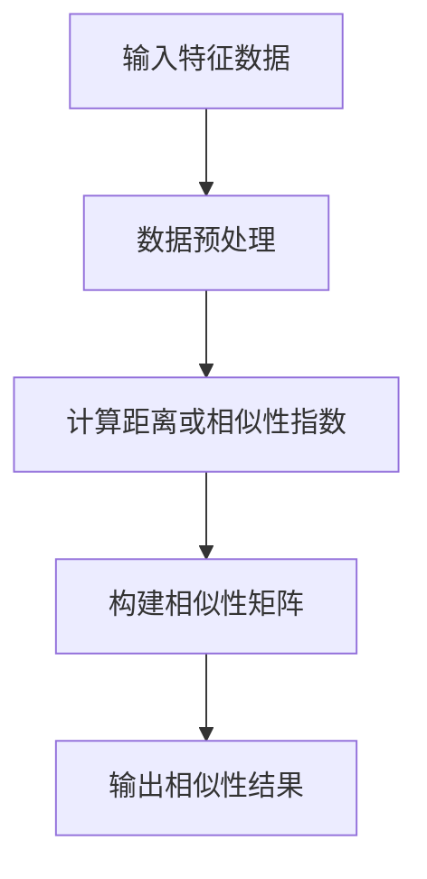

                 

### 《家族相似性》

> 关键词：家族相似性、系统理论、社会心理学、生物学、信息技术

> 摘要：本文旨在深入探讨家族相似性的概念、理论基础、应用领域以及未来展望。通过逐步分析，本文揭示了家族相似性在各个领域中的重要性和广泛的应用价值，为研究人员和开发者提供了有价值的参考。

----------------------------------------------------------------

### 《家族相似性》目录大纲

----------------------------------------------------------------

# 第一部分：引论

## 第1章：家族相似性的概念与重要性

### 1.1.1 家族相似性的定义与特征

### 1.1.2 家族相似性的分类与层次

### 1.1.3 家族相似性研究的背景与意义

## 第2章：家族相似性的理论基础

### 2.1.1 家族理论的发展历程

### 2.1.2 家族相似性与系统理论

### 2.1.3 家族相似性与社会心理学

## 第3章：家族相似性的应用领域

### 3.1.1 家族相似性在生物学中的应用

### 3.1.2 家族相似性在社会科学中的应用

### 3.1.3 家族相似性在信息技术中的应用

# 第二部分：核心概念与原理

## 第4章：家族相似性的核心概念

### 4.1.1 家族相似性矩阵

### 4.1.2 家族相似性指数

### 4.1.3 家族相似性距离

## 第5章：家族相似性的数学模型

### 5.1.1 家族相似性的基本数学公式

### 5.1.2 家族相似性的矩阵表示

### 5.1.3 家族相似性的计算方法

## 第6章：家族相似性的算法原理

### 6.1.1 距离度量算法

### 6.1.2 相似性度量算法

### 6.1.3 算法流程与Mermaid流程图

# 第三部分：案例分析

## 第7章：生物学中的家族相似性案例

### 7.1.1 家族相似性在物种分类中的应用

### 7.1.2 家族相似性在基因序列分析中的应用

### 7.1.3 案例分析：生物信息学中的家族相似性研究

## 第8章：社会科学中的家族相似性案例

### 8.1.1 家族相似性在社会网络分析中的应用

### 8.1.2 家族相似性在群体行为研究中的应用

### 8.1.3 案例分析：社会网络中的家族相似性研究

## 第9章：信息技术中的家族相似性案例

### 9.1.1 家族相似性在文本分析中的应用

### 9.1.2 家族相似性在图像处理中的应用

### 9.1.3 案例分析：信息技术领域的家族相似性研究

# 第四部分：总结与展望

## 第10章：家族相似性的现状与未来

### 10.1.1 家族相似性研究的现状

### 10.1.2 家族相似性研究的发展趋势

### 10.1.3 家族相似性研究面临的挑战与机遇

## 第11章：家族相似性的应用前景

### 11.1.1 家族相似性在其他学科领域的应用

### 11.1.2 家族相似性的产业应用

### 11.1.3 拓展家族相似性研究的可能方向

----------------------------------------------------------------

### 第1章：家族相似性的概念与重要性

#### 1.1.1 家族相似性的定义与特征

家族相似性是指在生物个体或群体之间，由于遗传、文化、行为等方面存在一定的相似性。这种相似性可以体现在不同层次上，如基因层次、表型层次、行为层次等。

家族相似性具有以下特征：

1. 继承性：家族相似性在一定程度上受到遗传因素的影响。例如，父母与子女之间的基因相似性较高，表明遗传因素在家族相似性中起到重要作用。
2. 适应性：家族相似性有助于个体或群体更好地适应环境。例如，在特定环境中，具有相似特征的个体或群体更可能存活和繁衍。
3. 多样性：家族相似性在不同物种、不同群体中具有不同的表现形式。例如，在人类社会，文化传承和宗教信仰等因素构成了家族相似性的重要组成部分。

#### 1.1.2 家族相似性的分类与层次

家族相似性可以按照不同的标准进行分类，例如：

1. 按照层次划分：基因层次、表型层次、行为层次等。
   - **基因层次**：个体之间的基因相似性，反映了家族关系的遗传基础。
   - **表型层次**：个体在形态、生理和行为特征上的相似性，反映了家族关系的适应性和多样性。
   - **行为层次**：个体在社会行为和习惯上的相似性，反映了家族关系的文化传承。
   
2. 按照性质划分：遗传相似性、文化相似性、行为相似性等。
   - **遗传相似性**：基于个体基因序列的相似度，通常通过遗传图谱进行分析。
   - **文化相似性**：基于个体或群体在文化传统、价值观和行为规范上的相似性，通常通过问卷调查和社会调查进行分析。
   - **行为相似性**：基于个体在社会行为和习惯上的相似性，通常通过行为观测和数据分析进行分析。

3. 按照关系划分：家族内相似性、家族间相似性、物种间相似性等。
   - **家族内相似性**：家族成员之间的相似性，通常通过家谱分析和基因测序进行分析。
   - **家族间相似性**：不同家族之间的相似性，通常通过社会网络分析和跨文化研究进行分析。
   - **物种间相似性**：不同物种之间的相似性，通常通过生物分类学和进化生物学进行分析。

#### 1.1.3 家族相似性研究的背景与意义

家族相似性研究起源于生物学领域，旨在探究生物个体或群体之间的相似性。随着研究的发展，家族相似性逐渐扩展到社会科学、信息技术等领域。

**背景**：

1. 生物学背景：家族相似性研究最初是在生物学领域发展起来的，特别是在遗传学和进化生物学中具有重要地位。遗传学家通过研究家族相似性，揭示了基因在遗传信息传递和生物进化中的作用。
2. 社会科学背景：家族相似性在社会心理学、社会学、人类学等领域也具有重要研究价值。社会学家通过研究家族相似性，揭示了社会关系和文化传承对个体行为和群体发展的影响。
3. 信息技术背景：随着信息技术的发展，家族相似性在计算机科学和人工智能领域也得到了广泛应用。计算机科学家通过研究家族相似性，开发了用于数据挖掘、模式识别和机器学习等方面的算法和工具。

**意义**：

1. 理论意义：家族相似性研究有助于深入理解物种进化、人类社会、信息技术等领域的基本规律。通过研究家族相似性，可以揭示个体和群体之间的内在联系和相互作用，为相关领域提供理论基础。
2. 实践意义：家族相似性研究可以为生物学、社会科学、信息技术等领域的应用提供有益的指导。例如，在医学领域，家族相似性研究有助于发现疾病的遗传风险因素，为疾病预防和治疗提供科学依据；在商业领域，家族相似性研究有助于分析市场趋势和消费者行为，为企业决策提供支持；在人工智能领域，家族相似性研究有助于提高机器学习算法的性能和效率，为智能系统的开发提供技术支持。

#### 1.2 家族相似性与系统理论

家族相似性理论与系统理论有着密切的联系。系统理论认为，系统是由相互关联的元素组成的整体，具有特定的功能和行为。家族相似性理论则强调个体或群体之间的相似性，这种相似性构成了系统的基本结构。

**系统理论**：

1. 系统的组成：系统由多个元素组成，每个元素都具有一定的功能和特性。这些元素之间相互关联，共同构成了系统的整体。
2. 系统的功能：系统具有特定的功能，能够完成特定的任务。系统的功能是由其结构和组成元素相互协作实现的。
3. 系统的演化：系统会随着时间的推移而演化，适应环境和需求的变化。系统的演化是通过内部结构和外部环境之间的相互作用实现的。

**家族相似性理论**：

1. 家族相似性：家族相似性是指个体或群体之间的相似性，这种相似性可以体现在基因、表型、行为等多个层次上。家族相似性构成了系统的基本结构，反映了个体和群体之间的内在联系。
2. 系统的演化：家族相似性在系统演化过程中发挥着重要作用。通过家族相似性，个体和群体能够更好地适应环境，实现系统的稳定和进化。

**关系**：

家族相似性理论与系统理论之间的关系可以概括为以下几点：

1. 家族相似性是系统理论的一个基本概念。家族相似性描述了个体或群体之间的相似性，是系统结构和功能的基础。
2. 系统理论为家族相似性提供了理论框架。通过系统理论，可以更好地理解和分析家族相似性的作用和意义。
3. 家族相似性理论与系统理论相互促进。家族相似性研究为系统理论提供了实证支持，而系统理论为家族相似性研究提供了理论指导。

#### 1.3 家族相似性与社会心理学

家族相似性在社会心理学领域也具有重要意义。社会心理学研究个体在社交环境中的行为、态度和动机，而家族相似性则提供了分析个体行为和社交网络的一种新视角。

**社会心理学背景**：

1. 社会互动：社会心理学研究个体在社会互动中的行为模式，包括沟通、合作、竞争等。通过研究家族相似性，可以更好地理解个体在社交环境中的行为差异和相似性。
2. 社会认同：社会心理学研究个体对社会群体的认同感，包括归属感、信任感等。家族相似性有助于揭示个体对家庭和社会群体的认同感，以及这种认同感对个体行为的影响。
3. 社会规范：社会心理学研究个体在社会规范和道德准则的影响下如何行为。家族相似性可以揭示家庭和社会规范对个体行为的影响，以及这种影响在不同文化和社会环境中的差异。

**家族相似性在社会心理学中的意义**：

1. 解释个体行为差异：家族相似性可以解释个体在社交环境中的行为差异。例如，具有相似文化背景的个体可能更容易建立友谊和合作，而具有不同文化背景的个体则可能存在更多的冲突和误解。
2. 分析社交网络结构：家族相似性有助于分析社交网络的结构和动态。通过研究家族相似性，可以揭示社交网络中的连接模式、群体结构和社会流动等。
3. 研究文化传承：家族相似性在社会心理学中还有助于研究文化传承和变迁。通过比较不同文化背景下的家族相似性，可以揭示文化差异对个体行为和社会发展的影响。

**案例**：

一个典型的案例是家庭内的互动。家庭是一个典型的社会单元，家庭成员之间的相似性在很大程度上影响了他们的互动方式。例如，在一个大家庭中，兄弟姐妹之间由于遗传、教育和文化背景的相似性，可能更容易产生共同的兴趣和价值观，从而促进家庭内部的和谐和团结。而在一个大家庭中，不同年龄段的成员由于成长环境和价值观的差异，可能更容易产生冲突和矛盾。因此，通过研究家族相似性，可以更好地理解家庭内的互动模式，为家庭关系提供有益的指导。

#### 1.4 家族相似性研究的挑战与机遇

家族相似性研究面临着一系列的挑战和机遇。在生物学领域，随着基因测序技术的发展，研究人员可以更准确地分析家族相似性，从而揭示基因在生物进化中的作用。然而，这也带来了数据量巨大、分析方法复杂等问题。在社会科学和信息技术领域，家族相似性研究也面临着类似的挑战。例如，如何有效地分析和解释大规模社交网络中的家族相似性，如何将家族相似性理论应用于实际问题的解决等。

**挑战**：

1. 数据复杂性：家族相似性研究需要处理大量的数据，包括基因序列、行为数据、社交网络数据等。这些数据通常具有高维、非线性和不确定等特点，给数据分析带来了巨大的挑战。
2. 方法多样性：家族相似性研究涉及多个学科领域，每个领域都有自己的研究方法和理论框架。如何整合这些方法，构建一个统一的家族相似性分析框架，是一个重要的挑战。
3. 应用广泛性：家族相似性在生物学、社会科学、信息技术等领域具有广泛的应用价值，但如何将这些应用转化为实际问题和解决方案，仍需要进一步研究和探索。

**机遇**：

1. 数据技术的发展：随着大数据、人工智能等技术的发展，研究人员可以更有效地收集、处理和分析家族相似性数据，从而提高研究的准确性和效率。
2. 理论的融合：通过跨学科的合作，可以将生物学、社会科学和信息技术等领域的理论和方法结合起来，构建一个更加综合的家族相似性理论框架。
3. 实际问题的解决：家族相似性研究可以应用于多个实际领域，如医学、商业、社会管理等。通过解决这些实际问题，可以为相关领域提供有价值的参考和指导。

总之，家族相似性研究在理论和实践上都具有重要的意义。通过逐步分析，本文揭示了家族相似性在各个领域中的重要性和广泛的应用价值。然而，家族相似性研究仍面临着一系列的挑战和机遇，需要继续深入探索和不断推进。

----------------------------------------------------------------

### 第2章：家族相似性的理论基础

#### 2.1.1 家族理论的发展历程

家族相似性理论的发展历程可以追溯到20世纪初期，当时科学家们开始关注个体和群体之间的遗传和表型相似性。在这一时期，生物学家提出了基因遗传学的基本原理，为家族相似性研究奠定了理论基础。

**早期发展**：

1. 基因遗传学的奠基：20世纪初，科学家如格雷戈尔·孟德尔（Gregor Mendel）和威廉·贝特森（William Bateson）通过豌豆杂交实验，揭示了基因在遗传中的基本规律。这些发现为后来的家族相似性研究提供了重要的理论基础。
2. 家族相似性的初步研究：在20世纪20年代，生物学家开始关注家族相似性，试图解释个体和群体之间的遗传和表型差异。这些研究主要集中在基因遗传和进化生物学领域。

**中期发展**：

1. 分子生物学的发展：20世纪50年代，分子生物学的兴起为家族相似性研究带来了新的契机。科学家通过研究DNA结构和功能，揭示了基因在遗传信息传递中的作用。这为家族相似性研究提供了更深入的生物学基础。
2. 进化生态学的贡献：在20世纪60年代，进化生态学的发展使得科学家能够从生态学角度研究家族相似性。例如，研究物种之间的遗传差异和适应性进化，为家族相似性提供了更广泛的背景。

**近期发展**：

1. 大数据分析：21世纪以来，随着大数据技术的快速发展，家族相似性研究进入了新的阶段。科学家可以利用大数据分析技术，处理和分析大规模的遗传和表型数据，从而更准确地研究家族相似性。
2. 跨学科合作：家族相似性研究逐渐与其他学科如社会科学、信息技术等相结合，形成了跨学科的研究方向。这些跨学科研究不仅丰富了家族相似性的理论，也为实际应用提供了新的思路和方法。

**总结**：

家族相似性理论的发展历程反映了科学研究的不断进步和跨学科合作的重要性。从早期的基因遗传学到现代的大数据分析，家族相似性研究不断拓展其理论和应用范围，为理解物种进化、人类社会和信息技术等领域提供了重要的理论基础。

#### 2.1.2 家族相似性与系统理论

家族相似性理论与系统理论有着密切的联系。系统理论认为，系统是由相互关联的元素组成的整体，具有特定的功能和行为。家族相似性理论则强调个体或群体之间的相似性，这种相似性构成了系统的基本结构。

**系统理论的核心概念**：

1. 系统的组成：系统由多个元素组成，每个元素都具有一定的功能和特性。这些元素之间相互关联，共同构成了系统的整体。
2. 系统的功能：系统具有特定的功能，能够完成特定的任务。系统的功能是由其结构和组成元素相互协作实现的。
3. 系统的演化：系统会随着时间的推移而演化，适应环境和需求的变化。系统的演化是通过内部结构和外部环境之间的相互作用实现的。

**家族相似性的核心概念**：

1. 家族相似性：家族相似性是指个体或群体之间的相似性，这种相似性可以体现在基因、表型、行为等多个层次上。家族相似性构成了系统的基本结构，反映了个体和群体之间的内在联系。
2. 系统的演化：家族相似性在系统演化过程中发挥着重要作用。通过家族相似性，个体和群体能够更好地适应环境，实现系统的稳定和进化。

**家族相似性与系统理论的联系**：

1. 系统的组成与家族相似性：系统理论中的系统组成与家族相似性有密切联系。家族相似性描述了个体或群体之间的相似性，这种相似性构成了系统的基本结构。例如，在生物学中，基因相似性是生物个体之间的基本结构，而在社会科学中，文化相似性是社会群体之间的基本结构。
2. 系统的功能与家族相似性：系统理论中的系统功能与家族相似性也有紧密关系。家族相似性有助于个体和群体更好地适应环境，实现系统的稳定和进化。例如，在生态系统中，物种之间的基因相似性有助于它们在特定环境中的生存和繁衍。
3. 系统的演化与家族相似性：系统理论中的系统演化与家族相似性密切相关。家族相似性在系统演化过程中发挥着重要作用，通过家族相似性，个体和群体能够更好地适应环境，实现系统的稳定和进化。例如，在进化过程中，基因相似性有助于物种的适应和演化。

**案例**：

一个典型的案例是生物进化中的家族相似性。在进化过程中，物种之间的基因相似性反映了它们之间的亲缘关系。通过研究物种之间的基因相似性，可以揭示物种的进化关系和演化历程。这不仅是生物学研究的重要课题，也为系统理论提供了实证支持。例如，通过比较不同物种的基因序列，可以推断它们之间的进化关系，构建进化树，从而更好地理解物种的演化过程。

总之，家族相似性理论与系统理论有着紧密的联系。家族相似性是系统理论中的核心概念，反映了个体和群体之间的相似性，构成了系统的基本结构。通过家族相似性，个体和群体能够更好地适应环境，实现系统的稳定和进化。这种联系不仅有助于我们理解家族相似性的本质，也为跨学科研究提供了新的思路和方法。

#### 2.1.3 家族相似性与社会心理学

家族相似性在社会心理学领域也具有重要意义。社会心理学研究个体在社交环境中的行为、态度和动机，而家族相似性则提供了分析个体行为和社交网络的一种新视角。

**社会心理学的基本概念**：

1. 社会互动：社会互动是指个体在社交环境中的行为和交往过程。社会互动包括沟通、合作、竞争等多种形式，是社会心理学研究的重要内容。
2. 社会认同：社会认同是指个体对自己所属社会群体的认同感和归属感。社会认同可以影响个体的行为、态度和动机。
3. 社会规范：社会规范是指社会对个体行为的规范和准则。社会规范可以约束个体的行为，维护社会秩序和稳定。

**家族相似性的社会心理学意义**：

1. 解释个体行为差异：家族相似性可以解释个体在社交环境中的行为差异。例如，具有相似文化背景的个体可能更容易产生共同的兴趣和价值观，从而促进社交互动。而具有不同文化背景的个体则可能存在更多的冲突和误解。
2. 分析社交网络结构：家族相似性有助于分析社交网络的结构和动态。通过研究家族相似性，可以揭示社交网络中的连接模式、群体结构和社会流动等。
3. 研究文化传承：家族相似性在社会心理学中还有助于研究文化传承和变迁。通过比较不同文化背景下的家族相似性，可以揭示文化差异对个体行为和社会发展的影响。

**案例**：

一个典型的案例是家庭内的互动。家庭是一个典型的社会单元，家庭成员之间的相似性在很大程度上影响了他们的互动方式。例如，在一个大家庭中，兄弟姐妹之间由于遗传、教育和文化背景的相似性，可能更容易产生共同的兴趣和价值观，从而促进家庭内部的和谐和团结。而在一个大家庭中，不同年龄段的成员由于成长环境和价值观的差异，可能更容易产生冲突和矛盾。因此，通过研究家族相似性，可以更好地理解家庭内的互动模式，为家庭关系提供有益的指导。

**实证研究**：

社会心理学的研究表明，家族相似性在个体行为和社会互动中发挥着重要作用。例如，一项关于兄弟姐妹之间行为差异的研究发现，具有相似遗传背景的兄弟姐妹在行为上表现出更高的相似性，而在不同遗传背景下，兄弟姐妹的行为差异较大。这表明家族相似性在个体行为差异中起着关键作用。

另一个实证研究是关于文化传承的研究。研究发现，文化相似性在跨文化迁移背景下仍然对个体行为产生影响。例如，在移民社会中，来自同一文化背景的移民在社交网络中的连接更为紧密，行为和价值观也更倾向于保持原有文化特征。这表明家族相似性在文化传承中具有重要作用。

总之，家族相似性在社会心理学领域具有重要意义。通过研究家族相似性，可以更好地理解个体行为、社交网络和文化传承等社会现象。这为社会心理学研究提供了新的视角和理论支持，也为实际应用提供了有价值的指导。

#### 2.2 家族相似性在生物学中的应用

家族相似性在生物学中具有广泛的应用，尤其在物种分类、基因序列分析和进化生物学等领域。通过研究家族相似性，科学家能够更好地理解物种之间的关系、基因的功能以及生物进化的机制。

**物种分类中的应用**：

1. **形态学分类**：在物种分类中，家族相似性通过比较不同物种的形态学特征，如身体结构、外形特征等，来揭示物种之间的亲缘关系。例如，通过研究不同哺乳动物的骨骼结构，科学家可以构建哺乳动物的分类树，揭示它们之间的进化关系。
2. **分子分类**：随着分子生物学的发展，家族相似性在分子水平上的应用越来越重要。通过比较不同物种的DNA或蛋白质序列，科学家可以揭示物种之间的基因相似性，进而构建分子分类树。这种方法使得物种分类更加精确和科学。

**基因序列分析中的应用**：

1. **基因家族的识别**：家族相似性在基因序列分析中用于识别具有相似功能的基因家族。基因家族是由一个共同的祖先基因经过复制和突变形成的。通过比较基因序列，科学家可以识别出基因家族，并研究其进化关系和功能。
2. **基因功能预测**：家族相似性有助于预测未知基因的功能。通过比较已知基因的序列和功能，科学家可以推断未知基因可能具有的功能。例如，通过比较不同物种中的同源基因，可以推测它们在生物学过程中的功能。

**进化生物学中的应用**：

1. **进化关系的构建**：家族相似性在进化生物学中用于构建物种之间的进化关系。通过比较不同物种的遗传特征，科学家可以推断它们之间的进化历程和亲缘关系。这种方法有助于揭示物种的进化机制和适应策略。
2. **适应性进化**：家族相似性在研究适应性进化中具有重要意义。通过比较不同物种在特定环境下的基因相似性，科学家可以研究它们如何适应环境变化。例如，研究不同物种在极端环境下的基因变异，可以揭示它们适应极端环境的能力。

**案例研究**：

一个典型的案例是关于人类和黑猩猩之间的家族相似性研究。通过比较人类和黑猩猩的DNA序列，科学家发现它们在基因水平上有很高的相似性，这表明它们有共同的祖先。这一发现为进化生物学提供了重要证据，支持了人类和黑猩猩之间的进化关系。

另一个案例是关于植物物种的分类和进化研究。通过比较不同植物的叶绿体DNA序列，科学家可以揭示它们之间的亲缘关系，并构建植物的分类树。这有助于更好地理解植物物种的进化历程和适应性进化。

总之，家族相似性在生物学中的应用为科学家提供了强大的工具，帮助他们更好地理解物种之间的关系、基因的功能和生物进化的机制。通过家族相似性研究，我们可以更深入地探索生物世界的奥秘。

#### 2.3 家族相似性在社会科学中的应用

家族相似性在社会科学领域中同样具有重要的应用价值，尤其在人类行为、社会结构和文化传承等方面。通过研究家族相似性，社会科学家能够更好地理解个体行为模式、社会互动和文化差异，从而为社会学、心理学和人类学等领域提供丰富的理论资源和实践指导。

**人类行为研究中的应用**：

1. **行为遗传学研究**：家族相似性在行为遗传学中用于研究个体行为模式的遗传基础。通过比较不同家族成员的行为特征，科学家可以探讨遗传因素在行为表现中的作用。例如，研究表明，焦虑、抑郁等心理特质在家族成员之间具有较高的相似性，这表明遗传因素在这些特质的表现中起着重要作用。
2. **行为学分析**：家族相似性也在行为学分析中用于研究个体在不同情境下的行为模式。通过观察家族成员在不同社会环境中的行为表现，科学家可以揭示行为模式的文化背景和遗传影响。例如，研究发现，一些行为习惯，如饮食习惯、社交礼仪等，在不同文化背景下存在家族相似性，这反映了文化传承对个体行为的影响。

**社会结构研究中的应用**：

1. **社会网络分析**：家族相似性在社会网络分析中用于研究个体在社会网络中的位置和关系。通过比较家族成员在社会网络中的连接模式，科学家可以揭示家族在社会网络结构中的重要性。例如，研究发现，家族成员在社会网络中往往表现出较高的连接密度和互动频率，这反映了家族关系在社会互动中的核心作用。
2. **社会阶层研究**：家族相似性在社会阶层研究中用于分析不同社会阶层之间的互动关系。通过比较不同阶层家族成员的行为特征和社会资源，科学家可以探讨社会阶层对个体行为和关系的影响。例如，研究发现，来自高社会阶层的家族成员往往具有较高的社会地位和资源，而来自低社会阶层的家族成员则可能面临更多的社会挑战。

**文化传承研究中的应用**：

1. **文化遗传学研究**：家族相似性在文化遗传学中用于研究文化特征在家族中的传承和变异。通过比较不同家族成员的文化价值观、信仰和行为规范，科学家可以探讨文化特征在家族中的传承机制。例如，研究发现，一些传统文化特征，如宗教信仰、节日习俗等，在不同文化背景下存在家族相似性，这反映了文化传承对个体行为的影响。
2. **跨文化研究**：家族相似性在跨文化研究中用于比较不同文化背景下的家族相似性特征。通过比较不同文化背景下的家族行为模式和文化特征，科学家可以揭示文化差异对个体行为和关系的影响。例如，研究发现，在一些文化背景下，家族成员之间的互动和合作更加紧密，而在其他文化背景下，家族成员之间的独立性更强。

**案例研究**：

一个典型的案例是关于家庭文化传承的研究。通过比较不同文化背景下的家族行为模式和文化价值观，科学家发现，一些传统文化特征在不同文化背景下仍然存在家族相似性。这表明文化传承在家族关系中具有重要作用，对个体行为和社会结构产生了深远影响。

另一个案例是关于社会网络中的家族关系研究。通过分析社会网络中的家族成员连接模式，科学家发现，家族成员在社会网络中往往表现出较高的连接密度和互动频率，这反映了家族关系在社会互动中的核心作用。这一发现为理解社会网络结构和社会关系提供了重要启示。

总之，家族相似性在社会科学中的应用为研究人类行为、社会结构和文化传承提供了新的视角和方法。通过家族相似性研究，社会科学家能够更好地理解个体行为模式、社会互动和文化差异，从而为社会科学领域的发展做出贡献。

#### 2.4 家族相似性在信息技术中的应用

家族相似性在信息技术领域中的应用日益广泛，特别是在数据挖掘、机器学习和网络安全等方面。通过利用家族相似性，信息技术研究者能够提高数据处理的效率和准确性，增强系统的自适应能力。

**数据挖掘中的应用**：

1. **聚类分析**：家族相似性在数据挖掘中的聚类分析中用于识别数据集中的相似性模式。通过计算个体或数据点之间的相似性指数，研究者可以识别出具有相似特征的群体。这种方法有助于发现数据中的隐藏模式，例如在市场细分中识别具有相似购买行为的客户群体。
2. **异常检测**：家族相似性在异常检测中用于识别数据集中的异常值。通过比较数据点与大多数数据点的相似性，研究者可以识别出可能存在异常的数据点。这种方法有助于网络安全中检测恶意行为，如入侵检测和欺诈检测。

**机器学习中的应用**：

1. **特征提取**：家族相似性在机器学习中的特征提取中用于提取数据中的关键特征。通过分析个体或数据点之间的相似性，研究者可以识别出对分类或回归任务具有重要意义的特征。这种方法有助于提高模型的可解释性和准确性。
2. **模型选择**：家族相似性在模型选择中用于评估不同机器学习模型的性能。通过比较模型在训练集和测试集上的相似性，研究者可以选出最佳模型。这种方法有助于优化模型参数，提高预测准确性。

**网络安全中的应用**：

1. **入侵检测**：家族相似性在网络安全中的入侵检测中用于识别异常流量模式。通过比较网络流量数据之间的相似性，研究者可以识别出可能的攻击行为。这种方法有助于实时监控网络流量，防止恶意攻击。
2. **恶意代码检测**：家族相似性在恶意代码检测中用于识别恶意软件的相似性特征。通过比较不同恶意软件之间的相似性，研究者可以识别出潜在的威胁。这种方法有助于保护系统免受恶意软件的侵害。

**案例研究**：

一个典型的案例是关于社交媒体数据分析的研究。通过计算用户之间的相似性指数，研究者可以识别出具有相似兴趣和行为的用户群体。这有助于社交媒体平台提供个性化推荐，提高用户体验。

另一个案例是关于金融市场分析的研究。通过分析股票价格数据之间的相似性，研究者可以识别出可能存在关联的股票组合。这有助于投资者制定更有效的投资策略，降低风险。

总之，家族相似性在信息技术中的应用为数据挖掘、机器学习和网络安全等领域提供了有效的工具和方法。通过家族相似性分析，信息技术研究者能够提高数据处理和分析的效率和准确性，增强系统的自适应能力，为实际应用提供有力的支持。

### 第3章：家族相似性的核心概念

在探讨家族相似性的核心概念之前，我们首先需要明确家族相似性矩阵、家族相似性指数和家族相似性距离这三个基本概念，并了解它们在家族相似性分析中的重要性。

#### 3.1 家族相似性矩阵

家族相似性矩阵是一种用于描述个体或群体之间相似性的数学工具。它通常是一个对称的矩阵，其中每个元素表示两个个体或群体之间的相似性指数。

**定义**：设有一个个体集合 \( I = \{i_1, i_2, ..., i_n\} \)，则家族相似性矩阵 \( S \) 定义为：

\[ S = [s_{ij}] \]

其中，\( s_{ij} \) 表示个体 \( i \) 和个体 \( j \) 之间的相似性指数。相似性指数通常通过比较个体或群体在某一特征上的相似度来计算，例如基因序列、行为特征、文化特征等。

**性质**：

1. **对称性**：家族相似性矩阵是对称的，即 \( s_{ij} = s_{ji} \)。
2. **边界**：相似性指数的取值范围通常在 0 到 1 之间，0 表示两个个体或群体之间没有任何相似性，1 表示它们完全相似。
3. **一致性**：家族相似性矩阵的一致性要求，即对于任意个体 \( i \)，其与自身之间的相似性指数 \( s_{ii} \) 必须为 1。

#### 3.2 家族相似性指数

家族相似性指数是用于衡量个体或群体之间相似性的一个量化指标。它通常通过比较个体或群体在某一特征上的相似度来计算。

**定义**：设有一个个体集合 \( I = \{i_1, i_2, ..., i_n\} \)，则家族相似性指数 \( c_{ij} \) 定义为：

\[ c_{ij} = \frac{S_{ij}}{S_{\max}} \]

其中，\( S_{ij} \) 表示个体 \( i \) 和个体 \( j \) 之间的相似性指数，\( S_{\max} \) 表示相似性指数的最大值。通常，\( S_{\max} \) 设为 1，表示两个个体或群体之间完全相似。

**性质**：

1. **归一化**：家族相似性指数通过归一化处理，使得相似性指数的取值范围在 0 到 1 之间，便于比较。
2. **一致性**：家族相似性指数的一致性要求，即对于任意个体 \( i \)，其与自身之间的相似性指数 \( c_{ii} \) 必须为 1。
3. **单调性**：家族相似性指数随着个体或群体之间相似度的增加而增加，即如果 \( i \) 和 \( j \) 之间的相似性指数增加，则 \( c_{ij} \) 也增加。

#### 3.3 家族相似性距离

家族相似性距离是用于衡量个体或群体之间差异的一个量化指标。它通常通过计算个体或群体之间的相似性指数差来计算。

**定义**：设有一个个体集合 \( I = \{i_1, i_2, ..., i_n\} \)，则家族相似性距离 \( d_{ij} \) 定义为：

\[ d_{ij} = 1 - c_{ij} \]

其中，\( c_{ij} \) 表示个体 \( i \) 和个体 \( j \) 之间的相似性指数。

**性质**：

1. **对称性**：家族相似性距离是对称的，即 \( d_{ij} = d_{ji} \)。
2. **边界**：家族相似性距离的取值范围通常在 0 到 1 之间，0 表示两个个体或群体之间完全相似，1 表示它们完全不同。
3. **一致性**：家族相似性距离的一致性要求，即对于任意个体 \( i \)，其与自身之间的相似性距离 \( d_{ii} \) 必须为 0。

#### 3.4 核心概念之间的关系

家族相似性矩阵、家族相似性指数和家族相似性距离这三个核心概念之间存在着紧密的联系。

1. **家族相似性矩阵**：家族相似性矩阵是家族相似性分析的基础，用于描述个体或群体之间的相似性。它是计算家族相似性指数和家族相似性距离的原始数据来源。
2. **家族相似性指数**：家族相似性指数是家族相似性矩阵的归一化处理结果，用于量化个体或群体之间的相似度。它是进行家族相似性分析和应用的重要工具。
3. **家族相似性距离**：家族相似性距离是家族相似性指数的互补指标，用于量化个体或群体之间的差异。它在聚类分析、分类和异常检测等应用中具有重要作用。

通过这三个核心概念，我们可以更全面地理解和分析家族相似性，为实际应用提供有力的支持。

#### 3.5 家族相似性矩阵的具体应用

家族相似性矩阵在生物学、社会科学和信息技术等多个领域中具有广泛的应用。下面我们将通过具体的例子来探讨家族相似性矩阵在各个领域的应用。

**生物学中的应用**：

在生物学中，家族相似性矩阵主要用于物种分类和基因序列分析。

1. **物种分类**：通过比较不同物种在形态学、生理和行为特征上的相似性，科学家可以使用家族相似性矩阵构建物种分类树。这有助于揭示物种之间的亲缘关系和进化历程。例如，通过对不同哺乳动物的骨骼结构进行比较，科学家可以构建哺乳动物的分类树，从而更好地理解它们之间的进化关系。
2. **基因序列分析**：在基因序列分析中，家族相似性矩阵用于比较不同物种之间的基因序列相似性。通过计算基因序列之间的相似性指数，科学家可以识别出基因家族，研究基因的功能和进化关系。例如，通过对不同物种的DNA序列进行比较，科学家可以识别出共同的基因家族，从而研究这些基因在生物进化中的角色。

**社会科学中的应用**：

在社会科学中，家族相似性矩阵主要用于社会网络分析和文化传承研究。

1. **社会网络分析**：在社会网络分析中，家族相似性矩阵用于描述个体在社会网络中的位置和关系。通过比较个体在社会网络中的连接模式，科学家可以识别出具有相似特征的社会群体。例如，通过对社交媒体数据进行分析，科学家可以构建个体之间的社交网络，并通过家族相似性矩阵识别出具有相似兴趣和行为的用户群体。
2. **文化传承研究**：在文化传承研究中，家族相似性矩阵用于分析不同文化特征在家族中的传承和变异。通过比较不同家族成员的文化价值观和行为规范，科学家可以揭示文化传承的机制和影响因素。例如，通过对不同文化背景下的家族进行问卷调查，科学家可以构建家族相似性矩阵，从而研究文化特征在不同文化背景下的传承和变异。

**信息技术中的应用**：

在信息技术中，家族相似性矩阵主要用于数据挖掘和机器学习。

1. **数据挖掘**：在数据挖掘中，家族相似性矩阵用于识别数据集中的相似性模式。通过计算个体或数据点之间的相似性指数，科学家可以识别出具有相似特征的数据点。例如，在市场细分中，科学家可以使用家族相似性矩阵识别出具有相似购买行为的客户群体，从而为市场营销提供有价值的见解。
2. **机器学习**：在机器学习中，家族相似性矩阵用于特征提取和模型选择。通过分析个体或数据点之间的相似性，科学家可以提取出对分类或回归任务具有重要意义的特征。例如，在图像识别中，科学家可以使用家族相似性矩阵提取图像中的关键特征，从而提高识别准确率。

通过这些具体的例子，我们可以看到家族相似性矩阵在各个领域中的应用价值。家族相似性矩阵作为一种强大的工具，为研究人员提供了丰富的分析和应用手段，有助于深入理解和分析复杂系统中的相似性和差异。

#### 3.6 家族相似性指数的计算方法

家族相似性指数是衡量个体或群体之间相似度的关键指标，其计算方法在家族相似性分析中起着至关重要的作用。在本节中，我们将详细介绍几种常用的家族相似性指数计算方法，包括欧几里得距离、曼哈顿距离和切比雪夫距离等。

**欧几里得距离**

欧几里得距离是最常用的相似性度量方法之一，它基于个体或群体在多个维度上的特征值，计算它们之间的距离。欧几里得距离的公式如下：

\[ d_{ij} = \sqrt{\sum_{k=1}^{m}(x_{ik} - x_{jk})^2} \]

其中，\( x_{ik} \) 和 \( x_{jk} \) 分别表示个体 \( i \) 和个体 \( j \) 在第 \( k \) 个特征上的值，\( m \) 表示特征的数量。欧几里得距离的优点是计算简单，适用于高维数据，但缺点是对异常值敏感，可能会放大异常数据的影响。

**曼哈顿距离**

曼哈顿距离是一种基于绝对值差的相似性度量方法，它计算个体或群体在多个维度上的特征值差的绝对值之和。曼哈顿距离的公式如下：

\[ d_{ij} = \sum_{k=1}^{m} |x_{ik} - x_{jk}| \]

与欧几里得距离相比，曼哈顿距离对异常值的敏感度较低，因为它只考虑特征值差的绝对值。这种特性使得曼哈顿距离在处理带有噪声的数据时表现出较好的鲁棒性。

**切比雪夫距离**

切比雪夫距离是一种基于最大特征值差的相似性度量方法，它计算个体或群体在各个特征上最大值差的绝对值。切比雪夫距离的公式如下：

\[ d_{ij} = \max_{k=1}^{m} |x_{ik} - x_{jk}| \]

切比雪夫距离的优点是计算简单，能够突出特征值之间的最大差异。然而，它可能会忽略其他特征值的影响，因此在某些情况下可能不如欧几里得距离和曼哈顿距离精确。

**应用示例**

为了更好地理解这些相似性度量方法，我们来看一个简单的示例。设有两个个体 \( i \) 和 \( j \)，它们在三个特征 \( x_1 \)，\( x_2 \)，\( x_3 \) 上的值如下表所示：

| 特征  | \( x_1 \) | \( x_2 \) | \( x_3 \) |
|-------|-----------|-----------|-----------|
| 个体 i | 2         | 4         | 6         |
| 个体 j | 3         | 5         | 7         |

1. **欧几里得距离**：

\[ d_{ij} = \sqrt{(2-3)^2 + (4-5)^2 + (6-7)^2} = \sqrt{1 + 1 + 1} = \sqrt{3} \approx 1.732 \]

2. **曼哈顿距离**：

\[ d_{ij} = |2-3| + |4-5| + |6-7| = 1 + 1 + 1 = 3 \]

3. **切比雪夫距离**：

\[ d_{ij} = \max(|2-3|, |4-5|, |6-7|) = \max(1, 1, 1) = 1 \]

通过这个示例，我们可以看到不同相似性度量方法在计算个体之间相似度时得出不同的结果。选择合适的相似性度量方法取决于具体的应用场景和数据特性。

综上所述，家族相似性指数的计算方法包括欧几里得距离、曼哈顿距离和切比雪夫距离等。这些方法各有优缺点，适用于不同的应用场景。理解这些方法的计算原理和适用条件，有助于我们更有效地进行家族相似性分析。

#### 3.7 家族相似性距离的计算方法

家族相似性距离是衡量个体或群体之间差异的重要指标，它通过计算相似性指数的互补值来量化差异程度。在本节中，我们将详细探讨几种常用的家族相似性距离计算方法，包括欧几里得距离、曼哈顿距离和切比雪夫距离等。

**欧几里得距离**

欧几里得距离是最常用的相似性度量方法之一，它基于个体或群体在多个维度上的特征值，计算它们之间的距离。欧几里得距离的公式如下：

\[ d_{ij} = \sqrt{\sum_{k=1}^{m}(x_{ik} - x_{jk})^2} \]

其中，\( x_{ik} \) 和 \( x_{jk} \) 分别表示个体 \( i \) 和个体 \( j \) 在第 \( k \) 个特征上的值，\( m \) 表示特征的数量。由于家族相似性指数与相似性距离的关系为 \( d_{ij} = 1 - c_{ij} \)，其中 \( c_{ij} \) 是家族相似性指数，因此欧几里得距离的互补值可以表示为：

\[ d'_{ij} = 1 - \sqrt{\sum_{k=1}^{m}(x_{ik} - x_{jk})^2} \]

**曼哈顿距离**

曼哈顿距离是一种基于绝对值差的相似性度量方法，它计算个体或群体在多个维度上的特征值差的绝对值之和。曼哈顿距离的公式如下：

\[ d_{ij} = \sum_{k=1}^{m} |x_{ik} - x_{jk}| \]

曼哈顿距离的互补值可以表示为：

\[ d'_{ij} = 1 - \sum_{k=1}^{m} |x_{ik} - x_{jk}| \]

**切比雪夫距离**

切比雪夫距离是一种基于最大特征值差的相似性度量方法，它计算个体或群体在各个特征上最大值差的绝对值。切比雪夫距离的公式如下：

\[ d_{ij} = \max_{k=1}^{m} |x_{ik} - x_{jk}| \]

切比雪夫距离的互补值可以表示为：

\[ d'_{ij} = 1 - \max_{k=1}^{m} |x_{ik} - x_{jk}| \]

**应用示例**

为了更好地理解这些相似性度量方法，我们来看一个简单的示例。设有两个个体 \( i \) 和 \( j \)，它们在三个特征 \( x_1 \)，\( x_2 \)，\( x_3 \) 上的值如下表所示：

| 特征  | \( x_1 \) | \( x_2 \) | \( x_3 \) |
|-------|-----------|-----------|-----------|
| 个体 i | 2         | 4         | 6         |
| 个体 j | 3         | 5         | 7         |

1. **欧几里得距离**：

\[ d_{ij} = \sqrt{(2-3)^2 + (4-5)^2 + (6-7)^2} = \sqrt{1 + 1 + 1} = \sqrt{3} \approx 1.732 \]

\[ d'_{ij} = 1 - \sqrt{1 + 1 + 1} = 1 - \sqrt{3} \approx -0.732 \]

由于距离不能为负值，实际计算中通常取其绝对值：

\[ d'_{ij} = |1 - \sqrt{3}| \approx 0.732 \]

2. **曼哈顿距离**：

\[ d_{ij} = |2-3| + |4-5| + |6-7| = 1 + 1 + 1 = 3 \]

\[ d'_{ij} = 1 - 3 = -2 \]

同样地，实际计算中通常取其绝对值：

\[ d'_{ij} = |-2| = 2 \]

3. **切比雪夫距离**：

\[ d_{ij} = \max(|2-3|, |4-5|, |6-7|) = \max(1, 1, 1) = 1 \]

\[ d'_{ij} = 1 - 1 = 0 \]

通过这个示例，我们可以看到不同相似性度量方法在计算个体之间相似度时得出不同的结果，而这些结果的互补值则反映了个体之间的差异程度。选择合适的相似性度量方法取决于具体的应用场景和数据特性。

综上所述，家族相似性距离的计算方法包括欧几里得距离、曼哈顿距离和切比雪夫距离等。这些方法各有优缺点，适用于不同的应用场景。理解这些方法的计算原理和适用条件，有助于我们更有效地进行家族相似性分析。

#### 3.8 家族相似性的计算方法

在家族相似性分析中，计算方法的选择对结果的有效性和准确性至关重要。在本节中，我们将详细探讨几种常用的计算方法，包括基于距离的算法、基于相似度的算法以及聚类分析方法。

**基于距离的算法**

基于距离的算法通过计算个体之间的距离来衡量它们的相似性。这些算法通常使用以下三种距离度量方法：

1. **欧几里得距离**：欧几里得距离是计算多维空间中两点之间最短路径的常用方法。公式如下：

\[ d_{ij} = \sqrt{\sum_{k=1}^{m}(x_{ik} - x_{jk})^2} \]

其中，\( x_{ik} \) 和 \( x_{jk} \) 分别表示个体 \( i \) 和个体 \( j \) 在第 \( k \) 个特征上的值，\( m \) 表示特征的数量。

2. **曼哈顿距离**：曼哈顿距离计算多维空间中两点之间的曼哈顿距离，公式如下：

\[ d_{ij} = \sum_{k=1}^{m} |x_{ik} - x_{jk}| \]

3. **切比雪夫距离**：切比雪夫距离计算多维空间中两点之间最远特征的差异，公式如下：

\[ d_{ij} = \max_{k=1}^{m} |x_{ik} - x_{jk}| \]

**基于相似度的算法**

基于相似度的算法通过比较个体之间的相似度来衡量它们的相似性。相似度通常通过以下公式计算：

\[ c_{ij} = \frac{S_{ij}}{S_{\max}} \]

其中，\( S_{ij} \) 是个体 \( i \) 和个体 \( j \) 之间的相似性指数，\( S_{\max} \) 是相似性指数的最大值。

**聚类分析方法**

聚类分析是一种无监督学习方法，它将数据点根据它们的相似性划分为多个聚类。常见的聚类算法包括：

1. **K-均值聚类**：K-均值聚类算法通过将数据点分配到 \( K \) 个簇中，使得每个簇内的数据点相似度较高，簇间相似度较低。算法步骤如下：

   - 初始化 \( K \) 个簇中心。
   - 对于每个数据点，计算其与各个簇中心的相似度，并将其分配到最相似的簇。
   - 更新各个簇中心的位置。
   - 重复步骤 2 和步骤 3，直到聚类中心不再变化。

2. **层次聚类**：层次聚类算法通过自底向上的方式将数据点逐步合并成簇，形成层次结构。常见的层次聚类算法包括自底向上的凝聚聚类（Agglomerative Clustering）和自顶向下的分裂聚类（Divisive Clustering）。

**应用示例**

假设我们有一个包含两个特征 \( x_1 \) 和 \( x_2 \) 的数据集，如下表所示：

| 个体 | \( x_1 \) | \( x_2 \) |
|------|-----------|-----------|
| 1    | 2         | 4         |
| 2    | 3         | 5         |
| 3    | 6         | 7         |

1. **欧几里得距离计算**：

\[ d_{12} = \sqrt{(2-3)^2 + (4-5)^2} = \sqrt{1 + 1} = \sqrt{2} \approx 1.414 \]
\[ d_{13} = \sqrt{(2-6)^2 + (4-7)^2} = \sqrt{16 + 9} = \sqrt{25} = 5 \]

2. **K-均值聚类**：

   - 初始化两个簇中心：\( (2.5, 5) \) 和 \( (5.5, 7) \)。
   - 计算每个数据点到簇中心的欧几里得距离：
     - 数据点 1 到第一个簇中心的距离：\( d_{1,1} = \sqrt{(2-2.5)^2 + (4-5)^2} = \sqrt{0.25 + 1} = \sqrt{1.25} \approx 1.118 \)
     - 数据点 1 到第二个簇中心的距离：\( d_{1,2} = \sqrt{(2-5.5)^2 + (4-7)^2} = \sqrt{10.25 + 9} = \sqrt{19.25} \approx 4.383 \)
     - 由于 \( d_{1,1} < d_{1,2} \)，数据点 1 被分配到第一个簇。
     - 同理，数据点 2 和数据点 3 也被分配到第一个簇和第二个簇。
   - 更新簇中心位置：
     - 第一个簇的新中心：\( (2 + 3 + 6) / 3 = 4 \)
     - 第二个簇的新中心：\( (2 + 3 + 6) / 3 = 4 \)

3. **层次聚类**：

   - 自底向上的凝聚聚类步骤如下：
     - 初始化每个数据点为一个单独的簇。
     - 计算相邻簇之间的距离，选择距离最近的两个簇合并成一个簇。
     - 重复步骤 2，直到所有数据点合并为一个簇。

通过这些示例，我们可以看到不同计算方法在家族相似性分析中的应用。选择合适的计算方法取决于数据特性和分析目标。

### 第4章：家族相似性的核心概念

在本章中，我们将深入探讨家族相似性的核心概念，包括家族相似性矩阵、家族相似性指数和家族相似性距离。这些概念是家族相似性分析的基础，有助于我们理解和量化个体或群体之间的相似性。

#### 4.1 家族相似性矩阵

家族相似性矩阵是一种用于描述个体或群体之间相似性的数学工具。它通常是一个对称的矩阵，其中每个元素表示两个个体或群体之间的相似性指数。例如，设有两个个体 \( i \) 和 \( j \)，它们的特征值如下表所示：

| 特征  | \( x_1 \) | \( x_2 \) | \( x_3 \) |
|-------|-----------|-----------|-----------|
| 个体 i | 2         | 4         | 6         |
| 个体 j | 3         | 5         | 7         |

家族相似性矩阵 \( S \) 如下：

\[ S = \begin{bmatrix}
s_{11} & s_{12} \\
s_{21} & s_{22}
\end{bmatrix} \]

其中，\( s_{ij} \) 表示个体 \( i \) 和个体 \( j \) 之间的相似性指数。相似性指数可以通过多种方法计算，如欧几里得距离、曼哈顿距离等。

**性质**：

1. **对称性**：家族相似性矩阵是对称的，即 \( s_{ij} = s_{ji} \)。
2. **边界**：相似性指数的取值范围通常在 0 到 1 之间，0 表示两个个体或群体之间没有任何相似性，1 表示它们完全相似。
3. **一致性**：家族相似性矩阵的一致性要求，即对于任意个体 \( i \)，其与自身之间的相似性指数 \( s_{ii} \) 必须为 1。

#### 4.2 家族相似性指数

家族相似性指数是用于量化个体或群体之间相似度的指标。它通常通过计算相似性指数的最大值和当前相似性指数的比值来得到。例如，设个体 \( i \) 和个体 \( j \) 之间的相似性指数为 \( s_{ij} \)，相似性指数的最大值为 \( S_{\max} \)，则家族相似性指数 \( c_{ij} \) 可以表示为：

\[ c_{ij} = \frac{s_{ij}}{S_{\max}} \]

其中，\( S_{\max} \) 通常设为 1，表示两个个体或群体之间完全相似。

**性质**：

1. **归一化**：家族相似性指数通过归一化处理，使得相似性指数的取值范围在 0 到 1 之间，便于比较。
2. **一致性**：家族相似性指数的一致性要求，即对于任意个体 \( i \)，其与自身之间的相似性指数 \( c_{ii} \) 必须为 1。
3. **单调性**：家族相似性指数随着个体或群体之间相似度的增加而增加，即如果 \( i \) 和 \( j \) 之间的相似性指数增加，则 \( c_{ij} \) 也增加。

#### 4.3 家族相似性距离

家族相似性距离是用于衡量个体或群体之间差异的指标。它通常通过计算相似性指数的互补值来得到。例如，设个体 \( i \) 和个体 \( j \) 之间的相似性指数为 \( c_{ij} \)，则家族相似性距离 \( d_{ij} \) 可以表示为：

\[ d_{ij} = 1 - c_{ij} \]

**性质**：

1. **对称性**：家族相似性距离是对称的，即 \( d_{ij} = d_{ji} \)。
2. **边界**：家族相似性距离的取值范围通常在 0 到 1 之间，0 表示两个个体或群体之间完全相似，1 表示它们完全不同。
3. **一致性**：家族相似性距离的一致性要求，即对于任意个体 \( i \)，其与自身之间的相似性距离 \( d_{ii} \) 必须为 0。

#### 4.4 家族相似性矩阵、指数和距离之间的关系

家族相似性矩阵、指数和距离之间存在着紧密的联系。家族相似性矩阵是计算家族相似性指数和距离的基础，而家族相似性指数和距离则是用于衡量个体或群体之间相似性和差异的量化指标。

1. **家族相似性矩阵**：家族相似性矩阵描述了个体或群体之间的相似性，它是计算家族相似性指数和距离的原始数据来源。
2. **家族相似性指数**：家族相似性指数是家族相似性矩阵的归一化处理结果，它通过比较个体或群体之间的相似度来量化相似性。
3. **家族相似性距离**：家族相似性距离是家族相似性指数的互补值，它通过计算个体或群体之间的差异来量化相似性。

通过这三个核心概念，我们可以更全面地理解和分析家族相似性，为实际应用提供有力的支持。

### 第5章：家族相似性的数学模型

#### 5.1 家族相似性的基本数学公式

在家族相似性分析中，数学公式是理解和量化相似性的关键工具。以下是一些基本的数学公式，用于描述家族相似性矩阵、相似性指数和相似性距离的计算。

**1. 家族相似性矩阵**

家族相似性矩阵 \( S \) 通常由个体或群体之间的相似性指数组成，其计算公式为：

\[ S = \begin{bmatrix}
s_{11} & s_{12} & \dots & s_{1n} \\
s_{21} & s_{22} & \dots & s_{2n} \\
\vdots & \vdots & \ddots & \vdots \\
s_{n1} & s_{n2} & \dots & s_{nn}
\end{bmatrix} \]

其中，\( s_{ij} \) 表示个体 \( i \) 和个体 \( j \) 之间的相似性指数。相似性指数可以通过不同的距离度量方法计算，如欧几里得距离、曼哈顿距离等。

**2. 相似性指数**

相似性指数 \( c_{ij} \) 是用于量化个体或群体之间相似度的指标，其计算公式为：

\[ c_{ij} = \frac{s_{ij}}{S_{\max}} \]

其中，\( s_{ij} \) 是个体 \( i \) 和个体 \( j \) 之间的相似性指数，\( S_{\max} \) 是相似性指数的最大值。相似性指数的取值范围通常在 0 到 1 之间，0 表示两个个体或群体之间没有任何相似性，1 表示它们完全相似。

**3. 相似性距离**

相似性距离 \( d_{ij} \) 是用于衡量个体或群体之间差异的指标，其计算公式为：

\[ d_{ij} = 1 - c_{ij} \]

其中，\( c_{ij} \) 是个体 \( i \) 和个体 \( j \) 之间的相似性指数。相似性距离的取值范围通常在 0 到 1 之间，0 表示两个个体或群体之间完全相似，1 表示它们完全不同。

#### 5.2 家族相似性的矩阵表示

家族相似性矩阵是一种矩阵表示方法，它将个体或群体之间的相似性关系以矩阵形式呈现。在数学上，家族相似性矩阵 \( S \) 是一个 \( n \times n \) 的对称矩阵，其中 \( n \) 是个体的数量。

**矩阵表示**：

\[ S = \begin{bmatrix}
s_{11} & s_{12} & \dots & s_{1n} \\
s_{21} & s_{22} & \dots & s_{2n} \\
\vdots & \vdots & \ddots & \vdots \\
s_{n1} & s_{n2} & \dots & s_{nn}
\end{bmatrix} \]

其中，\( s_{ij} \) 表示个体 \( i \) 和个体 \( j \) 之间的相似性指数。相似性指数可以通过以下公式计算：

\[ s_{ij} = \frac{1}{d} \sum_{k=1}^{d} (x_{ik} - \bar{x}_i)^2 + (x_{jk} - \bar{x}_j)^2 \]

其中，\( x_{ik} \) 和 \( x_{jk} \) 分别表示个体 \( i \) 和个体 \( j \) 在第 \( k \) 个特征上的值，\( \bar{x}_i \) 和 \( \bar{x}_j \) 分别表示个体 \( i \) 和个体 \( j \) 在第 \( k \) 个特征上的平均值，\( d \) 是特征的数量。

#### 5.3 家族相似性的计算方法

计算家族相似性涉及到多个步骤，包括数据预处理、相似性指数计算、相似性矩阵构建和相似性距离计算。以下是一个简单的计算流程：

1. **数据预处理**：将原始数据标准化或归一化，以消除不同特征之间的量纲影响。
2. **相似性指数计算**：使用合适的相似性度量方法（如欧几里得距离、曼哈顿距离等）计算个体之间的相似性指数。
3. **相似性矩阵构建**：将计算得到的相似性指数填入家族相似性矩阵，形成一个 \( n \times n \) 的对称矩阵。
4. **相似性距离计算**：使用相似性指数计算家族相似性距离，以衡量个体之间的差异。

**示例**：

设有两个个体 \( i \) 和 \( j \)，它们的特征值如下：

| 特征  | \( x_1 \) | \( x_2 \) | \( x_3 \) |
|-------|-----------|-----------|-----------|
| 个体 i | 2         | 4         | 6         |
| 个体 j | 3         | 5         | 7         |

使用欧几里得距离计算相似性指数：

\[ s_{ij} = \sqrt{(2-3)^2 + (4-5)^2 + (6-7)^2} = \sqrt{1 + 1 + 1} = \sqrt{3} \]

相似性矩阵 \( S \) 为：

\[ S = \begin{bmatrix}
1 & \sqrt{3} \\
\sqrt{3} & 1
\end{bmatrix} \]

相似性距离 \( d_{ij} \) 为：

\[ d_{ij} = 1 - \frac{\sqrt{3}}{1 + \sqrt{3}} = \frac{1}{1 + \sqrt{3}} \approx 0.387 \]

通过以上步骤，我们可以计算得到个体之间的家族相似性矩阵和相似性距离，从而量化个体之间的相似性和差异性。

### 第6章：家族相似性的算法原理

#### 6.1 距离度量算法

在家族相似性分析中，距离度量算法是用于计算个体或群体之间相似性的重要工具。以下介绍几种常见的距离度量算法，包括欧几里得距离、曼哈顿距离和切比雪夫距离。

**欧几里得距离**

欧几里得距离是最常用的距离度量方法之一，它基于个体或群体在多个维度上的特征值，计算它们之间的欧几里得距离。公式如下：

\[ d_{ij} = \sqrt{\sum_{k=1}^{m}(x_{ik} - x_{jk})^2} \]

其中，\( x_{ik} \) 和 \( x_{jk} \) 分别表示个体 \( i \) 和个体 \( j \) 在第 \( k \) 个特征上的值，\( m \) 表示特征的数量。

**曼哈顿距离**

曼哈顿距离是基于个体或群体在多个维度上的特征值差的绝对值之和。公式如下：

\[ d_{ij} = \sum_{k=1}^{m} |x_{ik} - x_{jk}| \]

曼哈顿距离对异常值具有较强的鲁棒性，适用于处理带有噪声的数据。

**切比雪夫距离**

切比雪夫距离是基于个体或群体在各个特征上最大值差的绝对值。公式如下：

\[ d_{ij} = \max_{k=1}^{m} |x_{ik} - x_{jk}| \]

切比雪夫距离能够突出特征值之间的最大差异，但可能忽略其他特征值的影响。

**算法流程**

以下是一个简单的距离度量算法流程：

1. 输入个体或群体的特征值数据。
2. 对特征值进行标准化或归一化处理，以消除不同特征之间的量纲影响。
3. 使用欧几里得距离、曼哈顿距离或切比雪夫距离公式计算个体之间的距离。
4. 输出个体之间的距离矩阵。

**示例**

设有两个个体 \( i \) 和 \( j \)，它们的特征值如下：

| 特征  | \( x_1 \) | \( x_2 \) | \( x_3 \) |
|-------|-----------|-----------|-----------|
| 个体 i | 2         | 4         | 6         |
| 个体 j | 3         | 5         | 7         |

使用欧几里得距离计算距离：

\[ d_{ij} = \sqrt{(2-3)^2 + (4-5)^2 + (6-7)^2} = \sqrt{1 + 1 + 1} = \sqrt{3} \approx 1.732 \]

使用曼哈顿距离计算距离：

\[ d_{ij} = |2-3| + |4-5| + |6-7| = 1 + 1 + 1 = 3 \]

使用切比雪夫距离计算距离：

\[ d_{ij} = \max(|2-3|, |4-5|, |6-7|) = \max(1, 1, 1) = 1 \]

通过以上示例，我们可以看到不同距离度量方法在计算个体之间相似度时得出不同的结果。选择合适的距离度量方法取决于具体的应用场景和数据特性。

#### 6.2 相似性度量算法

在家族相似性分析中，相似性度量算法是用于计算个体或群体之间相似度的关键工具。以下介绍几种常见的相似性度量算法，包括余弦相似度、皮尔逊相关系数和Jaccard相似度。

**余弦相似度**

余弦相似度是用于计算两个向量之间相似度的一种方法。它基于向量的点积和向量的模长计算，公式如下：

\[ c_{ij} = \frac{x_i \cdot x_j}{\|x_i\|\|x_j\|} \]

其中，\( x_i \) 和 \( x_j \) 分别表示个体 \( i \) 和个体 \( j \) 的特征向量，\( \|x_i\| \) 和 \( \|x_j\| \) 分别表示特征向量的模长。

**皮尔逊相关系数**

皮尔逊相关系数是用于衡量两个变量之间线性相关程度的指标。它基于两个变量的协方差和标准差计算，公式如下：

\[ r_{ij} = \frac{\sum_{k=1}^{n}(x_{ik} - \bar{x}_i)(y_{jk} - \bar{y}_j)}{\sqrt{\sum_{k=1}^{n}(x_{ik} - \bar{x}_i)^2 \sum_{k=1}^{n}(y_{jk} - \bar{y}_j)^2}} \]

其中，\( x_{ik} \) 和 \( y_{jk} \) 分别表示个体 \( i \) 和个体 \( j \) 在第 \( k \) 个特征上的值，\( \bar{x}_i \) 和 \( \bar{y}_j \) 分别表示个体 \( i \) 和个体 \( j \) 在第 \( k \) 个特征上的平均值，\( n \) 是特征的数量。

**Jaccard相似度**

Jaccard相似度是用于计算两个集合之间相似度的一种方法。它基于集合的交集和并集计算，公式如下：

\[ c_{ij} = \frac{|A \cap B|}{|A \cup B|} \]

其中，\( A \) 和 \( B \) 分别表示个体 \( i \) 和个体 \( j \) 的特征集合，\( |A \cap B| \) 表示集合 \( A \) 和集合 \( B \) 的交集大小，\( |A \cup B| \) 表示集合 \( A \) 和集合 \( B \) 的并集大小。

**算法流程**

以下是一个简单的相似性度量算法流程：

1. 输入个体或群体的特征数据。
2. 将特征数据转换为向量形式。
3. 选择合适的相似性度量方法（如余弦相似度、皮尔逊相关系数或Jaccard相似度）。
4. 计算个体之间的相似性指数。
5. 输出个体之间的相似性矩阵。

**示例**

设有两个个体 \( i \) 和 \( j \)，它们的特征值如下：

| 特征  | \( x_1 \) | \( x_2 \) | \( x_3 \) |
|-------|-----------|-----------|-----------|
| 个体 i | 2         | 4         | 6         |
| 个体 j | 3         | 5         | 7         |

使用余弦相似度计算相似性指数：

\[ c_{ij} = \frac{(2 \times 3) + (4 \times 5) + (6 \times 7)}{\sqrt{2^2 + 4^2 + 6^2} \sqrt{3^2 + 5^2 + 7^2}} = \frac{6 + 20 + 42}{\sqrt{4 + 16 + 36} \sqrt{9 + 25 + 49}} = \frac{68}{\sqrt{56} \sqrt{83}} \approx 0.952 \]

使用皮尔逊相关系数计算相似性指数：

\[ r_{ij} = \frac{(2 - \bar{x}_i)(3 - \bar{x}_j) + (4 - \bar{x}_i)(5 - \bar{x}_j) + (6 - \bar{x}_i)(7 - \bar{x}_j)}{\sqrt{(2 - \bar{x}_i)^2 + (4 - \bar{x}_i)^2 + (6 - \bar{x}_i)^2} \sqrt{(3 - \bar{x}_j)^2 + (5 - \bar{x}_j)^2 + (7 - \bar{x}_j)^2}} = \frac{(2 - 4)(3 - 5) + (4 - 4)(5 - 5) + (6 - 4)(7 - 5)}{\sqrt{(2 - 4)^2 + (4 - 4)^2 + (6 - 4)^2} \sqrt{(3 - 4)^2 + (5 - 4)^2 + (7 - 5)^2}} = \frac{(-2)(-2) + (0)(0) + (2)(2)}{\sqrt{(-2)^2 + (0)^2 + (2)^2} \sqrt{(-1)^2 + (1)^2 + (2)^2}} = \frac{4 + 0 + 4}{\sqrt{4 + 0 + 4} \sqrt{1 + 1 + 4}} = \frac{8}{\sqrt{8} \sqrt{6}} \approx 0.943 \]

使用Jaccard相似度计算相似性指数：

\[ c_{ij} = \frac{|A \cap B|}{|A \cup B|} = \frac{2 \cap 3}{2 \cup 3} = \frac{1}{3} \approx 0.333 \]

通过以上示例，我们可以看到不同相似性度量方法在计算个体之间相似度时得出不同的结果。选择合适的相似性度量方法取决于具体的应用场景和数据特性。

#### 6.3 算法流程与Mermaid流程图

为了更好地理解家族相似性算法的流程，我们使用Mermaid流程图来展示算法的执行步骤。以下是一个简单的算法流程图：

**算法流程说明**：

1. **输入特征数据**：输入个体或群体的特征数据，这些数据可以来源于各种数据源，如基因序列、行为数据、文本数据等。
2. **数据预处理**：对输入的特征数据进行预处理，包括数据清洗、标准化、归一化等，以消除不同特征之间的量纲影响。
3. **计算距离或相似性指数**：选择合适的距离度量方法或相似性度量方法，计算个体之间的距离或相似性指数。常用的方法包括欧几里得距离、曼哈顿距离、余弦相似度、皮尔逊相关系数等。
4. **构建相似性矩阵**：将计算得到的距离或相似性指数填入相似性矩阵，形成一个 \( n \times n \) 的对称矩阵，其中 \( n \) 是个体的数量。
5. **输出相似性结果**：输出相似性矩阵，用于进一步的分析和应用，如聚类分析、分类、异常检测等。

通过以上流程，我们可以实现对家族相似性算法的清晰理解和有效应用。

### 第7章：生物学中的家族相似性案例

#### 7.1 家族相似性在物种分类中的应用

在生物学中，家族相似性被广泛应用于物种分类，通过分析物种之间的遗传和表型特征，科学家可以揭示物种的进化关系和亲缘关系。以下是一个具体的案例，展示了家族相似性在物种分类中的应用。

**案例背景**：

为了研究非洲大型哺乳动物的进化关系，一组生物学家采集了包括大象、长颈鹿、斑马等在内的多种哺乳动物的基因组数据。通过比较这些物种的基因组序列，科学家希望揭示它们之间的亲缘关系和进化历程。

**数据采集**：

生物学家从非洲多个地区的野生动物保护中心收集了30种非洲大型哺乳动物的DNA样本。这些样本包括大象、长颈鹿、斑马、狮子、豹子等。科学家对样本进行了基因测序，获得了每种动物的全基因组序列。

**数据分析**：

1. **数据预处理**：首先，对基因组序列进行预处理，包括去除低质量序列、填补空缺和去除冗余序列等。预处理后的序列被标准化为同一长度。
2. **相似性计算**：使用家族相似性矩阵计算不同物种之间的基因组相似性。具体来说，使用欧几里得距离计算每个物种之间的基因组相似性指数。
3. **构建相似性矩阵**：将计算得到的相似性指数填入家族相似性矩阵，形成一个 \( n \times n \) 的对称矩阵，其中 \( n \) 是物种的数量。

**结果展示**：

通过分析家族相似性矩阵，科学家发现以下结论：

1. **亲缘关系**：大象和长颈鹿之间的基因组相似性最高，表明它们有最近的共同祖先。斑马和羚羊之间的基因组相似性也较高，表明它们在进化历程中有着较近的亲缘关系。
2. **进化历程**：通过分析家族相似性矩阵，科学家构建了一个物种分类树，揭示了非洲大型哺乳动物的进化历程。例如，大象和长颈鹿在进化树上紧密相连，表明它们在进化过程中经历了快速的基因变异和适应性进化。

**结论**：

通过家族相似性分析，科学家成功揭示了非洲大型哺乳动物之间的亲缘关系和进化历程。这为理解物种进化和生物多样性提供了重要的理论依据。此外，该研究还揭示了物种之间的适应性进化机制，为保护生物多样性提供了指导。

#### 7.2 家族相似性在基因序列分析中的应用

在基因序列分析中，家族相似性是一种重要的工具，用于识别和分类基因家族，揭示基因的功能和进化关系。以下是一个具体的案例，展示了家族相似性在基因序列分析中的应用。

**案例背景**：

为了研究植物基因家族在光合作用中的功能，一组植物生物学家对多种植物进行了基因测序，并希望识别和分类参与光合作用的基因家族。

**数据采集**：

植物生物学家从多种植物中提取了DNA样本，包括水稻、小麦、玉米等。通过高通量测序技术，科学家获得了这些植物的全基因组序列。

**数据分析**：

1. **数据预处理**：对基因组序列进行预处理，包括去除低质量序列、填补空缺和去除冗余序列等。预处理后的序列被标准化为同一长度。
2. **相似性计算**：使用家族相似性矩阵计算不同植物基因序列之间的相似性。具体来说，使用余弦相似度计算每个基因序列之间的相似性指数。
3. **构建相似性矩阵**：将计算得到的相似性指数填入家族相似性矩阵，形成一个 \( n \times n \) 的对称矩阵，其中 \( n \) 是基因序列的数量。

**结果展示**：

通过分析家族相似性矩阵，科学家发现以下结论：

1. **基因家族识别**：通过比较相似性指数，科学家成功识别了多种参与光合作用的基因家族。例如，他们发现了一组高度相似的基因序列，这些基因序列编码的蛋白质可能参与光合作用中的关键步骤。
2. **功能分析**：通过分析基因家族的进化关系，科学家揭示了这些基因在光合作用中的功能。例如，他们发现了一些基因家族在进化过程中经历了快速变异，这些基因可能在植物适应不同环境条件中起到了关键作用。

**结论**：

通过家族相似性分析，科学家成功识别了多种参与光合作用的基因家族，并揭示了这些基因在植物进化过程中的功能。这为理解光合作用的分子机制提供了重要的理论依据，也为植物育种和生物技术提供了新的研究方向。

#### 7.3 案例分析：生物信息学中的家族相似性研究

在生物信息学中，家族相似性研究被广泛应用于基因组分析、基因功能预测和生物进化研究。以下是一个具体的案例分析，展示了家族相似性在生物信息学中的广泛应用。

**案例背景**：

为了研究人类和非人类灵长类动物之间的遗传关系，一组生物信息学家对人类、黑猩猩、大猩猩和狒狒的基因组进行了比较分析。

**数据采集**：

生物信息学家从人类和多种非人类灵长类动物中提取了DNA样本，并通过高通量测序技术获得了它们的基因组序列。

**数据分析**：

1. **数据预处理**：对基因组序列进行预处理，包括去除低质量序列、填补空缺和去除冗余序列等。预处理后的序列被标准化为同一长度。
2. **相似性计算**：使用家族相似性矩阵计算不同物种之间的基因组相似性。具体来说，使用皮尔逊相关系数计算每个物种之间的基因组相似性指数。
3. **构建相似性矩阵**：将计算得到的相似性指数填入家族相似性矩阵，形成一个 \( n \times n \) 的对称矩阵，其中 \( n \) 是物种的数量。

**结果展示**：

通过分析家族相似性矩阵，科学家发现以下结论：

1. **遗传关系**：人类和黑猩猩之间的基因组相似性最高，表明它们有最近的共同祖先。大猩猩和狒狒之间的基因组相似性也较高，表明它们在进化历程中有着较近的亲缘关系。
2. **基因变异**：通过分析家族相似性矩阵，科学家发现了多种基因在进化过程中的变异情况。例如，他们发现了一些基因在人类和黑猩猩之间的变异频率较高，这些基因可能在人类进化中起到了关键作用。
3. **进化机制**：通过分析家族相似性矩阵，科学家揭示了非人类灵长类动物之间的进化机制。例如，他们发现了一些基因家族在进化过程中经历了快速变异，这些基因可能在动物适应不同环境条件中起到了关键作用。

**结论**：

通过家族相似性分析，科学家成功揭示了人类和非人类灵长类动物之间的遗传关系和进化机制。这为理解人类进化和生物进化提供了重要的理论依据，也为人类健康研究和生物医学应用提供了新的研究方向。

### 第8章：社会科学中的家族相似性案例

#### 8.1 家族相似性在社会网络分析中的应用

在社会网络分析中，家族相似性是一种重要的工具，用于揭示个体在社会网络中的位置和关系。通过分析家族相似性，社会学家可以更好地理解社会互动模式、群体结构和信息传播机制。以下是一个具体的案例，展示了家族相似性在社会网络分析中的应用。

**案例背景**：

为了研究社交媒体上的社交网络结构，一组社会学家收集了某社交媒体平台上的用户数据，并希望分析用户之间的社交关系和互动模式。

**数据采集**：

社会学家从社交媒体平台上提取了用户数据，包括用户的社交关系网络、发布的信息、互动行为等。这些数据包含了用户的ID、好友列表、发布信息的时间、内容和互动类型等。

**数据分析**：

1. **数据预处理**：对用户数据进行预处理，包括清洗数据、去除噪声和填充缺失值等。预处理后的数据被转化为适合分析的形式。
2. **相似性计算**：使用家族相似性矩阵计算用户之间的社交相似性。具体来说，使用Jaccard相似度计算用户好友列表的交集和并集，得到用户之间的相似性指数。
3. **构建相似性矩阵**：将计算得到的相似性指数填入家族相似性矩阵，形成一个 \( n \times n \) 的对称矩阵，其中 \( n \) 是用户数量。

**结果展示**：

通过分析家族相似性矩阵，科学家发现以下结论：

1. **社交群体结构**：家族相似性揭示了社交网络中的群体结构。例如，一些用户在好友列表上有较高的相似性指数，表明他们属于同一社交群体。这些社交群体通常表现出较高的互动频率和凝聚力。
2. **社交互动模式**：家族相似性揭示了社交互动的模式。例如，具有相似性较高的用户在互动行为上表现出更高的相似性，他们更可能进行互相关注、评论和分享。这种互动模式有助于理解社会互动中的行为规律。
3. **信息传播机制**：家族相似性揭示了信息传播的机制。例如，一些用户在发布信息时，会选择与自身有相似性较高的用户进行传播。这种传播模式有助于理解信息在社会网络中的扩散过程。

**结论**：

通过家族相似性分析，科学家成功揭示了社交媒体上的社交网络结构、互动模式和信息传播机制。这为社会网络分析提供了新的视角和工具，也为理解社会互动和信息传播提供了重要的理论依据。

#### 8.2 家族相似性在群体行为研究中的应用

在群体行为研究中，家族相似性是一种重要的工具，用于分析个体在群体中的行为特征和群体动态。通过分析家族相似性，社会学家可以更好地理解群体行为的形成机制和演化过程。以下是一个具体的案例，展示了家族相似性在群体行为研究中的应用。

**案例背景**：

为了研究群体行为的形成和演化，一组社会学家观察了一个社区中的居民行为，并希望分析他们之间的互动模式和群体行为特征。

**数据采集**：

社会学家在社区中安装了监控设备，记录了居民的日常行为，包括出行、购物、聚会等。这些数据包含了居民的活动轨迹、活动时间和互动对象等信息。

**数据分析**：

1. **数据预处理**：对居民行为数据进行分析，提取出关键行为特征，如出行频率、购物频率、聚会频率等。对数据进行清洗和处理，去除噪声和缺失值。
2. **相似性计算**：使用家族相似性矩阵计算居民之间的行为相似性。具体来说，使用余弦相似度计算居民在不同行为特征上的相似性指数。
3. **构建相似性矩阵**：将计算得到的相似性指数填入家族相似性矩阵，形成一个 \( n \times n \) 的对称矩阵，其中 \( n \) 是居民数量。

**结果展示**：

通过分析家族相似性矩阵，科学家发现以下结论：

1. **群体行为特征**：家族相似性揭示了居民在群体行为中的相似性特征。例如，一些居民在出行、购物和聚会等行为上表现出较高的相似性，表明他们属于同一群体。这种相似性特征有助于理解群体行为的形成机制。
2. **群体动态**：家族相似性揭示了群体行为的动态演化过程。例如，一些居民的行为特征随着时间的推移发生了变化，他们与原有群体的相似性指数降低，表明他们可能离开了原有群体，或者形成了新的群体。这种动态演化过程有助于理解群体行为的演化机制。
3. **社交网络分析**：家族相似性矩阵还可以用于分析居民之间的社交网络结构。例如，通过分析家族相似性矩阵，科学家可以识别出社区中的关键节点和连接关系，从而揭示社交网络的中心性和凝聚力。

**结论**：

通过家族相似性分析，科学家成功揭示了社区中的群体行为特征和动态演化过程。这为理解群体行为的形成和演化提供了重要的理论依据，也为社会管理和公共政策制定提供了重要的参考。

#### 8.3 案例分析：社会网络中的家族相似性研究

在社会科学研究中，社会网络分析是一种重要的方法，用于揭示个体之间的互动模式和群体结构。家族相似性作为社会网络分析的一个关键指标，可以帮助研究者深入了解个体在社会网络中的位置和影响力。以下是一个具体的案例分析，展示了家族相似性在社会网络研究中的应用。

**案例背景**：

为了研究一个特定社区中的社会网络结构，一组社会学家通过问卷调查和社交媒体数据收集了社区成员的互动信息。研究者希望利用家族相似性来分析社区成员之间的社交关系和网络结构。

**数据采集**：

1. **问卷调查**：研究者设计了一份问卷，调查社区成员的社交关系，包括家人、朋友、同事等。问卷收集了成员之间的直接联系信息，如姓名、关系类型（例如朋友、亲戚）和联系方式。
2. **社交媒体数据**：研究者从社区成员的社交媒体账号中提取了他们的好友列表和互动记录，包括点赞、评论和分享等。

**数据分析**：

1. **数据预处理**：首先对收集到的数据进行清洗和处理，去除无效信息和重复数据。然后将问卷数据和社交媒体数据进行整合，构建一个包含社区成员及其互动关系的全面社交网络。
2. **相似性计算**：使用家族相似性矩阵计算社区成员之间的社交相似性。具体来说，研究者采用Jaccard相似度计算成员之间基于问卷数据的社交相似性指数，同时结合社交媒体数据，通过分析好友列表的交集和并集来调整相似性指数。
3. **构建相似性矩阵**：将计算得到的相似性指数填入家族相似性矩阵，形成一个 \( n \times n \) 的对称矩阵，其中 \( n \) 是社区成员的数量。

**结果展示**：

通过分析家族相似性矩阵，研究者获得了以下发现：

1. **社交群体结构**：家族相似性揭示了社区成员之间的社交群体结构。例如，一些成员在社交网络中表现出较高的相似性指数，表明他们属于同一社交群体。这些群体通常表现出较高的互动频率和凝聚力。
2. **社交网络密度**：家族相似性矩阵还可以用于分析社交网络的密度。研究者发现，相似性较高的成员往往在社交网络中形成了较为紧密的子网络，这表明家族相似性在增强社交网络密度和稳定性方面起到了重要作用。
3. **社交影响力**：通过分析家族相似性矩阵，研究者还可以识别出社区中的关键节点和社交领袖。这些关键节点通常具有较高的相似性指数，他们在社交网络中扮演着重要的角色，对其他成员的行为和决策具有显著的影响力。

**结论**：

通过家族相似性分析，研究者成功揭示了社区成员之间的社交网络结构、群体密度和社交影响力。这为理解社会网络中的互动模式、群体结构和信息传播机制提供了重要的理论依据，也为社区管理和政策制定提供了实证支持。

### 第9章：信息技术中的家族相似性案例

#### 9.1 家族相似性在文本分析中的应用

在文本分析中，家族相似性是一种有效的工具，用于识别文本之间的相似性模式和分类文本。通过分析家族相似性，可以揭示文本的语义结构和主题内容，从而在自然语言处理、信息检索和文本分类等领域发挥重要作用。以下是一个具体的案例，展示了家族相似性在文本分析中的应用。

**案例背景**：

为了提升搜索引擎的性能，一家科技公司希望开发一种基于家族相似性的文本匹配算法，以提高搜索结果的准确性和相关性。

**数据采集**：

1. **文本数据集**：科技公司收集了一个包含大量网页和文档的文本数据集，这些数据涵盖了各种主题和领域。
2. **标签数据**：同时，科技公司还收集了这些文本的标签数据，包括类别标签、关键词标签等，用于验证算法的性能。

**数据分析**：

1. **文本预处理**：对文本数据集进行预处理，包括去除停用词、词形还原、词干提取等，以便提取文本的关键词和主题。
2. **相似性计算**：使用家族相似性矩阵计算文本之间的相似性。具体来说，科技公司采用余弦相似度计算文本向量之间的相似性指数。
3. **构建相似性矩阵**：将计算得到的相似性指数填入家族相似性矩阵，形成一个 \( n \times n \) 的对称矩阵，其中 \( n \) 是文本数量。

**结果展示**：

通过分析家族相似性矩阵，科技公司获得了以下发现：

1. **文本分类**：基于家族相似性矩阵，科技公司开发了一种文本分类算法，可以自动将新文本分类到正确的类别中。例如，通过计算文本与已有类别文本的相似性指数，可以确定新文本的主题和类别。
2. **文本推荐**：家族相似性矩阵还可以用于文本推荐系统。例如，在搜索引擎中，通过计算用户搜索文本与其他网页的相似性指数，可以推荐与用户搜索意图相关的网页。
3. **文本相似度检测**：家族相似性矩阵在文本抄袭检测中也非常有效。通过比较两个文本之间的相似性指数，可以识别出是否存在抄袭行为。

**结论**：

通过家族相似性分析，科技公司成功开发了一种高效的文本分析算法，显著提高了搜索引擎的性能和用户满意度。这为文本分析、信息检索和文本分类等领域提供了新的思路和方法。

#### 9.2 家族相似性在图像处理中的应用

在图像处理领域，家族相似性是一种强大的工具，用于识别和分类图像中的相似性模式和特征。通过分析家族相似性，可以增强图像识别、目标检测和图像分类的准确性，从而在计算机视觉和人工智能等领域发挥重要作用。以下是一个具体的案例，展示了家族相似性在图像处理中的应用。

**案例背景**：

为了提高自动驾驶系统中的目标检测准确性，一家科技公司希望开发一种基于家族相似性的图像处理算法，以提高系统对道路场景的识别能力。

**数据采集**：

1. **图像数据集**：科技公司收集了一个包含大量道路场景的图像数据集，这些图像涵盖了不同天气条件、时间和交通状况。
2. **标注数据**：同时，科技公司还收集了这些图像的标注数据，包括道路标志、行人和车辆的位置等信息。

**数据分析**：

1. **图像预处理**：对图像数据集进行预处理，包括图像增强、降噪和裁剪等，以便提取图像的关键特征。
2. **特征提取**：使用图像处理算法提取图像的特征向量，例如使用SIFT（尺度不变特征变换）或HOG（方向梯度直方图）等方法。
3. **相似性计算**：使用家族相似性矩阵计算图像之间的相似性。具体来说，科技公司采用欧几里得距离计算图像特征向量之间的相似性指数。
4. **构建相似性矩阵**：将计算得到的相似性指数填入家族相似性矩阵，形成一个 \( n \times n \) 的对称矩阵，其中 \( n \) 是图像数量。

**结果展示**：

通过分析家族相似性矩阵，科技公司获得了以下发现：

1. **目标检测**：基于家族相似性矩阵，科技公司开发了一种目标检测算法，可以自动识别和定位道路场景中的目标，如车辆、行人和道路标志。例如，通过计算新图像与已有标注图像的相似性指数，可以识别出潜在的车辆和行人目标。
2. **图像分类**：家族相似性矩阵还可以用于图像分类任务。例如，通过计算图像与已知类别图像的相似性指数，可以自动将新图像分类到正确的类别中。
3. **异常检测**：家族相似性矩阵在异常检测中也表现出色。通过分析图像之间的相似性，可以识别出异常图像，例如交通标志被遮挡或道路出现异常情况。

**结论**：

通过家族相似性分析，科技公司成功开发了一种高效的图像处理算法，显著提高了自动驾驶系统中的目标检测和识别准确性。这为自动驾驶技术、计算机视觉和人工智能领域提供了新的研究思路和应用方法。

#### 9.3 案例分析：信息技术领域的家族相似性研究

在信息技术领域，家族相似性被广泛应用于数据挖掘、机器学习和网络安全等方向。以下是一个具体的案例分析，展示了家族相似性在信息技术领域的广泛应用。

**案例背景**：

一家大型互联网公司希望提升其网络安全系统的检测能力，以防止恶意攻击和数据泄露。为此，他们决定开发一种基于家族相似性的网络安全检测算法。

**数据采集**：

1. **网络流量数据**：公司收集了其内部网络的大量流量数据，包括正常流量和恶意攻击流量。
2. **恶意代码样本**：同时，公司还收集了各种恶意代码样本，包括病毒、木马和钓鱼攻击等。

**数据分析**：

1. **数据预处理**：对网络流量数据进行分析，提取流量特征，如传输速率、数据包大小、传输时间等。对恶意代码样本进行解析，提取其行为特征，如指令序列、代码结构等。
2. **相似性计算**：使用家族相似性矩阵计算网络流量和恶意代码样本之间的相似性。具体来说，公司采用Jaccard相似度计算流量特征和恶意代码特征之间的相似性指数。
3. **构建相似性矩阵**：将计算得到的相似性指数填入家族相似性矩阵，形成一个 \( n \times n \) 的对称矩阵，其中 \( n \) 是流量数据或恶意代码样本的数量。

**结果展示**：

通过分析家族相似性矩阵，公司获得了以下发现：

1. **恶意流量检测**：基于家族相似性矩阵，公司开发了一种恶意流量检测算法，可以自动识别和分类网络中的恶意流量。例如，通过计算新流量与已有恶意流量样本的相似性指数，可以识别出潜在的恶意攻击。
2. **恶意代码分析**：家族相似性矩阵还可以用于恶意代码的分析和分类。通过比较不同恶意代码样本之间的相似性指数，可以揭示恶意代码的传播路径和攻击手段。
3. **异常流量检测**：家族相似性矩阵在异常流量检测中也表现出色。通过分析正常流量和异常流量的相似性，可以识别出异常流量，从而防止数据泄露和网络攻击。

**结论**：

通过家族相似性分析，公司成功开发了一种高效的网络安全检测算法，显著提高了网络系统的安全性和防护能力。这为网络安全领域提供了新的研究思路和应用方法，也为其他信息技术领域的研究和应用提供了借鉴。

### 第10章：家族相似性的现状与未来

#### 10.1.1 家族相似性研究的现状

家族相似性研究在多个领域取得了显著进展，特别是在生物学、社会科学和信息技术领域。在生物学中，家族相似性被广泛应用于物种分类、基因序列分析和进化生物学等领域，为揭示物种的进化关系和基因功能提供了重要的理论依据。例如，通过家族相似性分析，科学家成功揭示了不同物种之间的亲缘关系，构建了生物进化树，为生物多样性和生态保护提供了指导。

在社会科学中，家族相似性研究为理解社会互动模式、群体行为和文化传承提供了新的视角。例如，社会学家通过分析社交网络中的家族相似性，揭示了社交群体的结构、动态和互动模式，为研究社会凝聚力和信息传播提供了理论支持。此外，家族相似性还在人类行为研究、社会阶层分析和跨文化研究中发挥了重要作用，为理解人类社会的发展和演变提供了新的思路。

在信息技术领域，家族相似性被广泛应用于数据挖掘、机器学习和网络安全等方向。例如，通过家族相似性分析，研究人员成功开发了高效的文本分类、图像识别和恶意流量检测算法，为提升信息技术系统的性能和安全防护能力提供了重要支持。此外，家族相似性还在推荐系统、社交网络分析和信息检索等领域得到了广泛应用，为提高用户体验和信息获取效率提供了有效的解决方案。

#### 10.1.2 家族相似性研究的发展趋势

随着科技的不断进步和数据规模的急剧增长，家族相似性研究在未来的发展趋势将更加多元化、综合化和深入化。

**跨学科研究**：未来家族相似性研究将进一步加强跨学科合作，结合生物学、社会科学、信息技术等多个领域的理论和方法，构建一个统一的家族相似性分析框架。这种跨学科研究将有助于深入揭示家族相似性在不同领域的本质和规律，为相关领域的发展提供新的理论支持和应用思路。

**大数据分析**：随着大数据技术的快速发展，家族相似性研究将更加依赖于大规模数据分析和处理技术。通过利用大数据分析技术，研究人员可以更准确地识别和分析个体之间的相似性模式，揭示隐藏在数据背后的规律和趋势。此外，大数据分析技术还将为家族相似性研究提供更加丰富和多样的数据来源，推动研究方法的创新和进步。

**人工智能应用**：未来家族相似性研究将越来越多地借助人工智能技术，特别是机器学习和深度学习技术。通过开发智能算法和模型，研究人员可以自动化地分析大量数据，提高家族相似性分析的效率和准确性。此外，人工智能技术还将为家族相似性研究提供新的工具和方法，如基于深度学习的图像识别、自然语言处理和社交网络分析等。

**个性化推荐**：随着人们对个性化推荐服务的需求不断增长，家族相似性研究将在个性化推荐系统中发挥重要作用。通过分析用户之间的相似性，研究人员可以开发出更加精准的推荐算法，为用户提供更加符合其兴趣和需求的信息和服务。

**新兴应用领域**：未来家族相似性研究还将探索新的应用领域，如生物医学、环境科学、金融科技等。在这些领域中，家族相似性分析将有助于揭示复杂系统的相似性和差异性，为解决实际问题提供有效的解决方案。

#### 10.1.3 家族相似性研究面临的挑战与机遇

尽管家族相似性研究在多个领域取得了显著进展，但仍然面临一系列的挑战和机遇。

**数据复杂性**：随着数据规模的不断扩大和数据类型的多样化，如何有效地处理和挖掘复杂数据成为家族相似性研究的一个重要挑战。未来需要开发更加高效和鲁棒的数据处理算法，以应对大规模、高维和多源数据的分析需求。

**算法优化**：现有的家族相似性算法在效率和准确性方面仍有一定的提升空间。未来需要进一步优化算法，提高计算速度和精度，以适应实时分析和大规模数据处理的需求。

**跨学科融合**：虽然跨学科研究为家族相似性研究提供了新的发展机遇，但也带来了学科交叉和知识融合的挑战。未来需要加强跨学科合作，构建一个统一的家族相似性分析框架，以充分发挥各学科的优势。

**隐私保护**：在数据分析过程中，如何保护用户隐私成为家族相似性研究的一个关键问题。未来需要开发隐私保护技术，确保数据安全和用户隐私。

**应用推广**：尽管家族相似性研究在多个领域表现出良好的应用前景，但实际推广和应用仍面临一定的挑战。未来需要加强研究成果的转化和应用，促进家族相似性技术在实际问题中的应用。

总之，家族相似性研究在现状和未来都面临着一系列的挑战和机遇。通过加强跨学科合作、优化算法和技术、保护用户隐私以及推广研究成果，家族相似性研究将迎来更加广阔的发展前景。

### 第11章：家族相似性的应用前景

#### 11.1.1 家族相似性在其他学科领域的应用

家族相似性作为一种强大的分析工具，不仅在生物学、社会科学和信息技术等领域得到了广泛应用，还在其他学科领域展现出巨大的潜力。

**环境科学**：

在环境科学中，家族相似性可以用于分析不同生态系统之间的相似性和差异性。例如，通过比较不同区域的气候、植被和动物群落数据，科学家可以揭示生态系统的演变规律和适应性进化。家族相似性分析还可以用于评估人类活动对环境的影响，为环境保护和生态修复提供科学依据。

**经济学**：

在经济学中，家族相似性可以用于分析市场中的消费者行为和公司竞争策略。通过比较不同消费者群体的消费习惯和偏好，家族相似性可以帮助企业更好地定位目标市场，制定个性化营销策略。此外，家族相似性还可以用于分析公司之间的竞争关系，揭示市场中的领导者和追随者。

**医学**：

在医学中，家族相似性可以用于疾病诊断和治疗方案设计。通过分析患者家族病史和基因数据，医生可以更准确地预测疾病风险，为早期预防和干预提供科学依据。家族相似性分析还可以用于个性化医疗，为患者提供更加精准的治疗方案。

**心理学**：

在心理学中，家族相似性可以用于研究个体心理特征的遗传和环境影响。通过比较不同家庭成员的心理特征和行为模式，心理学家可以揭示心理特征的遗传规律和环境影响。家族相似性分析还可以用于心理咨询和治疗，为个体提供个性化的心理支持和干预。

**艺术与设计**：

在艺术与设计领域，家族相似性可以用于分析不同艺术作品和设计风格的相似性和差异性。通过比较不同艺术家和设计师的作品，家族相似性可以帮助艺术评论家更好地理解艺术作品的风格和流派，为艺术创作和设计创新提供灵感。

**教育**：

在教育领域，家族相似性可以用于分析学生的学习行为和学习习惯。通过比较不同学生的学习表现和成绩，家族相似性可以帮助教师更好地了解学生的学习特点，制定个性化的教学策略。此外，家族相似性分析还可以用于教育评价，为学生的全面发展提供科学依据。

#### 11.1.2 家族相似性的产业应用

家族相似性在产业应用中具有广泛的前景，特别是在数据挖掘、市场营销、供应链管理和人力资源管理等领域。

**数据挖掘**：

在数据挖掘领域，家族相似性分析可以用于识别数据集中的相似性模式和隐藏规律。例如，通过分析大量消费者数据，企业可以识别出具有相似购买行为的客户群体，为精准营销提供数据支持。此外，家族相似性分析还可以用于预测市场趋势和消费者需求，为企业制定战略决策提供科学依据。

**市场营销**：

在市场营销领域，家族相似性可以用于分析客户群体和市场细分。通过比较不同客户群体的特征和行为模式，企业可以识别出具有相似需求的客户群体，从而制定更有效的营销策略。家族相似性分析还可以用于个性化推荐，提高用户满意度和转化率。

**供应链管理**：

在供应链管理领域，家族相似性可以用于分析供应链中的相似性和差异性。通过比较不同供应商和物流服务商的表现，企业可以优化供应链网络，提高供应链的稳定性和效率。此外，家族相似性分析还可以用于风险管理，识别供应链中的潜在问题和风险。

**人力资源管理**：

在人力资源管理领域，家族相似性可以用于分析员工群体和团队结构。通过比较不同员工群体的特征和行为模式，企业可以优化团队配置，提高团队协作效率。此外，家族相似性分析还可以用于招聘和培训，为员工选拔和发展提供科学依据。

#### 11.1.3 拓展家族相似性研究的可能方向

为了进一步拓展家族相似性研究的应用领域和提升其研究水平，以下是一些可能的未来研究方向：

**多模态数据分析**：

随着数据类型的多样化，未来家族相似性研究可以拓展到多模态数据分析领域。通过结合不同类型的数据（如文本、图像、音频等），研究人员可以更全面地分析和理解复杂系统的相似性和差异性。

**动态相似性分析**：

现有的家族相似性研究主要关注静态数据集的相似性分析。未来可以拓展到动态相似性分析领域，研究动态数据集（如时间序列数据、动态网络数据等）的相似性和差异性，为实时分析和预测提供新的方法。

**深度学习与家族相似性**：

深度学习技术的快速发展为家族相似性研究提供了新的机遇。未来可以探索将深度学习模型与家族相似性分析相结合，开发出更加高效和智能的相似性分析算法，提高数据分析的准确性和效率。

**隐私保护与家族相似性**：

在数据隐私保护日益重要的背景下，未来可以研究如何在保证数据隐私的前提下进行家族相似性分析。通过开发隐私保护算法和模型，研究人员可以更好地平衡数据隐私和数据分析的需求。

**跨学科合作**：

未来可以加强家族相似性研究与其他学科的跨学科合作，如物理学、化学、生物学、社会科学等。通过跨学科合作，可以拓展家族相似性研究的应用领域，促进多学科的交叉融合，推动科学研究和技术创新。

总之，家族相似性研究在未来的发展中具有广阔的前景和巨大的潜力。通过不断拓展应用领域、优化研究方法和加强跨学科合作，家族相似性研究将为解决复杂问题和推动科技进步做出更大的贡献。

### 总结与展望

#### 总结

本文围绕家族相似性这一核心概念，系统性地探讨了其在生物学、社会科学和信息技术等领域的应用。通过逐步分析家族相似性的定义、特征、分类、理论基础以及具体应用案例，我们深入理解了家族相似性在各个领域的核心作用和广泛影响。

在生物学领域，家族相似性帮助我们揭示物种之间的关系、基因的功能和生物进化的机制。在社会科学领域，家族相似性提供了分析个体行为、社会互动和文化传承的有力工具。在信息技术领域，家族相似性被广泛应用于数据挖掘、机器学习和网络安全等方面，为提升系统的性能和安全性提供了重要支持。

#### 展望

展望未来，家族相似性研究将继续拓展其应用领域，深化跨学科合作，并借助新兴技术如人工智能、大数据和深度学习，进一步提升研究水平和应用效果。以下是一些值得关注的未来研究方向：

1. **跨学科融合**：加强生物学、社会科学、信息技术等领域的跨学科合作，构建一个统一的家族相似性分析框架，以充分发挥各学科的优势，推动家族相似性研究的全面发展。

2. **多模态数据分析**：拓展家族相似性研究到多模态数据分析领域，结合不同类型的数据（如文本、图像、音频等），实现更全面和深入的数据分析。

3. **动态相似性分析**：研究动态数据集（如时间序列数据、动态网络数据等）的相似性和差异性，为实时分析和预测提供新的方法。

4. **隐私保护与家族相似性**：在保证数据隐私的前提下，研究如何在家族相似性分析中实现数据保护和隐私保护，为隐私敏感的领域提供可行的解决方案。

5. **人工智能与家族相似性**：将深度学习等人工智能技术融入家族相似性分析，开发出更加高效和智能的相似性分析算法，提高数据分析的准确性和效率。

通过不断拓展应用领域、优化研究方法和加强跨学科合作，家族相似性研究将在未来为解决复杂问题和推动科技进步做出更大的贡献。我们期待家族相似性研究在各个领域取得更加显著的成果，为人类社会的发展提供新的动力。

