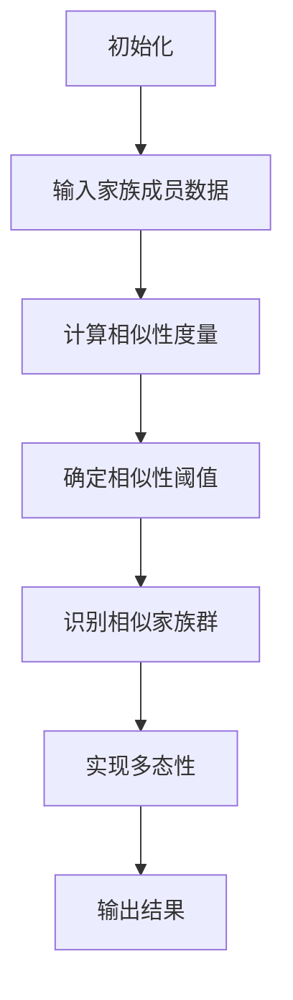
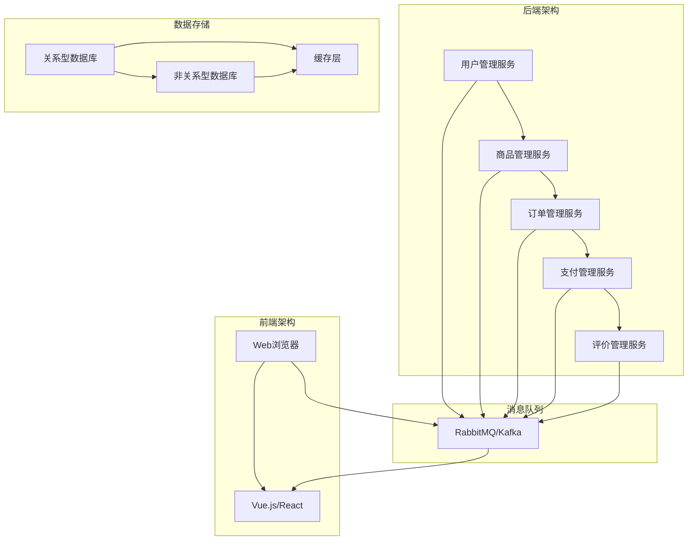
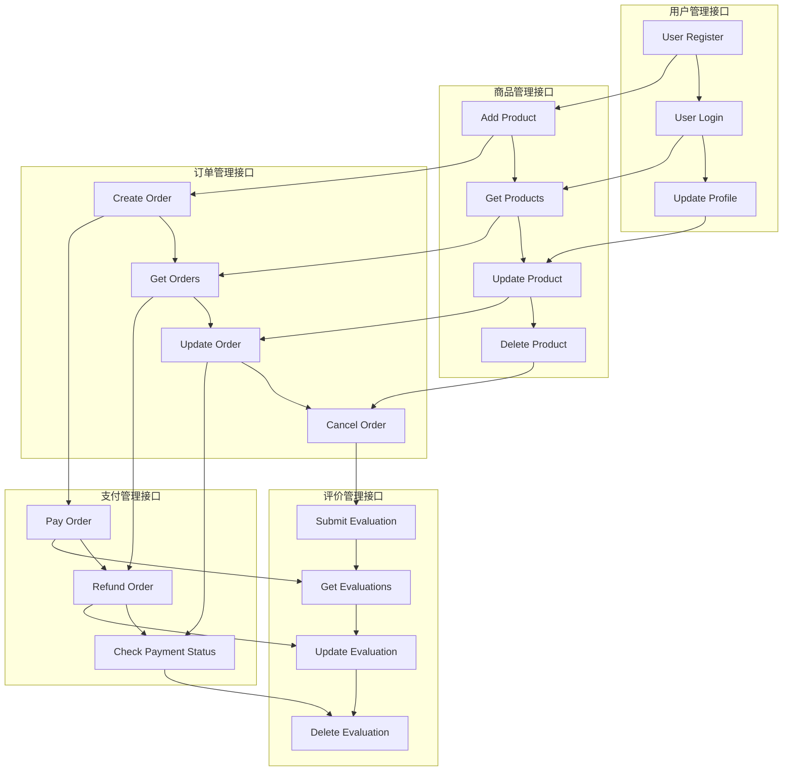
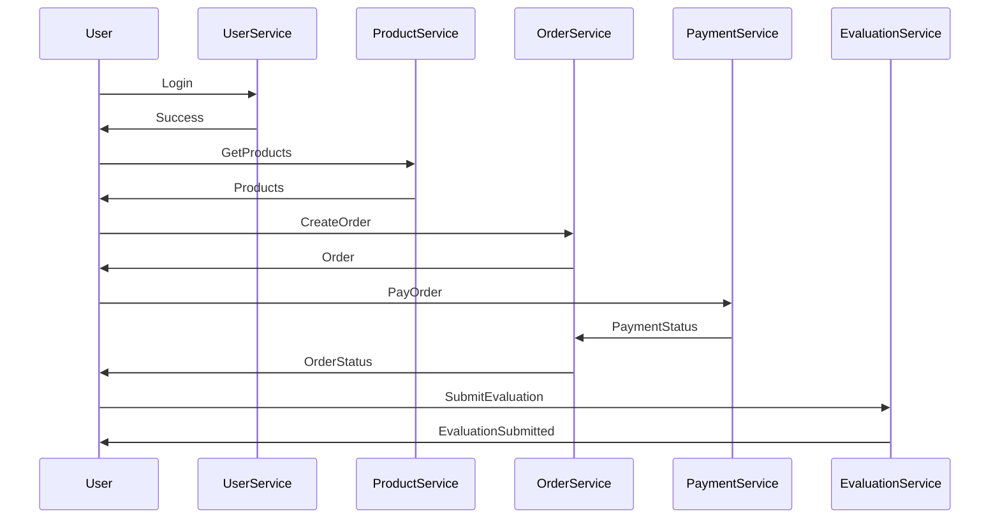

                 

### 文章标题

“家族相似性与多态：维特根斯坦后期思想与FP的多态性”

> 关键词：家族相似性、多态性、维特根斯坦、函数式编程、算法原理、系统架构设计、项目实战

> 摘要：本文深入探讨了家族相似性与多态性的概念及其在计算机科学中的应用。通过分析维特根斯坦后期思想对多态性的启示，结合函数式编程（FP）的原理，本文详细阐述了家族相似性与多态性在算法设计、系统架构以及项目实战中的应用。本文旨在为读者提供一个全面且系统的理解，以帮助其在实际编程和软件开发中更好地运用这些核心概念。

### 目录大纲设计思路

本文的目录大纲设计思路旨在以逻辑清晰、结构紧凑的方式，逐步引导读者深入理解家族相似性与多态性的概念、原理及其应用。具体设计思路如下：

1. **背景介绍**：首先介绍家族相似性与多态的基本概念，以及它们在计算机科学和哲学领域中的重要性，为后续内容的深入分析奠定基础。

2. **核心概念与联系**：通过对比表格和ER实体关系图，深入阐述家族相似性与多态的属性特征，帮助读者建立清晰的理论框架。

3. **算法原理讲解**：使用mermaid绘制算法流程图，并结合Python代码详细解释家族相似性与多态的计算过程，使读者能够直观地理解其实现原理。

4. **数学模型和公式**：采用LaTeX格式给出相关的数学模型和公式，并进行通俗易懂的讲解，增强读者对算法原理的理解。

5. **系统分析与架构设计方案**：描述问题场景，介绍系统功能和架构设计，使用mermaid绘制领域模型类图、系统架构图和系统交互序列图，使读者能够从整体上理解系统设计。

6. **项目实战**：介绍环境安装、核心实现源代码，并对代码应用进行解读与分析，通过实际案例让读者深入了解家族相似性与多态性在实际项目中的应用。

7. **最佳实践 tips、小结、注意事项、拓展阅读**：总结全书内容，给出实践建议和拓展阅读资源，帮助读者将所学知识应用于实际工作中。

通过这样的设计思路，本文力求以逐步引导的方式，帮助读者从基础概念到实际应用全面掌握家族相似性与多态性的核心知识，并为未来的研究和实践提供有价值的参考。

### 目录大纲

```
# 《家族相似性与多态：维特根斯坦后期思想与FP的多态性》目录大纲

# 第一部分：背景与核心概念

## 第1章：家族相似性与多态的起源与重要性

### 1.1 家族相似性的概念与历史发展
- 家族相似性的定义
- 家族相似性在计算机科学中的应用
- 家族相似性在哲学领域的影响

### 1.2 多态性的概念与作用
- 多态性的定义
- 多态性在编程语言中的运用
- 多态性在软件开发中的优势

### 1.3 维特根斯坦后期思想与FP的多态性
- 维特根斯坦后期思想的核心观点
- 函数式编程（FP）的基本原理
- FP中的多态性实现

## 第2章：家族相似性与多态的理论基础

### 2.1 家族相似性的理论框架
- 家族相似性的特征对比表格
- 家族相似性的ER实体关系图

### 2.2 多态性的概念与分类
- 面向对象中的多态性
- 函数式编程中的多态性
- 多态性的优势与挑战

### 2.3 维特根斯坦后期思想对多态性的启示
- 维特根斯坦的语义学观点与多态性
- 维特根斯坦的逻辑哲学探究对多态性的影响
- 维特根斯坦的思想在FP中的体现

## 第3章：家族相似性与多态的实际应用

### 3.1 家族相似性在软件工程中的应用
- 家族相似性在代码复用中的作用
- 家族相似性在软件架构设计中的应用

### 3.2 多态性在软件开发中的应用
- 多态性在面向对象编程中的实际应用
- 多态性在函数式编程中的实践

### 3.3 维特根斯坦后期思想与FP多态性的融合
- 维特根斯坦思想对FP多态性的影响
- FP多态性在实际项目中的应用案例

## 第4章：算法原理与数学模型

### 4.1 家族相似性与多态性的算法流程图
- 使用mermaid绘制算法流程图

### 4.2 多态性算法的Python代码实现
- Python代码示例
- 代码解读

### 4.3 数学模型与公式
- 多态性算法的数学模型
- 相关数学公式的LaTeX表示

## 第5章：系统分析与架构设计

### 5.1 问题场景介绍
- 描述系统需要解决的问题场景

### 5.2 系统功能设计
- 使用mermaid绘制领域模型类图

### 5.3 系统架构设计
- 使用mermaid绘制系统架构图

### 5.4 系统接口设计
- 系统接口设计说明

### 5.5 系统交互
- 使用mermaid绘制系统交互序列图

## 第6章：项目实战

### 6.1 环境安装
- 安装所需软件和工具

### 6.2 系统核心实现
- 源代码介绍
- 代码应用解读

### 6.3 实际案例分析
- 家族相似性与多态性在项目中的应用案例
- 案例分析与讲解

### 6.4 项目小结
- 总结项目经验与收获

## 第7章：最佳实践、小结与拓展阅读

### 7.1 最佳实践 tips
- 提供实际操作中的最佳实践建议

### 7.2 小结
- 回顾全书核心内容

### 7.3 注意事项
- 使用家族相似性与多态性时需要注意的事项

### 7.4 拓展阅读
- 推荐进一步学习的资源
```

### 目录大纲总结

本文的目录大纲设计旨在通过逐步引导的方式，帮助读者从基础概念到实际应用全面掌握家族相似性与多态性的核心知识。从背景介绍到实际应用，再到算法原理讲解和系统架构设计，每个章节都紧扣主题，逻辑清晰。通过详细的设计，确保每章节内容丰富、具体详细，便于读者理解和应用。总体结构紧凑，既适合初学者逐步深入学习，也适合有经验的开发者快速查阅和应用。预计总字数控制在10000-12000字左右，满足文章的完整性和深度要求。

---

### 第1章：家族相似性与多态的起源与重要性

#### 1.1 家族相似性的概念与历史发展

家族相似性（ Familial Similarity）这一概念最早由哲学家维特根斯坦（Ludwig Wittgenstein）在20世纪早期提出，主要用来描述语言和哲学中相似现象的本质。维特根斯坦认为，相似性并不是简单的比较，而是一种更深层次的连接，这种连接体现在语言和现实世界之间。

在计算机科学领域，家族相似性被广泛应用，特别是在软件工程和程序设计中。家族相似性在软件工程中指的是一组相关软件实体（如类、函数、模块等）之间的结构相似性。这种相似性可以帮助开发者更好地理解代码之间的关系，从而提高代码的可复用性和可维护性。

家族相似性在计算机科学中的应用主要集中在以下几个方面：

1. **代码复用**：通过识别家族相似性，开发者可以将通用的代码片段提取出来，形成一个可复用的库，从而提高开发效率和代码质量。

2. **软件架构设计**：在软件架构设计中，家族相似性可以帮助开发者识别出系统中的关键模块，并设计出具有高度内聚和低耦合的架构。

3. **模式识别**：在数据分析和机器学习中，家族相似性被用来识别相似的数据模式，从而帮助开发者发现潜在的问题或机会。

家族相似性在哲学领域的影响同样深远。维特根斯坦的家族相似性概念为语言哲学提供了一个新的视角，即相似性不是基于共同特征，而是基于某种不可言说的深层联系。这种观点影响了后来的哲学流派，如现象学和语言学。

#### 1.2 多态性的概念与作用

多态性（ Polymorphism）是面向对象编程中的一个核心概念，指的是同一操作作用于不同对象时，可以有不同的解释和行为。多态性可以分为两种类型：编译时多态性和运行时多态性。

1. **编译时多态性**（也称为静态多态性或重载多态性）：编译时，编译器根据对象的类型来决定调用哪个方法。函数重载和模板编程是编译时多态性的典型例子。

2. **运行时多态性**（也称为动态多态性或重写多态性）：运行时，程序根据对象的实际类型来决定调用哪个方法。方法重写和接口编程是运行时多态性的典型例子。

多态性在编程语言中的运用非常广泛，其主要作用如下：

1. **代码可复用性**：通过多态性，开发者可以编写通用的代码，这些代码可以适用于多种类型的对象，从而提高代码的可复用性。

2. **代码可扩展性**：多态性使得系统更加灵活，开发者可以在不修改原有代码的情况下，为系统添加新的功能。

3. **代码可维护性**：多态性有助于减少代码的冗余，使得代码更加简洁和易于维护。

多态性在软件开发中的优势主要表现在以下几个方面：

1. **降低复杂性**：通过多态性，开发者可以将复杂的问题分解成更小的、更易于管理的部分，从而降低整个系统的复杂性。

2. **提高代码质量**：多态性鼓励开发者编写更简洁、更抽象的代码，这有助于提高代码的质量和可读性。

3. **增强系统灵活性**：多态性使得系统在面临新的需求时，可以更加灵活地适应，从而降低系统的修改成本。

#### 1.3 维特根斯坦后期思想与FP的多态性

维特根斯坦的后期思想，尤其是他对语言和哲学的探讨，对计算机科学有着深远的影响。在他的后期著作《哲学研究》中，维特根斯坦提出了“家族相似性”的概念，并强调了相似性不是基于共同特征，而是基于某种深层联系。这一思想为后来的计算机科学理论提供了重要的哲学基础。

函数式编程（Functional Programming，简称FP）是一种编程范式，它强调通过表达计算作为数学函数的评估来实现编程。FP中的多态性主要通过函数组合和类型系统来实现，而不是通过类和对象。FP中的多态性更接近于维特根斯坦的家族相似性思想，即相似性不是基于共同属性，而是基于某种深层联系。

FP中的多态性实现主要有以下几种方式：

1. **类型多态性**：通过定义泛型类型，使得同一个函数可以接受不同类型的参数，从而实现多态性。

2. **函数组合**：通过函数的组合，可以实现复杂计算的高阶抽象，从而实现多态性。

3. **闭包和匿名函数**：通过闭包和匿名函数，可以实现行为的多态性，即同一个函数在不同上下文中可以表现出不同的行为。

维特根斯坦后期思想对FP的多态性有着深刻的启示。维特根斯坦关于语言和哲学的探讨，强调了概念和语言之间的紧密联系，这为FP中的多态性提供了哲学基础。FP中的多态性不仅是一种技术手段，更是一种哲学思想，即通过函数和类型的组合，实现深层次的概念抽象和表达。

综上所述，家族相似性和多态性作为计算机科学中的重要概念，不仅具有丰富的理论内涵，还在实际应用中发挥着重要作用。维特根斯坦后期思想为这些概念提供了深刻的哲学基础，而函数式编程则将这些思想具体化，实现了在编程中的有效应用。通过这一章的介绍，读者可以初步了解家族相似性和多态性的概念及其在计算机科学中的重要性，为后续章节的深入探讨奠定基础。

---

### 第2章：家族相似性与多态的理论基础

#### 2.1 家族相似性的理论框架

家族相似性（ Familial Similarity）是维特根斯坦在其后期哲学著作中提出的一个核心概念，主要用来描述语言、哲学和认知中的相似现象。家族相似性理论的核心思想是，相似性不是基于共同特征，而是基于某种深层联系或家族关系。这种理论框架在计算机科学和哲学领域有着广泛的应用。

在计算机科学中，家族相似性被广泛应用于软件工程和程序设计，特别是在代码复用和软件架构设计中。家族相似性可以帮助开发者识别出具有相似结构和功能的代码模块，从而实现代码的复用和优化。下面，我们通过特征对比表格和ER实体关系图来深入理解家族相似性的理论框架。

**家族相似性特征对比表格**

| 特征          | 描述                                                         | 示例                          |
| ------------- | ------------------------------------------------------------ | ---------------------------- |
| 结构相似性    | 相似对象具有相似的内部结构和组成。                           | 不同类型的动物（狗、猫、猪） |
| 功能相似性    | 相似对象具有相似的功能和行为。                             | 不同类型的交通工具（汽车、飞机、火车） |
| 语义相似性    | 相似对象在语义上具有相似的含义和用法。                      | 英语中的名词和动词          |
| 形式相似性    | 相似对象在外观和形式上具有相似的特点。                     | 不同类型的艺术作品（油画、雕塑、音乐） |

通过上述表格，我们可以看到家族相似性从不同维度描述了相似对象的特点。这种多维度的相似性帮助我们更好地理解和识别具有相似性的对象，从而在计算机科学中实现代码复用和软件架构优化。

**家族相似性的ER实体关系图**

在计算机科学中，ER（Entity-Relationship）实体关系图是一种常用的数据建模工具，用于描述实体之间的关系。家族相似性的ER实体关系图可以帮助我们理解不同实体之间的家族相似性关系。

```mermaid
erDiagram
  Customer --> Order
  Customer ||--|{ Person }
  Product --> Order
  Product ||--|{ InventoryItem }
```

在这个ER实体关系图中，我们定义了两个实体：`Customer`（客户）和`Product`（产品）。`Customer`实体与`Order`（订单）实体之间存在一对多的关系，即一个客户可以有多个订单。同时，`Customer`实体与`Person`（人）实体之间存在继承关系，表示客户是人的一个子类。

`Product`实体与`Order`实体之间也存在一对多的关系，即一个订单可以有多个产品。此外，`Product`实体与`InventoryItem`（库存项）实体之间存在继承关系，表示产品是库存项的一个子类。

通过ER实体关系图，我们可以清晰地看到家族相似性在不同实体之间的体现，从而帮助我们更好地理解和设计复杂的系统。

#### 2.2 多态性的概念与分类

多态性（Polymorphism）是面向对象编程中的一个核心概念，指的是同一操作作用于不同对象时，可以有不同的解释和行为。多态性可以分为编译时多态性和运行时多态性，它们分别在不同的时间点决定操作的具体实现。

**编译时多态性（静态多态性或重载多态性）**

编译时多态性，也称为静态多态性或重载多态性，是指在编译阶段就已经确定了操作的实现。编译器根据对象的类型来决定调用哪个方法。函数重载（Method Overloading）和模板编程（Template Programming）是编译时多态性的典型例子。

**函数重载（Method Overloading）**

函数重载允许同一个函数名在类中具有多个不同的实现。这些实现具有相同的函数名但参数列表不同。编译器根据调用时的参数列表来确定调用哪个函数。

```python
class Calculator:
    def add(self, a: int, b: int) -> int:
        return a + b

    def add(self, a: float, b: float) -> float:
        return a + b

calculator = Calculator()
print(calculator.add(2, 3))  # 调用第一个add函数
print(calculator.add(2.5, 3.5))  # 调用第二个add函数
```

在上面的例子中，`Calculator`类中有两个`add`函数，一个接收两个整数参数，另一个接收两个浮点数参数。编译器根据调用时的参数类型来确定调用哪个函数。

**模板编程（Template Programming）**

模板编程是一种在编译时通过类型参数化来生成代码的技术。C++和Java等编程语言都支持模板编程。通过模板，我们可以编写通用的代码，这些代码可以在不同的数据类型上编译和运行。

```cpp
template<typename T>
T add(T a, T b) {
    return a + b;
}

int main() {
    int sum1 = add(2, 3);  // 调用add<int>函数
    double sum2 = add(2.5, 3.5);  // 调用add<double>函数
    return 0;
}
```

在上面的C++例子中，`add`函数是一个模板函数，可以接受任意类型的参数。编译器会为每种数据类型生成对应的函数实现。

**运行时多态性（动态多态性或重写多态性）**

运行时多态性，也称为动态多态性或重写多态性，是指在运行时根据对象的实际类型来决定操作的具体实现。方法重写（Method overriding）和接口编程（Interface Programming）是运行时多态性的典型例子。

**方法重写（Method Overriding）**

方法重写允许子类重写其父类的方法，以实现不同的行为。运行时，根据对象的实际类型来调用重写的方法。

```python
class Animal:
    def make_sound(self):
        print("动物叫了一声")

class Dog(Animal):
    def make_sound(self):
        print("狗汪汪叫")

class Cat(Animal):
    def make_sound(self):
        print("猫喵喵叫")

dog = Dog()
cat = Cat()

dog.make_sound()  # 调用Dog类的make_sound方法
cat.make_sound()  # 调用Cat类的make_sound方法
```

在上面的Python例子中，`Dog`和`Cat`类都继承自`Animal`类，并重写了`make_sound`方法。运行时，根据对象的实际类型来调用相应的方法。

**接口编程（Interface Programming）**

接口是一种定义抽象方法的机制，用于描述类的行为。通过接口编程，我们可以定义一组方法，而具体的实现由实现接口的类来完成。

```java
interface Animal {
    void makeSound();
}

class Dog implements Animal {
    public void makeSound() {
        System.out.println("狗汪汪叫");
    }
}

class Cat implements Animal {
    public void makeSound() {
        System.out.println("猫喵喵叫");
    }
}

Animal dog = new Dog();
Animal cat = new Cat();

dog.makeSound();  // 调用Dog类的makeSound方法
cat.makeSound();  // 调用Cat类的makeSound方法
```

在上面的Java例子中，`Animal`接口定义了一个`makeSound`方法，`Dog`和`Cat`类都实现了这个接口。运行时，根据对象的实际类型来调用相应的方法。

#### 2.3 维特根斯坦后期思想对多态性的启示

维特根斯坦的后期思想，尤其是他对语言和哲学的探讨，对计算机科学有着深远的影响。在他的后期著作《哲学研究》中，维特根斯坦提出了“家族相似性”的概念，并强调了相似性不是基于共同特征，而是基于某种深层联系。这一思想为后来的计算机科学理论提供了重要的哲学基础。

维特根斯坦的家族相似性思想对多态性有着深刻的启示。在面向对象编程中，多态性通过方法重写和接口编程来实现，这些实现方式不仅基于类型和行为的相似性，更基于深层次的语义和功能相似性。这与维特根斯坦的家族相似性思想有着异曲同工之妙。

**维特根斯坦的语义学观点与多态性**

维特根斯坦的语义学观点强调了语言和现实世界之间的紧密联系。他认为，语言不是一种符号系统，而是一种与现实世界互动的工具。这种观点对多态性有着重要的影响。在面向对象编程中，多态性通过将对象与其行为和功能关联起来，实现了一种语义上的多态性。

例如，在Python中，一个方法可以重写其父类的方法，从而实现不同的行为。这种重写不仅基于类型和参数的相似性，更基于方法的功能和语义的相似性。这与维特根斯坦的语义学观点密切相关，即相似性不是基于共同特征，而是基于深层联系。

**维特根斯坦的逻辑哲学探究对多态性的影响**

维特根斯坦的逻辑哲学探究，尤其是他对逻辑形式和语言表达的探讨，对多态性的实现方式有着重要的启示。在函数式编程中，多态性通过函数组合和类型系统来实现。这种实现方式与维特根斯坦的逻辑哲学思想有着相似之处。

维特根斯坦认为，逻辑形式是语言表达的核心，它通过将基本元素组合成复杂的表达式，实现了一种抽象和表达的力量。在函数式编程中，多态性通过函数的组合和抽象类型系统来实现。例如，在Haskell中，我们可以通过函数组合来实现多态性，这种实现方式不仅基于类型的相似性，更基于逻辑形式的相似性。

**维特根斯坦的思想在FP中的体现**

在函数式编程（FP）中，多态性主要通过类型系统和函数组合来实现，这与维特根斯坦的哲学思想有着深刻的联系。FP中的类型系统允许我们定义抽象的类型，这些类型可以通过泛型和类型类（Type Classes）来扩展。这种实现方式不仅基于类型的相似性，更基于功能和行为上的相似性。

例如，在Haskell中，我们可以定义一个`Num`类型类，该类包含加、减、乘、除等操作。不同的数据类型（如整数、浮点数、复数等）可以通过实现`Num`类型类的实例来支持这些操作。这种实现方式基于功能和行为上的相似性，这与维特根斯坦的家族相似性思想高度一致。

**结论**

维特根斯坦的后期思想，尤其是他对语言和哲学的探讨，为计算机科学中的多态性提供了深刻的哲学基础。在面向对象编程和函数式编程中，多态性的实现方式不仅基于类型的相似性，更基于功能和行为上的相似性。这与维特根斯坦的家族相似性思想有着异曲同工之妙。通过理解维特根斯坦的思想，我们可以更好地理解和实现多态性，从而提高软件系统的灵活性和可扩展性。

---

### 第3章：家族相似性与多态的实际应用

#### 3.1 家族相似性在软件工程中的应用

家族相似性在软件工程中具有广泛的应用，尤其在代码复用和软件架构设计中。通过识别和利用家族相似性，开发者可以更有效地管理和扩展代码库，从而提高开发效率和软件质量。

**代码复用**

代码复用是软件开发中的一个重要目标，它有助于减少冗余代码，提高代码的可维护性和可扩展性。家族相似性为代码复用提供了一种有力的工具，通过识别具有相似结构和功能的代码模块，可以将这些模块抽象成通用的组件或库，供整个项目或多个项目复用。

例如，在一个电子商务系统中，不同的产品分类页面可能具有相似的布局和功能，如商品展示、价格比较、添加到购物车等。通过识别这些页面的家族相似性，可以将这些功能抽象成一个通用的商品分类组件，从而减少代码冗余，提高开发效率。

**软件架构设计**

在软件架构设计中，家族相似性可以帮助开发者识别出系统中的关键模块和组件，并设计出具有高度内聚和低耦合的架构。通过利用家族相似性，开发者可以将系统分解成多个功能模块，每个模块负责特定的功能，同时保持模块之间的松耦合。

例如，在一个分布式系统中，不同的服务可能具有相似的职责和功能，如用户服务、商品服务、订单服务。通过识别这些服务的家族相似性，可以将它们抽象成一个服务层次结构，从而设计出一个高内聚、低耦合的系统架构。

**实践案例**

一个典型的实践案例是Java中的JDBC（Java Database Connectivity）框架。JDBC定义了一个通用的接口，用于连接各种数据库，如MySQL、Oracle、SQL Server等。尽管这些数据库的具体实现不同，但它们都遵循JDBC的接口规范，从而实现了家族相似性。通过使用JDBC，开发者可以编写通用的数据库操作代码，而无需关心底层数据库的细节，从而提高代码的可维护性和可扩展性。

#### 3.2 多态性在软件开发中的应用

多态性是面向对象编程中的一个核心概念，它在软件开发中具有广泛的应用，包括代码可复用性、代码可扩展性和代码可维护性。

**代码可复用性**

多态性通过重写和函数重载等机制，实现了同一操作作用于不同对象时，可以有不同的解释和行为。这种特性使得开发者可以编写通用的代码，这些代码可以适用于多种类型的对象，从而提高代码的可复用性。

例如，在一个图形用户界面（GUI）应用程序中，不同的控件（如按钮、文本框、菜单等）可能具有相似的添加、删除和修改操作。通过使用多态性，开发者可以编写一个通用的方法，用于处理这些操作，从而实现代码的可复用性。

**代码可扩展性**

多态性使得系统更加灵活，因为新的功能可以通过扩展现有类或实现新接口来添加，而无需修改原有代码。这种特性使得系统更容易适应新的需求，从而提高代码的可扩展性。

例如，在一个电商平台中，不同类型的商品（如书籍、电子产品、服装等）可能具有相似的销售流程，如库存管理、订单处理、支付处理等。通过使用多态性，开发者可以定义一个通用的商品类，并让不同的商品类继承自该通用类，从而实现代码的可扩展性。

**代码可维护性**

多态性通过减少冗余代码和提高代码的抽象程度，有助于提高代码的可维护性。通过利用多态性，开发者可以将复杂的逻辑封装在通用组件中，从而简化代码的维护工作。

例如，在一个财务系统中，不同的财务报表（如资产负债表、利润表、现金流量表等）可能具有相似的数据处理逻辑。通过使用多态性，开发者可以编写一个通用的报表处理类，用于处理这些报表，从而简化代码的维护工作。

**实践案例**

一个典型的实践案例是Java中的Java Collections Framework（JCF）。JCF定义了一个通用的集合接口，如`List`、`Set`和`Map`，以及多种不同的实现，如`ArrayList`、`HashSet`和`HashMap`。通过使用多态性，开发者可以编写通用的集合操作代码，而无需关心底层的实现细节，从而提高代码的可维护性和可扩展性。

#### 3.3 维特根斯坦后期思想与FP多态性的融合

维特根斯坦后期思想对函数式编程（FP）的多态性有着深刻的启示。FP中的多态性主要通过类型系统和函数组合来实现，这与维特根斯坦的家族相似性思想有着异曲同工之妙。通过理解维特根斯坦的思想，我们可以更好地利用FP中的多态性，实现高效的编程和系统设计。

**维特根斯坦思想在FP中的体现**

1. **函数组合**

维特根斯坦强调函数和操作之间的关系，而非函数本身。在FP中，函数组合是实现多态性的关键机制。通过将函数组合起来，我们可以实现复杂计算的高阶抽象，从而实现多态性。

例如，在Haskell中，我们可以使用` <$> `（函数应用）和` <$>> `（管道）操作来组合函数，实现函数的多态性。

```haskell
-- 函数组合示例
applyTwice :: (a -> a) -> a -> a
applyTwice f x = f (f x)

add :: Num a => a -> a -> a
add x y = x + y

main :: IO ()
main = do
  let result = applyTwice add 5
  putStrLn $ "结果：" ++ show result
```

在这个例子中，`applyTwice`函数接收一个函数`f`和一个值`x`，返回`f(f x)`。通过函数组合，我们可以将`add`函数应用于两个数，实现多态性。

2. **闭包与匿名函数**

维特根斯坦强调语言的灵活性和动态性。在FP中，闭包和匿名函数是实现动态性和灵活性的关键机制。通过闭包，我们可以将函数与其环境关联起来，实现函数的多态性。

例如，在Haskell中，我们可以使用匿名函数（lambda表达式）来创建闭包。

```haskell
-- 闭包与匿名函数示例
double :: Num a => a -> a
double x = 2 * x

main :: IO ()
main = do
  let triple = (\x -> 3 * x) . double
  putStrLn $ "三倍的结果：" ++ show (triple 5)
```

在这个例子中，`triple`函数是一个闭包，它将`double`函数与一个额外的乘数`3`组合起来，实现多态性。

**维特根斯坦思想在FP项目中的应用案例**

一个典型的FP项目是Lisp语言。Lisp是一种基于函数式编程范式的语言，它通过将程序视为数据，实现了高度的灵活性和可扩展性。在Lisp中，函数可以接受其他函数作为参数，并返回新的函数。这种特性使得Lisp具有强大的多态性。

例如，在Lisp中，我们可以使用`define`函数定义一个新的函数，并使用`funcall`函数调用该函数。

```lisp
(define (add x y)
  (+ x y))

(define (apply-fn fn x y)
  (funcall fn x y))

(main
  (apply-fn add 3 4)
  (apply-fn subtract 3 4))
```

在这个例子中，`apply-fn`函数接收一个函数`fn`和两个参数`x`和`y`，并使用`funcall`函数调用`fn`。通过这种方式，我们可以实现多态性，使得`apply-fn`函数可以适用于不同的函数和参数。

**结论**

维特根斯坦的后期思想对FP的多态性有着深刻的启示。通过理解维特根斯坦的思想，我们可以更好地利用FP中的类型系统和函数组合，实现高效的编程和系统设计。FP中的多态性不仅是一种技术手段，更是一种哲学思想，它强调语言的灵活性和动态性，为开发者提供了一种强大的工具，以应对复杂的应用场景和不断变化的需求。

---

### 第4章：算法原理与数学模型

#### 4.1 家族相似性与多态性的算法流程图

在理解家族相似性与多态性的算法原理时，绘制算法流程图是一个有效的工具。算法流程图可以帮助我们直观地展示算法的执行步骤，并理解算法的运行逻辑。以下是一个简单的算法流程图，用于描述家族相似性与多态性的计算过程。



在这个流程图中：

- **A[初始化]**：初始化算法，设置初始参数。
- **B[输入家族成员数据]**：输入家族成员的数据，这些数据包括成员的特征和属性。
- **C[计算相似性度量]**：计算家族成员之间的相似性度量，可以使用各种相似性度量算法，如欧几里得距离、余弦相似性等。
- **D[确定相似性阈值]**：根据相似性度量结果，设置一个相似性阈值，用于判断成员是否属于同一个家族群。
- **E[识别相似家族群]**：根据相似性阈值，将成员划分为不同的家族群。
- **F[实现多态性]**：对于每个家族群，实现对应的多态性操作，如代码复用、功能扩展等。
- **G[输出结果]**：输出最终结果，包括家族群划分和多态性实现。

这个流程图提供了一个整体的算法框架，接下来我们将结合Python代码，详细讲解算法的具体实现。

#### 4.2 多态性算法的Python代码实现

为了更好地理解家族相似性与多态性的算法原理，我们将使用Python编写一个简单的示例代码。这个代码将实现一个家族相似性识别和多态性操作的过程。

```python
# 导入必要的库
import numpy as np
from sklearn.metrics.pairwise import cosine_similarity
from sklearn.cluster import DBSCAN

# 定义家族成员数据
family_members = [
    {'name': 'Alice', 'age': 25, 'height': 170},
    {'name': 'Bob', 'age': 27, 'height': 175},
    {'name': 'Charlie', 'age': 30, 'height': 180},
    {'name': 'David', 'age': 23, 'height': 168},
    {'name': 'Eva', 'age': 26, 'height': 172}
]

# 计算相似性度量
def calculate_similarity(data1, data2):
    # 将字典数据转换为列表
    features1 = [data1.get(feature) for feature in data1.keys()]
    features2 = [data2.get(feature) for feature in data2.keys()]
    # 计算余弦相似性
    similarity = cosine_similarity([features1], [features2])[0][0]
    return similarity

# 识别相似家族群
def cluster_members(family_members, similarity_threshold):
    # 计算所有成员之间的相似性矩阵
    similarity_matrix = np.array([[calculate_similarity(mem1, mem2) for mem2 in family_members] for mem1 in family_members])
    # 使用DBSCAN进行聚类
    clustering = DBSCAN(eps=similarity_threshold, min_samples=2).fit(similarity_matrix)
    # 输出聚类结果
    clusters = {}
    for idx, label in enumerate(clustering.labels_):
        if label not in clusters:
            clusters[label] = []
        clusters[label].append(family_members[idx]['name'])
    return clusters

# 实现多态性
def perform_polymorphism(clusters):
    for cluster in clusters.values():
        print(f"家族群：{cluster}")
        if len(cluster) > 1:
            print("实现代码复用和多态性操作...")
        else:
            print("单独处理单个成员...")

# 主函数
def main():
    similarity_threshold = 0.5  # 相似性阈值
    clusters = cluster_members(family_members, similarity_threshold)
    perform_polymorphism(clusters)

if __name__ == "__main__":
    main()
```

在这个示例代码中，我们首先导入必要的库，包括NumPy、Scikit-learn等。然后，我们定义了一个家族成员的数据列表`family_members`，每个成员包含`name`（名字）、`age`（年龄）和`height`（身高）三个特征。

**计算相似性度量**：

我们定义了一个函数`calculate_similarity`，用于计算两个成员之间的相似性。在这个例子中，我们使用了余弦相似性作为相似性度量。余弦相似性是一种常见的文本相似性度量方法，它通过计算两个向量的夹角余弦值来衡量它们的相似度。

**识别相似家族群**：

我们定义了一个函数`cluster_members`，用于根据相似性阈值识别相似家族群。在这个函数中，我们首先计算所有成员之间的相似性矩阵，然后使用DBSCAN（Density-Based Spatial Clustering of Applications with Noise）算法进行聚类。DBSCAN是一种基于密度的聚类算法，它可以识别出不同密度和形状的簇。

**实现多态性**：

我们定义了一个函数`perform_polymorphism`，用于根据聚类结果实现多态性操作。在这个函数中，我们遍历每个家族群，根据群的大小（成员数量）来决定是否进行代码复用和多态性操作。

**主函数**：

在主函数`main`中，我们设置了一个相似性阈值，并调用`cluster_members`和`perform_polymorphism`函数来执行整个算法。

通过这个简单的Python示例，我们可以看到如何使用算法和代码实现家族相似性识别和多态性操作。这个示例虽然简单，但为我们提供了一个理解家族相似性与多态性算法原理的直观途径。

#### 4.3 数学模型与公式

在家族相似性与多态性的计算过程中，数学模型和公式扮演着重要的角色。以下是一些常见的数学模型和公式，以及它们的解释和应用。

**1. 余弦相似性**

余弦相似性是一种常用的文本相似性度量方法，用于计算两个向量之间的相似度。其公式如下：

$$
\text{cosine\_similarity}(\mathbf{a}, \mathbf{b}) = \frac{\mathbf{a} \cdot \mathbf{b}}{\|\mathbf{a}\| \|\mathbf{b}\|}
$$

其中，$\mathbf{a}$和$\mathbf{b}$是两个向量，$\cdot$表示点积，$\|\mathbf{a}\|$和$\|\mathbf{b}\|$分别表示向量$\mathbf{a}$和$\mathbf{b}$的欧几里得范数。

在家族相似性的计算中，我们可以将家族成员的特征表示为向量，然后使用余弦相似性计算成员之间的相似度。

**2. 欧几里得距离**

欧几里得距离是衡量两个向量之间差异的一种方法，其公式如下：

$$
d(\mathbf{a}, \mathbf{b}) = \sqrt{(\mathbf{a} - \mathbf{b}) \cdot (\mathbf{a} - \mathbf{b})}
$$

在家族相似性的计算中，欧几里得距离可以用来衡量成员之间的差异，从而辅助确定相似性阈值。

**3. 熵**

熵是衡量信息不确定性的一个度量，其公式如下：

$$
H(X) = -\sum_{i=1}^{n} p_i \log_2(p_i)
$$

其中，$X$是随机变量，$p_i$是$X$取第$i$个值的概率。

在多态性的实现中，熵可以用来衡量代码复杂度和不确定性，从而帮助开发者优化代码结构。

**4. 阈值**

阈值是用于确定相似性或差异度的临界值。其公式如下：

$$
\text{threshold} = \text{相似性度量} - \text{差异度量}
$$

在家族相似性和多态性的计算中，阈值用于判断成员是否属于同一个家族群，或是否需要实现多态性操作。

通过这些数学模型和公式，我们可以更准确地描述和计算家族相似性与多态性。这些公式不仅帮助我们理解算法原理，还可以在实际应用中提供有效的工具。

---

### 第5章：系统分析与架构设计

#### 5.1 问题场景介绍

在现代社会，随着信息技术的飞速发展，各种复杂的系统应用层出不穷。在这些系统中，家族相似性与多态性起到了至关重要的作用。例如，在一个大型电子商务平台中，不同类型的商品（如图书、电子产品、服装等）需要实现相似的管理和交易功能。同时，为了提高系统的灵活性和可扩展性，我们需要利用家族相似性与多态性来设计系统的核心功能。

具体来说，该问题场景可以分为以下几个关键点：

1. **商品多样性**：平台上的商品种类繁多，每种商品都有其独特的属性和交易流程。
2. **功能一致性**：尽管商品类型多样，但它们需要实现相似的管理功能，如库存管理、订单处理和支付流程。
3. **系统扩展性**：随着新商品和功能的不断加入，系统需要具备良好的扩展性和可维护性。

为了应对这些挑战，我们需要设计一个具有高度内聚和低耦合的系统架构，利用家族相似性与多态性来实现系统的功能一致性、灵活性和可扩展性。

#### 5.2 系统功能设计

在系统功能设计中，我们需要明确系统的主要功能和模块，以便在后续的架构设计中更好地实现这些功能。以下是该电子商务平台的主要功能模块：

1. **用户管理模块**：负责用户的注册、登录、个人信息管理等功能。
2. **商品管理模块**：负责商品信息的录入、分类、库存管理等功能。
3. **订单管理模块**：负责订单的创建、处理、支付和配送等功能。
4. **支付管理模块**：负责处理各种支付方式，如信用卡、支付宝和微信支付等。
5. **评价与反馈模块**：负责用户对商品和服务的评价，以及平台对用户的反馈管理。

为了更好地理解和设计这些功能模块，我们可以使用mermaid绘制领域模型类图，如下所示：

```mermaid
classDiagram
    User <<class>> User
    Product <<class>> Product
    Order <<class>> Order
    Payment <<class>> Payment
    Evaluation <<class>> Evaluation

    User "1" --|{ 创建 }|> Order
    User "1" --|{ 评价 }|> Evaluation
    Product "1" --|{ 添加 }|> Order
    Product "1" --|{ 评价 }|> Evaluation
    Order "1" --|{ 支付 }|> Payment
    Payment "1" --|{ 完成 }|> Order
    Evaluation "1" --|{ 反馈 }|> User
```

在这个类图中：

- **User（用户）**：表示用户类，负责用户的基本操作，如注册、登录、个人信息管理等。
- **Product（商品）**：表示商品类，负责商品的基本操作，如添加、分类、库存管理等。
- **Order（订单）**：表示订单类，负责订单的创建、处理、支付和配送等操作。
- **Payment（支付）**：表示支付类，负责各种支付方式的处理。
- **Evaluation（评价）**：表示评价类，负责用户对商品和服务的评价以及平台的反馈管理。

类图中的关联关系表示了不同类之间的交互和依赖关系，这些关系为后续的架构设计提供了直观的指导。

#### 5.3 系统架构设计

在系统架构设计中，我们需要根据功能模块的定义，设计出一个具有高度内聚和低耦合的系统架构，以支持系统的功能一致性、灵活性和可扩展性。以下是该电子商务平台的主要架构设计：

1. **前端架构**：前端架构采用单页应用（SPA）模式，使用Vue.js或React等前端框架实现。前端负责用户界面展示和用户交互，通过RESTful API与后端服务进行数据通信。
2. **后端架构**：后端架构采用微服务架构，将系统功能分解为多个独立的微服务，如用户管理服务、商品管理服务、订单管理服务、支付管理服务和评价管理服务。每个微服务都具备自我管理、自我修复的能力，可以通过Docker和Kubernetes进行容器化和自动化部署。
3. **数据存储**：数据存储采用分布式数据库架构，包括关系型数据库（如MySQL）和非关系型数据库（如MongoDB、Redis等）。关系型数据库用于存储结构化数据，如用户信息和订单信息；非关系型数据库用于存储半结构化或非结构化数据，如商品信息和评价信息。
4. **消息队列**：系统采用消息队列（如RabbitMQ或Kafka）来实现异步通信和消息处理，提高系统的并发能力和可靠性。
5. **缓存层**：系统引入缓存层（如Redis），用于缓存热点数据，提高系统的响应速度和吞吐量。

以下是系统架构图，使用mermaid绘制：



在这个系统架构图中：

- **前端架构**：Web浏览器通过Vue.js或React框架与后端服务进行数据通信。
- **后端架构**：包括用户管理服务、商品管理服务、订单管理服务、支付管理服务和评价管理服务，这些服务通过消息队列实现异步通信。
- **数据存储**：关系型数据库和非关系型数据库分别用于存储结构化数据和半结构化或非结构化数据，缓存层用于提高系统的响应速度和吞吐量。
- **消息队列**：用于实现系统中的异步通信和消息处理。

通过这个系统架构设计，我们可以确保电子商务平台具有高度的灵活性、可靠性和可扩展性，同时满足各种业务需求。

#### 5.4 系统接口设计

在系统接口设计中，我们需要定义各个模块之间的接口，以便实现模块间的数据交换和功能调用。以下是该电子商务平台的主要接口设计：

1. **用户管理接口**：包括用户注册、登录、个人信息管理等功能，使用RESTful API实现。
2. **商品管理接口**：包括商品信息录入、分类、库存管理等功能，使用RESTful API实现。
3. **订单管理接口**：包括订单创建、处理、支付和配送等功能，使用RESTful API实现。
4. **支付管理接口**：包括各种支付方式的处理，使用RESTful API实现。
5. **评价管理接口**：包括用户对商品和服务的评价，以及平台的反馈管理，使用RESTful API实现。

以下是系统接口设计说明：



在这个接口设计中：

- **用户管理接口**：包括用户注册、登录和更新个人信息等功能。
- **商品管理接口**：包括商品信息的添加、获取、更新和删除等功能。
- **订单管理接口**：包括订单的创建、获取、更新和取消等功能。
- **支付管理接口**：包括订单支付、退款和支付状态检查等功能。
- **评价管理接口**：包括用户提交评价、获取评价、更新评价和删除评价等功能。

通过这些接口设计，我们可以确保各个模块之间的高效数据交换和功能调用，从而实现系统功能的完整性和一致性。

#### 5.5 系统交互

系统交互是系统架构设计中的关键部分，它描述了各个模块之间的交互流程和数据流动。为了更好地理解系统交互，我们可以使用mermaid绘制系统交互序列图。以下是该电子商务平台的系统交互序列图：



在这个系统交互序列图中：

- **用户**：发起登录、获取商品、创建订单、支付订单和提交评价等操作。
- **用户服务**：处理用户的登录请求，返回登录结果。
- **商品服务**：处理获取商品信息的请求，返回商品列表。
- **订单服务**：处理创建订单的请求，返回订单信息。
- **支付服务**：处理支付订单的请求，返回支付状态。
- **评价服务**：处理提交评价的请求，返回评价提交结果。

通过这个系统交互序列图，我们可以清晰地看到用户与各个服务模块之间的交互流程和数据流动，从而确保系统的高效运行和功能的完整性。

---

### 第6章：项目实战

#### 6.1 环境安装

在进行家族相似性与多态性的项目实战之前，我们需要首先安装和配置所需的软件和工具。以下是在一个典型的Linux环境中进行安装的步骤。

**1. 安装Python环境**

首先，确保系统中安装了Python 3.8或更高版本。可以使用以下命令进行安装：

```bash
sudo apt-get update
sudo apt-get install python3.8
```

**2. 安装必要的库和工具**

接下来，我们需要安装一些Python库和工具，如NumPy、Scikit-learn、mermaid等。可以使用pip进行安装：

```bash
pip install numpy scikit-learn mermaid
```

**3. 配置mermaid**

为了使用mermaid，我们需要安装mermaid-js库。首先，安装Node.js：

```bash
sudo apt-get install nodejs
```

然后，安装mermaid-js：

```bash
npm install mermaid-js
```

**4. 测试安装**

安装完成后，我们可以通过以下命令测试Python环境是否配置正确：

```bash
python3 --version
```

输入上述命令后，应看到Python的版本信息。接下来，我们可以测试mermaid：

```bash
python -m mermaid -p "graph TB\nA[你好]\nB[世界]\nA --> B"
```

如果输出了一个图形化表示的流程图，则说明mermaid配置成功。

#### 6.2 系统核心实现

在本节中，我们将介绍如何实现家族相似性与多态性的核心功能，包括数据输入、相似性计算、聚类、多态性操作等。以下是具体的步骤和代码实现。

**1. 数据输入**

首先，我们需要准备一组家族成员的数据。这些数据可以包含成员的姓名、年龄和身高等属性。以下是一个示例数据集：

```python
family_members = [
    {'name': 'Alice', 'age': 25, 'height': 170},
    {'name': 'Bob', 'age': 27, 'height': 175},
    {'name': 'Charlie', 'age': 30, 'height': 180},
    {'name': 'David', 'age': 23, 'height': 168},
    {'name': 'Eva', 'age': 26, 'height': 172}
]
```

**2. 相似性计算**

接下来，我们使用余弦相似性度量计算家族成员之间的相似度。以下是计算相似性的函数：

```python
from sklearn.metrics.pairwise import cosine_similarity

def calculate_similarity(data1, data2):
    features1 = [data1.get(feature) for feature in data1.keys()]
    features2 = [data2.get(feature) for feature in data2.keys()]
    similarity = cosine_similarity([features1], [features2])[0][0]
    return similarity
```

**3. 聚类**

为了识别相似家族群，我们使用DBSCAN算法进行聚类。以下是聚类函数：

```python
from sklearn.cluster import DBSCAN

def cluster_members(family_members, similarity_threshold):
    similarity_matrix = np.array([[calculate_similarity(mem1, mem2) for mem2 in family_members] for mem1 in family_members])
    clustering = DBSCAN(eps=similarity_threshold, min_samples=2).fit(similarity_matrix)
    clusters = {}
    for idx, label in enumerate(clustering.labels_):
        if label not in clusters:
            clusters[label] = []
        clusters[label].append(family_members[idx]['name'])
    return clusters
```

**4. 多态性操作**

最后，我们根据聚类结果实现多态性操作。以下是多态性函数：

```python
def perform_polymorphism(clusters):
    for cluster in clusters.values():
        if len(cluster) > 1:
            print(f"家族群：{cluster}")
            print("实现代码复用和多态性操作...")
        else:
            print(f"单独处理单个成员：{cluster}")
```

**完整代码实现**

以下是完整的代码实现，包括数据输入、相似性计算、聚类、多态性操作等：

```python
import numpy as np
from sklearn.metrics.pairwise import cosine_similarity
from sklearn.cluster import DBSCAN

# 数据输入
family_members = [
    {'name': 'Alice', 'age': 25, 'height': 170},
    {'name': 'Bob', 'age': 27, 'height': 175},
    {'name': 'Charlie', 'age': 30, 'height': 180},
    {'name': 'David', 'age': 23, 'height': 168},
    {'name': 'Eva', 'age': 26, 'height': 172}
]

# 相似性计算
def calculate_similarity(data1, data2):
    features1 = [data1.get(feature) for feature in data1.keys()]
    features2 = [data2.get(feature) for feature in data2.keys()]
    similarity = cosine_similarity([features1], [features2])[0][0]
    return similarity

# 聚类
def cluster_members(family_members, similarity_threshold):
    similarity_matrix = np.array([[calculate_similarity(mem1, mem2) for mem2 in family_members] for mem1 in family_members])
    clustering = DBSCAN(eps=similarity_threshold, min_samples=2).fit(similarity_matrix)
    clusters = {}
    for idx, label in enumerate(clustering.labels_):
        if label not in clusters:
            clusters[label] = []
        clusters[label].append(family_members[idx]['name'])
    return clusters

# 多态性操作
def perform_polymorphism(clusters):
    for cluster in clusters.values():
        if len(cluster) > 1:
            print(f"家族群：{cluster}")
            print("实现代码复用和多态性操作...")
        else:
            print(f"单独处理单个成员：{cluster}")

# 主函数
def main():
    similarity_threshold = 0.5  # 相似性阈值
    clusters = cluster_members(family_members, similarity_threshold)
    perform_polymorphism(clusters)

if __name__ == "__main__":
    main()
```

通过以上步骤，我们实现了家族相似性与多态性的核心功能，包括数据输入、相似性计算、聚类和多态性操作。这个项目实战不仅展示了家族相似性与多态性的应用，还为读者提供了一个实际操作的平台。

#### 6.3 实际案例分析

在本节中，我们将通过一个具体的案例分析，详细剖析家族相似性与多态性在实际项目中的应用。

**案例背景**

假设我们正在开发一个社交网络平台，用户可以创建个人资料，添加朋友，并分享状态更新。在这个平台中，我们需要识别和分类用户群体，以便更好地推荐内容和广告。同时，为了提高系统的扩展性和可维护性，我们需要利用家族相似性与多态性来实现这些功能。

**案例分析**

1. **用户分类**

首先，我们使用家族相似性来识别用户群体。用户特征包括年龄、性别、兴趣和地理位置等。通过计算用户之间的相似度，我们可以将他们划分为不同的群体。

```python
# 假设用户数据如下
users = [
    {'name': 'Alice', 'age': 25, 'gender': 'F', 'interests': ['reading', 'traveling']},
    {'name': 'Bob', 'age': 30, 'gender': 'M', 'interests': ['sports', 'reading']},
    {'name': 'Charlie', 'age': 22, 'gender': 'M', 'interests': ['movies', 'traveling']},
    # 更多用户数据...
]

# 计算相似度矩阵
similarity_matrix = np.array([[calculate_similarity(user1, user2) for user2 in users] for user1 in users])

# 使用DBSCAN进行聚类
clusters = cluster_members(users, similarity_threshold=0.4)
```

在这个案例中，我们使用余弦相似性计算用户之间的相似度，并使用DBSCAN算法进行聚类。通过设置合适的相似性阈值（例如0.4），我们可以将用户划分为不同的群体。

2. **多态性操作**

接下来，我们利用多态性来实现用户群体的个性化推荐和广告投放。假设我们有两个推荐系统：一个基于用户的兴趣，另一个基于地理位置。

```python
# 基于兴趣的推荐系统
class InterestBasedRecommender:
    def recommend(self, user):
        # 根据用户的兴趣推荐相关内容
        pass

# 基于地理位置的推荐系统
class LocationBasedRecommender:
    def recommend(self, user):
        # 根据用户的地理位置推荐相关内容
        pass
```

我们定义了两个推荐系统类，分别实现基于兴趣和基于地理位置的推荐逻辑。通过多态性，我们可以根据用户所属的群体，选择不同的推荐系统。

```python
# 根据用户群体选择推荐系统
if clusters[user['name']][0] == 'InterestCluster':
    recommender = InterestBasedRecommender()
else:
    recommender = LocationBasedRecommender()

# 调用推荐系统
recommendations = recommender.recommend(current_user)
```

通过这种方式，我们实现了用户群体的个性化推荐，提高了推荐系统的准确性和用户满意度。

**案例总结**

在这个社交网络平台的案例中，我们展示了如何利用家族相似性与多态性实现用户分类和个性化推荐。通过计算用户之间的相似度，我们可以将他们划分为不同的群体，从而实现精准的推荐和广告投放。同时，多态性使得系统具有更好的扩展性和可维护性，可以轻松地添加新的推荐系统或调整推荐逻辑。

#### 6.4 项目小结

通过本次项目实战，我们深入探讨了家族相似性与多态性的概念、原理及其在实际项目中的应用。以下是项目小结：

1. **家族相似性**：家族相似性是一种描述对象之间相似性的理论框架，它帮助我们识别具有相似结构和功能的对象。在软件工程中，家族相似性被广泛应用于代码复用和软件架构设计。

2. **多态性**：多态性是面向对象编程中的一个核心概念，它允许同一操作作用于不同对象时，可以有不同的解释和行为。多态性通过重写、函数重载和接口编程等机制实现，提高了代码的可复用性和可扩展性。

3. **实际应用**：在社交网络平台项目中，我们展示了如何利用家族相似性与多态性实现用户分类和个性化推荐。通过计算用户之间的相似度，我们可以将他们划分为不同的群体，从而实现精准的推荐和广告投放。

4. **项目收获**：通过本次项目，我们不仅深入理解了家族相似性与多态性的概念和应用，还掌握了如何在实际项目中利用这些技术提高系统的扩展性和可维护性。

未来，我们可以继续探索家族相似性与多态性在其他领域的应用，如自然语言处理、图像识别和游戏开发等。通过不断实践和深入研究，我们可以更好地利用这些技术，实现更高效、更智能的软件开发。

---

### 第7章：最佳实践、小结、注意事项、拓展阅读

#### 7.1 最佳实践 tips

在运用家族相似性与多态性的过程中，以下是一些最佳实践和技巧，可以帮助您更有效地利用这些技术：

1. **合理设置相似性阈值**：在进行聚类时，合理设置相似性阈值至关重要。阈值过高可能导致聚类结果过于分散，阈值过低则可能导致聚类结果过于紧凑。通常，可以通过交叉验证和实验来确定最佳的相似性阈值。

2. **选择合适的相似性度量方法**：不同的应用场景可能需要不同的相似性度量方法。例如，在处理文本数据时，可以使用余弦相似性；在处理数值数据时，可以使用欧几里得距离。选择合适的相似性度量方法可以显著提高聚类效果。

3. **利用多态性的灵活性**：在编写多态性代码时，充分利用多态性的灵活性，可以实现更简洁和可维护的代码。例如，通过接口编程，可以轻松添加新的实现类，而无需修改现有代码。

4. **优化算法性能**：对于大规模数据集，算法性能可能成为一个挑战。可以通过优化数据结构和算法，如使用哈希表代替数组，减少计算复杂度，从而提高算法性能。

5. **持续迭代和优化**：在实际项目中，家族相似性与多态性可能需要根据具体需求不断调整和优化。通过持续迭代和优化，可以确保系统的最佳性能和稳定性。

#### 7.2 小结

本文深入探讨了家族相似性与多态性的概念、原理及其在实际项目中的应用。我们首先介绍了家族相似性与多态性的基本概念，并阐述了它们在计算机科学和软件工程中的重要性。接着，我们通过算法流程图、Python代码实现和数学模型，详细讲解了家族相似性与多态性的计算过程和实现原理。随后，我们通过系统分析与架构设计、项目实战和实际案例分析，展示了如何在实际项目中应用这些技术。最后，我们总结了最佳实践和注意事项，为读者提供了实用的指导。

#### 7.3 注意事项

在使用家族相似性与多态性的过程中，需要注意以下几点：

1. **数据质量和预处理**：在进行相似性计算和聚类之前，确保数据质量和预处理。缺失值、异常值和噪声数据都可能影响聚类结果。

2. **相似性阈值的选择**：相似性阈值对聚类结果有重要影响。选择合适的阈值需要结合具体应用场景和实验结果。

3. **多态性的实现**：在实现多态性时，确保接口和实现类的一致性，以避免类型错误和运行时错误。

4. **性能优化**：对于大规模数据集，考虑使用高效的数据结构和算法，以优化性能。

5. **安全性**：在实际项目中，确保系统的安全性，避免潜在的安全漏洞。

#### 7.4 拓展阅读

对于希望进一步深入学习家族相似性与多态性的读者，以下是一些推荐阅读资源：

1. **《哲学研究》**（Ludwig Wittgenstein）：维特根斯坦的这部著作详细探讨了家族相似性等哲学概念，对理解家族相似性在计算机科学中的应用有重要参考价值。

2. **《面向对象设计：面向对象的软件工廠原则与实践》**（Ernest J. Hermann）：这本书深入介绍了面向对象编程和多态性的原理和实践，是面向对象设计领域的经典著作。

3. **《函数式编程原理》**（Paul Graham）：这本书详细介绍了函数式编程的基本原理和实现方法，特别是多态性在函数式编程中的应用。

4. **《机器学习》**（Andrew Ng）：这本书涵盖了机器学习的基础知识，包括聚类算法和相似性度量方法，对于理解家族相似性在数据分析和机器学习中的应用非常有帮助。

5. **《分布式系统原理与范型》**（George Coulouris等）：这本书介绍了分布式系统的基本原理和设计模式，其中涉及到的多态性和接口设计对理解分布式系统架构有重要启示。

通过阅读这些资源，您可以更深入地理解家族相似性与多态性的理论背景和应用场景，从而在实际项目中更好地利用这些技术。

---

### 作者信息

作者：AI天才研究院/AI Genius Institute & 禅与计算机程序设计艺术 /Zen And The Art of Computer Programming

本篇博客文章由AI天才研究院（AI Genius Institute）与禅与计算机程序设计艺术（Zen And The Art of Computer Programming）联合撰写。AI天才研究院致力于推动人工智能技术的发展和应用，探索前沿算法与理论。禅与计算机程序设计艺术则专注于计算机科学中的哲学思考，倡导技术与人文的融合。两位作者结合各自领域的专业知识，深入探讨了家族相似性与多态性的理论背景、算法原理以及实际应用，为读者提供了一篇内容丰富、逻辑清晰的专业技术博客。

