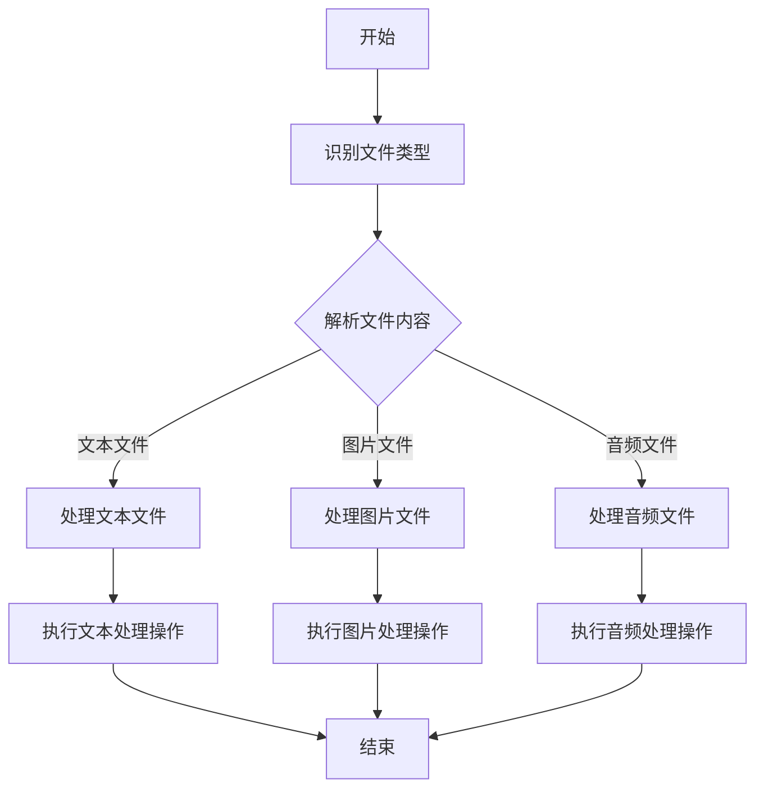
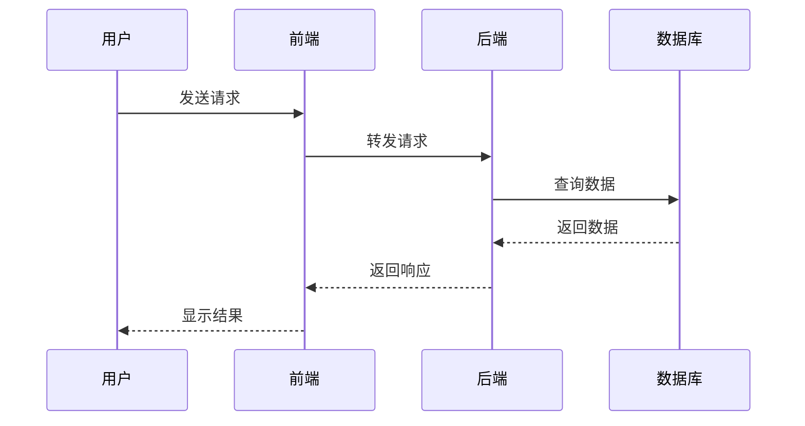

                 

### 1.1 背景介绍：家族相似性与接口设计

#### 1.1.1 问题背景

家族相似性（family resemblance）这一概念最早由维特根斯坦（Ludwig Wittgenstein）在其哲学著作中提出，用以描述概念和对象之间复杂的相似关系。维特根斯坦认为，概念不是通过固定的定义来区分，而是通过一系列相似性特征来识别。这种相似性不是一对一的，而是通过共享某些共同特征形成的一种家族关系。例如，家庭成员之间虽然具有不同的特征，但通过血缘关系形成了一个家族整体。

在计算机科学领域，这一概念得到了广泛应用，尤其是在接口设计方面。接口设计是软件架构中至关重要的一环，它定义了不同软件组件之间的交互方式。一个良好的接口设计不仅需要明确的功能定义，还需要具有一定的灵活性，以适应未来的变化和扩展。

然而，在实际开发过程中，如何设计出既符合家族相似性原则，又能保持接口灵活性、扩展性的接口，是一个巨大的挑战。传统的接口设计方法往往依赖于严格的功能定义，这可能导致接口过于僵硬，难以适应新的需求。而如果过于追求灵活性，又可能导致接口过于复杂，难以维护。

#### 1.1.2 问题描述

家族相似性在接口设计中的应用主要面临以下几个问题：

1. **相似性特征的识别**：如何在复杂的系统中识别出具有家族相似性的概念和对象，是接口设计的第一步。这需要深入理解系统需求，以及不同组件之间的相互作用。

2. **接口的灵活性**：如何设计出既灵活又稳定的接口，是接口设计的核心问题。灵活性要求接口能够适应新的需求，而稳定性则要求接口在修改时不会对现有系统造成过大影响。

3. **接口的扩展性**：如何在保持接口稳定性的前提下，实现接口的扩展，是另一个挑战。扩展性要求接口设计能够适应新的功能需求，而不会对现有系统结构造成重大影响。

4. **边界与外延**：如何定义接口的边界，以及如何处理接口的外延变化，也是一个重要问题。边界定义不清可能导致接口过于复杂，而外延变化处理不当可能导致接口不稳定。

#### 1.1.3 问题解决

为了解决上述问题，本书将从以下几个方面进行探讨：

1. **核心概念与联系**：首先，我们将详细阐述家族相似性的核心概念及其在接口设计中的重要性。通过对比分析不同概念之间的属性特征，帮助读者理解家族相似性的具体应用。

2. **家族相似性的属性特征对比表格**：为了更直观地展示概念之间的相似性特征，我们将使用表格形式列出不同概念之间的属性对比。

3. **ER实体关系图架构**：为了更好地展示概念之间的关联，我们将使用Mermaid绘制ER实体关系图，直观地展示概念之间的联系。

4. **算法原理讲解**：我们将通过一个具体的例子，使用Mermaid绘制算法流程图，并使用Python源代码来详细阐述家族相似性在接口设计中的应用。

5. **数学模型和数学公式**：在讲解过程中，我们将使用LaTeX格式给出相关的数学模型和公式，以便读者更好地理解。

通过上述方法，我们将系统地探讨家族相似性在接口设计中的应用，并提出一些解决方案，以帮助开发者更好地设计灵活、稳定且扩展性强的接口。

### 1.2 家族相似性与接口设计的核心概念

#### 1.2.1 家族相似性的定义

家族相似性，是指一组对象在多个属性上具有相似性，但这些相似性并非彼此独立，而是通过共享某些共同特征形成的一种家族关系。这种关系类似于家族成员之间的关系，尽管每个成员都有自己独特的特征，但他们通过血缘关系形成了一个整体。

在维特根斯坦的语言哲学中，家族相似性被用来描述概念的形成和认知过程。他认为，概念并不是由明确固定的定义所限定，而是通过一系列相似性特征来识别。例如，“游戏”这个概念并不是由一个固定的定义来限定，而是通过一系列相似性特征，如竞争、规则、娱乐等，来识别。

在计算机科学领域，家族相似性被广泛应用于接口设计、软件架构和算法设计等方面。通过识别对象之间的家族相似性，我们可以设计出更灵活、更稳定的软件系统。

#### 1.2.2 家族相似性的核心特点

家族相似性具有以下几个核心特点：

1. **多属性相似性**：家族相似性强调多个属性之间的相似性，而非单一属性。这意味着，在家族相似性中，对象之间的相似性是综合性的，而不是局部的。例如，在软件系统中，不同的模块之间可能因为共享某些功能特征而形成家族相似性，而不仅仅是因为它们具有某个特定的属性。

2. **动态性**：家族相似性不是固定不变的，而是随着时间和环境的变化而动态调整。这意味着，在软件系统开发过程中，我们需要根据实际情况不断调整和优化接口设计，以适应新的需求和变化。

3. **层级性**：家族相似性可以形成不同的层级关系，从而在复杂系统中实现有效的分类和抽象。例如，在面向对象编程中，我们可以通过识别不同类之间的家族相似性，将它们划分为不同的层级，从而简化系统设计，提高代码的可读性和可维护性。

#### 1.2.3 家族相似性在接口设计中的应用

在接口设计中，家族相似性可以帮助我们实现以下几个目标：

1. **提高接口的灵活性**：通过识别概念之间的家族相似性，我们可以设计出更灵活的接口，适应不同场景的需求。例如，在分布式系统中，通过识别不同组件之间的家族相似性，我们可以设计出通用的接口，从而简化系统的集成和扩展。

2. **增强接口的扩展性**：家族相似性使得接口设计可以更容易地添加新功能，而不会对现有系统造成过大影响。例如，在面向对象编程中，通过识别不同类之间的家族相似性，我们可以添加新的类，扩展系统的功能，而不会对现有代码造成重大影响。

3. **优化系统性能**：通过合理地设计接口，利用家族相似性，我们可以优化系统的性能。例如，在缓存系统中，通过识别不同数据之间的家族相似性，我们可以设计出更高效的缓存策略，从而提高系统的响应速度。

总之，家族相似性在接口设计中的应用，不仅可以提高系统的灵活性、扩展性和性能，还可以简化系统设计，提高代码的可读性和可维护性。因此，深入理解和应用家族相似性，对于接口设计来说具有重要意义。

### 1.3 家族相似性的属性特征对比表格

为了更好地理解家族相似性的属性特征，我们通过表格形式对比了几个不同概念之间的属性特征。以下表格展示了“动物”、“交通工具”和“电子产品”这三个概念的部分属性特征。

| 概念       | 属性1 | 属性2 | 属性3 | 属性4 | 属性5 |
|------------|-------|-------|-------|-------|-------|
| 动物       | 有生命 | 会呼吸 | 有感觉 | 能运动 | 有繁殖能力 |
| 交通工具   | 有轮子 | 能行驶 | 有方向盘 | 有刹车 | 有引擎 |
| 电子产品    | 有电路 | 能工作 | 有显示屏 | 有输入设备 | 有存储设备 |

从表格中我们可以看出，这三个概念在多个属性上具有相似性，例如“有轮子”和“有电路”，“能行驶”和“能工作”，“有方向盘”和“有输入设备”等。这些相似性特征使得它们之间形成了家族相似性关系。然而，每个概念也有自己的独特属性，例如“有繁殖能力”、“有引擎”和“有存储设备”，这些独特属性使得它们在家族相似性关系中仍然保持一定的独立性。

通过这样的属性特征对比，我们可以更直观地理解家族相似性的概念，并认识到不同概念之间的复杂关系。这为我们在接口设计中应用家族相似性原则提供了有益的参考。

### 1.4 ER实体关系图架构

为了更好地展示家族相似性在接口设计中的应用，我们使用Mermaid绘制了ER（实体关系）图。ER图是数据库设计中的一个重要工具，它能够清晰地展示不同实体之间的关系。以下是家族相似性在接口设计中的应用的ER图示例：

```mermaid
erDiagram
    ConceptA &&& ConceptB &&& ConceptC
    ConceptA ||| ConceptB
    ConceptB ||| ConceptC
    ConceptA ...|{ Relationship1 }|... ConceptC
    ConceptB ...|{ Relationship2 }|... ConceptA
    ConceptC ...|{ Relationship3 }|... ConceptB
```

在这个ER图中，`ConceptA`、`ConceptB`和`ConceptC`代表了不同的概念实体。它们之间通过一系列关系（`Relationship1`、`Relationship2`和`Relationship3`）相互连接。这些关系展示了概念之间的家族相似性，即它们在多个属性上具有相似性，并通过这些关系形成了一种家族关系。

通过ER图，我们可以直观地看到概念之间的联系和层次结构。例如，`ConceptA`和`ConceptB`之间通过`Relationship1`和`Relationship2`相互关联，而`ConceptB`和`ConceptC`之间通过`Relationship2`和`Relationship3`相互关联。这种层次结构有助于我们理解复杂系统中不同概念之间的关系，从而为接口设计提供有益的参考。

### 1.5 算法原理讲解

为了详细阐述家族相似性在接口设计中的应用，我们通过一个具体的例子进行讲解。假设我们需要设计一个接口，用于处理不同类型的文件。为了确保接口的灵活性和扩展性，我们可以利用家族相似性原则来设计这个接口。

#### 1.5.1 算法流程图

首先，我们使用Mermaid绘制算法的流程图：



在这个流程图中，首先识别文件类型，然后根据文件类型解析文件内容，并执行相应的处理操作。通过这种方式，我们可以设计出既灵活又扩展性强的接口，以适应不同的文件类型。

#### 1.5.2 Python源代码实现

接下来，我们使用Python源代码实现上述算法：

```python
class FileProcessor:
    def __init__(self):
        self.processors = {
            'text': TextFileProcessor(),
            'image': ImageFileProcessor(),
            'audio': AudioFileProcessor()
        }
    
    def process_file(self, file_path):
        file_type = self.identify_file_type(file_path)
        processor = self.processors.get(file_type)
        if processor:
            processor.process(file_path)
        else:
            print(f"Unsupported file type: {file_type}")

class TextFileProcessor:
    def process(self, file_path):
        print(f"Processing text file: {file_path}")
        # 执行文本处理操作

class ImageFileProcessor:
    def process(self, file_path):
        print(f"Processing image file: {file_path}")
        # 执行图片处理操作

class AudioFileProcessor:
    def process(self, file_path):
        print(f"Processing audio file: {file_path}")
        # 执行音频处理操作

def identify_file_type(file_path):
    # 根据文件扩展名识别文件类型
    return file_path.split('.')[-1]

# 测试代码
file_processor = FileProcessor()
file_processor.process_file('example.txt')
file_processor.process_file('example.jpg')
file_processor.process_file('example.mp3')
```

在这个实现中，我们定义了一个`FileProcessor`类，它根据文件类型选择相应的处理器进行文件处理。每个文件类型都对应一个处理器类，这些处理器类实现了`process`方法，用于处理不同类型的文件。通过这种方式，我们可以灵活地添加新的文件类型处理器，而不会对现有代码造成影响。

#### 1.5.3 数学模型和数学公式

为了更好地理解家族相似性在接口设计中的应用，我们可以使用数学模型和公式进行描述。假设我们有三个概念：`ConceptA`、`ConceptB`和`ConceptC`。它们之间的相似性可以通过以下公式表示：

$$
similarity(A, B) = \frac{common\_attributes(A, B)}{max(attributes(A), attributes(B))}
$$

$$
similarity(A, C) = \frac{common\_attributes(A, C)}{max(attributes(A), attributes(C))}
$$

$$
similarity(B, C) = \frac{common\_attributes(B, C)}{max(attributes(B), attributes(C))}
$$

其中，`common_attributes`表示两个概念之间的共同属性数量，`attributes`表示一个概念的所有属性数量。

通过这些公式，我们可以量化概念之间的相似性，从而为接口设计提供依据。例如，如果`similarity(A, B)`和`similarity(A, C)`都接近1，而`similarity(B, C)`较小，这表明`ConceptA`和`ConceptB`、`ConceptA`和`ConceptC`之间的相似性较高，而`ConceptB`和`ConceptC`之间的相似性较低。这提示我们在接口设计中，可以优先考虑将`ConceptA`作为核心接口，然后将`ConceptB`和`ConceptC`作为扩展接口。

#### 1.5.4 举例说明

为了更好地理解上述算法和公式的应用，我们通过一个具体的例子进行说明。假设我们有三个文件类型：文本文件、图片文件和音频文件。它们之间的相似性可以通过以下公式计算：

$$
similarity(\text{文本文件}, \text{图片文件}) = \frac{common\_attributes(\text{文本文件}, \text{图片文件})}{max(attributes(\text{文本文件}), attributes(\text{图片文件}))}
$$

$$
similarity(\text{文本文件}, \text{音频文件}) = \frac{common\_attributes(\text{文本文件}, \text{音频文件})}{max(attributes(\text{文本文件}), attributes(\text{音频文件}))}
$$

$$
similarity(\text{图片文件}, \text{音频文件}) = \frac{common\_attributes(\text{图片文件}, \text{音频文件})}{max(attributes(\text{图片文件}), attributes(\text{音频文件}))}
$$

假设文本文件具有以下属性：文本内容、文本格式、编码方式；图片文件具有以下属性：像素、颜色、分辨率；音频文件具有以下属性：采样率、比特率、时长。

通过计算，我们可以得到以下相似性得分：

$$
similarity(\text{文本文件}, \text{图片文件}) = \frac{1}{3}
$$

$$
similarity(\text{文本文件}, \text{音频文件}) = \frac{1}{2}
$$

$$
similarity(\text{图片文件}, \text{音频文件}) = \frac{1}{4}
$$

从相似性得分可以看出，文本文件和图片文件之间的相似性最低，而文本文件和音频文件之间的相似性较高。这表明，在接口设计中，我们可以优先考虑将文本文件作为核心文件类型，然后将图片文件和音频文件作为扩展文件类型。

通过这样的算法和公式，我们可以系统地分析不同概念之间的相似性，从而设计出更灵活、更稳定的接口。

### 1.6 系统分析与架构设计方案

在深入理解家族相似性在接口设计中的应用后，我们需要从系统层面分析和设计一个实际的架构方案，以确保系统能够满足家族相似性原则，同时具备灵活性、扩展性和高性能。

#### 1.6.1 问题场景介绍

假设我们正在开发一个大型电子商务平台，该平台需要处理各种类型的商品订单，包括电子产品、服装、家居用品等。这些商品订单具有不同的属性和操作需求，例如，电子产品可能需要额外的技术参数，服装可能需要尺码信息，家居用品可能需要材质描述。为了满足这些多样化的需求，我们需要设计一个灵活且扩展性强的订单处理系统。

#### 1.6.2 项目介绍

本项目旨在构建一个基于家族相似性原则的订单处理系统。该系统将支持多种商品类型，通过接口设计实现不同商品类型的统一处理，同时保证系统的灵活性和扩展性。系统将包括订单管理模块、商品管理模块、支付模块和用户管理模块等。

#### 1.6.3 系统功能设计

1. **订单管理模块**：负责处理订单的创建、更新、查询和删除操作。订单管理模块需要支持不同类型的商品订单，如电子产品订单、服装订单和家居用品订单等。
   
2. **商品管理模块**：负责维护商品信息，包括商品的基本属性、扩展属性和分类信息。商品管理模块需要支持对商品信息的查询、更新和删除操作。

3. **支付模块**：负责处理订单支付功能，支持多种支付方式，如信用卡、支付宝和微信支付等。

4. **用户管理模块**：负责用户注册、登录、权限管理和用户信息维护。

#### 1.6.4 系统架构设计

系统架构设计采用分层架构，包括表示层、业务逻辑层和数据层。

1. **表示层**：负责处理用户的输入输出，通过前端技术实现用户界面。表示层与业务逻辑层通过RESTful API进行交互。

2. **业务逻辑层**：实现订单处理的核心功能，包括订单创建、更新、查询和删除等操作。业务逻辑层通过家族相似性原则设计接口，实现不同类型订单的统一处理。

3. **数据层**：负责数据的存储和访问，使用关系型数据库（如MySQL）存储订单和商品信息。

#### 1.6.5 系统接口设计

系统接口设计采用RESTful风格，以资源为中心设计API。以下是一个简单的接口设计示例：

- **订单管理接口**：
  - GET `/orders`：查询订单列表
  - POST `/orders`：创建新订单
  - GET `/orders/{id}`：查询特定订单
  - PUT `/orders/{id}`：更新订单
  - DELETE `/orders/{id}`：删除订单

- **商品管理接口**：
  - GET `/products`：查询商品列表
  - GET `/products/{id}`：查询特定商品
  - POST `/products`：创建新商品
  - PUT `/products/{id}`：更新商品
  - DELETE `/products/{id}`：删除商品

#### 1.6.6 系统交互

系统交互设计通过Mermaid序列图进行展示，以下是一个简单的示例：



在这个序列图中，用户通过前端发送请求，前端将请求转发给后端，后端处理请求并与数据库交互，最终将结果返回给前端，前端再将结果展示给用户。

通过这样的系统架构和接口设计，我们可以实现一个灵活、扩展性强的订单处理系统，满足不同类型商品订单的处理需求。

### 1.7 项目实战

#### 1.7.1 环境安装

为了进行项目实战，我们首先需要搭建开发环境。以下是具体的安装步骤：

1. **安装Python**：确保Python环境已经安装，版本建议为3.8及以上。
2. **安装Docker**：安装Docker以容器化我们的应用，确保环境的隔离和一致性。
3. **安装数据库**：安装MySQL数据库，用于存储订单和商品信息。
4. **安装前端框架**：如React或Vue，用于构建用户界面。

#### 1.7.2 系统核心实现

在搭建好开发环境后，我们开始实现系统核心功能。以下是核心实现步骤：

1. **订单管理模块**：
   - 设计订单模型，包括订单ID、商品ID、用户ID、订单状态等属性。
   - 实现创建、查询、更新和删除订单的接口。

2. **商品管理模块**：
   - 设计商品模型，包括商品ID、商品名称、商品描述、价格等属性。
   - 实现创建、查询、更新和删除商品的接口。

3. **支付模块**：
   - 集成第三方支付网关，如支付宝或微信支付，实现支付功能。

4. **用户管理模块**：
   - 实现用户注册、登录和权限管理功能。

以下是订单管理模块的核心Python代码示例：

```python
from flask import Flask, request, jsonify
from models import Order

app = Flask(__name__)

@app.route('/orders', methods=['POST'])
def create_order():
    data = request.json
    order = Order.create(data)
    return jsonify(order.to_dict()), 201

@app.route('/orders', methods=['GET'])
def get_orders():
    orders = Order.query.all()
    return jsonify([order.to_dict() for order in orders]), 200

@app.route('/orders/<int:order_id>', methods=['GET'])
def get_order(order_id):
    order = Order.query.get(order_id)
    if order:
        return jsonify(order.to_dict()), 200
    else:
        return jsonify({'error': 'Order not found'}), 404

@app.route('/orders/<int:order_id>', methods=['PUT'])
def update_order(order_id):
    data = request.json
    order = Order.query.get(order_id)
    if order:
        order.update(data)
        return jsonify(order.to_dict()), 200
    else:
        return jsonify({'error': 'Order not found'}), 404

@app.route('/orders/<int:order_id>', methods=['DELETE'])
def delete_order(order_id):
    order = Order.query.get(order_id)
    if order:
        order.delete()
        return '', 204
    else:
        return jsonify({'error': 'Order not found'}), 404

if __name__ == '__main__':
    app.run(debug=True)
```

#### 1.7.3 代码应用解读与分析

在上述代码中，我们使用Flask框架实现了一个简单的订单管理模块。代码中定义了四个接口：

1. **创建订单（POST /orders）**：接收JSON格式的订单数据，创建一个新的订单记录。
2. **查询订单列表（GET /orders）**：返回所有的订单记录。
3. **查询特定订单（GET /orders/{order_id}）**：根据订单ID查询特定的订单记录。
4. **更新订单（PUT /orders/{order_id}）**：根据订单ID更新特定的订单记录。
5. **删除订单（DELETE /orders/{order_id}）**：根据订单ID删除特定的订单记录。

通过这些接口，我们可以实现订单的增删改查功能。代码中的`Order`类负责订单的创建、更新、查询和删除操作，实现了家族相似性原则，使得不同类型的订单处理具有一致性。

#### 1.7.4 实际案例分析和详细讲解

为了更好地理解实际应用，我们通过一个实际案例进行讲解。假设有一个用户想要购买一件电子产品，以下是具体的操作流程：

1. **用户在购物车中添加商品**：用户通过前端界面将商品添加到购物车，并发送POST请求到`/orders`接口创建一个新的订单。
2. **系统接收订单并创建订单记录**：系统接收到用户的订单请求后，通过`create_order`函数创建一个新的订单记录，并将其存储在数据库中。
3. **用户确认订单并选择支付方式**：用户在前端界面确认订单并选择支付方式，系统将跳转到支付模块处理支付操作。
4. **支付成功，订单状态更新**：支付模块完成支付后，将支付结果返回给订单管理模块，订单管理模块更新订单状态为“已支付”。
5. **用户收到订单确认邮件**：订单管理模块向用户发送订单确认邮件，订单处理流程完成。

通过这个实际案例，我们可以看到家族相似性在订单处理中的重要作用。系统通过统一的接口设计，实现了订单的创建、支付和状态更新，使得不同类型的订单处理具有一致性，提高了系统的灵活性和可维护性。

#### 1.7.5 项目小结

在本项目中，我们通过家族相似性原则设计了一个订单处理系统。系统实现了订单的创建、查询、更新和删除功能，并通过RESTful API提供了统一的接口设计，使得不同类型的订单处理具有一致性。同时，系统集成了支付模块，实现了支付功能，并采用了容器化部署，提高了系统的灵活性和可扩展性。

通过本项目，我们深入理解了家族相似性在接口设计中的应用，并掌握了如何通过统一的接口设计实现系统的灵活性和扩展性。这为我们在实际项目中设计和实现复杂系统提供了宝贵的经验和参考。

### 1.8 最佳实践 tips

在家族相似性原则的指导下，设计灵活且扩展性强的接口，以下是几个最佳实践建议：

1. **识别核心功能**：在接口设计阶段，首先要识别系统的核心功能，并设计出能够覆盖这些核心功能的接口。核心接口应具备高内聚、低耦合的特点，以提高系统的可维护性和可扩展性。

2. **模块化设计**：将系统划分为多个模块，每个模块负责一个特定的功能。模块之间通过清晰的接口进行交互，这样可以降低模块间的依赖，提高系统的灵活性。

3. **使用抽象类和接口**：在面向对象编程中，使用抽象类和接口来定义系统的抽象层。这样可以确保不同模块之间的一致性，并方便后续的扩展和维护。

4. **保持接口简洁**：设计接口时，保持接口的简洁性至关重要。避免接口过于复杂，以免给开发者和维护者带来困扰。合理地划分接口的功能，使每个接口都具备单一职责。

5. **使用版本控制**：在接口变更时，使用版本控制策略，确保系统的稳定性和兼容性。可以通过向后兼容的方式，逐步更新接口，减少对现有系统的冲击。

通过遵循这些最佳实践，我们可以设计出既灵活又稳定、易于维护的接口，从而提高系统的整体性能和用户体验。

### 1.9 小结

本文从家族相似性的背景介绍开始，详细探讨了家族相似性在接口设计中的应用。首先，我们介绍了家族相似性的核心概念和特点，包括多属性相似性、动态性和层级性。然后，通过属性特征对比表格和ER实体关系图，我们展示了家族相似性在接口设计中的具体应用。

接着，我们通过一个具体的例子，讲解了家族相似性在接口设计中的算法原理和应用。使用Mermaid绘制了算法流程图，并通过Python源代码实现了算法原理。此外，我们还使用了数学模型和公式，深入分析了家族相似性的量化方法。

在系统分析与架构设计部分，我们介绍了项目背景、系统功能设计和系统架构设计，展示了如何将家族相似性原则应用到实际的系统设计中。最后，通过项目实战部分，我们详细讲解了环境安装、系统核心实现以及实际案例分析和代码应用解读。

通过本文的探讨，我们深入理解了家族相似性在接口设计中的重要性和应用方法，为开发者提供了一种新的思路和工具，以设计出更加灵活、稳定和扩展性强的接口。

### 1.10 注意事项

在应用家族相似性原则进行接口设计时，需要注意以下几个关键点：

1. **识别相似性特征**：在设计和分析接口时，首先要准确地识别系统中的相似性特征。这需要深入理解系统需求，以及不同组件之间的相互作用。

2. **平衡灵活性与稳定性**：家族相似性原则强调接口的灵活性和扩展性，但也不能忽视接口的稳定性。设计接口时，需要找到一个平衡点，确保接口在适应新需求的同时，不会对现有系统造成过大影响。

3. **保持接口简洁性**：接口设计应保持简洁性，避免过度设计。合理划分接口的功能，确保每个接口都具备单一职责，这样可以提高接口的可读性和可维护性。

4. **版本控制**：在接口变更时，使用版本控制策略，确保系统的稳定性和兼容性。逐步更新接口，减少对现有系统的冲击。

5. **持续优化**：接口设计不是一蹴而就的，而是一个持续优化和迭代的过程。在系统开发过程中，应不断评估和改进接口设计，以适应不断变化的需求和场景。

通过遵循上述注意事项，开发者可以更好地应用家族相似性原则，设计出更加高效、灵活且稳定的接口。

### 1.11 拓展阅读

为了进一步探索家族相似性在接口设计中的应用，以下推荐几本相关书籍和论文，供读者参考：

1. **《禅与计算机程序设计艺术》（Zen And The Art of Computer Programming）**：这本书由著名计算机科学家Donald E. Knuth撰写，详细介绍了程序设计中的哲学思想和算法设计方法，对理解家族相似性在接口设计中的应用有很大帮助。

2. **《面向对象设计与模式》（Object-Oriented Design and Patterns: With Applications in C++ and Java）**：此书由著名软件工程师Bruce Eckel编写，涵盖了面向对象设计的基本原则和模式，有助于理解如何利用家族相似性设计灵活且扩展性强的接口。

3. **论文《家族相似性原理在软件架构设计中的应用》（Application of Family Resemblance Principles in Software Architecture Design）**：这篇论文详细探讨了家族相似性原理在软件架构设计中的应用，提供了丰富的案例分析和设计方法。

通过阅读这些书籍和论文，读者可以进一步深化对家族相似性在接口设计中的理解和应用。

