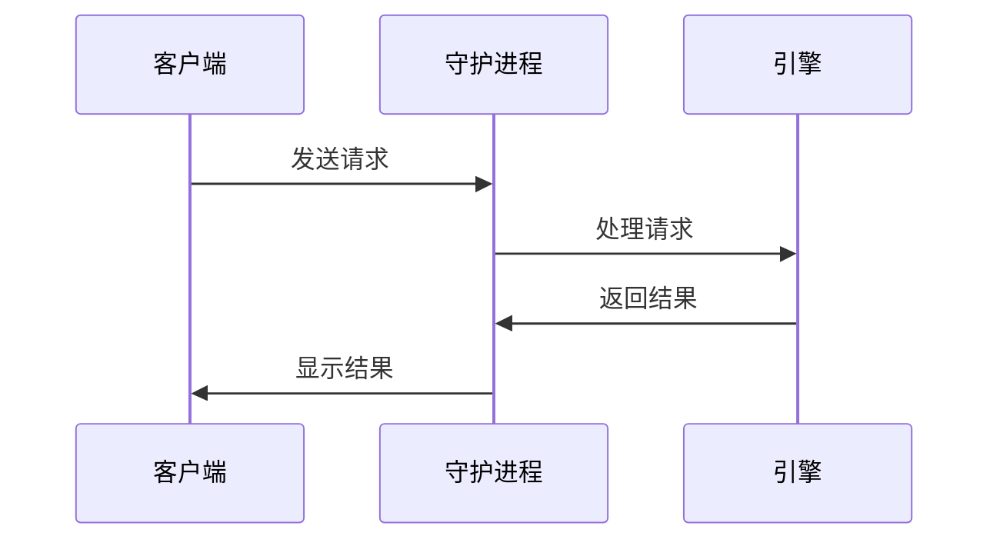
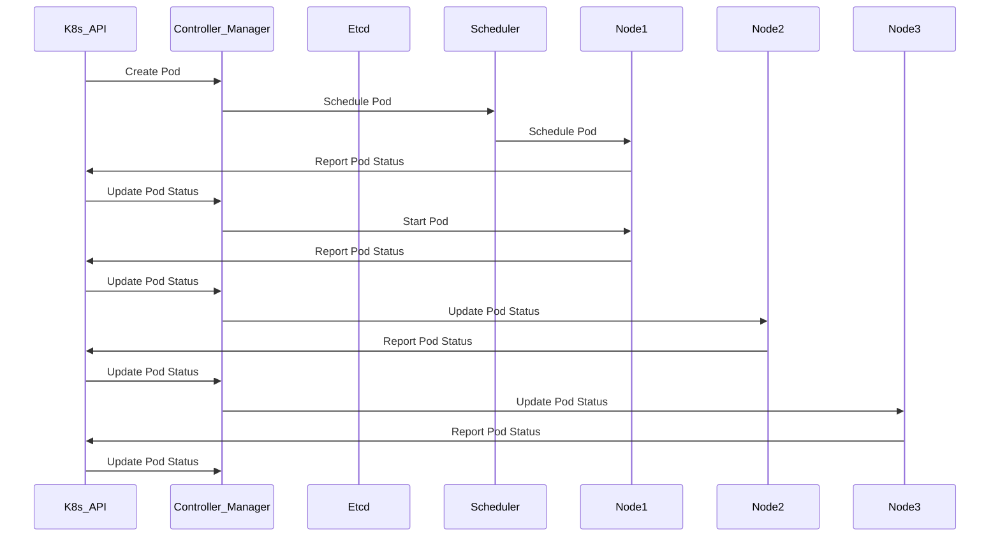

                 

# 容器化技术：Docker与Kubernetes实践

## 关键词

- 容器化技术
- Docker
- Kubernetes
- 微服务
- 容器编排
- 应用部署

## 摘要

本文将深入探讨容器化技术在现代软件开发中的应用，重点介绍Docker与Kubernetes的实践。从背景与概念介绍、Docker基础知识、Docker使用方法、Docker网络，到Docker高级应用和Kubernetes高级功能，本文逐步讲解容器化技术的核心要素和实践方法。最后，通过实战案例分析和最佳实践总结，为读者提供实用的容器化技术指南。

## 第一部分：背景与概念介绍

### 第1章：容器化技术概述

#### 1.1 问题背景与描述

在传统的软件开发中，应用程序的部署往往依赖于特定的操作系统和环境配置，这导致了跨平台部署的复杂性和不确定性。为了解决这一问题，容器化技术应运而生。容器化通过将应用程序及其依赖环境封装在一个独立的容器中，实现了应用程序的轻量级、可移植性和一致性。

#### 1.2 容器化的定义与边界

容器化是一种将应用程序及其运行环境打包成独立单元的技术，每个容器都是独立的、安全的运行环境。容器化不仅提升了开发效率，还降低了部署成本，使得软件可以在不同的环境中无缝运行。

#### 1.3 概念结构与核心要素

容器化技术的核心概念包括容器、镜像、容器运行时和容器编排工具。容器是运行应用程序的实例，镜像则是容器的静态模板，容器运行时负责管理容器的生命周期，而容器编排工具则用于自动化容器的部署和管理。

### 第2章：Docker基础知识

#### 2.1 Docker的概念

Docker是一种开源的应用容器引擎，它允许开发者将应用程序及其依赖环境打包在容器中进行部署和运行。Docker通过提供轻量级、可移植的容器，简化了应用程序的部署过程。

#### 2.2 Docker的架构

Docker的架构包括Docker客户端、Docker守护进程和Docker引擎。Docker客户端与Docker守护进程通过REST API进行通信，而Docker引擎则负责容器的创建、启动、停止和删除等操作。

#### 2.3 Docker的主要组件

Docker的主要组件包括Docker镜像、Docker容器和Docker仓库。Docker镜像是一种静态的容器模板，Docker容器则是运行中的应用程序实例，而Docker仓库则是用于存储和管理镜像的中心化存储服务。

### 第3章：Docker的使用方法

#### 3.1 Docker的安装

在不同的操作系统上安装Docker的方法和步骤。

#### 3.2 Docker镜像的创建与使用

如何使用Dockerfile创建Docker镜像，以及如何加载和使用镜像。

#### 3.3 Docker容器的创建与操作

如何创建、启动、停止、重启和删除Docker容器。

### 第4章：Docker网络

#### 4.1 Docker网络基础

了解Docker的网络模型，如何配置容器网络。

#### 4.2 容器间通信

容器之间的通信方式，包括容器命名、网络命名和端口映射。

#### 4.3 Docker网络使用示例

实际操作示例，演示如何配置Docker网络。

## 第二部分：Docker高级应用

### 第5章：Docker Compose

#### 5.1 Docker Compose简介

Docker Compose用于定义和运行多容器Docker应用。

#### 5.2 Docker Compose文件

如何编写Docker Compose文件，配置服务。

#### 5.3 Docker Compose的使用

Docker Compose的命令行操作，编排应用。

### 第6章：Docker容器编排

#### 6.1 容器编排的概念

容器编排的定义，为什么需要容器编排。

#### 6.2 Kubernetes概述

Kubernetes作为一种容器编排工具的介绍。

#### 6.3 Kubernetes架构

Kubernetes的架构，包括主要组件和工作原理。

### 第7章：Kubernetes高级功能

#### 7.1 Kubernetes部署与配置

如何部署Kubernetes集群，配置Pod和Service。

#### 7.2 Kubernetes策略管理

资源配额、容器资源限制、服务质量保证等。

#### 7.3 Kubernetes自动化与编排

Kubernetes的自动化部署、滚动更新和回滚操作。

### 第8章：Docker与Kubernetes整合

#### 8.1 整合概述

Docker与Kubernetes结合的优势与应用场景。

#### 8.2 整合流程

如何将Docker应用迁移到Kubernetes集群。

#### 8.3 整合示例

演示整合后的Docker与Kubernetes应用部署。

## 第三部分：实战与案例分析

### 第9章：容器化项目实战

#### 9.1 实战环境搭建

介绍如何在本地搭建容器化项目环境。

#### 9.2 实战案例解析

解析一个完整的容器化项目，从设计到部署。

#### 9.3 实战总结

总结实战过程中的经验与教训。

### 第10章：容器化技术最佳实践

#### 10.1 容器化最佳实践

分享容器化过程中的最佳实践和建议。

#### 10.2 案例分析

分析知名企业的容器化实践案例。

#### 10.3 注意事项与拓展

总结容器化技术使用过程中的注意事项，提供拓展阅读。

## 作者

**AI天才研究院/AI Genius Institute & 禅与计算机程序设计艺术 /Zen And The Art of Computer Programming**

-----------------------------------------------------------------

### 第1章：容器化技术概述

#### 1.1 问题背景与描述

在传统的软件开发中，应用程序的部署往往依赖于特定的操作系统和环境配置，这导致了跨平台部署的复杂性和不确定性。当开发团队需要在不同的操作系统上部署应用程序时，往往需要重新配置环境、安装依赖库，甚至修改代码以适应不同的环境。这不仅增加了开发成本，也降低了开发效率。

容器化技术的出现，解决了这一问题。容器化通过将应用程序及其依赖环境封装在一个独立的容器中，实现了应用程序的轻量级、可移植性和一致性。容器化技术使得应用程序可以在任何支持容器引擎的环境中无缝运行，从而简化了部署过程，提高了开发效率。

#### 1.2 容器化的定义与边界

容器化是一种将应用程序及其依赖环境打包成独立单元的技术，每个容器都是独立的、安全的运行环境。容器化不仅提升了开发效率，还降低了部署成本，使得软件可以在不同的环境中无缝运行。

容器化技术的边界主要包括以下几个方面：

1. **容器（Container）**：容器是一个轻量级、可移植的运行环境，它包含了应用程序及其运行时环境。容器是应用程序运行的实例，每个容器都是独立的，相互之间不共享资源。
   
2. **镜像（Image）**：镜像是一个静态的容器模板，包含了应用程序的代码、库和配置文件。通过修改镜像，可以创建不同的容器实例。

3. **容器运行时（Container Runtime）**：容器运行时负责管理容器的生命周期，包括创建、启动、停止、删除等操作。常见的容器运行时有Docker、rkt、LXD等。

4. **容器编排工具（Container Orchestration Tools）**：容器编排工具用于自动化容器的部署和管理，例如Kubernetes、Docker Swarm等。

#### 1.3 概念结构与核心要素

容器化技术的核心概念包括容器、镜像、容器运行时和容器编排工具。下面是一个简单的ER实体关系图架构：

```mermaid
erDiagram
    Container ||--|{ Image }||>
    Container ||--|{ Container Runtime }||>
    Container ||--|{ Container Orchestration Tools }||>
    Image ||--|{ Container }||>
    Container Runtime ||--|{ Container }||>
    Container Orchestration Tools ||--|{ Container }||>
```

在容器化技术中，容器是运行应用程序的实例，镜像则是容器的静态模板，容器运行时负责管理容器的生命周期，而容器编排工具则用于自动化容器的部署和管理。以下是容器化技术的核心要素组成表格：

| 要素         | 说明                                                     |
| ------------ | -------------------------------------------------------- |
| 容器         | 运行应用程序的实例，每个容器都是独立的、安全的运行环境。       |
| 镜像         | 静态的容器模板，包含了应用程序的代码、库和配置文件。           |
| 容器运行时   | 管理容器的生命周期，包括创建、启动、停止、删除等操作。         |
| 容器编排工具 | 自动化容器的部署和管理，例如Kubernetes、Docker Swarm等。     |

#### 1.4 容器化技术的优势

容器化技术具有以下优势：

1. **轻量级和可移植性**：容器体积小，启动速度快，可以在不同的操作系统和硬件平台上无缝运行。
   
2. **环境一致性**：通过容器化，开发、测试和生产环境保持一致，减少了环境差异导致的问题。
   
3. **高密度部署**：容器可以在同一台物理机上运行多个应用程序，提高了硬件利用率。
   
4. **简化部署过程**：容器化技术简化了应用程序的部署过程，提高了开发效率。

#### 1.5 容器化技术的应用场景

容器化技术广泛应用于以下场景：

1. **微服务架构**：容器化技术是微服务架构的最佳实践之一，通过将应用程序拆分成多个微服务，每个微服务都可以独立部署和运行。

2. **持续集成和持续部署（CI/CD）**：容器化技术简化了持续集成和持续部署的过程，提高了软件交付效率。

3. **云计算和容器云**：容器化技术是云计算和容器云的核心技术，用于在云平台上部署和管理大规模的应用程序。

4. **大数据和人工智能应用**：容器化技术可以简化大数据和人工智能应用的部署和管理，提高计算效率。

### 第2章：Docker基础知识

#### 2.1 Docker的概念

Docker是一种开源的应用容器引擎，它允许开发者将应用程序及其依赖环境打包在容器中进行部署和运行。Docker通过提供轻量级、可移植的容器，简化了应用程序的部署过程。

Docker的核心概念包括：

1. **Docker客户端**：Docker客户端是一个命令行工具，用于与Docker守护进程进行通信。

2. **Docker守护进程**：Docker守护进程运行在后台，负责管理Docker容器、镜像和仓库等资源。

3. **Docker引擎**：Docker引擎是Docker的核心组件，负责处理Docker客户端的请求，并执行相应的操作。

4. **Docker容器**：Docker容器是运行中的应用程序的实例，每个容器都是独立的、安全的运行环境。

5. **Docker镜像**：Docker镜像是一个静态的容器模板，包含了应用程序的代码、库和配置文件。通过修改镜像，可以创建不同的容器实例。

6. **Docker仓库**：Docker仓库是一个用于存储和管理镜像的中心化存储服务，常见的Docker仓库有Docker Hub、私有仓库等。

#### 2.2 Docker的架构

Docker的架构包括Docker客户端、Docker守护进程和Docker引擎。Docker客户端与Docker守护进程通过REST API进行通信，而Docker引擎则负责容器的创建、启动、停止和删除等操作。

以下是Docker架构的Mermaid流程图：



#### 2.3 Docker的主要组件

Docker的主要组件包括Docker镜像、Docker容器和Docker仓库。以下是这些组件的详细说明：

1. **Docker镜像**：Docker镜像是一个静态的容器模板，包含了应用程序的代码、库和配置文件。Docker镜像由一个或多个层组成，每个层都包含了一部分应用程序的代码或配置文件。通过修改镜像，可以创建不同的容器实例。

2. **Docker容器**：Docker容器是运行中的应用程序的实例，每个容器都是独立的、安全的运行环境。容器可以从镜像创建，也可以从其他容器衍生。容器中包含了应用程序的代码、库和配置文件，以及运行时环境。

3. **Docker仓库**：Docker仓库是一个用于存储和管理镜像的中心化存储服务。Docker仓库可以是公开的，例如Docker Hub，也可以是私有的，用于企业内部使用。Docker仓库允许用户上传、下载和管理镜像。

### 第3章：Docker的使用方法

#### 3.1 Docker的安装

要在不同的操作系统上安装Docker，可以参考以下步骤：

1. **Windows**：下载并安装Docker Desktop for Windows，这是一个图形界面的安装程序，可以一键安装Docker。

2. **macOS**：安装Docker Desktop for Mac，与Windows类似，这也是一个图形界面的安装程序。

3. **Linux**：在Linux系统上，可以通过包管理器安装Docker。以Ubuntu为例，可以在终端中执行以下命令：

   ```bash
   sudo apt-get update
   sudo apt-get install docker-ce docker-ce-cli containerd.io
   ```

安装完成后，可以通过运行`docker --version`命令来验证Docker是否已成功安装。

#### 3.2 Docker镜像的创建与使用

Docker镜像的创建可以通过Dockerfile来实现。Dockerfile是一个文本文件，包含了构建镜像所需的指令和参数。以下是一个简单的Dockerfile示例：

```Dockerfile
FROM ubuntu:latest
RUN apt-get update && apt-get install -y nginx
EXPOSE 80
```

这个Dockerfile基于最新的Ubuntu镜像，安装了Nginx并暴露了80端口。要构建这个镜像，可以在终端中执行以下命令：

```bash
docker build -t my-nginx .
```

构建完成后，可以通过以下命令运行容器：

```bash
docker run -d -p 8080:80 my-nginx
```

这个命令将启动一个Nginx容器，并将其映射到本地主机的8080端口。

#### 3.3 Docker容器的创建与操作

Docker容器的创建可以通过多种方法实现，以下是其中两种常用的方法：

1. **使用docker run命令**：这是最简单的方法，可以直接在终端中执行`docker run`命令来创建容器。以下是一个简单的示例：

   ```bash
   docker run -d -p 8080:80 my-nginx
   ```

   这个命令将启动一个Nginx容器，并将其映射到本地主机的8080端口。

2. **使用Docker Compose**：Docker Compose是一个用于定义和运行多容器Docker应用的工具。通过编写Docker Compose文件，可以轻松地定义和管理多个容器。以下是一个简单的Docker Compose文件示例：

   ```yaml
   version: '3'
   services:
     web:
       image: my-nginx
       ports:
         - "8080:80"
   ```

   要启动这个服务，可以在终端中执行以下命令：

   ```bash
   docker compose up
   ```

   这个命令将根据Docker Compose文件创建并启动一个Nginx容器。

Docker容器的操作包括启动、停止、重启和删除等。以下是一些常用的命令：

1. **启动容器**：使用`docker run`命令启动容器。

   ```bash
   docker run -d -p 8080:80 my-nginx
   ```

2. **停止容器**：使用`docker stop`命令停止容器。

   ```bash
   docker stop <容器ID或名称>
   ```

3. **重启容器**：使用`docker restart`命令重启容器。

   ```bash
   docker restart <容器ID或名称>
   ```

4. **删除容器**：使用`docker rm`命令删除容器。

   ```bash
   docker rm <容器ID或名称>
   ```

### 第4章：Docker网络

#### 4.1 Docker网络基础

Docker网络是一种用于配置容器网络的技术。Docker提供了多种网络模式，包括桥接、主机、容器内网等。以下是这些网络模式的简要说明：

1. **桥接网络**：桥接网络是Docker默认的网络模式，它将容器连接到一个虚拟网络桥上。容器可以通过IP地址进行通信。

2. **主机网络**：主机网络模式将容器的网络直接连接到宿主机的网络，容器可以使用宿主机的IP地址和端口。

3. **容器内网**：容器内网模式为每个容器创建一个独立的网络命名空间，容器之间可以通过容器名称进行通信。

#### 4.2 容器间通信

容器之间的通信可以通过以下方式进行：

1. **容器名称**：通过容器的名称进行通信，这是一种简单的通信方式。

2. **容器IP地址**：通过容器的IP地址进行通信，这是一种更可靠的通信方式。

3. **容器端口映射**：通过将容器的端口映射到宿主机的端口，可以在宿主机上访问容器中的应用程序。

#### 4.3 Docker网络使用示例

以下是一个简单的Docker网络使用示例：

1. **创建网络**：

   ```bash
   docker network create my-network
   ```

   这个命令创建了一个名为`my-network`的桥接网络。

2. **在网络上创建容器**：

   ```bash
   docker run -d --network=my-network --name web1 my-nginx
   docker run -d --network=my-network --name web2 my-nginx
   ```

   这两个命令分别创建了一个名为`web1`和`web2`的Nginx容器，并连接到`my-network`网络。

3. **容器间通信**：

   ```bash
   docker exec -it web1 ping web2
   ```

   这个命令在`web1`容器中执行ping命令，尝试与`web2`容器进行通信。

### 第5章：Docker Compose

#### 5.1 Docker Compose简介

Docker Compose是一个用于定义和运行多容器Docker应用的工具。通过编写Docker Compose文件，可以轻松地定义和管理多个容器。Docker Compose基于Dockerfile和docker-compose.yml文件，提供了一种简洁、高效的方式来部署和管理多容器应用程序。

Docker Compose的核心概念包括：

1. **服务（Service）**：服务是Docker Compose中的最小部署单元，它代表了应用程序中的一个容器实例。每个服务都可以独立启动、停止和管理。

2. **项目（Project）**：项目是Docker Compose中的多个服务的组合，它代表了整个应用程序。

3. **Docker Compose文件**：Docker Compose文件是一个YAML文件，用于定义项目中的服务和网络等配置。

#### 5.2 Docker Compose文件

Docker Compose文件是一个YAML文件，用于定义项目中的服务和网络等配置。以下是Docker Compose文件的简单示例：

```yaml
version: '3'
services:
  web:
    image: my-nginx
    ports:
      - "8080:80"
  db:
    image: mysql:5.7
    environment:
      MYSQL_ROOT_PASSWORD: root
    volumes:
      - db_data:/var/lib/mysql
volumes:
  db_data:
```

在这个示例中，我们定义了两个服务：`web`和`db`。`web`服务使用`my-nginx`镜像，将容器的80端口映射到宿主机的8080端口。`db`服务使用`mysql:5.7`镜像，设置了MySQL的root密码，并使用了一个名为`db_data`的卷来存储数据库数据。

#### 5.3 Docker Compose的使用

Docker Compose提供了一系列命令，用于启动、停止、重启和管理项目中的服务。以下是Docker Compose的一些常用命令：

1. **启动项目**：

   ```bash
   docker compose up
   ```

   这个命令将根据Docker Compose文件启动项目中的所有服务。

2. **停止项目**：

   ```bash
   docker compose down
   ```

   这个命令将停止项目中的所有服务，并删除容器和网络。

3. **重启项目**：

   ```bash
   docker compose restart
   ```

   这个命令将重启项目中的所有服务。

4. **查看项目状态**：

   ```bash
   docker compose ps
   ```

   这个命令将显示项目中的所有服务和容器的状态。

### 第6章：Docker容器编排

#### 6.1 容器编排的概念

容器编排是指自动化容器的部署、扩展和管理的过程。随着容器化技术的普及，容器编排变得越来越重要。容器编排不仅提高了开发效率，还简化了运维工作。

容器编排的关键概念包括：

1. **编排工具**：用于自动化容器部署和管理的工具，例如Kubernetes、Docker Swarm等。

2. **集群**：一组运行容器的节点，用于分布式部署和管理应用程序。

3. **Pod**：Kubernetes中的最小部署单元，可以包含一个或多个容器。

4. **Service**：用于将Pod暴露为网络服务的抽象，可以使用DNS名称或IP地址访问。

#### 6.2 Kubernetes概述

Kubernetes是一个开源的容器编排平台，用于自动化容器的部署、扩展和管理。Kubernetes提供了一个强大的平台，用于管理分布式系统中的容器化应用程序。

Kubernetes的主要组件包括：

1. **控制平面（Control Plane）**：负责管理集群中的所有节点和Pod，包括集群的配置、调度、监控和安全等。

2. **工作节点（Node）**：运行Pod的物理或虚拟机，每个节点都运行着Kubernetes的组件，例如kubelet、kube-proxy和container runtime。

3. **Pod**：Kubernetes中的最小部署单元，可以包含一个或多个容器。Pod是应用程序的基本运行时单元。

4. **Service**：用于将Pod暴露为网络服务的抽象，可以使用DNS名称或IP地址访问。

#### 6.3 Kubernetes架构

Kubernetes的架构包括控制平面和工作节点两部分。以下是Kubernetes架构的Mermaid流程图：



在这个流程图中，Kubernetes API服务器负责接收用户的创建Pod请求，并将请求转发给控制器管理器。控制器管理器负责调度Pod到合适的节点，并更新Pod的状态。调度器根据节点的资源情况和策略，选择合适的节点来运行Pod。节点上的Kubelet组件负责启动和监控Pod，并定期向Kubernetes API服务器报告Pod的状态。

### 第7章：Kubernetes高级功能

#### 7.1 Kubernetes部署与配置

Kubernetes提供了多种部署和配置Pod的方法，包括手动部署、YAML文件部署、Kubernetes Dashboard部署等。以下是这些方法的基本原理和操作步骤：

1. **手动部署**：

   通过kubectl命令行工具，可以手动创建和部署Pod。以下是一个简单的示例：

   ```bash
   kubectl create pod my-pod --image=my-image
   kubectl get pods
   ```

   这个命令将创建一个名为`my-pod`的Pod，并使用`my-image`镜像运行。

2. **YAML文件部署**：

   通过编写Kubernetes的YAML文件，可以自动化部署和管理Pod。以下是一个简单的YAML文件示例：

   ```yaml
   apiVersion: v1
   kind: Pod
   metadata:
     name: my-pod
   spec:
     containers:
     - name: my-container
       image: my-image
   ```

   将这个YAML文件保存为`my-pod.yaml`，然后使用以下命令部署：

   ```bash
   kubectl apply -f my-pod.yaml
   kubectl get pods
   ```

   这个命令将根据YAML文件创建和部署Pod。

3. **Kubernetes Dashboard部署**：

   Kubernetes Dashboard是一个Web界面，用于监控和管理Kubernetes集群。要使用Kubernetes Dashboard，需要首先安装和配置Ingress资源，然后将Kubernetes Dashboard的URL映射到Ingress资源。以下是基本步骤：

   - 安装Kubernetes Dashboard：

     ```bash
     kubectl apply -f https://raw.githubusercontent.com/kubernetes/dashboard/v2.0.0-beta8/aio/deploy/recommended/kubernetes-dashboard.yaml
     ```

   - 启用Dashboard服务：

     ```bash
     kubectl create service account dashboard-admin -n kubernetes-dashboard
     kubectl create clusterrolebinding dashboard-admin --clusterrole=cluster-admin --serviceaccount=kubernetes-dashboard:dashboard-admin
     ```

   - 打开Kubernetes Dashboard：

     ```bash
     kubectl proxy
     open http://localhost:8001/api/v1/namespaces/kubernetes-dashboard/services/https:kubernetes-dashboard:/proxy/
     ```

   通过Web界面，可以方便地创建和管理Pod、Service、Deploy等资源。

#### 7.2 Kubernetes策略管理

Kubernetes策略管理用于限制和管理资源的使用，确保集群资源的合理分配。以下是Kubernetes策略管理的主要方面：

1. **资源配额（Resource Quotas）**：

   资源配额是一种限制特定命名空间内资源数量的策略。以下是一个简单的示例：

   ```yaml
   apiVersion: v1
   kind: ResourceQuota
   metadata:
     name: my-quota
     namespace: my-namespace
   spec:
     hard:
       pods: 10
       requests.cpu: "10"
       requests.memory: 10Gi
   ```

   这个资源配额将限制命名空间`my-namespace`中的Pod数量为10个，每个Pod的CPU请求为10个CPU核心，内存请求为10GiB。

2. **容器资源限制（Container Resource Limits）**：

   容器资源限制用于限制容器使用的CPU和内存资源。以下是一个简单的示例：

   ```yaml
   apiVersion: v1
   kind: Pod
   metadata:
     name: my-pod
   spec:
     containers:
     - name: my-container
       image: my-image
       resources:
         limits:
           cpu: "1"
           memory: 1Gi
         requests:
           cpu: "0.5"
           memory: 500Mi
   ```

   这个容器资源限制将限制`my-container`容器的CPU使用量为1个CPU核心，内存使用量为1GiB，CPU请求量为0.5个CPU核心，内存请求量为500MiB。

3. **服务质量保证（Quality of Service Guarantees）**：

   服务质量保证用于为Pod提供不同的资源分配策略。Kubernetes提供了三种服务质量类别：Guaranteed、Burstable和BestEffort。以下是一个简单的示例：

   ```yaml
   apiVersion: v1
   kind: Pod
   metadata:
     name: my-pod
   spec:
     containers:
     - name: my-container
       image: my-image
       resources:
         limits:
           cpu: "1"
           memory: 1Gi
         requests:
           cpu: "0.5"
           memory: 500Mi
       qualityOfService:
         class: Burstable
   ```

   这个示例将`my-container`容器的服务质量类别设置为`Burstable`，这意味着它在资源不足时会抢占其他容器的资源。

#### 7.3 Kubernetes自动化与编排

Kubernetes自动化与编排是指通过自动化脚本和工具，自动化Kubernetes集群的部署、扩展和管理。以下是Kubernetes自动化与编排的主要方面：

1. **自动化部署**：

   自动化部署是指通过自动化脚本或工具，自动化部署Kubernetes集群的过程。常见的自动化部署工具有Kubeadm、Kops、Helm等。以下是一个简单的示例：

   ```bash
   kubeadm init
   kubeadm join <控制平面IP>:<控制平面端口> --token <token> --discovery-token-ca-cert-hash sha256:<hash>
   ```

   这个示例使用Kubeadm自动化部署Kubernetes集群。

2. **自动化扩展**：

   自动化扩展是指通过自动化脚本或工具，自动化扩展Kubernetes集群的过程。常见的自动化扩展工具有Kubernetes API、Helm等。以下是一个简单的示例：

   ```bash
   helm install my-app my-app-chart
   kubectl scale deploy my-app --replicas=3
   ```

   这个示例使用Helm和kubectl命令，自动部署和扩展名为`my-app`的部署。

3. **自动化管理**：

   自动化管理是指通过自动化脚本或工具，自动化管理Kubernetes集群的过程。常见的自动化管理工具有Kubernetes API、Kubectl、Prometheus等。以下是一个简单的示例：

   ```bash
   kubectl get pods
   kubectl logs <pod-name>
   kubectl exec <pod-name> -- <命令>
   ```

   这个示例使用Kubectl命令，自动化管理Kubernetes集群中的Pod。

### 第8章：Docker与Kubernetes整合

#### 8.1 整合概述

Docker与Kubernetes整合是指将Docker的应用容器技术与Kubernetes的容器编排功能相结合，以实现更高效、灵活的容器化应用部署。整合的优势在于：

1. **利用Docker的轻量级容器技术**：Docker提供了高效的容器创建和管理，使得容器可以快速启动和停止。

2. **利用Kubernetes的容器编排功能**：Kubernetes提供了强大的容器编排功能，包括自动部署、扩展和管理。

3. **简化部署和管理**：整合后的系统可以简化部署和管理流程，提高开发效率。

#### 8.2 整合流程

将Docker应用迁移到Kubernetes集群，需要遵循以下基本流程：

1. **准备Docker环境**：

   确保Docker环境已经安装在开发主机上，并可以正常运行。

2. **编写Dockerfile**：

   编写Dockerfile，定义应用的容器化构建过程。Dockerfile包含一系列指令，用于安装应用依赖、配置环境变量等。

3. **构建Docker镜像**：

   使用Docker CLI构建Docker镜像。以下是一个简单的示例：

   ```bash
   docker build -t my-app .
   ```

   这个命令将构建一个名为`my-app`的Docker镜像。

4. **推送Docker镜像**：

   将Docker镜像推送到Docker仓库。以下是一个简单的示例：

   ```bash
   docker push my-app
   ```

   这个命令将推送名为`my-app`的Docker镜像到Docker仓库。

5. **准备Kubernetes环境**：

   确保Kubernetes集群已经搭建好，并且可以正常运行。

6. **编写Kubernetes配置文件**：

   编写Kubernetes配置文件，定义应用的部署和管理规则。配置文件通常以YAML格式编写，包括Pod、Service、Deploy等资源定义。

7. **部署到Kubernetes集群**：

   使用Kubectl命令部署应用到Kubernetes集群。以下是一个简单的示例：

   ```bash
   kubectl apply -f my-app-deployment.yaml
   ```

   这个命令将根据`my-app-deployment.yaml`文件部署应用到Kubernetes集群。

#### 8.3 整合示例

以下是一个简单的整合示例，展示如何将一个Docker应用迁移到Kubernetes集群：

1. **Dockerfile**：

   ```Dockerfile
   FROM python:3.9-slim
   WORKDIR /app
   COPY . .
   RUN pip install -r requirements.txt
   CMD ["python", "app.py"]
   ```

   这个Dockerfile使用Python 3.9镜像，将应用程序代码复制到容器中，并安装依赖项。

2. **Docker镜像构建**：

   ```bash
   docker build -t my-app .
   ```

   这个命令构建了一个名为`my-app`的Docker镜像。

3. **Kubernetes配置文件**：

   ```yaml
   apiVersion: apps/v1
   kind: Deployment
   metadata:
     name: my-app
   spec:
     replicas: 2
     selector:
       matchLabels:
         app: my-app
     template:
       metadata:
         labels:
           app: my-app
       spec:
         containers:
       - name: my-app
         image: my-app:latest
         ports:
         - containerPort: 80
   ```

   这个配置文件定义了一个名为`my-app`的Deployment资源，设置了2个副本，并将容器的镜像设置为`my-app:latest`。

4. **部署到Kubernetes集群**：

   ```bash
   kubectl apply -f my-app-deployment.yaml
   ```

   这个命令将根据`my-app-deployment.yaml`文件部署应用到Kubernetes集群。

### 第9章：容器化项目实战

#### 9.1 实战环境搭建

在开始容器化项目实战之前，需要搭建一个容器化环境。以下是在本地搭建容器化环境的基本步骤：

1. **安装Docker**：

   - Windows：

     ```bash
    winget install --id=Docker.Docker --exact
     ```

   - macOS：

     ```bash
     brew cask install docker
     ```

   - Linux：

     ```bash
     sudo apt-get install docker-ce docker-ce-cli containerd.io
     ```

2. **启动Docker服务**：

   ```bash
   sudo systemctl start docker
   ```

3. **安装Kubernetes**：

   - Windows和macOS：

     ```bash
     curl -LO "https://storage.googleapis.com/kubernetes-release/release/$(curl -s https://storage.googleapis.com/kubernetes-release/release/stable.txt)/bin/darwin/amd64/kubectl"
     chmod +x kubectl
     sudo mv kubectl /usr/local/bin/
     ```

   - Linux：

     ```bash
     curl -LO "https://storage.googleapis.com/kubernetes-release/release/$(curl -s https://storage.googleapis.com/kubernetes-release/release/stable.txt)/bin/linux/amd64/kubectl"
     chmod +x kubectl
     sudo mv kubectl /usr/local/bin/
     ```

4. **验证安装**：

   ```bash
   kubectl version
   ```

   输出版本信息，表示安装成功。

#### 9.2 实战案例解析

以下是一个简单的容器化项目实战案例，展示如何使用Docker和Kubernetes构建一个简单的Web应用。

1. **项目需求**：

   构建一个基于Flask的Web应用，提供简单的REST API，包括以下功能：

   - 创建用户
   - 查询用户
   - 更新用户
   - 删除用户

2. **Dockerfile**：

   ```Dockerfile
   FROM python:3.9-slim
   WORKDIR /app
   COPY . .
   RUN pip install -r requirements.txt
   CMD ["python", "app.py"]
   ```

   这个Dockerfile使用Python 3.9镜像，将应用程序代码复制到容器中，并安装依赖项。

3. **Kubernetes配置文件**：

   ```yaml
   apiVersion: apps/v1
   kind: Deployment
   metadata:
     name: flask-app
   spec:
     replicas: 2
     selector:
       matchLabels:
         app: flask-app
     template:
       metadata:
         labels:
           app: flask-app
       spec:
         containers:
         - name: flask-app
           image: flask-app:latest
           ports:
           - containerPort: 80
   ---
   apiVersion: v1
   kind: Service
   metadata:
     name: flask-app
   spec:
     selector:
       app: flask-app
     ports:
     - name: http
       port: 80
       targetPort: 80
     type: LoadBalancer
   ```

   这个配置文件定义了一个名为`flask-app`的Deployment资源，设置了2个副本，并将容器的镜像设置为`flask-app:latest`。还定义了一个名为`flask-app`的Service资源，将流量负载均衡到多个副本。

4. **构建Docker镜像**：

   ```bash
   docker build -t flask-app .
   ```

   这个命令构建了一个名为`flask-app`的Docker镜像。

5. **部署到Kubernetes集群**：

   ```bash
   kubectl apply -f flask-app-deployment.yaml
   ```

   这个命令将根据`flask-app-deployment.yaml`文件部署应用到Kubernetes集群。

6. **验证部署**：

   ```bash
   kubectl get pods
   kubectl get services
   ```

   输出Pod和Service的信息，表示应用已成功部署。

7. **访问Web应用**：

   ```bash
   minikube ip
   ```

   获取Minikube的IP地址，然后在浏览器中访问`http://<Minikube IP地址>`，即可看到Web应用的界面。

#### 9.3 实战总结

通过本节实战案例，我们了解了如何使用Docker和Kubernetes构建一个简单的Web应用。以下是实战过程中的经验与教训：

1. **了解Docker和Kubernetes的基本概念**：在开始实战之前，需要熟悉Docker和Kubernetes的基本概念和操作，包括Dockerfile、Kubernetes配置文件、Docker镜像和容器管理等。

2. **编写清晰的Dockerfile和Kubernetes配置文件**：Dockerfile和Kubernetes配置文件是容器化项目的基础，需要编写清晰、简洁的文件，以便于后续的维护和部署。

3. **使用容器化技术简化部署过程**：容器化技术可以大大简化应用程序的部署过程，提高开发效率。在实际项目中，要充分利用容器化技术的优势，避免手动部署和配置环境。

4. **了解Kubernetes的高级功能**：Kubernetes提供了丰富的功能，包括资源配额、容器资源限制、服务质量保证等。在实际项目中，要充分利用这些功能，确保集群资源的合理分配。

### 第10章：容器化技术最佳实践

#### 10.1 容器化最佳实践

在容器化技术的实际应用中，遵循以下最佳实践可以提升项目的开发效率和稳定性：

1. **使用Docker镜像构建应用程序**：将应用程序及其依赖环境打包成Docker镜像，确保在不同环境中的一致性。

2. **编写清晰的Dockerfile**：Dockerfile应简洁明了，避免不必要的层和依赖，提高构建效率。

3. **使用容器编排工具**：使用Kubernetes等容器编排工具，实现应用程序的自动化部署、扩展和管理。

4. **配置资源限制**：为容器配置合理的CPU和内存限制，避免资源不足或过度消耗。

5. **监控和日志管理**：使用监控工具和日志管理工具，实时监控容器的运行状态，快速发现和解决问题。

6. **备份和恢复**：定期备份容器的数据和配置，确保数据的安全性和一致性。

#### 10.2 案例分析

以下是一些知名企业在容器化技术方面的实践案例：

1. **Netflix**：Netflix使用容器化技术实现了大规模的分布式系统，通过Kubernetes自动化部署和管理应用程序。

2. **亚马逊**：亚马逊在其云服务平台AWS中提供了Kubernetes托管服务，简化了Kubernetes的部署和管理。

3. **谷歌**：谷歌在其云服务平台Google Cloud中提供了Kubernetes服务，并提供了丰富的工具和库，方便用户构建和部署容器化应用程序。

#### 10.3 注意事项与拓展

在容器化技术的实际应用中，需要注意以下事项：

1. **网络配置**：合理配置容器网络的IP地址和端口，确保容器间通信的可靠性。

2. **数据存储**：容器化应用的数据存储需要考虑持久化和备份策略，避免数据丢失。

3. **安全防护**：加强对容器和集群的安全防护，包括网络隔离、权限管理和安全审计等。

4. **性能优化**：对容器化应用进行性能优化，包括资源分配、容器调度和网络优化等。

拓展阅读：

1. **《容器化与Kubernetes实践指南》**：详细介绍了容器化技术和Kubernetes的实战应用。

2. **《Kubernetes权威指南》**：全面介绍了Kubernetes的核心概念、架构和高级功能。

3. **《Docker实战》**：详细讲解了Docker的基本概念、操作方法和最佳实践。

