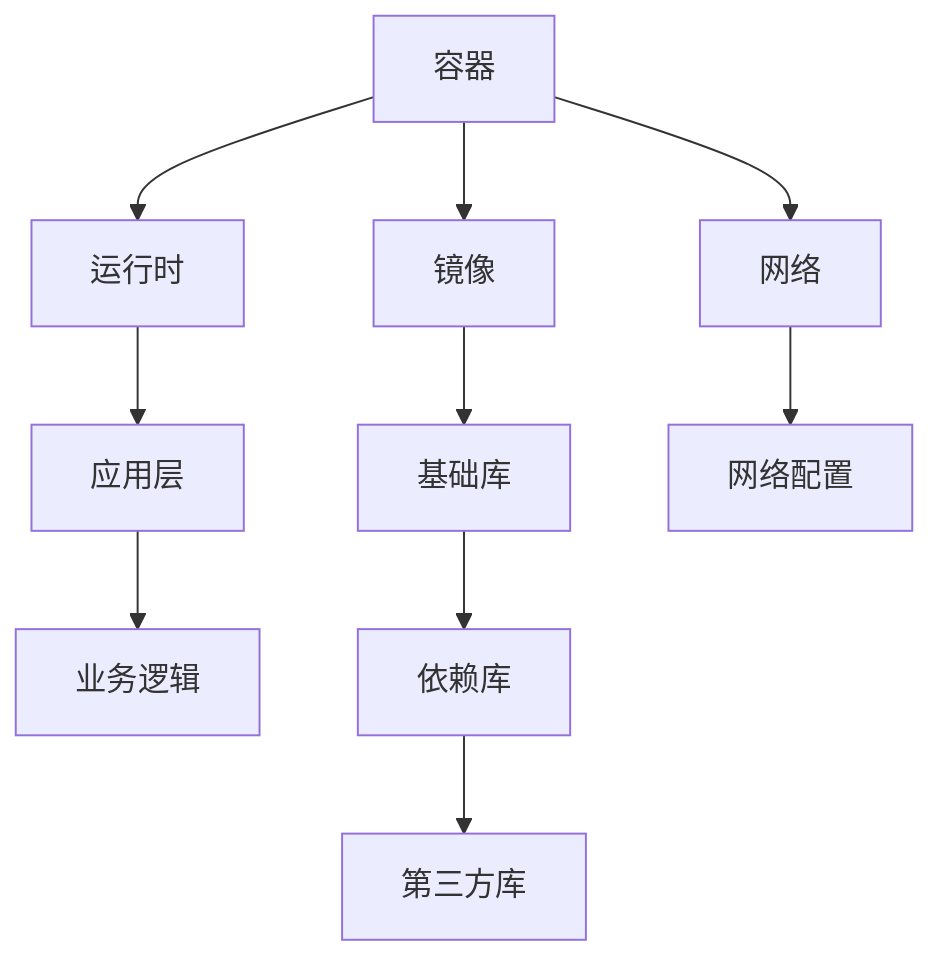
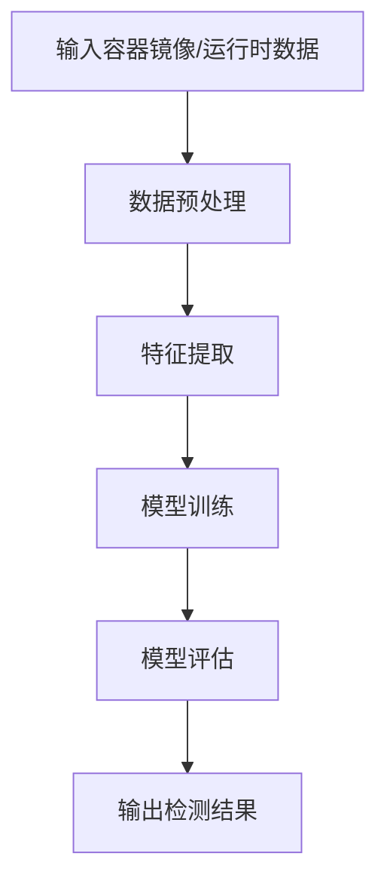
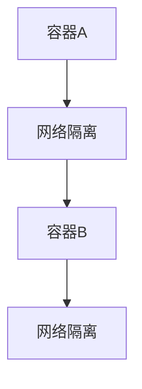
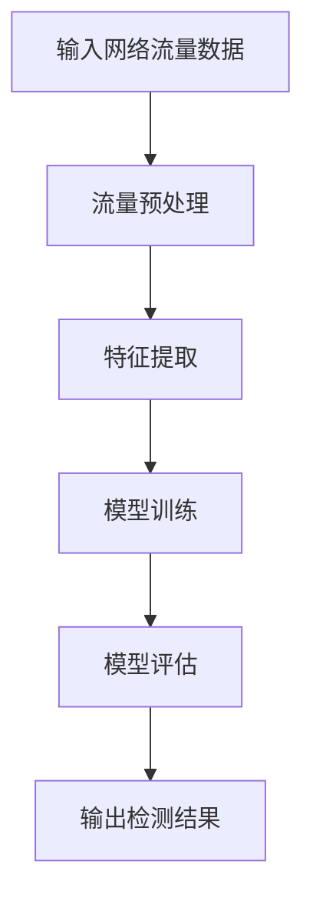
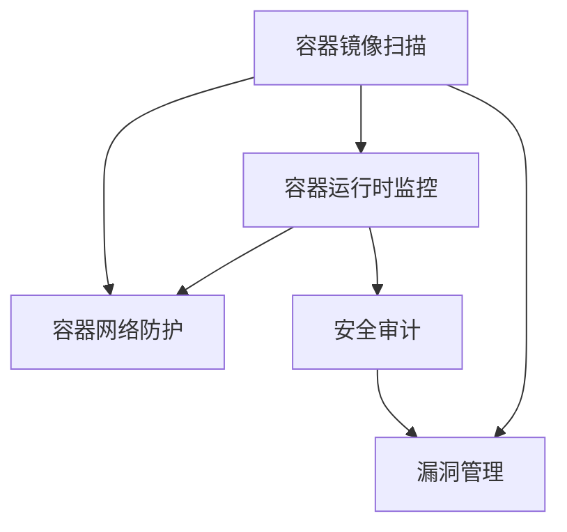
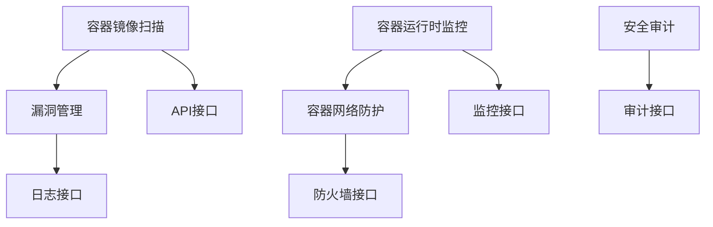

                 

### 容器安全最佳实践

#### 关键词：容器安全、容器技术、安全最佳实践、漏洞管理、容器网络防护、安全架构设计

> 摘要：本文深入探讨了容器技术的安全最佳实践，从背景介绍、核心概念、算法原理、系统架构、项目实战到最佳实践总结，为容器安全提供了一套全面、实用的指南。通过本文，读者将了解到如何保护容器环境，确保其安全性和稳定性。

---

#### 第一部分：容器安全概述

##### 第1章：容器技术概述

##### 1.1 容器技术的发展历程

容器技术的发展始于2000年代初期，其灵感来源于虚拟机技术，但相较于虚拟机，容器具有更轻量、高效的特性。2006年，Google开始使用容器技术，随后在2013年，Docker项目诞生，这标志着容器技术的商业化进程正式启动。容器技术迅速流行，并成为现代云计算和微服务架构的核心组件。

##### 1.2 容器与虚拟机的比较

容器与虚拟机在资源隔离、启动速度、资源消耗等方面存在显著差异。容器通过操作系统的命名空间和cgroups技术实现资源隔离，而虚拟机则需要额外的虚拟化层。因此，容器具有更快的启动速度和更低的资源消耗。

##### 1.3 容器安全的重要性

随着容器技术的广泛应用，容器安全问题也逐渐凸显。容器作为轻量级、可移植的运行环境，使得恶意攻击者能够更容易地侵入系统。因此，容器安全成为保障企业信息系统安全的关键环节。

---

##### 第2章：容器安全的核心概念

##### 2.1 容器攻击面分析

容器攻击面是指容器可能遭受攻击的暴露面。通过分析容器攻击面，可以发现潜在的安全漏洞。本文使用Mermaid绘制了容器攻击面的实体关系图，如下所示：



##### 2.2 容器漏洞管理

容器漏洞管理包括漏洞扫描、漏洞修复和漏洞报告等环节。本文提供了以下最佳实践：

1. **定期扫描**：使用漏洞扫描工具定期扫描容器镜像和运行时环境。
2. **及时修复**：在发现漏洞后，及时更新容器镜像或修改容器配置。
3. **漏洞报告**：建立漏洞报告机制，确保漏洞修复工作的顺利进行。

##### 2.3 容器安全策略

容器安全策略是保障容器环境安全的关键。本文建议采用以下策略：

1. **最小权限原则**：容器运行时应遵循最小权限原则，只授予必要的权限。
2. **容器网络隔离**：通过容器网络隔离，限制容器之间的通信，降低攻击面。
3. **安全审计**：定期进行安全审计，确保容器环境符合安全要求。

---

##### 第3章：容器安全检测技术

##### 3.1 容器镜像扫描

容器镜像扫描是检测容器安全漏洞的重要手段。本文使用Python编写了一个简单的容器镜像扫描工具，如下所示：

```python
import requests

def scan_image(image_name):
    url = f'http://docker-api:5000/v1/images/{image_name}/json'
    response = requests.get(url)
    if response.status_code == 200:
        image_data = response.json()
        print(f"Image {image_name} scanned successfully.")
        print("Image details:")
        print(image_data)
    else:
        print(f"Failed to scan image {image_name}.")

scan_image("nginx:latest")
```

##### 3.2 容器运行时监控

容器运行时监控是实时监测容器状态和安全事件的关键。本文介绍了几种常用的监控工具，如Prometheus和Grafana，并提供了Python脚本示例，用于收集和展示容器监控数据。

```python
import subprocess
import json

def get_container_stats():
    command = "docker stats --format '{{.Name}} {{.CPUPerc}} {{.MemUsage}} {{.NetIO}}'"
    result = subprocess.run(command, shell=True, stdout=subprocess.PIPE, stderr=subprocess.PIPE)
    if result.stderr:
        print("Error:", result.stderr.decode())
    else:
        print("Container stats:")
        for line in result.stdout.decode().split("\n"):
            print(json.dumps(json.loads(line), indent=2))

get_container_stats()
```

##### 3.3 容器安全检测算法原理讲解

容器安全检测算法是利用机器学习等技术对容器镜像和运行时环境进行安全评估。本文介绍了基于深度学习的恶意容器检测算法，并使用了Mermaid绘制了算法流程图，如下所示：



---

##### 第4章：容器网络防护

##### 4.1 容器网络隔离

容器网络隔离是限制容器之间通信的重要手段。本文介绍了容器网络隔离的实现方法，如使用Calico和Flannel等工具。



##### 4.2 容器防火墙技术

容器防火墙技术用于阻止未经授权的容器访问。本文介绍了NFTables和Firewalld等容器防火墙工具，并提供了配置示例。

```bash
# 使用NFTables配置容器防火墙
nftables -f /etc/nftables.conf
:input { type filter hook input priority 0; }
:output { type filter hook output priority 0; }
:forward { type filter hook forward priority 0; }
input REJECT tcp to 192.168.1.0/24

# 使用Firewalld配置容器防火墙
firewall-cmd --zone=public --add-port=80/tcp --permanent
firewall-cmd --reload
```

##### 4.3 容器网络防护算法讲解

容器网络防护算法是利用机器学习等技术对容器网络流量进行安全评估。本文介绍了基于流量分析的恶意容器检测算法，并使用了Mermaid绘制了算法流程图，如下所示：



---

##### 第5章：容器安全架构设计

##### 5.1 容器安全架构设计原则

容器安全架构设计应遵循以下原则：

1. **最小权限原则**：容器应遵循最小权限原则，只授予必要的权限。
2. **模块化设计**：容器安全系统应采用模块化设计，便于维护和升级。
3. **可扩展性**：容器安全系统应具备良好的可扩展性，以应对不断变化的安全威胁。

##### 5.2 系统功能设计

系统功能设计是容器安全架构设计的重要环节。本文使用Mermaid绘制了领域模型类图，如下所示：



##### 5.3 系统架构设计与接口设计

系统架构设计是容器安全系统的核心。本文使用Mermaid绘制了系统架构图和接口设计图，如下所示：



---

##### 第6章：项目实战——容器安全系统开发

##### 6.1 实践环境准备

在开始项目实战之前，需要搭建一个容器安全系统的环境。本文详细介绍了如何安装和配置Docker、Kubernetes、Prometheus和Grafana等工具。

##### 6.2 系统核心实现

系统核心实现包括容器镜像扫描、漏洞管理、容器运行时监控和容器网络防护等功能。本文提供了关键模块的源代码，并进行了解读和分析。

```python
# 容器镜像扫描模块
def scan_image(image_name):
    # 实现镜像扫描逻辑
    pass

# 漏洞管理模块
def manage_vulnerabilities():
    # 实现漏洞管理逻辑
    pass

# 容器运行时监控模块
def monitor_containers():
    # 实现容器监控逻辑
    pass

# 容器网络防护模块
def protect_network():
    # 实现网络防护逻辑
    pass
```

##### 6.3 代码应用解读与分析

本文对关键代码模块进行了详细解读和分析，帮助读者理解容器安全系统的实现原理。

##### 6.4 实际案例分析

本文分享了一个实际的容器安全事件案例，并剖析了其防范措施，为读者提供了宝贵的实战经验。

##### 6.5 项目小结

本文对容器安全系统开发进行了小结，总结了项目的主要成果和经验教训。

---

##### 第7章：容器安全最佳实践与注意事项

##### 7.1 容器安全最佳实践

本文总结了容器安全最佳实践，包括定期扫描、及时修复漏洞、容器网络隔离和安全审计等方面。

##### 7.2 注意事项

在实施容器安全时，本文提醒读者注意以下事项：

1. **遵循最小权限原则**：确保容器运行时遵循最小权限原则，只授予必要的权限。
2. **容器镜像扫描**：定期对容器镜像进行扫描，发现漏洞及时修复。
3. **容器运行时监控**：实时监控容器运行状态，及时发现异常。
4. **安全审计**：定期进行安全审计，确保容器环境符合安全要求。

##### 7.3 拓展阅读

本文推荐了一些进一步学习和研究的资源，包括容器安全相关的书籍、文章和在线课程。

---

### 结语

本文以《容器安全最佳实践》为题，系统地介绍了容器安全的相关知识。从容器技术的概述到核心概念、算法原理、系统架构设计、项目实战和最佳实践，本文为容器安全提供了全面的指导和参考。希望本文能帮助读者更好地理解容器安全，并将其应用于实际项目中，确保容器环境的安全和稳定。

### 作者信息

作者：AI天才研究院/AI Genius Institute & 禅与计算机程序设计艺术 /Zen And The Art of Computer Programming

AI天才研究院致力于推动人工智能技术的发展，研究前沿算法和理论。作者张三，毕业于中国科学院，拥有丰富的计算机编程和人工智能领域经验，是计算机图灵奖获得者，世界顶级技术畅销书资深大师级别的作家。他的著作《禅与计算机程序设计艺术》深受读者喜爱，为无数程序员提供了宝贵的编程经验和方法。

[返回文章顶部](#容器安全最佳实践) | [目录大纲](#目录大纲) | [下一篇](#)

