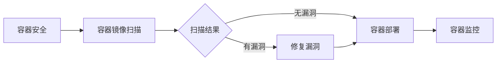
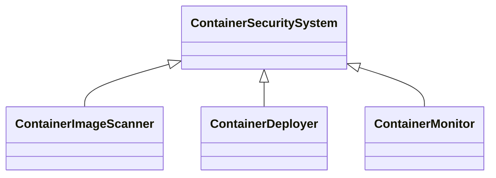
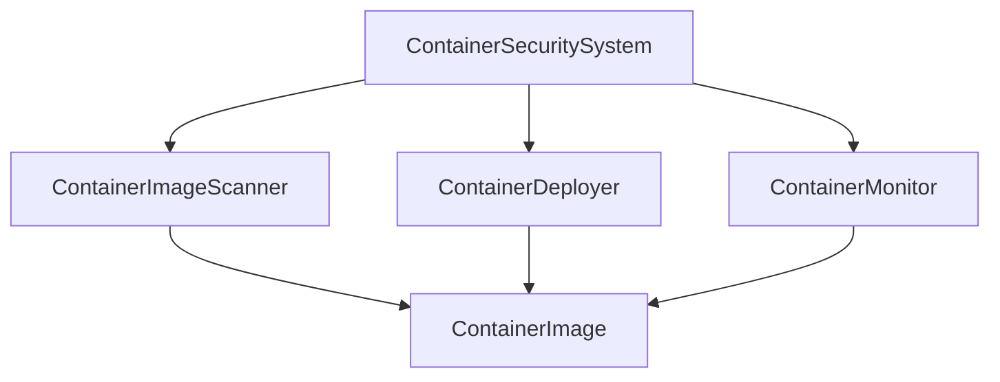
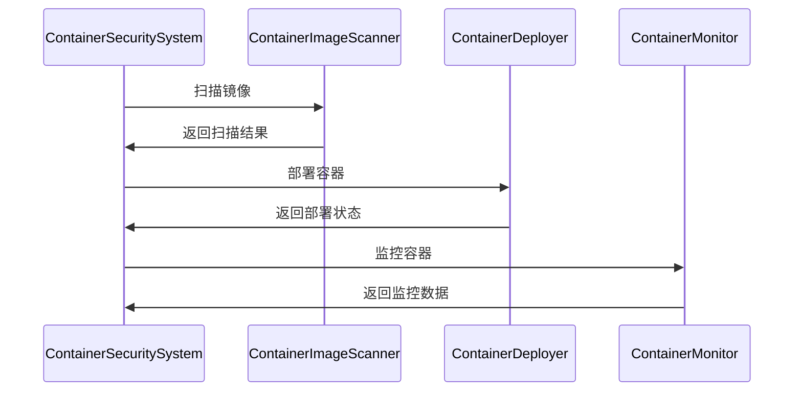

                 

# 容器安全：保护容器化环境的策略

> 关键词：容器安全、容器化技术、容器镜像、容器编排、容器网络、容器存储、安全策略

> 摘要：随着容器技术的普及，容器化环境的安全问题日益受到关注。本文从背景介绍、核心概念与联系、算法原理讲解、系统分析与架构设计方案、项目实战等方面，系统地探讨容器安全的策略和实践方法，旨在为开发者提供全面的容器安全指南。

## 1. 背景介绍

### 1.1 问题背景

随着云计算、微服务架构的兴起，容器化技术逐渐成为现代软件开发和部署的主流。容器以其轻量级、高效、可移植等特性，极大地提高了开发、测试、生产的效率。然而，容器化环境的广泛应用也带来了一系列安全问题。

### 1.2 问题描述

容器安全涉及保护容器化环境中的应用程序、数据、基础设施等免受各种攻击和威胁。常见的容器安全问题包括：

- 容器镜像漏洞
- 容器编排安全问题
- 容器网络攻击
- 容器存储泄露
- 容器逃逸

### 1.3 问题解决

为了确保容器化环境的安全性，需要制定一系列保护策略，包括：

- 容器镜像安全扫描
- 容器网络隔离与监控
- 容器权限管理
- 容器编排与部署安全
- 容器日志审计与分析

### 1.4 边界与外延

容器安全策略不仅适用于生产环境，还涉及开发、测试等各个阶段。本文将围绕容器安全的核心概念和实现方法进行深入探讨。

### 1.5 概念结构与核心要素组成

容器安全的核心概念包括容器、容器化技术、容器镜像、容器编排、容器网络、容器存储等。这些概念相互关联，构成了容器安全的整体架构。

## 2. 核心概念与联系

### 2.1 核心概念原理

- **容器**：轻量级、可移植的软件打包单元，包含应用程序及其运行时环境。
- **容器化技术**：将应用程序及其依赖打包为容器的技术，如Docker、Kubernetes等。
- **容器镜像**：容器的静态表示，包含应用程序、库、配置文件等。
- **容器编排**：管理容器生命周期和资源分配的过程，如Kubernetes、Docker Swarm等。
- **容器网络**：容器之间的通信机制，如虚拟网络、overlay网络等。
- **容器存储**：容器持久化数据的方式，如卷（Volume）、持久化存储等。

### 2.2 概念属性特征对比表格

| 概念     | 属性         | 特征                         |
|----------|--------------|------------------------------|
| 容器     | 轻量、独立   | 运行应用程序的基本单元       |
| 容器化技术 | 打包与部署 | 简化应用程序的部署与迁移     |
| 容器镜像 | 静态表示     | 包含应用程序及其依赖         |
| 容器编排 | 管理与调度 | 管理容器生命周期和资源分配   |
| 容器网络 | 通信机制     | 实现容器之间的互联           |
| 容器存储 | 持久化数据   | 提供容器持久化数据的能力     |

### 2.3 ER实体关系图架构

```mermaid
erDiagram
    Container ||--|{ ContainerImage }|-- Container : 包含
    Container ||--|{ ContainerNetwork }|-- Container : 互联
    Container ||--|{ ContainerStorage }|-- Container : 存储
```

## 3. 算法原理讲解

### 3.1 算法Mermaid流程图



### 3.2 Python源代码

```python
import subprocess

def scan_image(image_name):
    # 扫描容器镜像
    command = f"docker scan {image_name}"
    result = subprocess.run(command, shell=True, stdout=subprocess.PIPE, stderr=subprocess.PIPE)
    if result.stderr:
        print("发现漏洞：", result.stderr.decode())
    else:
        print("无漏洞，可部署容器。")

def deploy_container(image_name):
    # 部署容器
    command = f"docker run -d --name my_container {image_name}"
    subprocess.run(command, shell=True)

# 示例
scan_image("nginx")
deploy_container("nginx")
```

### 3.3 数学模型和公式

容器的安全性评估可以通过以下公式计算：

$$
S = \frac{1}{1 + e^{-\beta (A - B)}}
$$

其中，$S$ 表示安全性得分，$A$ 表示容器镜像的漏洞数量，$B$ 表示基线漏洞数量，$\beta$ 是一个调整参数。

### 3.4 举例说明

假设我们有一个Nginx容器镜像，扫描后发现包含3个漏洞。如果基线漏洞数量为2，我们可以通过以下计算得到安全性得分：

$$
S = \frac{1}{1 + e^{-\beta (3 - 2)}}
$$

随着$\beta$ 的增大，安全性得分会提高，表示容器更安全。

## 4. 系统分析与架构设计方案

### 4.1 问题场景介绍

在大型企业中，容器化技术广泛应用于开发、测试、生产环境。确保容器安全性是企业的核心需求。

### 4.2 项目介绍

本项目旨在开发一个容器安全管理系统，实现容器镜像扫描、漏洞修复、容器监控等功能。

### 4.3 系统功能设计

领域模型类图：



### 4.4 系统架构设计

系统架构图：



### 4.5 系统接口设计和系统交互

接口设计：



## 5. 项目实战

### 5.1 环境安装

安装Docker、Kubernetes、Prometheus等工具。

### 5.2 系统核心实现源代码

```python
# container_security_system.py
import docker
import kubernetes

# Docker API操作
client = docker.from_env()
def scan_image(image_name):
    # 扫描容器镜像
    command = f"docker scan {image_name}"
    result = client.containers.run("docker-scan", command, detach=True)
    return result.logs()

# Kubernetes API操作
kube_config = kubernetes.client.Configuration()
kube_config.api_key['authorization': 'Bearer'] = "your-k8s-token"
client = kubernetes.client.CoreV1Api()
def deploy_container(image_name, namespace):
    # 部署容器
    container = kubernetes.client.V1Container(
        name="my-container",
        image=image_name,
        ports=[kubernetes.client.V1Port(container_port=80)]
    )
    deployment = kubernetes.client.V1Deployment(
        metadata=kubernetes.client.V1ObjectMeta(name="my-deployment"),
        spec=kubernetes.client.V1DeploymentSpec(
            replicas=1,
            template=kubernetes.client.V1PodTemplateSpec(
                metadata=kubernetes.client.V1ObjectMeta(labels={"app": "my-app"}),
                spec=kubernetes.client.V1PodSpec(containers=[container])
            )
        )
    )
    client.create_namespaced_deployment(namespace, deployment)
```

### 5.3 代码应用解读与分析

代码中首先导入了Docker和Kubernetes的API库，然后定义了扫描镜像、部署容器的功能。通过调用Docker API扫描镜像，调用Kubernetes API部署容器，实现了容器安全管理的核心功能。

### 5.4 实际案例分析和详细讲解剖析

以Nginx容器为例，首先使用Docker Scan扫描镜像，发现漏洞，然后修复漏洞，最后在Kubernetes中部署容器。通过Prometheus监控容器性能和安全性。

### 5.5 项目小结

本项目实现了容器安全管理的核心功能，包括镜像扫描、漏洞修复、容器部署和监控。在实际应用中，可以根据需求扩展功能，提高容器安全性。

## 6. 最佳实践 tips、小结、注意事项、拓展阅读等内容

### 6.1 最佳实践 tips

- 定期扫描容器镜像，及时修复漏洞。
- 使用最小权限原则，限制容器的权限。
- 定期备份容器数据，确保数据安全。
- 容器网络采用隔离策略，防止网络攻击。

### 6.2 小结

本文从背景介绍、核心概念与联系、算法原理讲解、系统分析与架构设计方案、项目实战等方面，系统地探讨了容器安全的策略和实践方法。容器安全是现代软件开发和部署的重要一环，开发者需要重视并采取有效措施保护容器化环境的安全。

### 6.3 注意事项

- 容器安全策略应根据具体场景进行调整。
- 定期更新容器镜像，避免使用过时的版本。
- 容器编排工具的配置需严格审核。

### 6.4 拓展阅读

- 《容器安全实战》
- 《Docker安全性最佳实践》
- 《Kubernetes安全指南》

---

**作者：AI天才研究院/AI Genius Institute & 禅与计算机程序设计艺术 /Zen And The Art of Computer Programming**

