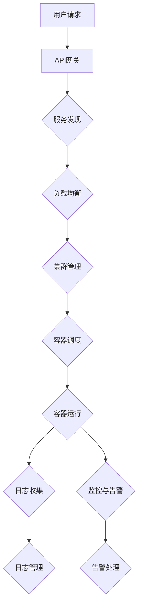
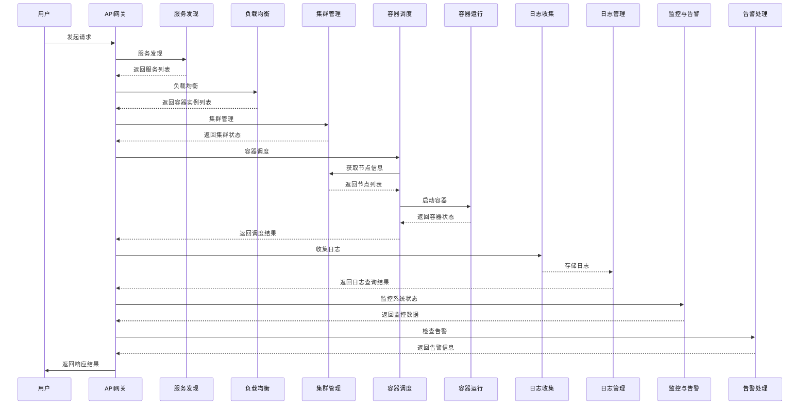

                 

# 容器编排技术：大规模部署与管理的挑战

## 关键词
容器编排、Kubernetes、大规模部署、服务发现、负载均衡、自动化部署

## 摘要
容器编排技术在现代IT领域正逐渐成为不可或缺的一部分。随着容器技术的普及，如何在大规模环境下高效地部署和管理容器化应用成为了一个新的挑战。本文将从容器编排技术的背景、核心概念、算法原理、系统设计、项目实战等方面，一步步剖析容器编排技术，帮助读者深入理解其在大规模部署与管理的挑战与解决方案。

## 目录大纲

### 第一部分：背景介绍

#### 第1章 容器编排技术概述
1.1 容器技术发展历程
1.2 容器与虚拟机的对比
1.3 容器编排的核心挑战

### 第二部分：核心概念与联系

#### 第2章 容器编排核心技术
2.1 容器编排框架概述
2.2 核心概念与属性特征对比表
2.3 ER实体关系图架构

### 第三部分：算法原理讲解

#### 第3章 容器编排算法与优化
3.1 调度算法原理
3.2 自动化部署与更新策略
3.3 负载均衡算法

### 第四部分：系统分析与架构设计

#### 第4章 容器编排系统设计
4.1 问题场景介绍
4.2 系统功能设计
4.3 系统架构设计
4.4 系统接口设计与交互

### 第五部分：项目实战

#### 第5章 容器编排项目实践
5.1 环境安装与配置
5.2 系统核心实现
5.3 代码应用解读与分析
5.4 实际案例分析

#### 第6章 最佳实践与小结
6.1 最佳实践
6.2 小结

### 第一部分：背景介绍

## 第1章 容器编排技术概述

### 1.1 容器技术发展历程

容器技术的概念可以追溯到20世纪70年代的操作系统领域。当时，Unix操作系统引入了进程隔离的概念，允许多个进程在同一个宿主操作系统上独立运行，而不相互干扰。这是容器技术的雏形。然而，真正的容器技术兴起是在2000年之后，尤其是2006年Linux容器（LXC）的出现，标志着现代容器技术的诞生。

随着时间的推移，容器技术逐渐发展壮大，特别是在2013年Docker的推出，使得容器技术开始广泛应用。Docker提供了一个简单的、轻量级的容器化解决方案，使得开发者可以将应用程序及其依赖环境打包成一个容器，从而实现“一次编写，到处运行”的目标。

随着容器技术的成熟，容器编排技术应运而生。容器编排技术旨在解决在分布式环境中如何高效地部署、管理和运行大量容器的问题。代表性的容器编排平台有Kubernetes、Docker Swarm等。

### 1.2 容器与虚拟机的对比

容器与虚拟机在隔离性、性能和资源使用等方面存在显著差异。首先，从技术原理上看，容器通过操作系统的命名空间和cgroups实现资源隔离，而虚拟机则是通过虚拟化硬件层来实现隔离。这意味着容器在隔离性方面不如虚拟机严格，但容器在资源占用和性能上更具优势。

在资源管理方面，容器可以直接使用宿主机的操作系统资源，而虚拟机则需要额外的虚拟化层来管理资源，导致性能开销较大。此外，容器的启动速度快，可以在毫秒级启动，而虚拟机则需要数分钟。

在实际应用场景方面，容器更适合于微服务架构和持续集成/持续部署（CI/CD）流程，而虚拟机则更多应用于需要严格隔离和资源管理的场景，如企业级应用和高性能计算。

### 1.3 容器编排的核心挑战

容器编排技术面临的核心挑战主要包括以下几个方面：

#### 大规模部署

随着容器技术的普及，越来越多的企业开始将应用程序容器化，并期望在分布式环境中大规模部署和管理这些容器。这要求容器编排平台具备高可用性、可扩展性和高性能，以确保大规模部署的顺利进行。

#### 服务发现与负载均衡

在分布式环境中，容器可能会分布在不同的节点上。如何高效地发现服务并提供负载均衡是一个关键问题。容器编排平台需要提供自动化的服务发现机制和负载均衡策略，以确保服务的可用性和性能。

#### 自动化与持续集成

自动化是容器编排技术的一大优势，通过自动化工具可以大大提高部署和管理效率。持续集成（CI）和持续部署（CD）是实现自动化部署的关键，容器编排平台需要提供与CI/CD工具的集成方案，以便实现无缝的自动化流程。

### 第二部分：核心概念与联系

## 第2章 容器编排核心技术

### 2.1 容器编排框架概述

容器编排框架是用于管理容器化应用的一系列工具和组件。其中，最具代表性的框架是Kubernetes（简称K8s），它由Google设计并捐赠给Cloud Native Computing Foundation（CNCF）进行维护。Kubernetes提供了一套完整的容器编排解决方案，包括服务发现、负载均衡、自动部署和更新等功能。

除了Kubernetes，还有其他一些流行的容器编排框架，如Docker Swarm和Apache Mesos。Docker Swarm是Docker官方推出的容器编排工具，它基于Docker Engine提供集群管理功能。Apache Mesos是一个分布式资源调度平台，可以用于管理容器、虚拟机和其他计算资源。

### 2.2 核心概念与属性特征对比表

在容器编排中，一些核心概念如Pod、Deployment、Service等具有特定的属性特征。以下是一个简单的对比表：

| 概念   | 定义                                                         | 属性特征                                                         |
| ------ | ------------------------------------------------------------ | ------------------------------------------------------------ |
| Pod    | Kubernetes中的最小部署单元，包含一个或多个容器                 | 容器共享网络和存储资源，具有独立IP地址和端口映射                 |
| Deployment | 用于管理Pod的自动化部署和更新策略                           | 提供滚动更新、回滚等策略，确保应用程序的高可用性                 |
| Service | 容器之间的通信接口，实现服务发现和负载均衡                     | 提供基于DNS或IP的服务发现，支持多种负载均衡策略，如轮询、最少连接等 |
| Ingress | 容器之间的外部访问接口，用于管理外部流量进入容器网络             | 支持基于HTTP和HTTPS的路由和SSL终止功能                         |

### 2.3 ER实体关系图架构

实体关系图（Entity-Relationship Diagram，ERD）是描述数据库中实体及其相互关系的一种图形表示方法。在容器编排系统中，ERD可以帮助我们理解各个组件之间的关系和数据流。

以下是一个简化的ERD，展示了Kubernetes中的一些核心实体及其关系：

```mermaid
erDiagram
  Node ||--|{ Pod }|--|| Service
  Pod ||--|{ Container }|--|| Deployment
  Deployment ||--|{ ConfigMap }|--|| Ingress
  Service ||--|{ IngressRule }|--|| Ingress
  Node {
    id
    address
    role
  }
  Pod {
    id
    name
    namespace
  }
  Container {
    id
    name
    image
  }
  Deployment {
    id
    name
    namespace
    replicas
  }
  ConfigMap {
    id
    name
    namespace
    data
  }
  Ingress {
    id
    name
    namespace
    rules
  }
  IngressRule {
    host
    path
    backend
  }
```

在这个ERD中，Node表示Kubernetes集群中的物理或虚拟机节点，Pod是容器化的应用实例，Container是Pod中的一个或多个运行中的容器，Deployment用于管理Pod的部署和更新，ConfigMap用于存储配置数据，Ingress用于管理外部流量进入集群。

### 第三部分：算法原理讲解

## 第3章 容器编排算法与优化

### 3.1 调度算法原理

容器编排中的调度算法负责将Pod分配到集群中的合适节点上。Kubernetes调度器根据一系列的规则和策略来选择最佳的节点。以下是一些常用的调度算法：

1. **基于资源优先级**：调度器会优先选择资源使用率低的节点，以最大化资源利用率。
2. **基于节点亲和性**：调度器会尝试将相关的Pod调度到具有相同亲和性的节点上，以提高系统性能和稳定性。
3. **基于服务亲和性**：调度器会考虑Pod所属的服务，尽量将相关服务的Pod调度到同一节点上，以简化服务发现和负载均衡。

Kubernetes调度器的实现采用了一个称为“调度器框架”的结构，它允许插件扩展和自定义调度策略。调度器框架的核心是“调度器核心”，它负责处理调度请求、选择节点和分配Pod。调度器核心支持多种调度算法，并通过插件机制实现了多种策略。

### 3.2 自动化部署与更新策略

自动化部署与更新是容器编排的重要组成部分，它确保了应用程序的持续可用性和稳定性。以下是一些常见的自动化部署与更新策略：

1. **Continuous Deployment（持续部署）**：持续部署是一种自动化部署策略，它将新的代码版本快速部署到生产环境中。这种策略通常与自动测试和自动化部署工具相结合，以确保每次部署都是安全的。
2. **Canary Releases（金丝雀发布）**：金丝雀发布是一种逐步部署新版本的方法，它首先将新版本部署到一小部分用户，然后根据反馈逐步扩大部署范围。这种策略可以降低新版本发布的风险。
3. **Blue-Green Deployments（蓝绿部署）**：蓝绿部署是一种通过同时运行两个版本的应用程序进行更新和部署的方法。首先，将新版本部署到“绿”环境，然后逐渐将流量从“蓝”环境迁移到“绿”环境。这种策略可以确保在发生问题时快速回滚到旧版本。

### 3.3 负载均衡算法

负载均衡是容器编排中另一个关键问题，它负责将流量分配到多个容器实例上，以提高系统的响应速度和可用性。以下是一些常用的负载均衡算法：

1. **轮询（Round Robin）**：轮询算法是最简单的负载均衡算法，它按照顺序将请求分配到每个容器实例上。这种算法简单且易于实现，但可能无法充分利用容器的计算能力。
2. **最少连接（Least Connections）**：最少连接算法将新的请求分配到连接数最少的容器实例上，以平衡负载。这种算法可以更好地利用容器的资源，但需要跟踪每个实例的当前连接数。
3. **基于权重（Weighted）**：基于权重算法允许为每个容器实例分配不同的权重，从而根据权重分配流量。这种算法可以根据实例的性能和负载来调整流量分配，但实现起来相对复杂。

### 第四部分：系统分析与架构设计

## 第4章 容器编排系统设计

### 4.1 问题场景介绍

在一个大型企业级应用场景中，业务需求不断变化，应用程序需要快速部署和更新，同时保证高可用性和稳定性。传统的手动部署和更新方式效率低下且容易出错，无法满足快速迭代的需求。为了解决这个问题，企业决定采用容器编排技术，实现自动化部署和更新，以提高开发效率和系统可靠性。

### 4.2 系统功能设计

容器编排系统需要实现以下核心功能：

1. **容器调度**：根据资源使用情况和业务需求，将容器调度到合适的节点上，确保系统的高效运行。
2. **服务发现**：自动发现容器化应用，并提供访问接口，简化服务发现和负载均衡。
3. **自动化部署**：实现自动化部署和更新，确保应用程序的快速迭代和稳定运行。
4. **监控与告警**：实时监控系统状态，及时发现和处理异常情况，确保系统的可用性和稳定性。
5. **日志管理**：集中收集和管理容器日志，方便日志分析和管理。

为了实现上述功能，我们可以设计以下领域模型：

```mermaid
classDiagram
    Container <<class>> { id, name, image, status }
    Node <<class>> { id, name, role, status }
    Service <<class>> { id, name, type, ports }
    Deployment <<class>> { id, name, namespace, replicas, strategy }
    ConfigMap <<class>> { id, name, namespace, data }
    Ingress <<class>> { id, name, namespace, rules }
    Monitoring <<class>> { id, name, type, status }
    Alert <<class>> { id, name, namespace, type, status }
    Log <<class>> { id, name, namespace, type, data }

    Container --|>$> Service
    Container --|>$> Deployment
    Container --|>$> ConfigMap
    Container --|>$> Ingress
    Node --|>$> Container
    Monitoring --|>$> Node
    Alert --|>$> Monitoring
    Log --|>$> Container
```

在这个领域模型中，Container表示容器实例，Node表示节点，Service表示服务，Deployment表示部署策略，ConfigMap表示配置数据，Ingress表示外部访问接口，Monitoring表示监控信息，Alert表示告警信息，Log表示日志。

### 4.3 系统架构设计

容器编排系统的架构设计需要考虑以下几个方面：

1. **集群管理**：负责集群的初始化、节点管理、负载均衡等。
2. **服务发现与负载均衡**：提供服务发现和负载均衡功能，确保应用程序的可用性和性能。
3. **自动化部署与更新**：实现自动化部署和更新，确保应用程序的快速迭代。
4. **监控与告警**：实时监控系统状态，及时发现和处理异常情况。
5. **日志管理**：集中收集和管理容器日志。

以下是一个简化的系统架构图：



在这个架构中，用户请求通过API网关进入系统，服务发现和负载均衡模块负责将请求分配到合适的容器实例上。集群管理模块负责集群的初始化、节点管理和负载均衡。容器调度模块负责将容器调度到合适的节点上，容器运行模块负责容器的启动和运行。日志收集模块负责收集容器日志，日志管理模块负责日志的存储和管理。监控与告警模块负责实时监控系统状态，并生成告警信息。

### 4.4 系统接口设计与交互

容器编排系统的接口设计需要考虑到各个模块之间的交互和数据流。以下是一个简化的接口设计：



在这个接口设计中，用户请求通过API网关进入系统，API网关负责调用服务发现和负载均衡模块，根据服务发现和负载均衡的结果，API网关调用集群管理模块获取集群状态，然后调用容器调度模块进行容器调度。容器调度模块将容器调度到合适的节点上，并启动容器。日志收集模块负责收集容器日志，日志管理模块负责存储和管理日志。监控与告警模块负责实时监控系统状态，并生成告警信息。最后，API网关将响应结果返回给用户。

### 第五部分：项目实战

## 第5章 容器编排项目实践

### 5.1 环境安装与配置

在一个典型的容器编排项目中，首先需要搭建一个Kubernetes集群。以下是一个简化的安装步骤：

1. **安装Docker**：在所有节点上安装Docker，确保版本兼容。
2. **安装Kubeadm**：在主节点上安装kubeadm，用于初始化Kubernetes集群。
3. **初始化集群**：使用kubeadm init命令初始化集群，并记录令牌和kubeadm join命令。
4. **安装Kubelet和Kubeadm**：在所有节点上安装kubelet、kubeadm和kubectl。
5. **加入节点**：使用kubeadm join命令将节点加入集群。

### 5.2 系统核心实现

在容器编排项目中，系统核心实现包括容器调度、服务发现、负载均衡和自动化部署等模块。以下是一个简化的实现：

1. **容器调度**：使用Kubernetes的调度器框架实现自定义调度策略，如基于资源使用率和节点亲和性的调度策略。
2. **服务发现**：使用CoreDNS或Traefik等工具实现服务发现，确保容器之间可以通过DNS进行通信。
3. **负载均衡**：使用Nginx或HAProxy等工具实现负载均衡，确保外部流量可以均匀分配到多个容器实例上。
4. **自动化部署**：使用Helm或Kustomize等工具实现自动化部署和更新，确保应用程序可以快速迭代。

### 5.3 代码应用解读与分析

以下是一个简单的Kubernetes配置文件示例，用于部署一个Nginx容器：

```yaml
apiVersion: apps/v1
kind: Deployment
metadata:
  name: nginx-deployment
spec:
  replicas: 3
  selector:
    matchLabels:
      app: nginx
  template:
    metadata:
      labels:
        app: nginx
    spec:
      containers:
      - name: nginx
        image: nginx:latest
        ports:
        - containerPort: 80
```

在这个配置文件中，我们定义了一个名为`nginx-deployment`的Deployment对象，它负责管理一个名为`nginx`的Pod。Deployment确保至少有3个副本运行，并在Pod失败时自动替换。Pod的模板中定义了一个名为`nginx`的容器，使用最新的Nginx镜像，并映射端口80。

### 5.4 实际案例分析

在一个实际案例中，一个电子商务公司采用了容器编排技术来部署其网站。公司网站由多个微服务组成，包括用户认证、订单处理、商品管理等。以下是一个简化的案例分析和讲解：

1. **服务拆分**：公司首先将网站拆分成多个微服务，每个服务负责特定的业务功能，如用户认证、订单处理等。
2. **容器化**：每个微服务都被容器化，并使用Docker镜像进行打包。
3. **部署与编排**：使用Kubernetes进行容器编排，将微服务部署到集群中，并使用Helm进行自动化部署和管理。
4. **服务发现与负载均衡**：使用CoreDNS进行服务发现，确保微服务之间可以通过DNS进行通信。使用HAProxy进行负载均衡，确保外部流量可以均匀分配到多个微服务实例上。
5. **监控与告警**：使用Prometheus和Grafana进行实时监控和告警，确保系统的高可用性和稳定性。

### 5.5 项目小结

通过实际案例，我们可以看到容器编排技术在部署和管理大规模应用程序方面的优势。容器编排不仅提高了系统的可扩展性和灵活性，还简化了部署和更新流程。然而，容器编排也带来了一些挑战，如集群管理、服务发现、负载均衡等。为了解决这些问题，我们需要深入了解容器编排技术的核心概念和算法原理，并结合最佳实践进行系统设计和优化。

### 第六部分：最佳实践与小结

## 第6章 最佳实践与小结

### 6.1 最佳实践

在容器编排项目中，以下是一些最佳实践：

1. **容器化关键组件**：将关键业务组件容器化，以提高系统的可移植性和一致性。
2. **自动化部署与更新**：使用自动化工具如Helm或Kustomize实现自动化部署和更新，提高开发效率。
3. **服务发现与负载均衡**：使用自动化服务发现和负载均衡工具，确保服务的高可用性和性能。
4. **监控与日志管理**：使用监控工具如Prometheus和日志管理工具如ELK进行实时监控和日志分析，确保系统的高可用性和可维护性。
5. **资源优化**：根据业务需求合理分配资源，避免资源浪费和性能瓶颈。

### 6.2 小结

容器编排技术是现代IT领域的重要组成部分，它提供了高效、灵活的部署和管理方式。通过深入理解容器编排技术的核心概念和算法原理，我们可以更好地应对大规模部署和管理的挑战。在实际项目中，结合最佳实践进行系统设计和优化，可以确保系统的稳定性和可靠性。

### 注意事项

1. **性能监控**：定期对系统进行性能监控，及时发现并解决性能瓶颈。
2. **备份与恢复**：定期备份数据和配置文件，确保在发生故障时可以快速恢复。
3. **安全性**：确保容器镜像和配置文件的安全性，防止潜在的安全威胁。

### 拓展阅读

1. 《Kubernetes权威指南》
2. 《容器化与容器编排实战》
3. 《微服务架构设计与实现》

作者：AI天才研究院/AI Genius Institute & 禅与计算机程序设计艺术 /Zen And The Art of Computer Programming

---

## 附录

### 参考文献

1. [Kubernetes官方文档](https://kubernetes.io/docs/)
2. [Docker官方文档](https://docs.docker.com/)
3. [CoreDNS官方文档](https://coredns.io/)
4. [HAProxy官方文档](https://www.haproxy.org/)
5. [Prometheus官方文档](https://prometheus.io/docs/)
6. [ELK Stack官方文档](https://www.elastic.co/guide/en/elasticsearch/reference/current/index.html)

### 联系方式

- 邮箱：[contact@ig-genius-institute.com](mailto:contact@ig-genius-institute.com)
- 网站：[https://www.ig-genius-institute.com/](https://www.ig-genius-institute.com/)
- 微信公众号：AI天才研究院

---

本文由AI天才研究院撰写，旨在为容器编排技术提供全面的技术解读和实践指导。文章内容仅供参考，具体实施时请根据实际情况进行调整。如需转载，请保留本文的完整性，并注明出处。

