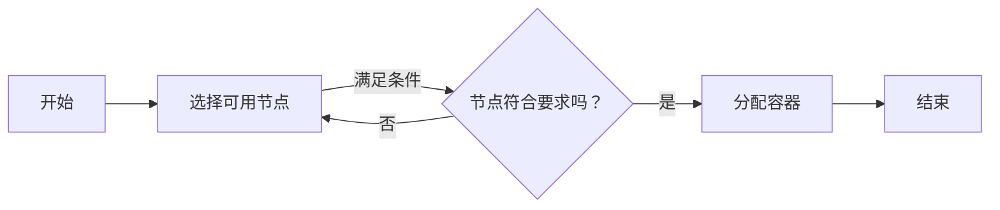
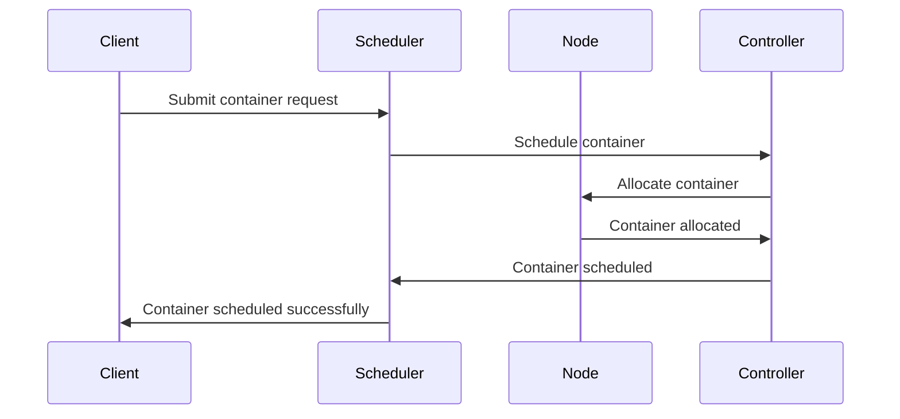

                 

# 容器编排技术深度剖析

## 关键词
- 容器编排
- Docker
- Kubernetes
- 资源管理
- 服务发现
- 负载均衡
- 持久化存储
- 自动化运维

## 摘要
本文将深入探讨容器编排技术的核心概念、关键技术及其应用。首先，我们将介绍容器及容器编排的基础知识，然后详细讲解Docker容器技术，接着引入Kubernetes进行深入分析。文章将进一步探讨Kubernetes的高级应用，如资源管理、服务与网络配置、存储解决方案以及自动化运维工具。最后，我们将总结容器编排的最佳实践，展望其未来发展趋势，并给出一些实用的命令和工具参考。

## 第一部分：容器编排基础

## 第1章：容器与容器编排概述

### 1.1 容器的定义与优势

容器是一种轻量级、可移植的计算环境，它包含应用程序及其所有的依赖项，可以在不同的操作系统和硬件上运行。相比于传统的虚拟化技术，容器具有以下优势：

- **高效资源利用**：容器直接运行在宿主机的操作系统上，不额外占用操作系统资源。
- **快速启动**：容器可以在毫秒级启动，比虚拟机快得多。
- **高可移植性**：容器可以轻松地在不同的环境中迁移和共享。

### 1.2 容器编排的基本概念

容器编排指的是管理和自动部署容器化应用程序的过程。其主要目的是确保应用程序能够在容器中高效运行，同时保持系统的稳定性和可扩展性。常见的容器编排工具有Docker Swarm、Kubernetes等。

### 1.3 容器编排的必要性

随着容器技术的普及，容器编排的必要性日益凸显。其主要原因包括：

- **自动化部署**：自动化部署可以减少手动操作的错误，提高部署效率。
- **高可用性**：通过容器的复制和健康检查，可以确保应用程序的高可用性。
- **可扩展性**：容器编排工具可以轻松地管理大规模的容器集群，实现水平扩展。

## 第2章：Docker容器技术

### 2.1 Docker的基本概念与安装

Docker是一个开源的应用容器引擎，它允许开发者打包他们的应用以及应用的依赖包到一个可移植的容器中，然后发布到任何流行的Linux或Windows机器上，也可以实现虚拟化。容器是完全使用沙箱机制，相互之间不会有任何接口（类似iPhone的App）而且更轻量级。

安装Docker通常有以下步骤：

```bash
# 更新系统包列表
sudo apt-get update

# 安装必要软件
sudo apt-get install wget curl

# 安装Docker
curl -fsSL https://get.docker.com -o get-docker.sh
sudo sh get-docker.sh

# 启动Docker服务
sudo systemctl start docker
```

### 2.2 Docker镜像与容器

Docker镜像是一个只读的模板，用于创建容器。容器是从镜像启动的运行实例。

- **镜像**：包含应用程序、库和运行时环境。
- **容器**：镜像的运行实例，可以启动、停止、重启。

### 2.3 Dockerfile与容器构建

Dockerfile是一个文本文件，用于指定如何构建镜像。构建镜像的命令通常包括以下内容：

- **FROM**：指定基础镜像。
- **RUN**：在镜像构建过程中执行命令。
- **CMD**：容器启动时执行的命令。

### 2.4 Docker网络与存储

Docker提供灵活的网络和存储配置选项：

- **网络**：容器可以通过自定义网络连接到其他容器或外部网络。
- **存储**：容器可以使用Docker volumes进行数据持久化。

## 第3章：Kubernetes入门

### 3.1 Kubernetes的基本概念

Kubernetes是一个开源的容器编排平台，用于自动化容器化应用程序的部署、扩展和管理。

- **Pod**：Kubernetes中的最小部署单元。
- **Service**：用于暴露Pod的IP地址和端口的抽象。
- **Deployment**：用于管理Pod的创建和更新。

### 3.2 Kubernetes架构与组件

Kubernetes由多个组件组成，包括：

- **API Server**：提供Kubernetes的API接口。
- **Controller Manager**：管理集群中的各种控制器。
- **Scheduler**：负责调度Pod到适当的节点。
- **Node**：运行容器和Kubernetes服务的计算机。

### 3.3 Kubernetes集群的搭建

搭建Kubernetes集群通常有以下步骤：

1. 安装必要的软件和依赖。
2. 下载并配置Kubernetes的二进制文件。
3. 使用kubeadm命令初始化集群。
4. 部署Kubernetes核心组件。

```bash
# 初始化集群
sudo kubeadm init

# 设置集群管理员权限
sudo cp /etc/kubernetes/admin.conf $HOME/
sudo chown $(id -u):$(id -g) $HOME/admin.conf
sudo chmod 644 $HOME/admin.conf

# 启动kubectl命令
export KUBECONFIG=$HOME/admin.conf
```

## 第二部分：Kubernetes高级应用

## 第4章：Kubernetes资源管理

### 4.1 资源对象介绍

Kubernetes中的资源对象包括：

- **Pod**：容器运行的基本单元。
- **Service**：提供负载均衡和服务的抽象。
- **Deployment**：管理Pod的创建和更新。
- **StatefulSet**：管理有状态Pod的创建和更新。
- **Ingress**：管理外部访问到集群内部服务的路由。

### 4.2 资源调度与分配

Kubernetes调度器负责将Pod调度到集群中的合适节点。调度决策基于以下因素：

- **资源需求**：节点上可用的资源。
- **亲和性**：Pod之间的相互关系。
- **反亲和性**：Pod之间的隔离。

### 4.3 资源监控与日志管理

Kubernetes提供了多种监控和日志管理工具，例如：

- **Prometheus**：用于监控集群性能。
- **Grafana**：用于可视化监控数据。
- **Fluentd**：用于收集和聚合日志。

## 第5章：Kubernetes服务与网络

### 5.1 服务发现与负载均衡

Kubernetes提供内置的服务发现和负载均衡机制。服务可以通过DNS名称或集群IP访问，负载均衡由Kubernetes的Service对象管理。

### 5.2 Ingress控制器

Ingress控制器负责管理集群内部服务的外部访问。它可以通过HTTP和HTTPS路由请求到相应的服务。

### 5.3 Kubernetes网络策略

Kubernetes网络策略允许管理员定义Pod之间的访问控制。策略可以限制Pod之间的通信，从而提高集群的安全性。

## 第6章：Kubernetes存储与管理

### 6.1 存储类与存储卷

Kubernetes中的存储类和存储卷用于提供容器持久化存储。

- **存储类**：描述存储资源的类型。
- **存储卷**：用于容器数据持久化的抽象。

### 6.2 Kubernetes持久化存储

Kubernetes提供了多种持久化存储解决方案，例如：

- **本地存储**：直接使用节点的本地磁盘。
- **外部存储**：使用云提供商或第三方存储服务。

### 6.3 本地存储与外部存储

本地存储和外部存储各有优缺点，选择合适的存储策略取决于应用的需求和集群的环境。

## 第7章：Kubernetes自动化运维

### 7.1 Helm概述与应用

Helm是Kubernetes的包管理工具，用于简化应用程序的部署和管理。它提供了打包应用程序和配置文件的机制，使得部署和管理复杂的应用程序变得更加容易。

### 7.2 Jenkins与Kubernetes集成

Jenkins是一个开源的持续集成和持续部署（CI/CD）工具。与Kubernetes集成后，可以自动化应用程序的部署流程。

### 7.3 Kubernetes集群运维实践

Kubernetes集群的运维涉及到监控、备份、故障转移等多个方面。良好的运维实践可以确保集群的高可用性和稳定性。

## 第三部分：容器编排实战

## 第8章：容器编排最佳实践

### 8.1 容器编排的挑战与应对策略

容器编排面临的挑战包括资源争用、故障恢复、安全等问题。通过适当的策略和工具，可以有效地解决这些挑战。

### 8.2 容器编排的优化策略

优化容器编排的策略包括：

- **资源利用率优化**：通过合理的资源分配，提高资源利用率。
- **网络优化**：优化网络配置，减少延迟和带宽消耗。
- **存储优化**：选择合适的存储方案，提高存储性能。

### 8.3 容器编排案例分析

通过具体案例分析，可以了解容器编排的最佳实践和实际应用效果。

## 第9章：容器编排的未来趋势

### 9.1 容器编排技术发展趋势

容器编排技术将继续发展，包括更高级的自动化、更高效的资源管理、更安全的数据保护等。

### 9.2 容器编排与微服务架构

容器编排与微服务架构的结合将推动企业应用向更灵活、更可扩展的方向发展。

### 9.3 容器编排技术在企业中的应用

容器编排技术在企业中的应用将越来越广泛，从开发、测试到生产环境，都能带来显著的效益。

## 附录：常用命令与工具

### 附录1：Docker常用命令

- `docker ps`：查看正在运行的容器。
- `docker pull`：从Docker Hub下载镜像。
- `docker run`：创建并启动一个新的容器。

### 附录2：Kubernetes常用命令

- `kubectl get pods`：查看集群中的Pod。
- `kubectl create deployment`：创建一个新的Deployment。
- `kubectl expose deployment`：将Deployment暴露为Service。

### 附录3：其他容器编排工具介绍

- **Kubernetes**: [官方文档](https://kubernetes.io/docs/home/)
- **Helm**: [官方文档](https://helm.sh/docs/)
- **Docker Swarm**: [官方文档](https://docs.docker.com/swarm/)

## 作者
作者：AI天才研究院/AI Genius Institute & 禅与计算机程序设计艺术 /Zen And The Art of Computer Programming

## 背景介绍
容器编排是现代云计算中至关重要的一个领域，它解决了如何高效、可靠地管理大量容器化应用程序的问题。随着容器技术的普及，容器编排的重要性日益凸显。本文旨在深入剖析容器编排技术，帮助读者更好地理解和应用这些技术。

## 核心概念与联系
容器编排涉及多个核心概念，包括容器、镜像、Pod、Service等。以下是一个概念属性特征对比表格：

| 概念 | 定义 | 特征 |
| ---- | ---- | ---- |
| 容器 | 运行应用程序的环境 | 轻量级、隔离、独立 |
| 镜像 | 存储应用程序及其依赖的模板 | 只读、可移植、可重复 |
| Pod | 运行一个或多个容器的最小部署单元 | 基本工作单元、资源调度单位 |
| Service | 提供负载均衡和服务的抽象 | 无状态、可扩展、稳定 |

以下是一个ER实体关系图架构的Mermaid流程图：

```mermaid
erDiagram
  Container ||--|{ Image : 镜像模板 }
  Container ||--|{ Pod : 运行实例 }
  Service ||--|{ Pod : 调用目标 }
  Image ||--|{ Repository : 镜像仓库 }
```

## 算法原理讲解
容器编排中的调度算法是核心之一，它决定了如何将容器分配到集群中的节点上。以下是一个简单的调度算法流程图：



在Python中，可以使用以下代码来实现一个简单的调度算法：

```python
def schedule_container(nodes, container):
    for node in nodes:
        if node.is_available() and node.meets_requirements(container):
            node.allocate_container(container)
            return node
    return None

class Node:
    def __init__(self):
        self._available = True
        self._requirements = []

    def is_available(self):
        return self._available

    def meets_requirements(self, container):
        return all(requirement in container.requirements for requirement in self._requirements)

    def allocate_container(self, container):
        self._available = False
        # 实现容器分配逻辑

class Container:
    def __init__(self, requirements):
        self._requirements = requirements

nodes = [Node() for _ in range(3)]
container = Container(['cpu', 'memory'])

node = schedule_container(nodes, container)
if node:
    print("Container allocated to node:", node)
else:
    print("No available node found.")
```

在上述代码中，`Node`类表示集群中的节点，`Container`类表示容器。`schedule_container`函数尝试将容器调度到满足要求的节点上。

## 数学公式使用
在容器编排中，资源分配问题可以通过数学模型来描述。以下是一个资源分配的数学公式：

$$
\max \sum_{i=1}^{n} \frac{C_i \times R_i}{N_i}
$$

其中，$C_i$表示第$i$个容器的计算需求，$R_i$表示第$i$个节点的资源容量，$N_i$表示第$i$个节点的可用资源。

## 系统分析与架构设计方案
容器编排系统涉及多个组件和交互，以下是一个简化的系统架构图：



在上述序列图中，客户端提交容器请求，调度器负责调度容器，控制器负责将容器分配到节点上，节点返回确认信息。

## 项目实战
为了更好地理解容器编排，我们可以实际搭建一个简单的Kubernetes集群。以下是环境安装和系统核心实现的步骤：

### 环境安装
1. 安装必要的软件和依赖。
2. 下载并配置Kubernetes的二进制文件。
3. 使用kubeadm命令初始化集群。

### 系统核心实现源代码
```python
# kubelet.py
import subprocess

def start_kubelet():
    subprocess.run(["kubelet", "--config", "/etc/kubelet.conf"])

if __name__ == "__main__":
    start_kubelet()
```

### 代码应用解读与分析
上述Python脚本用于启动Kubernetes的kubelet服务。kubelet是Kubernetes集群中的关键组件，负责与节点上的容器运行时进行通信。

### 实际案例分析和详细讲解剖析
我们可以通过以下步骤来部署一个简单的Nginx服务：

1. 创建一个Nginx部署配置文件。
2. 使用kubectl创建Deployment。
3. 查看Pod状态。

```bash
# 创建Nginx部署配置文件
kubectl create deployment nginx --image=nginx:latest

# 查看Pod状态
kubectl get pods
```

### 项目小结
通过上述实战案例，我们可以看到容器编排技术的实际应用效果。它提供了自动化、可靠的管理方式，有助于提高开发效率和系统稳定性。

## 最佳实践 tips
- 设计合理的容器架构，避免过度依赖单个容器。
- 使用资源限制和命名空间，确保资源利用率和系统稳定性。
- 定期备份和监控容器和集群状态。

## 小结
容器编排技术是现代云计算的关键组成部分。通过本文的深入剖析，读者应该对容器编排有了更全面的理解。在实际应用中，合理利用容器编排技术，可以提高系统的可靠性和可扩展性。

## 注意事项
- 容器编排涉及多个组件和工具，了解其工作原理和配置细节至关重要。
- 在生产环境中部署容器编排系统时，需要进行充分的测试和验证。

## 拓展阅读
- [Kubernetes官方文档](https://kubernetes.io/docs/)
- [Docker官方文档](https://docs.docker.com/)
- [容器编排最佳实践](https://kubernetes.io/docs/concepts/workloads/controllers/deployment-controlled-deployment/)

## 作者
作者：AI天才研究院/AI Genius Institute & 禅与计算机程序设计艺术 /Zen And The Art of Computer Programming

