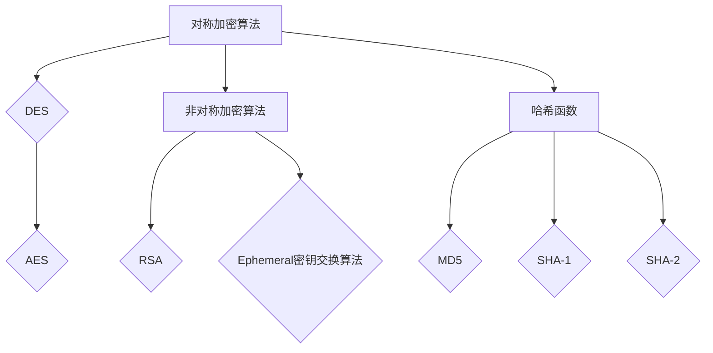
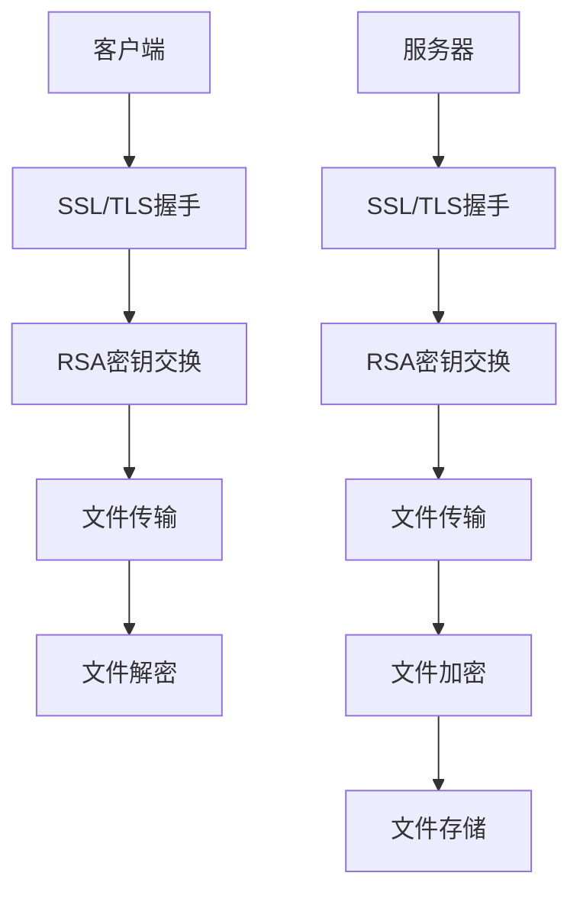
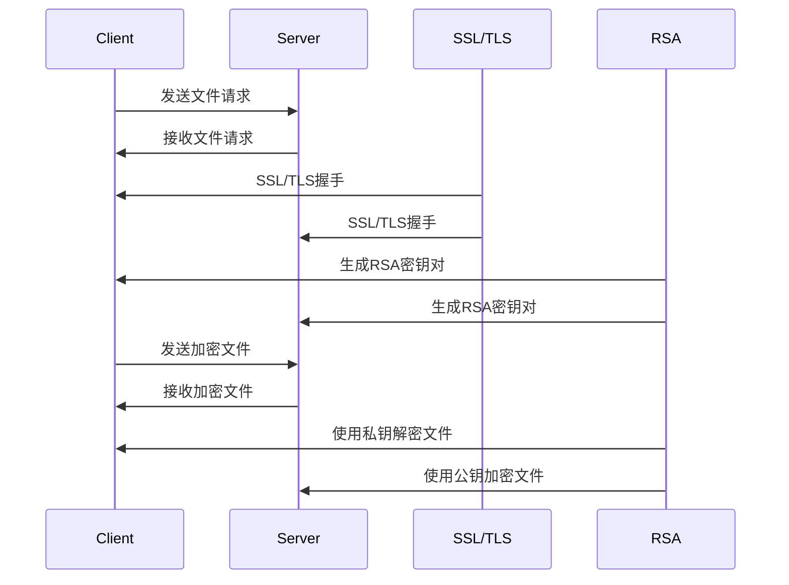

                 


### 密码学与数据加密：保护敏感信息

#### 关键词：
- 密码学
- 数据加密
- 安全信息保护
- 对称加密
- 非对称加密
- 哈希函数
- 密钥管理
- SSL/TLS
- 数字证书
- 量子密码学

#### 摘要：
随着互联网和数字化时代的到来，保护敏感信息成为了一个至关重要的议题。本文将探讨密码学的基本概念、数据加密的原理和实现方式，以及在实际应用中的挑战和解决方案。通过深入分析对称加密、非对称加密、哈希函数和密钥管理等内容，读者将了解如何有效地保护数据安全。同时，本文还将探讨密码学在实际世界中的应用，包括云计算、物联网和量子密码学等领域，以及未来加密技术的发展趋势。

---

## 引言与背景

在当今的数字化世界中，信息安全已经成为了企业和个人关注的焦点。随着互联网的普及和信息的快速传播，敏感信息的泄露风险也随之增加。无论是个人隐私、商业机密还是国家机密，一旦泄露，都会带来不可估量的损失。因此，保护敏感信息已经成为了一个迫切需要解决的问题。

### 问题背景

互联网的兴起和信息的爆炸式增长，使得数据的交换和存储变得越来越频繁。然而，这也给数据安全带来了巨大的挑战。以下是一些常见的敏感信息泄露的场景：

1. **网络攻击**：黑客通过恶意软件、钓鱼邮件等方式窃取敏感信息。
2. **数据泄露**：企业数据库泄露，导致大量用户数据被公开。
3. **内部威胁**：员工滥用权限，获取和泄露敏感信息。
4. **物理安全**：存储介质丢失或被盗，导致敏感信息泄露。

### 敏感信息泄露的严重后果

敏感信息泄露的后果可能包括：

1. **经济损失**：企业可能面临巨额赔偿和法律诉讼。
2. **声誉损害**：信任度下降，影响企业的长期发展。
3. **隐私侵犯**：个人隐私被泄露，可能导致严重的心理和财务问题。
4. **安全风险**：国家机密泄露可能危及国家安全。

### 密码学在保护数据安全中的作用

密码学是一种保护数据安全的科学，通过加密算法和密钥管理，确保数据的机密性、完整性和可用性。密码学的基本原理是使用密钥对数据进行加密和解密，使得未授权的用户无法访问和理解数据内容。

### 数据加密的基本概念

数据加密是指将明文数据转换为密文的过程，只有拥有正确密钥的用户才能解密并获取原始数据。数据加密可以分为以下几类：

1. **对称加密**：使用相同的密钥进行加密和解密。
2. **非对称加密**：使用一对密钥进行加密和解密，其中一个为公钥，另一个为私钥。
3. **哈希函数**：将数据映射为固定长度的字符串，用于验证数据的完整性和一致性。

### 数据加密的分类

1. **对称加密**：加密速度快，适用于大数据量的加密。常见的算法有DES、AES等。
2. **非对称加密**：加密和解密速度相对较慢，但安全性更高。常见的算法有RSA、Ephemeral密钥交换等。
3. **哈希函数**：用于数据完整性验证，常见的算法有MD5、SHA-1等。

### 数据加密的技术演进

随着计算机技术的不断发展，加密技术也在不断演进。从早期的DES算法，到AES算法的普及，再到量子密码学的兴起，加密技术不断追求更高的安全性和效率。

### 问题解决

通过密码学，我们可以实现以下目标：

1. **数据机密性**：确保数据在传输和存储过程中不被窃取。
2. **数据完整性**：确保数据在传输和存储过程中不被篡改。
3. **数据认证**：确保数据来源的真实性。

### 边界与外延

密码学在信息安全领域的应用非常广泛，包括但不限于以下领域：

1. **网络通信**：SSL/TLS协议用于保护网络通信的机密性和完整性。
2. **数据存储**：数据库加密用于保护存储在数据库中的敏感数据。
3. **文件加密**：文件加密用于保护个人或企业的敏感文件。

密码学面临的挑战包括：

1. **计算能力提升**：随着计算能力的提升，传统加密算法的安全性受到威胁。
2. **量子计算**：量子计算可能颠覆现有的密码学体系。

密码学的发展趋势包括：

1. **量子密码学**：研究如何利用量子力学原理实现更安全的加密。
2. **加密算法创新**：不断研究新的加密算法，以应对日益复杂的安全挑战。

---

在下一章中，我们将深入探讨密码学的基本概念和原理，包括对称加密、非对称加密和哈希函数等核心内容。通过这一章的学习，读者将能够理解加密的基本原理，并掌握常见的加密算法。

---

## 基本概念与原理

密码学是一门研究如何保护信息的学科，其核心目标是确保信息的机密性、完整性和真实性。为了实现这些目标，密码学使用了一系列加密算法和密钥管理策略。在本章中，我们将介绍密码学的基本概念、对称加密与非对称加密、哈希函数以及密钥管理等内容。

### 密码学概述

密码学可以分为两个主要分支：对称加密和非对称加密。对称加密使用相同的密钥进行加密和解密，而非对称加密则使用一对密钥，其中一个为公钥，另一个为私钥。

#### 密码学的定义

密码学（Cryptography）是一门研究如何保护信息的学科，包括加密（Encryption）、解密（Decryption）、数字签名（Digital Signature）、认证（Authentication）等。其主要目标是确保信息的保密性、完整性、真实性和抗否认性。

#### 密码学的目标

1. **保密性**：确保只有授权用户能够理解信息内容。
2. **完整性**：确保信息在传输和存储过程中未被篡改。
3. **真实性**：确保信息来源可靠，防止伪造。
4. **抗否认性**：确保信息发送者和接收者无法否认其行为。

#### 密码学的分类

密码学可以按照不同的标准进行分类，常见的分类方法包括：

1. **按加密算法类型**：对称加密、非对称加密、哈希函数。
2. **按应用领域**：网络通信、数据存储、数字签名、身份认证。
3. **按安全性**：传统加密、量子加密。

### 对称加密与非对称加密

对称加密和非对称加密是密码学中最常用的两种加密方式，它们各自具有不同的特点和应用场景。

#### 对称加密

对称加密（Symmetric Encryption）使用相同的密钥进行加密和解密。加密速度快，适用于大数据量的加密，但密钥管理复杂。

1. **基本原理**：
   - 加密：使用密钥将明文转换为密文。
   - 解密：使用相同的密钥将密文转换为明文。
2. **优缺点**：
   - 优点：加密速度快，适用于大数据量。
   - 缺点：密钥管理复杂，安全性较低。

3. **常见算法**：
   - DES（Data Encryption Standard）
   - AES（Advanced Encryption Standard）
   - TDEA（Triple Data Encryption Algorithm）

#### 非对称加密

非对称加密（Asymmetric Encryption）使用一对密钥，其中一个为公钥，另一个为私钥。加密速度较慢，但安全性更高。

1. **基本原理**：
   - 加密：使用公钥将明文转换为密文。
   - 解密：使用私钥将密文转换为明文。
2. **优缺点**：
   - 优点：安全性高，适用于小数据量。
   - 缺点：加密速度慢，密钥管理复杂。

3. **常见算法**：
   - RSA（Rivest-Shamir-Adleman）
   - Ephemeral密钥交换算法

### 哈希函数

哈希函数（Hash Function）是一种将输入数据映射为固定长度字符串的算法。哈希函数在密码学中主要用于数据完整性验证和数字签名。

1. **基本原理**：
   - 输入：任意长度的数据。
   - 输出：固定长度的哈希值。
2. **应用**：
   - 数据完整性验证：通过比较哈希值来确保数据的完整性。
   - 数字签名：用于确保消息来源的真实性和完整性。

3. **常见算法**：
   - MD5（Message Digest Algorithm 5）
   - SHA-1（Secure Hash Algorithm 1）
   - SHA-2（Secure Hash Algorithm 2）
   - SHA-3（Secure Hash Algorithm 3）

### 密钥管理

密钥管理是密码学中至关重要的一环。良好的密钥管理能够确保加密系统的安全性。

1. **密钥分类**：
   - 对称密钥：用于对称加密算法，需要保密。
   - 非对称密钥：包括公钥和私钥，公钥可以公开，私钥需要保密。
2. **密钥生成**：
   - 随机生成：使用随机数生成器生成密钥。
   - 强密码学：使用强密码学方法生成密钥，确保安全性。
3. **密钥存储与传输**：
   - 存储安全：将密钥存储在安全的硬件设备或数据库中。
   - 传输安全：使用加密协议保护密钥在传输过程中的安全性。

### 概念属性特征对比表格

| 算法       | 加密算法 | 加密速度 | 密钥管理 | 安全性 | 应用场景                   |
|------------|----------|----------|----------|--------|----------------------------|
| 对称加密   | 是       | 快       | 复杂     | 较低   | 大数据量加密               |
| 非对称加密 | 否       | 慢       | 复杂     | 高     | 小数据量加密、数字签名     |
| 哈希函数   | 否       | 快       | 简单     | 高     | 数据完整性验证、数字签名   |

### ER实体关系图架构

```mermaid
erDiagram
  密钥 ||--o{ 对称加密 : 密钥用于加密和解密 }
  密钥 ||--o{ 非对称加密 : 公钥用于加密，私钥用于解密 }
  密钥 ||--o{ 哈希函数 : 用于生成哈希值 }
  对称加密 ||--|{ 数据加密 : 加密速度快，适用于大数据量 }
  非对称加密 ||--|{ 数据加密 : 加密速度慢，但安全性高 }
  哈希函数 ||--|{ 数据完整性验证 : 用于确保数据的完整性 }
```

通过本章的介绍，我们了解了密码学的基本概念、对称加密和非对称加密、哈希函数以及密钥管理等内容。在下一章中，我们将深入探讨各种加密算法的原理和实现，帮助读者更好地理解数据加密的过程。

---

## 算法与数学模型

在密码学中，加密算法和数学模型是保护数据安全的核心。本章将详细讨论对称加密算法、非对称加密算法和哈希函数的数学模型及其实现。通过深入理解这些算法，读者将能够更好地应对数据加密的需求。

### 对称加密算法

对称加密算法使用相同的密钥进行加密和解密，其特点是计算速度快，适用于大数据量的加密。以下是对称加密算法的几种常见类型及其数学模型。

#### DES（Data Encryption Standard）

DES是一种经典的对称加密算法，由IBM开发，并在1977年被美国国家标准局（NBS）采纳为联邦信息处理标准（FIPS）。其数学模型如下：

1. **加密过程**：
   - 将明文分成64位的数据块。
   - 进行初始置换（IP）。
   - 进行16轮迭代，每轮包括置换、置换和代换（S-Box）。
   - 进行最终置换（FP）。

2. **加密公式**：
   $$ C = E_K(P) $$
   其中，$C$ 是密文，$P$ 是明文，$K$ 是密钥，$E_K$ 是加密函数。

3. **S-Box**：
   DES使用8个S-Box，每个S-Box是一个4x4的矩阵，用于替换每个6位的子密钥。

#### AES（Advanced Encryption Standard）

AES是一种更现代的对称加密算法，由美国国家标准与技术研究院（NIST）于2001年采纳为联邦信息处理标准。其数学模型如下：

1. **加密过程**：
   - 将明文分成128位的数据块。
   - 进行初始混淆（AddRoundKey）。
   - 进行10到14轮迭代，每轮包括混淆（SubBytes、ShiftRows、MixColumns）和混淆（AddRoundKey）。
   - 进行最终混淆（AddRoundKey）。

2. **加密公式**：
   $$ C = E_K(P) $$
   其中，$C$ 是密文，$P$ 是明文，$K$ 是密钥，$E_K$ 是加密函数。

3. **混淆操作**：
   - SubBytes：使用一个固定的代换表（S-Box）替换每个字节。
   - ShiftRows：将每行的字节进行循环移位。
   - MixColumns：对每个列进行线性变换。

#### 分组密码的工作原理

分组密码是一种将明文分成固定大小的块，然后对每个块进行加密的算法。其基本原理如下：

1. **分组**：
   - 将明文分成固定大小的块（例如64位或128位）。
   - 对每个块进行加密。

2. **加密流程图**：
   ```mermaid
   graph TD
   A[明文块] --> B[加密函数]
   B --> C[密文块]
   ```

### 非对称加密算法

非对称加密算法使用一对密钥，其中一个为公钥，另一个为私钥。公钥用于加密，私钥用于解密。以下是非对称加密算法的几种常见类型及其数学模型。

#### RSA（Rivest-Shamir-Adleman）

RSA是最著名的非对称加密算法之一，其数学模型如下：

1. **加密过程**：
   - 选择两个大素数$p$和$q$。
   - 计算模数$n = p \times q$。
   - 计算欧拉函数$\phi = (p-1) \times (q-1)$。
   - 选择一个与$\phi$互质的整数$e$。
   - 计算私钥$d$，满足$e \times d \equiv 1 \pmod{\phi}$。
   - 公钥为$(n, e)$，私钥为$(n, d)$。

2. **加密公式**：
   $$ C = M^e \pmod{n} $$
   其中，$C$ 是密文，$M$ 是明文，$e$ 是公钥指数，$n$ 是模数。

3. **解密公式**：
   $$ P = C^d \pmod{n} $$
   其中，$P$ 是明文，$C$ 是密文，$d$ 是私钥指数，$n$ 是模数。

#### Ephemeral密钥交换算法

Ephemeral密钥交换算法是一种基于公钥加密的密钥交换协议，其数学模型如下：

1. **加密过程**：
   - 客户端生成一个临时密钥对$(n, g)$。
   - 服务器生成一个长期密钥对$(N, G)$。
   - 客户端发送$g^y$给服务器。
   - 服务器发送$G^x$给客户端。
   - 双方计算共享密钥$K = g^{xy} \pmod{p}$。

2. **加密公式**：
   $$ K = g^{xy} \pmod{p} $$
   其中，$K$ 是共享密钥，$g$ 是生成元，$x$ 和 $y$ 分别是客户端和服务器生成的随机数，$p$ 是模数。

### 哈希函数

哈希函数是将输入数据映射为固定长度字符串的算法，常用于数据完整性验证和数字签名。以下是一些常见的哈希函数及其数学模型。

#### MD5（Message Digest Algorithm 5）

MD5是一种广泛使用的哈希函数，其数学模型如下：

1. **加密过程**：
   - 将输入数据分成512位的块。
   - 进行预处理，包括填充和附加长度。
   - 进行四轮迭代，每轮包括压缩函数和逻辑操作。

2. **加密公式**：
   $$ H = MD5(M) $$
   其中，$H$ 是哈希值，$M$ 是输入数据。

#### SHA-1（Secure Hash Algorithm 1）

SHA-1是一种更安全的哈希函数，其数学模型如下：

1. **加密过程**：
   - 将输入数据分成512位的块。
   - 进行预处理，包括填充和附加长度。
   - 进行80轮迭代，每轮包括压缩函数和逻辑操作。

2. **加密公式**：
   $$ H = SHA-1(M) $$
   其中，$H$ 是哈希值，$M$ 是输入数据。

#### SHA-2（Secure Hash Algorithm 2）

SHA-2包括SHA-224、SHA-256、SHA-384和SHA-512，其数学模型与SHA-1类似，但安全性更高。

1. **加密过程**：
   - 将输入数据分成512位的块。
   - 进行预处理，包括填充和附加长度。
   - 进行不同的轮数迭代，每轮包括压缩函数和逻辑操作。

2. **加密公式**：
   $$ H = SHA-2(M) $$
   其中，$H$ 是哈希值，$M$ 是输入数据。

### 算法流程图

以下是对称加密算法、非对称加密算法和哈希函数的算法流程图：



通过本章的介绍，我们详细探讨了对称加密算法、非对称加密算法和哈希函数的数学模型及其实现。这些算法是密码学的基础，为保护数据安全提供了强大的工具。在下一章中，我们将探讨密码协议和应用，帮助读者了解如何在实际场景中应用这些算法。

---

## 密码协议与实际应用

密码学不仅仅是一种理论，它在实际应用中发挥着至关重要的作用。本章节将详细介绍几种重要的密码协议及其在实际应用中的实现。

### SSL/TLS协议

SSL（安全套接层）和其继任者TLS（传输层安全）是用于保护网络通信的密码协议。SSL/TLS协议通过在客户端和服务器之间建立加密连接，确保数据在传输过程中的机密性和完整性。

1. **基本概念**：
   - **客户端握手**：客户端向服务器发送握手请求，包括加密算法、密钥交换方式等信息。
   - **服务器响应**：服务器返回证书，证明其身份，并生成会话密钥。
   - **会话密钥协商**：客户端和服务器通过协商的算法和密钥交换方式生成会话密钥。
   - **加密通信**：使用会话密钥加密数据，确保数据在传输过程中的安全性。

2. **工作流程**：
   - 客户端发起连接请求。
   - 服务器响应，返回证书。
   - 客户端验证服务器证书。
   - 双方协商加密参数。
   - 加密通信开始。

3. **优点与缺点**：
   - 优点：广泛支持，安全性高。
   - 缺点：加密和解密速度相对较慢。

### PKI与数字证书

PKI（公钥基础设施）是一种用于管理和分发数字证书的框架。数字证书是用于验证实体身份和公钥的电子文档。

1. **基本概念**：
   - **证书颁发机构（CA）**：负责颁发和管理数字证书。
   - **数字证书**：包含证书持有者的公钥和身份信息。
   - **证书链**：从证书颁发机构到最终用户的证书链，用于验证证书的有效性。

2. **工作流程**：
   - 实体向CA申请证书。
   - CA验证实体身份。
   - CA生成并颁发证书。
   - 实体使用证书进行加密和签名。

3. **优点与缺点**：
   - 优点：安全性高，便于身份验证。
   - 缺点：证书管理复杂，可能受到CA信任问题的影响。

### 实际应用案例分析

以下是一些实际应用中的案例：

1. **数据库加密**：
   - 数据库加密用于保护存储在数据库中的敏感信息。
   - 常用的加密工具包括Oracle Transparent Data Encryption（TDE）和Microsoft SQL Server Transparent Data Encryption（TDE）。

2. **文件加密**：
   - 文件加密用于保护存储在文件系统中的敏感文件。
   - 常用的加密工具包括AES加密和RSA加密。

3. **网络通信加密**：
   - SSL/TLS协议广泛应用于HTTPS、FTP等网络通信中，确保数据在传输过程中的安全性。

### 项目介绍

为了更好地展示密码协议的实际应用，我们以下介绍一个简单的项目。

#### 项目名称：安全文件传输系统

#### 项目目标：

- 实现一个基于SSL/TLS协议的安全文件传输系统。
- 使用RSA进行密钥交换，确保通信过程中的安全性。

#### 系统功能设计：

1. **客户端**：
   - 发送文件请求。
   - 接收服务器响应。
   - 使用RSA密钥解密文件内容。

2. **服务器**：
   - 接收客户端请求。
   - 发送文件内容。
   - 使用RSA密钥加密文件内容。

#### 系统架构设计：



#### 系统接口设计：

- **文件传输接口**：
  - **发送文件**：将文件内容发送到服务器。
  - **接收文件**：从服务器接收文件内容。

- **RSA密钥接口**：
  - **生成密钥**：生成RSA密钥对。
  - **加密**：使用公钥加密数据。
  - **解密**：使用私钥解密数据。

#### 系统交互mermaid序列图：



通过本章节的介绍，我们详细探讨了SSL/TLS协议、PKI和数字证书在实际应用中的实现。这些密码协议和工具为保护敏感信息提供了坚实的基础。在实际项目中，合理地应用这些密码协议和工具，能够有效地提高系统的安全性。

---

## 密码学在实际世界中的应用

密码学作为信息安全的核心技术，已经在实际世界中的应用中发挥了重要作用。本章节将探讨密码学在云计算、物联网（IoT）和量子密码学等领域的应用，以及这些领域面临的挑战和未来发展趋势。

### 云计算中的密码学

随着云计算的兴起，数据的安全存储和传输成为了关键问题。密码学在云计算中的应用主要体现在以下几个方面：

1. **数据加密**：云服务提供商需要对客户的数据进行加密存储，确保数据在未经授权的情况下无法被访问。常用的加密技术包括对称加密和非对称加密。

2. **密钥管理**：云服务提供商需要提供安全的密钥管理服务，包括密钥的生成、存储、备份和恢复。密钥管理需要考虑安全性、可用性和可扩展性。

3. **访问控制**：通过密码学技术，可以实现细粒度的访问控制，确保只有授权用户才能访问特定的数据。

4. **数据完整性**：使用哈希函数对数据进行完整性校验，确保数据在存储和传输过程中未被篡改。

### 物联网（IoT）中的密码学

物联网是一个庞大的设备网络，涵盖了从简单的传感器到复杂的智能设备。密码学在物联网中的应用主要包括：

1. **设备认证**：使用非对称加密算法，确保设备在接入网络时能够证明其身份。

2. **数据加密**：对传输的数据进行加密，确保数据在传输过程中不被窃取。

3. **安全通信**：使用SSL/TLS等协议，确保物联网设备之间的通信是安全的。

4. **隐私保护**：通过对个人数据的加密，保护用户的隐私。

### 量子密码学

量子密码学是密码学的一个新兴领域，利用量子力学的原理来设计更加安全的加密算法。量子密码学的主要应用包括：

1. **量子密钥分发**：通过量子通信，实现安全的密钥分发，确保密钥在传输过程中不会被窃取或篡改。

2. **量子安全通信**：利用量子纠缠等现象，实现更安全的通信，防止量子计算攻击。

3. **量子抗性密码学**：设计能够抵抗量子计算攻击的密码算法，确保信息安全。

### 挑战和未来趋势

尽管密码学在实际世界中的应用已经取得了显著成果，但仍面临以下挑战：

1. **计算能力提升**：随着计算能力的提升，传统的加密算法可能面临被破解的风险。

2. **量子计算威胁**：量子计算的发展可能颠覆现有的密码学体系，需要研究量子抗性密码学。

3. **加密算法更新**：加密算法需要不断更新，以应对日益复杂的安全威胁。

4. **密钥管理**：密钥管理需要更加高效、安全的方法，确保密钥在生成、存储和传输过程中的安全性。

未来，密码学的发展趋势包括：

1. **量子密码学**：量子密码学的研究将取得突破，实现更安全的加密通信。

2. **加密算法创新**：不断研究新的加密算法，提高加密效率和安全性。

3. **加密技术应用**：加密技术在云计算、物联网等领域的应用将更加深入。

4. **安全生态系统**：建立完善的安全生态系统，包括加密算法、硬件和软件的安全解决方案。

通过本章的介绍，我们了解了密码学在云计算、物联网和量子密码学等领域的应用，以及这些领域面临的挑战和未来发展趋势。密码学作为信息安全的核心技术，将在未来继续发挥重要作用。

---

## 密码工具与实践

为了更好地理解密码学在实际中的应用，本章节将介绍几种常用的密码工具和实践，包括加密工具、密钥管理工具和加密流程的设计。

### 常用加密工具介绍

1. **OpenSSL**

   OpenSSL是一个广泛使用的开源加密工具包，支持多种加密算法和协议。它可用于加密文件、生成密钥、创建数字证书等。

   - **加密文件**：
     ```bash
     openssl enc -aes-256-cbc -in file.txt -out file.enc -pass pass:password
     ```
   - **解密文件**：
     ```bash
     openssl enc -aes-256-cbc -d -in file.enc -out file.txt -pass pass:password
     ```

2. **GnuPG**

   GnuPG是一个基于OpenPGP的加密工具，支持对称加密和非对称加密。它可用于加密文件、创建数字签名等。

   - **加密文件**：
     ```bash
     gpg --encrypt -r user@example.com file.txt
     ```
   - **解密文件**：
     ```bash
     gpg --decrypt file.txt.gpg
     ```

3. **Crypto++库**

   Crypto++是一个开源的加密算法库，支持多种加密算法和协议。它可用于C++应用程序中的加密和安全通信。

   - **加密**：
     ```cpp
     #include <cryptopp/aes.h>
     AES aes;
     aes.SetKey("password", 8);
     std::string ciphertext = aes.EncryptString("Hello, World!");
     ```
   - **解密**：
     ```cpp
     #include <cryptopp/aes.h>
     AES aes;
     aes.SetKey("password", 8);
     std::string plaintext = aes.DecryptString(ciphertext);
     ```

### 加密实践

在进行加密实践时，需要考虑以下几个方面：

1. **加密算法的选择**：根据数据的敏感程度和性能要求选择合适的加密算法。
2. **密钥管理**：确保密钥的安全存储和传输，避免泄露。
3. **加密流程的设计**：设计合理的加密流程，确保数据的安全性。

以下是一个简单的加密流程：

1. **生成密钥**：
   ```bash
   openssl genpkey -algorithm RSA -out key.pem -pkeyopt rsa_keygen_bits:2048
   ```

2. **加密文件**：
   ```bash
   openssl smime -encrypt -in file.txt -out file.enc -outform PEM -inkey key.pem
   ```

3. **解密文件**：
   ```bash
   openssl smime -decrypt -in file.enc -inform PEM
   ```

### 加密安全性的评估

加密安全性的评估主要包括以下几个方面：

1. **密码分析**：通过分析加密算法的弱点，寻找可能的破解方法。
2. **实现漏洞**：检查加密算法的实现是否存在漏洞，如缓冲区溢出、整数溢出等。
3. **密码强度**：评估密钥的强度，确保密钥不易被暴力破解。
4. **测试和验证**：通过测试和验证加密算法的正确性和安全性。

### 加密系统的安全性测试

加密系统的安全性测试主要包括以下几个方面：

1. **性能测试**：评估加密系统的处理速度和资源消耗。
2. **安全测试**：通过模拟攻击场景，验证加密系统的安全性。
3. **压力测试**：评估加密系统在高负载下的稳定性和性能。

通过以上工具和实践，我们可以更好地理解和应用密码学，确保数据的安全性和完整性。

---

## 结论与未来趋势

随着信息技术的飞速发展，密码学在保护敏感信息、维护数据安全方面发挥着越来越重要的作用。本文从密码学的基本概念、数据加密的原理和实现方式，到密码协议的实际应用，再到密码学在实际世界中的应用，进行了全面而深入的探讨。

### 密码学的现状

目前，密码学已经发展成为一门成熟的技术科学，其应用领域广泛，包括网络通信、数据存储、身份认证、数字签名等。传统的对称加密和非对称加密技术已经经过了长时间的应用和验证，而哈希函数在数据完整性验证和数字签名中也发挥着至关重要的作用。

### 当前加密技术的成熟度

对称加密技术如AES在性能和安全性上已经达到了很高的水平，被广泛应用于大数据量的加密场景。非对称加密技术如RSA和Ephemeral密钥交换也在安全通信和数据传输中发挥着重要作用。哈希函数如SHA-256和SHA-3在数据完整性验证方面表现优异。

### 加密技术面临的挑战

尽管当前加密技术已经相对成熟，但仍然面临一些挑战：

1. **计算能力提升**：随着计算能力的不断提升，传统的加密算法可能面临被破解的风险。
2. **量子计算威胁**：量子计算的发展可能颠覆现有的密码学体系，需要研究量子抗性密码学。
3. **密钥管理**：随着数据量的增加，密钥管理变得更加复杂，需要更高效、安全的密钥管理策略。
4. **加密算法更新**：加密算法需要不断更新，以应对新的安全威胁。

### 未来趋势

未来，密码学的发展趋势主要包括：

1. **量子密码学**：量子密码学的研究将取得突破，实现更安全的加密通信。
2. **加密算法创新**：不断研究新的加密算法，提高加密效率和安全性。
3. **加密技术应用**：加密技术在云计算、物联网等领域的应用将更加深入。
4. **安全生态系统**：建立完善的安全生态系统，包括加密算法、硬件和软件的安全解决方案。

### 总结

密码学是保护敏感信息、维护数据安全的重要手段。通过本文的探讨，我们了解了密码学的基本原理、实现方式和实际应用。在未来的发展中，密码学将继续发挥重要作用，为信息安全提供强有力的保障。

---

作者：AI天才研究院/AI Genius Institute & 禅与计算机程序设计艺术 /Zen And The Art of Computer Programming

---

通过本文的详细讲解，读者应该对密码学和数据加密有了更加深入的理解。为了更好地巩固所学知识，以下是一些建议的拓展阅读资源：

1. **基础读物**：
   - 《密码学：原理与实践》（Cryptographic Engineering: Design Principles and Practical Applications）
   - 《密码学导论》（Introduction to Cryptography）

2. **高级教材**：
   - 《现代密码学：综合方法》（Modern Cryptography: An Introduction to the Theory and Practice of Modern Cryptography）
   - 《密码学手册》（Handbook of Applied Cryptography）

3. **在线课程**：
   - Coursera的《密码学基础》
   - edX的《密码学：理论与应用》

4. **学术论文**：
   - 《AES算法的设计和分析》（The Design and Analysis of the AES Algorithm）
   - 《量子密码学：理论、协议与应用》（Quantum Cryptography: Theory, Protocols and Applications）

通过阅读这些资源，读者可以进一步扩展自己的知识面，深入了解密码学的最新进展和应用。同时，实践是检验真理的唯一标准，读者也可以尝试编写自己的加密程序，加深对密码学原理的理解。祝您在学习和应用密码学的道路上不断进步！

