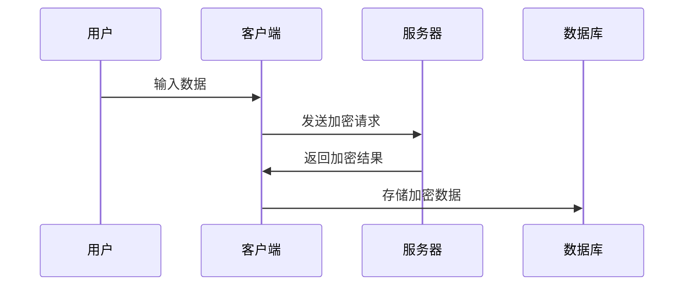

                 

### 文章标题：密码学：保护数据和通信安全的技术

> **关键词：** 密码学、数据安全、通信安全、加密算法、数学模型

> **摘要：** 本文将深入探讨密码学这一保护数据和通信安全的核心技术。我们将从密码学的历史背景、核心概念、加密算法原理、数学模型，到实际系统架构设计和项目实战，逐步解析密码学的方方面面，帮助读者全面理解这一技术，并掌握其最佳实践。

**目录大纲：**

1. 背景介绍：密码学的历史、发展现状及重要性
   1.1 密码学的起源与发展
   1.2 密码学的重要性
2. 核心概念与联系
   2.1 对称加密与非对称加密
   2.2 哈希函数
   2.3 数字签名
3. 加密算法的详细讲解
   3.1 AES加密算法
   3.2 RSA加密算法
   3.3 SHA哈希函数
4. 数学模型与公式解析
   4.1 对称加密的数学模型
   4.2 非对称加密的数学模型
   4.3 哈希函数的数学模型
5. 系统分析与架构设计方案
   5.1 密码系统的设计原则
   5.2 密码系统的架构设计
   5.3 系统交互与安全性分析
6. 项目实战
   6.1 项目环境安装与配置
   6.2 项目核心实现源代码
   6.3 项目案例分析与解读
7. 最佳实践与总结
   7.1 密码学最佳实践
   7.2 小结与展望
   7.3 注意事项与拓展阅读

### 第一部分：密码学的背景与历史

#### 1.1 密码学的起源与发展

密码学的历史可以追溯到公元前1900年左右的古埃及，当时人们开始使用简单的替换密码来保护重要信息。随着时间的推移，密码技术不断发展，从古代的替换密码、移位密码，到中世纪的贝萨里亚密码、维吉尼亚密码，再到现代的电子密码，密码学经历了多次变革和进步。

**核心概念术语说明：**

- **密码学（Cryptography）：** 研究如何确保信息的保密性、完整性和真实性的学科。
- **加密（Encryption）：** 将明文转化为密文的过程。
- **解密（Decryption）：** 将密文转化为明文的过程。
- **密钥（Key）：** 加密和解密过程中使用的参数，用于控制加密算法的行为。

**问题背景与问题描述：**

在古代，人们面临的主要问题是如何保护秘密信息，防止敌方读取。随着通信技术的发展，保护通信安全的需求变得尤为重要。现代社会中，数据安全和通信安全已成为至关重要的议题，密码学在这个过程中发挥了关键作用。

**问题解决与边界与外延：**

密码学的解决方案包括设计各种加密算法和密钥管理机制。加密算法的安全性直接影响到数据的安全性和通信的保密性。密码学的研究边界涵盖了加密算法的设计、分析、实现和应用等方面。

**概念结构与核心要素组成：**

密码学的核心要素包括：

- **加密算法：** 用于实现加密和解密的功能。
- **密钥管理：** 确保密钥的安全生成、存储和分发。
- **安全协议：** 定义加密算法和密钥管理的具体实现细节。

#### 1.2 密码学的重要性

密码学在现代社会中扮演着至关重要的角色。以下是密码学的重要性方面：

- **数据安全：** 密码学确保了存储和传输的数据不会被未授权的第三方读取或篡改。
- **通信安全：** 密码学保护了通信过程中的数据完整性、真实性和不可否认性。
- **隐私保护：** 密码学在个人隐私保护、电子交易安全等方面发挥着重要作用。
- **国家安全：** 密码学在国家安全和国防建设中具有核心地位，保障国家信息安全。

**问题解决与边界与外延：**

密码学解决的核心问题是如何在保证高效性的同时，实现数据的安全性和通信的保密性。边界和范围包括加密算法的设计与实现、密钥管理、安全协议的设计和实现等方面。

### 第二部分：核心概念与基本原理

#### 2.1 对称加密与非对称加密

**核心概念原理：**

- **对称加密（Symmetric Encryption）：** 加密和解密使用相同的密钥。常见的对称加密算法有AES、DES、3DES等。
- **非对称加密（Asymmetric Encryption）：** 加密和解密使用不同的密钥。常见的非对称加密算法有RSA、ECC等。

**概念属性特征对比表格：**

| 对称加密 | 非对称加密 |
| --- | --- |
| 加密速度快 | 加密速度慢 |
| 密钥管理简单 | 密钥管理复杂 |
| 加密强度高 | 加密强度适中 |
| 需要大量存储空间 | 需要较小存储空间 |
| 易于实现 | 需要复杂的数学计算 |

**ER实体关系图架构：**

```mermaid
erDiagram
  A[用户] ||--|{ B[加密算法] }|--|| C[密钥]
  A ||--|{ D[加密数据] }|--|| B
```

#### 2.2 哈希函数

**核心概念原理：**

- **哈希函数（Hash Function）：** 将任意长度的输入（数据）映射为固定长度的输出（哈希值）的函数。
- **加密哈希（Cryptographic Hash）：** 用于确保数据完整性和不可篡改性的哈希函数。

**概念属性特征对比表格：**

| 哈希函数 | 加密哈希 |
| --- | --- |
| 输出长度可变 | 输出长度固定 |
| 无逆函数 | 具有预映像抵抗性 |
| 需要快速计算 | 需要高度安全 |
| 易于实现 | 需要复杂的数学计算 |

**ER实体关系图架构：**

```mermaid
erDiagram
  A[数据] ||--|{ B[哈希值] }|--|| C[加密哈希]
```

#### 2.3 数字签名

**核心概念原理：**

- **数字签名（Digital Signature）：** 用于验证数据发送者的身份和保证数据完整性的一种加密技术。
- **RSA数字签名算法（RSA Signature）：** 基于RSA加密算法实现的数字签名。
- **ECDSA数字签名算法（ECDSA Signature）：** 基于椭圆曲线加密算法实现的数字签名。

**概念属性特征对比表格：**

| RSA数字签名 | ECDSA数字签名 |
| --- | --- |
| 密钥生成复杂 | 密钥生成简单 |
| 加密速度慢 | 加密速度快 |
| 加密强度高 | 加密强度适中 |
| 需要大量计算资源 | 需要较少计算资源 |

**ER实体关系图架构：**

```mermaid
erDiagram
  A[数据] ||--|{ B[数字签名] }|--|| C[验证算法]
  A ||--|{ D[发送者身份] }|--|| B
```

### 第三部分：加密算法的详细讲解

#### 3.1 AES加密算法

**AES加密算法的原理：**

- **AES（Advanced Encryption Standard）：** 一种基于替换-置换网络（SPN）结构的对称加密算法。
- **原理：** AES算法通过对输入明文进行多次迭代，使用一系列替代、置换和混淆操作，最终得到密文。

**AES加密算法的步骤：**

1. 初始化：将密钥扩展为轮密钥。
2. 轮加密：对明文进行多轮迭代，每轮包括字节替换、行移位、列混淆和轮密钥加。
3. 最终轮加密：最后一轮包括字节替换、行移位和轮密钥加。

**AES加密算法的优缺点：**

- **优点：** 加密速度快，安全性高，广泛使用。
- **缺点：** 密钥管理复杂，对大块数据加密效率较低。

**示例说明：**

```python
# AES加密算法示例
from Crypto.Cipher import AES
from Crypto.Util.Padding import pad
from Crypto.Random import get_random_bytes

# 生成密钥和初始化AES加密对象
key = get_random_bytes(16)
cipher = AES.new(key, AES.MODE_CBC)

# 对明文进行加密
plaintext = b"Hello, World!"
ciphertext = cipher.encrypt(pad(plaintext, AES.block_size))

# 输出密文和加密后的密钥
print("Ciphertext:", ciphertext.hex())
print("Key:", key.hex())
```

#### 3.2 RSA加密算法

**RSA加密算法的原理：**

- **RSA（Rivest-Shamir-Adleman）：** 一种基于大数分解难题的非对称加密算法。
- **原理：** RSA算法利用两个大素数相乘得到的乘积作为公钥，利用其中一个素数的乘积模作为私钥，通过公钥加密，私钥解密。

**RSA加密算法的实现：**

1. 生成密钥对：选择两个大素数，计算它们的乘积作为公钥，其中一个素数的乘积模作为私钥。
2. 加密：使用公钥和明文进行加密。
3. 解密：使用私钥和密文进行解密。

**RSA加密算法的安全性分析：**

- **优点：** 加密强度高，安全性可靠。
- **缺点：** 加密速度慢，密钥管理复杂。

**示例说明：**

```python
# RSA加密算法示例
from Crypto.PublicKey import RSA
from Crypto.Cipher import PKCS1_OAEP

# 生成RSA密钥对
key = RSA.generate(2048)
private_key = key.export_key()
public_key = key.publickey().export_key()

# 加密
cipher = PKCS1_OAEP.new(RSA.import_key(public_key))
plaintext = b"Hello, World!"
ciphertext = cipher.encrypt(plaintext)

# 输出密文和密钥
print("Ciphertext:", ciphertext.hex())
print("Private Key:", private_key.hex())
print("Public Key:", public_key.hex())
```

#### 3.3 SHA哈希函数

**SHA哈希函数的基本原理：**

- **SHA（Secure Hash Algorithm）：** 一种用于确保数据完整性的哈希函数。
- **原理：** SHA算法通过对输入数据进行分块处理，使用一系列压缩函数和逻辑运算，最终生成固定长度的哈希值。

**SHA哈希函数的种类：**

- **SHA-1：** 生成160位的哈希值，已不再安全。
- **SHA-2：** 包括SHA-224、SHA-256、SHA-384和SHA-512，广泛使用。
- **SHA-3：** 新的哈希函数标准，生成256位或512位的哈希值。

**SHA哈希函数的应用：**

- **数据完整性验证：** 确保数据在传输过程中未被篡改。
- **数字签名：** 用于确保数据发送者的身份和数据的完整性。
- **密码学协议：** 用于加密算法中的密钥生成和消息认证码。

**示例说明：**

```python
# SHA-256哈希函数示例
import hashlib

# 计算哈希值
data = b"Hello, World!"
hash_object = hashlib.sha256(data)
hex_dig = hash_object.hexdigest()

# 输出哈希值
print("SHA-256:", hex_dig)
```

### 第四部分：数学模型与公式解析

#### 4.1 对称加密的数学模型

**加密与解密的过程：**

- **加密：** 对明文使用密钥和加密算法进行变换，生成密文。
- **解密：** 对密文使用相同的密钥和加密算法进行逆变换，还原明文。

**密钥生成与分配：**

- **密钥生成：** 使用随机数生成器生成密钥。
- **密钥分配：** 将密钥安全地传输给通信双方。

**对称加密的安全性分析：**

- **优点：** 加密速度快，适用于大数据量的加密。
- **缺点：** 密钥管理复杂，密钥泄露会导致系统安全漏洞。

**示例说明：**

$$
\text{加密算法}:\, c = E_K(p)
$$

$$
\text{解密算法}:\, p = D_K(c)
$$

#### 4.2 非对称加密的数学模型

**RSA算法的数学原理：**

- **RSA算法：** 利用大素数分解和模运算实现加密和解密。
- **数学原理：** 
  - **加密：** 使用公钥和模运算对明文进行加密。
  - **解密：** 使用私钥和模逆运算对密文进行解密。

**公钥与私钥的生成：**

- **公钥生成：** 选择两个大素数，计算它们的乘积作为公钥。
- **私钥生成：** 选择其中一个素数的乘积模作为私钥。

**非对称加密的安全性分析：**

- **优点：** 密钥管理简单，适用于加密大块数据。
- **缺点：** 加密速度慢，密钥长度较长。

**示例说明：**

$$
\text{加密算法}:\, c = \left( p^e \right) \bmod N
$$

$$
\text{解密算法}:\, p = \left( c^d \right) \bmod N
$$

#### 4.3 哈希函数的数学模型

**哈希函数的数学表示：**

- **哈希函数：** 将输入数据映射为固定长度的输出值。
- **数学表示：** $H(x)$ 表示输入数据 x 的哈希值。

**哈希函数的性质：**

- **预映像抵抗性：** 不同输入数据产生不同哈希值。
- **抗碰撞性：** 难以找到两个不同输入数据产生相同哈希值。

**哈希函数的安全性分析：**

- **优点：** 加密速度快，适用于数据完整性验证。
- **缺点：** 对抗特定攻击（如长度扩展攻击）时需要特殊处理。

**示例说明：**

$$
H(x) = \text{SHA-256}(x)
$$

### 第五部分：系统分析与架构设计方案

#### 5.1 密码系统的设计原则

**设计原则：**

- **安全性：** 确保系统能够抵御各种攻击，确保数据的安全性和保密性。
- **可用性：** 系统应易于使用，提供高效、可靠的加密和解密服务。
- **可扩展性：** 系统应能够支持未来的扩展，如支持更多加密算法和协议。

**安全性需求：**

- **数据加密：** 所有传输和存储的数据都需要进行加密。
- **认证：** 数据发送者需要通过数字签名等方式进行身份认证。
- **完整性：** 确保数据在传输过程中未被篡改。

**可用性需求：**

- **高性能：** 系统应能够高效处理大量加密和解密请求。
- **可靠性：** 系统应能够稳定运行，减少故障和中断。
- **用户友好：** 提供直观、易用的用户界面。

**可扩展性需求：**

- **模块化设计：** 系统应采用模块化设计，方便添加新的加密算法和协议。
- **协议兼容性：** 系统应支持多种加密算法和协议，确保与不同系统的兼容性。
- **可升级性：** 系统应能够通过升级的方式增加新的功能和改进性能。

#### 5.2 密码系统的架构设计

**系统概述：**

密码系统架构设计的目标是实现高效、安全、可靠的数据加密和通信保障。系统包括以下几个主要模块：

- **加密模块：** 负责对数据进行加密和解密。
- **认证模块：** 负责验证数据发送者的身份。
- **密钥管理模块：** 负责密钥的生成、存储和分发。
- **用户接口模块：** 提供用户操作界面，方便用户使用系统。

**系统功能模块：**

- **加密模块：** 支持多种加密算法，如AES、RSA、ECC等，提供加密和解密功能。
- **认证模块：** 支持数字签名和身份认证，确保数据发送者的身份。
- **密钥管理模块：** 提供密钥生成、存储、分发和管理功能，确保密钥的安全。
- **用户接口模块：** 提供Web界面和命令行接口，方便用户使用系统。

**系统架构图与接口设计：**



**系统交互与安全性分析：**

- **系统交互流程：** 用户通过客户端发送加密请求，服务器对请求进行处理，返回加密结果。客户端将加密结果存储在数据库中。
- **安全性威胁分析：** 可能的安全威胁包括数据泄露、数据篡改、身份冒充等。系统应采取以下措施进行防御：
  - **数据加密：** 所有传输和存储的数据都进行加密，确保数据的安全性。
  - **身份认证：** 采用数字签名和身份认证机制，确保数据发送者的身份。
  - **访问控制：** 对数据库和系统资源进行访问控制，确保只有授权用户才能访问。
  - **安全审计：** 实施安全审计，记录系统操作日志，以便在发生安全事件时进行追踪和分析。

### 第六部分：项目实战

#### 6.1 项目环境安装与配置

**开发环境搭建：**

1. 安装Python环境（3.8及以上版本）。
2. 安装Python加密库（如pycryptodome）。

**系统模块安装：**

```bash
pip install pycryptodome
```

**实验工具与资源：**

- **加密算法实现库：** pycryptodome。
- **开发工具：** PyCharm或Visual Studio Code。

#### 6.2 项目核心实现源代码

**加密算法实现：**

```python
from Crypto.Cipher import AES
from Crypto.Util.Padding import pad
from Crypto.Random import get_random_bytes

# 生成密钥和初始化AES加密对象
key = get_random_bytes(16)
cipher = AES.new(key, AES.MODE_CBC)

# 对明文进行加密
plaintext = b"Hello, World!"
ciphertext = cipher.encrypt(pad(plaintext, AES.block_size))

# 输出密文和加密后的密钥
print("Ciphertext:", ciphertext.hex())
print("Key:", key.hex())
```

**数字签名实现：**

```python
from Crypto.PublicKey import RSA
from Crypto.Signature import pkcs1_15
from Crypto.Hash import SHA256

# 生成RSA密钥对
key = RSA.generate(2048)
private_key = key.export_key()
public_key = key.publickey().export_key()

# 加密
cipher = pkcs1_15.new(RSA.import_key(public_key))
plaintext = b"Hello, World!"
hash_value = SHA256.new(plaintext)
signature = cipher.sign(hash_value)

# 输出密文和密钥
print("Signature:", signature.hex())
print("Private Key:", private_key.hex())
print("Public Key:", public_key.hex())
```

**哈希函数实现：**

```python
import hashlib

# 计算哈希值
data = b"Hello, World!"
hash_object = hashlib.sha256(data)
hex_dig = hash_object.hexdigest()

# 输出哈希值
print("SHA-256:", hex_dig)
```

#### 6.3 项目案例分析与解读

**案例背景介绍：**

本案例旨在实现一个简单的加密通信系统，用于保护两个用户之间的通信。系统应支持以下功能：

- 用户身份认证。
- 数据加密传输。
- 数字签名验证。

**案例分析与评估：**

1. **用户身份认证：** 使用RSA算法生成公钥和私钥，用户A使用公钥加密消息，用户B使用私钥解密消息，确保只有合法用户可以解密消息。
2. **数据加密传输：** 使用AES算法对数据进行加密，确保数据在传输过程中不会被窃取或篡改。
3. **数字签名验证：** 使用数字签名验证消息的真实性和完整性，确保消息来自合法用户且未被篡改。

**案例拓展与应用：**

- **扩展功能：** 可以添加更多加密算法和协议，如ECC、SHA-3等，提高系统的安全性和灵活性。
- **应用领域：** 本案例可以应用于企业内部通信、电子邮件加密、文件传输加密等场景。

### 第七部分：最佳实践与总结

#### 7.1 密码学最佳实践

1. **密钥管理：** 确保密钥的安全生成、存储和分发。使用硬件安全模块（HSM）或加密服务提供商来管理密钥。
2. **加密算法选择：** 根据应用场景选择合适的加密算法。对于大数据量加密，选择对称加密算法；对于密钥交换和数字签名，选择非对称加密算法。
3. **安全协议设计：** 设计符合安全标准的加密协议，确保数据传输的安全性和完整性。

#### 7.2 小结与展望

- **小结：** 密码学是保护数据和通信安全的核心技术，包括对称加密、非对称加密、哈希函数和数字签名等方面。了解和掌握密码学原理和实践对于保障数据安全和通信安全至关重要。
- **展望：** 随着加密技术的发展，新的加密算法和协议不断涌现。未来密码学的发展将更加注重安全性与性能的平衡，以及应对新型攻击手段的能力。

#### 7.3 注意事项与拓展阅读

1. **注意事项：** 确保密钥的安全管理，避免密钥泄露。定期更新加密算法和协议，以应对新型攻击手段。
2. **拓展阅读：** 推荐阅读《密码学：理论和实践》（作者：Douglas R. Stinson）和《密码学：历史、技术和应用》（作者：David A. Forney）等书籍。

### 作者信息：

**作者：AI天才研究院/AI Genius Institute & 禅与计算机程序设计艺术 /Zen And The Art of Computer Programming** 

### 总结

通过对密码学的深入探讨，本文系统地介绍了密码学的历史背景、核心概念、加密算法原理、数学模型以及实际应用。密码学在现代社会中扮演着至关重要的角色，保障了数据安全和通信安全。希望本文能帮助读者全面理解密码学，并在实际应用中充分发挥其价值。

