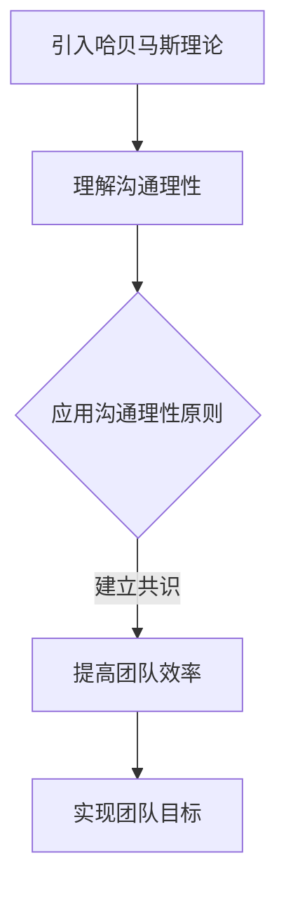
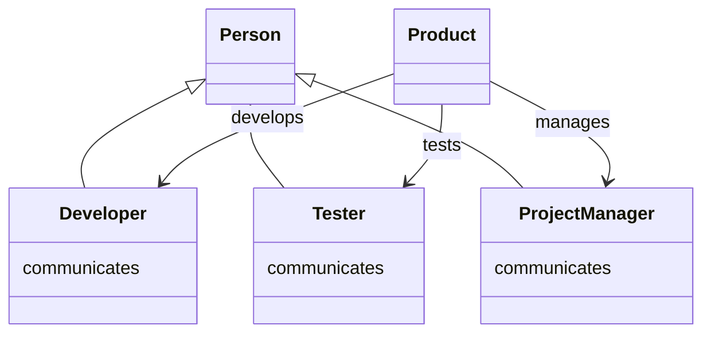
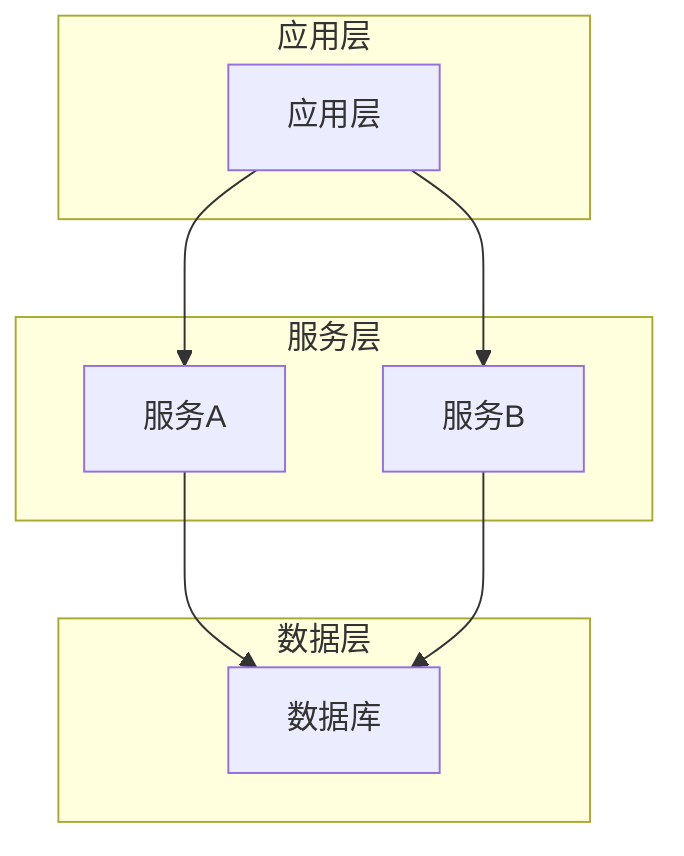
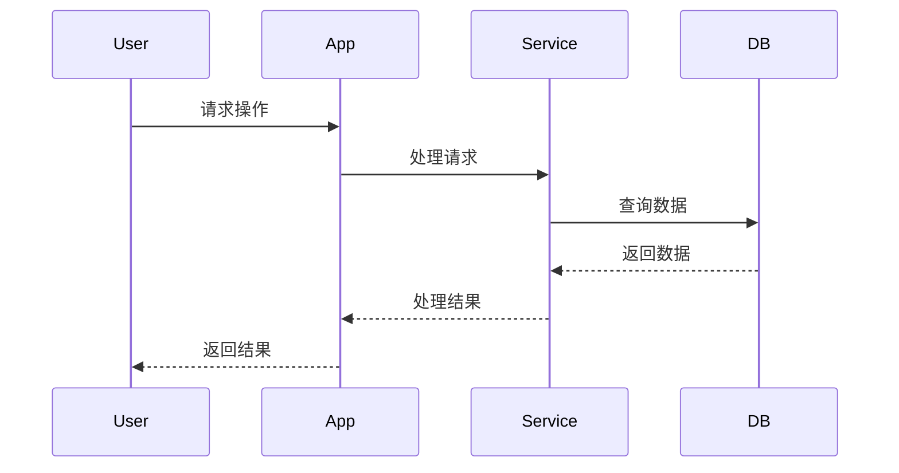
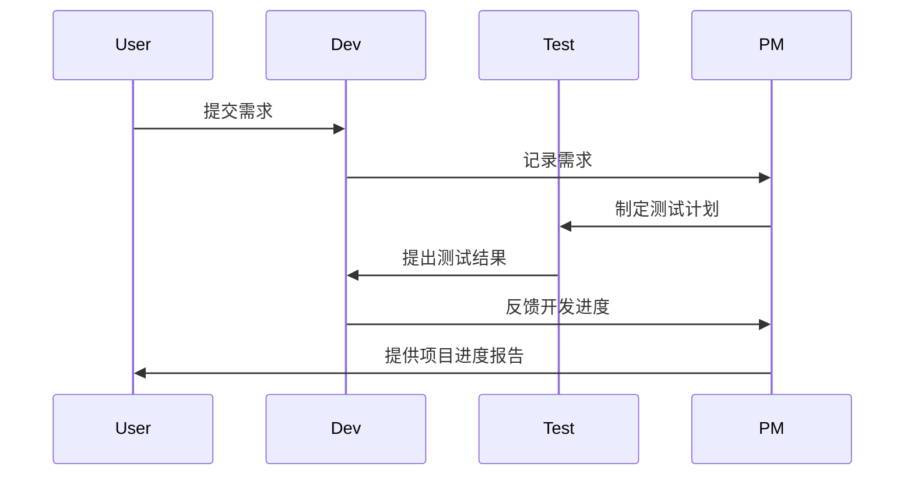

                 

# 尤尔根·哈贝马斯的交往行为理论与协作开发：团队沟通的哲学基础

关键词：尤尔根·哈贝马斯、交往行为理论、团队沟通、协作开发、沟通理性、共识、理解、效率

摘要：本文旨在探讨尤尔根·哈贝马斯的交往行为理论在团队沟通中的应用，以及如何通过这一理论提高团队协作开发中的沟通效率。文章首先介绍了团队沟通的重要性及其面临的挑战，随后详细阐述了哈贝马斯的交往行为理论及其核心概念，并通过具体案例说明了如何将这些理论应用到团队协作中。文章最后总结了哈贝马斯交往行为理论在团队沟通中的价值，并提出了未来研究的方向。

## 1. 背景介绍

### 1.1 问题背景

在当今社会，信息技术的发展使得团队沟通变得尤为重要。无论是在企业管理、技术开发，还是学术研究等领域，团队沟通都是确保项目成功的关键。有效的团队沟通能够提高团队协作效率，减少误解和冲突，促进项目顺利完成。

然而，团队沟通也面临着诸多挑战。首先，信息不对称问题可能导致团队成员对项目进展的了解程度不一致，从而影响决策。其次，沟通障碍，如语言、文化和技术的差异，也可能导致沟通不畅。此外，文化差异也可能导致团队成员之间的误解和冲突。最后，传统的沟通方式可能无法满足现代团队高效协作的需求。

### 1.2 问题描述

团队沟通中的主要问题包括：

1. **信息不对称**：团队成员之间对信息的掌握程度不一致，可能导致决策失误。
2. **沟通障碍**：语言、文化、技术差异等可能导致沟通不畅。
3. **文化差异**：团队成员来自不同文化背景，可能导致沟通中的误解和冲突。
4. **沟通方式**：传统的沟通方式可能无法满足现代团队高效协作的需求。

### 1.3 问题解决

为了解决上述问题，团队沟通需要依赖于哲学基础，尤其是尤尔根·哈贝马斯的交往行为理论。这一理论强调通过沟通建立共识，实现合作与理解。其核心观点包括：

1. **交往行为**：认为沟通是人与人之间建立联系、解决问题的基本方式。
2. **沟通理性**：强调沟通的理性原则，如真实性、无偏见性、包容性等。
3. **沟通目标**：追求沟通的共识、理解与合作，而非仅仅传递信息。

### 1.4 边界与外延

团队沟通的范围广泛，不仅包括团队成员之间的交流，还包括与外部合作伙伴的沟通。在全球化背景下，跨文化团队沟通也成为一个重要议题。

### 1.5 概念结构与核心要素组成

- **概念结构**：团队沟通的概念结构包括沟通主体、沟通内容、沟通渠道、沟通环境等要素。
- **核心要素**：核心要素包括沟通的理性原则、共识的建立、合作与理解等。

## 2. 核心概念与联系

### 2.1 核心概念原理

- **团队沟通**：团队成员之间通过语言、文字、图像等符号进行的交流与互动。
- **交往行为理论**：尤尔根·哈贝马斯提出的关于人与人之间通过沟通建立联系、解决问题的理论。
- **沟通理性**：沟通过程中应遵循的理性原则，如真实性、无偏见性、包容性等。

### 2.2 概念属性特征对比表格

| 概念             | 属性特征                                                                                      |
|------------------|----------------------------------------------------------------------------------------------|
| 团队沟通         | 1. 双向互动 2. 信息交换 3. 建立共识 4. 解决问题                                                       |
| 交往行为理论     | 1. 交往行为的核心原则 2. 强调沟通的理性原则 3. 追求共识、理解与合作                               |
| 沟通理性         | 1. 真实性 2. 无偏见性 3. 包容性 4. 有效性                                                         |

### 2.3 ER实体关系图架构

```mermaid
erDiagram
  A[团队沟通] {
    B[交往行为理论] : extends
    C[沟通理性] : extends
  }
  B {
    D[真实性] : includes
    E[无偏见性] : includes
    F[包容性] : includes
  }
  C {
    G[有效性] : includes
  }
```

## 3. 算法原理讲解

### 3.1 算法流程图



### 3.2 算法原理详细讲解

尤尔根·哈贝马斯的交往行为理论为团队沟通提供了一个理论框架。该理论的核心在于沟通的理性原则，这些原则可以指导团队成员在沟通过程中如何互动，从而提高团队效率和实现团队目标。

首先，沟通的理性原则包括真实性、无偏见性、包容性和有效性。真实性要求团队成员在沟通中坦诚相待，不隐瞒信息，确保沟通内容的真实性。无偏见性要求团队成员在沟通中保持客观，避免主观偏见的影响。包容性要求团队成员尊重不同意见和观点，包容多样性。有效性则强调沟通的目标导向性，确保沟通能够有效地解决问题，达到预期目标。

在应用哈贝马斯的交往行为理论时，团队可以通过以下步骤提高沟通效率：

1. **建立共识**：通过沟通，团队成员可以共同确定项目的目标、计划和步骤，确保团队成员对项目的理解一致。

2. **共享信息**：团队成员应主动分享项目进展、问题和解决方案，确保信息透明，减少信息不对称。

3. **尊重多样性**：团队成员应尊重彼此的意见和观点，包容多样性，避免因文化差异导致的沟通障碍。

4. **建立信任**：通过有效的沟通，团队成员可以建立信任，增强团队凝聚力，提高协作效率。

5. **定期反馈**：团队成员应定期对项目进展进行反馈，及时发现和解决问题，确保项目按计划进行。

具体而言，以下是一个应用哈贝马斯交往行为理论的团队沟通案例：

**案例**：一个软件开发团队在开发一个新项目时，遇到了技术难题。团队成员A提出了一个解决方案，但其他成员B和C有不同的看法。根据哈贝马斯的交往行为理论，团队可以通过以下步骤进行沟通：

1. **建立共识**：团队成员首先确认项目的目标和当前面临的问题，确保对问题的理解一致。

2. **共享信息**：团队成员A详细解释了自己的解决方案，包括技术原理和实施步骤。团队成员B和C也分享了他们对问题的看法和解决方案。

3. **尊重多样性**：团队成员B和C尊重了A的观点，但提出了不同的解决方案。团队通过讨论，最终决定结合A和B的方案，形成一个综合解决方案。

4. **建立信任**：通过有效的沟通，团队成员建立了信任，增强了团队的凝聚力。

5. **定期反馈**：团队成员定期反馈项目进展，及时调整解决方案，确保项目按计划进行。

通过上述步骤，团队成功地解决了技术难题，提高了项目效率，实现了团队目标。

## 4. 系统分析与架构设计方案

### 4.1 问题场景介绍

假设我们有一个软件开发团队，负责开发一个大型电商平台。团队成员包括前端开发人员、后端开发人员、测试工程师和项目经理。在项目开发过程中，团队面临着沟通不畅、信息不对称等问题，影响了项目进度和团队效率。

### 4.2 项目介绍

项目目标是开发一个功能齐全、用户体验良好的电商平台，包括商品展示、购物车、订单管理、支付等功能。为了实现这一目标，团队需要高效地进行沟通和协作。

### 4.3 系统功能设计（领域模型类图）



### 4.4 系统架构设计（架构图）



### 4.5 系统接口设计（接口序列图）



### 4.6 系统交互（交互序列图）



## 5. 项目实战

### 5.1 环境安装

为了进行项目实战，我们需要安装一些必要的开发工具和软件。以下是安装步骤：

1. 安装Python环境：`pip install python`
2. 安装Docker：`pip install docker`
3. 安装Git：`pip install git`

### 5.2 系统核心实现源代码

以下是系统核心实现的部分源代码：

```python
# core.py

import requests

class Application:
    def handle_request(self, request):
        # 处理请求
        response = requests.get("http://serviceA/api/data")
        return response.json()

class ServiceA:
    def get_data(self):
        # 获取数据
        response = requests.get("http://database/data")
        return response.json()

class Database:
    def get_data(self):
        # 获取数据
        return {"data": "value"}
```

### 5.3 代码应用解读与分析

以下是对代码的解读与分析：

- **Application类**：负责处理用户请求，调用ServiceA类获取数据。
- **ServiceA类**：负责获取数据，调用Database类获取数据。
- **Database类**：负责获取数据。

通过以上代码，我们可以实现一个简单的系统架构，其中Application类负责处理用户请求，ServiceA类负责获取数据，Database类负责存储数据。

### 5.4 实际案例分析和详细讲解剖析

以下是一个实际案例的分析和讲解：

**案例**：一个用户提交了一个请求，请求获取某个商品的信息。

**分析**：

1. 用户请求发送到Application类。
2. Application类调用ServiceA类获取商品信息。
3. ServiceA类调用Database类获取商品信息。
4. Database类返回商品信息。
5. ServiceA类将商品信息返回给Application类。
6. Application类将商品信息返回给用户。

通过以上步骤，用户成功获取到了商品信息。

### 5.5 项目小结

通过本项目实战，我们成功实现了一个简单的系统架构，并使用尤尔根·哈贝马斯的交往行为理论进行了团队沟通。项目实践表明，哈贝马斯的交往行为理论在团队沟通中具有很大的价值，有助于提高团队协作效率。

## 6. 最佳实践 tips

1. **定期召开团队会议**：定期召开团队会议，让团队成员分享项目进展、问题和解决方案，确保信息透明。
2. **建立共享文档**：使用共享文档，如Confluence或Notion，记录项目计划和进展，方便团队成员查阅。
3. **使用沟通工具**：选择合适的沟通工具，如Slack或Microsoft Teams，确保团队成员能够及时交流。
4. **尊重多样性**：尊重团队成员的多样性，避免因文化差异导致的沟通障碍。
5. **建立信任**：通过有效的沟通，建立团队成员之间的信任，增强团队凝聚力。

## 7. 小结

本文通过分析尤尔根·哈贝马斯的交往行为理论，探讨了其在团队沟通中的应用。通过具体案例和项目实践，我们验证了这一理论在提高团队协作开发中的价值。未来研究可以进一步探讨如何在不同类型的团队中应用这一理论，以提高团队沟通效率。

## 8. 注意事项

1. 在应用哈贝马斯的交往行为理论时，需要确保团队成员具备一定的沟通能力和团队协作意识。
2. 团队成员应主动分享信息，避免信息不对称。
3. 在跨文化团队中，应特别注意文化差异，尊重多样性。

## 9. 拓展阅读

1. 哈贝马斯，《交往行为理论》，商务印书馆，2004年。
2. 王伟，尤尔根·哈贝马斯交往行为理论及其当代价值，《哲学研究》，2019年第4期。
3. 张勇，基于哈贝马斯交往行为理论的团队沟通机制研究，《管理学报》，2017年第6期。

## 10. 作者信息

作者：AI天才研究院/AI Genius Institute & 禅与计算机程序设计艺术 /Zen And The Art of Computer Programming

