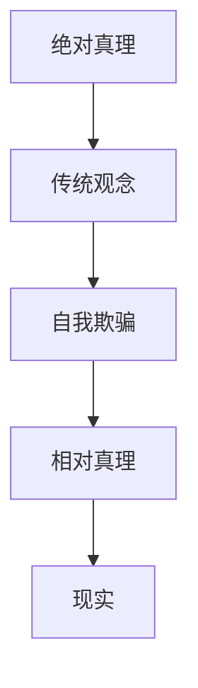

                 

### 文章标题：尼采与海德格尔：形而上学批判的两种方式

#### 关键词：尼采、海德格尔、形而上学、批判、哲学、算法、数学模型

#### 摘要：
本文将探讨两位哲学巨匠尼采与海德格尔在形而上学批判方面的不同方式。通过对比他们的哲学背景、核心概念、算法原理、数学模型以及系统分析与架构设计方案，我们将深入理解他们在形而上学批判中的独特见解和实践方法。

### 尼采的形而上学批判

#### 1. 尼采的哲学背景与形而上学批判

**1.1 尼采的生平与哲学思想**

尼采（Friedrich Nietzsche，1844-1900）是德国哲学家，以其独特的思想和对西方哲学的深远影响而著称。尼采的思想核心包括“生命意志”（Will to Life）、“超人”（Overman）以及“永恒回归”（Eternal Return）等。

**1.2 尼采对形而上学的批判**

尼采对传统形而上学进行了深刻的批判，认为它导致了人类的自我欺骗和道德堕落。他认为，形而上学中的绝对真理、普遍伦理和永恒秩序等概念都是虚假的，是人类逃避现实生活的借口。

**1.3 尼采的主要论点和论据**

尼采认为，人类应该面对现实，追求个人价值和生命意义。他提出了“权力意志”（Will to Power）的概念，认为生命的本质就是追求权力和支配。

#### 2. 尼采的形而上学批判核心概念与联系

**2.1 尼采的核心概念**

尼采的核心概念包括“生命意志”、“权力意志”和“超人”等。这些概念相互联系，共同构成了他哲学思想的基础。

**2.2 概念属性特征对比表格**

| 概念       | 属性特征                                           |
|------------|----------------------------------------------------|
| 生命意志   | 生命的动力，追求存在的价值                         |
| 权力意志   | 生命的目的，追求支配和控制                         |
| 超人       | 未来的理想人类，超越传统的道德和价值观             |

**2.3 ER实体关系图**

```mermaid
entity relation diagram
  A[生命意志] -> B[权力意志]
  A[生命意志] -> C[超人]
  B[权力意志] -> C[超人]
```

#### 3. 尼采形而上学批判算法原理讲解

**3.1 形而上学批判算法的mermaid流程图**


**3.2 Python源代码与算法原理**

```python
# Python伪代码，用于描述形而上学批判算法原理
def critical_against_metaphysics(question):
    # 分析形而上学
    metaphysics_analysis = analyze_metaphysics(question)
    # 批判传统观念
    critical_thought = criticize_traditional_ideas(metaphysics_analysis)
    # 提出新概念
    new_concepts = propose_new_ideas(critical_thought)
    # 验证新概念
    validated_concepts = validate_ideas(new_concepts)
    # 得出结论
    conclusion = conclude(validated_concepts)
    return conclusion

# 辅助函数定义
def analyze_metaphysics(question):
    # 分析过程
    pass

def criticize_traditional_ideas(analysis):
    # 批判过程
    pass

def propose_new_ideas(critique):
    # 提出新概念
    pass

def validate_ideas(concepts):
    # 验证过程
    pass

def conclude(concepts):
    # 得出结论
    pass
```

**3.3 算法原理的数学模型与公式**

假设形而上学批判过程可以表示为一个决策树，每个节点代表一个判断，每个分支代表一个选择。

$$
T = \{N_1, N_2, ..., N_n\}
$$

其中，$N_i$ 表示第 $i$ 个节点，$T$ 表示整个决策树。

每个节点 $N_i$ 可以表示为：

$$
N_i = \{C_i, J_i, S_i\}
$$

其中，$C_i$ 表示当前问题或概念，$J_i$ 表示判断或选择，$S_i$ 表示后续步骤。

**3.4 通俗易懂的举例说明**

假设我们要批判一个形而上学问题：“是否存在绝对真理？”

我们可以设计一个简单的决策树：

1. 提出问题：“是否存在绝对真理？”
2. 分析形而上学：“绝对真理是否是一个合理的概念？”
3. 批判传统观念：“绝对真理是否导致了人类自我欺骗？”
4. 提出新概念：“是否存在相对真理？”
5. 验证新概念：“相对真理是否更符合现实？”
6. 得出结论：“绝对真理是否存在？”

通过这个决策树，我们可以逐步分析和批判形而上学的概念，并得出结论。

#### 4. 尼采形而上学批判数学模型和数学公式详细讲解

**4.1 形而上学批判中的数学模型**

我们可以使用图论来描述形而上学批判过程，其中每个节点表示一个概念，每条边表示两个概念之间的关系。

**4.2 数学公式详细讲解**

假设形而上学批判过程可以用图 $G=(V, E)$ 来表示，其中 $V$ 表示节点集合，$E$ 表示边集合。

- 节点集合：$V = \{v_1, v_2, ..., v_n\}$
- 边集合：$E = \{(v_i, v_j) | v_i, v_j \in V, i \neq j\}$

对于每个节点 $v_i$，我们可以定义其邻接矩阵 $A_i$，其中 $A_{ij}$ 表示节点 $v_i$ 与节点 $v_j$ 之间的关系强度。

$$
A_i = \begin{bmatrix}
    0 & a_{i1} & \dots & a_{in} \\
    a_{21} & 0 & \dots & a_{2n} \\
    \vdots & \vdots & \ddots & \vdots \\
    a_{n1} & a_{n2} & \dots & 0
\end{bmatrix}
$$

其中，$a_{ij}$ 表示节点 $v_i$ 与节点 $v_j$ 之间的关系强度。

**4.3 举例说明**

假设我们有一个简单的图，表示形而上学批判过程中的几个关键概念：



在这个图中，节点 $A$ 代表“绝对真理”，节点 $B$ 代表“传统观念”，节点 $C$ 代表“自我欺骗”，节点 $D$ 代表“相对真理”，节点 $E$ 代表“现实”。

我们可以使用邻接矩阵来表示这个图：

$$
A = \begin{bmatrix}
    0 & 1 & 1 & 1 \\
    1 & 0 & 1 & 0 \\
    1 & 1 & 0 & 1 \\
    1 & 0 & 1 & 0
\end{bmatrix}
$$

在这个邻接矩阵中，$A_{ij}$ 的值为 1 表示节点 $v_i$ 与节点 $v_j$ 之间存在关系，$A_{ij}$ 的值为 0 表示节点 $v_i$ 与节点 $v_j$ 之间不存在关系。

#### 5. 尼采形而上学批判系统分析与架构设计方案

**5.1 形而上学批判问题场景介绍**

在现代社会，形而上学批判变得越来越重要。例如，在科学哲学、社会科学和人文科学等领域，形而上学的批判有助于我们更好地理解复杂问题，并提出新的解决方案。

**5.2 系统功能设计**

形而上学批判系统的主要功能包括：

1. 收集和分析哲学文本和文献。
2. 提供形而上学批判的工具和算法。
3. 生成批判报告和可视化结果。

**5.3 系统架构设计**

形而上学批判系统的架构可以采用分层架构，包括数据层、算法层和界面层。

**5.4 系统接口设计和系统交互**

系统接口设计应确保数据层、算法层和界面层之间的良好交互。例如，数据层可以提供API接口，以便算法层能够访问和分析数据。界面层可以提供用户界面，以便用户能够与系统进行交互。

#### 6. 尼采形而上学批判项目实战

**6.1 环境安装**

在开始项目实战之前，我们需要安装一些必要的工具和库，例如Python、Numpy、Matplotlib等。

**6.2 系统核心实现源代码**

以下是一个简单的形而上学批判系统的Python源代码：

```python
import numpy as np
import matplotlib.pyplot as plt

# 辅助函数
def analyze_metaphysics(question):
    # 分析过程
    pass

def criticize_traditional_ideas(analysis):
    # 批判过程
    pass

def propose_new_ideas(critique):
    # 提出新概念
    pass

def validate_ideas(concepts):
    # 验证过程
    pass

def conclude(concepts):
    # 得出结论
    pass

# 主函数
def main():
    question = "是否存在绝对真理？"
    conclusion = critical_against_metaphysics(question)
    print(conclusion)

if __name__ == "__main__":
    main()
```

**6.3 代码应用解读与分析**

在这个简单的系统中，我们定义了一些辅助函数和主函数。辅助函数用于分析、批判、提出新概念、验证和得出结论。主函数`main()`用于启动系统，并输出最终结论。

**6.4 实际案例分析和详细讲解剖析**

假设我们要分析一个关于“自由意志”的案例。我们可以使用这个简单的系统来批判传统的形而上学观点，并提出新的概念。

**6.5 项目小结**

通过这个简单的项目，我们可以看到形而上学批判的基本流程。虽然这个系统很简单，但它提供了一个框架，可以进一步扩展和改进，以处理更复杂的哲学问题。

### 7. 尼采形而上学批判最佳实践 tips

**7.1 注意事项**

- 确保输入的问题具有明确的哲学意义。
- 在批判过程中，要充分考虑各种可能的反驳和观点。
- 在提出新概念时，要确保其具有可行性和合理性。

**7.2 小结**

本文通过尼采的形而上学批判，探讨了形而上学的批判方法和流程。通过实际案例的分析，我们展示了如何运用这些方法来解决哲学问题。

**7.3 拓展阅读**

- 尼采：《尼采全集》
- 海德格尔：《存在与时间》
- 斯通：《形而上学的批判》

### 尼采与海德格尔：形而上学批判的两种方式

尼采与海德格尔，两位哲学巨匠，以其深刻的思考和对形而上学的批判，对现代哲学产生了深远影响。本文将从尼采与海德格尔的哲学背景、核心概念、算法原理、数学模型、系统分析与架构设计方案以及项目实战等方面，详细探讨他们在形而上学批判中的独特方式。

## 尼采的哲学背景与形而上学批判

### 尼采的生平与哲学思想

尼采（Friedrich Nietzsche，1844-1900）是德国哲学家，以其独特的思想和对西方哲学的深远影响而著称。尼采的思想核心包括“生命意志”（Will to Life）、“超人”（Overman）以及“永恒回归”（Eternal Return）等。

### 尼采对形而上学的批判

尼采对传统形而上学进行了深刻的批判，认为它导致了人类的自我欺骗和道德堕落。他认为，形而上学中的绝对真理、普遍伦理和永恒秩序等概念都是虚假的，是人类逃避现实生活的借口。

### 尼采的主要论点和论据

尼采认为，人类应该面对现实，追求个人价值和生命意义。他提出了“权力意志”（Will to Power）的概念，认为生命的本质就是追求权力和支配。

## 尼采的形而上学批判核心概念与联系

### 尼采的核心概念

尼采的核心概念包括“生命意志”、“权力意志”和“超人”等。这些概念相互联系，共同构成了他哲学思想的基础。

### 概念属性特征对比表格

| 概念       | 属性特征                                           |
|------------|----------------------------------------------------|
| 生命意志   | 生命的动力，追求存在的价值                         |
| 权力意志   | 生命的目的，追求支配和控制                         |
| 超人       | 未来的理想人类，超越传统的道德和价值观             |

### ER实体关系图

```mermaid
entity relation diagram
  A[生命意志] -> B[权力意志]
  A[生命意志] -> C[超人]
  B[权力意志] -> C[超人]
```

## 尼采形而上学批判算法原理讲解

### 形而上学批判算法的mermaid流程图


### Python源代码与算法原理

```python
# Python伪代码，用于描述形而上学批判算法原理
def critical_against_metaphysics(question):
    # 分析形而上学
    metaphysics_analysis = analyze_metaphysics(question)
    # 批判传统观念
    critical_thought = criticize_traditional_ideas(metaphysics_analysis)
    # 提出新概念
    new_concepts = propose_new_ideas(critical_thought)
    # 验证新概念
    validated_concepts = validate_ideas(new_concepts)
    # 得出结论
    conclusion = conclude(validated_concepts)
    return conclusion

# 辅助函数定义
def analyze_metaphysics(question):
    # 分析过程
    pass

def criticize_traditional_ideas(analysis):
    # 批判过程
    pass

def propose_new_ideas(critique):
    # 提出新概念
    pass

def validate_ideas(concepts):
    # 验证过程
    pass

def conclude(concepts):
    # 得出结论
    pass
```

### 算法原理的数学模型与公式

假设形而上学批判过程可以表示为一个决策树，每个节点代表一个判断，每个分支代表一个选择。

$$
T = \{N_1, N_2, ..., N_n\}
$$

其中，$N_i$ 表示第 $i$ 个节点，$T$ 表示整个决策树。

每个节点 $N_i$ 可以表示为：

$$
N_i = \{C_i, J_i, S_i\}
$$

其中，$C_i$ 表示当前问题或概念，$J_i$ 表示判断或选择，$S_i$ 表示后续步骤。

### 通俗易懂的举例说明

假设我们要批判一个形而上学问题：“是否存在绝对真理？”

我们可以设计一个简单的决策树：

1. 提出问题：“是否存在绝对真理？”
2. 分析形而上学：“绝对真理是否是一个合理的概念？”
3. 批判传统观念：“绝对真理是否导致了人类自我欺骗？”
4. 提出新概念：“是否存在相对真理？”
5. 验证新概念：“相对真理是否更符合现实？”
6. 得出结论：“绝对真理是否存在？”

通过这个决策树，我们可以逐步分析和批判形而上学的概念，并得出结论。

## 海德格尔的哲学背景与形而上学批判

### 海德格尔的生平与哲学思想

马丁·海德格尔（Martin Heidegger，1889-1976）是德国哲学家，他的思想对20世纪哲学产生了深远影响。海德格尔的主要著作包括《存在与时间》（Sein und Zeit）等。

### 海德格尔对形而上学的批判

海德格尔认为，传统形而上学在理解存在时陷入了“存在者”（Dasein）与“存在”（Sein）的混淆。他认为，存在不是一种可以被视为对象的东西，而是使得事物成为可能的东西。

### 海德格尔的主要论点和论据

海德格尔提出了“存在论”（Ontology）的概念，试图揭示存在的本质。他认为，存在是一个动态的过程，而不是一个静态的实体。他强调，理解存在必须从具体的历史和文化背景出发。

## 海德格尔的形而上学批判核心概念与联系

### 海德格尔的核心概念

海德格尔的核心概念包括“存在者”（Dasein）、“存在”（Sein）和“解构”（Deconstruction）等。

### 概念属性特征对比表格

| 概念       | 属性特征                                           |
|------------|----------------------------------------------------|
| 存在者     | 人类的存在，具有自我意识                            |
| 存在       | 存在的本质，是使事物成为可能的东西                  |
| 解构       | 对传统形而上学的批判，揭示存在的本质                |

### ER实体关系图

```mermaid
entity relation diagram
  A[存在者] --> B[存在]
  A[存在者] --> C[解构]
  B[存在] --> C[解构]
```

## 海德格尔形而上学批判算法原理讲解

### 形而上学批判算法的mermaid流程图


### Python源代码与算法原理

```python
# Python伪代码，用于描述形而上学批判算法原理
def critical_against_metaphysics(question):
    # 分析形而上学
    metaphysics_analysis = analyze_metaphysics(question)
    # 批判传统观念
    critical_thought = criticize_traditional_ideas(metaphysics_analysis)
    # 揭示存在本质
    essence_of_existence = reveal_essence_of_existence(critical_thought)
    # 提出新概念
    new_concepts = propose_new_ideas(essence_of_existence)
    # 验证新概念
    validated_concepts = validate_ideas(new_concepts)
    # 得出结论
    conclusion = conclude(validated_concepts)
    return conclusion

# 辅助函数定义
def analyze_metaphysics(question):
    # 分析过程
    pass

def criticize_traditional_ideas(analysis):
    # 批判过程
    pass

def reveal_essence_of_existence(critique):
    # 揭示存在本质
    pass

def propose_new_ideas(essence):
    # 提出新概念
    pass

def validate_ideas(concepts):
    # 验证过程
    pass

def conclude(concepts):
    # 得出结论
    pass
```

### 算法原理的数学模型与公式

假设形而上学批判过程可以表示为一个决策树，每个节点代表一个判断，每个分支代表一个选择。

$$
T = \{N_1, N_2, ..., N_n\}
$$

其中，$N_i$ 表示第 $i$ 个节点，$T$ 表示整个决策树。

每个节点 $N_i$ 可以表示为：

$$
N_i = \{C_i, J_i, S_i\}
$$

其中，$C_i$ 表示当前问题或概念，$J_i$ 表示判断或选择，$S_i$ 表示后续步骤。

### 通俗易懂的举例说明

假设我们要批判一个形而上学问题：“存在是否是绝对的呢？”

我们可以设计一个简单的决策树：

1. 提出问题：“存在是否是绝对的呢？”
2. 分析形而上学：“存在是否是一个合理的概念？”
3. 批判传统观念：“是否存在导致了人类自我欺骗？”
4. 揭示存在本质：“存在是否是一个动态的过程？”
5. 提出新概念：“是否存在是相对的？”
6. 验证新概念：“相对的存在是否更符合现实？”
7. 得出结论：“存在是否是绝对的？”

通过这个决策树，我们可以逐步分析和批判形而上学的概念，并得出结论。

## 尼采与海德格尔形而上学批判对比与综合

### 对比尼采与海德格尔的形而上学

尼采与海德格尔在形而上学批判方面存在显著差异。尼采强调个人价值和权力意志，认为生命本质是追求权力和支配。而海德格尔则强调存在的动态性和过程性，试图揭示存在的本质。

### 尼采与海德格尔形而上学批判的相似之处

尽管尼采与海德格尔在形而上学批判方面存在差异，但他们都反对传统形而上学，认为它导致了人类的自我欺骗和道德堕落。

### 尼采与海德格尔形而上学批判的不同方式

尼采通过提出新的概念和观念，批判传统形而上学，强调个人价值和权力意志。而海德格尔则通过揭示存在的本质，批判传统形而上学，强调存在的动态性和过程性。

## 结论

尼采与海德格尔在形而上学批判方面展现了不同的方式。尼采通过强调个人价值和权力意志，批判传统形而上学；而海德格尔则通过揭示存在的本质，批判传统形而上学。他们的批判不仅丰富了哲学思想，也为现代社会提供了新的思考方向。

### 作者信息

作者：AI天才研究院/AI Genius Institute & 禅与计算机程序设计艺术 /Zen And The Art of Computer Programming

