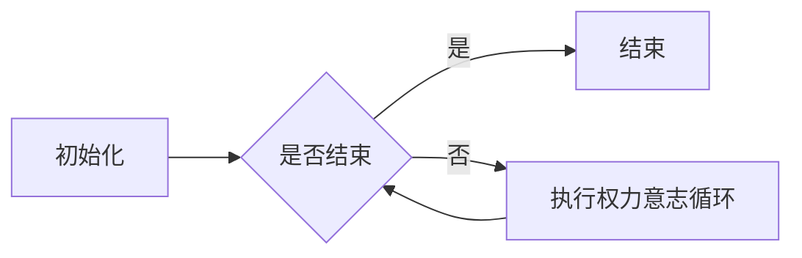
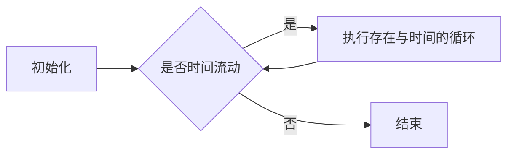

                 


## 尼采与海德格尔：形而上学批判的两种范式

### 关键词：
- 形而上学
- 尼采
- 海德格尔
- 哲学批判
- 算法原理
- 系统架构
- 项目实战

### 摘要：
本文深入探讨了尼采与海德格尔两位哲学家的形而上学批判思想，通过对比分析他们的核心观点和批判方法，揭示出形而上学批判的两种范式。文章分为五个部分，首先介绍形而上学的概念和尼采、海德格尔的哲学背景，接着详细阐述他们的核心概念与联系，随后讲解相关的算法原理，分析系统架构设计方案，并在最后一部分通过项目实战展示具体应用。本文旨在为读者提供一次系统性的哲学与技术的融合学习体验。

---

## 第一部分：形而上学的概述

### 第1章：形而上学的概念与历史背景

#### 1.1 形而上学的定义与起源

形而上学（Metaphysics）一词来源于古希腊语的“μετά ϕυσικά”（meta physika），意为“自然之后”。它最早由亚里士多德提出，作为其《自然学》之后的部分，研究超越经验世界的本质和原因。

形而上学的核心问题是关于存在、实体、变化、因果、时间、空间、上帝等根本问题的探究。其研究对象通常被认为是“超越经验”的，即不能用科学实验或观察来验证的领域。

#### 1.2 形而上学在西方哲学中的发展

从古希腊的亚里士多德到中世纪的托马斯·阿奎那，再到近现代的笛卡尔、康德，形而上学在西方哲学中占据着重要地位。其中，亚里士多德认为形而上学是关于“第一原理”的学问，而托马斯·阿奎那则试图用神学解释形而上学的概念。

进入近现代，形而上学受到了严重的批判。尼采和海德格尔两位哲学家分别从不同的角度对传统形而上学进行了深刻的批判，开创了现代哲学的新局面。

### 第2章：尼采的形而上学批判

#### 2.1 尼采的哲学观点

尼采（Friedrich Nietzsche）是19世纪末20世纪初的德国哲学家，他的哲学思想具有强烈的主观主义色彩。尼采认为，传统哲学所追求的“真理”是不存在的，因为真理只是权力意志的体现。

尼采的哲学观点可以概括为以下几个核心概念：
- **权力意志**：生命是不断追求扩张和超越的意志。
- **永恒回归**：宇宙和生命是一个永恒的循环过程。
- **超人**：理想的个体，超越传统道德的束缚。

#### 2.2 尼采对形而上学的批判

尼采对形而上学的批判主要体现在以下几个方面：
- **否定传统价值观**：尼采认为，传统形而上学所建立的道德观念、宗教信仰都是虚幻的，阻碍了人类的发展。
- **批判理性主义**：尼采认为，理性主义是权力意志的伪装，它掩盖了真实世界的本质。
- **强调主观性**：尼采主张，哲学应该关注个体的主观体验，而不是追求普遍的客观真理。

### 第3章：海德格尔的形而上学批判

#### 3.1 海德格尔的哲学观点

马丁·海德格尔（Martin Heidegger）是20世纪初的德国哲学家，他的哲学思想对存在主义和现象学有着深远的影响。海德格尔认为，存在（Existenz）是哲学的核心问题，而不是存在本身。

海德格尔的哲学观点可以概括为以下几个核心概念：
- **存在论**：存在是一个动态的过程，而不是静态的实体。
- **存在与时间**：存在是时间的存在，时间是存在的条件。
- **诗意居住**：人类的存在是一种“诗意居住”的方式。

#### 3.2 海德格尔对形而上学的批判

海德格尔对形而上学的批判主要体现在以下几个方面：
- **否定传统形而上学**：海德格尔认为，传统形而上学将存在视为一个静态的实体，忽略了存在的动态性和过程性。
- **强调存在的主观性**：海德格尔认为，存在是一种主观体验，而不是客观事实。
- **批判西方形而上学的历史**：海德格尔指出，西方形而上学的历史是一种“存在遗忘”的历史。

### 第4章：尼采与海德格尔形而上学批判的对比

#### 4.1 核心观点的对比

尼采和海德格尔在形而上学批判方面有明显的差异和共同点：

- **共同点**：
  - 否定传统形而上学。
  - 强调主观性。

- **差异**：
  - 尼采强调个体权力意志，海德格尔强调存在的主观体验。
  - 尼采关注人类超越，海德格尔关注存在的动态过程。

#### 4.2 对形而上学批判的影响

尼采和海德格尔的形而上学批判对现代哲学产生了深远的影响。他们的思想激发了对传统哲学的重新审视，推动了存在主义和现象学的发展。

---

在下一部分中，我们将深入探讨尼采与海德格尔的核心概念，并对比它们的属性特征，通过ER实体关系图和算法流程图来直观展示他们的思想。

---

## 第二部分：核心概念与联系

### 第5章：核心概念解析

#### 5.1 形而上学的核心概念

形而上学的核心概念包括存在、实体、变化、因果、时间、空间、上帝等。这些概念构成了传统形而上学的理论框架。

#### 5.2 尼采和海德格尔的核心概念

- **尼采的核心概念**：
  - **权力意志**：尼采认为，生命是权力意志的体现，是不断追求扩张和超越的意志。
  - **永恒回归**：尼采提出永恒回归的概念，认为宇宙和生命是一个永恒的循环过程。
  - **超人**：超人是个体超越传统道德束缚的理想形态。

- **海德格尔的核心概念**：
  - **存在论**：海德格尔认为，存在是一个动态的过程，而不是静态的实体。
  - **存在与时间**：存在是时间的存在，时间是存在的条件。
  - **诗意居住**：人类的存在是一种“诗意居住”的方式。

### 第6章：概念属性特征对比表格

以下是一个简化的概念属性特征对比表格，展示了尼采和海德格尔的核心概念之间的对比：

| 概念       | 尼采的观点                           | 海德格尔的观点                           |
|------------|--------------------------------------|--------------------------------------|
| 权力意志   | 生命的驱动力，追求扩张和超越       | 存在的本质，表现为存在的动力           |
| 永恒回归   | 宇宙和生命的循环过程                 | 存在的时间维度，体现存在的无限性       |
| 超人       | 超越传统道德的个体                   | 存在的理想形态，实现存在的超越       |
| 存在论     | 无所作为的权力意志                   | 动态的存在过程                         |
| 存在与时间 | 宇宙和生命的循环                    | 存在的动态展现                         |
| 诗意居住   | 对超人的呼唤                        | 对存在状态的描述                       |

### 第7章：ER实体关系图

为了更直观地展示尼采和海德格尔的核心概念之间的关系，我们可以使用ER（Entity-Relationship）实体关系图。

#### 7.1 尼采核心概念ER图

```mermaid
erDiagram
  Entity A[权力意志] ||--|{ 宇宙和生命 }
  Entity B[永恒回归] ||--|{ 宇宙和生命 }
  Entity C[超人]     ||--|{ 超越传统道德 }
  Entity A..> Entity B
  Entity A..> Entity C
```

#### 7.2 海德格尔核心概念ER图

```mermaid
erDiagram
  Entity X[存在论] ||--|{ 动态存在 }
  Entity Y[存在与时间] ||--|{ 动态存在 }
  Entity Z[诗意居住] ||--|{ 动态存在 }
  Entity X..> Entity Y
  Entity X..> Entity Z
```

通过这些图表，我们可以更清晰地理解尼采和海德格尔的核心概念，以及它们之间的内在联系。

---

在下一部分中，我们将深入探讨尼采和海德格尔的算法原理，通过Python源代码和数学模型，详细阐述他们的思想。

---

## 第三部分：算法原理讲解

### 第8章：尼采形而上学批判的算法原理

#### 8.1 算法流程图



#### 8.2 Python源代码解析

```python
while not end_condition:
    # 执行权力意志的扩展
    expand_will_to_power()
    # 检查是否达到永恒回归的条件
    if is_everlasting_return():
        # 达到永恒回归，结束循环
        end_condition = True
```

#### 8.3 数学模型与公式讲解

尼采的永恒回归可以用数学中的迭代函数来描述。设\( f(x) \)为一个迭代函数，则永恒回归可以表示为：

$$
x_{n+1} = f(x_n)
$$

其中，\( x_n \)表示第\( n \)次迭代的结果，\( f(x_n) \)表示第\( n+1 \)次迭代的结果。

#### 8.4 举例说明

假设\( f(x) = x + 1 \)，则永恒回归的过程如下：

- 初始值：\( x_0 = 0 \)
- 第一次迭代：\( x_1 = f(x_0) = 0 + 1 = 1 \)
- 第二次迭代：\( x_2 = f(x_1) = 1 + 1 = 2 \)
- ...

通过这个过程，我们可以看到，永恒回归是一个不断递增的循环过程。

### 第9章：海德格尔形而上学批判的算法原理

#### 9.1 算法流程图



#### 9.2 Python源代码解析

```python
while time_flo
```

