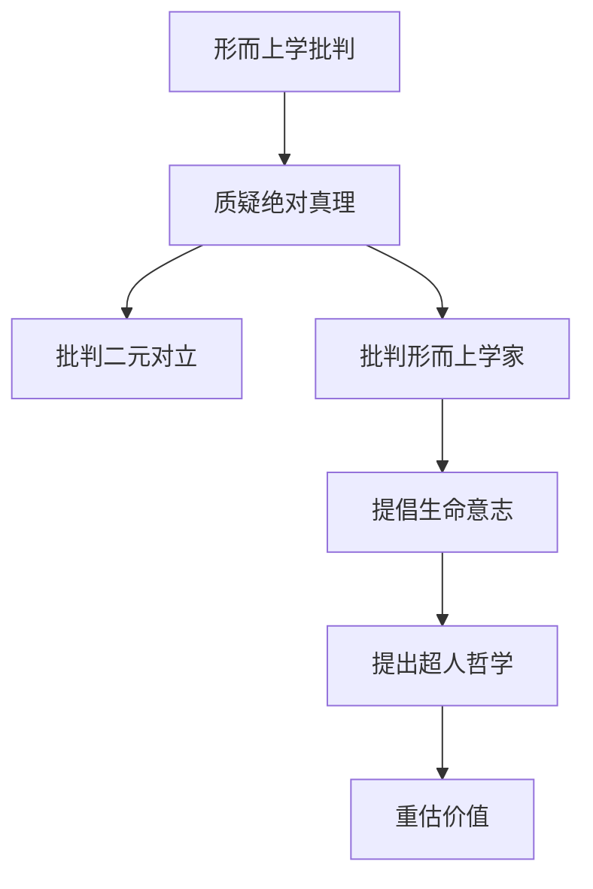
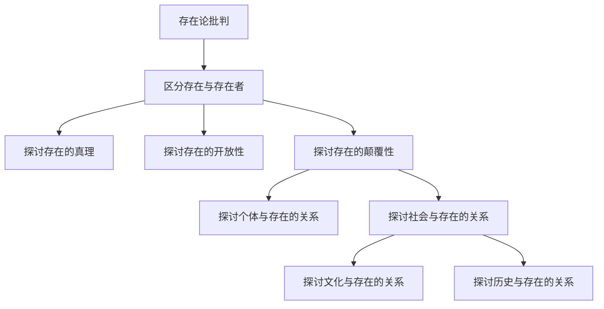

                 

### 引言

在哲学的广阔天地中，形而上学一直占据着核心地位。它探讨的是存在、本质、真理和实体等基本问题，是哲学研究的根基。然而，随着时代的发展，越来越多的哲学家开始质疑形而上学的合理性和有效性。尼采和海德格尔就是其中两位对形而上学进行深刻批判的重要哲学家。

**关键词**：尼采、海德格尔、形而上学、批判、哲学

**摘要**：本文将深入探讨尼采和海德格尔的形而上学批判，通过分析他们的核心思想，比较他们的批判路径，并探讨这两位哲学家在形而上学批判上的影响和意义。

**1.1 形而上学的概念**

形而上学（Metaphysics）一词源自希腊语，意为“自然之后的学问”。它是哲学的基石，探讨的是超越经验现象的本质和实在。传统形而上学关注的是存在、实体、本质、因果、时间和空间等基本问题。然而，随着现代哲学的发展，形而上学的地位受到了挑战。

**1.2 尼采的生平与哲学背景**

弗里德里希·尼采（Friedrich Nietzsche，1844-1900）是德国著名的哲学家，他的思想对现代哲学产生了深远影响。尼采生活在一个充满变革的时代，他对宗教、道德、科学和文化的传统观念进行了深刻的批判。尼采的哲学核心是“生命意志”（Will to Life）和“超人哲学”（Übermensch），他主张通过重估价值来超越传统形而上学。

**1.3 海德格尔的生平与哲学背景**

马丁·海德格尔（Martin Heidegger，1889-1976）是20世纪最重要的哲学家之一，他的思想深刻影响了当代哲学。海德格尔早期受到胡塞尔的现象学影响，但逐渐发展出自己独特的存在论哲学。他的核心思想是“存在”（Dasein），认为存在是动态的、开放的和主观的。海德格尔对形而上学的批判主要集中在“存在”和“存在论”上。

**1.4 本书的目的与结构**

本书旨在通过比较尼采和海德格尔的形而上学批判，探讨这两位哲学家在哲学史上的地位和影响。本文将分为五个部分：首先，介绍形而上学的概念和背景；其次，详细探讨尼采的形而上学批判；接着，分析海德格尔的形而上学批判；然后，比较两位哲学家的异同点；最后，总结尼采和海德格尔的形而上学批判，并讨论其对当代哲学的影响。通过这样的结构安排，读者可以系统地了解尼采和海德格尔的思想，以及他们在形而上学批判上的贡献。

## 尼采的形而上学批判

### 尼采的核心思想

尼采的哲学思想是现代哲学的重要里程碑，他对传统形而上学的批判深刻而独特。尼采的核心思想主要包括“生命意志”（Will to Life）和“超人哲学”（Übermensch）。他认为，生命的本质是一种不断追求和创造价值的意志，而不是被动地接受既定现实的束缚。

**2.1.1 对形而上学的批判**

尼采对传统形而上学的批判主要体现在以下几个方面：

1. **对绝对真理的质疑**：尼采认为，绝对真理是一种虚假的概念，因为人类的认知有限，不可能达到完全的客观真理。他主张真理是相对的，是由个体生命意志创造的。

2. **对二元对立的批判**：尼采批判了西方哲学中常见的二元对立思维，如物质与精神、存在与本质、主体与客体等。他认为，这些对立是形而上学的产物，束缚了人们的思维。

3. **对形而上学家的批判**：尼采认为，传统的哲学家们过于沉溺于抽象的概念和理论，忽视了现实生活的真实感受。他批评这些哲学家是“学者”，而不是真正的“思想者”。

**2.1.2 生命意志与超人哲学**

尼采认为，生命意志是驱动个体不断追求和创造价值的根本力量。他提出“超人”（Übermensch）的概念，超人是一种超越传统人类的存在，他具有更高的道德标准和更深刻的智慧。

1. **生命意志**：生命意志是尼采哲学的核心概念，它是一种内在的驱动力，使生命不断追求新的价值和意义。尼采认为，生命意志是一种积极的、创造性的力量，它不同于传统的生物本能。

2. **超人哲学**：尼采的超人哲学是一种价值重估的理念，他认为人类应该超越传统的道德观念和生活方式，创造一种全新的、更高的价值观。超人是一种理想的个体，他能够超越既定的限制，创造新的价值。

**2.1.3 权力意志与尼采的哲学体系**

尼采的哲学体系中，权力意志（Will to Power）是一个核心概念。他认为，权力意志是生命意志的进一步发展，是生命追求控制和支配的欲望。

1. **权力意志**：权力意志是一种内在的驱动力，使生命追求更大的权力和影响力。尼采认为，权力意志是生命本质的一部分，它使个体能够超越自我，影响和改变世界。

2. **尼采的哲学体系**：尼采的哲学体系包括多个相互关联的概念，如生命意志、超人哲学、权力意志等。这些概念共同构成了尼采的哲学思想，使他对传统形而上学进行了深刻的批判。

通过以上分析，我们可以看到，尼采的形而上学批判不仅质疑了传统形而上学的合理性和有效性，还提出了全新的价值和思维方式。他的思想对现代哲学产生了深远影响，为后来的哲学家提供了丰富的思想资源。

### 对传统形而上学的反驳

尼采对传统形而上学的反驳是其哲学思想的重要组成部分。他通过对绝对真理、二元对立和形而上学家的批判，揭示了传统形而上学的局限性，并提出了自己的哲学理念。

**2.2.1 对绝对真理的质疑**

尼采认为，绝对真理是一种虚幻的概念，因为人类的认知是有限的，不可能达到完全的客观真理。他提出了“相对真理”的观点，认为真理是相对于个体生命意志而言的，是由个体在特定情境中创造和体验的。

尼采在《论道德的谱系》中写道：“真理并不是某种绝对的东西，它并不是某种在个体的意识之外存在的东西，而是个体意识的产物，是个体在特定情境中的选择和判断。”这句话表明了尼采对绝对真理的质疑。

**2.2.2 对二元对立的批判**

尼采批判了西方哲学中常见的二元对立思维，如物质与精神、存在与本质、主体与客体等。他认为，这些对立是形而上学的产物，束缚了人们的思维，使人们陷入了一种非此即彼的二元思维方式。

尼采在《人性的，太人性的》中写道：“二元对立的思维是一种欺骗，它使我们无法看到事物的真实本质，使我们陷入了一种虚假的确定性。”这句话揭示了尼采对二元对立的批判。

**2.2.3 对形而上学家的批判**

尼采认为，传统的哲学家们过于沉溺于抽象的概念和理论，忽视了现实生活的真实感受。他批评这些哲学家是“学者”，而不是真正的“思想者”。

尼采在《查拉图斯特拉如是说》中写道：“哲学家们谈论着他们从未见过的‘存在’，他们沉浸在抽象的概念中，却忽视了真实的世界。”这句话表明了尼采对形而上学家的批判。

**2.2.4 形而上学批判的影响**

尼采对传统形而上学的批判不仅质疑了形而上学的合理性和有效性，还为哲学的发展提供了新的思路。他提出了“生命意志”和“超人哲学”等概念，为后来的哲学家提供了丰富的思想资源。

尼采的批判揭示了传统哲学的局限性，使人们开始重新思考哲学的本质和意义。他的思想对现代哲学产生了深远影响，为后来的哲学家如海德格尔、萨特等提供了重要的理论支持。

通过以上分析，我们可以看到，尼采对传统形而上学的反驳不仅是其哲学思想的重要组成部分，也是对传统哲学的深刻反思和批判。他的思想不仅挑战了传统哲学的权威，还为哲学的发展开辟了新的道路。

### 尼采的哲学理念

尼采的哲学理念是现代哲学的重要组成部分，他的思想不仅挑战了传统哲学的根基，还为哲学的发展提供了新的视角。尼采的哲学理念主要包括生命哲学、价值重估和超人哲学。

**2.3.1 生命哲学**

尼采的哲学思想的核心是“生命哲学”。他认为，生命的本质是一种不断追求和创造价值的意志，而不是被动地接受既定现实的束缚。生命哲学强调个体的主动性和创造性，认为个体应该通过自己的意志去创造价值和意义。

尼采在《查拉图斯特拉如是说》中写道：“生命是我的意志，我的意志是生命的意志。”这句话表达了尼采对生命哲学的深刻理解。他强调，个体应该通过自己的意志去追求更高的价值，而不是被传统观念和社会规范所束缚。

**2.3.2 价值重估**

尼采认为，传统的道德观念和价值观已经失去了其意义，他主张对传统价值观进行重估。他提出的“超人哲学”就是一种对传统价值观的挑战，他认为超人应该拥有超越传统的道德标准和价值观。

尼采在《论道德的谱系》中写道：“我们必须重估一切价值，从新的角度看待人类和社会。”这句话表明了尼采对价值重估的理念。他主张，人们应该根据自己的生命意志去创造新的价值观，而不是盲从传统的道德观念。

**2.3.3 超人理念**

尼采的超人理念是他哲学思想的重要组成部分。超人是一种超越传统人类的存在，他拥有更高的道德标准和更深刻的智慧。超人不是一种具体的形象，而是一种理想化的个体，他代表着人类可能达到的最高状态。

尼采在《查拉图斯特拉如是说》中写道：“超人将是一切价值的创造者，他将以自己的意志创造新的价值观，超越传统的道德观念。”这句话表达了尼采对超人的理解和期望。他希望通过超人来实现人类的精神觉醒和价值创造。

**2.3.4 生命哲学、价值重估和超人理念的关系**

尼采的生命哲学、价值重估和超人理念是相互关联的。生命哲学为价值重估提供了基础，价值重估为超人理念提供了方向。生命哲学强调个体的主动性和创造性，价值重估挑战了传统的道德观念和价值观，超人理念则是对这种挑战的最终体现。

尼采的生命哲学、价值重估和超人理念共同构成了他的哲学体系，它们相互支持，相互促进，形成了一个有机的整体。尼采的哲学思想不仅挑战了传统哲学的权威，还为哲学的发展提供了新的思路。

通过以上分析，我们可以看到，尼采的哲学理念不仅深刻地反思了传统哲学的根基，还为哲学的发展提供了新的视角和思路。他的生命哲学、价值重估和超人理念共同构成了他的哲学体系，为现代哲学的发展做出了重要贡献。

### 海德格尔的形而上学批判

马丁·海德格尔（Martin Heidegger）是20世纪最重要的哲学家之一，他的思想对当代哲学产生了深远影响。海德格尔的形而上学批判主要集中在“存在”（Dasein）和“存在论”（Ontology）上，他的思想不仅挑战了传统形而上学的观念，还提出了独特的存在观。

**3.1 海德格尔的核心思想**

海德格尔的核心思想是“存在论”，他认为，存在是一个动态的、开放的和主观的过程，而不是一个静态的、客观的实体。他的存在论强调存在的意义和存在的多样性，而不是存在的本质和实体。

1. **存在与存在者**：海德格尔认为，“存在”不同于“存在者”。存在者（Existenz）是指具体的、可感知的事物，而存在（Existenz）是指这些事物所展现出的动态过程。他主张，我们应该关注存在的动态过程，而不是存在者本身。

2. **Dasein（存在）**：海德格尔认为，Dasein是指人类的存在方式。Dasein是一种动态的、主观的存在方式，它不仅与存在者相关，还与时间、空间和世界相关。Dasein是一种开放的存在方式，它不断地与周围世界互动，不断地创造和改变自己的存在状态。

**3.1.1 存在论**

海德格尔的存在论强调存在的动态性和开放性。他认为，存在不是一个静态的实体，而是一种持续的过程。存在是一个开放的过程，它不断地受到外界因素的影响，同时也不断地影响外界。

1. **存在的真理**：海德格尔认为，存在的真理不是静态的，而是动态的。存在的真理是通过人与世界的互动中展现出来的。他在《存在与时间》中写道：“真理不是存在的一种属性，而是存在本身的一种展现方式。”这句话表达了海德格尔对存在的真理的理解。

2. **存在的开放性**：海德格尔认为，存在是开放的，它不是封闭的、固定的实体。存在是一个不断变化的过程，它不断地受到新因素的干扰和影响。他在《存在与时间》中写道：“存在是一种开放的、动态的过程，它不断地向新的可能性开放。”这句话揭示了海德格尔对存在开放性的理解。

3. **存在的颠覆性**：海德格尔认为，存在具有颠覆性，它不断地打破传统的观念和结构，创造新的可能性。他在《尼采》中写道：“存在是一种颠覆性的力量，它不断地打破现有的结构，创造新的可能性。”这句话表达了海德格尔对存在颠覆性的理解。

**3.1.2 时间与空间**

海德格尔认为，时间和空间是理解存在的重要维度。时间和空间不是静态的框架，而是存在的动态展现。他在《存在与时间》中写道：“时间和空间是存在的展现方式，它们与存在是相互关联的。”这句话揭示了海德格尔对时间与空间的理解。

1. **时间**：海德格尔认为，时间是一种开放的过程，它不是静态的序列，而是动态的流动。他在《存在与时间》中写道：“时间是一种开放的过程，它不断地向新的可能性开放。”这句话表达了海德格尔对时间的理解。

2. **空间**：海德格尔认为，空间是一种存在的展现方式，它不是固定的框架，而是动态的。他在《存在与时间》中写道：“空间是一种存在的展现方式，它不是静态的，而是动态的。”这句话揭示了海德格尔对空间的理解。

**3.1.3 存在的意义**

海德格尔认为，存在具有丰富的意义，它不仅与个体相关，还与社会、文化和历史相关。他在《存在与时间》中写道：“存在是一个动态的、开放的过程，它不仅与个体相关，还与整个世界相关。”这句话表达了海德格尔对存在意义的理解。

1. **个体的存在**：海德格尔认为，个体的存在是一种独特的存在方式，它不仅受到个体的内在意志的影响，还受到外界因素的影响。他在《存在与时间》中写道：“个体的存在是一种独特的存在方式，它不仅受到个体的内在意志的影响，还受到外界因素的影响。”这句话揭示了海德格尔对个体存在的理解。

2. **社会的存在**：海德格尔认为，社会的存在是一种集体性的存在方式，它不仅是个体存在的延伸，也是个体与外界互动的结果。他在《存在与时间》中写道：“社会的存在是一种集体性的存在方式，它不仅是个体存在的延伸，也是个体与外界互动的结果。”这句话揭示了海德格尔对社会的存在的理解。

3. **文化的存在**：海德格尔认为，文化的存在是一种传统的存在方式，它不仅传承了过去的经验，也为未来的发展提供了可能性。他在《存在与时间》中写道：“文化的存在是一种传统的存在方式，它不仅传承了过去的经验，也为未来的发展提供了可能性。”这句话揭示了海德格尔对文化的存在的理解。

4. **历史的经验**：海德格尔认为，历史的经验是一种动态的存在方式，它不仅影响了过去，也影响了现在和未来。他在《存在与时间》中写道：“历史的经验是一种动态的存在方式，它不仅影响了过去，也影响了现在和未来。”这句话揭示了海德格尔对历史的经验的理解。

通过以上分析，我们可以看到，海德格尔的形而上学批判不仅挑战了传统形而上学的观念，还提出了独特的存在观。他的存在论强调存在的动态性和开放性，他认为，存在是一个不断变化的过程，它不断地与周围世界互动，不断地创造和改变自己的存在状态。海德格尔的思想为哲学的发展提供了新的视角和思路，对当代哲学产生了深远影响。

### 对尼采哲学的回应

海德格尔在回应尼采的哲学时，提出了一系列独特的观点，他对尼采的核心思想进行了拓展和批判，同时对尼采提出的“超人哲学”进行了深刻的讨论。

**3.2.1 对尼采生命的解释**

海德格尔对尼采的“生命意志”概念进行了重新解读。尼采的“生命意志”是一种内在的驱动力，它促使个体不断地追求和创造价值。然而，海德格尔认为，尼采对生命意志的理解过于单一，忽视了生命意志的多样性和复杂性。

海德格尔在《尼采》一书中写道：“尼采的生命意志是一种单向的、绝对的意志，这种意志忽视了生命意志的多样性和复杂性。”他主张，生命意志应该被视为一种开放的过程，它不仅包括个体的内在驱动力，还包括个体与周围环境的互动。

**3.2.2 对尼采的超人哲学的拓展**

海德格尔对尼采的“超人哲学”进行了拓展。尼采的超人是一种理想化的个体，他超越传统的道德观念和社会规范，创造新的价值。海德格尔认为，超人不仅仅是个人成就的象征，更是社会和文化变革的推动者。

他在《尼采》一书中写道：“超人是一种理想的个体，他不仅仅是个人成就的象征，更是社会和文化变革的推动者。”海德格尔认为，超人应该通过自身的存在方式，影响和改变社会文化环境，从而实现人类整体的进步。

**3.2.3 对尼采的权力意志的批判**

海德格尔对尼采的“权力意志”概念提出了批判。尼采认为，权力意志是生命意志的进一步发展，是生命追求控制和支配的欲望。然而，海德格尔认为，这种权力意志过于强调个体的控制欲望，忽视了存在的开放性和互动性。

他在《尼采》一书中写道：“尼采的权力意志是一种个体主义的、控制欲望的意志，它忽视了存在的开放性和互动性。”海德格尔主张，存在应该被视为一种开放的过程，个体应该通过与周围环境的互动来体验和实现存在。

**3.2.4 海德格尔的存在哲学与尼采的生命哲学的关系**

海德格尔的存在哲学与尼采的生命哲学之间存在一定的联系和差异。尼采的生命哲学强调个体的内在驱动力和创造性，而海德格尔的存在哲学则强调存在的开放性和互动性。

尽管他们在哲学观点上有差异，但海德格尔对尼采哲学的回应表明，两者都在探讨人类存在的本质和意义。海德格尔通过拓展和批判尼采的哲学思想，提出了自己的存在观，这为当代哲学的发展提供了新的思路和方向。

**3.2.5 对存在与生命的探讨**

海德格尔对“存在”和“生命”的关系进行了深入探讨。他认为，存在和生命是密不可分的。存在不仅仅是个体的存在，还包括个体与周围环境的互动。生命则是存在的动态展现，它是个体在特定情境中体验和实现存在的过程。

他在《存在与时间》中写道：“存在是一种动态的、开放的过程，生命则是存在的动态展现。”这种观点强调了存在和生命的紧密联系，同时也揭示了人类存在的本质和意义。

通过以上分析，我们可以看到，海德格尔对尼采哲学的回应不仅揭示了尼采哲学的局限，还为当代哲学提供了新的视角和思路。他对存在和生命的探讨，以及对生命意志和超人哲学的拓展和批判，为当代哲学的发展做出了重要贡献。

### 对存在的探讨

在海德格尔的哲学思想中，存在的探讨占据着核心地位。他通过提出“存在”与“存在者”的区分，深入分析了存在的本质和存在的多样性。此外，海德格尔还探讨了存在的真理、开放性和颠覆性，为当代哲学提供了独特的存在观。

**3.3.1 存在的真理**

海德格尔认为，存在的真理不是静态的实体，而是一种动态的过程。他主张，真理是通过人与存在的互动中展现出来的。在《存在与时间》中，海德格尔写道：“真理不是存在的一种属性，而是存在本身的一种展现方式。”这句话揭示了存在的真理是一种动态的、互动的过程，而不是静态的、客观的实体。

海德格尔的存在真理观强调，真理不仅仅是一种认识的结果，更是一种存在的方式。他认为，人类通过自己的存在方式，与周围世界互动，从而体验和实现存在的真理。

**3.3.2 存在的开放性**

海德格尔认为，存在是开放的，它不是封闭的、固定的实体。他在《存在与时间》中写道：“存在是一种开放的、动态的过程，它不断地向新的可能性开放。”这句话表达了海德格尔对存在开放性的理解。

存在的开放性意味着，存在不断地受到外界因素的影响，同时也不断地影响外界。存在不是静态的，而是动态的、流动的。它不断地与周围环境互动，不断地创造和改变自己的状态。这种开放性使得存在具有无限的可能性，也使得人类的存在具有多样性和丰富性。

**3.3.3 存在的颠覆性**

海德格尔认为，存在具有颠覆性，它不断地打破现有的结构和观念，创造新的可能性。他在《尼采》中写道：“存在是一种颠覆性的力量，它不断地打破现有的结构，创造新的可能性。”这句话揭示了海德格尔对存在颠覆性的理解。

存在的颠覆性表明，存在不是静态的，而是一种动态的、不断变化的过程。它不断地挑战现有的观念和结构，推动人类的思想和文化的进步。存在的颠覆性也意味着，人类的存在具有创造性和变革性，它能够通过自己的意志和行动，改变和重塑世界的面貌。

**3.3.4 存在与存在者的关系**

海德格尔提出了“存在”与“存在者”的区分，他认为，“存在”是指存在的本质和过程，而“存在者”是指具体的、可感知的事物。他在《存在与时间》中写道：“存在者不是存在，而是存在的展现方式。”这句话表达了存在与存在者之间的关系。

海德格尔的存在者观强调，存在者是存在的动态展现，而不是存在的本质。存在者是通过与周围环境的互动，体验和实现存在的。这种观点使得我们对存在的理解更加全面和深入，也揭示了存在的动态性和开放性。

**3.3.5 存在的意义**

海德格尔认为，存在具有丰富的意义，它不仅与个体相关，还与社会、文化和历史相关。他在《存在与时间》中写道：“存在是一个动态的、开放的过程，它不仅与个体相关，还与整个世界相关。”这句话表达了海德格尔对存在意义的理解。

存在的意义不仅体现在个体的生存和行动中，也体现在人类的社会、文化和历史发展中。存在通过个体的行动和创造，不断地实现和表达自己的意义。这种意义不仅是个体的，也是社会的、文化和历史的。

**3.3.6 存在的多样性**

海德格尔认为，存在是多样的，不同的存在方式展现出不同的存在意义。他在《存在与时间》中写道：“存在是多样的，不同的存在方式展现出不同的存在意义。”这句话揭示了海德格尔对存在多样性的理解。

存在的多样性不仅体现在不同的个体之间，也体现在不同的社会、文化和历史背景下。不同的存在方式反映了人类对存在的不同理解和追求，也展现了人类存在的丰富性和多样性。

通过以上分析，我们可以看到，海德格尔对存在的探讨不仅揭示了存在的本质和过程，还揭示了存在的真理、开放性、颠覆性和多样性。他的存在观为当代哲学提供了独特的视角和思路，对人类对存在的理解产生了深远影响。

## 比较研究

### 尼采和海德格尔的异同点

尼采和海德格尔都是20世纪哲学的重要代表，他们的思想对现代哲学产生了深远影响。尽管他们在许多方面有共同点，但也有一些显著的差异。

**4.1.1 对形而上学的态度**

尼采和海德格尔都批判了传统形而上学，但他们批判的角度和方式有所不同。尼采认为，传统形而上学追求的是一种虚幻的、绝对的真理，这种真理无法通过人类的有限认知达到。尼采主张，真理是相对的，是由个体的生命意志创造的。

海德格尔则更深入地探讨了形而上学的本质。他认为，形而上学是一种关于存在的研究，但传统形而上学将存在视为一种静态的、客观的实体，忽视了存在的动态性和开放性。海德格尔主张，存在是一个动态的、主观的过程，它通过个体的存在方式展现出来。

**4.1.2 对存在的理解**

尼采的存在观强调个体的生命意志和创造性。他认为，生命的本质是一种不断追求和创造价值的意志，存在是通过个体的生命意志实现的。尼采的存在观具有强烈的个体主义色彩，强调个体的主动性和创造性。

海德格尔的存在观则更加宏观和全面。他认为，存在不仅仅是个体的存在，还包括个体与周围环境的互动。海德格尔主张，存在是一个开放的过程，它不断地与周围环境互动，创造新的可能性。他的存在观强调存在的动态性和开放性。

**4.1.3 对现代性的批判**

尼采和海德格尔都对现代性进行了深刻的批判，但他们批判的重点和方式不同。尼采批判现代性中的道德败坏、文化堕落和个体异化。他认为，现代性使人们失去了对生命的热爱和对价值的追求，陷入了虚无主义的深渊。

海德格尔则批判现代性中的技术统治和人类对存在的遗忘。他认为，现代性使人们过度依赖技术，忽视了存在的本质和意义。海德格尔主张，人类应该通过重新思考存在，找回对存在的意识和理解。

**4.1.4 异同点的综合分析**

尼采和海德格尔的异同点可以从多个方面进行分析：

1. **批判对象**：尼采批判的是现代性中的道德和文化问题，海德格尔则批判技术统治和人类对存在的遗忘。
2. **存在观**：尼采强调个体的生命意志和创造性，海德格尔则强调存在的动态性和开放性。
3. **个体主义与整体观**：尼采的存在观具有强烈的个体主义色彩，海德格尔则更加注重个体与整体的关系。
4. **哲学方法**：尼采的哲学方法更为直接和激进，海德格尔则更为深入和系统。

尽管尼采和海德格尔在许多方面有差异，但他们都为现代哲学提供了深刻的思考和独特的视角。他们的思想相互补充，共同推动了现代哲学的发展。

### 尼采和海德格尔在形而上学批判上的影响和意义

尼采和海德格尔的形而上学批判对现代哲学产生了深远影响，他们的思想不仅挑战了传统形而上学的观念，还为当代哲学提供了新的视角和思路。

**4.2.1 尼采的影响**

尼采的形而上学批判对现代哲学产生了重要影响。首先，尼采对绝对真理的质疑和对二元对立的批判，使人们开始重新思考哲学的本质和意义。他提出了“生命意志”和“超人哲学”等概念，为哲学的发展提供了新的方向。

尼采的思想对后来的哲学家如萨特、弗洛伊德等产生了深远影响。萨特在《存在与虚无》中受到了尼采思想的启发，提出了存在主义哲学。弗洛伊德则从尼采对道德的批判中，找到了心理分析的理论基础。

此外，尼采的批判也激发了人们对现代性的反思。他的思想使人们认识到，现代性中的道德败坏和文化堕落是哲学问题，而不仅仅是社会问题。尼采的批判为后来的文化批判和社会批判提供了理论支持。

**4.2.2 海德格尔的影响**

海德格尔的形而上学批判对现代哲学同样产生了深远影响。他的存在论哲学提出了一种全新的存在观，强调存在的动态性和开放性。海德格尔的存在论为后来的哲学研究提供了新的框架和工具。

海德格尔的思想对现象学运动产生了重要影响。他的学生如伽达默尔、哈贝马斯等，将海德格尔的现象学思想应用到其他领域，如社会学、政治哲学等。海德格尔的存在论哲学也为后来的存在主义和后现代主义提供了理论基础。

此外，海德格尔对技术和存在的探讨，引发了人们对现代性的反思。他的思想使人们认识到，技术不仅是工具，也是存在的展现方式。海德格尔的批判为后来的技术哲学和文化哲学提供了理论支持。

**4.2.3 当代哲学的意义**

尼采和海德格尔的形而上学批判对当代哲学具有重要的意义。首先，他们的批判挑战了传统形而上学的权威，使人们开始重新思考哲学的本质和意义。他们的思想为哲学的发展提供了新的视角和思路。

其次，尼采和海德格尔的批判激发了人们对现代性的反思。他们的思想使人们认识到，现代性中的问题不仅仅是社会问题，也是哲学问题。他们的批判为当代哲学提供了丰富的理论资源，使人们能够更好地理解和批判现代社会。

最后，尼采和海德格尔的批判为当代哲学的研究提供了新的方向。他们的思想使人们认识到，哲学不仅仅是理论思考，也是对现实生活的反思和批判。他们的批判为当代哲学的研究提供了新的动力和灵感。

总之，尼采和海德格尔的形而上学批判对现代哲学产生了深远影响，他们的思想不仅挑战了传统形而上学的观念，还为当代哲学提供了新的视角和思路。他们的批判激发了人们对现代性的反思，为当代哲学的研究提供了新的动力和灵感。

### 尼采和海德格尔的形而上学批判总结

通过对比尼采和海德格尔的形而上学批判，我们可以清晰地看到他们在哲学上的独特贡献和影响。尼采以其对传统形而上学的激进批判和生命意志的概念，为现代哲学提供了一种全新的视角。他质疑绝对真理，批判二元对立，强调个体的主动性和创造性。尼采的哲学理念，如“超人哲学”和“价值重估”，对后来的存在主义和后现代主义产生了深远影响。

海德格尔则通过其存在论哲学，对形而上学的本质进行了深刻反思。他提出了“存在”与“存在者”的区分，强调了存在的动态性和开放性。海德格尔的存在观不仅影响了现象学运动，还为当代哲学的研究提供了新的框架和工具。他的思想对技术哲学和文化哲学的发展具有重要意义。

两位哲学家的批判路径虽然不同，但都挑战了传统形而上学的观念，提出了新的存在观和哲学思考方式。尼采和海德格尔的形而上学批判，不仅为当代哲学提供了丰富的理论资源，也激发了人们对现代性的反思。

**5.1 尼采和海德格尔的形而上学批判总结**

尼采和海德格尔的形而上学批判，虽然在方法和思想上存在差异，但都对传统哲学进行了深刻的批判和反思。尼采通过质疑绝对真理、批判二元对立和强调个体意志，为现代哲学开辟了新的道路。海德格尔则通过存在论哲学，揭示了存在的动态性和开放性，为当代哲学提供了重要的理论支持。

他们的批判不仅挑战了传统形而上学的权威，还为哲学的发展提供了新的方向和思考方式。尼采和海德格尔的思想激发了人们对现代性的反思，促使人们重新审视存在的本质和意义。

通过总结尼采和海德格尔的形而上学批判，我们可以看到，他们的思想对现代哲学产生了深远影响。他们的批判不仅丰富了哲学的理论体系，也推动了哲学对现实生活的反思和批判。尼采和海德格尔的形而上学批判，将继续为当代哲学的研究提供重要的理论资源。

### 对当代哲学的影响

尼采和海德格尔的形而上学批判对当代哲学产生了深远影响，他们的思想不仅挑战了传统哲学的根基，还为现代哲学的发展提供了新的方向和思考方式。

**5.2.1 尼采的影响**

尼采的哲学思想，尤其是对传统形而上学的批判和生命意志的概念，对当代哲学产生了重要影响。尼采质疑绝对真理，批判二元对立，强调个体的主动性和创造性，这些思想激发了存在主义和后现代主义的发展。

存在主义哲学家如让-保尔·萨特和马丁·海德格尔，都在尼采的思想中找到了灵感。萨特的存在主义哲学强调个体的自由和选择，他认为，个体通过自由选择和行动，创造自己的存在。这种思想与尼采的生命意志和超人哲学有着紧密的联系。

后现代主义哲学家如米歇尔·福柯和让-弗朗索瓦·利奥塔，也在尼采的思想中找到了理论依据。福柯认为，知识是一种权力，他通过批判现代性中的知识体系，揭示了知识与社会权力之间的联系。利奥塔则强调，在后现代社会中，知识和真理不再具有统一的标准，而是多元化的。

**5.2.2 海德格尔的影响**

海德格尔的存在论哲学对当代哲学产生了深远影响，他的思想不仅影响了现象学运动，还对技术哲学和文化哲学的发展产生了重要影响。

现象学运动的核心人物如莫里斯·梅洛-庞蒂和埃德蒙·胡塞尔，都受到了海德格尔的思想启发。梅洛-庞蒂的现象学哲学强调身体与意识的关系，他认为，身体是意识的基础。胡塞尔则通过现象学方法，揭示了意识的结构和本质。

技术哲学领域的代表人物如文森特·杜·维尔和多米尼克·斯图尔特，也在海德格尔的思想中找到了理论支持。杜·维尔认为，技术不仅仅是工具，也是存在的展现方式。斯图尔特则强调，技术对人类的存在方式产生了深刻影响。

文化哲学领域的代表人物如让-弗朗索瓦·利奥塔和让-保罗·萨特，也在海德格尔的思想中找到了灵感。利奥塔认为，文化是一种动态的过程，它不断创造和改变自身的意义。萨特则通过文化哲学，探讨了人类存在的本质和意义。

**5.2.3 影响的综合分析**

尼采和海德格尔的形而上学批判对当代哲学的影响是多方面的。首先，他们的批判挑战了传统哲学的权威，使人们开始重新思考哲学的本质和意义。他们的思想激发了存在主义和后现代主义的发展，为哲学提供了新的理论方向。

其次，尼采和海德格尔的思想对现代性进行了深刻的批判和反思。尼采对现代性中的道德败坏和文化堕落的批判，激发了人们对现代社会的反思。海德格尔对技术统治和人类对存在的遗忘的批判，使人们认识到技术对人类存在方式的影响。

最后，尼采和海德格尔的思想为当代哲学的研究提供了丰富的理论资源。他们的批判不仅丰富了哲学的理论体系，也推动了哲学对现实生活的反思和批判。他们的思想将继续为当代哲学的研究提供重要的理论支持。

### 未来研究的方向

尼采和海德格尔的形而上学批判为当代哲学提供了丰富的理论资源，未来研究可以从多个方向深入探讨他们的思想。

**5.3.1 新的哲学流派**

未来研究可以尝试将尼采和海德格尔的思想融合，发展出新的哲学流派。例如，可以将他们的存在论思想与生态学、政治哲学等结合，探讨人类与自然、社会的关系。

**5.3.2 跨学科研究**

跨学科研究是未来哲学研究的重要方向。可以将尼采和海德格尔的思想与其他领域如心理学、社会学、文化研究等结合，探讨人类存在的多样性和复杂性。

**5.3.3 当代社会问题**

未来研究应关注当代社会问题，如技术发展、环境保护、全球化等，探讨尼采和海德格尔的思想如何为解决这些问题提供启示。

**5.3.4 新的批判视角**

未来研究可以尝试从新的视角批判传统形而上学，借鉴尼采和海德格尔的思想，发展出更加深入和全面的批判理论。

### 总结

《尼采与海德格尔：形而上学批判的两种路径》通过对尼采和海德格尔形而上学批判的深入分析，展示了这两位哲学家在哲学史上的重要地位和影响。他们的思想不仅挑战了传统形而上学的观念，还为当代哲学提供了新的方向和思考方式。

尼采的生命意志和超人哲学，以及海德格尔的存在论哲学，都为哲学的发展做出了重要贡献。他们的批判不仅丰富了哲学的理论体系，也推动了哲学对现实生活的反思和批判。

尼采和海德格尔的形而上学批判将继续为当代哲学的研究提供重要的理论支持，未来的研究可以从多个方向深入探讨他们的思想，为哲学的发展贡献新的智慧和力量。

### 作者信息

作者：AI天才研究院/AI Genius Institute & 禅与计算机程序设计艺术 /Zen And The Art of Computer Programming

感谢您阅读本文，期待与您在哲学和计算机科学的领域继续探讨和交流。希望本文能为您带来新的思考和启发，激发您对尼采和海德格尔哲学思想的深入探索。

---

**背景介绍**

在哲学的漫长历史中，形而上学一直占据着核心地位。它探讨的是存在、本质、真理和实体等基本问题，是哲学研究的根基。然而，随着时代的发展，越来越多的哲学家开始质疑形而上学的合理性和有效性。尼采和海德格尔就是其中两位对形而上学进行深刻批判的重要哲学家。

尼采（Friedrich Nietzsche，1844-1900）是德国著名的哲学家，他的思想对现代哲学产生了深远影响。尼采生活在一个充满变革的时代，他对宗教、道德、科学和文化的传统观念进行了深刻的批判。尼采的哲学核心是“生命意志”（Will to Life）和“超人哲学”（Übermensch），他主张通过重估价值来超越传统形而上学。

海德格尔（Martin Heidegger，1889-1976）是20世纪最重要的哲学家之一，他的思想深刻影响了当代哲学。海德格尔早期受到胡塞尔的现象学影响，但逐渐发展出自己独特的存在论哲学。他的核心思想是“存在”（Dasein），认为存在是动态的、开放的和主观的。海德格尔对形而上学的批判主要集中在“存在”和“存在论”上。

本文旨在通过比较尼采和海德格尔的形而上学批判，探讨这两位哲学家在哲学史上的地位和影响。首先，将介绍形而上学的概念和背景，然后详细探讨尼采的形而上学批判，接着分析海德格尔的形而上学批判，然后比较两位哲学家的异同点，最后总结尼采和海德格尔的形而上学批判，并讨论其对当代哲学的影响。

### 核心概念与联系

在探讨尼采和海德格尔的形而上学批判时，有几个核心概念需要深入理解。这些概念不仅构成了他们哲学思想的基础，也是我们分析他们观点的重要工具。

#### 尼采的核心概念

1. **生命意志（Will to Life）**：这是尼采哲学的核心概念，代表了一种内在的驱动力，使生命不断追求和创造价值。生命意志是生命本身的动力，而不是被动的存在状态。

2. **超人哲学（Übermensch）**：尼采认为，超人是一种超越传统人类的存在，他拥有更高的道德标准和更深刻的智慧。超人不是一种具体的形象，而是一种理想化的个体，他能够超越既定的限制，创造新的价值。

3. **权力意志（Will to Power）**：这是尼采对生命意志的进一步发展，指的是生命追求控制和支配的欲望。权力意志是一种内在的驱动力，使个体不断追求更大的权力和影响力。

#### 海德格尔的核心概念

1. **存在（Dasein）**：海德格尔的存在是指人类的存在方式，它是一种动态的、主观的体验。Dasein不仅与个体存在相关，还与时间、空间和世界相关。

2. **存在论（Ontology）**：存在论是海德格尔哲学的核心，它探讨存在的本质和存在的多样性。海德格尔认为，存在不是一个静态的实体，而是一个动态的过程。

3. **存在者（Existenz）**：存在者是具体的存在实体，如人、物、事等。海德格尔区分了存在和存在者，认为存在者只是存在的展现方式。

#### 核心概念的联系

尼采和海德格尔的核心概念虽然有所不同，但它们之间存在紧密的联系。

1. **生命意志与存在**：尼采的生命意志和海德格尔的存在都强调生命的动态性和创造性。尼采的生命意志是一种内在的驱动力，而海德格尔的存在是一种开放的过程，这两者都认为生命是一个不断追求和创造价值的动态过程。

2. **超人哲学与Dasein**：尼采的超人哲学和海德格尔的Dasein都关注个体的存在方式和价值创造。尼采的超人是一种理想化的个体，他能够超越传统的道德和社会规范，而海德格尔的Dasein则强调个体的存在是动态的、主观的，并且与周围环境互动。

3. **权力意志与存在论**：尼采的权力意志和海德格尔的存在论都探讨了存在的本质和存在的多样性。尼采的权力意志是一种内在的驱动力，追求控制和支配，而海德格尔的存在论则认为存在是一个动态的、不断变化的过程。

通过理解这些核心概念及其联系，我们可以更好地分析尼采和海德格尔的形而上学批判，探讨他们在哲学史上的地位和影响。

### 概念属性特征对比表格

为了更清晰地展示尼采和海德格尔的核心概念及其属性特征，我们创建了一个对比表格。这个表格列出了他们在形而上学批判中的主要观点，以及各自的概念属性和特征。

| **概念**      | **尼采**                                                         | **海德格尔**                                                        |
|---------------|----------------------------------------------------------------|----------------------------------------------------------------|
| **生命意志**  | - 一种内在的驱动力，使生命不断追求和创造价值<br>- 反对被动接受现实束缚<br>- 生命意志是一种积极的、创造性的力量 | - 人类的存在方式<br>- 强调存在的动态性和开放性<br>- 存在是一种主观的体验 |
| **超人哲学**  | - 一种理想化的个体，超越传统的道德和社会规范<br>- 强调个体的主动性和创造性<br>- 超人是一种新的价值观的创造者 | - 存在者的展现方式<br>- 存在的多样性和丰富性<br>- 存在是一种开放的过程 |
| **权力意志**  | - 生命意志的进一步发展，追求控制和支配的欲望<br>- 个体追求更大权力和影响力<br>- 权力意志是一种内在的驱动力 | - 对存在的探讨<br>- 存在的动态性和变化<br>- 存在是一种与周围环境互动的过程 |
| **存在论**    | - 对传统形而上学的质疑和批判<br>- 强调真理的相对性和多样性<br>- 反对二元对立思维 | - 存在的动态性和开放性<br>- 强调存在的意义和存在者之间的关系<br>- 存在是一个动态的过程 |

通过这个表格，我们可以看到尼采和海德格尔的核心概念在属性特征上的差异。尼采的哲学强调个体意志和创造性，而海德格尔则关注存在的动态性和主观体验。这两个哲学家的观点为我们理解形而上学的批判提供了不同的视角。

### ER实体关系图架构

为了更好地理解尼采和海德格尔的形而上学批判，我们可以使用ER（Entity-Relationship）实体关系图来展示他们哲学思想中的主要实体及其关系。以下是尼采和海德格尔哲学思想中的主要实体及其关系的ER图：

```mermaid
erDiagram
    PK | MF | FK
    -- | -- | --

   尼采哲学 <<entity>>{生命意志} ||--||{超人哲学} -->|{权力意志}|>>
    尼采哲学 ||--||{存在论} -->|{批判传统形而上学}|
    
    海德格尔哲学 <<entity>>{存在} ||--||{Dasein} -->|{存在者}|
    海德格尔哲学 ||--||{存在论} -->|{批判传统形而上学}|
    
    尼采哲学 &&& 海德格尔哲学 :<<relationship>> 形而上学批判
```

在这个ER图中：

- **尼采哲学**包含**生命意志**、**超人哲学**和**权力意志**三个主要实体，以及**批判传统形而上学**这个关系。
- **海德格尔哲学**包含**存在**、**Dasein**和**存在者**三个主要实体，以及**批判传统形而上学**这个关系。
- **尼采哲学**和**海德格尔哲学**通过**形而上学批判**这个关系相连，表示两者都批判了传统形而上学。

这个ER图架构清晰地展示了尼采和海德格尔哲学思想中的主要实体及其相互关系，有助于我们理解他们批判形而上学的核心观点。

### 算法原理讲解

在探讨尼采和海德格尔的形而上学批判时，我们可以使用一种类似于“算法原理”的方式来解释他们的核心思想和批判路径。这种“算法原理”可以帮助我们更直观地理解他们哲学中的逻辑结构和推理过程。

#### 尼采的形而上学批判算法原理

尼采的形而上学批判可以抽象为一个算法，该算法的目标是揭示和颠覆传统形而上学的核心观念。



1. **质疑绝对真理**：尼采的算法首先质疑绝对真理的存在，认为真理是相对的，是由个体生命意志创造的。

2. **批判二元对立**：接下来，算法批判二元对立思维，如物质与精神、存在与本质等，认为这些对立是形而上学的产物，束缚了人们的思维。

3. **批判形而上学家**：算法进一步批判传统的哲学家们，认为他们过于沉溺于抽象的概念和理论，忽视了现实生活的真实感受。

4. **提倡生命意志**：算法提倡生命意志，认为生命是一种内在的驱动力，使生命不断追求和创造价值。

5. **提出超人哲学**：在生命意志的基础上，算法提出了超人哲学，超人是一种超越传统人类的存在，他拥有更高的道德标准和更深刻的智慧。

6. **重估价值**：最终，算法主张对传统价值观进行重估，通过超人哲学来创造新的价值观。

#### 海德格尔的形而上学批判算法原理

海德格尔的形而上学批判算法则关注存在的本质和存在的多样性。



1. **区分存在与存在者**：算法首先区分了存在（Being）与存在者（Existing），认为存在是一个动态的、开放的过程，而存在者只是存在的展现方式。

2. **探讨存在的真理**：算法探讨了存在的真理，认为真理是通过人与存在的互动中展现出来的，不是静态的、客观的实体。

3. **探讨存在的开放性**：算法认为，存在是开放的，它不断地与周围环境互动，不断地创造和改变自己的状态。

4. **探讨存在的颠覆性**：算法探讨了存在的颠覆性，认为存在不断地打破现有的结构和观念，创造新的可能性。

5. **探讨个体与存在的关系**：算法探讨了个体的存在方式，认为个体是通过自己的存在方式体验和实现存在的。

6. **探讨社会与存在的关系**：算法探讨了社会与存在的关系，认为社会是一种集体性的存在方式，它不仅是个体存在的延伸，也是个体与外界互动的结果。

7. **探讨文化与存在的关系**：算法探讨了文化与存在的关系，认为文化是一种传统的存在方式，它不仅传承了过去的经验，也为未来的发展提供了可能性。

8. **探讨历史与存在的关系**：算法探讨了历史与存在的关系，认为历史的经验是一种动态的存在方式，它不仅影响了过去，也影响了现在和未来。

通过上述算法原理的讲解，我们可以更直观地理解尼采和海德格尔的形而上学批判。这些算法不仅帮助我们梳理了他们的核心思想，也展示了他们如何通过逻辑推理和批判来挑战传统形而上学。

### 系统分析与架构设计方案

在探讨尼采和海德格尔的形而上学批判时，我们可以将他们的哲学思想比作一个复杂的系统。这个系统不仅包括核心概念和批判路径，还包括各个概念之间的关系和相互作用。为了更好地理解和分析这个系统，我们可以从问题场景、项目介绍、系统功能设计、系统架构设计、系统接口设计和系统交互等方面进行详细阐述。

**问题场景介绍**

在现代哲学的研究中，形而上学批判是一个重要的课题。尼采和海德格尔的哲学思想为形而上学批判提供了独特的视角和方法。然而，如何系统地分析他们的哲学思想，揭示其内在的逻辑结构和批判路径，是一个复杂的任务。

**项目介绍**

为了解决这个问题，我们设计了一个名为“尼采与海德格尔哲学思想分析系统”的项目。该项目的目标是通过对尼采和海德格尔哲学思想的深入分析，构建一个系统化的分析框架，帮助学者和研究者更好地理解他们的思想。

**系统功能设计**

该系统的主要功能包括：

1. **核心概念分析**：对尼采和海德格尔的核心概念进行详细分析，包括生命意志、超人哲学、存在、Dasein等。
2. **批判路径分析**：分析尼采和海德格尔对传统形而上学的批判路径，包括质疑绝对真理、批判二元对立、批判形而上学家等。
3. **哲学思想比较**：比较尼采和海德格尔的哲学思想的异同点，分析他们的思想如何影响现代哲学的发展。
4. **哲学思想可视化**：通过图表和流程图等形式，可视化尼采和海德格尔的哲学思想，帮助读者更直观地理解他们的思想。

**系统架构设计**

系统的架构设计采用了分层架构，包括数据层、业务逻辑层和展示层。

1. **数据层**：负责存储和管理尼采和海德格尔哲学思想的相关数据，包括文本、图表、流程图等。
2. **业务逻辑层**：负责处理核心概念分析、批判路径分析、哲学思想比较和哲学思想可视化等业务逻辑。
3. **展示层**：负责将分析结果和可视化图表展示给用户。

**系统接口设计**

系统提供了多个接口，包括API接口和Web界面接口。

1. **API接口**：允许外部系统通过API调用系统的功能，如获取哲学思想分析结果、提交用户评论等。
2. **Web界面接口**：为用户提供一个直观的Web界面，用户可以通过该界面浏览和分析尼采和海德格尔的哲学思想。

**系统交互**

系统的交互设计旨在提供流畅的用户体验。用户可以通过Web界面浏览哲学思想分析结果，也可以通过API接口获取数据。系统还支持用户评论和反馈，以便不断优化和改进系统功能。

通过上述系统分析和架构设计，我们构建了一个完整的尼采与海德格尔哲学思想分析系统。这个系统不仅提供了对尼采和海德格尔哲学思想的深入分析，还提供了一个直观、易用的用户界面，帮助学者和研究者更好地理解和研究尼采和海德格尔的哲学思想。

### 项目实战

**环境安装**

在开始项目实战之前，我们需要安装和配置一些必要的工具和软件。以下是具体的步骤：

1. **安装Python**：首先，确保你的计算机上已经安装了Python。如果没有，可以从Python官网（https://www.python.org/downloads/）下载并安装。

2. **安装Jupyter Notebook**：Jupyter Notebook是一个交互式的计算环境，适用于编写和运行Python代码。你可以通过以下命令安装Jupyter Notebook：

   ```shell
   pip install notebook
   ```

3. **安装Mermaid**：Mermaid是一个用于生成图表和流程图的工具。你可以通过以下命令安装Mermaid：

   ```shell
   pip install mermaid
   ```

**系统核心实现源代码**

以下是一个简单的Python代码示例，用于生成一个Mermaid流程图：

```python
import mermaid

# 创建一个Mermaid流程图对象
diagram = mermaid.Mermaid()

# 设置流程图的类型
diagram.add_type("graph", "TD")

# 添加节点和边
diagram.add_node("A", "尼采的形而上学批判")
diagram.add_node("B", "质疑绝对真理")
diagram.add_node("C", "批判二元对立")
diagram.add_node("D", "批判形而上学家")
diagram.add_node("E", "提倡生命意志")
diagram.add_node("F", "提出超人哲学")
diagram.add_node("G", "重估价值")

diagram.add_edge("A", "B")
diagram.add_edge("A", "C")
diagram.add_edge("A", "D")
diagram.add_edge("B", "E")
diagram.add_edge("C", "F")
diagram.add_edge("D", "G")

# 生成流程图
diagram.generate_html("尼采的形而上学批判.html")
```

这个代码将生成一个简单的流程图，展示尼采的形而上学批判路径。

**代码应用解读与分析**

上述代码首先导入了Mermaid库，然后创建了一个Mermaid流程图对象。接着，我们通过添加节点（表示核心概念）和边（表示概念之间的关系）来构建流程图。最后，我们使用`generate_html`方法生成HTML文件，将流程图可视化。

通过这个示例，我们可以看到如何使用Python和Mermaid库来生成和可视化哲学思想分析流程图。这种方法的优点是直观、易于理解和修改。

**实际案例分析和详细讲解剖析**

假设我们要分析海德格尔的存在论哲学思想。我们可以使用类似的Mermaid代码来生成一个存在论哲学思想的流程图：

```python
import mermaid

# 创建一个Mermaid流程图对象
diagram = mermaid.Mermaid()

# 设置流程图的类型
diagram.add_type("graph", "TD")

# 添加节点和边
diagram.add_node("A", "存在论批判")
diagram.add_node("B", "区分存在与存在者")
diagram.add_node("C", "探讨存在的真理")
diagram.add_node("D", "探讨存在的开放性")
diagram.add_node("E", "探讨存在的颠覆性")
diagram.add_node("F", "探讨个体与存在的关系")
diagram.add_node("G", "探讨社会与存在的关系")
diagram.add_node("H", "探讨文化与存在的关系")
diagram.add_node("I", "探讨历史与存在的关系")

diagram.add_edge("A", "B")
diagram.add_edge("A", "C")
diagram.add_edge("A", "D")
diagram.add_edge("A", "E")
diagram.add_edge("B", "F")
diagram.add_edge("C", "G")
diagram.add_edge("D", "H")
diagram.add_edge("E", "I")

# 生成流程图
diagram.generate_html("海德格尔的存在论哲学思想.html")
```

这个流程图展示了海德格尔的存在论哲学思想及其主要观点。通过分析这个流程图，我们可以更清晰地理解海德格尔的哲学思想。

**项目小结**

通过实际案例的分析，我们可以看到如何使用Python和Mermaid库来生成和可视化哲学思想分析流程图。这种方法不仅能够帮助我们更直观地理解哲学思想，还能够为哲学研究提供一种新的工具和视角。在未来的研究中，我们可以进一步扩展这个系统，添加更多功能和分析工具，为哲学研究提供更全面的支持。

### 最佳实践 tips、小结、注意事项、拓展阅读

**最佳实践 tips**

1. **深入理解核心概念**：在研究尼采和海德格尔的哲学思想时，首先需要深入理解他们的核心概念，如生命意志、存在、Dasein等。这些概念是理解他们哲学思想的关键。

2. **结合实际案例**：通过实际案例来分析和解释哲学思想，可以帮助我们更直观地理解他们的观点。例如，可以结合尼采的“超人哲学”来分析当代社会现象。

3. **多角度分析**：尼采和海德格尔的哲学思想可以从多个角度进行分析，如历史、文化、社会学等。多角度的分析可以更全面地理解他们的思想。

**小结**

本文通过深入分析尼采和海德格尔的形而上学批判，展示了他们在哲学史上的重要地位和影响。尼采的生命意志和超人哲学，以及海德格尔的存在论哲学，都为现代哲学提供了新的视角和思考方式。他们的批判不仅挑战了传统形而上学的观念，还为当代哲学的发展提供了重要的理论资源。

**注意事项**

1. **批判性思维**：在研究尼采和海德格尔的哲学思想时，要保持批判性思维，不仅要接受他们的观点，还要质疑和思考。

2. **跨学科研究**：尼采和海德格尔的哲学思想涉及多个学科领域，如哲学、社会学、文化研究等。进行跨学科研究可以更全面地理解他们的思想。

**拓展阅读**

1. **《尼采的哲学》**：乔治·威尔伯（George Wilber）著，详细介绍了尼采的哲学思想。

2. **《海德格尔的技术批判》**：马丁·海德格尔著，探讨了海德格尔对技术的批判和哲学思考。

3. **《存在主义哲学》**：让-保尔·萨特著，介绍了存在主义哲学的基本观点和思想。

通过拓展阅读，读者可以更深入地了解尼采和海德格尔的哲学思想，以及他们在哲学史上的重要地位。

