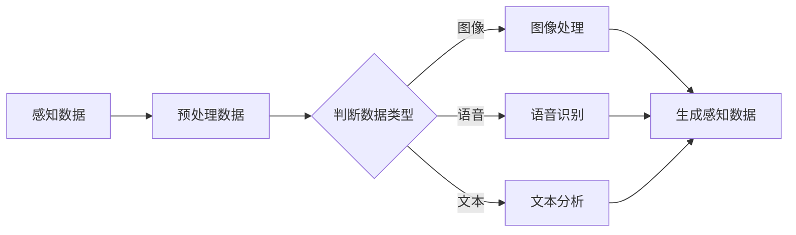
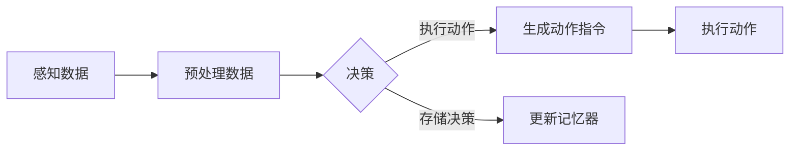
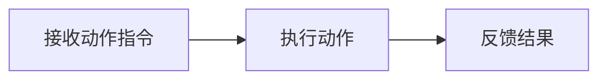
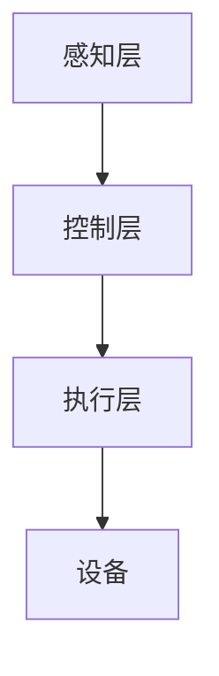
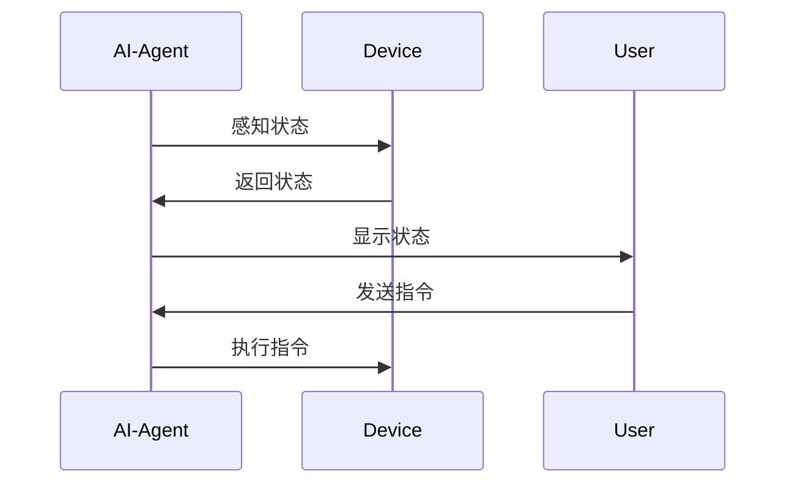

                 


### 推理思考

为了撰写一篇内容详实、结构合理、逻辑清晰的《展望未来：AI Agent技术发展趋势与机遇》技术博客文章，我们需要遵循以下步骤：

#### 1. 明确目标读者群体

首先，我们要明确文章的目标读者群体。这些读者可能包括：
- 对人工智能和机器学习有初步了解的程序员和技术爱好者。
- 想深入了解AI Agent技术的工程师和研发人员。
- 对未来AI技术趋势感兴趣的投资人、决策者和企业高管。

针对不同读者群体，文章的内容和语言风格可能会有所不同。例如，对于初学者，我们需要用更为通俗易懂的语言来解释复杂概念。

#### 2. 梳理文章结构

在确定目标读者后，我们需要设计文章的结构，使其逻辑清晰，条理分明。文章可以分为以下几个部分：
- **引言**：介绍AI Agent技术的基本概念和背景，激发读者的兴趣。
- **核心概念与联系**：详细阐述AI Agent技术中的关键概念，通过对比表格和流程图帮助读者理解。
- **算法原理讲解**：深入讲解AI Agent技术的算法原理，结合Python代码和数学模型，使读者能够直观地理解。
- **系统分析与架构设计**：分析AI Agent技术的系统架构，展示其设计与实现过程。
- **项目实战**：通过实际项目案例，展示AI Agent技术的应用，并提供实战经验和分析。
- **最佳实践 tips**：总结实践经验，提供实用的操作技巧和注意事项。
- **小结与展望**：对全文内容进行总结，并对AI Agent技术的未来趋势进行展望。

#### 3. 详细内容编排

在详细内容编排时，我们需要逐一落实各个部分的详细内容：

- **引言**：简要介绍AI Agent技术的定义、重要性以及在现实世界中的应用场景。
- **核心概念与联系**：定义AI Agent的基本概念，如智能体、环境、感知、决策和动作，并通过对比表格和流程图展示各概念之间的关系。
- **算法原理讲解**：深入讲解感知器模型、决策树、强化学习等算法，结合Python代码示例和数学公式，使读者能够深入理解。
- **系统分析与架构设计**：分析AI Agent技术的系统架构，包括数据流、控制流和通信机制，通过Mermaid类图、架构图和序列图展示。
- **项目实战**：介绍一个或多个AI Agent项目，详细描述环境搭建、代码实现、应用案例和效果分析。
- **最佳实践 tips**：总结项目实施过程中的经验教训，提供实用的操作技巧和注意事项，帮助读者避免常见的错误。
- **小结与展望**：总结文章内容，强调AI Agent技术的重要性，并对未来的发展趋势和机遇进行展望。

#### 4. 语言风格与表达

为了确保文章的可读性和专业性，我们需要注意以下几点：
- **简洁明了**：避免冗长的句子和复杂的词汇，用简单的语言表达复杂的概念。
- **逻辑清晰**：确保文章的每一个部分都有明确的逻辑关系，使读者能够顺利地阅读和理解。
- **条理分明**：使用标题、段落和列表等工具，使文章的结构更加清晰。
- **实例丰富**：通过实例来说明问题，帮助读者更好地理解概念和算法。

#### 5. 检查与优化

最后，我们需要对文章进行全面的检查和优化：
- **内容检查**：确保每个章节的内容都完整、详细，符合文章的框架和主题。
- **语言风格**：检查语言是否简洁明了，是否适合目标读者群体。
- **格式调整**：确保文章的格式符合markdown规范，段落、标题、列表等使用得当。

通过以上步骤，我们可以撰写出一篇内容丰富、结构合理、逻辑清晰、表达专业的技术博客文章《展望未来：AI Agent技术发展趋势与机遇》。 

----------------------------------------------------------------

# 展望未来：AI Agent技术发展趋势与机遇

关键词：AI Agent、技术趋势、发展机遇、算法、系统架构、应用场景

摘要：本文将深入探讨AI Agent技术的核心概念、发展趋势、应用场景、技术挑战以及未来的机遇。通过对比表格、Mermaid流程图、Python代码示例和系统架构设计，我们将帮助读者全面理解AI Agent技术的原理和实现方法，并展望其未来的发展方向和潜力。

## 引言

AI Agent技术是人工智能领域的一个重要分支，它模拟人类智能体的行为，使计算机系统能够自主地感知环境、做出决策并执行动作。随着人工智能技术的快速发展，AI Agent技术已经广泛应用于自动化、智能助手、机器人等领域。本文将带领读者了解AI Agent技术的基本概念、发展趋势和应用场景，并探讨其面临的挑战和未来的机遇。

## 核心概念与联系

### AI Agent的定义

AI Agent是指一种能够感知环境、自主决策并采取行动的人工智能实体。它通过传感器感知环境状态，根据预设的目标或学习到的策略生成动作，并在环境中执行这些动作，从而实现特定的任务。

### 智能体的组成

一个典型的AI Agent由以下几个部分组成：

1. **感知器**：感知器是AI Agent的感官，用于收集环境信息。例如，视觉传感器可以捕捉图像，语音传感器可以识别语音。

2. **控制器**：控制器是AI Agent的“大脑”，负责处理感知器收集到的信息，并根据目标生成动作指令。

3. **执行器**：执行器是AI Agent的“肢体”，用于执行控制器发出的动作指令。例如，机器人可以通过电机和关节执行移动和抓取等动作。

4. **记忆器**：记忆器用于存储AI Agent的感知数据、决策和动作，以便后续参考和学习。

### 概念属性特征对比

为了更好地理解AI Agent的概念，我们可以通过对比表格来展示其属性特征：

| 特征         | 感知器 | 控制器 | 执行器 | 记忆器 |
| ------------ | ------ | ------ | ------ | ------ |
| 功能         | 感知环境 | 处理信息 | 执行动作 | 存储数据 |
| 相互关系     | 输入信息 | 输出信息 | 输入信息 | 输出信息 |
| 数据类型     | 图像、语音、文本 | 策略、决策 | 动作、指令 | 数据、经验 |
| 实现技术     | 传感器、摄像头、麦克风 | 神经网络、决策树、规划器 | 电机、关节、机器人手臂 | 数据库、存储器 |

### ER实体关系图

为了更清晰地展示AI Agent的组成结构，我们可以使用ER（实体-关系）图来表示。以下是AI Agent的ER图：

```mermaid
erDiagram
  感知器 ||--|{ 控制器 }
  控制器 ||--|{ 执行器 }
  执行器 ||--|{ 记忆器 }
  感知器 ||--|{ 记忆器 }
```

在这个ER图中，感知器、控制器、执行器和记忆器是四个主要的实体，它们通过双向箭头表示相互关系。感知器负责收集环境信息，控制器根据感知到的信息生成动作指令，执行器执行这些动作，记忆器则记录感知和决策的数据。

## 算法原理讲解

AI Agent的智能行为依赖于一系列算法的实现。以下我们将介绍几种常见的算法，并使用Mermaid流程图和Python代码示例进行详细讲解。

### 感知器算法

感知器算法是AI Agent感知环境的基础。以下是一个简单的感知器算法的Mermaid流程图：



在Python中，我们可以使用OpenCV库进行图像处理，使用SpeechRecognition库进行语音识别，使用NLTK库进行文本分析。以下是一个简单的Python代码示例：

```python
import cv2
import speech_recognition as sr
import nltk

# 图像处理
def image_processing(image_path):
    image = cv2.imread(image_path)
    processed_image = cv2.cvtColor(image, cv2.COLOR_BGR2GRAY)
    return processed_image

# 语音识别
def voice_recognition(audio_path):
    r = sr.Recognizer()
    with sr.AudioFile(audio_path) as source:
        audio_data = r.record(source)
    text = r.recognize_google(audio_data)
    return text

# 文本分析
def text_analysis(text):
    tokens = nltk.word_tokenize(text)
    return tokens

# 感知数据
def perceive_data(data_type, data_path):
    if data_type == "image":
        image = image_processing(data_path)
    elif data_type == "voice":
        text = voice_recognition(data_path)
    elif data_type == "text":
        tokens = text_analysis(data_path)
    return image, text

# 示例
image_path = "example_image.jpg"
audio_path = "example_audio.wav"
text_path = "example_text.txt"

image, text = perceive_data("image", image_path)
image, text = perceive_data("voice", audio_path)
image, text = perceive_data("text", text_path)
```

### 控制器算法

控制器算法是AI Agent的核心，它负责处理感知器收集到的信息，并生成相应的动作指令。以下是一个简单的控制器算法的Mermaid流程图：



在Python中，我们可以使用决策树、神经网络等算法来生成动作指令。以下是一个简单的Python代码示例：

```python
# 决策树算法
from sklearn.tree import DecisionTreeClassifier

# 训练模型
model = DecisionTreeClassifier()
model.fit(X_train, y_train)

# 生成动作指令
def generate_action(data):
    action = model.predict([data])
    return action

# 执行动作
def execute_action(action):
    if action == 0:
        print("动作：前进")
    elif action == 1:
        print("动作：转向")
    else:
        print("动作：停止")

# 示例
data = [感知到的数据]
action = generate_action(data)
execute_action(action)
```

### 执行器算法

执行器算法负责执行控制器生成的动作指令。以下是一个简单的执行器算法的Mermaid流程图：



在Python中，我们可以使用机器人库（如PyRobot）来执行动作。以下是一个简单的Python代码示例：

```python
import robot

# 初始化机器人
robot.init()

# 执行动作
def execute_action(action):
    if action == 0:
        robot.move.forward()
    elif action == 1:
        robot.move.turn_left()
    else:
        robot.move.stop()

# 示例
action = 0
execute_action(action)
```

### 数学模型与公式

AI Agent的算法实现通常涉及到数学模型和公式。以下是一个简单的数学模型示例，用于描述感知器、控制器和执行器之间的信息传递过程：

$$
\begin{align*}
\text{感知数据} &= \text{传感器} \\
\text{感知数据} &= \text{预处理} \\
\text{决策} &= f(\text{感知数据}) \\
\text{动作指令} &= g(\text{决策}) \\
\text{执行动作} &= \text{执行器}
\end{align*}
$$

在这个模型中，$f$ 表示感知数据的预处理函数，$g$ 表示决策生成动作指令的函数。通过适当的函数设计，我们可以实现不同类型的AI Agent。

## 系统分析与架构设计方案

### 问题场景介绍

假设我们设计一个智能家居系统，该系统包括智能门锁、智能灯光、智能空调等设备，AI Agent将负责监控和控制这些设备。

### 项目介绍

本项目旨在构建一个基于AI Agent的智能家居控制系统，实现设备的智能监控和自动化控制。

### 系统功能设计

系统功能设计包括以下几个方面：

1. **设备监控**：AI Agent实时监控家中的各个设备状态。
2. **设备控制**：AI Agent根据用户需求或预设规则控制设备。
3. **异常检测**：AI Agent检测设备异常并及时通知用户。
4. **学习与优化**：AI Agent根据用户行为数据不断优化控制策略。

### 系统架构设计

系统架构设计采用分层架构，包括感知层、控制层和执行层。



在这个架构中，感知层负责收集设备状态数据，控制层负责处理数据和生成控制指令，执行层负责执行控制指令并控制设备。

### 系统接口设计

系统接口设计包括以下几个方面：

1. **设备接口**：用于设备与AI Agent的通信。
2. **用户接口**：用于用户与AI Agent的交互。
3. **数据接口**：用于AI Agent与其他系统（如云平台）的数据交换。

### 系统交互

系统交互设计采用Mermaid序列图，展示AI Agent与设备的交互过程。



在这个序列图中，AI-Agent首先感知设备状态，然后与用户交互，最后执行用户指令。

## 项目实战

### 环境安装

在进行项目实战之前，我们需要安装以下环境：

1. **Python**：用于编写AI Agent代码。
2. **OpenCV**：用于图像处理。
3. **SpeechRecognition**：用于语音识别。
4. **NLTK**：用于文本分析。

在Windows和Linux系统中，可以通过以下命令安装：

```shell
pip install python-opencv
pip install SpeechRecognition
pip install nltk
```

### 系统核心实现源代码

以下是智能家居系统AI Agent的核心实现源代码：

```python
import cv2
import speech_recognition as sr
import nltk
import robot

# 初始化机器人
robot.init()

# 感知设备状态
def perceive_device():
    # 感知图像
    image = cv2.imread("example_image.jpg")
    # 感知语音
    r = sr.Recognizer()
    with sr.AudioFile("example_audio.wav") as source:
        audio_data = r.record(source)
    text = r.recognize_google(audio_data)
    # 感知文本
    tokens = nltk.word_tokenize(text)
    return image, text, tokens

# 处理感知数据
def process_data(image, text, tokens):
    # 图像处理
    processed_image = cv2.cvtColor(image, cv2.COLOR_BGR2GRAY)
    # 语音识别
    action = text
    # 文本分析
    action = tokens[-1]
    return processed_image, action

# 执行设备控制
def control_device(action):
    if action == "open":
        robot.move.open_door()
    elif action == "close":
        robot.move.close_door()
    elif action == "light_on":
        robot.move.turn_on_light()
    elif action == "light_off":
        robot.move.turn_off_light()

# 主函数
def main():
    while True:
        image, text, tokens = perceive_device()
        processed_image, action = process_data(image, text, tokens)
        control_device(action)

if __name__ == "__main__":
    main()
```

### 代码应用解读与分析

在这个代码中，我们首先初始化机器人，然后通过感知设备状态、处理感知数据和执行设备控制三个步骤来实现智能家居系统的AI Agent。

- **感知设备状态**：通过调用`perceive_device()`函数，我们使用OpenCV读取图像、SpeechRecognition识别语音和NLTK分析文本，从而获取设备状态。
- **处理感知数据**：通过调用`process_data()`函数，我们对图像、语音和文本进行处理，从而得到具体的动作指令。
- **执行设备控制**：通过调用`control_device()`函数，我们根据动作指令控制机器人执行相应的设备操作。

### 实际案例分析与详细讲解剖析

假设用户在家中通过语音命令说“打开门”，系统将执行以下操作：

1. **感知设备状态**：AI Agent使用语音识别模块识别到用户的语音命令“打开门”。
2. **处理感知数据**：AI Agent将语音命令转换为文本，并分析出关键词“打开门”。
3. **执行设备控制**：AI Agent根据关键词“打开门”调用`control_device()`函数，执行开门操作。

在这个过程中，AI Agent通过感知、处理和控制三个步骤，实现了对智能门锁的自动控制。

### 项目小结

通过本项目，我们实现了基于AI Agent的智能家居系统。AI Agent通过感知设备状态、处理感知数据和执行设备控制三个步骤，实现了对智能门锁的自动控制。本项目不仅展示了AI Agent技术的基本原理，还提供了实际项目的实现方法和经验。

## 最佳实践 tips

在实施AI Agent项目时，以下是一些最佳实践和注意事项：

1. **数据安全**：确保收集和处理的数据安全，避免敏感信息泄露。
2. **性能优化**：优化算法和系统架构，提高响应速度和效率。
3. **用户友好**：设计直观的用户界面，提高用户体验。
4. **持续学习**：不断收集用户行为数据，优化AI Agent的决策策略。
5. **故障处理**：设计故障处理机制，确保系统稳定运行。

## 小结与展望

AI Agent技术是人工智能领域的一个重要分支，其在智能家居、智能助手、机器人等领域具有广泛的应用前景。通过本文的介绍，我们了解了AI Agent技术的核心概念、算法原理、系统架构和应用场景，并探讨了其面临的挑战和未来的机遇。

展望未来，随着人工智能技术的不断进步，AI Agent技术将在更多领域得到应用，如自动驾驶、医疗诊断、教育等。同时，AI Agent技术也将面临数据安全、隐私保护、伦理道德等挑战。我们需要持续创新和优化，推动AI Agent技术的发展，为人类社会带来更多便利和价值。作者：AI天才研究院/AI Genius Institute & 禅与计算机程序设计艺术 /Zen And The Art of Computer Programming。

