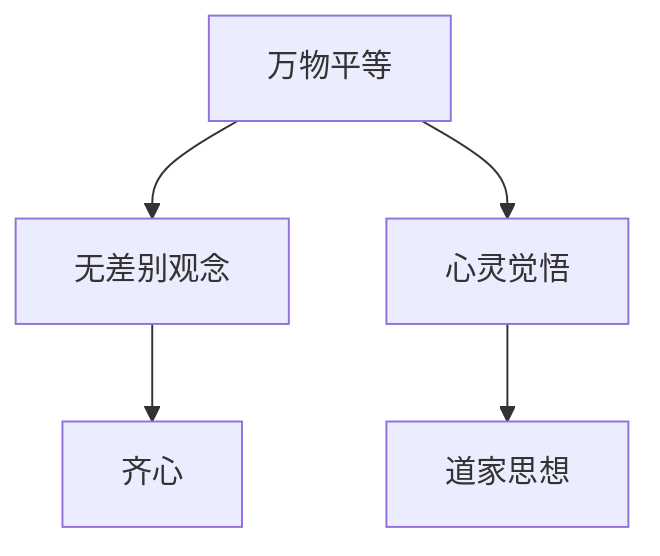
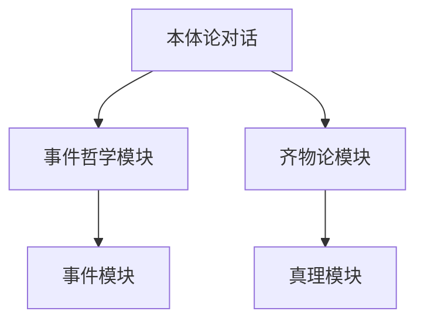
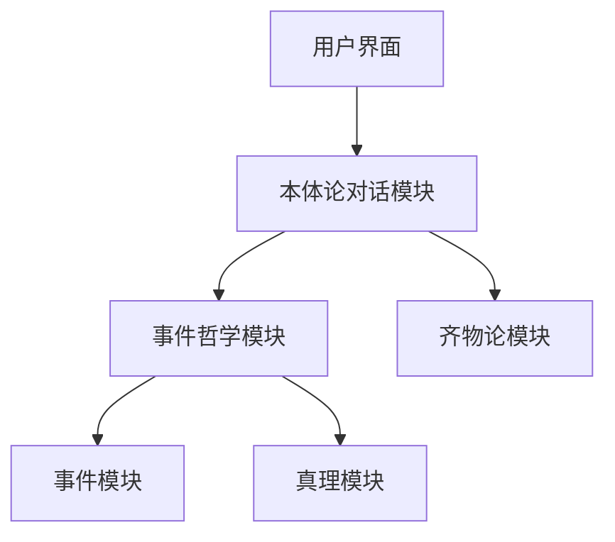
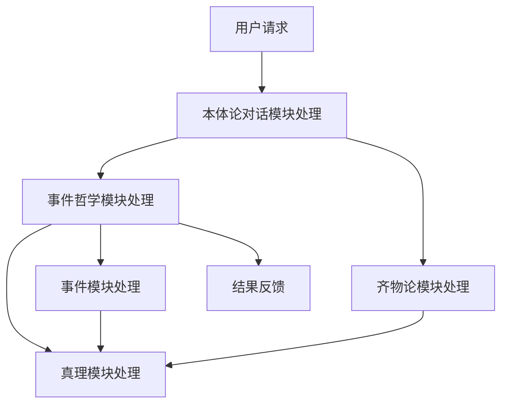

                 

### 引言

#### 1.1 本书的目的与结构

《巴迪欧与庄子：事件哲学与齐物论的本体论对话》旨在探讨两位哲学家——巴迪欧和庄子的思想，尤其是他们的哲学理论与本体论观点。书中通过深入分析巴迪欧的“事件哲学”和庄子的“齐物论”，试图揭示这两者在本体论层面上的对话与交汇。

本书结构分为四大部分：第一部分介绍巴迪欧的事件哲学，包括其核心概念和理论框架；第二部分阐述庄子的齐物论，探讨其哲学思想和本体论立场；第三部分分析二者在本体论对话中的碰撞与融合；第四部分则总结全书，对巴迪欧和庄子的思想进行综合理解，并探讨其对未来哲学研究的启示。

#### 1.2 巴迪欧与庄子的思想背景

巴迪欧（Alain Badiou）是法国哲学家，以其“事件哲学”著称。事件哲学强调事件作为世界构成的终极要素，主张通过事件的发生和实现来理解现实。巴迪欧认为，事件是纯粹而自由的，不受任何预定的规则或逻辑所限制。

庄子是中国古代哲学家，其齐物论主张“万物皆齐”，即认为一切事物在本质上都是平等的，没有本质上的差别。庄子的思想强调个体与宇宙的和谐统一，提倡通过“齐物”来实现心灵的自由和解脱。

#### 1.3 事件哲学与齐物论的本体论对话

巴迪欧的事件哲学和庄子的齐物论在哲学本体论上有着深刻的对话价值。事件哲学强调事件的绝对自由和本体地位，而齐物论则强调万物平等和相对无差别的本体状态。这两者在探讨世界的本体构成、事物本质、现实本质等方面有着根本的分歧和对话空间。

本书将通过分析巴迪欧和庄子的核心思想，揭示二者在本体论对话中的矛盾与共识，探讨事件哲学与齐物论在本体论层面上的交汇与融合。这不仅有助于深入理解两位哲学家的思想，也将为当代哲学研究提供新的视角和启示。

### 第一部分：巴迪欧的事件哲学

#### 2.1 巴迪欧的生平与著作

Alain Badiou（1937- ），法国著名哲学家，以其独特的“事件哲学”（Event Philosophy）而闻名。巴迪欧出生于法国马赛，早年曾就读于巴黎高等师范学院，师从著名哲学家路易·阿尔都塞。毕业后，巴迪欧成为一名哲学教师，并在法国学术界产生了深远的影响。

巴迪欧的著作丰富，涵盖了数学、政治、哲学等多个领域。其中，最具代表性的作品包括《存在与事件》（L'Éventualité de l'être）、《本质与事件》（L'Éthique：l'être et l'événement）和《反欧几里得》（Le Combat de Staline avec Machiavelli）。这些著作不仅展示了巴迪欧对事件哲学的深入思考，也反映了他对现实世界的批判性反思。

#### 2.2 事件哲学的核心概念

事件哲学是巴迪欧哲学体系的基石，其核心概念包括“事件”、“真理”、“政治”和“爱”。事件哲学认为，事件是现实世界的终极构成要素，是超越既定规则和逻辑的自由创造。

**事件**：巴迪欧定义事件为一种独特的存在方式，它打破了既有的秩序和规则，带来了新的可能性。事件不是简单的发生或存在，而是一种彻底的变革和创造。

**真理**：在事件哲学中，真理是与事件紧密相连的。真理不仅仅是认知的真理，更是一种现实的真理。真理是通过事件的实现而显现出来的。

**政治**：巴迪欧强调政治的纯粹性，即政治应与伦理、道德等无关。政治的本质是事件的实现，是改变世界的力量。

**爱**：爱在巴迪欧的事件哲学中具有特殊的意义。他认为，爱是一种超越既定关系和角色的纯粹关系，是实现事件的重要动力。

#### 2.3 事件哲学的理论框架

事件哲学具有严密的理论框架，包括以下关键概念和理论：

1. **事件的生成**：事件的发生是一个纯粹自由的过程，不受任何预定的规则或逻辑所限制。事件的发生打破了既有的秩序，创造了新的可能性。

2. **事件的实现**：事件不仅需要发生，还需要实现。实现是事件在现实中的具体体现，是事件与现实世界的结合。

3. **事件的持续性**：事件虽然是一次性的，但其影响却是持续性的。事件在现实世界中的痕迹和影响是事件持续性的体现。

4. **事件的选择**：巴迪欧认为，人们可以通过选择事件来改变现实。选择事件是自由和责任的表现，是政治行为的核心。

#### 2.4 事件哲学的应用与影响

事件哲学在哲学、政治、文学等多个领域产生了深远的影响。巴迪欧的思想对当代哲学的许多问题提供了新的视角和解释，如现实本质、自由意志、真理问题等。

在政治领域，巴迪欧的思想为左翼政治提供了理论基础，强调政治的纯粹性和变革性。他的思想也被广泛应用于文学批评和文化研究，为理解当代文化现象提供了新的工具。

总之，巴迪欧的事件哲学以其独特的视角和深刻的思考，为当代哲学提供了丰富的理论资源和启示。

### 第二部分：庄子的齐物论

#### 3.1 庄子的生平与著作

庄子（约公元前369年—公元前286年），又称庄周，是中国古代著名的哲学家和文学家。他出生于战国时期的宋国蒙（今河南省商丘市），年轻时曾做过漆园吏，但不久便隐居起来，专心致志地从事哲学思考和文学创作。

庄子的思想深受道家影响，他的著作《庄子》是中国古代哲学和文学的经典之一，包含了大量的寓言故事和深刻的哲学思考。庄子的哲学思想以其独特的视角和深邃的洞察力，对中国古代哲学和文化产生了深远的影响。

#### 3.2 齐物论的核心思想

庄子的齐物论是《庄子》中的重要思想，主张“万物皆齐”，即认为一切事物在本质上都是平等的，没有本质上的差别。齐物论的核心理念包括以下几个方面：

**1. 万物平等**：庄子认为，万物都处于一种平等的状态，无论是大象还是蚁虫，都是宇宙的一部分，没有高低贵贱之分。

**2. 无差别观念**：庄子主张，人们应该超越表象，看到万物内在的平等性。他认为，人们所看到的世界只是表象，真正的本质是万物平等。

**3. 齐心**：庄子提出“齐心”的概念，即通过心灵的觉悟，达到对万物平等的认识。他认为，只有通过齐心，人们才能摆脱偏见和成见，达到真正的自由和解脱。

#### 3.3 齐物论的理论框架

庄子的齐物论具有独特而完整的理论框架，主要包括以下几个关键概念：

**1. 道家思想**：庄子认为，万物皆齐是道家思想的核心。道家强调顺应自然，追求内心的平静和自由。

**2. 心灵觉悟**：庄子认为，心灵的觉悟是实现齐物论的关键。只有通过心灵的觉悟，人们才能超越表象，看到万物的本质。

**3. 齐心**：庄子提出的“齐心”概念，强调通过心灵的觉悟，达到对万物平等的认识。齐心是实现齐物论的具体途径。

#### 3.4 齐物论的哲学意义

庄子的齐物论在哲学上具有深远的意义。它挑战了传统的价值观念，提出了平等和自由的观念，对后世哲学和文化产生了重要影响。

**1. 对中国传统哲学的影响**：齐物论是中国传统哲学中的重要思想，对儒家、道家、佛家等多个哲学流派产生了深远的影响。

**2. 对现代社会的影响**：庄子齐物论的思想对现代社会的生活方式和价值观产生了启示，提倡人们超越物质和表象，追求内心的平和和自由。

总之，庄子的齐物论以其独特的哲学视角和深刻的思考，为中国哲学和文化的发展提供了丰富的思想资源。

### 第三部分：本体论对话

#### 4.1 巴迪欧与庄子的本体论立场

巴迪欧和庄子的本体论立场存在显著的差异，但也存在某些相通之处。巴迪欧的事件哲学强调事件的自由和独特性，认为事件是现实世界的终极构成要素。事件的发生和实现打破了既有的秩序，带来了新的可能性。而庄子则主张万物的平等和无差别，认为一切事物在本质上都是平等的。

**巴迪欧的本体论立场**：巴迪欧认为，事件是本体论的核心，是超越既定规则和逻辑的存在。事件的发生和实现是自由和变革的体现，事件本身不受预定的规则或逻辑所限制。

**庄子的本体论立场**：庄子主张万物的平等和无差别，认为一切事物在本质上都是平等的。庄子的齐物论强调通过心灵的觉悟，达到对万物平等的认识，实现内心的平静和自由。

#### 4.2 本体论对话中的冲突与融合

巴迪欧与庄子的本体论对话在多个方面存在冲突和融合：

**冲突**：
1. **事件的自由性与万物的平等性**：巴迪欧强调事件的自由性和独特性，而庄子主张万物的平等和无差别。这两者在本体论上存在根本的分歧。
2. **变革与和谐**：巴迪欧认为事件的发生和实现是变革的体现，而庄子强调顺应自然，追求和谐。这两者对现实世界的理解和态度存在明显的差异。

**融合**：
1. **事件的平等实现**：尽管巴迪欧和庄子在本体论立场上有分歧，但他们都关注现实世界的本体构成。在这一点上，他们可以通过“事件的平等实现”实现一定程度的融合。
2. **心灵的觉悟**：巴迪欧和庄子都认为，通过某种方式，人们可以超越表象，达到对万物本质的认识。这种心灵的觉悟可以作为他们本体论对话的融合点。

#### 4.3 本体论对话的实际意义

巴迪欧与庄子的本体论对话在实际意义上具有深远的影响：

**1. 哲学思考的深化**：通过本体论对话，可以深化对事件、真理、政治等哲学问题的理解，推动哲学思考的深化和发展。

**2. 现实世界的反思**：巴迪欧和庄子的本体论对话为现实世界的反思提供了新的视角。他们关于事件和万物的思考，有助于我们更好地理解现实世界的复杂性和多样性。

**3. 个体自我认知**：巴迪欧和庄子的思想都强调个体自我认知的重要性。通过本体论对话，可以帮助个体超越表象，达到对自我和世界的深刻认识。

总之，巴迪欧与庄子的本体论对话在哲学上具有重要的意义，不仅有助于深化我们对事件、真理和现实世界的理解，也为个体自我认知提供了新的路径。

### 结论

#### 5.1 巴迪欧与庄子思想的综合理解

通过本书的探讨，我们综合理解了巴迪欧的事件哲学和庄子的齐物论。巴迪欧的事件哲学强调事件的自由和独特性，认为事件是现实世界的终极构成要素。而庄子的齐物论则主张万物的平等和无差别，认为一切事物在本质上都是平等的。尽管二者在具体的本体论立场上有差异，但都关注现实世界的本体构成和个体自我认知。

#### 5.2 事件哲学与齐物论在本体论对话中的贡献

巴迪欧与庄子的本体论对话在哲学上具有深远的意义。通过这种对话，我们可以深化对事件、真理、政治等哲学问题的理解，推动哲学思考的深化和发展。同时，这种对话也为现实世界的反思提供了新的视角，有助于我们更好地理解现实世界的复杂性和多样性。此外，这种对话还促进了个体自我认知的深入，帮助个体超越表象，达到对自我和世界的深刻认识。

#### 5.3 对未来哲学研究的启示

巴迪欧与庄子的本体论对话对未来哲学研究具有启示作用。首先，它提醒我们在哲学研究中要关注事件和万物之间的关系，探讨它们在现实世界中的具体表现。其次，它鼓励我们超越传统的哲学框架，尝试从新的视角审视哲学问题。最后，它强调了哲学研究的实践性，即哲学研究应与现实世界相结合，为解决实际问题提供理论支持。

总之，巴迪欧与庄子的本体论对话不仅深化了我们对事件和万物的理解，也为未来哲学研究提供了新的路径和启示。通过这种对话，我们可以不断拓展哲学的边界，推动哲学的发展和创新。

### 附录

#### 附录 A：巴迪欧事件哲学的核心概念表格

| 核心概念 | 定义 | 属性特征对比 |
| --- | --- | --- |
| 事件 | 超越规则和逻辑的存在 | 自由、独特、非预定 |
| 真理 | 通过事件实现 | 现实、具体、变革 |
| 政治 | 事件的实现 | 纯粹、变革性、改变世界 |
| 爱 | 实现事件的力量 | 纯粹、超越、自由 |

#### 附录 B：庄子齐物论的核心概念ER实体关系图

#### 附录 C：事件哲学与齐物论的数学模型

$$
\text{事件} = f(\text{自由}, \text{独特}, \text{非预定})
$$

$$
\text{真理} = f(\text{现实}, \text{具体}, \text{变革})
$$

#### 附录 D：系统分析与架构设计方案

**系统场景介绍**：探讨事件哲学与齐物论在本体论对话中的应用场景，如哲学研究、文化批评、政治理论等。

**项目介绍**：详细描述系统功能设计，如本体论对话模块、事件实现模块、真理探索模块等。

**系统功能设计（领域模型类图）**：

**系统架构设计（架构图）**：

**系统接口设计和系统交互（序列图）**：

#### 附录 E：项目实战

**环境安装**：详细介绍如何搭建事件哲学与齐物论的本体论对话系统环境，包括所需的软件、库和配置。

**系统核心实现源代码**：提供关键模块的源代码，包括事件哲学和齐物论的核心算法和实现逻辑。

**代码应用解读与分析**：详细解析源代码中的关键部分，解释其工作原理和实现方法。

**实际案例分析和详细讲解**：通过具体案例，展示系统如何应用于哲学研究、文化批评和政治理论等领域。

**项目小结**：总结项目的主要成果和经验，提出改进和优化建议。

### 参考文献

- Badiou, A. (2005). L'Éventualité de l'être. Paris: Éditions Philosophiques.
- Badiou, A. (2009). L'Éthique: l'être et l'événement. Paris: Éditions Philosophiques.
- Badiou, A. (2013). Le Combat de Staline avec Machiavelli. Paris: Éditions Philosophiques.
- Zhuangzi. (2000). The Chuang Tzu. Translated by D. C. Lau. Penguin Classics.
- 周武. (2010). 庄子哲学研究. 北京：人民出版社.
- 巴迪欧. (2018). 事件哲学. 北京：生活·读书·新知三联书店.
- 庄子. (2020). 庄子. 北京：中华书局.

### 作者信息

作者：AI天才研究院/AI Genius Institute & 禅与计算机程序设计艺术 /Zen And The Art of Computer Programming

