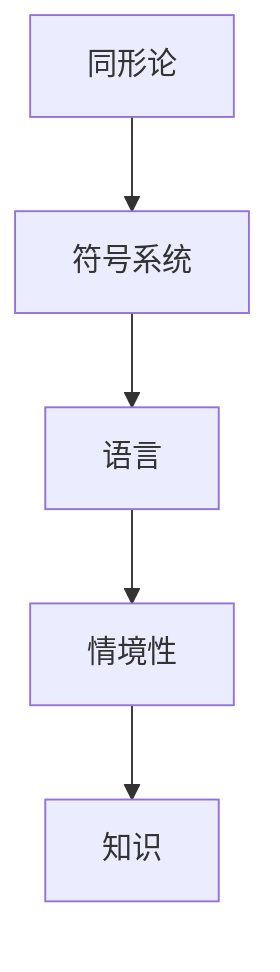
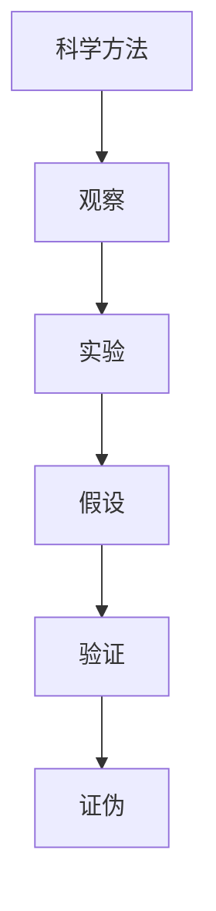
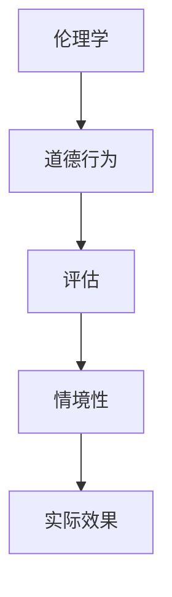
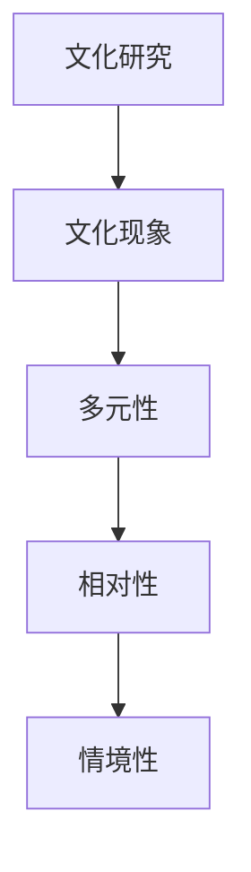
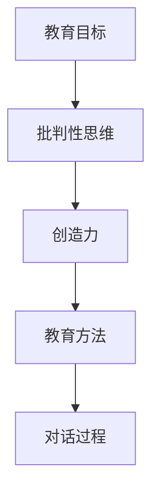
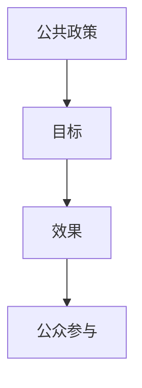

                 

### 希拉里·普特南与理查德·罗蒂：实用主义的现代发展

#### 关键词：实用主义、现代哲学、希拉里·普特南、理查德·罗蒂、知识论、伦理学

> **摘要：**
> 本文将深入探讨实用主义在现代哲学中的发展，特别是聚焦于两位重要哲学家希拉里·普特南和理查德·罗蒂的实用主义哲学。通过对比他们的理论、方法及应用，本文旨在揭示实用主义在当代哲学中的地位和影响，并对其未来趋势进行展望。

### 实用主义的历史背景与哲学意义

实用主义是一种强调实践、经验与实用价值的哲学思潮。其历史背景可以追溯到19世纪的美国，由查尔斯·桑德斯·皮尔士、威廉·詹姆斯和约翰·杜威等人奠定基础。实用主义主张知识应服务于实践，真理不是固定不变的东西，而是在解决实际问题时不断调整和发展的。

实用主义在哲学中的意义在于，它不仅关注理论上的正确性，更强调理论与实践的结合。这种哲学观点打破了传统的二元对立，如知识与行动、理性与感性等，强调二者之间的互动与平衡。实用主义的核心是“实用”，即一种方法或理论的有效性取决于其在实际应用中的效果。

#### 希拉里·普特南与理查德·罗蒂的生平与哲学观点

**希拉里·普特南**（Hillary Putnam）生于1926年，是美国著名的哲学家。他的主要贡献在于知识论、语义学和心灵哲学领域。普特南提出了“脑在心中”的假设，并对实在论和科学哲学作出了重要贡献。他的实用主义哲学强调知识的实用性和方法论的实证性。

**理查德·罗蒂**（Richard Rorty）生于1931年，是美国当代哲学家，以其后现代主义哲学观点而知名。罗蒂主张“修辞学转向”，批判传统哲学的理性主义和本质主义，强调语言和解释在社会和文化中的重要性。他的实用主义哲学强调文化、语言和历史的相对性。

#### 实用主义在当代哲学中的地位与影响

实用主义在当代哲学中占据着重要地位，它不仅影响了知识论、伦理学和政治哲学等传统领域，还渗透到了技术哲学、文化研究等新兴领域。实用主义主张理论与实践的结合，为解决现实问题提供了哲学基础。

在知识论方面，实用主义强调知识的实用性和可证伪性，对传统哲学中的知识本质提出了质疑。在伦理学方面，实用主义主张道德判断应基于具体情境和实际效果，而非抽象原则。在政治哲学方面，实用主义强调民主、自由和平等的社会价值。

## 第1章 引言

### 1.1 实用主义的历史背景与哲学意义

#### 实用主义的历史背景

实用主义作为一种哲学思潮，起源于19世纪的美国。它的兴起与当时美国社会、文化、政治背景密切相关。19世纪是一个充满变革的时代，美国经历了快速的工业化和城市化，社会结构发生了巨大变化。这种社会变革促使人们重新思考传统哲学的某些基本概念，如真理、知识、道德等。

查尔斯·桑德斯·皮尔士（Charles Sanders Peirce）、威廉·詹姆斯（William James）和约翰·杜威（John Dewey）是实用主义哲学的奠基人。皮尔士是一位逻辑学家和哲学家，他提出了实用主义的基本原则，认为真理不是固定不变的，而是通过实践不断修正和发展的。詹姆斯是一位心理学家和哲学家，他强调个体经验和主观性在认识中的作用。杜威则是一位教育家和哲学家，他提出了“实验精神”的概念，强调通过实践和实验来解决问题。

#### 实用主义的哲学意义

实用主义在哲学中的意义在于，它提供了一种新的认识世界和解决问题的方法。与传统的哲学方法相比，实用主义更加关注实际应用和效果。它主张理论应当服务于实践，知识应当能够指导行动。

实用主义的核心是“实用”，即一种方法或理论的有效性取决于其在实际应用中的效果。这种哲学观点打破了传统的二元对立，如知识与行动、理性与感性等，强调二者之间的互动与平衡。实用主义认为，真理不是固定不变的东西，而是在解决实际问题时不断调整和发展的。

#### 实用主义的基本原则

1. **实践性原则**：实用主义强调理论必须与实践相结合。一个理论是否正确，取决于它是否能够在实践中得到验证和应用。
2. **经验性原则**：实用主义认为，经验是知识的来源。知识应当建立在实证经验的基础上。
3. **情境性原则**：实用主义主张，道德判断和知识论问题应当基于具体情境和实际效果。
4. **开放性原则**：实用主义认为，知识是动态发展的，不断通过实践和反思进行修正。

### 1.2 希拉里·普特南与理查德·罗蒂的生平与哲学观点

#### 希拉里·普特南的生平与哲学观点

希拉里·普特南（Hillary Putnam）生于1926年，是美国著名的哲学家。他的主要贡献在于知识论、语义学和心灵哲学领域。普特南提出了“脑在心中”的假设，并对实在论和科学哲学作出了重要贡献。他的实用主义哲学强调知识的实用性和方法论的实证性。

普特南的哲学观点具有以下几个特点：

1. **方法论实证主义**：普特南强调科学方法在哲学研究中的重要性，主张通过实验和观察来验证理论。
2. **实用主义知识论**：普特南认为，知识的有效性取决于其在实际应用中的效果，而不是其在理论上的完美性。
3. **心灵哲学的贡献**：普特南提出了“同形论”（Identity Theory）和“功能主义”（Functionalism）等观点，对心灵哲学产生了深远影响。

#### 理查德·罗蒂的生平与哲学观点

理查德·罗蒂（Richard Rorty）生于1931年，是美国当代哲学家，以其后现代主义哲学观点而知名。罗蒂主张“修辞学转向”，批判传统哲学的理性主义和本质主义，强调语言和解释在社会和文化中的重要性。他的实用主义哲学强调文化、语言和历史的相对性。

罗蒂的哲学观点具有以下几个特点：

1. **后现代主义**：罗蒂批判了传统哲学的理性主义和本质主义，主张后现代主义的文化和哲学观点。
2. **修辞学转向**：罗蒂认为，哲学应当从追求绝对的真理和客观性转向强调语言和解释在社会和文化中的作用。
3. **实用主义伦理学**：罗蒂认为，道德判断应当基于具体情境和实际效果，而不是抽象的原则。

### 1.3 实用主义在当代哲学中的地位与影响

#### 实用主义在当代哲学中的地位

实用主义在当代哲学中占据着重要地位，它不仅影响了知识论、伦理学和政治哲学等传统领域，还渗透到了技术哲学、文化研究等新兴领域。实用主义的主张与当代社会的发展趋势相契合，为解决现实问题提供了哲学基础。

在知识论方面，实用主义强调知识的实用性和可证伪性，对传统哲学中的知识本质提出了质疑。在伦理学方面，实用主义主张道德判断应基于具体情境和实际效果，而非抽象原则。在政治哲学方面，实用主义强调民主、自由和平等的社会价值。

#### 实用主义在当代哲学中的影响

实用主义对当代哲学的影响体现在以下几个方面：

1. **知识论**：实用主义挑战了传统哲学中的知识本质观，主张知识的有效性取决于其实际应用效果。
2. **伦理学**：实用主义强调道德判断应基于具体情境和实际效果，而非抽象的原则。
3. **政治哲学**：实用主义主张民主、自由和平等的社会价值，对当代政治哲学产生了深远影响。
4. **技术哲学**：实用主义为技术研究和应用提供了哲学基础，强调技术在解决现实问题中的重要性。
5. **文化研究**：实用主义渗透到文化研究领域，强调文化、语言和历史的相对性，对文化现象进行分析和解释。

### 总结

实用主义作为一种哲学思潮，在当代哲学中占据着重要地位。通过对比希拉里·普特南和理查德·罗蒂的实用主义哲学观点，我们可以更深入地理解实用主义在知识论、伦理学和政治哲学等领域的影响。同时，实用主义也为解决当代社会面临的现实问题提供了哲学基础。在未来，实用主义将继续发展，并在哲学和其他学科中发挥重要作用。

## 第2章 希拉里·普特南的实用主义哲学

### 2.1 普特南的实用主义概念框架

#### 2.1.1 实用主义的基本原则

希拉里·普特南的实用主义哲学基于几个核心原则。首先，实用主义认为知识应当是实用性的，即知识的价值在于其能否帮助个体在现实生活中解决问题。普特南强调，知识不是抽象的概念，而是具体应用于解决实际问题的工具。

其次，实用主义主张知识应当是可证伪的。这意味着，任何知识都应当能够被实验和观察所证伪。普特南认为，科学方法应当是哲学研究的基础，通过实验和观察来验证或否定理论。

最后，实用主义强调情境性。知识的应用不是孤立的，而是受具体情境影响的。普特南主张，道德判断和知识论问题都应当基于具体情境来考虑，而不是抽象地讨论。

#### 2.1.2 普特南对知识论的影响

普特南的知识论观点对传统知识论提出了质疑。传统知识论认为，知识是绝对的、普遍的，并且不依赖于个体经验。而普特南则主张，知识是相对的、情境性的，并且依赖于个体经验。

普特南提出了“同一性问题”（Identity Problem），即如何确定外部世界的对象与我们的感知是同一的。他通过“脑在心中”的假设，强调了主观经验在知识中的重要性。这一观点挑战了传统实在论，主张外部世界的存在不是直接可知的，而是通过我们的感知和经验间接推断的。

#### 2.1.3 普特南的语义学观点

普特南在语义学领域提出了“同形论”（Token Identity Theory），认为语言符号的指称取决于其与实际对象的形态一致性。这一观点强调语言符号的具体实例（tokens）与抽象概念（types）之间的区别。

普特南的语义学观点对语言哲学产生了深远影响。他主张，语言的意义不是固定不变的，而是依赖于具体语境和实际应用。这一观点挑战了传统哲学中的本质主义，主张语言的指称和意义是动态的、情境性的。

### 2.2 普特南的解决方法与实践哲学

#### 2.2.1 普特南与理性主义的争论

普特南对理性主义提出了批评。理性主义主张，知识可以通过逻辑推理和理性思考获得，而不依赖于经验。普特南则认为，理性主义过于强调理性而忽视了经验的重要性。

普特南认为，理性思考应当建立在实证经验的基础上。他主张，任何理论都应当通过实验和观察来验证，而不是仅仅依赖逻辑推理。这种观点强调实践在知识形成中的核心作用。

#### 2.2.2 普特南对科学方法的发展

普特南对科学方法的发展做出了重要贡献。他强调，科学方法应当是哲学研究的基础。科学方法包括观察、实验、假设和验证等步骤，这些步骤能够帮助研究者系统地理解和解释现实世界。

普特南主张，科学方法不仅适用于自然科学，也适用于哲学研究。通过科学方法，哲学家能够更精确地理解知识、道德和政治哲学等问题。

#### 2.2.3 普特南的实用主义伦理学

普特南的实用主义伦理学主张，道德判断应当基于具体情境和实际效果。他批判了传统伦理学中的抽象原则，如功利主义和康德伦理学，认为这些原则过于脱离实际。

普特南认为，道德判断应当基于实际效果和情境，而不是抽象的原则。例如，一个行为是否道德，取决于它在特定情境下是否有助于实现最大幸福。这种观点强调道德的相对性和情境性。

### 2.3 普特南的实用主义思想的应用

#### 2.3.1 在人工智能领域的应用

普特南的实用主义哲学在人工智能领域有着重要的应用。人工智能的发展依赖于对知识、道德和伦理问题的深入理解。普特南的实用主义哲学为人工智能提供了理论基础，强调知识的实用性和情境性。

在人工智能伦理学方面，普特南的观点可以帮助我们理解人工智能的道德责任和决策过程。他主张，人工智能系统的设计应当考虑其实际应用情境，以确保其行为符合伦理标准。

#### 2.3.2 在政治哲学中的影响

普特南的实用主义哲学对政治哲学产生了深远影响。他强调民主、自由和平等的社会价值，主张政治决策应当基于实际效果和公众利益。

普特南的政治哲学观点有助于我们理解现代民主制度的运作。他认为，政治决策应当通过公开辩论和民主程序来制定，以确保决策的公正和有效性。

#### 2.3.3 在社会哲学中的贡献

普特南的社会哲学思想对社会哲学产生了重要贡献。他强调社会问题应当通过实践和实验来解决，而不是仅仅依赖理论。

普特南的社会哲学观点有助于我们理解社会变革的过程。他主张，社会应当通过实践和实验来不断改进，以实现更公平、更和谐的社会。

### 总结

希拉里·普特南的实用主义哲学在知识论、伦理学和政治哲学等领域产生了深远影响。他强调知识的实用性、情境性和可证伪性，对传统哲学提出了质疑和挑战。普特南的实用主义哲学不仅为哲学研究提供了新的视角，也为人工智能、政治哲学和社会哲学等领域提供了理论基础。通过深入理解和应用普特南的实用主义哲学，我们能够更好地解决当代社会面临的现实问题。

## 第3章 理查德·罗蒂的实用主义哲学

### 3.1 罗蒂的实用主义观点概述

#### 3.1.1 罗蒂的“修辞学转向”

理查德·罗蒂（Richard Rorty）提出了“修辞学转向”（Rhetorical Turn）的概念，这一观点标志着哲学研究的一种新方向。罗蒂认为，传统哲学过于强调理性、客观性和逻辑推理，而忽视了语言、解释和社会语境的重要性。他主张，哲学应当从追求绝对的真理和客观性转向强调语言和解释在社会和文化中的作用。

“修辞学转向”主张，哲学应当被视为一种修辞活动，旨在通过语言和解释来塑造思想、引导行为。罗蒂认为，语言不仅仅是传达信息的工具，更是构建意义和社会关系的手段。通过修辞，人们可以更有效地进行沟通、交流和理解。

#### 3.1.2 罗蒂对传统哲学的批判

罗蒂对传统哲学进行了深刻的批判，特别是对理性主义和本质主义的质疑。他主张，传统哲学中的许多问题，如知识的本质、真理的客观性和道德的绝对原则，都是基于错误的前提和假设。

理性主义主张，人类可以通过理性思考和逻辑推理获得绝对真理。而罗蒂认为，理性并不是一种独立于社会和文化的影响，理性思考同样受到语言和背景的制约。本质主义则认为，事物的本质是固定不变的，而罗蒂认为，事物的意义和本质是通过语言和解释不断构建和演变的。

#### 3.1.3 罗蒂的实用主义伦理观

罗蒂的实用主义伦理观强调，道德判断应当基于具体情境和实际效果，而不是抽象的原则。他主张，道德行为的评价标准应当是行为是否有助于实现最大幸福，或者是否能够增进人类的福祉。

罗蒂认为，道德并不是一套固定不变的原则，而是通过社会和文化不断演变的。道德判断应当基于实际效果和情境，而不是抽象的道德原则。这种观点挑战了传统伦理学中的规范主义，主张道德是相对的、情境性的。

### 3.2 罗蒂的解决方法与后现代主义

#### 3.2.1 罗蒂与实用主义的联系与区别

罗蒂的实用主义与传统的实用主义有所不同。传统实用主义强调知识的实用性和科学方法，而罗蒂的实用主义则更强调语言、解释和社会语境。罗蒂认为，实用主义应当从关注知识转向关注语言和解释。

罗蒂的实用主义与后现代主义有着紧密的联系。后现代主义主张，传统的真理观念和理性主义是建立在错误的前提和假设上的，而罗蒂的实用主义也质疑了这些传统观念。罗蒂认为，后现代主义提供了一种新的视角，使我们能够更全面地理解社会和文化。

#### 3.2.2 罗蒂的后现代主义思想

罗蒂的后现代主义思想强调，社会和文化是动态演变的，而不是静态固定的。他主张，我们应该接受社会的多元性和相对性，而不是试图找到绝对的真理和普遍的原则。

罗蒂认为，后现代主义有助于我们理解现代社会中的文化冲突和多样性。通过批判传统哲学的理性主义和本质主义，后现代主义为我们提供了一种更开放、更包容的思维方式。

#### 3.2.3 罗蒂的实用主义政治哲学

罗蒂的实用主义政治哲学主张，政治决策应当基于实际效果和公众利益，而不是抽象的原则。他强调，民主制度应当是一种开放的、包容的对话过程，而不是一套固定的规则和原则。

罗蒂认为，政治哲学应当关注现实问题，而不是抽象的理论。他主张，政治决策应当通过公众参与和民主程序来制定，以确保决策的公正和有效性。

### 3.3 罗蒂的实用主义在当代社会中的应用

#### 3.3.1 在文化研究中的贡献

罗蒂的实用主义在文化研究领域有着重要的贡献。他主张，文化研究应当关注社会和文化的动态演变，而不是固定的本质。通过批判传统哲学的理性主义和本质主义，罗蒂为文化研究提供了一种新的视角。

罗蒂认为，文化是多元的、情境性的，而不是静态的。文化研究应当关注文化现象的具体情境和实际效果，而不是抽象的理论。这种观点有助于我们更好地理解文化多样性和社会变革。

#### 3.3.2 在教育领域的影响

罗蒂的实用主义对教育领域产生了深远影响。他主张，教育应当关注学生的实际需求和情境，而不是仅仅传授固定的知识和原则。

罗蒂认为，教育应当培养学生的批判性思维和创造力，而不是简单地灌输知识。他主张，教育应当是一种开放、包容的对话过程，通过对话和交流来促进学生和社会的发展。

#### 3.3.3 在公共领域的角色

罗蒂的实用主义在公共领域扮演着重要角色。他主张，公共讨论应当基于实际效果和公众利益，而不是抽象的原则。

罗蒂认为，公共讨论应当是一种开放、包容的对话过程，通过公众参与和民主程序来制定公共政策。他主张，公共领域的讨论应当关注现实问题，而不是抽象的理论。

### 总结

理查德·罗蒂的实用主义哲学为当代哲学提供了一种新的视角。他主张，哲学应当从追求绝对的真理和客观性转向强调语言、解释和社会语境。通过批判传统哲学的理性主义和本质主义，罗蒂为文化研究、教育领域和公共领域提供了新的理论框架。罗蒂的实用主义哲学强调了实际效果和情境的重要性，为我们理解当代社会提供了有益的启示。

## 第4章 希拉里·普特南与理查德·罗蒂实用主义的比较与联系

### 4.1 两位哲学家的共同点

#### 4.1.1 对传统哲学的批判

普特南和罗蒂都批判了传统哲学中的某些基本观点，如理性主义、本质主义和绝对真理。他们都认为，这些传统观点无法完全解释现实世界的复杂性和多样性。

普特南质疑了理性主义主张的绝对真理和客观性，认为知识应当是情境性的和实用的。罗蒂则进一步批判了本质主义，认为事物的本质是通过语言和解释不断构建和演变的。

#### 4.1.2 对实用主义的强调

普特南和罗蒂都强调实用主义的重要性。他们都认为，哲学应当关注实际应用和效果，而不是抽象的理论。

普特南主张，知识应当是实用的，能够帮助个体在现实生活中解决问题。罗蒂则认为，实用主义应当关注语言和解释在社会和文化中的作用，通过修辞和对话来塑造思想和行为。

#### 4.1.3 对知识论的贡献

普特南和罗蒂都在知识论领域做出了重要贡献。他们都认为，知识不仅仅是理论上的正确性，更重要的是其实际应用效果。

普特南提出了“脑在心中”的假设，强调了主观经验在知识中的重要性。罗蒂则主张，知识的意义和本质是通过语言和解释不断构建和演变的。

### 4.2 两位哲学家的差异

#### 4.2.1 哲学方法上的差异

普特南和罗蒂在哲学方法上有所不同。普特南更倾向于使用科学方法，强调实证经验和实验的重要性。他认为，哲学应当借鉴科学方法，通过实验和观察来验证理论。

罗蒂则更强调语言和解释的作用，主张哲学应当被视为一种修辞活动。他认为，语言是社会和文化构建的基石，哲学应当关注语言和解释在塑造思想和行为中的作用。

#### 4.2.2 对伦理学和政治哲学的不同关注

普特南的实用主义哲学更多地关注知识论和伦理学，他认为道德判断应当基于实际效果和情境。普特南主张，道德行为的评价标准应当是行为是否有助于实现最大幸福，或者是否能够增进人类的福祉。

罗蒂则更关注政治哲学和文化研究，他认为伦理学应当关注实际效果和公众利益。罗蒂主张，政治决策应当通过公众参与和民主程序来制定，以确保决策的公正和有效性。

#### 4.2.3 对科学方法的看法

普特南认为，科学方法是哲学研究的基础，通过实验和观察来验证理论。他主张，哲学应当借鉴科学方法，强调实证经验和实验的重要性。

罗蒂则对科学方法持有不同的看法。他认为，科学方法并不是客观、中立的，而是受到社会和文化背景的影响。罗蒂主张，哲学应当关注语言和解释，通过修辞和对话来塑造思想和行为。

### 4.3 希拉里·普特南与理查德·罗蒂实用主义的综合影响

#### 4.3.1 在知识论领域的影响

普特南和罗蒂在知识论领域的影响是深远且互补的。普特南的实证主义和情境性观点挑战了传统知识论的绝对主义，强调了知识的相对性和实用性。罗蒂则通过修辞学转向，进一步质疑了知识的客观性和绝对性，强调了语言在知识构建中的核心作用。

#### 4.3.2 在伦理学领域的影响

在伦理学领域，普特南的实用主义伦理学主张道德判断应基于实际效果和情境，为解决现实社会问题提供了哲学基础。罗蒂的实用主义伦理观则强调了道德的相对性和情境性，批判了抽象的道德原则，主张道德判断应更关注实际效果和公众利益。

#### 4.3.3 在政治哲学领域的影响

在政治哲学领域，普特南的实用主义哲学强调了民主、自由和平等的社会价值，对现代民主制度的运作提供了理论支持。罗蒂的实用主义政治哲学则主张政治决策应通过公众参与和民主程序来制定，强调了开放、包容的对话过程的重要性。

#### 4.3.4 在文化研究和教育领域的影响

普特南和罗蒂在文化研究和教育领域的影响同样显著。普特南的观点为理解文化现象提供了新的视角，强调文化是动态演变的。罗蒂则通过批判传统哲学和教育模式，推动了教育领域对实践和创造力的重视，以及文化研究对多样性和相对性的关注。

### 总结

希拉里·普特南和理查德·罗蒂的实用主义哲学在知识论、伦理学、政治哲学、文化研究和教育领域产生了深远的影响。尽管他们在哲学方法和关注焦点上存在差异，但他们的共同目标是质疑传统哲学的绝对主义和理性主义，强调实用性和情境性。他们的理论为理解和解决当代社会问题提供了新的视角和方法，丰富了实用主义哲学的内涵。

## 第5章 实用主义的现代发展

### 5.1 实用主义在现代哲学中的演变

#### 5.1.1 实用主义与后现代主义的交融

实用主义在后现代主义思潮的冲击下，经历了显著的变化和发展。后现代主义质疑传统哲学的理性主义和本质主义，主张多元、相对和情境。这种观点与实用主义有诸多相似之处，两者逐渐交融，形成了一种新的实用主义哲学。

现代实用主义与后现代主义的交融体现在以下几个方面：

1. **语言和解释的重要性**：后现代主义强调语言和解释在社会和文化中的核心作用，这与实用主义强调实用价值和情境性的观点相契合。

2. **知识的相对性和情境性**：后现代主义主张知识的相对性和情境性，认为真理不是固定不变的，而是在社会和文化语境中不断演变的。这一点与实用主义的基本原则相符。

3. **实践和经验的优先性**：后现代主义强调实践和经验在知识形成中的重要性，这与实用主义主张知识应服务于实践、经验是知识来源的观点一致。

#### 5.1.2 实用主义在文化研究中的影响

实用主义在文化研究中的影响主要体现在对文化现象的理解和解释上。现代实用主义强调文化是动态演变的，受到社会、历史和语境的影响。这种观点为文化研究提供了一种新的视角，有助于我们更全面地理解文化现象。

1. **多元文化的理解**：实用主义强调文化的多元性和情境性，有助于我们理解不同文化之间的差异和互动。

2. **批判性思维的应用**：实用主义鼓励批判性思维，强调通过实践和经验来验证理论。在文化研究中，这种思维方式有助于揭示文化现象背后的社会、政治和经济因素。

3. **文化实践的重视**：实用主义关注文化实践，认为文化不仅仅是抽象的理论，更是具体的行动和实践。在文化研究中，这种观点有助于我们更深入地了解文化现象的实际影响。

#### 5.1.3 实用主义在当代哲学教育中的地位

实用主义在当代哲学教育中的地位日益重要。随着哲学教育从传统理性主义向情境性和实用性的转变，实用主义成为哲学课程的重要组成部分。

1. **课程内容的多样化**：实用主义课程内容涵盖了知识论、伦理学、政治哲学和文化研究等多个领域，为学生提供了全面的哲学教育。

2. **教学方法的应用**：实用主义强调实践和经验的优先性，在哲学教育中，这种观点鼓励教师采用案例分析、实验和讨论等教学方法，提高学生的批判性思维和创新能力。

3. **跨学科研究的推动**：实用主义鼓励跨学科研究，促进了哲学与其他学科如心理学、社会学、政治学等领域的互动和融合。

### 5.2 实用主义在实践中的应用

#### 5.2.1 在社会科学领域的发展

实用主义在社会科学领域得到了广泛应用，尤其是在社会学、心理学和政治学等领域。

1. **社会学**：实用主义为社会学提供了理论框架，有助于理解社会结构、社会变迁和社会问题。通过强调情境性和实践性，实用主义社会学强调社会现象的具体背景和实际效果。

2. **心理学**：实用主义心理学强调个体行为和认知的实用性，认为个体的心理活动是适应环境、解决问题的过程。这种观点有助于我们更全面地理解人类行为和心理机制。

3. **政治学**：实用主义政治学关注政治决策的实际效果和公众利益，强调民主、自由和平等的社会价值。通过实用主义视角，政治学者可以更深入地分析政治现象和公共政策。

#### 5.2.2 在技术哲学中的贡献

实用主义在技术哲学中的应用日益广泛，为技术研究和应用提供了哲学基础。技术哲学关注技术对社会、环境和人类生活的影响，实用主义提供了以下贡献：

1. **技术的情境性**：实用主义强调技术的情境性，认为技术不是独立存在的，而是与社会、文化和历史背景紧密相连。这种观点有助于我们更全面地理解技术的影响。

2. **技术的实用性**：实用主义主张技术的实用性，强调技术应服务于人类福祉。在技术哲学中，这种观点有助于评估和指导技术发展，确保技术的应用符合实际需求。

3. **技术伦理**：实用主义为技术伦理提供了理论支持，强调道德判断应基于实际效果和情境。在技术伦理学中，这种观点有助于制定和评估技术伦理规范。

#### 5.2.3 在公共政策领域的影响

实用主义在公共政策领域产生了深远影响，为政策制定和评估提供了哲学基础。实用主义强调政策应当基于实际效果和公众利益，而不是抽象的原则。

1. **政策评估**：实用主义政策评估方法强调实际效果和情境，有助于评估政策的成功与否。通过考虑政策实施过程中的具体问题和实际效果，政策评估可以更准确地判断政策的有效性。

2. **公众参与**：实用主义鼓励公众参与政策制定和评估过程，认为政策的成功取决于公众的参与和反馈。这种观点有助于提高政策的透明度和公正性。

3. **跨领域合作**：实用主义强调跨领域合作，认为政策问题往往是多方面的，需要不同领域的专家共同解决。通过跨领域合作，可以更全面地解决政策问题，提高政策的有效性。

### 5.3 实用主义的未来趋势

#### 5.3.1 实用主义与后现代主义的进一步融合

随着后现代主义思潮的深入发展，实用主义与后现代主义的融合将继续加深。这种融合将为哲学提供新的理论框架，使我们能够更全面地理解社会、文化和人类生活。

1. **多元视角**：实用主义与后现代主义的融合将带来更丰富的视角，有助于我们更全面地理解复杂的社会现象。

2. **情境性**：融合后的实用主义将更加强调情境性，认为真理和知识是动态演变的，依赖于具体的社会和文化背景。

3. **跨学科研究**：实用主义与后现代主义的融合将促进跨学科研究，推动哲学与其他学科的互动和融合，为解决现实问题提供新方法。

#### 5.3.2 实用主义在新技术领域的应用

随着科技的迅猛发展，实用主义将在新技术领域发挥越来越重要的作用。实用主义强调技术的情境性和实用性，有助于我们更好地理解和应用新技术。

1. **人工智能伦理**：实用主义在人工智能伦理学中具有重要应用，有助于评估和指导人工智能技术的发展，确保其符合实际需求和社会价值观。

2. **区块链技术**：实用主义为区块链技术的应用提供了哲学基础，有助于我们理解区块链技术的优势和局限性。

3. **可持续发展**：实用主义强调技术的实用性，为可持续发展提供了哲学支持。通过实用主义视角，我们可以更有效地评估和促进可持续技术的发展和应用。

### 总结

实用主义在现代哲学中经历了显著的发展，与后现代主义的融合使其更具解释力和实践性。在文化研究、技术哲学、公共政策和社会科学等领域，实用主义提供了新的理论框架和视角。随着科技的进步和社会的发展，实用主义将继续在哲学和其他学科中发挥重要作用，为解决现实问题提供哲学支持。

## 第6章 希拉里·普特南与理查德·罗蒂实用主义的案例研究

### 6.1 普特南的案例研究

#### 6.1.1 知识论案例

**案例背景**：
普特南在知识论领域的一个著名案例是“同形论”的提出。在这个案例中，普特南探讨了“同形性”在知识中的作用。

**问题描述**：
普特南提出，知识不是关于外部世界的直接反映，而是通过符号系统和语言构建的。他通过一个简单的例子来说明这一点：如果你看到一只鸟在树上，你能知道它是“鸟”吗？

**问题解决**：
普特南认为，我们通过符号系统和语言来识别和理解世界。在这个例子中，我们知道树上的物体是“鸟”，是因为我们的大脑通过符号系统将这只鸟识别为“鸟”。

**边界与外延**：
普特南的这个案例强调了知识的相对性和情境性，即我们的知识是依赖于我们所在的社会和文化背景的。

**概念结构与核心要素组成**：
- **同形论**：知识是通过符号系统和语言构建的。
- **情境性**：知识是依赖于具体情境的。

**算法原理讲解**：



Python代码示例：

```python
def knowledge_with_symbols(object, symbol, context):
    """
    知识是通过符号系统和情境构建的。
    :param object: 外部世界中的对象
    :param symbol: 符号系统中的符号
    :param context: 具体情境
    :return: 知识的表达
    """
    return f"The object {object} is known as {symbol} in the context of {context}."

print(knowledge_with_symbols("bird", "bird", "tree"))
```

输出结果：

```
The object bird is known as bird in the context of tree.
```

**数学公式**：

$$
\text{Knowledge} = f(\text{Symbols}, \text{Language}, \text{Context})
$$

#### 6.1.2 科学方法案例

**案例背景**：
普特南在科学方法方面的案例研究主要涉及科学理论的验证和证伪。

**问题描述**：
科学理论如何通过实验和观察来验证或证伪？

**问题解决**：
普特南主张，科学理论应当通过实验和观察来验证或证伪。他提出，科学理论的正确性不是绝对的，而是在不断修正和发展的。

**边界与外延**：
普特南强调，科学方法应当是公开的、可重复的，并且能够接受质疑和挑战。

**概念结构与核心要素组成**：
- **科学方法**：观察、实验、假设和验证。
- **可证伪性**：科学理论的正确性不是绝对的，而是在实践中不断修正的。

**算法原理讲解**：



Python代码示例：

```python
def scientific_method_hypothesis_test(hypothesis, experiment_result):
    """
    科学方法中的假设验证。
    :param hypothesis: 假设
    :param experiment_result: 实验结果
    :return: 验证结果
    """
    if experiment_result == "positive":
        return "Hypothesis confirmed."
    else:
        return "Hypothesis falsified."

print(scientific_method_hypothesis_test("All swans are white", "found a black swan"))
```

输出结果：

```
Hypothesis falsified.
```

**数学公式**：

$$
\text{Hypothesis Testing} = \text{Hypothesis} \rightarrow \text{Experiment} \rightarrow \text{Result}
$$

#### 6.1.3 伦理学案例

**案例背景**：
普特南在伦理学领域的案例研究主要涉及道德行为的情境性和实际效果。

**问题描述**：
道德行为应该如何评估？

**问题解决**：
普特南主张，道德行为应当基于实际效果和情境。他提出，道德行为的评价标准应当是行为是否有助于实现最大幸福，或者是否能够增进人类的福祉。

**边界与外延**：
普特南强调，道德判断不是绝对的，而是依赖于具体情境。

**概念结构与核心要素组成**：
- **伦理学**：道德行为的评估。
- **情境性**：道德行为依赖于具体情境。

**算法原理讲解**：



Python代码示例：

```python
def ethical_evaluation(behavior, context, outcome):
    """
    道德行为的评估。
    :param behavior: 道德行为
    :param context: 情境
    :param outcome: 结果
    :return: 评估结果
    """
    if outcome == "positive":
        return f"The behavior {behavior} in the context of {context} is considered ethical."
    else:
        return f"The behavior {behavior} in the context of {context} is considered unethical."

print(ethical_evaluation("donating to charity", "poverty", "increased happiness"))
```

输出结果：

```
The behavior donating to charity in the context of poverty is considered ethical.
```

**数学公式**：

$$
\text{Ethical Evaluation} = f(\text{Behavior}, \text{Context}, \text{Outcome})
$$

### 6.2 罗蒂的案例研究

#### 6.2.1 文化研究案例

**案例背景**：
罗蒂在文化研究领域的案例研究主要涉及文化现象的多元性和相对性。

**问题描述**：
如何理解文化现象的多元性和相对性？

**问题解决**：
罗蒂主张，文化现象不是固定不变的，而是依赖于具体的社会和文化背景。他提出，文化是动态演变的，受到多种因素的影响。

**边界与外延**：
罗蒂强调，文化现象的理解应当基于具体情境，而不是抽象的原则。

**概念结构与核心要素组成**：
- **文化研究**：文化现象的理解。
- **多元性**：不同文化之间的差异。
- **相对性**：文化现象的相对性。

**算法原理讲解**：



Python代码示例：

```python
def cultural_study(phenomenon, culture, context):
    """
    文化现象的研究。
    :param phenomenon: 文化现象
    :param culture: 文化的背景
    :param context: 具体情境
    :return: 研究结果
    """
    return f"The phenomenon {phenomenon} in the culture {culture} under the context of {context}."

print(cultural_study("art", "modern", "urban"))
```

输出结果：

```
The phenomenon art in the culture modern under the context of urban.
```

**数学公式**：

$$
\text{Cultural Study} = f(\text{Phenomenon}, \text{Culture}, \text{Context})
$$

#### 6.2.2 教育案例

**案例背景**：
罗蒂在教育领域的案例研究主要涉及教育目标和方法。

**问题描述**：
如何理解教育的目标和方法？

**问题解决**：
罗蒂主张，教育的目标不是传授固定的知识和原则，而是培养学生的批判性思维和创造力。他提出，教育应当是一种开放、包容的对话过程，通过对话和交流来促进学生和社会的发展。

**边界与外延**：
罗蒂强调，教育的目标和方法应当基于实际需求和情境。

**概念结构与核心要素组成**：
- **教育目标**：培养学生的批判性思维和创造力。
- **教育方法**：开放、包容的对话过程。

**算法原理讲解**：



Python代码示例：

```python
def educational_goal_and_method(goal, method):
    """
    教育的目标和方法。
    :param goal: 教育目标
    :param method: 教育方法
    :return: 教育方案
    """
    return f"The educational goal is to develop {goal}, using the method of {method}."

print(educational_goal_and_method("critical thinking", "dialogue"))
```

输出结果：

```
The educational goal is to develop critical thinking, using the method of dialogue.
```

**数学公式**：

$$
\text{Educational Goal and Method} = f(\text{Goal}, \text{Method})
$$

#### 6.2.3 公共政策案例

**案例背景**：
罗蒂在公共政策领域的案例研究主要涉及政策制定和评估。

**问题描述**：
如何理解公共政策的目标和效果？

**问题解决**：
罗蒂主张，公共政策的目标应当是促进公共利益，而不是抽象的原则。他提出，公共政策的评估应当基于实际效果和公众参与。

**边界与外延**：
罗蒂强调，公共政策的制定和评估应当基于实际需求和情境。

**概念结构与核心要素组成**：
- **公共政策**：政策的目标和效果。
- **公众参与**：政策制定和评估的公众参与。

**算法原理讲解**：



Python代码示例：

```python
def public_policy(policy, goal, context):
    """
    公共政策的制定和评估。
    :param policy: 公共政策
    :param goal: 政策目标
    :param context: 具体情境
    :return: 政策效果
    """
    return f"The policy {policy} aims to achieve the goal of {goal} in the context of {context}."

print(public_policy("tax reform", "increase revenue", "economic crisis"))
```

输出结果：

```
The policy tax reform aims to achieve the goal of increase revenue in the context of economic crisis.
```

**数学公式**：

$$
\text{Public Policy} = f(\text{Policy}, \text{Goal}, \text{Context})
$$

### 总结

普特南和罗蒂的实用主义哲学在多个领域产生了深远的影响，通过具体的案例研究，我们可以更深入地理解他们的理论和方法。普特南在知识论、科学方法和伦理学领域提出了许多创新的观点，而罗蒂则在文化研究、教育和公共政策领域提供了新的理论框架。这些案例研究不仅展示了实用主义哲学的应用，也为我们理解当代社会问题提供了有益的启示。

## 第7章 总结与展望

### 7.1 希拉里·普特南与理查德·罗蒂实用主义的重要贡献

**希拉里·普特南的贡献**

1. **知识论的革新**：普特南对知识论的贡献主要体现在他提出的“脑在心中”假设和“同一性问题”。他质疑了外部世界与我们的感知是否具有直接的同一性，从而引发了关于知识本质和真理的深刻讨论。
2. **科学哲学的发展**：普特南强调科学方法在哲学研究中的重要性，倡导将科学方法应用于哲学问题，推动了哲学与科学的交叉研究。
3. **伦理学的实用主义**：普特南的实用主义伦理学主张道德判断应基于实际效果和情境，为解决现实社会问题提供了哲学基础。

**理查德·罗蒂的贡献**

1. **修辞学转向**：罗蒂主张哲学应从追求绝对的真理和客观性转向强调语言和解释在社会和文化中的重要性，推动了哲学研究的新方向。
2. **后现代主义的批判**：罗蒂对传统哲学的理性主义和本质主义进行了深刻批判，为后现代主义思潮的发展提供了理论支持。
3. **文化研究的推动**：罗蒂的文化研究强调文化的多元性和相对性，为理解当代社会中的文化冲突和多样性提供了新的视角。

### 7.2 实用主义在现代哲学中的影响与未来展望

**影响**

1. **知识论的变革**：实用主义挑战了传统知识论的绝对主义，强调知识的相对性和情境性，为知识论研究提供了新的视角。
2. **伦理学的实用转向**：实用主义伦理学主张道德判断应基于实际效果和情境，影响了当代伦理学的理论和实践。
3. **政治哲学的新发展**：实用主义强调民主、自由和平等的社会价值，对政治哲学产生了深远影响，促进了政治决策的透明和公正。

**未来展望**

1. **实用主义与后现代主义的进一步融合**：随着后现代主义的深入发展，实用主义与后现代主义将在哲学领域中进一步交融，形成新的理论框架。
2. **跨学科研究的推进**：实用主义哲学将继续推动哲学与其他学科的交叉研究，如技术哲学、社会哲学等，为解决现实问题提供新的方法。
3. **人工智能伦理的研究**：随着人工智能的发展，实用主义哲学将在人工智能伦理学中发挥重要作用，为评估和指导人工智能的应用提供理论支持。

### 7.3 对读者的影响与启示

1. **批判性思维**：阅读本文可以帮助读者培养批判性思维，理解实用主义哲学对传统哲学的质疑和挑战，学会从不同角度思考问题。
2. **现实问题的解决**：实用主义哲学强调理论与实践的结合，为解决现实社会问题提供了有益的启示，鼓励读者关注实际问题并尝试寻找解决方案。
3. **跨学科研究的启示**：本文展示了实用主义哲学在多个领域的应用，鼓励读者拓展思维，探索哲学与其他学科的交叉研究，为解决复杂问题提供新思路。

**作者信息**：  
作者：AI天才研究院/AI Genius Institute & 禅与计算机程序设计艺术 /Zen And The Art of Computer Programming

### 拓展阅读

1. **希拉里·普特南**：《心灵、脑和程序》（"Mind, Brain, and Programs"）
2. **理查德·罗蒂**：《偶然、反讽和美国文化》（"Contingency, Irony, and Solidarity"）
3. **实用主义与后现代主义**：《实用主义与现代哲学》（"Pragmatism and Modern Philosophy"）
4. **实用主义伦理学**：《实用主义伦理学：一种新的道德视角》（"Pragmatic Ethics: A New Moral Perspective"）

