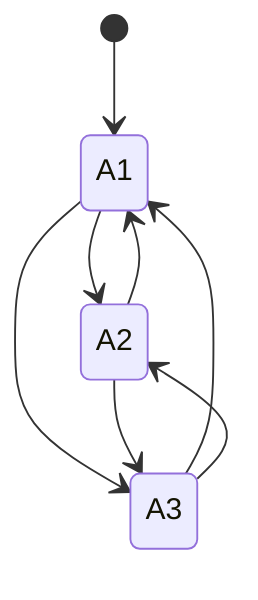

                 

### 幂等性的本质

#### 关键词：幂等性，功能，一致性，系统设计，分布式系统

> 幂等性是系统设计中的一个关键概念，它描述了当一个操作或函数多次执行时，结果与执行一次相同。本文将深入探讨幂等性的本质，分析其在不同场景中的应用，并探讨如何在实践中实现和维护幂等性。

#### 摘要：

本文将首先介绍幂等性的基本概念，然后逐步分析其在系统设计中的重要性。我们将探讨幂等性与一致性的关系，并提供一些实现和维护幂等性的实际策略。此外，还将讨论幂等性在分布式系统中的挑战和解决方案。最后，文章将总结幂等性的关键要点，并提供进一步阅读的建议。

## 引言

幂等性是一个在计算机科学和系统设计中非常重要的概念。它涉及到函数或操作的性质，即多次执行与执行一次的效果相同。这个性质使得系统在设计时能够更加稳健，特别是在分布式系统和高并发的场景中。

### 幂等性的定义

幂等性（Idempotence）是指某个操作（例如函数或方法）多次执行所产生的影响与执行一次所产生的影响相同。换句话说，如果一个函数 \( f \) 满足 \( f(x) = f(f(x)) \)，则该函数是幂等的。

### 幂等性的核心思想

幂等性的核心思想在于确保操作的多次执行不会导致系统状态的不一致。这在对数据或状态的修改操作中尤为重要，例如数据库更新、网络请求等。

### 幂等性与一致性

幂等性是保证系统一致性的重要机制之一。在分布式系统中，一致性通常很难保证，因为网络延迟、故障和并发操作可能导致数据不一致。幂等性通过确保多次操作的效果相同，从而减少了出现不一致的风险。

### 幂等性的重要性

1. **避免重复处理**：幂等性可以避免因为多次执行相同的操作而产生重复的结果，从而提高系统的效率和性能。
2. **提高系统的鲁棒性**：在分布式系统中，幂等性有助于确保系统在面对并发操作和故障时依然能够保持稳定。
3. **简化系统设计**：幂等性使得系统设计更加简单和直观，因为开发者不必担心多次操作导致的副作用。

### 幂等性在不同领域的应用

1. **数据库操作**：例如，数据库中的更新（UPDATE）操作通常是幂等的，因为多次执行相同的更新不会改变最终的结果。
2. **网络通信**：在网络请求中，幂等性可以确保发送相同的请求不会导致服务端产生重复的行为。
3. **分布式系统**：在分布式系统中，幂等性是确保数据一致性的一项关键技术。

### 幂等性与一致性

一致性（Consistency）是指系统在执行多个操作后，最终状态应与预期一致。幂等性是实现一致性的一个重要手段，但并不是唯一手段。

1. **原子性（Atomicity）**：确保一个操作要么全部完成，要么全部不完成。
2. **隔离性（Isolation）**：确保并发操作不会相互干扰。
3. **持久性（Durability）**：一旦操作完成，结果应该持久存在。

### 实现幂等性的策略

1. **使用唯一标识符**：为每个操作或请求分配一个唯一标识符，以确保重复请求可以被识别并避免执行。
2. **使用状态机**：将操作抽象为状态机，确保每个状态只能通过特定的操作进行转换，从而实现幂等性。
3. **幂等锁（Idempotent Lock）**：使用锁机制确保同一操作在一段时间内只能执行一次。

### 总结

幂等性是系统设计中一个关键的概念，它通过确保操作的多次执行效果相同，提高了系统的鲁棒性和一致性。在分布式系统和高并发场景中，幂等性尤为重要。本文介绍了幂等性的基本概念、重要性以及在实现中的策略。通过理解幂等性，开发者可以构建更加稳健和高效的系统。在下一部分，我们将进一步探讨幂等性在不同领域中的应用和挑战。继续阅读，深入了解幂等性的本质。

## 幂等性的核心概念

在深入探讨幂等性的本质之前，我们需要首先了解一些核心概念，这些概念将为我们后续的分析提供基础。

### 幂等函数

幂等函数（Idempotent Function）是指满足 \( f(f(x)) = f(x) \) 的函数。换句话说，如果对一个输入 \( x \) 应用一个幂等函数两次，结果与只应用一次相同。常见的幂等函数包括逻辑AND和逻辑OR运算，以及数学中的绝对值函数等。

### 例子

例如，考虑一个简单的逻辑AND运算符：

$$
f(x, y) = x \land y
$$

对于任意 \( x \) 和 \( y \)，\( f(f(x, y), z) = f(x \land y, z) = (x \land y) \land z = x \land y \land z \)，这与 \( f(x, y \land z) = x \land (y \land z) = x \land y \land z \) 相同，因此 \( f \) 是幂等的。

### 幂等操作的属性

幂等操作具有以下属性：

1. **无副作用**：幂等操作不应该产生副作用，即执行操作前后系统状态应保持一致。
2. **确定的结果**：无论执行多少次，操作的结果都应该是确定的和可预测的。
3. **可取消性**：幂等操作可以安全地重做或撤销，而不影响系统的最终状态。

### 例子：幂等操作

在编程中，某些操作如数据库更新和插入通常是幂等的。例如，在SQL中：

$$
UPDATE table_name SET column1 = value1 WHERE condition;
$$

多次执行相同的更新语句，只要满足相同的条件，不会改变表中数据行的最终状态。

### 幂等性与一致性

幂等性是实现一致性的重要机制之一。在分布式系统中，多个节点可能同时执行相同的操作，幂等性可以确保这些操作不会导致数据不一致。

### 对比：非幂等操作

非幂等操作（Non-idempotent Operation）是指多次执行会产生不同结果的操作。例如，一个网络请求可能会因为网络问题导致失败，再次执行请求可能成功，也可能失败。这样的操作在分布式系统中可能会导致数据不一致。

### 例子：非幂等操作

例如，网络中的文件上传操作可能是非幂等的，因为上传可能因为网络中断而失败，再次上传可能会导致文件内容被覆盖。

### 幂等性与幂等锁

在实现幂等性时，幂等锁是一种常见的技术。它通过确保一个操作在同一时间段内只能被执行一次，从而实现幂等性。

### 总结

通过了解幂等函数和幂等操作的属性，我们可以更好地理解幂等性的本质，并认识到它在系统设计中的重要性。在下一部分，我们将深入探讨幂等性在系统设计中的具体应用。继续阅读，了解更多关于如何在实践中实现和维护幂等性的策略。

## 幂等性在系统设计中的应用

在系统设计中，幂等性是一项关键特性，特别是在分布式系统和高并发环境下。通过确保操作的幂等性，我们可以提高系统的稳定性和一致性，减少错误发生的机会。

### 分布式系统中的挑战

在分布式系统中，多个节点可能同时处理同一个请求，这可能导致以下问题：

1. **数据重复处理**：如果一个操作不是幂等的，多个节点可能会重复执行相同的操作，导致数据不一致。
2. **资源浪费**：重复的操作会浪费系统资源，降低系统性能。
3. **错误状态**：重复的操作可能会使系统处于错误的状态，导致后续操作失败。

### 幂等性在分布式系统中的作用

1. **保证一致性**：通过幂等性，我们可以确保多个节点对同一数据的操作不会导致不一致。例如，分布式数据库中的更新操作通常是幂等的，这样可以保证所有节点看到的数据是一致的。
2. **减少错误**：幂等性可以减少由于并发操作导致的数据错误，提高系统的鲁棒性。
3. **优化性能**：通过避免重复处理，幂等性可以提高系统的响应速度和性能。

### 实现幂等性的策略

#### 唯一标识符

为每个请求或操作分配一个唯一标识符（UUID）是实现幂等性的常见策略。当操作执行时，服务器会检查是否已经处理过具有相同标识符的请求。如果请求已经被处理，则忽略该请求，否则执行操作。

```python
def process_request(request_id):
    if request_id in processed_requests:
        print("Request already processed.")
    else:
        # 执行操作
        process_operation()
        processed_requests.add(request_id)

# 示例
processed_requests = set()
process_request("123e4567-e89b-12d3-a456-426614174000")
process_request("123e4567-e89b-12d3-a456-426614174000")
```

#### 幂等锁

使用锁（Lock）机制可以在同一时间段内确保操作的幂等性。锁可以防止多个请求同时访问共享资源，从而避免重复处理。

```python
import threading

lock = threading.Lock()

def process_request():
    with lock:
        # 执行操作
        process_operation()

# 示例
threading.Thread(target=process_request).start()
threading.Thread(target=process_request).start()
```

#### 状态机

通过状态机（State Machine）来设计操作可以实现幂等性。每个状态只能通过特定的操作进行转换，从而确保操作的幂等性。



#### 乐观锁

乐观锁（Optimistic Locking）通过检查版本号或时间戳来确保操作的幂等性。如果在操作执行期间数据的版本号或时间戳发生变化，则认为操作无效并重新执行。

```python
import time

data = {"version": 1}

def update_data():
    current_version = data["version"]
    new_value = "new_value"
    time.sleep(1)  # 模拟网络延迟
    if data["version"] == current_version:
        data["version"] = current_version + 1
        data["value"] = new_value
    else:
        print("Data has been updated by another process.")

# 示例
update_data()
update_data()
```

### 结论

通过实现幂等性，我们可以提高系统的稳定性、一致性和性能。在分布式系统中，幂等性是一项关键特性，有助于减少数据不一致和错误。本文介绍了几种实现幂等性的策略，包括唯一标识符、幂等锁、状态机和乐观锁。在实际应用中，根据具体需求和场景选择合适的策略可以更好地实现幂等性。

## 幂等性在不同领域的应用

幂等性不仅限于系统设计，它还在许多其他领域发挥着重要作用。以下是一些幂等性在不同领域的应用场景：

### 1. 数据库操作

在数据库中，许多操作如插入（INSERT）、更新（UPDATE）和删除（DELETE）都是幂等的。例如，假设我们在数据库中插入一条记录，即使多次执行相同的插入操作，只要满足相同的条件，数据库中的记录数量和内容都不会发生变化。

### 2. 网络通信

在网络通信中，幂等性确保多次发送相同的请求不会导致服务端执行重复的操作。例如，HTTP协议中的GET请求通常是幂等的，因为无论请求多少次，服务端返回的内容都是相同的。相反，POST请求通常是非幂等的，因为每次请求可能会改变服务端的状态。

### 3. 并发控制

在多线程或分布式系统中，幂等性是保证数据一致性的关键。通过使用锁或原子操作，可以确保同一数据在同一时间段内只能被修改一次，从而避免并发冲突。

### 4. 同步操作

在同步操作中，幂等性可以确保重复执行的操作不会导致错误或数据丢失。例如，在两个系统之间同步数据时，如果同步操作不是幂等的，可能会导致数据重复或丢失。

### 5. 分布式事务

在分布式事务中，幂等性有助于确保事务的原子性和一致性。通过使用两阶段提交（2PC）或其他分布式事务协议，可以确保事务要么全部完成，要么全部回滚，从而避免数据不一致。

### 6. 缓存和CDN

在缓存和内容分发网络（CDN）中，幂等性可以确保多次请求不会导致不必要的缓存更新或资源浪费。例如，如果多个请求同时访问相同的缓存，只有第一个请求会更新缓存，后续请求将直接返回缓存内容。

### 7. 分布式存储系统

在分布式存储系统中，幂等性有助于确保数据的一致性和可靠性。通过使用一致性算法如Paxos或Raft，可以确保多个副本之间的数据一致，即使在节点故障或网络分割的情况下也能保持一致性。

### 8. 微服务架构

在微服务架构中，幂等性是确保服务之间交互一致性的关键。通过使用幂等操作，可以减少服务之间的重复请求和数据不一致。

### 结论

幂等性是一个广泛应用的系统设计原则，它在数据库、网络通信、并发控制、同步操作、分布式事务、缓存和CDN、分布式存储系统和微服务架构等领域都发挥着重要作用。通过确保操作的幂等性，我们可以提高系统的稳定性、一致性和性能，减少错误和资源浪费。

### 总结

本文深入探讨了幂等性的本质、核心概念、系统设计中的应用以及在不同领域的应用。通过理解幂等性的重要性，我们可以构建更加稳健和高效的系统。

#### 关键点总结：

1. **定义**：幂等性是指多次执行操作效果相同。
2. **重要性**：提高系统一致性、鲁棒性和性能。
3. **策略**：唯一标识符、幂等锁、状态机和乐观锁。
4. **应用领域**：数据库、网络通信、并发控制、同步操作、分布式事务、缓存和CDN、分布式存储系统和微服务架构。

#### 最佳实践：

- 为关键操作分配唯一标识符。
- 使用幂等锁确保操作的幂等性。
- 设计基于状态机的系统。
- 在分布式系统中使用乐观锁。

#### 小结

通过理解幂等性的本质和应用，开发者可以构建更加稳定和高效的系统。在实际开发中，遵循最佳实践和设计原则，确保操作具有幂等性，将有助于减少错误和数据不一致的风险。

### 拓展阅读

- 《设计数据密集型应用程序》（Designing Data-Intensive Applications）
- 《分布式系统原理与范型》（Distributed Systems: Principles and Paradigms）
- 《微服务设计》（Designing Microservices）

### 注意事项

- 幂等性不等于一致性，但它是实现一致性的重要机制。
- 在分布式系统中，实现幂等性需要考虑网络延迟和故障。
- 对于非幂等操作，需要采取额外的措施确保系统的一致性。

### 作者信息

**作者：** AI天才研究院/AI Genius Institute & 禅与计算机程序设计艺术 /Zen And The Art of Computer Programming

---

通过本文，我们希望读者对幂等性有了更深入的理解。继续探索和学习，将有助于你在系统设计中更好地应用这一关键原则。

