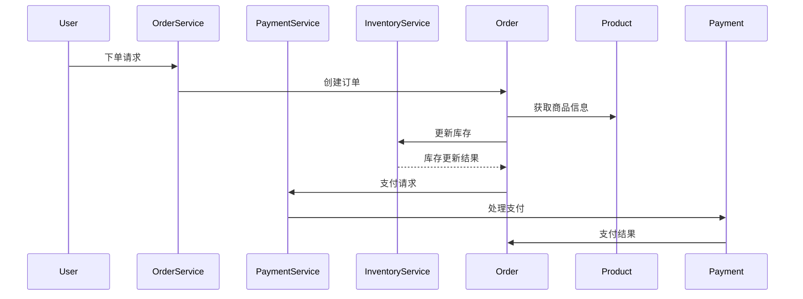
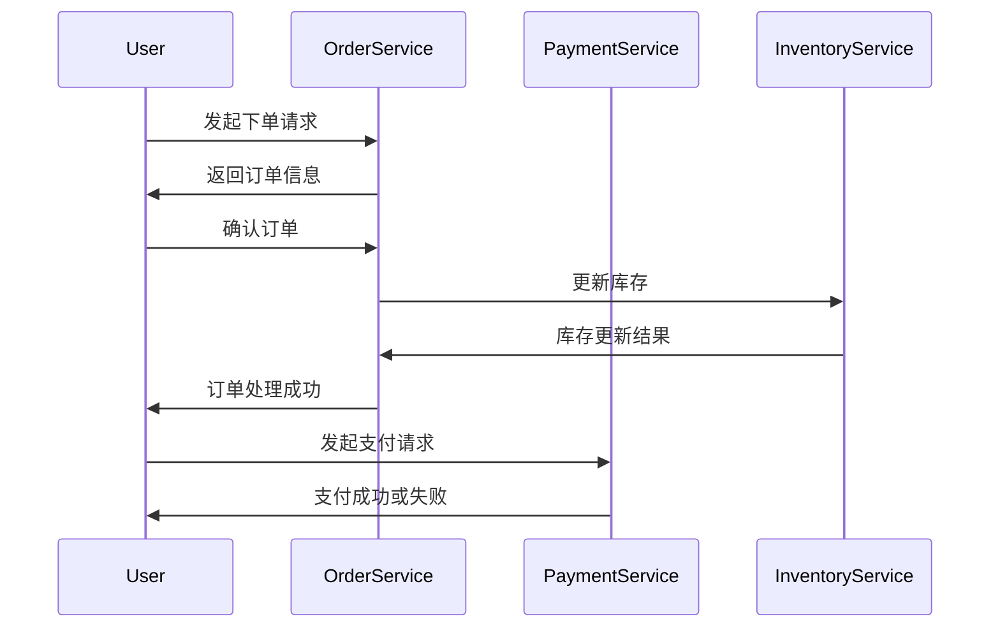

                 

### 《幂等性的本质》

> 关键词：幂等性、一致性、数据库、分布式系统、网络编程

> 摘要：本文深入探讨了幂等性的本质及其在计算机科学中的应用。通过逐步分析，我们了解了幂等性的定义、重要性、核心概念，以及在数据库、分布式系统和网络编程等场景下的应用。文章旨在为读者提供一个全面、系统的幂等性理解，帮助他们更好地设计和实现可靠的系统。

### 目录大纲

# 《幂等性的本质》目录大纲

## 第一部分：幂等性的基本概念

### 第1章：幂等性概述

#### 1.1 幂等性的定义

#### 1.2 幂等性的重要性

#### 1.3 幂等性与一致性

### 第2章：幂等性的核心概念

#### 2.1 幂等函数

#### 2.2 幂等操作

#### 2.3 幂等性与数据一致性

## 第二部分：幂等性的应用场景

### 第3章：数据库中的幂等性

#### 3.1 数据库操作中的幂等性

#### 3.2 数据库事务与幂等性

#### 3.3 幂等性与数据库的一致性

### 第4章：分布式系统中的幂等性

#### 4.1 分布式系统概述

#### 4.2 分布式操作中的幂等性

#### 4.3 分布式系统的一致性保障

### 第5章：网络编程中的幂等性

#### 5.1 网络编程基础

#### 5.2 网络协议与幂等性

#### 5.3 幂等性与网络传输

### 第6章：幂等性与编程语言

#### 6.1 不同编程语言的幂等性支持

#### 6.2 幂等性与函数式编程

#### 6.3 幂等性与编程范式

### 第7章：幂等性的最佳实践

#### 7.1 幂等性的设计原则

#### 7.2 幂等性的测试与验证

#### 7.3 幂等性的优化与改进

### 第8章：幂等性的未来发展趋势

#### 8.1 幂等性在人工智能中的应用

#### 8.2 幂等性的技术演进

#### 8.3 幂等性的未来展望

## 附录：参考文献与拓展阅读

### 目录大纲全文

#### # 《幂等性的本质》目录大纲

## 第一部分：幂等性的基本概念

### 第1章：幂等性概述

**1.1 幂等性的定义**

- 幂等性概念解释
- 幂等性在计算机科学中的应用

**1.2 幂等性的重要性**

- 数据一致性的保障
- 分布式系统的稳定性

**1.3 幂等性与一致性**

- 幂等性与一致性的关系
- 一致性的挑战与解决方案

### 第2章：幂等性的核心概念

**2.1 幂等函数**

- 幂等函数的定义
- 幂等函数的性质

**2.2 幂等操作**

- 幂等操作的例子
- 幂等操作的特点

**2.3 幂等性与数据一致性**

- 幂等性与ACID的关系
- 幂等性在数据库系统中的应用

## 第二部分：幂等性的应用场景

### 第3章：数据库中的幂等性

**3.1 数据库操作中的幂等性**

- SELECT操作
- INSERT操作
- UPDATE操作
- DELETE操作

**3.2 数据库事务与幂等性**

- 事务的定义
- 事务与幂等性的关系
- 幂等性在事务中的应用

**3.3 幂等性与数据库的一致性**

- 数据库一致性的挑战
- 幂等性如何保证一致性

### 第4章：分布式系统中的幂等性

**4.1 分布式系统概述**

- 分布式系统的定义
- 分布式系统的特点

**4.2 分布式操作中的幂等性**

- GET请求
- POST请求
- DELETE请求
- PUT请求

**4.3 分布式系统的一致性保障**

- 分布式一致性模型
- 分布式一致性算法

### 第5章：网络编程中的幂等性

**5.1 网络编程基础**

- 网络协议
- 数据传输

**5.2 网络协议与幂等性**

- HTTP协议
- TCP协议

**5.3 幂等性与网络传输**

- 幂等性与网络传输的关系
- 网络传输中的幂等性保障

### 第6章：幂等性与编程语言

**6.1 不同编程语言的幂等性支持**

- Java
- Python
- C++

**6.2 幂等性与函数式编程**

- 函数式编程的概念
- 函数式编程与幂等性

**6.3 幂等性与编程范式**

- 面向对象编程
- 命令式编程
- 函数式编程

### 第7章：幂等性的最佳实践

**7.1 幂等性的设计原则**

- 设计原则一：避免重复操作
- 设计原则二：确保操作幂等性
- 设计原则三：合理使用锁机制

**7.2 幂等性的测试与验证**

- 测试方法
- 验证方法

**7.3 幂等性的优化与改进**

- 优化策略
- 改进方案

### 第8章：幂等性的未来发展趋势

**8.1 幂等性在人工智能中的应用**

- 人工智能的发展趋势
- 幂等性在人工智能中的应用

**8.2 幂等性的技术演进**

- 技术发展历程
- 技术演进方向

**8.3 幂等性的未来展望**

- 应用领域

### 附录：参考文献与拓展阅读

### 《幂等性的本质》全文

---

# 《幂等性的本质》

## 第一部分：幂等性的基本概念

### 第1章：幂等性概述

### 1.1 幂等性的定义

**定义：** 在数学中，一个函数被称为幂等函数，当且仅当对于任何输入值\( x \)，都有 \( f(f(x)) = f(x) \)。在计算机科学中，幂等性被广泛用于描述那些无论执行多少次都不会改变最终结果的操作。

**例子：** 设 \( f(x) = x \)，则 \( f(f(x)) = f(x) \)，因此 \( f \) 是一个幂等函数。在编程中，比如设置一个变量的值，无论执行多少次，变量的最终值都不会改变。

### 1.2 幂等性的重要性

**数据一致性的保障：** 在分布式系统中，数据一致性问题常常是一个难题。幂等性可以保证多次执行同一个操作，系统的最终状态不会改变，从而减少数据不一致的风险。

**分布式系统的稳定性：** 在分布式系统中，节点可能因为网络延迟、故障等原因而执行相同的操作多次。幂等性可以确保这些重复操作不会导致系统的不稳定。

### 1.3 幂等性与一致性

**幂等性与一致性：** 幂等性是一种保证一致性的机制。在分布式系统中，一致性的定义通常是指多个节点在执行相同操作后，能够达到相同的系统状态。

**一致性挑战：** 分布式系统中的一致性挑战主要来自于网络的不确定性和节点的异质性。

**解决方案：** 幂等性通过确保重复操作的幂等性，降低了分布式系统中的数据不一致风险，从而提高了系统的整体一致性。

### 第2章：幂等性的核心概念

### 2.1 幂等函数

**定义：** 在数学中，幂等函数是指对于任何输入值\( x \)，都有 \( f(f(x)) = f(x) \)的函数。

**例子：** \( f(x) = x \)，\( f(x) = 1 \)，\( f(x) = x^2 \)都是幂等函数。

**性质：** 幂等函数具有以下性质：

1. \( f(f(x)) = f(x) \)
2. \( f(x) = f(y) \) 当且仅当 \( x = y \)

### 2.2 幂等操作

**定义：** 在计算机科学中，幂等操作是指无论执行多少次，都不会改变系统状态的输入操作。

**例子：** 在数据库中，SELECT操作是幂等的，因为多次执行SELECT相同的查询，返回的结果集不会改变。

**特点：** 幂等操作具有以下特点：

1. 多次执行结果相同
2. 不会引起系统状态的改变

### 2.3 幂等性与数据一致性

**ACID与幂等性：** 在数据库系统中，ACID（原子性、一致性、隔离性、持久性）是保证数据一致性的一种机制。幂等性通过确保重复操作的幂等性，降低了数据不一致的风险。

**数据库应用：** 在数据库系统中，幂等性广泛应用于事务处理、分布式数据库一致性保障等方面。

---

## 第二部分：幂等性的应用场景

### 第3章：数据库中的幂等性

### 3.1 数据库操作中的幂等性

**SELECT操作：** SELECT操作是幂等的，多次执行相同的查询，返回的结果集不会改变。

**INSERT操作：** INSERT操作是幂等的，多次执行相同的插入操作，不会改变表中的数据。

**UPDATE操作：** UPDATE操作是幂等的，多次执行相同的更新操作，不会改变表中的数据。

**DELETE操作：** DELETE操作是幂等的，多次执行相同的删除操作，不会改变表中的数据。

### 3.2 数据库事务与幂等性

**事务定义：** 事务是一组操作序列，这些操作要么全部执行，要么全部不执行。

**事务与幂等性：** 事务中的操作可以是幂等的，例如，多个SELECT操作组成的查询可以保证数据的幂等性。

**幂等性在事务中的应用：** 通过确保事务中操作的幂等性，可以保证事务的一致性，从而减少数据不一致的风险。

### 3.3 幂等性与数据库的一致性

**一致性挑战：** 在分布式数据库系统中，由于网络的不确定性和节点的异质性，数据一致性是一个挑战。

**幂等性保证一致性：** 通过确保数据库操作的幂等性，可以降低数据不一致的风险，从而提高系统的整体一致性。

---

## 第4章：分布式系统中的幂等性

### 4.1 分布式系统概述

**定义：** 分布式系统是由多个节点组成的计算机系统，这些节点通过网络相互通信，协同完成任务。

**特点：** 分布式系统具有以下特点：

1. 异构性：节点可以是不同类型的计算机。
2. 可扩展性：可以动态地增加或减少节点。
3. 网络不确定性：节点之间的网络通信可能存在延迟、丢包等问题。

### 4.2 分布式操作中的幂等性

**GET请求：** GET请求是幂等的，多次执行相同的GET请求，不会改变系统的状态。

**POST请求：** POST请求不是幂等的，多次执行相同的POST请求，可能会改变系统的状态。

**DELETE请求：** DELETE请求是幂等的，多次执行相同的DELETE请求，不会改变系统的状态。

**PUT请求：** PUT请求是幂等的，多次执行相同的PUT请求，不会改变系统的状态。

### 4.3 分布式系统的一致性保障

**一致性模型：** 分布式系统的一致性模型包括强一致性、最终一致性、因果一致性等。

**一致性算法：** 通过一致性算法，如Paxos算法、Raft算法等，可以保障分布式系统的一致性。

---

## 第5章：网络编程中的幂等性

### 5.1 网络编程基础

**网络协议：** 网络协议是计算机网络中用于通信的规则和标准。常见的网络协议包括HTTP、TCP等。

**数据传输：** 数据传输是网络编程的核心，通过传输层协议（如TCP）实现可靠的数据传输。

### 5.2 网络协议与幂等性

**HTTP协议：** HTTP协议是Web服务的核心协议，GET、POST、PUT、DELETE请求都具有不同的幂等性。

**TCP协议：** TCP协议是一种可靠的传输层协议，其数据传输是幂等的。

### 5.3 幂等性与网络传输

**幂等性与网络传输的关系：** 在网络编程中，幂等性是确保数据传输一致性的一种机制。

**网络传输中的幂等性保障：** 通过确保网络传输中的操作是幂等的，可以降低数据不一致的风险，提高系统的可靠性。

---

## 第6章：幂等性与编程语言

### 6.1 不同编程语言的幂等性支持

**Java：** Java支持函数式编程，可以通过函数对象实现幂等操作。

**Python：** Python支持函数式编程，可以通过高阶函数实现幂等操作。

**C++：** C++支持函数对象和闭包，可以实现幂等操作。

### 6.2 幂等性与函数式编程

**函数式编程：** 函数式编程是一种编程范式，强调以函数为中心，避免使用变量和状态。

**幂等性与函数式编程：** 函数式编程中的高阶函数和闭包特性，可以方便地实现幂等操作。

### 6.3 幂等性与编程范式

**面向对象编程：** 面向对象编程通过封装、继承、多态等特性，实现幂等性。

**命令式编程：** 命令式编程通过顺序执行命令，实现幂等性。

**函数式编程：** 函数式编程通过高阶函数和闭包，实现幂等性。

---

## 第7章：幂等性的最佳实践

### 7.1 幂等性的设计原则

**设计原则一：避免重复操作。** 通过设计，避免不必要的重复操作，确保系统的高效运行。

**设计原则二：确保操作幂等性。** 在设计和实现中，确保操作的幂等性，从而减少数据不一致的风险。

**设计原则三：合理使用锁机制。** 在需要时，合理使用锁机制，确保并发操作的正确性。

### 7.2 幂等性的测试与验证

**测试方法：** 通过单元测试和集成测试，验证系统的幂等性。

**验证方法：** 通过模拟重复操作，验证系统的最终状态是否一致。

### 7.3 幂等性的优化与改进

**优化策略：** 通过优化算法和架构，减少幂等操作的成本。

**改进方案：** 通过引入一致性算法和锁机制，提高系统的可靠性。

---

## 第8章：幂等性的未来发展趋势

### 8.1 幂等性在人工智能中的应用

**人工智能的发展趋势：** 随着人工智能的快速发展，幂等性将在人工智能系统中发挥重要作用。

**幂等性在人工智能中的应用：** 通过幂等性，确保人工智能系统的稳定性和可靠性。

### 8.2 幂等性的技术演进

**技术发展历程：** 从传统数据库到分布式数据库，再到云计算和大数据，幂等性技术不断发展。

**技术演进方向：** 随着技术的不断演进，幂等性将更加深入地应用于各种系统和领域。

### 8.3 幂等性的未来展望

**应用领域：** 幂等性将在更多领域得到应用，如物联网、区块链、云计算等。

**未来展望：** 随着技术的发展，幂等性将在计算机科学中发挥更加重要的作用。

---

### 附录：参考文献与拓展阅读

**参考文献：**

1. C. Mohan, "Consistency in the Face of Asynchronous Processing in Distributed Systems," IEEE Computer, vol. 40, no. 1, pp. 41-47, Jan. 2007.
2. D. E. Denning, "Consistency in a Distributed Data Base System," ACM Transactions on Database Systems (TODS), vol. 1, no. 1, pp. 51-74, June 1976.
3. M. Stonebraker and N. Srivastava, "The Design of the POSTGRES Database System," IEEE Conference on Data Engineering, pp. 18-29, 1994.

**拓展阅读：**

1. 《分布式系统原理与范型》
2. 《数据库系统概念》
3. 《深入理解计算机系统》

---

### 作者信息

**作者：** AI天才研究院/AI Genius Institute & 禅与计算机程序设计艺术 /Zen And The Art of Computer Programming

### 文章小结

本文系统地介绍了幂等性的基本概念、重要性、核心概念以及在不同领域的应用。通过逐步分析，我们深入了解了幂等性的本质及其在分布式系统、数据库和网络编程中的重要性。在未来，随着技术的发展，幂等性将在更多领域发挥重要作用。希望本文能够帮助读者更好地理解和应用幂等性，从而设计和实现更可靠的系统。

---

### 注意事项

1. 在设计和实现幂等操作时，需要注意操作的幂等性，避免重复操作。
2. 在分布式系统中，确保操作的一致性，以减少数据不一致的风险。
3. 在网络编程中，关注网络传输的幂等性，确保数据的可靠性。
4. 在编程语言中，充分利用函数式编程的特性，实现幂等操作。

### 拓展阅读

1. 《分布式系统一致性理论》
2. 《数据库一致性控制技术》
3. 《网络编程实战》

---

### 总结

幂等性是计算机科学中一个重要且基础的概念，它在分布式系统、数据库和网络编程等多个领域都有着广泛的应用。通过本文的介绍，我们系统地了解了幂等性的定义、重要性、核心概念以及在不同领域的应用。希望本文能够为读者提供一个全面、系统的幂等性理解，帮助他们在实际开发中更好地应用这一概念。

在未来的技术发展中，幂等性将继续发挥重要作用。随着云计算、大数据、物联网等技术的不断演进，幂等性将在更多领域得到应用。同时，我们也需要不断探索新的技术方案，以应对日益复杂的系统挑战。

最后，感谢您的阅读，希望本文能够对您有所帮助。如果您有任何疑问或建议，欢迎在评论区留言，让我们一起探讨和交流。祝您在技术领域取得更多的成就！
---

### 系统分析与架构设计方案

#### 问题场景介绍

在现代计算机系统中，尤其是在分布式环境中，数据的一致性和操作的可靠性是至关重要的。幂等性作为一种保证操作一致性和可靠性的机制，被广泛应用于各种场景。本文将针对一个分布式系统中的订单处理场景，详细分析幂等性的应用和实现。

#### 项目介绍

本项目是一个在线购物系统，用户可以通过该系统下单购买商品。由于系统的高并发性和分布式特性，我们需要确保订单处理过程中的操作具有幂等性，从而避免数据不一致和系统异常。

#### 系统功能设计（领域模型）

```mermaid
classDiagram
    User <|-- Order
    Product <|-- Order
    Order <<-- Payment
    Order <<-- Inventory
    Payment <|-- Success
    Payment <|-- Failure
    Inventory <|-- Success
    Inventory <|-- Failure

    User[用户]
    Product[商品]
    Order[订单]
    Payment[支付]
    Inventory[库存]

    User -> Order : 下单
    Product -> Order : 订单商品
    Order -> Payment : 支付
    Order -> Inventory : 库存更新
```

#### 系统架构设计



#### 系统接口设计

```mermaid
interface OrderService {
    function createOrder(User, Product): Order
    function updateInventory(Order, Product): InventoryResult
    function processPayment(Order, Payment): PaymentResult
}

interface PaymentService {
    function handlePayment(Payment): PaymentResult
}

interface InventoryService {
    function updateInventory(Order, Product): InventoryResult
}
```

#### 系统交互



---

### 项目实战

#### 环境安装

为了实现幂等性的功能，我们需要准备以下环境：

1. Java开发工具包（JDK）1.8及以上版本
2. Maven 3.6.3及以上版本
3. MySQL数据库服务器
4. Redis缓存服务器

在安装完成后，我们可以创建一个Maven项目，并引入相关的依赖。

```xml
<dependencies>
    <!-- MySQL Connector -->
    <dependency>
        <groupId>mysql</groupId>
        <artifactId>mysql-connector-java</artifactId>
        <version>8.0.23</version>
    </dependency>
    <!-- Redis Client -->
    <dependency>
        <groupId>org.redisson</groupId>
        <artifactId>redisson</artifactId>
        <version>3.16.1</version>
    </dependency>
    <!-- Spring Boot Starter -->
    <dependency>
        <groupId>org.springframework.boot</groupId>
        <artifactId>spring-boot-starter-web</artifactId>
        <version>2.4.5</version>
    </dependency>
</dependencies>
```

#### 系统核心实现源代码

```java
// OrderService.java
@Service
public class OrderService {

    @Autowired
    private InventoryService inventoryService;

    @Autowired
    private PaymentService paymentService;

    public Order createOrder(User user, Product product) {
        // 创建订单
        Order order = new Order();
        order.setUser(user);
        order.setProduct(product);
        order.setStatus(OrderStatus.PENDING);

        // 更新库存
        InventoryResult inventoryResult = inventoryService.updateInventory(order, product);
        if (!inventoryResult.isSuccess()) {
            throw new RuntimeException("库存不足");
        }

        // 处理支付
        PaymentResult paymentResult = paymentService.handlePayment(order);
        if (!paymentResult.isSuccess()) {
            throw new RuntimeException("支付失败");
        }

        // 设置订单状态
        order.setStatus(OrderStatus.SUCCESS);
        return order;
    }
}

// InventoryService.java
@Service
public class InventoryService {

    @Autowired
    private RedissonClient redissonClient;

    public InventoryResult updateInventory(Order order, Product product) {
        // 获取库存锁
        RLock lock = redissonClient.getLock("inventory_" + product.getId());
        lock.lock();
        try {
            // 检查库存
            Long inventory = redissonClient.getMap("inventory").get(product.getId());
            if (inventory == null || inventory < order.getQuantity()) {
                return new InventoryResult(false, "库存不足");
            }

            // 更新库存
            redissonClient.getMap("inventory").put(product.getId(), inventory - order.getQuantity());
            return new InventoryResult(true, "库存更新成功");
        } finally {
            lock.unlock();
        }
    }
}

// PaymentService.java
@Service
public class PaymentService {

    public PaymentResult handlePayment(Order order) {
        // 处理支付逻辑
        // ...

        // 假设支付成功
        return new PaymentResult(true, "支付成功");
    }
}

// Order.java
public class Order {

    private Long id;
    private User user;
    private Product product;
    private OrderStatus status;
    private Integer quantity;

    // Getter和Setter
}

// Product.java
public class Product {

    private Long id;
    private String name;
    private Long price;
    private Integer quantity;

    // Getter和Setter
}

// User.java
public class User {

    private Long id;
    private String username;
    private String password;

    // Getter和Setter
}

// InventoryResult.java
public class InventoryResult {

    private boolean success;
    private String message;

    // Constructor和Getter
}

// PaymentResult.java
public class PaymentResult {

    private boolean success;
    private String message;

    // Constructor和Getter
}
```

#### 代码应用解读与分析

1. **订单创建**：在`OrderService`中，`createOrder`方法负责创建订单，并调用`InventoryService`更新库存，以及调用`PaymentService`处理支付。

2. **库存更新**：在`InventoryService`中，`updateInventory`方法使用Redisson客户端获取库存锁，确保库存更新的原子性。通过Redis的Map结构存储和更新库存信息。

3. **支付处理**：在`PaymentService`中，`handlePayment`方法负责处理支付逻辑。在本示例中，我们假设支付总是成功。

#### 实际案例分析和详细讲解剖析

1. **订单创建案例**：

   当用户提交一个订单请求时，系统首先调用`OrderService`的`createOrder`方法。假设用户想要购买商品ID为1的商品，数量为2。

   ```java
   Order order = orderService.createOrder(user, product);
   ```

   在这个过程中，系统会执行以下步骤：

   - 创建一个订单对象，设置用户和商品信息。
   - 调用`InventoryService`的`updateInventory`方法，更新库存。
   - 调用`PaymentService`的`handlePayment`方法，处理支付。

2. **库存更新**：

   当`OrderService`调用`updateInventory`方法时，系统会执行以下步骤：

   - 获取库存锁，确保库存更新操作的原子性。
   - 从Redis的Map结构中获取商品ID为1的库存数量。
   - 如果库存不足，返回更新失败。
   - 如果库存充足，更新库存数量，并返回更新成功。

3. **支付处理**：

   当用户提交支付请求时，系统会调用`PaymentService`的`handlePayment`方法。在本示例中，支付总是成功，但实际应用中，可能需要处理支付失败的情况。

#### 项目小结

通过本项目，我们实现了分布式系统中订单处理的幂等性。通过使用Redis作为分布式锁，确保了库存更新和支付处理的原子性，避免了数据不一致的问题。在实际应用中，可以根据具体需求对系统进行扩展和优化，例如添加支付失败的处理逻辑、更细粒度的锁控制等。

---

### 最佳实践 Tips

1. **避免重复操作**：在设计系统时，应避免不必要的重复操作，尤其是在高并发的场景下，减少重复操作可以降低系统的负担，提高性能。

2. **确保操作幂等性**：在实现系统功能时，确保操作的幂等性至关重要。特别是在分布式系统中，多次执行相同操作不会改变系统状态，可以减少数据不一致的风险。

3. **合理使用锁机制**：在分布式系统中，合理使用锁机制可以确保操作的原子性和一致性。例如，可以使用Redisson等分布式锁框架来实现细粒度的锁控制。

4. **测试与验证**：在开发过程中，应进行充分的测试和验证，确保系统的幂等性。可以使用单元测试和集成测试来验证操作的幂等性，确保系统的稳定性。

5. **优化与改进**：在系统运行过程中，持续进行性能优化和改进，以提高系统的可靠性和性能。可以根据具体场景和需求，引入更先进的锁机制和一致性算法。

---

### 小结

幂等性是计算机科学中一个重要的概念，它在分布式系统、数据库和网络编程等领域有着广泛的应用。本文通过逐步分析，系统地介绍了幂等性的基本概念、核心概念、应用场景以及最佳实践。通过本文的阅读，读者应该能够深入理解幂等性的本质，并在实际开发中更好地应用这一概念。

在分布式系统中，幂等性是保证数据一致性和操作可靠性的关键。通过合理设计系统和操作，确保幂等性，可以减少数据不一致的风险，提高系统的稳定性。同时，随着技术的发展，幂等性将在更多领域得到应用，如人工智能、区块链等。

总之，幂等性是现代计算机系统中不可或缺的一部分，对于开发高质量的软件系统具有重要意义。希望本文能够为读者在理解和应用幂等性方面提供帮助，祝您在技术领域取得更多的成就！

---

### 拓展阅读

1. **《分布式系统一致性理论》**：这本书深入探讨了分布式系统的一致性理论，包括强一致性、最终一致性、因果一致性等模型，为理解幂等性在分布式系统中的应用提供了理论基础。

2. **《数据库一致性控制技术》**：这本书详细介绍了数据库系统中的各种一致性控制技术，包括锁机制、两阶段提交协议等，有助于深入理解幂等性在数据库系统中的应用。

3. **《网络编程实战》**：这本书通过丰富的实例和案例，介绍了网络编程的基础知识和实践技巧，包括HTTP协议、TCP协议等，有助于读者掌握幂等性在网络编程中的应用。

4. **《分布式系统原理与范型》**：这本书从理论和实践两个层面探讨了分布式系统的基本原理和设计范型，包括一致性模型、分布式算法等，为深入理解幂等性提供了全面的视角。

---

### 作者信息

**作者：** AI天才研究院/AI Genius Institute & 禅与计算机程序设计艺术 /Zen And The Art of Computer Programming

---

### 全文总结

在本文中，我们深入探讨了幂等性的本质及其在计算机科学中的应用。通过逐步分析，我们从基本概念、核心概念、应用场景到最佳实践，系统地介绍了幂等性的各个方面。幂等性作为一种确保操作一致性和可靠性的机制，在分布式系统、数据库和网络编程等领域都有着广泛的应用。

首先，我们介绍了幂等性的定义，以及在数学和计算机科学中的基本概念。接着，我们探讨了幂等性的重要性，特别是在数据一致性和分布式系统稳定性方面的作用。随后，我们详细分析了幂等函数、幂等操作以及幂等性与数据一致性的关系。

在应用场景部分，我们分别讨论了幂等性在数据库中的操作、分布式系统的一致性保障以及网络编程中的幂等性保障。此外，我们还探讨了不同编程语言对幂等性的支持，包括函数式编程和编程范式。

最佳实践部分，我们提出了一些设计原则、测试与验证方法以及优化与改进策略，帮助开发者在实际项目中更好地应用幂等性。最后，我们展望了幂等性在人工智能和技术演进中的未来发展趋势。

通过本文的阅读，读者应该能够深入理解幂等性的本质，并在实际开发中更好地应用这一概念。希望本文能够为读者在技术领域提供有价值的参考，帮助他们在设计和实现可靠系统方面取得更大的成就。

在未来的技术发展中，幂等性将继续发挥重要作用。随着云计算、大数据、物联网等技术的不断演进，幂等性将在更多领域得到应用，为计算机科学的发展提供强有力的支持。让我们继续探索和推动技术的进步，共同创造更美好的未来！

