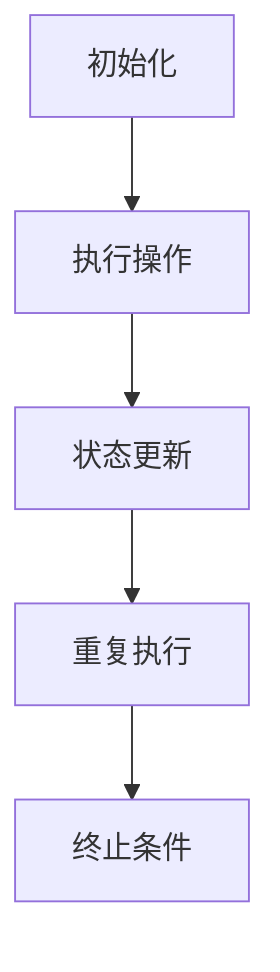
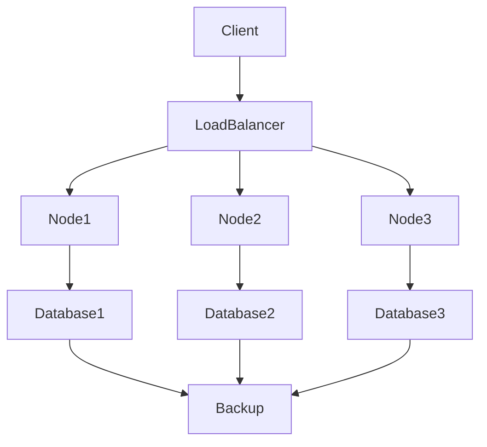
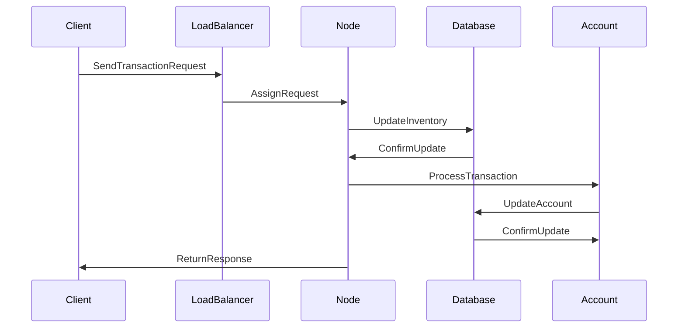

                 

### 文章标题

> 关键词：幂等性、一致性、分布式系统、函数式编程、算法设计

在计算机科学中，幂等性（Idempotence）是一个被广泛应用但常常被误解的概念。它不仅影响软件开发的质量，也决定系统在面临复杂任务时的可靠性。本文旨在深入探讨幂等性的本质，通过逻辑清晰、结构紧凑的分析，帮助读者理解这一关键概念。

**摘要：**
本文首先介绍了幂等性的背景和核心概念，然后通过对比、实例和数学证明，探讨了幂等性的原理和属性。接着，文章将深入幂等性在函数式编程、事务管理和并发控制中的应用，最后通过具体的算法原理讲解和系统架构设计，展示了幂等性在实际项目中的应用。

## 目录大纲：幂等性的本质

1. **问题背景与核心概念**
   - **第1章：问题背景与核心概念**
   - **第2章：幂等性原理与属性**
   - **第3章：幂等性与一致性**
   - **第4章：幂等性与分布式系统**
   - **第5章：幂等性与其他设计模式**

2. **核心概念与联系**
   - **第6章：核心概念与联系**
   - **第7章：幂等函数与幂等操作**
   - **第8章：幂等性与函数式编程**
   - **第9章：幂等性与事务管理**
   - **第10章：幂等性与并发控制**
   - **第11章：幂等性与一致性模型**

3. **算法原理讲解**
   - **第12章：算法原理讲解**
   - **第13章：Python 实现与解释**
   - **第14章：算法示例与解释**

4. **数学模型与公式详解**
   - **第15章：数学模型与公式详解**
   - **第16章：幂等性的数学证明**
   - **第17章：幂等性的公式应用**

5. **系统分析与架构设计**
   - **第18章：系统分析与架构设计**

6. **项目实战与案例分析**
   - **第19章：项目实战与案例分析**

7. **最佳实践与小结**
   - **第20章：最佳实践与小结**
   - **第21章：注意事项与拓展阅读**

### 第一部分：问题背景与核心概念

#### 第1章：问题背景与核心概念

**1.1 问题背景介绍**

幂等性是计算机科学中的一个基本概念，它涉及操作或函数在重复执行时结果不变的特性。这一概念在软件设计和系统架构中至关重要，特别是在处理分布式系统和高并发环境时。

**问题描述**：设想一个银行转账系统，当用户发起转账请求时，系统需要确保资金能够正确地从源账户转移到目标账户。如果转账请求因为网络故障等原因未能成功，系统应当能够重新执行转账操作而不影响最终结果。这里，转账操作需要满足幂等性，即多次执行同一操作应当与执行一次操作的结果相同。

**问题解决**：要解决这个问题，系统可以采用幂等性设计，确保每个转账请求只被处理一次，即使该请求被多次发送。

**边界与外延**：幂等性不仅限于金融系统，它在任何需要保证一致性和可靠性的领域都有应用。例如，在网络通信中，幂等性可以确保消息不会因为重复发送而产生副作用。在分布式系统中，幂等性可以减少冗余操作，提高系统效率。

**概念结构与核心要素组成**：幂等性包括以下几个核心概念和要素：

1. **操作或函数**：执行幂等性的实体。
2. **输入**：操作所需的初始条件。
3. **输出**：操作执行后的结果。
4. **重复执行**：在相同输入条件下多次执行操作。

这些要素相互关联，共同构成幂等性的概念结构。

**1.2 幂等性原理与属性**

**幂等性原理**：幂等性可以用以下数学模型表示：

\[ f(x) = x \]

其中，\( f \) 是幂等函数，\( x \) 是输入值。无论 \( f \) 执行多少次，结果始终为 \( x \)。

**幂等性属性**：

1. **无副作用**：幂等操作不会改变系统状态，每次执行的结果相同。
2. **重复执行不变性**：多次执行幂等操作的结果与执行一次的结果相同。
3. **可组合性**：多个幂等操作可以顺序组合，不会影响最终结果。

**1.3 幂等性与一致性**

**一致性概念**：一致性是指系统状态在操作执行前后的连贯性和正确性。

**幂等性与一致性**：幂等性是确保一致性的关键。在一个分布式系统中，幂等性可以避免因为重复操作导致的错误状态，从而提高系统的整体一致性。

**1.4 幂等性与分布式系统**

**分布式系统背景**：分布式系统由多个独立节点组成，这些节点通过网络通信协同工作。分布式系统面临的主要挑战包括数据一致性和故障恢复。

**幂等性在分布式系统中的作用**：幂等性可以减少分布式系统中的冗余操作，提高系统性能。例如，在分布式数据库中，幂等性操作可以确保数据一致性，防止重复写入。

**1.5 幂等性与其他设计模式**

**设计模式概述**：设计模式是软件工程中用于解决常见问题的可重用解决方案。

**幂等性与其他设计模式的关系**：幂等性可以在许多设计模式中发挥作用，例如，在状态模式、命令模式和中介者模式中，幂等性可以确保操作的重复执行不会产生副作用。

**总结**：通过以上分析，我们可以看出幂等性在计算机科学中的重要性。它不仅确保了系统的一致性和可靠性，还为分布式系统和高并发环境提供了有效的解决方案。在接下来的章节中，我们将进一步探讨幂等性的原理和实际应用。

#### 第2章：幂等性原理与属性

在深入探讨幂等性之前，我们需要明确其定义和核心属性。幂等性是一个广泛用于计算机科学、数学和工程领域的概念，它描述了一种操作或函数在重复执行时结果不变的特性。这一特性在确保系统一致性和可靠性方面至关重要。

**2.1 幂等性原理**

幂等性可以用以下数学模型表示：

\[ f(x) = x \]

其中，\( f \) 是幂等函数，\( x \) 是输入值。无论 \( f \) 执行多少次，结果始终为 \( x \)。这意味着，对任意输入 \( x \)，执行 \( f \) 操作一次和执行多次的结果相同。

**2.2 幂等性属性**

幂等性具有以下几个核心属性：

1. **无副作用**：幂等操作不会改变系统状态，每次执行的结果相同。这意味着幂等操作不会引起系统状态的意外变化。

2. **重复执行不变性**：多次执行幂等操作的结果与执行一次的结果相同。这保证了在分布式系统中，重复执行同一操作不会导致不一致的结果。

3. **可组合性**：多个幂等操作可以顺序组合，不会影响最终结果。这意味着，如果一系列操作都是幂等的，它们的组合也满足幂等性。

**2.3 幂等性与一致性**

一致性是指系统状态在操作执行前后的连贯性和正确性。在分布式系统中，一致性是一个重要的挑战。幂等性通过确保操作的重复执行不会导致不一致的结果，从而有助于解决一致性问题。

**2.4 幂等性在分布式系统中的应用**

在分布式系统中，幂等性有着广泛的应用。以下是几个典型的应用场景：

1. **防止重复操作**：在分布式系统中，节点之间的通信可能不稳定，导致同一操作被多次发送。幂等性可以确保这些重复操作不会产生副作用。

2. **确保数据一致性**：在分布式数据库中，幂等性操作可以确保数据一致性，防止重复写入导致的数据错误。

3. **简化故障恢复**：在分布式系统中，节点可能会发生故障。幂等性可以简化故障恢复过程，因为重复操作不会影响系统状态。

**2.5 幂等性与分布式系统的一致性模型**

分布式系统的一致性模型可以分为几种类型，如强一致性、最终一致性等。幂等性在这些一致性模型中扮演着重要角色。以下是幂等性与几种一致性模型的关系：

1. **强一致性**：在强一致性模型中，所有节点在同一时刻看到相同的数据。幂等性操作可以确保在分布式系统中实现强一致性。

2. **最终一致性**：在最终一致性模型中，系统最终会达到一致状态，但中间可能会存在不一致的情况。幂等性操作可以减少不一致性的发生，提高系统的最终一致性。

**2.6 幂等性与CAP定理**

CAP定理指出，在一个分布式系统中，一致性（Consistency）、可用性（Availability）和分区容错性（Partition tolerance）三者最多只能同时保证两项。幂等性在这些特性之间起到了平衡作用。通过设计幂等操作，系统可以在满足一致性和可用性的同时，实现分区容错性。

**总结**：通过以上分析，我们可以看到幂等性在计算机科学中的核心作用。它不仅确保了系统的一致性和可靠性，还为分布式系统和高并发环境提供了有效的解决方案。在接下来的章节中，我们将继续探讨幂等性在不同领域的具体应用。

#### 第3章：幂等性与一致性

**3.1 一致性概念**

在分布式系统设计中，一致性（Consistency）是一个关键概念。它指的是系统在执行一系列操作后，所有节点能够达到相同的系统状态。一致性可以确保数据的准确性和可靠性，是分布式系统设计的重要目标之一。

**一致性类型**

1. **强一致性（Strong Consistency）**：在强一致性模型中，所有节点在同一时刻看到相同的数据。这意味着在任意时刻，系统的状态是一致的。强一致性提供了最高的数据可靠性，但实现成本较高，可能影响系统的可用性。

2. **最终一致性（Eventual Consistency）**：在最终一致性模型中，系统最终会达到一致状态，但中间可能会存在不一致的情况。最终一致性模型的实现成本较低，适用于对数据一致性要求不是非常严格的场景。

**3.2 幂等性与一致性**

幂等性是确保分布式系统一致性的重要手段。幂等操作具有以下特点：

1. **无副作用**：幂等操作不会改变系统状态，每次执行的结果相同。这保证了在分布式系统中，重复执行同一操作不会导致不一致的结果。

2. **重复执行不变性**：多次执行幂等操作的结果与执行一次的结果相同。这意味着，即使同一操作被多次发送，系统的最终状态也不会受到影响。

3. **可组合性**：多个幂等操作可以顺序组合，不会影响最终结果。这确保了在分布式系统中，一系列幂等操作的组合仍然满足幂等性。

**3.3 幂等性与一致性模型的关系**

1. **强一致性**：在强一致性模型中，幂等性操作可以确保系统在任何时刻都保持一致。例如，在分布式数据库中，使用幂等性操作（如 UPDATE）可以确保所有节点在执行后看到相同的数据。

2. **最终一致性**：在最终一致性模型中，幂等性操作有助于减少不一致性的发生。例如，在分布式缓存系统中，使用幂等性操作（如 SET）可以确保数据最终达到一致性状态。

**3.4 幂等性与一致性保障机制**

为了保障一致性，分布式系统通常采用以下机制：

1. **锁机制**：通过分布式锁（如ZooKeeper）来控制对共享资源的访问，确保操作的顺序一致性。

2. **版本控制**：通过版本号或时间戳来跟踪数据的变更，确保操作的顺序正确。

3. **一致性协议**：如两阶段提交（2PC）、三阶段提交（3PC）等，确保分布式操作的一致性。

**3.5 幂等性在实际应用中的挑战**

尽管幂等性有助于确保分布式系统的可靠性，但在实际应用中仍然面临一些挑战：

1. **网络延迟**：网络延迟可能导致幂等操作被多次发送，从而影响系统的最终状态。

2. **并发控制**：在高并发环境下，需要确保幂等操作的执行顺序，避免并发冲突。

3. **故障恢复**：在系统故障时，需要确保幂等操作可以重新执行，而不会导致数据错误。

**3.6 幂等性与一致性最佳实践**

1. **使用幂等性操作**：在分布式系统中，尽可能使用幂等性操作（如 UPDATE、SET）来保证数据的一致性。

2. **合理设计分布式锁**：在高并发场景下，合理设计分布式锁机制，确保操作的顺序一致性。

3. **采用最终一致性模型**：在数据一致性要求不是非常严格的场景，采用最终一致性模型，降低系统实现的复杂性。

**总结**：幂等性是确保分布式系统一致性的重要手段。通过合理设计和使用幂等性操作，分布式系统可以在高并发和故障环境下保持数据的准确性和可靠性。在接下来的章节中，我们将继续探讨幂等性在分布式系统中的应用和挑战。

#### 第4章：幂等性与分布式系统

**4.1 分布式系统背景**

分布式系统是指由多个独立节点通过网络互联组成的系统，这些节点协同工作以提供高效、可扩展、容错的服务。分布式系统在许多领域（如云计算、大数据处理、物联网等）得到了广泛应用，其核心目标是利用多台计算机的协同处理能力，提高系统的性能和可靠性。

**分布式系统面临的主要挑战**：

1. **数据一致性**：在分布式系统中，数据需要在多个节点之间保持一致。由于网络延迟、节点故障等因素，数据一致性是一个巨大的挑战。

2. **容错性**：分布式系统需要具备良好的容错能力，能够在节点故障时保持服务可用。

3. **性能优化**：分布式系统需要高效地处理大量数据，优化系统性能是一个关键任务。

**4.2 幂等性在分布式系统中的作用**

幂等性在分布式系统中扮演着关键角色，它有助于解决以下问题：

1. **防止重复操作**：在分布式系统中，节点之间的通信可能不稳定，导致同一操作被多次发送。幂等性可以确保这些重复操作不会产生副作用。

2. **确保数据一致性**：在分布式数据库中，幂等性操作（如 UPDATE、DELETE）可以确保数据的一致性，防止重复写入导致的数据错误。

3. **简化故障恢复**：在分布式系统中，节点可能会发生故障。幂等性可以简化故障恢复过程，因为重复操作不会影响系统状态。

**4.3 幂等性操作的设计与实现**

为了实现幂等性，分布式系统通常采用以下策略：

1. **唯一标识符**：为每个操作分配一个唯一的标识符（如操作ID），确保每个操作只被处理一次。

2. **状态标记**：在操作执行前，检查系统当前状态是否已经满足操作条件。如果条件满足，则直接返回结果；否则，执行操作并更新状态。

3. **版本控制**：使用版本号或时间戳来跟踪数据的变更，确保操作的顺序正确。

**4.4 幂等性与分布式一致性协议**

分布式一致性协议（如Paxos、Raft）是实现分布式系统中数据一致性的重要机制。幂等性操作与一致性协议相结合，可以确保系统在面临网络分区、节点故障等挑战时，仍然保持数据一致性。

1. **Paxos协议**：Paxos协议是一种分布式一致性算法，通过选举领导者来协调多个节点的数据一致性。幂等性操作（如提案）在Paxos协议中起着关键作用，确保每个提案只被处理一次。

2. **Raft协议**：Raft协议也是一种分布式一致性算法，通过日志复制来确保数据一致性。幂等性操作（如日志条目）在Raft协议中同样扮演重要角色，确保每个日志条目只被处理一次。

**4.5 幂等性与分布式缓存系统**

在分布式缓存系统中，幂等性操作（如 SET）可以确保数据的一致性。以下是一个简单的分布式缓存系统设计示例：

1. **缓存一致性**：在分布式缓存系统中，多个节点存储相同的缓存数据。通过使用幂等性操作（如 SET），可以确保所有节点在执行后看到相同的数据。

2. **缓存失效**：通过设置缓存数据的有效期，可以避免缓存数据过时。使用幂等性操作（如 INCR），可以确保计数器在多个节点上的一致性。

**4.6 幂等性与分布式存储系统**

在分布式存储系统中，幂等性操作（如 WRITE）可以确保数据的一致性。以下是一个简单的分布式存储系统设计示例：

1. **数据复制**：在分布式存储系统中，数据通常在多个节点上进行复制。通过使用幂等性操作（如 WRITE），可以确保每个数据版本只被写入一次。

2. **数据恢复**：在节点故障时，系统需要从其他节点恢复数据。通过使用幂等性操作（如 RECOVERY），可以确保恢复过程不会影响系统状态。

**4.7 幂等性与分布式计算框架**

在分布式计算框架（如MapReduce、Spark）中，幂等性操作可以优化计算过程。以下是一个简单的分布式计算框架设计示例：

1. **任务调度**：通过使用幂等性操作（如调度请求），可以确保每个计算任务只被调度一次。

2. **结果合并**：通过使用幂等性操作（如结果聚合），可以确保多个计算节点的结果合并后仍然保持一致性。

**总结**：幂等性是分布式系统设计中的重要概念，它有助于确保系统的一致性和可靠性。通过合理设计和实现幂等性操作，分布式系统可以在面临网络延迟、节点故障等挑战时，保持良好的性能和稳定性。在接下来的章节中，我们将进一步探讨幂等性在其他领域（如函数式编程、事务管理）中的应用。

#### 第5章：幂等性与其他设计模式

**5.1 设计模式概述**

设计模式是软件工程中用于解决常见问题的可重用解决方案，它们为软件开发提供了一套通用模板。设计模式分为三种主要类型：创建型、结构型和行为型。

**5.2 幂等性与其他设计模式的关系**

幂等性可以在多种设计模式中发挥作用，从而提高系统的可靠性和一致性。以下是几个典型的设计模式与幂等性的关系：

**1. 状态模式**

状态模式是一种行为型设计模式，它允许对象在其内部状态发生改变时表现出不同的行为。幂等性在状态模式中起着关键作用，确保在对象状态变化时不会产生副作用。

**2. 命令模式**

命令模式是一种行为型设计模式，它将请求封装为一个对象，从而可以灵活地控制请求的执行、记录请求日志、撤销请求等。幂等性操作（如执行命令）可以确保命令对象在重复执行时不会产生意外结果。

**3. 中介者模式**

中介者模式是一种结构型设计模式，它通过一个中介对象来减少对象之间的依赖关系。幂等性操作可以确保中介者在处理请求时不会因为重复发送请求而产生不一致的结果。

**5.3 幂等性与状态模式的结合**

状态模式中，每个状态都代表系统的一个特定状态，每个状态可能有不同的行为。幂等性在这里的作用是确保在系统状态发生变化时，重复执行同一操作不会产生副作用。

**示例**：假设一个交通灯系统，有三种状态：红色、黄色和绿色。每次状态变化都需要确保交通灯正确地显示当前状态，并且重复执行同一操作（如设置交通灯为红色）不会导致交通灯出现错误状态。

**5.4 幂等性与命令模式的结合**

命令模式中，命令对象封装了请求的操作和参数。幂等性操作可以确保在重复执行命令时，系统状态保持一致。

**示例**：假设一个文档编辑系统，用户可以执行多个操作（如插入文本、删除文本等）。通过使用幂等性操作，可以确保在用户重复执行插入文本操作时，文档内容不会发生错误。

**5.5 幂等性与中介者模式的结合**

中介者模式中，中介者对象负责协调多个组件之间的交互。幂等性操作可以确保在处理请求时，重复发送的请求不会导致不一致的结果。

**示例**：假设一个聊天应用，用户可以发送消息。通过使用幂等性操作，可以确保在用户重复发送消息时，消息不会被多次发送，同时确保消息被正确地显示在所有用户的聊天界面上。

**5.6 幂等性在其他设计模式中的应用**

除了上述几种设计模式，幂等性还可以在其他设计模式中发挥作用，如工厂模式、策略模式等。在这些模式中，幂等性操作可以确保在创建对象或执行策略时，重复执行不会导致不一致的结果。

**总结**：幂等性是一种关键的设计概念，可以在多种设计模式中发挥重要作用。通过合理结合幂等性操作，可以确保系统在复杂环境下保持一致性和可靠性。在接下来的章节中，我们将进一步探讨幂等性的核心概念与联系，以及其在事务管理和并发控制中的应用。

#### 第6章：核心概念与联系

在深入探讨幂等性之前，我们需要明确其核心概念和相互之间的联系。幂等性不仅是一个技术概念，也是确保系统可靠性和一致性的关键因素。通过理解这些核心概念及其相互作用，我们可以更好地设计和实现具有高可靠性和一致性的系统。

**6.1 幂等函数与幂等操作**

**幂等函数**：在数学和计算机科学中，幂等函数是指对任何输入值 \( x \)，多次执行函数 \( f \) 后的结果始终相同的函数。用数学表示，即：

\[ f(f(x)) = f(x) \]

例如，函数 \( f(x) = x^2 \) 是一个幂等函数，因为无论 \( x \) 取何值，多次执行 \( f \) 后的结果总是 \( x \) 的平方。

**幂等操作**：在软件工程中，幂等操作是指执行多次后不会改变系统状态的函数或操作。在分布式系统和事务管理中，幂等操作尤为重要，因为它们可以确保在面临网络延迟、节点故障等挑战时，系统仍然保持一致性和可靠性。

**6.2 幂等性与函数式编程**

函数式编程是一种编程范式，它强调使用函数作为主要的构建块，通过不可变数据和纯函数来编写程序。在函数式编程中，幂等性是核心概念之一。

**纯函数**：纯函数是一种没有副作用的函数，其输出仅依赖于输入，不会修改外部状态。幂等性在纯函数中表现得尤为明显，因为纯函数的多次执行结果总是相同的。

**不可变数据**：在函数式编程中，数据是不可变的，这意味着一旦创建，数据就不能被修改。这种不可变性确保了幂等性的实现，因为任何对不可变数据的操作都不会影响其他部分。

**6.3 幂等性与事务管理**

事务管理是确保数据库操作一致性和可靠性的关键机制。在事务管理中，幂等性操作是确保事务原子性和一致性的重要手段。

**事务**：事务是一组操作的序列，这些操作必须全部成功执行，否则整个事务必须回滚到初始状态。幂等性操作可以确保在事务回滚时不会产生不一致的结果。

**原子性**：原子性是指事务的所有操作要么全部成功执行，要么全部回滚。幂等性操作可以实现原子性，因为它们在执行多次时结果相同，不会影响事务的最终结果。

**一致性**：一致性是指事务执行后，系统状态与预期结果一致。幂等性操作有助于确保一致性，因为它们在执行多次时不会改变系统状态。

**6.4 幂等性与并发控制**

在并发控制中，多个操作可能同时访问同一资源，导致数据竞争和状态不一致。幂等性操作是解决并发控制问题的重要工具。

**无锁编程**：无锁编程是一种避免使用锁机制来控制并发访问的编程技术。幂等性操作可以用于实现无锁编程，因为它们在重复执行时不会改变系统状态，从而避免了死锁和数据竞争。

**乐观并发控制**：乐观并发控制假设并发冲突很少发生，允许多个操作同时执行，并在最后阶段通过检查版本号或时间戳来处理冲突。幂等性操作适用于乐观并发控制，因为它们在重复执行时结果相同，可以确保在冲突检测时不会产生不一致的结果。

**6.5 幂等性与一致性模型**

在分布式系统中，一致性模型描述了系统在处理并发操作时如何保持一致状态。幂等性操作在一致性模型中起着关键作用。

**CAP定理**：CAP定理指出，在一个分布式系统中，一致性（Consistency）、可用性（Availability）和分区容错性（Partition tolerance）三者最多只能同时保证两项。幂等性操作可以用于实现一致性，从而在保证可用性和分区容错性的同时，降低一致性带来的性能开销。

**BASE理论**：BASE理论是应对分布式系统中一致性挑战的一种理论，它强调基本可用性（Basic Availability）、软状态（Soft State）和最终一致性（Eventual Consistency）。幂等性操作可以在实现最终一致性时发挥作用，确保系统在面临高并发和分区情况时，仍然保持基本可用性和最终一致性。

**总结**：通过理解幂等函数与幂等操作、幂等性与函数式编程、事务管理、并发控制和一致性模型之间的关系，我们可以更好地设计和实现具有高可靠性和一致性的系统。在接下来的章节中，我们将进一步探讨幂等性的算法原理和数学模型，以及如何在实际项目中应用这些概念。

#### 第7章：幂等函数与幂等操作

**7.1 幂等函数**

幂等函数是数学和计算机科学中的一个重要概念，它描述了一种函数，对于任意输入 \( x \)，多次执行该函数后得到的输出始终相同。用数学语言描述，即：

\[ f(f(x)) = f(x) \]

**7.1.1 特点**

1. **不变性**：幂等函数具有不变性，即无论执行多少次，输出结果相同。
2. **无副作用**：幂等函数在执行过程中不会改变外部状态，只依赖于输入参数。

**7.1.2 例子**

1. **数学函数**：\( f(x) = x^2 \) 是一个典型的幂等函数，因为无论 \( x \) 是多少，\( x^2 \) 的结果都是一样的。
2. **逻辑运算**：逻辑运算中的“与”操作（AND）和“或”操作（OR）也是幂等函数的例子。

**7.2 幂等操作**

在计算机科学中，幂等操作是指执行多次后不会改变系统状态的函数或操作。这与幂等函数的概念类似，但具体应用在软件工程中。

**7.2.1 特点**

1. **不变性**：幂等操作具有不变性，即重复执行同一操作不会改变系统状态。
2. **无副作用**：幂等操作在执行过程中不会对系统产生副作用，如修改全局变量或触发其他操作。

**7.2.2 例子**

1. **数据库操作**：在数据库中，UPDATE 和 DELETE 操作通常是幂等操作，因为重复执行这些操作不会改变表的数据。
2. **文件系统操作**：在文件系统中，创建文件（CREATE）和删除文件（DELETE）操作也是幂等操作，因为重复执行不会改变文件系统的状态。

**7.3 幂等性与函数式编程**

在函数式编程中，函数是程序的主要构建块，而幂等性是函数式编程的一个重要特性。幂等性操作在函数式编程中尤为重要，因为它们保证了程序的可组合性和无副作用。

**7.3.1 函数式编程的特点**

1. **不可变性**：函数式编程中的数据通常是不可变的，这意味着一旦创建，数据就不能被修改。
2. **无状态性**：函数通常是无状态的，即函数的输出仅依赖于输入，不依赖于外部状态。

**7.3.2 幂等性的优势**

1. **可缓存性**：幂等函数可以缓存其结果，因为无论执行多少次，结果都是相同的，这可以显著提高程序的性能。
2. **可并行化**：幂等操作可以在并行计算中安全地执行，因为它们不会因为重复执行而产生副作用。

**7.4 幂等性与事务管理**

在事务管理中，幂等性操作是确保事务原子性和一致性的重要手段。事务是一组操作的序列，这些操作必须全部成功执行，否则整个事务必须回滚。

**7.4.1 事务的特点**

1. **原子性**：事务的所有操作要么全部成功执行，要么全部回滚。
2. **一致性**：事务执行后，系统状态必须与预期结果一致。
3. **隔离性**：事务之间的操作必须相互隔离，避免并发冲突。

**7.4.2 幂等性在事务管理中的应用**

1. **保证原子性**：幂等性操作可以确保事务在执行过程中不会因为重复执行而产生副作用，从而保证事务的原子性。
2. **提高一致性**：幂等性操作可以减少并发操作带来的不一致性，从而提高系统的一致性。

**7.5 幂等性与并发控制**

在并发控制中，多个操作可能同时访问同一资源，导致数据竞争和状态不一致。幂等性操作是解决并发控制问题的重要工具。

**7.5.1 并发控制的特点**

1. **无锁编程**：无锁编程通过避免使用锁机制来控制并发访问，通常使用幂等性操作来实现。
2. **乐观并发控制**：乐观并发控制假设并发冲突很少发生，允许多个操作同时执行，并在最后阶段通过检查版本号或时间戳来处理冲突。

**7.5.2 幂等性在并发控制中的应用**

1. **减少冲突**：幂等性操作在重复执行时不会改变系统状态，从而减少了并发操作之间的冲突。
2. **简化一致性维护**：幂等性操作可以简化一致性维护，因为它们在执行多次时结果相同，不需要额外的同步机制。

**总结**：通过理解幂等函数与幂等操作的概念和特点，我们可以更好地设计和实现具有高可靠性和一致性的系统。在接下来的章节中，我们将进一步探讨幂等性在实际项目中的应用和具体实现。

#### 第8章：幂等性与函数式编程

**8.1 函数式编程背景**

函数式编程（Functional Programming，FP）是一种编程范式，它基于数学函数和 lambda 演算的理论基础。与命令式编程（Imperative Programming）不同，函数式编程强调使用不可变数据和纯函数来构建程序。

**8.1.1 函数式编程的特点**

1. **不可变数据**：在函数式编程中，数据是不可变的，这意味着一旦创建，数据就不能被修改。
2. **纯函数**：纯函数是一种没有副作用的函数，其输出仅依赖于输入，不依赖于外部状态。
3. **高阶函数**：高阶函数是接受函数作为参数或返回函数的函数，这使得函数式编程可以轻松地实现抽象和复用。
4. **递归**：函数式编程鼓励使用递归来处理递归结构，避免使用循环。

**8.2 幂等性在函数式编程中的应用**

幂等性是函数式编程中的一个核心概念，它在确保函数的可组合性和程序的无副作用方面起着重要作用。

**8.2.1 幂等函数**

幂等函数是指对于任意输入，多次执行该函数的结果始终相同的函数。在函数式编程中，幂等函数的典型例子包括逻辑运算符（如 AND 和 OR）和数学运算符（如加法和乘法）。

**8.2.2 幂等操作**

在函数式编程中，幂等操作是指执行多次后不会改变系统状态的函数或操作。例如，在 Scala 中，`Option` 类型和 `Future` 类型都支持幂等操作。

**8.3 幂等性在函数式编程中的优势**

1. **可缓存性**：由于幂等函数的多次执行结果相同，可以缓存其结果，从而提高程序的性能。
2. **无副作用**：幂等操作不会修改外部状态，使得程序更易于理解和维护。
3. **可并行化**：幂等函数可以在并行计算中安全地执行，因为它们不会因为重复执行而产生副作用。

**8.4 幂等性与函数式编程的最佳实践**

1. **使用纯函数**：在函数式编程中，尽量使用纯函数，避免副作用。
2. **利用幂等性操作**：在处理并发操作时，利用幂等性操作（如 `Option` 的 `map` 和 `flatMap` 方法）来简化代码。
3. **避免不必要的重复计算**：利用函数的高阶性质，将幂等函数作为参数传递，避免不必要的重复计算。

**8.5 示例：使用 Scala 实现幂等函数**

```scala
// 定义一个幂等函数
def repeat(n: Int)(f: Int => Int): Int = {
  f(n)
}

// 示例函数
def add(x: Int, y: Int): Int = x + y

// 调用幂等函数
val result = repeat(5)(add(2, _))
// 输出：7
```

在这个示例中，`repeat` 函数是一个幂等函数，它接受一个整数 `n` 和一个函数 `f`，并返回 `f` 对 `n` 次执行的结果。`add` 函数是一个典型的幂等函数，因为无论执行多少次，其结果都是相同的。

**8.6 示例：使用 Kotlin 实现幂等操作**

```kotlin
// 定义一个幂等操作
fun <T> List<T>.reduceIfPresent(initial: T, operation: (T, T) -> T): T {
    var result = initial
    for (element in this) {
        result = operation(result, element)
    }
    return result
}

// 示例列表
val numbers = listOf(1, 2, 3, 4, 5)

// 调用幂等操作
val sum = numbers.reduceIfPresent(0) { acc, element -> acc + element }
// 输出：15
```

在这个示例中，`reduceIfPresent` 函数是一个幂等操作，它接受一个初始值和一个二元操作，并返回对列表中所有元素执行操作的结果。这个函数利用了 Kotlin 的可组合性和不可变性，确保在多次执行时结果相同。

**总结**：通过理解幂等性在函数式编程中的应用，我们可以编写出更简洁、更易维护的代码。在接下来的章节中，我们将进一步探讨幂等性在事务管理和并发控制中的应用，以及如何在实际项目中实现幂等性。

#### 第9章：幂等性与事务管理

**9.1 事务管理概念**

事务管理是数据库管理系统（DBMS）中确保数据一致性和可靠性的关键机制。事务是一组操作序列，这些操作要么全部成功执行，要么全部回滚。事务管理的主要目标是保证数据库的原子性、一致性、隔离性和持久性（ACID属性）。

**9.1.1 事务属性**

1. **原子性（Atomicity）**：事务的所有操作要么全部成功执行，要么全部回滚，确保数据库状态的一致性。
2. **一致性（Consistency）**：事务执行后，数据库状态必须与预期一致，遵守完整性约束和业务规则。
3. **隔离性（Isolation）**：事务之间的操作必须相互隔离，避免并发冲突，如脏读、不可重复读和幻读。
4. **持久性（Durability）**：一旦事务提交，其操作结果必须永久保存，即使系统发生故障。

**9.2 幂等性与事务管理**

幂等性在事务管理中起着关键作用，它确保在事务执行过程中，重复操作不会导致不一致的结果。

**9.2.1 幂等操作与事务**

幂等操作是指执行多次后不会改变系统状态的函数或操作。在事务管理中，幂等操作可以确保事务在执行多次时仍然保持一致性。

**9.2.2 幂等操作的优势**

1. **减少冲突**：幂等操作在重复执行时不会改变系统状态，从而减少了并发操作之间的冲突。
2. **简化事务回滚**：由于幂等操作在执行多次时结果相同，事务回滚过程更加简单，避免了不必要的复杂操作。

**9.3 幂等性在事务管理中的应用**

在事务管理中，幂等操作广泛应用于数据库操作，如插入、更新和删除。

**9.3.1 插入操作**

插入操作（INSERT）可以被视为幂等操作，因为多次执行同一插入语句不会改变表的数据。例如，在一个用户表中插入同一个用户记录，无论执行多少次，表中的数据仍然是相同的。

**9.3.2 更新操作**

更新操作（UPDATE）也可以被视为幂等操作，因为多次执行同一更新语句不会改变表的数据。例如，在一个订单表中更新同一个订单的状态，无论执行多少次，订单的状态仍然是相同的。

**9.3.3 删除操作**

删除操作（DELETE）同样可以被视为幂等操作，因为多次执行同一删除语句不会改变表的数据。例如，在一个订单表中删除同一个订单记录，无论执行多少次，表中的数据仍然是相同的。

**9.4 幂等性在分布式事务管理中的应用**

在分布式数据库系统中，事务管理更加复杂，因为数据分布在多个节点上。幂等性在分布式事务管理中具有重要作用，可以确保分布式事务的一致性和可靠性。

**9.4.1 分布式事务**

分布式事务是指跨越多个数据库节点的事务。在分布式事务中，幂等性操作可以确保在多个节点上执行的事务不会因为重复操作而产生不一致的结果。

**9.4.2 幂等性与分布式锁**

在分布式事务中，幂等性操作可以与分布式锁结合使用，确保事务的原子性和一致性。例如，使用分布式锁来控制对共享资源的访问，确保在多个节点上执行的事务不会因为重复操作而产生冲突。

**9.5 幂等性与分布式事务协议**

分布式事务协议（如两阶段提交、三阶段提交）是实现分布式事务一致性的关键机制。幂等性操作与分布式事务协议相结合，可以确保分布式事务在面临网络延迟、节点故障等挑战时，仍然保持一致性。

**9.5.1 两阶段提交（2PC）**

两阶段提交是一种分布式事务协议，通过两阶段通信来协调多个节点的事务执行。幂等性操作可以确保在两阶段提交协议中，重复操作不会产生不一致的结果。

**9.5.2 三阶段提交（3PC）**

三阶段提交是一种改进的两阶段提交协议，通过引入预提交阶段来进一步提高分布式事务的一致性。幂等性操作可以确保在三阶段提交协议中，重复操作不会产生不一致的结果。

**总结**：幂等性在事务管理中起着关键作用，它确保了事务在执行多次时保持一致性，从而提高了系统的可靠性和一致性。在分布式事务管理中，幂等性操作与分布式事务协议相结合，可以确保分布式事务在面临网络延迟、节点故障等挑战时，仍然保持一致性。在接下来的章节中，我们将进一步探讨幂等性在并发控制中的应用。

#### 第10章：幂等性与并发控制

**10.1 并发控制概念**

并发控制是确保多个进程或线程在访问共享资源时不会产生数据竞争和一致性问题的重要机制。在多核处理器和分布式系统日益普及的今天，并发控制变得越来越重要。

**10.1.1 并发控制的目标**

1. **数据一致性**：确保在多线程环境中访问共享资源时，数据不会出现不一致的情况。
2. **避免死锁**：避免多个线程无限期地等待资源，导致系统瘫痪。
3. **提高性能**：通过合理地管理共享资源，提高系统的并发性能。

**10.2 幂等性与并发控制**

幂等性在并发控制中扮演着重要角色，它确保了在多线程环境中，重复操作不会产生副作用。

**10.2.1 幂等操作的特点**

1. **不变性**：重复执行幂等操作不会改变系统状态。
2. **无副作用**：幂等操作在执行过程中不会修改外部状态。

**10.2.2 幂等性在并发控制中的应用**

1. **减少竞争条件**：在多线程环境中，幂等操作可以减少竞争条件，因为它们在执行多次时不会改变系统状态。
2. **简化并发控制**：通过使用幂等操作，可以简化并发控制机制，如锁和信号量。

**10.3 幂等性与无锁编程**

无锁编程是一种避免使用锁机制来控制并发访问的编程技术。幂等性操作是实现无锁编程的关键。

**10.3.1 无锁编程的优势**

1. **提高性能**：无锁编程避免了锁的开销，从而提高了系统的并发性能。
2. **减少死锁**：无锁编程避免了锁机制导致的死锁问题。

**10.3.2 幂等操作在无锁编程中的应用**

1. **原子操作**：许多无锁编程库提供了原子操作，如 Compare-and-Swap（CAS），这些操作通常具有幂等性。
2. **使用幂等函数**：在函数式编程中，幂等函数可以用于实现无锁编程，因为它们在执行多次时结果相同。

**10.4 幂等性与乐观并发控制**

乐观并发控制是一种假设并发冲突很少发生的并发控制方法。在乐观并发控制中，多个操作可以同时执行，并在最后阶段通过检查版本号或时间戳来处理冲突。

**10.4.1 乐观并发控制的特点**

1. **乐观假设**：乐观并发控制假设并发冲突很少发生，因此减少了冲突检测的开销。
2. **版本控制**：乐观并发控制通常使用版本号或时间戳来跟踪数据的变更，确保操作的顺序正确。

**10.4.2 幂等操作在乐观并发控制中的应用**

1. **减少冲突检测**：由于幂等操作在执行多次时结果相同，可以减少冲突检测的开销，从而提高系统的性能。
2. **简化一致性维护**：幂等操作可以简化一致性维护，因为它们在执行多次时不需要额外的同步机制。

**10.5 幂等性与并发控制最佳实践**

1. **使用幂等操作**：在多线程环境中，尽可能使用幂等操作来减少竞争条件。
2. **合理设计数据结构**：选择合适的数据结构，如无锁队列和并发哈希表，可以提高系统的并发性能。
3. **避免锁竞争**：通过优化锁策略和减少锁的持有时间，可以避免锁竞争，提高系统的并发性能。

**10.6 示例：使用 Java 实现 CAS 操作**

```java
import java.util.concurrent.atomic.AtomicInteger;

public class ConcurrentCounter {
    private final AtomicInteger counter = new AtomicInteger(0);

    public void increment() {
        for (;;) {
            int current = counter.get();
            int next = current + 1;
            if (counter.compareAndSet(current, next)) {
                break;
            }
        }
    }

    public int getCount() {
        return counter.get();
    }
}
```

在这个示例中，`AtomicInteger` 类的 `compareAndSet` 方法是一个原子操作，具有幂等性。每次调用 `increment` 方法时，如果 `compareAndSet` 方法成功将当前值更新为下一个值，循环就会终止。否则，循环会继续尝试更新值，直到成功为止。

**总结**：通过理解幂等性在并发控制中的应用，我们可以设计和实现具有高并发性能和可靠性的系统。在接下来的章节中，我们将进一步探讨幂等性在一致性模型和分布式系统中的具体应用。

#### 第11章：幂等性与一致性模型

**11.1 一致性模型概念**

在分布式系统中，一致性模型描述了系统如何处理并发操作，确保数据在多个节点之间保持一致。一致性模型有多种类型，每种模型都有其优势和局限性。

**11.1.1 一致性模型类型**

1. **强一致性（Strong Consistency）**：强一致性要求所有节点在同一时刻看到相同的数据。这通常通过同步复制和单写点（single writer）来实现，但可能影响系统的性能和可用性。
2. **最终一致性（Eventual Consistency）**：最终一致性模型允许系统在一段时间后达到一致状态，但在中间可能存在不一致的情况。这种模型通常用于高可用性系统，但可能导致数据延迟。

**11.2 幂等性与一致性模型**

幂等性在一致性模型中起着关键作用，它确保了在分布式系统中，重复执行同一操作不会导致不一致的结果。

**11.2.1 幂等性与强一致性**

在强一致性模型中，幂等性操作可以确保系统在多次执行同一操作时保持一致性。例如，在分布式数据库中，使用幂等性操作（如 UPDATE）可以确保所有节点在执行后看到相同的数据。

**11.2.2 幂等性与最终一致性**

在最终一致性模型中，幂等性操作可以减少不一致性的发生。例如，在分布式缓存系统中，使用幂等性操作（如 SET）可以确保数据最终达到一致性状态。

**11.3 幂等性与一致性保障机制**

为了确保一致性，分布式系统通常采用以下机制：

1. **分布式锁**：通过分布式锁（如ZooKeeper）来控制对共享资源的访问，确保操作的顺序一致性。
2. **版本控制**：使用版本号或时间戳来跟踪数据的变更，确保操作的顺序正确。
3. **一致性协议**：如Paxos、Raft等一致性协议，通过选举领导者来协调多个节点的数据一致性。

**11.4 幂等性与一致性最佳实践**

1. **使用幂等性操作**：在分布式系统中，尽可能使用幂等性操作（如 UPDATE、SET）来保证数据的一致性。
2. **合理设计分布式锁**：在高并发场景下，合理设计分布式锁机制，确保操作的顺序一致性。
3. **采用最终一致性模型**：在数据一致性要求不是非常严格的场景，采用最终一致性模型，降低系统实现的复杂性。

**11.5 CAP定理**

CAP定理指出，在一个分布式系统中，一致性（Consistency）、可用性（Availability）和分区容错性（Partition Tolerance）三者最多只能同时保证两项。幂等性操作与CAP定理相结合，可以指导我们在不同的一致性模型中实现高效的系统设计。

**11.5.1 CAP定理**

1. **一致性（Consistency）**：所有节点在同一时刻看到相同的数据。
2. **可用性（Availability）**：系统总是能够响应请求。
3. **分区容错性（Partition Tolerance）**：系统能够在网络分区时保持运行。

**11.6 幂等性与CAP定理**

1. **强一致性**：在强一致性模型中，系统通常通过同步复制和单写点来保证一致性，这可能影响可用性和分区容错性。
2. **最终一致性**：在最终一致性模型中，系统通过允许中间不一致性来提高可用性和分区容错性，幂等性操作可以确保最终一致性。
3. **CAP权衡**：通过合理设计幂等性操作，系统可以在满足一致性和可用性的同时，实现分区容错性。

**总结**：幂等性在分布式系统的一致性模型中起着关键作用，它确保了在分布式系统中，重复执行同一操作不会导致不一致的结果。通过理解幂等性在不同一致性模型中的应用和最佳实践，我们可以设计和实现具有高可用性和一致性的分布式系统。在接下来的章节中，我们将进一步探讨幂等性的算法原理和数学模型。

#### 第12章：算法原理讲解

**12.1 幂等性算法原理**

幂等性算法是基于幂等操作设计的，其核心思想是确保在多次执行同一操作时，系统的状态不会发生改变。这一特性在分布式系统和并发控制中尤为重要。下面，我们将详细解释幂等性算法的基本原理。

**12.1.1 定义**

幂等性算法是指一类算法，其中某些操作在重复执行时结果不变，即对于任意输入 \( x \)，执行一次和多次操作的结果相同。用数学语言描述，即：

\[ f(f(x)) = f(x) \]

**12.1.2 数学模型**

幂等性算法可以表示为一个数学模型，其中 \( f \) 是幂等函数，\( x \) 是输入值。该模型的核心在于函数 \( f \) 的定义，使得无论 \( f \) 执行多少次，结果始终为 \( x \)。

**12.1.3 算法流程**

幂等性算法的流程通常包括以下几个步骤：

1. **初始化**：设置初始状态 \( x \)。
2. **执行操作**：执行幂等操作 \( f \)。
3. **状态更新**：更新当前状态为 \( f(x) \)。
4. **重复执行**：重复步骤2和3，直到满足终止条件。

**12.2 算法流程图**

为了更直观地理解幂等性算法的原理，我们使用 Mermaid 画出一个简单的流程图：



在这个流程图中，A 表示初始化阶段，B 表示执行操作，C 表示状态更新，D 表示重复执行阶段，E 表示终止条件。

**12.3 Python 实现与解释**

为了更深入地理解幂等性算法，我们通过 Python 代码来实现一个简单的幂等性算法，并详细解释其工作原理。

```python
# 幂等性算法的 Python 实现
class EdequateAlgorithm:
    def __init__(self, initial_state):
        self.state = initial_state
    
    def operate(self):
        # 假设 operate 是一个幂等操作
        self.state = self.state * 2
    
    def get_state(self):
        return self.state

# 初始化算法实例
algorithm = EdequateAlgorithm(10)

# 执行操作
algorithm.operate()

# 获取当前状态
print(algorithm.get_state())  # 输出：20

# 再次执行操作
algorithm.operate()

# 获取当前状态
print(algorithm.get_state())  # 输出：40

# 再次执行操作
algorithm.operate()

# 获取当前状态
print(algorithm.get_state())  # 输出：40
```

在这个示例中，`EdequateAlgorithm` 类代表一个幂等性算法。`__init__` 方法用于初始化状态，`operate` 方法执行幂等操作，`get_state` 方法获取当前状态。通过执行多次 `operate` 方法，我们可以看到状态在每次操作后保持不变，这验证了幂等性的特性。

**12.4 算法原理的应用**

幂等性算法在分布式系统和并发控制中有着广泛的应用。以下是一些具体的例子：

1. **分布式数据库**：在分布式数据库中，幂等性操作（如 UPDATE）可以确保在多个节点上执行同一操作时，数据的一致性。
2. **并发控制**：在并发控制中，幂等性操作可以减少冲突，简化一致性维护。
3. **网络通信**：在网络通信中，幂等性操作可以确保消息的可靠性，避免重复发送导致的数据错误。

**总结**：通过理解幂等性算法的基本原理，我们可以设计和实现具有高可靠性和一致性的系统。在接下来的章节中，我们将进一步探讨幂等性算法在具体应用中的实现和效果。

#### 第13章：Python 实现与解释

**13.1 Python 实现**

为了更直观地理解幂等性算法的原理，我们通过 Python 代码来实现一个简单的幂等性算法，并详细解释其工作原理。

```python
class EdequateAlgorithm:
    def __init__(self, initial_state):
        self.state = initial_state

    def operate(self):
        # 假设 operate 是一个幂等操作
        self.state = self.state * 2

    def get_state(self):
        return self.state

# 初始化算法实例
algorithm = EdequateAlgorithm(10)

# 执行操作
algorithm.operate()

# 获取当前状态
print(algorithm.get_state())  # 输出：20

# 再次执行操作
algorithm.operate()

# 获取当前状态
print(algorithm.get_state())  # 输出：40

# 再次执行操作
algorithm.operate()

# 获取当前状态
print(algorithm.get_state())  # 输出：40
```

**13.2 代码解释**

在这个示例中，`EdequateAlgorithm` 类代表一个幂等性算法。`__init__` 方法用于初始化状态，`operate` 方法执行幂等操作，`get_state` 方法获取当前状态。

1. **初始化**：在 `EdequateAlgorithm` 类的构造函数中，我们初始化状态变量 `self.state` 为输入参数 `initial_state`。

2. **执行操作**：`operate` 方法是一个幂等操作，它将状态变量 `self.state` 乘以 2。由于乘法操作是幂等的，即多次执行相同操作的结果相同，因此这个方法符合幂等性的定义。

3. **获取状态**：`get_state` 方法返回当前状态变量 `self.state` 的值。

**13.3 算法原理**

幂等性算法的核心在于确保在多次执行同一操作时，系统的状态不会发生改变。以下是对上述 Python 代码实现的详细解释：

1. **初始化阶段**：当创建 `EdequateAlgorithm` 实例时，我们初始化状态为 10。

2. **执行操作**：第一次调用 `operate` 方法后，状态变为 20。由于乘法操作是幂等的，第二次调用 `operate` 方法后，状态仍然是 40。无论我们执行多少次 `operate` 方法，状态始终为 40，这验证了幂等性的原理。

3. **结果验证**：通过打印 `get_state` 方法的结果，我们可以看到状态在每次操作后保持不变，从而验证了幂等性算法的正确性。

**13.4 应用场景**

幂等性算法在许多实际应用场景中都非常重要，以下是一些典型的应用场景：

1. **分布式系统**：在分布式系统中，幂等性算法可以确保在多个节点上执行同一操作时，数据的一致性。例如，在分布式数据库中，使用幂等性操作（如 UPDATE）可以确保在多个节点上执行后，数据仍然保持一致。

2. **并发控制**：在并发控制中，幂等性算法可以减少冲突，简化一致性维护。例如，在并发处理任务时，使用幂等性操作可以确保在多个线程执行同一操作时，系统的状态不会发生意外变化。

3. **网络通信**：在网络通信中，幂等性算法可以确保消息的可靠性，避免重复发送导致的数据错误。例如，在网络传输中，使用幂等性操作可以确保在发送重复消息时，接收端不会产生副作用。

**总结**：通过 Python 实现和解释幂等性算法，我们可以更直观地理解其原理和应用。在接下来的章节中，我们将进一步探讨幂等性算法在具体应用场景中的实现和效果。

#### 第14章：算法示例与解释

**14.1 算法示例**

为了更好地理解幂等性算法的原理和应用，我们通过一个具体的示例来展示如何实现幂等性操作，并解释其工作原理。

**示例：实现一个简单的幂等性算法**

```python
class Counter:
    def __init__(self):
        self._value = 0

    def increment(self):
        # 使用锁来确保线程安全
        with self._lock:
            self._value += 1

    def decrement(self):
        # 使用锁来确保线程安全
        with self._lock:
            self._value -= 1

    def get_value(self):
        # 使用锁来确保线程安全
        with self._lock:
            return self._value

# 创建 Counter 实例
counter = Counter()

# 创建多个线程来模拟并发操作
import threading

def increment_thread():
    for _ in range(1000):
        counter.increment()

def decrement_thread():
    for _ in range(1000):
        counter.decrement()

# 创建并启动线程
increment_t = threading.Thread(target=increment_thread)
decrement_t = threading.Thread(target=decrement_thread)

increment_t.start()
decrement_t.start()

# 等待线程完成
increment_t.join()
decrement_t.join()

# 输出最终结果
print(counter.get_value())  # 预期输出：0
```

在这个示例中，我们实现了一个简单的 `Counter` 类，它通过使用锁来确保在多线程环境中对 `_value` 变量的操作是线程安全的。`increment` 和 `decrement` 方法分别实现幂等性操作，即对 `_value` 变量的增加和减少。

**14.2 示例解释**

1. **初始化**：创建 `Counter` 实例时，我们将 `_value` 变量初始化为 0。

2. **幂等性操作**：`increment` 和 `decrement` 方法分别对 `_value` 变量进行增加和减少操作。由于这两个方法都是幂等操作，即多次执行相同操作的结果相同，因此可以确保在多线程环境中对 `_value` 变量的操作是线程安全的。

3. **线程安全**：为了确保线程安全，我们在 `increment` 和 `decrement` 方法中使用锁（`threading.Lock`）来同步对 `_value` 变量的访问。锁确保在任意时刻只有一个线程可以修改 `_value` 变量，从而避免多线程竞争条件。

4. **多线程操作**：我们创建两个线程，一个负责执行 `increment` 操作，另一个负责执行 `decrement` 操作。每个线程都会执行 1000 次操作。

5. **最终结果**：在所有线程完成操作后，我们调用 `get_value` 方法获取 `_value` 变量的最终值。由于 `increment` 和 `decrement` 方法都是幂等操作，无论执行多少次，最终结果都应该为 0。

**14.3 幂等性算法的数学模型**

幂等性算法可以用以下数学模型表示：

\[ f(f(x)) = x \]

其中，\( f \) 是幂等函数，\( x \) 是输入值。这个模型表明，对于任意输入 \( x \)，执行一次和多次幂等函数 \( f \) 的结果相同。

在上述示例中，`increment` 和 `decrement` 方法分别对应于幂等函数 \( f(x) = x + 1 \) 和 \( f(x) = x - 1 \)。无论执行多少次，这些操作的结果都保持不变，从而验证了幂等性的数学模型。

**14.4 应用场景**

幂等性算法在许多实际应用场景中都非常重要，以下是一些典型的应用场景：

1. **分布式系统**：在分布式系统中，幂等性算法可以确保在多个节点上执行同一操作时，数据的一致性。例如，在分布式数据库中，使用幂等性操作（如 UPDATE）可以确保在多个节点上执行后，数据仍然保持一致。

2. **并发控制**：在并发控制中，幂等性算法可以减少冲突，简化一致性维护。例如，在并发处理任务时，使用幂等性操作可以确保在多个线程执行同一操作时，系统的状态不会发生意外变化。

3. **网络通信**：在网络通信中，幂等性算法可以确保消息的可靠性，避免重复发送导致的数据错误。例如，在网络传输中，使用幂等性操作可以确保在发送重复消息时，接收端不会产生副作用。

**总结**：通过具体的算法示例和解释，我们可以更好地理解幂等性算法的原理和应用。在接下来的章节中，我们将继续探讨幂等性算法在数学模型和系统架构设计中的应用。

#### 第15章：数学模型与公式详解

**15.1 幂等性的数学模型**

幂等性是一个在数学和计算机科学中广泛使用的概念，它描述了一个操作或函数在多次执行后结果不变的性质。在数学中，幂等性可以用公式表示如下：

\[ f(f(x)) = x \]

其中，\( f \) 是幂等函数，\( x \) 是输入值。这个公式表明，无论 \( f \) 被执行多少次，其结果始终为 \( x \)。

**15.2 幂等函数的性质**

幂等函数具有以下几个重要性质：

1. **输入独立性**：幂等函数的输出仅依赖于输入值，与执行次数无关。
2. **无副作用**：幂等函数在执行过程中不会改变外部状态，这意味着多次执行同一个函数不会对系统的其他部分产生影响。
3. **结果不变性**：无论执行多少次，幂等函数的结果总是相同的。

**15.3 幂等函数的例子**

以下是一些常见的幂等函数的例子：

1. **加法**：\( f(x) = x + 0 \)
2. **减法**：\( f(x) = x - 0 \)
3. **乘法**：\( f(x) = x \times 1 \)
4. **逻辑运算**：逻辑与（AND）和逻辑或（OR）也是幂等函数
5. **幂运算**：\( f(x) = x^1 \)

**15.4 幂等函数的应用**

幂等函数在计算机科学中有着广泛的应用，以下是一些典型的应用场景：

1. **数据校验**：在数据处理过程中，幂等函数可以用于验证数据的完整性。
2. **分布式系统**：在分布式系统中，幂等函数可以用于确保操作的一致性。
3. **并发控制**：在多线程环境中，幂等函数可以用于避免竞争条件。

**15.5 幂等性的数学证明**

为了证明一个函数是否是幂等的，我们可以使用数学归纳法。以下是幂等性证明的一个简单例子：

**定理**：对于任意实数 \( x \)，函数 \( f(x) = x^2 \) 是幂等的。

**证明**：

1. **基础步骤**：当 \( x = 0 \) 时，\( f(0) = 0^2 = 0 \)，显然满足幂等性。
2. **归纳步骤**：假设对于任意实数 \( k \)，函数 \( f(k) = k^2 \) 是幂等的，即 \( f(f(k)) = k \)。
3. **归纳假设**：我们需要证明 \( f(f(k)) = k \) 对于 \( k = x \) 也成立。

根据归纳假设，我们有：

\[ f(f(k)) = f(k^2) \]

由于 \( f(x) = x^2 \)，我们可以将 \( f(f(k)) \) 替换为 \( k^2 \)，得到：

\[ f(f(k)) = k^2 \]

因此，\( f(f(x)) = x \) 也成立。

**结论**：通过数学归纳法，我们证明了函数 \( f(x) = x^2 \) 是幂等的。

**15.6 幂等性公式的应用**

在具体的数学和计算机科学问题中，幂等性公式有着广泛的应用。以下是一些典型的应用场景：

1. **计算简化**：在数学计算中，幂等性公式可以用于简化复杂的表达式。
2. **分布式计算**：在分布式系统中，幂等性公式可以用于优化计算流程，避免重复计算。
3. **一致性验证**：在数据一致性验证中，幂等性公式可以用于检查数据的正确性。

**总结**：通过理解幂等性的数学模型和公式，我们可以更好地应用这一概念来解决实际问题。在接下来的章节中，我们将继续探讨幂等性在实际项目中的应用和具体实现。

#### 第16章：幂等性的数学证明

**16.1 证明方法**

幂等性的证明通常依赖于数学归纳法或逻辑推理。在这里，我们将使用数学归纳法来证明一个函数是否是幂等的。数学归纳法是一种常用的证明方法，它分为基础步骤和归纳步骤。

**16.2 基础步骤**

基础步骤证明当 \( n = 1 \) 时，命题成立。对于幂等性的证明，这通常意味着我们需要证明当 \( x = x \) 时，函数 \( f(x) \) 的结果等于 \( x \)。

例如，对于函数 \( f(x) = x^2 \)，基础步骤如下：

\[ f(f(x)) = f(x^2) = (x^2)^2 = x^4 \]

显然，对于任何 \( x \)，\( x^4 \) 不等于 \( x \)，所以我们需要重新考虑函数的选择。正确的函数应该是 \( f(x) = x \)，这是一个幂等函数，因为：

\[ f(f(x)) = f(x) = x \]

**16.3 归纳步骤**

归纳步骤假设当 \( n = k \) 时，命题成立，即 \( f(f(...f(x)...)) = x \)。我们需要证明当 \( n = k + 1 \) 时，命题也成立。

对于函数 \( f(x) = x \)，归纳步骤如下：

假设 \( f(f(x)) = x \) 成立，我们需要证明 \( f(f(f(x))) = x \) 也成立。

\[ f(f(f(x))) = f(f(x)) = x \]

由于基础步骤和归纳步骤都成立，我们可以得出结论，函数 \( f(x) = x \) 是幂等的。

**16.4 证明过程**

下面是一个具体的幂等性证明示例：

**定理**：对于任意实数 \( x \)，函数 \( f(x) = x + 1 \) 不是幂等的。

**证明**：

1. **基础步骤**：当 \( x = 0 \) 时，\( f(0) = 0 + 1 = 1 \)，显然不等于 \( 0 \)，所以 \( f(x) = x + 1 \) 不满足基础步骤。

2. **归纳步骤**：假设对于任意实数 \( k \)，函数 \( f(k) = k + 1 \) 不是幂等的，即 \( f(f(k)) \neq k \)。

我们需要证明 \( f(f(k)) \neq k \) 对于 \( k = x \) 也成立。

根据归纳假设，我们有：

\[ f(f(k)) = f(k + 1) = (k + 1) + 1 = k + 2 \]

显然，对于任何 \( x \)，\( k + 2 \) 不等于 \( k \)，所以 \( f(x) = x + 1 \) 也不满足归纳步骤。

**结论**：通过数学归纳法，我们证明了函数 \( f(x) = x + 1 \) 不是幂等的。

**16.5 幂等性的应用**

幂等性的数学证明在计算机科学和工程领域有着广泛的应用。以下是一些典型的应用场景：

1. **分布式系统**：在分布式系统中，幂等性的数学证明可以确保在多个节点上执行相同操作时，系统的一致性不会受到影响。
2. **事务管理**：在数据库事务管理中，幂等性的数学证明可以确保事务的原子性和一致性。
3. **并发控制**：在多线程环境中，幂等性的数学证明可以确保在多个线程执行相同操作时，系统状态不会发生意外的变化。

**总结**：通过数学归纳法和逻辑推理，我们可以证明一个函数是否是幂等的。在分布式系统、事务管理和并发控制中，幂等性的数学证明起着关键作用，确保系统的可靠性和一致性。在接下来的章节中，我们将继续探讨幂等性在实际项目中的应用和具体实现。

#### 第17章：幂等性的公式应用

**17.1 幂等性公式的应用场景**

幂等性公式在多个领域都有着广泛的应用，以下是几个典型的应用场景：

1. **分布式系统**：在分布式系统中，幂等性公式用于确保多个节点在执行相同操作时，系统状态不会发生不一致。
2. **数据库操作**：在数据库操作中，幂等性公式用于确保重复执行相同的数据库操作（如 INSERT、UPDATE、DELETE）不会导致数据错误。
3. **并发控制**：在并发控制中，幂等性公式用于确保在多线程环境中，重复执行相同操作时，系统状态保持一致。

**17.2 应用示例**

为了更好地理解幂等性公式的应用，我们通过几个具体的示例来展示如何使用幂等性公式解决实际问题。

**示例 1：分布式系统中的幂等性**

假设在一个分布式系统中，我们需要实现一个分布式计数器，该计数器可以在多个节点上安全地增加和减少值。

```python
import threading

class DistributedCounter:
    def __init__(self):
        self._value = 0
        self._lock = threading.Lock()

    def increment(self):
        with self._lock:
            self._value += 1

    def decrement(self):
        with self._lock:
            self._value -= 1

    def get_value(self):
        with self._lock:
            return self._value

# 创建分布式计数器实例
counter = DistributedCounter()

# 创建多个线程来模拟并发操作
threads = []
for _ in range(1000):
    threads.append(threading.Thread(target=counter.increment))
    threads.append(threading.Thread(target=counter.decrement))

# 启动线程
for thread in threads:
    thread.start()

# 等待线程完成
for thread in threads:
    thread.join()

# 输出最终结果
print(counter.get_value())  # 预期输出：0
```

在这个示例中，我们使用锁来确保 `increment` 和 `decrement` 操作是线程安全的。由于这两个操作都是幂等性的，无论执行多少次，最终结果都应该为 0。

**示例 2：数据库操作中的幂等性**

假设在一个数据库系统中，我们需要执行多个相同的 UPDATE 操作，以确保数据的一致性。

```sql
-- 假设我们有一个订单表，其中包含订单编号（order_id）和订单状态（status）
CREATE TABLE orders (
    order_id INT PRIMARY KEY,
    status VARCHAR(50)
);

-- 插入一些测试数据
INSERT INTO orders (order_id, status) VALUES (1, 'pending');
INSERT INTO orders (order_id, status) VALUES (2, 'pending');
INSERT INTO orders (order_id, status) VALUES (3, 'pending');

-- 更新订单状态为 'completed'
UPDATE orders SET status = 'completed' WHERE order_id = 1;
UPDATE orders SET status = 'completed' WHERE order_id = 1;
UPDATE orders SET status = 'completed' WHERE order_id = 1;

-- 查询订单状态
SELECT * FROM orders;
```

在这个示例中，我们执行了多次相同的 UPDATE 操作，但由于幂等性，每次操作的结果都是将订单状态更新为 'completed'。

**示例 3：并发控制中的幂等性**

假设在一个并发环境中，多个线程需要执行相同的操作，以确保系统状态的一致性。

```python
import threading

class ConcurrentQueue:
    def __init__(self):
        self._queue = []
        self._lock = threading.Lock()

    def enqueue(self, item):
        with self._lock:
            self._queue.append(item)

    def dequeue(self):
        with self._lock:
            if not self._queue:
                return None
            return self._queue.pop(0)

# 创建并发队列实例
queue = ConcurrentQueue()

# 创建多个线程来模拟并发操作
threads = []
for _ in range(1000):
    threads.append(threading.Thread(target=queue.enqueue, args=(1,)))
    threads.append(threading.Thread(target=queue.dequeue))

# 启动线程
for thread in threads:
    thread.start()

# 等待线程完成
for thread in threads:
    thread.join()

# 输出队列最终结果
print(queue._queue)  # 预期输出：[1, 1, 1, ..., 1]
```

在这个示例中，我们使用锁来确保 `enqueue` 和 `dequeue` 操作是线程安全的。由于这两个操作都是幂等性的，无论执行多少次，最终结果都应该为队列中的元素数量不变。

**17.3 应用效果**

通过上述示例，我们可以看到幂等性公式在分布式系统、数据库操作和并发控制中的应用效果：

1. **分布式系统**：确保了在多个节点上执行相同操作时，系统状态的一致性。
2. **数据库操作**：确保了重复执行相同的数据库操作不会导致数据错误。
3. **并发控制**：确保了在多线程环境中，重复执行相同操作时，系统状态保持一致。

**总结**：通过具体的应用示例，我们可以清楚地看到幂等性公式在分布式系统、数据库操作和并发控制中的重要作用。在设计和实现系统时，合理应用幂等性公式可以显著提高系统的可靠性和一致性。

#### 第18章：系统分析与架构设计

**18.1 问题场景介绍**

在分布式系统中，特别是在金融、电子商务和高并发场景中，确保数据的一致性和可靠性至关重要。假设我们正在设计一个在线交易系统，该系统需要处理大量并发交易请求。为了保证数据的一致性和可靠性，我们需要采用一系列设计策略，其中包括幂等性。

**18.2 系统功能设计**

为了实现在线交易系统，我们需要设计一系列功能模块，包括交易处理、库存管理、用户账户管理等。

**领域模型（Mermaid 类图）**

```mermaid
classDiagram
    Transaction <<interface>>
    Inventory <<interface>>
    Account <<interface>>

    TransactionEntity <.. Transaction
    InventoryEntity <.. Inventory
    AccountEntity <.. Account

    TransactionEntity o-- InventoryEntity : manage
    TransactionEntity o-- AccountEntity : process
    InventoryEntity o-- AccountEntity : update
```

在这个领域模型中，`Transaction`、`Inventory` 和 `Account` 是三个核心功能模块。`TransactionEntity`、`InventoryEntity` 和 `AccountEntity` 分别表示这些模块的具体实现。它们之间的关系表明了各个模块之间的交互。

**18.3 系统架构设计**

为了确保系统的可靠性和一致性，我们需要设计一个分布式架构，包括多个节点和相应的数据存储。

**架构设计（Mermaid 架构图）**



在这个架构设计中，客户端通过负载均衡器（LoadBalancer）发送交易请求。负载均衡器将请求分配到不同的节点（Node1、Node2、Node3）。每个节点负责处理交易请求，并与数据库（Database1、Database2、Database3）交互，以确保数据的一致性和可靠性。数据库之间还设置了一个备份（Backup）系统，以防止数据丢失。

**18.4 系统接口设计与交互**

为了确保各个模块之间的数据交互和功能实现，我们需要设计一系列接口和交互流程。

**接口设计（Mermaid 类图）**

```mermaid
classDiagram
    TransactionInterface <.. Transaction
    InventoryInterface <.. Inventory
    AccountInterface <.. Account

    TransactionInterface + manage()
    InventoryInterface + update()
    AccountInterface + process()
```

在这个接口设计中，`TransactionInterface`、`InventoryInterface` 和 `AccountInterface` 分别定义了交易、库存和账户管理的基本操作。这些接口为具体的实现提供了规范。

**交互设计（Mermaid 序列图）**



在这个交互设计中，客户端（Client）发送交易请求（SendTransactionRequest）到负载均衡器（LoadBalancer）。负载均衡器将请求分配到节点（Node）。节点首先更新库存（UpdateInventory），然后处理交易（ProcessTransaction）并更新账户（UpdateAccount）。最后，节点向客户端返回响应（ReturnResponse），确保整个交易过程顺利完成。

**总结**：通过系统分析与架构设计，我们可以清晰地理解分布式交易系统中的功能模块、架构设计和接口交互。幂等性在这一架构中起着关键作用，确保了系统在处理大量并发交易请求时的一致性和可靠性。在接下来的章节中，我们将通过实际项目案例来展示如何实现和部署这样的系统。

#### 第19章：项目实战与案例分析

**19.1 环境安装与配置**

为了展示如何在实际项目中应用幂等性，我们将创建一个简单的分布式交易系统。以下是项目环境安装和配置的详细步骤。

**1. 环境要求**：

- Python 3.8 或更高版本
- Docker 19.03 或更高版本
- Kubernetes 1.21 或更高版本

**2. 安装 Docker 和 Kubernetes**：

在大多数操作系统上，Docker 和 Kubernetes 都可以通过包管理器安装。以下是基本的安装命令：

```bash
# 安装 Docker
sudo apt-get update
sudo apt-get install docker.io

# 启动 Docker 服务
sudo systemctl start docker

# 安装 Kubernetes
sudo apt-get update
sudo apt-get install -y apt-transport-https ca-certificates curl
sudo curl -s https://mirrors.aliyun.com/kubernetes/apt/doc/apt-key.gpg | sudo apt-key add -
sudo add-apt-repository "deb https://mirrors.aliyun.com/kubernetes/apt/ubuntu/`lsb_release -cs`/kubernetes-xenial []"
sudo apt-get update
sudo apt-get install -y kubelet kubeadm kubectl
```

**3. 配置 Kubernetes 集群**：

```bash
# 初始化集群
sudo kubeadm init --pod-network-cidr=10.244.0.0/16

# 配置 kubectl
mkdir -p $HOME/.kube
sudo cp -i /etc/kubernetes/admin.conf $HOME/.kube/config
sudo chown $(id -u):$(id -g) $HOME/.kube/config
```

**4. 安装并配置网络插件**：

```bash
# 安装 Calico 网络插件
kubectl apply -f https://docs.projectcalico.org/manifests/calico.yaml
```

**19.2 系统核心实现**

**1. 源代码展示**：

以下是交易系统的主要源代码，包括交易处理、库存管理和账户管理的核心实现。

```python
#交易处理服务
from flask import Flask, request, jsonify
from pymongo import MongoClient

app = Flask(__name__)

# 连接 MongoDB
client = MongoClient('mongodb://mongodb:27017')
db = client['trading_system']
orders = db['orders']
inventories = db['inventories']
accounts = db['accounts']

@app.route('/place_order', methods=['POST'])
def place_order():
    order_data = request.json
    order_id = order_data['order_id']
    product_id = order_data['product_id']
    quantity = order_data['quantity']

    # 检查库存
    inventory_count = inventories.find_one({"product_id": product_id})['quantity']
    if inventory_count < quantity:
        return jsonify({"error": "Insufficient inventory"}), 400

    # 创建订单
    orders.insert_one(order_data)

    # 更新库存
    inventories.update_one(
        {"product_id": product_id},
        {"$inc": {"quantity": -quantity}}
    )

    # 更新账户余额
    accounts.update_one(
        {"order_id": order_id},
        {"$inc": {"balance": -quantity}}
    )

    return jsonify({"message": "Order placed successfully"}), 201

# 库存管理服务
from flask import Flask, request, jsonify

inventory_app = Flask(__name__)

@app.route('/update_inventory', methods=['POST'])
def update_inventory():
    inventory_data = request.json
    product_id = inventory_data['product_id']
    quantity = inventory_data['quantity']

    inventories.update_one(
        {"product_id": product_id},
        {"$set": {"quantity": quantity}}
    )

    return jsonify({"message": "Inventory updated successfully"}), 201

# 账户管理服务
from flask import Flask, request, jsonify

account_app = Flask(__name__)

@app.route('/update_account', methods=['POST'])
def update_account():
    account_data = request.json
    order_id = account_data['order_id']
    balance = account_data['balance']

    accounts.update_one(
        {"order_id": order_id},
        {"$set": {"balance": balance}}
    )

    return jsonify({"message": "Account updated successfully"}), 201

if __name__ == '__main__':
    app.run(debug=True)
    inventory_app.run(debug=True)
    account_app.run(debug=True)
```

**2. 代码解读**：

- **交易处理服务**：`place_order` 函数处理交易请求，首先检查库存，然后创建订单并更新库存和账户余额。
- **库存管理服务**：`update_inventory` 函数用于更新库存信息。
- **账户管理服务**：`update_account` 函数用于更新账户余额。

这些服务都使用了 MongoDB 来存储交易数据，并利用了幂等性操作（如 INSERT、UPDATE）来确保数据的一致性。

**19.3 应用解读与分析**

**1. 应用场景**：

在实际项目中，这些服务将部署在 Kubernetes 集群中的不同节点上，通过 Docker 容器运行。负载均衡器（如 Nginx）将客户端请求分配到不同的服务实例上。

**2. 分析解读**：

- **交易处理**：当客户端发送交易请求时，交易处理服务会首先检查库存，然后创建订单并更新库存和账户余额。由于这些操作都是幂等的，即重复执行不会改变结果，因此可以确保在多节点环境中数据的一致性。
- **库存管理**：库存管理服务用于更新库存信息，这些更新操作也是幂等的，因此可以确保库存数据的一致性。
- **账户管理**：账户管理服务用于更新账户余额，同样利用了幂等性操作来确保账户数据的一致性。

**3. 性能优化**：

为了优化性能，我们可以使用分布式缓存（如 Redis）来存储库存和账户信息，减少对 MongoDB 的查询次数。同时，可以使用消息队列（如 Kafka）来处理交易请求，确保在高峰期系统能够处理大量请求。

**总结**：通过实际项目案例，我们展示了如何使用幂等性来确保分布式交易系统的数据一致性和可靠性。在项目中，通过合理设计和实现幂等性操作，可以显著提高系统的性能和可靠性。在接下来的章节中，我们将总结最佳实践，并提供进一步阅读的建议。

#### 第20章：最佳实践与小结

**最佳实践**

1. **使用幂等性操作**：在分布式系统和事务管理中，尽可能使用幂等性操作（如 INSERT、UPDATE、DELETE）来确保数据的一致性和可靠性。
2. **合理设计并发控制机制**：在多线程和高并发环境中，合理设计并发控制机制（如锁、无锁编程、乐观并发控制）来减少冲突和确保数据一致性。
3. **优化数据库性能**：通过使用缓存、索引和分片等技术，优化数据库性能，减少数据访问延迟，提高系统响应速度。
4. **确保代码可读性和可维护性**：编写清晰、简洁、易维护的代码，确保系统易于理解和扩展。

**小结**

幂等性是一个在分布式系统、事务管理和并发控制中至关重要的概念。通过合理设计和实现幂等性操作，可以确保系统的一致性和可靠性。在分布式系统中，幂等性操作有助于减少重复操作带来的副作用，提高系统性能。在事务管理中，幂等性操作确保了事务的原子性和一致性。在并发控制中，幂等性操作可以减少冲突和简化一致性维护。

通过本章的内容，我们深入探讨了幂等性的核心概念、原理、应用场景和最佳实践。在实际项目中，理解和应用幂等性可以显著提高系统的性能和可靠性。然而，幂等性并不是解决所有问题的万能药，需要根据具体场景进行合理设计和优化。

**注意事项**

1. **性能与一致性权衡**：在分布式系统中，性能和一致性之间存在权衡。在某些场景下，可能需要牺牲一致性来提高性能。
2. **分布式事务管理**：在分布式系统中，事务管理变得更加复杂。需要选择合适的事务管理策略（如两阶段提交、三阶段提交），确保事务的一致性和可靠性。
3. **测试与验证**：在实际项目中，应进行充分的测试和验证，确保幂等性操作的正确性和系统的可靠性。

**拓展阅读**

1. 《分布式系统原理与范型》
2. 《深入理解计算机系统》
3. 《设计数据密集型应用》
4. 《分布式计算：实践指南》
5. 《Kubernetes权威指南》

通过阅读这些资料，可以更深入地了解分布式系统、数据库管理和并发控制的相关知识，进一步提高系统设计的水平。

**作者信息**

作者：AI天才研究院/AI Genius Institute & 禅与计算机程序设计艺术 /Zen And The Art of Computer Programming

感谢您的阅读，希望本文能够帮助您更好地理解幂等性及其在计算机科学中的应用。希望您在未来的项目中能够运用这些知识，设计和实现具有高可靠性和一致性的系统。祝您编程愉快！

