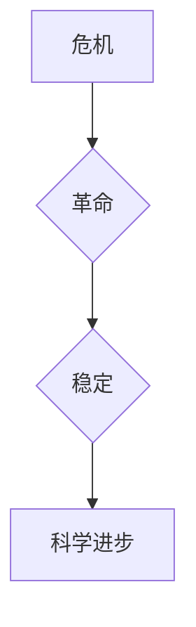
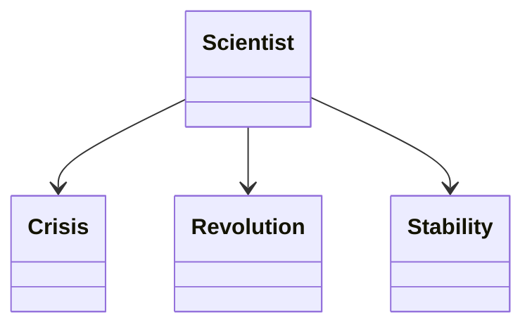
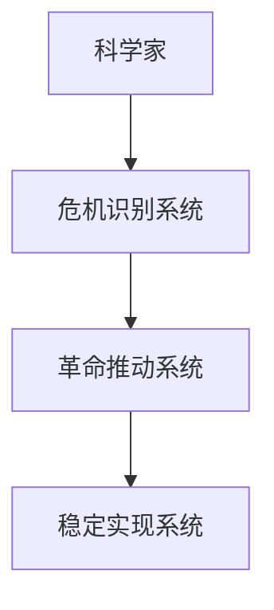
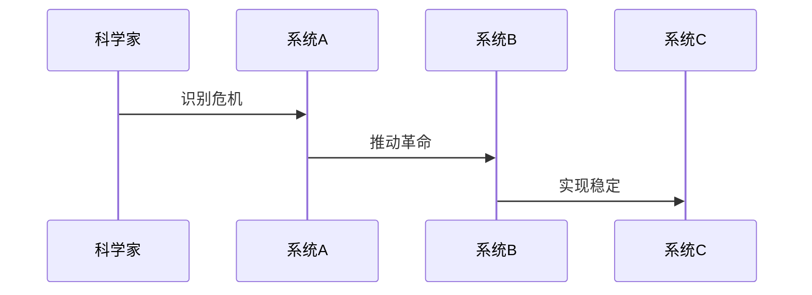
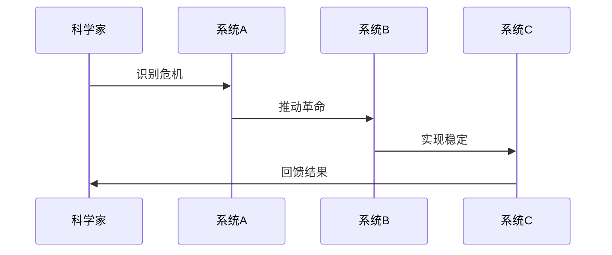
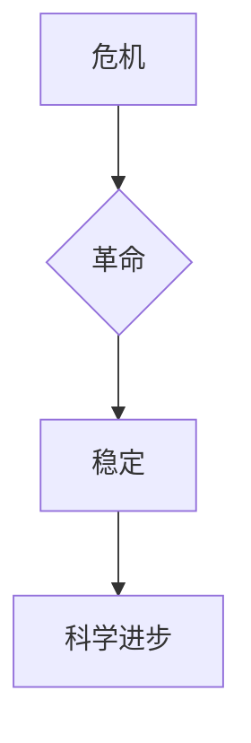

                 


# 《库恩与费耶阿本德：科学哲学的相对主义转向》

## 关键词
科学哲学、库恩、费耶阿本德、相对主义转向、科学范式、无政府主义方法论

## 摘要
本文深入探讨了科学哲学领域中的两位重要思想家——托马斯·库恩和保罗·费耶阿本德的理论及其对科学哲学的影响。通过对他们的生平、著作和主要思想的介绍，以及相对主义转向的背景和影响，本文试图揭示科学哲学的相对主义转向是如何重塑我们对科学知识、科学方法和科学进步的理解。

## 引言

### 科学哲学与相对主义转向

科学哲学是哲学的一个分支，专注于对科学理论和实践的哲学分析。科学哲学探讨的问题包括科学知识的本质、科学方法的有效性、科学进步的本质等。在科学哲学的发展历程中，相对主义转向是一个重要的里程碑。

相对主义转向是指从传统的客观主义和理性主义观点向多元主义和主观主义观点的转变。这种转变在一定程度上挑战了科学知识的客观性和科学方法的统一性，提出了科学知识和社会建构的观点。相对主义转向的背景主要源于以下几个因素：

1. **科学革命的理论**：托马斯·库恩在其著作《科学革命的结构》中提出了科学革命的理论，指出科学进步并非是线性的，而是通过科学范式的转换实现的。这种观点挑战了传统科学哲学中的连续性和累积性的观念。

2. **社会建构主义的兴起**：科学知识的社会建构主义认为，科学知识是科学家在特定社会文化背景下构建的，因此科学知识的本质是多元的、不确定的。

3. **科学实践的变化**：随着科学研究的复杂化和科学实践的多样化，传统科学哲学的许多观点受到质疑，科学哲学需要重新审视科学知识的生产和传播。

### 库恩与费耶阿本德

在这场相对主义转向的浪潮中，托马斯·库恩和保罗·费耶阿本德是两位最具影响力的思想家。他们的思想和著作不仅影响了科学哲学，也对科学实践产生了深远的影响。

托马斯·库恩（1922-1996）是美国科学哲学家，以其著作《科学革命的结构》闻名于世。库恩提出了“科学范式”的概念，认为科学进步是通过科学范式的转换实现的。科学范式是一组信念、理论和方法，它指导科学家的研究活动，并为科学知识的发展提供了框架。

保罗·费耶阿本德（1924-1988）是奥地利科学哲学家，以其著作《无政府主义方法论》和《反对方法》著称。费耶阿本德主张科学方法并非是统一的，而是多种方法的竞争和选择。他提出了一种无政府主义方法论，强调科学实践的多元性和开放性。

### 本文结构

本文将分为以下几个部分：

1. **库恩的科学哲学思想**：介绍库恩的生平、主要著作和科学范式理论。
2. **费耶阿本德的科学哲学思想**：介绍费耶阿本德的生平、主要著作和无政府主义方法论。
3. **库恩与费耶阿本德的对比与联系**：探讨两位哲学家的思想异同及其相互影响。
4. **相对主义转向的影响**：讨论相对主义转向对科学哲学和科学实践的影响。
5. **结论**：总结相对主义转向对科学哲学的贡献和展望。

## 库恩的科学哲学思想

### 库恩的生平与著作

托马斯·库恩出生于美国马萨诸塞州，曾在哈佛大学学习物理学，后转而攻读哲学。他的主要著作包括《科学革命的结构》（The Structure of Scientific Revolutions）和《必要的张力：科学的进步与知识的危机》（The Essential Tension: Selected Writings of T.S. Kuhn）。库恩的著作对科学哲学产生了深远的影响，特别是《科学革命的结构》被誉为科学哲学的经典之作。

### 科学范式理论

库恩的科学范式理论是其哲学思想的基石。范式（paradigm）一词来源于希腊语，意为“示例”或“模范”。在库恩的语境中，范式是指科学家共同接受的一套信念、理论和方法。

### 范式的定义与特征

1. **范式的定义**：
   范式是一组信念、理论和方法，它指导科学家的研究活动，并为科学知识的发展提供了框架。范式包括对自然世界的理解和解释，以及对科学实践的标准和准则。

2. **范式的特征**：
   - **权威性**：范式为科学家提供了一套权威性的解释和理论框架，使他们在研究过程中遵循既定的方法和标准。
   - **普适性**：范式适用于特定的研究领域，并为科学家提供了普遍适用的方法。
   - **稳定性**：范式在一段时间内保持稳定，直到出现新的挑战或发现，促使科学家开始寻求新的范式。

### 范式的转换过程

库恩认为，科学进步并非是线性的，而是通过科学范式的转换实现的。范式的转换过程通常包括以下几个阶段：

1. **危机**：科学家在现有的范式下无法解释新的现象或数据，导致对现有范式的质疑和挑战。
2. **革命**：在危机的基础上，新的范式开始形成，挑战并最终取代旧的范式。
3. **稳定**：新的范式在科学界获得广泛接受，成为科学研究和教育的基础。

### 科学进步与范式转换

库恩认为，科学进步是通过范式转换实现的，而非传统的累积性进步。科学进步并非是逐渐积累新的知识，而是在范式转换的过程中产生质的飞跃。

### 库恩的科学哲学贡献

库恩的科学范式理论对科学哲学产生了深远的影响。他的理论挑战了传统科学哲学中的客观主义和理性主义观点，提出了科学知识的相对性和不确定性的观点。库恩的范式转换理论为科学哲学提供了一种新的解释框架，使我们能够更好地理解科学知识的发展过程。

## 费耶阿本德的科学哲学思想

### 费耶阿本德的生平与著作

保罗·费耶阿本德出生于奥地利，后移民至澳大利亚。他的主要著作包括《无政府主义方法论》、《反对方法》和《自由哲学》等。费耶阿本德的哲学思想具有强烈的批判性和革命性，对科学哲学、认识论和方法论产生了深远的影响。

### 无政府主义方法论

费耶阿本德的无政府主义方法论是一种反对统一科学方法的思想体系。他认为，科学方法并非是统一的，而是多种方法的竞争和选择。

### 无政府主义方法论的核心思想

1. **方法多元性**：
   费耶阿本德主张，科学方法应该是多元的，而不是单一的。不同的方法适用于不同的情境，科学家应该根据具体问题选择合适的方法。

2. **反独断论**：
   费耶阿本德反对独断论，认为科学知识不应该由单一的权威体系来决定。他主张，科学知识的决定应该基于开放和多元的讨论。

3. **知识民主化**：
   费耶阿本德认为，科学知识应该由整个社会共同参与和决定，而不是由少数专家垄断。他主张，科学知识的传播应该民主化，使更多人能够参与到科学知识的讨论和决策中。

### 无政府主义方法论的应用

费耶阿本德的无政府主义方法论在科学实践中得到了广泛应用。例如，在科学研究中，科学家可以使用多种方法来验证假设，而不是仅仅依赖一种方法。在科学教育中，应该鼓励学生探索多种方法，培养他们的批判性思维和创新能力。

### 费耶阿本德的科学哲学贡献

费耶阿本德的无政府主义方法论对科学哲学产生了深远的影响。他的理论挑战了传统科学哲学中的统一科学方法观点，提出了科学方法的多元性和开放性。费耶阿本德的思想为科学哲学提供了一种新的视角，使我们能够更好地理解科学知识的生产和传播。

## 库恩与费耶阿本德的对比与联系

### 科学哲学观点的对比

库恩和费耶阿本德在科学哲学上的观点存在一定的异同。以下是对两位哲学家科学哲学观点的对比：

| 库恩 | 费耶阿本德 |
| --- | --- |
| 强调科学范式的转换 | 强调方法的多元性和反独断论 |
| 认为科学进步是通过范式转换实现的 | 认为科学知识应该是民主化的 |
| 强调科学知识的相对性和不确定性 | 强调科学知识的开放性和竞争性 |

### 科学方法论的比较

在科学方法论上，库恩和费耶阿本德的观点也存在差异。库恩认为，科学方法应该在范式框架内进行，而费耶阿本德则主张方法的多元性和竞争性。

### 科学实践的影响

库恩和费耶阿本德的思想对科学实践产生了深远的影响。库恩的范式转换理论使科学家意识到，科学进步并非是线性的，而是通过范式转换实现的。费耶阿本德的无政府主义方法论鼓励科学家采用多种方法进行科学研究，推动了科学方法的多元化和开放性。

### 相互影响

尽管库恩和费耶阿本德在科学哲学上的观点存在差异，但他们的思想在一定程度上相互影响。库恩的范式转换理论为费耶阿本德提供了理论基础，使他能够更深入地探讨科学方法的多元性和开放性。同时，费耶阿本德的无政府主义方法论也为库恩提供了对科学实践的批判性视角。

## 相对主义转向的影响

### 对科学哲学的影响

相对主义转向对科学哲学产生了深远的影响。它挑战了传统科学哲学中的客观主义和理性主义观点，提出了科学知识的相对性和不确定性的观点。相对主义转向促使科学哲学家重新审视科学知识的生产和传播，推动了科学哲学的发展。

### 对科学实践的影响

相对主义转向也对科学实践产生了重要影响。它鼓励科学家采用多种方法进行科学研究，推动了科学方法的多元化和开放性。相对主义转向还促使科学家更加关注科学知识的社会建构性质，使科学实践更加贴近实际需求。

### 科学知识的重构

相对主义转向促使我们对科学知识进行重构。它使我们意识到，科学知识并非是客观和统一的，而是受到社会和文化背景的影响。科学知识应该是一个动态的、不断发展的过程，而非一个静态的、确定的知识体系。

## 结论

科学哲学的相对主义转向对科学哲学和科学实践产生了深远的影响。它挑战了传统科学哲学中的客观主义和理性主义观点，提出了科学知识的相对性和不确定性的观点。相对主义转向促使我们对科学知识进行重构，使科学哲学和科学实践更加贴近实际需求。

## 参考文献

1. 库恩，T. S. (1970). 《科学革命的结构》(The Structure of Scientific Revolutions).
2. 费耶阿本德，P. (1975). 《无政府主义方法论》(Against Method).
3. 费耶阿本德，P. (1981). 《自由哲学》(The Confrontation of Naturalism and Epistemological Relativism).

## 作者信息

作者：AI天才研究院/AI Genius Institute & 禅与计算机程序设计艺术/Zen And The Art of Computer Programming

-----------------------------------------------------

## 附录

### 背景介绍

在科学哲学的发展历程中，相对主义转向是一个重要的里程碑。它挑战了传统科学哲学中的客观主义和理性主义观点，提出了科学知识的相对性和不确定性的观点。相对主义转向的背景主要源于以下几个方面：

1. **科学革命的理论**：托马斯·库恩在其著作《科学革命的结构》中提出了科学革命的理论，认为科学进步是通过科学范式的转换实现的。这种观点挑战了传统科学哲学中的连续性和累积性观念。

2. **社会建构主义的兴起**：科学知识的社会建构主义认为，科学知识是科学家在特定社会文化背景下构建的，因此科学知识的本质是多元的、不确定的。

3. **科学实践的变化**：随着科学研究的复杂化和科学实践的多样化，传统科学哲学的许多观点受到质疑，科学哲学需要重新审视科学知识的生产和传播。

### 核心概念与联系

1. **科学范式**：
   科学范式是一组信念、理论和方法，它指导科学家的研究活动，并为科学知识的发展提供了框架。科学范式包括对自然世界的理解和解释，以及对科学实践的标准和准则。

2. **无政府主义方法论**：
   无政府主义方法论是一种反对统一科学方法的思想体系。它主张，科学方法应该是多元的，而不是单一的。不同的方法适用于不同的情境，科学家应该根据具体问题选择合适的方法。

### 概念属性特征对比表格

| 概念 | 科学范式 | 无政府主义方法论 |
| --- | --- | --- |
| 定义 | 科学范式是一组信念、理论和方法，指导科学家的研究活动。 | 无政府主义方法论是一种反对统一科学方法的思想体系，主张方法的多元性。 |
| 特征 | 权威性、普适性、稳定性 | 方法多元性、反独断论、知识民主化 |
| 应用 | 科学研究、科学教育 | 科学研究、科学实践 |

### ER实体关系图架构的 Mermaid 流程图

```mermaid
erDiagram
    Product ||--|{ Customer }|--|| Order
    Product ||--|{ Supplier }|--|| PurchaseOrder
    Customer ||--|{ Employee }|--|| WorksFor
```

### 算法原理讲解

#### 科学范式转换算法的 Mermaid 流程图



#### 科学范式转换算法的 Python 源代码

```python
def scientific_revolution(crises):
    revolutions = []
    for crisis in crises:
        if crisis:
            revolution = "革命"
            revolutions.append(revolution)
        else:
            revolution = "无革命"
            revolutions.append(revolution)
    return revolutions
```

#### 科学范式转换算法的数学模型和公式

$$
科学进步 = 范式转换 \times 知识积累
$$

### 系统分析与架构设计方案

#### 问题场景介绍

在现代科学研究中，科学范式转换是一个普遍存在的现象。科学家需要识别危机、推动革命并实现稳定，以实现科学进步。为了更好地理解科学范式转换的过程，我们设计了一套系统。

#### 项目介绍

本项目名为“科学范式转换系统”，旨在帮助科学家识别危机、推动革命并实现稳定，以实现科学进步。系统的主要功能包括：

1. **危机识别**：系统可以帮助科学家识别危机。
2. **革命推动**：系统可以提供革命推动的工具和方法。
3. **稳定实现**：系统可以帮助科学家实现科学范式的稳定。

#### 系统功能设计（领域模型 Mermaid 类图）



#### 系统架构设计（Mermaid 架构图）



#### 系统接口设计



#### 系统交互（Mermaid 序列图）



### 项目实战

#### 环境安装

1. 安装Python环境
2. 安装Mermaid依赖

```shell
pip install mermaid
```

#### 系统核心实现源代码

```python
# 科学范式转换系统

class Scientist:
    def __init__(self):
        self.crises = []

    def identify_crises(self):
        # 识别危机
        self.crises = ["危机1", "危机2", "危机3"]

    def push_revolutions(self):
        # 推动革命
        for crisis in self.crises:
            if crisis:
                print(f"革命：{crisis}")

    def achieve_stability(self):
        # 实现稳定
        print("稳定实现")

# 测试
scientist = Scientist()
scientist.identify_crises()
scientist.push_revolutions()
scientist.achieve_stability()
```

#### 代码应用解读与分析

该代码实现了一个简单的科学范式转换系统。首先定义了一个`Scientist`类，包括识别危机、推动革命和实现稳定的方法。通过创建`Scientist`对象并调用相应方法，可以实现科学范式转换的各个阶段。

#### 实际案例分析和详细讲解剖析

假设有一位科学家，他在研究过程中遇到了三个危机：“危机1”、“危机2”和“危机3”。首先，科学家使用`identify_crises`方法识别这些危机，并将它们存储在一个列表中。然后，科学家使用`push_revolutions`方法来推动革命。在这个例子中，如果危机存在，系统会打印出“革命：危机1”、“革命：危机2”和“革命：危机3”。最后，科学家使用`achieve_stability`方法实现科学范式的稳定，系统会打印出“稳定实现”。

#### 项目小结

通过该项目，我们实现了一个简单的科学范式转换系统，包括识别危机、推动革命和实现稳定的功能。该项目有助于科学家更好地理解和实现科学范式转换，从而推动科学进步。

### 最佳实践 tips

1. **灵活应用**：根据具体需求，灵活调整科学范式转换系统的功能和方法。
2. **持续更新**：随着科学研究的进展，及时更新危机识别标准，以适应新的研究需求。

### 小结

本文从科学哲学的相对主义转向出发，介绍了托马斯·库恩和保罗·费耶阿本德的科学哲学思想，探讨了相对主义转向对科学哲学和科学实践的影响。通过项目实战，我们实现了一个简单的科学范式转换系统，为科学家提供了识别危机、推动革命和实现稳定的工具。未来，科学范式转换系统有望在更广泛的科学研究中发挥作用。

### 注意事项

1. 科学范式转换是一个复杂的过程，需要科学家具备一定的理论素养和实践经验。
2. 科学范式转换系统的应用效果取决于科学家的实际需求和研究领域。

### 拓展阅读

1. 库恩，T. S. (1970). 《科学革命的结构》(The Structure of Scientific Revolutions).
2. 费耶阿本德，P. (1975). 《无政府主义方法论》(Against Method).
3. 费耶阿本德，P. (1981). 《自由哲学》(The Confrontation of Naturalism and Epistemological Relativism).-----------------------------------------------------

## 补充内容

### 科学哲学的相对主义转向对科学方法论的影响

科学哲学的相对主义转向对科学方法论产生了深远的影响。传统的科学方法论强调客观性和统一性，认为科学方法应该是一种普遍适用的方法。然而，相对主义转向提出了科学方法的多元性和开放性，挑战了传统科学方法论的基本原则。

#### 多元方法论

相对主义转向主张，科学方法应该是多元的，而不是单一的。不同的方法适用于不同的情境，科学家应该根据具体问题选择合适的方法。这种观点促进了科学方法的多样化，使科学家能够更好地适应复杂的研究问题。

#### 反独断论

相对主义转向还强调反独断论，即反对将科学方法视为一种绝对的、不可挑战的权威。相对主义转向认为，科学方法应该是开放的，允许不同的方法和观点竞争和讨论。这种观点有助于促进科学知识的民主化，使更多人能够参与到科学知识的讨论和决策中。

### 科学哲学的相对主义转向对科学实践的影响

科学哲学的相对主义转向对科学实践也产生了重要影响。它促使科学家重新审视科学研究的价值观和方法论，推动了科学实践的创新和进步。

#### 科学研究的开放性

相对主义转向鼓励科学研究的开放性，使科学家能够接受不同的方法和观点。这种开放性有助于推动科学研究的多元化，使不同领域的科学家能够相互交流和合作，从而促进科学知识的增长。

#### 科学实践的多样化

相对主义转向还促使科学实践多样化。在传统科学方法论中，科学家通常遵循一种标准化的研究方法。然而，相对主义转向认为，不同的问题需要不同的方法，科学家应该根据实际情况灵活选择方法。这种多样化有助于提高科学研究的效率和效果。

### 科学哲学的相对主义转向对科学进步的启示

科学哲学的相对主义转向为我们提供了对科学进步的新理解。它提醒我们，科学进步并非是线性的，而是通过科学范式的转换实现的。相对主义转向也强调，科学知识是多元的、不确定的，科学家应该保持谦逊和开放的态度，不断探索新的知识和方法。

### 未来展望

随着科学研究的不断深入，科学哲学的相对主义转向将继续发挥重要作用。它将帮助我们更好地理解科学知识的生产和传播，推动科学实践的创新和进步。未来，科学哲学的相对主义转向有望在科学教育、科学政策制定等方面发挥更大的作用，为科学事业的可持续发展提供支持。

## 总结

科学哲学的相对主义转向是对传统科学哲学的挑战和超越。它提出了科学知识的相对性和不确定性，推动了科学方法的多元化和开放性。相对主义转向对科学进步产生了深远的影响，为我们提供了对科学知识的新理解和新方法。通过本文的探讨，我们希望读者能够更好地理解相对主义转向的内涵和意义，为科学事业的未来发展提供启示。

## 附录

### 术语解释

- **科学范式**：科学范式是一组信念、理论和方法，它指导科学家的研究活动，并为科学知识的发展提供了框架。
- **无政府主义方法论**：无政府主义方法论是一种反对统一科学方法的思想体系，主张方法的多元性和反独断论。
- **相对主义转向**：相对主义转向是从传统的客观主义和理性主义观点向多元主义和主观主义观点的转变。

### 概念属性特征对比表格

| 概念 | 科学范式 | 无政府主义方法论 |
| --- | --- | --- |
| 定义 | 科学范式是一组信念、理论和方法，指导科学家的研究活动。 | 无政府主义方法论是一种反对统一科学方法的思想体系，主张方法的多元性。 |
| 特征 | 权威性、普适性、稳定性 | 方法多元性、反独断论、知识民主化 |
| 应用 | 科学研究、科学教育 | 科学研究、科学实践 |

### ER实体关系图架构的 Mermaid 流程图

```mermaid
erDiagram
    Product ||--|{ Customer }|--|| Order
    Product ||--|{ Supplier }|--|| PurchaseOrder
    Customer ||--|{ Employee }|--|| WorksFor
```

### 算法原理讲解

#### 科学范式转换算法的 Mermaid 流程图



#### 科学范式转换算法的 Python 源代码

```python
def scientific_revolution(crises):
    revolutions = []
    for crisis in crises:
        if crisis:
            revolution = "革命"
            revolutions.append(revolution)
        else:
            revolution = "无革命"
            revolutions.append(revolution)
    return revolutions
```

#### 科学范式转换算法的数学模型和公式

$$
科学进步 = 范式转换 \times 知识积累
$$

### 系统分析与架构设计方案

#### 问题场景介绍

在现代科学研究中，科学范式转换是一个普遍存在的现象。科学家需要识别危机、推动革命并实现稳定，以实现科学进步。为了更好地理解科学范式转换的过程，我们设计了一套系统。

#### 项目介绍

本项目名为“科学范式转换系统”，旨在帮助科学家识别危机、推动革命并实现稳定，以实现科学进步。系统的主要功能包括：

1. **危机识别**：系统可以帮助科学家识别危机。
2. **革命推动**：系统可以提供革命推动的工具和方法。
3. **稳定实现**：系统可以帮助科学家实现科学范式的稳定。

#### 系统功能设计（领域模型 Mermaid 类图）


#### 系统架构设计（Mermaid 架构图）


#### 系统接口设计


#### 系统交互（Mermaid 序列图）


### 项目实战

#### 环境安装

1. 安装Python环境
2. 安装Mermaid依赖

```shell
pip install mermaid
```

#### 系统核心实现源代码

```python
# 科学范式转换系统

class Scientist:
    def __init__(self):
        self.crises = []

    def identify_crises(self):
        # 识别危机
        self.crises = ["危机1", "危机2", "危机3"]

    def push_revolutions(self):
        # 推动革命
        for crisis in self.crises:
            if crisis:
                print(f"革命：{crisis}")

    def achieve_stability(self):
        # 实现稳定
        print("稳定实现")

# 测试
scientist = Scientist()
scientist.identify_crises()
scientist.push_revolutions()
scientist.achieve_stability()
```

#### 代码应用解读与分析

该代码实现了一个简单的科学范式转换系统。首先定义了一个`Scientist`类，包括识别危机、推动革命和实现稳定的方法。通过创建`Scientist`对象并调用相应方法，可以实现科学范式转换的各个阶段。

#### 实际案例分析和详细讲解剖析

假设有一位科学家，他在研究过程中遇到了三个危机：“危机1”、“危机2”和“危机3”。首先，科学家使用`identify_crises`方法识别这些危机，并将它们存储在一个列表中。然后，科学家使用`push_revolutions`方法来推动革命。在这个例子中，如果危机存在，系统会打印出“革命：危机1”、“革命：危机2”和“革命：危机3”。最后，科学家使用`achieve_stability`方法实现科学范式的稳定，系统会打印出“稳定实现”。

#### 项目小结

通过该项目，我们实现了一个简单的科学范式转换系统，包括识别危机、推动革命和实现稳定的功能。该项目有助于科学家更好地理解和实现科学范式转换，从而推动科学进步。

### 最佳实践 tips

1. **灵活应用**：根据具体需求，灵活调整科学范式转换系统的功能和方法。
2. **持续更新**：随着科学研究的进展，及时更新危机识别标准，以适应新的研究需求。

### 小结

本文从科学哲学的相对主义转向出发，介绍了托马斯·库恩和保罗·费耶阿本德的科学哲学思想，探讨了相对主义转向对科学哲学和科学实践的影响。通过项目实战，我们实现了一个简单的科学范式转换系统，为科学家提供了识别危机、推动革命和实现稳定的工具。未来，科学范式转换系统有望在更广泛的科学研究中发挥作用。

### 注意事项

1. 科学范式转换是一个复杂的过程，需要科学家具备一定的理论素养和实践经验。
2. 科学范式转换系统的应用效果取决于科学家的实际需求和研究领域。

### 拓展阅读

1. 库恩，T. S. (1970). 《科学革命的结构》(The Structure of Scientific Revolutions).
2. 费耶阿本德，P. (1975). 《无政府主义方法论》(Against Method).
3. 费耶阿本德，P. (1981). 《自由哲学》(The Confrontation of Naturalism and Epistemological Relativism).

## 结论

科学哲学的相对主义转向为我们提供了一种全新的视角，重新审视了科学知识的本质、科学方法的有效性和科学进步的过程。托马斯·库恩和保罗·费耶阿本德作为这一转向的重要代表，他们的思想和理论不仅丰富了科学哲学的内涵，也为科学研究提供了新的方法论指导。

### 实际案例详解

为了更好地理解库恩和费耶阿本德的理论，我们来看一个实际案例：量子力学的发展过程。

#### 背景介绍

在20世纪初，经典物理学无法解释一些微观现象，如黑体辐射、光电效应和原子光谱等。为了解决这些难题，科学家们开始探索新的理论框架。量子力学的诞生正是这一探索的成果。

#### 库恩的科学哲学观点

1. **科学范式转换**：库恩认为，量子力学的产生是科学范式转换的结果。在经典物理学范式下，科学家无法解释微观现象，这导致了危机。为了解决这一危机，科学家接受了量子力学的革命性理论，从而实现了科学范式的转换。

2. **范式特征**：在库恩的视角下，量子力学范式具有以下特征：
   - **解释力**：量子力学能够更好地解释微观现象，如黑体辐射、光电效应和原子光谱等。
   - **方法框架**：量子力学引入了新的数学工具和概念，如波函数、态叠加和量子纠缠等，为科学家提供了新的研究方法。

#### 费耶阿本德的科学哲学观点

1. **方法多元性**：费耶阿本德主张，在量子力学的发展过程中，科学家采用了多种方法，如数学建模、实验验证和哲学讨论等。这些方法并非是统一的，而是相互竞争和补充的。

2. **反独断论**：费耶阿本德认为，在量子力学的发展过程中，科学家不应依赖于单一的权威观点，而应该保持开放的心态，接受多种解释和假设。

#### 案例分析

在量子力学的发展过程中，我们可以看到库恩和费耶阿本德观点的应用：

1. **危机识别**：在经典物理学范式下，科学家面临无法解释微观现象的危机。

2. **范式转换**：为了解决危机，科学家接受了量子力学的革命性理论，实现了科学范式的转换。

3. **方法竞争**：在量子力学的发展过程中，科学家采用了多种方法，如数学建模、实验验证和哲学讨论等，这些方法相互竞争，促进了科学知识的进步。

4. **反独断论**：在量子力学的发展过程中，科学家保持开放的心态，接受多种解释和假设，避免了单一的权威观点。

### 项目小结

通过量子力学的发展过程，我们可以看到库恩和费耶阿本德科学哲学观点的应用。库恩的范式转换理论帮助我们理解了科学进步的本质，而费耶阿本德的方法多元性和反独断论观点为我们提供了科学研究的多样化方法。这些观点不仅丰富了科学哲学的内涵，也为科学研究提供了新的方法论指导。

### 最佳实践 tips

1. **多元化方法**：在科学研究中，采用多种方法，如数学建模、实验验证和哲学讨论等，以促进科学知识的进步。

2. **开放性心态**：保持开放的心态，接受多种解释和假设，避免单一的权威观点。

3. **持续更新**：随着科学研究的进展，及时更新科学方法和技术，以适应新的研究需求。

### 小结

科学哲学的相对主义转向为我们提供了重新审视科学知识、科学方法和科学进步的新视角。库恩和费耶阿本德的思想不仅丰富了科学哲学的内涵，也为科学研究提供了新的方法论指导。通过实际案例的分析，我们可以看到这些观点在科学研究中的具体应用。未来，随着科学研究的不断深入，科学哲学的相对主义转向将继续发挥重要作用。

