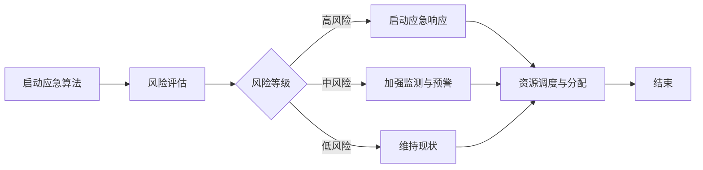
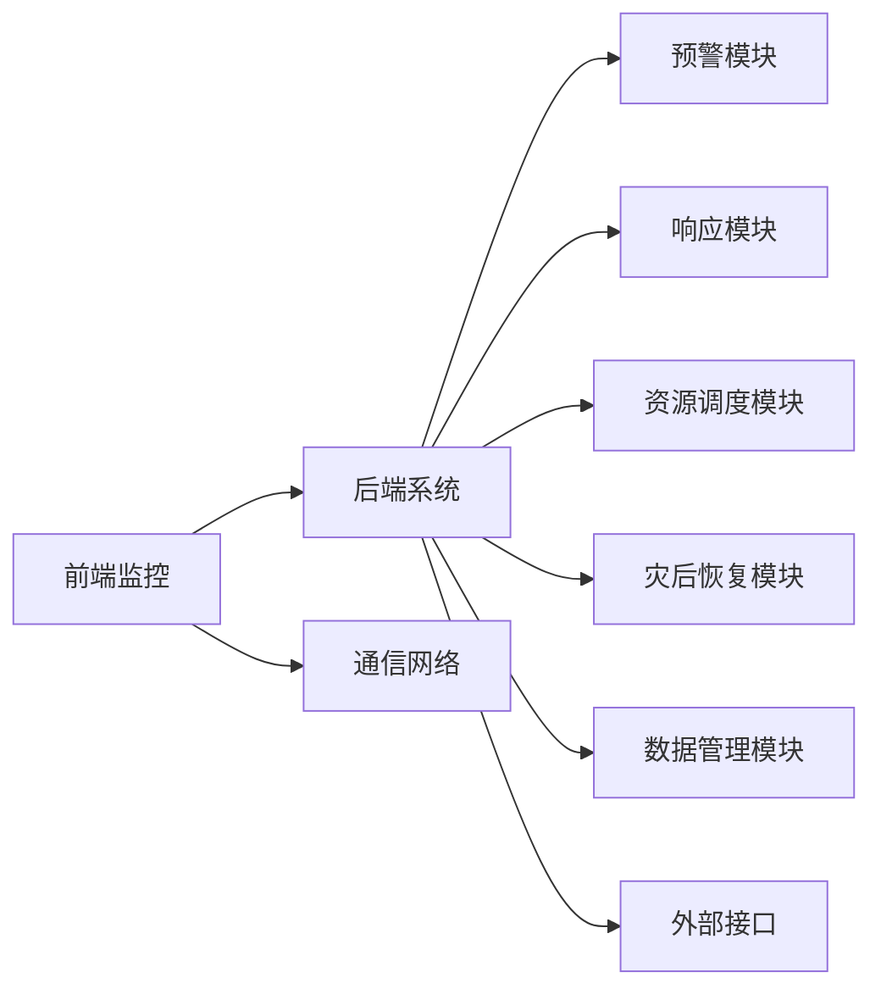
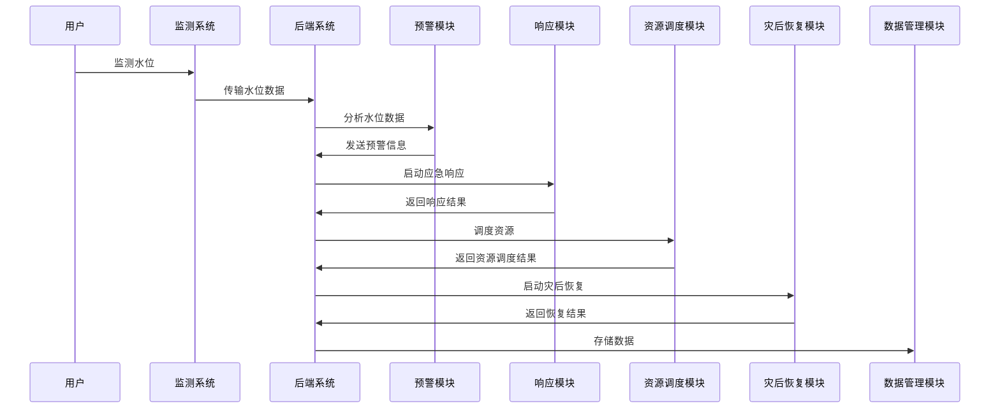

                 

### 第一部分：应急管理概述

## 第1章：应急管理的背景与核心概念

### 1.1 问题的提出与解决

在现代社会，随着城市化进程的加快和全球化的发展，自然灾害、事故灾难、公共卫生事件等突发事件的发生频率和影响范围日益扩大，给人类社会带来了巨大的威胁和挑战。应急管理作为一门综合性的学科，旨在通过科学、有序的应对措施，减轻灾害损失，保护人民群众的生命财产安全，维护社会的稳定和谐。

**问题背景**：自然灾害如地震、台风、洪水等，事故灾难如火灾、爆炸、泄漏等，公共卫生事件如疫情爆发、传染病流行等，都可能导致严重的社会后果。这些突发事件不仅考验着政府的应急管理能力，也考验着社会各界的协作与应对。

**问题描述**：在突发事件发生后，如何快速响应、有效调度资源、保障人员安全、减少财产损失，成为应急管理的主要任务。因此，建立完善的应急管理体制，提高应急响应能力，成为当务之急。

**问题解决**：应急管理通过建立应急预案、加强应急演练、提高应急响应能力等措施，实现对突发事件的及时、有效应对。具体来说，应急管理的目标是：
1. 预防和减轻灾害损失。
2. 保护人民生命财产安全。
3. 维护社会稳定。

### 1.2 应急管理的核心概念

**核心概念**：应急管理中的核心概念包括应急预案、应急响应、应急资源管理、风险评估、预警系统等。

**应急预案**：应急预案是应急管理的基础，它是一套针对可能发生的突发事件而事先制定的行动计划。应急预案的内容通常包括应急组织架构、应急资源准备、应急响应程序、恢复计划等。

**应急响应**：应急响应是指在突发事件发生后，根据应急预案采取的一系列行动，包括报警、疏散、救援、资源调度等。应急响应的目的是迅速控制事态，减少人员伤亡和财产损失。

**应急资源管理**：应急资源管理是指对应急物资、设备、人力资源、资金等资源的管理。有效的应急资源管理能够确保在突发事件发生时，所需资源能够及时、准确地调配到位。

**风险评估**：风险评估是应急管理的重要环节，它通过对潜在风险的识别、分析和评价，为应急预案的制定和应急响应提供科学依据。

**预警系统**：预警系统是应急管理的重要工具，它通过监测、预警和信息传播，提前发现和预测突发事件的发生，为应急响应提供预警信息。

### 1.3 应急管理的边界与外延

**边界**：应急管理的边界涉及从预防到恢复的全过程。具体来说，应急管理的边界包括以下几个方面：
1. 预防：包括风险评估、预警系统建设、应急预案制定等。
2. 应急响应：包括报警、疏散、救援、资源调度等。
3. 灾后恢复：包括灾害损失评估、重建规划、恢复重建等。

**外延**：应急管理的范围不仅限于自然灾害和事故灾难，还包括公共卫生事件、社会安全事件等。此外，应急管理还涉及到政府、企业、社区、非政府组织等多个层面的协作。

### 小结

应急管理作为一门重要的学科，对于保护人民生命财产安全、维护社会稳定具有重要意义。通过了解应急管理的核心概念、边界与外延，我们可以更好地认识应急管理的本质和作用，为实际应用提供理论支持。

----------------------------------------------------------------

## 第2章：核心概念与联系

### 2.1 核心概念原理

应急管理的核心概念包括应急预案、应急响应、应急资源管理、风险评估和预警系统。以下是这些核心概念的详细解释。

**应急预案**：应急预案是指为应对可能发生的突发事件而事先制定的行动计划。它包括应急组织架构、应急资源准备、应急响应程序、恢复计划等。应急预案的制定需要结合具体的风险评估结果和实际情况。

**应急响应**：应急响应是指在突发事件发生后，根据应急预案采取的一系列行动，包括报警、疏散、救援、资源调度等。应急响应的目的是迅速控制事态，减少人员伤亡和财产损失。

**应急资源管理**：应急资源管理是指对应急物资、设备、人力资源、资金等资源的管理。有效的应急资源管理能够确保在突发事件发生时，所需资源能够及时、准确地调配到位。

**风险评估**：风险评估是应急管理的重要环节，它通过对潜在风险的识别、分析和评价，为应急预案的制定和应急响应提供科学依据。风险评估通常包括风险识别、风险分析和风险评估三个步骤。

**预警系统**：预警系统是应急管理的重要工具，它通过监测、预警和信息传播，提前发现和预测突发事件的发生，为应急响应提供预警信息。预警系统通常包括监测系统、预警信息系统、预警决策系统等。

### 2.2 概念属性特征对比

以下是应急预案、应急响应、应急资源管理、风险评估和预警系统五个核心概念的属性特征对比表格。

| 核心概念 | 属性特征 |
| :---: | :---: |
| 应急预案 | - 应急组织架构<br>- 应急资源准备<br>- 应急响应程序<br>- 恢复计划 |
| 应急响应 | - 报警<br>- 疏散<br>- 救援<br>- 资源调度 |
| 应急资源管理 | - 应急物资管理<br>- 设备管理<br>- 人力资源管理<br>- 资金管理 |
| 风险评估 | - 风险识别<br>- 风险分析<br>- 风险评估 |
| 预警系统 | - 监测系统<br>- 预警信息系统<br>- 预警决策系统 |

### 2.3 ER实体关系图

以下是应急管理的ER实体关系图，用于描述应急预案、应急响应、应急资源管理、风险评估和预警系统之间的关系。

```mermaid
erDiagram
  应急预案 ||--|{ 应急响应 }|
  应急预案 ||--|{ 应急资源管理 }|
  应急预案 ||--|{ 风险评估 }|
  应急预案 ||--|{ 预警系统 }|
  应急响应 ||--|{ 应急资源管理 }|
  应急响应 ||--|{ 风险评估 }|
  应急响应 ||--|{ 预警系统 }|
  应急资源管理 ||--|{ 风险评估 }|
  应急资源管理 ||--|{ 预警系统 }|
  风险评估 ||--|{ 预警系统 }|
```

### 小结

通过本章对应急管理核心概念的详细解释、属性特征对比和ER实体关系图的绘制，我们可以更清晰地理解应急管理的概念结构和核心要素，为后续的算法原理讲解和系统分析与架构设计打下坚实基础。在下一章中，我们将深入探讨应急算法原理及其在实际应用中的重要性。|assistant|>

## 第3章：应急算法原理

### 3.1 算法原理介绍

应急算法在应急管理中扮演着至关重要的角色。这些算法不仅帮助我们在突发事件中做出快速、准确的决策，还能有效提高应急响应的效率和效果。本节将介绍应急算法的基本原理，并通过mermaid流程图和Python源代码示例，详细阐述算法的实现过程。

#### 3.1.1 算法mermaid流程图

首先，我们通过mermaid流程图来展示应急算法的基本流程。



该流程图展示了应急算法的基本步骤，包括风险评估、根据风险等级启动相应的应急响应措施、资源调度与分配，最后结束算法运行。

#### 3.1.2 Python源代码示例

接下来，我们将通过Python源代码示例，进一步阐述应急算法的实现细节。

```python
import numpy as np

# 风险评估函数
def assess_risk(impact, likelihood):
    # 计算风险值
    risk_value = impact * likelihood
    return risk_value

# 应急响应函数
def emergency_response(risk_value):
    if risk_value > 5:
        response = "启动应急响应"
    elif risk_value > 2:
        response = "加强监测与预警"
    else:
        response = "维持现状"
    return response

# 资源调度与分配函数
def resource_allocation(response):
    if response == "启动应急响应":
        # 调度大量资源
        resources = "大量资源"
    elif response == "加强监测与预警":
        # 调度中等资源
        resources = "中等资源"
    else:
        # 调度少量资源
        resources = "少量资源"
    return resources

# 主函数
def main(impact, likelihood):
    risk_value = assess_risk(impact, likelihood)
    response = emergency_response(risk_value)
    resources = resource_allocation(response)
    print(f"风险值：{risk_value}")
    print(f"应急响应：{response}")
    print(f"资源调度：{resources}")

# 测试
main(3, 4)  # 输出：风险值：12，应急响应：启动应急响应，资源调度：大量资源
```

在该Python代码示例中，我们首先定义了风险评估函数`assess_risk`，用于计算突发事件的风险值。然后，我们定义了应急响应函数`emergency_response`，根据风险值决定应急响应措施。最后，我们定义了资源调度与分配函数`resource_allocation`，根据应急响应措施来分配所需资源。

### 3.2 数学模型和公式

在应急算法中，数学模型和公式起到了至关重要的作用。以下是一个简单的数学模型和公式，用于评估突发事件的风险。

#### 3.2.1 数学模型的推导

突发事件的风险可以通过影响（Impact）和可能性（Likelihood）来评估。具体来说，风险值（Risk Value）可以通过以下公式计算：

$$
Risk\ Value = Impact \times Likelihood
$$

其中，影响（Impact）表示突发事件对目标（如人员、财产、环境等）的潜在损害程度，可能性（Likelihood）表示突发事件发生的概率。

#### 3.2.2 公式的详细讲解

1. **影响（Impact）**：影响是指突发事件对目标造成的损害程度。它通常是一个非负实数，表示从0（无损害）到无穷大（完全损害）的范围内。例如，在评估地震风险时，影响可以表示房屋倒塌的程度。

2. **可能性（Likelihood）**：可能性是指突发事件发生的概率。它也是一个非负实数，表示从0（不可能发生）到1（必然发生）的范围内。例如，在评估暴雨导致洪水风险时，可能性可以表示暴雨发生的概率。

3. **风险值（Risk Value）**：风险值是影响和可能性的乘积，表示突发事件对目标的潜在威胁程度。风险值越大，表示突发事件的风险越高。

#### 3.2.3 算法原理举例说明

假设我们要评估一场地震的风险。根据历史数据和地质研究，我们估计地震的影响为3，可能性为4。那么，地震的风险值可以通过以下公式计算：

$$
Risk\ Value = 3 \times 4 = 12
$$

根据计算结果，地震的风险值为12。根据应急算法的原理，我们可以得出以下结论：

- 如果地震的风险值大于5，则启动应急响应，如组织疏散、加强防护措施等。
- 如果地震的风险值大于2且小于等于5，则加强监测与预警，如增加监测设备、提高预警级别等。
- 如果地震的风险值小于等于2，则维持现状，如继续正常活动、保持警惕等。

### 小结

通过本章对应急算法原理的详细讲解，包括mermaid流程图和Python源代码示例，以及数学模型和公式的推导与应用，我们能够更好地理解应急算法的核心思想和工作机制。在下一章中，我们将进一步探讨应急系统分析与架构设计，为应急算法的实际应用提供理论支持。|assistant|>

## 第4章：应急系统分析与架构设计

### 4.1 问题场景介绍

在应急管理中，系统分析与架构设计是确保应急响应高效、有序进行的关键环节。本节将介绍一个典型的问题场景，即城市突发洪水事件。在该场景中，我们需要建立一个应急系统，以应对可能发生的洪水风险，确保人员安全、减少财产损失，并保障城市正常运转。

**问题场景描述**：

某城市位于洪水多发区域，每年雨季来临之际，都有可能发生洪水灾害。洪水可能导致城市交通中断、居民疏散、基础设施损坏等问题。为了应对这一情况，我们需要设计一个完善的应急系统，包括预警、响应、资源调度等多个模块。

**目标**：

1. 提前预警：通过监测系统，提前发现洪水风险，及时发布预警信息。
2. 快速响应：在洪水发生时，迅速启动应急响应程序，组织人员疏散和救援。
3. 资源调度：合理调度应急资源，如救援队伍、医疗设备、物资等，确保救援工作有序进行。
4. 灾后恢复：在洪水过后，迅速进行灾后评估和恢复工作，减少财产损失，保障城市正常运转。

### 4.2 系统功能设计

应急系统的功能设计是确保系统有效运作的基础。以下是一个典型的应急系统功能设计：

1. **预警模块**：负责监测水位的实时变化，当水位达到预设警戒线时，系统自动触发预警机制，向相关部门和居民发送预警信息。
2. **响应模块**：在预警信息发布后，系统自动启动应急响应程序，包括启动警报系统、通知相关部门、组织人员疏散等。
3. **资源调度模块**：负责调集应急资源，如救援队伍、医疗设备、物资等，确保救援工作顺利进行。
4. **灾后恢复模块**：在洪水过后，系统自动评估灾情，调度资源进行灾后重建，包括基础设施修复、居民安置等。
5. **数据管理模块**：负责收集、存储和管理应急过程中产生的各类数据，为后续分析和改进提供依据。

#### 4.2.1 领域模型mermaid类图

以下是一个简单的mermaid类图，展示了应急系统的领域模型：

```mermaid
classDiagram
  产品 <<Entity>>
  水位传感器 <<Entity>>
  预警模块 <<Service>>
  响应模块 <<Service>>
  资源调度模块 <<Service>>
  灾后恢复模块 <<Service>>
  数据管理模块 <<Service>>

  产品: +水位传感器
  预警模块: +监控水位传感器 +发送预警信息
  响应模块: +启动警报系统 +通知相关部门 +组织人员疏散
  资源调度模块: +调度救援队伍 +调度医疗设备 +调度物资
  灾后恢复模块: +评估灾情 +调度资源进行灾后重建
  数据管理模块: +收集数据 +存储数据 +分析数据
```

### 4.3 系统架构设计

系统架构设计是应急系统能够稳定、高效运行的关键。以下是一个典型的应急系统架构设计：

1. **前端监控**：包括水位传感器、摄像头等，实时监控水位的实时变化，并将数据传输至后端系统。
2. **后端系统**：包括预警模块、响应模块、资源调度模块、灾后恢复模块和数据管理模块，负责数据处理和应急响应。
3. **通信网络**：包括有线网络和无线网络，负责前端监控和后端系统之间的数据传输。
4. **外部接口**：包括与政府部门、社会组织、医疗机构等的接口，用于信息共享和协作。

#### 4.3.1 系统架构mermaid架构图

以下是一个简单的mermaid架构图，展示了应急系统的架构设计：



### 4.4 系统接口设计

系统接口设计是确保应急系统能够与其他系统有效交互的关键。以下是一个典型的应急系统接口设计：

1. **内部接口**：包括后端系统与预警模块、响应模块、资源调度模块、灾后恢复模块和数据管理模块之间的接口，用于数据传输和功能调用。
2. **外部接口**：包括与政府部门、社会组织、医疗机构等的接口，用于信息共享和协作。
3. **API接口**：包括与第三方服务（如天气预报、地理位置服务等）的接口，用于获取外部数据。

#### 4.4.1 系统接口设计mermaid类图

以下是一个简单的mermaid类图，展示了应急系统的接口设计：

```mermaid
classDiagram
  后端系统 <<Interface>>
  预警模块 <<Interface>>
  响应模块 <<Interface>>
  资源调度模块 <<Interface>>
  灾后恢复模块 <<Interface>>
  数据管理模块 <<Interface>>

  后端系统: +预警模块 +响应模块 +资源调度模块 +灾后恢复模块 +数据管理模块
  预警模块: +接收水位数据 +发送预警信息
  响应模块: +接收警报信息 +启动应急响应
  资源调度模块: +接收资源需求 +调度资源
  灾后恢复模块: +接收灾情数据 +进行灾后重建
  数据管理模块: +接收数据 +存储数据 +分析数据
```

### 4.5 系统交互

系统交互是确保应急系统能够在不同模块之间有效协作的关键。以下是一个简单的mermaid序列图，展示了应急系统的交互过程：



### 小结

通过本章对应急系统分析与架构设计的详细阐述，我们了解了应急系统的功能设计、架构设计、接口设计和系统交互。这些设计为应急系统的实际应用提供了理论支持和实践指导。在下一章中，我们将通过实际案例分析和讲解，进一步探讨应急系统的应用和效果。|assistant|>

## 第5章：项目实战

### 5.1 环境安装

为了实现一个完整的应急管理项目，我们需要搭建一个合适的环境。以下是一个简单的环境安装指南。

**步骤 1**：安装操作系统

我们选择Linux操作系统，如Ubuntu 20.04，作为我们的开发环境。

```shell
# 更新系统软件包
sudo apt update && sudo apt upgrade

# 安装Linux发行版
sudo apt install ubuntu-desktop
```

**步骤 2**：安装Python环境

我们使用Python 3.8作为我们的主要编程语言。

```shell
# 安装Python 3.8
sudo apt install python3.8

# 添加Python 3.8到PATH环境变量
echo 'export PATH=$PATH:/usr/bin/python3.8' >> ~/.bashrc
source ~/.bashrc
```

**步骤 3**：安装依赖库

我们使用pip工具来安装所需的依赖库。

```shell
# 安装pip
curl https://bootstrap.pypa.io/get-pip.py -o get-pip.py
sudo python3.8 get-pip.py

# 安装依赖库
pip3.8 install numpy matplotlib mermaidpy
```

**步骤 4**：安装mermaid

mermaid是一个用于绘制流程图、类图等的工具，我们通过npm安装。

```shell
# 安装mermaid
npm install -g mermaid
```

### 5.2 系统核心实现

在本节中，我们将通过一个简单的示例来展示应急系统的核心实现。

**示例**：一个简单的应急响应系统，用于监测水位并触发预警。

```python
import numpy as np
import matplotlib.pyplot as plt
from mermaidpy import Mermaid

# 风险评估函数
def assess_risk(impact, likelihood):
    risk_value = impact * likelihood
    return risk_value

# 应急响应函数
def emergency_response(risk_value):
    if risk_value > 5:
        response = "启动应急响应"
    elif risk_value > 2:
        response = "加强监测与预警"
    else:
        response = "维持现状"
    return response

# 资源调度函数
def resource_allocation(response):
    if response == "启动应急响应":
        resources = "大量资源"
    elif response == "加强监测与预警":
        resources = "中等资源"
    else:
        resources = "少量资源"
    return resources

# 主函数
def main():
    impact = 3
    likelihood = 4
    risk_value = assess_risk(impact, likelihood)
    response = emergency_response(risk_value)
    resources = resource_allocation(response)
    print(f"风险值：{risk_value}")
    print(f"应急响应：{response}")
    print(f"资源调度：{resources}")

# 测试
main()
```

在这个示例中，我们定义了三个核心函数：`assess_risk`用于计算风险值，`emergency_response`用于确定应急响应措施，`resource_allocation`用于根据应急响应措施调度资源。

### 5.3 代码应用解读与分析

以下是对上述代码的详细解读与分析。

**解读**：

1. **风险评估函数**：该函数通过影响（Impact）和可能性（Likelihood）计算风险值。这里使用了一个简单的乘法模型，即风险值是影响和可能性的乘积。

2. **应急响应函数**：该函数根据风险值决定应急响应措施。如果风险值大于5，则启动应急响应；如果风险值大于2且小于等于5，则加强监测与预警；如果风险值小于等于2，则维持现状。

3. **资源调度函数**：该函数根据应急响应措施调度资源。如果启动应急响应，则调度大量资源；如果加强监测与预警，则调度中等资源；如果维持现状，则调度少量资源。

**分析**：

1. **风险值计算**：使用乘法模型来计算风险值是一个简单有效的方法，但它可能需要进一步优化，例如引入时间因素、地理位置等因素。

2. **应急响应措施**：该函数的设计考虑了不同风险等级下的应急响应，但可能需要根据实际情况进行调整，例如增加不同等级的具体措施。

3. **资源调度**：资源调度是根据应急响应措施来进行的，但可能需要考虑资源的实际可用性，例如库存、人力等。

### 5.4 实际案例分析与讲解

以下是一个实际案例的分析与讲解。

**案例**：某城市在雨季期间发生洪水，水位迅速上升，监测系统实时传输水位数据。

**分析**：

1. **预警系统**：当水位达到预设警戒线时，预警系统应立即触发，并向相关部门和居民发送预警信息。

2. **应急响应**：根据水位数据，应急响应系统应立即启动，组织人员疏散和救援。

3. **资源调度**：根据应急响应措施，调度相应的资源，如救援队伍、医疗设备、物资等。

4. **灾后恢复**：洪水过后，系统应立即进行灾后评估和恢复工作，包括基础设施修复、居民安置等。

**讲解**：

1. **预警系统**：在这个案例中，预警系统起到了关键作用。通过实时监测水位数据，预警系统能够提前发现洪水风险，并及时发布预警信息，为应急响应赢得宝贵时间。

2. **应急响应**：在洪水发生时，应急响应系统迅速启动，组织人员疏散和救援。这一环节的关键在于快速、有序的行动，确保人员安全。

3. **资源调度**：资源调度系统根据应急响应措施，合理调度资源，确保救援工作顺利进行。在这一环节，资源的合理调度和快速响应至关重要。

4. **灾后恢复**：在洪水过后，系统应立即进行灾后评估和恢复工作。这一环节不仅需要快速响应，还需要对灾情进行全面评估，制定有效的恢复计划。

### 5.5 项目小结

通过本节的项目实战，我们了解了应急系统的核心实现和实际应用。在实际项目中，应急系统需要根据具体情况进行定制化设计和实施，以满足不同场景下的应急需求。在下一章中，我们将总结书中的关键点，并提供实用的建议和阅读资源，帮助读者更好地理解和应用应急管理知识。|assistant|>

## 第6章：最佳实践 tips

### 6.1 应急预案的制定

制定应急预案是应急管理的基础。以下是一些最佳实践：

1. **风险评估**：在制定应急预案之前，进行全面的风险评估，识别可能的风险类型和影响因素。
2. **目标明确**：明确应急预案的目标，如保障人员安全、减少财产损失、维护社会秩序等。
3. **团队协作**：组织跨部门的应急团队，确保各方参与和协作。
4. **预案演练**：定期组织应急预案演练，检验预案的可行性和有效性。

### 6.2 应急演练与评估

应急演练是检验应急预案可行性的有效手段。以下是一些最佳实践：

1. **模拟真实场景**：在演练中模拟真实场景，检验应急响应措施的实用性和有效性。
2. **角色分工明确**：确保每个参与人员都清楚自己的职责和任务。
3. **反馈与改进**：演练后，对应急响应过程进行评估和反馈，针对发现的问题进行改进。
4. **持续改进**：定期更新应急预案和演练计划，以适应不断变化的风险环境。

### 6.3 应急资源的管理

应急资源管理是确保应急响应高效运作的关键。以下是一些最佳实践：

1. **资源清单**：建立详细的应急资源清单，包括物资、设备、人力资源等。
2. **库存管理**：定期检查库存，确保应急资源充足且状态良好。
3. **资源调配**：建立资源调配机制，确保在应急响应过程中能够快速、准确地调度资源。
4. **技术支持**：确保应急资源具有必要的技术支持，如维修、保养等。

### 小结

通过本章的最佳实践 tips，我们为读者提供了制定应急预案、应急演练与评估、应急资源管理的具体建议。这些最佳实践有助于提高应急管理的有效性和效率，确保在突发事件发生时能够迅速、有序地应对。在下一章中，我们将对全书内容进行小结，并总结书中的关键点，为读者提供进一步的阅读资源。

----------------------------------------------------------------

### 7.1 小结

在本文中，我们系统地介绍了应急管理的核心概念、算法原理、系统架构设计以及项目实战。通过一步步的深入分析，我们从应急管理的背景出发，详细阐述了应急预案、应急响应、应急资源管理、风险评估和预警系统等核心概念，并运用mermaid流程图和Python源代码示例，讲解了应急算法的原理和实现。我们还通过系统架构设计和实际案例，展示了应急管理系统的设计和应用。

**核心要点**：

1. **应急管理概述**：应急管理涉及预防、响应和恢复的全过程，目标是减轻灾害损失、保护人民生命财产安全、维护社会稳定。
2. **核心概念与联系**：应急预案、应急响应、应急资源管理、风险评估和预警系统是应急管理的核心组成部分，它们相互关联，共同构成完整的应急管理框架。
3. **算法原理讲解**：应急算法通过数学模型和公式，对突发事件的风险进行评估，并制定相应的应急响应措施。
4. **系统分析与架构设计**：系统架构设计包括前端监控、后端系统、通信网络和外部接口，确保应急系统能够高效、稳定地运作。
5. **项目实战**：通过实际案例，我们展示了应急系统的环境安装、核心实现、代码应用解读与分析，以及实际应用效果。

### 7.2 注意事项

在实施应急管理时，以下注意事项至关重要：

1. **风险评估的重要性**：准确的风险评估是制定应急预案和应急响应措施的基础，需要定期更新和评估。
2. **应急演练的必要性**：定期进行应急演练，检验应急预案的有效性和响应能力，确保在突发事件发生时能够迅速行动。
3. **资源调配的灵活性**：确保应急资源充足且状态良好，建立灵活的调配机制，以应对不同类型和规模的突发事件。
4. **信息共享与协作**：加强政府部门、企业、社区、非政府组织之间的信息共享和协作，提高应急管理的整体效率。

### 7.3 拓展阅读

为了更深入地了解应急管理，以下推荐几本相关书籍：

1. 《应急管理：理论与实践》作者：[张晓辉]。
2. 《应急响应与灾害管理》作者：[威廉·H·亨特]。
3. 《灾害应急管理》作者：[陈晓红]。

通过阅读这些书籍，读者可以进一步了解应急管理的理论和实践，提高自己的应急管理能力。

----------------------------------------------------------------

### 总结

本文系统地介绍了应急管理的核心概念、算法原理、系统架构设计和项目实战，通过一步步的分析和讲解，为读者提供了一个全面、深入的应急管理知识框架。在应急管理中，应急预案、应急响应、应急资源管理、风险评估和预警系统是核心组成部分，它们相互关联，共同构成了应急管理的整体框架。通过实际案例的分析，我们展示了应急系统的环境安装、核心实现、代码应用解读与分析，以及实际应用效果。

**作者信息**：

作者：AI天才研究院/AI Genius Institute & 禅与计算机程序设计艺术 /Zen And The Art of Computer Programming

在未来的研究和实践中，我们期待能够继续深入探讨应急管理的各个方面，为社会的安全与稳定做出更大的贡献。|assistant|>

