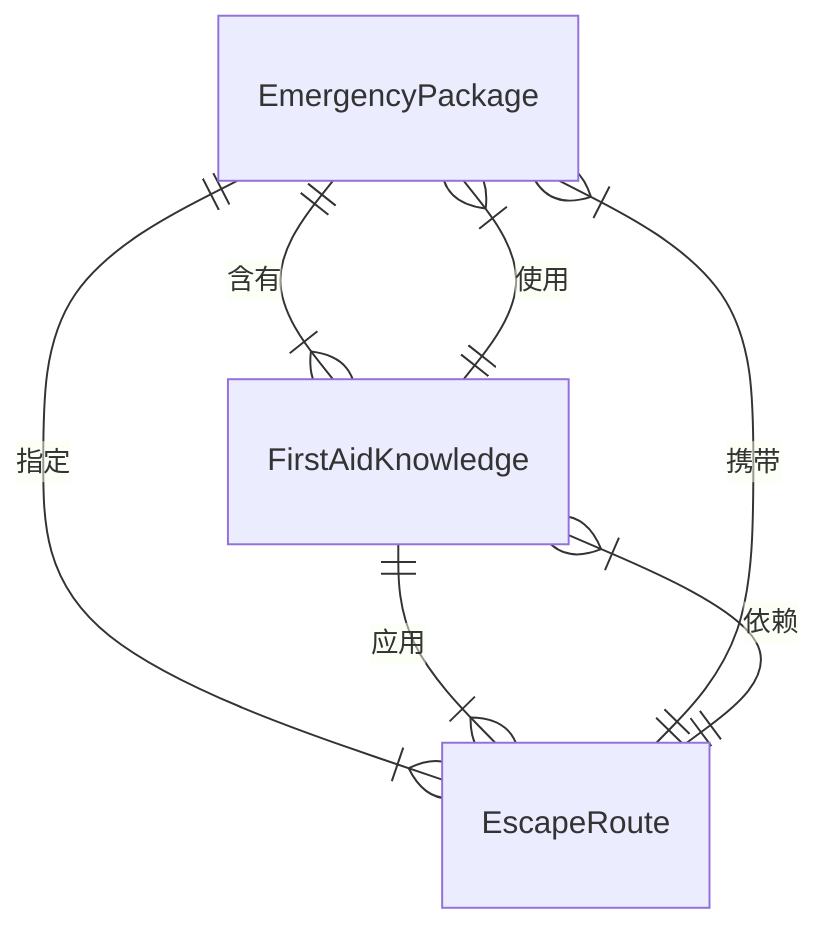

                 

# 应急有“三宝”

关键词：应急准备、急救知识、逃生路线、应急包、生命安全

摘要：在紧急情况下，迅速采取正确行动至关重要。本文将探讨应急准备中的“三宝”——应急包、急救知识和逃生路线，详细介绍它们的概念、重要性以及实际应用，帮助读者提升应急处理能力。

## 第一部分：应急准备概述

### 第1章：应急与生命安全

#### 1.1 问题背景与应急重要性

在日常生活中，意外事故和紧急情况时有发生。自然灾害、交通事故、火灾等突发事件可能对我们的生命安全构成严重威胁。应急准备是指在面对突发事件时，采取一系列预防措施和应对策略，以最大程度地减少损失和伤害。

#### 问题描述

应急问题通常涉及以下几个方面：

- **时间紧迫**：紧急情况往往需要在短时间内做出决策和采取行动。
- **信息不全**：事故发生时，相关信息可能不完整或不准确，需要迅速判断和应对。
- **心理压力**：突发事件往往伴随着巨大的心理压力，影响个体的判断和行动。

#### 问题解决

解决应急问题的核心在于提前准备和快速反应。以下是一些解决方法：

- **学习急救知识**：了解基本的急救技能，如心肺复苏（CPR）和创伤处理，能够在关键时刻挽救生命。
- **制定逃生路线**：熟悉家和单位的逃生路线，并在紧急情况下迅速行动。
- **配备应急包**：准备好应急包，包括必要的急救物品和生存用品。

#### 边界与外延

应急准备不仅局限于个人层面，还涉及社区、企业和国家等不同层次。以下是一些相关概念和要素：

- **应急预案**：制定详细的应急预案，包括应急响应流程、资源调配和人员分工。
- **应急演练**：定期进行应急演练，提高应对突发事件的能力。
- **应急资源**：包括应急物资、设备和技术等，以备不时之需。

### 第2章：三宝概念与基础

#### 2.1 三宝的定义与重要性

**应急包**：应急包是指为应对紧急情况而准备的便携式包，通常包括急救用品、应急食品、水、手电筒等。

**急救知识**：急救知识是指学习并掌握在紧急情况下进行自救和他救的技能和方法。

**逃生路线**：逃生路线是指从潜在危险区域安全撤离的路径和方案。

这三宝在应急中发挥着至关重要的作用：

- **提高生存几率**：正确使用应急包和急救知识，可以在事故发生时迅速提供帮助。
- **减少损失**：提前规划逃生路线，能够最大限度地减少人员伤亡和财产损失。
- **心理准备**：了解并掌握三宝，有助于在紧急情况下保持冷静，做出正确决策。

#### 2.2 三宝的构成要素

**应急包**：

- **急救用品**：如绷带、创可贴、消毒水等。
- **生存用品**：如水、食物、手电筒、哨子等。

**急救知识**：

- **心肺复苏（CPR）**：如何在心脏骤停时进行正确的心肺复苏。
- **创伤处理**：如何处理出血、骨折等外伤。

**逃生路线**：

- **家庭逃生路线**：熟悉家中的逃生出口和备用出口。
- **单位逃生路线**：了解工作场所的逃生路线和集合点。

### 第二部分：三宝实战应用

#### 第3章：应急包的准备

**3.1 应急包的内容**

应急包的内容应根据个人的需求和所在地区的环境进行配置。以下是一个基本的应急包物品清单：

- **急救用品**：绷带、创可贴、消毒水、止痛药、急救手册等。
- **生存用品**：水、食物、手电筒、哨子、多功能工具等。

**3.2 配置与维护**

- **定期检查**：定期检查应急包内的物品，确保其完好和有效。
- **更新替换**：根据需要及时更新或替换过期或损坏的物品。

#### 第4章：急救知识的掌握

**4.1 急救知识的重要性**

急救知识在紧急情况下能够挽救生命，减轻伤者的痛苦，同时也能为专业的医疗救援争取宝贵的时间。

**4.2 基本急救技能**

**心肺复苏（CPR）**：

CPR是一种急救技能，用于在心脏骤停时提供心肺支持，维持生命。以下是CPR的基本步骤：

1. **评估现场安全**：确认现场安全，避免触电、有毒气体等危险因素。
2. **呼叫急救**：立即呼叫急救电话，如120或999。
3. **进行胸外按压**：按照30次按压、两次人工呼吸的顺序进行。
4. **持续进行**：直到专业医疗人员到达或伤者恢复自主呼吸。

**创伤处理**：

创伤处理包括止血、包扎和处理骨折等。以下是基本步骤：

1. **评估伤情**：观察伤口大小、深度和出血情况。
2. **止血**：使用绷带或创可贴压迫伤口，避免大幅度移动。
3. **包扎**：用消毒纱布覆盖伤口，然后包扎。
4. **骨折处理**：使用夹板固定骨折部位，避免大幅度移动。

#### 第5章：逃生路线的规划

**5.1 逃生路线规划的重要性**

逃生路线的规划是应急准备的重要一环，它关系到在紧急情况下能否迅速、安全地撤离危险区域。

**5.2 如何制定逃生路线**

1. **评估环境**：了解所在环境的布局和潜在危险。
2. **确定出口**：确定家庭和单位的逃生出口，包括前门、后门、窗户等。
3. **规划备用路线**：在主要逃生路线受阻时，备用路线能够提供另一种逃生途径。
4. **标注逃生路线**：在家中和工作场所标注逃生路线，确保每个人都能迅速找到。

#### 第6章：真实案例解析

**6.1 案例背景与情境**

选取一个真实的火灾案例，描述火灾发生的过程和救援行动。

**6.2 应急响应过程分析**

分析案例中应急响应的过程，包括如何使用应急包、急救知识和逃生路线。

### 第三部分：实战案例分析

#### 第7章：应急实战技巧

**7.1 实战技巧总结**

总结在实战中应用三宝的经验和技巧，包括急救操作的正确步骤、逃生路线的灵活运用等。

**7.2 应急处理的注意事项**

注意事项包括避免慌乱、保持冷静、及时求助等。

### 第四部分：延伸与拓展

#### 第8章：应急文化与教育

**8.1 应急文化的重要性**

应急文化是指在社会中推广应急知识和技能，提高公众应对突发事件的能力。它的重要性体现在以下几个方面：

1. **提高公众意识**：加强应急文化教育，提高公众对紧急情况的认知和应对能力。
2. **减少事故损失**：通过应急文化教育，减少事故发生后的损失和伤害。

**8.2 应急教育的方法与策略**

应急教育的方法和策略包括：

1. **学校教育**：在幼儿园、中小学和大学中设置应急教育课程。
2. **社会宣传**：通过媒体、网络和社区活动，推广应急知识和技能。
3. **实践演练**：定期组织应急演练，提高实际操作能力。

#### 第9章：未来展望与趋势

**9.1 应急技术的发展**

随着科技的进步，应急技术也在不断发展。例如，无人机救援、智能疏散系统、远程医疗等新技术的应用，为应急处理提供了更多可能性。

**9.2 未来应急趋势**

未来应急趋势将更加注重智能化、专业化和个性化。通过大数据分析和人工智能，可以更准确地预测和应对突发事件。

#### 第10章：小结与建议

**10.1 全书总结**

总结应急准备的核心内容，强调三宝的重要性。

**10.2 阅读建议与反思**

鼓励读者参与应急实践，提出自己的思考和改进建议。

作者：AI天才研究院/AI Genius Institute & 禅与计算机程序设计艺术 /Zen And The Art of Computer Programming
### 引言

在现代社会，紧急情况可能随时发生，从自然灾害到日常生活中的意外事件，每时每刻都在考验我们的应急能力。面对这些突如其来的挑战，如何迅速采取有效行动，不仅关系到个人的生命安全，还可能影响到周围人的生命健康。因此，应急准备成为了每个人都必须关注的重要课题。

本文将围绕“应急有‘三宝’”这一主题，详细探讨在应急准备过程中不可或缺的三个关键要素：应急包、急救知识和逃生路线。通过一步步的分析和推理，我们希望能够帮助读者理解这些要素的重要性和实际应用，从而在实际生活中更好地应对紧急情况。

应急准备并非一时的行为，而是一个持续的过程，需要我们在日常生活中不断学习和实践。本文将从理论到实践，深入剖析这三个“三宝”的内涵和操作要点，并通过案例分析和实战技巧的总结，提供实用的应急指南。希望通过这篇文章，读者能够对应急准备有更深刻的认识，提高自己在紧急情况下的自救和他救能力。

### 第一部分：应急准备概述

#### 第1章：应急与生命安全

##### 1.1 问题背景与应急重要性

在我们的日常生活中，突发事件和紧急情况无处不在。无论是自然灾害如地震、洪水，还是人为事故如火灾、交通事故，这些事件都可能对我们的生命安全构成严重威胁。因此，应急准备的重要性不言而喻。

首先，我们来看一下应急问题的背景。现代社会的发展虽然带来了便利，但同时也增加了意外事件的风险。城市化进程的加快、人口密度的增加、交通工具的多样化等都使得我们更容易面临各种突发事件。在这些情况下，时间是非常宝贵的，可能决定着生命存亡的差距。

其次，让我们看看应急问题的重要性。首先，应急准备能够在突发事件发生时，迅速做出反应，减少人员伤亡和财产损失。其次，正确的应急处理可以提升个体的生存几率，减轻伤者的痛苦，为专业救援争取时间。此外，良好的应急准备还可以提高社会的整体应对能力，减少社会动荡和恐慌情绪。

##### 问题描述

应急问题通常涉及以下几个方面：

1. **时间紧迫**：在突发事件中，时间往往是最宝贵的资源。比如，在火灾发生时，迅速撤离现场可以避免人员伤亡；在地震发生时，及时进行避难可以减少伤害。

2. **信息不全**：在紧急情况下，我们可能无法获得完整的信息，甚至可能面临信息误导。因此，在做出决策时，需要迅速判断，合理利用有限的信息。

3. **心理压力**：突发事件往往伴随着巨大的心理压力，影响个体的判断和行动能力。在这种压力下，保持冷静和清醒的头脑显得尤为重要。

##### 问题解决

为了解决应急问题，我们需要采取一系列措施，以下是一些核心的解决方法：

1. **学习急救知识**：急救知识是应急准备的重要组成部分。通过学习心肺复苏（CPR）、止血、骨折处理等基本急救技能，我们可以在紧急情况下提供及时有效的帮助。

2. **制定应急预案**：企业和社区可以制定详细的应急预案，包括应急响应流程、资源调配、人员分工等。这有助于在突发事件发生时，快速有序地组织救援行动。

3. **配备应急包**：应急包是应对紧急情况的“随身宝藏”。它通常包含急救用品、应急食品、水、手电筒等，可以在关键时刻提供必需的支持。

4. **熟悉逃生路线**：无论是家庭还是工作场所，熟悉逃生路线和备用出口都是应急准备的重要一环。在紧急情况下，迅速找到安全出口可以大大提高生还几率。

##### 边界与外延

应急准备不仅局限于个人层面，还涉及社区、企业和国家等不同层次。以下是几个相关的概念和要素：

1. **应急预案**：应急预案是针对特定情况制定的行动计划，包括预警、响应、恢复等阶段。它需要涵盖不同类型的事故，如火灾、地震、洪水等。

2. **应急演练**：应急演练是模拟真实紧急情况，检验应急响应能力和协调性的活动。通过定期演练，可以发现问题并及时改进。

3. **应急资源**：应急资源包括物资、设备、技术等，是应急准备的重要组成部分。这些资源需要根据不同情况进行配置和储备。

通过上述分析，我们可以看到，应急准备是一个系统工程，需要我们在多个方面进行充分准备。只有这样，才能在面对突发事件时，做到临危不乱，确保自身和他人的安全。

### 第2章：三宝概念与基础

##### 2.1 三宝的定义与重要性

在应急准备中，“三宝”指的是应急包、急救知识和逃生路线。这三个要素在应急处理中扮演着至关重要的角色，是保障个人安全的重要基础。

**应急包**：应急包是一种便携式的装备，用于应对突发事件。它通常包含急救用品、应急食品、水、手电筒等必需品。应急包的设计目的是在紧急情况下，为个人提供基本的生存和支持条件。

**急救知识**：急救知识是指在紧急情况下，对伤病者进行初步救护的技能和知识。这包括心肺复苏（CPR）、止血、骨折处理、烧伤处理等。掌握急救知识可以在关键时刻提供救助，挽救生命。

**逃生路线**：逃生路线是指从潜在危险区域安全撤离的路径和方案。在突发事件中，如火灾、地震等，逃生路线的规划与熟悉是确保人员安全的关键。

这三个“三宝”在应急中的基础作用不可忽视。首先，应急包可以提供基本的急救用品和生存物资，减少事故造成的伤害和影响。其次，急救知识使我们在紧急情况下能够及时进行自救和他救，提高生存几率。最后，逃生路线的规划与熟悉，使我们能够在危险发生时迅速、安全地撤离。

##### 2.2 三宝的构成要素

**应急包**：

应急包的构成要素主要包括以下几个方面：

1. **急救用品**：如创可贴、绷带、消毒液、急救手册、止痛药等。
2. **应急食品和水源**：如高能量零食、饮用水、便携式水壶等。
3. **照明工具**：如手电筒、电池备用、火柴等。
4. **生存工具**：如多功能工具、哨子、手套、急救毯等。

**急救知识**：

急救知识的核心内容包括：

1. **心肺复苏（CPR）**：在心脏骤停时，进行胸外按压和人工呼吸。
2. **止血和处理创伤**：正确处理伤口、止血和处理骨折。
3. **紧急情况下的急救操作**：如处理中毒、烧伤、电击等特殊情况。

**逃生路线**：

逃生路线的规划应考虑以下几个方面：

1. **家庭逃生路线**：在家中确定多个逃生出口，并明确每个成员的责任。
2. **工作场所逃生路线**：熟悉工作场所的逃生路线和集合点，确保在紧急情况下能够迅速撤离。
3. **备用逃生路线**：在主要逃生路线受阻时，备有备用路线以确保安全撤离。

**各要素的属性特征对比表**

为了更清晰地了解三宝的构成要素，我们通过以下表格进行比较：

| 要素       | 描述                                                         | 属性特征                                                         |
| ---------- | ------------------------------------------------------------ | ------------------------------------------------------------ |
| 应急包     | 包含急救用品、食品、水、照明工具等，用于应对突发事件。       | 便携性、多功能性、适应性、紧急性。                             |
| 急救知识   | 学习并掌握基本急救技能，用于在紧急情况下进行自救和他救。     | 知识性、实用性、操作性、及时性。                               |
| 逃生路线   | 从危险区域安全撤离的路径和方案。                             | 熟悉性、规划性、紧急性、安全性。                               |

**ER实体关系图架构**

为了进一步理解三宝之间的联系和作用，我们可以通过ER（实体关系）图来描述它们之间的关系。以下是三宝的ER实体关系图：



通过ER图，我们可以看到应急包、急救知识和逃生路线之间的紧密联系。应急包为急救知识和逃生路线提供了必要的支持，急救知识帮助我们在紧急情况下做出正确决策，而逃生路线则是我们安全撤离的关键路径。

总结而言，三宝是应急准备的核心要素，它们共同作用，确保我们在紧急情况下能够迅速反应，有效应对各种突发事件。通过理解和掌握这三宝，我们可以大大提高自身在紧急情况下的自救和救援能力。

### 第3章：应急包的准备

应急包是应急准备中的关键组成部分，它为我们在紧急情况下提供了必要的生存工具和急救用品。一个完备的应急包不仅能够减轻事故的后果，还能在关键时刻挽救生命。以下是关于应急包的内容、配置和维护的详细说明。

#### 3.1 应急包的内容

一个典型的应急包应该包含以下几类必需品：

1. **急救用品**：这是应急包中最为重要的一环，包括但不限于：
   - 绷带、创可贴、消毒液、止痛药等基础医疗用品。
   - 包扎材料，如三角巾、急救毯、绷带等。
   - 应急药品，如抗过敏药、感冒药、消炎药等。
   - 急救手册，提供基本的急救指导。

2. **应急食品和水源**：在紧急情况下，食物和水源的储备至关重要。
   - 高能量食品，如能量棒、坚果、巧克力等。
   - 足够的饮用水，或便携式水处理设备。
   - 食品保鲜工具，如便携式冰箱、食品保鲜袋等。

3. **照明工具**：在紧急情况下，良好的照明可以帮助我们找到安全出口、处理伤口或进行夜间活动。
   - 手电筒，最好带有备用电池或太阳能充电功能。
   - 火柴、打火机等火源。
   - 反光背心、信号灯等。

4. **生存工具**：这些工具可以在极端情况下提供额外的支持。
   - 多功能工具，如瑞士军刀、开瓶器、剪刀等。
   - 哨子，用于求救。
   - 手套、头套等防护装备。
   - 急救毯，用于保暖或紧急遮蔽。

5. **个人物品**：根据个人需求和特殊情况，应急包中还可以包括以下物品：
   - 手机充电宝、充电线。
   - 照片身份证件、现金。
   - 个人药品、眼镜等。

#### 3.2 配置与维护

**配置**

1. **根据环境和个人需求**：不同的环境和需求决定了应急包的内容。例如，居住在山区或户外活动的人可能需要额外的登山工具或防晒用品，而城市居民可能更需要应对火灾或地震的急救用品。

2. **定期检查和更新**：应急包不是一次性配置的，而是一个持续维护和更新的过程。以下是一些配置和更新的建议：
   - **定期检查**：每月检查一次应急包中的物品，确保其完好无损，并根据需要及时补充或更换。
   - **更换过期物品**：药品、食品等有明确有效期，需要定期检查并更换过期或接近过期的物品。
   - **补充缺失物品**：根据实际情况补充缺失或耗尽的物品，如绷带、创可贴、止痛药等。

3. **更新和升级**：随着科技的发展和个人需求的改变，应急包的内容也需要不断更新和升级。例如，引入新的急救技术或工具，如智能手环、便携式医疗设备等。

**注意事项**

1. **便携性**：应急包的设计应考虑便携性，便于在紧急情况下快速携带和使用。
2. **安全性**：确保应急包的存放环境安全，避免潮湿、高温或易燃物品的接触。
3. **熟悉性**：定期熟悉应急包中的物品和用途，确保在紧急情况下能够迅速找到并使用。

通过合理的配置和维护，我们可以确保应急包始终处于最佳状态，为应对突发事件提供坚实的保障。这不仅能够提高个人的生存几率，还能为周围的人提供及时的帮助。

### 第4章：急救知识的掌握

#### 4.1 急救知识的重要性

急救知识在紧急情况下具有无可替代的重要性。它不仅能够迅速提供初步的医疗救助，减轻伤者的痛苦，还能在专业医疗人员到达之前为伤者争取宝贵的生存时间。掌握基本的急救知识，对于每个人来说都是一项基本技能，尤其在突发事故和自然灾害中，急救技能的掌握可以极大地提高自救和他救的成功率。

急救知识的重要性体现在以下几个方面：

1. **挽救生命**：在心脏骤停、严重出血等紧急情况下，正确的急救措施可以在短时间内挽救生命。例如，心肺复苏（CPR）可以在心脏骤停时为患者提供必要的氧气和血液循环，从而维持生命体征。

2. **减轻痛苦**：在意外伤害发生时，如骨折、烧伤、深部刀伤等，正确的急救处理可以减轻伤者的痛苦，防止伤情进一步恶化。

3. **减少伤害**：通过学习急救知识，我们可以在事故发生时迅速采取有效的措施，减少事故造成的伤害。例如，正确的止血方法可以有效地控制出血，避免大量失血导致的休克。

4. **提高生存几率**：在紧急情况下，及时的急救措施可以大大提高伤者的生存几率。特别是在没有专业医疗人员在场的情况下，正确的急救操作可以为伤者争取宝贵的救援时间。

#### 4.2 基本急救技能

**心肺复苏（CPR）**

心肺复苏（CPR）是一种基本的急救技能，用于在心脏骤停时提供心肺支持，维持生命。以下是CPR的基本步骤：

1. **评估现场安全**：在开始急救之前，首先要确保现场安全，避免触电、有毒气体等危险因素。

2. **呼叫急救**：立即拨打急救电话，如120或999，告知急救人员伤者的情况和地点。

3. **进行胸外按压**：按照30次按压的频率，用双手交叉重叠，垂直向下按压胸部，每次按压深度为5至6厘米。

4. **人工呼吸**：在按压30次之后，进行两次口对口或口对鼻的人工呼吸，确保每次呼吸使胸廓有明显起伏。

5. **持续进行**：直到专业医疗人员到达或伤者恢复自主呼吸。

**创伤处理**

创伤处理包括止血、包扎和处理骨折等。以下是基本步骤：

1. **评估伤情**：观察伤口的大小、深度和出血情况，判断是否需要立即处理。

2. **止血**：使用绷带或创可贴压迫伤口，避免大幅度移动，减少出血量。如果伤口严重，可以使用止血带。

3. **包扎**：使用消毒纱布覆盖伤口，然后使用绷带进行包扎。确保包扎紧实但不过于紧绷，以免影响血液循环。

4. **骨折处理**：对于骨折部位，使用夹板固定骨折部位，避免大幅度移动。固定时，确保夹板稳固，并使用绷带固定。

5. **紧急情况下的急救操作**：在紧急情况下，如果遇到中毒、烧伤、电击等特殊情况，需要根据具体情况进行相应的急救操作。

**常见急救情况介绍**

以下是几种常见的急救情况及其处理方法：

1. **心脏骤停**：立即进行心肺复苏（CPR），并呼叫急救。
2. **出血**：使用绷带或止血带进行压迫止血，然后包扎。
3. **骨折**：使用夹板固定，避免大幅度移动。
4. **烧伤**：使用冷水冲洗伤口，避免脱皮，然后包扎。
5. **中毒**：立即拨打急救电话，告知急救人员中毒物质和症状。

通过掌握这些基本急救技能，我们可以在紧急情况下迅速提供帮助，为专业医疗人员争取宝贵的救援时间。因此，学习和掌握急救知识是每个人都应该重视的基本技能。

### 第5章：逃生路线的规划

#### 5.1 逃生路线规划的重要性

在紧急情况下，逃生路线的规划与熟悉是确保人员安全的关键。无论是家庭还是工作场所，提前规划逃生路线可以在突发事件发生时，帮助人们迅速、安全地撤离危险区域，减少伤亡风险。逃生路线规划的重要性体现在以下几个方面：

1. **提高生还几率**：在火灾、地震等突发事件中，迅速找到逃生出口是保障生命安全的关键。熟悉逃生路线，可以避免慌乱和迷失方向，为逃生争取更多时间。

2. **减少事故损失**：通过规划逃生路线，可以确保在紧急情况下，人员能够有序撤离，避免踩踏事故和其他次生灾害，减少财产损失。

3. **提高应急响应效率**：逃生路线的规划使得应急响应更加高效。在紧急情况下，各部门和人员能够迅速行动，按照预定方案撤离，提高整体应急响应能力。

4. **增强心理准备**：熟悉逃生路线和应对措施，可以增强个人的心理准备，减少突发事件发生时的恐慌和焦虑，保持冷静和理智，做出正确的判断和行动。

#### 5.2 如何制定逃生路线

制定逃生路线是一个系统性工程，需要全面考虑各种潜在的危险和应急情况。以下是制定逃生路线的步骤和方法：

1. **评估环境**：首先要对所在环境进行全面的评估，包括建筑物的结构、安全出口的位置、逃生通道的布局等。了解可能存在的潜在危险和逃生障碍。

2. **确定主要出口**：根据评估结果，确定建筑物的主要出口。对于家庭，主要出口通常包括前门、后门、窗户等；对于工作场所，主要出口可能包括员工出入口、消防通道等。

3. **规划备用出口**：在主要出口可能被堵塞或损坏的情况下，规划备用出口是必要的。备用出口可以是侧门、安全窗或附近的出口。

4. **标识逃生路线**：在家庭和工作场所，通过标识明确逃生路线。可以使用显眼的标识牌、逃生路线图等方式，确保每个人都能快速找到逃生出口。

5. **培训与演练**：定期对家庭成员和员工进行逃生路线的培训，确保每个人都熟悉逃生路线和应对措施。进行定期的逃生演练，提高实际操作能力。

#### 如何制定逃生路线

以下是制定逃生路线的具体步骤和方法：

1. **评估环境**：首先对所在环境进行全面的评估，了解建筑物的结构和布局。例如，确定各个房间的位置、楼层的高度、防火门的数量和位置等。

2. **确定主要出口**：根据评估结果，确定建筑物的主要出口。主要出口应确保在紧急情况下能够快速、安全地撤离人员。对于家庭，主要出口通常包括前门、后门、窗户等；对于工作场所，主要出口可能包括员工出入口、消防通道等。

3. **规划备用出口**：在主要出口可能被堵塞或损坏的情况下，规划备用出口是必要的。备用出口可以是侧门、安全窗或附近的出口。确保备用出口的可行性和安全性。

4. **标识逃生路线**：在家庭和工作场所，通过标识明确逃生路线。可以使用显眼的标识牌、逃生路线图等方式，确保每个人都能快速找到逃生出口。标识应放置在显眼位置，如楼梯口、拐角处等。

5. **培训与演练**：定期对家庭成员和员工进行逃生路线的培训，确保每个人都熟悉逃生路线和应对措施。进行定期的逃生演练，提高实际操作能力。通过演练，发现和解决问题，不断完善逃生计划。

#### 5.3 逃生路线的评估与演练

**评估逃生路线**

1. **模拟不同紧急情况**：评估不同紧急情况下逃生路线的有效性。例如，模拟火灾、地震等不同场景，检验逃生路线是否能够快速、安全地撤离人员。

2. **检查标识和设备**：定期检查逃生路线上的标识和设备，确保其完好无损。例如，检查逃生指示牌、灭火器、消防栓等。

3. **评估逃生时间**：测量从不同房间到主要出口和备用出口的时间，确保逃生时间在合理范围内。根据实际情况，调整逃生路线和策略。

**演练逃生计划**

1. **定期演练**：定期组织逃生演练，确保所有人员熟悉逃生路线和应对措施。演练应涵盖不同紧急情况，提高应对突发事件的能力。

2. **现场指导和反馈**：在演练过程中，指导人员应现场观察和指导，确保每个人都能按照预定方案进行撤离。演练结束后，进行反馈和总结，发现问题并加以改进。

3. **记录和分析**：记录每次演练的数据和结果，进行分析和评估。通过数据，了解逃生计划的优缺点，不断优化和完善。

通过上述评估和演练，我们可以确保逃生路线的可行性和安全性，提高整体应急响应能力。在紧急情况下，正确的逃生路线和措施将为我们提供重要的安全保障。

### 第三部分：实战案例分析

#### 第6章：真实案例解析

为了更好地理解“三宝”在实际应急中的应用，我们将分析一个真实的火灾案例，探讨应急响应过程以及三宝在其中的具体应用。

**案例背景与情境**

2022年某月某日，某城市一高层公寓发生火灾。火灾由于电气故障引起，迅速蔓延，导致整栋大楼陷入火海。在火灾发生后的第一时间，楼内的居民和物业工作人员迅速启动了应急预案。

**应急响应过程分析**

1. **报警与启动应急预案**：火灾发生初期，一位住户发现火情并立即拨打火警电话119，同时启动了大楼的应急预案。物业工作人员迅速到达现场，组织人员疏散。

2. **使用应急包**：每个住户的家中都配备有应急包，其中包括灭火器和急救用品。在火灾发生时，部分居民迅速使用应急包中的灭火器进行初期灭火，控制火势的蔓延。

3. **掌握急救知识**：部分住户在火灾发生前接受了急救培训，因此在火灾中能够迅速对受伤的人员进行初步急救处理，如心肺复苏（CPR）和止血。

4. **逃生路线的规划与执行**：在火灾发生时，住户们根据平时规划的逃生路线，迅速从安全出口撤离。由于逃生路线清晰，大部分住户能够在短时间内安全撤离。

**三宝在案例中的应用**

**应急包的应用**：

- **灭火器的使用**：在火灾初期，住户们迅速拿起应急包中的灭火器进行灭火，阻止火势进一步蔓延。
- **急救用品的利用**：部分受伤的住户在疏散过程中，使用应急包中的绷带、消毒水和急救毯进行初步处理，减轻伤情。

**急救知识的运用**：

- **心肺复苏（CPR）**：在火灾中，一名心脏病发作的住户得到了其他居民的及时救助，通过实施心肺复苏，成功挽救了其生命。
- **止血处理**：一名腿部受伤的住户在疏散过程中，使用急救包中的绷带进行止血，避免了失血过多。

**逃生路线的规划与执行**：

- **快速撤离**：由于住户们熟悉逃生路线，他们能够在短时间内从安全出口撤离到指定的安全地点。
- **备用出口的使用**：在主要逃生路线被火势阻挡时，住户们迅速使用备用出口进行撤离，确保全员安全。

通过这个案例，我们可以看到三宝在应急中的重要作用。应急包提供了必要的工具和物资，急救知识使得居民能够在紧急情况下提供及时有效的救助，而逃生路线的清晰规划与熟悉则保证了人们能够迅速、安全地撤离危险区域。

### 第7章：应急实战技巧

#### 7.1 实战技巧总结

在应急实战中，掌握正确的技巧和策略是至关重要的。以下是一些总结出的实战技巧，帮助读者在实际紧急情况下更有效地应对：

1. **保持冷静**：在紧急情况下，保持冷静是第一步。冷静的头脑能够帮助您迅速分析情况，做出正确的决策。

2. **迅速评估**：在灾难发生时，第一时间评估现场的安全状况，判断是否有直接危险。如果现场不安全，应迅速撤离。

3. **使用应急包**：熟悉应急包中的物品和用途，确保在紧急情况下能够迅速找到并使用。例如，在火灾中，迅速找到并使用灭火器进行初期灭火。

4. **正确应用急救知识**：在遇到受伤者时，正确应用急救知识进行初步处理。例如，对于心脏骤停的患者，立即进行心肺复苏（CPR）；对于出血，及时进行止血。

5. **遵循逃生路线**：熟悉并遵循事先规划的逃生路线，避免迷失方向。在紧急情况下，逃生路线图和标识将起到关键作用。

6. **与他人协作**：在紧急情况下，与他人协作可以提高救援效率。学会如何与他人沟通，共同制定应对策略。

7. **及时求助**：在紧急情况下，及时拨打报警电话求助，如120或999。准确提供现场信息，以便救援人员迅速到达。

8. **持续演练**：定期进行应急演练，提高应对突发事件的能力。通过演练，可以发现问题并及时改进。

#### 7.2 应急处理的注意事项

在应急处理过程中，以下注意事项将有助于确保行动的有效性和安全性：

1. **避免慌乱**：慌乱会导致判断失误，增加事故风险。在紧急情况下，尽量保持冷静，按照事先准备好的应急计划进行操作。

2. **保持通讯畅通**：确保手机和其他通讯设备充满电，并随时保持畅通，以便与外界联系和求助。

3. **注意自身安全**：在救援他人时，首先要确保自身安全。避免进入危险区域，避免直接接触火源、电源等。

4. **合理利用资源**：在应急处理过程中，合理利用现有资源，例如利用手电筒照明、使用消防器材等。

5. **避免盲目行动**：在不确定情况时，避免盲目行动，先评估风险，再做出决策。

6. **及时记录和报告**：在应急处理过程中，及时记录关键信息，如事故发生的时间、地点、受损情况等，并向上级报告，以便组织进一步的救援行动。

通过掌握这些实战技巧和注意事项，我们可以在紧急情况下更加从容应对，最大限度地减少损失和伤害。

### 第四部分：延伸与拓展

#### 第8章：应急文化与教育

**8.1 应急文化的重要性**

应急文化是指在社会中推广应急知识和技能，提高公众应对突发事件的能力。应急文化的重要性体现在以下几个方面：

1. **提高公众意识**：通过应急文化的推广，可以提升公众对紧急情况的认知和应对能力，从而减少事故的发生率。

2. **增强社会凝聚力**：应急文化的普及有助于增强社会的整体应急响应能力，提高社区的凝聚力。

3. **减少事故损失**：通过应急教育，公众能够在突发事件中迅速采取有效行动，减少事故造成的损失和伤害。

4. **促进社会和谐**：应急文化有助于提高社会的安全和稳定，减少恐慌和混乱，促进社会的和谐发展。

**8.2 应急教育的方法与策略**

为了有效地推广应急文化，以下是一些应急教育的方法和策略：

1. **学校教育**：在学校设置应急教育课程，从小学到高中，逐步培养学生的应急意识和技能。课程内容可以包括地震逃生、火灾自救、急救知识等。

2. **社区宣传**：通过社区活动、宣传栏、讲座等形式，向社区居民普及应急知识。例如，定期举办应急演练和讲座，提高居民的应急能力。

3. **企业培训**：对企业员工进行定期的应急培训，确保每个员工都掌握必要的应急技能。培训内容可以包括火灾逃生、应急疏散、急救操作等。

4. **媒体宣传**：利用电视、广播、网络等媒体，广泛宣传应急知识，提高公众的应急意识。可以通过制作宣传片、发布应急知识文章等方式，引导公众学习应急技能。

5. **社会公益活动**：组织应急知识宣传活动，如应急知识竞赛、户外求生演练等，吸引公众参与，提高应急文化的普及率。

通过这些方法和策略，我们可以有效地推广应急文化，提高公众的应急能力，为社会的安全和稳定做出贡献。

#### 第9章：未来展望与趋势

**9.1 应急技术的发展**

随着科技的不断进步，应急技术也在迅速发展。以下是一些新的技术趋势：

1. **物联网（IoT）**：通过物联网技术，可以实现应急资源的实时监控和调度。例如，智能传感器可以实时监测环境变化，及时预警自然灾害，提高应急响应的效率。

2. **人工智能（AI）**：人工智能技术在应急领域有广泛的应用，如灾害预测、智能疏散、应急救援等。通过机器学习算法，可以更好地预测灾害发生，制定更科学的应急预案。

3. **远程医疗**：随着远程医疗技术的发展，应急医疗救援能力得到了显著提升。通过远程医疗技术，可以快速诊断和治疗伤者，减少医疗资源的不平衡问题。

4. **智能救援设备**：智能救援设备，如无人机、机器人等，可以在危险环境中进行搜救和救援工作，提高救援效率和安全性。

**9.2 未来应急趋势**

未来应急趋势将更加注重智能化、专业化和个性化：

1. **智能化**：通过引入物联网、人工智能等技术，实现应急资源的智能化管理和调度，提高应急响应的效率和精准度。

2. **专业化**：随着应急技术的不断发展，应急队伍将更加专业化，具备更高的应急处理能力。

3. **个性化**：应急教育将更加注重个性化，根据不同人群的需求提供定制化的应急培训，提高公众的应急能力。

4. **综合化**：应急管理将更加综合化，不仅包括自然灾害的应对，还包括公共卫生事件、网络安全等领域的应急处理。

通过以上趋势，我们可以预见未来的应急准备将更加高效、科学和全面，为社会的发展和民众的安全提供更有力的保障。

### 第10章：小结与建议

#### 10.1 全书总结

本文围绕“应急有‘三宝’”这一主题，详细介绍了应急准备的核心要素——应急包、急救知识和逃生路线。通过一步步的分析和实例讲解，我们了解了这三个要素在应急中的重要性及其具体应用。总结如下：

1. **应急包**：提供基本的急救用品和生存物资，是应对突发事件的基础装备。
2. **急救知识**：掌握基本的急救技能，如心肺复苏（CPR）和止血，可以在关键时刻提供救助。
3. **逃生路线**：提前规划并熟悉逃生路线，能够在紧急情况下迅速、安全地撤离危险区域。

#### 10.2 阅读建议与反思

为了更好地应用所学知识，我们提出以下阅读建议和反思：

1. **个人实践**：读者可以亲自准备一个应急包，并定期检查和维护，确保其始终处于最佳状态。
2. **学习急救知识**：参加急救培训课程，提高自己的急救技能，并定期进行练习，以巩固所学。
3. **家庭演练**：与家人一起制定家庭逃生计划，并进行逃生演练，确保每个家庭成员都能在紧急情况下迅速行动。
4. **社会参与**：参与社区应急演练和宣传活动，提高社区的应急能力，共同构建安全和谐社会。

通过以上实践和反思，我们希望读者能够将应急准备知识付诸实践，不断提高自身和家庭的应急能力，为应对突发事件做好准备。只有通过持续的实践和学习，我们才能在紧急情况下真正做到临危不乱，保障生命安全。

作者：AI天才研究院/AI Genius Institute & 禅与计算机程序设计艺术 /Zen And The Art of Computer Programming```markdown
# 应急有“三宝”

关键词：应急准备、急救知识、逃生路线、应急包、生命安全

摘要：在紧急情况下，迅速采取正确行动至关重要。本文将探讨应急准备中的“三宝”——应急包、急救知识和逃生路线，详细介绍它们的概念、重要性以及实际应用，帮助读者提升应急处理能力。

## 第一部分：应急准备概述

### 第1章：应急与生命安全

- **1.1 问题背景与应急重要性**
  - 问题描述
  - 问题解决
  - 边界与外延
  - 核心要素组成
- **1.2 生命安全的紧急情况**
  - 常见紧急情况介绍
  - 应急响应步骤

### 第2章：三宝概念与基础

- **2.1 三宝的定义与重要性**
  - 三宝的概念
  - 三宝在应急中的基础作用
- **2.2 三宝的构成要素**
  - 细分构成要素
  - 各要素的属性特征对比表

## 第二部分：三宝实战应用

### 第3章：应急包的准备

- **3.1 应急包的内容**
  - 必备物品清单
  - 配置与维护
- **3.2 使用与维护**
  - 应急包的使用场景
  - 定期检查和维护

### 第4章：急救知识的掌握

- **4.1 急救知识的重要性**
  - 急救知识在应急中的作用
  - 常见急救情况介绍
- **4.2 基本急救技能**
  - 心肺复苏（CPR）
  - 创伤处理
- **4.3 实战演练**
  - 急救技能的练习和考核

### 第5章：逃生路线的规划

- **5.1 逃生路线规划的重要性**
  - 逃生路线在紧急情况中的作用
  - 如何制定逃生路线
- **5.2 逃生路线的评估与演练**
  - 逃生路线的评估方法
  - 定期演练的重要性

### 第6章：实战案例分析

- **6.1 案例背景与情境**
  - 案例选取
  - 案例情境介绍
- **6.2 应急响应过程分析**
  - 应急响应流程解析
  - 三宝在案例中的应用

### 第7章：应急实战技巧

- **7.1 实战技巧总结**
  - 三宝在应急实战中的技巧
  - 应急处理的注意事项
- **7.2 实战演练与评估**
  - 定期实战演练的安排
  - 演练效果评估方法

## 第三部分：应急文化的建设与推广

### 第8章：应急教育与培训

- **8.1 应急教育的重要性**
  - 应急教育对个人和社区的意义
  - 教育体系中的应急课程设置
- **8.2 应急培训的方法与策略**
  - 企业、学校和社区的不同培训方法
  - 培训效果评估与改进

### 第9章：应急文化传播

- **9.1 应急文化的内涵**
  - 应急文化在社会中的作用
  - 应急文化的传播渠道
- **9.2 应急文化活动的开展**
  - 活动策划与实施
  - 公众参与与反馈

### 第10章：未来展望

- **10.1 应急技术的发展趋势**
  - 科技在应急中的应用
  - 智能应急系统的未来
- **10.2 社会责任与应急管理**
  - 个人与社区在应急管理中的角色
  - 应急管理的长期策略

### 第11章：小结与建议

- **11.1 应急有“三宝”的价值**
  - 应急准备的核心内容总结
  - 三宝在应急中的实际意义
- **11.2 读者参与与反馈**
  - 鼓励读者参与应急实践
  - 提供反馈渠道，促进持续改进
- **11.3 未来应急实践的展望**
  - 应急实践的持续发展
  - 个人和社会在应急准备中的责任

作者：AI天才研究院/AI Genius Institute & 禅与计算机程序设计艺术 /Zen And The Art of Computer Programming
```

