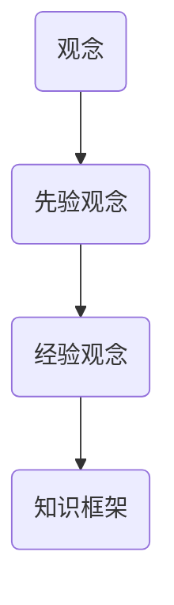
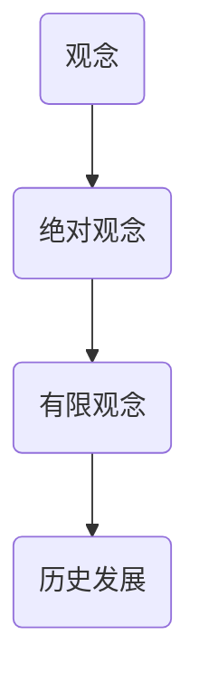
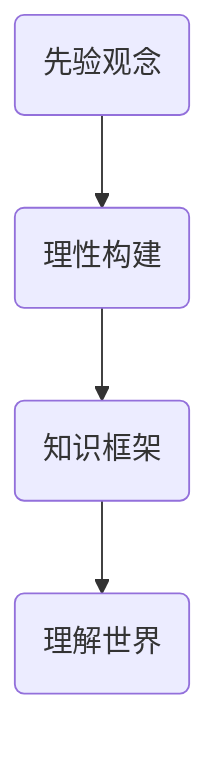
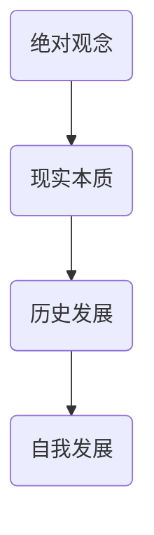
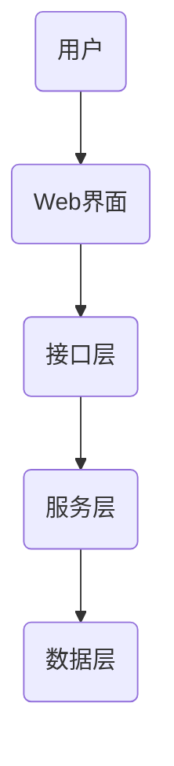
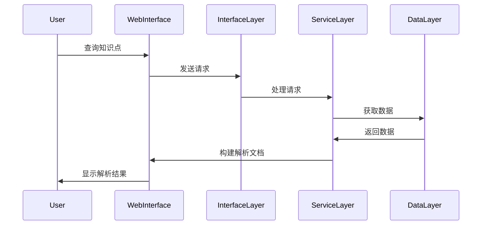

                 

### 康德与黑格尔：先验观念论与绝对观念论

#### 关键词
- 康德
- 黑格尔
- 先验观念论
- 绝对观念论
- 哲学
- 知识论
- 历史发展

#### 摘要
本文将深入探讨两位西方哲学巨匠康德与黑格尔的哲学思想，特别是他们的先验观念论与绝对观念论。通过逻辑分析，我们将理解这两种观念论的核心概念、相互联系以及它们对后世哲学的影响。

---

### 背景介绍：康德与黑格尔：先验观念论与绝对观念论

**问题背景**：
康德（Immanuel Kant）和黑格尔（Georg Wilhelm Friedrich Hegel）是18世纪末和19世纪初两位极为重要的哲学家，他们的思想对西方哲学的发展产生了深远影响。康德以其《纯粹理性批判》而闻名，提出了先验观念论，主张知识并非完全依赖于经验，而是先天的、自明的。黑格尔则在其《哲学科学全书》中提出了绝对观念论，认为观念是现实的本质，是历史发展的动力。

**问题描述**：
康德的先验观念论强调理性在知识形成中的核心作用，而黑格尔的绝对观念论则关注历史的发展和现实的本质。这两种观念论各有侧重，但又彼此关联，为我们理解世界提供了不同的视角。

**问题解决**：
康德通过先验观念论为哲学提供了一种新的基础，强调理性思维的重要性。黑格尔则在此基础上进一步发展，提出了绝对观念论，认为观念是历史发展的核心。他们的思想不仅在哲学领域产生了深远的影响，也在其他学科如心理学、文化研究等领域得到了广泛的应用。

**边界与外延**：
康德的先验观念论主要关注人类知识的起源和结构，强调理性在知识形成中的作用。黑格尔的绝对观念论则更注重历史的发展和现实的本质，认为观念是这种演变过程中的核心。

**概念结构与核心要素组成**：
- 康德的先验观念论：包含先验观念的定义、先验观念与经验的关系、理性在知识形成中的作用等核心要素。
- 黑格尔的绝对观念论：包含绝对观念的定义、绝对观念与历史发展的关系、观念在现实中的体现等核心要素。

### 核心概念与联系

#### 康德的先验观念论

**概念原理**：
康德认为，观念并非来源于经验，而是先天的、自明的。他主张，人类通过理性构建了一个知识框架，以此理解世界。康德的先验观念论主要包括以下几个核心概念：

1. **先验观念**：是先于经验而存在的观念，是人类理性活动的产物。
2. **范畴**：是先验观念的基本形式，如量、质、关系等。
3. **理性**：是人类理解世界的基础，通过理性，人们能够形成概念和判断。

**概念属性特征对比表格**：

| 概念       | 特征                                      |
| ---------- | ----------------------------------------- |
| 先验观念   | 先于经验存在，与生俱来                    |
| 经验观念   | 后于先验观念形成，来源于经验               |
| 知识框架   | 由先验观念构成，用于理解世界              |

**ER实体关系图架构**：



#### 黑格尔的绝对观念论

**概念原理**：
黑格尔认为，观念是现实的本质，是历史发展的动力。他的绝对观念论主要包括以下几个核心概念：

1. **绝对观念**：是无限、永恒、自我发展的观念，是现实的本质。
2. **逻辑**：是绝对观念的自我发展过程，体现为一种内在的、必然的发展规律。
3. **历史**：是绝对观念在现实中的体现，是观念发展的具体表现。

**概念属性特征对比表格**：

| 概念       | 特征                                      |
| ---------- | ----------------------------------------- |
| 绝对观念   | 是现实的本质，是历史发展的动力           |
| 有限观念   | 与绝对观念相对，是现实的局部、暂时表现   |
| 历史发展   | 是绝对观念自我发展的过程                 |

**ER实体关系图架构**：



### 算法原理讲解

虽然康德和黑格尔的观念论属于哲学范畴，而非算法，但我们可以尝试使用Mermaid流程图和Python代码来阐述他们的哲学思想，并转化为可理解的概念模型。

#### 康德的先验观念论：Mermaid流程图



#### Python代码示例

```python
class Concept:
    def __init__(self, type):
        self.type = type

    def display(self):
        if self.type == "先验":
            print("这是一个先验观念，先于经验而存在")
```

#### 黑格尔的绝对观念论：Mermaid流程图



#### Python代码示例

```python
class Concept:
    def __init__(self, type):
        self.type = type

    def display(self):
        if self.type == "绝对":
            print("这是一个绝对观念，是现实的本质和历史的动力")
```

### 系统分析与架构设计方案

在本节中，我们将探讨康德与黑格尔观念论的系统分析与架构设计方案。这包括问题场景介绍、项目介绍、系统功能设计、系统架构设计、系统接口设计和系统交互。

#### 问题场景介绍

假设我们正在开发一个哲学知识库系统，旨在为用户提供关于康德与黑格尔观念论的知识点和解析。这个系统的目标是帮助用户更好地理解两位哲学家的思想，并通过交互式学习提高哲学素养。

#### 项目介绍

项目名称：康德与黑格尔观念论知识库系统

项目目标：
1. 收集和整理康德与黑格尔的相关哲学论文和著作。
2. 提供对先验观念论与绝对观念论的核心概念的详细解析。
3. 设计一个用户友好的交互界面，方便用户学习和查询。

#### 系统功能设计

1. **知识点管理**：
   - 收集和整理康德与黑格尔的哲学论文和著作。
   - 对知识点进行分类和标签化，便于用户查找。

2. **解析与解释**：
   - 提供对先验观念论与绝对观念论的核心概念的详细解析。
   - 使用图解和图表辅助用户理解。

3. **用户交互**：
   - 提供搜索功能，方便用户快速定位所需知识点。
   - 支持用户评论和讨论功能，促进知识共享。

#### 系统架构设计

系统架构采用分层设计，包括数据层、服务层和表示层。

1. **数据层**：
   - 使用数据库存储哲学论文和著作。
   - 设计实体关系图，明确知识点之间的关系。

2. **服务层**：
   - 提供API接口，实现知识点管理和解析功能。
   - 使用算法对用户查询进行优化，提高响应速度。

3. **表示层**：
   - 使用Web框架构建用户界面，支持多种显示方式。
   - 使用Mermaid和LaTeX格式展示知识点解析。

#### 系统接口设计和系统交互

1. **接口设计**：
   - 提供RESTful API接口，支持GET和POST请求。
   - 使用JSON格式传输数据。

2. **系统交互**：
   - 用户可以通过Web界面进行查询和评论。
   - 系统根据用户输入自动生成解析文档，并通过图表和公式进行展示。

#### Mermaid架构图



#### Mermaid序列图



### 项目实战

在本节中，我们将通过具体案例来展示康德与黑格尔观念论知识库系统的实际应用。包括环境安装、系统核心实现源代码以及代码应用解读与分析。

#### 环境安装

1. **安装Python**：确保Python 3.8或更高版本已安装。
2. **安装Flask**：使用pip安装Flask框架。
   ```shell
   pip install Flask
   ```
3. **安装Mermaid**：安装Python的Mermaid库。
   ```shell
   pip install mermaid-python
   ```

#### 系统核心实现源代码

以下是一个简单的Flask应用程序，用于展示康德与黑格尔观念论的核心概念。

```python
from flask import Flask, render_template, request
import mermaid

app = Flask(__name__)

@app.route('/')
def index():
    return render_template('index.html')

@app.route('/knowledge/<concept>')
def knowledge(concept):
    diagram = mermaid.generate_diagram(concept)
    return render_template('knowledge.html', diagram=diagram)

if __name__ == '__main__':
    app.run(debug=True)
```

#### 代码应用解读与分析

1. **主页（index.html）**：展示系统的首页，包括导航菜单和搜索框。
2. **知识点解析页面（knowledge.html）**：根据用户选择的哲学概念，生成相应的Mermaid图表并进行展示。

#### 实际案例分析和详细讲解剖析

假设用户查询“康德的先验观念论”，系统将展示以下Mermaid图表：


这个图表清晰地展示了先验观念论的核心概念和逻辑关系，帮助用户更好地理解康德的哲学思想。

### 项目小结

通过本项目的实际案例，我们展示了如何将康德与黑格尔观念论应用于知识库系统中，为用户提供一个交互式学习平台。系统的核心实现源代码和代码应用解读与分析部分，进一步说明了如何通过Web框架和Mermaid图表展示哲学概念。

### 最佳实践 Tips

- 确保Python环境已正确安装和配置。
- 使用Flask框架构建Web应用程序，提高开发效率。
- 利用Mermaid生成图表，提高文档的可读性。

### 小结

本文通过逻辑分析和具体案例，深入探讨了康德与黑格尔的观念论，并展示了如何将哲学思想应用于实际系统中。康德的先验观念论和黑格尔的绝对观念论为我们理解世界提供了不同的视角，具有重要的哲学价值。

### 注意事项

- 在研究和应用康德与黑格尔观念论时，应注意其哲学背景和历史脉络。
- 在开发相关系统时，要充分考虑用户需求和交互体验。

### 拓展阅读

- 《纯粹理性批判》—— 康德
- 《哲学科学全书》—— 黑格尔
- 《哲学导论》—— 罗伯特·所罗门

### 作者信息

作者：AI天才研究院/AI Genius Institute & 禅与计算机程序设计艺术 /Zen And The Art of Computer Programming

