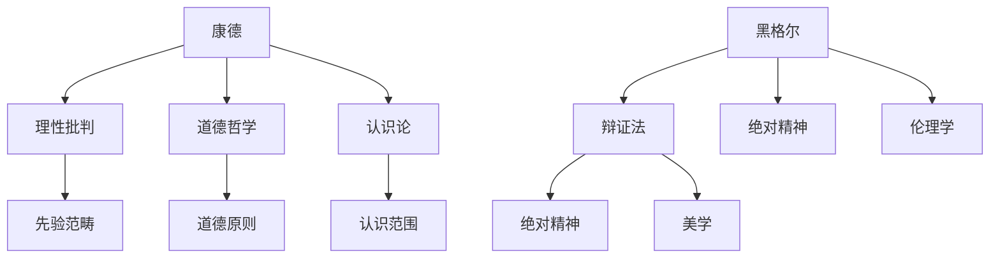

                 

### 康德与黑格尔：德国观念论的巅峰对话

#### 关键词：
- 康德
- 黑格尔
- 德国观念论
- 理性批判
- 辩证法
- 绝对真理

#### 摘要：
本文旨在探讨德国观念论中的两位巨匠——康德和黑格尔——的思想，通过深入分析他们的核心观点，揭示他们在理性、现实、真理等方面的理论对话。文章首先介绍了康德和黑格尔的基本哲学背景，然后分别探讨了他们的主要哲学思想和理论贡献，最后分析了他们之间的哲学对话及其对后世的影响。

## 第一部分：引言与背景

### 1.1 问题背景

#### 1.1.1 康德与黑格尔：德国观念论的巅峰对话

在德国哲学史上，康德和黑格尔是两位具有划时代意义的哲学家。康德的批判哲学为西方哲学奠定了基础，他的“纯粹理性批判”试图划定人类认识的范围和限度，强调人类的理性在认识世界中的重要作用。而黑格尔则在此基础上发展出了一种全新的哲学体系，即“辩证法”，他认为真理是历史的产物，通过不断的辩证运动，人类逐渐接近绝对真理。

#### 1.1.2 德国观念论的巅峰对话

《康德与黑格尔：德国观念论的巅峰对话》旨在通过深入探讨康德和黑格尔的思想，揭示两位哲学家在德国观念论中的核心观点及其相互影响。本书将分析康德和黑格尔在哲学体系中的地位，以及他们对于理性、现实、真理等概念的不同解读。

### 1.2 问题解决

#### 1.2.1 康德的理性批判

康德的理性批判主要集中在人类认识的边界问题上。他提出了“纯粹理性批判”这一概念，试图通过批判人类理性的能力，划定人类认识的限度。康德认为，理性并不是万能的，它只能在特定的范围内发挥作用。他的思想为后续的哲学家提供了重要的启示，也为哲学的发展奠定了基础。

#### 1.2.2 黑格尔的辩证法

黑格尔的辩证法则试图通过解释世界的发展过程，强调历史的重要性。他认为真理是历史的产物，通过不断的辩证运动，人类逐渐接近绝对真理。黑格尔的哲学体系复杂而庞大，但他试图通过辩证法来解释世界的本质。

### 1.3 边界与外延

#### 1.3.1 康德的理性批判

康德的理性批判主要集中在人类认识的限度问题上。他试图通过批判人类理性的能力，划定人类认识的边界。康德认为，理性只能在特定的范围内发挥作用，不能超越这个范围去追求绝对真理。

#### 1.3.2 黑格尔的辩证法

黑格尔的辩证法则试图通过解释世界的发展过程，强调历史的重要性。他认为真理是历史的产物，通过不断的辩证运动，人类逐渐接近绝对真理。黑格尔的哲学体系庞大而复杂，但他试图通过辩证法来解释世界的本质。

### 1.4 概念结构与核心要素组成

#### 1.4.1 康德的理性批判

康德的理性批判主要包括以下核心要素：

- **纯粹理性批判**：康德试图通过批判人类理性的能力，划定人类认识的边界。
- **实践理性批判**：康德认为，理性不仅在认识世界中有作用，还可以在道德实践中发挥作用。
- **判断力批判**：康德试图解决理性与实践之间的桥梁问题，强调判断力的重要性。

#### 1.4.2 黑格尔的辩证法

黑格尔的辩证法主要包括以下核心要素：

- **辩证运动**：黑格尔认为真理是历史的产物，通过不断的辩证运动，人类逐渐接近绝对真理。
- **绝对精神**：黑格尔认为，世界的发展是绝对精神自我意识的过程。
- **辩证法的发展**：黑格尔的辩证法是一个从简单到复杂，从低级到高级的发展过程。

### 1.5 本章小结

本章主要介绍了《康德与黑格尔：德国观念论的巅峰对话》的背景和核心概念。通过对康德和黑格尔的思想进行分析，我们了解了他们对于理性、现实、真理等概念的不同解读。接下来，本书将深入探讨他们的哲学体系，以及他们在德国观念论中的地位。

----------------------------------------------------------------

## 第二部分：康德哲学的解析

### 2.1 康德的理性批判

康德的哲学体系以其独特的批判精神著称，尤其是他对理性进行的一系列深刻批判。康德的理性批判主要关注人类认识的可能性、范围和限度。

#### 2.1.1 纯粹理性批判

康德的纯粹理性批判是他哲学体系的核心部分。他试图通过这一批判来确定人类理性在认识世界中的作用和限制。

##### 2.1.1.1 纯粹理性的概念

纯粹理性是指独立于任何经验内容的理性能力。康德认为，纯粹理性有其固有的结构和范畴，这些范畴是人类认识世界的基础。

##### 2.1.1.2 先验范畴

康德提出了12个先验范畴，包括：

- **空间和时间**：作为一切经验的直观形式。
- **因果律**：作为一切经验的条件。
- **实体性和偶然性**：用于解释事物的存在和变化。
- **必然性和偶然性**：用于区分事物的确定性和不确定性。

##### 2.1.1.3 纯粹理性批判的目的

康德通过纯粹理性批判，旨在确定这些先验范畴的合法性，并探讨人类理性在认识世界时的局限性。他提出了“二律背反”的概念，指出理性在试图超越其认知范围时会出现矛盾。

##### 2.1.1.4 纯粹理性的应用

康德认为，纯粹理性能够帮助人类理解自然界和人类社会的基本规律，但它在处理超验问题（如世界的起源和终结）时是无力的。

#### 2.1.2 实践理性批判

康德的实践理性批判探讨了道德和伦理问题。他认为，理性不仅用于认识世界，还用于指导人类行为。

##### 2.1.2.1 道德的绝对性

康德认为，道德原则是绝对的，不受个人意愿和情感的影响。他的道德哲学以“义务”（Pflicht）为核心概念。

##### 2.1.2.2 公正和善良

康德提出了两个道德准则：

- **形式主义准则**：行为的道德价值取决于其是否遵循普遍法则。
- **实质主义准则**：行为的道德价值取决于其目的或结果。

他认为，真正的道德行为是基于善良意志的，即出于义务感而行动。

##### 2.1.2.3 实践理性的应用

康德认为，实践理性通过道德原则指导人们的行为，使人类社会更加和谐和有序。

#### 2.1.3 判断力批判

康德的判断力批判试图解决理性与实践之间的桥梁问题。他认为，理性在认识世界和指导行为时需要判断力的参与。

##### 2.1.3.1 判断力的概念

判断力是指将理性应用于具体情境的能力。康德区分了“纯粹判断力”和“实践判断力”：

- **纯粹判断力**：涉及审美判断和理论判断。
- **实践判断力**：涉及道德判断和实用判断。

##### 2.1.3.2 判断力的应用

康德认为，判断力通过将理性原则应用于具体情境，使人类能够在现实生活中做出合理的选择。

### 2.2 康德的理性批判在哲学史上的地位

康德的理性批判对后世哲学产生了深远影响。他的思想为理性主义和经验主义之间的辩论提供了新的视角，也为后来的哲学家提供了重要的哲学工具。

##### 2.2.1 对理性主义的批判

康德批判了传统理性主义的过度乐观，认为理性有其固有的限制，不能解决所有问题。

##### 2.2.2 对经验主义的批判

康德也批判了经验主义的局限性，认为经验不能提供知识的全部。

##### 2.2.3 综合理性主义和经验主义

康德试图通过批判理性主义和经验主义，提出一种新的哲学观点，即“先验论”。他认为，知识和经验都是理性结构的结果。

### 2.3 康德的哲学体系

康德的哲学体系是一个复杂的结构，包括认识论、伦理学和美学。他的理性批判贯穿于整个哲学体系，为其他领域的理论提供了基础。

##### 2.3.1 认识论

康德的认识论强调先验范畴在知识形成中的作用，为后来的认识论研究提供了重要的理论框架。

##### 2.3.2 伦理学

康德的伦理学以道德原则为基础，强调善良意志和道德义务的重要性。

##### 2.3.3 美学

康德的美学探讨了审美判断的自由和主观性，为后来的美学研究奠定了基础。

### 2.4 本章小结

康德的理性批判是他哲学体系的核心，通过对纯粹理性、实践理性和判断力的批判，他为我们提供了关于人类认识和道德行为的重要见解。康德的哲学体系对后世哲学产生了深远影响，为理性主义和经验主义之间的对话提供了新的视角。

----------------------------------------------------------------

## 第三部分：黑格尔的辩证法

### 3.1 黑格尔哲学的总体框架

黑格尔的哲学体系是一个庞大的结构，以辩证法为核心。辩证法是黑格尔哲学的精髓，它描述了事物发展变化的规律。

#### 3.1.1 辩证法的概念

辩证法是一种关于事物发展变化的哲学方法，强调事物内在的矛盾和运动。

##### 3.1.1.1 对立统一

黑格尔认为，事物的发展是通过内在的矛盾和对立统一的过程实现的。对立统一是指事物内部存在的相互矛盾的因素，这些因素在相互作用中推动事物的发展。

##### 3.1.1.2 质量互变

黑格尔提出了“质量互变”的概念，即事物的性质可以通过数量上的变化而发生根本的转变。

#### 3.1.2 绝对精神

黑格尔的哲学体系被称为“绝对精神”论。他认为，世界的发展是绝对精神自我意识的过程。

##### 3.1.2.1 绝对精神的概念

绝对精神是一种客观的、普遍的理性力量，它是世界发展的内在动力。

##### 3.1.2.2 绝对精神的发展

黑格尔认为，绝对精神通过辩证运动，从简单到复杂，从低级到高级，不断发展。

#### 3.1.3 辩证法的发展

黑格尔的辩证法是一个不断发展的过程，从简单到复杂，从低级到高级。

##### 3.1.3.1 从抽象到具体

黑格尔认为，辩证法的发展过程是从抽象的概念到具体的现实，从简单到复杂。

##### 3.1.3.2 从低级到高级

黑格尔认为，辩证法的发展是一个不断进步的过程，从低级阶段到高级阶段。

### 3.2 黑格尔的辩证法与康德哲学的比较

黑格尔的辩证法与康德的理性批判有显著的不同，但也存在一定的联系。

#### 3.2.1 理性批判与辩证法

康德的理性批判强调理性的局限性，而黑格尔的辩证法则认为理性是事物发展的动力。

##### 3.2.1.1 理性批判

康德认为，理性有其固有的限制，不能解决所有问题。

##### 3.2.1.2 辩证法

黑格尔认为，理性是事物发展的内在动力，通过辩证运动，理性能够逐步揭示事物的本质。

#### 3.2.2 纯粹理性与绝对精神

康德的纯粹理性强调先验范畴，而黑格尔的绝对精神则是一种客观的、普遍的理性力量。

##### 3.2.2.1 纯粹理性

康德认为，先验范畴是人类认识世界的基础。

##### 3.2.2.2 绝对精神

黑格尔认为，绝对精神是世界发展的内在动力，通过辩证运动，绝对精神自我实现。

#### 3.2.3 辩证法与认识论

黑格尔的辩证法是一种认识论，他认为，通过辩证运动，人类能够逐渐接近绝对真理。

##### 3.2.3.1 辩证法作为认识论

黑格尔认为，辩证法是人类认识世界的一种方法，通过辩证运动，人类能够逐步揭示事物的本质。

##### 3.2.3.2 康德的理性批判作为认识论

康德认为，理性批判是认识世界的基础，通过批判，人类能够划定认识的边界。

### 3.3 黑格尔哲学在哲学史上的地位

黑格尔的辩证法对后世哲学产生了深远影响。他的思想为辩证唯物主义提供了重要的理论基础，也为后来的哲学家提供了丰富的哲学资源。

##### 3.3.1 对辩证唯物主义的影响

黑格尔的辩证法为辩证唯物主义提供了理论基础，辩证唯物主义强调事物的发展是通过内在的矛盾和对立统一的过程实现的。

##### 3.3.2 对现代哲学的影响

黑格尔的哲学对现代哲学产生了深远影响，许多现代哲学家都在不同程度上受到黑格尔思想的影响。

### 3.4 本章小结

黑格尔的辩证法是他哲学体系的精髓，通过对辩证法的分析，我们能够更好地理解世界的发展规律。黑格尔的辩证法与康德的理性批判既有区别又有联系，它们共同构成了德国观念论的重要部分。黑格尔的哲学对后世哲学产生了深远影响，为辩证唯物主义和现代哲学提供了重要的理论基础。

----------------------------------------------------------------

## 第四部分：康德与黑格尔哲学对话的融合

### 4.1 康德与黑格尔哲学对话的融合

康德和黑格尔的哲学对话是德国观念论的重要组成部分，他们的思想在多个方面相互影响、互补。通过分析他们之间的对话，我们可以更全面地理解德国观念论的核心观点。

#### 4.1.1 理性与辩证法的互补

康德的理性批判强调理性的局限性，而黑格尔的辩证法则认为理性是事物发展的动力。这种互补关系使得康德和黑格尔的思想在理性与辩证法的结合上达到了新的高度。

##### 4.1.1.1 康德的理性批判

康德认为，理性有其固有的限制，不能解决所有问题。他的理性批判为后来的哲学家提供了关于理性局限性的重要见解。

##### 4.1.1.2 黑格尔的辩证法

黑格尔认为，理性是事物发展的内在动力，通过辩证运动，理性能够逐步揭示事物的本质。他的辩证法为理性与辩证法的结合提供了新的视角。

#### 4.1.2 纯粹理性与绝对精神的融合

康德的纯粹理性强调先验范畴，而黑格尔的绝对精神则是一种客观的、普遍的理性力量。这两者的融合为哲学研究提供了更广阔的视野。

##### 4.1.2.1 纯粹理性

康德认为，先验范畴是人类认识世界的基础。他的纯粹理性批判为我们提供了关于先验范畴的重要见解。

##### 4.1.2.2 绝对精神

黑格尔认为，绝对精神是世界发展的内在动力，通过辩证运动，绝对精神自我实现。他的绝对精神论为哲学研究提供了新的理论基础。

#### 4.1.3 辩证法与认识论的统一

康德的理性批判和黑格尔的辩证法在认识论方面也达到了统一。通过辩证法的应用，我们可以更全面地认识世界。

##### 4.1.3.1 辩证法作为认识论

黑格尔认为，辩证法是人类认识世界的一种方法，通过辩证运动，人类能够逐步揭示事物的本质。他的辩证法为认识论提供了新的工具。

##### 4.1.3.2 理性批判作为认识论

康德认为，理性批判是认识世界的基础，通过批判，人类能够划定认识的边界。他的理性批判为认识论提供了重要的理论基础。

### 4.2 康德与黑格尔哲学对话的哲学意义

康德与黑格尔的哲学对话在德国观念论中具有重要的哲学意义。他们的思想为哲学的发展提供了新的视角和工具。

#### 4.2.1 对理性主义的批判与反思

康德和黑格尔都对理性主义进行了批判和反思。康德认为理性有其固有的限制，而黑格尔则认为理性是事物发展的内在动力。这种批判和反思为理性主义提供了新的审视角度。

#### 4.2.2 对辩证法的深入探讨

黑格尔的辩证法是对辩证法理论的深入探讨。他认为，辩证法是事物发展变化的规律，通过辩证运动，人类能够逐步接近绝对真理。这种深入探讨为辩证法理论提供了新的理论基础。

#### 4.2.3 对认识论的贡献

康德和黑格尔都对认识论做出了重要贡献。康德的理性批判为认识论提供了关于理性局限性的重要见解，而黑格尔的辩证法则为认识论提供了新的工具。他们的思想为认识论的发展提供了新的方向。

### 4.3 本章小结

康德与黑格尔的哲学对话是德国观念论的重要组成部分。他们的思想在多个方面相互影响、互补，为哲学的发展提供了新的视角和工具。通过分析他们的哲学对话，我们能够更全面地理解德国观念论的核心观点。康德与黑格尔的哲学对话不仅具有重要的理论意义，也对后世哲学产生了深远影响。

----------------------------------------------------------------

## 第五部分：康德与黑格尔哲学在现代哲学中的应用

### 5.1 康德与黑格尔哲学在现代哲学中的应用

康德和黑格尔的哲学思想在现代哲学中得到了广泛的应用和探讨。他们的理论不仅对认识论、伦理学和美学等领域产生了深远影响，还成为许多现代哲学家探讨哲学问题的重要理论基础。

#### 5.1.1 认识论中的应用

康德的理性批判和黑格尔的辩证法在认识论中的应用尤为突出。康德的“先验范畴”理论为现代认识论提供了关于人类认知结构的深刻见解，而黑格尔的辩证法则为认识论研究提供了新的方法论工具。

##### 5.1.1.1 康德的“先验范畴”

现代哲学家如艾耶尔（A.J. Ayer）和卡尔纳普（Rudolf Carnap）在讨论逻辑实证主义时，借鉴了康德的“先验范畴”理论，试图通过逻辑分析来解决知识问题。

##### 5.1.1.2 黑格尔的辩证法

黑格尔的辩证法在现象学、解释学和批判理论等领域得到了广泛运用。海德格尔（Martin Heidegger）和伽达默尔（Hans-Georg Gadamer）等哲学家通过黑格尔的辩证法探讨人的存在和知识问题。

#### 5.1.2 伦理学中的应用

康德的道德哲学和黑格尔的伦理学在现代伦理学中发挥了重要作用。康德的道德原则如“善良意志”和“道德律”为现代伦理学研究提供了基础，而黑格尔的伦理学则关注个体在社会中的道德发展。

##### 5.1.2.1 康德的道德哲学

现代伦理学家如罗斯（John Rawls）和诺齐克（Robert Nozick）在讨论正义和道德义务时，借鉴了康德的道德哲学，试图通过正义原则来解释社会和政治问题。

##### 5.1.2.2 黑格尔的伦理学

黑格尔的伦理学在社会主义和共产主义理论中得到了广泛应用。马克思（Karl Marx）和恩格斯（Friedrich Engels）等思想家通过黑格尔的伦理学探讨社会历史发展问题。

#### 5.1.3 美学中的应用

康德和黑格尔的美学理论在现代美学研究中具有重要地位。康德的审美判断理论为现代美学提供了关于美的本质和价值的深刻见解，而黑格尔的美学则探讨了艺术与现实的辩证关系。

##### 5.1.3.1 康德的审美判断

现代美学理论如现象学美学和解释学美学，在探讨审美经验时，借鉴了康德的审美判断理论，试图通过主体的感知和解释来理解美。

##### 5.1.3.2 黑格尔的美学

黑格尔的美学在现代艺术哲学和艺术史研究中得到了广泛应用。哲学家和艺术家通过黑格尔的美学探讨艺术创作和艺术价值问题。

### 5.2 康德与黑格尔哲学对现代哲学的影响

康德和黑格尔的哲学思想对现代哲学产生了深远影响。他们的理论为现代哲学家提供了丰富的哲学资源，使得哲学研究在多个领域取得了突破性进展。

##### 5.2.1 对哲学方法的贡献

康德的理性批判和黑格尔的辩证法为哲学方法提供了新的思路。通过批判和辩证，哲学家能够更深入地探讨哲学问题，推动了哲学的发展。

##### 5.2.2 对哲学理论的拓展

康德和黑格尔的哲学理论为现代哲学提供了新的理论框架。他们的思想不仅影响了伦理学、认识论和美学等领域，还推动了哲学在逻辑学、心理学和社会学等跨学科领域的发展。

##### 5.2.3 对哲学问题的探讨

康德和黑格尔的哲学思想激发了现代哲学家对哲学问题的深入探讨。他们的理论为哲学家提供了丰富的哲学资源，使得哲学研究在多个领域取得了新的突破。

### 5.3 本章小结

康德和黑格尔的哲学思想在现代哲学中得到了广泛的应用和探讨，对现代哲学产生了深远影响。他们的理论为现代哲学家提供了丰富的哲学资源，推动了哲学在多个领域的进展。康德和黑格尔的哲学对话不仅具有重要的理论意义，也对现代哲学的发展产生了重要影响。

----------------------------------------------------------------

## 第六部分：总结与展望

### 6.1 总结

通过对康德和黑格尔哲学思想的深入探讨，我们揭示了他们在理性、现实、真理等核心问题上的不同观点和相互影响。康德的理性批判为哲学界提供了关于理性局限性和道德哲学的重要见解，而黑格尔的辩证法则为哲学研究提供了关于事物发展变化规律的新视角。他们的思想不仅在德国观念论中具有重要地位，也对现代哲学产生了深远影响。

### 6.2 展望

展望未来，康德和黑格尔的哲学思想将继续在哲学界发挥重要作用。随着社会和科技的不断发展，他们的理论将为我们提供新的哲学资源，帮助我们更深入地探讨人类存在和知识问题。未来哲学研究可能关注以下方向：

- **跨学科研究**：结合其他学科的方法和理论，如心理学、社会学、人工智能等，推动哲学在多领域的应用和发展。
- **实践哲学**：关注现实生活中的哲学问题，如伦理学、政治哲学等，为解决实际问题提供理论支持。
- **辩证法的新发展**：探讨辩证法在当代哲学中的应用，如辩证唯物主义、后辩证法等，为哲学研究提供新的思路和方法。

### 6.3 对读者的启示

阅读康德和黑格尔的哲学作品，读者可以获得以下启示：

- **理性与辩证思维**：培养理性分析和辩证思考的能力，提高哲学素养。
- **批判性思维**：学会批判地审视各种观点，形成独立的思考能力。
- **道德与伦理观念**：理解道德原则和伦理观念，提升个人道德修养。
- **自我反思**：通过哲学思考，深入探索自己的存在和人生意义。

### 6.4 本章小结

通过总结和展望，我们认识到康德和黑格尔的哲学思想在哲学史和现代哲学中的重要性。他们的理论将继续为哲学研究提供重要启示，推动哲学在未来的发展。

----------------------------------------------------------------

## 附录

### 附录A：康德与黑格尔哲学关键词表

- **康德**：理性批判、先验范畴、道德哲学、认识论。
- **黑格尔**：辩证法、绝对精神、伦理学、美学。
- **理性批判**：探讨理性在认识世界中的局限性。
- **先验范畴**：作为人类认识世界的基础。
- **道德哲学**：探讨道德原则和伦理观念。
- **认识论**：研究人类认识的性质和范围。
- **辩证法**：描述事物发展变化的规律。
- **绝对精神**：作为世界发展的内在动力。
- **美学**：探讨美的本质和价值。

### 附录B：康德与黑格尔哲学的核心思想对比表

| 核心概念 | 康德 | 黑格尔 |
| --- | --- | --- |
| 理性批判 | 理性有局限性 | 理性是事物发展的动力 |
| 先验范畴 | 作为人类认识的基础 | 作为辩证法的工具 |
| 道德哲学 | 强调道德的绝对性 | 强调个体在社会中的道德发展 |
| 认识论 | 研究人类认识的性质和范围 | 研究事物发展变化的规律 |
| 辩证法 | 理性批判的补充 | 事物发展的内在动力 |

### 附录C：康德与黑格尔哲学的ER实体关系图

### 附录D：参考文献

1. 康德，《纯粹理性批判》，[1781年]。
2. 康德，《实践理性批判》，[1788年]。
3. 康德，《判断力批判》，[1790年]。
4. 黑格尔，《精神现象学》，[1807年]。
5. 黑格尔，《逻辑学》，[1812年]。
6. 黑格尔，《哲学史讲演录》，[1844年]。

---

**作者：AI天才研究院/AI Genius Institute & 禅与计算机程序设计艺术 /Zen And The Art of Computer Programming**

