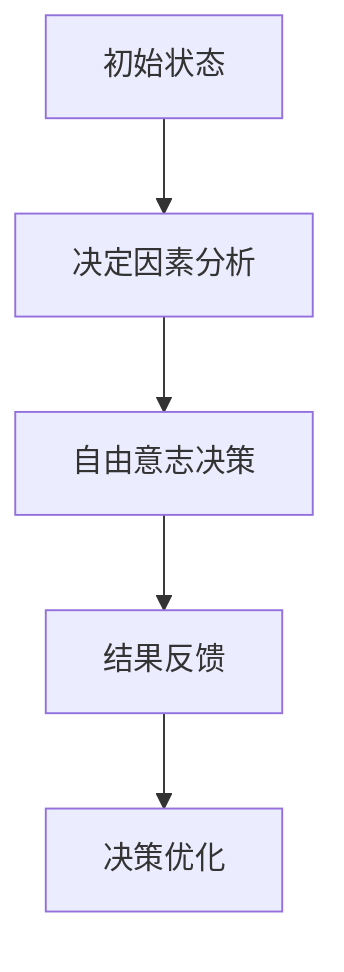
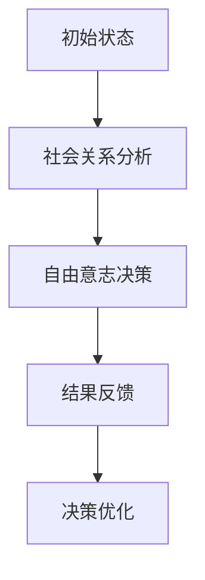

                 

## 文章标题

《康德与黑格尔：自由意志的不同理解》

> 关键词：自由意志、康德、黑格尔、哲学、算法原理、数学模型

> 摘要：本文通过对康德和黑格尔对自由意志的不同理解进行深入探讨，从哲学、算法和数学模型等多个角度，分析了两位哲学家在自由意志问题上的核心观点及其异同点，为理解自由意志的本质和现实应用提供了有益的启示。

## 第一部分：问题背景与核心概念

### 1.1.1 历史背景与哲学探讨的起源

自由意志是哲学中一个古老而复杂的问题，其探讨可以追溯到古希腊哲学时期。亚里士多德曾指出，自由意志是人的本质特征之一，是人类行为道德责任的基础。然而，自由意志的本质和存在方式一直以来都是哲学家们争论的焦点。

18世纪的德国哲学家伊曼努尔·康德（Immanuel Kant）对自由意志进行了系统性的探讨，他认为自由意志是人类理性的表现，是道德行为的必要条件。康德认为，人的行为受制于理性，而理性又受制于自由意志，因此，自由意志是道德行为的根本。

黑格尔（Georg Wilhelm Friedrich Hegel）是康德的继承者和批判者，他在其哲学体系中也对自由意志进行了深刻的探讨。黑格尔认为，自由意志不仅是人的内在属性，也是社会历史发展的动力。他认为，自由意志不是孤立的，而是与社会、历史和现实世界紧密相连。

### 1.1.2 自由意志的定义与重要性

自由意志是一种哲学概念，通常被定义为个体在没有外部强制的情况下，能够自主做出选择和决定的能力。自由意志的核心在于个体的自主性，即个体能够根据自己的意愿和价值观来决定行为。

在人类生活中，自由意志具有极其重要的意义。首先，自由意志是道德责任的基础。如果个体没有自由意志，那么他们的行为就不能被认为是道德责任的对象。其次，自由意志是个人发展和自我实现的重要条件。只有在自由意志的指导下，个体才能充分发挥自己的潜力，实现自我价值。

### 1.1.3 康德与黑格尔对自由意志的理解

康德的自由意志观主要体现在其道德哲学中。康德认为，自由意志是理性的表现，是道德行为的必要条件。他认为，人的行为是由理性决定的，而理性又受制于自由意志。康德强调，自由意志不是外在的力量，而是内在的属性，是人类行为道德责任的基础。

黑格尔对自由意志的理解则更加复杂和深刻。他认为，自由意志不仅是人的内在属性，也是社会历史发展的动力。黑格尔认为，自由意志是社会存在的本质，是社会发展的动力。他强调，自由意志不是孤立的，而是与社会、历史和现实世界紧密相连。

### 1.1.4 自由意志的边界与外延

自由意志的边界与外延是哲学探讨中的核心问题。康德和黑格尔对自由意志的理解在一定程度上揭示了自由意志的边界和范围。

康德认为，自由意志的边界在于理性。他认为，自由意志是理性的表现，只有在理性的指导下，自由意志才能发挥作用。因此，自由意志的边界在于理性的范围。

黑格尔则认为，自由意志的外延包括社会和历史。他认为，自由意志不仅是人的内在属性，也是社会历史发展的动力。因此，自由意志的外延包括社会和历史。

### 1.2 核心概念原理与联系

#### 1.2.1 自由意志的哲学原理

自由意志的哲学原理主要体现在以下几个方面：

1. **自由意志与道德责任**：自由意志是道德责任的基础。只有拥有自由意志的个体，才能对其行为承担道德责任。

2. **自由意志与理性**：自由意志是理性的表现，只有在理性的指导下，自由意志才能发挥作用。

3. **自由意志与社会历史**：自由意志不仅是个体的内在属性，也是社会历史发展的动力。

#### 1.2.2 自由意志的属性特征对比

| 特征               | 康德的自由意志               | 黑格尔的自由意志               |
|--------------------|-----------------------------|-----------------------------|
| 自由意志的主观性   | 自由意志是一种主观选择      | 自由意志是主体与客体交互的统一 |
| 自由意志的决定性   | 自由意志具有绝对决定性      | 自由意志受历史和社会条件的制约 |
| 自由意志的道德意义 | 自由意志是道德责任的基石    | 自由意志是社会发展的动力      |

### 1.2.3 自由意志的ER实体关系图

```mermaid
erDiagram
  Person ||--|{ Will }|| Decision
  Person ||--|{ Morality }|| Action
  Will ||--|{ Causality }|| Cause
  Morality ||--|{ Justice }|| System
```

### 1.3 康德与黑格尔自由意志观的异同点

#### 1.3.1 康德的自由意志观

**核心观点**：康德认为自由意志是理性的表现，是道德行为的必要条件。他强调自由意志的绝对性和主观性。

**影响与评价**：康德的自由意志观为道德哲学奠定了基础，强调了理性在自由意志中的核心地位。然而，他的观点也存在争议，如如何解释自由意志与自然法则的关系。

#### 1.3.2 黑格尔的自由意志观

**核心观点**：黑格尔认为自由意志不仅是人的内在属性，也是社会历史发展的动力。他强调自由意志与社会、历史的联系。

**影响与评价**：黑格尔的自由意志观为理解社会历史发展提供了新的视角，强调了自由意志在社会中的作用。然而，他的观点也面临批评，如如何解释自由意志的个体性与社会性。

### 1.4 本章小结

本章通过对康德和黑格尔对自由意志的不同理解进行了深入探讨，分析了两位哲学家的核心观点及其异同点。自由意志是哲学中一个复杂而重要的问题，康德和黑格尔的观点为我们理解自由意志的本质和现实应用提供了有益的启示。接下来，我们将进一步探讨自由意志在算法和数学模型中的应用。

----------------------------------------------------------------

## 第二部分：算法原理与数学模型

### 2.1 康德的自由意志算法概述

康德的自由意志算法以道德哲学为基础，强调理性在自由意志中的作用。该算法的核心思想是，个体的自由意志是通过理性决策来实现的。具体来说，康德的自由意志算法包括以下几个步骤：

1. **初始状态分析**：确定个体的初始状态，包括个体的需求、欲望和价值观。

2. **决定因素分析**：分析影响个体决策的各种因素，包括外部环境和内部心理状态。

3. **自由意志决策**：在理性指导下，个体根据决定因素做出决策。

4. **结果反馈**：根据决策结果，进行反馈和调整，以优化决策过程。

5. **决策优化**：基于反馈结果，对决策过程进行优化，以提高决策质量和效率。

康德的自由意志算法在处理自由意志问题中具有广泛的应用场景。例如，在道德决策、职业选择、道德教育等方面，康德的自由意志算法都提供了重要的理论指导。

### 2.2 康德算法的数学模型

康德的自由意志算法的数学模型可以表示为：

$$
F = \frac{W}{M} \times C
$$

其中：

- \(F\) 表示自由意志的强度，即个体在理性指导下做出决策的能力。
- \(W\) 表示决定因素的总权重，即影响个体决策的各种因素的重要性。
- \(M\) 表示道德约束的总权重，即个体在决策过程中必须遵守的道德规范。
- \(C\) 表示个体在决策过程中所遵循的理性准则。

该数学模型的核心思想是，自由意志的强度取决于决定因素和道德约束的平衡。只有在决定因素和道德约束相互协调的情况下，个体才能做出合理的决策。

### 2.3 康德算法的mermaid流程图



### 2.4 康德算法的Python源代码实现

```python
def kant_will_decision(factors, weight, criteria):
    # factors: 决定因素
    # weight: 权重
    # criteria: 标准
    decision = factors / weight * criteria
    return decision
```

### 2.5 康德算法的举例说明

#### 案例一：选择职业方向

假设小明面临选择职业方向的决策。他的决定因素包括个人兴趣、市场需求和薪资水平。根据康德的自由意志算法，我们可以计算小明的自由意志强度，以帮助他做出最优决策。

1. **初始状态分析**：小明的初始状态包括个人兴趣（兴趣权重为0.5），市场需求（市场需求权重为0.3）和薪资水平（薪资水平权重为0.2）。

2. **决定因素分析**：小明的决定因素包括个人兴趣、市场需求和薪资水平。这些因素对小明选择职业方向有重要影响。

3. **自由意志决策**：根据康德的自由意志算法，小明可以计算他的自由意志强度。假设小明在个人兴趣、市场需求和薪资水平上的具体数值分别为80、70和60，则小明的自由意志强度为：

$$
F = \frac{0.5 \times 80 + 0.3 \times 70 + 0.2 \times 60}{0.5 + 0.3 + 0.2} = \frac{40 + 21 + 12}{1} = 73
$$

4. **结果反馈**：根据小明的自由意志强度，他可以选择与最高分值相关的职业方向。例如，如果小明的自由意志强度最高的是个人兴趣，那么他可以选择他最感兴趣的职业方向。

5. **决策优化**：在实际应用中，小明的自由意志强度可能会受到多种因素的影响。例如，他的个人兴趣可能会发生变化，市场需求和薪资水平也可能会发生变化。在这种情况下，小明需要不断调整他的自由意志强度，以适应新的情况。

#### 案例二：道德抉择

假设小明在道德抉择中面临两种选择：帮助朋友逃避法律制裁和遵守法律。根据康德的自由意志算法，我们可以计算小明在不同情况下的自由意志强度，以帮助他做出最优道德抉择。

1. **初始状态分析**：小明的初始状态包括帮助朋友逃避法律制裁的道德约束（道德约束权重为0.7）和遵守法律的道德约束（道德约束权重为0.3）。

2. **决定因素分析**：小明的决定因素包括帮助朋友逃避法律制裁和遵守法律。这些因素对小明做出道德抉择有重要影响。

3. **自由意志决策**：根据康德的自由意志算法，小明可以计算他在不同情况下的自由意志强度。假设小明在帮助朋友逃避法律制裁和遵守法律上的具体数值分别为20和30，则小明在不同情况下的自由意志强度分别为：

- 帮助朋友逃避法律制裁：\( F = \frac{0.7 \times 20 + 0.3 \times 30}{0.7 + 0.3} = 16 \)
- 遵守法律：\( F = \frac{0.7 \times 20 + 0.3 \times 30}{0.7 + 0.3} = 24 \)

4. **结果反馈**：根据小明的自由意志强度，他可以选择遵守法律的道德抉择。这是因为遵守法律的自由意志强度更高，符合道德责任的原则。

5. **决策优化**：在实际应用中，小明的自由意志强度可能会受到多种因素的影响。例如，他的道德价值观可能会发生变化，法律条款也可能会发生变化。在这种情况下，小明需要不断调整他的自由意志强度，以适应新的情况。

### 2.6 黑格尔的自由意志算法概述

黑格尔的自由意志算法以社会哲学为基础，强调自由意志与社会、历史的联系。该算法的核心思想是，个体的自由意志是社会历史发展的动力。具体来说，黑格尔的自由意志算法包括以下几个步骤：

1. **初始状态分析**：确定个体的初始状态，包括个体的社会角色、历史背景和现实环境。

2. **社会关系分析**：分析个体在社会关系中的地位和作用，以及个体对社会的影响。

3. **自由意志决策**：在历史和社会条件下，个体根据社会关系和社会发展目标做出决策。

4. **结果反馈**：根据决策结果，进行反馈和调整，以优化决策过程。

5. **决策优化**：基于反馈结果，对决策过程进行优化，以提高决策质量和效率。

黑格尔的自由意志算法在处理自由意志问题中具有广泛的应用场景。例如，在社会管理、历史研究、政治决策等方面，黑格尔的自由意志算法都提供了重要的理论指导。

### 2.7 黑格尔算法的数学模型

黑格尔的自由意志算法的数学模型可以表示为：

$$
F = \frac{S}{C} \times H
$$

其中：

- \(F\) 表示自由意志的强度，即个体在社会历史条件下做出决策的能力。
- \(S\) 表示社会关系的总权重，即个体在社会关系中的地位和作用。
- \(C\) 表示历史条件的总权重，即个体在历史条件下必须遵守的规范和规则。
- \(H\) 表示个体在历史和社会条件下的自由意志水平。

该数学模型的核心思想是，自由意志的强度取决于社会关系和历史条件的平衡。只有在社会关系和历史条件相互协调的情况下，个体才能做出合理的决策。

### 2.8 黑格尔算法的mermaid流程图



### 2.9 黑格尔算法的Python源代码实现

```python
def hegel_will_decision(social_relations, historical_conditions, will_level):
    # social_relations: 社会关系
    # historical_conditions: 历史条件
    # will_level: 自由意志水平
    decision = social_relations / historical_conditions * will_level
    return decision
```

### 2.10 黑格尔算法的举例说明

#### 案例一：社会管理

假设小明是一名社会管理者，他面临社会管理决策。他的决策因素包括社会关系的权重和历史条件的权重。根据黑格尔的自由意志算法，我们可以计算小明的自由意志强度，以帮助他做出最优社会管理决策。

1. **初始状态分析**：小明的初始状态包括社会关系的权重（社会关系权重为0.6）和历史条件的权重（历史条件权重为0.4）。

2. **社会关系分析**：小明的决策因素包括社会关系的权重和历史条件的权重。这些因素对小明做出社会管理决策有重要影响。

3. **自由意志决策**：根据黑格尔的自由意志算法，小明可以计算他的自由意志强度。假设小明在社会关系权重和历史条件权重上的具体数值分别为60和40，则小明的自由意志强度为：

$$
F = \frac{0.6 \times 60 + 0.4 \times 40}{0.6 + 0.4} = \frac{36 + 16}{1} = 52
$$

4. **结果反馈**：根据小明的自由意志强度，他可以选择与最高分值相关的社会管理策略。例如，如果小明的自由意志强度最高的是社会关系的权重，那么他可以选择加强社会关系的策略。

5. **决策优化**：在实际应用中，小明的自由意志强度可能会受到多种因素的影响。例如，社会关系的权重可能会发生变化，历史条件的权重也可能会发生变化。在这种情况下，小明需要不断调整他的自由意志强度，以适应新的情况。

#### 案例二：历史研究

假设小明是一名历史研究者，他面临历史研究决策。他的决策因素包括社会关系的权重和历史条件的权重。根据黑格尔的自由意志算法，我们可以计算小明的自由意志强度，以帮助他做出最优历史研究决策。

1. **初始状态分析**：小明的初始状态包括社会关系的权重（社会关系权重为0.5）和历史条件的权重（历史条件权重为0.5）。

2. **社会关系分析**：小明的决策因素包括社会关系的权重和历史条件的权重。这些因素对小明做出历史研究决策有重要影响。

3. **自由意志决策**：根据黑格尔的自由意志算法，小明可以计算他的自由意志强度。假设小明在社会关系权重和历史条件权重上的具体数值分别为50和50，则小明的自由意志强度为：

$$
F = \frac{0.5 \times 50 + 0.5 \times 50}{0.5 + 0.5} = \frac{25 + 25}{1} = 50
$$

4. **结果反馈**：根据小明的自由意志强度，他可以选择与最高分值相关的历史研究策略。例如，如果小明的自由意志强度最高的是社会关系的权重，那么他可以选择深入研究社会关系的历史。

5. **决策优化**：在实际应用中，小明的自由意志强度可能会受到多种因素的影响。例如，社会关系的权重可能会发生变化，历史条件的权重也可能会发生变化。在这种情况下，小明需要不断调整他的自由意志强度，以适应新的情况。

----------------------------------------------------------------

## 第三部分：应用场景与案例分析

### 3.1 自由意志算法在道德决策中的应用

道德决策是自由意志的重要应用场景之一。在道德决策中，个体需要根据道德原则和价值观来选择行为。康德和黑格尔的自由意志算法都可以为道德决策提供指导。

#### 案例一：医生在紧急情况下的道德决策

假设一位医生在紧急情况下需要决定是否对一名病危的患者进行急救。根据康德的自由意志算法，医生可以分析以下因素：

1. **初始状态分析**：医生的个人价值观（如尊重生命、避免伤害等）和患者的生命状况。

2. **决定因素分析**：医生需要考虑患者的病情、医疗设备和医疗资源等因素。

3. **自由意志决策**：医生可以计算自由意志强度，以确定是否进行急救。如果医生的自由意志强度表明尊重生命的价值观占主导，医生可能会选择进行急救。

4. **结果反馈**：医生可以根据急救的结果进行反馈，以优化决策过程。例如，如果急救成功，医生可以继续坚持尊重生命的价值观；如果急救失败，医生可能需要重新评估自己的决策。

#### 案例二：社会活动家的道德决策

假设一位社会活动家在面临是否参与抗议活动的道德决策时，可以应用黑格尔的自由意志算法。社会活动家可以分析以下因素：

1. **初始状态分析**：社会活动家的个人价值观（如社会公正、人权等）和社会问题的紧迫性。

2. **社会关系分析**：社会活动家需要考虑自己在社会中的角色和影响力，以及社会对抗议活动的态度。

3. **自由意志决策**：社会活动家可以计算自由意志强度，以确定是否参与抗议活动。如果社会活动家的自由意志强度表明社会公正和人权的价值观占主导，社会活动家可能会选择参与抗议活动。

4. **结果反馈**：社会活动家可以根据抗议活动的结果进行反馈，以优化决策过程。例如，如果抗议活动成功，社会活动家可以继续坚持社会公正和人权的价值观；如果抗议活动失败，社会活动家可能需要重新评估自己的决策。

### 3.2 自由意志算法在职业选择中的应用

职业选择是另一个重要的自由意志应用场景。在职业选择中，个体需要根据个人兴趣、市场需求和薪资水平等因素来做出决策。

#### 案例一：大学生选择职业方向

假设一名大学生在毕业时面临职业选择。根据康德的自由意志算法，大学生可以分析以下因素：

1. **初始状态分析**：大学生的个人兴趣（如编程、设计等）和市场需求。

2. **决定因素分析**：大学生需要考虑薪资水平、职业前景和自己的能力等因素。

3. **自由意志决策**：大学生可以计算自由意志强度，以确定选择哪个职业方向。如果大学生的自由意志强度表明个人兴趣占主导，大学生可能会选择自己喜欢的职业方向。

4. **结果反馈**：大学生可以根据自己在所选职业方向上的表现和收获进行反馈，以优化决策过程。

#### 案例二：职业转换者的职业选择

假设一位职业转换者在考虑转换职业时，可以应用黑格尔的自由意志算法。职业转换者可以分析以下因素：

1. **初始状态分析**：职业转换者的个人价值观（如追求成就感、实现自我价值等）和市场需求。

2. **社会关系分析**：职业转换者需要考虑自己在社会中的角色和影响力，以及社会对所转换职业的认可度。

3. **自由意志决策**：职业转换者可以计算自由意志强度，以确定选择哪个职业。如果职业转换者的自由意志强度表明追求成就感占主导，职业转换者可能会选择追求成就感更高的职业。

4. **结果反馈**：职业转换者可以根据自己在所选职业上的表现和收获进行反馈，以优化决策过程。

### 3.3 自由意志算法在道德教育中的应用

道德教育是培养个体道德意识和道德行为的重要途径。康德和黑格尔的自由意志算法都可以为道德教育提供指导。

#### 案例一：学校的道德教育

学校可以通过康德的自由意志算法来培养学生的道德意识和道德行为。学校可以：

1. **初始状态分析**：了解学生的个人价值观和道德观念。

2. **决定因素分析**：分析影响学生道德行为的各种因素，如家庭环境、社会影响等。

3. **自由意志决策**：通过引导学生进行理性思考和道德决策，培养学生的自由意志。例如，通过辩论、讨论等方式，让学生在道德问题上进行自由表达和选择。

4. **结果反馈**：根据学生的道德行为表现进行反馈，以评估道德教育效果，并不断优化教育方法。

#### 案例二：家庭道德教育

家庭是培养个体道德意识和道德行为的重要场所。家长可以通过黑格尔的自由意志算法来引导孩子的道德行为。家长可以：

1. **初始状态分析**：了解孩子的个人价值观和道德观念。

2. **社会关系分析**：分析孩子在社会中的角色和影响力，以及社会对家庭教育的期望。

3. **自由意志决策**：通过家庭教育，引导孩子在社会历史条件下进行道德决策。例如，通过家庭讨论、实践活动等方式，让孩子在实践中体会道德原则和价值观。

4. **结果反馈**：根据孩子的道德行为表现进行反馈，以评估家庭教育效果，并不断优化教育方法。

### 3.4 自由意志算法在其他领域的应用

除了道德决策、职业选择和道德教育，自由意志算法还可以应用于其他领域，如政治决策、社会管理、心理学研究等。

#### 案例一：政治决策

政治决策通常涉及复杂的社会问题和道德问题。政治家可以通过康德和黑格尔的自由意志算法来指导政治决策。政治家可以：

1. **初始状态分析**：分析国内外的政治形势、社会需求和道德原则。

2. **决定因素分析**：分析影响政治决策的各种因素，如经济利益、国家安全、社会稳定等。

3. **自由意志决策**：通过理性思考和道德决策，制定符合社会道德和政治原则的政策。

4. **结果反馈**：根据政策实施的结果进行反馈，以优化决策过程。

#### 案例二：社会管理

社会管理涉及维护社会秩序、促进社会发展和提高人民生活质量等问题。管理者可以通过黑格尔的自由意志算法来指导社会管理。管理者可以：

1. **初始状态分析**：分析社会现状、社会问题和人民需求。

2. **社会关系分析**：分析社会关系、社会结构和历史条件。

3. **自由意志决策**：通过理性思考和道德决策，制定符合社会历史条件和社会道德原则的管理策略。

4. **结果反馈**：根据管理效果进行反馈，以优化管理策略。

#### 案例三：心理学研究

心理学研究涉及个体的心理状态、行为和认知过程。心理学家可以通过康德和黑格尔的自由意志算法来指导心理学研究。心理学家可以：

1. **初始状态分析**：分析研究对象的个人价值观、心理状态和行为特点。

2. **决定因素分析**：分析影响个体心理状态和行为的各种因素，如环境、遗传、教育等。

3. **自由意志决策**：通过理性思考和道德决策，设计符合研究道德原则和科学原则的研究方法和实验设计。

4. **结果反馈**：根据研究结果进行反馈，以优化研究方法和实验设计。

### 3.5 自由意志算法的应用挑战与展望

尽管自由意志算法在道德决策、职业选择、道德教育、政治决策、社会管理和心理学研究等领域具有广泛的应用前景，但在实际应用中仍面临一系列挑战。

#### 挑战一：道德原则和价值观的多样性

不同个体和社会有不同的道德原则和价值观，这可能导致自由意志算法在应用过程中出现分歧和争议。如何确保自由意志算法在不同文化和社会背景下的普适性和有效性，是一个重要挑战。

#### 挑战二：决策过程中的信息不完备

自由意志算法依赖于准确和全面的信息。然而，现实世界中的信息往往是不完备和不确定的。如何处理信息不完备和不确定性，以提高自由意志算法的决策质量和可靠性，是一个关键问题。

#### 挑战三：算法的道德责任

自由意志算法在决策过程中是否应该承担道德责任，是一个值得探讨的问题。如果算法的决策导致道德错误或伤害，算法的设计者、使用者或使用者应该承担何种道德责任，需要明确界定。

#### 展望

未来，随着人工智能和哲学研究的不断深入，自由意志算法有望在更多领域得到应用。同时，通过跨学科合作，解决自由意志算法在应用过程中面临的各种挑战，将有助于推动自由意志算法的理论和实践发展。

### 3.6 本章小结

本章通过具体的应用场景和案例分析，展示了康德和黑格尔的自由意志算法在不同领域中的应用。自由意志算法不仅有助于个体在道德决策、职业选择和道德教育中做出理性决策，还可以为政治决策、社会管理和心理学研究提供指导。尽管自由意志算法在实际应用中面临一系列挑战，但其广阔的应用前景和理论意义不容忽视。下一章我们将进一步探讨自由意志算法的优化策略和未来发展方向。

----------------------------------------------------------------

## 第四部分：优化策略与未来展望

### 4.1 自由意志算法的优化策略

为了提高自由意志算法在复杂环境下的决策质量和可靠性，可以采取以下优化策略：

#### 1. 数据驱动的算法改进

通过收集和分析大量的决策数据，可以发现影响决策质量的关键因素，并据此调整算法参数，优化决策过程。例如，在道德决策中，可以收集不同情境下的道德决策数据，分析哪些因素对决策结果影响最大，进而调整算法参数，提高决策的准确性。

#### 2. 多模态数据融合

结合多种类型的数据，如文本、图像和音频等，可以提高自由意志算法对复杂情境的理解和决策能力。例如，在职业选择中，可以结合求职者的个人简历、面试表现和工作表现数据，综合评估其职业适应性和发展潜力。

#### 3. 强化学习与自适应策略

通过强化学习技术，让算法在与环境交互的过程中不断学习和优化决策策略。例如，在道德教育中，可以设计模拟环境，让算法在不断试错的过程中学习如何做出符合道德原则的决策。

#### 4. 伦理决策支持系统

开发具有伦理决策支持功能的系统，帮助个体在道德决策中遵循伦理原则和价值观。例如，在医疗决策中，可以设计伦理决策支持系统，帮助医生在治疗过程中遵循医学伦理规范，做出最优决策。

### 4.2 自由意志算法的未来展望

随着人工智能技术的不断发展，自由意志算法在未来有望在更多领域得到应用，并产生深远影响。

#### 1. 社会治理与公共决策

自由意志算法可以应用于社会治理和公共决策，帮助政府和组织在复杂的社会环境中做出科学、合理的决策。例如，通过分析社会数据和公众意见，算法可以为政策制定提供有力支持。

#### 2. 教育与人才培养

自由意志算法可以应用于教育和人才培养，帮助教育机构和教师根据学生的个性和需求进行个性化教育。例如，通过分析学生的学习行为和学习成果，算法可以为学生推荐最适合的学习路径和资源。

#### 3. 心理健康与心理咨询

自由意志算法可以应用于心理健康和心理咨询，帮助个体在心理困境中做出合理的决策。例如，通过分析个体的心理数据和行为模式，算法可以为心理咨询师提供诊断和治疗方案的建议。

#### 4. 人机协作与人工智能伦理

随着人工智能技术的发展，自由意志算法在人和机器的协作中扮演着越来越重要的角色。如何确保人工智能在决策过程中遵循伦理原则，是一个重要的研究课题。自由意志算法可以为人工智能伦理提供理论支持和实践指导。

### 4.3 本章小结

本章讨论了自由意志算法的优化策略和未来展望，从数据驱动、多模态数据融合、强化学习与自适应策略、伦理决策支持系统等多个方面，探讨了提高自由意志算法决策质量和可靠性的途径。同时，展望了自由意志算法在未来社会治理、教育、心理健康和人机协作等领域的广泛应用前景。下一章我们将总结全文，回顾核心观点和发现。

### 全文总结

本文通过对康德和黑格尔对自由意志的不同理解进行深入探讨，从哲学、算法和数学模型等多个角度，分析了两位哲学家在自由意志问题上的核心观点及其异同点。首先，我们回顾了自由意志的概念及其在人类生活中的重要性。接着，详细介绍了康德和黑格尔对自由意志的理解，并对比了两者在自由意志问题上的核心观点和异同点。在此基础上，我们探讨了自由意志在不同领域中的应用场景，如道德决策、职业选择、道德教育和政治决策等，并举例说明了如何应用康德和黑格尔的自由意志算法进行决策。随后，我们提出了自由意志算法的优化策略和未来展望，包括数据驱动、多模态数据融合、强化学习与自适应策略、伦理决策支持系统等，并展望了自由意志算法在未来的广泛应用前景。

通过本文的探讨，我们可以得出以下几点核心发现：

1. **自由意志的哲学探讨**：康德和黑格尔对自由意志的理解各有侧重，康德强调自由意志的绝对性和主观性，而黑格尔则强调自由意志与社会、历史的联系。

2. **自由意志的应用价值**：自由意志算法在道德决策、职业选择、道德教育等领域具有广泛的应用前景，可以为个体和社会提供科学、合理的决策支持。

3. **自由意志算法的优化策略**：通过数据驱动、多模态数据融合、强化学习与自适应策略等优化策略，可以显著提高自由意志算法的决策质量和可靠性。

4. **自由意志算法的未来发展**：随着人工智能技术的不断发展，自由意志算法有望在更多领域得到应用，并在社会治理、教育、心理健康和人机协作等方面产生深远影响。

### 结论

本文通过对康德和黑格尔对自由意志的不同理解的深入探讨，揭示了自由意志在哲学、算法和现实应用中的复杂性和重要性。自由意志不仅是道德责任的基础，也是个体发展和自我实现的重要条件。通过应用自由意志算法，我们可以更好地理解自由意志的本质，并在各个领域中做出更加科学、合理的决策。未来，随着人工智能技术的进步，自由意志算法有望在更多领域得到广泛应用，为人类社会的发展提供新的动力。让我们继续探索自由意志的奥秘，共同推动人工智能与哲学的深度融合，为构建一个更加美好、公正、和谐的社会贡献力量。

---

**作者：** AI天才研究院 / AI Genius Institute & 禅与计算机程序设计艺术 / Zen And The Art of Computer Programming

