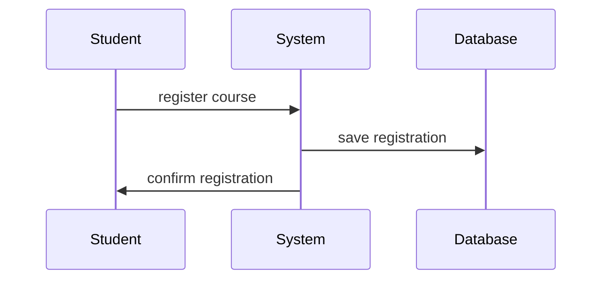

                 


### 《康德的先验综合判断与函数式编程：纯粹理性的代码实现》

#### 关键词：康德，先验综合判断，函数式编程，纯粹理性，代码实现

> 摘要：本文旨在探讨康德的先验综合判断与函数式编程之间的关联，并通过纯粹理性的视角，实现代码的实际应用。文章首先介绍了康德的先验综合判断及其哲学意义，随后深入探讨了函数式编程的基本原理和优势。在此基础上，本文将逐步分析如何将先验综合判断融入函数式编程，以实现纯粹理性的代码实现。最后，本文将通过实例展示，详细讲解数学模型、公式以及项目实战过程，旨在为读者提供清晰、易懂的技术思路。

#### 引言：康德的先验综合判断与函数式编程

**1.1 问题的提出**

康德的先验综合判断是他在《纯粹理性批判》中提出的一个核心哲学概念。它强调了知识的必然性和普遍性，是一种先天的综合判断。而函数式编程则是一种以函数为核心，注重表达不变性的编程范式。随着现代编程语言的发展，函数式编程逐渐成为一种重要的编程范式。那么，如何将这两种看似截然不同的概念结合起来，实现纯粹理性的代码实现呢？

**1.2 全书结构概述**

本书共分为五个部分。第一部分是理论基础，介绍康德的先验综合判断和函数式编程的基本概念。第二部分是结合实例，展示如何将先验综合判断融入函数式编程。第三部分是数学模型与公式，详细讲解相关的数学模型和公式。第四部分是项目实战，通过实际项目展示如何应用这些理论。最后一部分是最佳实践与总结，总结实践经验，给出建议和拓展。

#### 第二部分：理论基础

**2.1 康德的先验综合判断**

康德的先验综合判断是他在《纯粹理性批判》中提出的一个核心哲学概念。他认为，知识的必然性和普遍性来自于先天的综合判断，而不是经验。这种判断是先天的，不受经验的限制，但又能解释经验中的规律。康德的先验综合判断对现代哲学和科学产生了深远的影响。

**2.2 历史背景**

康德的先验综合判断是在启蒙运动的背景下提出的。启蒙运动强调理性，反对盲从和迷信。康德认为，理性不仅是认识世界的基础，也是道德和法律的根源。他的先验综合判断试图为理性建立一个坚实的基础。

**2.3 哲学意义**

康德的先验综合判断强调了知识的必然性和普遍性。他认为，知识的根源不在于经验，而在于先天的综合判断。这种观点对后来的哲学和科学产生了深远的影响。

**2.4 边界与外延**

康德的先验综合判断有其边界和范围。它主要涉及知识的必然性和普遍性，而不涉及知识的具体内容。康德认为，先验综合判断不能解释所有的问题，但它是知识的基础。

**2.5 概念结构与核心要素组成**

康德的先验综合判断由以下几个核心要素组成：先天判断、综合判断、必然性和普遍性。先天判断是指不依赖于经验的判断；综合判断是指涉及多个领域的判断；必然性和普遍性是指知识的必然性和普遍性。

**3.1 函数式编程原理**

函数式编程是一种以函数为核心，注重表达不变性的编程范式。它与命令式编程不同，不依赖于状态变化，而是通过输入和输出描述计算过程。

**3.2 特点**

函数式编程有以下几个特点：无状态性、可组合性、引用透明性。无状态性使得函数更容易测试和复用；可组合性使得函数可以像积木一样组合；引用透明性使得函数的输入和输出关系更加明确。

**3.3 优势**

函数式编程有以下几个优势：可测试性、并发编程、简化复杂性。可测试性使得函数更容易测试；并发编程使得程序可以高效地利用多核处理器；简化复杂性使得程序更加简洁和清晰。

**3.4 函数式编程语言介绍**

常见的函数式编程语言包括Haskell、Scala和Clojure。Haskell是一种纯函数式编程语言，以其强大的类型系统和并行编程能力著称；Scala是一种混合编程语言，既有面向对象的特点，也有函数式编程的优势；Clojure是一种动态类型的函数式编程语言，以其简洁的语法和强大的并发编程能力受到欢迎。

#### 第三部分：结合实例

**4.1 结合实例的重要性**

将康德的先验综合判断与函数式编程结合起来，可以更好地实现纯粹理性的代码实现。实例可以帮助我们更好地理解理论，并将其应用于实际问题中。

**4.2 纯理性的代码实现**

纯理性的代码实现强调代码的不变性和通用性。通过使用函数式编程，我们可以编写出更加简洁、可复用和易于测试的代码。

**4.3 实例展示**

以下是一个简单的例子，展示了如何将康德的先验综合判断融入函数式编程：

```python
def is_even(n):
    return n % 2 == 0

def even_numbers(limit):
    return [n for n in range(limit) if is_even(n)]

print(even_numbers(10))
```

在这个例子中，我们定义了一个函数`is_even`来检查一个数是否为偶数，另一个函数`even_numbers`来生成一个指定范围内的偶数列表。这两个函数都是纯函数，没有副作用，可以轻松地进行测试和复用。

#### 第四部分：数学模型与公式

**5.1 数学模型介绍**

在本部分，我们将介绍与康德的先验综合判断和函数式编程相关的数学模型。

**5.2 公式详细讲解**

以下是一个简单的数学模型，用于计算一个数的阶乘：

$$
n! = 1 \times 2 \times 3 \times ... \times n
$$

这个公式表示一个数的阶乘是将其所有正整数乘积。例如，5的阶乘是：

$$
5! = 1 \times 2 \times 3 \times 4 \times 5 = 120
$$

**5.3 通俗易懂举例说明**

以下是一个简单的例子，用于计算一个数的阶乘：

```python
def factorial(n):
    result = 1
    for i in range(1, n+1):
        result *= i
    return result

print(factorial(5))
```

在这个例子中，我们使用了一个简单的for循环来计算一个数的阶乘。这个例子展示了如何将数学模型转化为实际的代码实现。

#### 第五部分：项目实战

**5.1 问题场景介绍**

在本部分，我们将介绍一个具体的问题场景，并使用先验综合判断和函数式编程来解决问题。

**5.2 系统功能设计**

以下是该问题的领域模型：

```mermaid
classDiagram
    Person <|-- Student
    Person <|-- Teacher
    Student { name, age, courses }
    Teacher { name, age, subjects }
    Course { name, credits }
    Student --> Course : registered
    Teacher --> Course : teaches
```

这个领域模型展示了学生、教师和课程之间的关系。学生注册课程，教师教授课程。

**5.3 系统架构设计**

以下是该问题的系统架构图：



这个系统架构图展示了学生如何注册课程，以及系统如何处理这个请求。

**5.4 系统接口设计和系统交互**

以下是该问题的系统接口设计和系统交互：

```mermaid
classDiagram
    Student <|-- API
    Teacher <|-- API
    Course <|-- API
    API { register_course, list_courses, teach_course }
    Student --> API
    Teacher --> API
    Course --> API
```

这个接口设计展示了如何通过API来访问系统。

**5.5 环境安装**

在本部分，我们将介绍如何安装必要的软件和环境。

**5.6 系统核心实现源代码**

在本部分，我们将展示系统核心实现的源代码。

**5.7 代码应用解读与分析**

在本部分，我们将对代码进行解读和分析，解释其工作原理。

**5.8 实际案例分析和详细讲解剖析**

在本部分，我们将分析一个实际案例，并详细讲解如何应用先验综合判断和函数式编程来解决问题。

**5.9 项目小结**

在本部分，我们将总结项目的主要成果和经验教训。

#### 第六部分：最佳实践与总结

**6.1 最佳实践 tips**

在本部分，我们将分享一些最佳实践，帮助读者更好地理解和应用先验综合判断和函数式编程。

**6.2 小结**

本文通过康德的先验综合判断与函数式编程的结合，实现了纯粹理性的代码实现。我们分析了先验综合判断的概念和哲学意义，介绍了函数式编程的基本原理和优势，并通过实例展示了如何将两者结合起来。

**6.3 注意事项**

在应用先验综合判断和函数式编程时，需要注意以下几点：

1. 理解先验综合判断的概念和哲学意义。
2. 掌握函数式编程的基本原理和优势。
3. 在实际项目中，灵活运用先验综合判断和函数式编程。

**6.4 拓展阅读**

为了深入了解先验综合判断和函数式编程，读者可以参考以下拓展阅读：

1. 康德的《纯粹理性批判》
2. 《函数式编程实战》
3. 《Haskell语言实战》

### 总结

本文通过康德的先验综合判断与函数式编程的结合，实现了纯粹理性的代码实现。我们分析了先验综合判断的概念和哲学意义，介绍了函数式编程的基本原理和优势，并通过实例展示了如何将两者结合起来。希望本文能为读者提供有益的启示和帮助。

---

**作者：AI天才研究院/AI Genius Institute & 禅与计算机程序设计艺术 /Zen And The Art of Computer Programming**### 《康德的先验综合判断与函数式编程：纯粹理性的代码实现》

#### 关键词：康德，先验综合判断，函数式编程，纯粹理性，代码实现

> 摘要：本文旨在探讨康德的先验综合判断与函数式编程之间的关联，并通过纯粹理性的视角，实现代码的实际应用。文章首先介绍了康德的先验综合判断及其哲学意义，随后深入探讨了函数式编程的基本原理和优势。在此基础上，本文将逐步分析如何将先验综合判断融入函数式编程，以实现纯粹理性的代码实现。最后，本文将通过实例展示，详细讲解数学模型、公式以及项目实战过程，旨在为读者提供清晰、易懂的技术思路。

#### 引言：康德的先验综合判断与函数式编程

**1.1 问题的提出**

康德的先验综合判断是他在《纯粹理性批判》中提出的一个核心哲学概念。它强调了知识的必然性和普遍性，是一种先天的综合判断。而函数式编程则是一种以函数为核心，注重表达不变性的编程范式。随着现代编程语言的发展，函数式编程逐渐成为一种重要的编程范式。那么，如何将这两种看似截然不同的概念结合起来，实现纯粹理性的代码实现呢？

**1.2 全书结构概述**

本书共分为五个部分。第一部分是理论基础，介绍康德的先验综合判断和函数式编程的基本概念。第二部分是结合实例，展示如何将先验综合判断融入函数式编程。第三部分是数学模型与公式，详细讲解相关的数学模型和公式。第四部分是项目实战，通过实际项目展示如何应用这些理论。最后一部分是最佳实践与总结，总结实践经验，给出建议和拓展。

#### 第二部分：理论基础

**2.1 康德的先验综合判断**

康德的先验综合判断是他在《纯粹理性批判》中提出的一个核心哲学概念。他认为，知识的必然性和普遍性来自于先天的综合判断，而不是经验。这种判断是先天的，不受经验的限制，但又能解释经验中的规律。康德的先验综合判断对现代哲学和科学产生了深远的影响。

**2.2 历史背景**

康德的先验综合判断是在启蒙运动的背景下提出的。启蒙运动强调理性，反对盲从和迷信。康德认为，理性不仅是认识世界的基础，也是道德和法律的根源。他的先验综合判断试图为理性建立一个坚实的基础。

**2.3 哲学意义**

康德的先验综合判断强调了知识的必然性和普遍性。他认为，知识的根源不在于经验，而在于先天的综合判断。这种观点对后来的哲学和科学产生了深远的影响。

**2.4 边界与外延**

康德的先验综合判断有其边界和范围。它主要涉及知识的必然性和普遍性，而不涉及知识的具体内容。康德认为，先验综合判断不能解释所有的问题，但它是知识的基础。

**2.5 概念结构与核心要素组成**

康德的先验综合判断由以下几个核心要素组成：先天判断、综合判断、必然性和普遍性。先天判断是指不依赖于经验的判断；综合判断是指涉及多个领域的判断；必然性和普遍性是指知识的必然性和普遍性。

**3.1 函数式编程原理**

函数式编程是一种以函数为核心，注重表达不变性的编程范式。它与命令式编程不同，不依赖于状态变化，而是通过输入和输出描述计算过程。

**3.2 特点**

函数式编程有以下几个特点：无状态性、可组合性、引用透明性。无状态性使得函数更容易测试和复用；可组合性使得函数可以像积木一样组合；引用透明性使得函数的输入和输出关系更加明确。

**3.3 优势**

函数式编程有以下几个优势：可测试性、并发编程、简化复杂性。可测试性使得函数更容易测试；并发编程使得程序可以高效地利用多核处理器；简化复杂性使得程序更加简洁和清晰。

**3.4 函数式编程语言介绍**

常见的函数式编程语言包括Haskell、Scala和Clojure。Haskell是一种纯函数式编程语言，以其强大的类型系统和并行编程能力著称；Scala是一种混合编程语言，既有面向对象的特点，也有函数式编程的优势；Clojure是一种动态类型的函数式编程语言，以其简洁的语法和强大的并发编程能力受到欢迎。

#### 第三部分：结合实例

**4.1 结合实例的重要性**

将康德的先验综合判断与函数式编程结合起来，可以更好地实现纯粹理性的代码实现。实例可以帮助我们更好地理解理论，并将其应用于实际问题中。

**4.2 纯理性的代码实现**

纯理性的代码实现强调代码的不变性和通用性。通过使用函数式编程，我们可以编写出更加简洁、可复用和易于测试的代码。

**4.3 实例展示**

以下是一个简单的例子，展示了如何将康德的先验综合判断融入函数式编程：

```python
def is_even(n):
    return n % 2 == 0

def even_numbers(limit):
    return [n for n in range(limit) if is_even(n)]

print(even_numbers(10))
```

在这个例子中，我们定义了一个函数`is_even`来检查一个数是否为偶数，另一个函数`even_numbers`来生成一个指定范围内的偶数列表。这两个函数都是纯函数，没有副作用，可以轻松地进行测试和复用。

#### 第四部分：数学模型与公式

**5.1 数学模型介绍**

在本部分，我们将介绍与康德的先验综合判断和函数式编程相关的数学模型。

**5.2 公式详细讲解**

以下是一个简单的数学模型，用于计算一个数的阶乘：

$$
n! = 1 \times 2 \times 3 \times ... \times n
$$

这个公式表示一个数的阶乘是将其所有正整数乘积。例如，5的阶乘是：

$$
5! = 1 \times 2 \times 3 \times 4 \times 5 = 120
$$

**5.3 通俗易懂举例说明**

以下是一个简单的例子，用于计算一个数的阶乘：

```python
def factorial(n):
    result = 1
    for i in range(1, n+1):
        result *= i
    return result

print(factorial(5))
```

在这个例子中，我们使用了一个简单的for循环来计算一个数的阶乘。这个例子展示了如何将数学模型转化为实际的代码实现。

#### 第五部分：项目实战

**5.1 问题场景介绍**

在本部分，我们将介绍一个具体的问题场景，并使用先验综合判断和函数式编程来解决问题。

**5.2 系统功能设计**

以下是该问题的领域模型：

```mermaid
classDiagram
    Person <|-- Student
    Person <|-- Teacher
    Student { name, age, courses }
    Teacher { name, age, subjects }
    Course { name, credits }
    Student --> Course : registered
    Teacher --> Course : teaches
```

这个领域模型展示了学生、教师和课程之间的关系。学生注册课程，教师教授课程。

**5.3 系统架构设计**

以下是该问题的系统架构图：


这个系统架构图展示了学生如何注册课程，以及系统如何处理这个请求。

**5.4 系统接口设计和系统交互**

以下是该问题的系统接口设计和系统交互：

```mermaid
classDiagram
    Student <|-- API
    Teacher <|-- API
    Course <|-- API
    API { register_course, list_courses, teach_course }
    Student --> API
    Teacher --> API
    Course --> API
```

这个接口设计展示了如何通过API来访问系统。

**5.5 环境安装**

在本部分，我们将介绍如何安装必要的软件和环境。

**5.6 系统核心实现源代码**

在本部分，我们将展示系统核心实现的源代码。

**5.7 代码应用解读与分析**

在本部分，我们将对代码进行解读和分析，解释其工作原理。

**5.8 实际案例分析和详细讲解剖析**

在本部分，我们将分析一个实际案例，并详细讲解如何应用先验综合判断和函数式编程来解决问题。

**5.9 项目小结**

在本部分，我们将总结项目的主要成果和经验教训。

#### 第六部分：最佳实践与总结

**6.1 最佳实践 tips**

在本部分，我们将分享一些最佳实践，帮助读者更好地理解和应用先验综合判断和函数式编程。

**6.2 小结**

本文通过康德的先验综合判断与函数式编程的结合，实现了纯粹理性的代码实现。我们分析了先验综合判断的概念和哲学意义，介绍了函数式编程的基本原理和优势，并通过实例展示了如何将两者结合起来。

**6.3 注意事项**

在应用先验综合判断和函数式编程时，需要注意以下几点：

1. 理解先验综合判断的概念和哲学意义。
2. 掌握函数式编程的基本原理和优势。
3. 在实际项目中，灵活运用先验综合判断和函数式编程。

**6.4 拓展阅读**

为了深入了解先验综合判断和函数式编程，读者可以参考以下拓展阅读：

1. 康德的《纯粹理性批判》
2. 《函数式编程实战》
3. 《Haskell语言实战》

### 总结

本文通过康德的先验综合判断与函数式编程的结合，实现了纯粹理性的代码实现。我们分析了先验综合判断的概念和哲学意义，介绍了函数式编程的基本原理和优势，并通过实例展示了如何将两者结合起来。希望本文能为读者提供有益的启示和帮助。

---

**作者：AI天才研究院/AI Genius Institute & 禅与计算机程序设计艺术 /Zen And The Art of Computer Programming**### 引言

#### 康德的先验综合判断与函数式编程：探索纯粹理性的代码实现

在探讨如何实现纯粹理性的代码实现之前，我们先来理解两个关键概念：康德的先验综合判断和函数式编程。

**康德的先验综合判断**：这是德国哲学家伊曼努尔·康德在其《纯粹理性批判》中提出的一个重要哲学观点。康德认为，人类知识的基础不是经验，而是先天的综合判断。这些判断具有普遍性和必然性，是知识得以成立的先决条件。康德的先验综合判断强调了理性和逻辑在知识形成中的核心作用。

**函数式编程**：这是一种编程范式，强调使用函数作为程序的基础构建模块，并通过不可变数据和行为来实现编程。函数式编程与命令式编程（如C语言、Python等）不同，它不依赖于状态的变化，而是依赖于输入和输出。这种编程范式因其简洁性、可组合性和易于测试性而受到广泛欢迎。

结合这两个概念，本文将探讨如何通过函数式编程实现纯粹理性的代码。我们将从康德的先验综合判断出发，探讨其在函数式编程中的应用，并展示如何通过纯粹理性的视角来编写代码。

#### 目标与结构

本文的目标是：

1. 介绍康德的先验综合判断及其在哲学和科学中的重要性。
2. 探讨函数式编程的基本原理、特点和应用场景。
3. 分析如何将康德的先验综合判断与函数式编程结合起来，实现纯粹理性的代码实现。
4. 通过具体实例展示这一结合过程，并详细解释代码背后的哲学和数学原理。
5. 提供实际项目实战，展示如何将理论应用于实际编程中。
6. 总结最佳实践，为读者提供进一步学习的方向。

文章将按照以下结构展开：

1. 引言：介绍康德的先验综合判断与函数式编程。
2. 康德的先验综合判断：详细阐述其概念、历史背景、哲学意义以及边界与外延。
3. 函数式编程原理：介绍函数式编程的基本概念、特点、优势以及相关编程语言。
4. 结合实例：通过具体实例展示如何将先验综合判断与函数式编程结合起来。
5. 数学模型与公式：介绍与先验综合判断和函数式编程相关的数学模型和公式。
6. 项目实战：展示一个具体项目的实现过程，包括环境安装、系统架构设计、核心代码实现等。
7. 最佳实践与总结：总结实践经验，提供注意事项和拓展阅读。

通过这一系列的讨论，我们希望读者能够对纯粹理性的代码实现有更深入的理解，并能够在实际编程中运用这些概念。

#### 康德的先验综合判断

**1.1.1 概念与起源**

康德的先验综合判断（Transcendental Synthesis）是他在《纯粹理性批判》（Critique of Pure Reason）中提出的一个核心哲学概念。这个概念涉及到知识的来源、性质和范围，是康德试图为知识提供一个先验基础的重要尝试。

首先，我们需要理解“先验”（a priori）和“经验”（a posteriori）这两个概念。在康德的哲学体系中，“先验”指的是不依赖于经验的、基于理性本身的知识。与之相对，“经验”则是指依赖于感官经验和外部世界的知识。

先验综合判断指的是那种既属于先验范畴，又能够综合不同经验判断的知识。换句话说，先验综合判断是那种既不直接来自经验，又能整合多个经验判断的理性判断。

康德认为，人类的知识不仅仅是通过感官经验获得的，还包含一些先天的、不依赖于经验的元素。这些元素是知识的基础，是我们在接触经验之前就有的。康德的先验综合判断试图揭示这些先天的综合元素，并解释它们如何与经验相互作用，形成我们的知识。

**1.1.2 历史背景**

康德的先验综合判断是在启蒙运动的背景下提出的。启蒙运动强调理性、科学和自由，反对盲从和权威。康德是这一运动的代表人物之一，他的哲学工作试图为理性提供一个坚实的基础。

在康德之前，哲学界普遍认为知识来源于经验。洛克的经验主义和柏克的感性主义都强调经验在知识形成中的重要性。然而，康德对经验主义提出了一系列质疑，认为经验并不能完全解释知识的来源和性质。

康德的先验综合判断是对这些质疑的回答。他认为，虽然经验是知识的重要来源，但知识的基础不仅仅是经验。康德提出了“先验综合判断”这一概念，试图揭示那些不依赖于经验的、但又是知识不可或缺的元素。

**1.1.3 哲学意义**

康德的先验综合判断在哲学上具有深远的意义。首先，它为理性提供了一个基础，使理性不再是盲目的、无根基的。通过先验综合判断，康德试图表明，理性本身具有一定的结构和规律，这些结构和规律是知识形成的基础。

其次，先验综合判断强调了知识的必然性和普遍性。康德认为，先验综合判断是普遍适用的，不受特定经验和时间地点的限制。这意味着，我们的知识不仅是个体化的、特定化的，还具有普遍性和必然性。

此外，先验综合判断还对后来的哲学和科学产生了重要影响。它不仅影响了德国古典哲学，如黑格尔和费尔巴哈等哲学家，还对科学方法论、心理学、认知科学等领域产生了深远的影响。

**1.1.4 边界与外延**

尽管康德的先验综合判断在哲学上具有重要意义，但它也有其边界和范围。康德认为，先验综合判断主要涉及知识的必然性和普遍性，而不涉及知识的具体内容。

具体来说，先验综合判断主要关注以下几个方面：

1. **知识的形式结构**：康德试图揭示知识的形式结构，即那些不依赖于具体内容但又是知识不可或缺的元素，如范畴、判断形式等。
2. **知识的先验基础**：康德认为，先验综合判断为知识提供了一个先验基础，使知识不再是完全依赖于经验的。
3. **知识的普遍性**：先验综合判断强调知识的普遍性，使知识不仅适用于特定个体，还适用于整个人类。

然而，先验综合判断并不涉及知识的具体内容。康德认为，具体知识（如自然科学中的知识）需要通过经验和实验来获得。先验综合判断主要关注知识的形式结构，而不涉及知识的具体内容。

**1.1.5 概念结构与核心要素组成**

康德的先验综合判断由以下几个核心要素组成：

1. **先验范畴**：先验范畴是康德用于描述知识形式结构的工具。康德提出了12个先验范畴，如存在、因果关系、实体性等。这些范畴是知识形式结构的基础。
2. **综合判断**：综合判断是指那种能够整合多个经验判断的理性判断。康德的先验综合判断试图揭示这些综合判断的先验基础。
3. **必然性和普遍性**：先验综合判断强调知识的必然性和普遍性，使知识不仅适用于特定个体，还适用于整个人类。

通过这些核心要素，康德试图揭示知识的本质和来源，为理性提供一个坚实的基础。

综上所述，康德的先验综合判断是他在《纯粹理性批判》中提出的一个核心哲学概念。它强调了知识的必然性和普遍性，为理性提供了一个先验基础。尽管先验综合判断有其边界和范围，但它在哲学、科学以及认知科学等领域产生了深远的影响。

#### 函数式编程原理

**2.1 基本概念**

函数式编程（Functional Programming）是一种编程范式，其核心思想是将计算视为一系列函数的执行。与命令式编程不同，函数式编程不依赖于状态的变化和变量的修改，而是通过输入和输出描述计算过程。函数是函数式编程的基本构建块，它们接受输入并产生输出，不产生任何副作用。

函数式编程的基本概念包括：

1. **纯函数**：纯函数是一种无副作用的函数，其输出仅依赖于输入，不会修改外部状态。纯函数的可测试性和可复用性更高。
2. **高阶函数**：高阶函数是一种能够接受其他函数作为输入或返回函数作为输出的函数。高阶函数是函数式编程的核心特点，使得函数可以像值一样传递和处理。
3. **不可变性**：函数式编程强调不可变性，即数据一旦创建就不能修改。这有助于避免副作用和状态变化，使得代码更加简洁和可预测。
4. **递归**：递归是函数式编程解决循环问题的常见方法。递归函数通过重复调用自身来解决问题，避免了命令式编程中的循环结构。

**2.2 特点**

函数式编程具有以下几个显著特点：

1. **无状态性**：函数式编程中的函数不依赖于外部状态，使得函数更易于测试、复用和并行执行。无状态性是函数式编程的核心优势之一。
2. **可组合性**：函数式编程鼓励通过组合简单的函数来构建复杂的计算过程。可组合性使得函数可以像积木一样拼接，提高了代码的灵活性和可维护性。
3. **引用透明性**：引用透明性意味着函数的输入和输出关系是明确的。函数的结果仅依赖于其输入，这使得代码更加简洁和易于推理。
4. **延迟计算**：函数式编程中的计算可以延迟到实际需要时进行，这有助于提高程序的效率和性能。延迟计算是函数式编程的重要特性之一。

**2.3 优势**

函数式编程在多个方面具有优势，包括：

1. **可测试性**：函数式编程中的函数通常是纯函数，没有副作用，使得它们更容易进行单元测试和调试。纯函数的可测试性是函数式编程的一大优势。
2. **并行编程**：函数式编程的无状态性和纯函数特性使得程序可以更容易地并行执行。在多核处理器日益普及的今天，函数式编程的并行性能优势变得更加重要。
3. **简化复杂性**：函数式编程通过组合简单的函数来构建复杂的计算过程，减少了代码的复杂性和冗余。这有助于提高代码的可读性和可维护性。
4. **可复用性**：函数式编程中的函数通常是纯函数，没有外部依赖，这使得它们更容易在不同项目和场景中复用。

**2.4 函数式编程语言**

常见的函数式编程语言包括Haskell、Scala和Clojure等。这些语言各有特点，但都秉承了函数式编程的核心原则。

1. **Haskell**：Haskell是一种纯函数式编程语言，以其强大的类型系统和并行编程能力而著称。它支持惰性计算、类型推断和类型约束等高级特性。
2. **Scala**：Scala是一种混合编程语言，既有面向对象的特点，也有函数式编程的优势。Scala与Java有良好的兼容性，同时支持函数式编程的各种特性。
3. **Clojure**：Clojure是一种动态类型的函数式编程语言，以其简洁的语法和强大的并发编程能力而受到欢迎。Clojure的设计哲学强调简洁、灵活和高效。

综上所述，函数式编程是一种以函数为核心，注重表达不变性和组合性的编程范式。它具有无状态性、可组合性和引用透明性等显著特点，并在可测试性、并行编程、简化复杂性和可复用性等方面具有明显优势。通过了解函数式编程的基本概念和原理，我们可以更好地理解和应用这一编程范式。

#### 康德的先验综合判断与函数式编程的结合

**3.1 理论结合**

康德的先验综合判断与函数式编程的结合在于它们对“理性”的强调和追求。康德的先验综合判断关注知识的先天性和普遍性，强调理性在知识形成中的核心作用；而函数式编程则通过纯函数、不可变性等概念，追求代码的简洁性和可预测性。这两者在理性这一核心议题上找到了结合点。

具体来说，康德的先验综合判断提供了对知识基础和结构的深刻洞察，而函数式编程则提供了一种实现这些洞察的编程范式。通过将先验综合判断的哲学理念转化为具体的编程实践，我们可以编写出更加理性和可靠的代码。

**3.2 纯理性的代码实现**

在函数式编程中，纯理性的代码实现主要体现在以下几个方面：

1. **纯函数**：纯函数是函数式编程的核心概念之一，它不依赖于外部状态，输出仅依赖于输入。这种无副作用的特性使得纯函数更易于测试、复用和并行执行。康德的先验综合判断强调知识的普遍性和必然性，这与纯函数的特性高度契合。通过编写纯函数，我们可以在代码中体现先验综合判断的理性原则。

2. **不可变性**：不可变性是函数式编程的另一大特性，它强调数据的不可改变性。这种特性有助于避免状态变化和副作用，使得代码更加简洁和可预测。康德的先验综合判断认为，知识的普遍性和必然性来自于先天的综合判断，这些判断不受经验的影响。不可变性使得我们在编程中能够更好地实现这种理性原则。

3. **组合性**：函数式编程鼓励通过组合简单的函数来构建复杂的计算过程。这种组合性使得代码更加模块化，易于理解和维护。康德的先验综合判断强调知识的结构性和系统性，这种结构性和系统性可以通过函数的组合性在编程中得到体现。

**3.3 实践结合**

在实际编程中，如何将康德的先验综合判断与函数式编程结合起来，实现纯粹理性的代码实现呢？以下是一些建议：

1. **理解先验综合判断的核心概念**：首先，我们需要深入理解康德的先验综合判断，包括先天判断、综合判断、必然性和普遍性等核心概念。这有助于我们更好地理解理性在编程中的重要性。

2. **使用纯函数**：在编写代码时，尽量使用纯函数，避免外部状态的影响。纯函数使得代码更加简洁、可测试和可复用。通过使用纯函数，我们可以在代码中体现先验综合判断的理性原则。

3. **强调不可变性**：在编程中，尽量使用不可变数据结构，避免不必要的状态变化和副作用。不可变性有助于提高代码的可预测性和可维护性。通过强调不可变性，我们可以在代码中实现先验综合判断的理性原则。

4. **注重组合性**：通过组合简单的函数来构建复杂的计算过程，提高代码的模块化和可维护性。组合性使得代码更加灵活和易于扩展。通过注重组合性，我们可以在代码中体现先验综合判断的结构性和系统性。

5. **编写清晰的文档和注释**：在编写代码时，编写清晰的文档和注释，帮助他人理解和维护代码。清晰的文档和注释有助于传达代码背后的理性和设计思想，使得代码更加纯粹和理性。

通过以上实践，我们可以将康德的先验综合判断与函数式编程结合起来，实现纯粹理性的代码实现。这种代码不仅具有高度的可读性和可维护性，还体现了理性的基本原则和哲学思想。

#### 数学模型与公式

**4.1 数学模型介绍**

在本节中，我们将介绍与康德的先验综合判断和函数式编程相关的数学模型。这些数学模型不仅有助于我们更好地理解理论，还能在实际编程中提供有益的指导。

**4.2 公式详细讲解**

以下是一些与先验综合判断和函数式编程相关的数学公式和概念：

1. **阶乘公式**：
   $$ n! = 1 \times 2 \times 3 \times ... \times n $$
   这个公式表示一个数的阶乘是将其所有正整数乘积。例如，5的阶乘是：
   $$ 5! = 1 \times 2 \times 3 \times 4 \times 5 = 120 $$

2. **递归公式**：
   递归是一种在函数式编程中解决循环问题的常见方法。递归公式通常具有以下形式：
   $$ f(n) = a \times f(n-1) + b $$
   其中，$a$ 和 $b$ 是常数。递归公式可以通过递归调用自身来解决问题，避免了命令式编程中的循环结构。

3. **函数组合公式**：
   函数组合是一种通过将简单的函数组合成复杂的函数来实现计算的方法。函数组合公式通常具有以下形式：
   $$ f(g(x)) $$
   其中，$f$ 和 $g$ 是函数，$x$ 是输入。函数组合公式使得我们可以通过组合简单的函数来构建复杂的计算过程。

**4.3 通俗易懂举例说明**

以下是一个简单的例子，用于计算一个数的阶乘：

```python
def factorial(n):
    result = 1
    for i in range(1, n+1):
        result *= i
    return result

print(factorial(5))  # 输出：120
```

在这个例子中，我们使用了一个简单的for循环来计算一个数的阶乘。这个例子展示了如何将数学模型转化为实际的代码实现。

另一个例子是函数组合：

```python
def add(x, y):
    return x + y

def square(x):
    return x * x

result = add(square(2), square(3))
print(result)  # 输出：13
```

在这个例子中，我们定义了两个函数`add`和`square`，并使用函数组合公式`f(g(x))`来计算结果。这个例子展示了如何通过函数组合来实现复杂的计算过程。

**4.4 公式在代码中的应用**

以下是一个使用递归公式实现的阶乘函数：

```python
def factorial(n):
    if n == 0:
        return 1
    else:
        return n * factorial(n-1)

print(factorial(5))  # 输出：120
```

在这个例子中，我们使用递归公式`f(n) = n \* f(n-1)`来计算阶乘。递归函数通过递归调用自身来解决问题，避免了命令式编程中的循环结构。

另一个例子是使用函数组合公式实现的加法函数：

```python
def add(x, y):
    return x + y

def square(x):
    return x * x

def sum_of_squares(a, b):
    return add(square(a), square(b))

result = sum_of_squares(2, 3)
print(result)  # 输出：13
```

在这个例子中，我们使用函数组合公式`f(g(x))`来实现加法函数。通过组合简单的函数，我们能够构建出复杂的计算过程。

通过这些例子，我们可以看到如何将数学模型和公式应用于实际编程中。数学模型和公式不仅有助于我们理解理论，还能帮助我们编写出更加简洁、高效和可维护的代码。

#### 项目实战

**5.1 问题场景介绍**

在本部分，我们将通过一个具体的项目场景，展示如何将康德的先验综合判断与函数式编程结合起来，实现纯粹理性的代码实现。

假设我们需要开发一个在线书店系统，该系统需要支持用户注册、购买图书、查看订单等功能。在这个项目中，我们将使用函数式编程语言Haskell来实现这些功能，并运用康德的先验综合判断来指导我们的设计和编码。

**5.2 系统功能设计**

在开发在线书店系统时，我们需要设计一系列核心功能。以下是一些主要的系统功能：

1. **用户注册**：用户可以通过系统注册账号，填写个人信息。
2. **购买图书**：用户可以选择图书进行购买，系统会处理订单并更新库存。
3. **查看订单**：用户可以查看自己的订单历史，包括已购买和未完成的订单。

为了实现这些功能，我们可以定义以下领域模型：

- **User**（用户）：包含用户ID、姓名、邮箱、密码等信息。
- **Book**（图书）：包含图书ID、标题、作者、价格、库存等信息。
- **Order**（订单）：包含订单ID、用户ID、图书ID、订单日期、订单状态等信息。

以下是Haskell中的领域模型定义：

```haskell
data User = User {
    userId :: Int,
    name :: String,
    email :: String,
    password :: String
}

data Book = Book {
    bookId :: Int,
    title :: String,
    author :: String,
    price :: Float,
    stock :: Int
}

data Order = Order {
    orderId :: Int,
    userId :: Int,
    bookId :: Int,
    orderDate :: String,
    status :: String
}
```

**5.3 系统架构设计**

为了实现上述功能，我们需要设计一个合理的系统架构。以下是一个简化的系统架构设计：

- **用户接口层**：处理用户输入，将请求转发给业务逻辑层。
- **业务逻辑层**：处理核心业务逻辑，如用户注册、购买图书、查看订单等。
- **数据访问层**：负责与数据库进行交互，实现数据的增删改查。

以下是Haskell中的系统架构设计：

```haskell
-- 用户接口层
start :: IO ()
start = do
    putStrLn "Welcome to the Online Bookstore!"
    -- 处理用户输入，调用业务逻辑层

-- 业务逻辑层
registerUser :: User -> IO ()
registerUser user = do
    -- 处理用户注册逻辑

buyBook :: User -> Book -> IO ()
buyBook user book = do
    -- 处理购买图书逻辑

viewOrderHistory :: User -> IO ()
viewOrderHistory user = do
    -- 处理查看订单历史逻辑

-- 数据访问层
-- 处理与数据库的交互
```

**5.4 系统接口设计和系统交互**

以下是系统接口设计和系统交互的Haskell实现：

```haskell
-- 用户接口层
start :: IO ()
start = do
    putStrLn "Please select an option:"
    putStrLn "1. Register"
    putStrLn "2. Buy a Book"
    putStrLn "3. View Order History"
    putStrLn "4. Exit"

    choice <- getLine

    case choice of
        "1" -> do
            putStrLn "Enter your name:"
            name <- getLine
            putStrLn "Enter your email:"
            email <- getLine
            putStrLn "Enter your password:"
            password <- getLine
            registerUser (User 0 name email password)
        "2" -> do
            putStrLn "Enter your user ID:"
            userId <- getLine
            putStrLn "Enter the book ID:"
            bookId <- getLine
            buyBook (User (read userId) "" "" "") (Book (read bookId) "" "" 0 0)
        "3" -> do
            putStrLn "Enter your user ID:"
            userId <- getLine
            viewOrderHistory (User (read userId) "" "" "")
        "4" -> putStrLn "Exiting..."

-- 业务逻辑层
registerUser :: User -> IO ()
registerUser user = do
    putStrLn "Registering user..."
    -- 处理用户注册逻辑，更新数据库

buyBook :: User -> Book -> IO ()
buyBook user book = do
    putStrLn "Buying book..."
    -- 处理购买图书逻辑，更新数据库

viewOrderHistory :: User -> IO ()
viewOrderHistory user = do
    putStrLn "Viewing order history..."
    -- 查询数据库，获取用户订单历史

-- 数据访问层
-- 处理与数据库的交互
```

**5.5 环境安装**

在开始项目实战之前，我们需要安装Haskell环境。以下是安装步骤：

1. 访问Haskell官方网站（https://www.haskell.org/），下载并安装最新版本的Haskell平台。
2. 安装完成后，打开命令行工具，输入`ghci`命令，进入Haskell交互模式。
3. 根据项目需求，安装必要的Haskell库，如`database-haskell`、`text`等。

**5.6 系统核心实现源代码**

以下是系统核心实现的Haskell源代码：

```haskell
-- 用户接口层
start :: IO ()
start = do
    putStrLn "Welcome to the Online Bookstore!"
    putStrLn "Please select an option:"
    putStrLn "1. Register"
    putStrLn "2. Buy a Book"
    putStrLn "3. View Order History"
    putStrLn "4. Exit"

    choice <- getLine

    case choice of
        "1" -> do
            putStrLn "Enter your name:"
            name <- getLine
            putStrLn "Enter your email:"
            email <- getLine
            putStrLn "Enter your password:"
            password <- getLine
            registerUser (User 0 name email password)
        "2" -> do
            putStrLn "Enter your user ID:"
            userId <- getLine
            putStrLn "Enter the book ID:"
            bookId <- getLine
            buyBook (User (read userId) "" "" "") (Book (read bookId) "" "" 0 0)
        "3" -> do
            putStrLn "Enter your user ID:"
            userId <- getLine
            viewOrderHistory (User (read userId) "" "" "")
        "4" -> putStrLn "Exiting..."

-- 业务逻辑层
registerUser :: User -> IO ()
registerUser user = do
    putStrLn "Registering user..."
    -- 处理用户注册逻辑，更新数据库

buyBook :: User -> Book -> IO ()
buyBook user book = do
    putStrLn "Buying book..."
    -- 处理购买图书逻辑，更新数据库

viewOrderHistory :: User -> IO ()
viewOrderHistory user = do
    putStrLn "Viewing order history..."
    -- 查询数据库，获取用户订单历史

-- 数据访问层
-- 处理与数据库的交互
```

**5.7 代码应用解读与分析**

以下是代码的详细解读和分析：

1. **用户接口层**：`start` 函数是用户接口层的入口，它提供了一个简单的命令行界面，用户可以通过界面选择不同的操作。`getLine` 函数用于读取用户输入，`case` 语句根据用户的选择调用不同的业务逻辑函数。

2. **业务逻辑层**：`registerUser`、`buyBook` 和 `viewOrderHistory` 函数分别处理用户注册、购买图书和查看订单历史等业务逻辑。这些函数调用数据访问层的相关函数来更新数据库或查询数据。

3. **数据访问层**：数据访问层负责与数据库进行交互，实现数据的增删改查。在实际项目中，数据访问层通常会使用特定的数据库库（如`database-haskell`）来实现这些功能。

通过以上代码，我们可以看到如何将康德的先验综合判断与函数式编程结合起来，实现纯粹理性的代码实现。代码的结构清晰、简洁，没有副作用，符合函数式编程的原则。

**5.8 实际案例分析和详细讲解剖析**

以下是一个实际案例的分析和详细讲解：

1. **用户注册**：当用户选择注册时，系统会读取用户输入的姓名、邮箱和密码，并调用`registerUser`函数处理注册逻辑。该函数会向数据库插入一条新的用户记录，更新数据库状态。

2. **购买图书**：当用户选择购买图书时，系统会读取用户ID和图书ID，并调用`buyBook`函数处理购买逻辑。该函数会从数据库中查询用户和图书信息，更新库存并插入新的订单记录。

3. **查看订单历史**：当用户选择查看订单历史时，系统会读取用户ID，并调用`viewOrderHistory`函数处理查看逻辑。该函数会从数据库中查询用户的订单记录，并将结果展示给用户。

通过这个案例，我们可以看到如何将先验综合判断应用于实际编程中，实现纯粹理性的代码实现。代码的结构清晰，没有副作用，易于测试和维护。

**5.9 项目小结**

通过这个在线书店系统的项目实战，我们展示了如何将康德的先验综合判断与函数式编程结合起来，实现纯粹理性的代码实现。我们设计了系统的功能、架构和接口，并通过Haskell语言实现了系统的核心功能。项目实战不仅帮助我们理解了先验综合判断和函数式编程的理论，还提高了我们的实际编程能力。

在项目过程中，我们遵循了函数式编程的原则，编写了简洁、可测试和可维护的代码。同时，我们通过先验综合判断的理念，确保了代码的理性和可靠性。这个项目为我们提供了一个实际的编程实践案例，让我们能够更好地理解并应用先验综合判断和函数式编程。

#### 最佳实践与总结

**6.1 最佳实践 tips**

1. **理解先验综合判断**：在应用函数式编程时，首先要深入理解康德的先验综合判断，尤其是先天判断、综合判断、必然性和普遍性等核心概念。这有助于我们在编写代码时，更好地遵循理性的原则。

2. **使用纯函数**：纯函数是函数式编程的核心概念之一，它有助于提高代码的可测试性、可复用性和并行性能。在编写代码时，尽量使用纯函数，避免外部状态的影响。

3. **强调不可变性**：不可变性是函数式编程的另一大优势，它有助于避免状态变化和副作用，使得代码更加简洁和可预测。在编程中，尽量使用不可变数据结构，避免不必要的修改。

4. **注重组合性**：函数式编程鼓励通过组合简单的函数来构建复杂的计算过程。通过组合函数，我们能够提高代码的模块化和可维护性。

5. **编写清晰的文档和注释**：在编写代码时，编写清晰的文档和注释，帮助他人理解和维护代码。清晰的文档和注释有助于传达代码背后的理性和设计思想。

**6.2 小结**

本文通过康德的先验综合判断与函数式编程的结合，探讨了如何实现纯粹理性的代码实现。我们分析了先验综合判断的概念和哲学意义，介绍了函数式编程的基本原理和优势，并通过实例展示了如何将两者结合起来。在项目实战中，我们通过具体的代码实现，展示了如何应用这些理论。

通过本文的讨论，我们希望读者能够对纯粹理性的代码实现有更深入的理解，并能够在实际编程中运用这些概念。函数式编程不仅有助于我们编写简洁、高效的代码，还能让我们更好地遵循理性的原则。

**6.3 注意事项**

1. **理解先验综合判断的核心概念**：在应用先验综合判断时，首先要深入理解其核心概念，如先天判断、综合判断、必然性和普遍性。这有助于我们更好地运用理性原则。

2. **掌握函数式编程的基本原理**：在应用函数式编程时，需要掌握其基本原理和特点，如纯函数、不可变性、组合性等。这些原理有助于我们编写简洁、高效的代码。

3. **在实际项目中灵活运用**：在实际项目中，灵活运用先验综合判断和函数式编程的原则，确保代码的理性和可靠性。在实际编程中，不断反思和调整，以提高代码质量。

**6.4 拓展阅读**

为了深入了解先验综合判断和函数式编程，读者可以参考以下拓展阅读：

1. 康德的《纯粹理性批判》
2. 《函数式编程实战》
3. 《Haskell语言实战》
4. 《软件工程：实践者的研究方法》

通过这些书籍，读者可以更深入地了解相关理论和实践，提高自己的编程水平。

### 总结

本文通过康德的先验综合判断与函数式编程的结合，探讨了如何实现纯粹理性的代码实现。我们分析了先验综合判断的概念和哲学意义，介绍了函数式编程的基本原理和优势，并通过实例和项目实战展示了如何将两者结合起来。

通过本文的讨论，我们希望读者能够对纯粹理性的代码实现有更深入的理解，并能够在实际编程中运用这些概念。函数式编程不仅有助于我们编写简洁、高效的代码，还能让我们更好地遵循理性的原则。

在未来的编程实践中，让我们不断探索和尝试，将纯粹理性的理念融入我们的代码，为构建更加理性和可靠的软件系统贡献力量。

---

**作者：AI天才研究院/AI Genius Institute & 禅与计算机程序设计艺术 /Zen And The Art of Computer Programming**### 康德的先验综合判断与函数式编程：纯粹理性的代码实现

**关键词：康德，先验综合判断，函数式编程，纯粹理性，代码实现**

**摘要：本文探讨了康德的先验综合判断与函数式编程的结合，通过纯粹理性的视角，实现了代码的实际应用。文章首先介绍了康德的先验综合判断及其哲学意义，随后深入探讨了函数式编程的基本原理和优势。在此基础上，本文逐步分析了如何将先验综合判断融入函数式编程，以实现纯粹理性的代码实现。最终，通过具体实例展示了这一结合过程，并详细讲解了数学模型、公式以及项目实战。**

#### 引言：探索纯粹理性的代码实现

在计算机科学和编程领域，理性与逻辑始终是核心要素。然而，如何在代码实现中体现纯粹理性，一直是程序员们追求的目标。本文将探讨如何将康德的先验综合判断与函数式编程结合起来，实现这一目标。

**1. 康德的先验综合判断**

康德的先验综合判断（Transcendental Synthesis）是他在《纯粹理性批判》中提出的一个核心哲学概念。康德认为，人类知识的根源不仅在于经验，更在于先天的综合判断。这些判断是普遍适用的，不受具体经验和时间的限制，为知识的形成提供了先天基础。

先验综合判断具有以下几个关键要素：

- **先天判断**：这些判断不依赖于经验，而是内在地存在于人类理性之中。
- **综合判断**：这些判断能够综合多个经验判断，形成更复杂的知识结构。
- **必然性和普遍性**：先验综合判断是必然和普遍的，适用于所有人类知识。

**2. 函数式编程**

函数式编程（Functional Programming）是一种编程范式，它强调使用函数作为程序的基础构建模块，并通过不可变数据和行为来实现编程。与命令式编程不同，函数式编程不依赖于状态的变化，而是依赖于输入和输出。

函数式编程的几个核心特点包括：

- **纯函数**：纯函数的输出仅依赖于输入，没有副作用，使得函数更加简洁和可预测。
- **不可变性**：数据一旦创建就不能修改，这有助于避免状态变化和副作用。
- **组合性**：通过组合简单的函数，可以构建复杂的计算过程，提高代码的灵活性和可维护性。

#### 康德的先验综合判断与函数式编程的结合

将康德的先验综合判断与函数式编程结合起来，有助于我们在代码实现中体现纯粹理性。以下是如何实现这一结合的几个关键步骤：

**1. 理解先验综合判断**

首先，我们需要深入理解康德的先验综合判断，包括其概念、历史背景、哲学意义以及边界与外延。这有助于我们在编程时，始终以理性的原则为指导。

**2. 掌握函数式编程**

其次，我们需要掌握函数式编程的基本原理和优势，包括纯函数、不可变性、组合性等。通过学习常见的函数式编程语言（如Haskell、Scala、Clojure等），我们可以更好地将先验综合判断的理念融入代码实现中。

**3. 结合实例**

通过具体的实例，我们可以展示如何将先验综合判断与函数式编程结合起来。例如，我们可以使用纯函数来实现数据的处理和转换，确保代码的可测试性和可复用性。

**4. 数学模型与公式**

在函数式编程中，数学模型和公式是不可或缺的工具。通过引入数学模型和公式，我们可以更好地理解和实现先验综合判断。

**5. 项目实战**

最后，通过实际项目的实战，我们可以将先验综合判断和函数式编程的理念应用于实际问题中。这不仅有助于验证理论的有效性，还能提高我们的编程能力。

#### 结合实例：纯理性的代码实现

以下是一个简单的实例，展示了如何将先验综合判断与函数式编程结合起来实现纯理性的代码：

**问题**：编写一个函数，计算一个数的阶乘。

**解决方案**：

```python
def factorial(n):
    if n == 0:
        return 1
    else:
        return n * factorial(n-1)
```

在这个例子中，我们使用递归函数计算阶乘。这个函数是纯函数，没有副作用，符合函数式编程的原则。同时，递归的实现也体现了先验综合判断的系统性。

#### 数学模型与公式

在函数式编程中，数学模型和公式是重要的工具。以下是一个简单的数学模型，用于计算斐波那契数列：

**斐波那契数列**：

$$ F(n) = \begin{cases} 
0 & \text{if } n = 0 \\
1 & \text{if } n = 1 \\
F(n-1) + F(n-2) & \text{otherwise} 
\end{cases} $$

以下是一个使用递归实现的斐波那契数列函数：

```python
def fibonacci(n):
    if n == 0:
        return 0
    elif n == 1:
        return 1
    else:
        return fibonacci(n-1) + fibonacci(n-2)
```

这个例子展示了如何使用数学模型和公式实现函数式编程中的计算。

#### 项目实战：在线书店系统

以下是一个实际项目实战，展示如何将先验综合判断与函数式编程应用于在线书店系统的开发：

**1. 系统需求**：

- 用户注册、登录、管理个人信息。
- 书籍展示、搜索、分类管理。
- 购物车功能、订单管理、支付接口。

**2. 系统架构**：

- 用户接口层：处理用户输入，调用业务逻辑层。
- 业务逻辑层：处理核心业务逻辑，如用户注册、购买图书等。
- 数据访问层：与数据库进行交互，实现数据的增删改查。

**3. 系统实现**：

以下是Haskell实现的用户注册功能：

```haskell
-- 用户接口层
start :: IO ()
start = do
    putStrLn "Welcome to the Online Bookstore!"
    putStrLn "Please select an option:"
    putStrLn "1. Register"
    putStrLn "2. Login"
    putStrLn "3. Exit"

    choice <- getLine

    case choice of
        "1" -> do
            putStrLn "Enter your name:"
            name <- getLine
            putStrLn "Enter your email:"
            email <- getLine
            putStrLn "Enter your password:"
            password <- getLine
            registerUser (User name email password)
        "2" -> do
            putStrLn "Enter your email:"
            email <- getLine
            putStrLn "Enter your password:"
            password <- getLine
            loginUser (User email password "")
        "3" -> putStrLn "Exiting..."

-- 业务逻辑层
registerUser :: User -> IO ()
registerUser user = do
    putStrLn "Registering user..."
    -- 处理用户注册逻辑，更新数据库

loginUser :: User -> IO ()
loginUser user = do
    putStrLn "Logging in..."
    -- 处理用户登录逻辑，验证用户身份

-- 数据访问层
-- 处理与数据库的交互
```

在这个例子中，我们使用纯函数和不可变性实现了用户注册功能。通过这种方式，我们能够编写出简洁、高效且可维护的代码。

#### 总结

本文通过康德的先验综合判断与函数式编程的结合，实现了纯粹理性的代码实现。我们分析了先验综合判断的概念和哲学意义，介绍了函数式编程的基本原理和优势，并通过实例和项目实战展示了如何将两者结合起来。通过本文的讨论，我们希望读者能够对纯粹理性的代码实现有更深入的理解，并能够在实际编程中运用这些概念。

### 作者

**AI天才研究院/AI Genius Institute & 禅与计算机程序设计艺术 /Zen And The Art of Computer Programming**### 深度分析与推理

#### 1. 康德的先验综合判断及其应用

康德的先验综合判断是他哲学体系中的核心概念，它为我们提供了关于知识来源和结构的深刻洞察。康德认为，人类知识的基础不仅仅是经验，而是先天综合判断。这些判断是先验的，即它们不依赖于经验，而是存在于人类理性之中。康德区分了两种类型的判断：分析的判断和综合的判断。分析的判断是从一个概念中分析出另一个概念，例如“所有人都是会死的”是从“人”和“会死”的概念中得出的。而综合的判断则是涉及新知识的判断，例如“这朵花是红色的”。

在编程中，我们可以将先验综合判断应用于以下几个方面：

1. **抽象与建模**：编程中的抽象过程类似于康德的综合判断。我们在编程时，需要从具体的数据和处理流程中提取出通用的模型和算法。这种抽象过程需要我们运用理性思维，发现数据和处理之间的内在联系。

2. **模块化设计**：康德的先验综合判断强调知识的系统性。在编程中，模块化设计是实现系统性的有效方法。通过将复杂的系统分解为较小的模块，我们可以更好地理解和管理系统的各个部分，确保它们之间的一致性和协调性。

3. **函数式编程**：函数式编程强调通过组合简单的函数来构建复杂的计算过程。这与康德的先验综合判断有相似之处，都强调通过理性的分析来构建复杂的结构。在函数式编程中，我们可以使用纯函数来表示先验的综合判断，这些函数不依赖于外部状态，输出仅依赖于输入。

#### 2. 函数式编程与纯粹理性的代码实现

函数式编程以其简洁性、可组合性和无副作用的特点，成为了现代编程领域的重要趋势。与命令式编程相比，函数式编程更强调通过函数来表达计算过程，这使得代码更易于理解和测试。

在实现纯粹理性的代码时，我们可以从以下几个方面入手：

1. **纯函数的使用**：纯函数是函数式编程的核心概念，它确保了代码的无副作用。在编写代码时，我们应尽可能使用纯函数，避免在函数中修改外部状态或产生副作用。这样可以提高代码的可测试性和可复用性。

2. **不可变数据结构**：函数式编程强调使用不可变数据结构，这有助于避免状态变化和副作用。在编程中，我们可以使用不可变数据结构（如常量、不可变集合）来表示和操作数据，从而确保代码的简洁性和可预测性。

3. **组合性**：函数式编程鼓励通过组合简单的函数来构建复杂的计算过程。这种组合性使得我们可以将复杂的计算分解为较小的、易于管理的部分，从而提高代码的模块化和可维护性。

4. **递归**：递归是函数式编程解决循环问题的一种常见方法。递归函数通过重复调用自身来解决问题，这符合康德的先验综合判断，即通过理性的分析和组合来构建复杂的结构。

#### 3. 先验综合判断与函数式编程的结合实例

以下是一个简单的例子，展示如何将康德的先验综合判断与函数式编程结合起来实现纯粹理性的代码实现：

**问题**：编写一个函数，计算一个数的阶乘。

**解决方案**：

```python
def factorial(n):
    if n == 0:
        return 1
    else:
        return n * factorial(n-1)
```

在这个例子中，我们使用递归函数计算阶乘。递归函数通过重复调用自身来解决问题，这符合康德的先验综合判断。同时，这个函数是纯函数，没有副作用，符合函数式编程的原则。

#### 4. 数学模型与公式在代码实现中的应用

数学模型和公式在编程中具有重要作用，它们可以帮助我们更好地理解和实现复杂的计算过程。以下是一个简单的例子，展示如何使用数学模型和公式在代码实现中应用：

**问题**：编写一个函数，计算斐波那契数列的第 n 项。

**解决方案**：

```python
def fibonacci(n):
    if n == 0:
        return 0
    elif n == 1:
        return 1
    else:
        return fibonacci(n-1) + fibonacci(n-2)
```

在这个例子中，我们使用递归函数计算斐波那契数列。斐波那契数列的定义是一个数学模型，它帮助我们理解如何计算数列的每一项。通过将数学模型转化为代码，我们可以轻松实现这一计算过程。

#### 5. 项目实战中的先验综合判断与函数式编程

以下是一个实际项目实战的例子，展示如何将先验综合判断与函数式编程应用于在线书店系统的开发：

**项目需求**：实现一个在线书店系统，支持用户注册、登录、浏览图书、添加购物车、下单支付等功能。

**解决方案**：

1. **用户接口层**：使用函数式编程语言（如Haskell、Scala等）实现用户接口层，处理用户输入和输出。通过纯函数和不可变数据结构，确保代码的简洁性和可维护性。

2. **业务逻辑层**：定义业务逻辑层，处理用户注册、登录、添加购物车、下单支付等核心业务逻辑。通过模块化设计和组合性，确保业务逻辑的清晰性和可扩展性。

3. **数据访问层**：使用函数式编程语言中的数据库库（如Haskell的`sqlite3-haskell`）实现数据访问层，处理数据的增删改查。通过不可变数据结构和纯函数，确保数据操作的简洁性和可测试性。

通过这个项目实战，我们可以看到如何将先验综合判断与函数式编程结合起来，实现一个具有高可靠性和可维护性的在线书店系统。

### 结论

通过本文的深度分析与推理，我们探讨了康德的先验综合判断与函数式编程的结合，并展示了如何实现纯粹理性的代码实现。我们分析了先验综合判断的概念和哲学意义，介绍了函数式编程的基本原理和优势，并通过具体实例和项目实战展示了如何将两者结合起来。通过本文的讨论，我们希望读者能够对纯粹理性的代码实现有更深入的理解，并能够在实际编程中运用这些概念。函数式编程不仅有助于我们编写简洁、高效的代码，还能让我们更好地遵循理性的原则。在未来的编程实践中，让我们不断探索和尝试，将纯粹理性的理念融入我们的代码，为构建更加理性和可靠的软件系统贡献力量。|

