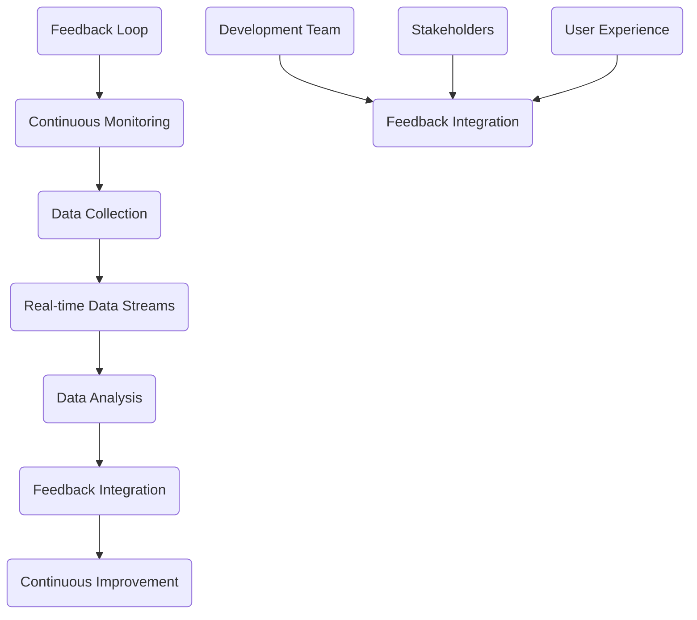

                 

### 1. Background and Introduction to the Technical Feedback Mechanism

#### 1.1. Definition and Importance of Technical Feedback

Technical feedback refers to the process of obtaining and analyzing information about the performance, functionality, and usability of software systems, hardware devices, or any technological solution. It is a critical component in the software development lifecycle that helps in refining, optimizing, and improving the quality of the product.

The importance of technical feedback lies in its ability to provide developers and stakeholders with insights into the real-world usage of their products. It helps in identifying defects, bugs, and usability issues that may not have been discovered during the development or testing phases. Moreover, it allows for continuous improvement, innovation, and alignment with user needs and market demands.

**Core Concepts and Relationships**

To establish a technical feedback mechanism, we need to understand several key concepts and their relationships:

- **Feedback Loop**: A feedback loop is a process that involves the collection, analysis, and utilization of feedback to make improvements. It is a continuous cycle of information flow.
- **Data Collection**: Data collection is the process of gathering information about the performance and behavior of the system. This can include usage statistics, error logs, user satisfaction surveys, and more.
- **Data Analysis**: Data analysis involves interpreting and processing the collected data to extract meaningful insights. This can be done through statistical methods, machine learning algorithms, or manual analysis.
- **Feedback Integration**: Feedback integration refers to the process of incorporating feedback into the development process. This includes prioritizing and planning improvements, implementing changes, and testing the effectiveness of those changes.
- **User Experience (UX)**: UX focuses on ensuring that the system is intuitive, easy to use, and meets the needs of the users. Feedback on UX is critical for making improvements that enhance user satisfaction.

#### 1.2 Problem Background and Description

In today's fast-paced and highly competitive technology landscape, the need for high-quality and reliable software systems has never been greater. However, the complexity of modern software projects often leads to unforeseen issues and inefficiencies. These can result in increased costs, missed deadlines, and, most importantly, a negative impact on user satisfaction.

The primary problem we aim to address in this article is the lack of an effective technical feedback mechanism in many software development processes. This lack can lead to the following challenges:

- **Defects and Bugs**: Without proper feedback, defects and bugs can remain undetected, leading to a poor user experience and potential loss of customers.
- **Inefficient Development**: Developers may be working on features that do not align with user needs or market demands, leading to wasted effort and resources.
- **Lack of Innovation**: Without real-world data on what users want and need, innovation can be limited, stifling the development of new and exciting features.
- **Poor User Satisfaction**: Users may become dissatisfied with the system due to usability issues, performance problems, or lack of features, leading to churn and negative reviews.

#### 1.3 Solution and Scope

The solution to this problem is the establishment of a robust technical feedback mechanism. This mechanism will help in continuously monitoring the system's performance, collecting user feedback, analyzing the data, and making informed decisions to improve the product.

The scope of this article will cover the following topics:

- **Conceptual Foundations**: We will discuss the basic principles and concepts of technical feedback mechanisms.
- **Practical Implementation**: We will explore the practical aspects of implementing a feedback mechanism, including data collection, analysis, and integration.
- **Case Studies**: We will look at real-world examples of successful feedback mechanisms in various industries and applications.
- **Best Practices**: We will provide best practices for setting up and maintaining an effective feedback mechanism.

By the end of this article, readers will have a comprehensive understanding of the importance of technical feedback and how to establish a feedback mechanism that drives continuous improvement and innovation.

### 1.4 Conceptual Structure and Core Components

To establish a sustainable technical feedback mechanism, it is essential to understand the conceptual structure and core components that make up such a system. The following diagram provides a high-level overview of these components:

#### Continuous Monitoring

Continuous monitoring is the cornerstone of a technical feedback mechanism. It involves continuously tracking the performance and behavior of the system to collect data on its usage, functionality, and user interactions. This can be achieved through various tools and techniques such as application performance monitoring (APM), log analysis, and real-time user behavior tracking.

**Importance:**
- Ensures that the system is operating as expected.
- Helps in identifying performance bottlenecks and issues.
- Provides insights into user engagement and satisfaction.

#### Data Collection

Data collection is the process of gathering relevant information from the system and its users. This data can include usage metrics, error logs, user feedback, and more. The quality and relevance of this data are crucial for making informed decisions.

**Key Factors:**
- **Data Sources**: Identify the various sources of data, such as application logs, databases, user surveys, and social media feedback.
- **Data Types**: Collect a diverse set of data types to gain a comprehensive understanding of the system's performance and user experience.
- **Data Volume**: Manage the volume of data collected to ensure that it is manageable and useful.

#### Real-time Data Streams

Real-time data streams enable the immediate transmission of data from the system to the analysis tools. This allows for quick identification of issues and the ability to respond to user needs in a timely manner.

**Advantages:**
- **Immediate Insights**: Provides immediate feedback on the system's performance and user interactions.
- **Proactive Issue Resolution**: Allows for proactive identification and resolution of issues before they impact users.

#### Data Analysis

Data analysis is the process of interpreting and processing the collected data to extract meaningful insights. This can involve statistical analysis, machine learning, and other advanced techniques.

**Methods:**
- **Descriptive Analysis**: Provides a summary of the data to understand its basic characteristics.
- **Predictive Analysis**: Uses historical data to predict future trends and behaviors.
- **Prescriptive Analysis**: Provides recommendations on how to improve the system based on the analysis.

#### Feedback Integration

Feedback integration is the process of incorporating the insights gained from data analysis into the development process. This involves prioritizing and planning improvements, implementing changes, and testing their effectiveness.

**Steps:**
- **Prioritization**: Identify the most critical issues and prioritize them based on their impact and feasibility.
- **Planning**: Develop a plan for implementing the changes, including timelines, resources, and dependencies.
- **Implementation**: Make the necessary changes to the system.
- **Testing**: Test the changes to ensure that they have the desired effect and do not introduce new issues.

#### Continuous Improvement

Continuous improvement is the ultimate goal of a technical feedback mechanism. It involves a continuous cycle of monitoring, analyzing, and improving the system to ensure that it meets user needs and performs optimally.

**Principles:**
- **Iterative Development**: Continuously iterate on the system based on feedback and analysis.
- **Agile Practices**: Incorporate agile development practices to respond quickly to changes and feedback.
- **Customer Focus**: Always prioritize the user's needs and satisfaction in the improvement process.

#### Development Team and Stakeholders

The development team and stakeholders play a crucial role in the feedback mechanism. They are responsible for integrating feedback into the development process, making decisions based on the analysis, and ensuring that the system meets user expectations.

**Responsibilities:**
- **Development Team**: Implements changes, tests new features, and ensures the system's stability.
- **Stakeholders**: Provide guidance and direction, prioritize features, and ensure that the feedback mechanism aligns with business goals.

#### User Experience

User experience (UX) is a critical component of a technical feedback mechanism. It focuses on ensuring that the system is intuitive, easy to use, and meets the needs of the users.

**Components:**
- **User Research**: Conducts research to understand user needs, behaviors, and preferences.
- **User Testing**: Tests the system with real users to identify usability issues and gather feedback.
- **User Feedback**: Collects and analyzes user feedback to make improvements.

By understanding the conceptual structure and core components of a technical feedback mechanism, developers and stakeholders can establish a system that drives continuous improvement and innovation. The next section will delve into the practical steps for implementing such a mechanism.

### 2.1. Technical Feedback Mechanisms in Software Development

In software development, technical feedback mechanisms are critical for ensuring that the final product meets user expectations and performs optimally. This section explores the key aspects of implementing technical feedback in software development, including data collection, data analysis, and feedback integration.

#### Data Collection in Software Development

Data collection in software development involves gathering information about the system's performance, behavior, and user interactions. This data can be collected through various methods, including:

1. **Usage Metrics**: Track metrics such as page views, session duration, and user engagement to understand how users interact with the system.
2. **Error Logs**: Collect error logs to identify bugs, exceptions, and crashes that occur during system usage.
3. **User Surveys**: Conduct surveys to gather qualitative feedback from users about their experience with the system.
4. **A/B Testing**: Use A/B testing to compare different versions of a feature or interface to determine which performs better.
5. **Real-time Monitoring**: Use real-time monitoring tools to track the system's performance and identify issues as they occur.

**Example:**
Suppose we are developing an e-commerce website. We could collect the following data:

- **Usage Metrics**: Track the number of page views, average session duration, and conversion rates.
- **Error Logs**: Log any errors or exceptions that occur during user interactions.
- **User Surveys**: Conduct surveys to gather feedback on the user experience, such as ease of navigation and overall satisfaction.
- **A/B Testing**: Test different versions of the shopping cart interface to see which one results in higher conversion rates.
- **Real-time Monitoring**: Monitor server performance, database queries, and network traffic to identify potential bottlenecks.

#### Data Analysis in Software Development

Data analysis is the process of interpreting and processing the collected data to extract meaningful insights. This can involve statistical methods, machine learning algorithms, and other advanced techniques. Here are some key steps in data analysis for software development:

1. **Descriptive Analysis**: Summarize the data to understand its basic characteristics, such as the average session duration or the number of errors logged.
2. **Predictive Analysis**: Use historical data to predict future trends, such as user behavior or system performance.
3. **Prescriptive Analysis**: Provide recommendations on how to improve the system based on the analysis, such as optimizing database queries or redesigning the user interface.

**Example:**
Continuing with the e-commerce website example, we could perform the following analyses:

- **Descriptive Analysis**: Identify the average session duration and the most common pages visited by users.
- **Predictive Analysis**: Predict which products are likely to be popular based on past purchase patterns and current trends.
- **Prescriptive Analysis**: Suggest changes to the website design to improve user experience, such as simplifying the checkout process or highlighting popular products.

#### Feedback Integration in Software Development

Feedback integration involves incorporating the insights gained from data analysis into the development process. This process includes several key steps:

1. **Prioritization**: Identify the most critical issues and prioritize them based on their impact on the system's performance and user satisfaction.
2. **Planning**: Develop a plan for addressing the identified issues, including timelines, resources, and dependencies.
3. **Implementation**: Implement the planned changes to the system.
4. **Testing**: Test the changes to ensure that they have the desired effect and do not introduce new issues.

**Example:**
Using our e-commerce website example, we could integrate feedback as follows:

- **Prioritization**: Identify the most critical issues, such as high error rates during checkout or slow page load times.
- **Planning**: Develop a plan to address these issues, including optimizing database queries and redesigning the checkout process.
- **Implementation**: Implement the planned changes, such as adding caching to improve page load times and improving the checkout flow.
- **Testing**: Test the changes to ensure that they have improved the system's performance and user experience.

#### Continuous Improvement

Continuous improvement is the ultimate goal of implementing technical feedback in software development. It involves a continuous cycle of monitoring, analyzing, and improving the system based on user feedback and performance data.

**Principles:**
- **Iterative Development**: Continuously iterate on the system based on feedback and analysis.
- **Agile Practices**: Incorporate agile development practices to respond quickly to changes and feedback.
- **Customer Focus**: Always prioritize the user's needs and satisfaction in the improvement process.

**Example:**
In our e-commerce website example, we could continuously improve the system by:

- **Monitoring**: Continuously monitor system performance and user interactions to identify new issues or areas for improvement.
- **Analyzing**: Analyze the data to identify trends and patterns that may indicate potential problems or opportunities for improvement.
- **Improving**: Implement changes based on the analysis to address identified issues or enhance the user experience.

By following these steps and principles, software development teams can establish a robust technical feedback mechanism that drives continuous improvement and innovation, ultimately leading to a better user experience and higher product quality.

### 2.2 Technical Feedback Mechanisms in Project Management

In project management, technical feedback mechanisms play a crucial role in ensuring the successful completion of projects and meeting stakeholder expectations. This section explores the implementation of technical feedback in project management, highlighting key steps, methodologies, and tools for effective feedback collection, analysis, and integration.

#### Feedback Collection in Project Management

Feedback collection in project management involves gathering input from various stakeholders, including team members, clients, and end-users, to assess project progress, identify issues, and understand their concerns. Effective feedback collection methods include:

1. **Regular Meetings**: Conduct regular team meetings to discuss project progress, review milestones, and address any concerns or issues.
2. **Surveys and Questionnaires**: Use surveys and questionnaires to gather quantitative and qualitative feedback from stakeholders. This can help identify trends and patterns in their responses.
3. **One-on-One Interviews**: Schedule one-on-one interviews with key stakeholders to gain deeper insights into their perspectives and expectations.
4. **Performance Metrics**: Track project performance metrics, such as budget, schedule, and quality, to identify potential areas for improvement.
5. **Observation**: Observe team interactions and project activities to identify issues that may not be captured through formal feedback channels.

**Example:**
Consider a project to develop a new mobile application. The project manager could collect feedback using the following methods:

- **Regular Meetings**: Conduct weekly status meetings to review progress, discuss challenges, and align on priorities.
- **Surveys and Questionnaires**: Distribute surveys to gather feedback on user satisfaction, feature preferences, and potential improvements.
- **One-on-One Interviews**: Schedule interviews with the product owner and key stakeholders to discuss their expectations and concerns.
- **Performance Metrics**: Track metrics such as the number of user downloads, retention rates, and user ratings to gauge the app's performance.
- **Observation**: Observe user interactions with the application to identify usability issues and areas for improvement.

#### Feedback Analysis in Project Management

Feedback analysis is the process of interpreting and evaluating the collected feedback to identify trends, patterns, and actionable insights. This involves:

1. **Data Aggregation**: Aggregate feedback data from various sources to create a comprehensive overview of stakeholder concerns and project performance.
2. **Trend Identification**: Identify trends and patterns in the feedback to understand common issues or areas of concern.
3. **Root Cause Analysis**: Conduct root cause analysis to identify the underlying reasons for issues or performance gaps.
4. **Impact Assessment**: Assess the impact of identified issues on project objectives, such as cost, schedule, and quality.
5. **Prioritization**: Prioritize feedback based on its severity and impact on the project, ensuring that critical issues are addressed promptly.

**Example:**
Continuing with the mobile application development project, the project manager could analyze the feedback as follows:

- **Data Aggregation**: Compile feedback from surveys, interviews, and performance metrics into a single document for analysis.
- **Trend Identification**: Identify common concerns, such as slow loading times or difficulties in navigating the app, based on survey responses and user behavior data.
- **Root Cause Analysis**: Investigate the root causes of these issues, such as inefficient code or poor user interface design.
- **Impact Assessment**: Assess the impact of these issues on project objectives, such as user satisfaction and app ratings.
- **Prioritization**: Prioritize issues based on their severity and impact, focusing on resolving critical issues first.

#### Feedback Integration in Project Management

Feedback integration involves incorporating the insights gained from feedback analysis into project planning, execution, and control processes. This ensures that project decisions and actions are informed by stakeholder input and address their concerns. Key steps in feedback integration include:

1. **Action Planning**: Develop action plans to address identified issues and improve project outcomes.
2. **Resource Allocation**: Allocate resources, such as time, budget, and personnel, to implement action plans.
3. **Implementation**: Implement changes and improvements based on feedback analysis.
4. **Monitoring and Evaluation**: Continuously monitor the impact of feedback-driven changes on project performance and stakeholder satisfaction.
5. **Documentation**: Document feedback-driven changes and their outcomes for future reference.

**Example:**
Using the mobile application development project as an example, the project manager could integrate feedback as follows:

- **Action Planning**: Develop action plans to optimize code, improve user interface design, and enhance app performance.
- **Resource Allocation**: Allocate resources to developers and designers to implement these changes.
- **Implementation**: Optimize the app's code, refine the user interface, and enhance performance based on feedback.
- **Monitoring and Evaluation**: Continuously monitor user interactions, feedback, and performance metrics to assess the impact of changes.
- **Documentation**: Document the feedback-driven changes, their implementation, and their outcomes for future projects.

#### Continuous Improvement in Project Management

Continuous improvement is a fundamental principle in project management, emphasizing the ongoing process of refining project practices and outcomes based on feedback and lessons learned. Key practices for achieving continuous improvement in project management include:

1. **Feedback Loops**: Establish feedback loops to ensure continuous and timely communication with stakeholders, allowing for rapid response to changes and issues.
2. **Learning from Experience**: Encourage a culture of learning and reflection within the project team, promoting the sharing of insights and best practices.
3. **Agile Practices**: Incorporate agile methodologies, such as iterative development and regular retrospectives, to foster flexibility, adaptability, and continuous improvement.
4. **Continuous Monitoring**: Continuously monitor project performance and stakeholder satisfaction to identify opportunities for improvement.
5. **Knowledge Management**: Develop a system for capturing, organizing, and sharing knowledge and insights gained from project experiences.

**Example:**
In the mobile application development project, continuous improvement could be achieved through the following practices:

- **Feedback Loops**: Establish regular feedback sessions with stakeholders to gather input on project progress and outcomes.
- **Learning from Experience**: Conduct retrospectives at the end of each project phase to reflect on successes, challenges, and opportunities for improvement.
- **Agile Practices**: Implement iterative development cycles and conduct regular retrospectives to adapt to changing requirements and enhance project outcomes.
- **Continuous Monitoring**: Continuously monitor app performance, user feedback, and market trends to identify areas for improvement.
- **Knowledge Management**: Create a knowledge base to document lessons learned, best practices, and recommendations for future projects.

By implementing effective technical feedback mechanisms in project management, teams can enhance their ability to respond to changes, improve project outcomes, and deliver high-quality products that meet stakeholder expectations. The next section will explore case studies illustrating successful implementation of technical feedback mechanisms in various industries.

### 3.1 Case Study 1: Implementing a Feedback Mechanism in a Financial Services Company

In this section, we will explore a case study from the financial services industry, where a leading company successfully implemented a technical feedback mechanism to enhance their software application.

#### Background

The financial services company, let's call it FinServCo, was facing challenges with their customer relationship management (CRM) system. The system was critical for managing customer interactions, sales leads, and customer support. However, users reported issues with system performance, usability, and the lack of key features that were essential for their daily workflows.

#### Feedback Mechanism Implementation

To address these issues, FinServCo implemented a robust technical feedback mechanism that included the following steps:

1. **Data Collection**: 
   - **Usage Metrics**: The company integrated usage metrics from the CRM system to track user activity, such as login rates, session duration, and feature usage.
   - **Error Logs**: Error logs were collected to identify and analyze system errors, crashes, and other technical issues.
   - **User Surveys**: Regular user surveys were conducted to gather qualitative feedback on user experience and satisfaction.

2. **Data Analysis**:
   - **Descriptive Analysis**: The company performed descriptive analysis to identify common issues, such as frequent errors or long response times.
   - **Predictive Analysis**: Using historical data, the company predicted potential issues and user needs based on trends and patterns.
   - **Prescriptive Analysis**: Based on the analysis, recommendations were made to prioritize and address the most critical issues.

3. **Feedback Integration**:
   - **Prioritization**: The feedback was prioritized based on user impact and severity.
   - **Planning and Implementation**: Action plans were developed and implemented to resolve identified issues, such as optimizing database queries, improving error handling, and enhancing the user interface.
   - **Testing**: The changes were thoroughly tested to ensure they addressed the identified issues without introducing new problems.

#### Results and Benefits

The implementation of the technical feedback mechanism led to several significant improvements:

- **Performance Enhancement**: The optimization of database queries and system architecture resulted in faster response times and improved system performance.
- **User Satisfaction**: The enhancements made to the user interface and error handling significantly improved user satisfaction and reduced user frustration.
- **Feature Addition**: Based on user feedback, new features were added to the CRM system, such as automated workflows and integration with other business tools.
- **Continuous Improvement**: The feedback mechanism enabled FinServCo to continuously monitor and improve the system, ensuring it remained aligned with user needs and market demands.

#### Lessons Learned

Key lessons learned from this case study include:

- **Importance of Data Collection**: Gathering comprehensive and diverse data is essential for identifying and addressing issues accurately.
- **User-Centric Approach**: Focusing on user needs and satisfaction is crucial for driving improvements and ensuring a positive user experience.
- **Continuous Iteration**: Continuous improvement and iterative development are vital for maintaining and enhancing system quality over time.
- **Effective Communication**: Regular and transparent communication with stakeholders is essential for gaining their trust and ensuring their involvement in the feedback process.

### 3.2 Case Study 2: Feedback Mechanism in Healthcare System Development

In this section, we will examine a case study from the healthcare industry, where a healthcare system development project successfully implemented a technical feedback mechanism to enhance the usability and functionality of their system.

#### Background

A healthcare company, HealthTechCo, was developing a comprehensive electronic health record (EHR) system. However, during the development phase, they encountered challenges with system usability and user engagement. Physicians and other healthcare professionals expressed concerns about the system's complexity, slow response times, and lack of critical features necessary for their workflow.

#### Feedback Mechanism Implementation

To address these challenges, HealthTechCo implemented a technical feedback mechanism that incorporated the following steps:

1. **Data Collection**:
   - **User Surveys**: The company conducted user surveys to gather feedback on the current system's usability, functionality, and areas for improvement.
   - **Real-time Monitoring**: Real-time monitoring tools were used to track system performance and user interactions.
   - **Focus Groups**: Focus groups with healthcare professionals were conducted to gather qualitative insights and identify specific pain points.

2. **Data Analysis**:
   - **Descriptive Analysis**: The company analyzed survey responses and user behavior data to identify common issues and areas for improvement.
   - **Predictive Analysis**: Historical data was used to predict potential issues and user needs based on trends and patterns.
   - **Prescriptive Analysis**: Recommendations were made based on the analysis to prioritize and address the most critical issues, such as simplifying the user interface and enhancing system performance.

3. **Feedback Integration**:
   - **Prioritization**: The feedback was prioritized based on its impact on user workflow and system performance.
   - **Planning and Implementation**: Action plans were developed and implemented to resolve identified issues, such as redesigning the user interface and optimizing system architecture.
   - **Testing**: The changes were tested to ensure they met user requirements and did not introduce new issues.

#### Results and Benefits

The implementation of the technical feedback mechanism led to several significant improvements:

- **Usability Enhancement**: The redesign of the user interface and simplification of workflows resulted in improved usability and increased user engagement.
- **Performance Improvement**: Optimization of the system architecture and database queries led to faster response times and improved system performance.
- **Feature Addition**: Based on user feedback, new features were added to the EHR system, such as automated alerts and integration with medical devices.
- **Continuous Improvement**: The feedback mechanism enabled HealthTechCo to continuously monitor and improve the system, ensuring it remained aligned with user needs and healthcare standards.

#### Lessons Learned

Key lessons learned from this case study include:

- **Involving Users Early**: Involving users early in the development process is crucial for understanding their needs and ensuring the system meets their expectations.
- **Regular Feedback Sessions**: Regular feedback sessions with users are essential for continuous improvement and identifying issues promptly.
- **Prioritization of Feedback**: Prioritizing feedback based on its impact on user workflow and system performance is vital for driving the most significant improvements.
- **Collaborative Approach**: Collaborating with users and stakeholders throughout the development process fosters a sense of ownership and ensures the system's success.

By examining these case studies, we can see that implementing a technical feedback mechanism in software development and project management can lead to significant improvements in performance, usability, and user satisfaction. The next section will discuss best practices for establishing and maintaining an effective technical feedback mechanism.

### 4.1 Best Practices for Establishing a Technical Feedback Mechanism

Establishing a robust technical feedback mechanism is crucial for continuous improvement and innovation in software development and project management. The following best practices can help organizations create and maintain an effective feedback loop:

#### 1. Define Clear Objectives

Before implementing a feedback mechanism, it's essential to define clear objectives. These objectives should align with the overall goals of the project or organization. For example, objectives might include improving user satisfaction, enhancing system performance, or identifying and resolving critical issues.

#### 2. Involving Stakeholders

Stakeholders, including developers, project managers, clients, and end-users, should be involved in the feedback process. This ensures that the feedback mechanism captures diverse perspectives and insights. Involving stakeholders also fosters a sense of ownership and collaboration.

#### 3. Data Collection Methods

Choosing the right data collection methods is crucial for gathering comprehensive and accurate feedback. This can include usage metrics, error logs, user surveys, real-time monitoring, and one-on-one interviews. Combining multiple methods can provide a more holistic view of the system's performance and user experience.

#### 4. Regular and Systematic Feedback

Feedback should be collected on a regular and systematic basis. This ensures that issues and improvements are continuously monitored and addressed. Setting up a schedule for data collection and analysis can help maintain consistency and prevent feedback from being overlooked.

#### 5. Data Analysis and Insights

Data analysis is a critical step in the feedback process. It involves interpreting and processing the collected data to extract meaningful insights. Techniques such as descriptive, predictive, and prescriptive analysis can be used to identify trends, patterns, and actionable recommendations.

#### 6. Prioritization and Action Planning

Once insights are gained from data analysis, it's important to prioritize issues and plan actions accordingly. Prioritization should be based on the impact on user experience, system performance, and project objectives. Action plans should include clear steps, timelines, and responsible parties to ensure effective implementation.

#### 7. Communication and Transparency

Effective communication and transparency are essential for gaining stakeholder trust and buy-in. Regular updates on the feedback process, progress, and outcomes can help stakeholders understand the value of the feedback mechanism and its impact on the project.

#### 8. Continuous Improvement

A technical feedback mechanism should be viewed as an ongoing process of continuous improvement. This involves iterating on the system based on feedback, adapting to changing requirements and conditions, and maintaining a focus on user needs and satisfaction.

#### 9. Training and Resources

Providing training and resources to stakeholders on how to use the feedback mechanism effectively can ensure its successful implementation. This can include training on data collection methods, analysis techniques, and best practices for prioritization and action planning.

#### 10. Documentation and Knowledge Management

Documenting the feedback process, insights, and actions taken can help in maintaining a repository of best practices and lessons learned. This documentation can also serve as a reference for future projects and help in replicating successful practices.

By following these best practices, organizations can establish a sustainable technical feedback mechanism that drives continuous improvement and innovation, leading to better products, higher user satisfaction, and greater success in project management.

### 4.2 Common Challenges in Implementing a Technical Feedback Mechanism

While implementing a technical feedback mechanism, organizations often encounter various challenges that can hinder its effectiveness. Recognizing these challenges and devising strategies to overcome them is crucial for a successful feedback process.

#### 1. Data Overload

One common challenge is data overload, where the volume and variety of collected data overwhelm the analysis process. This can lead to inefficiencies in data processing and analysis, making it difficult to derive actionable insights. To overcome this, organizations should focus on collecting relevant and high-quality data, and invest in robust data management and analysis tools.

#### 2. Lack of Clarity in Objectives

Without clear objectives, the feedback mechanism can become unfocused and ineffective. This can result in wasted time and effort spent on analyzing and acting on irrelevant feedback. To address this, organizations should define specific and measurable objectives for the feedback process and ensure all stakeholders are aligned on these goals.

#### 3. Insufficient Involvement of Stakeholders

Involving all relevant stakeholders, including developers, project managers, clients, and end-users, is crucial for gathering comprehensive and diverse feedback. However, insufficiency in stakeholder involvement can lead to biased or incomplete feedback. To overcome this, organizations should establish a structured approach for involving stakeholders at various stages of the feedback process.

#### 4. Inadequate Data Analysis Skills

Effective data analysis is a critical component of a feedback mechanism. However, organizations may lack the necessary skills and expertise in data analysis. This can result in poor analysis and misinterpretation of feedback. To tackle this challenge, organizations should invest in training and development programs to enhance the data analysis capabilities of their team members.

#### 5. Slow Feedback Integration

Integrating feedback into the development process can be a time-consuming task. This delay can lead to missed opportunities for timely improvements and may cause frustration among stakeholders. To address this, organizations should streamline the feedback integration process by implementing efficient workflows and prioritization techniques.

#### 6. Lack of Resources

Implementing a technical feedback mechanism requires resources, including time, budget, and skilled personnel. Organizations may face challenges in allocating these resources, which can hinder the effectiveness of the feedback process. To overcome this, organizations should prioritize the feedback mechanism as a strategic initiative and allocate the necessary resources.

#### 7. Resistance to Change

Stakeholders may resist changes suggested by the feedback mechanism, particularly if they are unfamiliar with the process or perceive it as disruptive to their work. To mitigate resistance, organizations should communicate the benefits of the feedback mechanism, involve stakeholders in the decision-making process, and provide training and support to help them adapt to the changes.

By addressing these common challenges with proactive strategies, organizations can establish and maintain a robust technical feedback mechanism that drives continuous improvement and innovation.

### 4.3 Summary and Future Directions

In summary, establishing a technical feedback mechanism is vital for driving continuous improvement, enhancing user satisfaction, and achieving long-term success in software development and project management. Key aspects of an effective feedback mechanism include clear objectives, stakeholder involvement, systematic data collection and analysis, prioritization and action planning, and continuous iteration.

Future research and practice should focus on developing advanced techniques for data analysis and integrating artificial intelligence and machine learning to gain deeper insights and automate feedback processes. Additionally, exploring the impact of feedback mechanisms in different industries and contexts can provide valuable insights and best practices for organizations across various domains. By continually refining and adapting feedback mechanisms, organizations can stay ahead in the competitive technology landscape and deliver high-quality, user-centric solutions.

