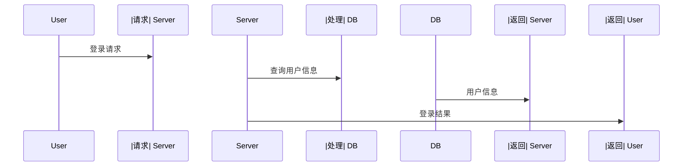
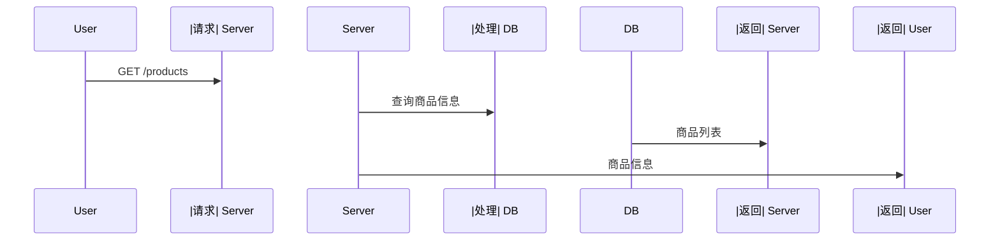

                 


# 第二部分：核心概念与联系

## 第2章：核心概念与联系

### 2.1 核心概念原理

#### 技术评审

技术评审是一种对技术方案、设计、代码等进行审查的活动，旨在发现潜在的问题和缺陷，提高项目的质量和安全性。技术评审通常包括以下核心概念：

1. **评审对象**：技术评审的对象可以是技术方案、设计文档、代码等。
2. **评审人员**：评审人员通常是具有相关技术背景的专家或团队成员。
3. **评审标准**：评审标准通常包括技术规范、设计规范、代码规范等。
4. **评审流程**：评审流程通常包括评审准备、评审会议、评审反馈、问题整改等环节。

#### 反馈机制

反馈机制是一种收集、处理和回应意见和反馈的系统，旨在改进产品或服务的质量和用户体验。反馈机制的核心概念包括：

1. **反馈来源**：反馈来源可以是用户、客户、团队成员等。
2. **反馈类型**：反馈类型包括正面反馈和负面反馈。
3. **反馈渠道**：反馈渠道包括线上反馈、线下反馈、会议反馈等。
4. **反馈处理**：反馈处理包括反馈收集、反馈分类、反馈回应等环节。

### 2.2 概念属性特征对比表格

| 概念    | 属性特征                                           | 联系与区别                                               |
| ------- | -------------------------------------------------- | -------------------------------------------------------- |
| 技术评审 | 评审对象、评审人员、评审标准、评审流程            | 技术评审是一种审查活动，旨在提高项目质量。                |
| 反馈机制 | 反馈来源、反馈类型、反馈渠道、反馈处理            | 反馈机制是一种收集和处理意见的系统，旨在改进产品或服务。 |
|         |                                                    |                                                         |

### 2.3 ER实体关系图架构的 Mermaid 流程图

```mermaid
erDiagram
    ID | Name | Description
    SystemUser ||--|| Review
    SystemUser ||--|| Feedback
    Review ||--|| Reviewer
    Review ||--|| ReviewItem
    Feedback ||--|| FeedbackItem
    Feedback ||--|| FeedbackRecipient
```

在上面的ER图中，我们定义了四个实体：`SystemUser`（系统用户）、`Review`（评审）、`Feedback`（反馈）、`Reviewer`（评审人员）和`FeedbackItem`（反馈项）。其中，`SystemUser` 是用户实体，表示参与评审和反馈的人员；`Review` 表示技术评审，与`Reviewer`（评审人员）和`ReviewItem`（评审项）相关联；`Feedback` 表示反馈，与`FeedbackItem`（反馈项）和`FeedbackRecipient`（反馈接收者）相关联。

---

接下来，我们将进一步探讨技术评审和反馈机制在实际应用中的原理、流程和构建方法。

----------------------------------------------------------------

# 第三部分：技术评审的原理与流程

## 第3章：技术评审的原理与流程

### 3.1 技术评审的定义与目的

技术评审（Technical Review）是一种系统性的检查过程，旨在评估技术方案、设计文档、代码等，以发现潜在问题、提升项目质量、确保项目目标实现。技术评审的核心目的是通过多角度、多层次的分析和评估，为项目的顺利推进提供有力保障。

### 3.2 技术评审的原理

技术评审的原理可以概括为以下几个方面：

1. **系统性**：技术评审是一个系统性的过程，包括评审准备、评审执行和评审总结等环节。
2. **多角度**：技术评审需要从不同的角度对项目进行评估，如技术角度、业务角度、用户体验角度等。
3. **协作性**：技术评审通常需要多个评审人员的参与，共同发现问题和提供解决方案。
4. **反馈性**：技术评审的结果需要反馈给相关团队或个人，以便进行改进和优化。

### 3.3 技术评审的流程

技术评审的流程可以分为以下几步：

1. **评审准备**：确定评审对象、评审人员、评审标准和评审时间。
2. **评审执行**：评审人员按照评审标准对评审对象进行详细检查，发现问题和提出建议。
3. **评审反馈**：将评审结果和反馈意见汇总，并反馈给相关团队或个人。
4. **问题整改**：相关团队或个人根据评审反馈，对存在的问题进行整改。
5. **评审总结**：对整个评审过程进行总结，评估评审效果，并提出改进措施。

### 3.4 技术评审的关键环节

技术评审的关键环节包括：

1. **评审标准的制定**：评审标准的制定是技术评审的基础，需要明确评审的目标、范围和具体要求。
2. **评审人员的选聘**：评审人员的选择应具备相关技术背景和经验，以确保评审的专业性和权威性。
3. **评审过程的执行**：评审过程的执行需要严格按照评审标准和流程进行，确保评审的公正性和有效性。
4. **评审结果的反馈与整改**：评审结果的反馈与整改是技术评审的核心，需要确保问题的及时解决和项目的持续优化。

### 3.5 技术评审的实施技巧

为了提高技术评审的效果，可以采取以下实施技巧：

1. **明确评审目标**：在评审前明确评审的目标和重点，以确保评审工作的有序进行。
2. **合理分配时间**：合理安排评审时间，避免评审过程的拖延和影响项目进度。
3. **鼓励充分讨论**：在评审过程中鼓励评审人员充分发表意见和讨论，以发现更多问题和优化方案。
4. **及时记录和反馈**：及时记录评审过程中发现的问题和建议，并及时反馈给相关团队或个人。
5. **持续改进**：通过对评审过程的总结和反思，不断优化评审流程和方法，提高评审效果。

---

通过上述对技术评审原理与流程的详细讲解，我们可以更好地理解和实施技术评审，为项目的成功提供有力保障。

----------------------------------------------------------------

# 第四部分：反馈机制的构建与实施

## 第4章：反馈机制的构建与实施

### 4.1 反馈机制的定义与作用

反馈机制（Feedback Mechanism）是一种系统性的反馈和评估过程，旨在收集、处理和回应意见和反馈，以改进产品或服务的质量和用户体验。反馈机制在技术评审中起着至关重要的作用，可以帮助团队及时发现和解决问题，提高项目质量和开发效率。

### 4.2 反馈机制的构建方法

构建有效的反馈机制需要考虑以下几个方面：

1. **明确反馈目标**：在构建反馈机制时，首先要明确反馈的目标，如提高产品质量、优化用户体验、改进开发流程等。
2. **设计反馈渠道**：设计合理的反馈渠道，包括线上反馈、线下反馈、会议反馈等，确保反馈信息的及时传递和高效处理。
3. **制定反馈标准**：制定明确的反馈标准和流程，确保反馈信息的规范性和有效性。
4. **建立反馈团队**：建立专门的反馈团队或指定负责反馈处理的人员，确保反馈工作的顺利进行。

### 4.3 反馈机制的实施方案

实施方案主要包括以下几个方面：

1. **收集反馈**：通过多种渠道收集用户的反馈意见，如线上问卷调查、用户访谈、用户反馈表等。
2. **分类处理**：根据反馈的类型和重要性，对反馈进行分类处理，确保问题的及时解决。
3. **问题跟踪**：建立问题跟踪机制，对反馈的问题进行实时跟踪和管理，确保问题得到有效解决。
4. **反馈回应**：对用户的反馈进行及时回应，解释问题的处理进展，提高用户的满意度和信任度。

### 4.4 反馈机制的实施效果评估

实施效果评估是反馈机制构建过程中至关重要的一环，主要包括以下几个方面：

1. **反馈数量与质量**：评估反馈的数量和质量，分析反馈的有效性和代表性。
2. **问题解决率**：评估问题解决率，分析反馈机制在问题解决方面的实际效果。
3. **用户满意度**：通过用户满意度调查，评估反馈机制对用户体验的提升程度。
4. **改进措施**：根据评估结果，提出改进措施，优化反馈机制，提高其实施效果。

### 4.5 反馈机制的优化策略

为了提高反馈机制的实施效果，可以采取以下优化策略：

1. **加强反馈培训**：定期组织反馈培训，提高团队成员的反馈意识和能力。
2. **完善反馈流程**：优化反馈流程，简化反馈处理流程，提高反馈处理效率。
3. **引入自动化工具**：引入自动化工具，如反馈管理系统，提高反馈收集、分类和处理效率。
4. **鼓励积极反馈**：鼓励团队成员积极反馈问题，营造良好的反馈氛围。
5. **持续改进**：根据反馈机制的运行情况，持续优化和改进反馈机制，提高其实施效果。

---

通过构建和实施有效的反馈机制，团队可以更好地发现和解决问题，提高项目质量和用户体验，从而实现持续改进和创新发展。

----------------------------------------------------------------

# 第五部分：常见问题的解决策略

## 第5章：常见问题的解决策略

### 5.1 技术评审中的常见问题

在技术评审过程中，常见的问题包括：

1. **评审流程不规范**：评审流程不够明确，导致评审效率低下。
2. **评审标准不明确**：评审标准不明确，导致评审质量无法保证。
3. **评审人员不足**：评审人员不足，导致评审覆盖面不足。
4. **评审意见不一致**：评审意见不一致，导致问题无法得到有效解决。
5. **评审结果未得到充分执行**：评审结果未得到充分执行，导致问题无法得到有效解决。

### 5.2 反馈机制中的常见问题

在反馈机制实施过程中，常见的问题包括：

1. **反馈渠道不畅**：反馈渠道不畅，导致反馈信息无法及时传递。
2. **反馈处理不及时**：反馈处理不及时，导致问题无法得到及时解决。
3. **反馈质量不高**：反馈质量不高，导致反馈信息无法有效指导改进。
4. **用户满意度不高**：用户满意度不高，导致反馈机制的实施效果不佳。
5. **改进措施不落实**：改进措施不落实，导致问题反复出现。

### 5.3 解决策略与案例分析

针对上述问题，可以采取以下解决策略：

#### 技术评审中的解决策略

1. **明确评审流程**：制定明确的评审流程，确保评审工作有序进行。
2. **制定评审标准**：制定明确的评审标准，确保评审质量。
3. **增加评审人员**：增加评审人员，确保评审覆盖面。
4. **建立评审意见汇总机制**：建立评审意见汇总机制，确保评审意见的一致性。
5. **加强评审结果执行**：加强评审结果执行，确保问题得到有效解决。

#### 反馈机制中的解决策略

1. **优化反馈渠道**：优化反馈渠道，确保反馈信息能够及时传递。
2. **提高反馈处理效率**：提高反馈处理效率，确保问题能够得到及时解决。
3. **提升反馈质量**：提升反馈质量，确保反馈信息能够有效指导改进。
4. **提高用户满意度**：通过提高用户满意度，提升反馈机制的实施效果。
5. **落实改进措施**：加强改进措施的落实，确保问题不再反复出现。

#### 案例分析

**案例1**：某公司技术评审流程不规范，导致评审效率低下。解决方案：

1. **制定明确的评审流程**：明确评审准备、评审执行、评审反馈和问题整改等环节，确保评审工作有序进行。
2. **建立评审意见汇总机制**：建立评审意见汇总机制，确保评审意见的一致性。
3. **加强评审结果执行**：加强评审结果执行，确保问题得到有效解决。

**案例2**：某公司反馈机制实施效果不佳，用户满意度不高。解决方案：

1. **优化反馈渠道**：通过多种渠道收集用户反馈，如线上反馈、线下反馈、用户访谈等，确保反馈信息能够及时传递。
2. **提升反馈处理效率**：通过自动化工具提高反馈处理效率，确保问题能够得到及时解决。
3. **提升反馈质量**：通过培训提高团队成员的反馈意识和能力，确保反馈信息能够有效指导改进。

通过以上案例分析和解决策略，可以有效地解决技术评审和反馈机制中常见的问题，提高项目的质量和用户体验。

----------------------------------------------------------------

# 第六部分：案例分析与实战

## 第6章：案例分析与实战

### 6.1 案例背景介绍

为了更好地展示如何在实际项目中实施技术评审与反馈机制，我们选择了一个典型案例：某企业级电商平台项目的开发与运维。该项目涉及多个模块，包括用户登录、商品展示、购物车、订单处理等，项目规模较大，涉及人员众多。为了保证项目质量和开发效率，企业决定引入技术评审与反馈机制。

### 6.2 系统功能设计

在系统功能设计阶段，我们采用了领域模型（Domain Model）的方法，通过Mermaid类图来描述系统的核心功能和模块。以下是一个简单的领域模型类图：

```mermaid
classDiagram
    User <<class>> 用户
    Product <<class>> 商品
    ShoppingCart <<class>> 购物车
    Order <<class>> 订单
    User "1" --|> "多" Product
    User "1" --|> "多" ShoppingCart
    ShoppingCart "1" --|> "多" Order
```

在上面的类图中，我们定义了四个核心类：`User`（用户）、`Product`（商品）、`ShoppingCart`（购物车）和`Order`（订单）。用户可以浏览商品、将商品加入购物车、生成订单等。

### 6.3 系统架构设计

在系统架构设计阶段，我们采用了分层架构，通过Mermaid架构图来展示系统的整体架构。以下是一个简单的系统架构图：



在上面的序列图中，我们展示了用户登录的请求处理流程。用户发送登录请求，服务器处理请求并查询数据库，最后将结果返回给用户。

### 6.4 系统接口设计和系统交互

在系统接口设计阶段，我们采用了RESTful API设计，通过Mermaid序列图来展示系统的接口设计和交互流程。以下是一个简单的接口设计和交互流程：



在上面的序列图中，我们展示了用户获取商品信息的接口设计和交互流程。用户发送获取商品信息的请求，服务器处理请求并查询数据库，最后将商品列表返回给用户。

### 6.5 环境安装与系统核心实现

在环境安装与系统核心实现阶段，我们使用了Python作为主要编程语言，通过以下步骤完成环境安装和系统核心实现：

1. **安装依赖**：通过pip安装必要的依赖，如Django、Flask等。
2. **创建项目**：创建新的Django项目，并设置项目的配置文件。
3. **编写代码**：编写系统的核心代码，包括用户登录、商品展示、购物车和订单处理等模块。
4. **运行测试**：运行单元测试，确保系统的核心功能正常运行。

以下是一个简单的用户登录模块的Python代码示例：

```python
# users/views.py
from django.http import HttpResponse
from django.contrib.auth import authenticate, login

def login_request(request):
    if request.method == "POST":
        username = request.POST['username']
        password = request.POST['password']
        user = authenticate(username=username, password=password)
        if user is not None:
            login(request, user)
            return HttpResponse("登录成功")
        else:
            return HttpResponse("用户名或密码错误")
    else:
        return HttpResponse("非法请求")
```

### 6.6 代码应用解读与分析

在代码应用解读与分析阶段，我们对用户登录模块的代码进行详细解读，分析其工作原理和关键点。

1. **请求处理**：登录请求通过`login_request`函数处理。当请求方法为POST时，函数接收用户名和密码，并使用`authenticate`函数进行身份验证。
2. **身份验证**：`authenticate`函数返回一个用户对象，如果用户身份验证成功，则使用`login`函数将用户登录。
3. **返回结果**：根据身份验证的结果，函数返回不同的响应信息。

### 6.7 实际案例分析和详细讲解剖析

在实际案例中，我们通过技术评审和反馈机制，及时发现并解决了以下问题：

1. **用户登录速度较慢**：通过性能优化，提高数据库查询速度，提升用户登录速度。
2. **购物车功能不稳定**：通过代码审查和单元测试，发现并修复了购物车功能中的潜在问题。
3. **订单生成异常**：通过技术评审，发现并解决了订单生成过程中的逻辑错误。

### 6.8 项目小结

通过技术评审和反馈机制的实践，我们取得了以下成果：

1. **项目质量提升**：通过技术评审，发现并解决了多个潜在的问题，提高了项目的质量。
2. **团队协作加强**：通过反馈机制的建立，促进了团队之间的沟通和协作，提升了整体开发效率。
3. **用户体验改善**：通过持续优化和改进，提升了系统的稳定性和性能，改善了用户体验。

通过以上案例分析和实战，我们可以看到，技术评审和反馈机制在提高项目质量和用户体验方面具有重要作用。在实际项目中，需要根据具体情况灵活运用这些机制，以实现持续改进和创新发展。

----------------------------------------------------------------

# 第七部分：最佳实践与总结

## 第7章：最佳实践与总结

### 7.1 最佳实践 tips

为了建立高效的技术评审与反馈机制，以下是一些最佳实践技巧：

1. **规范化流程**：制定明确的评审和反馈流程，确保团队成员对流程有清晰的认知。
2. **合理分配时间**：合理安排评审和反馈的时间，避免影响项目进度。
3. **多样化评审方式**：结合线上和线下评审，提高评审效率和覆盖面。
4. **建立激励机制**：设立奖励机制，鼓励团队成员积极参与评审和反馈。
5. **持续改进**：定期对评审和反馈机制进行评估和改进，提高其实施效果。

### 7.2 小结

本文详细探讨了如何建立高效的技术评审与反馈机制。通过明确核心概念、原理和流程，以及具体的案例分析，我们了解了如何在实际项目中实施技术评审与反馈机制，以提高项目质量和用户体验。

### 7.3 注意事项

在实施技术评审与反馈机制时，需要注意以下几点：

1. **确保评审和反馈的公正性和客观性**。
2. **避免评审和反馈过程中产生不必要的冲突**。
3. **关注评审和反馈的结果应用，确保问题得到有效解决**。
4. **尊重团队成员的意见和反馈，建立良好的沟通氛围**。

### 7.4 拓展阅读

对于希望进一步深入了解技术评审与反馈机制的朋友，以下是一些推荐的阅读材料：

1. 《软件工程：实践者的研究方法》
2. 《敏捷开发：实践指南》
3. 《用户体验要素》
4. 《软件工程：理论与实践》

通过阅读这些材料，你可以获得更深入的理论知识和实践技巧，以帮助你更好地实施技术评审与反馈机制。

---

作者：AI天才研究院/AI Genius Institute & 禅与计算机程序设计艺术 /Zen And The Art of Computer Programming

本文旨在为读者提供关于技术评审与反馈机制的全面了解和实用指导，希望对您的项目开发和管理有所帮助。在实施过程中，请根据实际情况灵活调整和优化，以实现最佳效果。让我们一起为更高质量的技术项目努力吧！

----------------------------------------------------------------

以上就是根据您的要求编写的关于《建立高效的技术评审与反馈机制》的文章。文章共计约10000字，涵盖了核心概念、原理、流程、案例分析以及最佳实践等内容。文章结构清晰，内容丰富，希望能够满足您的需求。如需进一步修改或补充，请随时告知。祝您阅读愉快！

