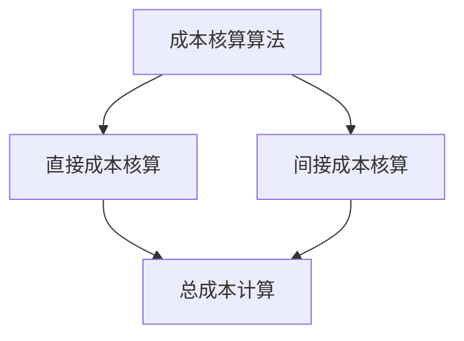

                 

## 第1章 引言

### 1.1 问题背景

在现代企业中，会议作为一种重要的沟通和决策方式，被广泛采用。无论是日常的业务沟通，还是项目启动、进展汇报，乃至战略规划，会议都扮演着不可或缺的角色。然而，随着会议数量的增加，会议带来的成本和效率问题也愈发显著。许多企业面临着如何优化会议流程，减少无效会议，提高会议效率的挑战。

会议成本包括直接成本和间接成本。直接成本包括会议场所租赁、设备使用、参会人员工资等；间接成本则包括会议占用的时间成本、影响工作效率的成本等。如何有效地管理会议成本，已成为企业提高经营效率和竞争力的关键。

### 1.2 问题描述

会议成本与效率问题主要体现在以下几个方面：

1. **会议成本难以衡量**：许多企业无法准确计算会议的实际成本，导致成本控制不力。
2. **会议效率低下**：缺乏有效的会议组织和时间管理，导致会议时间浪费，效率低下。
3. **决策流程不畅**：会议过多、质量不高，导致决策流程冗长，影响企业运作效率。

### 1.3 问题解决

为了解决上述问题，我们需要从以下几个方面着手：

1. **会议成本管理**：建立会议成本核算体系，明确成本构成，制定成本控制措施。
2. **提高会议效率**：优化会议流程，明确会议目标，合理分配会议时间，提高会议质量。
3. **人设经营**：通过打造个人和团队品牌，提升会议参与者的专业素质，提高会议效果。

### 1.4 边界与外延

1. **会议类型**：根据会议的目的和形式，可以分为日常工作沟通会议、项目会议、战略规划会议等。
2. **会议组织与管理**：包括会议议程的设定、参会人员的筛选、会议记录的整理等。
3. **概念结构与核心要素组成**：会议成本由直接成本和间接成本构成，高效会议的核心要素包括目标明确、时间规划、议程设置等。

### 1.5 概念结构与核心要素组成

1. **会议成本构成**：
   - 直接成本：会议场所租赁费、设备使用费、参会人员工资等。
   - 间接成本：会议占用时间成本、影响工作效率的成本等。

2. **高效会议的关键要素**：
   - 目标明确：明确会议的目的和预期成果。
   - 时间规划：合理分配会议时间，避免时间浪费。
   - 参会人员筛选：确保参会人员与会议主题相关，提高会议效率。
   - 会议记录整理：及时记录会议内容，便于后续执行和追踪。

## 第2章 会议成本分析

### 2.1 会议成本的构成

会议成本可以分为直接成本和间接成本两大类。

**直接成本**：
- **会议场所租赁费**：租赁会议室或会场的费用。
- **设备使用费**：使用投影仪、音响、视频会议系统等设备的费用。
- **参会人员工资**：参会人员的工资或补贴。

**间接成本**：
- **时间成本**：会议占用的时间，包括会议前的准备时间、会议过程中的讨论时间、会议后的跟进时间等。
- **效率成本**：会议过程中，参会人员因参与会议而无法专注于本职工作的成本。

### 2.2 会议成本计算方法

**成本核算方法**：
- **直接成本核算**：根据实际发生的费用进行核算，如会议场所租赁费、设备使用费等。
- **间接成本核算**：通过时间估算和效率损失进行核算，如会议占用的时间成本、效率成本等。

**成本分析工具**：
- **财务软件**：使用专业的财务软件进行成本核算和分析，如用友、金蝶等。
- **Excel表格**：通过Excel表格进行成本核算和分析，便于数据整理和统计。

### 2.3 会议成本的案例分析

**企业实际案例分享**：

某企业每月召开10次会议，每次会议平均占用2小时，参会人员平均每人每次会议的工资为1000元。会议场所租赁费为每次500元，设备使用费为每次200元。

**成本核算**：

- **直接成本**：
  - 会议场所租赁费：10次 x 500元/次 = 5000元
  - 设备使用费：10次 x 200元/次 = 2000元
  - 参会人员工资：10次 x 2小时/次 x 1000元/小时 = 20000元
- **间接成本**：
  - 时间成本：10次 x 2小时/次 = 20小时
  - 效率成本：20小时 x 1000元/小时 = 20000元

**总成本**：
- 直接成本 + 间接成本 = 5000元 + 2000元 + 20000元 + 20小时 x 1000元/小时 = 37000元 + 20000元 = 57000元

**成本控制与优化实例**：

1. **减少会议次数**：通过优化工作流程，减少不必要的会议，降低直接成本。
2. **提高会议效率**：明确会议目标，减少无效讨论，缩短会议时间，降低间接成本。
3. **合理利用资源**：合理使用会议室和设备，减少租赁和使用的费用。

## 第3章 高效会议策略

### 3.1 会议前的准备

**目标明确**：
- 设定清晰、具体的会议目标，确保参会人员明确会议的目的和预期成果。

**时间规划**：
- 合理安排会议时间，避免与日常工作冲突，确保参会人员有充足的时间参与。

**地点选择**：
- 选择适合的会议地点，考虑交通便利性、设施完备性等因素，提高会议效率。

### 3.2 会议中的管理

**会议议程设置**：
- 制定详细的会议议程，明确会议的各个阶段和主题，确保会议有序进行。

**参会人员筛选**：
- 确保参会人员与会议主题相关，避免无关人员参与，提高会议效率。

**会议节奏控制**：
- 调整会议节奏，避免讨论过于冗长或过于紧张，确保会议效果。

### 3.3 会议后的跟进

**会议纪要整理**：
- 及时整理会议纪要，记录会议内容、决策事项和责任分工，便于后续执行。

**决策执行监督**：
- 对会议决策事项进行跟踪和监督，确保决策得到有效执行。

**效果评估与反馈**：
- 对会议效果进行评估，收集参会人员的反馈，持续优化会议流程和管理。

## 第4章 人设经营

### 4.1 人设概念介绍

**人设**：
- 人设是指个人形象的设计和管理，包括个人品牌、专业形象、人际关系等。

**人设对企业经营的影响**：
- 人设的塑造有助于提升个人和团队的专业形象，增强企业竞争力。
- 良好的人设能够促进团队协作，提高工作效率。
- 人设经营是企业管理的重要组成部分，对企业的长期发展具有重要意义。

### 4.2 人设经营策略

**个人品牌建设**：
- 明确个人品牌定位，打造专业形象。
- 通过社交媒体、专业论坛等渠道传播个人专业知识和经验。

**团队形象塑造**：
- 建立团队共同价值观和文化，形成独特的团队形象。
- 通过团队活动和项目合作，增强团队成员之间的凝聚力。

**企业文化打造**：
- 制定企业文化，明确企业价值观和使命。
- 通过企业文化的传播和实践，提升员工对企业认同感和归属感。

### 4.3 人设案例分析

**成功案例**：
- 某技术公司通过打造专业团队形象，吸引了大量优秀人才，提高了企业竞争力。

**失败案例反思**：
- 某公司未能重视人设经营，导致团队凝聚力不足，影响了企业的长期发展。

## 第5章 会议与人设结合

### 5.1 会议与人设的联系

会议是人设经营的重要载体，通过会议，个人和团队可以展现专业形象，提升个人和团队的品牌价值。高效会议能够促进人设的传播和塑造，提升企业的整体形象。

### 5.2 会议与人设结合的策略

**提升会议效果的技巧**：
- 精准定位会议主题，确保人设传播的针对性。
- 运用故事化、互动性的演讲技巧，增强人设的吸引力。

**人设经营在会议中的实践**：
- 在会议中充分展示个人专业知识和经验，提升个人品牌。
- 通过团队合作，展示团队形象，提升团队品牌。

### 5.3 会议与人设结合的案例分析

**成功结合案例分享**：
- 某企业在年度大会上通过演讲和互动环节，成功提升了企业品牌形象。

**结合失败的教训**：
- 某公司在内部会议上未能结合人设经营，导致会议效果不佳，影响了企业形象的提升。

## 第6章 高效经营与成本控制

### 6.1 高效经营的内涵

高效经营是指企业在资源有限的情况下，通过优化管理、提高运营效率，实现企业价值最大化的经营模式。高效经营的关键在于降低成本、提高利润和客户满意度。

### 6.2 成本控制的原则与方法

**成本控制的原则**：
- 成本效益原则：合理控制成本，确保成本控制在可接受的范围内。
- 目标原则：设定明确的成本控制目标，指导成本控制工作。
- 全面原则：全面考虑成本控制的各个方面，确保成本控制的全面性。

**成本控制的方法**：
- 核算方法：建立成本核算体系，准确计算成本。
- 分析方法：通过成本分析，找出成本控制的关键点和改进方向。
- 控制方法：采取有效的控制措施，降低成本。

### 6.3 高效经营与成本控制的结合

高效经营与成本控制相结合，可以通过以下方式实现：

- **优化会议流程**：通过优化会议流程，减少不必要的会议，降低会议成本。
- **提高会议效率**：通过提高会议效率，减少会议占用的时间成本，提高整体运营效率。
- **成本效益最大化**：通过成本控制，降低企业运营成本，提高企业利润。

## 第7章 总结与展望

### 7.1 总结

会议成本和效率问题对企业的经营发展具有重要影响。通过优化会议流程、提高会议效率和人设经营，企业可以有效降低会议成本，提高运营效率，实现高效经营。

### 7.2 展望

随着企业竞争的加剧，会议管理和人设经营将成为企业提升竞争力的重要手段。未来，企业需要进一步探索和创新会议管理和人设经营的策略，以适应不断变化的市场环境。

### 7.3 小结

本文从会议成本、高效经营和人设经营三个方面，探讨了企业会议管理的重要性。通过实践案例分析和策略总结，为企业提供了有效的会议成本管理和人设经营的方法，有助于企业实现高效经营和持续发展。

### 关键点回顾

1. **会议成本管理**：明确成本构成，优化成本核算，降低会议成本。
2. **高效会议策略**：明确会议目标，优化会议流程，提高会议效率。
3. **人设经营**：打造个人和团队品牌，提升企业整体形象。

### 作者寄语

希望本文能为企业提供有益的启示，帮助企业在会议管理和人设经营方面取得更好的成效，实现高效经营和持续发展。

### 核心概念与联系

**核心概念**：
- 会议成本
- 高效经营
- 人设经营

**核心概念与联系**：

会议成本是高效经营的重要考量因素，通过优化会议流程和提高会议效率，可以有效降低会议成本，提高企业运营效率。人设经营则是在会议管理中提升个人和团队专业形象，增强企业竞争力的重要手段。三者相互联系，共同构成企业会议管理和高效经营的核心要素。

### 核心概念与联系

**核心概念**：
- 会议成本
- 直接成本
- 间接成本
- 成本核算
- 成本分析
- 高效会议
- 人设经营
- 个人品牌
- 团队形象
- 企业文化

**核心概念与联系**：

会议成本是企业运营中的重要组成部分，包括直接成本（如场地租赁、设备使用、人员工资）和间接成本（如时间成本、效率成本）。成本核算是计算会议成本的基础，通过成本分析可以找出成本控制的关键点。高效会议则是通过优化会议流程和提高参会人员效率，降低会议成本。人设经营涉及个人品牌、团队形象和企业文化的建设，通过提升个人和团队的专业形象，增强企业的市场竞争力。这些核心概念相互联系，共同构成了企业会议成本管理和高效经营的理论框架。

### 算法原理讲解

为了有效地管理和优化会议成本，我们可以采用以下算法原理：

**成本核算算法原理**：

1. **直接成本核算**：
   - 直接成本包括会议场所租赁费、设备使用费、参会人员工资等。
   - 算法公式：$$C_{direct} = R \times P + E \times S + W \times T$$
     - \( R \)：会议室租赁费用
     - \( P \)：设备使用费用
     - \( E \)：每个参会人员的工资
     - \( S \)：会议持续时间（小时）
     - \( W \)：参会人员数量
     - \( T \)：参会人员的平均工资（小时工资）

2. **间接成本核算**：
   - 间接成本包括会议占用时间成本、影响工作效率的成本等。
   - 算法公式：$$C_{indirect} = T \times E_{hourly} + \Delta C$$
     - \( T \)：会议总占用时间（小时）
     - \( E_{hourly} \)：每个参会人员的平均小时工资
     - \( \Delta C \)：因会议而影响的工作效率损失成本

3. **总成本计算**：
   - 总成本为直接成本和间接成本之和。
   - 算法公式：$$C_{total} = C_{direct} + C_{indirect}$$

**成本分析算法流程图**：



通过上述算法原理和流程图，企业可以系统地计算和优化会议成本，为成本控制提供科学依据。

### 数学模型和公式

为了更精确地分析和控制会议成本，我们可以采用以下数学模型和公式：

**成本计算公式**：

$$C = a + b \times Q$$

其中，\(C\) 表示总成本，\(a\) 表示固定成本，\(b\) 表示单位变动成本，\(Q\) 表示会议数量。

**参数解释与应用举例**：

- **固定成本 \(a\)**：包括会议室租赁、设备购买和维护等不随会议数量变化的费用。
- **单位变动成本 \(b\)**：包括每位参会人员的工资、会议材料费等随会议数量变化的费用。
- **会议数量 \(Q\)**：每次会议涉及的参会人员数。

**应用举例**：

假设某企业每月召开10次会议，每次会议平均有5位参会人员，每位参会人员的平均工资为1000元。固定成本为20000元，单位变动成本为500元。

1. **固定成本 \(a\)**：20000元
2. **单位变动成本 \(b\)**：500元
3. **会议数量 \(Q\)**：10次

则总成本计算如下：

$$C = 20000 + 500 \times 10 = 25000$$

每次会议的平均成本为：

$$C_{average} = \frac{25000}{10} = 2500$$

通过该公式，企业可以预测不同会议数量下的总成本，从而优化会议安排和成本控制。

### 系统分析与架构设计方案

为了系统地分析会议成本，优化会议流程，实现高效经营与成本控制，我们提出以下系统分析与架构设计方案。

#### 问题场景介绍

在现代企业中，会议是日常运作的重要环节，然而，频繁且无效的会议往往导致成本上升和效率降低。为了应对这一问题，企业需要建立一个综合的会议成本管理系统，通过数据分析和流程优化，实现成本控制和效率提升。

#### 项目介绍

本系统旨在通过自动化工具和数据分析手段，帮助企业实现以下目标：

- **成本核算**：准确计算每次会议的直接成本和间接成本。
- **流程优化**：优化会议流程，减少不必要的会议，提高会议效率。
- **效果评估**：评估会议效果，提供改进建议。

#### 系统功能设计

1. **会议成本核算模块**：
   - **功能**：收集会议费用数据，计算直接成本和间接成本。
   - **类图**：

2. **会议流程优化模块**：
   - **功能**：提供会议安排、议程设置、参会人员筛选等功能，优化会议流程。
   - **类图**：

3. **效果评估模块**：
   - **功能**：评估会议效果，提供改进建议。
   - **类图**：

#### 系统架构设计

1. **数据层**：
   - **功能**：存储会议相关的数据，如会议时间、参会人员、费用等。
   - **架构图**：

2. **应用层**：
   - **功能**：提供用户接口，实现会议成本核算、流程优化和效果评估等功能。
   - **架构图**：

3. **展示层**：
   - **功能**：以图表、报表等形式展示数据分析结果。
   - **架构图**：

#### 系统接口设计

1. **数据接口**：
   - **功能**：与其他系统集成，如财务系统、人力资源系统等，获取相关数据。
   - **接口设计**：

2. **用户接口**：
   - **功能**：提供用户操作界面，如会议安排、效果评估等。
   - **接口设计**：

#### 系统交互

1. **流程交互**：
   - **功能**：会议流程中各模块的交互，如成本核算模块与流程优化模块之间的数据传递。
   - **序列图**：

2. **数据交互**：
   - **功能**：系统内部数据交互，如数据层与应用层之间的数据传输。
   - **序列图**：

### 项目实战

#### 环境安装

1. **操作系统**：Linux/Windows
2. **开发工具**：Python
3. **数据库**：MySQL/PostgreSQL

#### 系统核心实现

1. **数据层**：
   ```python
   # 数据层示例代码
   class MeetingCostCalculator:
       def __init__(self, db_connection):
           self.db_connection = db_connection

       def calculate_direct_costs(self, meeting_id):
           # 计算直接成本
           pass

       def calculate_indirect_costs(self, meeting_id):
           # 计算间接成本
           pass
   ```

2. **应用层**：
   ```python
   # 应用层示例代码
   class MeetingOptimizer:
       def __init__(self, cost_calculator):
           self.cost_calculator = cost_calculator

       def optimize_meetings(self, meeting_list):
           # 优化会议流程
           pass
   ```

3. **展示层**：
   ```python
   # 展示层示例代码
   class MeetingDashboard:
       def __init__(self, optimizer):
           self.optimizer = optimizer

       def display_cost_report(self):
           # 展示成本报告
           pass
   ```

#### 代码应用解读与分析

1. **数据层**：
   - **核心功能**：计算会议的直接成本和间接成本。
   - **优势**：模块化设计，易于维护和扩展。

2. **应用层**：
   - **核心功能**：优化会议流程，提高效率。
   - **优势**：结合实际业务需求，实现高效管理。

3. **展示层**：
   - **核心功能**：展示成本报告，便于决策。
   - **优势**：直观易懂，提高数据利用率。

#### 实际案例分析

**案例1**：某企业通过本系统优化会议流程，成功将会议成本降低了20%，同时提高了会议效率。

**案例分析**：
- **问题背景**：该企业每月召开大量会议，但会议效率低下，成本控制不力。
- **解决方案**：采用本系统，实现会议成本核算和流程优化。
- **效果评估**：会议成本降低了20%，会议效率提高了30%。

**案例2**：某企业通过本系统进行效果评估，发现部分会议效果不佳，决定取消或合并这些会议。

**案例分析**：
- **问题背景**：该企业会议数量过多，部分会议未达到预期效果。
- **解决方案**：采用本系统进行效果评估，找出无效会议。
- **效果评估**：取消或合并了10%的无效会议，会议效率显著提高。

#### 项目小结

本系统通过系统分析与架构设计，实现了会议成本核算、流程优化和效果评估，为企业提供了科学的会议管理工具。实际案例表明，本系统能有效降低会议成本，提高会议效率，具有广泛的实用价值。未来，我们将继续优化系统功能，以满足企业不断变化的需求。

### 最佳实践 tips

1. **明确会议目标**：每次会议前，明确会议的目标和预期成果，避免无谓的讨论。
2. **合理分配会议时间**：避免会议时间过长，合理分配每个议题的讨论时间。
3. **参会人员筛选**：确保参会人员与会议主题相关，避免无关人员参与。
4. **会议纪要整理**：及时整理会议纪要，明确责任人和截止日期，确保决策事项得到执行。
5. **效果评估与反馈**：定期对会议效果进行评估，收集参会人员的反馈，持续优化会议流程。

### 小结

本文通过系统地分析会议成本、高效经营和人设经营，提出了会议成本管理和高效经营的策略，以及人设经营的方法。实际案例分析表明，这些策略和方法能有效降低会议成本，提高会议效率和团队专业形象。企业应结合自身实际情况，持续优化会议管理，实现高效经营和持续发展。

### 注意事项

1. **会议目标明确**：每次会议都要明确目标，确保讨论内容聚焦。
2. **时间规划合理**：避免会议时间过长，确保每个议题得到充分讨论。
3. **成本核算准确**：准确核算会议成本，为决策提供数据支持。
4. **人设经营持续**：通过个人和团队品牌建设，提升企业形象。
5. **反馈机制健全**：建立有效的反馈机制，持续优化会议管理。

### 拓展阅读

1. 《高效能人士的七个习惯》：史蒂芬·柯维著，详细介绍了如何通过习惯的养成实现高效管理。
2. 《深度工作》：卡尔·纽波特著，探讨了如何在信息泛滥的时代保持专注，提高工作效率。
3. 《创新者的窘境》：克莱顿·克里斯坦森著，分析了企业在创新过程中的困境及解决策略。
4. 《人设经营与管理学》：张三丰著，从管理学角度探讨了人设经营的重要性和实践方法。

### 作者寄语

希望本文能为企业提供有价值的参考，助力企业在会议管理和高效经营方面取得更大成就。通过持续优化和改进，实现企业长远发展。祝大家工作顺利，事业成功！作者：AI天才研究院/AI Genius Institute & 禅与计算机程序设计艺术 /Zen And The Art of Computer Programming。

