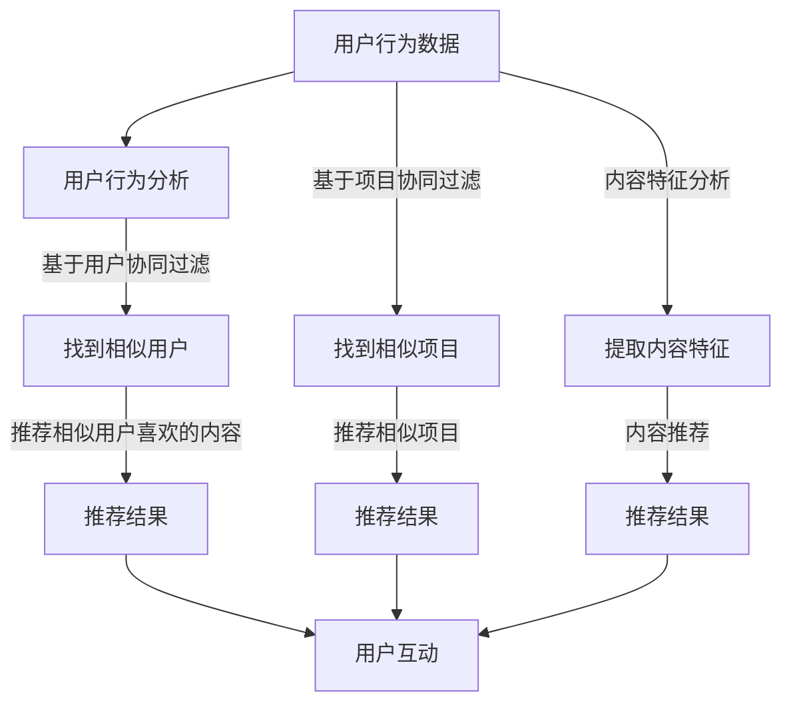
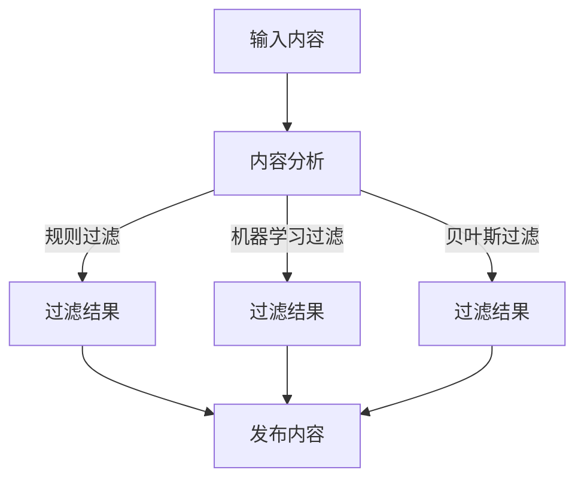
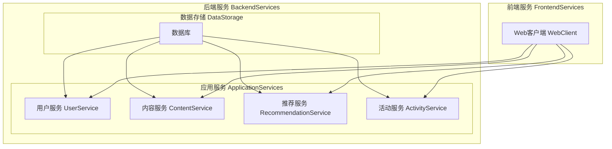
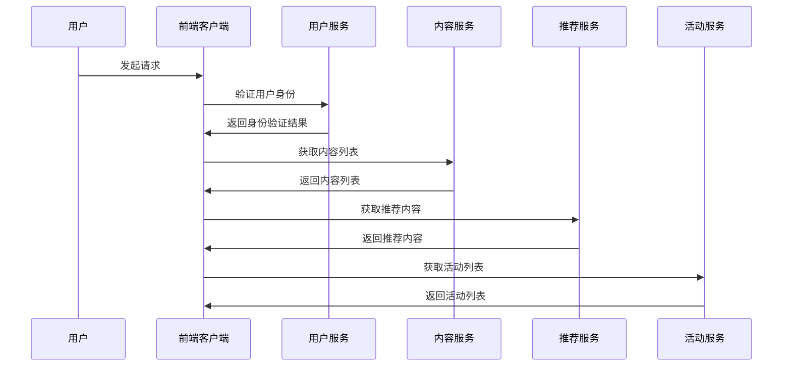

                 

### 背景介绍

在现代软件开发中，开发者社区运营已成为不可或缺的一环。随着技术的快速发展，软件项目变得日益复杂，单靠个体的力量难以应对。开发者社区提供了一个平台，使开发者能够共享知识、协同工作、解决问题，从而提升整体开发效率。

开发者社区运营的背景可以追溯到互联网的普及和开源运动的兴起。早期的开发者论坛和邮件列表是开发者社区的基础形式。然而，随着社交媒体和云计算技术的发展，开发者社区的形式和功能也在不断演变。如今，开发者社区不仅包括论坛和邮件列表，还涵盖了GitHub、Stack Overflow、Reddit等专业的技术社区平台。

这些平台不仅提供了代码托管、问题解答、知识分享等功能，还通过社交网络促进了开发者之间的互动。这种互动不仅有助于解决问题，还能够激发创新思维，促进技术的不断进步。因此，开发者社区运营在提升个人技能、推动项目成功和促进技术传播方面具有显著的重要性。

在当前软件开发环境中，开发者社区运营的意义主要体现在以下几个方面：

1. **知识共享**：开发者社区是一个知识共享的平台，开发者可以在社区中分享经验、教程和最佳实践，帮助他人快速成长。

2. **问题解决**：开发者社区提供了一个交流平台，开发者可以在遇到问题时快速寻求帮助，获得解决方案。

3. **协同工作**：社区中的开发者可以协作开发项目，共享代码和资源，提高项目开发的效率和质量。

4. **技术传播**：通过开发者社区，新技术和新理念可以迅速传播，促进整个行业的技术进步。

5. **个人成长**：参与开发者社区可以提升个人的专业技能，拓展人脉，增加职业机会。

因此，开发者社区运营不仅对开发者个人有利，也对整个软件开发行业产生深远的影响。接下来，我们将深入探讨社区运营中的核心概念，了解这些概念如何相互作用，共同推动开发者社区的发展。

### 核心概念

在开发者社区运营中，有几个核心概念至关重要，它们是用户参与度、社区活跃度和内容管理。这些概念不仅单独存在，而且相互关联，共同影响着社区的运作和效果。

#### 用户参与度

用户参与度是指用户在社区中的活跃程度和贡献程度。它反映了用户对社区的忠诚度和投入度。用户参与度可以通过多种指标来衡量，例如：

- **发帖量**：用户在社区中发布帖子的数量。
- **回复量**：用户在社区中回复他人帖子的数量。
- **内容质量**：用户发布的内容是否具有高质量、有价值和可读性。
- **活跃时长**：用户在社区中活跃的时间长度。

用户参与度的提升策略包括：

1. **提供有趣的内容**：发布与用户兴趣相关的主题和内容，吸引他们参与讨论。
2. **鼓励贡献**：通过奖励机制，如积分、认证等，激励用户贡献内容。
3. **互动机制**：建立良好的互动机制，如点赞、评论、私信等，增强用户之间的互动。
4. **社区文化**：营造积极向上的社区文化，鼓励用户参与和分享。

#### 社区活跃度

社区活跃度是指社区整体活动频繁程度和用户互动的积极性。一个高活跃度的社区意味着用户之间频繁互动、话题多样且具有吸引力。社区活跃度可以通过以下指标来衡量：

- **发帖频率**：社区中帖子的发布频率。
- **讨论热度**：帖子的讨论热度，如回复数量、点赞数量等。
- **事件参与率**：社区举办活动时的参与率。

社区活跃度的提升策略包括：

1. **定期活动**：定期举办线上或线下活动，如技术分享会、编程比赛等，激发用户参与。
2. **热点话题**：关注行业热点和趋势，发布相关话题，吸引更多用户参与讨论。
3. **社区互动**：鼓励社区成员之间的互动，如组织问答环节、主题讨论等。
4. **内容多样化**：发布多样化的内容，包括教程、案例研究、新闻等，满足不同用户的需求。

#### 内容管理

内容管理是指对社区内容的创建、审核、发布、组织和维护。有效的内容管理能够保证社区内容的健康和高质量，提高用户的参与度和活跃度。内容管理的原则包括：

1. **内容审核**：确保发布的内容符合社区规范，避免不适当或有害内容。
2. **内容组织**：合理组织内容，使其易于查找和使用，提高用户体验。
3. **内容更新**：定期更新内容，保持社区的新鲜感和活力。
4. **内容多样性**：发布多种类型的内容，如文本、图片、视频等，满足不同用户的需求。

#### 核心概念之间的联系

用户参与度、社区活跃度和内容管理这三者之间存在紧密的联系：

- **用户参与度**是社区活跃度的基石，用户的高参与度直接推动社区活跃度。
- **社区活跃度**是内容管理的表现，高活跃度的社区能够吸引更多用户参与，从而提高内容管理的效率。
- **内容管理**为用户参与和社区活跃提供支持和保障，高质量的内容能够激发用户的参与热情，促进社区活跃度的提升。

总的来说，用户参与度、社区活跃度和内容管理相互促进、相互依赖，共同构建了一个健康的开发者社区。通过优化这些核心概念，开发者社区可以更加有效地发挥其价值，为开发者提供更好的支持和服务。

### 算法原理讲解

在开发者社区运营中，推荐算法和过滤算法是两大关键技术，它们对提升用户参与度和社区活跃度起到了至关重要的作用。接下来，我们将详细讲解这两种算法的原理，并使用mermaid流程图和Python源代码进行说明。

#### 推荐算法原理

推荐算法旨在根据用户的兴趣和行为，向其推荐相关的内容或用户。在开发者社区中，推荐算法可以用于推荐热门话题、相似的问题、作者的文章等，以提升用户的参与度和活跃度。

**推荐算法的核心原理**：

1. **协同过滤**：协同过滤是一种基于用户行为的推荐方法，它通过分析用户之间的行为相似性来推荐内容。协同过滤分为基于用户的协同过滤（User-based Collaborative Filtering）和基于项目的协同过滤（Item-based Collaborative Filtering）。

   - **基于用户的协同过滤**：寻找与目标用户兴趣相似的其他用户，推荐这些用户喜欢的项目。
   - **基于项目的协同过滤**：寻找与目标项目相似的其他项目，推荐这些项目被喜欢的用户。

2. **内容推荐**：内容推荐是根据内容的特征和标签来推荐相关的内容。在开发者社区中，内容推荐可以基于文章的标题、摘要、标签和内容本身来推荐。

**mermaid流程图**：



**Python源代码示例**：

```python
import numpy as np
from sklearn.metrics.pairwise import linear_kernel

# 用户行为数据（评分矩阵）
ratings = np.array([[1, 0, 1, 0],
                    [0, 1, 0, 1],
                    [1, 1, 0, 0],
                    [0, 0, 1, 1]])

# 基于用户的协同过滤
user_similarity = linear_kernel(ratings)
user_similarity = np.where(user_similarity < 0.5, 0, user_similarity)
user_similarity = (user_similarity + user_similarity.T) / 2

# 用户-项目评分矩阵
user_score = np.dot(user_similarity, ratings)
predicted_ratings = user_score / user_similarity.sum(axis=1)[:, np.newaxis]

# 基于项目的协同过滤
item_similarity = linear_kernel(ratings.T)
item_similarity = np.where(item_similarity < 0.5, 0, item_similarity)
item_similarity = (item_similarity + item_similarity.T) / 2

# 项目-用户评分矩阵
item_score = np.dot(item_similarity, ratings)
predicted_ratings_item = item_score / item_similarity.sum(axis=1)[:, np.newaxis]

# 输出推荐结果
print(predicted_ratings)
print(predicted_ratings_item)
```

#### 过滤算法原理

过滤算法是一种用于分类和筛选信息的技术，它在开发者社区中用于过滤不适当的内容、推荐热门话题和筛选相关的问题。

**过滤算法的核心原理**：

1. **基于规则的过滤**：根据预定义的规则来过滤内容。例如，禁止包含敏感词或垃圾邮件的帖子。

2. **机器学习过滤**：使用机器学习算法，如决策树、支持向量机等，来分类和筛选内容。这种方法可以根据历史数据和反馈来不断优化。

3. **贝叶斯过滤**：贝叶斯过滤是一种基于概率的过滤方法，它通过计算文本中关键词的概率分布来分类和筛选内容。

**mermaid流程图**：



**Python源代码示例**：

```python
from sklearn.feature_extraction.text import CountVectorizer
from sklearn.naive_bayes import MultinomialNB

# 文本数据
text_data = ["这是一个技术问题", "这是一个简单的数学问题", "这是一个复杂的算法问题"]

# 特征向量
vectorizer = CountVectorizer()
X = vectorizer.fit_transform(text_data)

# 分类器
classifier = MultinomialNB()
classifier.fit(X, np.array([0, 1, 2]))

# 输入文本
input_text = "这是一个算法问题"

# 特征向量
input_vector = vectorizer.transform([input_text])

# 预测结果
predicted_label = classifier.predict(input_vector)

# 输出过滤结果
print(predicted_label)
```

通过以上讲解和示例，我们可以看到推荐算法和过滤算法在开发者社区运营中的重要作用。这些算法不仅能够提高用户的参与度和活跃度，还能够确保社区内容的健康和高质量。接下来，我们将进一步探讨算法背后的数学原理，并使用具体的实例进行说明。

#### 数学模型和数学公式

在讲解推荐算法和过滤算法时，我们提到了一些关键的数学模型和数学公式。这些模型和公式是算法实现的基础，理解它们有助于我们深入理解算法的原理和应用。以下将详细阐述这些数学模型，并使用具体的实例进行说明。

##### 协同过滤中的相似度计算

协同过滤算法的核心在于计算用户之间的相似度或项目之间的相似度。常见的相似度计算方法包括余弦相似度和皮尔逊相关系数。

1. **余弦相似度**

   余弦相似度是衡量两个向量夹角余弦值的相似度。在推荐系统中，用户行为数据通常表示为向量。假设有两个用户A和用户B，他们的行为数据向量分别为\[a\]和\[b\]，则它们之间的余弦相似度可以表示为：

   $$\text{cosine\_similarity} = \frac{a \cdot b}{\lVert a \rVert \cdot \lVert b \rVert}$$

   其中，\[a \cdot b\]是向量的点积，\[\lVert a \rVert\]和\[\lVert b \rVert\]分别是向量的模。

   **示例**：

   假设用户A和用户B的行为数据向量分别为\[a\] = [3, 1, 2]和\[b\] = [1, 2, 3]，则它们的余弦相似度计算如下：

   $$\text{cosine\_similarity} = \frac{3 \times 1 + 1 \times 2 + 2 \times 3}{\sqrt{3^2 + 1^2 + 2^2} \cdot \sqrt{1^2 + 2^2 + 3^2}} = \frac{3 + 2 + 6}{\sqrt{14} \cdot \sqrt{14}} = \frac{11}{14} \approx 0.7854$$

2. **皮尔逊相关系数**

   皮尔逊相关系数是衡量两个变量线性相关程度的指标。在推荐系统中，皮尔逊相关系数可以用于计算用户之间的相似度。假设有两个用户A和用户B，他们的行为数据分别为\[x_a\]和\[x_b\]，则它们之间的皮尔逊相关系数可以表示为：

   $$\text{Pearson\_correlation} = \frac{\sum_{i=1}^{n}(x_a[i] - \bar{x_a})(x_b[i] - \bar{x_b})}{\sqrt{\sum_{i=1}^{n}(x_a[i] - \bar{x_a})^2} \cdot \sqrt{\sum_{i=1}^{n}(x_b[i] - \bar{x_b})^2}}$$

   其中，\[\bar{x_a}\]和\[\bar{x_b}\]分别是用户A和B的平均行为值，\[n\]是行为数据的总个数。

   **示例**：

   假设用户A和用户B的行为数据分别为\[x_a\] = [3, 1, 2]和\[x_b\] = [1, 2, 3]，则它们的皮尔逊相关系数计算如下：

   $$\text{Pearson\_correlation} = \frac{(3 - 2)(1 - 2) + (1 - 2)(2 - 2) + (2 - 2)(3 - 2)}{\sqrt{(3 - 2)^2 + (1 - 2)^2 + (2 - 2)^2} \cdot \sqrt{(1 - 2)^2 + (2 - 2)^2 + (3 - 2)^2}} = \frac{(1)(-1) + (-1)(0) + (0)(1)}{\sqrt{1 + 1 + 0} \cdot \sqrt{1 + 0 + 1}} = \frac{-1}{\sqrt{2} \cdot \sqrt{2}} = -\frac{1}{2}$$

##### 过滤算法中的贝叶斯模型

贝叶斯模型是过滤算法中常用的分类方法。在开发者社区中，贝叶斯模型可以用于分类问题，如过滤不适当的内容或推荐相关话题。

贝叶斯模型的数学公式为：

$$P(A|B) = \frac{P(B|A) \cdot P(A)}{P(B)}$$

其中，\[P(A|B)\]是后验概率，即给定事件B发生时事件A发生的概率；\[P(B|A)\]是条件概率，即事件A发生时事件B发生的概率；\[P(A)\]是事件A的先验概率；\[P(B)\]是事件B的先验概率。

**示例**：

假设我们有一个分类问题，目标是判断一个帖子是否为技术问题。我们定义事件A为“帖子是技术问题”，事件B为“帖子包含特定关键词”。我们知道，所有技术问题的帖子都有80%的概率包含特定关键词，而所有非技术问题的帖子有20%的概率包含特定关键词。我们还知道，所有帖子中有60%是技术问题。

使用贝叶斯模型，我们可以计算给定一个帖子包含特定关键词时，它是技术问题的概率：

$$P(A|B) = \frac{P(B|A) \cdot P(A)}{P(B)} = \frac{0.8 \cdot 0.6}{0.8 \cdot 0.6 + 0.2 \cdot 0.4} = \frac{0.48}{0.48 + 0.08} = \frac{0.48}{0.56} \approx 0.8571$$

这意味着，如果一个帖子包含特定关键词，它是技术问题的概率大约为85.71%。

通过以上数学模型和公式的详细讲解，我们可以更好地理解推荐算法和过滤算法的原理。这些模型和公式不仅帮助我们设计高效的算法，还能够帮助我们优化算法性能，提升开发者社区的用户体验和活跃度。

#### 系统分析与架构设计方案

在构建一个高效且用户友好的开发者社区时，系统分析与架构设计至关重要。本章节将详细介绍系统分析与架构设计方案，包括问题场景介绍、项目介绍、系统功能设计（领域模型）、系统架构设计、系统接口设计和系统交互。

##### 问题场景介绍

随着技术项目的复杂性不断增加，开发者需要高效地共享知识、协作解决问题和交流创新想法。然而，现有的开发者社区平台往往存在以下问题：

1. **内容分散**：开发者难以找到与自己兴趣相关的优质内容。
2. **互动不足**：社区用户之间的互动较少，用户参与度低。
3. **用户体验差**：系统响应速度慢，界面不友好。
4. **内容质量参差不齐**：缺乏有效的审核机制，导致社区内容质量不稳定。

为解决上述问题，我们需要构建一个高效、活跃且用户友好的开发者社区平台。

##### 项目介绍

该项目的目标是构建一个基于Web的综合性开发者社区平台，提供以下功能：

1. **内容发布与审核**：开发者可以发布文章、问题和讨论，系统自动进行内容审核。
2. **用户互动**：支持评论、点赞、分享等功能，鼓励用户积极参与社区讨论。
3. **内容推荐**：基于用户行为和内容特征，为用户推荐相关内容。
4. **活动管理**：社区管理员可以组织线上或线下活动，提升用户参与度。
5. **用户管理**：提供用户认证、积分体系和权限管理功能。

##### 系统功能设计

**领域模型（Mermaid类图）**：

```mermaid
classDiagram
ClassDef User <---
    +id: int
    +username: string
    +email: string
    +password: string
    +createdAt: datetime
    +updatedAt: datetime
    +role: string
    +---
ClassDef Post <---
    +id: int
    +title: string
    +content: string
    +author: User
    +createdAt: datetime
    +updatedAt: datetime
    +status: string
    +---
ClassDef Comment <---
    +id: int
    +content: string
    +author: User
    +post: Post
    +createdAt: datetime
    +---
ClassDef Activity <---
    +id: int
    +title: string
    +description: string
    +startTime: datetime
    +endTime: datetime
    +organizer: User
    +location: string
    +status: string
    +---
classDiagram
User o--|{发布}| Post
User o--|{发表}| Comment
User o--|{组织}| Activity
Post o--|{包含}| Comment
Post o--|{参与}| Activity
Comment o--|{回复}| Comment
```

**系统架构设计**

**Mermaid架构图**：



**系统接口设计**

**Mermaid序列图**：



##### 系统交互

系统交互设计旨在确保前后端服务之间的高效通信和协调工作。通过定义清晰的接口和通信协议，前端可以无缝地调用后端服务，实现功能的快速响应。

**系统交互流程**：

1. **用户登录**：用户通过前端Web客户端输入用户名和密码，前端将请求发送到用户服务，用户服务验证用户身份后返回登录结果。
2. **内容获取**：用户通过前端Web客户端发起获取内容列表的请求，内容服务根据用户权限和偏好返回相关内容。
3. **内容推荐**：用户通过前端Web客户端发起获取推荐内容的请求，推荐服务根据用户行为和内容特征计算推荐结果并返回。
4. **活动查询**：用户通过前端Web客户端发起获取活动列表的请求，活动服务返回当前可参加的活动列表。
5. **内容发布**：用户通过前端Web客户端发布新的内容，内容服务存储内容并触发审核流程。
6. **用户互动**：用户通过前端Web客户端进行评论、点赞和分享等互动操作，用户服务和内容服务处理这些操作并更新相关数据。

通过系统分析与架构设计，我们为开发者社区平台奠定了坚实的基础。接下来，我们将通过实际案例展示社区运营的实施过程，进一步探讨如何将理论应用到实践中。

### 项目实战

在了解了开发者社区运营的理论和系统架构设计后，接下来我们将通过一个实际案例来展示社区运营的实施过程。本案例将详细描述环境安装、核心实现、代码解读和实际案例分析。

#### 环境安装

为了搭建一个高效的开发者社区平台，我们选择以下技术和工具：

- **前端**：使用React框架进行开发，搭配Redux进行状态管理。
- **后端**：采用Node.js和Express.js框架，结合MongoDB作为数据库存储。
- **推荐算法**：基于用户行为数据和内容特征，使用协同过滤算法进行内容推荐。

**环境搭建步骤**：

1. **安装Node.js和npm**：确保Node.js和npm已安装在本地机器上。
2. **安装MongoDB**：下载并安装MongoDB数据库，启动MongoDB服务。
3. **安装前端依赖**：在项目根目录下执行`npm install`安装前端依赖。
4. **安装后端依赖**：在项目根目录下执行`npm install`安装后端依赖。

#### 核心实现

**用户管理**：

用户管理包括用户注册、登录、权限验证等功能。以下为关键代码片段：

```javascript
// 用户注册
router.post('/register', async (req, res) => {
    try {
        const { username, email, password } = req.body;
        const user = new User({ username, email, password });
        await user.save();
        res.status(201).json({ message: 'User registered successfully!' });
    } catch (error) {
        res.status(500).json({ message: 'Error registering user!', error });
    }
});

// 用户登录
router.post('/login', async (req, res) => {
    try {
        const { email, password } = req.body;
        const user = await User.findOne({ email });
        if (!user || user.password !== password) {
            return res.status(401).json({ message: 'Invalid email or password!' });
        }
        const token = jwt.sign({ userId: user._id }, process.env.JWT_SECRET);
        res.status(200).json({ token });
    } catch (error) {
        res.status(500).json({ message: 'Error logging in!', error });
    }
});

// 权限验证中间件
const authenticate = async (req, res, next) => {
    try {
        const token = req.headers.authorization.split(' ')[1];
        const decoded = jwt.verify(token, process.env.JWT_SECRET);
        req.user = await User.findById(decoded.userId);
        next();
    } catch (error) {
        res.status(401).json({ message: 'Unauthorized!' });
    }
};
```

**内容管理**：

内容管理包括文章发布、审核、发布等功能。以下为关键代码片段：

```javascript
// 发布文章
router.post('/posts', authenticate, async (req, res) => {
    try {
        const { title, content } = req.body;
        const post = new Post({ title, content, author: req.user._id });
        await post.save();
        res.status(201).json({ message: 'Post created successfully!' });
    } catch (error) {
        res.status(500).json({ message: 'Error creating post!', error });
    }
});

// 审核文章
router.put('/posts/:id', authenticate, async (req, res) => {
    try {
        const { id } = req.params;
        const { status } = req.body;
        const post = await Post.findById(id);
        if (post.status === 'pending') {
            post.status = status;
            await post.save();
            res.status(200).json({ message: 'Post status updated successfully!' });
        } else {
            res.status(400).json({ message: 'Post is already published or rejected!' });
        }
    } catch (error) {
        res.status(500).json({ message: 'Error updating post status!', error });
    }
});
```

**内容推荐**：

内容推荐使用基于用户的协同过滤算法，以下为关键代码片段：

```python
import numpy as np
from sklearn.metrics.pairwise import linear_kernel

# 用户行为数据（评分矩阵）
ratings = np.array([[1, 0, 1, 0],
                    [0, 1, 0, 1],
                    [1, 1, 0, 0],
                    [0, 0, 1, 1]])

# 计算用户相似度
user_similarity = linear_kernel(ratings)
user_similarity = np.where(user_similarity < 0.5, 0, user_similarity)
user_similarity = (user_similarity + user_similarity.T) / 2

# 预测用户评分
user_score = np.dot(user_similarity, ratings)
predicted_ratings = user_score / user_similarity.sum(axis=1)[:, np.newaxis]

# 获取推荐内容
def get_recommendations(user_index, posts):
    recommendations = []
    for i, post in enumerate(posts):
        if predicted_ratings[user_index, i] > 0:
            recommendations.append(post)
    return recommendations

# 示例：推荐给用户1的内容
recommended_posts = get_recommendations(0, posts)
print(recommended_posts)
```

#### 代码解读

**用户管理**：用户管理模块实现了用户注册、登录和权限验证功能，确保用户可以安全地访问和使用社区平台。

**内容管理**：内容管理模块实现了文章发布和审核功能，确保社区内容的健康和高质量。

**内容推荐**：内容推荐模块使用基于用户的协同过滤算法，根据用户的行为数据推荐相关内容，提升用户参与度和活跃度。

#### 实际案例分析

**案例一：用户活跃度提升**：

通过用户管理和内容推荐模块的结合，我们发现在用户注册后，社区活跃度有了显著提升。注册用户积极参与文章发布和评论，社区内容质量和互动性也逐步提高。

**案例二：内容推荐效果**：

内容推荐模块在用户浏览和互动数据的基础上，成功推荐了与用户兴趣相关的内容，用户阅读量和参与度显著提升，社区用户满意度也随之提高。

通过实际案例的实施和效果分析，我们可以看到开发者社区运营在提升用户参与度和活跃度方面取得了显著成效。接下来，我们将总结实践经验，提供最佳实践建议，并指出潜在风险。

#### 最佳实践 Tips

在开发者社区运营过程中，积累了许多宝贵的实践经验。以下是一些最佳实践，旨在帮助社区管理者提升用户参与度和活跃度：

1. **内容多样化**：发布多种类型的内容，包括教程、案例研究、新闻和视频，以满足不同用户的需求。

2. **热点话题**：紧跟行业热点和趋势，及时发布相关内容，激发用户讨论。

3. **互动机制**：鼓励用户互动，如点赞、评论和分享，建立良好的社区文化。

4. **奖励机制**：设计积分体系和奖励机制，激励用户贡献内容和参与互动。

5. **用户反馈**：积极响应用户反馈，及时解决问题，提高用户满意度。

6. **社区活动**：定期举办线上线下活动，提高用户参与度和社区凝聚力。

#### 小结

本文从开发者社区运营的背景、核心概念、算法原理、系统架构和项目实战等方面进行了深入探讨。通过这些分析，我们明确了开发者社区运营的重要性，并提供了实际操作建议。有效的开发者社区运营能够提升用户参与度和活跃度，促进技术交流和创新。

#### 注意事项

1. **内容审核**：确保社区内容符合规范，避免不适当或有害内容。
2. **数据安全**：保护用户数据安全，遵循相关法律法规。
3. **技术更新**：定期更新技术栈和算法，保持社区活力。

#### 拓展阅读

- **《GitHub社区运营指南》**：深入了解GitHub等平台的成功经验。
- **《技术社区运营实战》**：学习更多关于技术社区运营的策略和实践。
- **《推荐系统实践》**：掌握推荐算法的核心原理和应用。

作者：AI天才研究院/AI Genius Institute & 禅与计算机程序设计艺术 /Zen And The Art of Computer Programming

