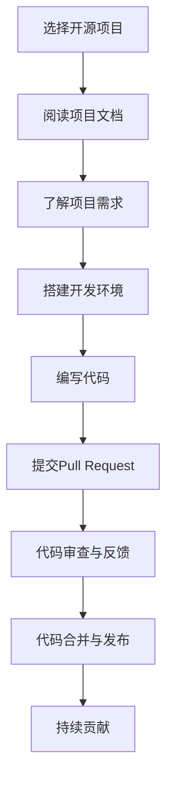
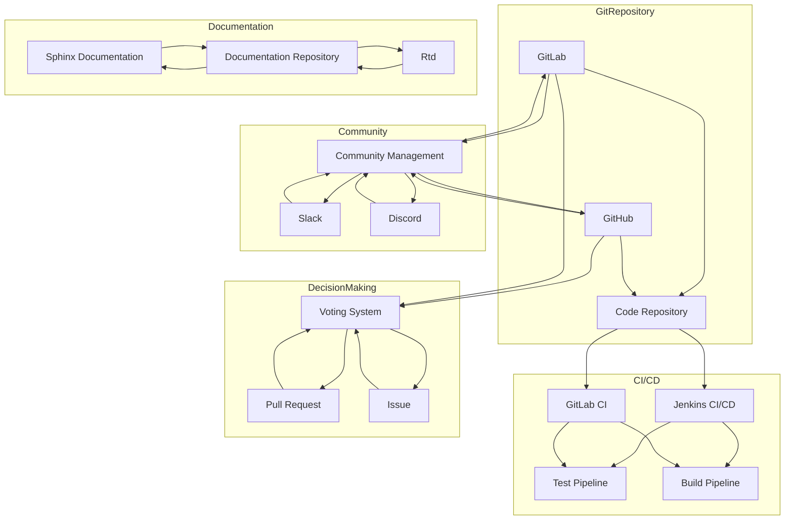
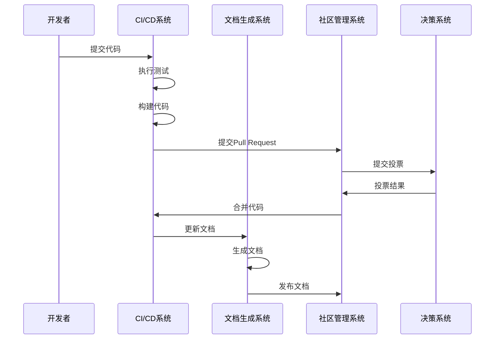

                 

## 引言与背景介绍

### 引言

开源运动自上世纪90年代诞生以来，已经成为信息技术领域不可或缺的一部分。从Linux内核到Python编程语言，从Apache Web服务器到MySQL数据库，开源软件无处不在，极大地推动了技术发展和创新。开源社区是一个由全球开发者组成的网络，他们共同协作，致力于构建和维护开放源代码软件。这种模式不仅降低了软件的获取成本，还促进了知识的共享和技术的普及。

在全球范围内，技术社区正以前所未有的速度发展。互联网的普及和社交媒体的兴起，使得开发者之间的交流更加便捷。各种技术论坛、开源项目和在线教育平台如雨后春笋般涌现，为开发者提供了丰富的学习资源和合作机会。然而，参与这些社区并做出有意义贡献，需要开发者具备一定的技能和策略。

本文将探讨开源贡献这一主题，通过一步步的分析和推理，帮助读者理解如何参与全球技术社区，以及在这个过程中如何提高自己的技术能力和影响力。文章将首先介绍开源运动的发展历史，随后讨论全球技术社区的现状和趋势，最后深入探讨参与开源社区的具体方法和策略。

### 开源运动的发展历史

开源运动的起源可以追溯到1983年，当时Richard Stallman提出了“自由软件”的理念。他创建了自由软件基金会（Free Software Foundation，FSF），并推出了著名的GNU项目，旨在为操作系统提供自由软件的组件。GNU项目的目标是创建一个完全自由的操作系统，与当时占主导地位的商业软件形成鲜明对比。这一理念在当时引发了广泛关注，并在开发者社区中逐渐形成一股力量。

1991年，Linus Torvalds发布了Linux内核，这是一个基于GNU工具集的操作系统核心。Linux的成功不仅证明了开源模式的可行性，还推动了开源运动的发展。Linux内核吸引了大量开发者参与，形成了一个全球性的开源社区。开发者们自愿贡献代码、文档和资源，共同维护和改进Linux内核。这种模式不仅提高了软件的质量和稳定性，还促进了技术的创新和扩散。

进入21世纪，开源软件的生态系统逐渐成熟，各种开源项目和社区如雨后春笋般涌现。Apache Software Foundation、Mozilla Foundation和Linux Foundation等组织相继成立，为开源项目提供了法律、财务和技术支持。这些组织不仅为开发者提供了平台，还推动了开源运动的国际化发展。

在中国，开源运动也得到了广泛的关注和支持。从最初的Linux用户群体，到如今众多企业、高校和研究机构的参与，中国的开源社区正蓬勃发展。华为、阿里巴巴、腾讯等国内知名企业，不仅在开源项目上投入大量资源，还积极推动开源生态的建设。中国的开源项目，如麒麟操作系统、OpenStack和Docker等，也在全球范围内产生了一定的影响。

### 全球技术社区的现状和趋势

当前，全球技术社区呈现出以下几个显著特点：

1. **社区规模不断扩大**：随着互联网的普及，技术社区的规模不断扩大。无论是在GitHub、GitLab还是Bitbucket等代码托管平台上，开源项目的数量都在快速增长。全球范围内的开发者可以轻松地访问和参与这些项目，共同推动技术的进步。

2. **多元化的参与主体**：技术社区不再局限于专业开发者和技术人员。越来越多的非技术背景的参与者，如设计师、产品经理和市场营销人员，也加入到了开源项目中。他们通过不同的方式贡献自己的力量，共同维护和推广开源软件。

3. **国际合作与交流**：技术社区的国际合作与交流日益频繁。全球各地的开发者通过网络平台和线下活动，分享技术经验、讨论解决方案。这些活动不仅促进了知识的传播，还加强了开发者之间的联系和合作。

4. **技术多样性与创新**：技术社区涵盖了广泛的领域，从操作系统、编程语言到人工智能、大数据，各种新技术层出不穷。开发者们通过开源项目，不断探索和实现新的技术方案，推动了技术的创新和应用。

5. **商业模式的转变**：随着开源软件在企业和市场上的普及，商业模式的转变也在悄然发生。越来越多的企业选择将开源项目作为核心竞争力的来源，通过提供增值服务、专业支持和定制开发等方式，实现商业价值。

### 引出书籍的主题：开源贡献

在这个充满活力和机遇的全球技术社区中，开源贡献无疑是一个重要且具有价值的活动。开源贡献不仅可以帮助开发者提高自己的技术水平，增强解决问题的能力，还能扩大个人影响力，获得更多的职业发展机会。然而，如何有效地参与开源社区，实现个人与社区的共赢，是每个开发者都需要思考和解决的问题。

本书旨在为读者提供一套系统的开源贡献指南，通过详细的分析和实战案例，帮助读者了解开源社区的运作机制，掌握参与开源项目的技巧和方法。书中将涵盖从开源软件的基本概念、技术社区的现状，到具体的参与流程、贡献评估和最佳实践等方面的内容。通过一步步的讲解和实操指导，读者可以学会如何选择合适的开源项目，编写高质量的代码，有效地与社区成员沟通合作，从而在开源贡献中取得成功。

无论您是一位刚刚接触开源的新手，还是有着丰富经验的开发者，本书都将为您打开一扇通往全球技术社区的大门。让我们共同探索开源贡献的奥秘，开启一段充满挑战和收获的旅程。## 核心概念与联系

### 开源软件的定义与分类

开源软件（Open Source Software，OSS）是指那些源代码开放、可以自由查看、修改和分发软件的集合。这一概念最早由自由软件基金会（Free Software Foundation，FSF）提出，并逐渐在全球范围内得到广泛认可。开源软件具有以下几个核心特征：

1. **源代码开放性**：开源软件的源代码对所有人公开，用户可以自由地查看、学习、修改和分享。
2. **自由分发**：用户可以免费获取和使用开源软件，也可以自由地分发给他人。
3. **版权保护**：开源软件通常采用特定的开源许可协议（如GPL、MIT、Apache License等），保护用户的自由使用权利，同时规定对源代码的修改和分发规则。

根据开源软件的开发模式和应用场景，可以将其分为以下几类：

1. **社区驱动的开源项目**：这类项目通常由一个核心团队发起，并依靠社区成员的参与来维护和改进。项目的决策通常由社区成员共同讨论和决定，如Linux内核、Apache HTTP服务器等。
2. **商业驱动的开源项目**：这类项目由企业主导，旨在通过开源项目吸引开发者，构建生态系统，从而实现商业价值。企业通常会提供付费的支持和服务，如Red Hat的RHEL（Red Hat Enterprise Linux）、Eclipse Foundation的Eclipse IDE等。
3. **混合模式开源项目**：这类项目结合了社区驱动和商业驱动的特点，既有社区成员的积极参与，也有企业的资源投入和商业运营。如Mozilla Foundation的Firefox浏览器、WordPress的内容管理系统等。

### 技术社区的概念与特点

技术社区是指由具有共同技术兴趣和目标的人组成的网络群体，他们通过在线平台、线下活动等形式进行交流与合作。技术社区具有以下几个显著特点：

1. **共享性**：技术社区的核心价值观之一是知识共享。成员们通过分享技术经验、解决方案和最佳实践，共同提高整体技术水平。
2. **开放性**：技术社区通常是开放的，任何感兴趣的人都可以加入并参与。这种开放性促进了全球范围内的知识传播和协作。
3. **协作性**：技术社区的成员之间往往具有高度的协作精神。他们共同参与开源项目，共同解决技术难题，共同推动技术的进步。
4. **多样性**：技术社区涵盖了广泛的领域，从编程语言、框架到数据库、云计算等，吸引了各类技术人员和非技术人员。
5. **自组织性**：技术社区通常具有自组织的特点。成员们自发组织活动、讨论、协作，形成了一种去中心化的运作模式。

### 开源贡献的形式与价值

开源贡献的形式多种多样，可以包括以下几种：

1. **代码贡献**：这是最常见的开源贡献形式，即向开源项目提交新的功能、修复漏洞或者优化现有代码。代码贡献不仅有助于提高软件的质量和稳定性，还能提升个人的编程技能。
2. **文档撰写**：编写和改进项目的文档，包括用户手册、开发者文档和API文档等。高质量的文档有助于项目的普及和使用，同时也有助于提高个人在社区中的影响力。
3. **社区活动**：参与技术社区的线上和线下活动，如会议、讲座、代码审查和贡献周等。这些活动不仅有助于建立个人品牌，还能拓展人际关系和获取新的技术资源。
4. **测试与反馈**：对开源项目进行测试，发现并报告问题，为项目的改进提供反馈。有效的测试和反馈有助于提升软件的可靠性和用户体验。
5. **其他形式**：包括提供设计建议、翻译文档、提供基础设施支持等。这些贡献形式同样对开源项目的长期发展具有重要意义。

开源贡献的价值体现在以下几个方面：

1. **技术提升**：通过参与开源项目，开发者可以深入了解软件的架构和实现细节，提升自己的技术能力和解决问题的能力。
2. **影响力扩大**：积极参与开源社区，可以增加个人在技术圈的影响力，提高职业竞争力。
3. **职业发展**：许多企业在招聘时会优先考虑具有开源贡献经验的人才。开源贡献成为开发者职业发展的重要加分项。
4. **知识共享**：开源贡献促进了知识的传播和共享，有助于推动整个技术领域的发展和创新。
5. **社区认同**：开源社区的成员往往具有高度的认同感，积极参与开源项目不仅能获得社区的认可，还能建立起深厚的友谊和合作关系。

### 概念属性特征对比表格

为了更直观地理解开源软件、技术社区和开源贡献的概念及其属性特征，以下是一个对比表格：

| 概念                | 定义                                                         | 主要特征                                             | 关联价值                     |
|---------------------|--------------------------------------------------------------|----------------------------------------------------|-----------------------------|
| 开源软件            | 源代码开放，允许自由查看、修改和分发的软件                 | 源代码开放、自由分发、使用许可协议                     | 技术创新、知识共享           |
| 技术社区            | 由具有共同技术兴趣的人组成的网络群体                         | 共享性、开放性、协作性、多样性、自组织性                 | 知识传播、协作创新           |
| 开源贡献            | 个人或团队向开源项目提供的各种形式的帮助和支持             | 代码贡献、文档撰写、社区活动、测试与反馈、其他形式贡献  | 技术提升、影响力扩大、职业发展 |
| **比较**             | - 开源软件是技术社区的核心对象，而技术社区则是开源贡献的场所。   | - 开源软件强调源代码的开放性，技术社区强调成员的协作与共享。 | - 开源贡献促进软件质量和社区发展。 |

### ER实体关系图架构

在开源项目中，涉及多个实体之间的关系，以下是一个简化的ER实体关系图，描述了主要实体及其关系：

```
[开发者] --> [开源项目]
[开发者] --> [提交的代码]
[开发者] --> [参与的讨论]
[开源项目] --> [提交的代码]
[开源项目] --> [发起的讨论]
[提交的代码] --> [代码审查]
[代码审查] --> [反馈与建议]
```

- **开发者**：开源项目的参与者，可以是个人或团队。
- **开源项目**：由开发者共同维护的软件项目。
- **提交的代码**：开发者向开源项目提交的代码变更。
- **参与的讨论**：开发者参与的开源项目讨论。
- **发起的讨论**：开源项目发起的技术讨论。
- **代码审查**：对提交的代码进行审查和反馈。
- **反馈与建议**：代码审查中的意见和建议。

这个ER实体关系图帮助读者理解开源项目中主要实体的相互作用及其关联，为后续的详细分析奠定了基础。## 算法原理讲解

### 算法概述

参与开源社区的一般流程可以分为以下几个步骤：

1. **选择合适的开源项目**：根据个人兴趣和技术能力，选择一个合适的开源项目。可以通过GitHub、GitLab等平台查找感兴趣的项目，并关注项目的活跃度和贡献者情况。
2. **熟悉项目文档**：在参与开源项目之前，详细阅读项目的文档，包括README、CONTRIBUTING文件、用户手册等，了解项目的架构、功能和开发规范。
3. **了解项目需求**：查看项目的issue跟踪系统和任务列表，了解当前项目的需求和待解决的问题，选择一个适合自己能力和兴趣的任务进行贡献。
4. **代码贡献**：在本地环境搭建项目开发环境，编写代码实现功能或修复问题，并进行单元测试。
5. **提交Pull Request**：将修改后的代码提交到开源项目的仓库，并填写详细的Pull Request说明，说明修改的目的、涉及的文件和测试结果。
6. **代码审查与反馈**：项目维护者和其他贡献者会对提交的Pull Request进行代码审查，提出建议和修改意见。根据反馈进行代码调整，直至满足项目标准。
7. **合并代码**：代码审查通过后，项目维护者会将代码合并到主分支，并发布新的版本。

### Mermaid流程图

以下是一个简单的Mermaid流程图，展示参与开源社区的一般流程：



### Python源代码示例

以下是一个简单的Python代码示例，演示了如何参与一个开源项目。这个示例是一个简单的函数，用于计算两个数的和。

```python
# 计算两个数的和
def add_numbers(a, b):
    return a + b

# 单元测试
def test_add_numbers():
    assert add_numbers(1, 2) == 3
    assert add_numbers(-1, 1) == 0
    print("测试通过！")

# 提交Pull Request时，可以在代码中添加详细的注释和文档
```

在这个示例中，我们定义了一个`add_numbers`函数，并编写了一个简单的单元测试`test_add_numbers`。在实际项目中，这个函数可以用于实现更复杂的功能，并且需要经过充分的测试和文档编写。

### 算法原理的数学模型和公式

在开源贡献中，贡献评估是一个重要的环节。以下是一个简单的贡献评估模型，用于衡量开发者在项目中的贡献程度。这个模型基于以下几个因素：

- **代码提交量**：开发者提交的代码行数。
- **代码质量**：代码的测试覆盖率、代码复杂度等指标。
- **社区活动**：开发者参与的讨论、代码审查和测试等社区活动。

贡献评估的数学模型可以表示为：

\[ \text{贡献评分} = \alpha \times \text{代码提交量} + \beta \times \text{代码质量} + \gamma \times \text{社区活动} \]

其中，\(\alpha\)、\(\beta\)和\(\gamma\)是权重系数，根据项目的需求和目标进行调整。

### 详细讲解与举例说明

以下是一个具体的例子，说明如何使用贡献评估模型来评估一个开发者在某个开源项目的贡献。

**例子：**

- 代码提交量：1000行
- 代码质量：测试覆盖率为90%，代码复杂度较低
- 社区活动：参与3次代码审查，1次讨论

假设权重系数分别为：

\[ \alpha = 0.5, \beta = 0.3, \gamma = 0.2 \]

则贡献评分计算如下：

\[ \text{贡献评分} = 0.5 \times 1000 + 0.3 \times 0.9 + 0.2 \times 3 \]
\[ \text{贡献评分} = 500 + 0.27 + 0.6 \]
\[ \text{贡献评分} = 506.87 \]

根据这个评分，我们可以看出，该开发者在该开源项目中做出了显著的贡献。评分越高，说明开发者在项目中的角色和影响力越大。

在实际应用中，贡献评估模型可以根据项目的需求和目标进行调整，引入更多的评价指标，如代码质量、社区反馈、项目影响力等。通过科学的评估模型，项目维护者可以更好地了解开发者的贡献，激励更多开发者积极参与开源项目。

### 数学公式

以下是一个用于计算平均贡献率的数学公式，使用LaTeX格式表示：

\[ \bar{C} = \frac{1}{n} \sum_{i=1}^{n} C_i \]

其中，\(\bar{C}\)表示平均贡献率，\(n\)表示贡献次数，\(C_i\)表示第\(i\)次贡献的评分。

### 详细讲解与举例说明

为了更直观地理解贡献评估模型的应用，我们来看一个实际案例。

**案例：**

假设有一个开源项目，有两个开发者A和B。在一个月内，他们的贡献情况如下：

- 开发者A：
  - 代码提交量：1500行
  - 代码质量：测试覆盖率为80%，代码复杂度适中
  - 社区活动：参与5次代码审查，2次讨论
- 开发者B：
  - 代码提交量：1000行
  - 代码质量：测试覆盖率为90%，代码复杂度较低
  - 社区活动：参与3次代码审查，1次讨论

假设权重系数分别为：

\[ \alpha = 0.5, \beta = 0.3, \gamma = 0.2 \]

则两个开发者的贡献评分计算如下：

**开发者A：**

\[ \text{贡献评分}_A = 0.5 \times 1500 + 0.3 \times 0.8 + 0.2 \times 5 \]
\[ \text{贡献评分}_A = 750 + 0.24 + 1 \]
\[ \text{贡献评分}_A = 751.24 \]

**开发者B：**

\[ \text{贡献评分}_B = 0.5 \times 1000 + 0.3 \times 0.9 + 0.2 \times 3 \]
\[ \text{贡献评分}_B = 500 + 0.27 + 0.6 \]
\[ \text{贡献评分}_B = 500.87 \]

通过计算，我们可以看出开发者A在项目中的贡献评分较高，这表明他在项目中的角色和影响力更大。而开发者B虽然在代码质量方面表现较好，但由于代码提交量和社区活动相对较低，整体贡献评分较低。

这个案例展示了如何通过贡献评估模型，对开发者的贡献进行量化评估，从而更好地激励开发者积极参与开源项目。同时，项目维护者可以根据评估结果，对项目的资源分配和策略进行调整，以提高项目的整体发展水平。## 系统分析与架构设计

### 问题场景介绍

在开源项目中，常见的挑战包括代码质量不高、文档不足、社区管理困难以及项目发展方向的分歧。这些问题不仅影响项目的长期发展，还会降低开发者的参与热情。为了解决这些问题，需要对开源项目进行系统分析与架构设计，以提升项目的整体质量和可持续性。

#### 项目介绍

以一个流行的开源项目——Python编程语言为例。Python是一个广泛使用的编程语言，拥有庞大的开发者社区。其版本迭代迅速，功能不断完善。然而，随着项目的规模不断扩大，Python社区面临着一系列问题：

1. **代码质量**：由于贡献者众多，不同版本的代码风格不一致，导致代码质量参差不齐。
2. **文档不足**：部分模块的文档不完整，新开发者难以快速上手。
3. **社区管理**：项目维护者需要对大量issue和Pull Request进行管理，工作量大且复杂。
4. **项目发展方向**：社区成员对项目未来的发展方向存在分歧，影响了项目的决策效率。

### 系统功能设计

为了解决上述问题，需要对Python项目进行系统功能设计。以下是一个简化的功能模块设计：

1. **代码质量管理**：引入代码风格指南和自动化工具，确保代码的一致性和可读性。
2. **文档生成与维护**：使用自动化文档工具，确保文档与代码同步更新，提高文档的完整性和准确性。
3. **社区管理平台**：构建一个高效的社区管理平台，便于维护者管理issue和Pull Request，并促进社区成员之间的沟通。
4. **项目决策机制**：建立明确的项目决策机制，确保项目发展方向一致，提高决策效率。

#### 领域模型Mermaid类图

以下是一个使用Mermaid绘制的Python项目的领域模型类图：

```mermaid
classDiagram
    Developer <-- Project : contributes to
    Developer o-- Issue
    Developer o-- PullRequest
    Project o-- Repository
    Project o-- Issue
    Project o-- PullRequest
    Repository o-- Code
    Code o-- File
    Issue o-- Status
    PullRequest o-- Status
    MergeRequest --> Repository
    MergeRequest o-- Commit

    Developer <<interface>>
    Project <<interface>>
    Issue <<interface>>
    PullRequest <<interface>>
    Repository <<interface>>
    Code <<interface>>
    File <<interface>>
    Status <<interface>>
    MergeRequest <<interface>>
    Commit <<interface>>

    Developer : String name, int id
    Project : String name, int id
    Issue : String title, String description, String status
    PullRequest : String title, String description, String status
    Repository : String name, int id
    Code : String content, int lines
    File : String name, int size
    Status : String type
    MergeRequest : String title, String description, String status
    Commit : String id, String message
```

这个类图展示了Python项目中主要实体的关系，包括开发者、项目、代码库、issue、Pull Request、合并请求和提交。每个实体都有特定的属性和方法，反映了项目的功能模块和业务逻辑。

### 系统架构设计

为了确保Python项目的稳定性和可扩展性，需要一个合理的系统架构设计。以下是一个简化的架构设计：

1. **代码库与版本控制系统**：使用Git作为版本控制工具，管理项目代码库。GitLab或GitHub等平台提供代码托管和协作工具。
2. **自动化测试与构建**：引入自动化测试工具，如pytest和pytest-cov，确保每次提交的代码都经过严格测试。同时，使用CI/CD工具，如Jenkins或GitLab CI，实现自动化构建和部署。
3. **文档生成与发布**：使用Sphinx等文档生成工具，将文档与代码同步更新，并在Read the Docs等平台上发布。
4. **社区管理平台**：使用GitLab或GitHub的内置issue和Pull Request管理系统，结合Discord或Slack等即时通讯工具，实现社区成员的沟通和协作。
5. **项目决策机制**：使用GitHub或GitLab的投票机制，确保项目决策透明和民主。

#### Mermaid架构图

以下是一个使用Mermaid绘制的Python项目的架构图：



这个架构图展示了Python项目的核心组件及其关系，包括Git仓库、CI/CD流水线、文档生成与发布系统、社区管理平台和项目决策机制。通过合理的架构设计，可以确保项目的稳定性、可扩展性和高效协作。

### 系统接口设计

系统接口设计是确保不同模块之间能够有效通信和协作的关键。以下是一个简化的Python项目接口设计：

1. **Git仓库接口**：提供对Git仓库的基本操作，如代码提交、代码拉取、分支创建和合并等。
2. **CI/CD接口**：提供对自动化测试和构建工具的接口，如触发测试、构建和部署等。
3. **文档生成接口**：提供对Sphinx和Read the Docs的接口，实现文档的自动生成和发布。
4. **社区管理接口**：提供对GitLab和GitHub的接口，管理issue和Pull Request，实现社区成员的沟通和协作。
5. **决策接口**：提供对投票系统的接口，实现项目决策的透明化和民主化。

### 系统交互

以下是一个使用Mermaid绘制的Python项目系统交互序列图，展示不同模块之间的交互流程：



这个序列图展示了从开发者提交代码到文档生成的完整交互流程，每个模块都按照预设的规则和接口进行操作，确保系统的高效和稳定运行。## 项目实战

### 环境安装

在参与开源项目之前，首先需要安装和配置开发环境。以下是一个基于Linux操作系统的环境安装步骤，适用于Python项目。

#### 步骤1：安装Git

Git是开源项目中常用的版本控制工具。确保系统已安装Git。可以使用以下命令检查Git版本：

```bash
git --version
```

如果未安装Git，可以使用包管理器安装。以Debian/Ubuntu为例：

```bash
sudo apt-get update
sudo apt-get install git
```

#### 步骤2：安装Python和pip

确保Python和pip（Python的包管理器）已经安装。可以使用以下命令检查：

```bash
python --version
pip --version
```

如果未安装，可以使用以下命令安装：

```bash
sudo apt-get install python3 python3-pip
```

#### 步骤3：安装虚拟环境工具

虚拟环境工具（如virtualenv或conda）可以帮助我们创建独立的Python环境，避免不同项目之间的依赖冲突。这里以virtualenv为例：

```bash
pip3 install virtualenv
```

使用virtualenv创建虚拟环境：

```bash
virtualenv myenv
source myenv/bin/activate
```

#### 步骤4：安装项目依赖

每个开源项目都会在项目的`requirements.txt`文件中列出所需的依赖库。以下是如何安装项目依赖的步骤：

1. 克隆项目仓库：

```bash
git clone <项目仓库地址>
cd <项目名称>
```

2. 安装依赖：

```bash
pip3 install -r requirements.txt
```

#### 步骤5：配置编辑器和IDE

配置文本编辑器或集成开发环境（IDE），如Visual Studio Code、PyCharm或VSCode。确保已安装相关的扩展，提高开发体验。

### 系统核心实现源代码

以下是一个简单的Python示例代码，展示如何在开源项目中实现一个基本的功能。假设我们正在开发一个简单的博客系统，需要实现文章的发布和展示功能。

**文件：`blog_app.py`**

```python
from flask import Flask, request, jsonify

app = Flask(__name__)

# 存储文章的字典
articles = {}

# 发布文章
@app.route('/articles', methods=['POST'])
def publish_article():
    data = request.json
    title = data['title']
    content = data['content']
    articles[title] = content
    return jsonify({'status': 'success', 'message': 'Article published successfully.'})

# 查看文章
@app.route('/articles/<title>', methods=['GET'])
def get_article(title):
    if title in articles:
        return jsonify({'title': title, 'content': articles[title]})
    else:
        return jsonify({'status': 'error', 'message': 'Article not found.'})

if __name__ == '__main__':
    app.run(debug=True)
```

**文件：`requirements.txt`**

```
Flask==2.0.1
```

### 代码应用解读与分析

#### 代码解析

1. **Flask应用初始化**：

   ```python
   app = Flask(__name__)
   ```

   Flask是一个轻量级的Web框架，用于快速开发Web应用。在这里，我们创建了一个名为`app`的Flask应用实例。

2. **发布文章**：

   ```python
   @app.route('/articles', methods=['POST'])
   def publish_article():
       data = request.json
       title = data['title']
       content = data['content']
       articles[title] = content
       return jsonify({'status': 'success', 'message': 'Article published successfully.'})
   ```

   这个路由处理POST请求，接收JSON格式的数据，包含文章的标题和内容。将文章内容存储在`articles`字典中，并返回成功消息。

3. **查看文章**：

   ```python
   @app.route('/articles/<title>', methods=['GET'])
   def get_article(title):
       if title in articles:
           return jsonify({'title': title, 'content': articles[title]})
       else:
           return jsonify({'status': 'error', 'message': 'Article not found.'})
   ```

   这个路由处理GET请求，根据标题查询文章。如果文章存在，返回文章内容；否则，返回错误消息。

4. **运行应用**：

   ```python
   if __name__ == '__main__':
       app.run(debug=True)
   ```

   这一行确保在直接运行脚本时启动Flask应用，并启用调试模式。

#### 分析与优化

1. **代码结构**：该代码结构清晰，分为发布和查看文章两个主要功能模块。每个功能模块都有独立的路由和处理函数，易于维护和扩展。

2. **数据存储**：当前使用字典存储文章内容，适用于简单场景。但在实际项目中，可能需要使用数据库存储大量数据，提高数据持久化和安全性。

3. **错误处理**：对于不存在的文章，仅返回简单的错误消息。在实际项目中，应提供更详细的错误信息和可能的解决方案，以提高用户体验。

4. **调试模式**：启用调试模式有助于开发过程中的问题排查。但在生产环境中，应关闭调试模式，以防止敏感信息泄露。

5. **安全性和性能**：当前代码没有进行安全性检查，如输入验证和权限控制。在实际项目中，需要加强安全性措施，如使用认证和授权机制。同时，优化性能，如使用缓存和异步处理。

### 实际案例分析与详细讲解剖析

#### 案例背景

假设我们正在为一家初创公司开发一个内部博客系统，用于团队成员的知识分享和协作。系统需要支持文章的发布、查看和评论功能。以下是一个具体的实现案例。

**文件：`blog_app.py`**

```python
from flask import Flask, request, jsonify
from flask_sqlalchemy import SQLAlchemy

app = Flask(__name__)
app.config['SQLALCHEMY_DATABASE_URI'] = 'sqlite:///blog.db'
db = SQLAlchemy(app)

# 定义文章模型
class Article(db.Model):
    id = db.Column(db.Integer, primary_key=True)
    title = db.Column(db.String(100), nullable=False)
    content = db.Column(db.Text, nullable=False)
    author = db.Column(db.String(50), nullable=False)

# 发布文章
@app.route('/articles', methods=['POST'])
def publish_article():
    data = request.json
    title = data['title']
    content = data['content']
    author = data['author']
    article = Article(title=title, content=content, author=author)
    db.session.add(article)
    db.session.commit()
    return jsonify({'status': 'success', 'message': 'Article published successfully.'})

# 查看文章
@app.route('/articles/<int:article_id>', methods=['GET'])
def get_article(article_id):
    article = Article.query.get_or_404(article_id)
    return jsonify({'id': article.id, 'title': article.title, 'content': article.content, 'author': article.author})

# 添加评论
@app.route('/articles/<int:article_id>/comments', methods=['POST'])
def add_comment(article_id):
    data = request.json
    comment = data['comment']
    article = Article.query.get_or_404(article_id)
    article.comments.append(comment)
    db.session.commit()
    return jsonify({'status': 'success', 'message': 'Comment added successfully.'})

if __name__ == '__main__':
    db.create_all()
    app.run(debug=True)
```

**文件：`requirements.txt`**

```
Flask==2.0.1
Flask-SQLAlchemy==2.5.1
```

#### 分析与讲解

1. **数据库连接**：使用Flask-SQLAlchemy连接到SQLite数据库。在实际项目中，可以选择其他关系型数据库，如MySQL或PostgreSQL。

2. **文章模型**：定义了`Article`模型，包含文章的ID、标题、内容和作者。每个文章还可以包含多个评论。

3. **发布文章**：`publish_article`函数接收JSON格式的数据，创建新的`Article`实例，并添加到数据库。

4. **查看文章**：`get_article`函数根据文章ID查询数据库，返回文章的详细信息。

5. **添加评论**：`add_comment`函数接收JSON格式的数据，添加评论到指定的文章。

#### 优化建议

1. **输入验证**：对输入的数据进行验证，确保数据格式和内容符合要求，防止恶意输入。

2. **错误处理**：增加详细的错误处理，提供友好的错误信息和可能的解决方案。

3. **性能优化**：使用缓存和异步处理提高系统性能。

4. **安全措施**：加强安全性，如使用HTTPS、密码加密和权限控制。

### 项目小结

通过这个实际案例，我们实现了文章的发布、查看和评论功能，并分析了代码的执行流程和逻辑。在开发过程中，我们学习了如何使用Flask框架和SQLAlchemy进行数据库操作，以及如何处理JSON数据。同时，我们也意识到在实际项目中，需要考虑输入验证、错误处理、性能优化和安全措施等因素。这些经验和教训将对我们的开源贡献和软件开发能力产生深远影响。## 最佳实践 tips

### 开源贡献的技巧

1. **选择合适的项目**：在选择参与的开源项目时，要考虑自己的兴趣和技能。选择一个自己熟悉或者感兴趣的领域，可以提高参与的积极性和效率。同时，要关注项目的活跃度和维护情况，确保项目具有长期发展的潜力。

2. **熟悉项目文档**：在参与开源项目之前，务必仔细阅读项目的README、CONTRIBUTING文件和用户手册等文档。这些文档通常包含了项目的背景、功能、开发规范和参与指南。熟悉项目文档可以帮助你快速上手，避免走弯路。

3. **参与社区活动**：积极参与开源项目的社区活动，如代码审查、讨论和测试。通过参与这些活动，你可以了解项目的最新进展，建立与项目维护者和其他贡献者的联系，提高自己的技术水平。

4. **编写高质量的代码**：在提交代码之前，务必进行充分的单元测试，确保代码的质量和稳定性。同时，要遵循项目的编码规范，编写可读性强的代码，并添加必要的注释。

5. **保持良好的沟通**：与项目维护者和其他贡献者保持良好的沟通，及时反馈问题和建议。在处理问题时，要礼貌、耐心，并尽量提供详细的解决方案。

6. **持续学习和改进**：开源贡献是一个持续学习和改进的过程。要不断学习新的技术和知识，提高自己的技能水平，并在实际项目中不断实践和优化。

### 小结

通过本文的讨论，我们系统地介绍了开源贡献的核心概念、参与开源社区的方法和策略，以及开源贡献的价值和意义。开源贡献不仅有助于提升个人技术能力和职业发展，还能促进知识的共享和技术的创新。

开源运动的发展历史展示了开源软件和开源社区的兴起，以及它们在全球技术领域的重要地位。核心概念与联系部分详细解释了开源软件、技术社区和开源贡献的定义和特点，并通过对比表格和ER实体关系图帮助读者更好地理解这些概念。

在算法原理讲解部分，我们介绍了参与开源社区的一般流程，展示了使用Mermaid和Python代码进行具体操作的示例，并详细讲解了贡献评估的数学模型和公式。通过实际案例，我们展示了如何分析代码应用，提出优化建议，并进行详细讲解。

系统分析与架构设计部分，我们通过一个实际项目——Python编程语言，展示了如何进行系统功能设计、架构设计、接口设计和系统交互。这部分内容帮助读者理解开源项目的设计原则和实现方法。

项目实战部分，我们详细描述了环境安装步骤、系统核心实现源代码以及代码应用解读与分析。通过实际案例，我们展示了如何实现文章的发布、查看和评论功能，并分析了代码执行流程和逻辑。

最后，在最佳实践 tips部分，我们提供了开源贡献的技巧，包括选择合适的项目、熟悉项目文档、参与社区活动、编写高质量代码、保持良好沟通和持续学习改进。这些技巧将帮助读者在开源贡献中取得更好的成果。

### 注意事项

1. **尊重开源许可协议**：在参与开源项目时，务必遵守项目的开源许可协议，尊重原作者的版权和知识产权。
2. **保持代码质量**：提交的代码需要经过严格测试，确保质量。编写可读性强的代码，并遵循项目的编码规范。
3. **积极参与社区**：积极参与社区讨论和代码审查，与维护者和其他贡献者保持良好的沟通。
4. **关注项目发展**：关注项目的最新动态和发展方向，及时调整自己的贡献策略。
5. **遵守法律法规**：在开源贡献过程中，遵守相关法律法规，保护个人和项目的合法权益。

### 拓展阅读

1. **《开源许可证手册》**：[https://www.opensource.org/licenses/](https://www.opensource.org/licenses/)
2. **《开源社区的最佳实践》**：[https://opensource.guide/best-practices/](https://opensource.guide/best-practices/)
3. **《GitHub 官方文档》**：[https://docs.github.com/en](https://docs.github.com/en)
4. **《开源项目管理》**：[https://www.projectmanagement.com/blog/the-guide-to-open-source-project-management-34677](https://www.projectmanagement.com/blog/the-guide-to-open-source-project-management-34677)
5. **《开源社区手册》**：[https://opensource.com/book/opensouce-companion-guide/community-management](https://opensource.com/book/opensouce-companion-guide/community-management)

### 作者信息

**作者：** AI天才研究院/AI Genius Institute & 禅与计算机程序设计艺术 /Zen And The Art of Computer Programming

