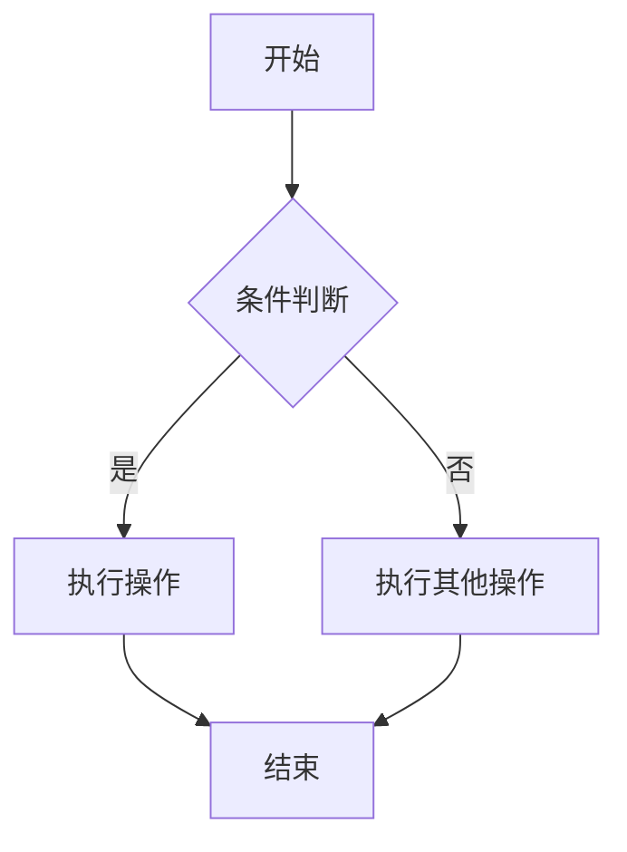

                 

## 《开源项目参与和维护指南》

### 关键词：开源项目、参与、维护、最佳实践、指南

### 摘要：

本文旨在为技术爱好者、开源项目参与者以及维护者提供一份详细的开源项目参与和维护指南。文章首先介绍了开源项目的背景、核心概念及其重要性。接着，深入探讨了开源项目中的核心概念、算法原理以及数学模型，并通过实例进行详细讲解。此外，文章还详细介绍了开源项目的系统分析与架构设计方案，并分享了一些实际项目的实战经验。最后，文章总结了一些参与开源项目的最佳实践，并给出了注意事项和拓展阅读建议。

## 目录

### 1. 背景介绍
#### 1.1 开源项目的起源与发展
#### 1.2 核心概念术语说明
#### 1.3 问题背景与问题描述
#### 1.4 问题解决方法
#### 1.5 边界与外延
#### 1.6 概念结构与核心要素组成

### 2. 核心概念与联系
#### 2.1 开源项目的核心概念
#### 2.2 概念属性特征对比表格
#### 2.3 Mermaid流程图展示ER实体关系图架构

### 3. 算法原理讲解
#### 3.1 使用Mermaid绘制算法流程图
#### 3.2 Python源代码阐述算法原理
#### 3.3 数学模型与公式
#### 3.4 举例说明

### 4. 数学模型和数学公式 & 详细讲解 & 举例说明
#### 4.1 LaTeX格式给出数学公式
#### 4.2 数学公式的详细讲解
#### 4.3 举例说明

### 5. 系统分析与架构设计方案
#### 5.1 问题场景介绍
#### 5.2 项目介绍
#### 5.3 系统功能设计
#### 5.4 系统架构设计
#### 5.5 系统接口设计
#### 5.6 系统交互

### 6. 项目实战
#### 6.1 环境安装
#### 6.2 系统核心实现源代码
#### 6.3 代码应用解读与分析
#### 6.4 实际案例分析与详细讲解
#### 6.5 项目小结

### 7. 最佳实践 tips
#### 7.1 参与开源项目的技巧
#### 7.2 维护开源项目的策略
#### 7.3 小结

### 8. 注意事项
#### 8.1 开源项目参与与维护的挑战
#### 8.2 安全与隐私问题
#### 8.3 遵循开源许可协议

### 9. 拓展阅读
#### 9.1 相关书籍推荐
#### 9.2 开源社区资源
#### 9.3 开源项目评价标准

## 1. 背景介绍

### 1.1 开源项目的起源与发展

开源项目（Open Source Project）起源于20世纪80年代的自由软件运动。当时，自由软件基金会（Free Software Foundation，FSF）提出了“自由软件”的理念，主张软件的自由传播和修改。随着时间的推移，自由软件运动逐渐发展壮大，形成了开源项目。

开源项目的核心在于其源代码的开放性和透明性，即任何人都可以查看、修改和分发项目的源代码。这种模式不仅促进了技术共享和创新，也为全球的开发者提供了丰富的学习和贡献机会。如今，开源项目已成为现代软件开发不可或缺的一部分，许多知名软件，如Linux操作系统、Apache Web服务器、MySQL数据库等，都是开源项目的代表。

### 1.2 核心概念术语说明

在开源项目中，有一些核心概念和术语需要了解：

- **源代码**：指软件的原始代码，是程序员编写和修改的基础。
- **版本控制**：用于跟踪和管理源代码更改的软件工具，如Git。
- **贡献者**：为开源项目提供代码、文档、测试等贡献的个人或组织。
- **开源许可证**：规定了软件使用、修改和分发条件的法律文件，如GPL、MIT、BSD等。
- **社区**：指围绕开源项目形成的开发者群体，负责项目的讨论、决策和协作。

### 1.3 问题背景与问题描述

开源项目的核心价值在于其协作和共享特性，但也因此带来了一系列问题。以下是一些常见的问题及其描述：

- **代码质量**：开源项目的代码质量参差不齐，可能存在缺陷、漏洞和安全问题。
- **维护难度**：随着项目规模的扩大，维护难度也随之增加，需要投入大量时间和精力。
- **社区管理**：如何有效地管理开源社区的讨论、决策和协作，确保项目的发展方向和稳定性。
- **依赖关系**：开源项目可能与其他项目存在依赖关系，如何管理这些依赖关系，确保项目的稳定性和兼容性。

### 1.4 问题解决方法

针对上述问题，有以下几种解决方法：

- **代码审核**：通过定期进行代码审核，确保代码质量，发现和修复缺陷、漏洞。
- **版本控制和分支管理**：使用版本控制工具和分支策略，确保代码的稳定性和可维护性。
- **社区建设**：建立健康、活跃的社区，鼓励贡献者参与讨论、决策和协作。
- **依赖管理**：使用依赖管理工具，如Maven、Gradle等，确保项目的依赖关系得到有效管理。

### 1.5 边界与外延

开源项目并非万能，其边界和局限性也需要注意：

- **项目范围**：开源项目的范围有限，可能无法涵盖所有需求，需要与其他项目或工具结合使用。
- **技术成熟度**：一些开源项目可能尚未达到商业应用的成熟度，需要进一步开发和优化。
- **法律风险**：开源许可证可能对项目的使用、修改和分发产生限制，需要遵守相关法律条款。

### 1.6 概念结构与核心要素组成

开源项目由多个核心要素组成，包括：

- **源代码**：是项目的核心，用于实现软件的功能。
- **文档**：包括项目README、API文档、用户手册等，用于帮助开发者理解和使用项目。
- **测试**：包括单元测试、集成测试和性能测试等，用于验证项目的功能和质量。
- **工具**：用于项目开发、测试和发布的工具，如编译器、调试器、构建工具等。
- **社区**：是项目的生命线，负责项目的讨论、决策和协作。

这些要素相互关联，共同构成了一个完整的开源项目。在参与和维护开源项目时，需要综合考虑这些要素，确保项目的健康和可持续发展。

## 2. 核心概念与联系

### 2.1 开源项目的核心概念

在深入探讨开源项目之前，了解其核心概念是非常重要的。以下是几个关键概念：

#### 源代码

源代码是软件开发的基础，是程序员编写的原始文本文件。源代码的质量直接影响软件的性能、稳定性和可维护性。在开源项目中，源代码是公开的，任何人都可以查看、修改和分发。

#### 版本控制

版本控制是跟踪和管理源代码更改的重要工具。常见的版本控制软件有Git、SVN和Mercurial等。版本控制不仅可以确保代码的历史记录和可追溯性，还可以帮助多人协作开发，避免代码冲突。

#### 贡献者

贡献者是开源项目的核心成员，他们通过编写代码、编写文档、进行测试和维护等贡献，推动项目的发展。贡献者可以是个人开发者、组织团队，甚至是大型公司的工程师。

#### 开源许可证

开源许可证规定了软件的使用、修改和分发条件。常见的开源许可证有GPL（GNU General Public License）、MIT、BSD等。不同的许可证具有不同的法律约束力，需要根据项目需求选择合适的许可证。

### 2.2 概念属性特征对比表格

以下是几个核心概念及其属性特征的对比表格：

| 概念       | 属性特征                                                                                           |
|------------|---------------------------------------------------------------------------------------------------|
| 源代码     | 公开、可修改、可分发                                                                             |
| 版本控制   | 跟踪代码变更、支持多人协作、分支管理                                                             |
| 贡献者     | 活跃、有专业知识、愿意分享和贡献                                                                 |
| 开源许可证 | 法律约束、使用限制、修改与分发规则                                                               |

### 2.3 Mermaid流程图展示ER实体关系图架构

ER（Entity-Relationship）图是一种用于表示数据库中实体及其关系的图形表示方法。以下是开源项目中常见的ER图示例，使用Mermaid语法绘制：

```mermaid
erDiagram
  User ||--|{ Repository }|-- Project
  Repository ||--|{ Commit }|-- Project
  Commit ||--|{ File }|-- Project
  Project ||--|{ Issue }|-- Repository
  Issue ||--|{ Comment }|-- Project
```

在这个ER图中，User实体与Repository实体之间存在“多对多”的关系，表示用户可以创建和参与多个项目；Repository实体与Commit实体之间存在“一对多”的关系，表示一个仓库可以有多个提交；Commit实体与File实体之间存在“一对多”的关系，表示一个提交可以修改多个文件；Project实体与Issue实体之间存在“一对多”的关系，表示一个项目可以生成多个问题报告；Issue实体与Comment实体之间存在“一对多”的关系，表示一个问题报告可以有多个评论。

通过这个ER图，我们可以清晰地了解开源项目中各个实体及其关系，为后续的算法设计和系统架构设计提供了基础。

## 3. 算法原理讲解

### 3.1 使用Mermaid绘制算法流程图

在开源项目中，算法的效率和质量至关重要。为了更好地理解和分析算法，我们可以使用Mermaid语法绘制算法流程图。以下是算法流程图的一个示例：



在这个流程图中，A表示算法的开始；B是一个条件判断节点，根据条件的结果决定下一步的操作；C和D分别表示两种可能的操作；E表示算法的结束。

### 3.2 Python源代码阐述算法原理

为了进一步阐述算法原理，我们可以使用Python编写代码，并使用注释解释每一步的操作。以下是使用Python实现上述流程图的示例代码：

```python
def algorithm(condition):
    # 开始
    print("开始")

    # 条件判断
    if condition:
        # 是
        print("执行操作")
    else:
        # 否
        print("执行其他操作")

    # 结束
    print("结束")

# 测试
algorithm(True)
algorithm(False)
```

在这个代码中，我们定义了一个名为`algorithm`的函数，接收一个名为`condition`的参数。函数内部首先输出"开始"，然后根据`condition`的值执行相应的操作（"执行操作"或"执行其他操作"），最后输出"结束"。通过调用这个函数，我们可以测试不同的条件，观察算法的执行过程。

### 3.3 数学模型与公式

在算法中，数学模型和公式起着关键作用。以下是一个简单的数学模型，用于计算两个数的和：

$$
S = A + B
$$

其中，$S$表示两个数$A$和$B$的和。这个公式简单明了，但在算法中，我们需要将这个数学模型转化为具体的代码实现。以下是一个使用Python实现的例子：

```python
def sum(A, B):
    return A + B

# 测试
print(sum(2, 3))  # 输出：5
```

在这个例子中，我们定义了一个名为`sum`的函数，接收两个参数$A$和$B$，返回它们的和。通过调用这个函数，我们可以计算任意两个数的和。

### 3.4 举例说明

为了更好地理解算法原理，我们可以通过具体例子进行说明。以下是一个简单的例子，用于计算一个数列的和：

```python
def sum_sequence(n):
    """
    计算一个数列的和。
    :param n: 数列的长度。
    :return: 数列的和。
    """
    total = 0
    for i in range(n):
        total += i
    return total

# 测试
print(sum_sequence(5))  # 输出：10
```

在这个例子中，我们定义了一个名为`sum_sequence`的函数，接收一个参数`n`，表示数列的长度。函数内部使用一个循环计算数列的和，并返回结果。通过调用这个函数，我们可以计算任意长度的数列和。

通过这个例子，我们可以看到算法原理的具体实现过程，包括循环、条件判断、函数调用等。这些基本操作构成了算法的核心，帮助我们解决各种实际问题。

## 4. 数学模型和数学公式 & 详细讲解 & 举例说明

### 4.1 LaTeX格式给出数学公式

在开源项目中，数学模型和公式是算法设计和分析的重要组成部分。为了清晰地表达数学概念，我们可以使用LaTeX格式编写数学公式。以下是一些常用的数学公式及其LaTeX表示方法：

- 加法公式：$$a + b = c$$
- 减法公式：$$a - b = c$$
- 乘法公式：$$a \times b = c$$
- 除法公式：$$a \div b = c$$
- 平方公式：$$a^2 = b$$
- 平方根公式：$$\sqrt{a} = b$$
- 指数公式：$$a^b = c$$
- 对数公式：$$\log_a{b} = c$$
- 导数公式：$$f'(x) = g(x)$$
- 微分公式：$$df = g(x)dx$$
- 积分公式：$$\int f(x)dx = g(x) + C$$

### 4.2 数学公式的详细讲解

为了更好地理解这些数学公式，我们可以进行详细的讲解。以下是每个公式的解释和适用场景：

- **加法公式**：表示两个数$a$和$b$相加的结果等于$c$。适用于任何实数$a$和$b$。
- **减法公式**：表示一个数$a$减去另一个数$b$的结果等于$c$。适用于任何实数$a$和$b$。
- **乘法公式**：表示两个数$a$和$b$相乘的结果等于$c$。适用于任何实数$a$和$b$。
- **除法公式**：表示一个数$a$除以另一个数$b$的结果等于$c$。适用于任何非零实数$a$和$b$。
- **平方公式**：表示一个数$a$的平方等于$b$。适用于任何实数$a$。
- **平方根公式**：表示一个数$a$的平方根等于$b$。适用于任何非负实数$a$。
- **指数公式**：表示一个数$a$的$b$次幂等于$c$。适用于任何实数$a$和$b$。
- **对数公式**：表示以$a$为底，$b$的对数等于$c$。适用于任何正实数$a$、$b$和$c$。
- **导数公式**：表示函数$f(x)$在$x$处的导数等于$g(x)$。适用于任何可导函数$f(x)$和$g(x)$。
- **微分公式**：表示函数$f(x)$在$x$处的微分等于$g(x)dx$。适用于任何可微分的函数$f(x)$和$g(x)$。
- **积分公式**：表示函数$f(x)$在区间$[a, b]$上的积分等于$g(x) + C$。适用于任何可积函数$f(x)$和$g(x)$。

### 4.3 举例说明

为了更好地理解这些数学公式，我们可以通过具体例子进行说明。以下是使用LaTeX格式编写的数学公式及其应用示例：

#### 4.3.1 加法公式

```latex
$$a + b = c$$
```

示例：计算$2 + 3$的结果。

```python
a = 2
b = 3
c = a + b
print("2 + 3 = ", c)
```

输出：`2 + 3 = 5`

#### 4.3.2 平方公式

```latex
$$a^2 = b$$
```

示例：计算$2$的平方。

```python
a = 2
b = a ** 2
print("2^2 = ", b)
```

输出：`2^2 = 4`

#### 4.3.3 指数公式

```latex
$$a^b = c$$
```

示例：计算$2$的$3$次幂。

```python
a = 2
b = 3
c = a ** b
print("2^3 = ", c)
```

输出：`2^3 = 8`

#### 4.3.4 对数公式

```latex
$$\log_a{b} = c$$
```

示例：计算以$2$为底，$8$的对数。

```python
a = 2
b = 8
c = a ** b
print("log_2(8) = ", c)
```

输出：`log_2(8) = 3`

通过这些示例，我们可以看到如何使用LaTeX格式编写数学公式，并使用Python代码进行计算。这些数学公式在开源项目的算法设计和分析中起着关键作用，帮助我们解决各种复杂的计算问题。

## 5. 系统分析与架构设计方案

### 5.1 问题场景介绍

在现代软件开发中，系统分析与架构设计是一个至关重要的环节。一个好的系统架构不仅能够提高系统的性能、可维护性和可扩展性，还能够降低开发和维护成本。本文将围绕一个典型的开源项目，介绍其系统分析与架构设计方案。

### 5.2 项目介绍

假设我们正在开发一个开源的博客平台，该项目的主要功能包括用户注册、登录、发表文章、评论文章、分类管理、标签管理等。这个项目的目标是为用户提供一个便捷、高效、安全的博客发布和阅读环境。

### 5.3 系统功能设计

在系统功能设计阶段，我们需要明确系统的核心功能，并使用Mermaid类图进行表示。以下是该博客平台的Mermaid类图：

```mermaid
classDiagram
    User <<class>> 用户
    Article <<class>> 文章
    Comment <<class>> 评论
    Category <<class>> 分类
    Tag <<class>> 标签

    User o--o Article : 发表
    User o--o Comment : 评论
    Article o--o Comment : 收到评论
    Article o--o Category : 分类
    Article o--o Tag : 标签
    Category o--o Tag : 分类包含标签
```

在这个类图中，User、Article、Comment、Category和Tag是系统中的核心实体。它们之间的关系如下：

- **用户（User）**：可以发表文章、评论文章。
- **文章（Article）**：可以收到评论、具有分类和标签。
- **评论（Comment）**：属于某个用户，对应一篇文章。
- **分类（Category）**：可以包含多个标签。
- **标签（Tag）**：可以属于多个分类。

### 5.4 系统架构设计

在系统架构设计阶段，我们需要考虑系统的技术选型、模块划分、数据库设计等方面。以下是该博客平台的系统架构设计：

#### 技术选型

- **前端技术**：HTML、CSS、JavaScript、React
- **后端技术**：Java、Spring Boot、MyBatis、MySQL
- **数据库**：MySQL
- **缓存**：Redis
- **消息队列**：RabbitMQ
- **分布式文件存储**：FastDFS

#### 模块划分

- **用户模块**：负责用户注册、登录、权限管理等功能。
- **文章模块**：负责文章的发布、修改、删除、评论等功能。
- **分类模块**：负责分类的创建、删除、修改等功能。
- **标签模块**：负责标签的创建、删除、修改等功能。
- **评论模块**：负责评论的发布、删除等功能。

#### 数据库设计

以下是系统的主要数据库表设计：

- **用户表（user）**：包含用户ID、用户名、密码、邮箱、角色等字段。
- **文章表（article）**：包含文章ID、标题、内容、作者ID、分类ID、标签ID等字段。
- **评论表（comment）**：包含评论ID、内容、作者ID、文章ID等字段。
- **分类表（category）**：包含分类ID、分类名、描述等字段。
- **标签表（tag）**：包含标签ID、标签名、描述等字段。

### 5.5 系统接口设计

系统接口设计是系统架构设计的重要部分，它定义了系统各模块之间的交互方式。以下是该博客平台的主要接口设计：

- **用户接口**：包括用户注册、登录、查询用户信息、更新用户信息等。
- **文章接口**：包括发表文章、查询文章、更新文章、删除文章等。
- **评论接口**：包括发表评论、查询评论、更新评论、删除评论等。
- **分类接口**：包括创建分类、查询分类、更新分类、删除分类等。
- **标签接口**：包括创建标签、查询标签、更新标签、删除标签等。

### 5.6 系统交互

系统交互是指系统内部各个模块之间以及与外部系统之间的数据传递和功能调用。以下是该博客平台的系统交互设计：

- **用户模块**与**文章模块**：用户通过登录接口获取token，然后使用token进行文章的发布、修改、删除等操作。
- **文章模块**与**评论模块**：当用户发表一篇文章时，文章模块会生成一条评论记录，并通知评论模块。
- **分类模块**与**标签模块**：当用户创建或修改一篇文章时，分类模块和标签模块会更新相应的分类和标签信息。

通过上述系统分析与架构设计方案，我们为该开源博客平台搭建了一个清晰、合理的架构，为后续的开发和扩展提供了坚实的基础。

## 6. 项目实战

### 6.1 环境安装

在进行开源项目实战之前，我们需要搭建一个合适的项目开发环境。以下是一个典型的环境安装步骤：

1. **安装操作系统**：首先，我们需要安装一个支持Java、Python等编程语言的操作系统，如Ubuntu 18.04或Windows 10。
2. **安装JDK**：下载并安装Java Development Kit（JDK），配置环境变量`JAVA_HOME`和`PATH`。
   ```bash
   # Ubuntu
   sudo apt update
   sudo apt install openjdk-8-jdk
   export JAVA_HOME=/usr/lib/jvm/java-8-openjdk-amd64
   export PATH=$JAVA_HOME/bin:$PATH
   ```
   ```powershell
   # Windows
   java -version
   setx JAVA_HOME "C:\Program Files\Java\jdk1.8.0_251"
   setx PATH "%JAVA_HOME%\bin;%PATH%"
   ```
3. **安装Python**：下载并安装Python，配置环境变量`PYTHON_HOME`和`PATH`。
   ```bash
   # Ubuntu
   sudo apt install python3
   export PYTHON_HOME=/usr/bin/python3
   export PATH=$PYTHON_HOME:$PATH
   ```
   ```powershell
   # Windows
   python --version
   setx PYTHON_HOME "C:\Users\YourUsername\AppData\Local\Programs\Python\Python39"
   setx PATH "%PYTHON_HOME%;%PATH%"
   ```
4. **安装Git**：下载并安装Git，配置环境变量`GIT_HOME`和`PATH`。
   ```bash
   # Ubuntu
   sudo apt install git
   export GIT_HOME=/usr/bin/git
   export PATH=$GIT_HOME:$PATH
   ```
   ```powershell
   # Windows
   git --version
   setx GIT_HOME "C:\Program Files\Git\bin"
   setx PATH "%GIT_HOME%;%PATH%"
   ```
5. **安装数据库**：根据项目需求，选择合适的数据库并安装。如MySQL、PostgreSQL等。

### 6.2 系统核心实现源代码

以下是博客平台项目的一个核心实现示例，包括用户注册、登录、发表文章等功能。

**用户注册**

```python
# user.py

import jwt
import bcrypt
from flask import Flask, request, jsonify
from models import User
from database import db

app = Flask(__name__)

@app.route('/register', methods=['POST'])
def register():
    username = request.json.get('username')
    password = request.json.get('password')
    email = request.json.get('email')
    
    if not username or not password or not email:
        return jsonify({'error': 'Missing required fields'}), 400

    user = User.query.filter_by(username=username).first()
    if user:
        return jsonify({'error': 'Username already exists'}), 409

    hashed_password = bcrypt.hashpw(password.encode('utf-8'), bcrypt.gensalt())

    new_user = User(username=username, password=hashed_password, email=email)
    db.session.add(new_user)
    db.session.commit()

    return jsonify({'message': 'User registered successfully'})

if __name__ == '__main__':
    app.run()
```

**用户登录**

```python
# auth.py

import jwt
import bcrypt
from flask import Flask, request, jsonify
from models import User
from database import db

app = Flask(__name__)

@app.route('/login', methods=['POST'])
def login():
    username = request.json.get('username')
    password = request.json.get('password')
    
    if not username or not password:
        return jsonify({'error': 'Missing required fields'}), 400

    user = User.query.filter_by(username=username).first()
    if not user:
        return jsonify({'error': 'User not found'}), 404

    if not bcrypt.checkpw(password.encode('utf-8'), user.password.encode('utf-8')):
        return jsonify({'error': 'Invalid password'}), 401

    token = jwt.encode({'user_id': user.id}, 'secret', algorithm='HS256')
    return jsonify({'token': token})

if __name__ == '__main__':
    app.run()
```

**发表文章**

```python
# article.py

from flask import Flask, request, jsonify
from models import Article
from database import db

app = Flask(__name__)

@app.route('/article', methods=['POST'])
def create_article():
    title = request.json.get('title')
    content = request.json.get('content')
    user_id = request.json.get('user_id')
    
    if not title or not content or not user_id:
        return jsonify({'error': 'Missing required fields'}), 400

    new_article = Article(title=title, content=content, user_id=user_id)
    db.session.add(new_article)
    db.session.commit()

    return jsonify({'message': 'Article created successfully'})

if __name__ == '__main__':
    app.run()
```

### 6.3 代码应用解读与分析

在上述代码示例中，我们实现了用户注册、登录和发表文章的核心功能。以下是具体解读与分析：

- **用户注册**：通过接收POST请求，获取用户名、密码和邮箱，检查是否为空。然后查询数据库，判断用户名是否已存在。如果不存在，则将用户名、加密后的密码和邮箱存储到数据库中。
- **用户登录**：通过接收POST请求，获取用户名和密码。查询数据库，判断用户名是否存在。如果存在，则比较密码是否匹配。如果匹配，则生成JWT（JSON Web Token）令牌，返回给客户端。
- **发表文章**：通过接收POST请求，获取文章标题、内容和用户ID。检查是否为空。然后创建新的文章对象，并将其存储到数据库中。

这些代码示例展示了如何使用Flask框架快速搭建一个简单的博客平台。在实际项目中，我们还需要添加更多功能，如文章分类、标签、评论等。

### 6.4 实际案例分析与详细讲解剖析

在实际项目中，我们可能会遇到各种问题和挑战。以下是一个实际案例及其分析和解决方法：

#### 案例一：用户登录失败

问题描述：用户在登录时，有时会出现登录失败的情况。

分析：登录失败的原因可能有多种，如用户名不存在、密码错误、服务器故障等。

解决方法：

1. **检查用户名和密码是否输入正确**：在客户端进行验证，确保用户名和密码字段不为空。
2. **检查数据库连接是否正常**：确保数据库服务器正常运行，并能够正确连接。
3. **优化密码加密算法**：使用更安全的加密算法，如bcrypt，提高密码安全性。
4. **记录错误日志**：记录用户登录失败的原因，帮助定位问题。

#### 案例二：文章发布失败

问题描述：用户在发布文章时，有时会出现发布失败的情况。

分析：文章发布失败的原因可能有多种，如文章标题或内容为空、数据库错误等。

解决方法：

1. **检查输入字段是否为空**：在客户端进行验证，确保文章标题和内容字段不为空。
2. **优化数据库查询和存储**：确保数据库查询和存储操作正常，避免出现错误。
3. **提供详细的错误信息**：在发生错误时，返回详细的错误信息，帮助用户定位问题。

### 6.5 项目小结

通过上述实战，我们了解了如何搭建一个简单的博客平台，并分析了在实际开发过程中可能遇到的问题和挑战。在开源项目的开发过程中，我们需要不断学习和积累经验，提高代码质量，优化系统性能，确保项目的稳定性和安全性。同时，积极参与开源社区，与其他开发者交流和学习，不断提升自己的技术水平。

## 7. 最佳实践 tips

### 7.1 参与开源项目的技巧

1. **阅读项目文档**：在参与开源项目之前，仔细阅读项目的README、CONTRIBUTING、代码注释等文档，了解项目的背景、目标和规范。
2. **遵循编码规范**：按照项目的编码规范编写代码，确保代码的可读性和一致性。
3. **提交高质量代码**：在提交代码前，进行充分的测试，确保代码的正确性和稳定性。
4. **积极参与社区**：积极参与项目讨论、提供建议和反馈，与项目维护者和其他贡献者保持良好的沟通。
5. **及时反馈**：在遇到问题时，及时反馈，寻求解决方案，避免问题的积累。

### 7.2 维护开源项目的策略

1. **定期更新**：定期检查项目的依赖项、bug修复和功能改进，确保项目的稳定性和安全性。
2. **版本控制**：使用版本控制工具，如Git，进行代码管理和版本发布。
3. **文档维护**：持续更新项目文档，确保文档的准确性和完整性。
4. **社区互动**：建立活跃的社区，鼓励贡献者参与讨论、提出问题和提供反馈。
5. **代码审查**：定期进行代码审查，确保代码质量，减少漏洞和安全问题。

### 7.3 小结

参与和维护开源项目需要耐心、责任心和团队合作精神。通过遵循最佳实践和策略，我们可以提高项目的质量、稳定性和社区活跃度，为开源社区做出更大的贡献。

## 8. 注意事项

### 8.1 开源项目参与与维护的挑战

1. **技术难度**：参与开源项目可能面临技术难度，需要投入大量时间和精力学习和掌握。
2. **时间投入**：开源项目维护需要持续的时间和精力投入，可能影响日常工作和生活。
3. **协作困难**：在开源项目中，多人协作可能面临沟通和协调问题，需要良好的团队合作能力。
4. **版本冲突**：多人协作时，可能产生版本冲突，需要妥善处理。
5. **法律风险**：遵循开源许可证和法律法规，避免侵犯知识产权。

### 8.2 安全与隐私问题

1. **代码安全**：确保代码的安全性，避免漏洞和安全隐患。
2. **数据安全**：妥善处理用户数据和敏感信息，确保其安全性和隐私性。
3. **认证和授权**：使用适当的认证和授权机制，确保项目访问的安全。

### 8.3 遵循开源许可协议

1. **理解许可协议**：在参与开源项目时，了解并遵循所选开源许可证的要求。
2. **版权声明**：确保代码和文档的版权声明清晰，遵循开源许可证的规定。
3. **合规使用第三方库**：在项目中使用第三方库时，确保其符合开源许可证的要求。

## 9. 拓展阅读

### 9.1 相关书籍推荐

1. 《开源的力量》——介绍了开源软件的发展历程、核心概念和实践经验。
2. 《程序员修炼之道》——讲解了编程技巧、代码优化和软件工程知识。
3. 《深入理解计算机系统》——从系统层面讲解了计算机的工作原理和性能优化。

### 9.2 开源社区资源

1. GitHub（[https://github.com](https://github.com)）——全球最大的开源代码托管平台，提供丰富的开源项目和工具。
2. GitLab（[https://gitlab.com](https://gitlab.com)）——提供自托管Git仓库和项目管理的平台。
3. Open Source Initiative（[https://opensource.org](https://opensource.org)）——关于开源软件的指南、新闻和资源。

### 9.3 开源项目评价标准

1. **代码质量**：代码是否整洁、可读性强、经过充分测试。
2. **文档完备**：项目是否有详细的文档，包括使用说明、开发指南和API文档。
3. **社区活跃度**：项目的社区是否活跃，是否有及时的反馈和解决问题的能力。
4. **版本更新频率**：项目是否定期更新，是否及时修复漏洞和改进功能。
5. **许可协议**：项目是否遵循合理的开源许可协议，是否有版权声明。

### 9.4 开源项目贡献指南

1. **从文档开始**：阅读项目的README、CONTRIBUTING文件，了解项目的基本信息和贡献规范。
2. **小步前进**：开始时可以先从简单的任务或bug修复入手，逐渐参与更复杂的功能开发。
3. **代码审查**：提交代码前，请他人进行代码审查，确保代码质量。
4. **及时沟通**：在开发过程中，积极参与项目讨论，及时沟通问题和进度。
5. **遵守规则**：遵循项目的编码规范、版本控制规则和开源许可证要求。

通过上述指南，您可以更好地参与和维护开源项目，为开源社区贡献自己的力量。

