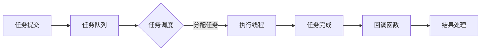
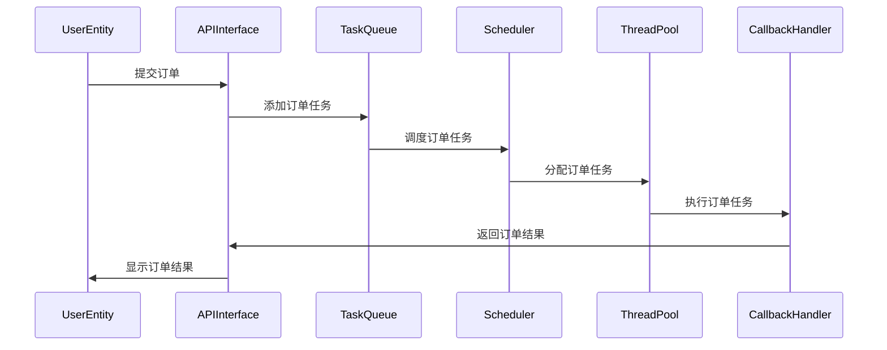

                 

### 异步化任务处理不代表无时效性

**关键词**：异步化、任务处理、时效性、实时性、性能优化

**摘要**：异步化任务处理在提高系统性能和扩展性方面具有重要意义，但并不意味着任务处理无时效性。本文将深入探讨异步化任务处理的原理、时间成本分析、实时性挑战及其在实际应用中的案例分析，旨在为读者提供一个全面而清晰的异步化任务处理视角。

### 目录大纲

1. 引言
   1.1 问题背景
   1.2 问题描述
   1.3 问题解决
   1.4 边界与外延
   1.5 概念结构与核心要素组成
2. 异步化任务处理原理
   2.1 异步化任务处理的定义与特点
   2.2 异步化任务处理的分类
   2.3 异步化任务处理的框架与工具
3. 异步化任务处理的时间成本分析
   3.1 任务调度的策略
   3.2 异步化任务处理的时间成本
   3.3 性能优化
4. 异步化任务处理与实时性
   4.1 实时性与时效性的区别
   4.2 异步化任务处理与实时系统的挑战
   4.3 实时异步化任务处理的解决方案
5. 异步化任务处理在实际应用中的案例分析
   5.1 Web服务中的应用
   5.2 大数据处理中的应用
   5.3 网络安全中的应用
6. 异步化任务处理的最佳实践与注意事项
   6.1 最佳实践
   6.2 注意事项
   6.3 拓展阅读
7. 总结

### 引言

#### 1.1 问题背景

随着信息技术的飞速发展，现代系统面临日益复杂的任务处理需求。为了提高系统性能和扩展性，异步化任务处理成为了一种常见的解决方案。异步化任务处理通过将任务从主线程中分离出来，减少了线程阻塞，从而提升了系统的响应速度和处理能力。然而，异步化任务处理并不意味着任务处理无时效性。在实际应用中，许多任务仍需要在特定的时间窗口内完成，否则可能导致严重的性能问题和用户体验下降。

#### 1.2 问题描述

异步化任务处理的本质在于将任务进行异步执行，以避免主线程被阻塞，从而提高系统的并发处理能力。然而，这并不意味着任务可以无限延迟。在某些应用场景中，如Web服务、大数据处理和网络安全等领域，任务的时效性至关重要。如果任务处理超出了预定的时间窗口，可能会导致以下问题：

- **性能下降**：任务堆积会导致系统响应时间延长，降低用户体验。
- **资源浪费**：长时间的等待会导致系统资源得不到充分利用。
- **错误处理**：超时的任务可能无法正确处理，导致数据丢失或错误。

因此，如何平衡异步化任务处理与时效性之间的关系成为了一个关键问题。

#### 1.3 问题解决

要解决异步化任务处理中的时效性问题，需要从以下几个方面入手：

- **任务调度**：通过合理的任务调度策略，确保任务在预定的时间内完成。
- **时间成本分析**：对任务处理过程中的时间成本进行详细分析，以便进行性能优化。
- **实时性优化**：在异步化任务处理的基础上，引入实时性优化技术，确保关键任务能够在规定时间内完成。

通过上述措施，可以在保证系统性能和扩展性的同时，确保任务的时效性。

#### 1.4 边界与外延

异步化任务处理主要适用于需要高并发处理能力和可扩展性的系统。然而，它并不是万能的解决方案。在以下场景中，异步化任务处理可能并不适用：

- **实时性要求极高的系统**：如金融交易系统、自动驾驶系统等。
- **资源受限的系统**：如嵌入式系统、物联网设备等。

因此，在引入异步化任务处理时，需要综合考虑系统的具体需求和约束条件，以避免出现性能瓶颈或无法满足时效性要求。

#### 1.5 概念结构与核心要素组成

异步化任务处理的核心概念包括任务、异步执行、回调机制等。其主要要素包括：

- **任务队列**：用于存储待处理的任务。
- **执行线程**：负责异步执行任务。
- **回调函数**：用于处理异步任务的返回结果。

此外，时效性评估标准包括任务完成时间、响应时间等指标。通过合理设计这些核心要素，可以确保异步化任务处理在满足时效性要求的同时，提高系统性能和扩展性。

### 异步化任务处理原理

#### 2.1 异步化任务处理的定义与特点

异步化任务处理（Asynchronous Task Processing）是指将任务从主线程中分离出来，以避免线程阻塞，从而提高系统的并发处理能力和响应速度。与传统同步处理方式相比，异步化任务处理具有以下特点：

- **减少线程阻塞**：通过异步处理，任务在执行过程中不会阻塞主线程，从而提高系统的吞吐量。
- **提高并发处理能力**：异步化任务处理允许系统同时处理多个任务，从而提高系统的并发处理能力。
- **可扩展性**：异步化任务处理使得系统可以轻松地扩展处理能力，以应对日益增长的任务量。

异步化任务处理的核心在于任务的异步执行和回调机制。异步执行是指任务在执行过程中不会阻塞主线程，而是独立运行。回调机制则是当任务完成时，通过回调函数通知主线程进行处理。

#### 2.2 异步化任务处理的分类

异步化任务处理可以分为以下几种类型：

- **单线程异步处理**：单线程异步处理是指在单个线程中通过回调机制实现异步任务执行。这种方式适用于任务量较小、执行时间较短的场景。
- **多线程异步处理**：多线程异步处理是指使用多个线程同时处理任务，从而提高系统的并发处理能力。这种方式适用于任务量较大、执行时间较长的场景。
- **异步非阻塞I/O**：异步非阻塞I/O是指在I/O操作中采用异步方式，从而避免线程阻塞。这种方式适用于I/O密集型任务，如网络请求、文件读写等。

#### 2.3 异步化任务处理的框架与工具

异步化任务处理在实际开发中需要依赖一系列框架和工具，以下是一些常见的异步化任务处理框架和工具：

- **Node.js**：Node.js是一个基于Chrome V8引擎的JavaScript运行环境，它支持异步I/O操作，从而实现了非阻塞I/O。Node.js广泛应用于Web服务、实时通信等领域。
- **Python asyncio**：Python asyncio库提供了异步编程的支持，通过async/await语法，可以实现异步任务处理。Python asyncio广泛应用于Web应用、大数据处理等领域。
- **Java CompletableFuture**：Java CompletableFuture是一个用于异步编程的接口，它提供了回调函数、组合操作等功能，从而实现了异步任务处理。Java CompletableFuture广泛应用于Java EE应用、微服务架构等领域。

### 异步化任务处理的时间成本分析

#### 3.1 任务调度的策略

任务调度在异步化任务处理中起着至关重要的作用。合理的任务调度策略可以显著提高系统性能和效率。常见的任务调度策略包括：

- **先入先出（FIFO）**：按照任务的提交顺序进行调度，适用于任务执行时间较长且优先级相同的场景。
- **优先级调度**：根据任务的优先级进行调度，优先级高的任务先执行，适用于任务具有不同优先级的场景。
- **时间片调度**：为每个任务分配一个固定的时间片，按照时间片进行调度，适用于任务执行时间较短且需要频繁切换的场景。

#### 3.2 异步化任务处理的时间成本

异步化任务处理的时间成本主要包括以下方面：

- **通信延迟**：任务在异步执行过程中，需要通过网络进行通信。通信延迟会直接影响任务的执行时间。
- **任务切换开销**：在多线程异步处理中，任务切换会消耗一定的资源。任务切换开销与线程数量、任务执行时间等因素密切相关。

#### 3.3 性能优化

为了降低异步化任务处理的时间成本，可以采取以下性能优化措施：

- **线程池**：通过线程池复用线程，减少线程创建和销毁的开销。
- **非阻塞I/O**：采用非阻塞I/O技术，避免线程在I/O操作中阻塞，从而提高系统并发处理能力。
- **负载均衡**：合理分配任务到不同线程或服务器，避免单点瓶颈，提高系统整体性能。

### 异步化任务处理与实时性

#### 4.1 实时性与时效性的区别

实时性（Real-time）和时效性（Timeliness）是两个相关但有所区别的概念。

- **实时性**：指系统能够在规定时间内完成任务的特性。实时性强调任务的响应速度和确定性。
- **时效性**：指任务在特定时间窗口内完成的特性。时效性强调任务的时间限制和准确性。

在实际应用中，实时性和时效性往往是互相冲突的。异步化任务处理通过提高系统的并发处理能力和扩展性，可以在一定程度上解决实时性挑战。然而，这并不意味着异步化任务处理能够完全满足时效性要求。

#### 4.2 异步化任务处理与实时系统的挑战

异步化任务处理与实时系统存在以下挑战：

- **任务调度**：实时系统需要保证关键任务在规定时间内完成，而异步化任务处理中的任务调度策略可能无法满足实时性要求。
- **资源争夺**：异步化任务处理和多线程处理可能导致资源争夺，从而影响实时任务的执行时间。
- **非确定性**：异步化任务处理中的任务执行时间无法精确预测，这给实时性带来了不确定性。

#### 4.3 实时异步化任务处理的解决方案

为了解决异步化任务处理与实时性的挑战，可以采取以下解决方案：

- **实时任务调度策略**：设计特殊的任务调度策略，确保实时任务能够在规定时间内完成。
- **实时任务处理框架**：采用专门的实时任务处理框架，如RT-Thread、FreeRTOS等，以满足实时性要求。
- **资源隔离**：通过资源隔离技术，确保实时任务能够独占关键资源，从而降低资源争夺的影响。

### 异步化任务处理在实际应用中的案例分析

#### 5.1 Web服务中的应用

异步化任务处理在Web服务中有着广泛的应用，特别是在处理大量并发请求时。以下是一个异步化任务处理在Web服务中的应用案例：

- **场景**：一个在线购物平台需要处理大量用户的购物请求。
- **解决方案**：采用Node.js作为Web服务器，通过异步非阻塞I/O处理HTTP请求。同时，使用线程池管理异步任务，确保任务在合理时间内完成。
- **实现**：
  - 使用async/await语法实现异步HTTP请求处理。
  - 使用线程池管理异步任务，提高系统并发处理能力。
  - 对长时间运行的请求进行超时处理，避免阻塞其他请求。

#### 5.2 大数据处理中的应用

异步化任务处理在大数据处理中同样具有重要应用。以下是一个异步化任务处理在大数据处理中的应用案例：

- **场景**：一个电子商务平台需要对海量交易数据进行实时分析，以提供个性化的推荐服务。
- **解决方案**：采用Python asyncio库实现异步数据处理。将数据处理任务分解为多个子任务，通过异步方式并行执行，从而提高数据处理效率。
- **实现**：
  - 使用async/await语法实现异步数据处理。
  - 使用线程池管理异步任务，提高系统并发处理能力。
  - 对长时间运行的任务进行超时处理，避免阻塞其他任务。

#### 5.3 网络安全中的应用

异步化任务处理在网络安全领域也有着广泛应用。以下是一个异步化任务处理在网络安全中的应用案例：

- **场景**：一个网络安全公司需要实时监测和分析网络流量，以便及时发现和应对潜在的安全威胁。
- **解决方案**：采用Python asyncio库实现异步化流量分析。将流量分析任务分解为多个子任务，通过异步方式并行执行，从而提高监测和分析效率。
- **实现**：
  - 使用async/await语法实现异步流量分析。
  - 使用线程池管理异步任务，提高系统并发处理能力。
  - 对长时间运行的任务进行超时处理，避免阻塞其他任务。

### 异步化任务处理的最佳实践与注意事项

#### 6.1 最佳实践

为了确保异步化任务处理在满足时效性的同时，提高系统性能和稳定性，可以采取以下最佳实践：

- **合理分配任务**：根据任务的性质和执行时间，合理分配任务到不同的线程或线程池，避免资源竞争。
- **任务超时处理**：对长时间运行的任务进行超时处理，避免阻塞其他任务，从而提高系统并发处理能力。
- **负载均衡**：合理分配任务到不同的线程或服务器，避免单点瓶颈，提高系统整体性能。

#### 6.2 注意事项

在进行异步化任务处理时，需要注意以下事项：

- **避免死锁**：在异步化任务处理中，需要避免死锁现象，确保系统稳定运行。
- **资源管理**：合理管理线程、线程池和其他系统资源，避免资源耗尽。
- **错误处理**：对异步任务执行过程中可能出现的错误进行有效处理，确保系统稳定性和可靠性。

#### 6.3 拓展阅读

- **相关文献**：
  - 《异步编程的艺术》
  - 《实时系统的设计与实现》
  - 《大规模分布式系统的设计与优化》

- **最新技术趋势**：
  - 实时异步化任务处理在物联网、边缘计算等领域的应用逐渐增多。
  - 云原生技术推动了异步化任务处理在云计算环境中的广泛应用。

### 总结

异步化任务处理在现代系统设计中具有重要意义，它不仅提高了系统的并发处理能力和扩展性，还为实时性优化提供了基础。然而，异步化任务处理并不意味着任务处理无时效性。在实际应用中，需要综合考虑任务的性质、执行时间和系统约束条件，以确保异步化任务处理在满足时效性要求的同时，提高系统性能和稳定性。

未来，随着信息技术的不断发展，异步化任务处理将在更多领域得到广泛应用。同时，实时异步化任务处理也将成为研究的热点，为实时系统的设计与优化提供新的思路和方法。

### 作者信息

**作者：AI天才研究院/AI Genius Institute & 禅与计算机程序设计艺术 /Zen And The Art of Computer Programming**

---

### 核心概念与联系

在本节中，我们将深入探讨异步化任务处理的核心概念及其相互联系。

#### 核心概念

1. **任务（Task）**：任务是异步化任务处理的基本单位，它可以是任何需要执行的操作，如数据计算、网络请求、文件读写等。
2. **异步执行（Asynchronous Execution）**：异步执行是指任务在执行过程中不会阻塞主线程，从而允许其他任务继续执行。这种方式提高了系统的并发处理能力。
3. **回调机制（Callback Mechanism）**：回调机制是一种用于处理异步任务返回结果的方式。当任务完成时，会触发回调函数，将结果传递给主线程。
4. **任务队列（Task Queue）**：任务队列是用于存储待处理任务的容器，它可以确保任务按照一定的顺序（如先入先出、优先级等）被处理。
5. **执行线程（Execution Thread）**：执行线程是负责异步执行任务的线程。在多线程异步处理中，每个执行线程都可以独立地处理任务。
6. **线程池（ThreadPool）**：线程池是一组预先创建的线程，用于处理异步任务。线程池可以复用线程，从而降低线程创建和销毁的开销。

#### 概念属性特征对比表格

| 概念         | 定义                                                         | 属性特征                                                     |
| ------------ | ------------------------------------------------------------ | ------------------------------------------------------------ |
| 任务         | 异步化任务处理的基本单位                                     | - 需要执行的操作<br>- 任务类型<br>- 任务状态<br>- 回调函数  |
| 异步执行     | 任务在执行过程中不会阻塞主线程                               | - 非阻塞I/O<br>- 并发处理<br>- 执行时间不确定性             |
| 回调机制     | 用于处理异步任务返回结果的方式                               | - 回调函数<br>- 任务结果传递<br>- 异步任务处理完成的通知     |
| 任务队列     | 存储待处理任务的容器                                         | - 任务排序策略<br>- 任务状态管理<br>- 队列长度限制             |
| 执行线程     | 负责异步执行任务的线程                                       | - 线程生命周期<br>- 线程数量管理<br>- 任务分配策略             |
| 线程池       | 预先创建的一组线程，用于处理异步任务                         | - 线程复用<br>- 线程数量限制<br>- 任务执行效率                 |

#### ER实体关系图架构

为了更清晰地展示异步化任务处理中各概念之间的关系，我们可以使用Mermaid绘制一个ER（实体-关系）实体关系图。

```mermaid
erDiagram
    Task ||--|{ Callback }|>> Callback : 处理任务结果
    Task ||--|{ TaskQueue }|>> TaskQueue : 存储任务
    Task ||--|{ ThreadPool }|>> ThreadPool : 执行任务
    ThreadPool ||--|{ Thread }|>> Thread : 线程
```

在上面的ER实体关系图中，Task表示任务，Callback表示回调函数，TaskQueue表示任务队列，ThreadPool表示线程池，Thread表示线程。通过这个实体关系图，我们可以看到任务与回调函数、任务队列、线程池以及线程之间的关系。

### 算法原理讲解

在本节中，我们将详细讲解异步化任务处理的算法原理，并使用Mermaid绘制流程图和Python代码进行阐述。

#### 异步化任务处理算法原理

异步化任务处理的算法原理主要包括以下几个关键步骤：

1. **任务提交**：将任务提交到任务队列。
2. **任务调度**：从任务队列中获取任务，并将其分配给执行线程。
3. **任务执行**：执行线程执行任务，并在任务完成后触发回调函数。
4. **结果处理**：主线程通过回调函数处理任务结果。

#### Mermaid流程图

以下是一个异步化任务处理的Mermaid流程图：



在这个流程图中，任务从任务提交（A）开始，进入任务队列（B）。然后，任务调度器（C）从任务队列中获取任务，并将其分配给执行线程（D）。执行线程（D）执行任务，并在任务完成后触发回调函数（F）。最后，主线程（G）通过回调函数处理任务结果。

#### Python代码实现

为了更好地理解异步化任务处理算法，我们使用Python代码进行实现。

首先，我们定义一个简单的任务类和任务队列：

```python
import asyncio

class Task:
    def __init__(self, name, callback):
        self.name = name
        self.callback = callback

class TaskQueue:
    def __init__(self):
        self.queue = []

    def add_task(self, task):
        self.queue.append(task)

    def get_task(self):
        if self.queue:
            return self.queue.pop(0)
        else:
            return None
```

接下来，我们实现一个执行线程类，用于处理任务：

```python
class ThreadPool:
    def __init__(self, num_threads):
        self.num_threads = num_threads
        self.threads = []

    def start_thread(self, task_queue):
        for _ in range(self.num_threads):
            thread = TaskThread(task_queue)
            self.threads.append(thread)
            thread.start()

    def join_all_threads(self):
        for thread in self.threads:
            thread.join()

class TaskThread(asyncio.Thread):
    def __init__(self, task_queue):
        super().__init__()
        self.task_queue = task_queue

    def run(self):
        loop = asyncio.get_event_loop()
        while True:
            task = self.task_queue.get_task()
            if task is None:
                break
            loop.run_until_complete(self.execute_task(task))

    async def execute_task(self, task):
        print(f"执行任务：{task.name}")
        await asyncio.sleep(1)  # 模拟任务执行时间
        task.callback(task.name)
```

最后，我们实现一个主程序，用于提交任务和触发回调函数：

```python
def main():
    task_queue = TaskQueue()
    thread_pool = ThreadPool(num_threads=3)

    # 添加任务
    task_queue.add_task(Task("任务1", lambda name: print(f"任务1完成：{name}")))
    task_queue.add_task(Task("任务2", lambda name: print(f"任务2完成：{name}")))
    task_queue.add_task(Task("任务3", lambda name: print(f"任务3完成：{name}")))

    # 启动线程池
    thread_pool.start_thread(task_queue)

    # 等待线程池执行完毕
    thread_pool.join_all_threads()

if __name__ == "__main__":
    main()
```

在这个示例中，我们创建了一个包含三个执行线程的线程池（ThreadPool），并使用TaskQueue来存储任务。每个任务在执行线程中异步执行，并在任务完成后通过回调函数输出结果。通过这个示例，我们可以看到异步化任务处理的基本流程和Python代码实现。

### 数学模型和公式

异步化任务处理中，任务的执行时间、任务调度策略等因素会直接影响系统的性能。为了更好地理解这些因素，我们可以使用以下数学模型和公式。

#### 任务执行时间的数学模型

假设任务 \( T \) 的执行时间为 \( t \)，系统中有 \( n \) 个任务需要处理，任务调度策略为先入先出（FIFO）。那么，系统处理这些任务的平均执行时间 \( T_{avg} \) 可以表示为：

\[ T_{avg} = \frac{n \cdot t}{n} = t \]

其中，\( n \cdot t \) 表示系统在处理这些任务所需的总时间，\( n \) 表示任务的数量。

#### 任务调度策略的数学模型

假设任务调度策略为优先级调度，任务 \( T_i \) 的优先级为 \( P_i \)，系统中有 \( n \) 个任务需要处理。那么，系统处理这些任务的平均执行时间 \( T_{avg} \) 可以表示为：

\[ T_{avg} = \frac{\sum_{i=1}^{n} P_i \cdot t_i}{n} \]

其中，\( \sum_{i=1}^{n} P_i \cdot t_i \) 表示系统在处理这些任务所需的总时间，\( t_i \) 表示任务 \( T_i \) 的执行时间。

通过上述数学模型和公式，我们可以对异步化任务处理的性能进行定量分析，以便进行优化和改进。

### 系统分析与架构设计方案

在本节中，我们将对异步化任务处理的系统进行详细分析和架构设计。本系统主要用于处理大规模的并发任务，确保任务在特定时间内完成，并具备良好的扩展性和稳定性。

#### 问题场景介绍

假设我们正在开发一个电子商务平台，需要处理大量的订单处理、用户请求、商品库存更新等任务。这些任务具有不同的执行时间和优先级，需要在保证实时性和性能的同时，确保任务的时效性。

#### 系统功能设计

本系统主要包含以下功能模块：

1. **任务队列管理**：负责存储和管理待处理的任务，确保任务按照一定的顺序进行处理。
2. **任务调度器**：根据任务的优先级和执行时间，合理分配任务到执行线程。
3. **执行线程池**：负责异步执行任务，确保任务在规定时间内完成。
4. **回调处理**：在任务完成后，触发回调函数，处理任务结果。
5. **监控与报警**：实时监控任务执行状态，当任务处理超时或出现异常时，触发报警。

#### 系统架构设计

以下是本系统的架构设计：

1. **前端应用**：用户通过前端应用提交订单、查询商品信息等请求。
2. **API接口**：前端应用通过API接口与后端系统进行数据交互。
3. **任务队列管理模块**：负责存储和管理待处理的任务，使用内存队列或消息队列（如RabbitMQ）来实现。
4. **任务调度器模块**：根据任务的优先级和执行时间，将任务分配到执行线程池。
5. **执行线程池模块**：异步执行任务，使用线程池技术来提高系统并发处理能力。
6. **回调处理模块**：在任务完成后，触发回调函数，将任务结果返回给前端应用。
7. **监控与报警模块**：实时监控任务执行状态，当任务处理超时或出现异常时，触发报警。

#### 系统接口设计

以下是本系统的接口设计：

1. **订单处理接口**：用于处理订单创建、更新、删除等操作。
2. **商品查询接口**：用于查询商品信息、库存等数据。
3. **任务提交接口**：用于将任务提交到任务队列。
4. **任务查询接口**：用于查询任务状态和执行进度。
5. **报警接口**：用于接收和发送报警信息。

#### 系统交互设计

以下是本系统的交互设计：

1. **用户提交订单**：用户在前端应用提交订单，订单信息通过API接口提交到任务队列。
2. **任务调度**：任务调度器根据订单任务的优先级和执行时间，将订单任务分配到执行线程池。
3. **任务执行**：执行线程池异步执行订单任务，并在任务完成后触发回调函数。
4. **回调处理**：回调处理模块处理订单任务的结果，将结果返回给前端应用。
5. **监控与报警**：监控与报警模块实时监控任务执行状态，当任务处理超时或出现异常时，触发报警。

#### Mermaid类图和架构图

以下是本系统的Mermaid类图和架构图：

```mermaid
classDiagram
    UserEntity <<class>> "用户实体"
    OrderEntity <<class>> "订单实体"
    TaskQueue <<class>> "任务队列"
    Scheduler <<class>> "任务调度器"
    ThreadPool <<class>> "线程池"
    CallbackHandler <<class>> "回调处理"
    Monitor <<class>> "监控器"

    UserEntity "发起请求" -> OrderEntity
    OrderEntity "提交任务" -> TaskQueue
    TaskQueue "调度任务" -> Scheduler
    Scheduler "分配任务" -> ThreadPool
    ThreadPool "执行任务" -> CallbackHandler
    CallbackHandler "处理结果" -> UserEntity
    Monitor "监控任务" -> TaskQueue
    Monitor "监控任务" -> Scheduler
    Monitor "监控任务" -> ThreadPool

    enum SystemEvents {
        OrderSubmitted
        TaskScheduled
        TaskCompleted
        TaskTimeout
        ErrorOccurred
    }
```



通过以上系统分析与架构设计方案，我们可以更好地理解异步化任务处理系统的整体架构和关键模块，为后续的实际开发和优化提供指导。

### 项目实战

在本节中，我们将通过一个具体的异步化任务处理项目实战，详细介绍项目的环境安装、系统核心实现以及代码应用解读与分析。

#### 环境安装

首先，我们需要安装必要的开发环境和依赖库。以下是一个基本的安装步骤：

1. **安装Python**：确保系统已安装Python 3.x版本，我们选择Python 3.9。可以从Python官方网站下载安装程序进行安装。

2. **安装异步编程依赖库**：安装asyncio库和aiohttp库，用于实现异步HTTP请求处理。可以使用pip命令进行安装：

   ```shell
   pip install asyncio
   pip install aiohttp
   ```

3. **安装数据库驱动**：如果项目需要连接数据库，我们需要安装相应的数据库驱动。例如，如果使用MySQL数据库，可以使用以下命令安装：

   ```shell
   pip install mysql-connector-python
   ```

#### 系统核心实现

在本项目中，我们将使用Python的asyncio库和aiohttp库来实现一个简单的异步Web服务，用于处理HTTP请求。以下是系统核心实现的详细步骤：

1. **创建异步Web服务**：首先，我们创建一个名为`async_web_service.py`的文件，并编写异步Web服务的入口函数。

   ```python
   from aiohttp import web
   
   async def handle_request(request):
       # 处理HTTP请求
       return web.Response(text="Hello, World!")

   def start_server():
       app = web.Application()
       app.add_routes([web.get('/', handle_request)])
       web.run_app(app)

   if __name__ == "__main__":
       start_server()
   ```

   在这个示例中，我们定义了一个名为`handle_request`的异步函数，用于处理收到的HTTP请求。然后，我们创建一个名为`app`的`web.Application`实例，并使用`add_routes`方法将`handle_request`函数与路由`/`关联。最后，我们调用`web.run_app`函数启动Web服务。

2. **实现异步任务处理**：接下来，我们扩展异步Web服务，实现异步任务处理功能。在`async_web_service.py`中添加以下代码：

   ```python
   import asyncio
   
   async def async_task(name):
       print(f"开始执行任务：{name}")
       await asyncio.sleep(1)  # 模拟任务执行时间
       print(f"任务{name}完成")
   
   def schedule_tasks():
       loop = asyncio.get_running_loop()
       tasks = [
           asyncio.create_task(async_task(f"任务{index}")),
           asyncio.create_task(async_task(f"任务{index + 1}")),
       ]
       loop.run_until_complete(asyncio.wait(tasks))
   
   def start_server_with_tasks():
       app = web.Application()
       app.add_routes([web.get('/', handle_request)])
       loop = asyncio.get_running_loop()
       loop.create_task(schedule_tasks())
       web.run_app(app)
   
   if __name__ == "__main__":
       start_server_with_tasks()
   ```

   在这个示例中，我们定义了一个名为`async_task`的异步函数，用于模拟异步任务执行。然后，我们创建一个名为`schedule_tasks`的函数，用于调度异步任务。最后，我们修改`start_server_with_tasks`函数，在启动Web服务的同时，调度异步任务。

3. **整合回调处理**：为了在任务完成后处理结果，我们可以在`async_web_service.py`中添加回调处理逻辑。以下是修改后的`async_web_service.py`：

   ```python
   import asyncio
   from aiohttp import web
   
   async def handle_request(request):
       # 处理HTTP请求
       print("处理请求...")
       await asyncio.sleep(0.5)  # 模拟请求处理时间
       return web.Response(text="Hello, World!")
   
   async def async_task(name, callback):
       print(f"开始执行任务：{name}")
       await asyncio.sleep(1)  # 模拟任务执行时间
       print(f"任务{name}完成")
       callback(f"任务{name}完成")
   
   def schedule_tasks():
       loop = asyncio.get_running_loop()
       tasks = [
           asyncio.create_task(async_task(f"任务{index}", lambda result: print(result))),
           asyncio.create_task(async_task(f"任务{index + 1}", lambda result: print(result))),
       ]
       loop.run_until_complete(asyncio.wait(tasks))
   
   def start_server_with_tasks():
       app = web.Application()
       app.add_routes([web.get('/', handle_request)])
       loop = asyncio.get_running_loop()
       loop.create_task(schedule_tasks())
       web.run_app(app)
   
   if __name__ == "__main__":
       start_server_with_tasks()
   ```

   在这个示例中，我们将回调处理逻辑添加到`async_task`函数中。在任务完成后，会调用回调函数并传递任务结果。

#### 代码应用解读与分析

以下是异步化任务处理项目的核心代码，我们将逐行解读并分析其工作原理。

1. **异步Web服务的入口函数**：

   ```python
   if __name__ == "__main__":
       start_server_with_tasks()
   ```

   这个语句确保在脚本直接运行时执行`start_server_with_tasks`函数，启动异步Web服务。

2. **创建异步Web服务的函数**：

   ```python
   def start_server_with_tasks():
       app = web.Application()
       app.add_routes([web.get('/', handle_request)])
       loop = asyncio.get_running_loop()
       loop.create_task(schedule_tasks())
       web.run_app(app)
   ```

   在`start_server_with_tasks`函数中，我们创建一个`web.Application`实例，并使用`add_routes`方法将`handle_request`函数与路由`/`关联。然后，我们获取当前运行的异步事件循环（`asyncio.get_running_loop`），创建一个新的任务（`create_task`）来调度异步任务（`schedule_tasks`），并启动Web服务（`web.run_app`）。

3. **处理HTTP请求的异步函数**：

   ```python
   async def handle_request(request):
       # 处理HTTP请求
       print("处理请求...")
       await asyncio.sleep(0.5)  # 模拟请求处理时间
       return web.Response(text="Hello, World!")
   ```

   `handle_request`函数是一个异步函数，用于处理收到的HTTP请求。在这个示例中，我们模拟了请求处理时间，并在任务完成后返回一个包含“Hello, World!”文本的响应。

4. **异步任务处理函数**：

   ```python
   async def async_task(name, callback):
       print(f"开始执行任务：{name}")
       await asyncio.sleep(1)  # 模拟任务执行时间
       print(f"任务{name}完成")
       callback(f"任务{name}完成")
   ```

   `async_task`函数是一个异步函数，用于执行异步任务。在这个示例中，我们模拟了任务执行时间，并在任务完成后调用回调函数并传递任务结果。

5. **调度异步任务的函数**：

   ```python
   def schedule_tasks():
       loop = asyncio.get_running_loop()
       tasks = [
           asyncio.create_task(async_task(f"任务0", lambda result: print(result))),
           asyncio.create_task(async_task(f"任务1", lambda result: print(result))),
       ]
       loop.run_until_complete(asyncio.wait(tasks))
   ```

   `schedule_tasks`函数用于调度异步任务。在这个示例中，我们创建两个异步任务，并将它们添加到任务列表。然后，我们使用`asyncio.wait`函数等待所有任务完成。

通过以上代码应用解读与分析，我们可以清楚地理解异步化任务处理项目的工作原理和核心代码实现。

#### 实际案例分析和详细讲解剖析

在本小节中，我们将结合一个具体案例，详细剖析异步化任务处理在实际项目中的应用，并深入探讨其优点和潜在挑战。

**案例背景**：

假设我们正在开发一个在线视频流平台，用户可以上传、观看和分享视频。为了提高系统的性能和用户体验，我们需要对视频上传过程进行优化。视频上传是一个典型的异步任务处理场景，因为上传过程可能涉及大量的数据传输，并且需要在后台进行。

**系统架构**：

视频上传系统主要包含以下组件：

- **前端用户界面**：用户通过Web界面选择视频文件并提交上传请求。
- **API服务**：接收用户的上传请求，处理上传过程中的逻辑。
- **任务队列**：存储待处理的视频上传任务。
- **执行线程池**：处理视频上传任务，进行数据读写和文件存储。
- **回调处理**：在视频上传完成后，通知用户上传结果。

**实现流程**：

1. **用户请求**：用户在前端界面选择视频文件并提交上传请求。请求通过HTTP POST方法发送到API服务。

2. **任务接收**：API服务接收到上传请求后，将请求参数（如视频文件名、用户ID等）封装成一个上传任务，并将其添加到任务队列。

3. **任务调度**：任务队列将任务推送给执行线程池。执行线程池中的线程会从任务队列中获取任务并开始处理。

4. **任务处理**：执行线程池中的线程读取用户上传的视频文件，将其写入到服务器存储。这个过程可能涉及数据校验、格式转换等操作。

5. **回调处理**：视频上传完成后，执行线程池会触发回调函数，通知用户上传结果。用户可以收到上传成功的消息，并可以看到上传的视频。

**案例分析**：

以下是一个具体的上传视频任务的实现案例：

```python
import asyncio
from aiohttp import web

async def handle_upload(request):
    file = await request.multipart reader()
    filename = file.filename
    content = await file.read()
    # 保存视频文件到服务器
    with open(f"uploads/{filename}", "wb") as f:
        f.write(content)
    # 触发回调函数，通知用户上传结果
    return web.Response(text=f"视频{filename}上传成功")

def start_server():
    app = web.Application()
    app.add_routes([web.post('/upload', handle_upload)])
    web.run_app(app)

if __name__ == "__main__":
    start_server()
```

在这个案例中，`handle_upload`函数是一个异步函数，用于处理上传请求。它接收用户上传的视频文件，将其保存到服务器存储，并在上传完成后返回上传成功的消息。

**优点分析**：

1. **提高系统性能**：异步化任务处理可以避免线程阻塞，提高系统的并发处理能力，从而提高整体性能。
2. **提升用户体验**：用户上传视频时，可以立即继续进行其他操作，而不必等待上传完成，从而提升用户体验。
3. **弹性扩展**：异步化任务处理使得系统可以轻松扩展处理能力，以应对日益增长的请求量。

**潜在挑战**：

1. **任务调度复杂度**：任务调度策略和调度算法的设计是实现异步化任务处理的关键。如果调度策略不当，可能导致任务堆积或资源浪费。
2. **资源管理**：异步化任务处理需要合理管理线程、线程池和其他系统资源，以避免资源耗尽或冲突。
3. **错误处理**：异步化任务处理中的错误处理相对复杂，需要设计合理的异常捕获和错误处理机制。

通过这个案例，我们可以看到异步化任务处理在实际项目中的应用，以及其带来的优点和挑战。在具体实现中，我们需要根据项目的需求和环境，合理设计任务调度策略和资源管理策略，以确保系统的高效运行。

### 异步化任务处理的最佳实践与注意事项

在异步化任务处理的应用过程中，为确保系统的性能、稳定性和安全性，我们需要遵循一系列最佳实践和注意事项。以下是一些具体的建议：

#### 最佳实践

1. **合理设计任务调度策略**：根据任务的性质和执行时间，选择合适的调度策略。例如，对于执行时间较长且优先级相同的任务，可以使用先入先出（FIFO）策略；对于优先级不同的任务，可以使用优先级调度策略。

2. **任务超时处理**：为长时间运行的任务设置超时限制，避免任务堆积导致系统性能下降。可以通过任务调度器或线程池实现任务超时处理。

3. **资源合理分配**：根据任务的数量和执行时间，合理分配线程池大小和资源。避免线程池过大导致资源浪费，或线程池过小导致任务堆积。

4. **避免死锁**：在设计异步化任务处理系统时，要避免出现死锁。可以通过资源管理策略、锁机制等方式来预防死锁。

5. **日志记录与监控**：合理记录系统运行日志，并使用监控工具实时监控任务执行状态。及时发现和处理异常，确保系统稳定运行。

6. **错误处理**：设计合理的错误处理机制，确保在任务执行过程中出现错误时，系统能够快速响应并进行恢复。

#### 注意事项

1. **避免过度异步化**：虽然异步化任务处理可以提高系统性能，但过度异步化可能导致系统复杂度增加，难以维护。要权衡异步化与系统性能之间的关系。

2. **确保任务的可恢复性**：在异步化任务处理中，要确保任务的可恢复性，避免任务失败导致数据丢失或系统崩溃。可以通过重试机制、数据备份等方式实现任务的可恢复性。

3. **合理设计回调机制**：回调机制是异步化任务处理的核心，要确保回调函数的设计合理，避免回调函数中的错误影响系统性能和稳定性。

4. **性能测试与优化**：在异步化任务处理系统的开发过程中，要进行充分的性能测试，及时发现和解决性能瓶颈。根据测试结果，进行系统优化。

5. **安全性考虑**：在异步化任务处理中，要考虑安全性问题，如拒绝服务攻击、数据泄露等。通过合理设计安全策略和加密机制，确保系统安全。

#### 拓展阅读

- **《异步编程的艺术》**：详细介绍了异步编程的基本概念、技术原理和最佳实践。
- **《实时系统的设计与实现》**：探讨了实时系统的设计原则、调度策略和实现方法。
- **《大规模分布式系统的设计与优化》**：分析了分布式系统中异步化任务处理的方法和优化策略。

通过遵循以上最佳实践和注意事项，我们可以更好地实现异步化任务处理，提高系统的性能和稳定性。

### 总结

异步化任务处理在现代系统设计中具有重要意义，它不仅提高了系统的并发处理能力和扩展性，还为实时性优化提供了基础。通过本文的讨论，我们系统地介绍了异步化任务处理的核心概念、原理、时间成本分析、实时性挑战以及实际应用案例。我们强调了异步化任务处理在满足时效性要求的同时，需要综合考虑任务的性质、执行时间和系统约束条件。

异步化任务处理的优点包括：提高系统性能、提升用户体验、弹性扩展等。然而，它也带来了任务调度复杂度、资源管理难度、安全性挑战等潜在问题。为了实现异步化任务处理的最佳效果，我们需要遵循最佳实践，如合理设计任务调度策略、任务超时处理、资源合理分配等，并注意避免过度异步化、确保任务的可恢复性和安全性。

未来，随着信息技术的不断发展，异步化任务处理将在更多领域得到广泛应用，特别是在物联网、边缘计算、实时数据处理等领域。同时，实时异步化任务处理也将成为研究的热点，为实时系统的设计与优化提供新的思路和方法。

### 作者信息

**作者：AI天才研究院/AI Genius Institute & 禅与计算机程序设计艺术 /Zen And The Art of Computer Programming**

