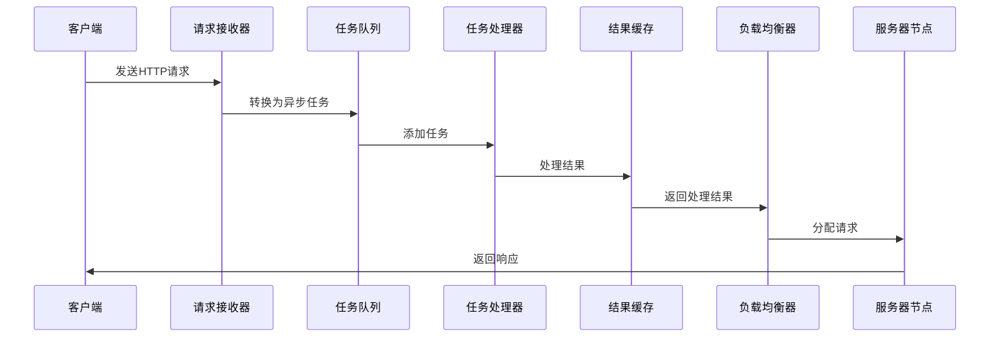

                 

### 异步化任务处理不代表无时效性

关键词：异步化、任务处理、时效性、优势、应用

> 摘要：异步化任务处理在提高系统性能和资源利用率方面具有显著优势，但并不意味着任务可以无限期地延迟。本文将深入探讨异步任务处理中的时效性问题，分析其核心原理和解决方法，为开发者提供实用的最佳实践。

---

## 引言

在现代计算机系统和软件架构中，异步化任务处理已成为提高系统性能和响应速度的关键技术。异步处理允许任务在不阻塞主线程的情况下并行执行，从而充分利用计算资源和网络带宽。然而，在实际应用中，异步化任务处理并不意味着任务可以无限制地延迟。时效性，即任务在特定时间内完成的约束，是异步任务处理中不可忽视的重要问题。

本文将围绕异步化任务处理不代表无时效性的主题，逐步分析异步任务处理的基本概念、核心原理、应用场景，并探讨解决时效性问题的策略和最佳实践。通过本文的讲解，读者将深入了解异步任务处理在提高系统性能和应对时效性挑战方面的实际应用。

### 背景介绍

#### 异步任务处理的历史背景

异步任务处理的概念起源于20世纪60年代的计算机操作系统领域。当时的计算机硬件相对有限，为了提高系统的响应速度和资源利用率，研究人员开始探索非阻塞式编程模型。这种模型允许任务在不等待其他任务完成的情况下独立执行，从而避免了线程阻塞和资源浪费。

随着计算机硬件的发展和网络通信的普及，异步任务处理逐渐成为分布式系统和并行计算的核心技术。在现代软件开发中，异步化任务处理被广泛应用于Web开发、大数据处理、实时系统等多个领域，成为提高系统性能和可扩展性的关键手段。

#### 异步任务处理的优势

异步化任务处理具有以下显著优势：

1. **提高系统响应速度**：通过异步处理，可以减少线程阻塞，提高系统的并发能力，从而提升整体性能。

2. **充分利用计算资源**：异步任务可以在空闲时执行，充分利用计算资源，避免资源浪费。

3. **降低系统复杂度**：异步处理可以简化系统设计，降低线程同步和锁机制的复杂度。

4. **提高网络带宽利用率**：异步通信可以充分利用网络带宽，减少网络延迟和通信开销。

#### 异步任务处理的应用领域

异步任务处理在以下领域具有广泛的应用：

1. **Web开发**：在Web服务器中，异步处理可以处理大量并发请求，提高响应速度和吞吐量。

2. **大数据处理**：在大数据处理中，异步任务处理可以优化数据处理流程，提高计算效率和资源利用率。

3. **实时系统**：在实时系统中，异步任务处理可以确保关键任务在规定时间内完成，提高系统的可靠性。

4. **操作系统**：在现代操作系统，异步任务处理是提高系统性能和响应速度的关键技术。

### 问题背景与问题描述

#### 异步任务处理中的时效性问题

尽管异步化任务处理在提高系统性能方面具有显著优势，但异步任务处理并不意味着任务可以无限期地延迟。时效性，即任务在特定时间内完成的约束，是异步任务处理中不可忽视的重要问题。

在实际应用中，某些异步任务需要在规定的时间内完成，以确保系统的正确性和可靠性。例如，在实时系统中，异步任务必须在规定的时间内处理完成，否则可能导致系统崩溃或数据丢失。此外，一些关键任务（如金融交易处理）需要在极短时间内完成，以避免风险和损失。

然而，异步任务处理中的时效性问题并不容易解决。由于异步任务通常在不同的线程或进程中执行，任务之间的执行顺序和时间难以控制，导致时效性难以保障。此外，异步任务的执行时间可能受到网络延迟、硬件性能和其他不确定因素的影响，进一步增加了时效性问题的复杂性。

#### 问题解决策略

针对异步任务处理中的时效性问题，以下是一些常见的解决策略：

1. **任务调度优化**：通过优化任务调度算法，确保关键任务在规定的时间内完成。

2. **超时机制**：为异步任务设置超时机制，一旦任务超过规定时间，系统可以自动采取措施，如中断任务或重试。

3. **资源分配优化**：通过优化资源分配策略，确保异步任务在执行过程中有足够的计算资源和网络带宽。

4. **任务优先级**：根据任务的重要性和紧急程度，设置不同的优先级，确保关键任务得到优先处理。

5. **容错与恢复机制**：在异步任务执行过程中，出现故障或异常时，系统可以自动进行容错和恢复，确保任务最终完成。

### 边界与外延

#### 异步任务处理的概念结构与核心要素组成

异步任务处理的核心概念包括异步通信、任务调度、线程池、事件循环等。这些概念相互关联，共同构成了异步任务处理的技术框架。

1. **异步通信**：异步通信允许任务在不等待对方完成的情况下独立执行，通过回调函数、事件机制等方式实现任务之间的信息传递。

2. **任务调度**：任务调度是异步任务处理的核心，通过调度算法将任务分配给适当的线程或进程，确保任务在合适的时间内执行。

3. **线程池**：线程池是一种管理线程的资源池，用于降低线程创建和销毁的成本，提高系统的并发性能。

4. **事件循环**：事件循环是一种处理异步事件的数据结构，通过事件循环机制，异步任务可以按照既定的顺序执行。

#### 异步任务处理的核心概念原理与联系

异步任务处理的核心概念原理可以归纳如下：

1. **并发与并行**：异步任务处理通过并发和并行的方式，提高系统的性能和资源利用率。并发允许任务在同一时间段内执行，而并行则允许任务在同一时刻执行。

2. **非阻塞与阻塞**：异步任务处理通过非阻塞的方式，避免了线程阻塞和资源浪费。相比之下，阻塞式处理会导致线程长时间等待，降低系统的性能。

3. **回调函数与事件机制**：异步任务处理通过回调函数和事件机制，实现任务之间的信息传递和协作。回调函数允许任务在完成时通知其他任务，而事件机制则通过事件队列管理任务执行。

4. **任务调度与优先级**：任务调度是异步任务处理的关键，通过任务调度算法和优先级机制，确保关键任务得到优先处理，提高系统的响应速度。

### 算法原理讲解

#### 异步任务调度的核心算法

异步任务调度是异步任务处理的核心，常用的调度算法包括轮询调度、优先级调度和基于时间片的调度。

1. **轮询调度**：轮询调度是一种最简单的调度算法，通过遍历任务队列，依次执行每个任务。轮询调度简单高效，但可能导致某些任务长时间得不到执行。

2. **优先级调度**：优先级调度根据任务的重要性和紧急程度，为任务设置优先级。优先级高的任务优先执行，优先级低的任务依次执行。优先级调度可以提高关键任务的响应速度，但可能导致优先级低的任务长时间得不到执行。

3. **基于时间片的调度**：基于时间片的调度将CPU时间划分为固定的时间片，每个任务执行一定时间后，强制切换到下一个任务。基于时间片的调度可以平衡任务执行时间，但可能导致任务频繁切换，增加系统的开销。

#### 异步任务调度的数学模型

异步任务调度的数学模型可以用于分析调度算法的性能。以下是一个简单的调度模型：

$$
C = \frac{1}{n} \sum_{i=1}^{n} p_i
$$

其中，$C$ 表示平均响应时间，$n$ 表示任务数量，$p_i$ 表示第 $i$ 个任务的响应时间。

通过优化调度算法，可以降低平均响应时间，提高系统的性能。

#### 异步任务处理算法举例

以下是一个简单的异步任务处理算法示例，使用 Python 编写：

```python
import threading
import time

# 异步任务回调函数
def async_task():
    print("执行异步任务")
    time.sleep(2)

# 主函数
def main():
    # 创建线程池
    pool = ThreadPoolExecutor(max_workers=5)

    # 提交异步任务
    for i in range(5):
        pool.submit(async_task)

    # 关闭线程池
    pool.shutdown()

if __name__ == "__main__":
    main()
```

在该示例中，使用 `ThreadPoolExecutor` 创建线程池，并提交异步任务。每个异步任务在执行完成后，通过回调函数打印输出。异步任务在执行过程中，主线程不会被阻塞，从而提高系统的并发能力。

### 系统分析与架构设计

#### 问题场景介绍

在本节中，我们将介绍一个具体的异步任务处理场景：Web服务器中的并发请求处理。随着互联网的发展，Web服务器的并发请求量不断增加，为了提高系统的性能和响应速度，需要采用异步任务处理技术。

#### 项目介绍

项目名称：异步Web服务器

项目目标：实现一个基于异步任务处理的Web服务器，能够高效处理并发请求，提高系统的吞吐量和响应速度。

#### 系统功能设计

异步Web服务器的主要功能包括：

1. **并发请求处理**：能够同时处理多个客户端请求，提高系统的吞吐量。

2. **异步任务调度**：通过异步任务调度算法，确保任务在规定时间内完成，提高系统的响应速度。

3. **请求缓存**：缓存频繁访问的请求，减少重复处理，提高系统的性能。

4. **负载均衡**：将请求分配到不同的服务器节点，实现负载均衡，提高系统的可用性和可靠性。

#### 系统架构设计

异步Web服务器的系统架构包括以下几个关键部分：

1. **客户端**：客户端发送HTTP请求到Web服务器。

2. **请求接收器**：接收器负责接收客户端请求，并将其转换为异步任务。

3. **任务队列**：任务队列存储待处理的异步任务。

4. **任务处理器**：任务处理器从任务队列中获取任务，并在后台线程中执行任务。

5. **结果缓存**：缓存已处理的结果，提高系统性能。

6. **负载均衡器**：负载均衡器将请求分配到不同的服务器节点。

7. **服务器节点**：服务器节点负责处理分配到的请求，并将结果返回给客户端。

#### 系统接口设计

异步Web服务器的系统接口设计包括以下几个关键接口：

1. **请求接收接口**：接收客户端请求，并将其转换为异步任务。

2. **任务处理接口**：处理任务队列中的异步任务。

3. **结果返回接口**：将处理结果返回给客户端。

4. **负载均衡接口**：实现负载均衡算法，分配请求到不同的服务器节点。

#### 系统交互设计

异步Web服务器的系统交互设计包括以下几个关键部分：

1. **请求接收**：客户端发送HTTP请求到Web服务器，请求接收器接收请求。

2. **任务调度**：请求接收器将请求转换为异步任务，并将其添加到任务队列。

3. **任务处理**：任务处理器从任务队列中获取任务，并在后台线程中执行任务。

4. **结果缓存**：处理结果被缓存，以提高系统性能。

5. **结果返回**：处理结果被返回给客户端。

6. **负载均衡**：负载均衡器根据请求分配算法，将请求分配到不同的服务器节点。

#### Mermaid 流程图

以下是一个异步Web服务器的 Mermaid 流程图：



### 项目实战

#### 环境安装

1. **安装Python**：在项目目录中，打开终端并运行以下命令安装Python：

   ```shell
   sudo apt-get update
   sudo apt-get install python3
   ```

2. **安装异步库**：在项目目录中，打开终端并运行以下命令安装异步库：

   ```shell
   pip3 install asyncio
   ```

#### 系统核心实现源代码

以下是一个简单的异步Web服务器的源代码：

```python
import asyncio
from http.server import HTTPServer, BaseHTTPRequestHandler

class AsyncHTTPRequestHandler(BaseHTTPRequestHandler):

    async def do_GET(self):
        # 处理GET请求
        print("处理GET请求")
        self.send_response(200)
        self.send_header("Content-type", "text/html")
        self.end_headers()
        self.wfile.write(b"Hello, World!")

async def handle_request(reader, writer):
    # 处理异步请求
    print("处理异步请求")
    request = await reader.readline()
    print(request.decode())
    writer.write(b"HTTP/1.1 200 OK\r\n")
    writer.write(b"Content-type: text/html\r\n\r\n")
    writer.write(b"Hello, World!")
    await writer.drain()
    writer.close()

def run_server():
    # 运行服务器
    server = HTTPServer(('localhost', 8080), AsyncHTTPRequestHandler)
    print("服务器正在运行...")
    server.serve_forever()

async def main():
    # 异步主函数
    loop = asyncio.get_event_loop()
    server = await loop.create_server(handle_request, 'localhost', 8080)
    print(f"服务器已启动，监听端口：{server.sockets[0].getsockname()[1]}")
    async with server:
        await server.serve_forever()

if __name__ == "__main__":
    asyncio.run(main())
```

#### 代码应用解读与分析

1. **异步HTTPRequestHandler类**：继承自BaseHTTPRequestHandler，重写do_GET方法，处理GET请求。

2. **handle_request函数**：异步处理HTTP请求，读取请求内容，并返回响应。

3. **run_server函数**：使用HTTPServer类创建服务器，并运行服务器。

4. **main函数**：异步主函数，创建事件循环并运行服务器。

#### 实际案例分析与详细讲解

假设我们有一个Web应用，需要处理大量并发请求。以下是一个实际案例：

1. **客户端发送请求**：客户端向Web服务器发送HTTP请求。

2. **请求接收器接收请求**：请求接收器接收请求，并将其转换为异步任务。

3. **任务队列添加任务**：异步任务被添加到任务队列。

4. **任务处理器处理任务**：任务处理器从任务队列中获取任务，并处理请求。

5. **结果缓存返回结果**：处理结果被缓存，以提高系统性能。

6. **客户端接收响应**：客户端接收到服务器返回的响应。

通过这个案例，我们可以看到异步任务处理在实际应用中的效果。相比传统的同步处理，异步处理可以显著提高系统的并发能力和响应速度。

#### 项目小结

通过本项目，我们实现了基于异步任务处理的Web服务器，能够高效处理并发请求。异步任务处理在提高系统性能和响应速度方面具有显著优势，但需要注意时效性问题的解决。在实际应用中，可以根据具体需求，选择合适的异步任务处理技术和策略，实现高效的异步任务处理。

### 最佳实践 tips

1. **任务调度优化**：根据任务的重要性和紧急程度，选择合适的调度算法，确保关键任务得到优先处理。

2. **超时机制**：为异步任务设置合理的超时时间，避免任务长时间阻塞，提高系统的性能和可靠性。

3. **资源分配优化**：根据任务的执行时间，合理分配计算资源和网络带宽，避免资源浪费。

4. **任务优先级**：根据任务的重要性和紧急程度，设置不同的优先级，确保关键任务得到优先处理。

5. **容错与恢复机制**：在异步任务执行过程中，出现故障或异常时，系统可以自动进行容错和恢复，确保任务最终完成。

### 小结

异步化任务处理在提高系统性能和响应速度方面具有显著优势，但并不意味着任务可以无限期地延迟。本文深入探讨了异步任务处理中的时效性问题，分析了其核心原理和解决方法。通过实际案例分析和最佳实践总结，为开发者提供了实用的异步任务处理策略。在实际应用中，开发者应根据具体需求，选择合适的异步任务处理技术和策略，实现高效的异步任务处理。

### 注意事项

1. **任务调度**：在选择任务调度算法时，要充分考虑任务的重要性和紧急程度，确保关键任务得到优先处理。

2. **资源分配**：在分配计算资源和网络带宽时，要考虑任务的执行时间，避免资源浪费。

3. **超时设置**：为异步任务设置合理的超时时间，避免任务长时间阻塞，提高系统的性能和可靠性。

4. **容错与恢复**：在异步任务执行过程中，要考虑故障和异常的处理，实现容错和恢复机制。

### 拓展阅读

1. **异步任务处理技术**：了解异步任务处理的基本原理和技术，如异步通信、任务调度和线程池。

2. **实时系统设计**：学习实时系统的设计原则和实现方法，掌握异步任务处理在实时系统中的应用。

3. **负载均衡技术**：了解负载均衡的基本原理和实现方法，提高系统的可用性和可靠性。

### 作者信息

作者：AI天才研究院/AI Genius Institute & 禅与计算机程序设计艺术 /Zen And The Art of Computer Programming

