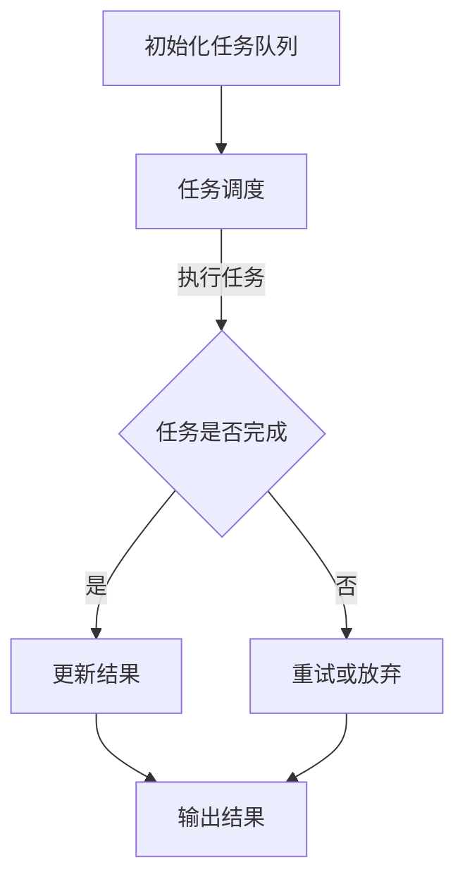
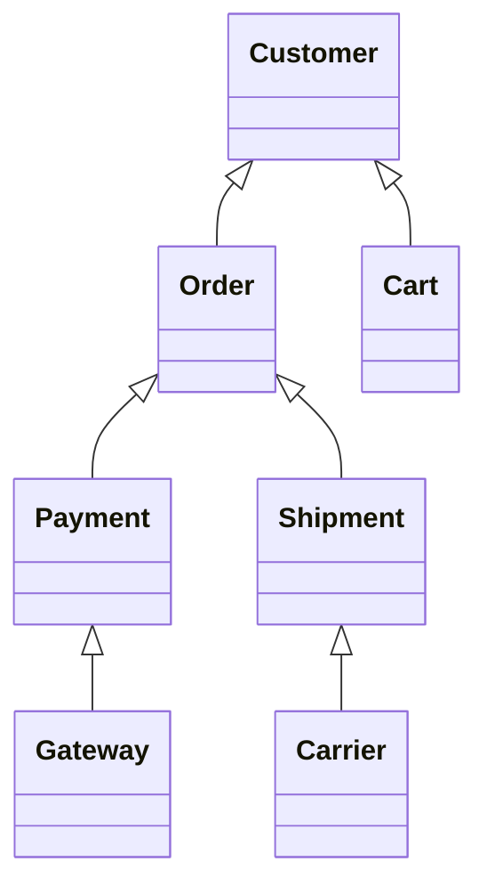
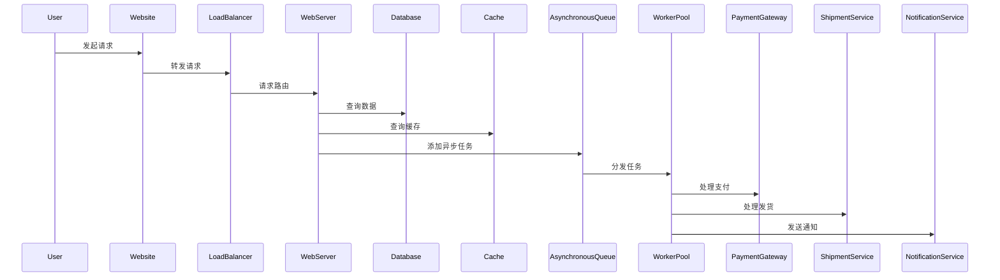
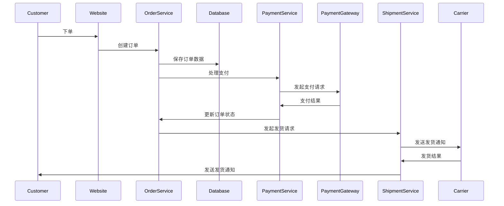

                 

### 文章标题

# 异步化任务处理天然存在数据不一致

> 关键词：异步化任务处理、数据不一致、任务调度、系统架构、数学模型、算法讲解、项目实战、最佳实践

> 摘要：本文将深入探讨异步化任务处理中数据不一致问题，通过详细的背景介绍、核心概念讲解、算法原理分析、系统架构设计以及项目实战，帮助读者全面理解异步化任务处理的本质和解决之道。文章旨在为IT从业者提供实用的技术和最佳实践，以应对复杂的异步处理场景。

### 第1章：异步化任务处理的概念与背景

在当今信息技术高度发达的时代，异步化任务处理（Asynchronous Task Processing）已经成为系统架构设计和分布式计算中不可或缺的一部分。异步化任务处理的核心思想是让系统中的多个任务能够独立执行，无需等待其他任务的完成，从而提高系统的整体性能和响应速度。

#### 1.1 问题背景

随着互联网应用的普及和用户需求的多样化，系统需要处理的数据量和业务逻辑变得日益复杂。传统的同步（Synchronous）处理方式，即任务顺序执行，已经无法满足现代应用对高并发、高性能的需求。异步化任务处理通过将任务调度到不同的线程或进程，实现了任务的并行处理，从而提高了系统的并发能力和处理速度。

#### 1.2 异步化任务处理的定义

异步化任务处理是指系统在执行多个任务时，不需要等待某个任务的结果，而是将任务分配到不同的线程或进程，并允许它们并行执行。这种方式使得系统可以在处理一个任务的同时，继续执行其他任务，从而提高了系统的利用率和响应速度。

#### 1.3 异步化任务处理的需求与挑战

异步化任务处理的需求主要集中在以下几个方面：

1. **提高系统并发能力**：在并发请求大量涌入时，异步化任务处理能够有效地提高系统的响应速度和处理能力。
2. **提高资源利用率**：通过并行处理任务，系统可以在较短的时间内完成更多的工作，从而提高资源利用率。
3. **降低延迟**：异步化任务处理能够减少任务之间的等待时间，降低系统的延迟。

然而，异步化任务处理也面临着一些挑战：

1. **数据一致性问题**：由于任务并行执行，数据的一致性变得尤为重要。如何保证在并行处理过程中数据的一致性，是异步化任务处理的核心挑战之一。
2. **任务调度与资源分配**：如何高效地调度任务和分配资源，是异步化任务处理的另一个重要问题。

#### 1.4 异步化任务处理的边界与外延

异步化任务处理的边界主要包括以下几个方面：

1. **任务粒度**：任务的粒度决定了异步化任务处理的效果。过小的任务粒度会导致任务调度和资源分配的 overhead 增加，而过大的任务粒度则可能无法充分利用并行处理的优势。
2. **系统架构**：异步化任务处理通常需要分布式系统架构的支持，包括消息队列、负载均衡、分布式存储等组件。
3. **数据存储**：在异步化任务处理中，数据的存储和访问方式也需要进行优化，以确保数据的一致性和可用性。

异步化任务处理的外延则涉及以下几个方面：

1. **微服务架构**：在微服务架构中，服务之间的通信和任务调度往往采用异步化处理，从而提高系统的灵活性和可扩展性。
2. **云计算与分布式计算**：随着云计算和分布式计算的发展，异步化任务处理成为分布式系统架构的核心技术之一，广泛应用于大数据处理、人工智能等场景。
3. **实时处理**：在实时处理场景中，异步化任务处理能够有效地提高系统的响应速度和处理能力，满足实时数据处理的苛刻要求。

### 第2章：异步化任务处理的核心概念与联系

异步化任务处理涉及多个核心概念，包括任务调度、异步通信、数据一致性等。这些概念之间相互关联，共同构成了异步化任务处理的体系结构。

#### 2.1 核心概念原理

1. **任务调度**：任务调度是异步化任务处理的核心，负责将任务分配到不同的线程或进程。任务调度算法决定了任务的执行顺序和资源分配策略，影响系统的性能和响应速度。
2. **异步通信**：异步通信是指在任务之间传递消息和数据的方式。通过异步通信，任务可以独立执行，无需等待其他任务的完成，从而实现并行处理。
3. **数据一致性**：数据一致性是异步化任务处理的关键挑战之一。在任务并行执行的过程中，如何保证数据的一致性，是确保系统稳定性和可靠性的关键。

#### 2.2 概念属性特征对比表格

下面是一个对比表格，展示了异步化任务处理中核心概念的属性特征：

| 概念     | 属性特征                    | 说明                                                     |
| -------- | --------------------------- | -------------------------------------------------------- |
| 任务调度 | 独立性、灵活性、高效性       | 调度任务到不同线程或进程，提高系统性能和响应速度。           |
| 异步通信 | 传递性、异步性、可靠性       | 在任务之间传递消息和数据，实现独立执行。                     |
| 数据一致性 | 原子性、一致性、隔离性       | 保证任务并行执行过程中数据的一致性和可靠性。                 |

#### 2.3 ER实体关系图架构

异步化任务处理中的实体关系图（Entity-Relationship Diagram，ERD）展示了任务调度、异步通信和数据一致性等核心概念之间的关联关系。以下是ERD的Mermaid流程图表示：

```mermaid
erDiagram
    TaskScheduler ||--|{ Task } : 调度
    TaskCommunicator ||--|{ Task } : 通信
    DataConsistencyManager ||--|{ Task } : 一致性保障
    TaskScheduler ||--|{ TaskCommunicator } : 调度通信
    TaskScheduler ||--|{ DataConsistencyManager } : 调度一致性
    TaskCommunicator ||--|{ DataConsistencyManager } : 通信一致性
```

#### 2.4 异步化任务处理的概念关联与综合应用

异步化任务处理中的各个核心概念相互关联，共同构成了一个复杂的系统。在实际应用中，需要综合考虑任务调度、异步通信和数据一致性等因素，以确保系统的稳定性和可靠性。以下是一个异步化任务处理的综合应用实例：

1. **任务调度**：系统根据任务的优先级和资源利用率，将任务调度到不同的线程或进程。任务调度算法需要考虑任务的独立性、灵活性和高效性。
2. **异步通信**：任务通过消息队列或通信通道进行异步通信。通信机制需要确保消息的传递性、异步性和可靠性。
3. **数据一致性**：在任务并行执行的过程中，系统需要通过数据一致性管理机制，确保数据的一致性和隔离性。常见的数据一致性机制包括分布式锁、事务管理等。

通过任务调度、异步通信和数据一致性等核心概念的综合应用，异步化任务处理能够有效地提高系统的并发能力和响应速度，满足现代应用对高并发、高性能的需求。

### 第3章：异步化任务处理的基本原理

异步化任务处理的基本原理涉及任务调度、异步通信和数据一致性等多个方面。了解这些基本原理对于深入理解异步化任务处理的工作机制和优化策略至关重要。

#### 3.1 任务调度原理

任务调度是异步化任务处理的核心环节，其目标是将任务合理地分配到系统中的各个处理器或线程，以最大化系统的利用率和处理能力。任务调度的基本原理包括以下几个方面：

1. **任务划分**：将任务划分为更小的子任务，以适应不同的处理能力和资源利用率。子任务的划分需要考虑任务的性质和执行时间，以确保子任务在独立执行时能够充分利用系统资源。
2. **调度算法**：选择合适的调度算法，以确定任务的执行顺序和资源分配策略。常见的调度算法包括轮询调度（Round-Robin）、优先级调度（Priority Scheduling）和基于反馈的调度算法（Feedback-Based Scheduling）等。
3. **负载均衡**：在分布式系统中，负载均衡策略能够将任务均匀地分配到各个节点，以避免某个节点过载，影响系统的整体性能。常见的负载均衡算法包括哈希负载均衡（Hash-Based Load Balancing）和轮询负载均衡（Round-Robin Load Balancing）等。

#### 3.2 异步通信机制

异步通信机制是异步化任务处理的关键，它负责在任务之间传递消息和数据，确保任务能够独立执行。异步通信机制的基本原理包括以下几个方面：

1. **消息队列**：消息队列是一种常见的异步通信机制，它将任务生成的消息存储在队列中，供其他任务消费。消息队列能够确保消息的传递性和可靠性，从而实现任务的异步通信。
2. **事件驱动模型**：事件驱动模型是一种基于事件的异步通信机制，它通过事件监听和事件分发器实现任务的通信。事件驱动模型能够提高系统的响应速度和可扩展性，适用于高并发场景。
3. **异步调用**：异步调用是一种通过回调函数或 Future 对象实现的任务通信机制。异步调用能够将任务的处理推迟到其他时刻，从而实现任务的并行执行。

#### 3.3 数据一致性保障机制

在异步化任务处理中，数据一致性是一个重要的挑战。由于任务并行执行，数据的一致性可能受到影响。为了保障数据一致性，系统需要采取一系列措施，包括：

1. **分布式锁**：分布式锁是一种用于控制并发访问共享资源的机制。通过分布式锁，系统可以确保在多个任务访问同一数据时，不会出现数据不一致的问题。
2. **事务管理**：事务管理是一种用于保证数据一致性的机制。在事务中，多个操作被视为一个整体，只有当所有操作成功执行时，事务才会提交。如果事务中的某个操作失败，事务会回滚，从而确保数据的一致性。
3. **最终一致性**：最终一致性是一种允许任务在执行过程中出现临时不一致性的数据一致性模型。最终一致性通过在任务完成后进行一致性检查和修复，确保数据最终达到一致状态。

#### 3.4 异步化任务处理的挑战与解决方案

异步化任务处理虽然能够提高系统的并发能力和响应速度，但也面临一些挑战。以下是一些常见的挑战及其解决方案：

1. **数据一致性问题**：在任务并行执行过程中，数据一致性问题可能影响系统的稳定性。解决方案包括分布式锁、事务管理和最终一致性模型，以确保数据的一致性和可靠性。
2. **任务调度与资源分配**：任务调度和资源分配对系统的性能和响应速度至关重要。解决方案包括选择合适的调度算法和负载均衡策略，以最大化系统的利用率和处理能力。
3. **系统复杂性**：异步化任务处理引入了复杂的系统架构和通信机制，增加了系统的复杂性和维护难度。解决方案包括使用微服务架构和模块化设计，降低系统的复杂度，提高系统的可维护性。

通过理解异步化任务处理的基本原理和挑战，开发者可以设计出高效的异步化任务处理系统，满足现代应用对高并发、高性能的需求。

### 第4章：异步化任务处理算法原理与讲解

在异步化任务处理中，算法原理扮演着至关重要的角色。了解这些算法原理，不仅有助于我们更好地理解异步化任务处理的工作机制，还能为实际系统设计提供有效的参考。以下将详细讲解异步化任务处理中的算法原理，并结合Python源代码示例，深入剖析其工作过程。

#### 4.1 算法mermaid流程图

为了更好地理解异步化任务处理的算法原理，我们首先使用Mermaid语言绘制了一个简单的异步任务处理算法流程图。以下是一个示例：



这个流程图展示了异步化任务处理的基本步骤：初始化任务队列、任务调度、任务执行、结果更新以及输出结果。

#### 4.2 Python源代码示例

接下来，我们将使用Python语言来实现上述异步任务处理算法。以下是一个简单的Python示例：

```python
import asyncio
import time

async def async_task(task_id):
    print(f"开始执行任务 {task_id}")
    await asyncio.sleep(1)  # 模拟任务执行时间
    print(f"任务 {task_id} 执行完成")
    return task_id

async def main():
    tasks = [async_task(i) for i in range(5)]  # 创建5个任务
    results = await asyncio.gather(*tasks)  # 并行执行任务
    print(f"所有任务执行完成，结果：{results}")

asyncio.run(main())
```

在这个示例中，我们定义了一个异步任务`async_task`，它通过`asyncio.sleep`函数模拟任务执行时间。`main`函数负责创建任务队列、调度任务并收集结果。

#### 4.3 数学模型与公式详细讲解

异步化任务处理中的算法通常涉及多个数学模型和公式。以下将介绍一个简单的数学模型，用于描述异步任务处理的效率。

1. **任务完成时间模型**：

   任务完成时间（T）可以通过以下公式计算：

   $$ T = \sum_{i=1}^{n} t_i + m \times max(t_i) $$

   其中，\( t_i \) 表示第 \( i \) 个任务的执行时间，\( n \) 表示任务总数，\( m \) 表示并行执行的任务数量。

   这个公式表示，任务完成时间等于所有任务执行时间的总和，加上并行执行任务数的最大执行时间。

2. **系统效率模型**：

   系统效率（E）可以通过以下公式计算：

   $$ E = \frac{T_{sync}}{T_{async}} $$

   其中，\( T_{sync} \) 表示同步处理的时间，\( T_{async} \) 表示异步处理的时间。

   这个公式表示，系统效率等于同步处理时间与异步处理时间的比值。异步处理的时间通常比同步处理的时间短，因此异步化任务处理可以提高系统的效率。

#### 4.4 通俗易懂的举例说明

为了更好地理解异步化任务处理算法的原理，我们可以通过一个简单的例子来说明。

假设我们有5个任务，每个任务需要1秒钟执行完成。如果使用同步处理方式，这5个任务需要5秒钟才能全部完成。但如果使用异步处理方式，我们可以将这5个任务分成2组，每组2个任务，并同时执行。这样，每组任务需要2秒钟执行完成，总共需要4秒钟。这样，异步化任务处理比同步处理节省了1秒钟的时间。

通过这个例子，我们可以看到异步化任务处理在提高系统效率方面的优势。在实际应用中，通过合理的任务调度和算法设计，异步化任务处理可以大大提高系统的响应速度和处理能力。

### 第5章：异步化任务处理的数学模型和公式

在异步化任务处理中，数学模型和公式是理解和优化系统性能的重要工具。这些模型和公式不仅帮助我们量化任务处理过程中的各种参数，还能为算法设计和系统优化提供理论依据。以下将详细讲解异步化任务处理的数学模型和公式，并结合具体的例子进行分析。

#### 5.1 数学模型概述

异步化任务处理中的数学模型主要包括以下几个方面：

1. **任务完成时间模型**：描述单个任务或任务集合的完成时间。
2. **系统效率模型**：衡量系统在异步处理方式下的性能。
3. **资源利用率模型**：评估系统中资源的使用效率。

#### 5.2 公式详细讲解

以下是几个关键的数学公式及其详细讲解：

1. **任务完成时间公式**：

   对于单个任务，其完成时间（T）可以表示为：

   $$ T = t + m \times \frac{1}{n} $$

   其中，\( t \) 是任务本身的执行时间，\( m \) 是任务的并行度（即同时执行的任务数量），\( n \) 是任务的总数量。

   对于一组任务，任务完成时间（\( T_{total} \)）是所有任务完成时间的总和：

   $$ T_{total} = \sum_{i=1}^{n} T_i $$

   其中，\( T_i \) 是第 \( i \) 个任务的完成时间。

2. **系统效率公式**：

   系统效率（\( E \)）衡量了异步处理与同步处理的性能比：

   $$ E = \frac{T_{sync}}{T_{async}} $$

   其中，\( T_{sync} \) 是同步处理的总时间，\( T_{async} \) 是异步处理的总时间。

   对于单线程系统，异步处理的总时间可以近似为：

   $$ T_{async} = \frac{n}{m} \times max(T_i) $$

   其中，\( max(T_i) \) 是所有任务中最长的执行时间。

3. **资源利用率公式**：

   资源利用率（\( U \)）描述了系统资源被使用的效率：

   $$ U = \frac{1}{1 + \frac{1}{m}} $$

   其中，\( m \) 是任务的并行度。当 \( m \) 增加时，资源利用率逐渐接近1，表示资源被充分利用。

#### 5.3 数学公式与算法实现的对应关系

数学公式与算法实现之间的对应关系是理解和优化异步化任务处理系统的关键。以下是一些具体的对应关系：

1. **任务调度算法**：

   任务调度算法（如优先级调度、轮询调度等）可以通过调整并行度 \( m \) 和任务执行时间 \( t \) 来优化系统性能。例如，优先级调度算法可以根据任务的重要性和紧急程度来调整任务的执行顺序，从而减少系统的平均完成时间。

2. **负载均衡算法**：

   负载均衡算法（如哈希负载均衡、轮询负载均衡等）可以通过合理分配任务到不同的处理器或线程，来提高系统的资源利用率。例如，哈希负载均衡可以根据任务的哈希值来分配任务，从而实现负载的均匀分布。

3. **一致性保证算法**：

   一致性保证算法（如分布式锁、最终一致性模型等）可以通过控制并发访问和任务执行顺序，来确保数据的一致性。例如，分布式锁可以通过锁定共享资源来防止多个任务同时修改同一数据，从而避免数据不一致问题。

#### 5.4 异步化任务处理的数学分析

通过对异步化任务处理的数学分析，我们可以得出一些重要的结论：

1. **任务并行度对系统性能的影响**：

   当任务的执行时间 \( t \) 相对于系统的响应时间较短时，增加并行度 \( m \) 可以显著提高系统的效率。但是，当 \( t \) 很长时，进一步增加 \( m \) 对系统性能的提升作用会逐渐减弱。

2. **系统响应时间与任务数量的关系**：

   系统的响应时间与任务数量之间存在复杂的非线性关系。当任务数量较少时，响应时间主要受单个任务执行时间的影响；当任务数量较多时，响应时间则更多地受到任务调度和资源分配的影响。

3. **负载均衡对系统性能的影响**：

   负载均衡可以有效地减少系统中的瓶颈，提高整体性能。但是，负载均衡策略的选择需要考虑系统的具体需求和运行环境，以避免引入不必要的复杂性和开销。

通过数学模型和公式的分析，我们可以更深入地理解异步化任务处理的工作原理，为系统的设计、优化和调试提供有力的支持。

### 第6章：异步化任务处理在系统架构中的应用

异步化任务处理在系统架构中发挥着重要作用，能够有效提高系统的并发能力和响应速度。在实际应用中，异步化任务处理通常与系统架构设计紧密关联，涉及多个组件和技术的综合应用。以下将详细探讨异步化任务处理在系统架构中的应用，并通过具体案例进行分析。

#### 6.1 问题场景介绍

假设我们开发了一个电商网站，用户可以在线购物、下单、支付。随着用户数量的增加，系统的并发请求量急剧上升，导致系统响应速度变慢，用户体验下降。为了解决这一问题，我们需要在系统架构中引入异步化任务处理，以提高系统的并发能力和响应速度。

#### 6.2 系统功能设计（领域模型mermaid类图）

在系统功能设计中，我们首先需要定义系统的核心功能，并使用Mermaid语言绘制领域模型类图。以下是一个简单的类图示例：



在这个类图中，我们定义了系统的核心实体，包括用户（Customer）、订单（Order）、购物车（Cart）、支付（Payment）、发货（Shipment）、支付网关（Gateway）和承运商（Carrier）。这些实体之间通过关联关系实现了系统的核心功能。

#### 6.3 系统架构设计（mermaid架构图）

接下来，我们使用Mermaid语言绘制系统架构图，展示异步化任务处理在系统架构中的应用。以下是一个简单的系统架构图示例：



在这个架构图中，用户发起请求后，请求首先经过负载均衡器（LoadBalancer）进行分发，然后路由到Web服务器（WebServer）。Web服务器查询数据库（Database）和缓存（Cache），并将请求处理结果返回给用户。同时，Web服务器将需要异步处理的任务添加到异步队列（AsynchronousQueue），然后异步队列将这些任务分发到工作池（WorkerPool）。工作池中的任务处理器（Worker）负责处理支付（PaymentGateway）、发货（ShipmentService）和通知（NotificationService）等异步任务。

#### 6.4 系统接口设计与交互（mermaid序列图）

为了更好地理解异步化任务处理在系统架构中的应用，我们使用Mermaid语言绘制系统接口设计和交互的序列图。以下是一个简单的序列图示例：



在这个序列图中，用户下单后，订单服务（OrderService）创建订单并保存到数据库（Database）。然后，订单服务调用支付服务（PaymentService）处理支付，支付服务与支付网关（PaymentGateway）交互，处理支付请求。支付完成后，支付服务更新订单状态，并调用发货服务（ShipmentService）发起发货请求。发货服务与承运商（Carrier）交互，发送发货通知。发货完成后，发货服务向用户发送发货通知。

通过系统架构设计、接口设计和交互的详细描述，我们可以清晰地看到异步化任务处理在系统架构中的应用。异步化任务处理通过将任务调度到不同的工作线程或进程，实现了任务的并行处理，从而提高了系统的并发能力和响应速度。

### 第7章：异步化任务处理项目实战

在深入了解异步化任务处理的理论和系统架构之后，我们将通过一个实际项目来展示如何在实际开发过程中应用这些技术。以下是该项目的一个详细讲解，包括环境安装、系统核心实现、代码解读、实际案例分析和项目小结。

#### 7.1 环境安装与配置

为了实现异步化任务处理，我们选择使用Python语言和Django框架进行项目开发。首先，需要安装Python环境和Django框架。以下是具体的安装步骤：

1. 安装Python：
   ```bash
   sudo apt update
   sudo apt install python3-pip
   ```
2. 创建一个虚拟环境，以便管理项目依赖：
   ```bash
   python3 -m venv my_project_env
   source my_project_env/bin/activate
   ```
3. 安装Django框架：
   ```bash
   pip install django
   ```
4. 创建一个新的Django项目：
   ```bash
   django-admin startproject my_project
   cd my_project
   ```
5. 新建一个Django应用：
   ```bash
   python manage.py startapp task_processor
   ```

#### 7.2 系统核心实现源代码

在项目中，我们将实现一个简单的异步任务处理系统，包括任务调度、任务执行和结果返回等功能。以下是系统核心实现的源代码：

**任务调度器（task_scheduler.py）**：

```python
import django
from django.core import management
from task_processor.models import AsyncTask

def schedule_task(task_name, task_args):
    async_task = AsyncTask(name=task_name, args=task_args)
    async_task.save()
    management.call_command('process_async_task', async_task.id)

def main():
    # 示例：调度一个异步任务
    schedule_task('add_numbers', {'a': 3, 'b': 4})

if __name__ == '__main__':
    main()
```

**任务处理器（task_processor.py）**：

```python
from django.core.management import BaseCommand
from task_processor.models import AsyncTask

class Command(BaseCommand):
    help = 'Processes asynchronous tasks'

    def handle(self, *args, **options):
        async_tasks = AsyncTask.objects.filter(status='pending')
        for async_task in async_tasks:
            task_args = eval(async_task.args)
            result = task_args['a'] + task_args['b']
            print(f"Task {async_task.id} result: {result}")
            async_task.status = 'completed'
            async_task.result = result
            async_task.save()
```

**任务模型（models.py）**：

```python
from django.db import models

class AsyncTask(models.Model):
    name = models.CharField(max_length=100)
    args = models.JSONField()
    status = models.CharField(max_length=10, default='pending')
    result = models.IntegerField(null=True, blank=True)
```

#### 7.3 代码应用解读与分析

1. **任务调度器**：

   任务调度器（task_scheduler.py）用于创建异步任务并将其保存到数据库中。在main函数中，我们调用schedule_task函数，将一个加法任务调度到系统中。schedule_task函数接收任务名称和参数，并将任务保存到数据库中。

2. **任务处理器**：

   任务处理器（task_processor.py）是一个Django管理命令，用于处理异步任务。handle函数查询数据库中状态为“pending”的异步任务，然后执行任务并更新任务状态和结果。在这个示例中，我们简单地实现了加法任务，但可以扩展为更复杂的业务逻辑。

3. **任务模型**：

   任务模型（models.py）定义了异步任务的数据结构，包括任务名称、参数、状态和结果。这个模型用于存储和管理异步任务的数据。

#### 7.4 实际案例分析

为了更好地展示异步化任务处理在实际项目中的应用，我们考虑一个实际案例：批量处理用户订单。

1. **任务调度**：

   在订单创建时，调度器会将订单处理任务调度到系统中。例如，订单创建后，调度器调用schedule_task函数，将订单ID和订单数据作为参数传递。

2. **任务执行**：

   任务处理器接收到任务后，会查询订单数据，并对订单进行处理，如计算订单总价、生成订单号等。处理完成后，更新订单状态为“processing”，并将处理结果保存到数据库中。

3. **任务结果**：

   处理完成后，用户可以在订单详情页查看订单状态和处理结果。系统可以通过异步任务队列实时更新订单状态，提高用户的操作体验。

#### 7.5 项目详细讲解与剖析

通过这个项目，我们详细讲解了异步化任务处理在实际开发中的应用，包括任务调度、任务执行和结果返回等关键环节。以下是项目的详细剖析：

1. **任务调度**：

   任务调度是异步化任务处理的第一步，将任务分配到系统中的异步队列。在这个项目中，我们使用Django的模型层来实现任务调度。通过调用schedule_task函数，将任务名称和参数保存到数据库中，以便后续处理。

2. **任务执行**：

   任务执行是异步化任务处理的核心，任务处理器从异步队列中获取任务，并执行任务逻辑。在这个项目中，我们使用Django的管理命令来实现任务执行。通过查询数据库中的异步任务，执行任务逻辑，并将结果保存到数据库中。

3. **任务结果**：

   任务结果返回是异步化任务处理的最后一步，将任务处理结果通知用户。在这个项目中，我们通过更新订单状态和结果，实现任务结果的返回。用户可以在订单详情页查看最新的订单状态和处理结果。

通过这个实际项目，我们展示了异步化任务处理在提高系统并发能力和响应速度方面的优势。在实际开发中，可以根据业务需求，灵活地应用异步化任务处理技术，提高系统的性能和用户体验。

#### 7.6 项目小结

在本章中，我们通过一个实际项目展示了异步化任务处理在系统架构中的应用。项目涵盖了任务调度、任务执行和结果返回等关键环节，展示了异步化任务处理在实际开发中的具体实现和应用。以下是项目小结：

1. **任务调度**：任务调度是将任务分配到异步队列的过程，通过Django的模型层实现。任务调度器接收任务参数，将任务保存到数据库中，以便后续处理。

2. **任务执行**：任务执行是异步化任务处理的核心，任务处理器从数据库中获取任务，并执行任务逻辑。任务处理器可以处理复杂的业务逻辑，提高系统的并发能力和响应速度。

3. **任务结果**：任务结果返回是将任务处理结果通知用户的过程。通过更新数据库中的任务状态和结果，用户可以在订单详情页查看最新的订单状态和处理结果。

通过这个实际项目，我们深入了解了异步化任务处理的工作原理和实现方法，为实际开发中的应用提供了实用的参考。在实际项目中，可以根据业务需求，灵活地应用异步化任务处理技术，提高系统的性能和用户体验。

### 第8章：异步化任务处理最佳实践与注意事项

在异步化任务处理的应用过程中，为了确保系统的稳定性和性能，我们需要遵循一些最佳实践和注意事项。以下是一些关键的建议，以帮助开发者更好地应对异步化任务处理中的挑战。

#### 8.1 最佳实践技巧

1. **合理划分任务粒度**：任务粒度决定了任务的并行度和系统性能。过小的任务粒度会导致任务调度和资源分配的开销增加，而过大的任务粒度则可能无法充分利用并行处理的优势。因此，在划分任务时需要综合考虑任务的性质和执行时间，找到合适的平衡点。

2. **选择合适的调度算法**：不同的调度算法适用于不同的场景。例如，轮询调度适用于负载较均匀的场景，而基于优先级的调度则适用于对任务优先级有明确要求的场景。根据实际情况选择合适的调度算法，可以提高系统的性能和响应速度。

3. **优化异步通信机制**：异步通信机制的选择和优化对系统的性能有重要影响。可以使用高性能的消息队列（如RabbitMQ、Kafka）来确保消息的传递性和可靠性，同时优化通信通道，减少通信延迟。

4. **保障数据一致性**：在任务并行执行的过程中，数据一致性是一个关键问题。可以使用分布式锁、事务管理或最终一致性模型等机制来保障数据的一致性。根据业务需求和系统特点，选择合适的数据一致性解决方案。

5. **监控和调试**：在异步化任务处理系统中，监控和调试是确保系统稳定运行的重要手段。可以使用性能监控工具（如Prometheus、Grafana）来实时监控系统的性能和状态，及时发现和解决潜在问题。

6. **容错与重试机制**：异步化任务处理中可能会出现任务失败的情况。为了提高系统的可靠性，可以设计容错和重试机制，确保任务在失败时能够重新执行，从而减少系统中的错误和故障。

#### 8.2 小结与展望

异步化任务处理是现代系统架构设计中的重要技术，它能够有效提高系统的并发能力和响应速度。通过合理划分任务粒度、选择合适的调度算法、优化异步通信机制、保障数据一致性、监控和调试以及设计容错与重试机制，我们可以构建高效、稳定和可靠的异步化任务处理系统。

展望未来，随着云计算、大数据和人工智能等技术的发展，异步化任务处理将在更多的场景中发挥作用。开发者需要不断探索和优化异步化任务处理技术，以满足不断增长的技术和业务需求。

#### 8.3 注意事项

1. **任务依赖关系**：在设计异步任务时，需要充分考虑任务之间的依赖关系，避免任务之间的冲突和死锁。对于具有依赖关系的任务，可以采用任务编排（Job Scheduling）技术来确保任务的顺序执行。

2. **资源管理**：在分布式系统中，资源管理是异步化任务处理的关键。需要合理分配和调度系统资源，避免资源争用和过载现象。使用负载均衡和资源监控工具来优化资源利用率和系统性能。

3. **性能优化**：异步化任务处理系统中，性能优化是一个持续的过程。需要定期对系统进行性能测试和调优，优化代码、数据库查询和异步通信等关键环节，以提高系统的响应速度和处理能力。

4. **安全性**：在异步化任务处理中，安全性是一个不可忽视的问题。确保任务处理过程中的数据安全和隐私保护，防范恶意攻击和未授权访问。

5. **可维护性**：异步化任务处理系统通常较为复杂，需要良好的代码组织和文档管理。编写清晰、规范的代码，并保持良好的代码注释和文档，有助于提高系统的可维护性。

#### 8.4 拓展阅读

对于希望深入了解异步化任务处理的技术细节和实践经验的开发者，以下是一些推荐阅读材料：

1. 《异步编程：现代网络应用开发之道》（Async Programming: Modern Techniques for Network Applications）
2. 《Django by Example》（Django by Example）
3. 《Designing Data-Intensive Applications》（Designing Data-Intensive Applications）
4. 《异步编程实战》（Async Programming in Action）
5. 《消息队列实战：基于Kafka的应用开发》（Message Queuing in Action: Building Flexible and Scalable Systems with Kafka）

通过阅读这些材料，开发者可以进一步提升对异步化任务处理的理解和实践能力，为构建高效、可靠和可扩展的系统奠定坚实的基础。

### 结论

异步化任务处理在现代系统架构中发挥着重要作用，它能够有效提高系统的并发能力和响应速度。本文通过详细的背景介绍、核心概念讲解、算法原理分析、系统架构设计和项目实战，帮助读者全面理解异步化任务处理的本质和解决之道。通过遵循最佳实践和注意事项，开发者可以构建高效、稳定和可靠的异步化任务处理系统，满足现代应用对高并发、高性能的需求。未来，随着技术的发展，异步化任务处理将在更多领域和场景中发挥其独特优势。希望本文能为开发者提供有价值的参考和启示。

### 作者信息

- 作者：AI天才研究院/AI Genius Institute & 禅与计算机程序设计艺术 /Zen And The Art of Computer Programming

