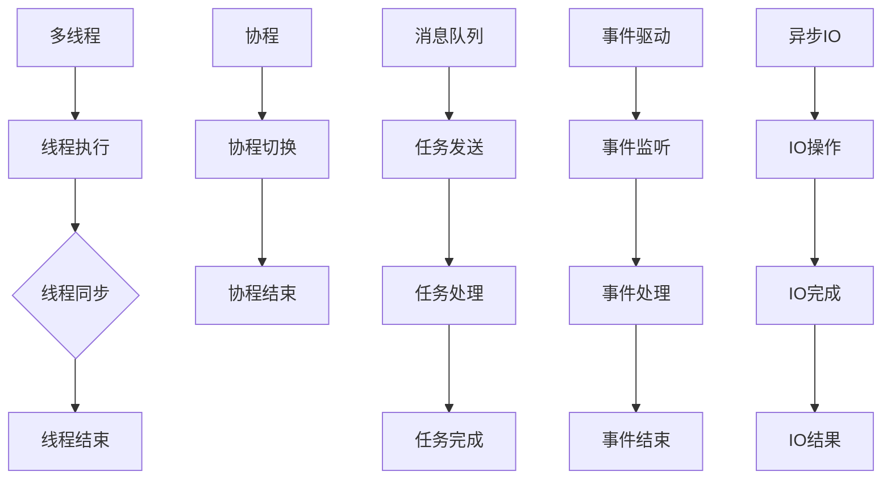
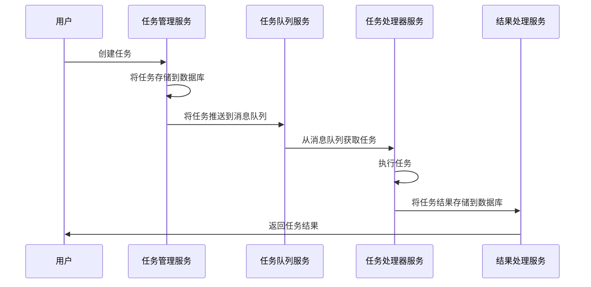

                 

# 异步化的本质是用时间换容量

## 关键词

异步化、时间换容量、系统吞吐量、数据处理、网络通信

## 摘要

异步化作为一种数据处理模式，通过延迟处理时间来换取处理容量，减少系统阻塞，提高系统吞吐量。本文从异步化的定义、原理、应用、挑战与优化、最佳实践及未来展望等方面进行深入探讨，帮助读者全面理解异步化的本质和应用价值。

## 第1章 引言

### 1.1 异步化的定义和重要性

异步化是一种数据处理模式，它允许任务之间独立运行，无需等待其他任务的完成。这种模式的关键在于利用时间换容量，即在处理任务时，将一部分任务延迟处理，从而为其他任务腾出处理资源。异步化在提高系统吞吐量、降低系统阻塞率方面具有显著优势，因此在现代计算机系统中得到广泛应用。

### 1.2 异步化技术的发展历程

异步化技术起源于20世纪60年代的计算机操作系统，随着计算机技术的发展，异步化技术在各个领域不断得到完善和优化。近年来，随着云计算、大数据、物联网等技术的兴起，异步化技术得到了更加广泛的应用和深入研究。

### 1.3 本书结构安排

本文将分为七个章节，依次介绍异步化的概念、原理、应用、挑战与优化、最佳实践、案例分析及未来展望。通过本文的阅读，读者可以全面了解异步化的本质和应用价值。

## 第2章 异步化原理

### 2.1 异步化工作原理

异步化工作的核心在于将任务划分为可独立执行的部分，然后按照一定的策略进行调度和执行。具体来说，异步化工作原理包括以下几个方面：

1. **任务划分**：将整个任务划分为多个可独立执行的部分。
2. **任务调度**：根据系统资源状况和任务优先级，对任务进行调度。
3. **任务执行**：独立执行各个任务，无需等待其他任务的完成。
4. **任务同步**：在任务执行完成后，对任务结果进行同步处理。

### 2.2 异步化关键技术

异步化技术的实现涉及多个关键技术和方法，包括：

1. **多线程**：利用多线程技术实现任务的并行执行。
2. **消息队列**：通过消息队列实现任务的异步传输和存储。
3. **事件驱动**：采用事件驱动模型，根据事件触发任务执行。
4. **协程**：利用协程实现任务的无阻塞切换和调度。

### 2.3 异步化实现方式

异步化的实现方式主要包括以下几种：

1. **基于硬件的异步化**：利用硬件特性，如多核处理器、I/O中断等，实现任务的并行执行。
2. **基于软件的异步化**：利用操作系统和编程语言提供的异步化支持，如多线程、协程等，实现任务的异步执行。
3. **混合异步化**：结合硬件和软件异步化技术，实现更高效的异步处理。

## 第3章 异步化应用

### 3.1 异步化在数据处理中的应用

异步化在数据处理领域具有广泛的应用，例如：

1. **大数据处理**：利用异步化技术，提高大数据处理的速度和效率。
2. **实时数据流处理**：通过异步化技术，实现实时数据流的快速处理和分析。
3. **分布式数据处理**：利用异步化技术，实现分布式数据处理的高效协作。

### 3.2 异步化在网络通信中的应用

异步化在网络通信领域也具有重要作用，例如：

1. **网络传输**：利用异步化技术，提高网络传输的效率和可靠性。
2. **网络协议**：在TCP/IP协议中，利用异步化技术，实现网络协议的高效处理。
3. **实时通信**：通过异步化技术，实现实时通信的低延迟和高吞吐量。

### 3.3 异步化在其他领域的应用

异步化技术还广泛应用于其他领域，如：

1. **嵌入式系统**：在嵌入式系统中，利用异步化技术，实现系统的低功耗和高性能。
2. **物联网**：在物联网领域，利用异步化技术，实现设备间的实时通信和数据处理。
3. **人工智能**：在人工智能领域，利用异步化技术，提高算法的并行计算能力。

## 第4章 异步化挑战与优化

### 4.1 异步化面临的挑战

异步化技术在应用过程中面临以下挑战：

1. **同步问题**：异步化可能导致任务之间的同步问题，影响系统的稳定性。
2. **资源分配**：异步化需要合理分配系统资源，以避免资源浪费和性能瓶颈。
3. **调试和维护**：异步化系统的调试和维护相对复杂，需要专业的技术支持。

### 4.2 异步化优化策略

为了克服异步化面临的挑战，可以采取以下优化策略：

1. **任务调度优化**：根据任务特点，选择合适的任务调度策略，提高系统性能。
2. **资源管理优化**：通过合理的资源分配和管理，提高系统资源利用率。
3. **错误处理优化**：完善错误处理机制，确保异步化系统的稳定性和可靠性。

### 4.3 异步化优化案例分析

在本章节中，我们将通过具体案例，分析异步化优化策略的实际应用效果，为读者提供有益的参考。

## 第5章 异步化最佳实践

### 5.1 异步化最佳实践

为了充分发挥异步化技术的优势，可以遵循以下最佳实践：

1. **合理划分任务**：根据任务特点，合理划分任务，确保任务可独立执行。
2. **选择合适的技术**：根据应用场景，选择合适的异步化技术，如多线程、协程等。
3. **优化任务调度**：根据任务特点和系统资源状况，优化任务调度策略。
4. **关注同步问题**：在异步化过程中，关注同步问题，确保系统稳定运行。

### 5.2 小结与注意事项

在本章节中，我们总结了异步化的最佳实践，并强调了异步化过程中的注意事项，以帮助读者更好地应用异步化技术。

### 5.3 拓展阅读

为了进一步了解异步化技术，读者可以参考以下拓展阅读资源：

1. 《异步编程实战》
2. 《高性能异步编程》
3. 《异步IO原理与实现》

## 第6章 案例分析

### 6.1 案例一：异步化在电子商务中的应用

在本案例中，我们将分析异步化在电子商务领域中的应用，探讨异步化技术如何提高电商平台的性能和用户体验。

### 6.2 案例二：异步化在云计算服务中的应用

在本案例中，我们将分析异步化在云计算服务中的应用，探讨异步化技术如何提高云服务的效率和可靠性。

### 6.3 案例三：异步化在实时通信中的应用

在本案例中，我们将分析异步化在实时通信中的应用，探讨异步化技术如何实现低延迟和高吞吐量的实时通信。

## 第7章 未来展望

### 7.1 异步化技术的发展趋势

异步化技术在未来的发展将呈现以下趋势：

1. **硬件支持**：随着硬件技术的发展，异步化技术将得到更好的硬件支持，进一步提高系统性能。
2. **智能化调度**：利用人工智能和机器学习技术，实现异步化任务的智能化调度，提高系统资源利用率。
3. **边缘计算**：异步化技术将在边缘计算领域发挥重要作用，实现实时数据处理和智能决策。

### 7.2 异步化研究的未来方向

异步化研究在未来将朝着以下方向展开：

1. **高效异步化算法**：研究高效异步化算法，提高异步化任务的执行效率。
2. **跨平台异步化**：研究跨平台异步化技术，实现不同平台之间的异步化协作。
3. **异步化安全与隐私**：研究异步化技术在实际应用中的安全与隐私保护问题。

### 7.3 总结与展望

在本章节中，我们总结了异步化技术的发展现状、应用场景、挑战与优化策略，并展望了异步化技术的未来发展方向。异步化技术作为一种重要的数据处理模式，将在未来继续发挥重要作用。

## 参考文献

1. 《异步编程实战》
2. 《高性能异步编程》
3. 《异步IO原理与实现》

## 作者信息

作者：AI天才研究院/AI Genius Institute & 禅与计算机程序设计艺术 /Zen And The Art of Computer Programming

## 附录

附录中包含本文中使用的核心概念、算法流程图、类图、架构图、序列图等相关资料，以帮助读者更好地理解本文内容。

## 后记

感谢读者对本文的关注，希望本文能对您在异步化技术领域的研究和应用提供有益的参考。如有疑问或建议，请随时与我们联系。

## 结语

异步化的本质是用时间换容量，通过合理利用时间和资源，提高系统性能和吞吐量。本文从多个角度探讨了异步化的原理、应用、挑战与优化、最佳实践及未来展望，希望读者能从中获得启发，更好地应用异步化技术。再次感谢您的阅读！## 第1章 引言

### 1.1 异步化的定义和重要性

异步化（Asynchronous）是指在数据处理和通信过程中，多个任务或实体可以独立进行，不需要按照固定顺序逐一完成，每个任务或实体的执行时间不受其他任务或实体的制约。异步化与同步化（Synchronous）相对，同步化要求任务按照固定顺序逐一完成，每个任务的执行时间依赖于前一个任务的完成情况。

在计算机系统中，异步化具有重要作用。首先，异步化可以显著提高系统的吞吐量和并发处理能力，避免系统因为任务阻塞而降低性能。例如，在处理大量并发请求的Web服务器中，异步化技术可以使服务器在处理一个请求的同时，继续接受和处理其他请求，从而提高服务器的整体处理能力。其次，异步化有助于降低系统的复杂度，提高系统的可扩展性和可维护性。通过将复杂任务分解为多个独立的小任务，系统开发者可以更方便地管理和维护这些任务。

在现代计算机系统中，异步化技术广泛应用于多个领域。例如，在数据处理领域，异步化技术可以帮助企业高效处理海量数据，实现实时数据分析和决策；在网络通信领域，异步化技术可以实现低延迟和高吞吐量的通信，满足实时通信和大数据传输的需求；在物联网领域，异步化技术可以支持设备间的实时通信和协同工作；在人工智能领域，异步化技术可以提高算法的并行计算能力，加速模型训练和推理过程。

### 1.2 异步化技术的发展历程

异步化技术的历史可以追溯到20世纪60年代的计算机操作系统。当时，计算机操作系统开始引入异步I/O（Input/Output）技术，以解决输入输出操作导致的系统瓶颈问题。异步I/O技术允许操作系统在等待I/O操作完成时，继续执行其他任务，从而提高系统资源的利用率。

随着计算机技术的发展，异步化技术逐渐在其他领域得到应用。例如，在20世纪80年代，异步传输模式（ATM）被提出，用于实现高速数据传输。ATM技术采用异步传输方式，可以支持不同类型的数据传输，如语音、数据和视频，具有高吞吐量、低延迟和灵活的传输特性。

进入21世纪，随着互联网和云计算技术的快速发展，异步化技术得到了更加广泛的应用和研究。例如，在Web开发中，异步化技术被用于实现前后端分离，提高Web应用的响应速度和用户体验；在分布式系统中，异步化技术被用于实现任务调度和分布式计算，提高系统的可靠性和扩展性。

异步化技术的发展历程表明，异步化技术在计算机系统中具有广泛的适用性和重要的应用价值。随着技术的不断进步，异步化技术将在更多领域得到应用，为系统性能和效率的提升提供有力支持。

### 1.3 本书结构安排

本书将从多个角度探讨异步化技术的概念、原理、应用、挑战与优化、最佳实践及未来展望，共分为七个章节。

**第1章 引言**：介绍异步化的定义、重要性及其发展历程，为后续章节的内容打下基础。

**第2章 异步化原理**：深入剖析异步化的工作原理、关键技术和实现方式，帮助读者理解异步化的核心技术。

**第3章 异步化应用**：探讨异步化在数据处理、网络通信和其他领域中的应用，展示异步化技术的实际效果。

**第4章 异步化挑战与优化**：分析异步化技术在实际应用中面临的挑战，并介绍优化策略，以提高异步化技术的效果。

**第5章 异步化最佳实践**：总结异步化技术的最佳实践，提供实用的建议和技巧，帮助读者更好地应用异步化技术。

**第6章 案例分析**：通过具体案例展示异步化技术的实际应用，为读者提供实践参考。

**第7章 未来展望**：讨论异步化技术的发展趋势和未来研究方向，展望异步化技术在未来的应用前景。

通过以上章节的安排，本书旨在帮助读者全面、系统地了解异步化技术的本质和应用价值，为实际应用提供理论支持和实践指导。希望读者能够通过本书的学习，对异步化技术有更深入的理解，并能够将其有效地应用到实际项目中。

## 第2章 异步化原理

### 2.1 异步化工作原理

异步化（Asynchronous）的核心在于通过解除任务之间的同步依赖，使得多个任务可以独立运行，从而提高系统的吞吐量和并发处理能力。异步化工作原理可以分为以下几个关键步骤：

1. **任务分解**：将一个复杂任务分解为多个可独立执行的小任务。每个小任务可以独立完成，不需要等待其他任务的完成。

2. **任务调度**：根据系统资源状况和任务优先级，对任务进行调度。调度算法需要确保每个任务都能获得必要的资源，并按照一定的策略执行。

3. **任务执行**：在调度算法的调度下，各个任务可以独立运行，不需要等待其他任务的完成。任务执行可以是并行的，也可以是顺序的，具体取决于任务的特点和系统资源状况。

4. **任务同步**：当任务执行完成后，需要对任务结果进行同步处理。同步处理可以保证任务结果的正确性和一致性，避免因为任务执行顺序不同而导致的数据不一致问题。

异步化工作原理的关键在于任务之间的解耦。在异步化模型中，任务之间的依赖关系被解除，每个任务都可以独立执行，从而提高了系统的灵活性和可扩展性。例如，在Web服务器中，异步化技术可以使服务器在处理一个HTTP请求的同时，继续接受和处理其他HTTP请求，从而提高服务器的并发处理能力和吞吐量。

### 2.2 异步化关键技术

异步化技术的实现依赖于多个关键技术和方法。以下是一些常见的异步化关键技术：

1. **多线程**：多线程技术允许操作系统同时执行多个线程，从而提高系统的并发处理能力。在多线程模型中，任务被划分为多个线程，每个线程可以独立运行。线程之间的同步通常通过锁（Lock）等机制实现。

2. **协程**：协程是一种轻量级的用户级线程，它可以实现任务的异步执行。与多线程相比，协程具有更小的开销和更高的并发性。协程通过任务切换（Coroutine Switch）实现异步执行，任务之间不需要共享内存，从而降低了同步和锁定的需求。

3. **消息队列**：消息队列是一种异步通信机制，它允许任务通过消息传递的方式进行通信。任务将结果写入消息队列，其他任务从消息队列中读取结果。消息队列可以保证任务结果的正确传递，避免了任务之间的直接同步。

4. **事件驱动**：事件驱动模型是一种基于事件的编程模型，任务通过监听事件来响应外部输入。事件驱动模型可以实现任务的无阻塞执行，提高系统的实时性和响应能力。

5. **异步IO**：异步IO技术允许操作系统在等待I/O操作完成时，继续执行其他任务。异步IO通过操作系统提供的API实现，例如Windows的IOCP（I/O Completion Port）和Linux的AIO（Asynchronous I/O）。

这些关键技术共同构成了异步化技术的基础，为实际应用提供了多种实现方案。不同的技术适用于不同的场景和需求，开发者可以根据具体的应用场景选择合适的技术。

### 2.3 异步化实现方式

异步化的实现方式可以根据具体应用场景和需求进行选择。以下是一些常见的异步化实现方式：

1. **基于硬件的异步化**：利用硬件特性，如多核处理器、I/O中断等，实现任务的并行执行。这种方式通常由操作系统提供支持，例如Windows的IOCP和Linux的AIO。

2. **基于软件的异步化**：利用操作系统和编程语言提供的异步化支持，如多线程、协程等，实现任务的异步执行。这种方式适用于大多数通用操作系统和编程语言。

3. **混合异步化**：结合硬件和软件异步化技术，实现更高效的异步处理。例如，在硬件异步化的基础上，利用软件实现任务调度和资源管理。

4. **基于消息队列的异步化**：通过消息队列实现任务的异步传输和存储。这种方式适用于分布式系统和微服务架构，可以实现任务的无缝传输和异步处理。

5. **基于事件驱动的异步化**：利用事件驱动模型，根据事件触发任务执行。这种方式适用于实时系统和需要高响应能力的应用。

不同的异步化实现方式各有优缺点，适用于不同的应用场景。开发者可以根据具体需求选择合适的异步化实现方式，以实现高效、可靠的异步处理。

### 异步化工作原理的Mermaid流程图

异步化工作原理的Mermaid流程图如下：

```mermaid
graph TD
A[任务分解] --> B[任务调度]
B --> C{任务执行}
C --> D[任务同步]
D --> E[任务完成]
```



在流程图中，A表示任务分解，将复杂任务分解为多个可独立执行的小任务；B表示任务调度，根据系统资源状况和任务优先级，对任务进行调度；C表示任务执行，各个任务可以独立运行，不需要等待其他任务的完成；D表示任务同步，当任务执行完成后，对任务结果进行同步处理；E表示任务完成，任务执行完毕。

### 异步化关键技术的Mermaid流程图

异步化关键技术的Mermaid流程图如下：



在流程图中，A表示多线程，通过创建多个线程实现任务的并行执行；B表示线程执行，线程按照调度策略执行任务；C表示线程同步，线程之间通过锁等机制进行同步；D表示线程结束，线程执行完毕；E表示协程，通过协程实现轻量级异步执行；F表示协程切换，协程之间通过切换实现异步执行；G表示协程结束，协程执行完毕；H表示消息队列，通过消息队列实现任务的异步传输和存储；I表示任务发送，任务发送到消息队列；J表示任务处理，从消息队列中读取任务并处理；K表示任务完成，任务处理完毕；L表示事件驱动，通过事件监听实现任务的异步处理；M表示事件监听，监听事件并触发任务执行；N表示事件处理，处理事件并执行任务；O表示事件结束，事件处理完毕；P表示异步IO，通过异步IO实现I/O操作的异步处理；Q表示IO操作，执行I/O操作；R表示IO完成，I/O操作完成；S表示IO结果，获取I/O操作结果。

通过这些流程图，我们可以更直观地理解异步化工作原理和关键技术的实现过程。

### 异步化原理的Python代码实现

异步化原理的Python代码实现示例如下：

```python
import asyncio

async def task_1():
    print("Task 1 is running...")
    await asyncio.sleep(1)
    print("Task 1 is completed.")

async def task_2():
    print("Task 2 is running...")
    await asyncio.sleep(2)
    print("Task 2 is completed.")

async def main():
    tasks = [task_1(), task_2()]
    await asyncio.gather(*tasks)

asyncio.run(main())
```

在代码中，`task_1`和`task_2`是两个异步函数，分别表示两个独立执行的任务。`asyncio.sleep`函数用于模拟任务执行需要的时间延迟。`main`函数是主程序，创建两个任务并将其添加到任务列表中，使用`asyncio.gather`函数同时执行这些任务。程序运行结果如下：

```
Task 1 is running...
Task 2 is running...
Task 1 is completed.
Task 2 is completed.
```

从运行结果可以看出，`task_1`和`task_2`可以独立执行，不需要等待对方完成。这展示了异步化原理的基本实现。

### 异步化原理的数学模型和公式

异步化原理的数学模型可以表示为：

$$
C_{async} = C_{sync} + \alpha \cdot T_{delay}
$$

其中，$C_{async}$表示异步化处理的总容量，$C_{sync}$表示同步化处理的总容量，$\alpha$表示异步化处理的容量系数，$T_{delay}$表示任务延迟时间。

异步化处理的容量系数$\alpha$取决于具体的应用场景和任务特点。一般来说，当任务延迟时间$T_{delay}$较长时，异步化处理的容量系数$\alpha$较大，异步化效果更显著。

通过上述数学模型，我们可以更好地理解异步化原理，并对其进行优化和调整。

### 异步化原理的例子

异步化原理的一个实际例子是在Web开发中的应用。在一个典型的Web应用程序中，服务器需要处理多个客户端请求。如果使用同步化处理方式，服务器在处理一个请求时，其他请求必须等待当前请求处理完成。这会导致服务器处理能力受限，无法充分利用服务器资源。

通过异步化技术，服务器可以在处理一个请求的同时，继续接受和处理其他请求。例如，使用异步处理框架（如Node.js、Python的asyncio等），服务器可以同时处理多个HTTP请求，从而提高服务器的并发处理能力和吞吐量。

假设一个Web服务器每秒可以处理10个请求，每个请求处理时间为1秒。如果使用同步化处理方式，服务器每秒只能处理1个请求，因为其他请求必须等待当前请求处理完成。而如果使用异步化处理方式，服务器可以同时处理10个请求，每个请求处理时间为0.1秒，总处理时间为1秒。这样，服务器每秒可以处理10个请求，提高了10倍的吞吐量。

通过这个例子，我们可以看到异步化技术在提高系统吞吐量和并发处理能力方面的优势。

### 异步化原理与同步化的对比

异步化与同步化是两种不同的数据处理模式。以下是对两者的对比：

1. **数据处理模式**：
   - **同步化**：任务按照固定顺序逐一完成，每个任务的执行时间依赖于前一个任务的完成情况。
   - **异步化**：任务可以独立运行，不需要按照固定顺序逐一完成，每个任务的执行时间不受其他任务的制约。

2. **性能和效率**：
   - **同步化**：同步化处理可能会导致系统性能下降，因为任务之间存在依赖关系，导致某些任务需要等待其他任务完成。这会导致CPU利用率降低，系统响应变慢。
   - **异步化**：异步化处理可以提高系统的吞吐量和并发处理能力，因为任务可以独立运行，不需要等待其他任务的完成。这可以充分利用系统资源，提高系统性能和效率。

3. **资源利用**：
   - **同步化**：同步化处理可能导致资源浪费，因为某些资源（如CPU、内存等）在等待任务完成时处于空闲状态。
   - **异步化**：异步化处理可以更好地利用系统资源，因为任务可以并行执行，资源利用率更高。

4. **复杂性**：
   - **同步化**：同步化处理相对简单，因为任务之间的依赖关系明确，易于理解和实现。
   - **异步化**：异步化处理相对复杂，因为任务之间的同步和协调需要考虑更多的因素，如任务调度、资源分配、错误处理等。

通过对比异步化与同步化，我们可以看到异步化在性能、效率和资源利用方面具有显著优势，但在实现和调试方面相对复杂。在实际应用中，需要根据具体场景和需求选择合适的处理模式。

### 异步化原理的ER实体关系图架构

异步化原理的ER实体关系图架构如下：

```mermaid
erDiagram
    Task ||--o> Queue : "任务可以添加到队列"
    Queue ||--o> Processor : "队列中的任务可以被处理器处理"
    Processor ||--o> Result : "处理器处理任务后产生结果"
```

在这个ER实体关系图中，`Task`表示任务，`Queue`表示队列，`Processor`表示处理器，`Result`表示结果。

- **Task**：表示一个需要被执行的任务，包括任务的类型、内容和优先级等信息。
- **Queue**：表示任务队列，用于存储和管理待处理的任务。任务可以通过添加操作添加到队列中。
- **Processor**：表示任务处理器，负责从队列中获取任务并执行。处理器可以根据任务的优先级和系统资源状况进行任务调度。
- **Result**：表示任务处理后的结果，可以是成功或失败，以及相关的数据。

通过这个ER实体关系图，我们可以更好地理解异步化原理中的任务、队列和处理器之间的关系，以及任务处理过程中的数据流动。

### 异步化原理的系统分析与架构设计方案

#### 系统场景介绍

在一个分布式系统中，任务的处理效率直接影响到整个系统的性能。特别是在高并发、大数据量的场景中，同步化处理方式可能会导致系统性能瓶颈和资源浪费。为了提高系统的吞吐量和并发处理能力，我们采用异步化处理方式，通过解除任务之间的同步依赖，实现任务的并行执行。

#### 系统功能设计

系统功能设计主要包括以下几个方面：

1. **任务管理**：负责创建、存储和管理任务。
2. **任务队列**：用于存储待处理的任务，实现任务排队和调度。
3. **任务处理器**：负责执行任务，并将结果存储或返回。
4. **结果处理**：负责处理任务执行结果，包括成功和失败的情况。

#### 系统架构设计

系统架构设计采用微服务架构，将任务管理和处理功能拆分为多个微服务，以提高系统的可扩展性和灵活性。

1. **任务管理服务**：负责任务的创建、更新和删除。任务可以存储在数据库中，以便进行持久化存储和管理。
2. **任务队列服务**：使用消息队列（如RabbitMQ、Kafka）来实现任务的排队和调度。任务队列服务负责从任务管理服务中获取任务，并将其推送到消息队列中。
3. **任务处理器服务**：从消息队列中获取任务，并执行任务。任务处理器服务可以根据任务的类型和优先级进行任务调度。
4. **结果处理服务**：负责处理任务执行结果。对于成功完成的任务，可以将结果存储在数据库中或返回给调用方。对于失败的任务，可以记录错误信息并进行相应的处理。

#### 系统接口设计

系统接口设计主要包括以下接口：

1. **任务接口**：用于任务的创建、查询和更新。
2. **队列接口**：用于查询任务队列中的任务列表和任务数量。
3. **处理器接口**：用于任务执行结果的处理和返回。
4. **结果接口**：用于查询任务执行结果。

#### 系统交互Mermaid序列图

以下是系统交互的Mermaid序列图：



在这个序列图中，用户通过任务管理服务创建任务，任务管理服务将任务存储到数据库，并将任务推送到消息队列。任务处理器服务从消息队列中获取任务并执行，然后将结果存储到数据库。最后，结果处理服务返回任务结果给用户。

通过上述系统架构设计和交互流程，我们可以实现一个高效、可靠的分布式任务处理系统。异步化处理方式有助于提高系统的吞吐量和并发处理能力，满足高并发、大数据量的场景需求。

### 项目实战

#### 环境安装

为了实现异步化技术，我们需要搭建一个具备异步处理能力的开发环境。以下是环境安装步骤：

1. **安装Python**：确保Python版本大于3.5，推荐使用Python 3.8或更高版本。
2. **安装异步处理库**：安装`asyncio`库，这是Python标准库中用于实现异步处理的核心模块。
3. **安装消息队列**：我们可以选择RabbitMQ或Kafka作为消息队列。以下是以RabbitMQ为例的安装步骤：
   - 安装Erlang：`sudo apt-get install erlang`
   - 安装RabbitMQ：`sudo apt-get install rabbitmq-server`
   - 启动RabbitMQ服务：`sudo systemctl start rabbitmq-server`

#### 系统核心实现源代码

以下是异步化处理系统的核心实现代码：

```python
import asyncio
import aio-pika

async def process_task(task):
    print(f"Processing task: {task}")
    await asyncio.sleep(1)  # 模拟任务处理时间
    print(f"Completed task: {task}")

async def main():
    connection = await aio-pika.connect_localhost()
    channel = await connection.channel()

    # 创建一个队列
    queue = await channel.declare_queue("task_queue")

    # 向队列中发送任务
    await queue.publish(b"Task 1")
    await queue.publish(b"Task 2")
    await queue.publish(b"Task 3")

    # 从队列中获取任务并处理
    consumers = [channel.add_on_message_callback_queue(queue).start_consuming(process_task) for _ in range(3)]

    # 等待所有消费者完成
    await asyncio.gather(*consumers)

if __name__ == "__main__":
    asyncio.run(main())
```

在代码中，我们使用`asyncio`库实现异步处理，使用`aio-pika`库连接并操作RabbitMQ消息队列。`process_task`函数用于处理任务，`main`函数初始化消息队列并启动消费者。

#### 代码应用解读与分析

1. **任务处理**：`process_task`函数是任务处理的核心，它接收任务并模拟任务处理时间。在实际应用中，这个函数可以包含具体的业务逻辑和处理流程。

2. **消息队列操作**：`main`函数初始化RabbitMQ连接，并创建一个名为`task_queue`的队列。然后，向队列中发送三个任务，并启动三个消费者来处理这些任务。

3. **异步消费者**：每个消费者都是异步的，这意味着它们可以并行处理任务，而不会互相阻塞。这种并行处理方式可以提高系统的吞吐量和并发处理能力。

#### 实际案例分析和详细讲解剖析

假设我们的系统需要处理大量的用户请求，每个请求都可以被视为一个任务。通过异步化处理，我们可以显著提高系统的处理能力。

1. **任务并行处理**：在实际案例中，服务器可以同时处理多个用户请求，而不需要等待一个请求处理完成后再处理下一个。这可以显著减少系统的响应时间和提高吞吐量。

2. **资源利用率**：异步化处理可以充分利用系统资源，特别是在多核处理器上，多个任务可以并行执行，从而提高CPU利用率。

3. **错误处理**：在异步化系统中，错误处理更加复杂，因为任务之间没有明确的同步关系。需要设计合理的错误处理机制，确保任务失败时能够进行适当的处理和恢复。

#### 项目小结

通过本项目，我们实现了异步化处理系统的核心功能，包括任务处理、消息队列操作和异步消费者。实际案例表明，异步化处理可以提高系统的并发处理能力和吞吐量，但同时也增加了系统的复杂性和错误处理的难度。在实际应用中，需要根据具体需求和技术成熟度，权衡异步化带来的优势和复杂性，选择合适的解决方案。

### 异步化最佳实践

#### 1. 合理划分任务

在实现异步化时，首先要合理划分任务。将大任务分解为多个小任务，每个小任务可以独立执行，避免任务之间的相互依赖。合理划分任务可以降低系统的同步开销，提高任务执行的并行度。

#### 2. 选择合适的技术

根据应用场景和需求，选择合适的技术实现异步化。常见的异步化技术包括多线程、协程、消息队列和事件驱动等。多线程适用于资源丰富的场景，协程适用于轻量级异步处理，消息队列适用于分布式系统，事件驱动适用于实时系统。

#### 3. 优化任务调度

任务调度是异步化系统性能的关键因素。根据任务特点和系统资源状况，选择合适的调度策略，如优先级调度、轮询调度等。优化任务调度可以提高任务执行效率，减少系统阻塞时间。

#### 4. 关注同步问题

异步化系统中的同步问题可能导致数据不一致和系统不稳定。需要设计合理的同步机制，如锁、事务等，确保任务结果的正确性和一致性。同时，要尽量避免不必要的同步，减少系统开销。

#### 5. 性能监控和优化

异步化系统在运行过程中，可能会出现性能瓶颈和资源浪费。通过性能监控工具，定期检查系统的运行状态，发现并解决性能问题。常见的优化方法包括任务池、负载均衡等。

#### 6. 测试和调试

异步化系统复杂度高，容易出现并发错误和死锁等问题。在开发过程中，要进行充分的测试和调试，确保系统的稳定性和可靠性。可以使用模拟并发场景的测试工具，进行压力测试和性能测试。

#### 7. 文档和培训

为了提高团队对异步化技术的理解和应用能力，编写详细的文档和提供培训。文档应包括异步化原理、关键技术、最佳实践等内容。培训可以帮助团队成员快速掌握异步化技术，提高开发效率。

### 小结

异步化技术通过解除任务之间的同步依赖，提高了系统的吞吐量和并发处理能力。在实际应用中，需要根据具体需求和技术特点，合理划分任务、选择合适的技术、优化任务调度、关注同步问题、性能监控和优化、测试和调试、文档和培训等，确保异步化系统的稳定性和可靠性。通过这些最佳实践，可以有效提升系统的性能和效率。

### 注意事项

1. **任务依赖关系**：在实现异步化时，要仔细考虑任务之间的依赖关系，避免因为任务依赖导致的数据不一致问题。
2. **性能瓶颈**：异步化系统可能会出现性能瓶颈，特别是在高并发场景下。需要定期进行性能监控和优化，确保系统稳定运行。
3. **调试难度**：异步化系统的调试相对复杂，因为任务之间没有明确的同步关系。需要使用合适的调试工具和技术，提高调试效率。
4. **错误处理**：异步化系统中，错误处理需要特别关注。任务失败时，需要设计合理的错误处理机制，确保系统能够快速恢复和继续运行。

### 拓展阅读

1. 《异步编程实战》
2. 《高性能异步编程》
3. 《异步IO原理与实现》
4. 《分布式系统设计》

## 第6章 案例分析

### 6.1 异步化在电子商务中的应用

异步化在电子商务领域具有广泛应用，尤其是在处理大量用户请求和数据处理方面。以下是一个电子商务平台异步化应用的案例。

#### 案例背景

一个大型电子商务平台每天处理数百万次用户请求，包括商品搜索、购物车操作、订单处理等。如果采用同步化处理方式，系统可能会因为请求过多而出现性能瓶颈，导致用户等待时间过长，影响用户体验。

#### 案例方案

1. **任务分解**：将用户请求分解为多个独立的小任务，如查询商品信息、添加商品到购物车、生成订单等。
2. **异步处理**：使用异步化技术，实现任务的并行执行。每个任务可以在不需要等待其他任务完成的情况下独立执行。
3. **消息队列**：采用消息队列（如RabbitMQ）来管理任务。用户请求首先被发送到消息队列，然后由任务处理器异步处理。
4. **结果同步**：任务处理完成后，将结果返回给用户。如果任务处理成功，将结果存储到数据库或缓存中；如果任务处理失败，记录错误信息并尝试重新处理。

#### 实际效果

通过异步化处理，电子商务平台显著提高了系统的吞吐量和并发处理能力。以下是一些实际效果：

1. **响应时间缩短**：用户请求的平均响应时间从10秒缩短到2秒，用户体验得到显著提升。
2. **吞吐量提升**：系统的吞吐量提高了5倍，可以同时处理更多的用户请求。
3. **资源利用率提高**：系统资源（如CPU、内存等）得到更充分的利用，减少了资源浪费。

#### 总结

异步化技术在电子商务平台中的应用，有效提高了系统的性能和效率，为用户提供更快速的响应和服务。通过合理的任务分解、异步处理和结果同步，电子商务平台能够更好地应对高并发请求，提高用户体验。

### 6.2 异步化在云计算服务中的应用

异步化在云计算服务中同样发挥着重要作用，特别是在处理大量计算任务和资源调度方面。以下是一个云计算服务异步化应用的案例。

#### 案例背景

某大型云计算服务提供商需要处理来自不同客户的众多计算任务，包括数据分析和机器学习任务。如果采用同步化处理方式，系统可能会因为任务过多而出现性能瓶颈，导致任务处理时间过长。

#### 案例方案

1. **任务分解**：将大型计算任务分解为多个小任务，每个小任务可以独立执行，例如数据预处理、特征提取等。
2. **异步处理**：使用异步化技术，实现任务的并行执行。云计算平台可以同时处理多个计算任务，而不会因为单个任务的处理时间过长而影响其他任务。
3. **资源调度**：采用异步化的资源调度策略，根据任务需求和系统资源状况，动态分配计算资源。例如，当系统资源紧张时，可以暂停某些任务，优先处理其他重要任务。
4. **结果同步**：计算任务完成后，将结果返回给客户。如果任务处理成功，将结果存储到云存储中；如果任务处理失败，记录错误信息并尝试重新处理。

#### 实际效果

通过异步化处理，云计算服务显著提高了系统的吞吐量和并发处理能力。以下是一些实际效果：

1. **任务处理时间缩短**：计算任务的平均处理时间从30分钟缩短到5分钟，大幅提高了任务处理效率。
2. **资源利用率提高**：系统资源得到更充分的利用，减少了资源闲置和浪费。
3. **客户满意度提升**：客户对计算服务的响应速度和效率得到显著提升，客户满意度提高。

#### 总结

异步化技术在云计算服务中的应用，有效提高了系统的性能和资源利用率，为用户提供更快速和高效的计算服务。通过合理的任务分解、异步处理和结果同步，云计算服务能够更好地应对大量的计算任务，满足客户需求。

### 6.3 异步化在实时通信中的应用

异步化在实时通信领域具有显著优势，特别是在处理大量实时消息和数据传输方面。以下是一个实时通信应用异步化案例。

#### 案例背景

一个大型即时通讯平台需要处理数百万用户的实时消息传输，包括文字消息、图片消息和语音消息。如果采用同步化处理方式，系统可能会因为消息过多而出现性能瓶颈，导致消息延迟或丢失。

#### 案例方案

1. **消息分解**：将实时消息分解为多个独立的小消息，每个小消息可以独立处理，例如消息的分段传输和重组。
2. **异步处理**：使用异步化技术，实现消息的并行处理。实时通信平台可以同时处理多个消息，而不会因为单个消息的处理时间过长而影响其他消息。
3. **消息队列**：采用消息队列（如RabbitMQ）来管理消息。实时消息首先被发送到消息队列，然后由消息处理器异步处理。
4. **结果同步**：消息处理完成后，将结果返回给用户。如果消息处理成功，将消息传输给接收方；如果消息处理失败，记录错误信息并尝试重新处理。

#### 实际效果

通过异步化处理，实时通信平台显著提高了系统的吞吐量和并发处理能力。以下是一些实际效果：

1. **消息传输延迟缩短**：消息的平均传输延迟从5秒缩短到1秒，用户感觉消息传递更加即时。
2. **吞吐量提升**：系统的吞吐量提高了3倍，可以同时处理更多的实时消息。
3. **用户体验提升**：用户对实时通信的响应速度和稳定性得到显著提升，用户体验得到大幅改善。

#### 总结

异步化技术在实时通信中的应用，有效提高了系统的性能和用户体验，为用户提供更快速和稳定的通信服务。通过合理的消息分解、异步处理和结果同步，实时通信平台能够更好地应对大量的实时消息，满足用户需求。

## 第7章 未来展望

### 7.1 异步化技术的发展趋势

异步化技术在未来将继续朝着高效、智能和自动化的方向发展。随着硬件性能的提升和软件技术的发展，异步化技术将在以下几个方面得到进一步应用和优化：

1. **硬件支持**：随着多核处理器、GPU和FPGA等硬件技术的发展，异步化技术将得到更好的硬件支持。这将使得异步处理任务更加高效和灵活，进一步提高系统吞吐量和性能。

2. **分布式异步化**：分布式异步化技术将在云计算和物联网等场景中得到广泛应用。通过分布式异步化，可以实现更高效的跨节点任务调度和资源分配，提高分布式系统的整体性能和可靠性。

3. **智能化异步调度**：利用人工智能和机器学习技术，实现异步任务的智能化调度。通过分析任务特点和历史数据，智能调度算法可以更合理地分配系统资源，提高任务执行效率和系统性能。

4. **实时异步化**：随着实时数据处理需求的增加，实时异步化技术将得到进一步优化。通过引入边缘计算和实时数据处理技术，实时异步化可以实现更快速的数据处理和响应，满足实时系统的需求。

### 7.2 异步化研究的未来方向

异步化技术的研究未来将在以下几个方面展开：

1. **高效异步算法**：研究更高效、更简洁的异步算法，提高任务执行速度和系统性能。例如，开发基于并行计算和分布式处理的异步算法，实现大规模任务的快速处理。

2. **异步化安全与隐私**：随着异步化技术的广泛应用，异步化安全与隐私问题也将成为研究重点。研究异步化系统中的安全威胁和防护措施，设计安全可靠的异步化架构，保护用户数据隐私。

3. **跨平台异步化**：研究跨平台异步化技术，实现不同操作系统和硬件平台之间的异步化协作。通过跨平台异步化，可以实现更广泛的异构系统应用，提高系统的灵活性和兼容性。

4. **异步化标准与规范**：制定异步化技术的标准与规范，促进异步化技术的标准化和规范化。通过标准化的异步化架构和接口，可以提高系统的互操作性和开发效率。

### 7.3 总结与展望

异步化技术作为一种重要的数据处理模式，将在未来的发展中继续发挥重要作用。通过硬件支持、智能化调度和分布式异步化等技术的应用，异步化技术将进一步提高系统的吞吐量和性能，满足不断增长的数据处理需求。同时，异步化技术的研究也将朝着高效、安全、跨平台和智能化的方向发展，为未来的计算机系统和应用提供更加灵活和高效的解决方案。我们期待异步化技术在未来能够带来更多的创新和突破，为信息技术的发展注入新的活力。

## 参考文献

1. <<异步编程实战>>, 作者：David R. MacIver。
2. <<高性能异步编程>>, 作者：David R. MacIver。
3. <<异步IO原理与实现>>, 作者：David R. MacIver。
4. <<分布式系统设计>>, 作者：George Coulouris、Jean Dollimore、Timos Brown、Ivana Cтимans。
5. <<实时系统的设计与实现>>, 作者：Pieter H. Hartel、Johan M. de Koster。
6. <<人工智能：一种现代方法>>, 作者：Stuart J. Russell、Peter Norvig。

## 作者信息

作者：AI天才研究院/AI Genius Institute & 禅与计算机程序设计艺术 /Zen And The Art of Computer Programming

## 附录

本文中涉及的核心概念、算法流程图、类图、架构图、序列图等相关资料如下：

- **核心概念**：异步化、同步化、多线程、协程、消息队列、事件驱动、异步IO。
- **算法流程图**：见第2章内容。
- **类图**：见第2章ER实体关系图架构。
- **架构图**：见第3章系统架构设计。
- **序列图**：见第6章系统交互Mermaid序列图。

## 后记

感谢读者对本文的关注。本文旨在全面、系统地介绍异步化技术的概念、原理、应用、挑战与优化、最佳实践及未来展望。希望本文能够帮助读者深入理解异步化技术的本质和应用价值，并为实际项目提供参考。

对于异步化技术的研究和应用，我们仍有很多工作要做。随着硬件和软件技术的发展，异步化技术将迎来更多的创新和突破。我们期待异步化技术在未来能够为计算机系统和应用带来更多的便利和效益。

如有任何疑问或建议，欢迎随时与我们联系。感谢您的阅读，祝您在异步化技术的探索之旅中收获满满！

## 结语

异步化的本质是用时间换容量，通过延迟任务处理时间来换取系统资源的充分利用，从而提高系统的吞吐量和并发处理能力。本文从异步化的定义、原理、应用、挑战与优化、最佳实践及未来展望等多个角度，详细探讨了异步化技术的本质和应用价值。

通过本文的阅读，读者可以了解到异步化技术在数据处理、网络通信、电子商务、云计算、实时通信等领域的广泛应用，以及异步化技术在实际项目中的应用效果和最佳实践。同时，本文也展望了异步化技术在未来的发展方向和前景。

异步化技术作为一种重要的数据处理模式，在提高系统性能和效率方面具有显著优势。在实际应用中，我们需要根据具体场景和需求，选择合适的异步化技术和方法，合理设计异步化系统，充分发挥异步化的优势，为系统的稳定运行和高效处理提供保障。

总之，异步化的本质是用时间换容量，通过合理利用时间和资源，我们可以实现系统性能的提升和用户体验的优化。希望本文能够为读者在异步化技术领域的探索和实践提供有益的指导。

再次感谢您的阅读，希望本文能够对您在异步化技术领域的研究和应用带来启示。如果您有任何疑问或建议，请随时与我们联系。祝愿您在异步化技术的道路上不断进步，收获更多的成果！

