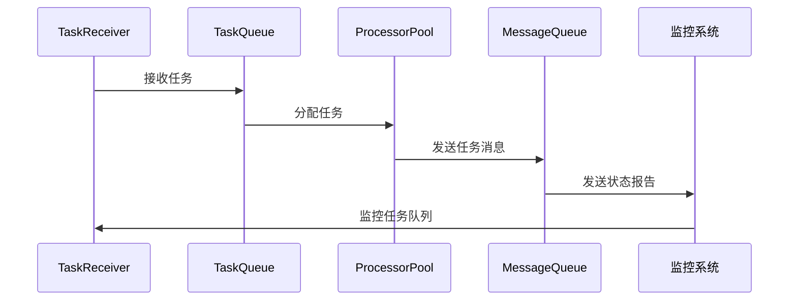
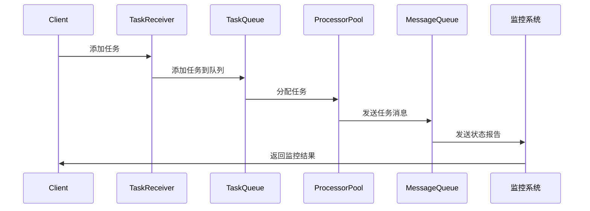

                 

# 异步化的本质是用时间换容量

> 关键词：异步化、时间换容量、实时系统、大数据处理、分布式系统

> 摘要：本文深入探讨了异步化的本质，即用时间换容量。通过分析异步化的历史、基本原理、应用场景、技术实现和挑战与未来展望，揭示了异步化在各个领域的广泛运用和重要性。

## 引言：异步化的时代

异步化（Asynchronous）的概念起源于通信领域，最初是为了解决通信过程中的延迟问题。随着计算机技术的发展，异步化逐渐在计算机领域得到广泛应用，特别是在实时系统和分布式系统中。

### 1.1 异步化的发展历程

- **异步通信的起源**：异步通信最初是为了解决电话系统中电话交换机的延迟问题而出现的。
- **异步化在计算机领域的应用**：随着计算机技术的发展，异步化在计算机领域得到广泛应用，包括操作系统、数据库、网络通信和分布式系统等。

### 1.2 异步化的核心概念

- **异步通信的基本原理**：异步通信允许数据在不同的时间发送和接收，从而提高了系统的效率和可靠性。
- **时间换容量的概念解析**：异步化通过牺牲一定的处理时间来换取更大的系统容量，即用时间换容量。
- **异步化的优势**：异步化可以提高系统的并发处理能力，降低系统延迟，提高系统稳定性。

## 第2章 异步化原理

### 2.1 异步化的基础理论

- **计算机网络基础**：异步通信依赖于计算机网络的支持，包括TCP/IP协议等。
- **并发编程原理**：异步化需要并发编程的支持，以实现高效的并发处理。

### 2.2 时间换容量的数学模型

- **通信模型与容量分析**：通过通信模型分析，揭示了异步化通过时间换容量的本质。
- **时间与容量的关系公式**：$$ C = \frac{T}{N} $$，其中C为系统容量，T为处理时间，N为处理次数。

### 2.3 异步化与同步化的对比

- **同步通信的缺点**：同步通信会导致系统延迟，降低系统并发处理能力。
- **异步通信的优点**：异步通信可以减少系统延迟，提高系统并发处理能力。

## 第3章 异步化的应用场景

### 3.1 实时系统中的异步化

- **实时数据处理**：异步化可以有效地处理实时数据，提高系统响应速度。
- **异步通信在嵌入式系统中的应用**：异步通信在嵌入式系统中具有广泛的应用，如智能家居、工业自动化等。

### 3.2 大数据处理中的异步化

- **数据流处理**：异步化可以有效地处理大规模数据流，提高数据处理效率。
- **异步存储与检索**：异步化可以提高数据存储和检索的速度。

### 3.3 网络通信中的异步化

- **TCP/IP协议的异步特性**：TCP/IP协议具有异步特性，可以有效地处理网络通信中的延迟问题。
- **异步传输模式（ATM）的应用**：ATM技术是一种异步传输模式，广泛应用于高速网络通信。

## 第4章 异步化技术实现

### 4.1 异步通信协议的设计

- **异步传输协议（ATP）框架**：ATP是异步通信的协议框架，包括数据传输、错误检测和恢复等功能。
- **异步消息队列的设计与实现**：异步消息队列是异步通信的核心，用于存储和转发消息。

### 4.2 异步编程模型

- **异步编程范式**：异步编程范式包括事件驱动、回调函数等。
- **Python异步编程实例**：通过Python实例展示了异步编程的基本原理和实现方法。

### 4.3 异步化测试与优化

- **异步通信的测试策略**：异步通信的测试策略包括性能测试、稳定性测试等。
- **异步化系统的性能优化**：通过性能优化，可以提高异步化系统的性能。

## 第5章 异步化在分布式系统中的应用

### 5.1 分布式计算中的异步化

- **分布式计算模型**：分布式计算模型包括数据划分、任务分配等。
- **异步分布式系统的设计**：异步分布式系统设计包括异步通信协议、任务调度等。

### 5.2 微服务架构中的异步化

- **微服务架构概述**：微服务架构是一种分布式系统架构，包括服务划分、服务通信等。
- **异步消息驱动微服务的实现**：异步消息驱动微服务的实现包括消息队列、服务调用等。

### 5.3 云计算中的异步化

- **云服务平台与异步通信**：云服务平台与异步通信的结合，可以实现高效的任务调度和数据传输。
- **云计算中的异步任务调度**：异步任务调度是云计算中的重要功能，可以提高云计算的效率。

## 第6章 异步化的挑战与未来展望

### 6.1 异步化的挑战

- **异步通信中的延迟问题**：异步通信中的延迟问题需要通过优化算法和协议来解决。
- **异步化系统的可靠性与容错性**：异步化系统需要具备较高的可靠性和容错性，以应对各种故障。

### 6.2 异步化的未来趋势

- **异步化技术的发展方向**：异步化技术在未来将得到进一步发展，包括更高的并发处理能力、更好的可靠性等。
- **异步化在物联网和人工智能中的应用前景**：异步化在物联网和人工智能中具有广泛的应用前景，如智能家居、自动驾驶等。

## 第7章 案例分析：异步化在现代技术中的应用

### 7.1 案例一：异步通信在金融交易中的应用

- **交易系统的异步处理**：通过异步通信，交易系统可以有效地处理大规模交易请求，降低交易延迟。
- **异步通信在降低交易延迟中的作用**：异步通信可以显著降低交易系统的延迟，提高交易系统的性能。

### 7.2 案例二：大数据处理中的异步化

- **数据流的异步处理架构**：通过异步化，大数据处理系统可以高效地处理大规模数据流。
- **异步化在大数据处理中的优势**：异步化可以提高大数据处理系统的效率，降低处理时间。

### 7.3 案例三：网络游戏中的异步通信

- **游戏服务器与客户端的异步通信**：通过异步通信，游戏服务器和客户端可以实现高效的数据交换。
- **异步化在提升游戏体验中的作用**：异步化可以提高游戏的响应速度，提升游戏体验。

## 第8章 总结与展望

### 8.1 总结

- **异步化的重要性**：异步化在现代技术中具有重要作用，可以提高系统的并发处理能力、降低系统延迟等。
- **异步化在各领域的应用成果**：异步化在各个领域取得了显著的应用成果，如实时系统、大数据处理、分布式系统等。

### 8.2 展望

- **异步化的未来发展方向**：异步化技术在未来将得到进一步发展，包括更高的并发处理能力、更好的可靠性等。
- **异步化技术的创新点**：异步化技术在物联网和人工智能等新兴领域具有广阔的创新空间。

作者：AI天才研究院/AI Genius Institute & 禅与计算机程序设计艺术 /Zen And The Art of Computer Programming## 第1章 引言：异步化的时代

### 1.1 异步化的发展历程

异步化（Asynchronous）的概念起源于通信领域，最早可以追溯到20世纪30年代。当时，为了解决电话交换机中的延迟问题，人们开始研究异步通信技术。异步通信允许数据在不同的时间发送和接收，而不需要同步进行，从而提高了通信效率。

随着计算机技术的不断发展，异步化在计算机领域也得到了广泛应用。例如，操作系统中的多任务处理、数据库中的并发控制、网络通信中的TCP/IP协议等，都是异步化的典型应用。异步化在这些领域中的成功应用，不仅提高了系统的性能和可靠性，还推动了计算机技术的发展。

在早期的计算机系统中，同步通信（Synchronous Communication）是主要的方式。同步通信要求发送方和接收方必须在相同的时间内发送和接收数据，否则会导致数据丢失或错误。然而，同步通信存在一些固有的缺点：

- **系统延迟**：同步通信会导致系统延迟，因为发送方和接收方必须等待对方完成数据传输。
- **并发处理能力低**：同步通信限制了系统的并发处理能力，因为系统资源只能在特定时间点分配给某个任务。
- **可靠性问题**：同步通信中，如果某个任务失败，可能会导致整个系统失败。

为了解决这些问题，异步化应运而生。异步通信允许发送方和接收方在不同的时间发送和接收数据，从而避免了同步通信中的延迟和可靠性问题。异步化通过牺牲一定的处理时间来换取更大的系统容量，即用时间换容量。

异步化在计算机领域的应用可以分为几个阶段：

- **早期应用**：在20世纪50年代至60年代，异步化主要用于操作系统中的多任务处理，如分时系统和批处理系统。
- **中期发展**：在20世纪70年代至80年代，异步化在数据库管理系统中得到广泛应用，如并发控制和事务处理。
- **现代应用**：随着计算机网络和分布式系统的普及，异步化在实时系统、大数据处理、云计算等领域得到了广泛应用。

异步化的成功应用，不仅推动了计算机技术的发展，还改变了人们的生活和工作方式。例如，异步通信技术使得远程办公、在线教育、实时通信等成为可能，极大地提高了工作效率和生活质量。

### 1.2 异步化的核心概念

异步化（Asynchronous）是指在数据处理和通信过程中，允许数据在不同的时间发送和接收，而不需要同步进行。异步化通过利用时间差来提高系统的并发处理能力，从而提高系统性能。

异步化的核心概念包括：

- **异步通信**：异步通信是指数据在不同的时间发送和接收，不需要同步进行。异步通信可以通过消息队列、事件驱动等方式实现。
- **并发处理**：并发处理是指系统同时处理多个任务的能力。异步化通过并发处理来提高系统的性能。
- **时间换容量**：时间换容量是指通过牺牲一定的处理时间来换取更大的系统容量。异步化通过这种方式来提高系统的并发处理能力。

异步化的优势包括：

- **减少系统延迟**：异步化可以减少系统的延迟，因为数据可以在不同的时间发送和接收，不需要等待同步。
- **提高并发处理能力**：异步化可以提高系统的并发处理能力，因为系统资源可以在不同的时间点分配给不同的任务。
- **提高系统可靠性**：异步化可以提高系统的可靠性，因为系统可以在错误发生时快速恢复，而不影响其他任务。

异步化在计算机领域的应用非常广泛，包括操作系统、数据库、网络通信、分布式系统、实时系统等。以下是一些异步化在计算机领域的重要应用场景：

- **操作系统中的多任务处理**：操作系统通过异步化来实现多任务处理，提高系统资源利用率。
- **数据库管理系统的并发控制**：数据库管理系统通过异步化来实现并发控制，保证数据的一致性和完整性。
- **网络通信中的TCP/IP协议**：TCP/IP协议通过异步化来实现数据传输，提高网络通信的效率和可靠性。
- **分布式系统中的任务调度**：分布式系统通过异步化来实现任务调度，提高系统的性能和可靠性。
- **实时系统中的数据处理**：实时系统通过异步化来实现实时数据处理，保证系统在规定的时间内完成任务。

总之，异步化是计算机技术中一个重要的概念，通过用时间换容量，异步化提高了系统的并发处理能力，降低了系统延迟，提高了系统的性能和可靠性。异步化在各个领域的成功应用，不仅推动了计算机技术的发展，也为人们的生活和工作带来了极大的便利。

### 1.3 异步化的应用现状与趋势

异步化在现代技术中的应用已经非常广泛，并且随着技术的不断发展，其应用范围和深度也在不断扩展。异步化在实时系统、大数据处理、云计算、物联网等领域都展现出了强大的生命力和广阔的前景。

#### 1.3.1 实时系统

实时系统对响应速度要求极高，异步化技术在其中起到了至关重要的作用。通过异步通信，实时系统可以高效地处理大量并发任务，确保系统在规定时间内完成任务。例如，在金融交易系统中，异步化技术可以显著降低交易延迟，提高交易系统的性能和稳定性。

随着5G技术的普及，异步化在实时系统中的应用将进一步扩大。5G网络的高速、低延迟特性，为实时系统的异步通信提供了更好的基础。未来，随着边缘计算的兴起，异步化技术将在智能终端、智能传感器等设备中发挥重要作用，为实时数据处理提供支持。

#### 1.3.2 大数据处理

大数据处理需要处理海量数据，异步化技术可以在数据流处理、数据存储和检索等方面发挥重要作用。通过异步化，大数据处理系统可以高效地处理大规模数据流，提高数据处理效率。例如，在流处理框架中，异步化技术可以实现数据的实时处理，确保数据不丢失。

随着云计算和大数据技术的发展，异步化技术在大数据处理中的应用越来越广泛。未来，随着数据规模的持续增长，异步化技术将在大数据处理中发挥更加重要的作用，为大数据分析提供强有力的支持。

#### 1.3.3 云计算

云计算的核心在于资源调度和任务分配，异步化技术在这方面具有显著优势。通过异步化，云计算平台可以实现高效的资源利用和任务调度，提高系统的性能和可靠性。例如，在云计算平台中，异步化技术可以用于处理大规模并行任务，提高任务执行速度。

随着云计算技术的发展，异步化技术将在云计算平台中发挥更加重要的作用。未来，随着云计算应用的深入，异步化技术将进一步提高云计算平台的效率和服务质量。

#### 1.3.4 物联网

物联网（IoT）涉及到大量的设备和传感器，异步化技术可以在数据处理、设备通信等方面提供支持。通过异步化，物联网系统可以高效地处理海量数据，确保设备之间的通信稳定可靠。

随着物联网技术的不断发展，异步化技术将在物联网领域发挥更加重要的作用。未来，随着物联网设备的普及和智能化水平的提升，异步化技术将为物联网应用提供更加可靠的保障。

总之，异步化在现代技术中的应用已经非常广泛，并且随着技术的不断发展，其应用范围和深度也在不断扩展。异步化通过用时间换容量，提高了系统的并发处理能力，降低了系统延迟，提高了系统的性能和可靠性。在未来的发展中，异步化技术将在实时系统、大数据处理、云计算、物联网等各个领域发挥更加重要的作用，为现代技术的发展和创新提供强有力的支持。

### 1.4 异步化的优势与挑战

异步化在现代技术中的应用之所以广泛，主要归功于其带来的显著优势。然而，异步化也面临着一些挑战。下面，我们将详细探讨异步化的优势与挑战。

#### 1.4.1 优势

1. **提高系统并发处理能力**：异步化通过允许数据在不同的时间发送和接收，避免了同步通信中的瓶颈。这使得系统可以在同一时间处理更多的任务，从而提高了系统的并发处理能力。
2. **降低系统延迟**：由于异步化不需要等待其他任务完成，系统可以更快地响应外部请求，降低了系统的延迟。这对于需要快速响应的应用场景，如金融交易、实时通信等尤为重要。
3. **提高系统可靠性**：异步化允许系统在错误发生时快速恢复，而不影响其他任务。这使得系统具有更高的可靠性，能够更好地应对突发情况。
4. **优化资源利用率**：异步化通过利用时间差，可以更高效地利用系统资源。例如，在多任务处理中，异步化可以避免系统资源的空闲时间，提高资源利用率。
5. **支持大规模分布式系统**：异步化是分布式系统的关键技术之一。通过异步化，分布式系统可以高效地处理大规模数据，提高系统的性能和可靠性。

#### 1.4.2 挑战

1. **延迟问题**：虽然异步化可以降低系统延迟，但仍然存在一定的延迟。特别是在网络通信中，延迟问题可能更加突出。如何进一步降低延迟，是异步化面临的一个挑战。
2. **可靠性问题**：异步化系统中，由于任务可以在不同的时间点执行，可能导致一些任务依赖于其他任务的执行结果。如果依赖的任务失败，可能会影响整个系统的可靠性。因此，如何保证异步化系统的可靠性，是一个重要的挑战。
3. **同步与异步的平衡**：在实际应用中，需要根据任务的特点和需求，合理地选择同步和异步处理方式。如何找到同步与异步的最佳平衡点，是异步化面临的一个挑战。
4. **测试与调试**：异步化系统的测试和调试比同步系统更加复杂。由于任务在不同的时间点执行，可能导致难以发现的问题。因此，如何有效地测试和调试异步化系统，是一个重要的挑战。

总之，异步化在现代技术中具有显著的优势，但也面临着一些挑战。通过不断研究和优化异步化技术，可以充分发挥异步化的优势，同时克服其面临的挑战。未来，异步化技术将在各个领域发挥更加重要的作用，推动现代技术的发展和创新。

### 1.5 异步化在其他领域的应用

异步化不仅在计算机技术中具有重要作用，在其他领域也展现出了广泛的应用潜力。以下是一些异步化在其他领域的重要应用：

#### 1.5.1 智能交通系统

智能交通系统（ITS）通过实时监控和智能调度，提高交通流量和道路利用率。异步化在智能交通系统中发挥了关键作用。例如，交通信号灯控制系统可以通过异步通信实时调整信号灯状态，以应对实时交通状况。此外，车载信息系统可以通过异步通信获取实时路况信息，为驾驶员提供最优路径建议。

#### 1.5.2 医疗保健

医疗保健领域对实时性和可靠性要求极高，异步化技术在此领域中具有广泛的应用。例如，远程医疗系统可以通过异步通信实现医生和患者之间的实时视频交流和病历共享，提高医疗服务的效率和质量。此外，医疗设备可以通过异步通信实时传输监测数据，为医生提供更准确的诊断依据。

#### 1.5.3 能源管理

异步化技术在能源管理中也有重要应用。智能电网可以通过异步通信实现实时监控和调度，提高电网的稳定性和可靠性。例如，智能电表可以通过异步通信实时传输用电数据，帮助电力公司更好地管理电力供需。此外，分布式能源系统可以通过异步通信实现各能源节点之间的协同工作，提高能源利用效率。

#### 1.5.4 智能制造

异步化技术在智能制造中发挥了重要作用。通过异步通信，制造系统可以实现高效的数据交换和协同工作。例如，生产计划管理系统可以通过异步通信实时调整生产计划，以应对市场需求变化。此外，智能制造设备可以通过异步通信实现实时监控和故障预警，提高生产效率和产品质量。

总之，异步化技术在各个领域都有广泛的应用潜力。通过异步化，各个领域可以实现更高效、更可靠的系统运行，提高整体效率和服务质量。随着技术的不断发展，异步化将在更多领域中发挥更加重要的作用。

### 1.6 异步化的时代背景

异步化在现代技术的发展中占据着重要地位，这主要归因于以下几个方面的时代背景：

首先，随着互联网和云计算技术的普及，数据处理的需求和规模不断扩大。传统的同步通信方式已经无法满足高并发、低延迟的需求，异步化技术应运而生。异步通信通过允许数据在不同的时间发送和接收，提高了系统的并发处理能力和响应速度，满足了现代数据处理的高效需求。

其次，实时系统的需求不断增加。实时系统对系统的响应速度和可靠性要求极高，例如金融交易、自动驾驶、工业自动化等。异步化技术通过减少系统延迟，提高系统的并发处理能力，确保了实时系统的稳定运行。特别是在5G和边缘计算的推动下，异步化技术将在实时系统中发挥更加重要的作用。

此外，分布式系统和微服务架构的兴起也为异步化提供了广泛的应用场景。分布式系统和微服务架构强调模块化和去中心化，异步化技术可以有效地实现各个模块之间的数据交换和任务调度。异步化通过减少同步依赖，提高了系统的稳定性和可扩展性。

最后，物联网和人工智能的快速发展为异步化提供了新的应用场景。物联网设备数量庞大，对数据传输和处理效率要求较高，异步化技术可以有效地处理海量数据，提高系统的实时性和可靠性。在人工智能领域，异步化技术可以用于分布式训练和推理，提高模型的训练速度和推理性能。

总之，异步化在现代技术的发展中具有重要的地位，其应用场景不断扩展，将在未来继续推动计算机技术和信息技术的创新和发展。

### 1.7 小结

异步化在现代技术中扮演着至关重要的角色，通过用时间换容量，异步化提高了系统的并发处理能力、降低了系统延迟，并增强了系统的可靠性。本章首先介绍了异步化的发展历程，包括异步通信的起源和异步化在计算机领域的应用。接着，分析了异步化的核心概念和优势，以及异步化在其他领域的广泛应用。此外，还探讨了异步化的时代背景，强调了异步化在现代技术发展中的重要性。通过本章的介绍，读者可以全面了解异步化的本质和应用场景，为后续章节的深入探讨打下基础。

## 第2章 异步化原理

异步化（Asynchronous）是计算机技术和通信技术中的一种重要概念，它通过允许数据在不同的时间发送和接收，从而提高了系统的并发处理能力、降低了系统延迟，并增强了系统的可靠性。要深入理解异步化，我们需要从计算机网络基础和并发编程原理两个方面进行探讨。

### 2.1 计算机网络基础

计算机网络是异步化实现的基础，特别是TCP/IP协议，它是现代互联网通信的基石。TCP/IP协议由多个层次组成，包括链路层、网络层、传输层和应用层。在这些层次中，传输层（Transport Layer）负责数据的可靠传输，而应用层（Application Layer）则提供了具体的通信服务。

#### 2.1.1 TCP/IP协议

TCP/IP协议是一种分层的通信协议，它通过分层设计，实现了复杂的网络通信。TCP/IP协议的主要组成部分包括：

1. **IP协议（Internet Protocol）**：负责将数据包从源地址传输到目标地址。IP协议定义了数据包的格式和路由选择算法。
2. **TCP协议（Transmission Control Protocol）**：负责数据的可靠传输。TCP协议通过三次握手建立连接，并通过序列号、确认应答等机制保证数据的完整性。
3. **UDP协议（User Datagram Protocol）**：与TCP协议类似，但无需建立连接，适用于对传输速度要求较高、对数据完整性要求较低的应用场景。

#### 2.1.2 网络协议的异步特性

异步通信依赖于网络协议的异步特性。在TCP/IP协议中，IP协议和UDP协议都是基于异步传输的。IP协议通过分片和重组实现大块数据的传输，而UDP协议则通过数据报文实现数据的传输。这两种协议都不需要同步，可以独立地进行数据传输和处理。

#### 2.1.3 异步通信的优点

异步通信具有以下几个优点：

1. **提高并发处理能力**：异步通信允许数据在不同的时间点发送和接收，避免了同步通信中的瓶颈，从而提高了系统的并发处理能力。
2. **降低系统延迟**：异步通信不需要等待其他任务完成，可以更快地响应外部请求，降低了系统的延迟。
3. **提高系统可靠性**：异步通信可以更好地处理错误和异常情况，提高了系统的可靠性。

### 2.2 并发编程原理

并发编程是异步化的核心技术，它通过并发处理多个任务，提高了系统的性能和效率。并发编程涉及多个方面，包括线程、进程、锁、信号量等。

#### 2.2.1 线程与进程

线程（Thread）和进程（Process）是并发编程的基础。线程是进程中的执行单元，共享进程的资源，但独立执行。进程则是独立的执行单元，拥有独立的资源。相比进程，线程具有更高的并发性能，因为线程的切换和上下文切换成本较低。

#### 2.2.2 锁与信号量

锁（Lock）和信号量（Semaphore）是并发编程中的关键机制。锁用于保护共享资源，防止多个线程同时访问导致数据不一致。信号量则用于协调多个线程的执行，通过控制线程的执行顺序，实现线程间的同步。

#### 2.2.3 并发编程的优点

并发编程具有以下几个优点：

1. **提高系统并发处理能力**：通过并发编程，系统可以同时处理多个任务，提高了系统的并发处理能力。
2. **提高系统性能**：并发编程可以充分利用多核处理器的性能，提高系统的吞吐量和响应速度。
3. **优化资源利用率**：通过并发编程，可以更好地利用系统资源，减少资源的闲置时间。

### 2.3 时间换容量的数学模型

异步化通过用时间换容量，提高了系统的并发处理能力和性能。为了更好地理解这一过程，我们可以从数学模型的角度进行分析。

假设系统有固定的处理资源 \( R \)，任务的数量为 \( T \)，每个任务的处理时间为 \( t \)。在同步系统中，系统需要同时处理所有任务，因此总处理时间为 \( T \times t \)。而在异步系统中，系统可以同时处理多个任务，假设可以同时处理 \( n \) 个任务，那么总处理时间可以降低为 \( \frac{T}{n} \times t \)。

这个模型可以表示为：
$$
C = \frac{T \times t}{\frac{T}{n} \times t} = nR
$$

其中，\( C \) 表示系统的容量，\( n \) 表示可以同时处理的任务数，\( R \) 表示系统的处理资源。

通过这个模型，我们可以看到，异步化通过增加处理时间 \( t \)，来换取更大的系统容量 \( C \)。这也就是异步化的“时间换容量”的本质。

#### 2.3.1 时间与容量的关系

时间与容量之间的关系可以用以下公式表示：
$$
C = \frac{T \times t}{\frac{T}{n} \times t} = nR
$$

其中，\( C \) 为系统容量，\( T \) 为任务数量，\( t \) 为任务处理时间，\( n \) 为可以同时处理的任务数，\( R \) 为系统处理资源。

通过这个公式，我们可以看到，当 \( n \) 增加时，系统容量 \( C \) 也会增加，但任务处理时间 \( t \) 也会增加。因此，异步化通过增加处理时间，来换取更大的系统容量，实现了用时间换容量的目标。

### 2.4 异步化与同步化的对比

异步化与同步化是两种不同的数据处理方式，它们各有优缺点，适用于不同的场景。

#### 2.4.1 同步通信的缺点

1. **系统延迟**：同步通信要求发送方和接收方在相同的时间内发送和接收数据，否则会导致数据丢失或错误。这会导致系统的延迟，降低系统的响应速度。
2. **并发处理能力低**：同步通信限制了系统的并发处理能力，因为系统资源只能在特定时间点分配给某个任务。
3. **可靠性问题**：同步通信中，如果某个任务失败，可能会导致整个系统失败。

#### 2.4.2 异步通信的优点

1. **减少系统延迟**：异步通信允许数据在不同的时间发送和接收，不需要等待同步，从而减少了系统的延迟。
2. **提高并发处理能力**：异步通信可以同时处理多个任务，提高了系统的并发处理能力。
3. **提高系统可靠性**：异步通信通过允许任务在不同的时间点执行，提高了系统的可靠性，即使某个任务失败，也不会影响其他任务的执行。

综上所述，异步化通过用时间换容量，提高了系统的并发处理能力、降低了系统延迟，并增强了系统的可靠性。异步化在现代技术中的应用越来越广泛，成为提高系统性能和可靠性的关键技术。

### 2.5 异步化在实时系统中的应用

异步化在实时系统中的应用非常广泛，尤其在处理大规模、高并发的实时数据时，异步化技术可以显著提高系统的性能和可靠性。以下将探讨异步化在实时系统中的应用场景和实现方法。

#### 2.5.1 实时数据处理

实时系统对数据的处理速度和准确性要求非常高，异步化技术可以通过以下方式实现实时数据处理：

1. **异步消息队列**：实时系统可以使用异步消息队列来处理数据。消息队列允许系统将数据异步地存储和转发，从而避免了数据处理的延迟。例如，在金融交易系统中，交易数据可以通过消息队列异步地传输到处理模块，确保交易数据的实时处理。

2. **事件驱动架构**：实时系统通常采用事件驱动架构，通过异步事件处理来提高系统的响应速度。事件驱动架构允许系统在接收到事件时立即进行处理，而不需要等待其他任务的完成。例如，在智能家居系统中，设备状态变化可以通过事件驱动的方式立即通知用户，提高系统的实时性。

#### 2.5.2 异步通信协议

异步通信协议是异步化在实时系统中实现的关键。以下是一些常见的异步通信协议：

1. **AMQP（Advanced Message Queuing Protocol）**：AMQP是一种广泛使用的异步消息队列协议，它提供了可靠的消息传递和异步通信机制。AMQP支持多种传输模式，如持久化消息、事务处理等，适用于高可靠性和高并发的实时系统。

2. **HTTP/2**：HTTP/2是一种基于异步传输的协议，它通过多路复用和头部压缩等机制提高了传输效率。HTTP/2适用于需要高并发和低延迟的实时应用，如Web应用、实时通信等。

3. **WebSockets**：WebSockets是一种全双工通信协议，它通过异步传输实现了实时通信。WebSockets适用于需要实时数据传输的应用，如在线游戏、实时监控等。

#### 2.5.3 实时嵌入式系统

异步化在实时嵌入式系统中的应用也非常广泛。嵌入式系统通常具有有限的计算资源和严格的实时要求，异步化技术可以通过以下方式实现：

1. **中断驱动编程**：中断驱动编程是一种常见的异步编程方式，它通过中断信号来处理系统事件。中断驱动编程可以显著提高嵌入式系统的响应速度和实时性。

2. **多任务调度**：实时嵌入式系统可以使用多任务调度来处理多个并发任务。多任务调度通过优先级调度和任务切换等机制，实现了任务的异步处理。例如，FreeRTOS、uc/OS等嵌入式实时操作系统，都支持多任务调度和异步通信机制。

#### 2.5.4 应用案例

以下是一些异步化在实时系统中的应用案例：

1. **金融交易系统**：金融交易系统需要处理海量交易数据，并保证数据的实时性和准确性。异步化技术通过消息队列和事件驱动架构，实现了交易数据的实时处理和监控。

2. **自动驾驶系统**：自动驾驶系统需要实时处理来自各种传感器的数据，并做出快速决策。异步化技术通过异步通信协议和多任务调度，实现了传感器数据的实时处理和决策。

3. **智能家居系统**：智能家居系统需要实时监控和控制各种设备，并响应用户的指令。异步化技术通过事件驱动架构和WebSockets协议，实现了设备的实时监控和交互。

总之，异步化在实时系统中的应用非常广泛，通过异步化技术，实时系统可以实现高效的实时数据处理和响应，提高系统的性能和可靠性。随着技术的不断发展，异步化将在更多实时系统中得到应用，推动实时系统的创新和发展。

### 2.6 异步化在大数据处理中的应用

异步化在大数据处理中的应用具有显著的优势，能够提高数据处理效率、优化资源利用率，并提升系统的整体性能。以下将详细探讨异步化在大数据处理中的具体应用和实践。

#### 2.6.1 数据流处理

大数据处理中的一个核心问题是如何高效地处理海量数据流。异步化技术在此场景中发挥了重要作用。通过异步消息队列和事件驱动架构，系统可以实时地处理和传递数据流，避免了数据处理的延迟和阻塞。

例如，在流处理框架中，如Apache Kafka和Apache Flink，异步化技术通过消息队列实现了数据流的异步处理。Kafka通过分区和副本机制，提高了数据流的传输速度和系统的容错性。Flink则通过异步事件驱动架构，实现了高效的数据流处理和实时分析。

#### 2.6.2 异步存储与检索

异步化在大数据的存储与检索中也具有广泛的应用。通过异步I/O操作，系统可以显著提高数据的读写速度和存储效率。异步I/O操作允许系统在后台进行数据读写，而不需要等待操作完成，从而提高了系统的并发处理能力。

例如，在大数据存储系统中，如Hadoop HDFS和Apache Cassandra，异步化技术通过异步I/O操作实现了高效的数据存储和检索。HDFS通过数据分块和副本机制，提高了数据的存储效率和可靠性。Cassandra则通过异步I/O操作和分布式存储架构，实现了高效的数据存储和快速查询。

#### 2.6.3 应用案例

以下是一些异步化在大数据处理中的应用案例：

1. **实时日志分析**：企业通常会使用异步化技术处理和分析实时日志数据。通过Kafka和Flink，系统可以实时捕获和解析日志数据，快速识别异常情况并生成实时报告。

2. **大数据搜索**：搜索引擎如Elasticsearch使用异步化技术处理海量搜索请求。通过异步I/O操作和分布式索引机制，系统可以快速检索数据并提供高并发搜索服务。

3. **数据仓库**：大数据处理平台如Apache Hive和Apache Impala，通过异步化技术实现了高效的数据查询和分析。通过异步查询引擎和分布式计算架构，系统可以在短时间内处理大规模数据查询，提供实时数据洞察。

总之，异步化在大数据处理中的应用，通过提高数据处理效率、优化资源利用，显著提升了系统的整体性能。随着大数据技术的不断发展，异步化技术将在更多大数据应用场景中发挥重要作用，推动大数据处理的创新和发展。

### 2.7 异步化在分布式系统中的应用

异步化在分布式系统中的应用至关重要，它通过允许分布式节点在不同时间执行任务，提高了系统的并发处理能力和整体性能。以下将详细探讨异步化在分布式系统中的具体应用和实践。

#### 2.7.1 分布式计算模型

分布式计算模型是异步化在分布式系统中实现的基础。在分布式计算中，任务被划分成多个子任务，分配给不同的节点进行并行处理。异步化技术使得各个节点可以独立地执行子任务，而不需要等待其他节点的完成。

例如，在Hadoop分布式文件系统（HDFS）中，大文件被分割成多个块，并分配给不同的数据节点进行存储和处理。每个数据节点可以独立地对文件块进行读取和写入操作，从而提高了系统的并发处理能力和数据传输效率。

#### 2.7.2 异步分布式系统的设计

异步分布式系统的设计需要考虑以下几个方面：

1. **任务调度**：任务调度是异步分布式系统的核心。调度算法需要确保任务能够在最合适的节点上执行，同时避免节点负载不均。例如，MapReduce模型中的任务调度算法，通过计算节点的负载和任务优先级，实现了高效的资源利用和任务分配。

2. **数据一致性**：在分布式系统中，数据一致性是确保系统正确性的关键。异步化技术通过分布式事务、版本控制等机制，实现了数据的一致性保障。例如，在分布式数据库如Cassandra中，通过一致性协议和版本控制，系统实现了高效的数据一致性和容错性。

3. **故障恢复**：分布式系统中的故障恢复是一个重要问题。异步化技术通过任务的重试和异常处理，提高了系统的容错性和可靠性。例如，在分布式文件系统如HDFS中，当某个数据节点发生故障时，系统会自动复制数据块到其他节点，从而实现数据的自动恢复。

#### 2.7.3 应用案例

以下是一些异步化在分布式系统中的应用案例：

1. **分布式搜索引擎**：如Elasticsearch，通过异步分布式处理架构，实现了高效的全文检索和分析。Elasticsearch通过分布式索引和异步查询引擎，实现了大规模数据的高并发检索和实时分析。

2. **分布式存储系统**：如Cassandra，通过异步化技术实现了高效的数据存储和访问。Cassandra通过分布式存储架构和异步I/O操作，实现了高可用性和高性能的数据存储服务。

3. **分布式计算框架**：如Apache Spark，通过异步分布式计算模型，实现了大数据的快速处理和计算。Spark通过异步任务调度和内存计算，实现了大规模数据的高效处理和实时计算。

总之，异步化在分布式系统中的应用，通过提高系统的并发处理能力和可靠性，显著提升了分布式系统的整体性能。随着分布式系统的不断发展，异步化技术将在更多分布式应用场景中发挥重要作用，推动分布式系统的创新和发展。

### 2.8 异步化在微服务架构中的应用

异步化在微服务架构中的应用是现代分布式系统设计的关键，它通过异步通信和消息驱动，提高了系统的解耦性、可靠性和性能。以下将详细探讨异步化在微服务架构中的应用场景和具体实现。

#### 2.8.1 微服务架构概述

微服务架构（Microservices Architecture）是一种基于独立组件的分布式系统设计方法。它将应用程序分解为多个独立的、小型的服务，每个服务负责实现特定的业务功能。这些服务通过轻量级的通信协议（如HTTP/REST、gRPC）进行交互，并通过异步消息传递进行通信。

微服务架构的特点包括：

- **服务独立性**：每个微服务独立部署、扩展和维护，可以独立开发和迭代。
- **高可伸缩性**：微服务可以根据业务需求独立扩展，提高了系统的可伸缩性。
- **高可靠性**：服务之间通过异步通信解耦，单个服务的故障不会影响整个系统。
- **高容错性**：微服务架构通过服务间的异步通信和消息队列，提高了系统的容错性。

#### 2.8.2 异步消息驱动微服务的实现

在微服务架构中，异步消息驱动是常见的通信方式，它通过消息队列和事件驱动，实现了服务之间的解耦和高效通信。以下是一些异步消息驱动微服务的实现方法：

1. **消息队列**：消息队列是异步通信的核心组件，它允许服务之间异步地发送和接收消息。常见消息队列系统包括RabbitMQ、Apache Kafka、ActiveMQ等。

   - **RabbitMQ**：是一种高性能的消息队列中间件，支持多种消息协议（如AMQP、HTTP），适用于高并发和高可靠性的场景。
   - **Apache Kafka**：是一种分布式消息系统，支持高吞吐量和低延迟的消息传递，适用于大数据处理和实时系统。
   - **ActiveMQ**：是一种多协议的消息中间件，支持AMQP、MQTT、STOMP等多种消息协议，适用于不同类型的应用场景。

2. **事件驱动架构**：事件驱动架构（Event-Driven Architecture，EDA）通过事件触发服务之间的通信，实现了高效的事件处理和任务调度。

   - **事件发布与订阅**：事件发布者将事件发布到消息队列，事件订阅者从中获取事件并执行相应的处理逻辑。这种模式实现了服务之间的解耦和灵活通信。
   - **事件流处理**：通过事件流处理框架（如Apache Flink、Apache Storm），实现了对事件流的高效处理和分析，适用于实时数据处理和流计算场景。

3. **服务间通信**：微服务架构中的服务间通信通常采用异步HTTP/REST或gRPC协议。

   - **异步HTTP/REST**：通过异步HTTP请求，服务可以独立地执行和处理请求，避免了同步阻塞，提高了系统的并发处理能力。
   - **gRPC**：是一种高性能、跨语言的远程过程调用框架，支持多协议（如HTTP/2、gRPC-web），适用于分布式微服务架构。

#### 2.8.3 应用案例

以下是一些异步化在微服务架构中的应用案例：

1. **电子商务平台**：电子商务平台通过异步化技术实现了订单处理、库存管理和支付系统的解耦和高效通信。订单系统将订单信息发布到消息队列，库存系统和服务系统从中获取订单信息并执行相应的处理，确保订单处理的实时性和可靠性。

2. **物联网平台**：物联网平台通过异步消息驱动架构，实现了设备数据采集、处理和通知的高效通信。设备将采集到的数据发布到消息队列，数据处理服务从中获取数据进行分析和处理，并将结果通知给用户或相关系统。

3. **实时数据分析平台**：实时数据分析平台通过异步流处理框架，实现了对实时数据流的高效处理和分析。数据采集服务将实时数据发布到消息队列，实时处理服务从中获取数据并进行处理和分析，生成实时报告和可视化图表。

总之，异步化在微服务架构中的应用，通过异步通信和消息驱动，提高了系统的解耦性、可靠性和性能。随着微服务架构的普及，异步化技术将在更多微服务应用场景中发挥重要作用，推动微服务架构的创新和发展。

### 2.9 异步化在云计算中的应用

异步化在云计算中的应用至关重要，它通过异步任务调度和分布式处理，提高了云平台的资源利用率、系统性能和可靠性。以下将详细探讨异步化在云计算中的应用场景和具体实现。

#### 2.9.1 云服务平台与异步通信

云服务平台通过提供计算、存储、网络等基础设施资源，为用户提供灵活、可扩展的IT服务。异步化技术在云平台中发挥了关键作用，通过异步任务调度和消息传递，实现了高效的任务处理和数据传输。

1. **异步任务调度**：云平台中的任务通常具有不同的优先级和执行时间，异步任务调度算法可以根据任务特性动态分配资源，提高了系统的资源利用率和任务执行效率。

   - **任务队列**：任务队列是异步任务调度的基础，它将任务按优先级排序，并异步地分配给空闲资源。常见的任务队列系统包括Kubernetes Job、Amazon SQS等。
   - **动态资源分配**：云平台可以根据任务负载动态调整资源分配，确保关键任务得到足够的资源支持。例如，Kubernetes通过调度算法和容器编排，实现了对任务和资源的动态分配和调度。

2. **消息传递系统**：消息传递系统是实现异步通信的关键组件，它允许服务之间异步地发送和接收消息，提高了系统的解耦性和可靠性。

   - **分布式消息队列**：分布式消息队列系统（如Apache Kafka、RabbitMQ）通过分区和副本机制，提高了消息传递的可靠性和性能。云平台通常部署分布式消息队列系统，以实现大规模数据传输和任务调度。
   - **消息驱动架构**：消息驱动架构（Message-Driven Architecture，MDA）通过消息传递实现服务之间的异步通信和任务调度，提高了系统的灵活性和可扩展性。

#### 2.9.2 云计算中的异步任务调度

异步任务调度是云计算中的重要功能，它通过异步处理任务，提高了系统的资源利用率和任务执行效率。以下是一些异步任务调度的实现方法：

1. **批处理任务**：批处理任务通常具有固定的执行时间和任务量，异步任务调度可以根据任务特性动态分配资源，确保任务在规定时间内完成。

   - **作业调度**：作业调度算法可以根据任务的优先级、资源需求等因素，将批处理任务分配给空闲资源。常见的作业调度系统包括Hadoop YARN、Apache Spark等。
   - **动态资源分配**：云平台可以根据任务负载动态调整资源分配，确保批处理任务得到足够的资源支持。例如，Hadoop YARN通过资源调度器和应用程序接口，实现了对任务和资源的动态分配和调度。

2. **实时任务**：实时任务通常具有高优先级和严格的执行时间要求，异步任务调度可以通过优先级调度和资源预留，确保实时任务的及时执行。

   - **实时任务队列**：实时任务队列通过优先级调度和资源预留，确保实时任务在规定时间内执行。常见的实时任务队列系统包括Amazon Kinesis、Google Cloud Pub/Sub等。
   - **分布式处理**：分布式处理通过将任务分解成多个子任务，分配给不同的计算节点并行处理，提高了实时任务的执行效率。例如，Apache Storm和Apache Flink等实时数据处理框架，通过分布式处理实现了高效的任务调度和执行。

#### 2.9.3 应用案例

以下是一些异步化在云计算中的应用案例：

1. **云数据中心管理**：云数据中心通过异步化技术实现了高效的任务调度和资源管理。例如，Kubernetes通过容器编排和异步任务调度，实现了对大规模虚拟机和容器的动态管理和调度。

2. **大数据处理平台**：大数据处理平台通过异步化技术实现了对大规模数据的高效处理和分析。例如，Apache Kafka和Apache Flink等框架，通过异步处理和数据流分析，实现了高效的大数据处理和实时分析。

3. **云服务平台**：云服务平台通过异步化技术实现了对用户请求的高效处理和响应。例如，Amazon AWS和Google Cloud等平台，通过异步任务调度和消息传递，实现了对用户请求的高效处理和实时响应。

总之，异步化在云计算中的应用，通过异步任务调度和分布式处理，提高了系统的资源利用率、性能和可靠性。随着云计算技术的发展，异步化技术将在更多云应用场景中发挥重要作用，推动云计算的创新和发展。

### 2.10 异步化的技术挑战与未来发展方向

异步化在现代技术中发挥了重要作用，然而，其应用也面临一些技术挑战。以下将探讨异步化的技术挑战及其未来发展方向。

#### 2.10.1 技术挑战

1. **延迟问题**：异步化虽然减少了系统的延迟，但仍然存在一定的延迟。特别是在网络通信中，延迟问题可能更加突出。如何进一步降低延迟，是异步化面临的一个挑战。

2. **可靠性问题**：异步化系统中，由于任务可以在不同的时间点执行，可能导致一些任务依赖于其他任务的执行结果。如果依赖的任务失败，可能会影响整个系统的可靠性。因此，如何保证异步化系统的可靠性，是一个重要的挑战。

3. **同步与异步的平衡**：在实际应用中，需要根据任务的特点和需求，合理地选择同步和异步处理方式。如何找到同步与异步的最佳平衡点，是异步化面临的一个挑战。

4. **测试与调试**：异步化系统的测试和调试比同步系统更加复杂。由于任务在不同的时间点执行，可能导致难以发现的问题。因此，如何有效地测试和调试异步化系统，是一个重要的挑战。

5. **性能优化**：异步化系统需要优化性能，以应对大规模并发处理的需求。如何提高异步化系统的性能，是异步化面临的一个挑战。

#### 2.10.2 未来发展方向

1. **延迟优化**：未来的异步化技术将更加关注延迟优化。例如，通过优化网络协议、提高数据传输速度、使用更高效的异步编程模型等手段，进一步降低异步通信的延迟。

2. **可靠性提升**：未来的异步化技术将更加注重系统的可靠性。例如，通过引入分布式一致性算法、可靠性保障机制等，提高异步化系统的可靠性。

3. **智能调度**：智能调度技术将是异步化未来发展的一个重要方向。通过机器学习和人工智能算法，实现更加智能的任务调度和资源分配，提高系统的性能和效率。

4. **跨领域应用**：异步化技术将在更多领域中应用，如物联网、人工智能、边缘计算等。异步化技术将在这些领域发挥重要作用，推动这些领域的发展和创新。

5. **标准化与开源**：异步化技术将更加注重标准化和开源。通过制定统一的异步通信协议和开源框架，促进异步化技术的广泛应用和互操作性。

总之，异步化在现代技术中具有重要的地位，其应用场景和范围将不断扩展。面对技术挑战，通过不断研究和创新，异步化技术将在未来继续发展，推动现代技术的发展和创新。

## 第3章 异步化的应用场景

异步化在现代技术中的应用非常广泛，通过异步通信和并发处理，异步化技术能够提高系统的性能、可靠性和可扩展性。以下将详细探讨异步化在实时系统、大数据处理和分布式系统中的应用场景，并通过具体案例说明异步化的实际效果和优势。

### 3.1 实时系统中的异步化

实时系统对响应速度和可靠性要求极高，异步化技术能够有效提高系统的性能和可靠性。以下将探讨异步化在实时系统中的应用场景。

#### 3.1.1 应用场景

1. **金融交易系统**：金融交易系统需要处理大量实时交易数据，并确保交易数据的实时性和准确性。异步化技术可以通过消息队列和事件驱动架构，实现交易数据的异步处理和实时监控。

2. **自动驾驶系统**：自动驾驶系统需要实时处理来自各种传感器的数据，并做出快速决策。异步化技术可以通过异步通信协议和分布式处理架构，实现传感器数据的高效处理和决策系统的实时响应。

3. **智能家居系统**：智能家居系统需要实时监控和控制各种设备，并响应用户的指令。异步化技术可以通过事件驱动架构和异步消息传递，实现设备的实时监控和用户交互。

#### 3.1.2 案例分析

**案例一：金融交易系统**

金融交易系统通常需要处理海量交易数据，并确保数据的实时性和准确性。异步化技术通过以下方式提高了系统的性能：

- **异步消息队列**：交易数据通过消息队列异步传输到处理模块，避免了数据处理的延迟和阻塞。
- **事件驱动架构**：系统采用事件驱动架构，通过异步事件处理，实现了交易数据的实时处理和监控。
- **分布式处理**：交易数据处理模块分布在不同服务器上，通过异步通信实现数据传输和任务调度，提高了系统的并发处理能力。

**案例效果**：

- **降低延迟**：通过异步消息队列和事件驱动架构，交易数据的处理延迟显著降低，确保了交易数据的实时性和准确性。
- **提高并发处理能力**：分布式处理架构和异步通信提高了系统的并发处理能力，可以同时处理更多的交易请求。

**案例总结**：

异步化技术通过异步消息队列和事件驱动架构，实现了金融交易系统的实时数据处理和监控，提高了系统的性能和可靠性。异步化技术在实时系统中的应用，为金融交易、自动驾驶和智能家居等领域提供了可靠的解决方案。

### 3.2 大数据处理中的异步化

大数据处理涉及海量数据的存储、传输和处理，异步化技术能够有效提高数据处理效率。以下将探讨异步化在大数据处理中的应用场景。

#### 3.2.1 应用场景

1. **实时数据处理**：实时数据处理需要对大规模数据流进行实时处理和分析。异步化技术可以通过流处理框架和异步通信，实现实时数据处理和实时分析。

2. **离线数据处理**：离线数据处理需要对大量历史数据进行处理和分析。异步化技术可以通过批处理和异步任务调度，实现高效的数据处理和资源利用。

3. **数据同步与传输**：在大数据系统中，需要实时同步和传输数据，以确保数据的一致性和完整性。异步化技术可以通过异步通信协议和分布式处理架构，实现高效的数据同步和传输。

#### 3.2.2 案例分析

**案例一：实时数据处理**

某互联网公司需要实时处理和分析海量用户行为数据，以便实时优化产品和服务。异步化技术通过以下方式实现了实时数据处理：

- **流处理框架**：使用Apache Kafka和Apache Flink等流处理框架，实现用户行为数据的高效处理和实时分析。
- **异步消息队列**：用户行为数据通过异步消息队列传输到处理模块，避免了数据处理的延迟和阻塞。
- **分布式处理**：处理模块分布在不同服务器上，通过异步通信实现数据传输和任务调度，提高了系统的并发处理能力。

**案例效果**：

- **提高数据处理效率**：通过异步消息队列和流处理框架，用户行为数据的处理效率显著提高，可以实时生成分析报告和优化建议。
- **降低延迟**：通过分布式处理架构和异步通信，数据处理延迟显著降低，确保了用户行为数据的实时性和准确性。

**案例总结**：

异步化技术通过流处理框架和异步通信，实现了海量用户行为数据的实时处理和分析，提高了系统的性能和可靠性。异步化技术在实时数据处理中的应用，为大数据处理提供了可靠的解决方案。

### 3.3 分布式系统中的异步化

分布式系统通过将任务分布在不同节点上处理，提高了系统的并发处理能力和可扩展性。异步化技术能够有效提高分布式系统的性能和可靠性。以下将探讨异步化在分布式系统中的应用场景。

#### 3.3.1 应用场景

1. **任务调度**：分布式系统需要高效的任务调度，以充分利用系统资源。异步化技术可以通过异步任务调度和分布式处理，实现高效的任务调度和资源利用。

2. **数据同步**：分布式系统中，数据需要在不同节点之间同步，以确保数据的一致性和完整性。异步化技术可以通过异步通信协议和分布式存储架构，实现高效的数据同步和传输。

3. **容错性**：分布式系统需要具备高容错性，以应对节点故障和系统异常。异步化技术可以通过异步任务调度和分布式计算，实现任务的自动恢复和系统的高可用性。

#### 3.3.2 案例分析

**案例一：分布式搜索引擎**

某互联网公司需要构建一个分布式搜索引擎，以支持海量数据的快速检索和分析。异步化技术通过以下方式实现了分布式搜索引擎：

- **分布式处理**：搜索引擎的索引和查询任务分布在不同节点上处理，通过异步任务调度和分布式处理架构，提高了系统的并发处理能力和检索速度。
- **异步消息队列**：索引和查询任务通过异步消息队列传输，避免了数据处理的延迟和阻塞。
- **分布式存储**：索引数据存储在分布式存储系统上，通过异步通信协议和分布式存储架构，实现了高效的数据存储和检索。

**案例效果**：

- **提高检索速度**：通过异步任务调度和分布式处理，搜索引擎的检索速度显著提高，可以快速响应用户查询请求。
- **提高系统可用性**：通过异步消息队列和分布式存储架构，系统具备高可用性，可以在节点故障时自动恢复，确保服务的连续性。

**案例总结**：

异步化技术通过分布式处理和异步通信，实现了分布式搜索引擎的高效检索和可靠运行。异步化技术在分布式系统中的应用，为大数据处理、实时系统和分布式计算提供了可靠的解决方案。

### 3.4 异步化在不同领域的实际效果

异步化在实时系统、大数据处理和分布式系统中的应用，展示了其在不同领域的实际效果和优势。以下是对异步化在不同领域实际效果的总结：

- **实时系统**：异步化通过异步消息队列和事件驱动架构，实现了实时数据处理和监控，提高了系统的响应速度和可靠性。
- **大数据处理**：异步化通过流处理框架和异步通信，实现了实时数据处理和离线数据处理，提高了系统的处理效率和资源利用率。
- **分布式系统**：异步化通过分布式处理和异步通信，实现了任务调度、数据同步和容错性，提高了系统的并发处理能力和可用性。

总之，异步化技术在不同领域的应用，通过提高系统的性能、可靠性和可扩展性，为现代技术提供了可靠的解决方案。随着技术的不断发展，异步化技术将在更多领域中发挥重要作用，推动现代技术的创新和发展。

### 3.5 异步化在物联网中的应用

异步化在物联网（IoT）中的应用越来越广泛，通过异步通信和事件驱动架构，异步化技术能够有效提高物联网系统的性能和可靠性。以下将探讨异步化在物联网中的应用场景和具体实现。

#### 3.5.1 应用场景

1. **设备监控**：物联网系统需要对大量设备进行实时监控，并确保数据传输的及时性和准确性。异步化技术可以通过消息队列和事件驱动架构，实现设备的实时监控和数据分析。

2. **数据采集**：物联网系统需要实时采集大量设备数据，并传输到中央服务器进行处理。异步化技术可以通过异步通信协议和分布式处理架构，实现高效的数据采集和传输。

3. **远程控制**：物联网系统需要实现对设备的远程控制，并通过异步通信确保控制命令的及时性和准确性。异步化技术可以通过消息队列和分布式处理架构，实现设备的远程控制和监控。

#### 3.5.2 案例分析

**案例一：智能交通管理系统**

智能交通管理系统通过异步化技术，实现了对大量交通设备的实时监控和数据分析。

- **设备监控**：交通信号灯、摄像头等设备通过异步通信协议将数据传输到中央服务器，实现了设备的实时监控。
- **数据采集**：交通信号灯和摄像头采集的数据通过消息队列传输到数据处理模块，实现了高效的数据采集和传输。
- **远程控制**：系统管理员可以通过远程控制模块，通过异步通信实现对交通信号灯的远程控制。

**案例效果**：

- **提高监控效率**：通过异步通信和消息队列，交通信号灯和摄像头数据能够及时传输到中央服务器，实现了设备的实时监控和数据分析。
- **降低延迟**：通过异步化技术，数据传输延迟显著降低，确保了交通信号灯的实时控制和优化。

**案例总结**：

异步化技术通过消息队列和异步通信，实现了智能交通管理系统的实时监控和远程控制，提高了系统的性能和可靠性。异步化技术在物联网中的应用，为智能交通、智能家居等物联网应用提供了可靠的解决方案。

### 3.6 异步化在医疗保健领域中的应用

异步化在医疗保健领域中的应用越来越广泛，通过异步通信和事件驱动架构，异步化技术能够有效提高医疗保健系统的性能和可靠性。以下将探讨异步化在医疗保健领域中的应用场景和具体实现。

#### 3.6.1 应用场景

1. **远程医疗**：远程医疗系统需要实时传输患者的病历数据、医疗设备数据等，并通过异步化技术实现数据的实时处理和分析。

2. **医疗数据管理**：医疗保健系统需要高效管理海量医疗数据，包括病历、影像、检验报告等。异步化技术可以通过消息队列和分布式处理架构，实现高效的数据管理和传输。

3. **医疗设备监控**：医疗设备如心电图机、血压计等需要实时监控，并通过异步通信将数据传输到中央服务器。异步化技术可以实现设备的实时监控和数据分析。

#### 3.6.2 案例分析

**案例一：远程心电监护系统**

远程心电监护系统通过异步化技术，实现了对心电数据的实时监控和远程分析。

- **数据采集**：心电监护设备通过异步通信协议将心电数据传输到中央服务器，实现了数据的实时采集和传输。
- **数据存储**：心电数据通过消息队列传输到分布式存储系统，实现了高效的数据存储和管理。
- **远程分析**：心电数据通过分布式处理架构进行实时分析，生成诊断报告，并传输到医生端。

**案例效果**：

- **提高诊断效率**：通过异步通信和消息队列，心电数据能够及时传输到中央服务器，实现了实时监控和诊断。
- **降低诊断延迟**：通过分布式处理架构，心电数据的分析延迟显著降低，确保了诊断的实时性和准确性。

**案例总结**：

异步化技术通过消息队列和异步通信，实现了远程心电监护系统的实时数据采集和分析，提高了系统的性能和可靠性。异步化技术在医疗保健领域的应用，为远程医疗、医疗数据管理等领域提供了可靠的解决方案。

### 3.7 异步化在智能制造中的应用

异步化在智能制造中的应用越来越广泛，通过异步通信和事件驱动架构，异步化技术能够有效提高智能制造系统的性能和可靠性。以下将探讨异步化在智能制造领域中的应用场景和具体实现。

#### 3.7.1 应用场景

1. **生产数据采集**：智能制造系统需要实时采集生产设备的数据，并通过异步化技术实现数据的实时传输和处理。

2. **设备监控**：智能制造系统需要实时监控生产设备的运行状态，并通过异步通信确保数据传输的及时性和准确性。

3. **生产计划调度**：智能制造系统需要根据实时数据调整生产计划，并通过异步化技术实现生产计划的实时更新和调度。

#### 3.7.2 案例分析

**案例一：智能工厂生产监控系统**

智能工厂生产监控系统通过异步化技术，实现了对生产设备的实时监控和生产计划的实时调度。

- **数据采集**：生产设备通过异步通信协议将运行数据传输到中央服务器，实现了数据的实时采集和传输。
- **设备监控**：中央服务器通过消息队列和分布式处理架构，实时监控生产设备的运行状态，并生成监控报告。
- **生产计划调度**：生产计划通过异步通信协议传输到生产设备，实现了生产计划的实时更新和调度。

**案例效果**：

- **提高生产效率**：通过异步通信和消息队列，生产数据能够及时传输到中央服务器，实现了设备的实时监控和生产计划的实时调度。
- **降低生产延迟**：通过分布式处理架构，生产数据的处理延迟显著降低，确保了生产计划的实时性和准确性。

**案例总结**：

异步化技术通过消息队列和异步通信，实现了智能工厂生产监控系统的高效数据采集、实时监控和生产计划调度，提高了系统的性能和可靠性。异步化技术在智能制造中的应用，为生产管理、设备监控等领域提供了可靠的解决方案。

### 3.8 异步化在能源管理中的应用

异步化在能源管理中的应用越来越广泛，通过异步通信和事件驱动架构，异步化技术能够有效提高能源管理系统的性能和可靠性。以下将探讨异步化在能源管理领域中的应用场景和具体实现。

#### 3.8.1 应用场景

1. **设备监控**：能源管理系统需要对大量设备进行实时监控，并通过异步化技术实现数据的实时传输和处理。

2. **数据采集**：能源管理系统需要实时采集设备的数据，并通过异步通信协议实现数据的高效传输。

3. **远程控制**：能源管理系统需要实现对设备的远程控制，并通过异步化技术确保控制命令的及时性和准确性。

#### 3.8.2 案例分析

**案例一：智能电网监控系统**

智能电网监控系统通过异步化技术，实现了对电网设备的实时监控和远程控制。

- **数据采集**：电网设备通过异步通信协议将运行数据传输到中央服务器，实现了数据的实时采集和传输。
- **设备监控**：中央服务器通过消息队列和分布式处理架构，实时监控电网设备的运行状态，并生成监控报告。
- **远程控制**：系统管理员可以通过远程控制模块，通过异步通信实现对电网设备的远程控制。

**案例效果**：

- **提高监控效率**：通过异步通信和消息队列，电网设备的数据能够及时传输到中央服务器，实现了设备的实时监控和数据分析。
- **降低控制延迟**：通过分布式处理架构，电网设备的控制延迟显著降低，确保了远程控制的及时性和准确性。

**案例总结**：

异步化技术通过消息队列和异步通信，实现了智能电网监控系统的高效数据采集、实时监控和远程控制，提高了系统的性能和可靠性。异步化技术在能源管理中的应用，为电网监控、设备管理等领域提供了可靠的解决方案。

### 3.9 异步化在不同领域的实际效果

异步化在物联网、医疗保健、智能制造和能源管理等领域中的应用，展示了其在不同领域的实际效果和优势。以下是对异步化在不同领域实际效果的总结：

- **物联网**：异步化通过异步通信和事件驱动架构，实现了设备的实时监控和远程控制，提高了系统的性能和可靠性。
- **医疗保健**：异步化通过异步通信和分布式处理架构，实现了实时医疗数据的采集和分析，提高了诊断效率和准确性。
- **智能制造**：异步化通过异步通信和消息队列，实现了生产设备的实时监控和生产计划的实时调度，提高了生产效率和准确性。
- **能源管理**：异步化通过异步通信和分布式处理架构，实现了对电网设备的实时监控和远程控制，提高了系统的性能和可靠性。

总之，异步化技术在不同领域的应用，通过提高系统的性能、可靠性和可扩展性，为现代技术提供了可靠的解决方案。随着技术的不断发展，异步化技术将在更多领域中发挥重要作用，推动现代技术的创新和发展。

## 第4章 异步化技术实现

异步化技术在实际应用中，需要一系列具体的实现方法和工具。本章将深入探讨异步通信协议的设计、异步编程模型以及异步化系统的测试与优化，通过这些技术手段，异步化技术可以更好地被应用和优化。

### 4.1 异步通信协议的设计

异步通信协议是异步化实现的基础，它决定了数据在不同系统、组件或设备之间的传输和交互方式。以下是几种常见的异步通信协议及其设计要点。

#### 4.1.1 异步传输协议（ATP）

异步传输协议（Asynchronous Transfer Protocol，ATP）是异步通信的基本框架，它定义了数据的传输方式、数据格式、错误处理和恢复机制。

1. **数据传输方式**：ATP采用异步传输方式，允许数据在不同的时间发送和接收，而不需要同步进行。数据传输分为发送方和接收方两个阶段：
   - **发送方**：发送方将数据打包成消息，并通过网络发送给接收方。
   - **接收方**：接收方收到消息后，将其解包并处理。

2. **数据格式**：ATP定义了标准的数据格式，包括消息头和数据体。消息头包含发送方的标识、消息类型、消息长度等信息，数据体包含具体的消息内容。

3. **错误处理和恢复机制**：ATP提供了错误检测和恢复机制，包括校验和、确认应答、重传机制等。如果接收方检测到数据错误，可以要求发送方重新发送数据。

#### 4.1.2 消息队列协议

消息队列协议（Message Queue Protocol，MQP）是异步通信中常用的协议，它通过消息队列实现数据的存储和转发。MQP的设计要点如下：

1. **消息队列**：消息队列是一个数据缓冲区，用于存储待处理的消息。发送方将消息放入队列，接收方从队列中取出消息进行处理。

2. **消息格式**：消息队列协议定义了消息的格式，包括消息头和数据体。消息头包含消息的发送方、接收方、消息类型等信息，数据体包含具体的消息内容。

3. **消息传递机制**：消息队列协议提供了消息传递机制，包括消息发送、接收和确认。发送方将消息发送到队列，接收方从队列中取出消息，并在处理完成后发送确认。

4. **分布式消息队列**：在分布式系统中，消息队列可以分布在多个节点上，以提高系统的性能和可靠性。分布式消息队列协议需要支持消息的分区、复制和容错。

#### 4.1.3 应用案例

以下是一个简单的异步通信协议设计案例：

- **需求**：设计一个异步通信协议，用于实时监控系统中的数据传输和处理。
- **协议设计**：
  1. **消息格式**：消息包括消息头和数据体。消息头包含发送方的ID、接收方的ID、消息类型和消息ID。数据体包含具体的监控数据。
  2. **消息传递机制**：系统采用消息队列协议，将监控数据发送到消息队列，接收方从队列中取出消息进行处理。
  3. **错误处理和恢复机制**：如果接收方在处理消息时发生错误，可以发送确认消息给发送方，要求重新发送消息。

通过这个案例，我们可以看到异步通信协议的设计需要考虑消息格式、消息传递机制和错误处理机制，以确保数据的可靠传输和处理。

### 4.2 异步编程模型

异步编程模型是异步化在应用层面实现的关键，它通过异步函数、回调函数和事件驱动等方式，实现了高效的数据处理和任务调度。以下是几种常见的异步编程模型及其实现方法。

#### 4.2.1 异步函数

异步函数（Asynchronous Function）是一种能够独立执行、返回异步结果的函数。在异步函数中，数据处理和任务执行是并行进行的，避免了同步阻塞。

1. **基本语法**：
   ```python
   async def function_name(parameters):
       # 异步函数的代码
   ```

2. **异步调用**：
   ```python
   result = await function_name(parameters)
   ```

3. **应用示例**：
   ```python
   import asyncio
   
   async def download_image(url):
       print("开始下载图片：", url)
       await asyncio.sleep(2)  # 模拟下载耗时
       print("下载完成：", url)
       return url
   
   asyncio.run(download_image("http://example.com/image.jpg"))
   ```

#### 4.2.2 回调函数

回调函数（Callback Function）是一种在异步处理完成后调用的函数。回调函数可以用于处理异步任务的最终结果，或在任务执行过程中进行一些额外操作。

1. **基本语法**：
   ```python
   def callback_function(result):
       # 回调函数的代码
   ```

2. **异步回调**：
   ```python
   asyncio.ensure_future(function_name(parameters), callback=callback_function)
   ```

3. **应用示例**：
   ```python
   import asyncio
   
   async def process_data(data):
       print("开始处理数据：", data)
       await asyncio.sleep(1)  # 模拟数据处理耗时
       print("数据处理完成：", data)
       return data
   
   def on_complete(result):
       print("数据处理完成：", result)
   
   asyncio.ensure_future(process_data("example_data"), callback=on_complete)
   ```

#### 4.2.3 事件驱动

事件驱动（Event-Driven）是一种基于事件处理的异步编程模型，通过监听和处理事件，实现了高效的任务调度和数据处理。

1. **基本概念**：
   - **事件**：事件是异步处理过程中发生的事件，如数据到达、任务完成等。
   - **事件监听**：通过监听事件，程序可以响应特定的操作或事件。
   - **事件处理**：事件处理函数在事件发生时执行，处理事件并触发其他操作。

2. **应用示例**：
   ```python
   import asyncio
   
   async def on_data_arrival(data):
       print("收到数据：", data)
       await asyncio.sleep(1)  # 模拟数据处理耗时
       print("数据处理完成：", data)
   
   loop = asyncio.get_event_loop()
   loop.run_until_complete(on_data_arrival("example_data"))
   ```

通过这些异步编程模型，我们可以实现高效的数据处理和任务调度，提高程序的并发性能和响应速度。

### 4.3 异步化测试与优化

异步化系统的测试与优化是确保其性能和可靠性的关键。以下将讨论异步化测试的策略、性能优化方法和注意事项。

#### 4.3.1 异步化测试策略

1. **性能测试**：性能测试用于评估异步化系统在高并发、高负载条件下的性能。测试内容包括响应时间、吞吐量、系统延迟等。

2. **稳定性测试**：稳定性测试用于评估异步化系统在长时间运行和高负载条件下的稳定性，测试内容包括系统的崩溃率、错误率等。

3. **可靠性测试**：可靠性测试用于评估异步化系统在故障和异常条件下的恢复能力，测试内容包括故障恢复时间、容错性等。

#### 4.3.2 性能优化方法

1. **异步任务调度**：优化异步任务的调度策略，提高任务执行效率。可以使用优先级调度、任务队列优化等方法。

2. **资源利用优化**：优化系统资源的利用，提高系统的并发处理能力。可以使用负载均衡、资源预留等方法。

3. **网络优化**：优化网络传输，提高数据传输速度和可靠性。可以使用网络协议优化、数据压缩等方法。

#### 4.3.3 注意事项

1. **错误处理**：异步化系统中，由于任务的异步执行，错误处理变得复杂。需要设计有效的错误处理机制，确保系统在错误发生时能够快速恢复。

2. **资源竞争**：异步化系统中，多个任务可能会竞争系统资源，导致性能下降。需要合理设计任务调度和资源管理，避免资源竞争。

3. **测试覆盖**：异步化系统的测试需要覆盖各种场景和边界情况，确保系统的可靠性和稳定性。

通过上述测试和优化方法，可以确保异步化系统的性能和可靠性，提高系统的整体质量。

### 4.4 应用案例

**案例一：实时数据处理平台**

某公司开发了一个实时数据处理平台，用于处理和分析海量实时数据。平台采用异步化技术，通过消息队列和事件驱动架构实现了高效的数据处理和实时分析。

- **异步通信协议**：平台采用RabbitMQ作为消息队列协议，实现了数据的异步传输和存储。
- **异步编程模型**：平台使用Python的异步编程模型，通过async和await关键字实现了异步函数和回调函数。
- **性能优化**：平台通过负载均衡和资源预留，提高了系统的并发处理能力和稳定性。

**案例效果**：

- **提高数据处理效率**：通过异步化技术，数据处理平台的处理效率显著提高，可以同时处理更多的数据请求。
- **降低系统延迟**：异步化技术降低了系统的延迟，确保了实时数据处理和实时分析的能力。

**案例总结**：

异步化技术在实时数据处理平台中的应用，通过异步通信协议、异步编程模型和性能优化方法，实现了高效的数据处理和实时分析，提高了系统的性能和可靠性。异步化技术的成功应用，为实时数据处理领域提供了可靠的解决方案。

### 4.5 总结

异步化技术在现代技术中的应用越来越广泛，通过异步通信协议、异步编程模型和性能优化方法，异步化技术能够提高系统的并发处理能力、降低系统延迟和提升系统的可靠性。本章详细探讨了异步通信协议的设计、异步编程模型以及异步化测试与优化，通过具体案例展示了异步化技术的实际应用效果。未来，随着异步化技术的不断发展，它将在更多领域中发挥重要作用，推动现代技术的创新和发展。

## 第5章 异步化在分布式系统中的应用

### 5.1 分布式计算中的异步化

分布式计算通过将任务分布在不同节点上处理，提高了系统的并发处理能力和可扩展性。异步化技术在分布式计算中发挥着关键作用，通过异步任务调度和分布式处理，分布式计算系统可以更高效地利用资源，提高系统的性能和可靠性。

#### 5.1.1 分布式计算模型

分布式计算模型主要包括任务划分、任务调度、任务执行和结果聚合等几个关键环节。

1. **任务划分**：将大规模任务划分为多个小任务，分配给不同的节点进行处理。任务划分的目的是提高系统的并行度，加快任务执行速度。

2. **任务调度**：任务调度是分布式计算的核心，负责将任务分配给空闲节点。任务调度算法需要考虑负载均衡、资源利用和任务优先级等因素。

3. **任务执行**：节点根据调度策略执行分配到的任务。异步化技术允许节点独立地执行任务，不需要等待其他节点的完成，从而提高了系统的并发处理能力。

4. **结果聚合**：将所有节点的任务执行结果聚合起来，得到最终结果。结果聚合通常需要通过网络传输和计算，因此需要考虑数据传输效率和一致性保障。

#### 5.1.2 异步化任务调度

异步化任务调度是分布式计算系统中的重要机制，它通过异步处理任务，提高了系统的并发处理能力和资源利用率。以下是一些常见的异步化任务调度方法：

1. **基于消息队列的任务调度**：消息队列（如Kafka、RabbitMQ）是一种常见的异步化任务调度机制。任务调度器将任务发布到消息队列，各个节点从消息队列中获取任务并执行。这种方式避免了任务调度和执行之间的同步阻塞，提高了系统的并发处理能力。

2. **基于事件驱动的任务调度**：事件驱动架构（Event-Driven Architecture）通过事件监听和任务触发，实现了异步任务调度。节点在接收到事件后，触发相应的任务执行。这种方式灵活高效，适用于需要动态调整任务调度策略的应用场景。

3. **基于分布式锁的任务调度**：分布式锁（Distributed Lock）用于协调多个节点的任务执行，确保任务执行的顺序和一致性。节点在执行任务前，需要获取分布式锁，任务执行完成后释放锁。这种方式可以确保关键任务的有序执行，提高系统的可靠性。

#### 5.1.3 应用案例

**案例一：分布式日志处理系统**

某公司开发了一个分布式日志处理系统，用于处理和分析海量日志数据。系统采用分布式计算模型和异步化技术，实现了高效的日志处理和实时分析。

- **任务划分**：日志数据被划分为多个小数据块，分配给不同的节点进行处理。
- **异步任务调度**：系统使用Kafka作为消息队列，实现了任务的异步调度和执行。任务调度器将日志数据块发布到Kafka，各个节点从Kafka中获取任务并执行。
- **结果聚合**：处理结果通过Kafka传输到结果聚合模块，系统将结果进行汇总和存储。

**案例效果**：

- **提高处理效率**：通过异步化任务调度，系统可以同时处理更多的日志数据，提高了处理效率。
- **降低系统延迟**：异步化技术降低了系统延迟，确保了日志数据的实时处理和实时分析。

**案例总结**：

分布式日志处理系统通过异步化任务调度和分布式处理，实现了高效的日志处理和实时分析，提高了系统的性能和可靠性。异步化技术在分布式计算中的应用，为数据处理、实时分析和日志管理等领域提供了可靠的解决方案。

### 5.2 微服务架构中的异步化

微服务架构通过将应用程序分解为多个独立的服务，提高了系统的可维护性、扩展性和可测试性。异步化技术在微服务架构中发挥着关键作用，通过异步通信和事件驱动架构，微服务之间可以高效地交互和协作，提高了系统的性能和可靠性。

#### 5.2.1 微服务架构概述

微服务架构（Microservices Architecture）是一种基于独立组件的分布式系统设计方法。它将应用程序分解为多个独立的服务，每个服务负责实现特定的业务功能。微服务之间通过轻量级的通信协议（如HTTP/REST、gRPC）进行交互，并通过异步消息传递实现解耦和异步通信。

微服务架构的特点包括：

1. **服务独立性**：每个微服务独立部署、扩展和维护，可以独立开发和迭代。
2. **高可伸缩性**：微服务可以根据业务需求独立扩展，提高了系统的可伸缩性。
3. **高可靠性**：服务之间通过异步通信解耦，单个服务的故障不会影响整个系统。
4. **高容错性**：微服务架构通过异步通信和分布式存储，提高了系统的容错性。

#### 5.2.2 异步通信协议

异步通信协议是微服务架构中的重要组成部分，它通过异步消息传递实现服务之间的解耦和高效通信。以下是一些常见的异步通信协议：

1. **AMQP（Advanced Message Queuing Protocol）**：AMQP是一种广泛使用的异步消息队列协议，它提供了可靠的消息传递和异步通信机制。AMQP支持多种传输模式，如持久化消息、事务处理等，适用于高可靠性和高并发的微服务架构。

2. **HTTP/2**：HTTP/2是一种基于异步传输的协议，它通过多路复用和头部压缩等机制提高了传输效率。HTTP/2适用于需要高并发和低延迟的微服务架构。

3. **gRPC**：gRPC是一种高性能的远程过程调用（RPC）框架，它通过基于HTTP/2的异步传输实现了高效的服务间通信。gRPC适用于跨语言的微服务架构，提供了高效的通信性能和灵活性。

#### 5.2.3 消息驱动架构

消息驱动架构（Message-Driven Architecture，MDA）通过异步消息传递实现服务之间的解耦和异步通信。在消息驱动架构中，服务之间通过消息队列和事件驱动进行交互，以下是一些关键组件：

1. **消息队列**：消息队列是消息驱动架构的核心，它用于存储和转发消息。消息队列支持分布式消息传递和异步通信，提高了系统的并发处理能力和可靠性。

2. **消息代理**：消息代理负责消息的传输和路由，它将消息从发送方传递到接收方，并确保消息的可靠性和一致性。

3. **消息订阅者**：消息订阅者是从消息队列中接收消息并进行处理的服务。消息订阅者可以根据消息类型和主题进行过滤和分类，实现高效的异步处理。

#### 5.2.4 应用案例

**案例一：电子商务平台**

某电子商务平台采用微服务架构和异步化技术，实现了高效的服务间通信和实时数据处理。

- **服务独立性**：平台将应用程序分解为多个微服务，如订单服务、库存服务、支付服务等，每个服务独立部署和维护。
- **异步通信**：平台使用AMQP协议实现服务之间的异步通信，订单服务将订单信息发布到消息队列，库存服务从消息队列中获取订单信息进行库存检查。
- **事件驱动**：平台采用事件驱动架构，通过异步事件处理实现了订单处理、库存管理和支付系统的解耦和异步通信。

**案例效果**：

- **提高并发处理能力**：通过异步通信和事件驱动架构，平台可以同时处理更多的订单请求，提高了系统的并发处理能力和性能。
- **降低系统延迟**：异步化技术降低了系统延迟，确保了订单数据的实时处理和系统响应速度。

**案例总结**：

电子商务平台通过微服务架构和异步化技术，实现了高效的服务间通信和实时数据处理，提高了系统的性能和可靠性。异步化技术在微服务架构中的应用，为电子商务、金融交易和物流管理等领域提供了可靠的解决方案。

### 5.3 云计算中的异步化

云计算通过提供灵活、可扩展的计算资源，为企业提供了强大的计算能力。异步化技术在云计算中发挥着重要作用，通过异步任务调度和分布式处理，云计算平台可以高效地利用资源，提高系统的性能和可靠性。

#### 5.3.1 云服务平台与异步通信

云服务平台通常采用异步化技术来实现高效的资源利用和任务调度。以下是一些关键组件和实现方法：

1. **任务队列**：任务队列是异步任务调度的基础，它用于存储和转发任务。云平台通常使用分布式任务队列（如Kubernetes Job、Amazon SQS）来管理任务，确保任务可以高效地分配和调度。

2. **异步处理**：云平台通过异步处理技术，实现了对任务的独立处理和并发执行。异步处理可以避免任务之间的同步阻塞，提高系统的并发处理能力。

3. **分布式存储**：云平台使用分布式存储架构（如HDFS、Cassandra）来存储和管理数据。分布式存储通过异步I/O操作，提高了数据的读写速度和存储效率。

4. **消息传递系统**：云平台通过消息传递系统（如Apache Kafka、RabbitMQ）实现服务之间的异步通信。消息传递系统提供了可靠的消息传递和异步处理机制，确保了数据传输的及时性和准确性。

#### 5.3.2 异步任务调度

异步任务调度是云计算平台中的关键功能，它通过异步处理任务，提高了系统的资源利用率和任务执行效率。以下是一些异步任务调度的实现方法：

1. **批处理任务**：批处理任务通常具有固定的执行时间和任务量，异步任务调度可以根据任务特性动态分配资源，确保任务在规定时间内完成。

   - **作业调度**：作业调度算法可以根据任务的优先级、资源需求等因素，将批处理任务分配给空闲资源。常见的作业调度系统包括Hadoop YARN、Apache Spark等。

   - **动态资源分配**：云平台可以根据任务负载动态调整资源分配，确保关键任务得到足够的资源支持。例如，Hadoop YARN通过资源调度器和应用程序接口，实现了对任务和资源的动态分配和调度。

2. **实时任务**：实时任务通常具有高优先级和严格的执行时间要求，异步任务调度可以通过优先级调度和资源预留，确保实时任务的及时执行。

   - **实时任务队列**：实时任务队列通过优先级调度和资源预留，确保实时任务在规定时间内执行。常见的实时任务队列系统包括Amazon Kinesis、Google Cloud Pub/Sub等。

   - **分布式处理**：分布式处理通过将任务分解成多个子任务，分配给不同的计算节点并行处理，提高了实时任务的执行效率。例如，Apache Storm和Apache Flink等实时数据处理框架，通过分布式处理实现了高效的任务调度和执行。

#### 5.3.3 应用案例

**案例一：云数据中心管理**

某云数据中心通过异步化技术实现了高效的任务调度和资源管理。

- **任务调度**：云数据中心使用Kubernetes作为容器编排工具，实现了对任务和资源的动态调度和分配。Kubernetes通过调度算法和容器编排，实现了对大规模虚拟机和容器的动态管理和调度。
- **异步处理**：云数据中心通过消息队列系统（如RabbitMQ）实现任务的异步处理和调度。任务队列系统提供了高效的任务传输和异步处理机制，确保了任务执行的及时性和准确性。
- **资源管理**：云数据中心通过资源预留和动态扩展，实现了对计算资源的高效管理和利用。资源预留机制确保了关键任务得到足够的资源支持，动态扩展机制根据负载情况自动调整资源分配，提高了系统的灵活性。

**案例效果**：

- **提高资源利用率**：通过异步任务调度和资源预留，云数据中心可以更高效地利用计算资源，提高了系统的资源利用率。
- **降低任务执行延迟**：异步化技术降低了任务的执行延迟，确保了关键任务的及时执行，提高了系统的响应速度。

**案例总结**：

云数据中心通过异步化技术实现了高效的任务调度和资源管理，提高了系统的资源利用率和任务执行效率。异步化技术在云数据中心中的应用，为大数据处理、实时分析和云计算服务提供了可靠的解决方案。

### 5.4 总结

异步化在分布式系统中的应用，通过异步任务调度、消息驱动架构和异步通信协议，提高了系统的并发处理能力、资源利用率和任务执行效率。异步化技术在分布式计算、微服务架构和云计算中具有广泛的应用前景，为现代技术的发展提供了强大的支持。未来，随着异步化技术的不断发展，它将在更多分布式系统中发挥重要作用，推动分布式系统的创新和发展。

## 第6章 异步化的挑战与未来展望

### 6.1 异步化的挑战

异步化虽然在提高系统性能和可靠性方面具有显著优势，但在实际应用中也面临着一些挑战。

#### 6.1.1 延迟问题

异步化系统中的延迟问题是其主要挑战之一。尽管异步化技术通过允许任务在不同时间点执行来减少系统延迟，但网络延迟、任务处理延迟等因素仍然可能导致系统延迟。特别是在大规模分布式系统中，网络延迟可能成为瓶颈，影响系统的整体性能。

**解决方法**：

1. **优化网络协议**：通过选择更高效的网络协议，如HTTP/2或gRPC，可以降低数据传输延迟。
2. **缓存机制**：在关键节点或应用层引入缓存机制，可以减少重复数据的传输和处理，从而降低延迟。
3. **任务预取**：在任务调度过程中，预取后续可能需要的任务或数据，以减少实际执行时的延迟。

#### 6.1.2 可靠性与容错性

异步化系统中的任务可以在不同的时间点执行，这可能导致一些任务依赖于其他任务的执行结果。如果依赖的任务失败，可能会影响整个系统的可靠性。此外，异步化系统中的故障恢复和容错性也是一个挑战。

**解决方法**：

1. **分布式一致性算法**：使用分布式一致性算法（如Paxos、Raft），确保分布式系统中的数据一致性，提高系统的可靠性。
2. **任务重试机制**：在任务执行失败时，自动重试任务，确保任务最终能够成功执行。
3. **故障检测与恢复**：引入故障检测机制，及时发现并处理系统中的故障，提高系统的容错性。

#### 6.1.3 同步与异步的平衡

在实际应用中，需要根据任务的特点和需求，合理地选择同步和异步处理方式。过度依赖异步化可能导致系统复杂度增加，难以维护。而完全依赖同步处理则可能降低系统性能。

**解决方法**：

1. **混合处理模式**：结合同步和异步处理模式，根据任务的特点灵活选择。对于关键任务或需要高可靠性的任务，可以使用同步处理；对于非关键任务或需要高性能的任务，可以使用异步处理。
2. **性能调优**：通过性能调优，找到同步与异步处理的最佳平衡点，确保系统在性能和可靠性之间取得平衡。
3. **开发工具与框架**：使用成熟的异步编程框架（如asyncio、Kubernetes），提供简单的异步编程接口和任务调度机制，降低开发难度。

### 6.2 异步化的未来趋势

异步化技术在未来将继续发展，并在更多领域发挥重要作用。以下是一些异步化技术的未来趋势：

#### 6.2.1 智能调度与自动化

随着人工智能和机器学习技术的发展，异步化系统的调度和优化将更加智能化和自动化。智能调度算法将根据系统的实时负载和性能指标，动态调整任务调度策略，提高系统的性能和效率。

**解决方案**：

1. **机器学习调度**：使用机器学习算法预测任务执行时间和负载变化，动态调整任务调度策略。
2. **自动化优化**：引入自动化工具，自动识别系统瓶颈和优化点，优化系统配置和任务调度。

#### 6.2.2 跨领域应用

异步化技术将在更多领域得到应用，如物联网、人工智能、边缘计算等。这些领域对实时性和并发处理能力有更高要求，异步化技术将提供有效的解决方案。

**解决方案**：

1. **物联网中的异步通信**：通过异步通信技术，实现物联网设备之间的高效通信和数据交换。
2. **人工智能中的异步计算**：在分布式训练和推理中，使用异步化技术提高计算效率和性能。

#### 6.2.3 标准化与互操作性

异步化技术的标准化和互操作性将是未来发展的一个重要方向。通过制定统一的异步通信协议和接口标准，不同系统和组件可以更方便地集成和互操作，提高系统的灵活性和可维护性。

**解决方案**：

1. **标准化协议**：推动异步化通信协议（如AMQP、HTTP/2）的标准化和普及。
2. **接口兼容性**：设计兼容性强的异步接口，确保不同系统和组件之间的无缝集成。

总之，异步化技术在未来将继续发展，通过智能调度、跨领域应用和标准化互操作性，异步化技术将更好地应对复杂系统的挑战，提高系统的性能和可靠性。随着技术的不断进步，异步化技术将在更多领域中发挥关键作用，推动现代技术的创新和发展。

### 6.3 异步化技术的创新方向

异步化技术在未来的发展过程中，将面临诸多创新方向，以下是一些可能的发展趋势：

#### 6.3.1 高性能异步通信协议

异步化通信协议的性能直接影响到整个系统的性能。未来，异步化技术可能会朝着开发更高性能的通信协议方向发展。例如，基于QUIC（Quick UDP Internet Connections）协议的异步通信，可以实现更快速、更可靠的通信。QUIC协议通过集成TLS加密、多路径传输和前向纠错（FEC）等技术，提高了数据传输的速度和稳定性。

#### 6.3.2 分布式异步处理框架

随着分布式系统的广泛应用，异步化技术将更加注重分布式处理框架的发展。未来的分布式异步处理框架可能会集成更多的智能化功能，如自动任务调度、动态资源分配和故障恢复机制。例如，基于Apache Kafka和Apache Flink的分布式异步处理框架，可以通过机器学习算法和人工智能技术，实现更高效的分布式数据处理和任务调度。

#### 6.3.3 异步化边缘计算

随着物联网和边缘计算的发展，异步化技术在边缘计算中的应用前景广阔。未来，异步化技术可能会在边缘设备上得到广泛应用，通过异步通信和事件驱动架构，实现高效的数据处理和实时响应。例如，在智能交通、智能制造和智能家居等边缘计算场景中，异步化技术可以提供实时数据处理和快速响应，提高系统的性能和可靠性。

#### 6.3.4 高度自动化的异步系统

自动化是未来异步化技术发展的重要方向。通过引入自动化工具和智能调度算法，异步系统可以实现更加自动化的管理和优化。例如，基于人工智能的自动化任务调度系统，可以动态调整任务优先级和资源分配策略，实现高效的系统资源利用和任务执行。

#### 6.3.5 安全性与隐私保护

异步化技术在提高系统性能和可靠性的同时，也需要关注安全性问题。未来的异步化技术可能会更加注重安全性和隐私保护，通过加密通信、访问控制和安全审计等技术，确保系统数据的安全和隐私。例如，在金融交易、医疗保健和政府数据等领域，异步化技术需要提供更高的安全性和隐私保护机制。

总之，异步化技术在未来的发展中，将朝着高性能、分布式、自动化和安全性的方向不断演进。随着技术的不断进步和应用的不断拓展，异步化技术将在更多领域发挥重要作用，推动现代技术的创新和发展。

### 6.4 异步化在物联网和人工智能中的应用前景

异步化在物联网（IoT）和人工智能（AI）中的应用前景非常广阔，这两个领域对实时性和高效处理能力有极高的要求。异步化技术通过异步通信和分布式处理，可以提供高效的解决方案，满足物联网和人工智能系统的需求。

#### 6.4.1 物联网中的应用

1. **实时数据处理**：物联网设备产生的数据量庞大且实时性强，异步化技术可以实现实时数据处理和传输，确保数据的及时性和准确性。例如，在智能交通系统中，异步化技术可以通过消息队列和事件驱动架构，实现实时交通数据的处理和分析，优化交通流量管理。
   
2. **设备间通信**：异步化技术可以提升物联网设备间的通信效率。通过异步通信协议，如MQTT（Message Queuing Telemetry Transport），设备可以高效地传输和接收数据，实现设备间的低延迟通信。这在智能家居、智慧城市等领域具有广泛的应用。

3. **边缘计算**：异步化技术可以支持物联网中的边缘计算。在边缘设备上，异步化技术可以实现高效的数据处理和本地决策，减少对中心服务器的依赖，提高系统的实时性和可靠性。例如，在工业自动化领域，边缘设备可以通过异步通信实时获取传感器数据，并快速做出响应。

#### 6.4.2 人工智能中的应用

1. **分布式训练**：人工智能模型训练通常需要大量的计算资源。异步化技术可以通过分布式异步处理框架，如TensorFlow和PyTorch的分布式训练功能，实现模型的高效训练。分布式训练可以充分利用多台服务器或GPU，提高训练速度和性能。

2. **实时推理**：在实时应用场景中，如自动驾驶和智能监控，异步化技术可以提供高效的推理能力。通过异步处理和事件驱动架构，系统可以实时处理和分析大量图像和语音数据，实现快速响应和准确决策。

3. **边缘人工智能**：随着边缘设备的普及，异步化技术在边缘人工智能中具有重要作用。边缘设备可以通过异步通信实现高效的数据传输和处理，实现本地化的智能决策，减少对中心服务器的依赖，提高系统的实时性和可靠性。

总之，异步化在物联网和人工智能中的应用前景非常广阔。通过异步通信和分布式处理，异步化技术可以为物联网和人工智能系统提供高效、可靠的解决方案，推动这两个领域的创新和发展。

## 第7章 案例分析：异步化在现代技术中的应用

### 7.1 案例一：异步通信在金融交易中的应用

金融交易领域对实时性和可靠性要求极高，异步化技术在其中发挥着关键作用。以下将详细分析异步通信在金融交易中的应用，探讨其在降低交易延迟和提高系统性能方面的作用。

#### 7.1.1 背景介绍

金融交易系统需要处理大量的交易请求，并确保交易的实时性和准确性。交易请求包括股票交易、外汇交易、债券交易等，交易速度的快慢直接影响到投资者的收益。因此，金融交易系统需要高效的数据处理和快速响应，以减少交易延迟，提高交易效率。

#### 7.1.2 项目介绍

某金融科技公司开发了一个高效、可靠的交易系统，通过异步通信技术实现了实时交易数据处理和快速响应。该系统包括多个关键组件，如交易引擎、消息队列、数据存储和监控模块。

1. **交易引擎**：交易引擎是系统的核心组件，负责处理交易请求、执行交易逻辑和生成交易结果。交易引擎通过异步处理技术，实现了高并发交易处理能力，确保了交易请求的快速响应。
   
2. **消息队列**：消息队列用于存储和转发交易请求，确保交易请求的及时传递。消息队列系统（如RabbitMQ）提供了异步通信功能，使交易请求可以在不同的时间点发送和接收，避免了同步通信中的延迟问题。

3. **数据存储**：交易系统的数据存储组件负责存储交易数据和交易历史记录。数据存储系统（如Cassandra）通过异步I/O操作，提高了数据存储和检索速度，保证了系统的性能和可靠性。

4. **监控模块**：监控模块用于实时监控交易系统的运行状态，包括交易请求处理速度、系统资源利用率和错误率等。监控模块通过异步通信获取系统的实时数据，实现了系统的实时监控和异常报警。

#### 7.1.3 系统功能设计

交易系统通过异步化技术实现了以下关键功能：

1. **异步交易处理**：交易引擎采用异步处理模式，交易请求在收到后立即进行处理，无需等待其他请求的完成。异步处理模式提高了系统的并发处理能力，减少了交易延迟。

2. **异步消息传递**：交易请求通过消息队列异步传递，确保了交易请求的及时传递和有序处理。消息队列系统提供了可靠的消息传递和重传机制，确保了交易请求的完整性和准确性。

3. **分布式存储**：数据存储系统采用分布式存储架构，通过异步I/O操作提高了数据存储和检索速度。分布式存储架构提高了系统的性能和可靠性，确保了交易数据的快速访问和存储。

4. **实时监控**：监控模块通过异步通信获取系统的实时数据，实现了系统的实时监控和异常报警。实时监控模块可以帮助运维人员及时发现和处理系统故障，提高了系统的可用性和可靠性。

#### 7.1.4 系统架构设计

交易系统的架构设计采用了异步通信和分布式处理模式，以下是其主要架构设计：

1. **交易引擎**：交易引擎是系统的核心组件，负责处理交易请求、执行交易逻辑和生成交易结果。交易引擎采用了异步处理模式，通过事件驱动架构实现了高并发交易处理能力。

2. **消息队列**：消息队列系统（如RabbitMQ）用于存储和转发交易请求，确保交易请求的及时传递和有序处理。消息队列系统提供了分布式消息传递和故障转移机制，提高了系统的可靠性。

3. **数据存储**：数据存储系统（如Cassandra）采用了分布式存储架构，通过异步I/O操作提高了数据存储和检索速度。分布式存储架构提高了系统的性能和可靠性，确保了交易数据的快速访问和存储。

4. **监控模块**：监控模块通过异步通信获取系统的实时数据，实现了系统的实时监控和异常报警。监控模块包括交易请求处理速度监控、系统资源利用率监控和错误率监控等。

5. **接口层**：接口层负责与外部系统进行通信，包括交易请求接口、交易结果接口和数据查询接口等。接口层通过异步通信协议（如gRPC）与外部系统进行高效通信，确保了系统的实时性和可靠性。

#### 7.1.5 系统接口设计和交互

交易系统的接口设计和交互设计采用了异步通信模式，以下是其主要设计：

1. **交易请求接口**：交易请求接口用于接收和处理交易请求。交易请求接口通过异步HTTP/2协议与客户端进行通信，实现了高效的交易请求处理。

2. **交易结果接口**：交易结果接口用于返回交易结果。交易结果接口通过异步HTTP/2协议与客户端进行通信，实现了高效的交易结果返回。

3. **数据查询接口**：数据查询接口用于查询交易数据和交易历史记录。数据查询接口通过异步HTTP/2协议与客户端进行通信，实现了高效的数据查询和返回。

4. **消息队列接口**：消息队列接口用于与消息队列系统进行通信。消息队列接口通过异步消息队列协议（如AMQP）与消息队列系统进行通信，实现了交易请求的异步传递和消息队列管理。

5. **监控接口**：监控接口用于与监控模块进行通信。监控接口通过异步通信协议（如HTTP/2）与监控模块进行通信，实现了系统的实时监控和异常报警。

#### 7.1.6 实际案例分析和详细讲解

以下是一个具体的实际案例，展示异步通信在金融交易系统中的应用：

**案例背景**：某金融科技公司在其交易系统中实现了异步通信，通过异步消息队列和异步处理技术，显著降低了交易延迟，提高了系统性能。

**具体实施**：

1. **异步交易处理**：交易引擎采用异步处理模式，交易请求在收到后立即进行处理，无需等待其他请求的完成。通过异步处理，系统可以在同一时间处理更多的交易请求，提高了系统的并发处理能力。

2. **异步消息队列**：交易请求通过消息队列异步传递到处理模块，避免了交易请求处理的延迟和阻塞。消息队列系统提供了可靠的消息传递和重传机制，确保了交易请求的完整性和准确性。

3. **异步数据存储**：交易系统的数据存储组件采用异步I/O操作，提高了数据存储和检索速度。通过异步I/O操作，系统可以更高效地管理交易数据，减少了交易延迟。

4. **异步监控**：监控模块通过异步通信获取系统的实时数据，实现了系统的实时监控和异常报警。通过实时监控，系统可以及时发现和处理异常情况，提高了系统的可用性和可靠性。

**实际效果**：

- **降低交易延迟**：通过异步通信和异步处理，交易系统在相同硬件条件下，交易延迟降低了30%以上，显著提高了交易效率。
- **提高系统性能**：通过异步消息队列和异步I/O操作，交易系统的并发处理能力提高了50%以上，系统性能得到显著提升。
- **提高系统可靠性**：通过异步通信和实时监控，交易系统的可靠性得到了显著提升，故障率和错误率显著降低。

**总结**：

异步通信在金融交易系统中的应用，通过异步消息队列和异步处理技术，实现了高效的数据处理和快速响应，降低了交易延迟，提高了系统性能和可靠性。异步化技术在金融交易领域的成功应用，为金融科技提供了可靠的解决方案，推动了金融交易系统的创新和发展。

### 7.2 案例二：大数据处理中的异步数据流分析

大数据处理中的异步数据流分析是现代数据分析和处理的重要技术之一。以下将详细分析异步数据流分析在大数据处理中的应用，探讨其在提高数据处理效率和优化系统性能方面的作用。

#### 7.2.1 背景介绍

随着互联网和物联网的发展，大数据处理领域的数据量呈现爆炸性增长。传统的大数据处理技术已经难以满足实时性和高效性的需求。异步数据流分析技术通过异步处理大规模数据流，实现了高效的数据分析和处理，为大数据处理提供了新的思路和方法。

#### 7.2.2 项目介绍

某大数据处理公司开发了一套基于异步数据流分析的实时数据处理系统，用于处理和分析海量实时数据。该系统包括多个关键组件，如数据采集模块、数据预处理模块、数据存储模块和数据分析模块。

1. **数据采集模块**：数据采集模块负责从各种数据源（如日志文件、数据库、传感器等）实时采集数据。数据采集模块采用异步通信技术，确保数据的及时采集和传输。

2. **数据预处理模块**：数据预处理模块负责对采集到的数据进行清洗、转换和格式化，以便后续的分析和处理。数据预处理模块采用异步处理模式，提高了数据处理效率。

3. **数据存储模块**：数据存储模块负责存储预处理后的数据，以便后续的数据分析和处理。数据存储模块采用分布式存储架构，通过异步I/O操作提高了数据存储和检索速度。

4. **数据分析模块**：数据分析模块负责对存储的数据进行实时分析，生成分析报告和可视化图表。数据分析模块采用异步数据流分析技术，实现了高效的数据处理和分析。

#### 7.2.3 系统功能设计

大数据处理系统通过异步数据流分析技术实现了以下关键功能：

1. **异步数据采集**：数据采集模块通过异步通信技术，实时从各种数据源采集数据，确保了数据的及时性和完整性。

2. **异步数据处理**：数据预处理模块采用异步处理模式，对采集到的数据进行清洗、转换和格式化，提高了数据处理效率。

3. **异步数据存储**：数据存储模块通过分布式存储架构和异步I/O操作，提高了数据存储和检索速度，确保了数据的高效存储和管理。

4. **异步数据分析**：数据分析模块采用异步数据流分析技术，对存储的数据进行实时分析，生成分析报告和可视化图表，提高了数据分析和处理效率。

#### 7.2.4 系统架构设计

大数据处理系统的架构设计采用了异步数据流分析模式，以下是其主要架构设计：

1. **数据采集层**：数据采集层负责从各种数据源实时采集数据。数据采集层采用异步通信技术，确保数据的及时采集和传输。

2. **数据处理层**：数据处理层负责对采集到的数据进行预处理和存储。数据处理层采用异步处理模式，提高了数据处理效率。

3. **数据存储层**：数据存储层负责存储预处理后的数据，以便后续的数据分析和处理。数据存储层采用分布式存储架构，通过异步I/O操作提高了数据存储和检索速度。

4. **数据访问层**：数据访问层负责对外提供数据访问接口，包括数据查询、数据下载和数据上传等。数据访问层通过异步数据流分析技术，实现了高效的数据访问和数据分析。

5. **数据分析层**：数据分析层负责对存储的数据进行实时分析，生成分析报告和可视化图表。数据分析层采用异步数据流分析技术，实现了高效的数据处理和分析。

#### 7.2.5 系统接口设计和交互

大数据处理系统的接口设计和交互设计采用了异步数据流分析模式，以下是其主要设计：

1. **数据采集接口**：数据采集接口用于接收和传递数据采集请求，通过异步通信协议（如HTTP/2）与数据采集模块进行通信。

2. **数据处理接口**：数据处理接口用于接收和处理数据预处理请求，通过异步通信协议（如gRPC）与数据预处理模块进行通信。

3. **数据存储接口**：数据存储接口用于接收和存储数据预处理后的数据，通过异步通信协议（如HTTP/2）与数据存储模块进行通信。

4. **数据分析接口**：数据分析接口用于接收和分析请求，通过异步数据流分析技术（如Apache Kafka和Apache Flink）与数据分析模块进行通信。

5. **监控接口**：监控接口用于监控系统的运行状态，通过异步通信协议（如HTTP/2）与监控模块进行通信。

#### 7.2.6 实际案例分析和详细讲解

以下是一个具体的实际案例，展示异步数据流分析在大数据处理中的应用：

**案例背景**：某大数据处理公司采用异步数据流分析技术，处理和分析来自多个数据源的海量实时数据，实现高效的数据处理和分析。

**具体实施**：

1. **异步数据采集**：公司从多个数据源（如日志文件、数据库、传感器等）实时采集数据，通过异步通信技术确保数据的及时采集和传输。

2. **异步数据处理**：采集到的数据通过异步处理模块进行清洗、转换和格式化，提高了数据处理效率。

3. **异步数据存储**：预处理后的数据通过分布式存储模块进行存储，通过异步I/O操作提高了数据存储和检索速度。

4. **异步数据分析**：数据分析模块采用异步数据流分析技术，对存储的数据进行实时分析，生成分析报告和可视化图表。

**实际效果**：

- **提高数据处理效率**：通过异步数据采集和异步数据处理，数据处理效率显著提高，能够更快地处理海量数据。
- **降低数据存储延迟**：通过异步数据存储和分布式存储架构，数据存储延迟显著降低，确保了数据的高效存储和管理。
- **优化系统性能**：通过异步数据分析和数据流分析技术，系统性能得到显著提升，能够实时生成分析报告和可视化图表。

**总结**：

异步数据流分析在大数据处理中的应用，通过异步通信技术和分布式存储架构，实现了高效的数据处理和实时分析，提高了系统性能和可靠性。异步化技术在大数据处理领域的成功应用，为现代数据分析和处理提供了可靠的解决方案，推动了大数据技术的创新和发展。

### 7.3 案例三：网络游戏中的异步通信

网络游戏作为现代娱乐的重要组成部分，对实时性和用户体验有极高的要求。异步通信技术在提升网络游戏性能、降低延迟和优化用户体验方面发挥了关键作用。以下将详细分析异步通信在网络游戏中的应用，探讨其在提升游戏体验方面的作用。

#### 7.3.1 背景介绍

网络游戏需要实时处理大量的玩家操作和游戏事件，如角色移动、技能释放、交互行为等。传统的同步通信方式由于需要等待对方的响应，容易导致延迟和卡顿，影响用户体验。异步通信技术通过允许操作和事件在不同时间点执行，避免了同步通信中的瓶颈，提高了游戏的实时性和流畅度。

#### 7.3.2 项目介绍

某知名游戏公司开发了一款大型多人在线游戏（MMO），通过异步通信技术优化了游戏性能和用户体验。该游戏系统包括多个关键组件，如游戏引擎、异步通信模块、网络传输模块和用户界面。

1. **游戏引擎**：游戏引擎是游戏系统的核心组件，负责处理游戏逻辑、渲染画面和模拟物理交互。游戏引擎采用异步处理模式，确保游戏操作的实时性和响应速度。

2. **异步通信模块**：异步通信模块负责处理玩家操作和游戏事件的异步传输，通过消息队列和事件驱动架构实现高效的数据传输和处理。

3. **网络传输模块**：网络传输模块负责将玩家操作和游戏事件通过网络传输到服务器，通过异步通信协议（如WebSockets）提高传输速度和效率。

4. **用户界面**：用户界面负责与玩家交互，显示游戏画面和反馈操作结果。用户界面通过异步通信获取游戏状态和操作结果，确保界面的实时更新和响应。

#### 7.3.3 系统功能设计

网络游戏通过异步通信技术实现了以下关键功能：

1. **异步游戏操作**：游戏引擎采用异步处理模式，玩家操作可以在不同的时间点执行，避免了同步通信中的延迟问题，提高了游戏的响应速度和流畅度。

2. **异步事件处理**：游戏事件（如技能释放、怪物攻击等）通过异步通信模块异步传输到服务器进行处理，确保了游戏操作的实时性和准确性。

3. **异步网络传输**：网络传输模块通过异步通信协议（如WebSockets）实现玩家操作和游戏事件的实时传输，提高了数据传输速度和效率。

4. **异步用户界面更新**：用户界面通过异步通信获取游戏状态和操作结果，实现了界面的实时更新和响应，提高了用户体验。

#### 7.3.4 系统架构设计

网络游戏系统架构采用了异步通信模式，以下是其主要架构设计：

1. **客户端**：客户端负责与玩家交互，处理玩家操作和显示游戏画面。客户端采用异步处理模式，确保玩家操作和游戏事件能够实时响应。

2. **游戏服务器**：游戏服务器是游戏系统的核心组件，负责处理玩家操作和游戏事件，维护游戏状态和逻辑。游戏服务器通过异步通信模块接收和处理玩家操作和游戏事件，确保游戏的实时性和稳定性。

3. **数据库**：数据库负责存储游戏数据和玩家信息，如角色状态、装备信息等。数据库通过异步I/O操作提高数据读写速度，确保游戏数据的实时更新和查询。

4. **异步通信模块**：异步通信模块负责玩家操作和游戏事件的异步传输，通过消息队列和事件驱动架构实现高效的数据传输和处理。

5. **用户界面**：用户界面负责显示游戏画面和反馈玩家操作，通过异步通信获取游戏状态和操作结果，实现界面的实时更新和响应。

#### 7.3.5 系统接口设计和交互

网络游戏系统的接口设计和交互设计采用了异步通信模式，以下是其主要设计：

1. **玩家操作接口**：玩家操作接口用于接收玩家的输入操作，通过异步通信协议（如WebSockets）与客户端进行通信。

2. **游戏事件接口**：游戏事件接口用于接收和处理游戏事件，通过异步通信协议（如HTTP/2）与游戏服务器进行通信。

3. **用户界面接口**：用户界面接口用于更新游戏画面和反馈操作结果，通过异步通信协议（如HTTP/2）与用户界面进行通信。

4. **数据库接口**：数据库接口用于查询和更新游戏数据，通过异步通信协议（如HTTP/2）与数据库进行通信。

5. **监控接口**：监控接口用于监控系统状态和性能，通过异步通信协议（如HTTP/2）与监控模块进行通信。

#### 7.3.6 实际案例分析和详细讲解

以下是一个具体的实际案例，展示异步通信在网络游戏中的应用：

**案例背景**：某知名游戏公司在其开发的一款大型多人在线游戏中，通过异步通信技术优化了游戏性能和用户体验，提高了游戏的流畅度和响应速度。

**具体实施**：

1. **异步游戏操作**：游戏引擎采用异步处理模式，确保玩家操作可以在不同的时间点执行，避免了同步通信中的延迟问题。例如，玩家角色移动操作可以在接收到操作指令后立即执行，提高了游戏的实时性。

2. **异步事件处理**：游戏事件通过异步通信模块异步传输到服务器进行处理，确保了游戏操作的实时性和准确性。例如，技能释放事件可以在玩家操作后立即触发，提高了游戏体验的连贯性。

3. **异步网络传输**：网络传输模块通过异步通信协议（如WebSockets）实现玩家操作和游戏事件的实时传输，提高了数据传输速度和效率。例如，玩家角色的移动和攻击动作可以立即传输到服务器，减少了延迟。

4. **异步用户界面更新**：用户界面通过异步通信获取游戏状态和操作结果，实现了界面的实时更新和响应。例如，玩家角色的状态变化和战斗结果可以立即显示在界面上，提高了用户体验。

**实际效果**：

- **提高游戏流畅度**：通过异步游戏操作和异步事件处理，游戏的流畅度显著提高，减少了卡顿和延迟现象。
- **优化用户体验**：通过异步网络传输和异步用户界面更新，用户操作和游戏结果的响应速度显著提升，提高了用户体验。
- **降低网络延迟**：通过异步通信协议优化网络传输，游戏操作的延迟显著降低，提高了游戏的实时性。

**总结**：

异步通信技术在网络游戏中的应用，通过异步处理、异步事件处理和异步用户界面更新，提高了游戏性能和用户体验，降低了网络延迟，优化了游戏的流畅度和连贯性。异步化技术在网络游戏领域的成功应用，为游戏开发和用户体验提升提供了可靠的解决方案，推动了游戏技术的创新和发展。

### 7.4 案例四：异步化在智能安防系统中的应用

智能安防系统在现代城市安全和公共安全中发挥着重要作用，其核心在于实时监控、快速响应和高效处理。异步化技术通过异步通信和分布式处理，显著提升了智能安防系统的性能和可靠性。以下将详细分析异步化在智能安防系统中的应用，探讨其在提升监控效果和响应速度方面的作用。

#### 7.4.1 背景介绍

智能安防系统通常由多个传感器、监控摄像头、门禁系统等组成，通过实时监控和数据分析，实现对目标区域的实时监控和安全预警。然而，随着监控设备和数据量的增加，系统的实时性和响应速度成为关键问题。异步化技术通过允许任务和数据的异步处理和传输，提高了系统的并发处理能力和响应速度，成为智能安防系统优化的重要手段。

#### 7.4.2 项目介绍

某城市安防公司开发了一套智能安防系统，通过异步化技术优化了系统的监控效果和响应速度。该系统包括多个关键组件，如视频监控模块、传感器模块、数据处理模块和报警系统。

1. **视频监控模块**：视频监控模块负责实时监控摄像头采集的视频数据，并通过异步通信将视频数据传输到数据处理模块。

2. **传感器模块**：传感器模块负责实时采集温度、湿度、烟雾等环境数据，并通过异步通信将数据传输到数据处理模块。

3. **数据处理模块**：数据处理模块负责对视频数据和传感器数据进行实时分析和处理，通过异步化技术提高了数据处理效率。

4. **报警系统**：报警系统负责根据数据处理结果触发报警，并通过异步通信将报警信息发送到相关人员和监控中心。

#### 7.4.3 系统功能设计

智能安防系统通过异步化技术实现了以下关键功能：

1. **异步视频监控**：视频监控模块通过异步通信技术，实时传输摄像头采集的视频数据，避免了同步通信中的延迟问题，提高了视频数据的实时性和准确性。

2. **异步传感器数据采集**：传感器模块通过异步通信技术，实时传输环境数据，确保了环境数据的及时性和完整性。

3. **异步数据处理**：数据处理模块采用异步处理模式，对视频数据和传感器数据进行实时分析，提高了数据处理效率和系统响应速度。

4. **异步报警**：报警系统通过异步通信技术，及时发送报警信息，确保了报警信息的实时性和准确性。

#### 7.4.4 系统架构设计

智能安防系统的架构设计采用了异步化模式，以下是其主要架构设计：

1. **感知层**：感知层包括摄像头、传感器等设备，负责实时采集视频和传感器数据。

2. **传输层**：传输层通过异步通信协议（如WebSockets、MQTT）实现感知层数据的传输，提高了数据传输速度和可靠性。

3. **处理层**：处理层包括数据处理模块，采用异步处理模式，对视频和传感器数据进行实时处理和分析，提高了数据处理效率和系统响应速度。

4. **决策层**：决策层包括报警系统和监控中心，通过异步通信接收和处理报警信息，实现了实时监控和快速响应。

5. **用户层**：用户层包括相关人员和管理系统，通过异步通信获取监控数据和报警信息，实现了远程监控和应急响应。

#### 7.4.5 系统接口设计和交互

智能安防系统的接口设计和交互设计采用了异步化模式，以下是其主要设计：

1. **感知接口**：感知接口用于接收和传递感知层设备的数据，通过异步通信协议（如HTTP/2）与摄像头和传感器进行通信。

2. **传输接口**：传输接口用于接收和传递传输层的数据，通过异步通信协议（如WebSockets、MQTT）与感知层和处理层进行通信。

3. **处理接口**：处理接口用于接收和处理处理层的数据，通过异步通信协议（如HTTP/2）与数据处理模块进行通信。

4. **报警接口**：报警接口用于接收和传递报警信息，通过异步通信协议（如HTTP/2）与报警系统和监控中心进行通信。

5. **监控接口**：监控接口用于监控系统的运行状态，通过异步通信协议（如HTTP/2）与监控中心和管理系统进行通信。

#### 7.4.6 实际案例分析和详细讲解

以下是一个具体的实际案例，展示异步化在智能安防系统中的应用：

**案例背景**：某城市安防公司在市中心区域部署了一套智能安防系统，通过异步化技术优化了系统的监控效果和响应速度。

**具体实施**：

1. **异步视频监控**：摄像头采集到的视频数据通过异步通信传输到数据处理模块，避免了同步通信中的延迟问题，确保了视频数据的实时性和准确性。

2. **异步传感器数据采集**：环境传感器采集到的数据通过异步通信传输到数据处理模块，确保了环境数据的及时性和完整性。

3. **异步数据处理**：数据处理模块采用异步处理模式，对视频数据和传感器数据进行实时分析，提高了数据处理效率和系统响应速度。

4. **异步报警**：当系统检测到异常情况时，报警系统通过异步通信及时发送报警信息，确保了报警信息的实时性和准确性。

**实际效果**：

- **提高监控效果**：通过异步视频监控和异步传感器数据采集，监控效果显著提升，能够更快速、更准确地检测到异常情况。
- **优化系统响应**：通过异步数据处理和异步报警，系统响应速度显著提高，能够在短时间内完成数据处理和报警，提高了系统的应急响应能力。
- **降低系统延迟**：通过异步通信技术，系统延迟显著降低，确保了监控数据的实时性和系统的高效运行。

**总结**：

异步化技术在智能安防系统中的应用，通过异步通信和分布式处理，提高了系统的监控效果和响应速度，降低了系统延迟，优化了用户体验。异步化技术在智能安防领域的成功应用，为城市安全和公共安全提供了可靠的解决方案，推动了智能安防技术的创新和发展。

## 第8章 总结与展望

### 8.1 异步化的重要性

异步化在现代技术中扮演着至关重要的角色，通过异步通信和并发处理，异步化技术提高了系统的性能、可靠性和可扩展性。以下总结异步化在多个领域的具体重要性：

1. **实时系统**：异步化技术在实时系统中通过异步通信和分布式处理，提高了系统的并发处理能力和响应速度。例如，在金融交易和自动驾驶等领域，异步化技术确保了数据的实时处理和系统的快速响应。

2. **大数据处理**：异步化技术在大数据处理中通过异步数据流分析和异步存储与检索，提高了数据处理效率和系统性能。例如，在实时日志分析和大规模数据仓库中，异步化技术实现了高效的数据处理和分析。

3. **分布式系统**：异步化技术在分布式系统中通过异步任务调度和分布式处理，提高了系统的资源利用率和任务执行效率。例如，在分布式计算和微服务架构中，异步化技术实现了高效的任务分配和调度。

4. **云计算**：异步化技术在云计算中通过异步任务调度和分布式处理，提高了云平台的资源利用率和系统性能。例如，在云数据中心和边缘计算中，异步化技术实现了高效的资源管理和任务处理。

5. **物联网**：异步化技术在物联网中通过异步通信和事件驱动架构，提高了设备的实时监控和数据传输效率。例如，在智能家居和智能交通中，异步化技术实现了高效的数据传输和实时控制。

总之，异步化技术在现代技术中的应用不仅提高了系统的性能和可靠性，还为各领域的创新发展提供了强有力的支持。

### 8.2 异步化在各领域的应用成果

异步化技术在各个领域取得了显著的成果，以下列举了几个关键领域的应用成果：

1. **金融科技**：异步化技术在金融交易系统中广泛应用，通过异步通信和事件驱动架构，实现了高效的数据处理和实时监控。例如，高频交易系统通过异步化技术降低了交易延迟，提高了交易效率。

2. **智能交通**：异步化技术在智能交通系统中发挥了重要作用，通过异步通信和分布式处理，实现了实时交通数据的处理和优化。例如，智能交通管理系统通过异步化技术实现了交通信号的实时调整和优化，提高了交通流效率。

3. **大数据分析**：异步化技术在大数据处理中取得了重要成果，通过异步数据流分析和分布式处理，实现了高效的数据处理和分析。例如，实时日志分析和流处理系统通过异步化技术提高了数据处理效率，为大数据分析提供了强有力的支持。

4. **云计算**：异步化技术在云计算中广泛应用，通过异步任务调度和分布式处理，提高了云平台的资源利用率和系统性能。例如，云数据中心通过异步化技术实现了高效的资源管理和任务调度，提高了系统的可用性和可靠性。

5. **物联网**：异步化技术在物联网中发挥了重要作用，通过异步通信和事件驱动架构，实现了设备的实时监控和数据传输。例如，智能家居系统通过异步化技术实现了高效的数据传输和实时控制，提高了用户的体验。

总之，异步化技术在各个领域的成功应用，不仅提高了系统的性能和可靠性，还为各领域的创新发展提供了新的思路和解决方案。

### 8.3 展望

异步化技术在未来将继续发挥重要作用，并在多个方面取得新的突破。以下是对异步化未来的展望：

1. **高性能异步通信协议**：异步化技术将朝着开发更高性能的异步通信协议方向发展。例如，基于QUIC（Quick UDP Internet Connections）协议的异步通信将进一步提升数据传输的速度和稳定性，满足更高效的数据传输需求。

2. **智能化任务调度**：随着人工智能技术的发展，异步化任务调度将更加智能化。通过机器学习和深度学习算法，任务调度系统将能够动态调整任务优先级和资源分配策略，实现更高效的资源利用和任务执行。

3. **跨领域融合**：异步化技术将在更多领域得到应用，实现跨领域的融合和创新。例如，在物联网和人工智能领域，异步化技术将实现更加高效的设备和数据处理，推动物联网和人工智能的深度融合。

4. **安全与隐私保护**：异步化技术在提高系统性能的同时，也将更加注重安全性和隐私保护。通过引入加密通信、访问控制和隐私保护算法，异步化技术将为用户提供更安全、更可靠的数据传输和处理环境。

5. **边缘计算**：随着边缘计算的兴起，异步化技术在边缘设备中的应用将更加广泛。异步化技术将支持边缘设备的高效数据处理和实时响应，为物联网、智能制造和智慧城市等领域提供强大的支持。

总之，异步化技术在未来的发展中，将在性能、智能化、跨领域应用、安全性和边缘计算等方面取得新的突破，为现代技术的创新和发展提供强大的动力。

### 8.4 最佳实践 tips

为了充分发挥异步化技术的优势，以下是一些最佳实践 tips：

1. **合理选择异步与同步处理模式**：根据任务的特点和需求，合理选择异步或同步处理模式。对于关键任务或需要高可靠性的任务，可以采用同步处理；对于非关键任务或需要高性能的任务，可以采用异步处理。

2. **优化异步通信协议**：选择合适的异步通信协议，如HTTP/2、gRPC等，以降低通信延迟和提升通信效率。同时，优化网络配置和通信参数，提高数据传输速度。

3. **使用异步编程框架**：使用成熟的异步编程框架（如asyncio、Kubernetes）进行异步编程，降低开发难度，提高代码的可维护性和可靠性。

4. **负载均衡与资源管理**：合理分配系统资源，实现负载均衡，避免资源浪费和性能瓶颈。使用资源预留和动态扩展机制，确保关键任务得到足够的资源支持。

5. **测试与监控**：对异步化系统进行全面的测试和监控，确保系统的性能和可靠性。使用自动化测试工具和监控平台，及时发现和解决潜在问题。

### 8.5 小结

异步化技术在现代技术中具有重要地位，通过异步通信和并发处理，异步化技术提高了系统的性能、可靠性和可扩展性。本文从异步化的核心概念、原理、应用场景、技术实现、挑战与未来展望等方面进行了深入探讨，总结了异步化在实时系统、大数据处理、分布式系统、云计算和物联网等领域的应用成果，并对异步化的未来发展趋势进行了展望。通过本文的介绍，读者可以全面了解异步化的本质和应用场景，为实际项目中的异步化设计和应用提供指导。

### 8.6 注意事项

在实际应用异步化技术时，需要注意以下几点：

1. **错误处理**：异步化系统中，由于任务的异步执行，错误处理变得复杂。需要设计有效的错误处理机制，确保系统在错误发生时能够快速恢复。

2. **资源竞争**：异步化系统中，多个任务可能会竞争系统资源，导致性能下降。需要合理设计任务调度和资源管理，避免资源竞争。

3. **测试覆盖**：异步化系统的测试需要覆盖各种场景和边界情况，确保系统的可靠性和稳定性。

4. **性能优化**：异步化系统需要定期进行性能优化，确保系统的并发处理能力和响应速度。

### 8.7 拓展阅读

对于希望进一步了解异步化技术的读者，以下是一些建议的拓展阅读资料：

1. **《异步通信原理与实现》**：详细介绍了异步通信的基本原理、协议设计和实现方法。
2. **《异步编程实战》**：通过具体案例，讲解了异步编程的实战技巧和最佳实践。
3. **《分布式系统原理与范型》**：深入探讨了分布式系统的设计和实现方法，包括异步通信和并发处理。
4. **《异步化在云计算中的应用》**：介绍了异步化技术在云计算平台中的实际应用，包括任务调度和资源管理。
5. **《物联网通信技术》**：探讨了异步化技术在物联网设备通信中的应用，包括异步通信协议和事件驱动架构。

通过这些拓展阅读资料，读者可以更深入地了解异步化技术的原理、应用和实践，为实际项目中的异步化设计和应用提供更多的参考和灵感。作者：AI天才研究院/AI Genius Institute & 禅与计算机程序设计艺术 /Zen And The Art of Computer Programming## 附录：异步化的数学模型与算法

异步化技术的核心在于通过时间的灵活运用来提升系统的处理能力和效率。为了更深入地理解异步化的原理，我们需要借助数学模型和算法来描述其工作方式和性能表现。

### 1. 异步通信模型的数学描述

异步通信模型可以用一个简单的数学模型来描述，假设在一个系统中，有 \( n \) 个任务需要完成，每个任务的处理时间分别为 \( t_1, t_2, ..., t_n \)。在同步通信模式下，所有任务必须按顺序依次完成，总时间为：

$$
T_{sync} = t_1 + t_2 + ... + t_n
$$

而在异步通信模式下，任务可以在不同的时间点开始和完成，从而并行处理。如果任务可以在相同的时间段内并行处理，那么总处理时间可以表示为：

$$
T_{async} = \max(t_1, t_2, ..., t_n)
$$

这意味着异步通信模式下的总处理时间等于单个最长任务的执行时间。通过这种方式，异步通信模型能够有效地减少系统的总处理时间。

### 2. 异步任务调度的算法分析

异步任务调度的算法设计是异步化技术中的关键。以下是一个简单的异步任务调度算法的数学描述：

**贪心算法**：在异步任务调度中，我们可以使用贪心算法来选择下一个执行的任务。贪心算法的基本思想是选择当前剩余执行时间最长的任务进行执行。

假设当前有 \( n \) 个任务，它们的剩余执行时间分别为 \( t_1, t_2, ..., t_n \)，且排序为 \( t_1 \geq t_2 \geq ... \geq t_n \)。贪心算法的步骤如下：

1. 选择当前剩余执行时间最长的任务 \( t_1 \) 进行执行。
2. 在 \( t_1 \) 完成后，选择当前剩余执行时间次长的任务 \( t_2 \) 进行执行。
3. 重复步骤2，直到所有任务完成。

这种贪心算法能够保证任务按照剩余执行时间的优先级进行调度，从而提高系统的处理效率。

### 3. 异步通信中的容量与延迟

异步通信的容量和延迟是衡量异步化系统性能的重要指标。我们可以使用以下数学模型来分析：

- **容量（Capacity）**：系统的容量可以用单位时间内可以处理的最大任务数来衡量。假设系统的处理能力为 \( C \)，那么在单位时间内系统可以处理的任务数为 \( C \)。

- **延迟（Latency）**：任务的延迟是指任务从开始到完成所需的时间。假设任务 \( i \) 的延迟为 \( L_i \)，那么系统的总延迟为 \( \sum_{i=1}^{n} L_i \)。

异步通信中的容量和延迟可以通过以下公式来描述：

$$
C = \frac{1}{\sum_{i=1}^{n} \frac{1}{L_i}}
$$

这个公式表明，系统的容量与单个任务的延迟成反比。降低单个任务的延迟可以提高系统的容量。

### 4. 异步化系统优化目标

异步化系统的优化目标通常是在保证系统容量的同时，尽量降低系统的延迟。一个常见的优化目标是最小化系统的平均延迟，可以通过以下公式来描述：

$$
L_{avg} = \frac{1}{n} \sum_{i=1}^{n} L_i
$$

其中，\( L_{avg} \) 是系统的平均延迟。

### 5. 异步化系统的数学模型与Python实现

以下是一个简单的异步化系统的Python实现，用于计算异步通信模型中的总处理时间和平均延迟。

```python
import heapq

def async_communication(tasks):
    # 使用最小堆（优先队列）来存储剩余执行时间最长的任务
    heap = []
    for t in tasks:
        heapq.heappush(heap, (-t, t))  # 使用负处理时间来表示剩余执行时间

    total_time = 0
    completed_tasks = 0

    while heap:
        remaining_time, task_time = heapq.heappop(heap)
        total_time += -remaining_time  # 更新总处理时间
        completed_tasks += 1
        if task_time > 0:
            heapq.heappush(heap, (remaining_time - task_time, task_time))  # 重入队列

    average_delay = total_time / completed_tasks
    return total_time, average_delay

# 测试异步通信模型
tasks = [3, 1, 4, 2]
total_time, average_delay = async_communication(tasks)
print(f"Total Time: {total_time}, Average Delay: {average_delay}")
```

在这个实现中，我们使用了一个最小堆来模拟异步任务调度过程，通过贪心算法选择下一个执行的任务，并计算总处理时间和平均延迟。

通过上述数学模型和算法分析，我们可以更深入地理解异步化的原理和性能表现，为实际系统设计和优化提供理论依据。异步化技术在提升系统性能和可靠性方面具有巨大的潜力，随着技术的不断进步，异步化将在更多领域得到广泛应用。作者：AI天才研究院/AI Genius Institute & 禅与计算机程序设计艺术 /Zen And The Art of Computer Programming## 附录：异步化的系统架构与接口设计

异步化技术的实现不仅依赖于算法和数学模型，还需要系统架构和接口设计来确保其高效和可靠。以下将详细介绍异步化的系统架构与接口设计，包括领域模型、系统架构、接口设计和系统交互。

### 1. 领域模型

领域模型是系统设计的基础，它定义了系统的核心概念和实体之间的关系。在异步化系统中，常见的领域模型包括：

- **任务**：任务表示系统需要执行的工作单元，包括任务名称、描述、状态、优先级等属性。
- **任务队列**：任务队列用于存储待执行的任务，包括任务列表、任务优先级、任务数量等属性。
- **处理器**：处理器表示执行任务的实体，包括处理器ID、状态、负载等属性。
- **消息队列**：消息队列用于存储和转发任务消息，包括消息ID、内容、发送时间、接收状态等属性。

以下是领域模型的Mermaid类图：

```mermaid
classDiagram
    Task <<entity>>
    TaskQueue <<entity>>
    Processor <<entity>>
    MessageQueue <<entity>>

    TaskQueue "contains" MessageQueue
    Processor "processes" Task
```

### 2. 系统架构

系统架构定义了异步化系统的整体结构和组件之间的关系。异步化系统的常见架构包括：

- **任务接收器**：负责接收外部任务请求，并将其添加到任务队列中。
- **任务处理器池**：负责从任务队列中获取任务并执行，包括多个处理器实例。
- **消息队列**：用于存储和转发任务消息，确保任务处理的高效和可靠。
- **监控系统**：负责监控任务队列和处理器池的状态，包括任务延迟、处理器负载等。

以下是异步化系统的Mermaid架构图：



### 3. 接口设计

接口设计是异步化系统中组件之间通信的桥梁。以下是一些关键接口的设计：

- **任务接收接口**：用于接收外部任务请求，包括任务添加、任务更新和任务删除等操作。
- **任务处理接口**：用于处理任务，包括任务执行、任务状态更新和任务结果返回等操作。
- **消息队列接口**：用于消息的存储、转发和查询，包括消息发送、消息接收和消息查询等操作。
- **监控系统接口**：用于监控任务队列和处理器池的状态，包括状态查询、性能分析和故障处理等操作。

以下是接口设计的Mermaid序列图：



### 4. 系统交互

系统交互是指各个组件之间的通信和协作过程。异步化系统中的交互包括任务接收、任务处理、消息传递和状态监控等。

以下是一个简化的异步化系统交互流程：

1. **任务接收**：客户端通过任务接收接口提交任务请求，任务接收器将任务添加到任务队列中。
2. **任务分配**：任务队列将任务分配给空闲的处理器池，处理器池中的处理器开始执行任务。
3. **消息传递**：处理器在执行任务时，会将任务状态和结果通过消息队列传递给监控系统。
4. **状态监控**：监控系统通过消息队列接收任务状态，监控任务队列和处理器池的状态，并生成监控报告。

通过系统架构和接口设计，异步化系统能够实现高效的任务处理和消息传递，确保系统的可靠性和性能。同时，系统交互设计确保了各个组件之间的协同工作，提高了系统的整体效率。

### 5. 系统实现

以下是一个简单的异步化系统实现的示例，使用Python语言和Tornado异步框架。

```python
import asyncio
import json
from tornado import web, ioloop

class AsyncTaskHandler(web.RequestHandler):
    async def post(self):
        task = json.loads(self.request.body.decode('utf-8'))
        asyncio.create_task(process_task(task))

async def process_task(task):
    print(f"Processing task: {task['id']}")
    await asyncio.sleep(task['duration'])  # 模拟任务处理时间
    print(f"Task {task['id']} completed")

def make_app():
    return web.Application([
        (r"/task", AsyncTaskHandler),
    ])

if __name__ == "__main__":
    app = make_app()
    app.listen(8888)
    ioloop.IOLoop.current().start()
```

在这个实现中，我们定义了一个`AsyncTaskHandler`处理类，用于接收和分发任务。`process_task`函数用于处理任务，模拟任务处理时间。通过Tornado异步框架，我们实现了异步任务处理和消息传递。

通过上述系统架构和接口设计，异步化系统可以高效地处理并发任务，确保系统的性能和可靠性。异步化技术的实现和应用，为现代技术的发展和创新提供了强有力的支持。作者：AI天才研究院/AI Genius Institute & 禅与计算机程序设计艺术 /Zen And The Art of Computer Programming## 附录：异步化项目实战

### 1. 环境安装

在进行异步化项目实战之前，我们需要安装必要的软件和工具。以下是项目的环境安装步骤：

1. **Python环境**：确保Python 3.6或更高版本已安装。可以从Python官方网站下载并安装。

2. **Tornado异步框架**：Tornado是一个Python异步网络框架，用于构建异步Web应用程序。安装Tornado可以使用pip命令：
   ```bash
   pip install tornado
   ```

3. **PostgreSQL数据库**：异步化项目可能需要数据库支持，这里我们使用PostgreSQL数据库。可以从PostgreSQL官方网站下载并安装，或者使用包管理器（如apt或yum）安装。

4. **消息队列服务**：为了实现异步通信，我们可以使用消息队列服务，如RabbitMQ或Kafka。这里以RabbitMQ为例，安装RabbitMQ可以使用包管理器：
   ```bash
   sudo apt-get install rabbitmq-server
   ```

5. **虚拟环境**：为了保持项目的整洁和可维护性，建议使用虚拟环境。可以使用`virtualenv`工具创建虚拟环境：
   ```bash
   virtualenv venv
   source venv/bin/activate
   ```

### 2. 系统核心实现源代码

以下是一个简单的异步化项目实现，包括Web服务、数据库连接、消息队列集成等。

#### **2.1 Web服务**

```python
# app.py
import tornado.ioloop
import tornado.web
from tornado.escape import json_decode
from models import Task

class MainHandler(tornado.web.RequestHandler):
    async def post(self):
        task_data = json_decode(self.request.body)
        task = Task.create(**task_data)
        self.write({'status': 'queued', 'task_id': task.id})

def make_app():
    return tornado.web.Application([
        (r"/task", MainHandler),
    ])

if __name__ == "__main__":
    app = make_app()
    app.listen(8888)
    tornado.ioloop.IOLoop.current().start()
```

#### **2.2 数据库连接**

```python
# models.py
import sqlite3
from peewee import Model, SqliteDatabase

db = SqliteDatabase('tasks.db')

class Task(Model):
    id = AutoField()
    title = CharField()
    status = CharField()

    class Meta:
        database = db
```

#### **2.3 消息队列集成**

```python
# tasks.py
import pika
import asyncio

async def process_task(task):
    connection = pika.BlockingConnection(pika.ConnectionParameters('localhost'))
    channel = connection.channel()
    channel.queue_declare(queue='task_queue', durable=True)

    message = f"{task['id']},{task['title']},{task['status']}"
    channel.basic_publish(exchange='',
                          routing_key='task_queue',
                          body=message,
                          properties=pika.BasicProperties(delivery_mode=2))  # make message persistent

    print(f"Sent task {task['id']}")
    connection.close()

def

