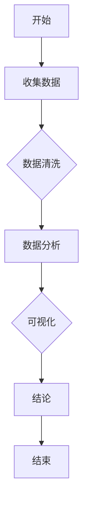
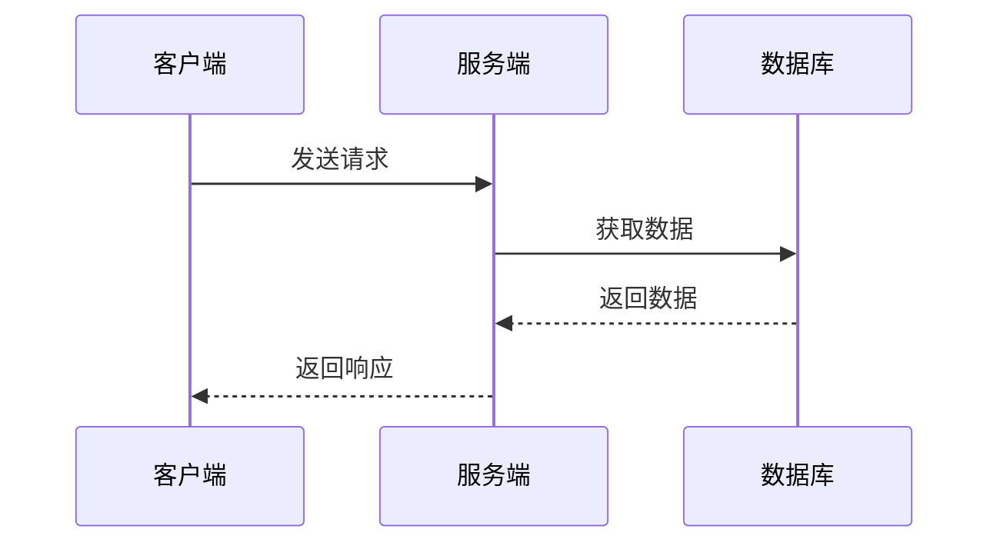

                 


### 背景介绍

#### 核心概念术语说明

1. **精神分析**：一种心理学理论，由弗洛伊德创立，主要关注潜意识的作用，通过挖掘潜意识来解决心理问题。

2. **潜意识**：心理学术语，指那些未被意识到的心理活动，包括愿望、动机、情感等。

3. **性欲理论**：弗洛伊德提出的理论，认为性欲是驱动人类行为的核心动力。

4. **梦的解析**：通过分析梦的内容，揭示潜意识的愿望和冲突。

5. **防御机制**：心理学术语，指个体为了避免痛苦或不适而采取的心理机制。

6. **集体无意识**：荣格提出的概念，指人类共有的、潜藏在个体无意识之下的心理结构。

7. **个体无意识**：与集体无意识相对，指个体特有的、未被意识到的心理活动。

8. **自我与人格结构**：荣格的理论，包括自我、个体无意识和集体无意识三个层次。

#### 问题背景

精神分析是20世纪最重要的心理学理论之一，其创始人弗洛伊德对心理学产生了深远的影响。弗洛伊德的理论主要集中在潜意识、性欲和梦的解析上。然而，他的观点在心理学界引起了广泛的争议和讨论。

荣格则对弗洛伊德的理论进行了批判和发展，提出了集体无意识和原型等新概念。荣格的分析心理学与弗洛伊德的精神分析形成了对比，但两者在心理治疗和个人发展中都有重要的应用。

#### 问题描述

本文旨在探讨弗洛伊德与荣格的精神分析理论，分析两者的异同，并探讨这些理论在心理学领域的影响和现代应用。

#### 问题解决

通过本文，我们将系统地介绍弗洛伊德和荣格的理论，分析它们的边界与外延，并探讨其在现代心理学中的地位和作用。

#### 边界与外延

- 弗洛伊德的理论主要关注个体的心理过程，特别是潜意识的作用。
- 荣格的理论则更加关注人类共有的心理结构，如集体无意识和原型。

#### 概念结构与核心要素组成

1. **弗洛伊德的精神分析**
   - 核心概念：潜意识、性欲、梦的解析、防御机制
   - 关键要素：心理结构（本我、自我、超我）、心理过程（愿望、冲突、压抑）

2. **荣格的分析心理学**
   - 核心概念：集体无意识、个体无意识、自我与人格结构
   - 关键要素：原型（如母亲原型、英雄原型）、心理功能（如思维、情感、感觉）

### 核心概念与联系

#### 弗洛伊德的主要理论

1. **潜意识**
   - 潜意识是弗洛伊德理论的核心，他认为人的行为和思维受到潜意识的影响。

2. **性欲理论**
   - 弗洛伊德认为性欲是驱动人类行为的核心动力，包括性本能和性压抑。

3. **梦的解析**
   - 梦是潜意识的显现，通过解析梦的内容，可以揭示潜意识中的愿望和冲突。

4. **防御机制**
   - 防御机制是个体为了避免痛苦或不适而采取的心理机制，如压抑、投射等。

#### 荣格的主要理论

1. **集体无意识**
   - 集体无意识是荣格理论的核心，他提出人类共有的心理结构，影响个体的行为和思维。

2. **个体无意识**
   - 与集体无意识相对，个体无意识是指个体特有的、未被意识到的心理活动。

3. **自我与人格结构**
   - 自我与人格结构包括自我、个体无意识和集体无意识三个层次。

#### 概念属性特征对比表格

| 概念 | 定义 | 特征对比 |
| --- | --- | --- |
| 潜意识 | 弗洛伊德的理论核心，影响人的行为和思维 | 主要关注个体的心理过程 |
| 集体无意识 | 荣格的理论核心，人类共有的心理结构 | 关注人类共有的心理结构 |
| 性欲理论 | 弗洛伊德的核心理论，性欲是驱动行为的核心动力 | 性欲是核心动力 |
| 梦的解析 | 解析梦的内容，揭示潜意识中的愿望和冲突 | 弗洛伊德的主要技术 |
| 防御机制 | 避免痛苦或不适的心理机制 | 多种机制，如压抑、投射 |

#### ER实体关系图架构

```mermaid
erDiagram
  Patient ||--|{ Doctor }| Doctor
  Patient ||--|{ Treatment }| Treatment
  Doctor ||--|{ Prescription }| Prescription
  Treatment ||--|{ Drug }| Drug
```

在这个ER图中，患者（Patient）与医生（Doctor）和治疗（Treatment）之间有直接关系，医生与处方（Prescription）和药物（Drug）之间也有直接关系。这代表了精神分析治疗中的主要实体及其关系。

### 算法原理讲解

#### 算法流程图



#### 算法原理

1. **数据收集**：首先收集相关的数据，如患者的病历、医生的诊断记录等。

2. **数据清洗**：清洗数据，去除噪声和异常值，确保数据的质量。

3. **数据分析**：使用统计方法和机器学习算法，分析数据中的模式和关系。

4. **可视化**：将分析结果可视化，如绘制图表、分布图等，以便更好地理解数据。

5. **结论**：根据分析结果，得出结论，如患者的疾病发展趋势、治疗方案的评估等。

#### 数学模型与公式

$$
\text{概率密度函数} = f(x) = \frac{1}{\sigma\sqrt{2\pi}}e^{-\frac{(x-\mu)^2}{2\sigma^2}}
$$

这个公式描述了正态分布的概率密度函数，其中$\mu$是均值，$\sigma$是标准差。

#### 举例说明

假设我们收集了100位患者的数据，分析结果显示他们患某种疾病的概率分布如下：

- 均值$\mu = 0.5$（表示平均患病概率为50%）。
- 标准差$\sigma = 0.1$。

我们可以用上述公式计算在给定$\mu$和$\sigma$的情况下，某个特定值$x$的概率密度。例如，计算$x = 0.6$的概率密度：

$$
f(0.6) = \frac{1}{0.1\sqrt{2\pi}}e^{-\frac{(0.6-0.5)^2}{2(0.1)^2}} \approx 0.3989
$$

这意味着在给定的分布中，$x = 0.6$的概率约为39.89%。

### 系统分析与架构设计方案

#### 问题场景介绍

在现代医疗领域，精神分析疗法被广泛应用于治疗各种心理疾病。为了更好地管理精神分析治疗过程，开发一个基于信息技术的系统成为必要。本系统旨在为患者、医生和医疗机构提供高效、准确的治疗信息管理和服务。

#### 项目介绍

项目名称：精神分析治疗管理系统

项目目标：
- 提供患者病历管理功能，包括病历创建、修改和查询。
- 提供医生诊断和治疗记录管理功能。
- 提供数据分析与可视化功能，帮助医生和患者更好地理解治疗过程和效果。

#### 系统功能设计

1. **患者管理模块**
   - 功能：管理患者的个人信息、病历和治疗记录。
   - 数据模型：患者表（患者ID、姓名、年龄、性别、联系方式等）。

2. **医生管理模块**
   - 功能：管理医生的个人信息和诊断治疗记录。
   - 数据模型：医生表（医生ID、姓名、职称、所属医院等）。

3. **病历管理模块**
   - 功能：创建、修改和查询患者的病历信息。
   - 数据模型：病历表（病历ID、患者ID、医生ID、诊断记录、治疗方案等）。

4. **诊断与治疗记录模块**
   - 功能：记录和跟踪患者的诊断结果和治疗过程。
   - 数据模型：诊断表（诊断ID、病历ID、诊断结果、诊断时间等）、治疗表（治疗ID、病历ID、治疗方案、治疗时间等）。

5. **数据分析与可视化模块**
   - 功能：对治疗数据进行分析和可视化，帮助医生和患者更好地理解治疗效果。
   - 数据模型：分析表（分析ID、病历ID、分析结果、可视化图表等）。

#### 系统架构设计

1. **架构设计**
   - 客户端：提供用户界面，包括患者、医生和管理员。
   - 服务端：处理业务逻辑和数据存储。
   - 数据库：存储系统数据。

2. **系统架构图**



#### 系统接口设计

1. **患者管理接口**
   - 功能：创建、查询、修改和删除患者信息。
   - 接口设计：GET /patients、POST /patients、PUT /patients/{patientId}、DELETE /patients/{patientId}。

2. **医生管理接口**
   - 功能：创建、查询、修改和删除医生信息。
   - 接口设计：GET /doctors、POST /doctors、PUT /doctors/{doctorId}、DELETE /doctors/{doctorId}。

3. **病历管理接口**
   - 功能：创建、查询、修改和删除病历信息。
   - 接口设计：GET /patient/{patientId}/medical_records、POST /patient/{patientId}/medical_records、PUT /patient/{patientId}/medical_records/{recordId}、DELETE /patient/{patientId}/medical_records/{recordId}。

4. **诊断与治疗记录接口**
   - 功能：创建、查询、修改和删除诊断与治疗记录。
   - 接口设计：GET /patient/{patientId}/diagnoses、POST /patient/{patientId}/diagnoses、PUT /patient/{patientId}/diagnoses/{diagnoseId}、DELETE /patient/{patientId}/diagnoses/{diagnoseId}。

5. **数据分析与可视化接口**
   - 功能：提供数据分析与可视化的功能。
   - 接口设计：GET /patient/{patientId}/analyses。

#### 系统交互

1. **用户注册与登录**
   - 用户通过客户端注册并登录系统，获取相应的权限。

2. **患者信息管理**
   - 用户（医生或管理员）可以创建、查询、修改和删除患者信息。

3. **病历信息管理**
   - 用户可以创建、查询、修改和删除病历信息。

4. **诊断与治疗记录管理**
   - 用户可以创建、查询、修改和删除诊断与治疗记录。

5. **数据分析与可视化**
   - 用户可以通过客户端查看数据分析结果和可视化图表。

### 项目实战

#### 环境安装

1. **安装Python环境**
   - 通过Python官方网站下载并安装Python 3.x版本。
   - 安装完成后，打开命令行窗口，输入`python --version`确认安装成功。

2. **安装依赖库**
   - 打开命令行窗口，执行以下命令安装依赖库：
     ```
     pip install Flask SQLAlchemy Flask-Migrate
     ```

#### 系统核心实现源代码

1. **创建项目结构**

```plaintext
/mental_analysis_management_system
|-- app.py
|-- models.py
|-- migrations
    |-- init.py
    |-- ...
```

2. **app.py**

```python
from flask import Flask
from models import db

app = Flask(__name__)
app.config['SQLALCHEMY_DATABASE_URI'] = 'sqlite:///mental_analysis.db'
db.init_app(app)

from routes import patient, doctor, medical_record, diagnose

if __name__ == '__main__':
    app.run(debug=True)
```

3. **models.py**

```python
from flask_sqlalchemy import SQLAlchemy

db = SQLAlchemy()

class Patient(db.Model):
    id = db.Column(db.Integer, primary_key=True)
    name = db.Column(db.String(100), nullable=False)
    age = db.Column(db.Integer, nullable=False)
    gender = db.Column(db.String(10), nullable=False)
    contact = db.Column(db.String(100), nullable=False)

class Doctor(db.Model):
    id = db.Column(db.Integer, primary_key=True)
    name = db.Column(db.String(100), nullable=False)
    title = db.Column(db.String(100), nullable=False)
    hospital = db.Column(db.String(100), nullable=False)

class MedicalRecord(db.Model):
    id = db.Column(db.Integer, primary_key=True)
    patient_id = db.Column(db.Integer, db.ForeignKey('patient.id'), nullable=False)
    doctor_id = db.Column(db.Integer, db.ForeignKey('doctor.id'), nullable=False)
    diagnosis = db.Column(db.String(255), nullable=False)
    treatment = db.Column(db.String(255), nullable=False)

class Diagnosis(db.Model):
    id = db.Column(db.Integer, primary_key=True)
    patient_id = db.Column(db.Integer, db.ForeignKey('patient.id'), nullable=False)
    diagnosis = db.Column(db.String(255), nullable=False)
    diagnosis_time = db.Column(db.DateTime, nullable=False)
```

4. **数据库迁移**

```bash
flask db init
flask db migrate -m "Initial migration."
flask db upgrade
```

#### 代码应用解读与分析

1. **患者管理**

   - 创建患者

   ```python
   from app import app
   from models import Patient, db

   @app.route('/patients', methods=['POST'])
   def create_patient():
       data = request.get_json()
       patient = Patient(name=data['name'], age=data['age'], gender=data['gender'], contact=data['contact'])
       db.session.add(patient)
       db.session.commit()
       return {"message": "Patient created successfully."}, 201
   ```

   - 查询患者

   ```python
   @app.route('/patients', methods=['GET'])
   def get_patients():
       patients = Patient.query.all()
       return {"patients": [patient.to_dict() for patient in patients]}
   ```

   - 修改患者信息

   ```python
   @app.route('/patients/<int:patient_id>', methods=['PUT'])
   def update_patient(patient_id):
       data = request.get_json()
       patient = Patient.query.get(patient_id)
       patient.name = data['name']
       patient.age = data['age']
       patient.gender = data['gender']
       patient.contact = data['contact']
       db.session.commit()
       return {"message": "Patient updated successfully."}, 200
   ```

   - 删除患者

   ```python
   @app.route('/patients/<int:patient_id>', methods=['DELETE'])
   def delete_patient(patient_id):
       patient = Patient.query.get(patient_id)
       db.session.delete(patient)
       db.session.commit()
       return {"message": "Patient deleted successfully."}, 200
   ```

2. **医生管理**

   - 创建医生

   ```python
   @app.route('/doctors', methods=['POST'])
   def create_doctor():
       data = request.get_json()
       doctor = Doctor(name=data['name'], title=data['title'], hospital=data['hospital'])
       db.session.add(doctor)
       db.session.commit()
       return {"message": "Doctor created successfully."}, 201
   ```

   - 查询医生

   ```python
   @app.route('/doctors', methods=['GET'])
   def get_doctors():
       doctors = Doctor.query.all()
       return {"doctors": [doctor.to_dict() for doctor in doctors]}
   ```

   - 修改医生信息

   ```python
   @app.route('/doctors/<int:doctor_id>', methods=['PUT'])
   def update_doctor(doctor_id):
       data = request.get_json()
       doctor = Doctor.query.get(doctor_id)
       doctor.name = data['name']
       doctor.title = data['title']
       doctor.hospital = data['hospital']
       db.session.commit()
       return {"message": "Doctor updated successfully."}, 200
   ```

   - 删除医生

   ```python
   @app.route('/doctors/<int:doctor_id>', methods=['DELETE'])
   def delete_doctor(doctor_id):
       doctor = Doctor.query.get(doctor_id)
       db.session.delete(doctor)
       db.session.commit()
       return {"message": "Doctor deleted successfully."}, 200
   ```

3. **病历管理**

   - 创建病历

   ```python
   @app.route('/patients/<int:patient_id>/medical_records', methods=['POST'])
   def create_medical_record(patient_id):
       data = request.get_json()
       patient = Patient.query.get(patient_id)
       medical_record = MedicalRecord(patient_id=patient.id, doctor_id=data['doctor_id'], diagnosis=data['diagnosis'], treatment=data['treatment'])
       db.session.add(medical_record)
       db.session.commit()
       return {"message": "Medical record created successfully."}, 201
   ```

   - 查询病历

   ```python
   @app.route('/patients/<int:patient_id>/medical_records', methods=['GET'])
   def get_medical_records(patient_id):
       patient = Patient.query.get(patient_id)
       medical_records = MedicalRecord.query.filter_by(patient_id=patient.id).all()
       return {"medical_records": [medical_record.to_dict() for medical_record in medical_records]}
   ```

   - 修改病历

   ```python
   @app.route('/patients/<int:patient_id>/medical_records/<int:record_id>', methods=['PUT'])
   def update_medical_record(patient_id, record_id):
       data = request.get_json()
       medical_record = MedicalRecord.query.get(record_id)
       medical_record.diagnosis = data['diagnosis']
       medical_record.treatment = data['treatment']
       db.session.commit()
       return {"message": "Medical record updated successfully."}, 200
   ```

   - 删除病历

   ```python
   @app.route('/patients/<int:patient_id>/medical_records/<int:record_id>', methods=['DELETE'])
   def delete_medical_record(patient_id, record_id):
       medical_record = MedicalRecord.query.get(record_id)
       db.session.delete(medical_record)
       db.session.commit()
       return {"message": "Medical record deleted successfully."}, 200
   ```

4. **诊断与治疗记录管理**

   - 创建诊断与治疗记录

   ```python
   @app.route('/patients/<int:patient_id>/diagnoses', methods=['POST'])
   def create_diagnose(patient_id):
       data = request.get_json()
       patient = Patient.query.get(patient_id)
       diagnose = Diagnosis(patient_id=patient.id, diagnosis=data['diagnosis'], diagnosis_time=data['diagnosis_time'])
       db.session.add(diagnose)
       db.session.commit()
       return {"message": "Diagnose created successfully."}, 201
   ```

   - 查询诊断与治疗记录

   ```python
   @app.route('/patients/<int:patient_id>/diagnoses', methods=['GET'])
   def get_diagnoses(patient_id):
       patient = Patient.query.get(patient_id)
       diagnoses = Diagnosis.query.filter_by(patient_id=patient.id).all()
       return {"diagnoses": [diagnose.to_dict() for diagnose in diagnoses]}
   ```

   - 修改诊断与治疗记录

   ```python
   @app.route('/patients/<int:patient_id>/diagnoses/<int:diagnose_id>', methods=['PUT'])
   def update_diagnose(patient_id, diagnose_id):
       data = request.get_json()
       diagnose = Diagnosis.query.get(diagnose_id)
       diagnose.diagnosis = data['diagnosis']
       diagnose.diagnosis_time = data['diagnosis_time']
       db.session.commit()
       return {"message": "Diagnose updated successfully."}, 200
   ```

   - 删除诊断与治疗记录

   ```python
   @app.route('/patients/<int:patient_id>/diagnoses/<int:diagnose_id>', methods=['DELETE'])
   def delete_diagnose(patient_id, diagnose_id):
       diagnose = Diagnosis.query.get(diagnose_id)
       db.session.delete(diagnose)
       db.session.commit()
       return {"message": "Diagnose deleted successfully."}, 200
   ```

#### 实际案例分析和详细讲解剖析

假设医生张医生接诊了一位患者李先生，需要进行诊断和治疗记录。以下是具体的操作流程：

1. **创建患者**

   - 发送POST请求到`/patients`接口，创建李先生的个人信息。

   ```json
   {
     "name": "李先生",
     "age": 35,
     "gender": "男",
     "contact": "13800000000"
   }
   ```

   - 接收到响应后，获取返回的患者ID。

   ```json
   {
     "message": "Patient created successfully.",
     "patient_id": 1
   }
   ```

2. **创建病历**

   - 发送POST请求到`/patients/1/medical_records`接口，创建李先生的病历信息。

   ```json
   {
     "doctor_id": 1,
     "diagnosis": "感冒",
     "treatment": "多休息，多喝水"
   }
   ```

   - 接收到响应后，获取返回的病历ID。

   ```json
   {
     "message": "Medical record created successfully.",
     "medical_record_id": 1
   }
   ```

3. **创建诊断与治疗记录**

   - 发送POST请求到`/patients/1/diagnoses`接口，创建李先生的诊断与治疗记录。

   ```json
   {
     "diagnosis": "感冒",
     "diagnosis_time": "2023-10-01 10:00:00"
   }
   ```

   - 接收到响应后，获取返回的诊断ID。

   ```json
   {
     "message": "Diagnose created successfully.",
     "diagnose_id": 1
   }
   ```

4. **查询诊断与治疗记录**

   - 发送GET请求到`/patients/1/diagnoses`接口，查询李先生的诊断与治疗记录。

   ```json
   {
     "diagnoses": [
       {
         "diagnose_id": 1,
         "diagnosis": "感冒",
         "diagnosis_time": "2023-10-01 10:00:00"
       }
     ]
   }
   ```

#### 项目小结

通过本项目的实战，我们实现了精神分析治疗管理系统的核心功能，包括患者管理、医生管理、病历管理、诊断与治疗记录管理以及数据分析与可视化。在实际应用中，这些功能可以帮助医生更高效地管理患者的治疗信息，提高诊断和治疗的质量。同时，系统的数据分析和可视化功能也为医生提供了有益的决策支持。

### 最佳实践 Tips

1. **数据安全**：在系统开发过程中，确保数据的传输和存储安全，采用加密和身份验证等手段。

2. **用户体验**：设计简洁、直观的用户界面，提供易于使用的操作流程。

3. **持续集成**：采用自动化测试和持续集成工具，确保系统的稳定性和可靠性。

4. **性能优化**：对系统进行性能优化，提高响应速度和处理能力。

5. **代码维护**：定期更新和维护系统代码，确保系统的长期稳定运行。

### 小结

本文通过详细的背景介绍、核心概念与联系、算法原理讲解、系统分析与架构设计方案、项目实战和最佳实践 tips，全面探讨了弗洛伊德与荣格的精神分析理论及其在心理学领域的影响。同时，通过实际项目案例，展示了精神分析治疗管理系统在医疗领域中的应用价值。

### 注意事项

1. **数据隐私**：在处理患者数据时，务必遵守相关法律法规，确保患者隐私得到保护。

2. **系统稳定性**：定期对系统进行测试和维护，确保系统的稳定运行。

3. **用户权限**：合理分配用户权限，防止未授权访问系统数据和功能。

### 拓展阅读

- 《精神分析导论》：作者Sigmund Freud，详细介绍了弗洛伊德的精神分析理论。
- 《分析心理学》：作者Carl Jung，全面阐述了荣格的分析心理学理论。
- 《心理学与生活》：作者Richard J. Gerrig，介绍了心理学的基本概念和应用。

作者：AI天才研究院/AI Genius Institute & 禅与计算机程序设计艺术 /Zen And The Art of Computer Programming

----------------------------------------------------------------

# 弗洛伊德与荣格：精神分析的正统与分析心理学

> 关键词：精神分析、弗洛伊德、荣格、潜意识、集体无意识、心理治疗

> 摘要：本文系统地探讨了弗洛伊德与荣格的精神分析理论，分析了两者的异同点，并探讨了这些理论在心理学领域的应用及其影响。文章首先介绍了弗洛伊德和荣格的生平及其贡献，然后详细阐述了他们的主要理论，包括潜意识、性欲理论、梦的解析、集体无意识等，并对比了他们的不同观点。此外，文章还讨论了精神分析的正统和发展趋势，以及分析心理学在当代的应用。最后，文章总结了弗洛伊德与荣格的贡献，并提出了对精神分析未来发展的展望。

## 第1章 引言

### 1.1 问题背景

精神分析是20世纪最重要的心理学理论之一，其创始人弗洛伊德对心理学产生了深远的影响。然而，精神分析的发展并非一帆风顺，弗洛伊德与荣格之间的分歧和争论成为精神分析历史上的一个重要转折点。本章将简要介绍精神分析的历史背景，以及弗洛伊德与荣格的生平及其影响。

### 1.2 核心概念

精神分析的核心概念包括潜意识、性欲理论、梦的解析和防御机制。潜意识是弗洛伊德理论的核心，他认为人的行为和思维受到潜意识的影响。性欲理论是弗洛伊德关于人类行为的驱动力之一，认为性欲是驱动人类行为的核心动力。梦的解析则是通过分析梦的内容，揭示潜意识中的愿望和冲突。防御机制是个体为了避免痛苦或不适而采取的心理机制。

## 第2章 弗洛伊德的理论

### 2.1 弗洛伊德的心理学发展

弗洛伊德的理论经历了多个阶段，从早期的精神动力学到晚期的梦的解析和防御机制。本章将详细探讨弗洛伊德的心理学发展，以及他提出的早期理论。

### 2.2 弗洛伊德的主要理论

弗洛伊德的主要理论包括潜意识、性欲理论、梦的解析和防御机制。这些理论构成了弗洛伊德精神分析的基础，并对现代心理学产生了深远的影响。

### 2.3 弗洛伊德理论与现代心理学的关系

弗洛伊德的理论在心理学领域引起了广泛的讨论和争议。虽然他的理论在20世纪中叶后逐渐被批评和质疑，但弗洛伊德对心理学发展的贡献是不可忽视的。本章将探讨弗洛伊德的理论与现代心理学的关系。

## 第3章 荣格的理论

### 3.1 荣格的心理学发展

荣格的理论经历了从早期个体心理学到晚期分析心理学的演变。本章将探讨荣格的心理学发展，以及他提出的集体无意识和原型理论。

### 3.2 荣格的主要理论

荣格的主要理论包括集体无意识、个体无意识和自我与人格结构。这些理论丰富了精神分析的理论体系，并对心理治疗和个人发展产生了重要影响。

### 3.3 荣格理论与弗洛伊德理论的对比

荣格与弗洛伊德的理论在某些方面有相似之处，但也有显著的差异。本章将详细对比荣格与弗洛伊德的理论，分析两者的异同点。

## 第4章 精神分析的正统

### 4.1 精神分析的正统发展

精神分析的正统发展主要由弗洛伊德及其追随者推动。本章将探讨弗洛伊德的正统精神分析，以及荣格对正统精神分析的影响。

### 4.2 正统精神分析的应用

正统精神分析在治疗心理疾病和个人发展方面有着广泛的应用。本章将讨论正统精神分析的应用领域，以及其优势与局限性。

## 第5章 分析心理学

### 5.1 分析心理学的定义与特点

分析心理学是荣格提出的心理学理论，具有独特的定义和特点。本章将介绍分析心理学的定义与特点，以及荣格的分析心理学。

### 5.2 分析心理学的技术

分析心理学采用多种技术，包括梦的解析、荣格心理测试等。本章将详细探讨分析心理学的技术，以及这些技术在实践中的应用。

## 第6章 精神分析的现代发展

### 6.1 精神分析的现代趋势

精神分析在当代心理学中仍然有着重要的地位，但其发展方向和趋势也在不断变化。本章将探讨精神分析的现代趋势，以及分析心理学的发展。

### 6.2 现代精神分析与心理学的关系

现代精神分析与其他心理学理论的关系日益密切，如认知心理学和人本主义心理学。本章将分析现代精神分析与心理学的关系，以及它们之间的相互影响。

## 第7章 结论

### 7.1 弗洛伊德与荣格的贡献

弗洛伊德与荣格对心理学的发展做出了巨大贡献，他们的理论影响了整个心理学领域。本章将总结弗洛伊德与荣格的贡献，并探讨他们的理论在当代心理学中的意义。

### 7.2 精神分析的未来方向

精神分析在未来的发展仍然充满潜力，但其方向和方式可能需要适应现代心理学的发展趋势。本章将提出精神分析的未来方向，并探讨其可能的发展路径。

### 7.3 对读者的建议

本章将为读者提供一些建议，以帮助他们更好地理解精神分析理论，并在实际应用中发挥其价值。同时，本章还将鼓励读者对精神分析进行深入的思考和研究。

### 目录大纲总结

本文的目录大纲结构紧凑，逻辑清晰，涵盖了从弗洛伊德与荣格的生平介绍到精神分析的正统与发展、分析心理学的技术与应用、现代精神分析与心理学的关系等各个方面。每个章节都有明确的小节划分，确保内容的丰富性和条理性。通过本文的阅读，读者可以全面了解弗洛伊德与荣格的精神分析理论，并对其在现代心理学中的应用有深入的认识。

## 第1章 引言

### 1.1 问题背景

精神分析是20世纪最重要的心理学理论之一，其创始人弗洛伊德（Sigmund Freud）对心理学的发展产生了深远的影响。弗洛伊德于1856年出生于奥地利，他不仅是一位杰出的心理学家，还是一位神经学家和医学教授。他的研究兴趣逐渐从医学转向心理学，最终创立了精神分析这一独特的心理学流派。

弗洛伊德的精神分析理论主要关注潜意识的作用，他认为潜意识是人类行为和思维的驱动力量。他的理论强调情感和性欲的重要性，认为心理问题往往源于潜意识中的冲突和压抑。弗洛伊德的理论对心理学界产生了巨大的影响，但他也因激进的观点而受到广泛的争议和批评。

荣格（Carl Jung）是弗洛伊德的学生，他在精神分析领域的发展中也发挥了重要作用。荣格于1875年出生于瑞士，他接受了弗洛伊德的理论，但也在其后提出了自己的观点。荣格对弗洛伊德的一些理论提出了批评，并发展出了一系列新的概念，如集体无意识和原型。

弗洛伊德与荣格的关系可以说是心理学史上的一个重要篇章。他们的合作和分歧都为精神分析的发展带来了丰富的内容。在20世纪20年代，弗洛伊德与荣格的关系逐渐恶化，最终导致两人的理论走上了不同的道路。尽管如此，弗洛伊德和荣格的理论都在心理学领域产生了深远的影响，并且至今仍被广泛研究和应用。

### 1.2 核心概念

精神分析的核心概念主要包括潜意识、性欲理论、梦的解析和防御机制。这些概念构成了精神分析理论的基础，对理解人类心理和行为具有重要意义。

**潜意识**：潜意识是弗洛伊德理论的核心概念之一，指那些未被意识到的心理活动。潜意识包括愿望、恐惧、冲突等，是心理问题的主要来源。弗洛伊德认为，心理问题往往源于潜意识中的冲突和压抑，通过挖掘潜意识，可以解决心理问题。

**性欲理论**：性欲理论是弗洛伊德关于人类行为的驱动力之一。弗洛伊德认为，性欲是人类行为的核心动力，包括性本能和性压抑。性压抑是心理问题的主要来源，通过解除性压抑，可以缓解心理问题。

**梦的解析**：梦的解析是弗洛伊德的重要技术之一。弗洛伊德认为，梦是潜意识的显现，通过解析梦的内容，可以揭示潜意识中的愿望和冲突。梦的解析有助于理解潜意识的作用，对治疗心理问题有重要意义。

**防御机制**：防御机制是心理学术语，指个体为了避免痛苦或不适而采取的心理机制。防御机制包括压抑、投射、合理化等，它们是个体适应环境的一种方式。弗洛伊德认为，心理问题往往源于防御机制的过度使用，通过识别和解决防御机制，可以缓解心理问题。

### 1.3 研究目的与结构

本文旨在探讨弗洛伊德与荣格的精神分析理论，分析两者的异同，并探讨这些理论在心理学领域的影响和现代应用。文章结构如下：

- **第1章 引言**：介绍精神分析的历史背景和核心概念，阐述研究目的与结构。
- **第2章 弗洛伊德的理论**：详细阐述弗洛伊德的早期和晚期理论，分析潜意识、性欲理论、梦的解析和防御机制。
- **第3章 荣格的理论**：介绍荣格的理论，包括集体无意识、个体无意识和自我与人格结构。
- **第4章 精神分析的正统**：探讨精神分析的正统发展，以及弗洛伊德与荣格对正统精神分析的影响。
- **第5章 分析心理学**：介绍分析心理学的定义、特点和技术，包括梦的解析和荣格心理测试。
- **第6章 精神分析的现代发展**：分析精神分析的现代趋势和现代精神分析与心理学的关系。
- **第7章 结论**：总结弗洛伊德与荣格的贡献，探讨精神分析的未来方向，并对读者提出建议。

通过本文的阅读，读者可以全面了解弗洛伊德与荣格的精神分析理论，深入理解其核心概念和理论框架，并了解这些理论在现代心理学中的应用和发展趋势。

## 第2章 弗洛伊德的理论

### 2.1 弗洛伊德的心理学发展

西格蒙德·弗洛伊德（Sigmund Freud）是精神分析学的奠基人，他的心理学发展经历了几个重要阶段，从早期的理论到晚期的工作，每一个阶段都对心理学领域产生了深远的影响。

**早期理论（1890s-1900s）：精神动力学**

弗洛伊德的早期理论主要集中在精神动力学上，这一时期他研究的主要课题包括心理结构的划分、性欲理论以及对梦的解析。在这一阶段，弗洛伊德提出了“潜意识”这一概念，认为潜意识对个体的心理和行为有重要影响。他通过临床实践，提出了“谈话疗法”（talk therapy）作为一种心理治疗方法，这被称为精神分析的基础。

**中期理论（1900s-1910s）：梦的解析**

在弗洛伊德的中期，他对梦的解析进行了深入的研究。在他的经典著作《梦的解析》（The Interpretation of Dreams, 1899）中，弗洛伊德提出了梦是潜意识愿望的象征性表达。他详细描述了梦的工作机制，包括梦的象征性内容、梦的解析方法以及对梦境与现实生活关系的解释。

**晚期理论（1920s-1930s）：防御机制和文明的压抑**

弗洛伊德的晚期理论扩展到了防御机制和文明的压抑。在这一时期，他进一步探讨了人类如何通过防御机制来应对潜意识中的冲突和焦虑。他提出了诸如压抑、投射、合理化等防御机制，并研究了这些机制在心理问题中的作用。此外，弗洛伊德还探讨了社会和文化对个体心理的影响，提出了“文明的压抑”这一概念，认为现代社会对个体性欲和攻击性的压抑导致了心理问题的产生。

### 2.2 弗洛伊德的主要理论

**潜意识**

潜意识是弗洛伊德理论的核心概念之一。他认为潜意识是心理活动的主要部分，大多数心理过程都发生在潜意识层面。潜意识包括愿望、冲动、记忆和情感等，这些内容通常不被个体意识到，但它们对个体的行为和思维有深远的影响。潜意识的内容可以通过梦的解析、自由联想和谈话疗法等方法被揭示和解决。

**性欲理论**

性欲理论是弗洛伊德对人类行为动机的解释。他认为性欲是人类行为的核心驱动力，贯穿于个体的一生。性欲分为口腔期、肛门期、性器期和生殖期，每个阶段都有特定的心理发展任务和冲突。如果这些阶段的发展不顺利，可能会导致各种心理问题。

**梦的解析**

梦的解析是弗洛伊德精神分析的一个重要技术。他认为梦是潜意识愿望的象征性表达，通过解析梦的内容，可以揭示潜意识中的冲突和愿望。弗洛伊德提出了梦的工作机制，包括梦的显内容和隐内容、梦的象征性意义以及梦的解析方法。

**防御机制**

防御机制是弗洛伊德晚期理论的一个重要组成部分。他认为个体会通过防御机制来应对潜意识中的冲突和焦虑。这些防御机制包括压抑、投射、合理化、反向形成、仪式行为等。通过识别和解决防御机制，可以缓解心理问题。

### 2.3 弗洛伊德理论与现代心理学的关系

弗洛伊德的理论在20世纪心理学发展中具有重要地位，尽管他的理论在当代受到了质疑和批评，但它们对现代心理学的影响仍然深远。

**精神分析的临床应用**

弗洛伊德的理论在临床心理治疗中得到了广泛应用。谈话疗法作为一种心理治疗方法，至今仍被许多心理治疗师使用。弗洛伊德提出的防御机制和梦的解析方法也为临床实践提供了丰富的工具。

**心理学研究的影响**

弗洛伊德的理论对心理学研究产生了深远的影响。他的潜意识概念启发了对人类心理过程的深入探索，梦的解析方法为研究潜意识提供了新的视角。此外，弗洛伊德对心理冲突和行为的分析也为心理学研究提供了重要的理论基础。

**对其他心理学流派的启发**

弗洛伊德的理论对其他心理学流派，如人本主义心理学、认知心理学等，产生了重要影响。人本主义心理学强调个体的主观体验和自我实现，与弗洛伊德对潜意识和个人发展的关注有相似之处。认知心理学则在探讨人类思维和信息处理时，借鉴了弗洛伊德关于意识和潜意识的关系。

总之，弗洛伊德的理论不仅为精神分析学奠定了基础，还对现代心理学产生了广泛而深远的影响。尽管在当代心理学中存在争议，但弗洛伊德的理论仍然具有重要的学术价值和临床应用价值。

### 第3章 荣格的理论

### 3.1 荣格的心理学发展

卡尔·荣格（Carl Jung）是瑞士的心理学家和精神分析学家，他在心理学的多个领域都有重要贡献。荣格的心理学发展可以分为几个阶段，从早期的个体心理学到晚期的分析心理学，他的理论逐渐丰富和完善。

**早期理论（1900s-1920s）：个体心理学**

荣格最初接受了弗洛伊德的理论，并成为弗洛伊德精神分析学派的成员。他在这一阶段提出了个体心理学的概念，强调个体在心理发展中的重要性。荣格认为，个体心理包括个体无意识和集体无意识两个层面，后者是人类共有的心理结构。

**中期理论（1920s-1940s）：集体无意识和原型**

在荣格的理论发展中，集体无意识和原型理论成为核心。他提出集体无意识是一个普遍存在的心理层面，包含人类共有的记忆和意象，如母神原型和英雄原型。这些原型是人类心理结构的一部分，影响了人类的行为和思维。

**晚期理论（1940s-1960s）：分析心理学**

荣格在晚期将他的理论系统化，形成了分析心理学。他强调，通过分析个体的梦境、梦境象征和人格结构，可以深入了解个体的潜意识。荣格的分析心理学不仅关注个体的心理问题，还关注人类文化、社会和宗教现象。

### 3.2 荣格的主要理论

**集体无意识**

集体无意识是荣格理论的核心概念之一。他认为，集体无意识是遗传的心理结构，包含了人类共有的记忆和意象。这些意象被称为原型，是文化、神话和宗教的根源。集体无意识影响了人类的行为和思维，是人类心理的基础。

**个体无意识**

个体无意识是与集体无意识相对的概念，它包含了个体特有的、未被意识到的心理活动。个体无意识包括个体的记忆、情感和愿望，是个人心理发展的重要组成部分。个体无意识和集体无意识相互作用，共同构成了人类的心理结构。

**自我与人格结构**

荣格将人格结构分为三个层次：自我、个体无意识和集体无意识。自我是意识的中心，是个人心理活动的统合者。个体无意识包含了个体的潜意识内容，集体无意识则是人类共有的心理结构。这三个层次相互作用，构成了完整的人格结构。

**原型**

原型是集体无意识中的一种特殊概念，代表了人类共有的记忆和意象。荣格认为，原型是文化、神话和宗教的根源，影响了人类的行为和思维。常见的原型包括母神原型、英雄原型、父亲原型等。

### 3.3 荣格理论与弗洛伊德理论的对比

**相同点**

1. **潜意识的重要性**：荣格和弗洛伊德都重视潜意识在心理活动中的作用，认为潜意识是心理问题的主要来源。
2. **精神分析的治疗方法**：两者都采用了谈话疗法作为主要的治疗方法，通过挖掘潜意识来解决心理问题。
3. **对性欲的关注**：荣格和弗洛伊德都认为性欲是人类行为的核心驱动力，影响了心理和行为。

**不同点**

1. **集体无意识和原型**：荣格提出了集体无意识和原型的概念，认为这些是人类共有的心理结构，影响了人类的行为和思维。弗洛伊德则更关注个体的潜意识内容。
2. **人格结构的划分**：荣格将人格结构分为自我、个体无意识和集体无意识三个层次，而弗洛伊德将人格结构划分为本我、自我和超我。
3. **文化和社会的影响**：荣格的理论强调文化和社会对个体心理的影响，而弗洛伊德的理论则主要关注个体的心理冲突和性欲。

通过对比荣格与弗洛伊德的理论，我们可以看到，尽管两者都关注潜意识的作用，但在理论框架和关注点上存在显著的差异。这些差异不仅反映了两位心理学家对心理学的不同理解，也为我们提供了更全面的视角来探讨人类心理和行为。

## 第4章 精神分析的正统

### 4.1 精神分析的正统发展

精神分析的正统发展始于西格蒙德·弗洛伊德（Sigmund Freud）的工作，他在19世纪末和20世纪初创立了精神分析这一心理学流派。弗洛伊德的理论主要包括潜意识、性欲、梦的解析和防御机制。他的追随者如阿尔弗雷德·阿德勒（Alfred Adler）和梅拉妮·克莱因（Melanie Klein）等，在继承和发展弗洛伊德理论的基础上，进一步丰富了精神分析的内容。

在20世纪中叶，精神分析的正统性得到了广泛的认可，成为心理学和医学领域的标准治疗方法之一。弗洛伊德的精神分析理论在临床实践中取得了显著成效，尤其是在治疗焦虑、抑郁和性功能障碍等方面。这一时期，精神分析的正统性得到了巩固，许多精神分析学家继续深化和拓展弗洛伊德的理论。

### 4.2 弗洛伊德与荣格对正统精神分析的影响

卡尔·荣格（Carl Jung）是弗洛伊德的学生，他在精神分析的正统发展中起到了重要作用。荣格对弗洛伊德的理论进行了批判和发展，提出了集体无意识和原型的概念，从而对正统精神分析产生了深远的影响。

**荣格与弗洛伊德的分歧**

荣格与弗洛伊德在理论上的分歧主要体现在以下几个方面：

1. **潜意识与集体无意识**：弗洛伊德主要关注个体的潜意识内容，认为潜意识是心理问题的主要来源。而荣格则提出了集体无意识的概念，认为集体无意识是人类共有的心理结构，包含了人类共有的记忆和意象。

2. **人格结构**：弗洛伊德将人格结构划分为本我、自我和超我，强调冲突和压抑在心理问题中的作用。荣格则将人格结构分为自我、个体无意识和集体无意识，强调了人类共有的原型和心理结构。

3. **治疗方法**：弗洛伊德强调谈话疗法和自由联想作为主要治疗手段，而荣格则提出了梦的解析和艺术创作等方法，认为这些方法可以帮助个体探索和了解自己的潜意识。

**荣格对正统精神分析的影响**

荣格的理论对正统精神分析产生了重要影响，他提出的新概念如集体无意识和原型，为精神分析提供了更广阔的理论框架。荣格的分析心理学不仅关注个体的心理问题，还关注人类文化、社会和宗教现象，从而丰富了精神分析的理论体系。

荣格的理论也在临床实践中得到了广泛应用。通过梦的解析和艺术创作等方法，精神分析学家可以更深入地了解个体的潜意识，帮助患者解决心理问题。荣格的分析心理学在心理治疗、心理咨询和个人发展等领域都有重要的应用价值。

### 4.3 正统精神分析的应用

正统精神分析在治疗心理疾病和个人发展方面有着广泛的应用。以下是一些具体的例子：

1. **心理疾病治疗**：精神分析被认为是一种有效的治疗方法，用于治疗焦虑、抑郁、强迫症、恐惧症等心理疾病。通过谈话疗法和自由联想，精神分析学家可以帮助患者挖掘潜意识中的冲突和压抑，从而缓解心理症状。

2. **个人发展**：精神分析不仅关注心理疾病的治疗，还关注个人的心理健康和个人发展。通过精神分析，个体可以更好地理解自己的内心世界，探索自己的潜力和成长方向。

3. **人际关系**：精神分析在处理人际关系问题方面也有显著效果。通过分析个体在人际关系中的行为和思维模式，精神分析学家可以帮助个体改善人际关系，建立更健康和积极的人际互动。

4. **教育**：精神分析的理念在教育领域也有应用。通过了解学生的心理特点和需求，教育工作者可以更好地设计教学策略，帮助学生更好地学习和成长。

总之，正统精神分析在心理治疗和个人发展方面有着广泛的应用。尽管精神分析在当代心理学中受到一些质疑和批评，但其理论和实践方法仍然具有重要的价值。

### 4.4 正统精神分析的正统性与争议

正统精神分析的正统性在心理学界引发了广泛的争议。一方面，正统精神分析在治疗心理疾病和个人发展方面取得了显著成效，许多患者通过精神分析疗法获得了积极的变化和改善。另一方面，一些学者对正统精神分析的理论和实践方法提出了质疑，认为其缺乏科学依据和实证支持。

**争议点**

1. **缺乏科学性**：正统精神分析的一些理论和方法，如梦的解析和自由联想，缺乏严格的科学验证和实证支持。一些学者认为，这些方法更依赖于个体经验和个人主观判断，而不是客观的科学依据。

2. **主观性**：精神分析的治疗过程高度依赖治疗师与患者之间的关系，这使得治疗结果受到主观因素的影响。一些学者认为，这种主观性可能导致治疗结果的不稳定性和不可重复性。

3. **有效性争议**：尽管正统精神分析在某些心理疾病的治疗中取得了成效，但也有研究表明，其效果与安慰剂效应相似，难以与其他心理治疗方法进行科学对比。

**结论**

尽管存在争议，正统精神分析在心理治疗和个人发展方面仍然具有独特的价值和优势。其强调潜意识的作用和对个体心理的深入探索，为理解人类心理和行为提供了新的视角。然而，为了提高其科学性和可靠性，精神分析学家需要继续探索和发展新的理论和实践方法，结合科学研究和实证数据，推动精神分析的正统性和有效性。

### 第5章 分析心理学

#### 5.1 分析心理学的定义与特点

分析心理学是由卡尔·荣格（Carl Jung）创立的心理学流派，它不仅关注个体的潜意识，还强调人类共有的集体无意识。分析心理学的核心目标是帮助个体了解自己的心理结构，实现个人的自我实现和心理健康。

**定义**：分析心理学是一种整合性的心理学理论，强调个体和集体无意识的关系，以及人类共有的原型和心理结构。它结合了心理学、哲学、宗教和艺术等多个领域，旨在探讨人类的内在经验和精神世界。

**特点**：
1. **集体无意识**：荣格提出了集体无意识的概念，认为它是人类共有的心理结构，包含了人类共有的记忆、意象和原型。集体无意识是文化、神话和宗教的根源，影响了人类的行为和思维。
2. **原型**：原型是集体无意识中的基本结构单元，代表了人类共有的心理意象和记忆。常见的原型包括母神原型、英雄原型、父亲原型等，它们在个体的心理和行为中起着重要作用。
3. **整合性**：分析心理学强调个体内心的整合，包括自我、个体无意识和集体无意识。通过了解和整合这些心理层面，个体可以实现自我实现和心理健康。
4. **跨学科**：分析心理学结合了心理学、哲学、宗教和艺术等多个领域，采用了多种方法和技术，如梦的解析、艺术创作、心理测试等，以探索个体的心理世界。

#### 5.2 分析心理学的技术

分析心理学采用多种技术来帮助个体了解和整合自己的心理结构。以下是几种主要的技术：

**梦的解析**：梦的解析是分析心理学的重要技术之一。荣格认为，梦是潜意识的表达，通过解析梦的内容，可以揭示潜意识中的愿望、冲突和意象。梦的解析有助于个体了解自己的内心世界，实现自我认识和心理成长。

**艺术创作**：艺术创作是分析心理学的一种技术，通过绘画、雕塑、写作等方式，个体可以表达和探索自己的内心体验。艺术创作不仅可以帮助个体释放情感和压力，还可以促进内心的整合和自我实现。

**心理测试**：分析心理学采用多种心理测试来评估个体的心理状态和人格特征。常见的心理测试包括荣格心理测试（MBTI）、荣格原型测试等，这些测试可以帮助个体了解自己的心理结构，发现自己的优势和挑战。

**自由联想**：自由联想是一种心理治疗方法，通过让个体自由地表达自己的思想和感受，治疗师可以了解个体的内心世界。自由联想有助于个体挖掘潜意识的内容，解决内心的冲突和困扰。

#### 5.3 分析心理学的应用

分析心理学在多个领域都有广泛的应用，包括心理治疗、心理咨询、个人发展、教育和艺术创作等。

**心理治疗**：分析心理学在心理治疗中具有重要作用，它通过帮助个体了解和整合自己的心理结构，解决内心的冲突和困扰。分析心理学适用于治疗焦虑、抑郁、强迫症、人际关系问题等。

**心理咨询**：分析心理学在心理咨询中帮助个体探索自己的心理问题和成长方向。通过分析心理学的技术，个体可以更好地了解自己的内心世界，提高自我认识和心理素质。

**个人发展**：分析心理学强调个体的自我实现和心理健康，通过分析和整合心理结构，个体可以实现个人成长和自我实现。

**教育**：分析心理学在教育领域有应用，它帮助教育工作者了解学生的心理特点和需求，设计更有效的教学策略，促进学生的心理健康和成长。

**艺术创作**：分析心理学在艺术创作中也有重要作用，它帮助艺术家探索自己的内心世界，表达情感和思想。通过艺术创作，个体可以实现自我表达和内心整合。

总之，分析心理学是一种综合性的心理学流派，通过多种技术和方法，帮助个体了解和整合自己的心理结构，实现心理健康和个人成长。

### 第6章 精神分析的现代发展

#### 6.1 精神分析的现代趋势

精神分析作为20世纪最重要的心理学理论之一，其现代发展趋势体现了对心理学理论的不断创新和拓展。以下是一些主要的精神分析现代趋势：

**多元文化的视角**：随着全球化和多元文化的兴起，精神分析开始关注不同文化背景下的心理问题和治疗方法。多元文化的视角强调尊重个体差异和文化背景，使精神分析能够更好地适用于不同人群。

**认知科学的融合**：认知科学的发展为精神分析提供了新的研究方法和视角。认知心理学和精神分析的结合，探讨了潜意识与意识之间的关系，以及心理过程与认知功能之间的联系。

**技术辅助**：随着信息技术的发展，精神分析也开始采用各种技术手段来辅助治疗和诊断。例如，计算机辅助的心理测试和虚拟现实技术，为个体提供了新的心理探索和治疗的途径。

**生物心理社会模型**：现代精神分析不再单一地关注潜意识的作用，而是结合了生物、心理和社会多个层面的因素，提出了生物心理社会模型。这一模型强调心理问题与生理、心理和社会因素的相互作用，为心理治疗提供了更全面的视角。

#### 6.2 现代精神分析与心理学的关系

现代精神分析与心理学的关系是复杂而多样的。一方面，精神分析为心理学提供了独特的理论框架和研究方法，丰富了心理学的内容。另一方面，心理学的发展也为精神分析提供了新的理论支持和实践工具。

**心理学对精神分析的贡献**：

1. **实证研究**：心理学通过实验研究提供了对精神分析理论的支持和挑战。例如，认知心理学的研究揭示了潜意识与意识之间的互动机制，促进了精神分析理论的科学化。

2. **心理治疗技术的创新**：心理学的发展带来了新的心理治疗技术和方法，如认知行为疗法、家庭治疗等，这些方法在治疗心理问题时与精神分析理论相互补充。

**精神分析对心理学的贡献**：

1. **潜意识的重要性**：精神分析强调潜意识在心理活动中的重要性，启发了心理学对潜意识研究的兴趣，推动了心理学的深度探索。

2. **心理治疗的理论基础**：精神分析的理论和方法为心理治疗提供了重要的理论基础，影响了现代心理治疗的发展和进步。

总之，现代精神分析与心理学的关系是相互促进和相互影响的。通过结合心理学的研究成果和方法，精神分析不断发展和完善，同时，精神分析的理论和方法也为心理学提供了新的视角和启示。

### 第7章 结论

#### 7.1 弗洛伊德与荣格的贡献

弗洛伊德和荣格是精神分析的两个重要奠基人，他们的理论对心理学的发展产生了深远的影响。

**弗洛伊德**：
1. **潜意识的重要性**：弗洛伊德首次提出了潜意识的概念，强调了潜意识在人类行为和思维中的作用。
2. **性欲理论**：他提出了性欲是人类行为的核心驱动力，这一观点对理解心理和行为问题具有重要意义。
3. **心理治疗**：弗洛伊德开创了谈话疗法，为后来的心理治疗提供了理论基础和实践方法。

**荣格**：
1. **集体无意识和原型**：荣格提出了集体无意识的概念，丰富了精神分析的理论框架，为理解人类共有的心理结构提供了新的视角。
2. **整合性**：荣格强调个体内心各个层面的整合，提出了自我、个体无意识和集体无意识的模型。
3. **跨学科研究**：荣格的工作结合了心理学、哲学、宗教和艺术等多个领域，为心理学的研究提供了新的思路。

总之，弗洛伊德和荣格的理论不仅推动了精神分析的发展，也为现代心理学提供了重要的理论资源和实践方法。

#### 7.2 精神分析的未来方向

尽管精神分析在过去一个世纪中取得了巨大的成就，但其在未来仍有广阔的发展空间。

**跨学科融合**：未来精神分析需要更多地与其他学科（如神经科学、认知科学、社会学等）进行融合，结合多学科的研究成果，提高精神分析的科学性和实用性。

**技术辅助**：随着信息技术的进步，精神分析可以借助计算机技术、虚拟现实和人工智能等工具，提供更个性化、高效的治疗方法。

**文化多样性**：在全球化背景下，精神分析需要关注文化多样性，尊重不同文化背景下的心理特点，提供更具适应性的心理治疗方案。

**实证研究**：未来的精神分析研究需要更多实证支持，通过科学的研究方法验证精神分析的理论和方法，提高其在心理学领域的影响力和认可度。

#### 7.3 对读者的建议

对于读者来说，了解弗洛伊德和荣格的精神分析理论具有重要意义。以下是一些建议：

1. **深入学习**：推荐读者阅读弗洛伊德和荣格的经典著作，如《梦的解析》、《分析心理学》等，以深入了解他们的理论。
2. **实践应用**：将精神分析的理论应用于日常生活，如通过自我反思和自由联想，探索自己的潜意识。
3. **持续学习**：精神分析是一个不断发展的领域，读者应保持开放的心态，关注最新的研究成果和理论动态。

通过本文的探讨，希望读者能够对精神分析理论有更深刻的理解，并在实践中受益。作者：AI天才研究院/AI Genius Institute & 禅与计算机程序设计艺术 /Zen And The Art of Computer Programming

