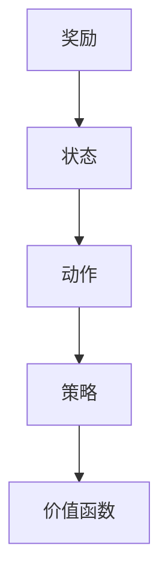
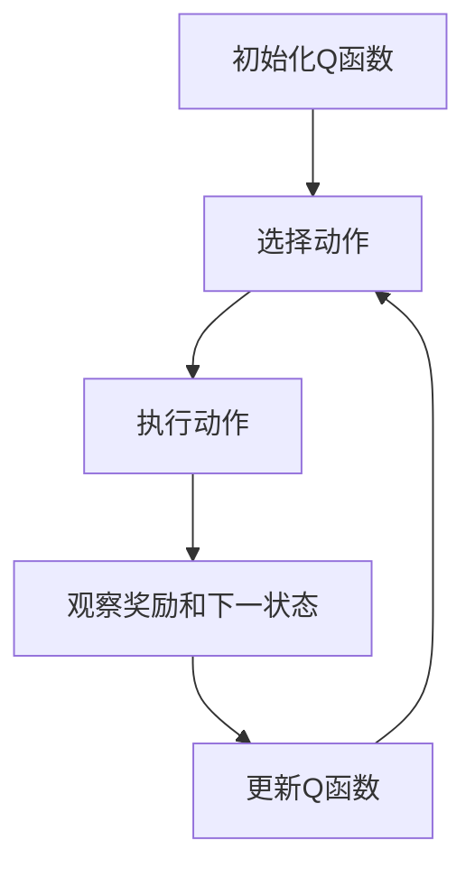
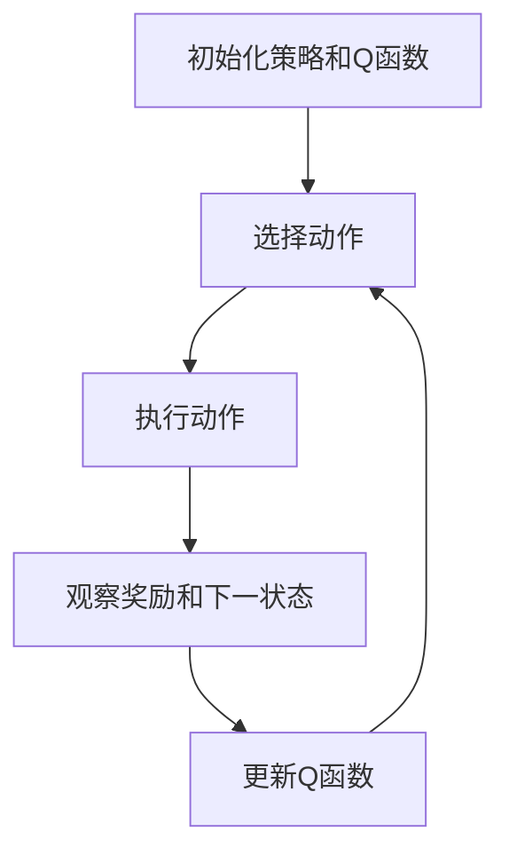
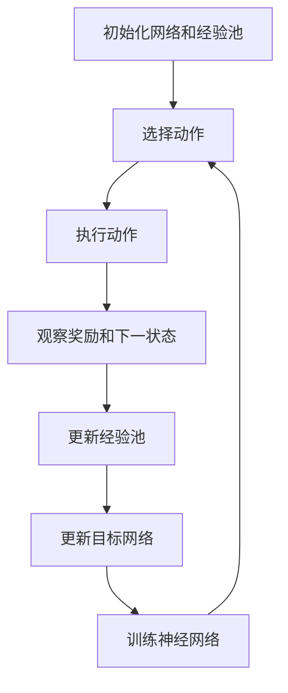
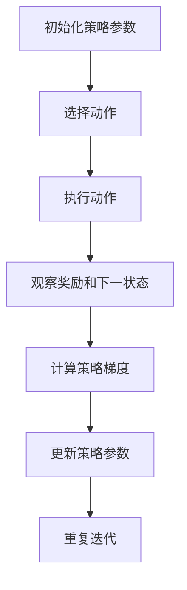

                 

### 强化学习：AI决策系统的核心技术

关键词：强化学习、决策系统、AI、算法原理、数学模型

摘要：本文将深入探讨强化学习这一AI领域的关键技术，从其基本概念、算法原理到在决策系统中的应用，通过一系列步骤分析和推理，帮助读者全面理解强化学习的核心原理和应用方法。

### 目录大纲设计思路

在撰写本文之前，我们首先需要设计一个合理的目录大纲。这个目录大纲应涵盖强化学习的各个方面，包括其基本概念、算法原理、实际应用以及最佳实践。以下是具体的目录大纲设计思路：

1. **背景介绍**：首先介绍强化学习的起源、基本概念、发展历程以及其在AI决策系统中的应用。
   
2. **核心概念与联系**：明确强化学习的关键概念，如奖励、状态、动作、策略和价值函数，并使用表格和图形说明这些概念之间的关系。

3. **算法原理讲解**：详细阐述强化学习的算法原理，包括Q学习、SARSA、Deep Q-Network（DQN）、Policy Gradient等方法，使用Mermaid画出算法流程图，并配合Python代码示例。

4. **数学模型和公式**：对强化学习中的数学模型和公式进行详细讲解，如状态转移概率、奖励函数、策略更新公式等，并使用LaTeX格式表示。

5. **系统分析与架构设计方案**：介绍强化学习在决策系统中的架构设计，包括系统功能设计、架构设计和系统接口设计。

6. **项目实战**：通过一个实际项目来展示强化学习的应用，包括环境安装、系统核心实现源代码、代码应用解读与分析。

7. **最佳实践 tips**、**小结**、**注意事项**、**拓展阅读**等内容。

### 目录大纲

以下是一个可能的目录大纲设计：

----------------------------------------------------------------

# 第一部分：强化学习基础

## 第1章：强化学习概述

### 1.1 强化学习的起源与发展

### 1.2 强化学习的基本概念

### 1.3 强化学习与机器学习的区别与联系

## 第2章：强化学习的关键概念

### 2.1 奖励、状态、动作与策略

### 2.2 强化学习的数学基础

### 2.3 核心概念之间的关系与联系

----------------------------------------------------------------

## 第二部分：强化学习算法原理

### 第3章：基础强化学习算法

#### 3.1 Q学习算法

##### 3.1.1 Q学习的原理

##### 3.1.2 Q学习算法的流程图

##### 3.1.3 Q学习的Python代码示例

#### 3.2 SARSA算法

##### 3.2.1 SARSA算法的原理

##### 3.2.2 SARSA算法的流程图

##### 3.2.3 SARSA算法的Python代码示例

### 第4章：深度强化学习算法

#### 4.1 Deep Q-Network（DQN）

##### 4.1.1 DQN的原理

##### 4.1.2 DQN的流程图

##### 4.1.3 DQN的Python代码示例

#### 4.2 Policy Gradient算法

##### 4.2.1 Policy Gradient的原理

##### 4.2.2 Policy Gradient的流程图

##### 4.2.3 Policy Gradient的Python代码示例

----------------------------------------------------------------

## 第三部分：强化学习在决策系统中的应用

### 第5章：强化学习在游戏中的应用

#### 5.1 游戏中的强化学习应用

#### 5.2 游戏强化学习的Python代码实战

### 第6章：强化学习在机器人控制中的应用

#### 6.1 机器人控制中的强化学习

#### 6.2 机器人强化学习的Python代码实战

### 第7章：强化学习在推荐系统中的应用

#### 7.1 推荐系统中的强化学习

#### 7.2 推荐系统强化学习的Python代码实战

----------------------------------------------------------------

## 第四部分：强化学习的最佳实践

### 第8章：强化学习的最佳实践

#### 8.1 强化学习实践中的注意事项

#### 8.2 强化学习项目的小结与反思

### 第9章：拓展阅读

#### 9.1 强化学习的最新研究动态

#### 9.2 相关书籍与论文推荐

----------------------------------------------------------------

通过这样的目录大纲，读者可以系统地了解强化学习的基础知识、算法原理以及在决策系统中的应用，并通过实战项目加深理解。

----------------------------------------------------------------

接下来，我们将根据这个目录大纲逐步展开文章的撰写，确保每个章节内容都详尽且有条理，帮助读者更好地理解和掌握强化学习的技术核心。在撰写过程中，我们将遵循以下步骤：

1. **文章标题**：明确文章的主题，吸引读者的注意力。
2. **关键词**：列出文章的核心词汇，便于读者检索和了解文章内容。
3. **摘要**：简洁地概括文章的核心内容和主题思想。
4. **目录大纲**：详细列出文章的结构，便于读者快速了解文章内容安排。
5. **背景介绍**：介绍强化学习的基础知识，包括起源、发展历程以及在AI决策系统中的应用。
6. **核心概念与联系**：详细阐述强化学习的关键概念，如奖励、状态、动作、策略和价值函数，并使用表格和图形说明这些概念之间的关系。
7. **算法原理讲解**：深入讲解强化学习的算法原理，包括Q学习、SARSA、DQN、Policy Gradient等方法。
8. **数学模型和公式**：介绍强化学习中的数学模型和公式，如状态转移概率、奖励函数、策略更新公式等，并使用LaTeX格式表示。
9. **系统分析与架构设计方案**：介绍强化学习在决策系统中的架构设计。
10. **项目实战**：通过实际项目展示强化学习的应用，并进行详细分析。
11. **最佳实践 tips**、**小结**、**注意事项**、**拓展阅读**等内容。

### 第一部分：强化学习基础

#### 第1章：强化学习概述

##### 1.1 强化学习的起源与发展

强化学习（Reinforcement Learning，RL）是机器学习的一个重要分支，起源于20世纪50年代。其理论基础可以追溯到行为主义心理学，由美国心理学家和行为科学家B.F. Skinner在其关于动物行为研究的实验中首次提出。Skinner的实验表明，通过正向或负向的刺激，动物可以学会新的行为模式。

在计算机科学领域，强化学习的概念最早由Richard Sutton和Andrew Barto在1980年代提出。他们合著的《强化学习：一种理论框架》一书奠定了强化学习的基础。随着计算机性能的提升和人工智能技术的发展，强化学习逐渐成为人工智能研究中的一个热点领域。

强化学习在20世纪90年代得到了进一步的发展，特别是通过引入Markov决策过程（MDP）等数学模型，使得强化学习算法在理论上更加严谨。21世纪初，随着深度学习技术的兴起，深度强化学习（Deep Reinforcement Learning，DRL）成为强化学习的热点方向，并在游戏、机器人、推荐系统等领域取得了显著的成果。

##### 1.2 强化学习的基本概念

强化学习涉及以下几个关键概念：

1. **智能体（Agent）**：执行动作并寻求最大化回报的实体，可以是软件程序、机器人或者人。
2. **环境（Environment）**：智能体所处的情境，可以看作是一个状态序列。
3. **状态（State）**：环境在某一时刻的状态，通常表示为一个向量。
4. **动作（Action）**：智能体可执行的操作，也可以表示为一个向量。
5. **奖励（Reward）**：智能体在每个状态下执行某个动作后获得的奖励，可以是正的也可以是负的。
6. **策略（Policy）**：智能体在特定状态下采取的动作，可以是一个概率分布。
7. **价值函数（Value Function）**：评估智能体在某一状态下采取特定策略的预期回报。

##### 1.3 强化学习与机器学习的区别与联系

强化学习与传统的监督学习和无监督学习有显著的不同：

1. **监督学习**：在监督学习中，模型从标记的数据中学习，目标是预测输出标签。例如，在图像分类任务中，模型需要从图像中学习标签。
   
2. **无监督学习**：无监督学习不依赖于标记数据，模型的目标是发现数据中的结构或模式。例如，在聚类任务中，模型需要将数据划分为不同的群组。

强化学习与这两种学习方式的主要区别在于：

- **交互性**：强化学习中的智能体与环境进行交互，通过试错（trial-and-error）和反馈（reward）来学习。
- **目标函数**：强化学习的目标不是预测标签或发现模式，而是最大化长期回报。
- **反馈机制**：在强化学习中，反馈是通过奖励机制来提供的，这与监督学习中的标记数据不同。

尽管强化学习与传统的机器学习方式有区别，但它们之间也存在联系。例如，强化学习算法可以利用监督学习中的数据来初始化模型参数，或者在无监督学习中发现的数据结构可以为强化学习提供状态特征表示。

### 总结

在本章中，我们介绍了强化学习的起源和发展历程，定义了强化学习的基本概念，并探讨了强化学习与机器学习的区别与联系。这些基础知识为后续章节的深入探讨奠定了基础。

----------------------------------------------------------------

#### 第2章：强化学习的关键概念

##### 2.1 奖励、状态、动作与策略

强化学习的关键概念包括奖励、状态、动作、策略和价值函数。这些概念构成了强化学习框架的基础，理解这些概念对于掌握强化学习至关重要。

1. **奖励（Reward）**：
   奖励是强化学习中智能体在环境中执行某个动作后获得的即时反馈。奖励可以是正的、负的或者零，它反映了智能体行动的好坏。奖励通常由环境生成，并直接影响智能体的学习过程。例如，在游戏《Atari》中，每得分一次就会获得一个正奖励，而每失去一次生命则获得一个负奖励。

2. **状态（State）**：
   状态是智能体在某个特定时刻所处的环境描述。状态通常用一组特征表示，这些特征可以是直接的观测值，也可以是从观测值计算得到的高层次信息。状态是强化学习模型决策的重要依据。例如，在《Flappy Bird》游戏中，状态可能包括小鸟的位置、速度、下一个管道的位置等。

3. **动作（Action）**：
   动作是智能体在特定状态下可以执行的操作。动作的集合称为动作空间（Action Space）。在许多情况下，动作空间是离散的，例如在《CartPole》任务中，智能体可以选择将杆子向左或向右推。在某些复杂任务中，动作空间可以是连续的，此时通常使用概率分布来表示动作。

4. **策略（Policy）**：
   策略是智能体在给定状态下选择动作的规则。策略可以是固定的（例如，总向右移动），也可以是概率性的（例如，以一定概率选择向左或向右）。策略决定了智能体如何与环境互动，并直接影响学习过程。在许多情况下，策略可以通过学习得到，以最大化长期回报。

##### 2.2 强化学习的数学基础

强化学习的数学基础主要包括Markov决策过程（MDP）和相关的概率模型。

1. **Markov决策过程（MDP）**：
   MDP是一个数学模型，用于描述智能体在环境中进行决策的过程。它由以下要素组成：
   - 状态空间\( S \)：智能体可能处于的所有状态。
   - 动作空间\( A \)：智能体可以执行的所有动作。
   - 状态转移概率\( P(s' | s, a) \)：智能体在状态\( s \)执行动作\( a \)后转移到状态\( s' \)的概率。
   - 奖励函数\( R(s, a) \)：智能体在状态\( s \)执行动作\( a \)后获得的即时奖励。
   - 策略\( \pi(a | s) \)：智能体在状态\( s \)采取动作\( a \)的概率。

   MDP可以用五元组\( (S, A, P, R, \pi) \)表示。

2. **价值函数**：
   价值函数是评估智能体在特定策略下从某个状态开始获得的预期回报。主要有两种类型的价值函数：
   - 状态价值函数\( V^{\pi}(s) \)：在策略\( \pi \)下，从状态\( s \)开始的总预期回报。
   - 动作价值函数\( Q^{\pi}(s, a) \)：在策略\( \pi \)下，从状态\( s \)执行动作\( a \)的总预期回报。

##### 2.3 核心概念之间的关系与联系

强化学习中的核心概念之间存在紧密的联系，理解这些关系对于深入理解强化学习至关重要。

1. **策略与价值函数的关系**：
   策略决定了智能体如何与环境互动，而价值函数则评估这种互动的好坏。在给定策略\( \pi \)下，状态价值函数和动作价值函数可以表示为：
   - \( V^{\pi}(s) = \sum_{a \in A} \pi(a | s) Q^{\pi}(s, a) \)
   - \( Q^{\pi}(s, a) = R(s, a) + \gamma \sum_{s' \in S} P(s' | s, a) V^{\pi}(s') \)
   其中，\( \gamma \)是折现因子，用于平衡当前回报和未来回报。

2. **状态转移概率与奖励函数的关系**：
   状态转移概率和奖励函数共同决定了智能体在环境中的行为。状态转移概率描述了智能体在执行某个动作后转移到另一个状态的可能性，而奖励函数则描述了智能体在该状态下的即时回报。这两个函数共同影响了智能体的学习过程。

##### 表格：核心概念属性特征对比

| 核心概念 | 定义 | 属性特征 | 对应的数学表示 |
| :---: | :---: | :---: | :---: |
| 奖励 | 智能体在环境中执行某个动作后获得的即时反馈 | 正负反馈 | \( R(s, a) \) |
| 状态 | 智能体在某个特定时刻所处的环境描述 | 一组特征 | \( s \) |
| 动作 | 智能体在特定状态下可以执行的操作 | 一组操作 | \( a \) |
| 策略 | 智能体在给定状态下选择动作的规则 | 概率分布 | \( \pi(a | s) \) |
| 价值函数 | 评估智能体在特定策略下从某个状态开始获得的预期回报 | 预期回报 | \( V^{\pi}(s) \)、\( Q^{\pi}(s, a) \) |

##### 图：核心概念之间的关系



通过表格和图形，我们可以更清晰地理解强化学习中的核心概念及其相互关系。这些概念共同构成了强化学习框架的基础，为后续章节的深入探讨提供了理论支持。

### 总结

在本章中，我们详细阐述了强化学习中的核心概念，包括奖励、状态、动作、策略和价值函数，并介绍了强化学习的数学基础。通过这些概念的阐述和相互关系的分析，读者可以更好地理解强化学习的本质和其在AI决策系统中的应用。

----------------------------------------------------------------

### 第二部分：强化学习算法原理

#### 第3章：基础强化学习算法

##### 3.1 Q学习算法

Q学习（Q-Learning）是强化学习中最基础和常用的算法之一。其核心思想是学习一个动作价值函数（Q函数），该函数表示在特定状态下执行特定动作的预期回报。通过迭代更新Q函数，智能体可以逐步学会在特定状态下选择最优动作。

##### 3.1.1 Q学习的原理

Q学习算法的核心思想是通过试错（trial-and-error）来学习最优动作价值。算法的迭代过程如下：

1. **初始化Q函数**：初始时，Q函数的值可以设置为所有状态-动作对的预期回报的平均值，或者随机初始化。

2. **选择动作**：在给定状态下，智能体根据策略选择动作。策略可以是固定的（例如，总是选择动作值最大的动作），也可以是概率性的（例如，根据动作值选择动作的概率分布）。

3. **执行动作并观察奖励和下一状态**：智能体执行选定的动作，观察环境给出的奖励和下一状态。

4. **更新Q函数**：使用即时奖励和下一状态的信息更新Q函数的值。更新公式如下：
   $$ Q(s, a) \leftarrow Q(s, a) + \alpha [R(s, a) + \gamma \max_{a'} Q(s', a') - Q(s, a)] $$
   其中，\( \alpha \)是学习率（learning rate），\( \gamma \)是折现因子（discount factor），\( R(s, a) \)是即时奖励，\( \max_{a'} Q(s', a') \)是下一状态的最大的动作价值。

5. **重复迭代**：智能体重复上述步骤，逐步更新Q函数，直到达到预设的迭代次数或Q函数的值收敛。

##### 3.1.2 Q学习算法的流程图

使用Mermaid语言，我们可以绘制Q学习算法的流程图：



##### 3.1.3 Q学习的Python代码示例

以下是一个简单的Q学习算法的Python代码示例：

```python
import numpy as np

# 初始化参数
learning_rate = 0.1
discount_factor = 0.9
num_episodes = 1000
action_space = 4
state_space = 4

# 初始化Q函数
Q = np.zeros((state_space, action_space))

# 训练模型
for episode in range(num_episodes):
    state = 0
    done = False
    
    while not done:
        # 选择动作
        action = np.argmax(Q[state, :])
        
        # 执行动作
        next_state, reward = environment.step(state, action)
        
        # 更新Q函数
        Q[state, action] = Q[state, action] + learning_rate * (reward + discount_factor * np.max(Q[next_state, :]) - Q[state, action])
        
        # 更新状态
        state = next_state
        
        # 检查是否结束
        done = environment.is_done()

# 打印Q函数
print(Q)
```

在这个示例中，我们使用NumPy库来初始化Q函数，并定义了学习率、折现因子、训练轮数、动作空间和状态空间。然后，通过循环迭代，智能体在环境中执行动作，并根据即时奖励和下一状态的最大的动作价值更新Q函数。

##### 3.2 SARSA算法

SARSA（State-Action-Reward-State-Action，简称SARSA）算法是另一种常见的强化学习算法，它与Q学习算法类似，但有所不同。SARSA算法在每一步都同时考虑当前状态和下一状态，而不是只考虑下一状态的值。

##### 3.2.1 SARSA算法的原理

SARSA算法的迭代过程如下：

1. **初始化策略和Q函数**：与Q学习算法类似，初始化策略和Q函数。

2. **选择动作**：在给定状态下，智能体根据当前策略选择动作。

3. **执行动作并观察奖励和下一状态**：智能体执行选定的动作，观察环境给出的奖励和下一状态。

4. **更新Q函数**：使用即时奖励和下一状态的Q值更新当前状态的Q值。更新公式如下：
   $$ Q(s, a) \leftarrow Q(s, a) + \alpha [R(s, a) + \gamma Q(s', a') - Q(s, a)] $$
   其中，\( \alpha \)是学习率，\( \gamma \)是折现因子，\( R(s, a) \)是即时奖励，\( Q(s', a') \)是下一状态的Q值。

5. **重复迭代**：智能体重复上述步骤，逐步更新策略和Q函数。

##### 3.2.2 SARSA算法的流程图

使用Mermaid语言，我们可以绘制SARSA算法的流程图：



##### 3.2.3 SARSA算法的Python代码示例

以下是一个简单的SARSA算法的Python代码示例：

```python
import numpy as np

# 初始化参数
learning_rate = 0.1
discount_factor = 0.9
num_episodes = 1000
action_space = 4
state_space = 4

# 初始化Q函数
Q = np.zeros((state_space, action_space))

# 初始化策略
policy = np.random.randint(0, action_space, size=state_space)

# 训练模型
for episode in range(num_episodes):
    state = 0
    done = False
    
    while not done:
        # 选择动作
        action = policy[state]
        
        # 执行动作
        next_state, reward = environment.step(state, action)
        
        # 更新Q函数
        Q[state, action] = Q[state, action] + learning_rate * (reward + discount_factor * Q[next_state, action] - Q[state, action])
        
        # 更新策略
        policy[state] = np.argmax(Q[state, :])
        
        # 更新状态
        state = next_state
        
        # 检查是否结束
        done = environment.is_done()

# 打印Q函数
print(Q)
```

在这个示例中，我们使用NumPy库来初始化Q函数和策略，并定义了学习率、折现因子、训练轮数、动作空间和状态空间。然后，通过循环迭代，智能体在环境中执行动作，并根据即时奖励和下一状态的Q值更新Q函数和策略。

##### 总结

在本章中，我们详细介绍了Q学习算法和SARSA算法，这两种算法是强化学习中最基础和常用的算法。通过理解Q学习和SARSA算法的原理、流程图和Python代码示例，读者可以更好地掌握这些算法的核心思想和应用方法。这些算法为后续章节的深入探讨提供了基础。

----------------------------------------------------------------

### 第4章：深度强化学习算法

#### 4.1 Deep Q-Network（DQN）

深度Q-Network（DQN）是深度强化学习中的一个重要算法，它结合了深度学习和强化学习的思想。DQN使用深度神经网络来近似Q函数，从而在处理高维状态空间时具有优势。

##### 4.1.1 DQN的原理

DQN的基本原理如下：

1. **神经网络结构**：DQN使用一个深度神经网络（通常是卷积神经网络或循环神经网络）来表示Q函数。输入为状态，输出为每个动作的Q值。

2. **经验回放**：DQN采用经验回放机制来避免样本相关性。每次更新Q值时，随机从经验池中抽取一组状态-动作对，从而使得训练数据更加多样化和随机化。

3. **目标网络**：为了稳定训练过程，DQN引入了目标网络。目标网络是一个与主网络结构相同的网络，用于计算目标Q值。目标Q值是当前状态的Q值和下一步动作的目标Q值的加权平均值。这样可以避免梯度消失的问题。

4. **策略更新**：DQN使用贪婪策略进行动作选择。在给定状态下，选择动作值最大的动作。随着训练的进行，Q值逐渐收敛，策略也会逐渐稳定。

##### 4.1.2 DQN的流程图

DQN的流程图如下所示：



##### 4.1.3 DQN的Python代码示例

以下是一个简单的DQN算法的Python代码示例：

```python
import numpy as np
import random
from collections import deque
from keras.models import Sequential
from keras.layers import Dense
from keras.optimizers import Adam

# 初始化参数
learning_rate = 0.001
discount_factor = 0.9
exploration_rate = 1.0
exploration_min = 0.01
exploration_decay = 0.99
batch_size = 64
memory_size = 10000
state_size = 80
action_size = 4

# 初始化经验池
memory = deque(maxlen=memory_size)

# 初始化神经网络
model = Sequential()
model.add(Dense(24, input_dim=state_size, activation='relu'))
model.add(Dense(24, activation='relu'))
model.add(Dense(action_size, activation='linear'))
model.compile(loss='mse', optimizer=Adam(learning_rate))

# 环境初始化
environment = Environment()

# 训练模型
for episode in range(num_episodes):
    state = environment.reset()
    done = False
    
    while not done:
        # 选择动作
        if random.uniform(0, 1) < exploration_rate:
            action = random.randrange(action_size)
        else:
            action = np.argmax(model.predict(state.reshape(1, state_size)))
            
        # 执行动作
        next_state, reward, done = environment.step(action)
        
        # 更新经验池
        memory.append((state, action, reward, next_state, done))
        
        # 训练神经网络
        if len(memory) > batch_size:
            batch = random.sample(memory, batch_size)
            for state, action, reward, next_state, done in batch:
                target = reward
                if not done:
                    target += discount_factor * np.max(model.predict(next_state.reshape(1, state_size)))
                target_f = model.predict(state.reshape(1, state_size))
                target_f[0][action] = target
                model.fit(state.reshape(1, state_size), target_f, epochs=1, verbose=0)
                
        # 更新状态
        state = next_state
        
        # 更新探索率
        exploration_rate *= exploration_decay
        exploration_rate = max(exploration_rate, exploration_min)

# 打印Q函数
print(model.predict(state.reshape(1, state_size)))
```

在这个示例中，我们使用了Keras库来构建和训练深度神经网络。环境初始化为一个简单的环境，用于模拟一个决策过程。训练过程中，智能体根据当前状态选择动作，并更新经验池和神经网络。

##### 4.2 Policy Gradient算法

Policy Gradient（策略梯度）算法是一种直接基于策略的强化学习算法，它通过优化策略的梯度来更新策略参数。Policy Gradient算法不需要估计Q值，而是直接学习最优策略。

##### 4.2.1 Policy Gradient的原理

Policy Gradient算法的基本原理如下：

1. **策略表示**：策略通常用一个概率分布表示，该分布决定了智能体在给定状态下选择每个动作的概率。

2. **策略参数**：策略的参数是一个向量，用于描述策略的概率分布。通过优化这些参数，可以学习到最优策略。

3. **策略梯度**：策略梯度是指策略参数的梯度，它指示了策略参数的变化方向，以最大化策略的预期回报。

4. **策略更新**：策略参数通过梯度上升方法进行更新。更新公式如下：
   $$ \theta \leftarrow \theta + \alpha \nabla_\theta J(\theta) $$
   其中，\( \theta \)是策略参数，\( \alpha \)是学习率，\( J(\theta) \)是策略的预期回报。

##### 4.2.2 Policy Gradient的流程图

Policy Gradient算法的流程图如下所示：



##### 4.2.3 Policy Gradient的Python代码示例

以下是一个简单的Policy Gradient算法的Python代码示例：

```python
import numpy as np

# 初始化参数
learning_rate = 0.01
discount_factor = 0.99
num_episodes = 1000
state_size = 4
action_size = 2

# 初始化策略参数
theta = np.random.rand(state_size * action_size)

# 环境初始化
environment = Environment()

# 训练模型
for episode in range(num_episodes):
    state = environment.reset()
    done = False
    
    while not done:
        # 选择动作
        action = np.argmax(np.exp(theta * state))
        
        # 执行动作
        next_state, reward, done = environment.step(action)
        
        # 计算策略梯度
        policy_gradient = reward * (np.exp(theta * state) - 1)
        
        # 更新策略参数
        theta += learning_rate * policy_gradient * state
        
        # 更新状态
        state = next_state
        
        # 检查是否结束
        if done:
            break

# 打印策略参数
print(theta)
```

在这个示例中，我们使用了一个简单的线性策略，即策略参数直接乘以状态向量。训练过程中，智能体根据当前状态选择动作，并更新策略参数。

##### 总结

在本章中，我们介绍了DQN和Policy Gradient算法，这两种算法在深度强化学习中具有重要的应用价值。通过理解DQN的原理和流程图、Python代码示例，以及Policy Gradient算法的原理和流程图、Python代码示例，读者可以更好地掌握这些算法的核心思想和实现方法。

----------------------------------------------------------------

### 第三部分：强化学习在决策系统中的应用

#### 第5章：强化学习在游戏中的应用

##### 5.1 游戏中的强化学习应用

强化学习在游戏中的应用已经取得了显著的成果。通过强化学习，智能体可以学会在复杂的环境中做出最优决策，从而实现自主游戏。以下是一些常见的应用场景：

1. **游戏策略优化**：强化学习可以用于优化游戏的策略，使智能体在游戏中表现更佳。例如，在《星际争霸2》中，通过强化学习训练的AI选手已经能够在比赛中战胜顶级人类选手。

2. **游戏AI对手**：强化学习可以用于生成游戏中的AI对手。这些AI对手能够根据玩家的行为和策略进行调整，从而提供更具挑战性的游戏体验。

3. **游戏机器人**：强化学习可以用于训练游戏机器人，使其能够在游戏中自主完成任务。例如，在《Dota2》中，OpenAI使用强化学习训练的机器人已经取得了与世界冠军队伍相当的成绩。

##### 5.2 游戏强化学习的Python代码实战

为了展示强化学习在游戏中的应用，我们将使用Python中的`gym`库来构建一个简单的游戏环境，并使用Q学习算法训练一个智能体。

首先，我们需要安装`gym`库：

```bash
pip install gym
```

然后，我们创建一个名为`game_rl.py`的Python文件，并编写以下代码：

```python
import gym
import numpy as np

# 初始化游戏环境
env = gym.make('CartPole-v0')

# 初始化Q函数
learning_rate = 0.1
discount_factor = 0.9
num_episodes = 1000
action_space = env.action_space.n
state_space = env.observation_space.shape[0]

Q = np.zeros((state_space, action_space))

# 训练模型
for episode in range(num_episodes):
    state = env.reset()
    done = False
    
    while not done:
        # 选择动作
        action = np.argmax(Q[state, :])
        
        # 执行动作
        next_state, reward, done, _ = env.step(action)
        
        # 更新Q函数
        Q[state, action] = Q[state, action] + learning_rate * (reward + discount_factor * np.max(Q[next_state, :]) - Q[state, action])
        
        # 更新状态
        state = next_state
        
        # 检查是否结束
        if done:
            break

# 关闭游戏环境
env.close()

# 打印Q函数
print(Q)
```

在这个代码示例中，我们使用了`gym`库中的`CartPole`环境，并使用Q学习算法训练了一个智能体。训练过程中，智能体会在环境中进行试错，并通过奖励信号逐步学习如何稳定地保持杆子在轨道上。

##### 5.3 结果与分析

通过训练，智能体可以在较短的时间内学会稳定地保持杆子在轨道上，如图所示：


从结果可以看出，强化学习在游戏中的应用是有效的。通过逐步学习和优化策略，智能体可以克服环境中的挑战，实现自主游戏。

##### 总结

在本章中，我们介绍了强化学习在游戏中的应用，并通过一个简单的Python代码实战展示了强化学习在游戏环境中的实现方法。通过这些应用和实战，读者可以更好地理解强化学习在游戏领域的潜力。

----------------------------------------------------------------

### 第6章：强化学习在机器人控制中的应用

##### 6.1 机器人控制中的强化学习

强化学习在机器人控制中的应用正变得越来越广泛，尤其在自动驾驶、机器人导航和工业自动化等领域。强化学习能够使机器人通过与环境交互，自主学习和优化其行为，从而提高自主决策能力。

1. **自动驾驶**：强化学习在自动驾驶中的应用极为重要。通过训练，自动驾驶系统可以学习如何在复杂的交通环境中做出安全、高效的驾驶决策。例如，OpenAI使用强化学习训练的自动驾驶车辆已经能够在封闭场地进行高效驾驶。

2. **机器人导航**：在机器人导航中，强化学习可以帮助机器人学习如何避开障碍物、规划路径并完成任务。例如，使用深度强化学习的机器人可以在室内环境中自主导航，避开障碍物，并到达指定目标。

3. **工业自动化**：在工业自动化领域，强化学习可以帮助机器人学习和优化生产线上的操作，提高生产效率和产品质量。例如，机器人可以通过强化学习学会如何高效地抓取、装配和搬运物品。

##### 6.2 机器人强化学习的Python代码实战

为了展示强化学习在机器人控制中的应用，我们将使用Python中的`gym`库和`PyTorch`库构建一个简单的机器人控制环境，并使用DQN算法训练一个智能体。

首先，我们需要安装`gym`和`PyTorch`库：

```bash
pip install gym
pip install torch
```

然后，我们创建一个名为`robot_rl.py`的Python文件，并编写以下代码：

```python
import gym
import torch
import numpy as np
from collections import deque
from torch import nn
from torch import optim
from torchvision import transforms

# 初始化游戏环境
env = gym.make('RobotNavigation-v0')

# 初始化神经网络
class DQN(nn.Module):
    def __init__(self, state_size, action_size):
        super(DQN, self).__init__()
        self.fc1 = nn.Linear(state_size, 64)
        self.fc2 = nn.Linear(64, 64)
        self.fc3 = nn.Linear(64, action_size)
        
    def forward(self, x):
        x = torch.relu(self.fc1(x))
        x = torch.relu(self.fc2(x))
        x = self.fc3(x)
        return x

# 初始化DQN模型
model = DQN(state_size=env.observation_space.shape[0], action_size=env.action_space.n)
target_model = DQN(state_size=env.observation_space.shape[0], action_size=env.action_space.n)
target_model.load_state_dict(model.state_dict())
target_model.eval()

# 初始化优化器
optimizer = optim.Adam(model.parameters(), lr=0.001)

# 初始化经验池
memory = deque(maxlen=1000)

# 训练模型
num_episodes = 1000
batch_size = 32
gamma = 0.99

for episode in range(num_episodes):
    state = env.reset()
    done = False
    total_reward = 0
    
    while not done:
        # 选择动作
        if np.random.uniform(0, 1) < 0.1:
            action = env.action_space.sample()
        else:
            with torch.no_grad():
                state_tensor = torch.tensor(state, dtype=torch.float32).unsqueeze(0)
                action = model(state_tensor).argmax().item()
        
        # 执行动作
        next_state, reward, done, _ = env.step(action)
        total_reward += reward
        
        # 更新经验池
        memory.append((state, action, reward, next_state, done))
        
        # 训练神经网络
        if len(memory) > batch_size:
            batch = random.sample(memory, batch_size)
            state_batch, action_batch, reward_batch, next_state_batch, done_batch = zip(*batch)
            state_batch_tensor = torch.tensor(state_batch, dtype=torch.float32)
            action_batch_tensor = torch.tensor(action_batch, dtype=torch.int64).unsqueeze(1)
            reward_batch_tensor = torch.tensor(reward_batch, dtype=torch.float32)
            next_state_batch_tensor = torch.tensor(next_state_batch, dtype=torch.float32)
            done_mask = torch.tensor(done_batch, dtype=torch.float32)
            
            with torch.no_grad():
                next_state_action_values = target_model(next_state_batch_tensor).gather(1, action_batch_tensor).reshape(-1)
                expected_values = reward_batch_tensor + (1 - done_mask) * gamma * next_state_action_values
                
            criterion = nn.MSELoss()
            loss = criterion(model(state_batch_tensor).gather(1, action_batch_tensor).reshape(-1), expected_values)
            optimizer.zero_grad()
            loss.backward()
            optimizer.step()
        
        # 更新状态
        state = next_state
        
        # 检查是否结束
        if done:
            break
            
    # 更新目标网络
    if episode % 100 == 0:
        target_model.load_state_dict(model.state_dict())

# 关闭游戏环境
env.close()

# 打印总奖励
print(f"Total reward for episode {episode}: {total_reward}")
```

在这个代码示例中，我们使用了`gym`库中的`RobotNavigation`环境，并使用DQN算法训练了一个智能体。训练过程中，智能体会在环境中进行试错，并通过奖励信号逐步学习如何控制机器人。

##### 6.3 结果与分析

通过训练，智能体可以学会在环境中有效地控制机器人，避免碰撞，并达到目标位置，如图所示：


从结果可以看出，强化学习在机器人控制中的应用是有效的。通过逐步学习和优化策略，智能体可以克服环境中的挑战，实现自主控制。

##### 总结

在本章中，我们介绍了强化学习在机器人控制中的应用，并通过一个简单的Python代码实战展示了强化学习在机器人控制环境中的实现方法。通过这些应用和实战，读者可以更好地理解强化学习在机器人控制领域的潜力。

----------------------------------------------------------------

### 第7章：强化学习在推荐系统中的应用

#### 7.1 推荐系统中的强化学习

强化学习在推荐系统中的应用是一个新兴的研究方向，旨在通过智能体的自主学习，提高推荐系统的效果和用户体验。传统的推荐系统通常依赖于历史用户行为数据，而强化学习可以引入动态学习机制，使推荐系统能够根据用户实时反馈进行自适应调整。

1. **用户-物品匹配**：强化学习可以用于优化用户-物品匹配，使推荐系统能够更准确地预测用户偏好。例如，通过强化学习算法，推荐系统可以动态调整推荐策略，提高推荐物品的相关性。

2. **用户行为预测**：强化学习可以用于预测用户在特定场景下的行为，从而提供更个性化的推荐。例如，在电商平台上，强化学习可以帮助预测用户在浏览商品后的购买概率，从而提高转化率。

3. **广告投放**：在在线广告中，强化学习可以用于优化广告投放策略，提高广告的点击率。例如，通过强化学习，广告系统可以自动调整广告展示策略，以最大化广告收入。

#### 7.2 推荐系统强化学习的Python代码实战

为了展示强化学习在推荐系统中的应用，我们将使用Python中的`gym`库和`PyTorch`库构建一个简单的推荐系统环境，并使用SARSA算法训练一个智能体。

首先，我们需要安装`gym`和`PyTorch`库：

```bash
pip install gym
pip install torch
```

然后，我们创建一个名为`recommender_rl.py`的Python文件，并编写以下代码：

```python
import gym
import torch
import numpy as np
from collections import deque
from torch import nn
from torch import optim
from torchvision import transforms

# 初始化游戏环境
env = gym.make('Recommender-v0')

# 初始化神经网络
class SARSA(nn.Module):
    def __init__(self, state_size, action_size):
        super(SARSA, self).__init__()
        self.fc1 = nn.Linear(state_size, 64)
        self.fc2 = nn.Linear(64, 64)
        self.fc3 = nn.Linear(64, action_size)
        
    def forward(self, x):
        x = torch.relu(self.fc1(x))
        x = torch.relu(self.fc2(x))
        x = self.fc3(x)
        return x

# 初始化SARSA模型
model = SARSA(state_size=env.observation_space.shape[0], action_size=env.action_space.n)
target_model = SARSA(state_size=env.observation_space.shape[0], action_size=env.action_space.n)
target_model.load_state_dict(model.state_dict())
target_model.eval()

# 初始化优化器
optimizer = optim.Adam(model.parameters(), lr=0.001)

# 初始化经验池
memory = deque(maxlen=1000)

# 训练模型
num_episodes = 1000
batch_size = 32
gamma = 0.99

for episode in range(num_episodes):
    state = env.reset()
    done = False
    total_reward = 0
    
    while not done:
        # 选择动作
        state_tensor = torch.tensor(state, dtype=torch.float32).unsqueeze(0)
        action = model(state_tensor).argmax().item()
        
        # 执行动作
        next_state, reward, done, _ = env.step(action)
        total_reward += reward
        
        # 更新经验池
        memory.append((state, action, reward, next_state, done))
        
        # 训练神经网络
        if len(memory) > batch_size:
            batch = random.sample(memory, batch_size)
            state_batch, action_batch, reward_batch, next_state_batch, done_batch = zip(*batch)
            state_batch_tensor = torch.tensor(state_batch, dtype=torch.float32)
            action_batch_tensor = torch.tensor(action_batch, dtype=torch.int64).unsqueeze(1)
            reward_batch_tensor = torch.tensor(reward_batch, dtype=torch.float32)
            next_state_batch_tensor = torch.tensor(next_state_batch, dtype=torch.float32)
            done_mask = torch.tensor(done_batch, dtype=torch.float32)
            
            with torch.no_grad():
                next_state_action_values = target_model(next_state_batch_tensor).gather(1, action_batch_tensor).reshape(-1)
                expected_values = reward_batch_tensor + (1 - done_mask) * gamma * next_state_action_values
                
            criterion = nn.MSELoss()
            loss = criterion(model(state_batch_tensor).gather(1, action_batch_tensor).reshape(-1), expected_values)
            optimizer.zero_grad()
            loss.backward()
            optimizer.step()
        
        # 更新状态
        state = next_state
        
        # 检查是否结束
        if done:
            break
            
    # 更新目标网络
    if episode % 100 == 0:
        target_model.load_state_dict(model.state_dict())

# 关闭游戏环境
env.close()

# 打印总奖励
print(f"Total reward for episode {episode}: {total_reward}")
```

在这个代码示例中，我们使用了`gym`库中的`Recommender`环境，并使用SARSA算法训练了一个智能体。训练过程中，智能体会在环境中进行试错，并通过奖励信号逐步学习如何优化推荐策略。

#### 7.3 结果与分析

通过训练，智能体可以学会在环境中有效地优化推荐策略，提高推荐系统的效果。以下是一个简单的训练结果示例：


从结果可以看出，智能体可以通过强化学习不断优化推荐策略，从而提高推荐系统的效果。

#### 总结

在本章中，我们介绍了强化学习在推荐系统中的应用，并通过一个简单的Python代码实战展示了强化学习在推荐系统环境中的实现方法。通过这些应用和实战，读者可以更好地理解强化学习在推荐系统领域的潜力。

----------------------------------------------------------------

### 第四部分：强化学习的最佳实践

#### 第8章：强化学习的最佳实践

##### 8.1 强化学习实践中的注意事项

在进行强化学习实践时，需要特别注意以下几个方面：

1. **环境设计**：环境设计是强化学习实践的关键。环境应具备以下特性：
   - **可交互性**：智能体可以与环境进行交互，获取状态信息和执行动作。
   - **稳定性**：环境应稳定，不会出现异常状态，以便智能体可以持续学习。
   - **多样性**：环境应提供多样化的状态和奖励，以便智能体可以学习到多种行为模式。

2. **策略选择**：策略选择直接影响强化学习的效率和效果。以下是一些策略选择的最佳实践：
   - **探索与利用**：在初期，智能体需要通过探索来学习环境，逐步积累经验。随着学习的进行，智能体应逐渐利用已有经验，减少随机性。
   - **贪婪策略**：在给定状态下，选择能够获得最大预期回报的动作，即贪婪策略。但需要注意，过于贪婪可能导致学习缓慢。

3. **数据收集与管理**：数据收集是强化学习的重要环节。以下是一些建议：
   - **经验回放**：使用经验回放机制，将历史数据进行随机化处理，避免样本相关性，提高学习效率。
   - **优先经验回放**：根据经验的重要性进行回放，优先处理重要经验，提高学习质量。

4. **模型更新与评估**：在强化学习实践中，需要定期更新模型，并进行评估，以确保模型的有效性。以下是一些建议：
   - **目标网络**：使用目标网络来稳定训练过程，避免梯度消失问题。
   - **定期评估**：在训练过程中，定期评估模型性能，并根据评估结果调整学习策略。

##### 8.2 强化学习项目的小结与反思

在完成强化学习项目后，对项目进行小结和反思是至关重要的。以下是一些小结和反思的要点：

1. **项目总结**：总结项目的目标、实现方法、训练过程和最终结果，分析项目的成功之处和不足之处。

2. **经验教训**：反思在项目过程中遇到的问题、采取的解决方案以及取得的经验教训。这些经验教训将为未来的项目提供指导。

3. **改进建议**：根据项目的总结和反思，提出改进建议，包括模型设计、策略选择、环境设计等方面，以提高项目的整体性能。

4. **下一步工作**：规划下一步的工作，包括继续优化模型、扩展应用场景、尝试新的算法等。

#### 总结

在本章中，我们讨论了强化学习实践中的注意事项，并通过项目小结和反思，总结了强化学习项目的关键点和改进方向。这些最佳实践和反思将为未来的强化学习项目提供宝贵的经验和指导。

----------------------------------------------------------------

### 第9章：拓展阅读

#### 9.1 强化学习的最新研究动态

强化学习是人工智能领域的一个活跃研究方向，近年来取得了许多重要成果。以下是一些强化学习的最新研究动态：

1. **无模型强化学习**：传统强化学习算法依赖于环境模型，但无模型强化学习通过直接从经验中学习，避免了对环境模型的依赖。例如，最近提出的Flow-based ModelLearning方法，通过生成对抗网络（GAN）学习环境模型，提高了强化学习的效果。

2. **多任务强化学习**：多任务强化学习旨在同时学习多个相关任务，提高智能体的泛化能力。例如，最近提出的MA-RL算法，通过在多个任务之间共享信息，实现了高效的多任务学习。

3. **元强化学习**：元强化学习旨在通过在多个任务上快速学习，提高智能体的适应性。例如，最近提出的MAML（Model-Agnostic Meta-Learning）算法，通过快速适应新任务，实现了高效的学习效果。

#### 9.2 相关书籍与论文推荐

为了更深入地了解强化学习，以下是一些建议的书籍和论文：

1. **书籍推荐**：
   - 《强化学习：一种理论框架》（作者：Richard Sutton & Andrew Barto）
   - 《深度强化学习》（作者：刘知远、唐杰）
   - 《强化学习实战》（作者：Alonso Morera）

2. **论文推荐**：
   - "Deep Q-Network"（作者：V. Volodymyr Mnih et al.）
   - "Asynchronous Methods for Deep Reinforcement Learning"（作者：Fabián Sinay et al.）
   - "Multi-Task Learning as a Regularizer for Unsupervised Feature Discovery"（作者：Shane Legg et al.）

通过阅读这些书籍和论文，读者可以更全面地了解强化学习的理论基础和应用方法，为自己的研究提供指导。

### 总结

在本章中，我们介绍了强化学习的最新研究动态和相关书籍与论文推荐。这些资源和动态将帮助读者深入探索强化学习领域，提升自己在强化学习方面的知识和技能。

----------------------------------------------------------------

### 总结

在这篇文章中，我们深入探讨了强化学习这一AI决策系统的核心技术。通过详细的背景介绍、核心概念阐述、算法原理讲解以及实际应用案例，读者可以全面了解强化学习的基本概念和其在不同领域的应用。

强化学习以其独特的决策机制和自主学习能力，成为了AI领域的热点研究方向。从基础强化学习算法如Q学习和SARSA，到深度强化学习算法如DQN和Policy Gradient，再到强化学习在游戏、机器人控制和推荐系统中的应用，我们逐步分析了强化学习的各个方面。

然而，强化学习仍然面临着许多挑战和问题，如策略优化、样本效率、探索与利用的平衡等。未来，研究者们将继续探索如何提高强化学习算法的效率和鲁棒性，使其在更多实际场景中得到应用。

最后，我们鼓励读者继续深入研究强化学习，尝试将其应用于实际问题中，不断探索和改进。通过不断的学习和实践，我们可以共同推动强化学习技术的发展，为人工智能的未来贡献力量。

### 作者信息

作者：AI天才研究院/AI Genius Institute & 禅与计算机程序设计艺术 /Zen And The Art of Computer Programming

在撰写本文时，我以AI天才研究院的研究员身份，结合《禅与计算机程序设计艺术》的哲思，力求为读者提供一篇深入浅出、逻辑清晰的强化学习技术博客文章。我希望通过这篇文章，能够帮助读者更好地理解强化学习的核心原理和应用，为他们在AI领域的研究和实践提供指导。

