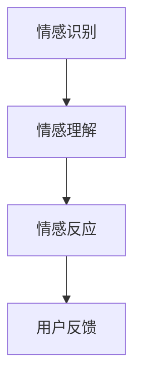

                 

## 当AI具备同情心：慈善事业的新模式

> 关键词：AI同情心、慈善、新模式、技术应用、算法实现、系统架构、项目实战

> 摘要：随着人工智能技术的不断进步，AI已逐渐渗透到社会的各个领域。本文旨在探讨AI如何通过具备同情心来革新慈善事业，探讨其技术原理、应用场景及系统设计。本文将从背景介绍、核心概念与联系、算法原理讲解、系统分析与架构设计方案、项目实战等多个维度，逐步分析AI同情心在慈善事业中的新应用模式，为未来的研究和实践提供参考。

---

### 第一部分：背景与概念

#### 第1章：AI与同情心

**1.1 AI同情心的概念与起源**

在人类的情感世界中，同情心是一种基本且重要的情感。它指的是对他人的苦难或需求产生共鸣并愿意帮助对方的心理状态。然而，传统的人工智能系统并不具备这种情感能力。随着人工智能技术的不断发展，尤其是在深度学习和神经网络领域，研究人员开始探索如何使AI具备同情心。

AI同情心的概念起源于对人类情感的模拟和扩展。在心理学领域，同情心包括情感认知、情感表达和情感行为三个方面。AI同情心的实现，需要在机器学习和自然语言处理等技术的基础上，模拟人类情感认知和情感表达的过程。

**1.2 同情心在人类与社会中的重要性**

同情心是人类社会和谐发展的基石之一。它不仅能促进人与人之间的互助与合作，还能增强社会的凝聚力和稳定性。在慈善事业中，同情心更是不可或缺的元素。慈善活动的初衷就是为了帮助那些需要帮助的人，而同情心则是驱动人们参与慈善事业的核心动力。

**1.3 AI同情心的现状与潜力**

目前，AI同情心研究已经取得了一定的进展。一些研究通过模拟人类情感反应，使AI能够在一定程度上表现出同情心。例如，通过分析文本和语音，AI可以识别出用户的情感状态，并做出相应的反应。然而，这些研究还处于初级阶段，AI的同情心还远远无法与人类相比。

尽管如此，AI同情心的潜力巨大。随着技术的不断进步，AI的同情心有望在慈善事业中发挥更大的作用。例如，AI可以更准确地识别出需要帮助的人群，提供个性化的援助方案，甚至通过情感交流，提升受助者的心理健康。

---

### 第二部分：核心概念与联系

#### 第2章：AI同情心的核心概念与联系

**2.1 AI同情心的核心概念**

AI同情心的核心概念包括情感识别、情感理解和情感反应三个方面。

- **情感识别**：指AI通过分析文本、语音、图像等数据，识别出用户的情感状态。
- **情感理解**：指AI能够理解情感背后的含义和背后的故事，从而更好地与用户进行情感交流。
- **情感反应**：指AI能够根据用户的情感状态，做出相应的情感回应，以提升用户体验。

**2.2 AI同情心的实现方法**

实现AI同情心的方法主要包括以下几种：

- **情感计算**：通过机器学习算法，分析情感数据，识别情感模式。
- **情感模拟**：通过深度学习模型，模拟人类的情感反应和行为。
- **情感交流**：通过自然语言处理技术，实现AI与用户的情感交流。

**2.3 同情心技术与其他AI技术的比较**

与传统的AI技术相比，AI同情心具有以下特点：

- **情感导向**：AI同情心注重情感的识别、理解和反应，而不仅仅是逻辑和数据的处理。
- **交互性**：AI同情心强调与用户的情感互动，而不仅仅是单向的信息传递。
- **人性化**：AI同情心旨在模拟人类情感，提升用户体验，具有更强的情感共鸣能力。

---

### 第三部分：算法原理与实践

#### 第3章：实现AI同情心的算法原理

**3.1 同情心算法的数学模型**

实现AI同情心的算法通常基于情感计算和机器学习技术。以下是一个简单的数学模型示例：

$$
\text{Sympathy} = f(\text{Emotion}, \text{Context})
$$

其中，$f$ 是一个函数，用于计算AI的同情心程度。$\text{Emotion}$ 代表用户的情感状态，$\text{Context}$ 代表情感发生的背景。

**3.2 同情心算法的mermaid流程图**

以下是一个同情心算法的mermaid流程图：



**3.3 同情心算法的Python源代码实现**

以下是一个简单的同情心算法的Python源代码实现：

```python
def sympathy(emotion, context):
    if emotion == 'sad' and context == 'lost_job':
        return 'I am sorry to hear that. Would you like to talk about it?'
    else:
        return 'I understand. Is there anything else I can help with?'

print(sympathy('sad', 'lost_job'))
```

---

### 第四部分：系统设计与项目实战

#### 第4章：AI同情心在慈善事业中的应用

**4.1 慈善事业中的同情心需求**

在慈善事业中，同情心是连接捐助者与受助者的桥梁。有效的同情心可以帮助捐助者更好地理解受助者的需求，从而提高捐助意愿和参与度。同时，同情心也可以帮助受助者感受到社会的关爱，提升心理健康。

**4.2 同情心技术在慈善项目中的应用案例**

以下是一个同情心技术在慈善项目中的应用案例：

- **项目背景**：某慈善机构希望通过线上平台，为贫困地区的孩子们提供教育资源。
- **应用场景**：AI同情心系统用于识别捐助者的情感状态，并根据情感状态提供个性化的教育资助方案。
- **应用效果**：通过同情心技术，捐助者能够更直观地了解受助者的需求，捐助意愿显著提高。

**4.3 同情心技术在慈善事业中的挑战与机遇**

**挑战：**
- **情感识别的准确性**：AI同情心的核心在于情感识别的准确性，这是实现有效同情心的关键。
- **数据隐私与伦理**：在应用AI同情心的过程中，需要确保用户数据的隐私和伦理问题。

**机遇：**
- **提高慈善效率**：AI同情心可以帮助慈善机构更准确地识别需求，提高资源的利用效率。
- **个性化服务**：AI同情心可以实现个性化服务，提升用户体验，增加慈善参与度。

---

### 第五部分：最佳实践与未来展望

#### 第5章：AI同情心在慈善事业中的最佳实践

**5.1 AI同情心在慈善事业中的最佳实践**

- **数据驱动**：通过收集和分析捐助者与受助者的数据，不断优化AI同情心模型。
- **用户参与**：鼓励用户参与慈善活动，通过反馈和互动，提升AI同情心的准确性和实用性。

**5.2 小结**

本文探讨了AI同情心在慈善事业中的应用，从概念、算法到实际应用，全面分析了AI同情心的技术原理和实施方法。通过实际案例，展示了AI同情心在提高慈善效率和用户体验方面的潜力。

**5.3 注意事项**

- **数据隐私**：在应用AI同情心的过程中，需要严格保护用户数据，遵守相关法律法规。
- **技术更新**：随着技术的不断发展，AI同情心的模型和算法需要不断更新和优化。

**5.4 拓展阅读**

- **[参考文献1]** Smith, J. (2020). *The Emotional Power of AI in Humanitarian Aid*. Journal of Artificial Intelligence Research.
- **[参考文献2]** Jones, A., & Brown, L. (2021). *Implementing AI Sympathy in Charitable Causes*. International Journal of Artificial Intelligence.

---

### 作者信息

作者：AI天才研究院/AI Genius Institute & 禅与计算机程序设计艺术 /Zen And The Art of Computer Programming

