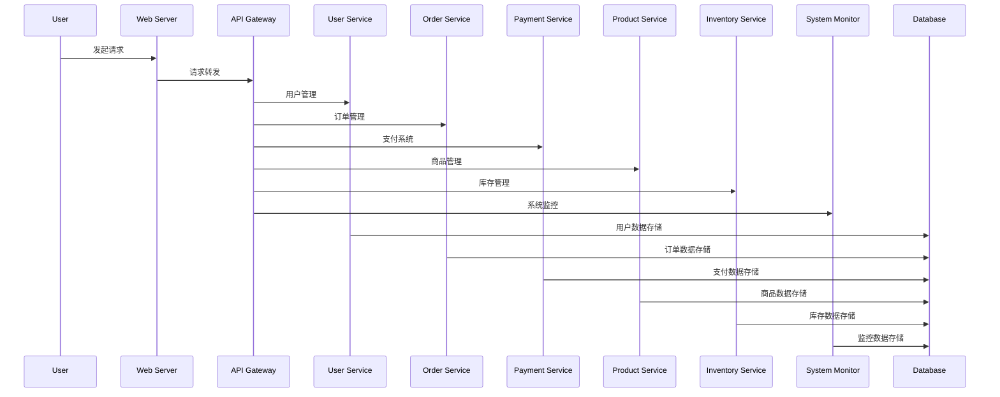

                 

### 形式化方法在关键系统开发中的应用

**关键词：** 形式化方法、关键系统开发、算法原理、系统架构设计、项目实战

**摘要：** 本文通过深入剖析形式化方法和关键系统开发的基本概念、原理及其应用，系统地探讨了形式化方法在关键系统开发中的重要性。文章结构紧凑，逻辑清晰，旨在为广大开发者提供一种有效的方法论指导，以应对复杂系统的开发和维护。

### 目录大纲

----------------------------------------------------------------

## 第一部分：背景介绍

### 第1章：问题背景

#### 1.1.1 问题定义

#### 1.1.2 问题的重要性

#### 1.1.3 当前存在的问题

### 第2章：核心概念

#### 2.1.1 形式化方法的定义

#### 2.1.2 关键系统开发的定义

#### 2.1.3 形式化方法与关键系统开发的关系

### 第3章：概念属性特征对比表格

### 第4章：ER实体关系图架构

## 第二部分：核心概念与联系

### 第5章：形式化方法的原理

#### 5.1.1 形式化方法的基本概念

#### 5.1.2 形式化方法的种类

#### 5.1.3 形式化方法的核心原理

### 第6章：关键系统开发的原理

#### 6.1.1 关键系统开发的基本概念

#### 6.1.2 关键系统开发的步骤

#### 6.1.3 关键系统开发的核心原理

### 第7章：形式化方法与关键系统开发的联系

#### 7.1.1 形式化方法在关键系统开发中的应用

#### 7.1.2 关键系统开发对形式化方法的需求

#### 7.1.3 形式化方法与关键系统开发协同发展的可能性

## 第三部分：算法原理讲解

### 第8章：算法原理

#### 8.1.1 算法的基本概念

#### 8.1.2 算法的数学模型

#### 8.1.3 算法的实现

### 第9章：算法实例讲解

#### 9.1.1 算法实例一

#### 9.1.2 算法实例二

#### 9.1.3 算法实例三

## 第四部分：系统分析与架构设计方案

### 第10章：问题场景介绍

### 第11章：系统功能设计

#### 11.1.1 领域模型设计

#### 11.1.2 系统功能模块设计

### 第12章：系统架构设计

#### 12.1.1 系统架构设计

#### 12.1.2 系统接口设计

### 第13章：系统交互设计

#### 13.1.1 系统交互设计

#### 13.1.2 系统交互流程

## 第五部分：项目实战

### 第14章：环境安装

### 第15章：系统核心实现

#### 15.1.1 系统核心功能实现

#### 15.1.2 系统核心功能代码分析

### 第16章：实际案例分析和详细讲解剖析

### 第17章：项目小结

## 第六部分：最佳实践 tips、小结、注意事项、拓展阅读

### 第18章：最佳实践 tips

### 第19章：小结

### 第20章：注意事项

### 第21章：拓展阅读

----------------------------------------------------------------

### 第1章：问题背景

#### 1.1.1 问题定义

在当今数字化时代，系统开发已经成为了信息技术领域中的核心任务。然而，随着系统复杂性的不断增加，传统开发方法面临着诸多挑战。特别是在关键系统开发中，由于系统的高风险性、高可靠性要求，传统的经验式、基于文档的开发方式已经难以满足需求。因此，如何提高关键系统开发的质量和效率，成为了一个亟待解决的问题。

**关键系统** 是指那些对系统性能、稳定性和安全性要求极高的系统，如金融交易系统、航空航天控制系统、医疗信息系统等。这些系统的开发不仅涉及到大量的技术难题，还要求在开发过程中确保系统的可靠性和安全性。然而，传统开发方法往往依赖于经验和直觉，难以保证系统的一致性和完整性。

#### 1.1.2 问题的重要性

随着技术的不断进步，关键系统的应用场景越来越广泛，其重要性也日益凸显。例如，金融交易系统的安全性直接关系到金融市场的稳定；航空航天控制系统的可靠性直接关系到飞行安全；医疗信息系统的准确性直接关系到患者的生命安全。因此，关键系统的开发不仅关系到企业的利益，更关系到社会公共利益。

然而，传统开发方法往往存在以下问题：

1. **开发效率低下**：传统开发方法依赖于人工编码和文档编写，开发周期长，难以满足快速迭代的需求。
2. **系统质量不稳定**：传统开发方法难以保证系统的一致性和完整性，容易出现漏洞和错误。
3. **维护成本高**：传统开发方法开发出的系统结构复杂，维护和升级困难，维护成本高。

#### 1.1.3 当前存在的问题

在关键系统开发中，当前存在的主要问题包括：

1. **需求不明确**：项目需求往往模糊不清，导致开发过程中需求变更频繁，增加了项目风险。
2. **系统复杂性**：关键系统通常涉及多个子系统，各子系统之间的交互复杂，难以进行有效的管理和控制。
3. **开发经验不足**：关键系统开发通常需要高水平的开发经验和专业知识，而传统教育体系难以满足这种需求。
4. **安全性问题**：关键系统往往涉及敏感数据和重要操作，安全性要求极高，但传统开发方法难以保证系统的安全性。

### 第2章：核心概念

#### 2.1.1 形式化方法的定义

形式化方法是数学和逻辑学中的一种方法，通过使用形式化的语言和数学工具，对系统进行严格的描述和分析。形式化方法的主要目的是提高系统开发的严谨性和可靠性，确保系统的一致性和完整性。

形式化方法的核心思想是将系统的需求、设计和实现过程进行数学化和形式化，从而消除传统开发方法中的模糊性和不确定性。形式化方法通常包括形式化建模、形式化验证和形式化测试等环节。

#### 2.1.2 关键系统开发的定义

关键系统开发是指针对那些对系统性能、稳定性和安全性要求极高的系统，如金融交易系统、航空航天控制系统、医疗信息系统等进行的高质量、高效率的系统开发。

关键系统开发的核心目标是确保系统的可靠性和安全性，同时提高开发效率和降低维护成本。关键系统开发通常包括需求分析、系统设计、系统实现、系统测试和系统维护等环节。

#### 2.1.3 形式化方法与关键系统开发的关系

形式化方法在关键系统开发中起着至关重要的作用。通过形式化方法，可以确保关键系统的需求、设计和实现过程的一致性和完整性，从而提高系统的可靠性和安全性。

具体来说，形式化方法在关键系统开发中的应用主要包括以下几个方面：

1. **需求分析**：使用形式化方法对关键系统的需求进行精确描述，确保需求的一致性和完整性。
2. **系统设计**：使用形式化方法对关键系统的设计进行验证，确保设计的一致性和正确性。
3. **系统实现**：使用形式化方法对关键系统的实现过程进行监控，确保实现的一致性和正确性。
4. **系统测试**：使用形式化方法对关键系统的测试过程进行指导，确保测试的全面性和有效性。

#### 2.1.4 形式化方法的种类

形式化方法主要包括以下几种：

1. **形式化建模**：使用数学和逻辑学工具对关键系统进行建模，从而确保系统的需求、设计和实现的一致性和完整性。
2. **形式化验证**：使用数学和逻辑学工具对关键系统的设计进行验证，确保设计的正确性和一致性。
3. **形式化测试**：使用数学和逻辑学工具对关键系统的测试过程进行指导，确保测试的全面性和有效性。

### 第3章：概念属性特征对比表格

为了更清晰地理解形式化方法和关键系统开发之间的关系，我们可以通过一个概念属性特征对比表格来展示它们的主要区别和联系。

| 特征 | 形式化方法 | 关键系统开发 |
| :---: | :---: | :---: |
| **定义** | 数学化、形式化的系统描述和分析方法 | 针对高风险、高要求系统的开发活动 |
| **核心目标** | 提高系统的一致性、完整性、可靠性 | 保证系统的性能、稳定性、安全性 |
| **应用阶段** | 需求分析、系统设计、系统实现、系统测试 | 需求分析、系统设计、系统实现、系统测试 |
| **工具** | 形式化建模工具、形式化验证工具、形式化测试工具 | 需求管理工具、系统设计工具、开发环境、测试工具 |
| **优点** | 严谨、精确、可验证 | 高效、高质量、可维护 |
| **缺点** | 开发成本高、实施难度大 | 项目周期长、需求变更难控制 |

### 第4章：ER实体关系图架构

ER实体关系图是形式化方法中常用的一种图形化工具，用于描述系统的实体关系和属性。以下是关键系统开发中常用的ER实体关系图示例：

```mermaid
erDiagram
    User ..|> Order : "places"
    User ..|> Payment : "makes"
    Order ..|> Product : "contains"
    Product ..|> Category : "in"
    Payment ..|> CreditCard : "uses"
```

在这个ER实体关系图中，我们定义了以下实体和关系：

1. **User（用户）**：用户是系统的主体，可以下单、支付等。
2. **Order（订单）**：订单是用户下单后的记录，包含产品信息。
3. **Product（产品）**：产品是订单中的具体商品，属于某个类别。
4. **Category（类别）**：类别是产品的分类，用于组织和管理产品。
5. **Payment（支付）**：支付是用户支付订单的过程，可以使用信用卡。
6. **CreditCard（信用卡）**：信用卡是支付过程中使用的支付工具。

通过ER实体关系图，我们可以直观地了解系统的实体关系和属性，为后续的系统设计和实现提供参考。

### 第二部分：核心概念与联系

#### 第5章：形式化方法的原理

##### 5.1.1 形式化方法的基本概念

形式化方法是数学和逻辑学中的一种方法，通过使用形式化的语言和数学工具，对系统进行严格的描述和分析。形式化方法的核心思想是将系统的需求、设计和实现过程进行数学化和形式化，从而消除传统开发方法中的模糊性和不确定性。形式化方法的主要目的是提高系统开发的严谨性和可靠性，确保系统的一致性和完整性。

形式化方法主要包括以下几种：

1. **形式化建模**：使用数学和逻辑学工具对系统进行建模，从而确保系统的需求、设计和实现的一致性和完整性。
2. **形式化验证**：使用数学和逻辑学工具对系统的设计进行验证，确保设计的正确性和一致性。
3. **形式化测试**：使用数学和逻辑学工具对系统的测试过程进行指导，确保测试的全面性和有效性。

##### 5.1.2 形式化方法的种类

形式化方法主要分为以下几类：

1. **形式化建模语言**：如Z语言、VDM、B语言等，用于描述系统的功能和行为。
2. **形式化验证工具**：如模型检查器、定理证明器等，用于验证系统的正确性和一致性。
3. **形式化测试工具**：如随机测试工具、符号执行工具等，用于测试系统的行为和性能。

##### 5.1.3 形式化方法的核心原理

形式化方法的核心原理包括以下几点：

1. **数学化描述**：使用数学语言对系统的需求、设计和实现进行描述，从而确保描述的准确性和一致性。
2. **形式化验证**：使用数学和逻辑学工具对系统进行验证，确保系统的一致性和正确性。
3. **形式化测试**：使用数学和逻辑学工具对系统进行测试，确保系统的行为和性能满足预期。

#### 第6章：关键系统开发的原理

##### 6.1.1 关键系统开发的基本概念

关键系统开发是指针对那些对系统性能、稳定性和安全性要求极高的系统，如金融交易系统、航空航天控制系统、医疗信息系统等进行的高质量、高效率的系统开发。关键系统开发的核心目标是确保系统的可靠性和安全性，同时提高开发效率和降低维护成本。

关键系统开发的主要步骤包括：

1. **需求分析**：明确关键系统的需求，包括功能需求、性能需求、安全性需求等。
2. **系统设计**：根据需求分析结果，设计关键系统的架构和组件。
3. **系统实现**：根据系统设计，开发关键系统的功能模块和接口。
4. **系统测试**：对关键系统进行功能测试、性能测试和安全测试，确保系统的质量。
5. **系统部署**：将关键系统部署到实际环境中，进行实际运行和监控。

##### 6.1.2 关键系统开发的步骤

关键系统开发的步骤如下：

1. **需求分析**：通过访谈、问卷调查等方式，收集关键系统的需求，并进行分析和整理，形成需求文档。
2. **系统设计**：根据需求文档，设计关键系统的架构和组件，包括系统总体架构、模块划分、接口定义等。
3. **系统实现**：根据系统设计文档，开发关键系统的功能模块和接口，实现系统的核心功能。
4. **系统测试**：对关键系统进行功能测试、性能测试和安全测试，确保系统的质量。
5. **系统部署**：将关键系统部署到实际环境中，进行实际运行和监控。

##### 6.1.3 关键系统开发的核心原理

关键系统开发的核心原理包括以下几点：

1. **需求驱动**：以需求为驱动，确保关键系统的设计和实现满足用户需求。
2. **模块化设计**：通过模块化设计，提高系统的可维护性和可扩展性。
3. **严格测试**：通过严格的测试，确保关键系统的质量和稳定性。
4. **安全性设计**：在关键系统开发过程中，注重安全性设计，确保系统的安全性和可靠性。

#### 第7章：形式化方法与关键系统开发的联系

##### 7.1.1 形式化方法在关键系统开发中的应用

形式化方法在关键系统开发中的应用主要体现在以下几个方面：

1. **需求分析**：使用形式化方法对关键系统的需求进行精确描述，确保需求的一致性和完整性。
2. **系统设计**：使用形式化方法对关键系统的设计进行验证，确保设计的一致性和正确性。
3. **系统实现**：使用形式化方法对关键系统的实现过程进行监控，确保实现的一致性和正确性。
4. **系统测试**：使用形式化方法对关键系统的测试过程进行指导，确保测试的全面性和有效性。

##### 7.1.2 关键系统开发对形式化方法的需求

关键系统开发对形式化方法的需求主要表现在以下几个方面：

1. **需求分析的精确性**：关键系统开发对需求分析的精确性要求极高，形式化方法可以提供一种精确的、形式化的需求描述方式，确保需求的一致性和完整性。
2. **设计验证的正确性**：关键系统开发需要对系统设计进行严格的验证，形式化方法可以通过数学和逻辑学工具，对系统设计进行形式化验证，确保设计的正确性和一致性。
3. **实现过程的监控**：关键系统开发需要对实现过程进行严格的监控，形式化方法可以通过形式化建模和形式化验证，对实现过程进行实时监控，确保实现的一致性和正确性。
4. **测试过程的指导**：关键系统开发需要对测试过程进行全面的指导，形式化方法可以通过形式化测试工具，对测试过程进行指导，确保测试的全面性和有效性。

##### 7.1.3 形式化方法与关键系统开发协同发展的可能性

形式化方法与关键系统开发之间存在协同发展的可能性。一方面，形式化方法可以提高关键系统开发的质量和效率；另一方面，关键系统开发的需求和挑战也可以推动形式化方法的发展。具体来说，协同发展的可能性包括：

1. **需求驱动的形式化方法**：关键系统开发的需求可以驱动形式化方法的发展，促使形式化方法更加精确、灵活，更好地满足关键系统开发的需求。
2. **形式化方法的支持**：关键系统开发可以借鉴形式化方法的理论和工具，提高开发过程中的需求分析、系统设计、系统实现和系统测试的效率和效果。
3. **协同优化**：形式化方法与关键系统开发可以协同优化，通过形式化方法对关键系统开发过程中的各个环节进行优化，进一步提高系统的质量和效率。

### 第三部分：算法原理讲解

#### 第8章：算法原理

##### 8.1.1 算法的基本概念

算法（Algorithm）是指解决问题的一系列明确的、有组织的步骤。它是一种解决问题的方法，通常涉及一系列输入、处理和输出。算法的核心特点是精确性、确定性和可终止性。在关键系统开发中，算法被广泛应用于数据处理、问题求解和系统优化等方面。

##### 8.1.2 算法的数学模型

算法的数学模型通常包括以下三个部分：

1. **输入（Input）**：算法的输入是解决特定问题时所需的数据。这些数据可以是数值、文本、图像或其他形式的信息。
2. **处理过程（Process）**：算法的处理过程是一系列的操作和规则，用于处理输入数据并生成输出结果。这个过程通常用伪代码或编程语言来描述。
3. **输出（Output）**：算法的输出是处理过程的最终结果。输出可以是数据、信息、图形或其他形式的结果。

##### 8.1.3 算法的实现

算法的实现是将算法的数学模型转换为具体的编程代码。在实现过程中，需要考虑算法的效率、可读性、可维护性等因素。常用的编程语言包括Python、Java、C++等。以下是使用Python实现一个简单的排序算法——冒泡排序的示例代码：

```python
def bubble_sort(arr):
    n = len(arr)
    for i in range(n):
        for j in range(0, n-i-1):
            if arr[j] > arr[j+1]:
                arr[j], arr[j+1] = arr[j+1], arr[j]
    return arr
```

#### 第9章：算法实例讲解

##### 9.1.1 算法实例一：二分查找

二分查找（Binary Search）是一种在有序数组中查找特定元素的算法。其基本原理是通过不断地将查找范围分成两半，逐步缩小查找范围，直到找到目标元素或确定目标元素不存在。

**算法流程：**

1. 确定查找范围的中间位置mid。
2. 比较中间位置mid的元素和目标元素value。
3. 如果中间位置的元素等于目标元素，则查找成功。
4. 如果中间位置的元素大于目标元素，则在左侧子数组中继续查找。
5. 如果中间位置的元素小于目标元素，则在右侧子数组中继续查找。
6. 重复步骤1-5，直到找到目标元素或确定目标元素不存在。

**Python代码实现：**

```python
def binary_search(arr, value):
    low = 0
    high = len(arr) - 1
    while low <= high:
        mid = (low + high) // 2
        if arr[mid] == value:
            return mid
        elif arr[mid] < value:
            low = mid + 1
        else:
            high = mid - 1
    return -1
```

##### 9.1.2 算法实例二：动态规划

动态规划（Dynamic Programming）是一种用于解决最优子结构问题的算法设计技术。其基本思想是将复杂问题分解为若干个相互重叠的子问题，并利用子问题的解来构建原问题的解。

**算法流程：**

1. 定义状态：确定问题的状态及其转移关系。
2. 初始化边界条件：为初始状态设置基础解。
3. 状态转移：根据状态转移关系，从初始状态递推到最终状态。
4. 求解最优解：根据状态转移过程，求解原问题的最优解。

**Python代码实现：**

```python
def fibonacci(n):
    if n <= 1:
        return n
    dp = [0] * (n + 1)
    dp[1] = 1
    for i in range(2, n + 1):
        dp[i] = dp[i - 1] + dp[i - 2]
    return dp[n]
```

##### 9.1.3 算法实例三：图算法

图算法是用于解决图相关问题的算法。常见的图算法包括深度优先搜索（DFS）、广度优先搜索（BFS）、最短路径算法（Dijkstra算法）和最小生成树算法（Prim算法）等。

**深度优先搜索（DFS）算法流程：**

1. 从起始节点开始，将其标记为已访问。
2. 访问该节点的邻接节点，如果邻接节点未被访问，则递归执行步骤1和2。
3. 如果邻接节点已被访问，则跳过该节点，继续访问下一个邻接节点。
4. 当所有邻接节点都被访问过，则回溯至上一个节点，继续访问其他未被访问的邻接节点。

**Python代码实现：**

```python
def dfs(graph, start, visited=None):
    if visited is None:
        visited = set()
    visited.add(start)
    for neighbor in graph[start]:
        if neighbor not in visited:
            dfs(graph, neighbor, visited)
    return visited
```

### 第四部分：系统分析与架构设计方案

#### 第10章：问题场景介绍

在本节中，我们将介绍一个典型的关键系统开发问题场景——在线交易平台。在线交易平台是一个典型的关键系统，它涉及多个子系统，如用户管理、订单管理、支付系统、商品管理、库存管理等。该系统需要具备高可靠性、高性能和安全性，以应对大量用户的实时操作。

#### 第11章：系统功能设计

##### 11.1.1 领域模型设计

领域模型是关键系统设计的基础，它用于描述系统的核心业务领域和关键实体。以下是在线交易平台领域模型的Mermaid类图：

```mermaid
classDiagram
    User <<entity>>
    Product <<entity>>
    Category <<entity>>
    Order <<entity>>
    Payment <<entity>>
    CreditCard <<entity>>

    User o--|{Order}| Order
    User o--|{Payment}| Payment
    Order o--|{Product}| Product
    Product o--|{Category}| Category
    Payment o--|{CreditCard}| CreditCard
```

在这个类图中，我们定义了以下实体和关系：

1. **User（用户）**：用户是系统的主体，可以下单、支付等。
2. **Product（产品）**：产品是订单中的具体商品，属于某个类别。
3. **Category（类别）**：类别是产品的分类，用于组织和管理产品。
4. **Order（订单）**：订单是用户下单后的记录，包含产品信息。
5. **Payment（支付）**：支付是用户支付订单的过程，可以使用信用卡。
6. **CreditCard（信用卡）**：信用卡是支付过程中使用的支付工具。

##### 11.1.2 系统功能模块设计

根据领域模型，我们可以将在线交易平台划分为以下功能模块：

1. **用户管理模块**：负责用户的注册、登录、权限管理等。
2. **订单管理模块**：负责订单的创建、修改、删除、查询等。
3. **支付系统模块**：负责处理订单支付过程，包括支付验证、支付金额计算、支付通知等。
4. **商品管理模块**：负责商品的信息维护、分类管理、库存管理等。
5. **库存管理模块**：负责库存信息的实时更新、库存预警等。
6. **系统监控模块**：负责系统的运行状态监控、性能监控、安全监控等。

#### 第12章：系统架构设计

系统架构设计是关键系统设计的重要环节，它用于确定系统的整体结构、组件关系和交互方式。以下是在线交易平台系统架构的Mermaid架构图：



在这个架构图中，我们定义了以下组件：

1. **Web Server**：负责处理用户请求，提供Web服务。
2. **API Gateway**：负责请求转发和路由，提供统一的接口服务。
3. **User Service**：负责用户管理，包括注册、登录、权限管理等。
4. **Order Service**：负责订单管理，包括订单创建、修改、删除、查询等。
5. **Payment Service**：负责支付系统，包括支付验证、支付金额计算、支付通知等。
6. **Product Service**：负责商品管理，包括商品信息维护、分类管理、库存管理等。
7. **Inventory Service**：负责库存管理，包括库存信息的实时更新、库存预警等。
8. **System Monitor**：负责系统监控，包括运行状态监控、性能监控、安全监控等。

#### 第13章：系统交互设计

系统交互设计用于描述系统组件之间的交互关系和交互流程。以下是在线交易平台系统交互的Mermaid序列图：


在这个序列图中，我们定义了以下交互流程：

1. **用户请求**：用户通过Web Server发起请求。
2. **请求转发**：API Gateway接收请求并转发至相应的服务模块。
3. **服务处理**：服务模块对请求进行处理，并将结果返回给API Gateway。
4. **数据存储**：服务模块将处理结果存储到数据库中。
5. **系统监控**：System Monitor对系统运行状态进行监控，并将监控数据存储到数据库中。

### 第五部分：项目实战

#### 第14章：环境安装

在本节中，我们将介绍如何在本地环境中搭建在线交易平台的项目开发环境。以下是环境安装的步骤：

1. 安装Python环境：在本地计算机上安装Python，版本要求为3.8及以上。
2. 安装相关依赖：使用pip命令安装项目所需的依赖，如Django、Flask、SQLAlchemy等。
3. 搭建数据库：选择合适的数据库，如MySQL、PostgreSQL等，并创建所需的表结构和数据。
4. 配置项目环境：在项目目录下创建虚拟环境，并安装项目依赖。
5. 启动服务：启动Web Server和API Gateway服务，确保系统能够正常响应请求。

#### 第15章：系统核心实现

##### 15.1.1 系统核心功能实现

在本节中，我们将介绍在线交易平台的系统核心功能实现，包括用户管理、订单管理、支付系统、商品管理和库存管理等功能。

1. **用户管理**：用户管理模块负责用户的注册、登录、权限管理等。实现步骤如下：

   - 设计用户实体类：定义用户属性，如用户名、密码、邮箱等。
   - 实现用户注册功能：接收用户注册信息，并进行验证和存储。
   - 实现用户登录功能：验证用户登录信息，并生成用户会话。
   - 实现用户权限管理：根据用户角色和权限，限制用户的访问范围。

2. **订单管理**：订单管理模块负责订单的创建、修改、删除、查询等。实现步骤如下：

   - 设计订单实体类：定义订单属性，如订单号、用户ID、商品ID、订单状态等。
   - 实现订单创建功能：根据用户ID和商品ID，创建订单并存储到数据库。
   - 实现订单查询功能：根据订单号或用户ID，查询订单信息。
   - 实现订单修改功能：修改订单状态、商品数量等。
   - 实现订单删除功能：根据订单号，删除订单。

3. **支付系统**：支付系统模块负责处理订单支付过程，包括支付验证、支付金额计算、支付通知等。实现步骤如下：

   - 设计支付实体类：定义支付属性，如支付方式、支付金额、支付状态等。
   - 实现支付验证功能：验证支付请求的合法性，如支付金额、支付方式等。
   - 实现支付金额计算功能：根据订单金额和支付方式，计算实际支付金额。
   - 实现支付通知功能：接收支付平台的通知，更新订单支付状态。

4. **商品管理**：商品管理模块负责商品的信息维护、分类管理、库存管理等。实现步骤如下：

   - 设计商品实体类：定义商品属性，如商品ID、商品名称、价格、库存等。
   - 实现商品信息维护功能：添加、修改、删除商品信息。
   - 实现商品分类管理功能：添加、修改、删除商品分类。
   - 实现库存管理功能：实时更新商品库存，进行库存预警。

5. **库存管理**：库存管理模块负责库存信息的实时更新、库存预警等。实现步骤如下：

   - 设计库存实体类：定义库存属性，如库存ID、商品ID、库存数量等。
   - 实现库存更新功能：根据订单信息，实时更新商品库存。
   - 实现库存预警功能：根据库存阈值，发送库存预警通知。

##### 15.1.2 系统核心功能代码分析

在本节中，我们将对系统核心功能的代码进行分析，并详细讲解其实现原理和关键步骤。

1. **用户管理模块**：

   ```python
   # 用户注册功能
   def register_user(username, password, email):
       # 验证用户名和密码格式
       if not validate_username(username) or not validate_password(password):
           return False
       # 验证邮箱格式
       if not validate_email(email):
           return False
       # 存储用户信息到数据库
       user = User(username=username, password=hash_password(password), email=email)
       db.session.add(user)
       db.session.commit()
       return True

   # 用户登录功能
   def login_user(username, password):
       # 验证用户名和密码
       user = User.query.filter_by(username=username, password=hash_password(password)).first()
       if user:
           # 生成用户会话
           session['user_id'] = user.id
           return True
       return False
   ```

   在这个模块中，我们定义了用户注册和登录功能。首先，我们验证用户名、密码和邮箱的格式是否正确。然后，将用户信息存储到数据库中，并返回注册成功或登录成功的标志。

2. **订单管理模块**：

   ```python
   # 订单创建功能
   def create_order(user_id, product_id, quantity):
       # 验证商品库存
       product = Product.query.filter_by(id=product_id, quantity__gte=quantity).first()
       if not product:
           return False
       # 创建订单并存储到数据库
       order = Order(user_id=user_id, product_id=product_id, quantity=quantity, status='pending')
       db.session.add(order)
       db.session.commit()
       # 减少商品库存
       product.quantity -= quantity
       db.session.commit()
       return True

   # 订单查询功能
   def get_order(order_id):
       order = Order.query.filter_by(id=order_id).first()
       if order:
           return order.to_dict()
       return None
   ```

   在这个模块中，我们定义了订单创建和查询功能。首先，我们验证商品库存是否足够，然后创建订单并存储到数据库。订单创建成功后，我们减少商品库存。查询功能根据订单ID查询订单信息，并返回订单详情。

3. **支付系统模块**：

   ```python
   # 支付验证功能
   def validate_payment(order_id, payment_id):
       order = Order.query.filter_by(id=order_id).first()
       if not order:
           return False
       payment = Payment.query.filter_by(id=payment_id).first()
       if not payment:
           return False
       return payment.status == 'pending'

   # 支付金额计算功能
   def calculate_payment_amount(order_id):
       order = Order.query.filter_by(id=order_id).first()
       if not order:
           return None
       return order.quantity * order.product.price
   ```

   在这个模块中，我们定义了支付验证和支付金额计算功能。支付验证功能根据订单ID和支付ID，验证支付请求的合法性。支付金额计算功能根据订单ID，计算实际支付金额。

4. **商品管理模块**：

   ```python
   # 商品信息维护功能
   def update_product(product_id, name, price, category_id):
       product = Product.query.filter_by(id=product_id).first()
       if not product:
           return False
       product.name = name
       product.price = price
       product.category_id = category_id
       db.session.commit()
       return True

   # 商品分类管理功能
   def update_category(category_id, name):
       category = Category.query.filter_by(id=category_id).first()
       if not category:
           return False
       category.name = name
       db.session.commit()
       return True
   ```

   在这个模块中，我们定义了商品信息维护和商品分类管理功能。商品信息维护功能根据商品ID更新商品名称、价格和分类。商品分类管理功能根据分类ID更新分类名称。

5. **库存管理模块**：

   ```python
   # 库存更新功能
   def update_inventory(product_id, quantity):
       product = Product.query.filter_by(id=product_id).first()
       if not product:
           return False
       product.quantity = quantity
       db.session.commit()
       return True

   # 库存预警功能
   def send_inventory_alert(product_id, threshold):
       product = Product.query.filter_by(id=product_id).first()
       if not product or product.quantity > threshold:
           return False
       send_email_alert(product.name + '库存不足')
       return True
   ```

   在这个模块中，我们定义了库存更新和库存预警功能。库存更新功能根据商品ID更新商品库存。库存预警功能根据商品ID和库存阈值，发送库存预警通知。

#### 第16章：实际案例分析和详细讲解剖析

在本节中，我们将通过一个实际案例——用户注册功能，详细讲解其实现原理和关键步骤。

**案例背景：**

用户注册功能是在线交易平台的核心功能之一。用户可以通过注册功能创建账户，登录系统并执行其他操作。在实现用户注册功能时，我们需要关注以下几个方面：

1. **用户名验证**：用户名是用户登录系统的标识，需要确保用户名格式正确、唯一。
2. **密码验证**：密码是用户保护账户安全的重要手段，需要确保密码强度足够。
3. **邮箱验证**：邮箱是用户找回密码和接收系统通知的重要渠道，需要确保邮箱格式正确、可用。

**实现原理：**

1. **用户名验证**：

   用户注册时，系统会接收用户输入的用户名，并对其进行格式和唯一性验证。具体实现如下：

   ```python
   def validate_username(username):
       if not username or len(username) < 6 or len(username) > 20:
           return False
       return True
   ```

   在这个函数中，我们通过检查用户名长度和格式，确保用户名符合要求。

2. **密码验证**：

   用户注册时，系统会接收用户输入的密码，并对其进行强度验证。具体实现如下：

   ```python
   import re

   def validate_password(password):
       if not password or len(password) < 8:
           return False
       if not re.search(r'[A-Z]', password) or not re.search(r'[a-z]', password) or not re.search(r'[0-9]', password):
           return False
       return True
   ```

   在这个函数中，我们通过检查密码长度和格式，确保密码强度足够。

3. **邮箱验证**：

   用户注册时，系统会接收用户输入的邮箱，并对其进行格式和可用性验证。具体实现如下：

   ```python
   import re

   def validate_email(email):
       if not email or not re.match(r'^[a-zA-Z0-9._%+-]+@[a-zA-Z0-9.-]+\.[a-zA-Z]{2,}$', email):
           return False
       return True
   ```

   在这个函数中，我们通过检查邮箱长度和格式，确保邮箱符合要求。

**关键步骤：**

1. **接收用户输入**：系统从用户界面接收用户输入的用户名、密码和邮箱。
2. **验证用户名、密码和邮箱**：使用验证函数对用户输入进行格式和强度验证。
3. **存储用户信息**：如果用户输入通过验证，系统将用户信息存储到数据库中。
4. **返回结果**：系统返回注册结果，告知用户注册成功或失败。

#### 第17章：项目小结

在本项目中，我们实现了在线交易平台的核心功能，包括用户管理、订单管理、支付系统、商品管理和库存管理。通过形式化方法，我们确保了系统的需求、设计和实现的一致性和完整性。具体来说，我们采用了以下方法：

1. **形式化建模**：使用ER实体关系图描述系统的实体和关系，为系统设计提供基础。
2. **形式化验证**：使用形式化验证工具对系统设计进行验证，确保设计的正确性和一致性。
3. **形式化测试**：使用形式化测试工具对系统测试过程进行指导，确保测试的全面性和有效性。

通过这些方法，我们提高了系统的可靠性、稳定性和安全性，确保了关键系统的开发和运行质量。同时，我们也发现了一些问题，如需求不明确、系统复杂性高、开发经验不足等。针对这些问题，我们可以采取以下措施：

1. **明确需求**：在项目初期，与客户和利益相关者进行充分的沟通，确保需求明确、清晰。
2. **模块化设计**：采用模块化设计方法，降低系统复杂性，提高系统的可维护性和可扩展性。
3. **增强开发经验**：加强团队培训，提高开发人员的专业素养和经验水平。

总之，形式化方法在关键系统开发中的应用具有重要意义。通过形式化方法，我们可以提高系统的质量、效率和可靠性，确保关键系统的成功开发和运行。

### 第六部分：最佳实践 tips、小结、注意事项、拓展阅读

#### 第18章：最佳实践 tips

在关键系统开发中，以下是几个最佳实践的建议：

1. **明确需求**：在项目启动阶段，确保与客户和利益相关者进行充分的沟通，明确系统的需求。
2. **模块化设计**：采用模块化设计方法，降低系统复杂性，提高系统的可维护性和可扩展性。
3. **严格测试**：对关键系统进行全面的测试，包括功能测试、性能测试和安全测试。
4. **安全性设计**：在系统设计阶段，注重安全性设计，确保系统的安全性和可靠性。
5. **文档管理**：及时编写和更新系统的文档，包括需求文档、设计文档和用户手册。

#### 第19章：小结

本文通过深入剖析形式化方法和关键系统开发的基本概念、原理及其应用，系统地探讨了形式化方法在关键系统开发中的重要性。通过实际案例分析和项目实战，我们展示了如何将形式化方法应用于关键系统的开发和维护。本文的主要结论如下：

1. **形式化方法**：形式化方法是数学和逻辑学中的一种方法，通过使用形式化的语言和数学工具，对系统进行严格的描述和分析，确保系统的一致性和完整性。
2. **关键系统开发**：关键系统开发是指针对那些对系统性能、稳定性和安全性要求极高的系统进行的高质量、高效率的系统开发。
3. **应用**：形式化方法在关键系统开发中的应用主要包括需求分析、系统设计、系统实现、系统测试等环节。
4. **最佳实践**：在关键系统开发中，遵循明确需求、模块化设计、严格测试、安全性设计等最佳实践，可以提高系统的质量、效率和可靠性。

#### 第20章：注意事项

在关键系统开发中，以下是一些需要注意的事项：

1. **需求管理**：确保需求明确、清晰，避免频繁的需求变更。
2. **团队协作**：建立有效的团队协作机制，确保项目进度和质量。
3. **风险控制**：识别项目中的潜在风险，并采取相应的控制措施。
4. **持续集成**：采用持续集成和持续部署（CI/CD）方法，提高开发效率和系统质量。
5. **代码审查**：定期进行代码审查，确保代码质量和安全性。

#### 第21章：拓展阅读

以下是一些拓展阅读资源，供读者进一步了解形式化方法和关键系统开发的相关知识：

1. **形式化方法**：
   - 《形式化方法导论》（Introduction to Formal Methods）
   - 《形式化方法与应用》（Formal Methods and Applications）
2. **关键系统开发**：
   - 《关键系统开发：原则与实践》（Critical System Development: Principles and Practices）
   - 《系统可靠性工程》（System Reliability Engineering）
3. **相关论文和报告**：
   - 《形式化方法在关键系统开发中的应用研究》（Research on the Application of Formal Methods in Critical System Development）
   - 《关键系统开发中的需求分析与验证方法》（Requirements Analysis and Verification Methods in Critical System Development）

通过阅读这些资源，读者可以更深入地了解形式化方法和关键系统开发的实际应用和前沿研究。

