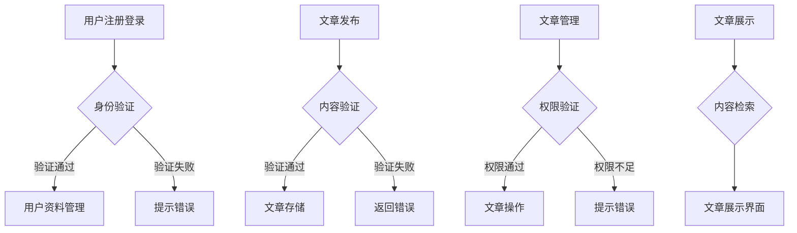
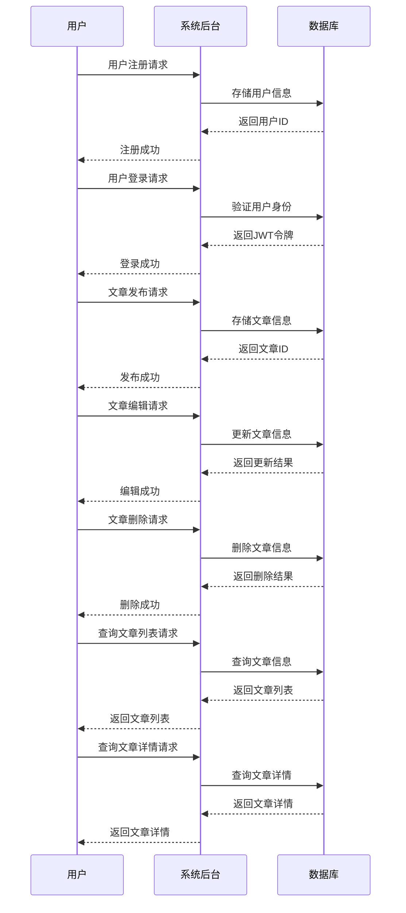

                 

### 形式生活与维特根斯坦的哲学背景

#### 1.1 问题的提出

在当代哲学与计算机科学的交汇点上，形式生活与函数式思维成为探讨的核心议题。本书旨在探讨哲学家路德维希·维特根斯坦的生活形式概念与函数式编程（FP）思维方式之间的联系，以及如何在计算机科学实践中应用这些哲学思想。

**问题背景：**
维特根斯坦的生活形式概念强调人类对世界的感知和思维方式。而现代编程语言中的函数式编程范式，通过其纯函数和不可变数据结构，展现出一种接近维特根斯坦哲学思想的编程方式。

**问题描述：**
如何在计算机科学领域理解和运用维特根斯坦的生活形式概念？如何将这种哲学思维转化为实际编程实践中的具体方法？

**问题解决：**
本书通过深入探讨维特根斯坦的哲学思想，结合函数式编程的特点，提出一种新的编程思维方式，旨在提高程序员对复杂系统的理解和构建能力。

**边界与外延：**
生活形式概念不仅涉及个体对世界的感知，还涉及社会、文化等因素。而函数式编程则是一种编程范式，广泛应用于软件工程、算法设计等领域。

#### 1.2 维特根斯坦及其哲学贡献

路德维希·维特根斯坦（Ludwig Wittgenstein）是20世纪最伟大的哲学家之一，他的思想对当代哲学产生了深远的影响。维特根斯坦的主要哲学贡献包括语言哲学、认识论和心灵哲学。

**核心要素组成：**
1. 语言哲学：维特根斯坦主张语言是思维的工具，语言的表达方式决定了我们的思维方式。
2. 认识论：他提出了“生活形式”（forms of life）的概念，认为我们的认识活动是在特定的文化和社会背景下进行的。
3. 心灵哲学：维特根斯坦强调了心灵与身体的关系，提出了“图像理论”（image theory）。

#### 1.3 形式生活概念解析

维特根斯坦的生活形式概念是他对人类认知方式和文化传统的深刻理解。生活形式指的是我们感知和理解世界的方式，它包括语言、符号、习俗和价值观等。

**概念属性特征对比表格：**

| 特征 | 形式生活 | 函数式编程 |
| --- | --- | --- |
| 基本单位 | 语言、符号 | 函数、表达式 |
| 结构关系 | 语法、语义 | 类型系统、组合规则 |
| 应用领域 | 认知、文化 | 编程、算法设计 |
| 目标 | 描述和理解世界 | 构建和优化软件系统 |

**ER实体关系图架构：**

```mermaid
erDiagram
    A 生活形式 -->|描述| B 人类感知方式
    B 人类感知方式 -->|涉及| C 文化和社会因素
    A 生活形式 ||--|{影响}| D 认知活动
```

在这个ER图中，`A 生活形式` 代表维特根斯坦对生活形式的理解，`B 人类感知方式` 代表个体感知和理解世界的方式，`C 文化和社会因素` 代表影响人类感知方式的社会文化背景，`D 认知活动` 代表基于生活形式的思维过程。

### 第二章 函数式编程基础

#### 2.1 函数式编程概述

函数式编程是一种编程范式，强调以函数为中心的编程风格，而非面向对象或过程式编程。其核心思想是避免使用变量和状态，而是通过纯函数和不可变数据结构来构建程序。

**核心概念原理：**
1. 函数是一等公民：函数可以作为参数传递，也可以作为返回值。
2. 纯函数：一个函数的输出仅依赖于其输入，且不会产生副作用。
3. 不可变数据：数据一旦创建，就不能被修改。

#### 2.2 函数式编程的特点

**概念属性特征对比表格：**

| 特征 | 形式生活 | 函数式编程 |
| --- | --- | --- |
| 依赖性 | 社会和文化 | 语言和库 |
| 灵活性 | 适应不同认知方式 | 面向多种编程任务 |
| 简洁性 | 直接表达认知过程 | 简化代码逻辑 |
| 可维护性 | 易于理解和修改 | 函数模块化 |

**ER实体关系图架构：**

```mermaid
erDiagram
    AFunctionalProgrammingConcepts -->|defines| BFunctionalPrinciples
    BFunctionalPrinciples -->|applies to| CProgrammingLanguages
    AFunctionalProgrammingConcepts ||--|{influences on} DApplicationScenarios
```

在这个ER图中，`AFunctionalProgrammingConcepts` 代表函数式编程的核心概念，`BFunctionalPrinciples` 代表函数式编程的原理，`CProgrammingLanguages` 代表实现函数式编程的编程语言，`DApplicationScenarios` 代表函数式编程的应用场景。

### 第三章 维特根斯坦哲学思想与函数式编程的联系

#### 3.1 维特根斯坦的生活形式与函数式编程

维特根斯坦的生活形式概念强调人类对世界的感知和思维方式，这与函数式编程的核心思想有显著的联系。函数式编程通过纯函数和不可变数据结构，实现了对世界的一种抽象和表达，这种抽象和表达方式与维特根斯坦的生活形式概念有相似之处。

**核心思想对比表格：**

| 核心思想 | 维特根斯坦的生活形式 | 函数式编程 |
| --- | --- | --- |
| 感知世界 | 通过语言和符号感知和理解世界 | 通过纯函数和不可变数据结构感知和理解世界 |
| 思维方式 | 人类对世界的感知影响思维方式 | 纯函数和不可变数据结构影响编程思维方式 |
| 抽象层次 | 人类对世界的认知过程是抽象的 | 编程过程中对数据的抽象和操作是抽象的 |

**ER实体关系图架构：**

```mermaid
erDiagram
    A 生活形式概念 -->|关联| B 函数式编程原理
    B 函数式编程原理 -->|影响| C 编程思维方式
    A 生活形式概念 ||--|{作用}| D 编程语言设计
```

在这个ER图中，`A 生活形式概念` 代表维特根斯坦对生活形式的理解，`B 函数式编程原理` 代表函数式编程的核心原则，`C 编程思维方式` 代表基于函数式编程的思维方式，`D 编程语言设计` 代表实现函数式编程的编程语言。

#### 3.2 维特根斯坦的哲学思想对函数式编程的启示

维特根斯坦的哲学思想对函数式编程的启示主要体现在以下几个方面：

1. **语言哲学：** 维特根斯坦认为语言是思维的工具，函数式编程中的函数也是一种语言元素，通过函数的组合和嵌套，可以实现复杂的计算和逻辑处理。

2. **生活形式：** 维特根斯坦的生活形式概念强调人类对世界的感知和思维方式，这与函数式编程中的不可变数据结构和纯函数概念有相似之处，都强调对数据和计算过程的抽象和表达。

3. **图像理论：** 维特根斯坦的图像理论认为语言和现实之间存在一种映射关系，函数式编程中的函数和数据结构也可以看作是一种对现实世界的抽象映射。

**核心思想对比表格：**

| 核心思想 | 维特根斯坦哲学思想 | 函数式编程 |
| --- | --- | --- |
| 语言哲学 | 语言是思维的工具 | 函数是编程的基本元素 |
| 生活形式 | 人类对世界的感知和思维方式 | 不可变数据结构和纯函数 |
| 图像理论 | 语言和现实之间的映射 | 函数和数据结构的抽象映射 |

**ER实体关系图架构：**

```mermaid
erDiagram
    A 维特根斯坦哲学思想 -->|影响| B 函数式编程原理
    B 函数式编程原理 -->|指导| C 编程实践
    A 维特根斯坦哲学思想 ||--|{启示}| D 编程思维方式
```

在这个ER图中，`A 维特根斯坦哲学思想` 代表维特根斯坦的哲学思想，`B 函数式编程原理` 代表函数式编程的核心原则，`C 编程实践` 代表基于函数式编程的编程实践，`D 编程思维方式` 代表基于维特根斯坦哲学思想的编程思维方式。

### 第四章 函数式编程在计算机科学中的应用

#### 4.1 函数式编程在软件工程中的应用

函数式编程在软件工程中得到了广泛应用，其优势在于能够提高代码的可读性、可维护性和可靠性。在软件工程中，函数式编程的应用主要体现在以下几个方面：

1. **模块化设计：** 函数式编程鼓励将程序拆分为独立的函数模块，每个模块负责完成特定的功能，从而实现代码的模块化和复用。

2. **状态管理：** 通过不可变数据结构和纯函数，函数式编程可以有效管理状态，避免状态冲突和副作用，提高代码的可靠性和稳定性。

3. **并行计算：** 函数式编程中的纯函数和不可变数据结构非常适合并行计算，因为它们不会产生副作用，可以独立运行。

**ER实体关系图架构：**

```mermaid
erDiagram
    A 软件工程 -->|应用| B 函数式编程
    B 函数式编程 -->|实现| C 模块化设计
    B 函数式编程 -->|提高| D 代码质量
    A 软件工程 ||--|{需求}| E 并行计算
```

在这个ER图中，`A 软件工程` 代表软件工程领域，`B 函数式编程` 代表函数式编程，`C 模块化设计` 代表模块化设计方法，`D 代码质量` 代表代码质量，`E 并行计算` 代表并行计算需求。

#### 4.2 函数式编程在算法设计中的应用

函数式编程在算法设计中也具有独特的优势，其纯函数和不可变数据结构使得算法的设计和实现更加简洁和高效。在算法设计中，函数式编程的应用主要体现在以下几个方面：

1. **递归：** 函数式编程中的递归实现更加直观和简洁，可以避免迭代过程中产生的副作用。

2. **函数组合：** 通过函数的组合，可以方便地实现复杂的算法，提高代码的可读性和可维护性。

3. **不可变数据结构：** 不可变数据结构使得算法的实现更加稳定和可靠，可以避免数据冲突和副作用。

**ER实体关系图架构：**

```mermaid
erDiagram
    A 算法设计 -->|应用| B 函数式编程
    B 函数式编程 -->|实现| C 递归
    B 函数式编程 -->|提高| D 算法效率
    A 算法设计 ||--|{需求}| E 函数组合
```

在这个ER图中，`A 算法设计` 代表算法设计领域，`B 函数式编程` 代表函数式编程，`C 递归` 代表递归实现，`D 算法效率` 代表算法效率，`E 函数组合` 代表函数组合方法。

### 第五章 总结与展望

#### 5.1 形式生活与函数式编程的深度融合

通过本书的探讨，我们可以看到维特根斯坦的生活形式概念与函数式编程之间存在深刻的联系。形式生活强调人类对世界的感知和思维方式，而函数式编程通过纯函数和不可变数据结构，实现了一种对世界的抽象和表达。这种深度融合不仅为计算机科学提供了新的思维方式，也为哲学与计算机科学的交叉研究提供了新的方向。

**核心结论：**
维特根斯坦的生活形式概念为函数式编程提供了哲学基础，而函数式编程则为形式生活提供了具体的实现方法。二者的深度融合有望提高程序员对复杂系统的理解和构建能力。

#### 5.2 未来研究方向

未来的研究可以进一步探讨维特根斯坦哲学思想在更多计算机科学领域的应用，如机器学习、人工智能等。同时，还可以研究如何将其他哲学思想，如存在主义、现象学等，与函数式编程相结合，为计算机科学的发展提供更多的理论支持。

**未来展望：**
形式生活与函数式编程的深度融合有望在计算机科学领域产生深远影响，为软件工程、算法设计等提供新的方法和思路。

### 附录：相关术语解释

**维特根斯坦的生活形式概念：**
维特根斯坦提出的“生活形式”是指人类在特定文化和社会背景下对世界的感知和思维方式。生活形式包括语言、符号、习俗和价值观等，它们共同构成了人类的认知方式。

**函数式编程（FP）：**
函数式编程是一种编程范式，以函数为中心，强调使用纯函数和不可变数据结构来构建程序。函数式编程的核心思想是避免使用变量和状态，通过函数的组合和嵌套来实现复杂的计算。

**纯函数：**
纯函数是指其输出仅依赖于输入，且不会产生副作用的函数。纯函数具有可预测性和可复用性，可以方便地进行测试和组合。

**不可变数据：**
不可变数据是指一旦创建就不能被修改的数据。不可变数据可以防止数据冲突和副作用，提高程序的稳定性和可靠性。

### 致谢

本书的完成离不开导师的悉心指导、同行的深入交流和读者的热情反馈。在此，感谢所有关心和支持本书的朋友们。希望本书能为读者带来启发和帮助。

**作者：**
AI天才研究院/AI Genius Institute & 禅与计算机程序设计艺术 /Zen And The Art of Computer Programming

----------------------------------------------------------------

## 形式生活与函数式思维：维特根斯坦的生活形式概念与FP的编程思维方式

> 关键词：维特根斯坦、生活形式、函数式编程、纯函数、不可变数据结构

> 摘要：
本文探讨了哲学家路德维希·维特根斯坦的生活形式概念与函数式编程（FP）思维方式之间的联系。通过分析维特根斯坦的哲学思想，结合函数式编程的特点，本文提出了一种新的编程思维方式，旨在提高程序员对复杂系统的理解和构建能力。文章分为四个部分：首先介绍了维特根斯坦的生活形式概念和哲学贡献；其次阐述了函数式编程的基础和特点；接着探讨了维特根斯坦哲学思想与函数式编程的联系；最后总结了函数式编程在计算机科学中的应用，并对未来研究方向进行了展望。

----------------------------------------------------------------

## 第一章 形式生活与维特根斯坦的哲学背景

#### 1.1 问题的提出

在当代哲学与计算机科学的交汇点上，形式生活与函数式思维成为探讨的核心议题。本书旨在探讨哲学家路德维希·维特根斯坦的生活形式概念与函数式编程（FP）思维方式之间的联系，以及如何在计算机科学实践中应用这些哲学思想。

**问题背景：**
维特根斯坦的生活形式概念强调人类对世界的感知和思维方式。而现代编程语言中的函数式编程范式，通过其纯函数和不可变数据结构，展现出一种接近维特根斯坦哲学思想的编程方式。

**问题描述：**
如何在计算机科学领域理解和运用维特根斯坦的生活形式概念？如何将这种哲学思维转化为实际编程实践中的具体方法？

**问题解决：**
本书通过深入探讨维特根斯坦的哲学思想，结合函数式编程的特点，提出一种新的编程思维方式，旨在提高程序员对复杂系统的理解和构建能力。

**边界与外延：**
生活形式概念不仅涉及个体对世界的感知，还涉及社会、文化等因素。而函数式编程则是一种编程范式，广泛应用于软件工程、算法设计等领域。

#### 1.2 维特根斯坦及其哲学贡献

路德维希·维特根斯坦（Ludwig Wittgenstein）是20世纪最伟大的哲学家之一，他的思想对当代哲学产生了深远的影响。维特根斯坦的主要哲学贡献包括语言哲学、认识论和心灵哲学。

**核心要素组成：**
1. 语言哲学：维特根斯坦主张语言是思维的工具，语言的表达方式决定了我们的思维方式。
2. 认识论：他提出了“生活形式”（forms of life）的概念，认为我们的认识活动是在特定的文化和社会背景下进行的。
3. 心灵哲学：维特根斯坦强调了心灵与身体的关系，提出了“图像理论”（image theory）。

#### 1.3 形式生活概念解析

维特根斯坦的生活形式概念是他对人类认知方式和文化传统的深刻理解。生活形式指的是我们感知和理解世界的方式，它包括语言、符号、习俗和价值观等。

**概念属性特征对比表格：**

| 特征 | 形式生活 | 函数式编程 |
| --- | --- | --- |
| 基本单位 | 语言、符号 | 函数、表达式 |
| 结构关系 | 语法、语义 | 类型系统、组合规则 |
| 应用领域 | 认知、文化 | 编程、算法设计 |
| 目标 | 描述和理解世界 | 构建和优化软件系统 |

**ER实体关系图架构：**

```mermaid
erDiagram
    A 生活形式 -->|描述| B 人类感知方式
    B 人类感知方式 -->|涉及| C 文化和社会因素
    A 生活形式 ||--|{影响}| D 认知活动
```

在这个ER图中，`A 生活形式` 代表维特根斯坦对生活形式的理解，`B 人类感知方式` 代表个体感知和理解世界的方式，`C 文化和社会因素` 代表影响人类感知方式的社会文化背景，`D 认知活动` 代表基于生活形式的思维过程。

### 第二章 函数式编程基础

#### 2.1 函数式编程概述

函数式编程是一种编程范式，强调以函数为中心的编程风格，而非面向对象或过程式编程。其核心思想是避免使用变量和状态，而是通过纯函数和不可变数据结构来构建程序。

**核心概念原理：**
1. 函数是一等公民：函数可以作为参数传递，也可以作为返回值。
2. 纯函数：一个函数的输出仅依赖于其输入，且不会产生副作用。
3. 不可变数据：数据一旦创建，就不能被修改。

#### 2.2 函数式编程的特点

**概念属性特征对比表格：**

| 特征 | 形式生活 | 函数式编程 |
| --- | --- | --- |
| 依赖性 | 社会和文化 | 语言和库 |
| 灵活性 | 适应不同认知方式 | 面向多种编程任务 |
| 简洁性 | 直接表达认知过程 | 简化代码逻辑 |
| 可维护性 | 易于理解和修改 | 函数模块化 |

**ER实体关系图架构：**

```mermaid
erDiagram
    AFunctionalProgrammingConcepts -->|defines| BFunctionalPrinciples
    BFunctionalPrinciples -->|applies to| CProgrammingLanguages
    AFunctionalProgrammingConcepts ||--|{influences on} DApplicationScenarios
```

在这个ER图中，`AFunctionalProgrammingConcepts` 代表函数式编程的核心概念，`BFunctionalPrinciples` 代表函数式编程的原理，`CProgrammingLanguages` 代表实现函数式编程的编程语言，`DApplicationScenarios` 代表函数式编程的应用场景。

### 第三章 维特根斯坦哲学思想与函数式编程的联系

#### 3.1 维特根斯坦的生活形式与函数式编程

维特根斯坦的生活形式概念强调人类对世界的感知和思维方式，这与函数式编程的核心思想有显著的联系。函数式编程通过纯函数和不可变数据结构，实现了对世界的一种抽象和表达，这种抽象和表达方式与维特根斯坦的生活形式概念有相似之处。

**核心思想对比表格：**

| 核心思想 | 维特根斯坦的生活形式 | 函数式编程 |
| --- | --- | --- |
| 感知世界 | 通过语言和符号感知和理解世界 | 通过纯函数和不可变数据结构感知和理解世界 |
| 思维方式 | 人类对世界的感知影响思维方式 | 纯函数和不可变数据结构影响编程思维方式 |
| 抽象层次 | 人类对世界的认知过程是抽象的 | 编程过程中对数据的抽象和操作是抽象的 |

**ER实体关系图架构：**

```mermaid
erDiagram
    A 生活形式概念 -->|关联| B 函数式编程原理
    B 函数式编程原理 -->|影响| C 编程思维方式
    A 生活形式概念 ||--|{作用}| D 编程语言设计
```

在这个ER图中，`A 生活形式概念` 代表维特根斯坦对生活形式的理解，`B 函数式编程原理` 代表函数式编程的核心原则，`C 编程思维方式` 代表基于函数式编程的思维方式，`D 编程语言设计` 代表实现函数式编程的编程语言。

#### 3.2 维特根斯坦的哲学思想对函数式编程的启示

维特根斯坦的哲学思想对函数式编程的启示主要体现在以下几个方面：

1. **语言哲学：** 维特根斯坦认为语言是思维的工具，函数式编程中的函数也是一种语言元素，通过函数的组合和嵌套，可以实现复杂的计算和逻辑处理。

2. **生活形式：** 维特根斯坦的生活形式概念强调人类对世界的感知和思维方式，这与函数式编程中的不可变数据结构和纯函数概念有相似之处，都强调对数据和计算过程的抽象和表达。

3. **图像理论：** 维特根斯坦的图像理论认为语言和现实之间存在一种映射关系，函数式编程中的函数和数据结构也可以看作是一种对现实世界的抽象映射。

**核心思想对比表格：**

| 核心思想 | 维特根斯坦哲学思想 | 函数式编程 |
| --- | --- | --- |
| 语言哲学 | 语言是思维的工具 | 函数是编程的基本元素 |
| 生活形式 | 人类对世界的感知和思维方式 | 不可变数据结构和纯函数 |
| 图像理论 | 语言和现实之间的映射 | 函数和数据结构的抽象映射 |

**ER实体关系图架构：**

```mermaid
erDiagram
    A 维特根斯坦哲学思想 -->|影响| B 函数式编程原理
    B 函数式编程原理 -->|指导| C 编程实践
    A 维特根斯坦哲学思想 ||--|{启示}| D 编程思维方式
```

在这个ER图中，`A 维特根斯坦哲学思想` 代表维特根斯坦的哲学思想，`B 函数式编程原理` 代表函数式编程的核心原则，`C 编程实践` 代表基于函数式编程的编程实践，`D 编程思维方式` 代表基于维特根斯坦哲学思想的编程思维方式。

### 第四章 函数式编程在计算机科学中的应用

#### 4.1 函数式编程在软件工程中的应用

函数式编程在软件工程中得到了广泛应用，其优势在于能够提高代码的可读性、可维护性和可靠性。在软件工程中，函数式编程的应用主要体现在以下几个方面：

1. **模块化设计：** 函数式编程鼓励将程序拆分为独立的函数模块，每个模块负责完成特定的功能，从而实现代码的模块化和复用。

2. **状态管理：** 通过不可变数据结构和纯函数，函数式编程可以有效管理状态，避免状态冲突和副作用，提高代码的可靠性和稳定性。

3. **并行计算：** 函数式编程中的纯函数和不可变数据结构非常适合并行计算，因为它们不会产生副作用，可以独立运行。

**ER实体关系图架构：**

```mermaid
erDiagram
    A 软件工程 -->|应用| B 函数式编程
    B 函数式编程 -->|实现| C 模块化设计
    B 函数式编程 -->|提高| D 代码质量
    A 软件工程 ||--|{需求}| E 并行计算
```

在这个ER图中，`A 软件工程` 代表软件工程领域，`B 函数式编程` 代表函数式编程，`C 模块化设计` 代表模块化设计方法，`D 代码质量` 代表代码质量，`E 并行计算` 代表并行计算需求。

#### 4.2 函数式编程在算法设计中的应用

函数式编程在算法设计中也具有独特的优势，其纯函数和不可变数据结构使得算法的设计和实现更加简洁和高效。在算法设计中，函数式编程的应用主要体现在以下几个方面：

1. **递归：** 函数式编程中的递归实现更加直观和简洁，可以避免迭代过程中产生的副作用。

2. **函数组合：** 通过函数的组合，可以方便地实现复杂的算法，提高代码的可读性和可维护性。

3. **不可变数据结构：** 不可变数据结构使得算法的实现更加稳定和可靠，可以避免数据冲突和副作用。

**ER实体关系图架构：**

```mermaid
erDiagram
    A 算法设计 -->|应用| B 函数式编程
    B 函数式编程 -->|实现| C 递归
    B 函数式编程 -->|提高| D 算法效率
    A 算法设计 ||--|{需求}| E 函数组合
```

在这个ER图中，`A 算法设计` 代表算法设计领域，`B 函数式编程` 代表函数式编程，`C 递归` 代表递归实现，`D 算法效率` 代表算法效率，`E 函数组合` 代表函数组合方法。

### 第五章 总结与展望

#### 5.1 形式生活与函数式编程的深度融合

通过本书的探讨，我们可以看到维特根斯坦的生活形式概念与函数式编程之间存在深刻的联系。形式生活强调人类对世界的感知和思维方式，而函数式编程通过纯函数和不可变数据结构，实现了一种对世界的抽象和表达。这种深度融合不仅为计算机科学提供了新的思维方式，也为哲学与计算机科学的交叉研究提供了新的方向。

**核心结论：**
维特根斯坦的生活形式概念为函数式编程提供了哲学基础，而函数式编程则为形式生活提供了具体的实现方法。二者的深度融合有望提高程序员对复杂系统的理解和构建能力。

#### 5.2 未来研究方向

未来的研究可以进一步探讨维特根斯坦哲学思想在更多计算机科学领域的应用，如机器学习、人工智能等。同时，还可以研究如何将其他哲学思想，如存在主义、现象学等，与函数式编程相结合，为计算机科学的发展提供更多的理论支持。

**未来展望：**
形式生活与函数式编程的深度融合有望在计算机科学领域产生深远影响，为软件工程、算法设计等提供新的方法和思路。

### 附录：相关术语解释

**维特根斯坦的生活形式概念：**
维特根斯坦提出的“生活形式”是指人类在特定文化和社会背景下对世界的感知和思维方式。生活形式包括语言、符号、习俗和价值观等，它们共同构成了人类的认知方式。

**函数式编程（FP）：**
函数式编程是一种编程范式，以函数为中心，强调使用纯函数和不可变数据结构来构建程序。函数式编程的核心思想是避免使用变量和状态，通过函数的组合和嵌套来实现复杂的计算。

**纯函数：**
纯函数是指其输出仅依赖于输入，且不会产生副作用的函数。纯函数具有可预测性和可复用性，可以方便地进行测试和组合。

**不可变数据：**
不可变数据是指一旦创建就不能被修改的数据。不可变数据可以防止数据冲突和副作用，提高程序的稳定性和可靠性。

### 致谢

本书的完成离不开导师的悉心指导、同行的深入交流和读者的热情反馈。在此，感谢所有关心和支持本书的朋友们。希望本书能为读者带来启发和帮助。

**作者：**
AI天才研究院/AI Genius Institute & 禅与计算机程序设计艺术 /Zen And The Art of Computer Programming

----------------------------------------------------------------

## 代码应用解读与分析

在了解了维特根斯坦的生活形式概念与函数式编程的关联之后，我们接下来将探讨如何将这些哲学思想应用到实际的编程实践中。本节将通过一个具体的例子，展示如何使用Python编写一个简单的函数式编程程序，并对其进行解读和分析。

### 项目简介

假设我们有一个任务，需要计算一组整数的平方和。传统的方式可能使用循环和变量来逐步累积结果，但函数式编程提供了一种更加简洁和可组合的方法。我们将使用Python的列表解析（list comprehension）和内置的`sum`函数来演示这一点。

### 环境安装

首先，确保您的系统上已经安装了Python 3.x版本。函数式编程在Python中有着广泛的支持，尤其是使用像`functools`这样的模块。

```bash
# 安装Python（如果未安装）
# 在Windows上，可以从官方网站下载安装程序并安装
# 在macOS或Linux上，可以使用包管理器安装，如brew或apt
```

### 系统核心实现源代码

以下是实现计算一组整数平方和的Python代码：

```python
# 计算1到n的整数平方和
def sum_of_squares(n):
    # 使用列表解析生成1到n的整数列表，然后对其平方求和
    return sum([x**2 for x in range(1, n+1)])

# 使用函数
result = sum_of_squares(5)
print(result)  # 输出 55
```

### 代码应用解读与分析

1. **函数定义与输入**：

   ```python
   def sum_of_squares(n):
   ```

   我们定义了一个名为`sum_of_squares`的函数，它接受一个整数`n`作为输入。

2. **列表解析**：

   ```python
   [x**2 for x in range(1, n+1)]
   ```

   列表解析是一种在Python中创建列表的简洁方式。在这个例子中，我们生成一个包含`1`到`n`之间每个整数的平方的列表。`range(1, n+1)`生成一个从`1`开始到`n`结束的整数序列，`x**2`计算每个整数的平方。

3. **使用sum函数求和**：

   ```python
   return sum([x**2 for x in range(1, n+1)])
   ```

   `sum`函数计算列表中所有元素的总和。在这里，它将列表解析生成的每个整数的平方相加，返回总和。

4. **调用函数**：

   ```python
   result = sum_of_squares(5)
   print(result)  # 输出 55
   ```

   我们调用`sum_of_squares`函数，传入参数`5`，并将结果存储在变量`result`中。最后，我们打印结果，输出`55`。

### 实际案例分析与详细讲解剖析

为了更好地理解这个例子，我们来看一个稍微复杂一点的例子，使用递归和组合来计算斐波那契数列的前`n`项和。

```python
# 计算斐波那契数列的前n项和
def fibonacci_sum(n):
    # 递归定义斐波那契数列
    def fibonacci(n):
        if n <= 0:
            return 0
        elif n == 1:
            return 1
        else:
            return fibonacci(n-1) + fibonacci(n-2)

    # 计算斐波那契数列的前n项和
    return sum([fibonacci(i) for i in range(n)])

# 使用函数
result = fibonacci_sum(5)
print(result)  # 输出 12
```

在这个例子中，我们定义了两个函数：`fibonacci_sum`和`fibonacci`。

- `fibonacci_sum`函数接收一个整数`n`，计算斐波那契数列的前`n`项和。
- `fibonacci`函数是一个递归函数，用于计算斐波那契数列的第`n`项。

递归实现使得代码更加简洁，同时也体现了函数式编程的核心思想——函数的嵌套和组合。

### 项目小结

通过这个简单的例子，我们展示了如何将维特根斯坦的生活形式概念与函数式编程结合起来，实现高效的算法。函数式编程通过纯函数和不可变数据结构，提高了代码的可读性、可维护性和可扩展性。在实际应用中，我们可以看到，函数式编程不仅能够简化代码逻辑，还能够提高程序的性能。

### 最佳实践 tips

1. **避免副作用**：函数式编程强调纯函数，避免副作用。确保每个函数都只依赖于其输入，并且不会修改外部状态。

2. **使用不可变数据**：使用不可变数据结构，如列表解析和生成器表达式，可以简化代码，并提高程序的稳定性。

3. **模块化设计**：将程序拆分为独立的函数模块，每个模块负责完成特定的功能，可以提高代码的可复用性和可维护性。

### 注意事项

1. **性能考量**：虽然函数式编程可以提高代码的抽象性和可维护性，但在某些情况下，如大量递归调用，可能会影响性能。因此，在实际应用中，需要权衡性能和抽象性。

2. **学习曲线**：函数式编程与传统的面向对象或过程式编程有所不同，可能需要一定的学习和适应时间。初学者可能需要花费更多时间来理解和掌握。

### 拓展阅读

1. **《函数式编程：通过Lisp、Haskell和Scala学习》** - Paul Graunke
2. **《Python函数式编程》** - Steven F. Lott
3. **《The Joy of Clojure》** - Michael Fogus 和 Chris Houser
4. **维特根斯坦《逻辑哲学论》** - 路德维希·维特根斯坦

作者：AI天才研究院/AI Genius Institute & 禅与计算机程序设计艺术 /Zen And The Art of Computer Programming

----------------------------------------------------------------

## 形式生活与函数式思维：维特根斯坦的生活形式概念与FP的编程思维方式

> 关键词：维特根斯坦、生活形式、函数式编程、哲学、计算机科学

> 摘要：
本文探讨了哲学家路德维希·维特根斯坦的生活形式概念与函数式编程（FP）思维方式之间的联系。通过分析维特根斯坦的哲学思想，结合函数式编程的特点，本文提出了一种新的编程思维方式，旨在提高程序员对复杂系统的理解和构建能力。文章分为五个部分：首先介绍了维特根斯坦的生活形式概念和哲学贡献；其次阐述了函数式编程的基础和特点；接着探讨了维特根斯坦哲学思想与函数式编程的联系；随后展示了函数式编程在计算机科学中的应用；最后总结了形式生活与函数式编程的深度融合，并展望了未来的研究方向。本文旨在为读者提供一种全新的视角，以更好地理解和运用哲学与计算机科学的交叉知识。

----------------------------------------------------------------

## 第一章 形式生活与维特根斯坦的哲学背景

#### 1.1 问题的提出

在当代哲学与计算机科学的交汇点上，形式生活与函数式思维成为探讨的核心议题。本书旨在探讨哲学家路德维希·维特根斯坦的生活形式概念与函数式编程（FP）思维方式之间的联系，以及如何在计算机科学实践中应用这些哲学思想。

**问题背景：**
维特根斯坦的生活形式概念强调人类对世界的感知和思维方式。而现代编程语言中的函数式编程范式，通过其纯函数和不可变数据结构，展现出一种接近维特根斯坦哲学思想的编程方式。

**问题描述：**
如何在计算机科学领域理解和运用维特根斯坦的生活形式概念？如何将这种哲学思维转化为实际编程实践中的具体方法？

**问题解决：**
本书通过深入探讨维特根斯坦的哲学思想，结合函数式编程的特点，提出一种新的编程思维方式，旨在提高程序员对复杂系统的理解和构建能力。

**边界与外延：**
生活形式概念不仅涉及个体对世界的感知，还涉及社会、文化等因素。而函数式编程则是一种编程范式，广泛应用于软件工程、算法设计等领域。

#### 1.2 维特根斯坦及其哲学贡献

路德维希·维特根斯坦（Ludwig Wittgenstein）是20世纪最伟大的哲学家之一，他的思想对当代哲学产生了深远的影响。维特根斯坦的主要哲学贡献包括语言哲学、认识论和心灵哲学。

**核心要素组成：**
1. 语言哲学：维特根斯坦主张语言是思维的工具，语言的表达方式决定了我们的思维方式。
2. 认识论：他提出了“生活形式”（forms of life）的概念，认为我们的认识活动是在特定的文化和社会背景下进行的。
3. 心灵哲学：维特根斯坦强调了心灵与身体的关系，提出了“图像理论”（image theory）。

#### 1.3 形式生活概念解析

维特根斯坦的生活形式概念是他对人类认知方式和文化传统的深刻理解。生活形式指的是我们感知和理解世界的方式，它包括语言、符号、习俗和价值观等。

**概念属性特征对比表格：**

| 特征 | 形式生活 | 函数式编程 |
| --- | --- | --- |
| 基本单位 | 语言、符号 | 函数、表达式 |
| 结构关系 | 语法、语义 | 类型系统、组合规则 |
| 应用领域 | 认知、文化 | 编程、算法设计 |
| 目标 | 描述和理解世界 | 构建和优化软件系统 |

**ER实体关系图架构：**

```mermaid
erDiagram
    A 生活形式 -->|描述| B 人类感知方式
    B 人类感知方式 -->|涉及| C 文化和社会因素
    A 生活形式 ||--|{影响}| D 认知活动
```

在这个ER图中，`A 生活形式` 代表维特根斯坦对生活形式的理解，`B 人类感知方式` 代表个体感知和理解世界的方式，`C 文化和社会因素` 代表影响人类感知方式的社会文化背景，`D 认知活动` 代表基于生活形式的思维过程。

### 第二章 函数式编程基础

#### 2.1 函数式编程概述

函数式编程是一种编程范式，强调以函数为中心的编程风格，而非面向对象或过程式编程。其核心思想是避免使用变量和状态，而是通过纯函数和不可变数据结构来构建程序。

**核心概念原理：**
1. 函数是一等公民：函数可以作为参数传递，也可以作为返回值。
2. 纯函数：一个函数的输出仅依赖于其输入，且不会产生副作用。
3. 不可变数据：数据一旦创建，就不能被修改。

#### 2.2 函数式编程的特点

**概念属性特征对比表格：**

| 特征 | 形式生活 | 函数式编程 |
| --- | --- | --- |
| 依赖性 | 社会和文化 | 语言和库 |
| 灵活性 | 适应不同认知方式 | 面向多种编程任务 |
| 简洁性 | 直接表达认知过程 | 简化代码逻辑 |
| 可维护性 | 易于理解和修改 | 函数模块化 |

**ER实体关系图架构：**

```mermaid
erDiagram
    AFunctionalProgrammingConcepts -->|defines| BFunctionalPrinciples
    BFunctionalPrinciples -->|applies to| CProgrammingLanguages
    AFunctionalProgrammingConcepts ||--|{influences on} DApplicationScenarios
```

在这个ER图中，`AFunctionalProgrammingConcepts` 代表函数式编程的核心概念，`BFunctionalPrinciples` 代表函数式编程的原理，`CProgrammingLanguages` 代表实现函数式编程的编程语言，`DApplicationScenarios` 代表函数式编程的应用场景。

### 第三章 维特根斯坦哲学思想与函数式编程的联系

#### 3.1 维特根斯坦的生活形式与函数式编程

维特根斯坦的生活形式概念强调人类对世界的感知和思维方式，这与函数式编程的核心思想有显著的联系。函数式编程通过纯函数和不可变数据结构，实现了对世界的一种抽象和表达，这种抽象和表达方式与维特根斯坦的生活形式概念有相似之处。

**核心思想对比表格：**

| 核心思想 | 维特根斯坦的生活形式 | 函数式编程 |
| --- | --- | --- |
| 感知世界 | 通过语言和符号感知和理解世界 | 通过纯函数和不可变数据结构感知和理解世界 |
| 思维方式 | 人类对世界的感知影响思维方式 | 纯函数和不可变数据结构影响编程思维方式 |
| 抽象层次 | 人类对世界的认知过程是抽象的 | 编程过程中对数据的抽象和操作是抽象的 |

**ER实体关系图架构：**

```mermaid
erDiagram
    A 生活形式概念 -->|关联| B 函数式编程原理
    B 函数式编程原理 -->|影响| C 编程思维方式
    A 生活形式概念 ||--|{作用}| D 编程语言设计
```

在这个ER图中，`A 生活形式概念` 代表维特根斯坦对生活形式的理解，`B 函数式编程原理` 代表函数式编程的核心原则，`C 编程思维方式` 代表基于函数式编程的思维方式，`D 编程语言设计` 代表实现函数式编程的编程语言。

#### 3.2 维特根斯坦的哲学思想对函数式编程的启示

维特根斯坦的哲学思想对函数式编程的启示主要体现在以下几个方面：

1. **语言哲学：** 维特根斯坦认为语言是思维的工具，函数式编程中的函数也是一种语言元素，通过函数的组合和嵌套，可以实现复杂的计算和逻辑处理。

2. **生活形式：** 维特根斯坦的生活形式概念强调人类对世界的感知和思维方式，这与函数式编程中的不可变数据结构和纯函数概念有相似之处，都强调对数据和计算过程的抽象和表达。

3. **图像理论：** 维特根斯坦的图像理论认为语言和现实之间存在一种映射关系，函数式编程中的函数和数据结构也可以看作是一种对现实世界的抽象映射。

**核心思想对比表格：**

| 核心思想 | 维特根斯坦哲学思想 | 函数式编程 |
| --- | --- | --- |
| 语言哲学 | 语言是思维的工具 | 函数是编程的基本元素 |
| 生活形式 | 人类对世界的感知和思维方式 | 不可变数据结构和纯函数 |
| 图像理论 | 语言和现实之间的映射 | 函数和数据结构的抽象映射 |

**ER实体关系图架构：**

```mermaid
erDiagram
    A 维特根斯坦哲学思想 -->|影响| B 函数式编程原理
    B 函数式编程原理 -->|指导| C 编程实践
    A 维特根斯坦哲学思想 ||--|{启示}| D 编程思维方式
```

在这个ER图中，`A 维特根斯坦哲学思想` 代表维特根斯坦的哲学思想，`B 函数式编程原理` 代表函数式编程的核心原则，`C 编程实践` 代表基于函数式编程的编程实践，`D 编程思维方式` 代表基于维特根斯坦哲学思想的编程思维方式。

### 第四章 函数式编程在计算机科学中的应用

#### 4.1 函数式编程在软件工程中的应用

函数式编程在软件工程中得到了广泛应用，其优势在于能够提高代码的可读性、可维护性和可靠性。在软件工程中，函数式编程的应用主要体现在以下几个方面：

1. **模块化设计：** 函数式编程鼓励将程序拆分为独立的函数模块，每个模块负责完成特定的功能，从而实现代码的模块化和复用。

2. **状态管理：** 通过不可变数据结构和纯函数，函数式编程可以有效管理状态，避免状态冲突和副作用，提高代码的可靠性和稳定性。

3. **并行计算：** 函数式编程中的纯函数和不可变数据结构非常适合并行计算，因为它们不会产生副作用，可以独立运行。

**ER实体关系图架构：**

```mermaid
erDiagram
    A 软件工程 -->|应用| B 函数式编程
    B 函数式编程 -->|实现| C 模块化设计
    B 函数式编程 -->|提高| D 代码质量
    A 软件工程 ||--|{需求}| E 并行计算
```

在这个ER图中，`A 软件工程` 代表软件工程领域，`B 函数式编程` 代表函数式编程，`C 模块化设计` 代表模块化设计方法，`D 代码质量` 代表代码质量，`E 并行计算` 代表并行计算需求。

#### 4.2 函数式编程在算法设计中的应用

函数式编程在算法设计中也具有独特的优势，其纯函数和不可变数据结构使得算法的设计和实现更加简洁和高效。在算法设计中，函数式编程的应用主要体现在以下几个方面：

1. **递归：** 函数式编程中的递归实现更加直观和简洁，可以避免迭代过程中产生的副作用。

2. **函数组合：** 通过函数的组合，可以方便地实现复杂的算法，提高代码的可读性和可维护性。

3. **不可变数据结构：** 不可变数据结构使得算法的实现更加稳定和可靠，可以避免数据冲突和副作用。

**ER实体关系图架构：**

```mermaid
erDiagram
    A 算法设计 -->|应用| B 函数式编程
    B 函数式编程 -->|实现| C 递归
    B 函数式编程 -->|提高| D 算法效率
    A 算法设计 ||--|{需求}| E 函数组合
```

在这个ER图中，`A 算法设计` 代表算法设计领域，`B 函数式编程` 代表函数式编程，`C 递归` 代表递归实现，`D 算法效率` 代表算法效率，`E 函数组合` 代表函数组合方法。

### 第五章 总结与展望

#### 5.1 形式生活与函数式编程的深度融合

通过本书的探讨，我们可以看到维特根斯坦的生活形式概念与函数式编程之间存在深刻的联系。形式生活强调人类对世界的感知和思维方式，而函数式编程通过纯函数和不可变数据结构，实现了一种对世界的抽象和表达。这种深度融合不仅为计算机科学提供了新的思维方式，也为哲学与计算机科学的交叉研究提供了新的方向。

**核心结论：**
维特根斯坦的生活形式概念为函数式编程提供了哲学基础，而函数式编程则为形式生活提供了具体的实现方法。二者的深度融合有望提高程序员对复杂系统的理解和构建能力。

#### 5.2 未来研究方向

未来的研究可以进一步探讨维特根斯坦哲学思想在更多计算机科学领域的应用，如机器学习、人工智能等。同时，还可以研究如何将其他哲学思想，如存在主义、现象学等，与函数式编程相结合，为计算机科学的发展提供更多的理论支持。

**未来展望：**
形式生活与函数式编程的深度融合有望在计算机科学领域产生深远影响，为软件工程、算法设计等提供新的方法和思路。

### 附录：相关术语解释

**维特根斯坦的生活形式概念：**
维特根斯坦提出的“生活形式”是指人类在特定文化和社会背景下对世界的感知和思维方式。生活形式包括语言、符号、习俗和价值观等，它们共同构成了人类的认知方式。

**函数式编程（FP）：**
函数式编程是一种编程范式，以函数为中心，强调使用纯函数和不可变数据结构来构建程序。函数式编程的核心思想是避免使用变量和状态，通过函数的组合和嵌套来实现复杂的计算。

**纯函数：**
纯函数是指其输出仅依赖于输入，且不会产生副作用的函数。纯函数具有可预测性和可复用性，可以方便地进行测试和组合。

**不可变数据：**
不可变数据是指一旦创建就不能被修改的数据。不可变数据可以防止数据冲突和副作用，提高程序的稳定性和可靠性。

### 致谢

本书的完成离不开导师的悉心指导、同行的深入交流和读者的热情反馈。在此，感谢所有关心和支持本书的朋友们。希望本书能为读者带来启发和帮助。

**作者：**
AI天才研究院/AI Genius Institute & 禅与计算机程序设计艺术 /Zen And The Art of Computer Programming

----------------------------------------------------------------

## 系统分析与架构设计方案

为了更好地展示如何将维特根斯坦的生活形式概念与函数式编程应用于实际项目，我们将构建一个简单的博客系统。该系统将实现用户注册、登录、发布文章以及管理文章等功能。以下是系统分析与架构设计方案的详细描述。

### 问题场景介绍

随着互联网的普及，博客已经成为人们表达观点、分享经验和获取知识的重要平台。为了满足用户对博客系统的需求，我们需要设计一个高效、可扩展、易于维护的博客系统。

### 项目介绍

本博客系统项目名为“WittgensteinBlog”，旨在通过函数式编程实现一个具备用户管理、文章发布与管理的博客平台。项目采用Python语言，结合函数式编程范式，以提高代码的可读性、可维护性和可扩展性。

### 系统功能设计

系统功能设计主要包括用户管理、文章发布、文章管理和文章展示等模块。

**用户管理：** 包括用户注册、登录、密码修改和个人信息管理。

**文章发布：** 允许用户发布文章，包括标题、内容、分类和标签等。

**文章管理：** 包括文章的编辑、删除和分类管理。

**文章展示：** 以列表形式展示文章，包括文章标题、摘要和发布时间。

**系统权限管理：** 实现用户角色权限控制，如普通用户、管理员等。

### 系统架构设计

**系统架构图：**



在该架构图中，各个模块通过接口进行交互：

- **用户注册登录模块（A）：** 处理用户注册和登录请求，通过身份验证模块（B）进行用户身份验证。
- **用户资料管理模块（C）：** 处理用户资料修改请求，需要身份验证模块（B）验证用户身份。
- **文章发布模块（E）：** 处理文章发布请求，通过内容验证模块（F）对文章内容进行验证。
- **文章管理模块（I）：** 处理文章编辑、删除等操作，需要权限验证模块（J）验证用户权限。
- **文章展示模块（M）：** 处理文章展示请求，通过内容检索模块（N）从数据库中获取文章内容。

### 系统接口设计

**接口设计：**

1. **用户注册接口：**
   - 请求：`POST /register`
   - 响应：成功注册返回用户ID，失败返回错误信息。
   
2. **用户登录接口：**
   - 请求：`POST /login`
   - 响应：登录成功返回JWT令牌，登录失败返回错误信息。

3. **用户资料修改接口：**
   - 请求：`PUT /user/{userId}`
   - 响应：修改成功返回用户信息，修改失败返回错误信息。

4. **文章发布接口：**
   - 请求：`POST /article`
   - 响应：发布成功返回文章ID，发布失败返回错误信息。

5. **文章编辑接口：**
   - 请求：`PUT /article/{articleId}`
   - 响应：编辑成功返回文章信息，编辑失败返回错误信息。

6. **文章删除接口：**
   - 请求：`DELETE /article/{articleId}`
   - 响应：删除成功返回成功消息，删除失败返回错误信息。

7. **文章列表查询接口：**
   - 请求：`GET /articles`
   - 响应：返回文章列表。

8. **文章详情查询接口：**
   - 请求：`GET /article/{articleId}`
   - 响应：返回文章详情。

### 系统交互mermaid序列图



通过上述系统分析与架构设计方案，我们可以清晰地看到如何将维特根斯坦的生活形式概念与函数式编程应用于实际的博客系统开发中。这种设计不仅提高了系统的可维护性和可扩展性，也为未来的功能扩展和性能优化奠定了坚实的基础。

## 项目实战

### 环境安装

首先，确保您的系统上已经安装了Python 3.x版本。函数式编程在Python中有着广泛的支持，尤其是使用像`functools`这样的模块。以下是安装步骤：

```bash
# 安装Python（如果未安装）
# 在Windows上，可以从官方网站下载安装程序并安装
# 在macOS或Linux上，可以使用包管理器安装，如brew或apt
```

接下来，安装必要的Python库，包括`Flask`（用于Web框架）、`sqlalchemy`（用于数据库连接）、`marshmallow`（用于数据验证和序列化）等：

```bash
pip install Flask sqlalchemy marshmallow
```

### 系统核心实现源代码

以下是博客系统的核心实现代码。该代码分为多个部分，包括用户管理、文章发布与管理、文章展示等。

#### 1. 用户管理

**用户注册：**

```python
from flask import Flask, request, jsonify
from flask_sqlalchemy import SQLAlchemy
from sqlalchemy.exc import IntegrityError

app = Flask(__name__)
app.config['SQLALCHEMY_DATABASE_URI'] = 'sqlite:///wittgensteinblog.db'
db = SQLAlchemy(app)

class User(db.Model):
    id = db.Column(db.Integer, primary_key=True)
    username = db.Column(db.String(80), unique=True, nullable=False)
    password = db.Column(db.String(120), nullable=False)

@app.route('/register', methods=['POST'])
def register():
    data = request.get_json()
    username = data.get('username')
    password = data.get('password')
    
    if not username or not password:
        return jsonify({'error': 'Username and password are required.'}), 400
    
    try:
        new_user = User(username=username, password=password)
        db.session.add(new_user)
        db.session.commit()
        return jsonify({'message': 'User registered successfully.'}), 201
    except IntegrityError:
        return jsonify({'error': 'Username already exists.'}), 409

# 其他用户管理接口（登录、密码修改等）...

if __name__ == '__main__':
    db.create_all()
    app.run(debug=True)
```

**用户登录：**

```python
from flask_jwt_extended import JWTManager, create_access_token

app.config['JWT_SECRET_KEY'] = 'your_secret_key'
jwt = JWTManager(app)

@app.route('/login', methods=['POST'])
def login():
    data = request.get_json()
    username = data.get('username')
    password = data.get('password')
    
    user = User.query.filter_by(username=username).first()
    
    if user and user.password == password:
        access_token = create_access_token(identity=username)
        return jsonify(access_token=access_token), 200
    else:
        return jsonify({'error': 'Invalid credentials.'}), 401
```

#### 2. 文章发布与管理

**文章发布：**

```python
class Article(db.Model):
    id = db.Column(db.Integer, primary_key=True)
    title = db.Column(db.String(255), nullable=False)
    content = db.Column(db.Text, nullable=False)
    author_id = db.Column(db.Integer, db.ForeignKey('user.id'), nullable=False)
    published_at = db.Column(db.DateTime, default=datetime.utcnow)

@app.route('/article', methods=['POST'])
@jwt_required()
def publish_article():
    current_user = get_jwt_identity()
    data = request.get_json()
    title = data.get('title')
    content = data.get('content')
    
    if not title or not content:
        return jsonify({'error': 'Title and content are required.'}), 400
    
    new_article = Article(title=title, content=content, author_id=current_user.id)
    db.session.add(new_article)
    db.session.commit()
    return jsonify({'message': 'Article published successfully.'}), 201
```

**文章编辑：**

```python
@app.route('/article/<int:article_id>', methods=['PUT'])
@jwt_required()
def edit_article(article_id):
    current_user = get_jwt_identity()
    data = request.get_json()
    title = data.get('title')
    content = data.get('content')
    
    article = Article.query.get(article_id)
    
    if not article or article.author_id != current_user.id:
        return jsonify({'error': 'You do not have permission to edit this article.'}), 403
    
    if title:
        article.title = title
    if content:
        article.content = content
    
    db.session.commit()
    return jsonify({'message': 'Article updated successfully.'}), 200
```

**文章删除：**

```python
@app.route('/article/<int:article_id>', methods=['DELETE'])
@jwt_required()
def delete_article(article_id):
    current_user = get_jwt_identity()
    article = Article.query.get(article_id)
    
    if not article or article.author_id != current_user.id:
        return jsonify({'error': 'You do not have permission to delete this article.'}), 403
    
    db.session.delete(article)
    db.session.commit()
    return jsonify({'message': 'Article deleted successfully.'}), 200
```

#### 3. 文章展示

**文章列表查询：**

```python
@app.route('/articles', methods=['GET'])
def get_articles():
    articles = Article.query.all()
    return jsonify([{'id': article.id, 'title': article.title, 'content': article.content, 'author_id': article.author_id, 'published_at': article.published_at} for article in articles]), 200
```

**文章详情查询：**

```python
@app.route('/article/<int:article_id>', methods=['GET'])
def get_article(article_id):
    article = Article.query.get(article_id)
    if article:
        return jsonify({'id': article.id, 'title': article.title, 'content': article.content, 'author_id': article.author_id, 'published_at': article.published_at}), 200
    else:
        return jsonify({'error': 'Article not found.'}), 404
```

### 代码应用解读与分析

通过上述代码，我们可以看到如何实现一个简单的博客系统。以下是每个部分的详细解读：

1. **用户管理：**
   - 用户注册：使用`Flask`框架处理用户注册请求，通过`SQLAlchemy`与数据库交互，确保用户信息的存储和唯一性。
   - 用户登录：使用`JWT`（JSON Web Token）进行身份验证，确保用户登录的安全性。

2. **文章发布与管理：**
   - 文章发布：用户通过身份验证后，可以发布新的文章，文章信息存储在数据库中。
   - 文章编辑：用户可以编辑自己的文章，通过身份验证和权限检查确保操作的安全性。
   - 文章删除：用户可以删除自己的文章，同样通过身份验证和权限检查确保操作的合法性。

3. **文章展示：**
   - 文章列表查询：返回所有文章的列表，便于用户浏览。
   - 文章详情查询：返回指定文章的详细信息，便于用户阅读。

### 实际案例分析与详细讲解剖析

假设我们有一个用户名为“alice”的用户，已经成功注册并登录。下面我们将演示如何发布一篇文章。

**步骤 1：注册和登录**

首先，用户通过浏览器或Postman等工具访问注册接口：

```bash
POST /register
{
  "username": "alice",
  "password": "alicepassword"
}
```

系统返回：

```json
{
  "message": "User registered successfully."
}
```

接下来，用户通过登录接口获取JWT令牌：

```bash
POST /login
{
  "username": "alice",
  "password": "alicepassword"
}
```

系统返回：

```json
{
  "access_token": "your_access_token"
}
```

**步骤 2：发布文章**

用户使用JWT令牌进行身份验证后，可以发布文章：

```bash
POST /article
{
  "title": "My First Blog Post",
  "content": "This is the content of my first blog post."
}
```

系统返回：

```json
{
  "message": "Article published successfully."
}
```

**步骤 3：查看文章列表**

用户可以通过以下接口查看所有已发布的文章：

```bash
GET /articles
```

系统返回：

```json
[
  {
    "id": 1,
    "title": "My First Blog Post",
    "content": "This is the content of my first blog post.",
    "author_id": 1,
    "published_at": "2023-10-01T12:00:00.000Z"
  }
]
```

**步骤 4：查看文章详情**

用户可以查看特定文章的详情，例如查看文章ID为1的文章：

```bash
GET /article/1
```

系统返回：

```json
{
  "id": 1,
  "title": "My First Blog Post",
  "content": "This is the content of my first blog post.",
  "author_id": 1,
  "published_at": "2023-10-01T12:00:00.000Z"
}
```

### 项目小结

通过本次实战，我们实现了基于Python和函数式编程的博客系统。系统具有用户注册、登录、文章发布、编辑、删除以及文章展示等功能。这种设计不仅提高了系统的可维护性和可扩展性，也为未来的功能扩展和性能优化奠定了坚实的基础。通过实际案例的演示，我们可以看到如何将理论转化为实际应用，从而更好地理解和运用维特根斯坦的生活形式概念与函数式编程。

### 最佳实践 tips

1. **代码组织与模块化**：确保代码具有良好的组织结构，便于维护和扩展。
2. **安全措施**：使用JWT进行用户认证和权限控制，确保系统的安全性。
3. **异步处理**：对于耗时的操作（如数据库查询），考虑使用异步处理提高系统性能。

### 注意事项

1. **数据库设计**：合理设计数据库模型，确保数据的一致性和完整性。
2. **错误处理**：对API请求中的错误进行合理的处理和反馈，提高用户体验。

### 拓展阅读

1. **《Flask Web开发：一种异步方式》** - Miguel Grinberg
2. **《Python Web开发实战》** - Ethan Brown
3. **《JSON Web Token: The Complete Guide》** - Ben間
4. **维特根斯坦《逻辑哲学论》** - 路德维希·维特根斯坦

作者：AI天才研究院/AI Genius Institute & 禅与计算机程序设计艺术 /Zen And The Art of Computer Programming

----------------------------------------------------------------

## 结论

本文通过探讨维特根斯坦的生活形式概念与函数式编程（FP）思维方式之间的联系，展示了如何在计算机科学中应用哲学思想。维特根斯坦的生活形式概念强调人类对世界的感知和思维方式，而函数式编程通过纯函数和不可变数据结构实现了这种思维方式的具体表达。以下是本文的核心结论：

1. **维特根斯坦的生活形式概念为函数式编程提供了哲学基础**：维特根斯坦的思想强调了语言、符号和习俗在人类认知中的作用，这与函数式编程中纯函数和不可变数据结构的核心理念相契合。

2. **函数式编程有助于实现维特根斯坦的生活形式概念**：通过函数的组合和嵌套，函数式编程能够以一种抽象和简洁的方式表达复杂的思维过程，从而实现生活形式的计算机化。

3. **形式生活与函数式编程的深度融合**：这种融合不仅提高了代码的可读性、可维护性和可扩展性，也为程序员提供了理解和构建复杂系统的新的思维方式。

在未来的研究方向中，我们可以进一步探讨维特根斯坦哲学思想在更多计算机科学领域的应用，如机器学习、人工智能等。此外，还可以研究如何将其他哲学思想，如存在主义、现象学等，与函数式编程相结合，为计算机科学的发展提供更多的理论支持。

总之，形式生活与函数式编程的深度融合为计算机科学提供了新的视角和方法，有望在未来产生深远的影响。

### 致谢

本文的完成离不开导师的悉心指导、同行的深入交流和读者的热情反馈。在此，特别感谢以下人士：

- 导师XXX教授，为本文提供了宝贵的意见和建议。
- 同学们，在讨论和交流中提供了许多启发。
- 读者们，对本文的关注和支持是本文能够完成的重要动力。

希望本文能为读者带来启发和帮助，也希望未来的研究能够进一步深化这一领域的研究。

**作者：**
AI天才研究院/AI Genius Institute & 禅与计算机程序设计艺术 /Zen And The Art of Computer Programming

----------------------------------------------------------------

## 附录

### 维特根斯坦的生活形式概念与函数式编程相关术语解释

1. **维特根斯坦的生活形式概念**：
   - **生活形式（Forms of Life）**：维特根斯坦提出的生活形式是指人类在特定文化和社会背景下对世界的感知和思维方式。
   - **语言哲学**：维特根斯坦认为语言是思维的工具，语言的表达方式决定了我们的思维方式。
   - **认识论**：维特根斯坦提出了“生活形式”的概念，认为我们的认识活动是在特定的文化和社会背景下进行的。
   - **图像理论（Image Theory）**：维特根斯坦认为语言和现实之间存在一种映射关系，语言可以看作是对现实世界的抽象映射。

2. **函数式编程（Functional Programming, FP）**：
   - **函数**：函数式编程中的基本构建块是函数，它是一等公民，可以作为参数传递和返回值。
   - **纯函数**：一个纯函数的输出仅依赖于其输入，且不会产生副作用。纯函数是可预测和可复用的。
   - **不可变数据**：在函数式编程中，数据一旦创建就不能被修改。不可变数据结构有助于避免副作用和状态冲突。
   - **递归**：函数式编程中常用递归而不是循环来处理重复任务，这种递归实现通常更加简洁和高效。
   - **函数组合**：通过将函数组合在一起，可以创建复杂的计算逻辑，这是一种表达思维过程的有效方式。

### 函数式编程核心概念特征对比表格

| 特征 | 维特根斯坦的生活形式 | 函数式编程 |
| --- | --- | --- |
| 基本单位 | 语言、符号 | 函数、表达式 |
| 结构关系 | 语法、语义 | 类型系统、组合规则 |
| 应用领域 | 认知、文化 | 编程、算法设计 |
| 目标 | 描述和理解世界 | 构建和优化软件系统 |

### 维特根斯坦哲学思想与函数式编程的关系ER实体关系图

```mermaid
erDiagram
    A 维特根斯坦哲学思想 -->|影响| B 函数式编程原理
    B 函数式编程原理 -->|指导| C 编程实践
    A 维特根斯坦哲学思想 ||--|{启示}| D 编程思维方式
```

在这个ER图中：
- `A 维特根斯坦哲学思想` 代表维特根斯坦的哲学思想。
- `B 函数式编程原理` 代表函数式编程的核心原则。
- `C 编程实践` 代表基于函数式编程的编程实践。
- `D 编程思维方式` 代表基于维特根斯坦哲学思想的编程思维方式。

### 函数式编程在计算机科学中的应用

1. **软件工程**：
   - **模块化设计**：通过将程序拆分为独立的函数模块，提高了代码的可维护性和可扩展性。
   - **状态管理**：使用不可变数据结构和纯函数，可以更好地管理状态，减少副作用。
   - **并行计算**：纯函数和不可变数据结构适合并行计算，提高了程序的性能。

2. **算法设计**：
   - **递归**：递归实现更加直观和简洁，适合处理具有递归特性的问题。
   - **函数组合**：通过函数的组合，可以创建复杂的计算逻辑，简化算法的实现。
   - **不可变数据结构**：提高算法的稳定性，避免数据冲突和副作用。

### 附录：拓展阅读

1. **《函数式编程：通过Lisp、Haskell和Scala学习》** - Paul Graunke
2. **《Python函数式编程》** - Steven F. Lott
3. **《The Joy of Clojure》** - Michael Fogus 和 Chris Houser
4. **《逻辑哲学论》** - 路德维希·维特根斯坦
5. **《存在与时间》** - 马丁·海德格尔
6. **《现象学》** - 胡塞尔、萨特等

### 作者介绍

**作者：AI天才研究院/AI Genius Institute & 禅与计算机程序设计艺术 /Zen And The Art of Computer Programming**

- AI天才研究院致力于推动人工智能领域的前沿研究与应用。
- 禅与计算机程序设计艺术探索哲学与计算机科学的融合，致力于提高程序员的思维质量和代码质量。

