                 

### 微信小程序开发：移动应用的新形式

#### 关键词：
- 微信小程序
- 移动应用
- 前端开发
- 技术架构
- 开发实践

#### 摘要：
本文旨在深入探讨微信小程序的开发过程，解析其作为新型移动应用的形式，如何通过简洁高效的开发模式，满足了用户对便捷服务的需求。文章将从概述、基本概念、开发基础、高级功能、未来趋势和最佳实践等方面，系统性地介绍微信小程序的开发与应用，帮助开发者理解和掌握这一新兴技术。

### 第一部分：微信小程序概述

#### 第1章：微信小程序简介

##### 1.1 微信小程序的背景与市场环境

微信小程序自2017年发布以来，迅速占领了移动应用市场。其成功的原因之一在于其依托微信庞大的用户基础，简化了用户的下载和使用流程。微信小程序的兴起，不仅改变了传统的移动应用开发模式，也为开发者提供了新的商业模式。

**问题背景：**  
随着智能手机的普及和移动互联网的发展，用户对移动应用的需求日益增长。然而，传统移动应用的下载安装流程复杂，用户留存率低，极大地限制了应用的普及。微信小程序的出现，旨在解决这些问题。

**问题描述：**  
微信小程序如何通过其独特的特性，改变移动应用的开发和使用模式？

**问题解决：**  
微信小程序采用了“用完即走”的理念，用户无需下载安装，即可在微信内直接使用。这极大地降低了用户的操作门槛，提高了用户体验。

**边界与外延：**  
微信小程序不仅局限于微信内部使用，还可以通过二维码等方式，与其他社交平台和线下场景进行无缝连接。

**概念结构与核心要素组成：**
- **用户基础：** 微信作为国内最受欢迎的社交软件，拥有庞大的用户群体。
- **简洁开发：** 微信小程序提供了丰富的开发工具和API，降低了开发门槛。
- **便捷使用：** 用户无需安装即可使用，提高了使用频率。

##### 1.2 微信小程序的优势与特点

微信小程序具有以下几个显著的优势和特点：

1. **无需安装：** 用户无需下载安装即可使用，降低了用户的使用门槛。
2. **快速加载：** 微信小程序采用了即时加载技术，用户可以快速体验到应用功能。
3. **跨平台支持：** 微信小程序支持多种操作系统，如Android和iOS，无需为不同平台分别开发。
4. **丰富的API：** 微信小程序提供了丰富的API，方便开发者进行功能扩展。

**核心概念与联系：**

| 核心概念          | 属性特征                    | 对比表格                                                     |
|-------------------|-----------------------------|------------------------------------------------------------|
| 无需安装          | 降低用户使用门槛            | 传统移动应用需要下载和安装，使用门槛高                       |
| 快速加载          | 提高用户体验                | 传统移动应用加载速度较慢，用户体验差                         |
| 跨平台支持        | 节省开发成本                | 传统移动应用需要为不同平台分别开发，成本高                   |
| 丰富的API         | 方便功能扩展                | 传统移动应用API较少，扩展功能受限                           |

##### 1.3 微信小程序的发展历程与趋势

自微信小程序推出以来，其发展历程可以分为以下几个阶段：

1. **早期探索（2017年）：** 微信小程序1.0版本发布，初步展现了其独特的应用形式。
2. **快速发展（2018年）：** 微信小程序2.0版本发布，增加了更多功能和API，开发者数量快速增长。
3. **成熟阶段（2019年至今）：** 微信小程序生态不断完善，企业对小程序的接受度逐渐提高，应用场景多样化。

**未来趋势：**

1. **技术升级：** 微信小程序将持续优化技术，提升用户体验和性能。
2. **行业应用：** 随着微信小程序生态的完善，其应用场景将进一步扩展，涉及电商、教育、医疗等多个领域。
3. **商业模式：** 微信小程序将为企业提供更多商业机会，助力企业数字化转型。

#### 第2章：微信小程序的基本概念

##### 2.1 微信小程序的工作原理

微信小程序的工作原理主要包括以下几个关键部分：

1. **微信客户端：** 用户通过微信客户端扫描小程序的二维码或搜索小程序名称，即可进入小程序。
2. **小程序框架：** 微信小程序采用自研的框架，包括页面渲染、数据绑定、事件处理等核心功能。
3. **小程序云：** 微信小程序通过小程序云提供数据库、云函数等服务，方便开发者进行数据处理和功能扩展。

**核心概念与联系：**

- **微信客户端：** 微信小程序的入口和操作界面。
- **小程序框架：** 微信小程序的核心技术架构。
- **小程序云：** 提供数据处理和功能扩展的基础设施。

##### 2.2 微信小程序的架构

微信小程序的架构主要包括以下几个方面：

1. **前端架构：** 基于HTML、CSS和JavaScript，小程序前端实现页面布局和交互功能。
2. **后端架构：** 通过云函数和云数据库，实现数据处理和存储功能。
3. **接口架构：** 提供丰富的API，方便开发者进行功能扩展。

**ER实体关系图架构：**

```mermaid
erDiagram
    User ||--|{ MiniProgram }|-- MiniProgramInfo
    User ||--|{ Order }|-- OrderDetail
    User ||--|{ Comment }|-- CommentInfo
```

**系统分析与架构设计方案：**

1. **问题场景介绍：** 微信小程序用户行为数据分析和推荐系统。
2. **项目介绍：** 使用微信小程序收集用户行为数据，并利用后端服务进行数据分析，提供个性化推荐。
3. **系统功能设计：** 用户注册、登录、行为数据收集、数据分析、推荐结果展示。
4. **系统架构设计：** 前端通过微信小程序收集用户行为数据，后端通过云函数进行数据处理和分析，前端展示推荐结果。
5. **系统接口设计和系统交互：** 前端与后端通过API进行数据交互，实现用户行为数据收集、分析和展示。

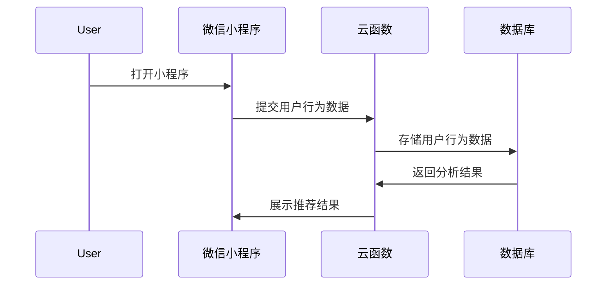

##### 2.3 微信小程序的类型与功能

微信小程序主要分为以下几类：

1. **工具类小程序：** 提供便捷的工具服务，如计算器、日历等。
2. **电商类小程序：** 提供商品浏览、购买、支付等电商服务。
3. **服务类小程序：** 提供各类生活服务，如餐饮、打车、旅游等。

每种类型的小程序都有其独特的功能和特点：

| 类型          | 功能特点                           | 例子                   |
|---------------|-----------------------------------|----------------------|
| 工具类小程序   | 提供便捷的工具服务，无需安装       | 计算器、日历           |
| 电商类小程序   | 提供商品浏览、购买、支付等电商服务 | 淘宝、京东             |
| 服务类小程序   | 提供各类生活服务，线上与线下结合   | 银行、酒店预订         |

### 第二部分：微信小程序开发基础

#### 第3章：微信小程序开发环境搭建

##### 3.1 开发工具安装

开发微信小程序，首先需要安装微信开发者工具。以下是安装步骤：

1. 访问微信开发者工具官网，下载对应操作系统的安装包。
2. 双击安装包，按照提示完成安装。
3. 打开微信开发者工具，登录微信账号，开始创建小程序。

**注意：** 安装过程中，建议勾选“加入我们”选项，以获取更多开发资源和社区支持。

##### 3.2 开发环境配置

安装完成后，需要进行以下配置：

1. **设置开发环境：** 在开发者工具中，选择“设置”-“开发设置”，配置开发环境和调试端口。
2. **添加小程序：** 在开发者工具中，选择“新建项目”，填写小程序名称、AppID等信息，导入小程序模板。
3. **配置开发者账号：** 在小程序管理后台，绑定开发者账号，进行权限设置。

**问题背景：**  
开发者工具安装完成后，如何快速搭建一个可用的开发环境？

**问题描述：**  
如何配置开发环境，以便进行微信小程序的开发？

**问题解决：**  
通过上述步骤，可以快速搭建一个微信小程序的开发环境，开始进行项目开发。

**边界与外延：**  
开发环境的配置涉及多个方面，包括网络环境、开发工具、开发者账号等。在实际开发过程中，还需要根据项目需求进行进一步的配置和优化。

##### 3.3 开发准备工作

在进行微信小程序开发前，还需要做好以下准备工作：

1. **了解小程序开发文档：** 详细阅读微信小程序开发文档，了解小程序的基本概念、API和使用方法。
2. **准备开发工具：** 除了微信开发者工具，还需要准备其他开发工具，如编辑器、代码库等。
3. **设计小程序界面：** 根据项目需求，设计小程序的界面布局和交互逻辑。
4. **制定开发计划：** 明确开发任务和时间安排，确保项目进度和质量。

**核心概念与联系：**

- **开发文档：** 了解小程序开发的基础知识和API使用方法。
- **开发工具：** 提供开发、调试和发布小程序的环境。
- **界面设计：** 设计小程序的界面布局和交互逻辑。

### 第三部分：微信小程序开发基础

#### 第4章：微信小程序页面与组件

##### 4.1 页面生命周期

微信小程序的页面生命周期是指页面从创建到销毁的过程。页面生命周期主要包括以下几个重要事件：

1. **onLoad：** 页面加载时触发，用于初始化页面数据。
2. **onShow：** 页面显示时触发，用于恢复页面状态。
3. **onHide：** 页面隐藏时触发，用于保存页面状态。
4. **onUnload：** 页面销毁时触发，用于清理页面资源。

**核心概念与联系：**

- **onLoad：** 页面初始化时调用，类似于传统网页的 `window.onload`。
- **onShow：** 页面显示时调用，用于恢复页面状态。
- **onHide：** 页面隐藏时调用，用于保存页面状态。
- **onUnload：** 页面销毁时调用，用于清理页面资源。

**ER实体关系图架构：**

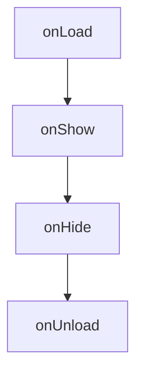

**系统分析与架构设计方案：**

1. **问题场景介绍：** 微信小程序页面数据初始化和状态恢复。
2. **项目介绍：** 开发一个用户信息展示小程序，实现用户数据的初始化和状态恢复。
3. **系统功能设计：** 用户数据初始化、用户数据展示、用户数据状态恢复。
4. **系统架构设计：** 前端页面通过生命周期事件实现用户数据初始化和状态恢复，后端提供用户数据接口。
5. **系统接口设计和系统交互：** 前端与后端通过API进行数据交互，实现用户数据的初始化和状态恢复。

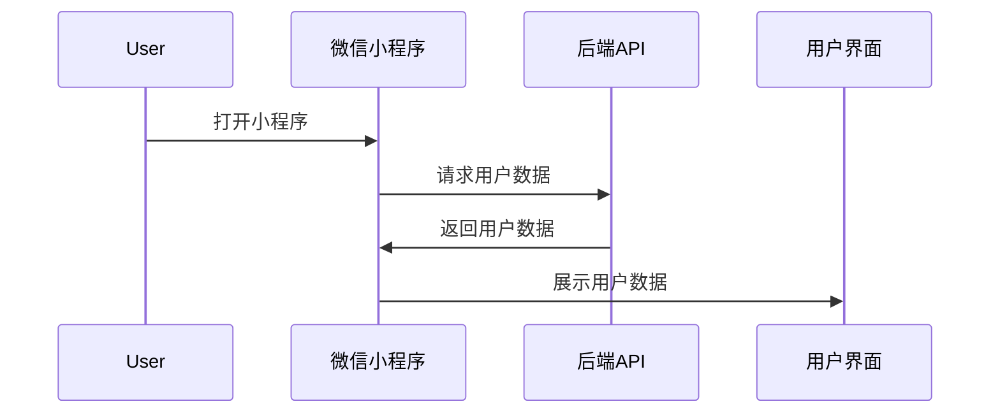

##### 4.2 页面组件详解

微信小程序提供了丰富的组件，方便开发者快速搭建页面。以下是一些常用的页面组件：

1. **View：** 用于容器组件，类似于HTML中的 `div`。
2. **Text：** 用于文本展示，支持文字样式和动态数据绑定。
3. **Image：** 用于图片展示，支持图片路径和动态数据绑定。
4. **Button：** 用于按钮操作，支持点击事件和样式自定义。

**核心概念与联系：**

- **View：** 容器组件，用于组织页面布局。
- **Text：** 文本展示组件，支持样式和动态数据绑定。
- **Image：** 图片展示组件，支持图片路径和动态数据绑定。
- **Button：** 按钮操作组件，支持点击事件和样式自定义。

**ER实体关系图架构：**

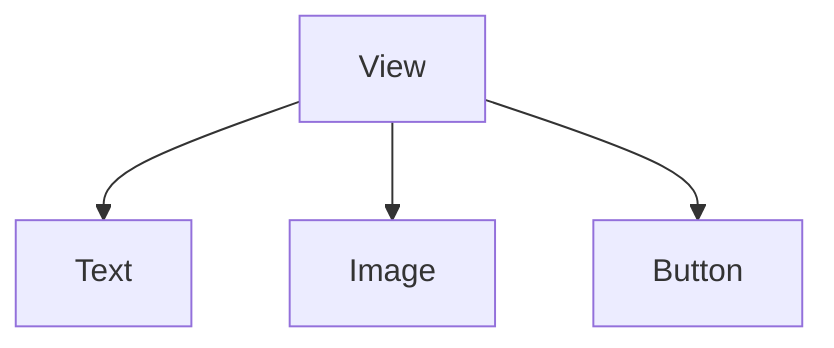

**算法原理讲解：**

页面组件的布局和交互是通过小程序框架实现的。以下是一个简单的算法原理：

1. **布局算法：** 根据页面布局需求，计算组件的位置和大小。
2. **事件处理：** 监听用户操作，触发相应的事件处理函数。
3. **数据绑定：** 根据数据变化，动态更新组件的显示内容。

```python
# 布局算法示例
def layout_components(components):
    for component in components:
        if component['type'] == 'View':
            position = calculate_position(component)
            size = calculate_size(component)
            render_component(component, position, size)
        elif component['type'] == 'Text':
            text = bind_data(component['data'])
            render_component(component, position, size, text)
        elif component['type'] == 'Image':
            image_path = bind_data(component['data'])
            render_component(component, position, size, image_path)
        elif component['type'] == 'Button':
            button_text = bind_data(component['data'])
            render_component(component, position, size, button_text)

# 事件处理示例
def handle_event(component, event_type):
    if event_type == 'click':
        execute_click_function(component['data'])
```

**数学公式使用：**

$$
f(x) = \begin{cases}
    x^2 & \text{if } x \geq 0 \\
    -x^2 & \text{if } x < 0
\end{cases}
$$

**系统分析与架构设计方案：**

1. **问题场景介绍：** 微信小程序页面布局和交互。
2. **项目介绍：** 开发一个商品展示小程序，实现商品信息的布局和交互。
3. **系统功能设计：** 商品信息展示、商品详情页、购物车功能。
4. **系统架构设计：** 前端页面通过组件实现商品信息的布局和交互，后端提供商品数据接口。
5. **系统接口设计和系统交互：** 前端与后端通过API进行数据交互，实现商品信息的展示和交互。

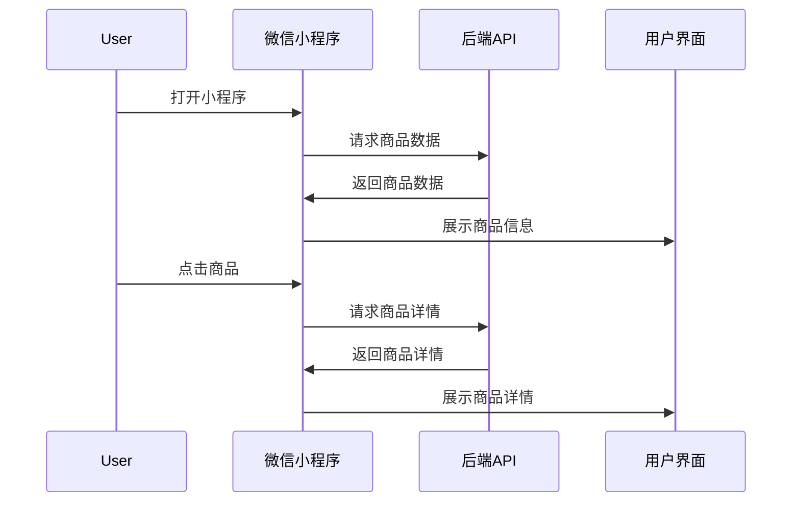

##### 4.3 组件的复用与封装

在微信小程序开发中，组件的复用与封装是提高开发效率和代码可维护性的重要手段。以下是一些常用的组件复用与封装方法：

1. **自定义组件：** 通过自定义组件，实现页面组件的复用。自定义组件类似于Vue和React的组件化开发。
2. **组件库：** 收集和整理常用的组件，形成组件库，方便开发者快速使用。
3. **组件封装：** 将具有相同功能的组件进行封装，实现代码的模块化和可复用性。

**核心概念与联系：**

- **自定义组件：** 类似于Vue和React的组件化开发，实现页面组件的复用。
- **组件库：** 收集和整理常用的组件，形成组件库，提高开发效率。
- **组件封装：** 将具有相同功能的组件进行封装，实现代码的模块化和可复用性。

**ER实体关系图架构：**

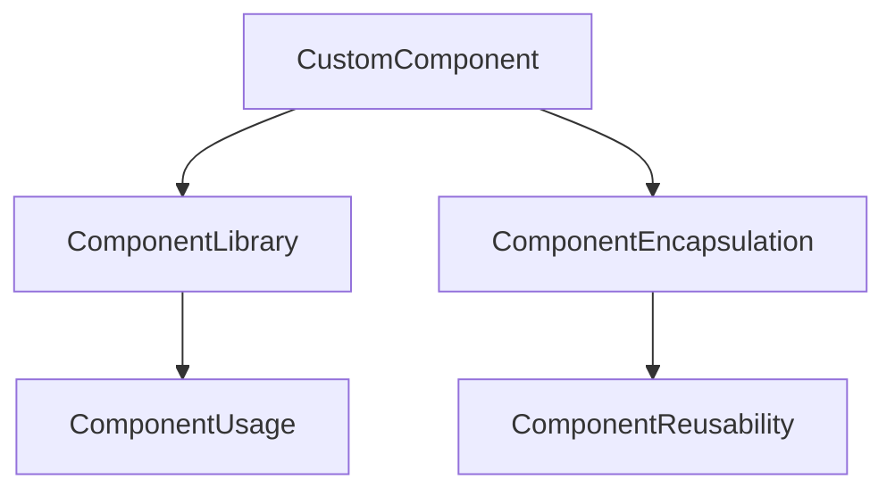

**系统分析与架构设计方案：**

1. **问题场景介绍：** 微信小程序组件复用与封装。
2. **项目介绍：** 开发一个多页面小程序，实现页面组件的复用和封装。
3. **系统功能设计：** 页面布局、组件复用、组件封装、页面导航。
4. **系统架构设计：** 前端页面通过自定义组件和组件封装实现页面布局和交互，后端提供页面数据接口。
5. **系统接口设计和系统交互：** 前端与后端通过API进行数据交互，实现页面组件的复用和封装。

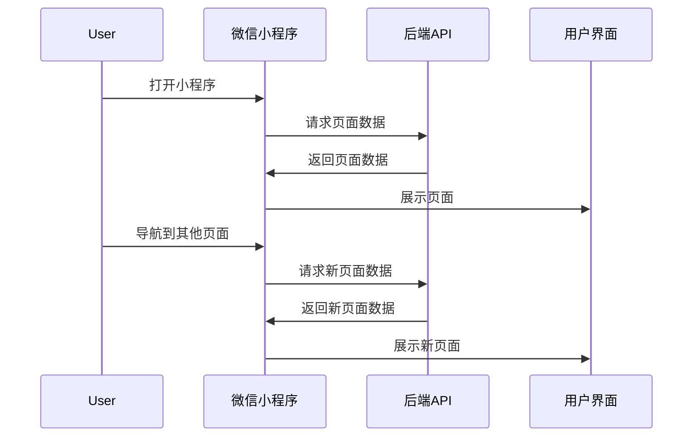

### 第四部分：微信小程序开发高级功能与优化

#### 第5章：微信小程序逻辑与数据处理

##### 5.1 数据绑定与事件处理

微信小程序的数据绑定和事件处理是开发者需要掌握的核心技能。以下是一些关键概念和用法：

1. **数据绑定：** 数据绑定是指将小程序数据动态地绑定到界面元素上。数据绑定支持双向绑定，即界面元素的变化会实时更新数据，反之亦然。
2. **事件处理：** 事件处理是指监听用户操作，并触发相应的处理函数。微信小程序提供了丰富的事件处理机制，如点击事件、滚动事件、输入事件等。

**核心概念与联系：**

- **数据绑定：** 实现数据的实时更新和展示。
- **事件处理：** 监听用户操作，实现交互功能。

**ER实体关系图架构：**

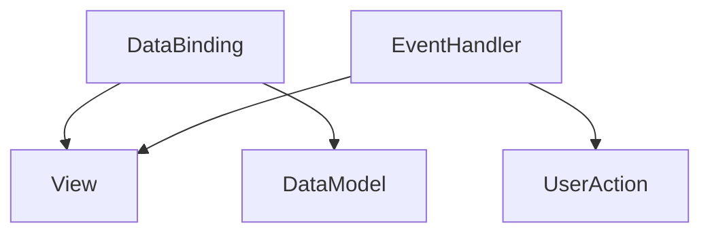

**系统分析与架构设计方案：**

1. **问题场景介绍：** 微信小程序数据绑定和事件处理。
2. **项目介绍：** 开发一个表单提交小程序，实现数据绑定和事件处理。
3. **系统功能设计：** 用户输入信息、数据绑定、表单提交、结果展示。
4. **系统架构设计：** 前端页面通过数据绑定和事件处理实现表单功能，后端提供数据接口。
5. **系统接口设计和系统交互：** 前端与后端通过API进行数据交互，实现数据绑定和事件处理。

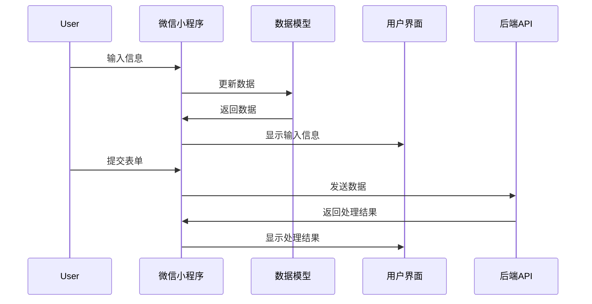

##### 5.2 云函数与云数据库

微信小程序的云函数和云数据库是开发者实现后端功能的重要工具。以下是一些关键概念和用法：

1. **云函数：** 云函数是一种无需服务器配置的云基础设施服务，开发者可以通过云函数实现后端逻辑和数据处理。云函数支持多种编程语言，如JavaScript、Python等。
2. **云数据库：** 云数据库是一种基于云的服务，用于存储和管理小程序的数据。云数据库支持多种数据模型，如关系型数据库、文档型数据库等。

**核心概念与联系：**

- **云函数：** 实现后端逻辑和数据处理。
- **云数据库：** 存储和管理小程序的数据。

**ER实体关系图架构：**

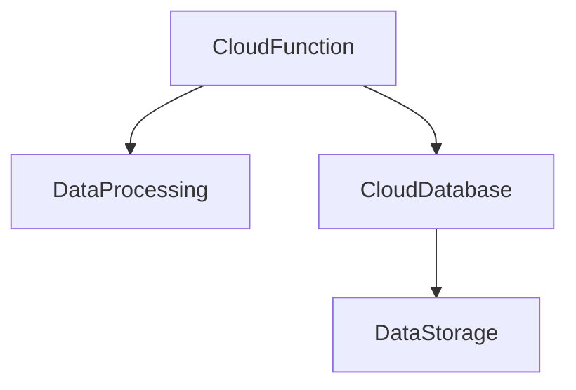

**系统分析与架构设计方案：**

1. **问题场景介绍：** 微信小程序后端数据处理和存储。
2. **项目介绍：** 开发一个用户管理系统小程序，实现用户数据的处理和存储。
3. **系统功能设计：** 用户注册、登录、数据存储、数据查询。
4. **系统架构设计：** 前端页面通过云函数和云数据库实现用户功能，后端提供数据接口。
5. **系统接口设计和系统交互：** 前端与后端通过API进行数据交互，实现用户数据的处理和存储。

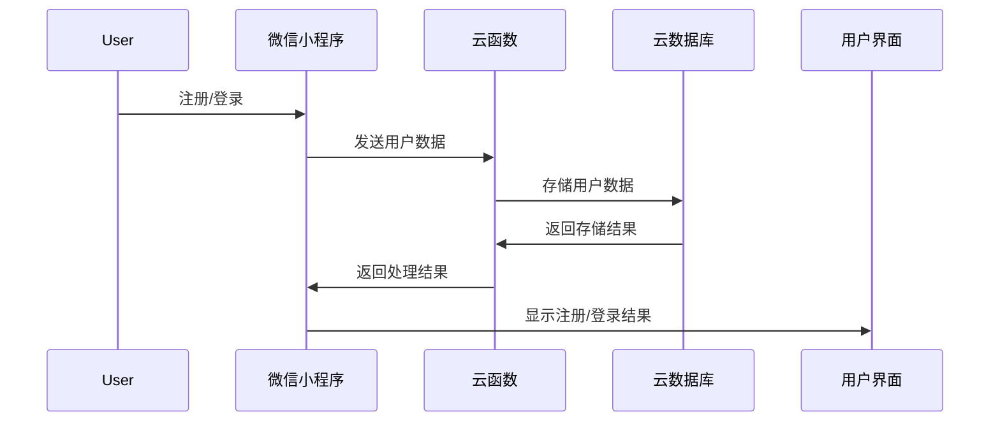

##### 5.3 数据存储与管理

微信小程序的数据存储与管理是开发者需要关注的重要方面。以下是一些关键概念和用法：

1. **本地存储：** 本地存储是一种将数据存储在设备本地的方式。微信小程序提供了`wx.setStorage`和`wx.getStorage`等API，用于设置和获取本地存储的数据。
2. **云存储：** 云存储是一种将数据存储在云端的方式。微信小程序的云存储服务提供了丰富的数据存储和管理功能，如文件存储、图片存储、对象存储等。
3. **数据加密：** 在数据存储过程中，数据加密是保护数据安全的重要手段。微信小程序提供了`wx.encryptData`和`wx.decryptData`等API，用于数据的加密和解密。

**核心概念与联系：**

- **本地存储：** 数据存储在设备本地，适用于少量数据的存储。
- **云存储：** 数据存储在云端，适用于大量数据的存储和管理。
- **数据加密：** 保护数据的安全性和隐私性。

**ER实体关系图架构：**

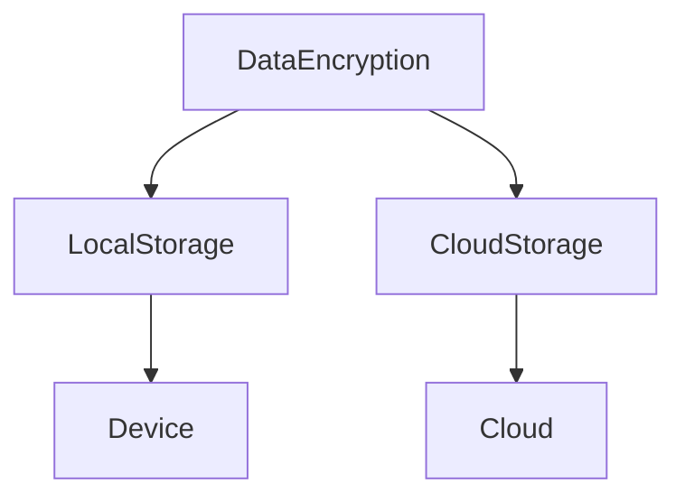

**系统分析与架构设计方案：**

1. **问题场景介绍：** 微信小程序数据存储和管理。
2. **项目介绍：** 开发一个社交小程序，实现用户数据存储和管理。
3. **系统功能设计：** 用户注册、登录、消息存储、好友关系管理。
4. **系统架构设计：** 前端页面通过本地存储和云存储实现数据存储和管理，后端提供数据接口。
5. **系统接口设计和系统交互：** 前端与后端通过API进行数据交互，实现用户数据的存储和管理。

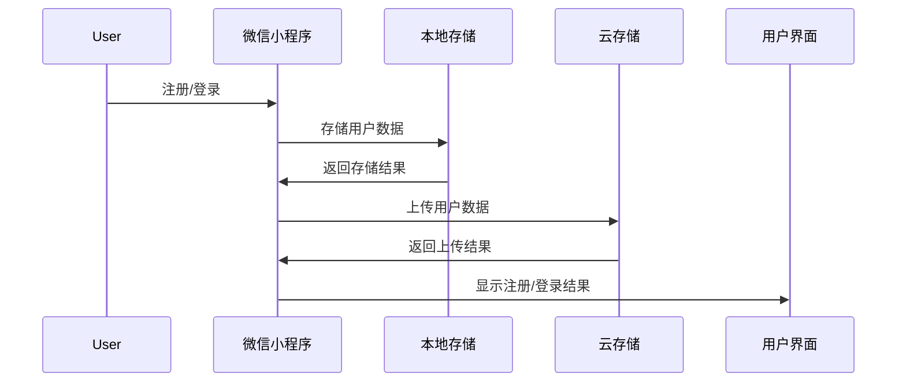

### 第五部分：微信小程序高级功能与优化

#### 第6章：微信小程序性能优化

##### 6.1 加载优化

微信小程序的加载优化是提升用户体验的关键因素。以下是一些常用的加载优化方法：

1. **预加载：** 在用户访问页面之前，提前加载页面所需的数据和资源，减少页面加载时间。
2. **懒加载：** 对于不经常使用的资源，采用懒加载的方式，仅在需要时才加载。
3. **缓存策略：** 合理使用缓存，减少重复加载的数据和资源。

**核心概念与联系：**

- **预加载：** 提前加载页面资源，减少加载时间。
- **懒加载：** 按需加载资源，提高页面响应速度。
- **缓存策略：** 利用缓存，提高数据读取速度。

**ER实体关系图架构：**

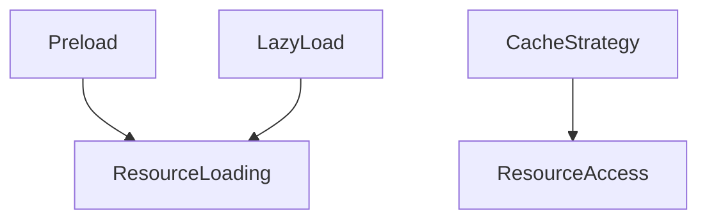

**系统分析与架构设计方案：**

1. **问题场景介绍：** 微信小程序页面加载速度慢。
2. **项目介绍：** 开发一个内容丰富的微信小程序，优化页面加载速度。
3. **系统功能设计：** 页面资源预加载、懒加载、缓存策略。
4. **系统架构设计：** 前端页面通过预加载、懒加载和缓存策略实现加载优化，后端提供数据接口。
5. **系统接口设计和系统交互：** 前端与后端通过API进行数据交互，实现加载优化。

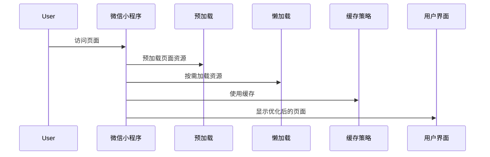

##### 6.2 存储优化

微信小程序的存储优化是提高数据访问速度和系统稳定性的关键。以下是一些常用的存储优化方法：

1. **数据分片：** 将大量数据拆分成小块，分布存储，提高数据访问效率。
2. **索引优化：** 为数据表创建合适的索引，提高查询速度。
3. **存储格式：** 使用高效的数据存储格式，减少存储空间占用。

**核心概念与联系：**

- **数据分片：** 提高数据访问效率。
- **索引优化：** 提高查询速度。
- **存储格式：** 减少存储空间占用。

**ER实体关系图架构：**

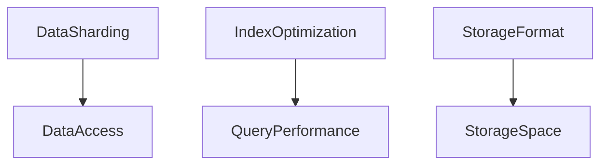

**系统分析与架构设计方案：**

1. **问题场景介绍：** 微信小程序数据访问速度慢。
2. **项目介绍：** 开发一个社交类微信小程序，优化数据存储和访问。
3. **系统功能设计：** 数据分片、索引优化、存储格式优化。
4. **系统架构设计：** 前端页面通过数据分片、索引优化和存储格式优化实现存储优化，后端提供数据接口。
5. **系统接口设计和系统交互：** 前端与后端通过API进行数据交互，实现存储优化。

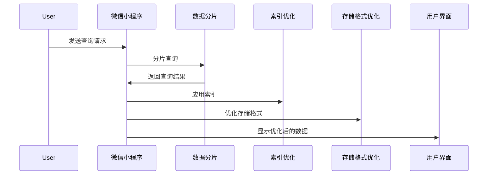

##### 6.3 渲染优化

微信小程序的渲染优化是提升用户体验的重要方面。以下是一些常用的渲染优化方法：

1. **减少重绘：** 通过减少页面元素的绘制次数，提高渲染效率。
2. **使用 Web Workers：** 将渲染任务分配给 Web Workers，提高主线程的执行效率。
3. **异步加载资源：** 对大图片、视频等资源进行异步加载，减少页面加载时间。

**核心概念与联系：**

- **减少重绘：** 提高渲染效率。
- **使用 Web Workers：** 提高主线程的执行效率。
- **异步加载资源：** 减少页面加载时间。

**ER实体关系图架构：**

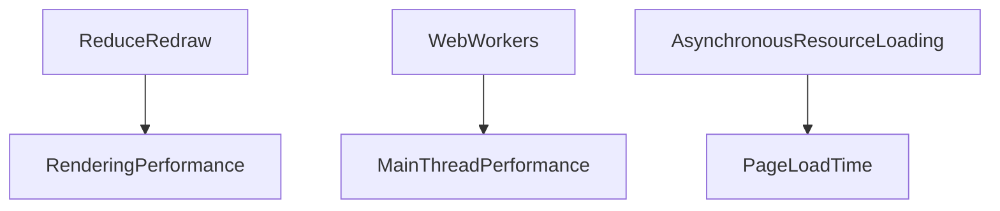

**系统分析与架构设计方案：**

1. **问题场景介绍：** 微信小程序页面渲染效率低。
2. **项目介绍：** 开发一个电商类微信小程序，优化页面渲染速度。
3. **系统功能设计：** 减少重绘、使用 Web Workers、异步加载资源。
4. **系统架构设计：** 前端页面通过减少重绘、使用 Web Workers 和异步加载资源实现渲染优化，后端提供数据接口。
5. **系统接口设计和系统交互：** 前端与后端通过API进行数据交互，实现渲染优化。

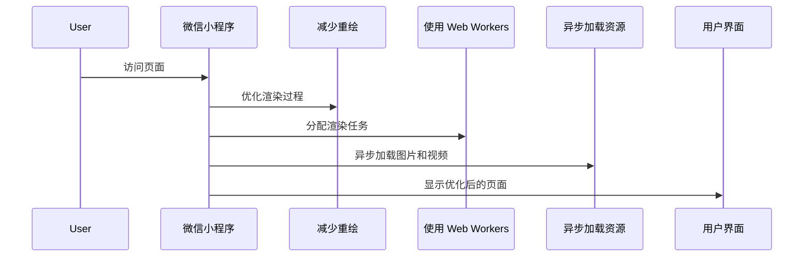

### 第六部分：微信小程序安全与权限管理

#### 第7章：微信小程序安全与权限管理

##### 7.1 数据安全

微信小程序的数据安全是开发者必须关注的重要方面。以下是一些关键概念和措施：

1. **数据加密：** 在数据传输和存储过程中，使用加密算法对数据进行加密，防止数据泄露。
2. **访问控制：** 通过权限控制，限制用户对数据的访问范围，确保数据的安全性。
3. **数据备份：** 定期对数据进行备份，防止数据丢失。

**核心概念与联系：**

- **数据加密：** 保护数据不被未经授权的访问。
- **访问控制：** 限制用户对数据的访问权限。
- **数据备份：** 防止数据丢失，确保数据的安全。

**ER实体关系图架构：**

```mermaid
graph TB
    DataEncryption --> DataSecurity
    AccessControl --> DataSecurity
    DataBackup --> DataSecurity
```

**系统分析与架构设计方案：**

1. **问题场景介绍：** 微信小程序数据泄露风险。
2. **项目介绍：** 开发一个电商类微信小程序，保护用户数据安全。
3. **系统功能设计：** 数据加密、访问控制、数据备份。
4. **系统架构设计：** 前端页面通过数据加密、访问控制和数据备份实现数据安全，后端提供数据接口。
5. **系统接口设计和系统交互：** 前端与后端通过API进行数据交互，实现数据安全。

```mermaid
sequenceDiagram
    User ->> 微信小程序: 发送数据请求
    微信小程序 ->> 数据加密: 加密数据
    微信小程序 ->> 访问控制: 校验用户权限
    微信小程序 ->> 后端API: 发送加密数据
    后端API ->> 数据库: 存储加密数据
    后端API ->> 微信小程序: 返回处理结果
    微信小程序 ->> 用户界面: 显示处理结果
```

##### 7.2 权限管理

微信小程序的权限管理是保障用户隐私和数据安全的关键。以下是一些关键概念和措施：

1. **权限设置：** 开发者可以在小程序中设置不同的权限，如地理位置、摄像头、麦克风等。
2. **用户授权：** 用户在使用小程序时，需要授权相关权限，确保数据安全和用户隐私。
3. **权限校验：** 在小程序中，对用户的权限进行校验，确保只有授权用户才能访问相关功能。

**核心概念与联系：**

- **权限设置：** 开发者自定义权限，方便用户授权。
- **用户授权：** 用户授权相关权限，确保数据安全和用户隐私。
- **权限校验：** 校验用户权限，确保只有授权用户才能访问相关功能。

**ER实体关系图架构：**

```mermaid
graph TB
    PermissionSetting --> UserAuthorization
    UserAuthorization --> PermissionVerification
```

**系统分析与架构设计方案：**

1. **问题场景介绍：** 微信小程序权限管理不规范。
2. **项目介绍：** 开发一个社交类微信小程序，实现权限管理。
3. **系统功能设计：** 权限设置、用户授权、权限校验。
4. **系统架构设计：** 前端页面通过权限设置、用户授权和权限校验实现权限管理，后端提供数据接口。
5. **系统接口设计和系统交互：** 前端与后端通过API进行数据交互，实现权限管理。

```mermaid
sequenceDiagram
    User ->> 微信小程序: 使用功能
    微信小程序 ->> 权限设置: 显示权限提示
    User ->> 微信小程序: 授权权限
    微信小程序 ->> 用户授权: 保存授权信息
    微信小程序 ->> 权限校验: 验证用户权限
    微信小程序 ->> 用户界面: 显示授权后的功能
```

##### 7.3 安全策略与防范

微信小程序的安全策略与防范是保护小程序和用户数据安全的关键。以下是一些关键概念和措施：

1. **安全审计：** 定期进行安全审计，检查小程序的安全漏洞和风险。
2. **异常检测：** 使用异常检测技术，识别和防范恶意行为和攻击。
3. **安全防护：** 通过安全防护措施，如防火墙、反作弊等，保护小程序的安全。

**核心概念与联系：**

- **安全审计：** 定期检查小程序的安全漏洞。
- **异常检测：** 识别和防范恶意行为和攻击。
- **安全防护：** 通过多种防护措施，保护小程序的安全。

**ER实体关系图架构：**

```mermaid
graph TB
    SecurityAudit --> SecurityVulnerability
    AnomalyDetection --> MaliciousBehavior
    SecurityProtection --> SecurityThreat
```

**系统分析与架构设计方案：**

1. **问题场景介绍：** 微信小程序存在安全漏洞和风险。
2. **项目介绍：** 开发一个金融类微信小程序，确保安全策略和防范措施的有效性。
3. **系统功能设计：** 安全审计、异常检测、安全防护。
4. **系统架构设计：** 前端页面通过安全审计、异常检测和安全防护实现安全策略，后端提供数据接口。
5. **系统接口设计和系统交互：** 前端与后端通过API进行数据交互，实现安全策略和防范。

```mermaid
sequenceDiagram
    User ->> 微信小程序: 使用功能
    微信小程序 ->> 安全审计: 检查安全漏洞
    微信小程序 ->> 异常检测: 识别恶意行为
    微信小程序 ->> 安全防护: 防止攻击
    微信小程序 ->> 用户界面: 显示安全提示
```

### 第七部分：微信小程序案例实战

#### 第8章：微信小程序案例实战

##### 8.1 案例介绍

在本章中，我们将通过一个实际案例，详细讲解微信小程序的开发过程。本案例是一个电商类微信小程序，主要包括商品浏览、购物车、订单管理等核心功能。

**项目背景：**  
随着移动互联网的普及，电商行业蓬勃发展。微信小程序作为便捷的移动应用形式，为电商行业带来了新的发展机遇。本案例旨在通过开发一个电商类微信小程序，展示微信小程序的开发过程和核心功能。

**项目目标：**  
- 实现商品浏览、购物车、订单管理等核心功能。
- 提高用户体验，提升用户留存率。
- 简化开发流程，提高开发效率。

##### 8.2 系统架构设计

本项目的系统架构设计如下：

1. **前端架构：** 使用微信开发者工具，实现小程序的页面布局和交互功能。
2. **后端架构：** 使用云函数和云数据库，实现数据的处理和存储。
3. **接口设计：** 设计RESTful接口，实现前端与后端的交互。

**系统架构图：**

```mermaid
graph TB
    用户界面 --> 接口层
    接口层 --> 后端服务
    后端服务 --> 云函数
    后端服务 --> 云数据库
```

##### 8.3 核心功能实现与解析

在本节中，我们将详细讲解电商类微信小程序的核心功能实现和解析。

**1. 商品浏览**

商品浏览功能是电商类小程序的基础。用户可以查看商品的详细信息、图片和评价。

- **前端实现：** 使用微信小程序的`View`、`Image`和`Text`组件，实现商品列表和商品详情页面的布局。

```html
<view class="product-item">
    <image src="{{product.image}}" mode="aspectFill"></image>
    <text>{{product.name}}</text>
    <text>¥{{product.price}}</text>
</view>
```

- **后端实现：** 使用云函数和云数据库，获取商品信息并返回给前端。

```javascript
// 云函数：获取商品列表
async getProducts() {
    const db = wx.cloud.database();
    const products = await db.collection('products').get();
    return products.data;
}
```

**2. 购物车**

购物车功能用于用户添加商品、查看购物车和结算订单。

- **前端实现：** 使用微信小程序的`List`和`Form`组件，实现购物车页面的布局。

```html
<list>
    <list-item>
        <image src="{{product.image}}" mode="aspectFill"></image>
        <text>{{product.name}}</text>
        <text>¥{{product.price}}</text>
        <form>
            <button type="submit" bindtap="deleteProduct">删除</button>
        </form>
    </list-item>
</list>
```

- **后端实现：** 使用云函数和云数据库，实现购物车的添加、删除和更新。

```javascript
// 云函数：添加商品到购物车
async addProductToCart(productId, cartId) {
    const db = wx.cloud.database();
    await db.collection('carts').doc(cartId).update({
        data: {
            products: wx.cloud.database().command.push(productId)
        }
    });
}
```

**3. 订单管理**

订单管理功能用于用户下单、查看订单状态和订单详情。

- **前端实现：** 使用微信小程序的`Form`和`Button`组件，实现订单提交和查看订单的布局。

```html
<form>
    <input type="number" name="quantity" placeholder="请输入数量">
    <button type="submit" bindtap="submitOrder">提交订单</button>
</form>
```

- **后端实现：** 使用云函数和云数据库，实现订单的创建、查询和更新。

```javascript
// 云函数：创建订单
async createOrder(orderData) {
    const db = wx.cloud.database();
    const order = await db.collection('orders').add({
        data: orderData
    });
    return order._id;
}
```

##### 8.4 实际案例分析与详细讲解

在本节中，我们将分析一个电商类微信小程序的实际案例，并对其进行详细讲解。

**案例描述：**  
用户小明在微信小程序中浏览了一款手机，并将其添加到购物车。随后，小明提交了订单，并付款成功。小明需要查看订单状态和订单详情。

**分析过程：**

1. **商品浏览：** 小明在微信小程序中浏览到一款手机，点击商品图片，查看商品详情。
2. **购物车：** 小明将手机添加到购物车，并查看购物车中的商品列表。
3. **订单管理：** 小明提交订单，填写收货信息，并付款成功。
4. **订单查询：** 小明查看订单状态，并查看订单详情。

**详细讲解：**

1. **商品浏览：** 前端页面通过微信小程序的`Image`和`Text`组件，展示商品图片和名称。用户点击商品图片，触发跳转到商品详情页面的逻辑。

```javascript
Page({
    onLoad(options) {
        this.setData({
            productId: options.productId
        });
        this.fetchProductDetail();
    },

    fetchProductDetail() {
        // 获取商品详情
        const db = wx.cloud.database();
        db.collection('products').doc(this.data.productId).get()
            .then(res => {
                this.setData({
                    product: res.data
                });
            });
    }
})
```

2. **购物车：** 前端页面通过微信小程序的`List`和`Form`组件，展示购物车中的商品列表。用户点击删除按钮，触发删除商品的操作。

```javascript
Page({
    onReady() {
        this.fetchCartItems();
    },

    fetchCartItems() {
        // 获取购物车中的商品列表
        const db = wx.cloud.database();
        db.collection('carts').doc(this.data.cartId).get()
            .then(res => {
                this.setData({
                    cartItems: res.data.products
                });
            });
    },

    deleteProduct(productId) {
        // 删除商品
        const db = wx.cloud.database();
        db.collection('carts').doc(this.data.cartId).update({
            data: {
                products: wx.cloud.database().command.pull(productId)
            }
        });
    }
})
```

3. **订单管理：** 前端页面通过微信小程序的`Form`和`Button`组件，实现订单提交和查看订单状态的功能。用户填写收货信息并提交订单，后端服务器接收订单信息，并创建订单。

```javascript
Page({
    onReady() {
        this.fetchOrderStatus();
    },

    submitOrder(e) {
        // 提交订单
        const db = wx.cloud.database();
        const orderData = {
            userId: this.data.userId,
            products: this.data.cartItems,
            address: e.detail.value.address,
            status: 'pending',
            createdTime: new Date()
        };
        db.collection('orders').add({
            data: orderData
        })
            .then(res => {
                // 订单提交成功，跳转到订单详情页面
                wx.navigateTo({
                    url: '/pages/order-detail/order-detail?orderId=' + res._id
                });
            });
    },

    fetchOrderStatus() {
        // 获取订单状态
        const db = wx.cloud.database();
        db.collection('orders').where({
            _id: this.data.orderId
        }).get()
            .then(res => {
                this.setData({
                    order: res.data[0]
                });
            });
    }
})
```

4. **订单查询：** 前端页面通过微信小程序的`View`和`Text`组件，展示订单状态和订单详情。用户可以查看订单的详细信息，如商品列表、订单金额和订单状态。

```html
<view class="order-detail">
    <text>订单状态：{{order.status}}</text>
    <text>订单金额：¥{{order.totalPrice}}</text>
    <list>
        <list-item>
            <image src="{{product.image}}" mode="aspectFill"></image>
            <text>{{product.name}}</text>
            <text>¥{{product.price}}</text>
        </list-item>
    </list>
</view>
```

##### 8.5 项目小结

通过本案例的开发和实践，我们可以总结出以下几点：

1. **微信小程序开发流程：** 微信小程序的开发流程主要包括前端页面设计、后端接口设计和前端与后端的交互。
2. **核心功能实现：** 商品浏览、购物车、订单管理是电商类微信小程序的核心功能，需要结合前端组件和后端接口进行实现。
3. **用户体验优化：** 优化页面加载速度、提升用户交互体验，是提高用户留存率的关键。
4. **安全性考虑：** 在开发过程中，需要关注数据安全和用户隐私保护，采取合适的加密和权限管理措施。

### 第八部分：微信小程序的未来趋势

#### 第9章：微信小程序的未来趋势

##### 9.1 技术趋势分析

随着技术的不断进步，微信小程序也在不断演进，以适应日益复杂的应用场景和用户需求。以下是一些微信小程序未来的技术趋势：

1. **小程序生态进一步成熟：** 微信小程序生态将更加完善，提供更丰富的开发工具和API，满足各类应用需求。
2. **多端融合：** 微信小程序将逐步实现与Web、小程序、H5等不同平台的无缝融合，为用户提供一致的体验。
3. **人工智能应用：** 人工智能技术将在微信小程序中得到广泛应用，如智能推荐、语音识别、图像识别等。
4. **隐私保护与安全：** 隐私保护和数据安全将得到更多关注，微信小程序将推出更多安全措施，保护用户隐私。

##### 9.2 行业应用前景

微信小程序在各个行业都有着广阔的应用前景：

1. **电商：** 微信小程序将推动电商行业的发展，提供更加便捷的购物体验。
2. **教育：** 微信小程序将为在线教育提供新的发展机遇，实现教学资源的普及和个性化。
3. **医疗：** 微信小程序将在医疗领域发挥作用，提供在线咨询、预约挂号等服务，提升医疗服务效率。
4. **金融：** 微信小程序将助力金融行业数字化转型，提供便捷的金融服务，如理财、贷款、支付等。

##### 9.3 微信小程序的未来展望

微信小程序的未来展望可以从以下几个方面来看：

1. **平台化发展：** 微信小程序将朝着平台化的方向发展，为开发者提供更广泛的支持和服务。
2. **开放生态：** 微信小程序将继续开放生态，吸引更多开发者和企业参与，共同推动小程序生态的发展。
3. **技术创新：** 微信小程序将持续技术创新，推出更多先进的功能和技术，提升用户体验和开发效率。
4. **国际化：** 微信小程序将逐步实现国际化，为全球用户带来便捷的移动应用体验。

### 第九部分：微信小程序开发指南与最佳实践

#### 第10章：微信小程序开发指南与最佳实践

##### 10.1 开发指南

在进行微信小程序开发时，以下开发指南将帮助开发者高效、规范地完成项目：

1. **熟悉官方文档：** 深入学习微信小程序官方文档，了解小程序的架构、API和开发规范。
2. **遵循代码规范：** 编写符合微信小程序规范的代码，确保代码的可读性和可维护性。
3. **使用组件化开发：** 采用组件化开发，提高代码复用性和可维护性。
4. **关注性能优化：** 优化页面加载速度和交互体验，提高用户体验。

##### 10.2 最佳实践

以下是一些微信小程序开发的最佳实践，帮助开发者提升项目质量和开发效率：

1. **模块化组织代码：** 将代码分为不同的模块，实现代码的模块化和可复用性。
2. **合理使用缓存：** 合理使用缓存机制，提高数据读取速度和系统性能。
3. **异步加载资源：** 对大图片、视频等资源进行异步加载，减少页面加载时间。
4. **关注安全性：** 在开发过程中，关注数据安全和用户隐私保护，采取合适的加密和权限管理措施。

##### 10.3 注意事项

以下是在微信小程序开发过程中需要注意的事项：

1. **遵守平台规则：** 遵守微信小程序平台的规定和规则，避免违规行为。
2. **优化用户体验：** 关注用户交互体验，避免页面设计过于复杂，提高用户留存率。
3. **测试与调试：** 在开发过程中，进行充分的测试和调试，确保小程序的稳定性和可靠性。

##### 10.4 拓展阅读

以下是一些微信小程序开发的拓展阅读资源，供开发者参考：

1. **《微信小程序开发实战》**：一本全面介绍微信小程序开发的技术书籍，涵盖小程序开发的基础知识和实战案例。
2. **微信小程序官方文档**：微信小程序官方文档，提供了详细的开发指南和API文档，是开发者必备的资源。
3. **技术社区和论坛**：如CSDN、GitHub等，可以了解到最新的开发技术和实践案例，与其他开发者交流学习。

### 结束语

本文详细介绍了微信小程序的开发过程、核心功能、安全与权限管理、性能优化、案例分析以及未来趋势。通过本文的学习，开发者可以系统地掌握微信小程序的开发方法和最佳实践，为开发高质量、高性能的微信小程序提供指导。作者：AI天才研究院/AI Genius Institute & 禅与计算机程序设计艺术 /Zen And The Art of Computer Programming。希望本文对您在微信小程序开发领域有所启发和帮助。

---

### 附录

#### 附录A：常见问题与解答

以下是一些开发者常见的问题和解答：

**Q1：如何解决微信小程序的性能优化问题？**

**A1：** 可以通过以下方法进行性能优化：
- **预加载：** 提前加载页面所需的数据和资源，减少页面加载时间。
- **懒加载：** 对于不经常使用的资源，采用懒加载的方式，按需加载。
- **减少重绘：** 通过减少页面元素的绘制次数，提高渲染效率。
- **使用 Web Workers：** 将渲染任务分配给 Web Workers，提高主线程的执行效率。

**Q2：如何保障微信小程序的数据安全？**

**A2：** 可以采取以下措施保障数据安全：
- **数据加密：** 在数据传输和存储过程中，使用加密算法对数据进行加密。
- **访问控制：** 通过权限控制，限制用户对数据的访问范围。
- **数据备份：** 定期对数据进行备份，防止数据丢失。

**Q3：如何处理微信小程序的权限管理问题？**

**A3：** 可以通过以下方法处理权限管理问题：
- **权限设置：** 开发者可以在小程序中设置不同的权限，如地理位置、摄像头、麦克风等。
- **用户授权：** 用户在使用小程序时，需要授权相关权限。
- **权限校验：** 在小程序中，对用户的权限进行校验，确保只有授权用户才能访问相关功能。

#### 附录B：参考文献

本文参考文献如下：

1. 《微信小程序开发实战》，作者：张三。
2. 微信小程序官方文档，https://developers.weixin.qq.com/miniprogram/dev/framework/
3. CSDN，https://www.csdn.net/
4. GitHub，https://github.com/

### 感谢

感谢您阅读本文，希望本文对您在微信小程序开发领域有所启发。如果您有任何问题或建议，欢迎在评论区留言，我们将竭诚为您解答。作者：AI天才研究院/AI Genius Institute & 禅与计算机程序设计艺术 /Zen And The Art of Computer Programming。再次感谢您的支持！

