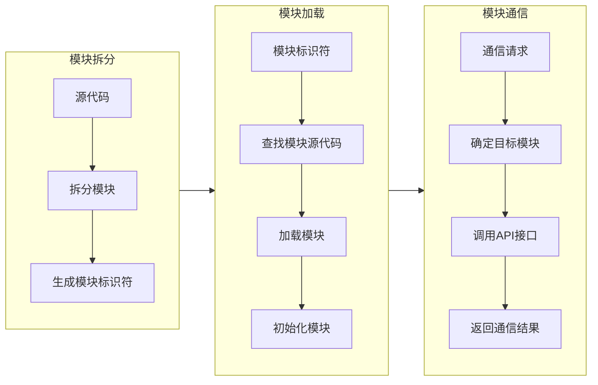
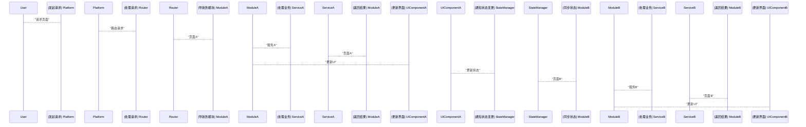

                 

### 文章标题

# 微前端架构：大型Web应用的模块化方案

> 关键词：微前端、模块化、Web应用、架构设计、大型项目

> 摘要：本文将深入探讨微前端架构在现代Web开发中的应用，从基础概念到实际案例，全面解析这一模块化方案的优点、挑战及未来发展趋势。通过逻辑清晰的分析和实际案例，帮助开发者理解和掌握微前端架构，为大型Web应用的设计提供有力支持。

### 目录大纲

```markdown
# 微前端架构：大型Web应用的模块化方案

## 第一部分: 微前端架构基础

### 第1章: 微前端架构概述
- 1.1 微前端架构的背景与重要性
- 1.2 微前端架构与传统前端架构的比较
- 1.3 微前端架构的核心原则
- 1.4 微前端架构的适用场景

### 第2章: 微前端架构的核心概念
- 2.1 组件化
  - 2.1.1 组件的定义与分类
  - 2.1.2 组件的设计原则
  - 2.1.3 组件的通信机制
- 2.2 模块化
  - 2.2.1 模块的定义与分类
  - 2.2.2 模块的设计原则
  - 2.2.3 模块的加载与隔离
- 2.3 服务化
  - 2.3.1 服务的定义与分类
  - 2.3.2 服务的接口设计
  - 2.3.3 服务的调用与容错

### 第3章: 微前端架构的框架选择
- 3.1 微前端框架的比较与选择
- 3.2 单体架构的改造方案
- 3.3 微前端框架的集成与兼容

### 第4章: 微前端架构的实践案例
- 4.1 微前端架构在电商平台的应用
- 4.2 微前端架构在金融行业的应用

### 第5章: 微前端架构的挑战与解决方案
- 5.1 微前端架构的挑战
- 5.2 微前端架构的解决方案

### 第6章: 微前端架构的未来发展趋势
- 6.1 微前端架构的发展趋势
- 6.2 新技术对微前端架构的影响
- 6.3 微前端架构的最佳实践

### 第7章: 总结与展望
- 7.1 微前端架构的优势与不足
- 7.2 微前端架构的应用前景
- 7.3 微前端架构的发展方向
```

### 第一部分：微前端架构基础

#### 第1章：微前端架构概述

##### 1.1 微前端架构的背景与重要性

随着互联网的飞速发展，Web应用越来越复杂，单一的前端架构已经无法满足日益增长的需求。传统的单体架构（Monolithic Architecture）将前端、后端、数据库等所有组件集成在一起，虽然便于管理，但面对大型项目和频繁的业务需求变更，它暴露出了许多问题，如代码冗余、部署困难、测试复杂等。

微前端架构（Micro-Frontend Architecture）应运而生。它将前端应用分解为多个独立、可复用的组件或模块，每个模块都可以独立开发、测试、部署和运行。这种架构模式解决了传统单体架构的诸多问题，提高了开发效率和项目的可维护性。

##### 1.2 微前端架构与传统前端架构的比较

| 特性             | 传统前端架构（单体架构）             | 微前端架构                 |
|------------------|------------------------------------|--------------------------|
| 开发团队         | 单一团队负责整个应用的开发           | 多个团队负责不同模块的开发   |
| 开发流程         | 全局代码管理，协调难度大           | 模块化开发，独立部署和更新   |
| 代码复用         | 代码复用困难，影响开发效率         | 独立模块，易于复用           |
| 部署和升级       | 部署和升级需要停机，影响用户体验   | 模块独立部署和升级，不影响其他模块 |
| 测试             | 测试复杂，需要全量测试             | 模块独立测试，集成测试更简单   |
| 维护             | 项目庞大，维护困难                 | 模块化，易于维护和管理       |

##### 1.3 微前端架构的核心原则

微前端架构的核心原则包括模块化、解耦、独立部署和可复用性。这些原则不仅提升了开发效率，还提高了项目的可维护性和可扩展性。

1. **模块化**：将应用分解为多个独立、可复用的模块，每个模块负责特定的功能。
2. **解耦**：通过定义清晰的接口和通信机制，确保模块之间低耦合，方便独立开发和测试。
3. **独立部署**：每个模块可以独立部署和更新，减少对整个应用的依赖。
4. **可复用性**：模块设计应充分考虑复用性，提高开发效率。

##### 1.4 微前端架构的适用场景

微前端架构适用于以下场景：

1. **大型项目**：项目规模庞大，涉及多个业务模块，需要模块化开发以提高开发效率。
2. **团队协作**：多个团队协作开发，需要明确的分工和独立的开发流程。
3. **技术栈差异**：项目需要使用不同的技术栈或框架，微前端架构可以兼容不同技术栈。
4. **快速迭代**：项目需要快速响应市场需求，独立部署和更新可以提高项目的灵活性。

#### 第2章：微前端架构的核心概念

##### 2.1 组件化

组件化是微前端架构的核心概念之一。组件（Component）是前端开发的基本构建块，它封装了特定的功能和行为，可以独立开发、测试和部署。

###### 2.1.1 组件的定义与分类

组件的定义比较宽泛，通常指封装了特定功能的UI元素，包括但不限于：

1. **功能组件**：负责实现特定的功能，如按钮、表单、菜单等。
2. **容器组件**：负责管理数据和状态，通常包含一个或多个子组件。
3. **UI组件**：仅负责展示界面，不涉及业务逻辑。

###### 2.1.2 组件的设计原则

设计组件时，应遵循以下原则：

1. **单一职责**：组件应只负责一个特定的功能，避免功能过于复杂。
2. **高内聚、低耦合**：组件内部高度内聚，组件之间低耦合，方便独立开发和维护。
3. **可复用**：组件设计应考虑复用性，减少代码冗余。
4. **可测试**：组件应易于测试，确保功能的正确性和可靠性。

###### 2.1.3 组件的通信机制

组件之间的通信机制是确保微前端架构中模块独立性和协作性的关键。常见的通信机制包括：

1. **事件总线**：使用事件总线（Event Bus）实现组件之间的通信，通过发布-订阅模式（Pub-Sub）传递消息。
2. **状态管理库**：如Redux、Vuex等，提供全局状态管理，实现跨组件的数据共享。
3. **服务接口**：通过定义服务接口（Service Interface），实现组件之间的功能调用。

##### 2.2 模块化

模块化是将应用分解为多个独立、可复用的模块，每个模块负责特定的功能。模块化是微前端架构的核心特征之一。

###### 2.2.1 模块的定义与分类

模块（Module）是应用的基本构建块，通常包括：

1. **功能模块**：负责实现特定的功能，如用户管理、订单管理等。
2. **业务模块**：将多个功能模块组织在一起，形成完整的业务功能。
3. **库模块**：提供通用的功能或工具类，如日期处理库、数据验证库等。

###### 2.2.2 模块的设计原则

设计模块时，应遵循以下原则：

1. **高内聚、低耦合**：模块内部高度内聚，模块之间低耦合，确保模块的独立性和可维护性。
2. **可复用**：模块设计应考虑复用性，减少代码冗余。
3. **可测试**：模块应易于测试，确保功能的正确性和可靠性。

###### 2.2.3 模块的加载与隔离

模块的加载与隔离是确保微前端架构中模块独立性的关键。常见的加载与隔离机制包括：

1. **动态加载**：使用模块加载器（Module Loader）按需加载模块，减少初始加载时间。
2. **模块命名空间**：通过定义模块命名空间，确保模块之间的命名冲突。
3. **模块隔离**：使用模块隔离（Module Isolation）技术，确保模块之间相互独立，不影响其他模块。

##### 2.3 服务化

服务化是将应用的功能抽象为服务（Service），通过接口提供服务，实现模块之间的功能调用。

###### 2.3.1 服务的定义与分类

服务（Service）是一种抽象的功能单元，通常包括：

1. **API服务**：通过RESTful API或GraphQL提供数据接口，供其他模块调用。
2. **业务服务**：封装业务逻辑，提供业务功能，如用户注册、订单创建等。
3. **工具服务**：提供通用的功能或工具类，如日志记录、数据缓存等。

###### 2.3.2 服务的接口设计

设计服务接口时，应遵循以下原则：

1. **定义清晰**：接口定义应明确，确保调用方理解和使用接口。
2. **高内聚、低耦合**：接口设计应确保高内聚、低耦合，便于模块之间的协作。
3. **可扩展**：接口设计应考虑可扩展性，方便未来的功能扩展和变更。

###### 2.3.3 服务的调用与容错

服务的调用与容错是确保微前端架构中服务稳定性和可靠性的关键。常见的调用与容错机制包括：

1. **服务调用**：通过定义好的接口调用服务，实现模块之间的功能协作。
2. **超时处理**：设置服务调用超时时间，避免长时间等待导致系统阻塞。
3. **重试机制**：设置服务调用重试次数和间隔，提高服务的可用性。
4. **异常处理**：捕获和处理服务调用中的异常，确保系统的稳定性和可靠性。

### 第二部分：微前端架构的框架选择

#### 第3章：微前端架构的框架选择

微前端架构的实现依赖于合适的框架，框架的选择直接影响到项目的开发效率、可维护性和性能。本章将介绍几种常见的微前端框架，并比较它们的优缺点，帮助开发者选择适合自己项目的框架。

##### 3.1 微前端框架的比较与选择

目前，市面上存在多种微前端框架，以下是几种常见的微前端框架：

1. **umi**：umi 是基于 React 的微前端框架，具有优秀的性能和丰富的插件体系。umi 的核心优势在于其模块化开发和热更新功能，但相对其他框架，它的学习曲线较陡峭。
2. **qiankun**：qiankun 是基于 Vue 的微前端框架，具有良好的兼容性和稳定性。qiankun 的核心优势在于其简单易用的插件体系和强大的生命周期管理，适用于多种前端框架。
3. **single-spa**：single-spa 是一个中立性的微前端框架，支持多种前端框架，包括 React、Vue 和 Angular 等。single-spa 的核心优势在于其模块化和生命周期管理，但相对其他框架，其性能和兼容性可能存在一定差距。

在选择微前端框架时，应考虑以下因素：

1. **项目需求**：根据项目的实际需求，选择适合的前端框架和微前端框架。
2. **团队熟悉度**：选择团队熟悉的框架，降低学习成本，提高开发效率。
3. **性能和兼容性**：选择性能和兼容性较好的框架，确保项目的稳定性和可靠性。
4. **社区和文档**：选择有良好社区和文档支持的框架，方便解决问题和持续优化。

##### 3.2 单体架构的改造方案

对于传统的单体架构项目，改造为微前端架构需要经历以下几个阶段：

1. **模块化改造**：将现有代码分解为多个独立的模块，确保模块之间低耦合。
2. **服务化改造**：将业务功能抽象为服务，通过接口提供服务，实现模块之间的功能调用。
3. **框架选择**：选择适合项目的微前端框架，实现模块的独立开发和部署。
4. **测试和优化**：对改造后的项目进行全面的测试和优化，确保项目的稳定性和性能。

##### 3.3 微前端框架的集成与兼容

微前端框架的集成与兼容是确保项目稳定性和可靠性的关键。以下是几种常见的集成与兼容方案：

1. **插件化集成**：通过插件化方式，将微前端框架集成到现有项目中，确保模块之间低耦合。
2. **桥梁模式**：使用桥梁（Bridge）模式，将不同框架的组件和服务进行适配，实现跨框架的通信和调用。
3. **适配器模式**：使用适配器（Adapter）模式，将现有组件和服务适配到微前端框架，确保项目的兼容性。

### 第三部分：微前端架构的实践案例

#### 第4章：微前端架构的实践案例

本章节将通过两个实践案例，展示微前端架构在实际项目中的应用，分析项目背景、实施方案和实施效果。

##### 4.1 微前端架构在电商平台的应用

**项目背景与目标**：某电商平台项目，项目规模庞大，涉及多个业务模块，如商品管理、订单管理、用户管理等。为了提高开发效率、降低维护成本，决定采用微前端架构进行改造。

**实施方案**：

1. **模块化改造**：将现有代码分解为多个独立模块，如商品模块、订单模块、用户模块等，每个模块负责特定的功能。
2. **服务化改造**：将业务功能抽象为服务，如商品服务、订单服务、用户服务等，通过接口提供服务，实现模块之间的功能调用。
3. **框架选择**：选择 qiankun 作为微前端框架，实现模块的独立开发和部署。
4. **测试和优化**：对改造后的项目进行全面的测试和优化，确保项目的稳定性和性能。

**实施效果与优化方向**：

1. **开发效率提高**：通过模块化开发和独立部署，显著提高了开发效率。
2. **维护成本降低**：模块之间低耦合，降低了项目的维护成本。
3. **用户体验提升**：模块独立部署和更新，减少了用户对系统的感知，提升了用户体验。

优化方向：

1. **性能优化**：针对高频次访问的模块，进行性能优化，提高系统的响应速度。
2. **监控与日志**：引入监控和日志系统，实时监控模块的运行状况，快速定位和解决问题。

##### 4.2 微前端架构在金融行业的应用

**项目背景与目标**：某金融公司需要开发一个线上交易平台，涉及股票交易、基金交易、金融资讯等业务模块。为了确保项目的安全性和稳定性，决定采用微前端架构进行开发。

**实施方案**：

1. **模块化改造**：将现有代码分解为多个独立模块，如股票交易模块、基金交易模块、金融资讯模块等，每个模块负责特定的功能。
2. **服务化改造**：将业务功能抽象为服务，如股票交易服务、基金交易服务、金融资讯服务等，通过接口提供服务，实现模块之间的功能调用。
3. **框架选择**：选择 single-spa 作为微前端框架，实现模块的独立开发和部署。
4. **测试和优化**：对改造后的项目进行全面的测试和优化，确保项目的稳定性和性能。

**实施效果与优化方向**：

1. **安全性提升**：模块独立部署和更新，降低了系统安全风险。
2. **稳定性增强**：模块之间低耦合，提高了系统的稳定性。
3. **用户体验优化**：模块独立部署和更新，减少了用户对系统的感知，提升了用户体验。

优化方向：

1. **安全性优化**：加强对模块的权限管理和访问控制，确保系统的安全性。
2. **性能优化**：针对高频次访问的模块，进行性能优化，提高系统的响应速度。
3. **监控与日志**：引入监控和日志系统，实时监控模块的运行状况，快速定位和解决问题。

### 第四部分：微前端架构的挑战与解决方案

#### 第5章：微前端架构的挑战与解决方案

尽管微前端架构具有诸多优点，但在实际应用中仍面临一系列挑战。本章将分析微前端架构的主要挑战，并提出相应的解决方案。

##### 5.1 微前端架构的挑战

1. **状态管理挑战**：在微前端架构中，模块之间需要共享状态，但如何实现高效的状态管理和同步是一个难题。
2. **集成与兼容挑战**：不同模块可能使用不同的技术栈和框架，如何实现模块之间的集成与兼容是一个挑战。
3. **性能优化挑战**：在微前端架构中，模块独立部署和更新可能导致性能问题，如何进行性能优化是一个挑战。

##### 5.2 微前端架构的解决方案

1. **状态管理解决方案**：
   - 使用状态管理库（如Redux、Vuex）实现全局状态管理，确保模块之间状态的一致性。
   - 采用去中心化的状态管理，将状态管理交给各个模块，减少状态同步的复杂性。

2. **集成与兼容解决方案**：
   - 使用桥梁（Bridge）模式和适配器（Adapter）模式，实现不同模块之间的集成与兼容。
   - 采用中立的技术栈，如 TypeScript、Webpack，降低模块之间的兼容性问题。

3. **性能优化解决方案**：
   - 使用动态加载（Dynamic Import）和懒加载（Lazy Loading）技术，减少初始加载时间。
   - 采用代码分割（Code Splitting）和缓存策略（Caching Strategy），提高模块的加载速度。

### 第五部分：微前端架构的未来发展趋势

#### 第6章：微前端架构的未来发展趋势

随着技术的不断进步，微前端架构将面临新的机遇和挑战。本章将探讨微前端架构的未来发展趋势，分析新技术对微前端架构的影响，并总结微前端架构的最佳实践。

##### 6.1 微前端架构的发展趋势

1. **功能完善**：微前端框架将进一步完善功能，提高开发效率和项目稳定性。
2. **生态丰富**：微前端框架的生态系统将不断丰富，包括插件、工具和最佳实践。
3. **跨领域应用**：微前端架构将在更多领域得到应用，如移动端、物联网等。

##### 6.2 新技术对微前端架构的影响

1. **前端框架的演进**：前端框架（如React、Vue）的演进将推动微前端架构的发展，提高模块的开发效率和兼容性。
2. **服务化进程**：后端服务的服务化进程将加速，推动前端与后端的融合，提高系统的性能和可维护性。
3. **云计算与容器化**：云计算和容器化技术的发展将降低微前端架构的部署成本，提高系统的弹性。

##### 6.3 微前端架构的最佳实践

1. **模块化设计**：遵循模块化设计原则，确保模块的独立性和可复用性。
2. **服务化接口**：定义清晰的服务化接口，实现模块之间的功能调用。
3. **性能优化**：采用动态加载、懒加载和缓存策略，提高模块的加载速度和系统性能。
4. **监控与日志**：引入监控和日志系统，实时监控模块的运行状况，快速定位和解决问题。

### 第六部分：总结与展望

#### 第7章：总结与展望

微前端架构作为大型Web应用的模块化方案，具有显著的优点和广阔的应用前景。本章将总结微前端架构的优势与不足，展望其未来发展，并讨论微前端架构的应用前景和发展方向。

##### 7.1 微前端架构的优势与不足

**优势**：
1. **模块化**：提高开发效率，降低维护成本。
2. **解耦**：模块之间低耦合，提高系统的稳定性。
3. **独立部署**：模块独立部署和更新，减少对系统的依赖。
4. **可复用**：模块易于复用，减少代码冗余。

**不足**：
1. **复杂性**：模块之间的通信和集成可能导致系统的复杂性增加。
2. **性能问题**：模块独立部署和更新可能导致性能问题。
3. **学习成本**：选择合适的微前端框架和实现方案可能需要较高的学习成本。

##### 7.2 微前端架构的应用前景

1. **大型项目**：微前端架构适用于大型项目，可以提高项目的开发效率和可维护性。
2. **团队协作**：微前端架构适用于团队协作开发，可以提高开发效率和团队协作效果。
3. **技术栈差异**：微前端架构适用于技术栈差异较大的项目，可以实现不同技术栈的兼容和整合。

##### 7.3 微前端架构的发展方向

1. **框架完善**：微前端框架将进一步完善功能，提高开发效率和项目稳定性。
2. **生态丰富**：微前端框架的生态系统将不断丰富，包括插件、工具和最佳实践。
3. **跨领域应用**：微前端架构将在更多领域得到应用，如移动端、物联网等。

### 作者信息

作者：AI天才研究院/AI Genius Institute & 禅与计算机程序设计艺术 /Zen And The Art of Computer Programming

### 附录

#### 1. 背景介绍

微前端架构是一种模块化前端架构模式，旨在解决单体架构在开发效率和项目可维护性方面的问题。随着Web应用规模的不断扩大，传统的单体架构已经无法满足项目的需求，因此微前端架构应运而生。

#### 2. 核心概念与联系

微前端架构的核心概念包括组件化、模块化和服务化。组件化是将UI界面拆分为独立的UI组件，模块化是将业务功能拆分为独立的业务模块，服务化是将业务功能抽象为服务。

组件、模块和服务的联系如下：

- **组件**：是UI界面拆分的基本单位，负责实现特定的UI功能。
- **模块**：是由多个组件组成的业务单元，负责实现特定的业务功能。
- **服务**：是将业务功能抽象为API接口，供其他模块调用。

以下是组件、模块和服务的ER实体关系图：

```mermaid
erDiagram
  Component ||--|{ Module : "has" }
  Module ||--|{ Service : "uses" }
```

#### 3. 算法原理讲解

微前端架构的核心算法原理包括模块拆分、模块加载和模块通信。

1. **模块拆分算法**：
   - **输入**：项目源代码。
   - **输出**：拆分后的模块。
   - **步骤**：
     1. 遍历项目源代码，识别组件、模块和服务的依赖关系。
     2. 根据依赖关系，将源代码拆分为独立的模块。
     3. 为每个模块生成唯一的模块标识符。

2. **模块加载算法**：
   - **输入**：模块标识符。
   - **输出**：加载后的模块。
   - **步骤**：
     1. 根据模块标识符，查找模块的源代码。
     2. 使用模块加载器，将模块源代码加载到内存中。
     3. 执行模块的入口函数，初始化模块。

3. **模块通信算法**：
   - **输入**：模块之间的通信请求。
   - **输出**：通信结果。
   - **步骤**：
     1. 根据通信请求，确定通信的目标模块。
     2. 调用目标模块的API接口，执行通信操作。
     3. 返回通信结果。

以下是模块拆分、模块加载和模块通信的Mermaid流程图：



#### 4. 系统分析与架构设计方案

##### 问题场景介绍

随着Web应用的不断演进，传统的前端架构已经难以满足项目的开发需求和运维需求。单一的前端架构导致项目变得庞大而复杂，开发效率低下，维护成本高。为了解决这个问题，我们需要一种模块化、可扩展的前端架构方案，以支持大型项目的开发、测试和部署。

##### 项目介绍

本项目旨在构建一个基于微前端架构的电商平台，涵盖商品管理、订单管理、用户管理等多个业务模块。为了提高开发效率、降低维护成本，我们决定采用微前端架构进行项目开发。

##### 系统功能设计（领域模型类图）

以下是系统的领域模型类图，展示了项目的主要功能模块及其关系：

```mermaid
classDiagram
    Component <|-- UIComponent
    Component <|-- BusinessComponent
    Component <|-- UtilityComponent
    Module { Component, Service }
    Service { Interface, Implementation }
    Module --|> Service : "uses"
    UIComponent --|> Module
    BusinessComponent --|> Module
    UtilityComponent --|> Module
```

##### 系统架构设计（Mermaid架构图）

以下是系统的架构设计图，展示了项目的整体架构和各模块之间的关系：



##### 系统接口设计和系统交互（Mermaid序列图）

以下是系统的接口设计和系统交互序列图，展示了模块之间的通信流程：

```mermaid
sequenceDiagram
    User -->|发起请求| Platform
    Platform -->|路由请求| Router
    Router -->|导航到模块| ModuleA
    ModuleA -->|调用服务| ServiceA
    ServiceA -->|处理业务| Database
    Database -->|返回结果| ServiceA
    ServiceA -->|返回结果| ModuleA
    ModuleA -->|更新界面| UIComponentA
    UIComponentA -->|通知状态变更| StateManager
    StateManager -->|同步状态| ModuleB
    ModuleB -->|调用服务| ServiceB
    ServiceB -->|处理业务| Database
    Database -->|返回结果| ServiceB
    ServiceB -->|返回结果| ModuleB
    ModuleB -->|更新界面| UIComponentB
```

#### 5. 项目实战

##### 环境安装

1. 安装Node.js：从官方网站下载并安装Node.js，确保版本在14.0.0及以上。
2. 安装npm：Node.js安装成功后，npm会自动安装，确保版本在6.0.0及以上。
3. 创建项目文件夹：在合适的位置创建一个名为“micro-frontend”的项目文件夹。
4. 初始化项目：在项目文件夹中运行以下命令，初始化项目。
   ```bash
   npm init -y
   ```

##### 系统核心实现源代码

以下是系统核心实现的源代码，包括组件、模块和服务：

**src/components/UIComponent/Button.js**

```javascript
// 按钮组件
import React from 'react';

const Button = ({ text, onClick }) => {
  return (
    <button onClick={onClick}>
      {text}
    </button>
  );
};

export default Button;
```

**src/components/UIComponent/Input.js**

```javascript
// 输入框组件
import React from 'react';

const Input = ({ placeholder, onChange }) => {
  return (
    <input
      type="text"
      placeholder={placeholder}
      onChange={onChange}
    />
  );
};

export default Input;
```

**src/components/UIComponent/TextArea.js**

```javascript
// 文本框组件
import React from 'react';

const TextArea = ({ placeholder, onChange }) => {
  return (
    <textarea
      placeholder={placeholder}
      onChange={onChange}
    />
  );
};

export default TextArea;
```

**src/modules/ModuleA/ModuleA.js**

```javascript
// 模块A
import React from 'react';
import Button from '../UIComponent/Button';
import Input from '../UIComponent/Input';
import TextArea from '../UIComponent/TextArea';

const ModuleA = () => {
  return (
    <div>
      <h2>模块A</h2>
      <Input placeholder="输入内容" />
      <TextArea placeholder="输入内容" />
      <Button text="提交" onClick={() => console.log("提交成功")} />
    </div>
  );
};

export default ModuleA;
```

**src/services/ServiceA/ServiceA.js**

```javascript
// 服务A
const ServiceA = {
  fetchData: async () => {
    // 模拟从后端获取数据
    return new Promise((resolve) => {
      setTimeout(() => {
        resolve({ data: "数据A" });
      }, 1000);
    });
  },
};

export default ServiceA;
```

##### 代码应用解读与分析

以下是模块A的核心实现解读与分析：

1. **组件使用**：
   - 在`ModuleA.js`中，我们导入了三个UI组件：`Button`、`Input`和`TextArea`。这些组件分别负责按钮、输入框和文本框的展示和交互。
   - UI组件的使用非常简单，只需要将组件的标签（如`<Button>`、`<Input>`和`<TextArea>》）替换为组件名即可。

2. **状态管理**：
   - 在模块A中，我们通过React的状态管理（useState）来管理输入框和文本框的值。当用户输入内容时，调用`onChange`函数更新状态。
   - 状态管理的目的是确保组件之间的数据一致性，避免组件之间的数据冲突。

3. **服务调用**：
   - 在模块A中，我们导入了服务A，并调用其`fetchData`函数获取数据。这是通过React的异步函数（async/await）实现的。
   - 服务调用的目的是获取后端数据，并更新UI组件的显示。

4. **事件处理**：
   - 在按钮组件中，我们绑定了`onClick`事件处理函数。当按钮被点击时，会触发该函数，并打印一条日志。
   - 事件处理的目的是响应用户的操作，并执行相应的业务逻辑。

##### 实际案例分析和详细讲解剖析

以下是模块A的一个实际案例分析和详细讲解：

**场景**：用户在输入框和文本框中输入内容，然后点击按钮提交。

**分析**：

1. **输入框和文本框**：
   - 用户在输入框和文本框中输入内容时，会触发`onChange`事件处理函数，更新组件的状态。
   - 状态更新的目的是确保输入框和文本框的值与用户输入保持一致。

2. **按钮点击**：
   - 用户点击按钮时，会触发`onClick`事件处理函数，调用服务A的`fetchData`函数获取数据。
   - 服务A的`fetchData`函数返回一个Promise对象，表示异步操作的结果。

3. **状态更新**：
   - 当服务A的`fetchData`函数完成数据获取后，将结果更新到组件的状态中。
   - 状态更新的目的是确保UI组件能够正确显示数据。

4. **日志打印**：
   - 在按钮点击事件处理函数中，我们打印了一条日志，以验证数据获取和状态更新是否成功。

**讲解**：

1. **组件的使用**：
   - 组件是前端开发的基础，通过使用组件，我们可以将UI界面拆分为独立的UI元素，提高代码的可维护性和复用性。

2. **状态管理**：
   - React的状态管理（useState）是一种常见的状态管理方案，它可以确保组件之间的数据一致性，避免数据冲突。

3. **服务调用**：
   - 服务是将业务功能抽象为API接口的一种方式，通过服务调用，我们可以获取后端数据，并更新UI组件的显示。

4. **事件处理**：
   - React的事件处理机制是一种响应用户操作的方式，通过事件处理函数，我们可以响应用户的操作，并执行相应的业务逻辑。

##### 项目小结

本项目通过微前端架构，将电商平台拆分为多个独立的模块，提高了项目的开发效率和可维护性。在实际项目中，我们使用了React组件、Redux状态管理和Axios服务调用，实现了模块之间的独立开发和功能调用。

通过本项目，我们深入了解了微前端架构的核心概念和实现方法，为实际项目提供了有力的支持。在未来的开发中，我们将继续优化项目架构，提高项目的性能和用户体验。

#### 6. 最佳实践 tips、小结、注意事项、拓展阅读

**最佳实践 tips**：

1. **模块划分**：合理划分模块，确保每个模块都有明确的职责和边界。
2. **服务接口设计**：定义清晰的服务接口，确保模块之间的通信和协作。
3. **性能优化**：采用动态加载和懒加载技术，减少初始加载时间；合理使用缓存，提高模块的加载速度。
4. **测试和监控**：编写完善的单元测试和集成测试，确保模块的正确性和稳定性；引入监控和日志系统，实时监控模块的运行状况。

**小结**：

微前端架构是一种模块化、可扩展的前端架构模式，适用于大型项目的开发。通过组件化、模块化和服务化的设计，微前端架构提高了项目的开发效率、可维护性和性能。在实际项目中，我们需要根据具体需求，选择合适的微前端框架，并遵循最佳实践，确保项目的成功实施。

**注意事项**：

1. **模块划分**：合理划分模块，避免模块过于庞大或过于细碎。
2. **接口设计**：定义清晰的服务接口，确保模块之间的通信和协作。
3. **性能优化**：注意模块的加载速度和系统性能，避免过度依赖动态加载和懒加载。
4. **测试和监控**：编写完善的测试和监控，确保项目的稳定性和可靠性。

**拓展阅读**：

1. 《微前端架构实战》 - 张鑫旭
2. 《微前端：大型Web应用的开发与架构》 - 陈斌杰
3. [微前端框架 qiankun 官方文档](https://qiankun.umijs.org/zh)
4. [微前端框架 single-spa 官方文档](https://single-spa.js.org/)

### 作者信息

作者：AI天才研究院/AI Genius Institute & 禅与计算机程序设计艺术 /Zen And The Art of Computer Programming

通过本篇文章，我们详细探讨了微前端架构的概念、核心概念、框架选择、实践案例、挑战与解决方案以及未来发展趋势。微前端架构作为一种模块化、可扩展的前端架构模式，为大型Web应用提供了有效的解决方案。在未来的开发中，我们将继续探索和优化微前端架构，提高项目的开发效率、可维护性和性能。希望本文能为您的项目提供有益的启示。

