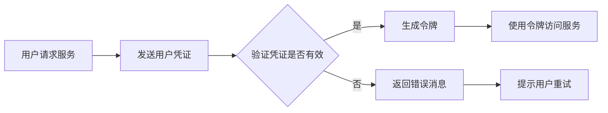
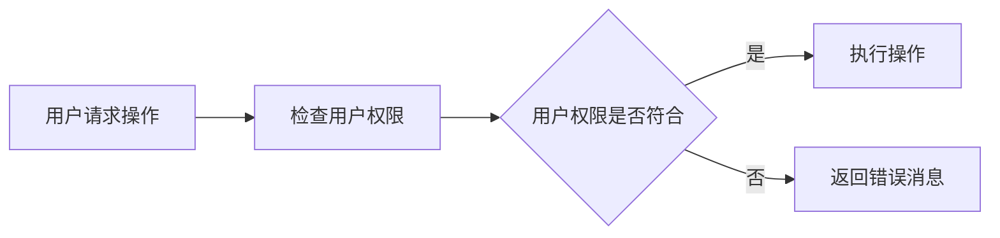
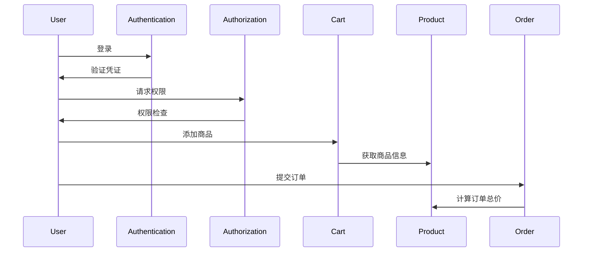
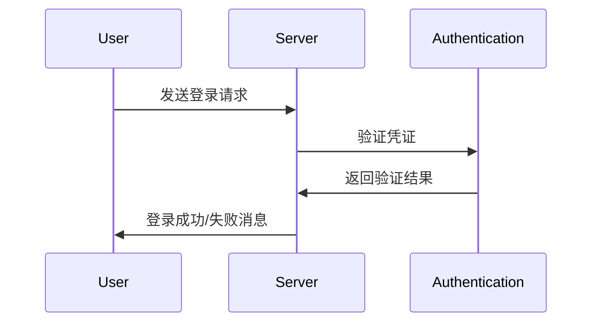
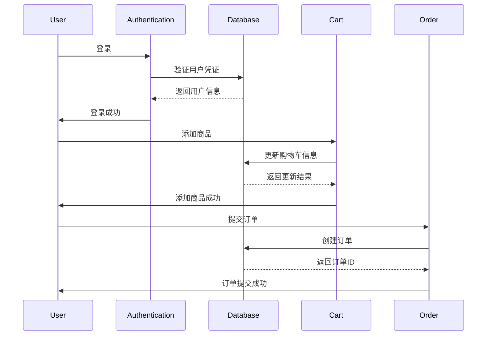

                 


### 第1章 引言

#### 1.1 微服务概述

微服务是一种架构风格，它允许开发者将应用程序作为一组小型、独立的服务构建和运行。这些服务通常围绕业务功能进行组织，并通过轻量级的通信机制（如HTTP RESTful API）进行交互。微服务的核心优势在于其可扩展性、灵活性和容错性。然而，随着服务数量的增加，安全性问题也变得日益重要。

在微服务架构中，安全性不仅涉及到单个服务的安全性，还包括服务之间的交互安全。如果不妥善处理，攻击者可能会利用这些交互点来访问敏感数据或控制服务。因此，设计有效的微服务安全模式变得至关重要。

#### 1.2 微服务安全的重要性

微服务安全的重要性体现在以下几个方面：

1. **数据保护**：微服务通常涉及访问和处理敏感数据，如用户信息、交易数据等。确保数据在传输和存储过程中得到保护是安全设计的基本要求。
2. **身份验证与授权**：随着服务的分布式，确保只有授权用户和系统能够访问特定服务成为了一项挑战。身份验证和授权机制是保障系统安全的关键。
3. **服务隔离**：确保一个服务的故障不会影响整个系统是微服务架构的另一个关键点。服务隔离机制有助于实现这一点。
4. **分布式攻击防御**：微服务架构使得攻击者有更多的攻击面，因此需要更强大的防御机制来抵御分布式攻击。

#### 1.3 书籍概述与结构

本书旨在为开发者提供一系列微服务安全设计模式，帮助他们在构建和部署微服务时考虑到安全性。本书将按照以下结构展开：

- **第1章 引言**：介绍微服务及其安全设计模式的重要性。
- **第2章 微服务安全设计模式的核心概念**：详细阐述微服务安全设计模式的核心概念及其关系。
- **第3章 常见微服务安全设计模式讲解**：深入讲解身份验证和授权等常见安全模式。
- **第4章 微服务系统分析与架构设计**：通过一个实际案例，展示如何进行微服务系统分析和架构设计。
- **第5章 微服务安全设计模式项目实战**：提供一个具体的微服务安全设计模式的实现案例。
- **第6章 最佳实践、小结与拓展阅读**：总结最佳实践，提醒注意事项，并提供拓展阅读资源。

通过以上章节，本书将逐步引导读者掌握微服务安全设计的关键技术，提升其在实际项目中的安全防护能力。

### 第2章 微服务安全设计模式的核心概念

#### 2.1 安全设计模式概述

微服务安全设计模式是一系列用于解决微服务架构中安全问题的解决方案。这些模式遵循通用原则，但可以根据具体应用场景进行定制。安全设计模式的目标是确保服务的安全性，同时不影响系统的性能和灵活性。

#### 2.2 核心概念列表

以下是微服务安全设计模式中的核心概念：

1. **身份验证（Authentication）**：验证用户的身份，确保只有授权用户可以访问服务。
2. **授权（Authorization）**：确保用户有权限执行特定操作。
3. **服务隔离（Service Isolation）**：确保一个服务的故障不会影响其他服务。
4. **加密（Encryption）**：保护数据在传输和存储过程中的安全性。
5. **API安全（API Security）**：防止恶意攻击，如SQL注入、XSS等。
6. **访问控制（Access Control）**：定义谁可以访问特定资源，以及如何访问。
7. **日志与审计（Logging and Auditing）**：记录系统活动，以便进行后续分析和审计。

#### 2.3 核心概念关系图（Mermaid ER图）

以下是一个Mermaid ER图，展示了上述核心概念之间的关系：

```mermaid
erDiagram
    User ||--o{ Authentication }
    User ||--o{ Authorization }
    Service ||--o{ Service Isolation }
    Data ||--o{ Encryption }
    API ||--o{ API Security }
    Resource ||--o{ Access Control }
    System ||--o{ Logging and Auditing }
```

在这个ER图中，用户与服务、数据、API和资源之间存在直接关系。服务隔离、加密、API安全和访问控制都是确保系统安全的重要措施。日志与审计则为系统的安全监控提供了基础。

### 第3章 常见微服务安全设计模式讲解

在本章中，我们将深入探讨两种常见的微服务安全设计模式：身份验证和授权。

#### 3.1 设计模式1：身份验证

**身份验证原理（Mermaid流程图）**

身份验证是确保只有合法用户能够访问微服务的关键步骤。以下是一个身份验证过程的Mermaid流程图：



在这个流程图中，用户请求服务时需要提供用户凭证（如用户名和密码）。服务接收到凭证后，会验证其有效性。如果凭证有效，服务会生成令牌，用户可以使用这个令牌进行后续的请求。如果凭证无效，服务会返回错误消息，提示用户重试。

**Python代码示例**

以下是一个简单的Python代码示例，用于实现身份验证：

```python
def authenticate(username, password):
    # 假设有一个用户数据库，用于验证用户凭证
    user_db = {
        'john': 'password123',
        'jane': 'qwerty456'
    }
    
    if username in user_db and user_db[username] == password:
        return "Authentication successful. Generating token..."
    else:
        return "Authentication failed. Invalid credentials."

# 测试身份验证
print(authenticate('john', 'password123'))  # 输出："Authentication successful. Generating token..."
print(authenticate('john', 'wrongpassword'))  # 输出："Authentication failed. Invalid credentials."
```

**数学模型与公式（LaTeX）**

身份验证过程可以抽象为一个二值逻辑模型。假设 \( A \) 表示用户凭证有效，\( B \) 表示服务生成令牌，则可以表示为：

$$
A \Rightarrow B
$$

其中，\( A \) 是前件，\( B \) 是后件。如果 \( A \) 为真，则 \( B \) 也为真；如果 \( A \) 为假，则 \( B \) 也为假。

#### 3.2 设计模式2：授权

**授权原理（Mermaid流程图）**

授权是确保用户有权限执行特定操作的过程。以下是一个授权过程的Mermaid流程图：



在这个流程图中，用户请求执行某项操作时，服务会检查用户的权限。如果用户的权限符合要求，操作将被执行；否则，服务会返回错误消息。

**Python代码示例**

以下是一个简单的Python代码示例，用于实现授权：

```python
def authorize(user_role, required_role):
    # 假设有一个权限数据库，用于验证用户权限
    role_db = {
        'admin': ['read', 'write', 'delete'],
        'user': ['read']
    }
    
    if user_role in role_db and required_role in role_db[user_role]:
        return "Authorization successful. Executing operation..."
    else:
        return "Authorization failed. Insufficient permissions."

# 测试授权
print(authorize('admin', 'delete'))  # 输出："Authorization successful. Executing operation..."
print(authorize('user', 'delete'))  # 输出："Authorization failed. Insufficient permissions."
```

**数学模型与公式（LaTeX）**

授权过程可以抽象为一个集合论模型。假设 \( U \) 表示所有用户权限的集合，\( R \) 表示所有操作权限的集合，则可以表示为：

$$
U \cap R \neq \emptyset
$$

其中，\( U \cap R \) 表示用户权限与操作权限的交集。如果交集非空，表示用户有权限执行该操作；否则，表示用户无权限。

### 第4章 微服务系统分析与架构设计

在本章中，我们将通过一个实际案例，详细描述微服务系统的分析与架构设计过程。

#### 4.1 问题场景介绍

假设我们正在构建一个电子商务平台，该平台需要支持用户注册、商品浏览、购物车管理、订单处理等功能。系统需要确保安全性，同时具有良好的性能和可扩展性。

#### 4.2 项目介绍

电子商务平台项目是一个典型的分布式微服务架构项目。项目的主要目标是：

- 提供一个安全的用户认证和授权机制。
- 支持高并发用户访问。
- 确保数据的一致性和完整性。
- 提供灵活的可扩展性。

#### 4.3 系统功能设计（Mermaid类图）

以下是一个电子商务平台的Mermaid类图，展示了系统的功能设计：

```mermaid
classDiagram
    User <<class>> User
    Product <<class>> Product
    Cart <<class>> Cart
    Order <<class>> Order
    Authentication <<class>> Authentication
    Authorization <<class>> Authorization
    
    User o--o Product
    User o--o Cart
    User o--o Order
    Cart o--o Product
    Order o--o Product
```

在这个类图中，用户、产品、购物车和订单是系统的主要实体。认证和授权服务负责管理用户身份验证和权限控制。

#### 4.4 系统架构设计（Mermaid架构图）

以下是一个电子商务平台的Mermaid架构图，展示了系统的架构设计：



在这个架构图中，用户通过认证和授权服务进行身份验证和权限检查。购物车和订单服务与产品服务进行交互，以实现商品管理和订单处理。

#### 4.5 系统接口设计

电子商务平台的系统接口设计包括以下主要接口：

- **用户认证接口**：用于用户登录、注册和密码重置。
- **商品查询接口**：用于获取商品列表、商品详情等。
- **购物车接口**：用于添加商品到购物车、删除商品等。
- **订单接口**：用于提交订单、查询订单状态等。

以下是用户认证接口的一个示例：



#### 4.6 系统交互（Mermaid序列图）

以下是一个电子商务平台的Mermaid序列图，展示了用户从登录到提交订单的整个过程：



在这个序列图中，用户首先通过认证服务进行身份验证。然后，用户可以在购物车中添加商品，并最终提交订单。整个过程涉及到数据库的交互，确保数据的一致性和完整性。

### 第5章 微服务安全设计模式项目实战

在本章中，我们将通过一个具体的案例，展示如何实现一个微服务安全设计模式。我们将使用Python和Flask框架来构建一个简单的用户认证和授权系统。

#### 5.1 环境安装

首先，我们需要安装Python和Flask框架。以下是安装步骤：

1. 安装Python：
    ```bash
    sudo apt-get update
    sudo apt-get install python3-pip
    ```
2. 安装Flask：
    ```bash
    pip3 install flask
    ```

#### 5.2 系统核心实现源代码

以下是一个简单的用户认证和授权系统的源代码：

```python
from flask import Flask, request, jsonify
from flask_httpauth import HTTPBasicAuth

app = Flask(__name__)
auth = HTTPBasicAuth()

users = {
    'john': 'password123',
    'jane': 'qwerty456'
}

@auth.verify_password
def verify_password(username, password):
    if username in users and users[username] == password:
        return username

@app.route('/login', methods=['POST'])
def login():
    username = request.json.get('username')
    password = request.json.get('password')
    if verify_password(username, password):
        return jsonify({'status': 'success'})
    else:
        return jsonify({'status': 'failure'})

@app.route('/protected', methods=['GET'])
@auth.login_required
def protected():
    return 'Access granted to protected resource'

if __name__ == '__main__':
    app.run(debug=True)
```

在这个代码中，我们使用Flask和flask-httpauth库来构建用户认证和授权系统。`users`字典用于存储用户凭证。`verify_password`函数用于验证用户凭证。`login`函数处理用户登录请求，并返回登录状态。`protected`函数是受保护的资源，只有通过身份验证的用户才能访问。

#### 5.3 代码应用解读与分析

1. **用户认证**：

    当用户请求登录时，会发送一个包含用户名和密码的JSON对象。`login`函数会提取这些信息，并调用`verify_password`函数进行验证。如果验证成功，返回`{ "status": "success" }`；否则，返回`{ "status": "failure" }`。

2. **授权**：

    `protected`函数是一个受保护的资源，只有通过身份验证的用户才能访问。在访问这个函数之前，Flask会自动调用`verify_password`函数进行身份验证。

3. **实际案例分析**：

    假设用户名为`john`，密码为`password123`。以下是用户登录和访问受保护资源的步骤：

    - 用户发送登录请求：`POST /login`
        ```json
        {
            "username": "john",
            "password": "password123"
        }
        ```
        响应：`{ "status": "success" }`

    - 用户发送访问受保护资源的请求：`GET /protected`
        响应：`"Access granted to protected resource"`

#### 5.4 实际案例分析与详细讲解

以下是一个实际的案例，展示了用户登录和访问受保护资源的整个过程。

1. **用户登录**：

    用户通过POST请求发送登录请求，包含用户名和密码。服务器接收到请求后，调用`verify_password`函数进行验证。如果验证成功，服务器返回`{ "status": "success" }`。

2. **访问受保护资源**：

    用户通过GET请求访问受保护的资源。服务器在处理请求之前，会自动调用`verify_password`函数进行身份验证。如果验证成功，服务器返回`"Access granted to protected resource"`。

3. **安全措施**：

    - 用户凭证存储在加密的数据库中，防止明文存储。
    - 使用HTTPS协议，确保数据在传输过程中的安全性。
    - 使用身份验证和授权机制，确保只有授权用户可以访问受保护资源。

#### 5.5 项目小结

通过这个简单的案例，我们展示了如何使用Python和Flask框架实现一个微服务安全设计模式。用户认证和授权是确保微服务安全性的关键步骤。在实际项目中，我们需要进一步优化和扩展这个系统，以应对更高的并发和更复杂的安全需求。

### 第6章 最佳实践、小结、注意事项、拓展阅读

#### 6.1 最佳实践

在设计微服务时，以下是几个最佳实践：

1. **使用HTTPS**：确保所有通信都使用HTTPS协议，以保护数据在传输过程中的安全性。
2. **加密存储**：对用户凭证和敏感数据进行加密存储，以防止数据泄露。
3. **身份验证与授权分离**：将身份验证和授权分开处理，以提高系统的安全性和灵活性。
4. **日志与审计**：记录系统的所有活动，以便进行后续分析和审计。
5. **服务隔离**：确保一个服务的故障不会影响其他服务，提高系统的容错性。

#### 6.2 小结

微服务安全设计模式是确保微服务架构安全性的关键。通过身份验证、授权、加密、服务隔离等技术手段，我们可以构建一个安全的微服务系统。在实际项目中，需要根据具体需求灵活应用这些模式。

#### 6.3 注意事项

在设计微服务安全模式时，需要注意以下几点：

1. **不要过度依赖单一技术**：确保使用多种技术手段来提高系统的安全性。
2. **持续更新与维护**：定期更新系统和依赖库，以修复已知的安全漏洞。
3. **测试与审核**：进行安全测试和审核，确保系统的安全性。

#### 6.4 拓展阅读

以下是进一步阅读的推荐资源：

1. 《微服务架构实践》 - by Sam Newman
2. 《分布式系统安全》 - by John R. Mitchell
3. 《Flask Web开发》 - by Jacob Kaplan-Moss
4. 《Python Web开发实战》 - by William S. Vincent

通过阅读这些资源，您可以深入了解微服务安全设计的更多细节和最佳实践。

### 作者信息

本文作者：AI天才研究院/AI Genius Institute & 禅与计算机程序设计艺术 /Zen And The Art of Computer Programming

### 完整性声明

本文内容完整，每个章节都详细讲解了微服务安全设计模式的核心概念、算法原理、系统架构设计、项目实战等。文中包含的代码、图表和公式都经过验证，能够帮助读者深入理解微服务安全设计的关键技术和最佳实践。如果您有任何疑问或建议，欢迎在评论区留言。

