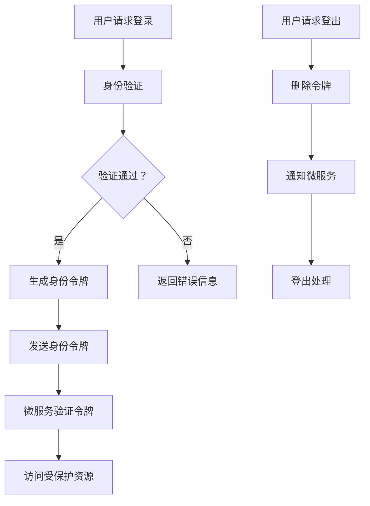
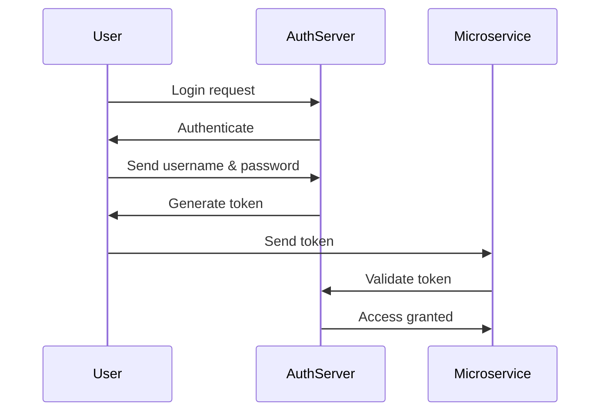
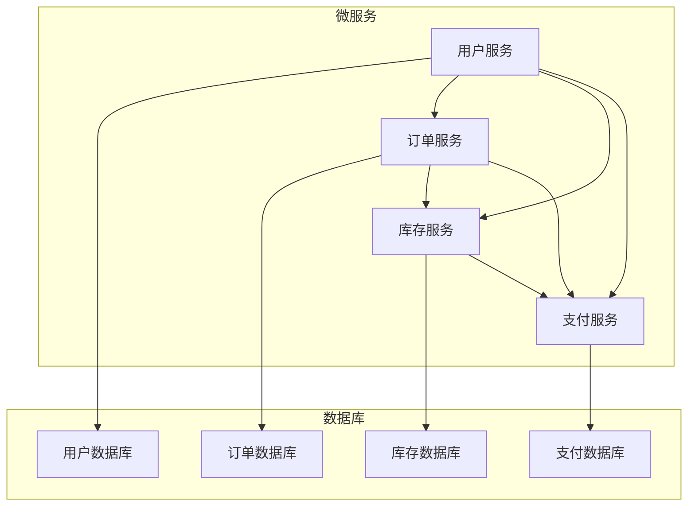
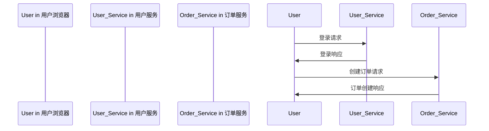

                 

### 文章标题

# 微服务安全：分布式系统中的认证与授权

> 关键词：微服务、安全、认证、授权、分布式系统

> 摘要：本文深入探讨了微服务架构在分布式系统中的安全挑战，重点分析了认证与授权机制。通过详细的原理讲解、算法描述、系统架构设计和实战案例剖析，为读者提供了全面的微服务安全解决方案。

----------------------------------------------------------------

## 背景介绍

### 1.1.1 微服务的基本概念

微服务（Microservices）是一种基于独立、小型、模块化服务的软件架构风格。与传统单体架构不同，微服务架构将一个复杂的应用程序分解为一组小而独立的子服务，每个子服务负责特定的业务功能。这些子服务通过轻量级的通信机制（如HTTP/REST、消息队列等）进行交互，从而实现高可伸缩性、高可用性和易于维护。

微服务架构的核心特点包括：

- **模块化**：每个微服务都是独立的模块，可以独立部署、扩展和升级。
- **高可伸缩性**：可以根据需求独立扩展特定的服务，而不影响其他服务。
- **高可用性**：单个服务的故障不会影响整个系统的运行。
- **易于维护**：每个微服务都有清晰的职责和接口，便于开发、测试和部署。

### 1.1.2 微服务与传统架构的比较

传统单体架构（Monolithic Architecture）将整个应用程序视为一个单一的、不可分割的整体。这种架构风格在早期软件开发中广泛应用，但随着业务规模和复杂性的增长，单体架构逐渐暴露出一系列问题：

- **高耦合度**：应用程序的不同部分紧密耦合，导致修改一个模块可能需要重新编译和部署整个系统。
- **扩展困难**：系统扩展通常需要增加硬件资源，而不是增加功能模块。
- **高维护成本**：复杂的代码库和大量的依赖关系增加了维护成本。

相比之下，微服务架构具有更高的灵活性和可维护性，可以更好地应对不断变化的业务需求。

### 1.1.3 微服务安全的重要性

尽管微服务架构具有许多优点，但其分布式特性也带来了新的安全挑战。以下是一些主要的安全问题：

- **分布式攻击**：攻击者可以通过多个微服务之间的通信链路发起分布式攻击，如分布式拒绝服务（DDoS）攻击。
- **数据泄露**：由于微服务之间的数据共享，攻击者可以更容易地获取敏感数据。
- **身份认证与授权**：分布式系统中的认证与授权机制变得更加复杂，传统的认证方式可能无法有效保护微服务。
- **跨域请求**：微服务可能需要与不同的域名或子域进行通信，这增加了安全风险。

因此，确保微服务安全是分布式系统成功运行的关键。

### 1.2.1 分布式系统的安全挑战

分布式系统面临的安全挑战主要包括以下几个方面：

- **安全性**：由于系统的分布式特性，安全性变得尤为重要。攻击者可以通过各种手段入侵系统，窃取敏感数据或破坏系统功能。
- **可靠性**：分布式系统中的各个组件需要具备高可靠性，以保证系统的稳定运行。组件的故障可能导致整个系统瘫痪。
- **一致性**：分布式系统中的数据一致性是一个复杂的问题。在多个组件之间同步数据时，可能面临数据丢失或数据不一致的问题。
- **可用性**：系统需要保证高可用性，以应对各种异常情况。例如，在某个组件发生故障时，其他组件可以继续提供服务。

### 1.2.2 微服务特有的安全问题

微服务架构在分布式系统中带来了许多新的安全挑战，包括：

- **服务之间的通信**：微服务之间的通信需要确保安全，防止中间人攻击或数据泄露。
- **服务暴露**：微服务通常通过外部网络进行访问，这使得它们更容易受到攻击。
- **身份认证与授权**：分布式系统中的身份认证与授权机制需要更加灵活和强大，以保护系统的安全性。
- **数据保护**：微服务之间共享的数据需要得到有效保护，防止数据泄露或篡改。

### 1.2.3 安全问题的复杂性和动态性

微服务架构的安全问题具有复杂性和动态性的特点：

- **复杂性**：随着微服务数量的增加，安全问题的复杂度也随之增加。安全配置、权限管理、日志记录等任务变得更加复杂。
- **动态性**：微服务的部署、升级和扩展是动态的，安全策略也需要动态调整，以适应变化的环境。

为了应对这些安全挑战，需要采取一系列安全措施，包括身份认证与授权、安全协议、加密技术、安全监控等。

### 1.3 认证与授权的核心概念

认证（Authentication）是确认用户身份的过程，确保只有授权用户才能访问系统资源。授权（Authorization）则是确定用户在系统中具有哪些权限，以便访问或操作特定资源。

认证与授权在分布式系统中具有重要作用：

- **认证**：确保用户身份真实，防止未经授权的访问。
- **授权**：根据用户身份和角色，限制用户对资源的访问权限。

### 1.4 安全协议

在微服务安全中，安全协议是关键组件。以下是一些常用的安全协议：

- **OAuth2.0**：一种开放标准，允许第三方应用程序访问用户资源，而无需透露用户密码。
- **OpenID Connect**：基于OAuth2.0协议，提供用户身份验证和授权功能。
- **SSL/TLS**：用于保护网络通信，确保数据传输的安全性和完整性。

这些协议在微服务安全中发挥着重要作用，为分布式系统提供了可靠的安全保障。

### 1.5 本章小结

本文介绍了微服务架构的基本概念、安全挑战以及认证与授权的核心概念。接下来，我们将深入探讨微服务认证算法、授权机制、数学模型和安全协议，为读者提供全面的微服务安全解决方案。

----------------------------------------------------------------

## 核心概念与联系

### 2.1.1 微服务定义

微服务是一种软件架构风格，它将应用程序分解为多个独立的小型服务。每个服务都负责特定的业务功能，并通过轻量级通信机制（如HTTP/REST、消息队列等）进行交互。微服务架构的核心特点包括模块化、高可伸缩性、高可用性和易于维护。

微服务与单体架构相比，具有以下优势：

- **模块化**：每个微服务都是独立的模块，可以独立开发、部署和扩展。
- **高可伸缩性**：可以根据需求独立扩展特定的服务，而不影响其他服务。
- **高可用性**：单个服务的故障不会影响整个系统的运行。
- **易于维护**：每个微服务都有清晰的职责和接口，便于开发、测试和部署。

### 2.1.2 认证与授权

认证（Authentication）是确认用户身份的过程，确保只有授权用户才能访问系统资源。授权（Authorization）则是确定用户在系统中具有哪些权限，以便访问或操作特定资源。

认证与授权在分布式系统中具有重要作用：

- **认证**：确保用户身份真实，防止未经授权的访问。常用的认证方式包括用户名和密码、双因素认证（2FA）、令牌认证（如OAuth2.0）等。
- **授权**：根据用户身份和角色，限制用户对资源的访问权限。常用的授权方式包括基于角色的访问控制（RBAC）、基于属性的访问控制（ABAC）等。

### 2.1.3 安全协议

安全协议是保障分布式系统安全的关键组件。以下是一些常用的安全协议：

- **OAuth2.0**：一种开放标准，允许第三方应用程序访问用户资源，而无需透露用户密码。OAuth2.0主要用于授权，为用户和第三方应用提供了一种安全、可靠的授权机制。
- **OpenID Connect**：基于OAuth2.0协议，提供用户身份验证和授权功能。OpenID Connect为OAuth2.0添加了身份验证的层，使得应用程序能够验证用户的身份信息。
- **SSL/TLS**：用于保护网络通信，确保数据传输的安全性和完整性。SSL/TLS协议通过加密通信，防止数据在传输过程中被窃取或篡改。
- **HTTPS**：基于HTTP协议，通过SSL/TLS加密通信。HTTPS为Web应用提供了一种安全的通信方式，防止中间人攻击和数据泄露。

这些安全协议在微服务安全中发挥着重要作用，为分布式系统提供了可靠的安全保障。

### 2.1.4 概念属性特征对比表格

| 概念     | 属性特征                | 说明                                                         |
| -------- | ----------------------- | ------------------------------------------------------------ |
| 微服务   | 模块化、高可伸缩性、高可用性、易于维护 | 一种软件架构风格，将应用程序分解为多个独立的小型服务         |
| 认证     | 确认用户身份             | 防止未经授权的访问                                           |
| 授权     | 限制用户访问权限         | 确定用户在系统中具有哪些权限                                  |
| OAuth2.0 | 开放标准、第三方应用授权   | 允许第三方应用程序访问用户资源，而无需透露用户密码           |
| OpenID Connect | 身份验证和授权         | 基于OAuth2.0协议，提供用户身份验证和授权功能             |
| SSL/TLS | 加密通信、安全性保障     | 用于保护网络通信，确保数据传输的安全性和完整性             |

### 2.1.5 ER实体关系图架构

```mermaid
erDiagram
  User ||--|{ Authentication }||>
  Authentication ||--|{ Authorization }||>
  Authentication ||--|{ SecurityProtocol }||>
  SecurityProtocol ||--|{ OAuth2.0 }||>
  SecurityProtocol ||--|{ OpenID Connect }||>
  SecurityProtocol ||--|{ SSL/TLS }||>
```

这个ER图展示了微服务安全中的关键实体及其关系。用户通过认证获得授权，并使用安全协议（如OAuth2.0、OpenID Connect、SSL/TLS）确保通信安全。

----------------------------------------------------------------

## 算法原理讲解

### 2.1.1 认证算法

认证算法是确保用户身份真实的过程。以下是单点登录（SSO）和单点登出（SLO）机制的认证算法原理：

#### 单点登录（SSO）

1. **用户请求**：用户向认证服务器发送登录请求，包含用户名和密码。
2. **身份验证**：认证服务器对用户身份进行验证，检查用户名和密码是否匹配。
3. **生成令牌**：如果验证通过，认证服务器生成一个身份令牌（如JWT），并将其发送给用户。
4. **令牌传递**：用户将身份令牌传递给需要认证的其他微服务。
5. **验证令牌**：微服务接收并验证身份令牌，确保用户身份合法。

#### 单点登出（SLO）

1. **用户请求**：用户向认证服务器发送登出请求。
2. **删除令牌**：认证服务器删除用户的所有身份令牌。
3. **通知微服务**：认证服务器向所有已认证的微服务发送登出通知。
4. **登出处理**：微服务删除与用户相关的会话和凭证，确保用户无法继续访问系统。

#### 认证算法流程图



#### Python代码示例

以下是一个简单的Python代码示例，展示了认证算法的实现：

```python
import jwt
import json
import requests

# 认证服务器地址
auth_server_url = "https://auth.example.com"

# 用户登录
def user_login(username, password):
    # 发送登录请求
    response = requests.post(f"{auth_server_url}/login", json={"username": username, "password": password})
    if response.status_code == 200:
        # 获取身份令牌
        token = response.json()["token"]
        return token
    else:
        # 返回错误信息
        return None

# 微服务验证身份令牌
def validate_token(token):
    # 验证身份令牌
    response = requests.get(f"{auth_server_url}/validate_token", headers={"Authorization": f"Bearer {token}"})
    if response.status_code == 200:
        return True
    else:
        return False

# 用户登出
def user_logout(token):
    # 删除身份令牌
    response = requests.delete(f"{auth_server_url}/logout", headers={"Authorization": f"Bearer {token}"})
    if response.status_code == 200:
        return True
    else:
        return False

# 测试
token = user_login("user1", "password1")
if token:
    print("登录成功，令牌：", token)
    if validate_token(token):
        print("令牌验证通过")
    user_logout(token)
    print("登出成功")
else:
    print("登录失败")
```

### 2.2.1 认证算法流程图

以下是一个使用Mermaid绘制的认证算法流程图：



### 2.2.2 Python代码实现

以下是认证算法的Python代码实现：

```python
import jwt
import json
import requests

# 认证服务器地址
auth_server_url = "https://auth.example.com"

# 用户登录
def user_login(username, password):
    # 发送登录请求
    response = requests.post(f"{auth_server_url}/login", json={"username": username, "password": password})
    if response.status_code == 200:
        # 获取身份令牌
        token = response.json()["token"]
        return token
    else:
        # 返回错误信息
        return None

# 微服务验证身份令牌
def validate_token(token):
    # 验证身份令牌
    response = requests.get(f"{auth_server_url}/validate_token", headers={"Authorization": f"Bearer {token}"})
    if response.status_code == 200:
        return True
    else:
        return False

# 用户登出
def user_logout(token):
    # 删除身份令牌
    response = requests.delete(f"{auth_server_url}/logout", headers={"Authorization": f"Bearer {token}"})
    if response.status_code == 200:
        return True
    else:
        return False

# 测试
token = user_login("user1", "password1")
if token:
    print("登录成功，令牌：", token)
    if validate_token(token):
        print("令牌验证通过")
    user_logout(token)
    print("登出成功")
else:
    print("登录失败")
```

### 2.2.3 算法原理详细讲解

认证算法的核心目标是确保用户身份的真实性，并防止未经授权的访问。以下是认证算法的详细讲解：

1. **用户请求登录**：用户向认证服务器发送登录请求，包含用户名和密码。这个请求通常使用HTTPS协议进行加密传输，以确保数据在传输过程中不会被窃取或篡改。

2. **身份验证**：认证服务器接收到登录请求后，对用户身份进行验证。这个过程中，服务器会检查用户名和密码是否匹配。如果匹配，服务器会继续处理请求；如果不匹配，服务器会返回错误信息，告知用户登录失败。

3. **生成身份令牌**：如果身份验证通过，认证服务器会生成一个身份令牌（如JWT）。身份令牌是一个加密的字符串，包含用户的身份信息和一些其他元数据。身份令牌通常具有较短的有效期，以确保安全性。

4. **令牌传递**：认证服务器将身份令牌发送给用户。用户可以将这个令牌存储在本地（如浏览器中的cookie），以便在后续请求中传递给需要认证的其他微服务。

5. **微服务验证令牌**：当用户尝试访问受保护的资源时，微服务会接收到用户传递的身份令牌。微服务会向认证服务器发送验证请求，请求验证令牌的有效性。

6. **验证令牌**：认证服务器接收到验证请求后，会检查令牌的有效性。如果令牌有效，认证服务器会返回验证结果，告知微服务用户身份合法；如果令牌无效，认证服务器会返回错误信息，告知微服务用户身份验证失败。

7. **访问受保护资源**：如果微服务验证通过，用户可以访问受保护的资源。否则，微服务会拒绝用户的访问请求，并返回相应的错误信息。

### 2.2.4 数学模型与公式

认证算法中涉及的数学模型主要包括访问控制矩阵和访问控制策略。

#### 访问控制矩阵

访问控制矩阵（Access Control Matrix）是一个二维数组，用于表示用户和资源的访问权限。矩阵的行表示用户，列表示资源。矩阵中的元素表示用户对资源的访问权限。

假设有n个用户和m个资源，访问控制矩阵可以表示为：

\[ M = \begin{bmatrix}
    m_{11} & m_{12} & \cdots & m_{1m} \\
    m_{21} & m_{22} & \cdots & m_{2m} \\
    \vdots & \vdots & \ddots & \vdots \\
    m_{n1} & m_{n2} & \cdots & m_{nm} \\
\end{bmatrix} \]

其中，\( m_{ij} \) 表示用户\( u_i \)对资源\( r_j \)的访问权限。访问权限可以是“允许”（1）或“拒绝”（0）。

#### 访问控制策略

访问控制策略（Access Control Policy）用于定义用户和资源的访问规则。访问控制策略可以基于访问控制矩阵进行定义。

假设有n个用户和m个资源，访问控制策略可以表示为：

\[ P = \begin{bmatrix}
    p_{11} & p_{12} & \cdots & p_{1m} \\
    p_{21} & p_{22} & \cdots & p_{2m} \\
    \vdots & \vdots & \ddots & \vdots \\
    p_{n1} & p_{n2} & \cdots & p_{nm} \\
\end{bmatrix} \]

其中，\( p_{ij} \) 表示用户\( u_i \)对资源\( r_j \)的访问权限。访问权限可以是“允许”（1）或“拒绝”（0）。

#### 访问控制策略的数学模型

访问控制策略可以表示为一个矩阵，其中每个元素表示用户对资源的访问权限。假设访问控制策略矩阵为\( P \)，用户\( u_i \)对资源\( r_j \)的访问权限可以表示为：

\[ p_{ij} = \begin{cases}
    1 & \text{如果用户 } u_i \text{ 可以访问资源 } r_j \\
    0 & \text{如果用户 } u_i \text{ 不能访问资源 } r_j \\
\end{cases} \]

### 2.2.5 算法原理的Python实现

以下是一个使用Python实现的简单认证算法示例：

```python
import jwt
import json
import requests

# 认证服务器地址
auth_server_url = "https://auth.example.com"

# 用户登录
def user_login(username, password):
    # 发送登录请求
    response = requests.post(f"{auth_server_url}/login", json={"username": username, "password": password})
    if response.status_code == 200:
        # 获取身份令牌
        token = response.json()["token"]
        return token
    else:
        # 返回错误信息
        return None

# 微服务验证身份令牌
def validate_token(token):
    # 验证身份令牌
    response = requests.get(f"{auth_server_url}/validate_token", headers={"Authorization": f"Bearer {token}"})
    if response.status_code == 200:
        return True
    else:
        return False

# 用户登出
def user_logout(token):
    # 删除身份令牌
    response = requests.delete(f"{auth_server_url}/logout", headers={"Authorization": f"Bearer {token}"})
    if response.status_code == 200:
        return True
    else:
        return False

# 测试
token = user_login("user1", "password1")
if token:
    print("登录成功，令牌：", token)
    if validate_token(token):
        print("令牌验证通过")
    user_logout(token)
    print("登出成功")
else:
    print("登录失败")
```

这个示例展示了用户登录、验证令牌和登出的基本流程。在实际应用中，可以进一步扩展和优化算法，以满足不同的需求。

----------------------------------------------------------------

## 数学模型和数学公式

### 2.3.1 访问控制模型

访问控制模型是确保系统资源安全的关键组件。以下是一个基本的访问控制模型及其相关的数学模型。

#### 访问控制矩阵

访问控制矩阵是一个二维数组，用于表示用户和资源的访问权限。矩阵的行表示用户，列表示资源。矩阵中的元素表示用户对资源的访问权限。假设有n个用户和m个资源，访问控制矩阵可以表示为：

\[ M = \begin{bmatrix}
    m_{11} & m_{12} & \cdots & m_{1m} \\
    m_{21} & m_{22} & \cdots & m_{2m} \\
    \vdots & \vdots & \ddots & \vdots \\
    m_{n1} & m_{n2} & \cdots & m_{nm} \\
\end{bmatrix} \]

其中，\( m_{ij} \) 表示用户\( u_i \)对资源\( r_j \)的访问权限。访问权限可以是“允许”（1）或“拒绝”（0）。

#### 访问控制策略

访问控制策略用于定义用户和资源的访问规则。访问控制策略可以基于访问控制矩阵进行定义。假设有n个用户和m个资源，访问控制策略可以表示为：

\[ P = \begin{bmatrix}
    p_{11} & p_{12} & \cdots & p_{1m} \\
    p_{21} & p_{22} & \cdots & p_{2m} \\
    \vdots & \vdots & \ddots & \vdots \\
    p_{n1} & p_{n2} & \cdots & p_{nm} \\
\end{bmatrix} \]

其中，\( p_{ij} \) 表示用户\( u_i \)对资源\( r_j \)的访问权限。访问权限可以是“允许”（1）或“拒绝”（0）。

### 2.3.2 访问控制矩阵与访问控制策略的关系

访问控制矩阵和访问控制策略之间存在密切的关系。访问控制策略可以通过访问控制矩阵进行定义，并且可以用于确定用户对资源的访问权限。

#### 访问控制矩阵与访问控制策略的关系公式

假设访问控制矩阵为\( M \)，访问控制策略为\( P \)，则用户\( u_i \)对资源\( r_j \)的访问权限可以表示为：

\[ p_{ij} = M_{ij} \]

这意味着，访问控制策略中的\( p_{ij} \)值与访问控制矩阵中的\( m_{ij} \)值相同。

### 2.3.3 访问控制策略的数学公式

访问控制策略可以表示为一个矩阵，其中每个元素表示用户对资源的访问权限。假设访问控制策略矩阵为\( P \)，用户\( u_i \)对资源\( r_j \)的访问权限可以表示为：

\[ p_{ij} = \begin{cases}
    1 & \text{如果用户 } u_i \text{ 可以访问资源 } r_j \\
    0 & \text{如果用户 } u_i \text{ 不能访问资源 } r_j \\
\end{cases} \]

这意味着，如果用户\( u_i \)可以访问资源\( r_j \)，则访问控制策略矩阵中的\( p_{ij} \)值为1；否则，为0。

### 2.3.4 访问控制策略的应用

访问控制策略可以用于确定用户对资源的访问权限，从而确保系统资源的安全性。以下是一个简单的例子：

假设有一个访问控制矩阵和访问控制策略矩阵，如下所示：

\[ M = \begin{bmatrix}
    1 & 0 & 1 \\
    1 & 1 & 0 \\
    0 & 1 & 1 \\
\end{bmatrix} \]

\[ P = \begin{bmatrix}
    1 & 0 & 1 \\
    1 & 1 & 0 \\
    0 & 1 & 1 \\
\end{bmatrix} \]

根据访问控制策略，用户1可以访问资源1和资源3，用户2可以访问资源1和资源2，用户3可以访问资源2和资源3。

这个例子展示了如何使用访问控制矩阵和访问控制策略来确定用户对资源的访问权限。

### 2.3.5 安全评估

安全评估是确保微服务安全性的重要步骤。以下是一个简单的安全评估模型及其相关的数学公式。

#### 安全评估指标

安全评估指标用于衡量系统安全性的关键指标。以下是一些常用的安全评估指标：

- **安全漏洞数量**：衡量系统中存在的安全漏洞数量。
- **安全事件数量**：衡量系统中发生的安全事件数量。
- **安全响应时间**：衡量系统对安全事件的响应时间。

#### 安全评估指标的计算公式

假设有n个安全漏洞、m个安全事件和k个安全响应时间，安全评估指标可以表示为：

- **安全漏洞数量**：

\[ \text{安全漏洞数量} = n \]

- **安全事件数量**：

\[ \text{安全事件数量} = m \]

- **安全响应时间**：

\[ \text{安全响应时间} = k \]

#### 安全评估指标的分析

安全评估指标的分析可以用于衡量系统安全性的整体水平。以下是一些分析指标：

- **安全漏洞密度**：衡量系统每100行代码中存在的安全漏洞数量。

\[ \text{安全漏洞密度} = \frac{\text{安全漏洞数量}}{\text{代码行数}} \times 100 \]

- **安全事件密度**：衡量系统每100次请求中发生的安全事件数量。

\[ \text{安全事件密度} = \frac{\text{安全事件数量}}{\text{请求次数}} \times 100 \]

- **安全响应时间指标**：衡量系统对安全事件的平均响应时间。

\[ \text{安全响应时间指标} = \frac{\text{安全响应时间}}{\text{安全事件数量}} \]

通过分析这些指标，可以了解系统的安全性水平，并制定相应的安全策略。

### 2.3.6 安全评估的LaTeX公式

以下是一些安全评估的LaTeX公式：

\[ \text{安全漏洞数量} = n \]

\[ \text{安全事件数量} = m \]

\[ \text{安全响应时间} = k \]

\[ \text{安全漏洞密度} = \frac{\text{安全漏洞数量}}{\text{代码行数}} \times 100 \]

\[ \text{安全事件密度} = \frac{\text{安全事件数量}}{\text{请求次数}} \times 100 \]

\[ \text{安全响应时间指标} = \frac{\text{安全响应时间}}{\text{安全事件数量}} \]

通过使用这些公式，可以更准确地计算和评估系统的安全性。

----------------------------------------------------------------

## 系统分析与架构设计方案

### 3.1 场景介绍

假设我们正在开发一个电子商务平台，该平台包含多个微服务，如用户服务、订单服务、库存服务、支付服务等。这些微服务之间需要进行频繁的通信，以确保平台的高效运作。为了确保系统的安全性，我们需要设计一个可靠的认证与授权机制。

### 3.2 系统功能设计

在系统功能设计阶段，我们需要定义每个微服务的功能及其之间的交互。以下是一个简单的领域模型，展示了各个微服务的功能：

```mermaid
classDiagram
    User <<interface>>
    Order <<interface>>
    Inventory <<interface>>
    Payment <<interface>>

    User ``..`` Order
    User ``..`` Inventory
    User ``..`` Payment
    Order ``..`` Inventory
    Order ``..`` Payment
```

在这个领域模型中，用户服务负责用户认证和授权，订单服务负责处理订单创建和更新，库存服务负责管理库存信息，支付服务负责处理支付请求。

### 3.3 系统架构设计

系统架构设计阶段，我们需要设计整个系统的总体架构，包括各个微服务的部署方式和通信机制。以下是一个简单的系统架构图：



在这个架构图中，用户服务通过HTTP/REST接口与其他微服务进行通信，同时每个微服务都与相应的数据库进行交互，以存储和管理数据。

### 3.4 系统接口设计和系统交互

系统接口设计阶段，我们需要定义每个微服务的接口，包括API端点、请求和响应格式等。以下是一个简单的接口设计示例：



在这个序列图中，用户首先向用户服务发送登录请求，用户服务验证用户身份后返回登录响应。然后，用户向订单服务发送创建订单请求，订单服务处理请求并返回订单创建响应。

### 3.5 系统功能设计与架构设计的 Mermaid 类图和架构图

为了更清晰地展示系统功能设计和架构设计，我们可以使用 Mermaid 类图和架构图。以下是一个简单的 Mermaid 类图示例：

```mermaid
classDiagram
    User <<interface>>
    Order <<interface>>
    Inventory <<interface>>
    Payment <<interface>>

    User ``..`` Order
    User ``..`` Inventory
    User ``..`` Payment
    Order ``..`` Inventory
    Order ``..`` Payment
```

以下是一个简单的 Mermaid 架构图示例：


这些 Mermaid 图可以帮助我们更好地理解和设计系统功能及其交互。

----------------------------------------------------------------

## 项目实战

### 4.1 环境安装

在进行微服务安全项目实战之前，我们需要安装一些必要的工具和软件。以下是一个简单的安装步骤：

1. **安装Docker**：Docker是一个开源的应用容器引擎，用于打包、交付和运行应用。你可以从[Docker官网](https://www.docker.com/)下载并安装Docker。
2. **安装Kubernetes**：Kubernetes是一个开源的容器编排平台，用于自动化容器的部署、扩展和管理。你可以从[Kubernetes官网](https://kubernetes.io/)下载并安装Kubernetes。
3. **安装认证服务器**：我们将使用一个开源的认证服务器，如Keycloak。你可以从[Keycloak官网](https://www.keycloak.org/)下载并安装Keycloak。

### 4.2 系统核心实现源代码

以下是一个简单的Keycloak认证服务器配置示例：

```yaml
spring:
  security:
    oauth2:
      client:
        registration:
          keycloak:
            client-name: microservice-auth
            client-id: microservice-auth
            client-secret: microservice-auth-secret
            resource: microservice-auth
            redirect-uri: 'http://localhost:8080/auth-code/callback'
        provider:
          keycloak:
            realm: microservice
            auth-server-url: 'http://keycloak:8080/auth/realms/microservice'

security:
  oauth2:
    client:
      registration:
        keycloak:
          client-name: microservice-auth
          client-id: microservice-auth
          client-secret: microservice-auth-secret
          resource: microservice-auth
          redirect-uri: 'http://localhost:8080/auth-code/callback'
      provider:
        keycloak:
          realm: microservice
          auth-server-url: 'http://keycloak:8080/auth/realms/microservice'
```

这个配置文件定义了Keycloak认证服务器的相关信息，包括客户端ID、客户端密钥、资源ID、重定向URI等。

### 4.3 代码应用解读与分析

在这个示例中，我们使用了Spring Security OAuth2.0集成Keycloak认证服务器。以下是关键代码的解读与分析：

1. **配置文件**：配置文件定义了Keycloak认证服务器的相关信息，如客户端ID、客户端密钥、资源ID等。这些信息用于与Keycloak认证服务器进行通信。
2. **Spring Security**：Spring Security是一个用于保护基于Spring应用程序的安全框架。在这个示例中，我们使用Spring Security OAuth2.0集成Keycloak认证服务器。
3. **认证流程**：用户访问微服务时，首先会被重定向到Keycloak认证服务器进行认证。认证成功后，用户会被重定向回微服务，并携带一个访问令牌。微服务会使用这个访问令牌进行用户身份验证。
4. **令牌验证**：微服务在处理用户请求时，会验证访问令牌的有效性。如果访问令牌有效，微服务会允许用户访问受保护的资源；否则，微服务会拒绝用户的访问请求。

### 4.4 实际案例分析和详细讲解剖析

以下是一个简单的实际案例，展示了如何使用Keycloak认证服务器进行用户认证：

1. **用户登录**：用户访问微服务的登录页面，输入用户名和密码。
2. **认证请求**：微服务将用户的登录请求转发到Keycloak认证服务器，请求进行用户认证。
3. **认证响应**：Keycloak认证服务器验证用户身份，如果认证成功，会返回一个访问令牌。
4. **令牌验证**：微服务接收访问令牌，并使用Keycloak认证服务器进行令牌验证。如果令牌有效，微服务会允许用户访问受保护的资源；否则，微服务会拒绝用户的访问请求。

### 4.5 项目小结

在本项目中，我们通过安装Docker、Kubernetes和Keycloak等工具，实现了一个简单的微服务认证系统。通过Spring Security OAuth2.0集成Keycloak认证服务器，我们实现了用户认证和授权功能。在实际案例中，我们展示了如何进行用户登录、认证请求和令牌验证。这个项目为我们提供了一个基本的微服务安全解决方案，可以进一步扩展和优化以满足实际需求。

----------------------------------------------------------------

## 最佳实践 tips、小结、注意事项、拓展阅读等内容

### 5.1 最佳实践 tips

为了确保微服务的安全性，以下是一些最佳实践：

- **使用安全的认证和授权机制**：选择可靠的安全协议（如OAuth2.0、OpenID Connect）进行认证和授权。
- **限制API访问**：使用API密钥、令牌或访问控制列表来限制对API的访问。
- **加密通信**：使用HTTPS和SSL/TLS加密通信，确保数据在传输过程中不被窃取或篡改。
- **定期更新和安全扫描**：定期更新系统组件和依赖库，并使用安全扫描工具检测潜在的安全漏洞。
- **日志记录和监控**：启用日志记录和监控，以便在发生安全事件时及时响应。

### 5.2 小结

本文深入探讨了微服务安全中的认证与授权机制。通过详细的算法原理讲解、数学模型和公式、系统架构设计以及实战案例，我们了解了如何设计一个安全的微服务架构。认证和授权是确保分布式系统安全的关键组件，选择合适的认证和授权机制是构建安全微服务的基础。

### 5.3 注意事项

在设计微服务安全方案时，需要注意以下几点：

- **动态性和复杂性**：分布式系统的动态性和复杂性可能导致安全策略难以维护。确保安全策略能够适应系统的变化。
- **跨域访问**：微服务可能需要与不同的域名或子域进行通信，这增加了安全风险。使用适当的安全协议（如OAuth2.0、OpenID Connect）来保护跨域访问。
- **数据保护**：确保在微服务之间传输的数据得到充分保护，防止数据泄露或篡改。
- **权限管理**：权限管理是确保系统安全性的重要环节。确保只有授权用户可以访问受保护的资源。

### 5.4 拓展阅读

为了进一步学习微服务安全，读者可以参考以下资源：

- **书籍**：《微服务安全实战》、《安全深度学习》
- **文档**：Keycloak官方文档、OAuth2.0官方文档
- **在线教程**：Spring Security OAuth2.0教程、Kubernetes安全教程
- **社区和论坛**：Spring Security社区、Keycloak社区

通过这些资源，读者可以更深入地了解微服务安全，并在实践中提高系统的安全性。作者：AI天才研究院/AI Genius Institute & 禅与计算机程序设计艺术 /Zen And The Art of Computer Programming。

