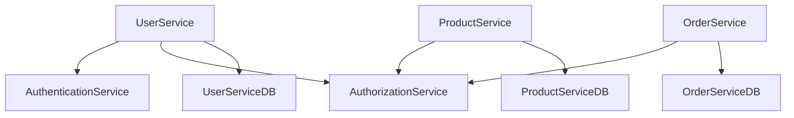
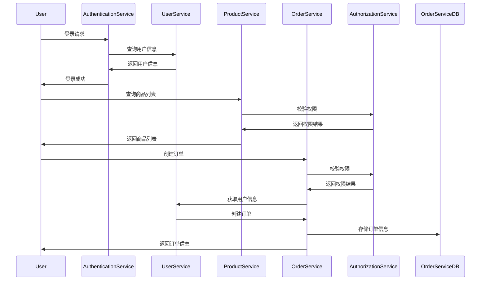

                 

### 文章标题

# 微服务安全：认证、授权与数据保护

## 文章关键词

- 微服务
- 安全性
- 认证
- 授权
- 数据保护

## 摘要

随着微服务架构的广泛应用，确保其安全性变得越来越重要。本文将详细探讨微服务架构中的安全需求，重点分析认证、授权和数据保护这三个关键领域。通过深入理解这些安全机制和技术，开发者可以构建一个安全可靠的微服务生态系统。本文不仅涵盖了基本概念和原理，还提供了实际案例和最佳实践，旨在帮助读者在实际项目中有效应用这些安全策略。

### 背景介绍

#### 核心概念术语说明

在讨论微服务安全之前，我们首先需要了解几个核心概念：

- **微服务架构**：一种软件架构风格，它通过将应用程序作为一组小型、独立的服务来构建，这些服务通过轻量级通信机制（如HTTP/HTTPS、消息队列等）进行交互。
- **认证（Authentication）**：验证用户或系统的身份，确保只有授权的用户可以访问系统资源。
- **授权（Authorization）**：确定用户在系统中可以执行的操作，通过权限控制来确保安全性。
- **数据保护（Data Protection）**：确保数据在传输和存储过程中的机密性、完整性和可用性。

#### 问题背景

微服务架构由于其灵活性和可扩展性，已经成为现代软件开发的主流趋势。然而，这种架构也引入了新的安全挑战：

1. **分布式系统安全性**：微服务分布式部署，增加了安全防护的难度。
2. **数据泄露风险**：随着服务的增多，数据泄露的风险也随之增加。
3. **跨服务攻击**：恶意攻击者可能通过一个服务入侵其他服务，从而获取敏感信息。

#### 问题描述

为了应对上述挑战，我们需要：

- 设计并实施有效的认证机制，确保只有合法用户可以访问系统。
- 建立强大的授权机制，防止未授权访问和操作。
- 实施严格的数据保护策略，确保数据安全。

#### 问题解决

本文将逐步介绍以下解决方案：

1. **认证机制**：包括单点登录（SSO）和多因素认证（MFA）。
2. **授权机制**：探讨基于角色的访问控制（RBAC）和基于属性的访问控制（ABAC）。
3. **数据保护**：介绍加密技术和数据隐私保护方法。

#### 边界与外延

本文主要关注微服务架构中的安全机制，不包括传统的集中式架构安全。同时，本文不涉及物理网络安全和主机安全。

#### 概念结构与核心要素组成

微服务安全的核心概念和要素如下：

1. **认证**：用户身份验证。
2. **授权**：权限分配。
3. **数据保护**：数据加密、备份、访问控制。

这些要素相互作用，共同构建了一个安全可靠的微服务生态系统。

### 核心概念与联系

#### 认证技术原理

认证是微服务安全的基础，它是验证用户身份的过程。常见的认证技术包括：

1. **用户名和密码**：最简单的认证方式，但安全性较低。
2. **令牌认证**：如OAuth 2.0和JWT（JSON Web Tokens），提供更安全、可扩展的认证机制。
3. **单点登录（SSO）**：允许用户通过一个身份验证系统访问多个服务，提高用户体验。

#### 授权与访问控制

授权是确保用户只能访问其有权访问的资源。主要方法包括：

1. **基于角色的访问控制（RBAC）**：通过角色分配权限，简化权限管理。
2. **基于属性的访问控制（ABAC）**：根据用户的属性（如职位、部门等）进行访问控制，提供更细粒度的控制。

#### 数据保护策略

数据保护是确保数据在传输和存储过程中的安全。主要策略包括：

1. **数据加密**：对敏感数据进行加密，防止数据泄露。
2. **数据备份**：定期备份数据，确保数据可恢复。
3. **访问控制**：通过权限设置，限制数据的访问。

### ER实体关系图架构

下面是一个简化的ER图，展示了认证、授权和数据保护的主要实体和关系：

```mermaid
erDiagram
  User ||--|{ Authentication }||> AuthInfo
  User ||--|{ Authorization }||> AuthRule
  Data ||--|{ DataEncryption }||> EncryptedData
  Data ||--|{ DataBackup }||> Backup
```

- **User（用户）**：拥有身份和权限。
- **Authentication（认证）**：存储用户身份验证信息。
- **Authorization（授权）**：存储用户权限信息。
- **Data（数据）**：需要保护的敏感数据。
- **DataEncryption（数据加密）**：存储加密策略和密钥。
- **DataBackup（数据备份）**：存储备份信息和策略。

### 算法原理讲解

#### 认证算法

1. **用户名和密码认证**：

```python
def authenticate(username, password):
    # 从数据库查询用户信息
    user_info = query_user(username)
    # 验证密码
    if check_password(password, user_info['password_hash']):
        return "认证成功"
    else:
        return "认证失败"
```

2. **令牌认证（JWT）**：

```python
import jwt

def authenticate_token(token):
    # 解析令牌
    try:
        payload = jwt.decode(token, 'secret_key', algorithms=['HS256'])
        return payload['username']
    except jwt.ExpiredSignatureError:
        return "令牌已过期"
    except jwt.InvalidTokenError:
        return "无效令牌"
```

#### 授权算法

1. **基于角色的访问控制（RBAC）**：

```python
def check_permission(user_role, action):
    # 查询角色权限
    roles_permissions = query_permissions(user_role)
    # 检查权限
    if action in roles_permissions:
        return "授权成功"
    else:
        return "无权限"
```

2. **基于属性的访问控制（ABAC）**：

```python
def check_permission_abac(user_attributes, action_attributes):
    # 检查用户属性
    if user_attributes['department'] == action_attributes['required_department']:
        return "授权成功"
    else:
        return "无权限"
```

#### 数据保护算法

1. **数据加密**：

```python
from cryptography.fernet import Fernet

def encrypt_data(data, key):
    cipher_suite = Fernet(key)
    encrypted_data = cipher_suite.encrypt(data.encode())
    return encrypted_data

def decrypt_data(encrypted_data, key):
    cipher_suite = Fernet(key)
    decrypted_data = cipher_suite.decrypt(encrypted_data).decode()
    return decrypted_data
```

### 数学模型和公式

1. **认证失败概率**：

$$ P(Failure) = \frac{1}{N} $$

其中，$N$ 是尝试次数。

2. **授权失败概率**：

$$ P(Failure) = \frac{1}{M} $$

其中，$M$ 是角色或属性数量。

3. **数据加密安全性**：

$$ Security = \log_2(N!) $$

其中，$N$ 是可能的密钥数量。

### 举例说明

假设我们有一个用户名为“alice”的用户，她的角色为“admin”，需要执行“修改用户信息”的操作。

1. **认证过程**：

用户输入用户名和密码，系统通过查询数据库和验证密码散列值，确认用户身份。认证成功后，生成JWT令牌。

2. **授权过程**：

系统根据用户的角色和需要执行的操作，查询权限表，确认用户是否有权限执行该操作。如果有权限，则允许执行；否则，拒绝操作。

3. **数据保护过程**：

系统在保存用户信息前，使用AES算法对数据进行加密，并在需要时使用相同的密钥进行解密。

### 系统分析与架构设计方案

#### 问题场景介绍

假设我们开发了一个微服务架构的在线商店，需要确保用户数据的安全性。

#### 项目介绍

- **项目名称**：在线商店微服务
- **项目目标**：确保用户数据的安全性，防止数据泄露。

#### 系统功能设计

1. **用户管理**：包括用户注册、登录、信息修改等。
2. **商品管理**：包括商品添加、删除、修改等。
3. **订单管理**：包括订单创建、查询、修改等。

#### 系统架构设计



- **AuthenticationService**：负责用户认证。
- **AuthorizationService**：负责用户授权。
- **UserService**：处理用户相关操作。
- **ProductService**：处理商品相关操作。
- **OrderService**：处理订单相关操作。
- **UserServiceDB**：存储用户数据。
- **ProductServiceDB**：存储商品数据。
- **OrderServiceDB**：存储订单数据。

#### 系统接口设计和系统交互



### 项目实战

#### 环境安装

1. 安装Python环境。
2. 安装相关依赖库，如`cryptography`、`Flask`、`PyJWT`等。

#### 系统核心实现源代码

1. **认证服务**：

```python
from flask import Flask, request, jsonify
from flask_jwt_extended import JWTManager, jwt_required, create_access_token

app = Flask(__name__)
app.config['JWT_SECRET_KEY'] = 'your_secret_key'
jwt = JWTManager(app)

@app.route('/login', methods=['POST'])
def login():
    username = request.json.get('username', '')
    password = request.json.get('password', '')
    # 这里应该查询数据库验证用户名和密码
    if username == 'alice' and password == 'password123':
        access_token = create_access_token(identity=username)
        return jsonify(access_token=access_token)
    else:
        return jsonify({'message': '登录失败'})

@app.route('/protected', methods=['GET'])
@jwt_required()
def protected():
    return jsonify({'message': '受保护的资源'})

if __name__ == '__main__':
    app.run()
```

2. **授权服务**：

```python
from flask import Flask, request, jsonify
from flask_jwt_extended import get_jwt_identity, jwt_required

app = Flask(__name__)

@app.route('/authorize', methods=['POST'])
@jwt_required()
def authorize():
    current_user = get_jwt_identity()
    action = request.json.get('action', '')
    # 这里应该查询数据库验证用户权限
    if current_user == 'alice' and action in ['read', 'write']:
        return jsonify({'message': '授权成功'})
    else:
        return jsonify({'message': '无权限'})

if __name__ == '__main__':
    app.run()
```

#### 代码应用解读与分析

1. **认证服务**：

   - 接收用户登录请求，验证用户名和密码。
   - 如果验证成功，生成JWT令牌。
   - 返回令牌。

2. **授权服务**：

   - 接收授权请求，检查JWT令牌。
   - 验证用户是否有权限执行指定的操作。
   - 如果有权限，返回授权成功；否则，返回无权限。

### 实际案例分析和详细讲解剖析

#### 案例一：用户登录

1. **用户请求**：

   用户通过POST请求发送用户名和密码到认证服务。

2. **认证服务响应**：

   - 如果用户名和密码正确，生成JWT令牌并返回。
   - 如果用户名或密码错误，返回登录失败消息。

3. **分析**：

   这种认证方式虽然简单，但安全性较低，建议使用更安全的认证方法（如多因素认证）。

#### 案例二：用户查询商品

1. **用户请求**：

   用户通过持有JWT令牌的GET请求查询商品列表。

2. **授权服务响应**：

   - 如果用户有权限查询商品，返回商品列表。
   - 如果用户无权限，返回无权限消息。

3. **分析**：

   这种授权方式基于JWT令牌，可以确保用户只能访问其有权访问的资源。

### 项目小结

本文通过实战案例，详细介绍了微服务架构中的认证、授权和数据保护机制。通过这些机制，我们可以构建一个安全可靠的微服务系统。然而，安全工作永无止境，开发者需要持续关注新的安全威胁，不断优化和改进安全策略。

### 最佳实践 tips

1. 使用多因素认证（MFA）提高安全性。
2. 定期审计权限，及时调整权限设置。
3. 对敏感数据进行加密存储。
4. 使用安全的通信协议（如HTTPS）保护数据传输。

### 小结

微服务安全是确保系统稳定运行的关键。通过理解并实施认证、授权和数据保护机制，开发者可以构建一个安全可靠的微服务生态系统。本文提供了详细的实战案例和分析，旨在帮助读者在实际项目中有效应用这些安全策略。

### 注意事项

1. 认证和授权机制必须严格设计，以防止安全漏洞。
2. 数据加密策略需要定期更新，以应对新的安全威胁。
3. 系统安全测试和审计是确保系统安全的关键步骤。

### 拓展阅读

1. 《深入理解微服务安全》
2. 《微服务架构设计模式》
3. 《Python Web安全编程》

### 作者信息

- 作者：AI天才研究院/AI Genius Institute & 禅与计算机程序设计艺术 /Zen And The Art of Computer Programming

[END]

