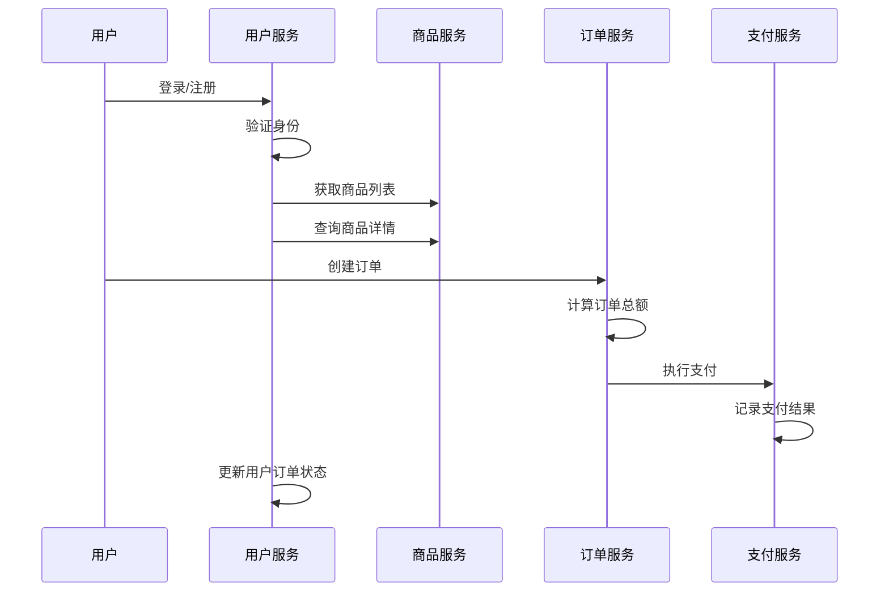
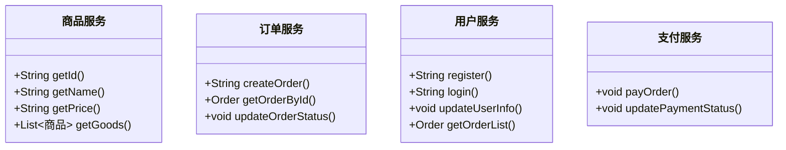
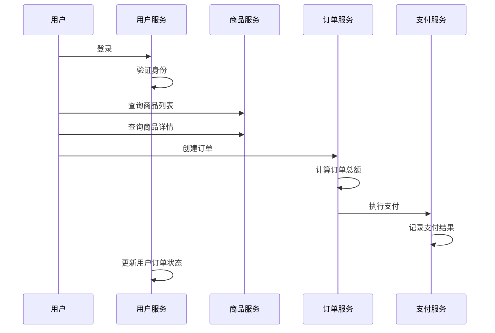

                 

# 微服务架构：设计、实施与运维挑战

## 关键词
- 微服务架构
- 分布式系统
- 服务拆分
- 容器化
- 自动化运维

## 摘要
本文将深入探讨微服务架构的设计、实施与运维挑战。首先，我们将回顾微服务架构的概念、特点、优势与挑战，并分析其发展历程与未来趋势。接着，我们将详细讲解微服务架构的设计原则、核心组件以及实施步骤。随后，我们将分享微服务架构在实际项目中的最佳实践，并总结全文。

## 第1章：微服务架构概述

### 1.1 微服务架构的概念与特点

#### 1.1.1 微服务架构的定义
微服务架构（Microservices Architecture）是一种设计软件系统的方法论，通过将应用程序划分为一组小型的、独立的、可复用的服务来实现系统的模块化和分布式。

#### 1.1.2 微服务架构的核心特点
- **服务小型化**：每个微服务负责独立的功能模块，规模较小，易于开发、测试和部署。
- **分布式**：微服务通常分布在不同的服务器上，通过网络进行通信。
- **独立性**：每个微服务可以独立部署、扩展和升级，不影响其他服务的运行。
- **容器化**：微服务通常部署在容器中，如Docker，提高了服务的可移植性和部署效率。

#### 1.1.3 微服务与传统的单体架构对比
- **模块独立性**：微服务强调模块独立性，而单体架构中的组件通常紧密耦合。
- **部署与扩展**：微服务支持水平扩展，而单体架构通常需要垂直扩展。
- **通信方式**：微服务通过轻量级的通信协议（如HTTP/HTTPS、gRPC等）进行通信，而单体架构可能使用共享数据库进行通信。

### 1.2 微服务架构的优势与挑战

#### 1.2.1 微服务架构的优势
- **可扩展性**：易于水平扩展，提高系统性能。
- **灵活性**：支持快速迭代和持续交付。
- **独立性**：服务独立部署，降低风险。
- **技术多样性**：服务可以采用不同的语言和技术栈进行开发。

#### 1.2.2 微服务架构的挑战
- **分布式复杂性**：需要处理服务间通信、数据一致性等问题。
- **服务管理**：服务数量增多，服务治理和监控变得更加复杂。
- **部署与运维**：需要熟悉容器技术，如Docker和Kubernetes。

### 1.3 微服务架构的发展历程与趋势

#### 1.3.1 微服务架构的发展历程
- **2000年代初**：单体架构主导，企业应用复杂度逐渐增加。
- **2010年**：出现DevOps文化，推动持续集成和持续交付。
- **2011年**：Netflix公开其微服务架构，引发业界关注。
- **2014年**：微服务架构被广泛接受，并成为主流的架构设计方法。

#### 1.3.2 微服务架构的未来趋势
- **服务网格**：服务网格（Service Mesh）成为微服务架构的新兴技术，提供更为高效的服务间通信管理。
- **Serverless架构**：Serverless架构与微服务架构相结合，提供更为灵活的计算模型。
- **自动化与智能化**：利用AI技术，实现微服务的自动化部署、监控和运维。

### 1.4 本章小结
本章介绍了微服务架构的基本概念、特点、优势与挑战，以及其发展历程与未来趋势。通过本章的学习，读者可以全面了解微服务架构的设计理念和实现方法，为后续章节的学习打下基础。

## 第2章：微服务架构设计

### 2.1 微服务架构设计原则

#### 2.1.1 单一职责原则
- **原则说明**：每个微服务应具有明确的职责，专注于完成特定功能。
- **应用示例**：订单处理、用户认证、库存管理等。

#### 2.1.2 松耦合原则
- **原则说明**：微服务之间应保持松耦合，减少依赖关系。
- **应用示例**：使用API网关、消息队列等技术实现服务间的解耦。

#### 2.1.3 持续集成与持续交付
- **原则说明**：实施持续集成和持续交付，确保微服务的快速迭代和可靠部署。
- **应用示例**：使用CI/CD工具，如Jenkins、GitLab CI等。

### 2.2 微服务架构的核心组件

#### 2.2.1 服务注册与发现
- **组件说明**：服务注册中心，用于服务实例的注册与发现。
- **应用示例**：Eureka、Consul等。

#### 2.2.2 API网关
- **组件说明**：API网关，作为客户端与微服务之间的统一入口。
- **应用示例**：Spring Cloud Gateway、Kong等。

#### 2.2.3 服务熔断与限流
- **组件说明**：服务熔断与限流，用于保护系统稳定。
- **应用示例**：Hystrix、Sentinel等。

#### 2.2.4 服务配置中心
- **组件说明**：服务配置中心，用于集中管理服务配置。
- **应用示例**：Spring Cloud Config、Nacos等。

#### 2.2.5 服务监控与日志
- **组件说明**：服务监控与日志，用于实时监控服务的运行状态和性能。
- **应用示例**：Prometheus、ELK（Elasticsearch、Logstash、Kibana）等。

### 2.3 微服务架构的实施步骤

#### 2.3.1 需求分析与设计
- **步骤说明**：根据业务需求，分析并设计微服务的功能模块和接口。
- **工具与方法**：使用UML类图、序列图等工具进行设计。

#### 2.3.2 服务拆分与实现
- **步骤说明**：将应用拆分成多个独立的微服务，并实现各个服务的功能。
- **技术栈选择**：根据业务需求和团队技术栈选择合适的开发语言和框架。

#### 2.3.3 服务部署与运维
- **步骤说明**：使用容器化技术（如Docker）部署微服务，并实施自动化运维。
- **工具与方法**：使用Kubernetes进行服务编排和管理，使用Prometheus进行监控。

### 2.4 本章小结
本章详细介绍了微服务架构的设计原则、核心组件以及实施步骤。通过本章的学习，读者可以了解微服务架构的设计方法和实施过程，为实际项目中的微服务架构设计提供指导。

## 第3章：微服务架构实施案例

### 3.1 项目背景
本项目是一款电商平台，主要包括商品管理、订单管理、用户管理等功能。为了提高系统的可扩展性和灵活性，我们决定采用微服务架构进行设计和开发。

### 3.2 系统功能设计
根据业务需求，我们将系统拆分为以下几个微服务：
1. 商品服务：负责商品信息的存储和管理。
2. 订单服务：负责订单的创建、查询和处理。
3. 用户服务：负责用户信息的存储和管理。
4. 支付服务：负责订单的支付功能。

### 3.3 系统架构设计
以下是本项目的系统架构设计：



### 3.4 系统接口设计
以下是各微服务的接口设计：



### 3.5 系统交互设计
以下是用户请求下单的交互设计：



### 3.6 项目小结
在本章中，我们以一个电商平台项目为例，介绍了微服务架构的实施过程，包括系统功能设计、系统架构设计、系统接口设计和系统交互设计。通过这个案例，读者可以了解微服务架构在实际项目中的应用和实现方法。

## 第4章：微服务架构运维与优化

### 4.1 运维概述
微服务架构的运维与传统单体架构的运维相比，具有以下特点：
- **分布式运维**：需要对多个分布式服务进行运维管理。
- **自动化运维**：借助自动化工具实现服务的部署、监控、故障恢复等。
- **服务监控与日志分析**：实时监控服务状态，通过日志分析发现潜在问题。

### 4.2 容器化与自动化部署
容器化技术（如Docker）为微服务的自动化部署提供了便捷。通过编写Dockerfile，我们可以将服务打包成镜像，然后使用Docker Compose或Kubernetes进行自动化部署。

#### 4.2.1 Dockerfile编写
以下是一个简单的Dockerfile示例：

```dockerfile
FROM java:8-alpine
VOLUME /tmp
ARG JAR_FILE=target/*.jar
COPY ${JAR_FILE} app.jar
ENTRYPOINT ["java","-Djava.security.egd=file:/dev/./urandom","-jar","/app.jar"]
EXPOSE 8080
```

#### 4.2.2 Docker Compose部署
使用Docker Compose可以轻松管理多个服务的部署。以下是一个简单的Docker Compose文件示例：

```yaml
version: '3'
services:
  goods:
    build: ./goods
    ports:
      - "8081:8080"
  orders:
    build: ./orders
    ports:
      - "8082:8080"
  users:
    build: ./users
    ports:
      - "8083:8080"
  payments:
    build: ./payments
    ports:
      - "8084:8080"
```

### 4.3 服务监控与日志分析
服务监控与日志分析是微服务架构运维的重要组成部分。Prometheus和ELK（Elasticsearch、Logstash、Kibana）是常用的监控与日志分析工具。

#### 4.3.1 Prometheus监控
Prometheus是一个开源的服务监控工具，可以实时监控微服务的运行状态。以下是一个简单的Prometheus配置文件示例：

```yaml
scrape_configs:
  - job_name: 'prometheus'
    static_configs:
      - targets: ['localhost:9090']
  - job_name: 'goods'
    metrics_path: '/metrics'
    static_configs:
      - targets: ['goods-service:8080']
  - job_name: 'orders'
    metrics_path: '/metrics'
    static_configs:
      - targets: ['orders-service:8080']
  - job_name: 'users'
    metrics_path: '/metrics'
    static_configs:
      - targets: ['users-service:8080']
  - job_name: 'payments'
    metrics_path: '/metrics'
    static_configs:
      - targets: ['payments-service:8080']
```

#### 4.3.2 ELK日志分析
ELK是一个开源的日志分析平台，可以将微服务的日志集中存储、分析和可视化。以下是一个简单的ELK配置文件示例：

```yaml
version: 5.1
services:
  elasticsearch:
    image: elasticsearch:5.1
    ports:
      - 9200:9200
      - 9300:9300
    environment:
      - cluster.name=elasticsearch
      - node.name=elasticsearch
      - discovery.type=single-node
  logstash:
    image: logstash:5.1
    ports:
      - 5044:5044
      - 5043:5043
    environment:
      - path.config=/etc/logstash/conf.d
    volumes:
      - logstash-config:/etc/logstash/conf.d
    depends_on:
      - elasticsearch
  kibana:
    image: kibana:5.1
    ports:
      - 5601:5601
    depends_on:
      - elasticsearch
    environment:
      - ELASTICSEARCH_URL=http://elasticsearch:9200
      - KIBANA_UID=1000
      - KIBANA_GID=1000
volumes:
  logstash-config:
```

### 4.4 优化与性能调优
在微服务架构中，性能调优是一个重要的环节。以下是一些常见的优化方法：

#### 4.4.1 网络优化
- **服务内网**：将微服务部署在内部网络，减少外部网络访问。
- **负载均衡**：使用负载均衡器（如Nginx、HAProxy）实现服务流量分发，提高系统性能。

#### 4.4.2 数据库优化
- **分库分表**：根据业务特点，对数据库进行分库分表，降低单库单表的性能瓶颈。
- **缓存策略**：使用缓存技术（如Redis、Memcached）减少数据库访问压力。

#### 4.4.3 服务优化
- **服务缓存**：在服务内部实现缓存机制，减少重复计算和数据访问。
- **异步处理**：使用异步处理技术（如消息队列、异步线程）提高系统响应速度。

### 4.5 本章小结
本章介绍了微服务架构的运维与优化方法，包括容器化与自动化部署、服务监控与日志分析、以及性能优化策略。通过本章的学习，读者可以了解微服务架构的运维技巧和优化方法，提高系统的性能和稳定性。

## 第5章：微服务架构的最佳实践与注意事项

### 5.1 最佳实践

#### 5.1.1 服务拆分策略
- **功能模块独立**：根据业务功能将应用拆分成多个独立的服务。
- **避免过度拆分**：避免将功能相似的服务拆分过多，增加系统复杂度。
- **服务职责明确**：确保每个服务具有明确的职责和功能。

#### 5.1.2 服务通信协议
- **轻量级协议**：使用轻量级的通信协议（如HTTP/HTTPS、gRPC）降低通信开销。
- **服务版本控制**：为服务接口设计版本控制机制，避免版本冲突。

#### 5.1.3 服务部署与运维
- **容器化部署**：使用容器技术（如Docker）实现服务的快速部署和迁移。
- **自动化运维**：利用CI/CD工具实现自动化部署、监控和故障恢复。

#### 5.1.4 服务监控与日志分析
- **实时监控**：实时监控服务状态和性能，及时发现并处理问题。
- **日志集中存储**：将日志集中存储，方便日志分析和问题追踪。

### 5.2 注意事项

#### 5.2.1 分布式一致性
- **最终一致性**：微服务架构采用最终一致性，避免分布式一致性带来的复杂性。
- **分布式事务**：谨慎使用分布式事务，考虑使用消息队列等技术实现最终一致性。

#### 5.2.2 服务治理
- **服务注册与发现**：确保服务注册中心稳定运行，避免服务实例丢失。
- **服务监控与审计**：对服务运行状态进行监控，并记录审计日志。

#### 5.2.3 系统安全性
- **服务认证与授权**：对服务访问进行认证和授权，确保服务安全。
- **数据加密**：对敏感数据进行加密处理，保护数据安全。

### 5.3 拓展阅读

- **《微服务设计》**：马丁·福勒（Martin Fowler）的著作，详细介绍了微服务架构的设计原则和实践。
- **《微服务实战》**：布莱恩·罗伯茨（Bryan W. Roberson）的著作，分享了微服务架构的实施经验。
- **《Kubernetes实战》**：Kubernetes官方文档，提供了Kubernetes的详细使用教程。

## 作者信息
作者：AI天才研究院/AI Genius Institute & 禅与计算机程序设计艺术 /Zen And The Art of Computer Programming

