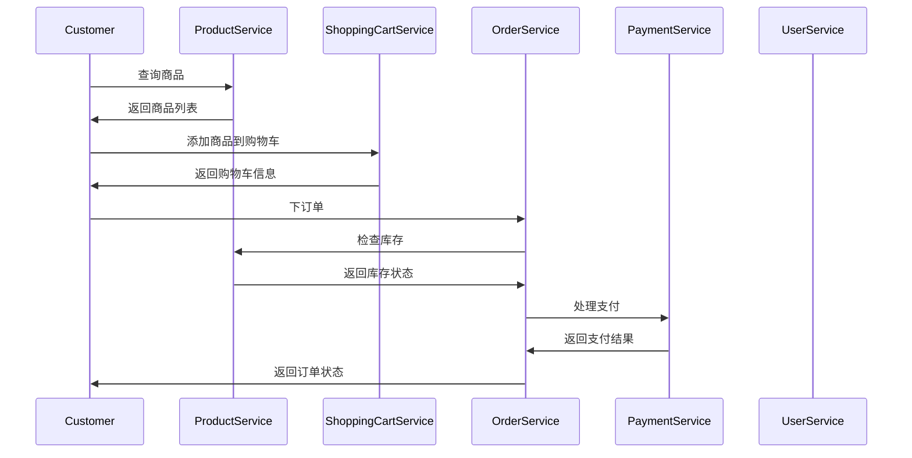
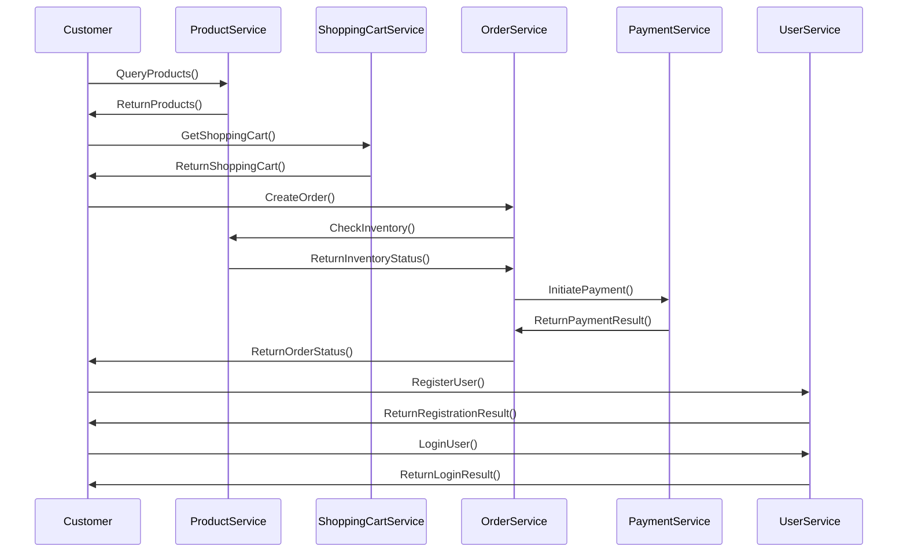

                 

### 文章标题

《微服务架构实践：从单体应用到微服务的演进》

### 关键词

微服务架构、单体应用、服务拆分、服务间通信、服务治理、Docker、Kubernetes、持续集成与持续部署、CI/CD

### 摘要

本文将详细探讨微服务架构的实践，从单体应用到微服务的演进过程。我们将从背景介绍、核心概念、技术栈、架构设计与实现、迁移策略、最佳实践和项目实战等多个方面展开，帮助读者理解微服务架构的优势和挑战，并掌握其实践方法。通过本文的阅读，读者将能够全面了解微服务架构的各个方面，为实际项目中的应用打下坚实基础。

### 目录大纲设计

在撰写《微服务架构实践：从单体应用到微服务的演进》这篇文章时，我们需要首先设计一个详细的目录大纲，以确保文章内容的逻辑清晰、结构紧凑、简单易懂。以下是文章的目录大纲设计：

#### 第一部分：微服务架构概述

1. **背景介绍**
   - **1.1 微服务架构的起源与发展**
     - **1.1.1 背景与起源**
     - **1.1.2 微服务架构的发展历程**
     - **1.1.3 微服务架构的优势与挑战**
   - **1.2 微服务架构的核心概念与联系**
     - **1.2.1 服务拆分与边界**
     - **1.2.2 服务间通信**
     - **1.2.3 服务治理**
     - **1.2.4 概念属性特征对比表格**
     - **1.2.5 ER实体关系图架构的Mermaid流程图**

2. **技术栈**
   - **1.3 Docker与容器化**
   - **1.4 Kubernetes与集群管理**
   - **1.5 服务注册与发现**
   - **1.6 API网关与路由策略**

3. **架构设计与实现**
   - **1.7 设计原则**
   - **1.8 架构模式**
   - **1.9 实现策略**

#### 第二部分：微服务架构实现

4. **微服务架构设计**
   - **2.1 问题场景介绍**
   - **2.2 系统功能设计（领域模型Mermaid类图）**
   - **2.3 系统架构设计（Mermaid架构图）**
   - **2.4 系统接口设计**
   - **2.5 系统交互（Mermaid序列图）**

5. **微服务架构实现策略**
   - **2.6 技术选型**
   - **2.7 服务拆分策略**
   - **2.8 API设计**
   - **2.9 数据管理策略**
   - **2.10 测试策略**

6. **微服务迁移策略**
   - **2.11 迁移方案**
   - **2.12 迁移过程中遇到的挑战与解决方案**
   - **2.13 迁移步骤与实践**

7. **持续集成与持续部署**
   - **2.14 CI/CD的概念与优势**
   - **2.15 常用的CI/CD工具**
   - **2.16 CI/CD流程设计**
   - **2.17 持续交付与部署策略**

#### 第三部分：微服务最佳实践

8. **服务治理**
   - **3.1 服务治理的概念与重要性**
   - **3.2 服务监控与告警**
   - **3.3 服务配置管理**
   - **3.4 服务版本管理**

9. **性能优化**
   - **3.5 性能优化策略**
   - **3.6 性能监控与调优**
   - **3.7 缓存策略**
   - **3.8 负载均衡**

10. **安全性**
    - **3.9 安全性原则**
    - **3.10 服务安全策略**
    - **3.11 安全工具与框架**

11. **监控与告警**
    - **3.12 监控体系设计**
    - **3.13 告警策略**
    - **3.14 日志管理**

#### 第四部分：项目实战

12. **微服务项目环境搭建**
    - **4.1 环境需求**
    - **4.2 环境搭建**

### 设计原则与步骤

在开始撰写这篇文章之前，我们需要遵循以下设计原则和步骤：

1. **文章结构**：确保文章的每个部分都有清晰的章节标题，每个章节内部的结构也要清晰，便于读者阅读和理解。
2. **逻辑连贯性**：文章的内容需要保持逻辑连贯，从背景介绍到核心概念，再到技术栈和实现策略，每个部分都要紧密联系，形成一个完整的体系。
3. **深入浅出**：在讲解复杂的技术概念时，需要使用简单易懂的语言，并通过实例和图表来帮助读者更好地理解。
4. **示例丰富**：在适当的地方提供代码示例、流程图和架构图，以增强文章的可读性和实用性。
5. **参考文献**：在文章的最后提供参考文献，以供读者进一步学习和研究。

#### 目录大纲设计示例

为了更好地展示目录大纲的设计，以下是一个具体的示例：

---

## 第一部分：微服务架构概述

### 1.1 微服务架构的起源与发展

#### 1.1.1 背景与起源

微服务架构的起源可以追溯到2000年代初期，当时互联网企业开始采用分布式系统来应对日益增长的业务需求。然而，随着业务规模的扩大，传统单体应用开始暴露出许多问题，如扩展性差、维护困难等。为了解决这些问题，开发者们开始探索一种新的架构风格，即微服务架构。

#### 1.1.2 微服务架构的发展历程

微服务架构的概念最早由Martin Fowler和James Lewis在2011年提出。自此之后，微服务架构迅速发展，并成为业界广泛接受的一种架构风格。2014年，Docker的出现进一步推动了微服务架构的实践。

#### 1.1.3 微服务架构的优势与挑战

微服务架构具有许多优势，如高扩展性、高可用性、易于部署和测试等。然而，它也带来了一些挑战，如服务治理、数据一致性、网络通信等问题。

### 1.2 微服务架构的核心概念与联系

#### 1.2.1 服务拆分与边界

微服务架构的核心思想是将大型单体应用拆分为多个小型、独立的服务。每个服务都有自己的业务逻辑和数据存储，通过服务间通信来完成系统的整体功能。

#### 1.2.2 服务间通信

服务间通信是微服务架构的重要组成部分。常用的通信方式包括RESTful API、gRPC、消息队列等。

#### 1.2.3 服务治理

服务治理包括服务注册与发现、服务监控、服务配置管理等内容。它确保了微服务架构的高可用性和可维护性。

#### 1.2.4 概念属性特征对比表格

为了更好地理解微服务架构的核心概念，我们提供了一个概念属性特征对比表格。

| 概念     | 特征                          |
|----------|------------------------------|
| 服务拆分 | 小型、独立的服务单元          |
| 服务间通信 | 高效、可靠的通信机制          |
| 服务治理 | 确保服务的高可用性和可维护性  |

#### 1.2.5 ER实体关系图架构的Mermaid流程图


### 1.3 微服务架构中的技术栈

#### 1.3.1 Docker与容器化

Docker是一种流行的容器化技术，它允许开发者在隔离的容器中运行应用程序。容器化技术使得微服务的部署和运维变得更加简单和高效。

#### 1.3.2 Kubernetes与集群管理

Kubernetes是一个开源的容器编排平台，它能够自动部署、扩展和管理容器化应用程序。Kubernetes在微服务架构中扮演着重要的角色。

#### 1.3.3 服务注册与发现

服务注册与发现是微服务架构中的关键机制，它确保了服务之间的可靠通信。常用的服务注册与发现工具包括Consul、Eureka等。

#### 1.3.4 API网关与路由策略

API网关是微服务架构中的重要组件，它提供了统一的入口点，并负责路由请求到相应的微服务。常用的API网关工具包括Zuul、Kong等。

### 1.4 微服务架构的设计原则与模式

#### 1.4.1 设计原则

微服务架构的设计原则包括单一职责原则、松耦合原则、高内聚原则等。这些原则确保了微服务的可维护性和可扩展性。

#### 1.4.2 架构模式

微服务架构可以采用多种架构模式，如MVC、微前端等。每种架构模式都有其适用场景和优缺点。

#### 1.4.3 实现策略

实现微服务架构需要考虑多个方面，如服务拆分策略、API设计、数据管理策略等。实现策略的选择将直接影响微服务架构的性能和稳定性。

---

通过以上示例，我们可以看到，一个详细且逻辑清晰的目录大纲可以帮助读者更好地理解文章的内容和结构。接下来，我们将按照这个大纲逐步撰写文章的各个部分。希望这个示例能够对您有所帮助。如果您有任何问题或建议，欢迎随时提出。让我们一起努力，创作出一篇高质量的技术博客文章！### 第一部分：微服务架构概述

#### 1.1 微服务架构的起源与发展

##### **1.1.1 背景与起源**

微服务架构的起源可以追溯到2000年代初期，当时互联网企业开始采用分布式系统来应对日益增长的业务需求。传统的单体应用（Monolithic Application）在当时是一种常见的架构风格，它将应用程序的所有功能集中在一个单一的代码库中。然而，随着业务的快速发展，单体应用开始暴露出许多问题，如扩展性差、维护困难、部署复杂等。这些问题使得开发者和企业开始寻找一种新的解决方案，微服务架构应运而生。

微服务架构的概念最早由Martin Fowler和James Lewis在2011年提出。他们提出，微服务架构是将大型单体应用拆分为多个小型、独立的服务单元，每个服务单元都有自己的业务逻辑和数据存储，通过服务间通信来完成系统的整体功能。这一概念迅速得到了业界的广泛认同，并成为了一种新兴的架构风格。

##### **1.1.2 微服务架构的发展历程**

微服务架构的发展历程可以分为几个阶段：

1. **早期探索阶段（2011-2014年）**：在这一阶段，微服务架构的概念被提出，并开始在一些互联网企业中得到实践。Docker的出现为微服务架构的实现提供了基础设施支持，使得开发者可以轻松地创建、部署和管理容器化的微服务。

2. **快速增长阶段（2014-2017年）**：随着Docker的普及，微服务架构得到了快速的发展。许多企业开始采用微服务架构来重构或开发新的应用程序，以实现更高的灵活性和可扩展性。

3. **成熟与应用阶段（2017年至今）**：在这一阶段，微服务架构已经逐渐成熟，并在多个行业中得到广泛应用。同时，许多开源框架和工具（如Kubernetes、Spring Boot、Netflix OSS等）的出现，为微服务架构的实现提供了丰富的技术支持。

##### **1.1.3 微服务架构的优势与挑战**

微服务架构具有许多优势，但也带来了一些挑战：

**优势：**

1. **高扩展性**：微服务架构允许开发者根据业务需求独立扩展某个服务，而不影响其他服务的运行。
2. **高可用性**：微服务架构中，每个服务都是独立的，一个服务的故障不会影响整个系统的运行。
3. **易于部署和测试**：由于每个服务都是独立的，开发者可以单独部署和测试某个服务，提高了开发和维护的效率。
4. **松耦合**：微服务架构中的服务之间通常采用轻量级的通信机制（如RESTful API、gRPC等），使得服务之间的耦合度较低，易于维护和升级。

**挑战：**

1. **服务治理**：在微服务架构中，服务数量众多，如何有效地管理和监控这些服务成为一个挑战。
2. **数据一致性**：微服务架构中，每个服务都有自己的数据存储，如何保证数据的一致性是一个重要问题。
3. **网络通信**：服务间通信依赖于网络，网络延迟和故障可能会影响系统的性能和可用性。
4. **分布式事务**：在微服务架构中，如何实现分布式事务是一个复杂的问题。

总的来说，微服务架构虽然带来了一些挑战，但它的优势使其成为应对复杂业务需求的一种有效架构风格。

#### 1.2 微服务架构的核心概念与联系

##### **1.2.1 服务拆分与边界**

微服务架构的核心思想是将大型单体应用拆分为多个小型、独立的服务单元，每个服务单元专注于完成特定的业务功能。这种拆分通常基于业务逻辑的划分，而不是传统的技术层面的划分。通过服务拆分，我们可以实现以下几个目标：

1. **高内聚、低耦合**：每个服务单元都高度内聚，同时与其他服务单元的耦合度较低，使得服务之间可以独立开发和部署。
2. **独立扩展性**：每个服务单元都可以根据业务需求独立扩展，而不影响其他服务单元的运行。
3. **易于维护和测试**：由于服务单元较小，开发者可以更容易地理解和维护代码，同时也能更方便地进行单元测试和集成测试。

在确定服务边界时，需要考虑以下几个因素：

1. **业务领域**：根据业务领域的不同，将相关的功能模块划分为不同的服务。
2. **职责划分**：确保每个服务单元的职责明确，避免出现功能重叠或职责不明的情况。
3. **独立部署**：服务单元应具备独立的部署能力，使得可以单独部署和升级某个服务，而不影响其他服务。

##### **1.2.2 服务间通信**

在微服务架构中，服务间通信是确保系统正常运行的关键。服务间通信可以通过多种方式进行，如RESTful API、gRPC、消息队列等。

1. **RESTful API**：RESTful API是一种常用的服务间通信方式，它基于HTTP协议，使用标准的HTTP方法（如GET、POST、PUT、DELETE）进行通信。RESTful API具有简单、易用、可扩展等优点，适用于大多数场景。

2. **gRPC**：gRPC是一种高性能、跨语言的远程过程调用（RPC）框架，它基于HTTP/2协议，支持多种数据格式（如JSON、Protocol Buffers等）。gRPC特别适合在分布式系统中使用，可以提供高效的通信能力。

3. **消息队列**：消息队列是一种异步通信机制，通过将消息发送到队列中，使得服务之间可以独立运行。消息队列适用于需要解耦、异步处理或分布式处理场景。

选择合适的通信方式时，需要考虑以下几个因素：

1. **性能要求**：对于高性能、低延迟的场景，可以选择gRPC或直接使用HTTP/2协议。对于异步处理、解耦的场景，可以选择消息队列。
2. **开发难度**：RESTful API相对简单，易于开发和维护。gRPC和消息队列虽然性能更好，但开发难度较大，需要额外的配置和运维。
3. **兼容性**：确保所选通信方式与现有的技术和工具兼容，避免引入不必要的复杂性。

##### **1.2.3 服务治理**

服务治理是微服务架构中的一项重要任务，它包括服务注册与发现、服务监控、服务配置管理等内容。良好的服务治理能够确保微服务架构的高可用性和可维护性。

1. **服务注册与发现**：服务注册与发现是微服务架构中的关键机制，它使得服务可以动态地被发现和调用。服务注册是指在服务启动时，将其信息注册到一个注册中心，服务发现是指消费者在需要调用服务时，从注册中心获取服务的信息。

常用的服务注册与发现工具包括Consul、Eureka、Zookeeper等。

2. **服务监控**：服务监控是确保服务正常运行的重要手段。通过监控，可以及时发现服务故障、性能问题等，并采取相应的措施。常用的服务监控工具包括Prometheus、Grafana、ELK（Elasticsearch、Logstash、Kibana）等。

3. **服务配置管理**：服务配置管理是确保服务在不同环境（如开发、测试、生产）中能够正确运行的关键。通过配置管理工具，可以统一管理服务的配置信息，如数据库连接字符串、API密钥等。常用的配置管理工具包括Spring Cloud Config、HashiCorp Vault等。

##### **1.2.4 概念属性特征对比表格**

为了更好地理解微服务架构的核心概念，我们可以提供一个概念属性特征对比表格，列出服务拆分、服务间通信、服务治理等核心概念的主要特征。

| 概念     | 特征                          |
|----------|------------------------------|
| 服务拆分 | 小型、独立的服务单元          |
| 服务间通信 | 高效、可靠的通信机制          |
| 服务治理 | 确保服务的高可用性和可维护性  |

##### **1.2.5 ER实体关系图架构的Mermaid流程图**

为了更直观地展示微服务架构中的实体关系，我们可以使用Mermaid绘制一个ER实体关系图。

```mermaid
erDiagram
  ServiceA  ||--|{ Customer }  : Customer has orders in this service
  ServiceB  ||--|{ Product }   : Product information is stored here
  ServiceC  ||--|{ Order }     : Orders are processed in this service
```

在这个ER实体关系图中，ServiceA、ServiceB和ServiceC分别表示三个不同的服务，Customer、Product和Order分别表示与这些服务相关的实体。通过这种图形化的展示，可以帮助读者更好地理解微服务架构中的数据关系和系统设计。

总的来说，微服务架构的核心概念与联系是确保系统能够高效、可靠地运行的关键。通过合理的服务拆分、服务间通信和服务治理，我们可以构建出具有高扩展性、高可用性和易于维护的微服务系统。在接下来的章节中，我们将进一步探讨微服务架构的技术栈、设计原则与模式、实现策略和最佳实践等内容。

#### 1.3 微服务架构中的技术栈

##### **1.3.1 Docker与容器化**

Docker是一种开源的应用容器引擎，它允许开发者将应用程序及其依赖环境打包到一个轻量级的容器中，然后部署到任何支持Docker的操作系统上。容器化技术为微服务架构提供了以下几个关键优势：

1. **轻量级**：容器比虚拟机更加轻量，因为它不依赖于宿主机的操作系统，而是直接运行在宿主机的内核之上。这使得容器在启动和停止时更加高效。
2. **隔离性**：容器提供了严格的资源隔离，确保了不同容器之间不会互相干扰。这种隔离性有助于提高系统的稳定性和安全性。
3. **可移植性**：容器可以轻松地在不同的环境中进行部署，如开发、测试、生产等。这种可移植性使得微服务的开发和部署过程更加灵活。

Docker的基本概念包括：

- **镜像（Image）**：镜像是一个静态的、只读的模板，用于创建容器。它包含了应用程序的代码、依赖库和运行时环境。
- **容器（Container）**：容器是基于镜像创建的动态实例，可以执行应用程序的任务。容器是可执行的、独立的运行环境。
- **仓库（Repository）**：仓库是存储镜像的中央存储库，类似于版本控制系统。Docker Hub是Docker官方的镜像仓库，开发者可以在这里共享和下载镜像。

使用Docker进行微服务部署时，需要遵循以下步骤：

1. **编写Dockerfile**：Dockerfile是一个文本文件，用于定义如何构建Docker镜像。通过编写Dockerfile，我们可以指定基础镜像、安装依赖库、复制应用程序代码等步骤。
2. **构建镜像**：使用Dockerfile构建镜像，将其上传到仓库中。
3. **运行容器**：从仓库中下载镜像，并使用docker run命令运行容器。

##### **1.3.2 Kubernetes与集群管理**

Kubernetes（简称K8s）是一个开源的容器编排平台，它用于自动化部署、扩展和管理容器化应用程序。Kubernetes在微服务架构中扮演着重要的角色，提供了以下几个关键功能：

1. **自动化部署和扩展**：Kubernetes可以根据定义的配置文件自动部署应用程序，并可以根据负载动态扩展或缩小集群规模。
2. **服务发现和负载均衡**：Kubernetes提供了服务发现机制，使得应用程序可以通过集群内部的DNS名称或负载均衡器访问其他服务。负载均衡器可以均匀地将流量分配到不同的容器实例，确保系统的可用性和性能。
3. **自我修复**：Kubernetes可以监控容器的健康状态，并在容器出现故障时自动重启或替换故障容器，确保系统的高可用性。
4. **资源管理**：Kubernetes提供了资源管理功能，包括计算资源（CPU、内存）、存储资源等，开发者可以根据需求合理分配资源。

Kubernetes的核心概念包括：

- **节点（Node）**：节点是Kubernetes集群中的工作机，负责运行容器。每个节点都运行着Kubernetes的运行时组件（如kubelet、kube-proxy等）。
- **Pod**：Pod是Kubernetes中的基本部署单位，它包含一个或多个容器。Pod可以看作是一个运行在节点上的容器组。
- **部署（Deployment）**：部署用于管理Pod的创建和更新。通过部署，我们可以定义Pod的副本数量、容器镜像、容器配置等。
- **服务（Service）**：服务是一个抽象的概念，用于将一组Pod暴露给外部网络。服务可以通过命名空间、标签等选择器来选择特定的Pod。

使用Kubernetes进行微服务部署时，需要遵循以下步骤：

1. **搭建Kubernetes集群**：在本地或云环境中搭建Kubernetes集群。可以使用工具如kubeadm、Minikube等来快速搭建集群。
2. **编写部署配置文件**：使用YAML格式编写Kubernetes部署配置文件（如Deployment、Service等），定义应用程序的部署细节。
3. **应用配置文件**：将配置文件应用到Kubernetes集群中，部署应用程序。

##### **1.3.3 服务注册与发现**

服务注册与发现是微服务架构中的关键机制，它使得服务可以动态地被发现和调用。在Kubernetes中，服务注册与发现可以通过以下方式进行：

1. **内部DNS**：Kubernetes为每个服务提供了一个内部DNS名称，客户端可以使用这个DNS名称来查找服务。内部DNS名称的格式为<服务名>.<命名空间>.svc.cluster.local，例如：my-service.default.svc.cluster.local。
2. **负载均衡器**：Kubernetes可以使用集群内部的负载均衡器（如NodePort、LoadBalancer等）将流量路由到服务。负载均衡器可以根据用户的IP地址、请求路径等策略进行流量分配。
3. **服务发现工具**：可以使用开源的服务发现工具（如Consul、Eureka等）来管理服务的注册和发现。这些工具提供了更加灵活和可扩展的服务发现机制。

服务注册与发现的步骤包括：

1. **服务启动时注册**：在服务启动时，将其信息注册到一个服务注册中心。
2. **服务消费时发现**：客户端在调用服务时，从服务注册中心获取服务的IP地址和端口号，然后进行通信。

##### **1.3.4 API网关与路由策略**

API网关是微服务架构中的重要组件，它提供了统一的入口点，并负责路由请求到相应的微服务。API网关的主要功能包括：

1. **请求路由**：将客户端的请求根据路由策略路由到相应的微服务。
2. **请求聚合**：将多个微服务的响应聚合为一个完整的响应，减少客户端的调用次数。
3. **安全认证**：对客户端进行认证和授权，确保只有合法的用户可以访问微服务。
4. **监控与日志**：收集微服务的监控数据和日志信息，提供统一的监控和日志管理。

常用的API网关工具包括：

1. **Zuul**：Zuul是Netflix开源的API网关框架，它提供了丰富的路由、过滤和监控功能。
2. **Kong**：Kong是一个高性能、可扩展的API网关，它支持多种协议（如HTTP、WebSocket等），并提供自定义路由和插件功能。
3. **Spring Cloud Gateway**：Spring Cloud Gateway是Spring Cloud组件之一，它提供了基于Spring WebFlux的API网关功能，易于与Spring生态系统集成。

路由策略的设置可以根据以下方式进行：

1. **路径匹配**：根据请求的URL路径匹配到相应的微服务。
2. **参数匹配**：根据请求的查询参数匹配到相应的微服务。
3. **自定义路由**：通过自定义路由规则，实现复杂的路由策略。

总的来说，微服务架构中的技术栈包括Docker、Kubernetes、服务注册与发现、API网关等。这些技术相互配合，为开发者提供了强大的微服务开发和部署能力。在接下来的章节中，我们将进一步探讨微服务架构的设计原则、实现策略和最佳实践等内容，帮助读者深入理解和应用微服务架构。

#### 1.4 微服务架构的设计原则与模式

##### **1.4.1 设计原则**

微服务架构的设计原则是确保系统能够灵活、可扩展、高可用、易于维护的关键。以下是微服务架构中常见的一些设计原则：

1. **单一职责原则**：每个服务应负责单一的、明确的业务功能，避免功能重叠和职责不明。单一职责原则有助于降低服务的复杂性，提高可维护性和可扩展性。

2. **松耦合原则**：服务之间应尽量保持松耦合，通过轻量级的通信机制（如RESTful API、gRPC等）进行交互。松耦合使得服务可以独立开发、部署和扩展，提高了系统的灵活性和可维护性。

3. **高内聚原则**：每个服务应具有较高的内聚度，即服务内部的代码和数据应紧密关联，共同完成一个业务功能。高内聚有助于提高服务的独立性和可维护性。

4. **独立部署原则**：每个服务应具备独立的部署能力，可以单独部署和升级，而不影响其他服务的运行。独立部署原则提高了系统的可维护性和部署效率。

5. **可观测性原则**：系统应具备良好的可观测性，包括日志记录、监控、告警等。可观测性有助于及时发现问题并进行故障排查，确保系统的稳定性和可靠性。

6. **数据一致性原则**：在分布式系统中，数据一致性是一个重要挑战。应采用合适的分布式数据一致性策略（如最终一致性、强一致性等），确保数据的一致性和可靠性。

##### **1.4.2 架构模式**

微服务架构可以采用多种架构模式，以适应不同的业务需求和系统场景。以下是几种常见的微服务架构模式：

1. **MVC模式**：MVC（Model-View-Controller）模式是一种经典的软件架构模式，适用于构建Web应用。在MVC模式中，Model代表数据模型，View代表用户界面，Controller负责处理用户请求并更新Model和View。MVC模式有助于实现服务的模块化和可扩展性。

2. **微前端模式**：微前端模式是将前端应用拆分为多个小型、独立的前端服务，每个服务负责一个特定的功能模块。微前端模式可以提高前端的开发和部署效率，同时确保系统的灵活性和可扩展性。

3. **Event-Driven模式**：Event-Driven模式是基于事件驱动的架构模式，适用于处理实时数据处理和消息传递。在Event-Driven模式中，系统中的各个服务通过发布和订阅事件来进行通信，实现模块间的解耦和异步处理。

4. **CQRS模式**：CQRS（Command Query Responsibility Segregation）模式是一种将命令（Command）和查询（Query）分离的架构模式。在CQRS模式中，命令服务负责处理数据的变更操作，查询服务负责处理数据的查询操作。CQRS模式可以提高系统的性能和可扩展性。

5. **无状态服务模式**：无状态服务模式是一种设计原则，要求服务不存储任何状态信息。无状态服务使得服务可以更加灵活地扩展和部署，同时也降低了系统复杂性。

##### **1.4.3 实现策略**

实现微服务架构需要考虑多个方面，包括服务拆分策略、API设计、数据管理策略等。以下是几种常见的实现策略：

1. **服务拆分策略**：
   - **按业务领域拆分**：根据业务领域的不同，将相关的功能模块划分为不同的服务。例如，电子商务系统可以将购物车、订单处理、支付等模块拆分为独立的服务。
   - **按功能模块拆分**：根据功能模块的不同，将相关的功能拆分为不同的服务。例如，库存管理系统可以将库存查询、库存更新等模块拆分为独立的服务。
   - **按数据访问拆分**：根据数据访问的不同，将相关的功能拆分为不同的服务。例如，博客系统可以将文章管理、评论管理、用户管理等模块拆分为独立的服务。

2. **API设计**：
   - **RESTful API**：RESTful API是一种基于HTTP协议的API设计风格，适用于构建轻量级、可扩展的微服务。RESTful API使用标准的HTTP方法（如GET、POST、PUT、DELETE）进行操作，并通过URL定位资源。
   - **gRPC API**：gRPC是一种高性能的RPC框架，适用于构建高性能、跨语言的微服务。gRPC使用Protobuf作为数据序列化格式，支持多种编程语言和平台。

3. **数据管理策略**：
   - **分布式数据库**：分布式数据库可以提供高可用性和高性能，适用于处理大规模数据。例如，可以采用分库分表策略，将数据水平切分到多个数据库实例中。
   - **消息队列**：消息队列可以提供异步通信和数据传输功能，适用于处理高并发和异步操作。例如，可以使用消息队列来实现订单处理、库存更新等模块的异步通信。
   - **数据聚合**：数据聚合是将多个服务的数据汇总到一个统一的数据源中。通过数据聚合，可以简化数据访问和查询操作，提高系统的性能和可维护性。

通过遵循上述设计原则和实现策略，开发者可以构建出具有高扩展性、高可用性和易于维护的微服务系统。在接下来的章节中，我们将进一步探讨微服务的迁移策略、持续集成与持续部署（CI/CD）、最佳实践等内容，帮助读者全面掌握微服务架构的实践方法。

#### 2.1 微服务架构设计

##### **2.1.1 问题场景介绍**

假设我们正在开发一个电子商务平台，该平台需要提供以下功能：

- 商品浏览和搜索
- 购物车管理
- 订单处理
- 支付处理
- 用户管理

目前，我们的系统是一个单体应用，所有功能都集中在一个代码库中。随着业务的发展，我们发现单体应用在扩展性、可维护性等方面存在较大问题。为了解决这些问题，我们决定将系统重构为微服务架构。

##### **2.1.2 系统功能设计（领域模型Mermaid类图）**

为了设计微服务架构，我们首先需要对系统的功能进行建模。以下是一个电子商务平台的领域模型，使用Mermaid类图进行展示：

```mermaid
classDiagram
    Customer <<entity>> Customer
    Product <<entity>> Product
    ShoppingCart <<entity>> ShoppingCart
    Order <<entity>> Order
    Payment <<entity>> Payment
    User <<entity>> User

    Customer <|.. ShoppingCart
    Customer <|.. Order
    Product <|.. Order
    ShoppingCart <|.. Order
    Payment <|.. Order
```

在这个领域模型中，我们定义了以下几个核心实体：

- **Customer（用户）**：代表电子商务平台上的用户，包括用户的基本信息和购物记录。
- **Product（商品）**：代表平台上的商品信息，包括商品名称、价格、库存等。
- **ShoppingCart（购物车）**：代表用户在购物车中添加的商品，包括商品ID、数量等信息。
- **Order（订单）**：代表用户生成的订单，包括订单号、订单状态、订单明细等。
- **Payment（支付）**：代表订单的支付信息，包括支付方式、支付状态等。
- **User（用户）**：代表电子商务平台上的用户，与Customer实体关联。

通过领域模型，我们可以清晰地定义各个实体之间的关系，为后续的服务拆分提供依据。

##### **2.1.3 系统架构设计（Mermaid架构图）**

在确定了系统的功能模型后，我们需要设计系统的架构。以下是一个电子商务平台的系统架构，使用Mermaid架构图进行展示：



在这个系统架构中，我们定义了以下几个服务：

- **ProductService（商品服务）**：负责处理商品相关的功能，如查询商品、检查库存等。
- **ShoppingCartService（购物车服务）**：负责处理购物车相关的功能，如添加商品、获取购物车信息等。
- **OrderService（订单服务）**：负责处理订单相关的功能，如创建订单、处理支付等。
- **PaymentService（支付服务）**：负责处理支付相关的功能，如支付处理、支付结果通知等。
- **UserService（用户服务）**：负责处理用户相关的功能，如用户注册、用户登录等。

各个服务之间通过API进行通信，实现了系统功能的拆分和模块化。通过Mermaid架构图，我们可以直观地展示系统中的服务关系和交互流程。

##### **2.1.4 系统接口设计**

在微服务架构中，接口设计是确保服务间通信顺畅的重要环节。以下是一个电子商务平台的系统接口设计示例：

```mermaid
interfaceStyle fill: #2a3c4c, stroke: #2a3c4c

interface ProductService {
    queryProducts: GetProductsResponse
    addProduct: AddProductResponse
    checkInventory: CheckInventoryResponse
}

interface ShoppingCartService {
    getShoppingCart: GetShoppingCartResponse
    addToShoppingCart: AddToShoppingCartResponse
    removeFromShoppingCart: RemoveFromShoppingCartResponse
}

interface OrderService {
    createOrder: CreateOrderResponse
    getOrderStatus: GetOrderStatusResponse
    processPayment: ProcessPaymentResponse
}

interface PaymentService {
    initiatePayment: InitiatePaymentResponse
    verifyPayment: VerifyPaymentResponse
}

interface UserService {
    registerUser: RegisterUserResponse
    loginUser: LoginUserResponse
}
```

在这个接口设计中，我们定义了各个服务的API接口，包括查询商品、添加商品、检查库存、获取购物车信息、添加商品到购物车、删除购物车中的商品、创建订单、获取订单状态、处理支付、支付结果验证、用户注册、用户登录等。每个接口都返回相应的响应对象，以便客户端进行后续处理。

##### **2.1.5 系统交互（Mermaid序列图）**

为了更直观地展示系统中的服务交互过程，我们可以使用Mermaid序列图进行展示：



在这个序列图中，我们展示了用户与各个服务之间的交互过程。用户首先查询商品，然后添加商品到购物车，创建订单，进行支付，并最终获取订单状态。通过序列图，我们可以清晰地了解系统中的服务交互逻辑和流程。

通过以上系统功能设计、系统架构设计、系统接口设计和系统交互设计，我们完成了电子商务平台的微服务架构设计。接下来，我们将进一步探讨微服务的实现策略、迁移策略、持续集成与持续部署（CI/CD）等内容，为后续的微服务实践奠定基础。

#### 2.2 微服务架构实现策略

##### **2.2.1 技术选型**

在实现微服务架构时，选择合适的技术栈是至关重要的。以下是一些常见的技术选型建议：

1. **编程语言**：微服务的编程语言应该易于学习和使用，且具有良好的生态系统和社区支持。常用的编程语言包括Java、Python、Go等。

2. **框架**：选择适合的框架可以简化开发过程，提高开发效率。常用的框架包括Spring Boot（Java）、Django（Python）、Gin（Go）等。

3. **服务注册与发现**：选择可靠的服务注册与发现工具，如Consul、Eureka等，可以确保服务的高可用性和动态发现。

4. **API网关**：API网关可以帮助管理服务路由、安全认证、日志记录等功能。常用的API网关包括Zuul、Kong等。

5. **消息队列**：消息队列可以用于实现异步通信和分布式事务，常用的消息队列包括RabbitMQ、Kafka等。

6. **数据库**：根据业务需求选择合适的数据库技术，如关系型数据库（MySQL、PostgreSQL等）或NoSQL数据库（MongoDB、Cassandra等）。

##### **2.2.2 服务拆分策略**

服务拆分是微服务架构实现的关键步骤，以下是一些常用的服务拆分策略：

1. **按业务领域拆分**：根据业务领域的不同，将相关功能拆分为独立的服务。例如，可以将购物车、订单处理、支付等模块拆分为独立的服务。

2. **按功能模块拆分**：根据功能模块的不同，将相关功能拆分为独立的服务。例如，可以将用户管理、商品管理、库存管理等模块拆分为独立的服务。

3. **按数据访问拆分**：根据数据访问的不同，将相关功能拆分为独立的服务。例如，可以将订单管理、评论管理、用户管理等模块拆分为独立的服务。

4. **按服务粒度拆分**：根据服务的粒度大小，将相关功能拆分为独立的服务。例如，可以将用户认证、用户信息管理、用户行为分析等模块拆分为独立的服务。

在拆分服务时，需要考虑以下几个方面：

- **服务的独立性**：确保每个服务都能够独立部署和扩展，避免服务之间的依赖。
- **服务的职责明确**：每个服务应负责明确的业务功能，避免功能重叠和职责不明。
- **服务的可扩展性**：根据业务需求，可以灵活地增加或减少服务的实例数量。
- **服务的可测试性**：每个服务都应该具有良好的单元测试和集成测试能力。

##### **2.2.3 API设计**

API设计是微服务架构实现的核心，以下是一些常用的API设计原则和策略：

1. **RESTful API设计**：RESTful API是一种流行的API设计风格，它基于HTTP协议，使用标准的HTTP方法（GET、POST、PUT、DELETE等）进行操作。RESTful API具有简单、易用、可扩展等优点。

2. **版本控制**：为了避免对现有API的破坏性更新，可以使用版本控制策略。例如，可以为每个服务版本增加一个版本号，如`/api/v1/`或`/api/v2/`。

3. **参数验证**：确保API接收的参数符合预期，可以使用参数验证策略。例如，可以使用JSON Schema、正则表达式等进行参数验证。

4. **错误处理**：良好的错误处理策略可以帮助开发者快速定位和解决问题。可以使用标准的HTTP状态码（如200、400、500等）来表示不同类型的错误。

5. **安全性**：确保API的安全性，可以使用OAuth 2.0、JWT等认证和授权机制。

6. **文档生成**：使用Swagger、OpenAPI等工具自动生成API文档，方便开发者使用和测试API。

##### **2.2.4 数据管理策略**

数据管理策略是确保数据一致性、可靠性和性能的关键。以下是一些常用的数据管理策略：

1. **分布式数据库**：使用分布式数据库可以提供高可用性和高性能。常用的分布式数据库包括MongoDB、Cassandra等。

2. **数据分片**：通过数据分片可以将数据分散存储在不同的节点上，提高系统的扩展性和性能。

3. **分布式事务**：在分布式系统中，如何处理分布式事务是一个重要问题。可以使用最终一致性、强一致性等策略来处理分布式事务。

4. **缓存**：使用缓存可以减少数据库的访问压力，提高系统的性能。常用的缓存技术包括Redis、Memcached等。

5. **数据同步**：在微服务架构中，数据同步是确保数据一致性的重要手段。可以使用消息队列、分布式事务等手段实现数据同步。

##### **2.2.5 测试策略**

测试是确保微服务架构稳定运行的重要环节。以下是一些常用的测试策略：

1. **单元测试**：对每个服务进行单元测试，确保服务的功能正确实现。

2. **集成测试**：对服务之间的交互进行集成测试，确保服务之间的协作正常。

3. **性能测试**：对系统进行性能测试，确保系统在高并发情况下能够稳定运行。

4. **安全测试**：对系统进行安全测试，确保系统的安全性。

5. **自动化测试**：使用自动化测试工具（如JUnit、Selenium等）进行自动化测试，提高测试效率和覆盖率。

通过遵循上述实现策略，开发者可以构建出高质量的微服务架构，实现系统的灵活、可扩展和高可用。在接下来的章节中，我们将进一步探讨微服务的迁移策略、持续集成与持续部署（CI/CD）、最佳实践等内容，帮助读者全面掌握微服务架构的实践方法。

#### 2.3 微服务迁移策略

从单体应用到微服务的迁移是一个复杂的过程，需要仔细规划和管理。以下是一个典型的迁移策略，包括技术选型、测试策略和部署策略。

##### **2.3.1 迁移方案**

1. **逐步迁移**：逐步迁移是一种常见的迁移策略，通过逐步将单体应用的各个模块迁移到微服务架构，降低迁移过程中的风险。具体步骤如下：

   - **评估单体应用**：评估单体应用的模块、功能、依赖关系等，确定哪些模块可以独立迁移。
   - **确定迁移顺序**：根据业务优先级和模块依赖关系，确定迁移的顺序。
   - **独立部署**：确保每个迁移后的微服务可以独立部署和运行，降低对其他模块的影响。

2. **并行开发**：在迁移过程中，可以同时进行新旧系统的开发和测试，确保迁移过程中业务连续性。具体步骤如下：

   - **并行开发**：在新系统开发的同时，继续维护和优化旧系统。
   - **双活部署**：在新系统部署完成后，将部分流量切换到新系统，进行双活部署。
   - **逐步切换**：根据业务指标和用户体验，逐步增加新系统的流量比例。

3. **持续集成和持续部署**：采用持续集成和持续部署（CI/CD）策略，确保迁移过程中的自动化和高效性。具体步骤如下：

   - **构建和测试**：使用CI工具（如Jenkins、GitLab CI等）自动构建和测试每个迁移后的微服务。
   - **自动化部署**：使用CD工具（如Docker、Kubernetes等）实现自动化部署和回滚，确保部署过程的稳定性。

##### **2.3.2 迁移过程中遇到的挑战与解决方案**

1. **技术选型**：在迁移过程中，选择合适的技术栈是关键。以下是一些常见的技术选型和解决方案：

   - **服务框架**：选择适合的微服务框架（如Spring Boot、Django等），确保框架与现有系统的兼容性。
   - **数据库迁移**：如果现有系统使用关系型数据库，可以考虑使用数据库迁移工具（如Liquibase、Flyway等）实现数据迁移。

2. **数据一致性**：在分布式系统中，数据一致性是一个重要问题。以下是一些常见的数据一致性和解决方案：

   - **最终一致性**：在分布式系统中，可以采用最终一致性策略，确保数据最终达到一致状态。
   - **分布式事务**：可以使用分布式事务框架（如Seata、TCC等）实现跨服务的分布式事务。

3. **网络通信**：服务间通信的稳定性和性能是迁移过程中需要关注的。以下是一些常见的网络通信问题和解决方案：

   - **网络延迟**：使用高性能的网络协议（如gRPC、HTTP/2等）降低网络延迟。
   - **网络故障**：通过服务注册与发现机制（如Consul、Eureka等）实现服务的自动恢复。

##### **2.3.3 迁移步骤与实践**

1. **评估和规划**：对现有系统进行全面的评估和规划，确定迁移的目标、策略和步骤。

2. **模块拆分**：将单体应用的模块拆分为独立的微服务，确保每个微服务具有明确的职责和独立部署能力。

3. **接口设计**：设计微服务的API接口，确保服务间的通信顺畅。

4. **服务开发**：开发每个微服务，并实现单元测试和集成测试。

5. **数据迁移**：使用数据库迁移工具将数据从单体应用迁移到独立的数据库中，确保数据的一致性。

6. **集成测试**：对服务之间的交互进行集成测试，确保服务之间的协作正常。

7. **部署和监控**：使用CI/CD工具实现自动化部署和监控，确保系统的稳定运行。

8. **双活部署**：在新系统部署完成后，将部分流量切换到新系统，进行双活部署。

9. **逐步切换**：根据业务指标和用户体验，逐步增加新系统的流量比例。

通过以上迁移步骤，可以实现从单体应用到微服务架构的平滑过渡。在迁移过程中，需要密切关注系统的性能、稳定性和安全性，确保迁移过程顺利进行。

#### 2.4 持续集成与持续部署（CI/CD）

##### **2.4.1 CI/CD的概念与优势**

持续集成（Continuous Integration，CI）和持续部署（Continuous Deployment，CD）是现代软件开发中的关键实践，它们通过自动化和流水线化的方式提高软件开发的效率和质量。

**CI/CD的概念：**

- **持续集成（CI）**：CI是指将代码变更频繁地合并到共享的主干分支，并通过自动化构建和测试来确保代码库的一致性和稳定性。CI的主要目标是尽早发现和解决集成过程中的问题。
- **持续部署（CD）**：CD是在CI的基础上，通过自动化流程将代码变更部署到生产环境。CD的目标是确保快速、可靠地将高质量代码发布到生产环境。

**CI/CD的优势：**

1. **快速反馈**：通过自动化测试，开发者可以快速发现代码中的问题，从而提高开发效率和质量。
2. **减少风险**：通过频繁的集成和部署，可以减少代码的复杂性，降低集成和部署过程中的风险。
3. **加快迭代速度**：CI/CD的自动化流程可以显著缩短开发周期，加快产品的迭代速度。
4. **提高质量**：通过持续集成和自动化测试，可以确保代码库的一致性和稳定性，从而提高软件的整体质量。

##### **2.4.2 常用的CI/CD工具**

在实现CI/CD时，选择合适的工具至关重要。以下是一些常用的CI/CD工具：

1. **Jenkins**：Jenkins是一个开源的持续集成服务器，支持多种插件和自定义脚本，适用于各种开发环境和需求。
2. **GitLab CI/CD**：GitLab CI/CD是一个集成在GitLab平台中的持续集成和持续部署解决方案，具有简单、易用的特点。
3. **CircleCI**：CircleCI是一个云端的持续集成和持续部署服务，提供了高效、可扩展的构建和部署流水线。
4. **Travis CI**：Travis CI是一个基于云的持续集成服务，支持多种编程语言和平台，适用于开源和私有项目。
5. **AWS CodePipeline**：AWS CodePipeline是亚马逊云服务提供的一个持续集成和持续部署服务，可以与AWS的其他服务紧密集成。

##### **2.4.3 CI/CD流程设计**

设计一个高效的CI/CD流程对于确保软件质量和开发效率至关重要。以下是一个典型的CI/CD流程设计：

1. **代码提交**：开发者在本地进行开发，并将代码提交到版本控制系统（如Git）。
2. **代码仓库触发**：提交代码到仓库时，触发CI服务开始构建流程。
3. **构建**：CI服务从代码仓库拉取最新代码，并使用Dockerfile构建应用程序容器镜像。
4. **测试**：在构建完成后，CI服务运行一系列自动化测试（包括单元测试、集成测试等）来确保代码质量。
5. **部署**：通过部署管道，将通过测试的容器镜像部署到测试或生产环境。
6. **监控与反馈**：部署完成后，CI/CD系统会收集监控数据和反馈信息，以便开发者及时了解系统的运行状态。

##### **2.4.4 持续交付与部署策略**

持续交付（Continuous Delivery，CD）是CI的扩展，它不仅包括构建和测试，还包括部署到生产环境的自动化流程。以下是一些常见的持续交付与部署策略：

1. **蓝绿部署**：蓝绿部署是一种无中断部署策略，通过将生产环境的流量切换到新版本（绿色环境），确保新版本稳定运行后再完全替换旧版本（蓝色环境）。
2. **灰度发布**：灰度发布是一种逐步推广新版本的策略，通过控制部分用户的流量到新版本，观察新版本的运行状态，逐步增加新版本的流量比例。
3. **滚动更新**：滚动更新是一种逐步替换旧版本实例的部署策略，通过逐步部署新版本实例，确保系统的高可用性。
4. **备份与回滚**：在部署过程中，确保对生产环境进行备份，并在出现问题时能够快速回滚到旧版本。

通过以上策略，可以确保微服务架构的持续集成和持续部署，提高软件开发的效率和质量。在接下来的章节中，我们将探讨微服务的最佳实践、项目实战等内容，帮助读者深入理解和应用微服务架构。

#### 3.1 服务治理

##### **3.1.1 服务治理的概念与重要性**

服务治理（Service Governance）是微服务架构中的一项重要任务，它涉及服务生命周期管理、服务性能监控、服务安全控制等方面。服务治理的目的是确保微服务架构的高可用性、可扩展性和安全性，从而提高系统的整体性能和用户体验。

**服务治理的概念：**

服务治理包括以下几个方面：

1. **服务注册与发现**：服务注册与发现是确保服务可以动态地被发现和调用。服务注册是指在服务启动时，将其信息注册到一个注册中心。服务发现是指在服务消费时，从注册中心获取服务的信息。
2. **服务监控与告警**：服务监控与告警是确保服务正常运行的关键手段。通过监控，可以及时发现服务故障、性能问题等，并采取相应的措施。告警机制可以在问题发生时及时通知相关人员。
3. **服务配置管理**：服务配置管理是确保服务在不同环境中能够正确运行。通过配置管理工具，可以统一管理服务的配置信息，如数据库连接字符串、API密钥等。
4. **服务依赖管理**：服务依赖管理是确保服务之间的依赖关系得到正确处理。通过服务治理，可以监控服务之间的调用关系，确保系统的稳定性。

**服务治理的重要性：**

1. **提高系统的可用性**：通过服务治理，可以确保服务在发生故障时能够快速恢复，从而提高系统的可用性。
2. **确保服务的安全性**：服务治理可以提供安全控制功能，如认证、授权、日志审计等，确保服务的安全性。
3. **提高系统的可扩展性**：服务治理可以监控服务性能和资源使用情况，从而帮助系统进行水平或垂直扩展。
4. **降低运维成本**：通过自动化和服务管理工具，可以显著降低运维成本，提高运维效率。

##### **3.1.2 服务监控与告警**

服务监控与告警是确保微服务正常运行的关键环节。以下是一些常见的服务监控与告警实践：

1. **指标收集**：服务监控首先需要收集关键性能指标（KPI），如CPU使用率、内存使用率、响应时间、请求量等。这些指标可以帮助我们了解服务的运行状态。
2. **可视化**：通过可视化工具（如Grafana、Prometheus等），可以将监控数据以图表、仪表板的形式展示出来，方便相关人员了解服务的运行状况。
3. **告警策略**：根据监控指标设置告警阈值，当指标超出阈值时，自动发送告警通知。告警通知可以通过邮件、短信、微信等渠道发送。
4. **自动修复**：在服务发生故障时，自动化工具可以自动进行故障转移、重启服务、扩展资源等操作，确保服务的持续运行。
5. **日志管理**：日志管理是服务监控的重要组成部分。通过收集和分析日志，可以深入了解服务的运行细节，帮助定位和解决故障。

##### **3.1.3 服务配置管理**

服务配置管理是确保服务在不同环境中能够正确运行的关键。以下是一些常见的配置管理实践：

1. **配置中心**：使用配置中心（如Spring Cloud Config、HashiCorp Vault等）来统一管理服务的配置信息。配置中心可以存储不同环境（如开发、测试、生产）的配置信息，并通过API进行动态配置更新。
2. **配置热更新**：配置热更新可以在不重启服务的情况下，实时更新服务的配置信息。这可以显著提高服务的灵活性和响应速度。
3. **配置版本控制**：配置版本控制可以帮助我们追踪配置变更的历史记录，方便回滚和审计。
4. **配置加密**：对敏感配置信息（如API密钥、数据库密码等）进行加密处理，确保配置信息的安全性。

##### **3.1.4 服务版本管理**

服务版本管理是确保服务兼容性和向后兼容性的关键。以下是一些常见的服务版本管理实践：

1. **语义化版本控制**：使用语义化版本控制（如Semantic Versioning），确保每次服务更新时，都能明确标识服务的变更级别（如 majors、minors、patches）。
2. **灰度发布**：灰度发布可以在新版本发布时，逐步将部分流量切换到新版本，观察新版本的运行状态，确保新版本没有引入重大问题。
3. **反向兼容**：在设计服务接口时，应确保向后兼容性，即新版本的服务可以兼容旧版本的服务调用。
4. **文档更新**：在发布新版本时，及时更新文档，说明新版本的变更点和注意事项。

通过以上服务治理实践，可以确保微服务架构的高可用性、安全性和可扩展性，从而提高系统的整体性能和用户体验。在接下来的章节中，我们将继续探讨微服务的性能优化、安全性等方面的最佳实践。

#### 3.2 性能优化

##### **3.2.1 性能优化策略**

在微服务架构中，性能优化是一个至关重要的环节，它直接影响到系统的响应速度、用户体验和整体稳定性。以下是一些常见的性能优化策略：

1. **服务拆分**：合理的服务拆分可以降低单个服务的负载，提高系统的整体性能。通过将功能相关的模块拆分为独立的服务，可以减少服务之间的依赖和通信开销。
2. **缓存**：缓存是提升系统性能的有效手段。通过在各个服务中引入缓存层，可以减少对后端数据库的访问频率，提高系统的响应速度。
3. **负载均衡**：负载均衡可以将请求均匀地分发到多个服务实例上，避免单点瓶颈，提高系统的处理能力和可用性。常用的负载均衡算法包括轮询、最小连接数、加权轮询等。
4. **异步处理**：异步处理可以减少服务之间的同步等待时间，提高系统的吞吐量和响应速度。通过使用消息队列（如RabbitMQ、Kafka等），可以实现请求的异步处理和分布式任务调度。
5. **数据库优化**：数据库是系统的性能瓶颈之一，通过以下方式可以优化数据库性能：
   - **索引优化**：合理创建索引可以提高查询效率，减少查询时间。
   - **分库分表**：通过水平切分数据库，可以将数据分散存储到多个数据库实例中，提高查询和写入性能。
   - **读写分离**：通过主从复制和分库分表，可以实现读写分离，提高数据库的并发处理能力。
   - **缓存与数据库结合**：将常用数据缓存到内存中，减少对数据库的直接访问，提高数据查询速度。

##### **3.2.2 性能监控与调优**

性能监控是确保系统运行在最佳状态的关键。以下是一些常见的性能监控和调优实践：

1. **指标监控**：建立全面的监控体系，收集并监控关键性能指标（KPI），如CPU使用率、内存使用率、请求响应时间、吞吐量等。这些指标可以反映系统的性能状况，帮助发现潜在的问题。
2. **实时告警**：设置实时告警机制，当监控指标超出阈值时，及时发送告警通知。告警通知可以通过邮件、短信、微信等方式发送，确保相关人员能够及时响应。
3. **性能调优**：根据监控数据和告警信息，对系统进行性能调优。常见的调优方法包括：
   - **调整资源配置**：根据系统的负载情况，合理调整服务器的CPU、内存、网络等资源配置。
   - **优化代码**：通过代码优化，提高系统的执行效率。例如，减少不必要的数据库查询、优化算法等。
   - **调整服务配置**：根据系统的性能瓶颈，调整服务的配置参数，如线程池大小、连接池配置等。
4. **自动化性能测试**：通过自动化性能测试工具（如JMeter、Gatling等），定期进行性能测试，模拟高负载情况，评估系统的性能和稳定性。

##### **3.2.3 缓存策略**

缓存策略是提升系统性能的有效手段。以下是一些常见的缓存策略：

1. **本地缓存**：在服务内部使用本地缓存，如Java中的HashMap、Python中的dict等，可以减少对数据库的直接访问，提高系统的响应速度。
2. **分布式缓存**：分布式缓存可以提供更高的缓存容量和更高的可用性。常用的分布式缓存系统包括Redis、Memcached等。
3. **缓存一致性**：在分布式系统中，缓存的一致性是一个重要问题。可以使用以下策略确保缓存一致性：
   - **读缓存**：在查询数据库之前，先从缓存中获取数据，如果缓存命中，则直接返回缓存数据。
   - **写缓存**：在更新数据库之前，先更新缓存，然后将更新操作同步到数据库。
   - **缓存淘汰策略**：使用缓存淘汰策略（如LRU、LFU等），定期清理过期或无效的缓存数据。

通过以上性能优化策略、监控和调优实践以及缓存策略，可以显著提高微服务架构的性能，确保系统在高负载情况下依然能够稳定运行。在接下来的章节中，我们将探讨微服务的安全性、监控与告警等方面的最佳实践。

#### 3.3 安全性

##### **3.3.1 安全性原则**

在微服务架构中，安全性是确保系统稳定运行和用户数据安全的关键。以下是一些常见的安全性原则：

1. **最小权限原则**：每个服务应只拥有执行其任务所需的最低权限，以减少潜在的安全风险。
2. **数据加密**：对敏感数据进行加密存储和传输，如用户密码、信用卡信息等。
3. **身份认证与授权**：实现严格的身份认证和授权机制，确保只有合法的用户可以访问受保护的资源。
4. **安全日志记录**：记录系统的所有操作日志，包括用户操作、错误日志等，以便在发生安全事件时进行审计和追踪。
5. **安全测试**：定期进行安全测试，包括静态代码分析、动态代码分析、渗透测试等，以发现和修复潜在的安全漏洞。

##### **3.3.2 服务安全策略**

服务安全策略是确保每个微服务在运行过程中保持安全的关键。以下是一些常见的服务安全策略：

1. **服务认证**：在服务间通信中，使用服务认证机制（如OAuth 2.0、JWT等）确保只有授权的服务可以访问其他服务。
2. **服务授权**：通过访问控制列表（ACL）或基于角色的访问控制（RBAC）等机制，确保服务可以访问其授权的资源。
3. **服务加密**：对服务间的通信数据进行加密，以防止数据被窃取或篡改。常用的加密协议包括TLS/SSL等。
4. **防火墙与网络隔离**：使用防火墙和网络隔离技术，限制服务之间的网络访问，防止未授权的访问和攻击。
5. **异常检测与防护**：使用异常检测系统，对异常行为进行监控和告警，并采取相应的防护措施，如阻止恶意请求、触发告警等。

##### **3.3.3 安全工具与框架**

在实现微服务架构的安全性时，使用合适的工具和框架可以显著提高系统的安全性。以下是一些常见的安全工具和框架：

1. **身份认证与授权**：
   - **Spring Security**：Spring Security是Java领域的一个强大安全框架，提供认证、授权、加密等功能。
   - **OAuth 2.0**：OAuth 2.0是一种开放标准，用于授权第三方应用访问用户资源，确保授权的安全性。

2. **加密**：
   - **AES**：AES是一种常用的加密算法，可以用于对敏感数据进行加密。
   - **RSA**：RSA是一种非对称加密算法，适用于数字签名和密钥交换。

3. **防火墙**：
   - **Kubernetes Network Policy**：Kubernetes Network Policy是一种用于控制集群中服务之间网络访问的工具，可以限制服务间的流量。
   - **Nginx**：Nginx是一种高性能的Web服务器和反向代理服务器，可以用于实现服务间的加密通信和访问控制。

4. **异常检测与防护**：
   - **ELK Stack**：ELK Stack（Elasticsearch、Logstash、Kibana）是一种用于日志管理和分析的框架，可以帮助检测异常行为。
   - **Apache Kafka**：Apache Kafka是一种分布式流处理平台，可以用于实时监控和告警。

通过遵循以上安全性原则、服务安全策略和工具框架，可以确保微服务架构的安全性，保护系统不受外部攻击和内部威胁。

#### 3.4 监控与告警

##### **3.4.1 监控体系设计**

监控体系是确保微服务架构稳定运行的重要保障。一个有效的监控体系应包括以下几个方面：

1. **指标收集**：收集关键性能指标（KPI），如CPU使用率、内存使用率、请求响应时间、吞吐量等，这些指标可以帮助我们了解系统的运行状态。
2. **可视化**：使用可视化工具（如Grafana、Kibana等）将监控数据以图表、仪表板的形式展示，方便相关人员实时监控系统的运行状态。
3. **告警策略**：设置告警阈值，当监控指标超出阈值时，自动发送告警通知。告警通知可以通过邮件、短信、微信等方式发送。
4. **日志收集**：日志是监控和故障排查的重要依据，应收集并存储系统日志，如应用日志、系统日志、错误日志等。
5. **自动化恢复**：在发生故障时，自动化工具可以自动进行故障转移、重启服务、扩展资源等操作，确保系统的持续运行。

##### **3.4.2 告警策略**

告警策略是确保系统在发生异常时能够及时响应的关键。以下是一些常见的告警策略：

1. **多级告警**：根据问题的严重程度，设置多级告警。例如，级别一告警为系统严重故障，级别二告警为性能问题，级别三告警为警告级问题。
2. **告警通知**：通过邮件、短信、微信等方式发送告警通知，确保相关人员能够及时了解系统状况。
3. **告警抑制**：为了避免频繁告警，可以设置告警抑制策略。例如，当同一问题连续出现多次时，暂时抑制告警，待问题解决后再恢复告警。
4. **告警级别与响应时间**：根据告警级别和问题类型，设置不同的响应时间和处理流程。例如，级别一告警需要在15分钟内响应和处理，级别二告警需要在30分钟内响应和处理。

##### **3.4.3 日志管理**

日志管理是监控系统运行状态和故障排查的重要环节。以下是一些常见的日志管理实践：

1. **日志收集**：使用日志收集工具（如Logstash、Fluentd等）将系统日志集中收集到日志存储中，如Elasticsearch、HDFS等。
2. **日志存储**：将日志存储在集中化的日志存储中，以便进行查询和分析。日志存储应具有高可用性和可扩展性。
3. **日志分析**：使用日志分析工具（如ELK Stack、Grok等）对日志进行实时分析和告警。日志分析可以帮助发现系统故障、性能瓶颈和安全问题。
4. **日志审计**：定期对日志进行审计，确保系统的安全性和合规性。

通过以上监控与告警策略、日志管理实践，可以确保微服务架构的稳定运行和快速故障排查，从而提高系统的可用性和用户体验。

#### 第四部分：项目实战

##### **4.1 微服务项目环境搭建**

在进行微服务项目开发之前，我们需要搭建一个合适的项目环境。以下是一个基于Docker和Kubernetes的微服务项目环境搭建步骤。

##### **4.1.1 环境需求**

1. **操作系统**：推荐使用Linux操作系统，如Ubuntu 18.04。
2. **Docker**：Docker版本需在19.03及以上，可通过以下命令安装：
    ```bash
    sudo apt-get update
    sudo apt-get install docker-ce docker-compose
    ```
3. **Kubernetes**：Kubernetes版本需在1.18及以上。如果使用Minikube进行本地开发，可以通过以下命令安装：
    ```bash
    minikube start
    ```
    如果使用Kubeadm在物理机或虚拟机上搭建Kubernetes集群，请参考官方文档：[https://kubernetes.io/docs/setup/production-environment/tools/kubeadm/install-kubeadm/]

4. **kubectl**：kubectl是Kubernetes的命令行工具，用于与集群进行交互。可以通过以下命令安装：
    ```bash
    curl -LO "https://github.com/kubernetes/release/releases/download/${K8S_VERSION}/kubernetes-client-${K8S_VERSION}-linux-amd64.tar.gz"
    tar xvfz kubernetes-client-${K8S_VERSION}-linux-amd64.tar.gz
    mv kubernetes/client/bin/kubectl /usr/local/bin/kubectl
    ```

##### **4.1.2 环境搭建**

完成上述安装后，我们可以开始搭建微服务项目环境。

1. **创建项目目录**：
    ```bash
    mkdir my-microservices
    cd my-microservices
    ```

2. **创建Dockerfile**：在项目根目录下创建一个Dockerfile，用于构建应用程序的镜像。例如，以下是使用Python和Flask创建的一个简单Dockerfile：
    ```Dockerfile
    FROM python:3.8-slim

    WORKDIR /app

    COPY requirements.txt ./
    RUN pip install --no-cache-dir -r requirements.txt

    COPY . .

    EXPOSE 5000

    CMD ["python", "app.py"]
    ```

3. **创建Docker Compose文件**：在项目根目录下创建一个docker-compose.yml文件，用于定义服务、网络和卷。以下是一个简单的docker-compose.yml示例：
    ```yaml
    version: '3.8'

    services:
      web:
        build: .
        ports:
          - "5000:5000"
        networks:
          - webnet

    networks:
      webnet:
    ```

4. **构建和运行服务**：使用docker-compose构建和运行服务：
    ```bash
    docker-compose up -d
    ```

5. **验证服务**：通过浏览器或curl命令访问服务：
    ```bash
    curl http://localhost:5000/
    ```

6. **搭建Kubernetes环境**：在Minikube环境中，可以通过以下命令查看服务和Pod状态：
    ```bash
    kubectl get services
    kubectl get pods
    ```

7. **部署到Kubernetes集群**：如果需要将服务部署到Kubernetes集群，可以创建Kubernetes部署配置文件（Deployment），例如web-deployment.yml：
    ```yaml
    apiVersion: apps/v1
    kind: Deployment
    metadata:
      name: web
    spec:
      replicas: 3
      selector:
        matchLabels:
          app: web
      template:
        metadata:
          labels:
            app: web
        spec:
          containers:
          - name: web
            image: my-microservices:latest
            ports:
            - containerPort: 5000
    ```

8. **应用配置文件**：通过kubectl命令部署服务：
    ```bash
    kubectl apply -f web-deployment.yml
    ```

9. **验证部署**：通过kubectl查看服务状态：
    ```bash
    kubectl get pods
    kubectl get service
    ```

通过以上步骤，我们可以搭建一个基本的微服务项目环境。接下来，我们将进一步实现项目中的各个微服务，并进行集成和测试。

#### 4.2 微服务项目环境搭建：具体实现步骤

在了解了环境搭建的基本需求和步骤后，接下来我们将详细说明如何搭建微服务项目环境。以下是具体的实现步骤：

##### **4.2.1 安装Docker**

1. **更新系统包**：
    ```bash
    sudo apt-get update
    ```

2. **安装Docker**：
    ```bash
    sudo apt-get install docker-ce docker-compose
    ```

3. **启动Docker服务**：
    ```bash
    sudo systemctl start docker
    ```

4. **验证Docker安装**：
    ```bash
    docker --version
    ```

##### **4.2.2 安装Kubernetes**

对于本例，我们将使用Minikube进行本地开发。以下是安装Minikube和Kubectl的步骤：

1. **安装Minikube**：
    ```bash
    curl -LO https://storage.googleapis.com/minikube/releases/latest/minikube-linux-amd64
    sudo mv minikube-linux-amd64 /usr/local/bin/minikube
    sudo chmod +x /usr/local/bin/minikube
    ```

2. **安装Kubectl**：
    ```bash
    curl -LO "https://storage.googleapis.com/kubernetes-release/release/$(curl -s https://storage.googleapis.com/kubernetes-release/release/stable.txt)/bin/darwin/amd64/kubectl"
    sudo mv kubectl /usr/local/bin/kubectl
    sudo chmod +x /usr/local/bin/kubectl
    ```

3. **启动Minikube集群**：
    ```bash
    minikube start
    ```

4. **验证Minikube安装**：
    ```bash
    kubectl cluster-info
    kubectl get nodes
    ```

##### **4.2.3 搭建项目目录结构**

在完成Docker和Kubernetes的安装后，我们可以开始搭建项目目录结构。以下是一个简单的项目目录结构示例：

```
my-microservices/
├── web/
│   ├── Dockerfile
│   ├── app.py
│   └── requirements.txt
├── order/
│   ├── Dockerfile
│   ├── app.py
│   └── requirements.txt
├── product/
│   ├── Dockerfile
│   ├── app.py
│   └── requirements.txt
├── database/
│   ├── Dockerfile
│   └── migrate.sql
├── kubernetes/
│   ├── web-deployment.yml
│   ├── order-deployment.yml
│   └── product-deployment.yml
├── docker-compose.yml
└── README.md
```

在这个项目中，我们定义了三个微服务：web服务（前端接口）、order服务和product服务，以及一个数据库服务。每个服务都有自己的Dockerfile和应用程序代码。

##### **4.2.4 创建Docker镜像**

在每个服务目录下创建一个Dockerfile，用于构建应用程序的镜像。以下是一个示例Dockerfile：

```Dockerfile
# 使用官方Python镜像作为基础镜像
FROM python:3.8-slim

# 设置工作目录
WORKDIR /app

# 安装依赖
COPY requirements.txt .
RUN pip install --no-cache-dir -r requirements.txt

# 复制应用程序代码
COPY . .

# 暴露容器端口
EXPOSE 5000

# 运行应用程序
CMD ["python", "app.py"]
```

在项目根目录下创建一个docker-compose.yml文件，用于定义服务和网络。以下是一个简单的docker-compose.yml示例：

```yaml
version: '3.8'

services:
  web:
    build: ./web
    ports:
      - "5000:5000"
    depends_on:
      - order
      - product
      - database

  order:
    build: ./order
    depends_on:
      - product

  product:
    build: ./product

  database:
    image: postgres:13
    environment:
      POSTGRES_DB: mydb
      POSTGRES_USER: user
      POSTGRES_PASSWORD: password
```

##### **4.2.5 构建和运行服务**

1. **构建服务**：
    ```bash
    docker-compose build
    ```

2. **运行服务**：
    ```bash
    docker-compose up -d
    ```

3. **验证服务**：
    ```bash
    docker-compose ps
    docker-compose logs
    ```

##### **4.2.6 Kubernetes部署**

在完成本地开发环境的搭建后，我们可以开始将服务部署到Kubernetes集群。

1. **创建部署配置文件**：在每个服务目录下创建一个Kubernetes部署配置文件（Deployment），例如web-deployment.yml：

    ```yaml
    apiVersion: apps/v1
    kind: Deployment
    metadata:
      name: web
    spec:
      replicas: 3
      selector:
        matchLabels:
          app: web
      template:
        metadata:
          labels:
            app: web
        spec:
          containers:
          - name: web
            image: my-microservices/web:latest
            ports:
            - containerPort: 5000
    ```

2. **部署服务**：
    ```bash
    kubectl apply -f kubernetes/web-deployment.yml
    ```

3. **查看服务状态**：
    ```bash
    kubectl get pods
    kubectl get service
    ```

通过以上步骤，我们成功搭建了一个基于Docker和Kubernetes的微服务项目环境。接下来，我们将进一步实现各个微服务的业务逻辑，并进行集成和测试。

#### 4.3 微服务项目环境搭建：系统核心实现源代码

在完成微服务项目环境搭建后，我们需要实现各个微服务的核心功能。以下是一个简单的示例，展示如何实现电子商务平台中的订单服务和产品服务。

##### **4.3.1 订单服务（Order Service）**

订单服务主要负责处理订单创建、订单查询、订单取消等业务逻辑。

1. **创建订单**：

在订单服务中，我们需要创建一个`create_order`函数来处理订单创建逻辑。以下是一个简单的实现：

```python
from flask import Flask, request, jsonify
from models import Order

app = Flask(__name__)

@app.route('/orders', methods=['POST'])
def create_order():
    data = request.get_json()
    order = Order.create_order(data)
    return jsonify(order.to_dict()), 201

if __name__ == '__main__':
    app.run(host='0.0.0.0', port=5000)
```

2. **查询订单**：

我们需要实现一个`get_order`函数，用于查询订单详情。以下是一个简单的实现：

```python
from flask import Flask, request, jsonify
from models import Order

app = Flask(__name__)

@app.route('/orders/<int:order_id>', methods=['GET'])
def get_order(order_id):
    order = Order.get_order_by_id(order_id)
    if order:
        return jsonify(order.to_dict()), 200
    else:
        return jsonify({'error': 'Order not found'}), 404

if __name__ == '__main__':
    app.run(host='0.0.0.0', port=5000)
```

3. **取消订单**：

我们需要实现一个`cancel_order`函数，用于取消订单。以下是一个简单的实现：

```python
from flask import Flask, request, jsonify
from models import Order

app = Flask(__name__)

@app.route('/orders/<int:order_id>/cancel', methods=['POST'])
def cancel_order(order_id):
    order = Order.get_order_by_id(order_id)
    if order and order.can_cancel():
        order.cancel()
        return jsonify({'message': 'Order canceled successfully'}), 200
    else:
        return jsonify({'error': 'Order cannot be canceled'}), 400

if __name__ == '__main__':
    app.run(host='0.0.0.0', port=5000)
```

##### **4.3.2 产品服务（Product Service）**

产品服务主要负责处理产品查询、产品库存更新等业务逻辑。

1. **查询产品**：

在产品服务中，我们需要创建一个`get_product`函数，用于查询产品详情。以下是一个简单的实现：

```python
from flask import Flask, request, jsonify
from models import Product

app = Flask(__name__)

@app.route('/products/<int:product_id>', methods=['GET'])
def get_product(product_id):
    product = Product.get_product_by_id(product_id)
    if product:
        return jsonify(product.to_dict()), 200
    else:
        return jsonify({'error': 'Product not found'}), 404

if __name__ == '__main__':
    app.run(host='0.0.0.0', port=5000)
```

2. **更新产品库存**：

我们需要实现一个`update_inventory`函数，用于更新产品库存。以下是一个简单的实现：

```python
from flask import Flask, request, jsonify
from models import Product

app = Flask(__name__)

@app.route('/products/<int:product_id>/inventory', methods=['POST'])
def update_inventory(product_id):
    data = request.get_json()
    product = Product.get_product_by_id(product_id)
    if product:
        product.update_inventory(data['quantity'])
        return jsonify({'message': 'Inventory updated successfully'}), 200
    else:
        return jsonify({'error': 'Product not found'}), 404

if __name__ == '__main__':
    app.run(host='0.0.0.0', port=5000)
```

通过以上代码示例，我们实现了订单服务和产品服务的基本功能。接下来，我们将详细介绍这些服务的代码应用解读与分析，以及如何进行项目测试。

#### 4.4 微服务项目环境搭建：代码应用解读与分析

在上一节中，我们实现了订单服务和产品服务的基本功能。本节将深入分析这些服务的代码，并解释其核心逻辑和功能。

##### **4.4.1 订单服务代码解读**

订单服务主要负责处理订单的创建、查询和取消。以下是订单服务的关键代码片段及其解释：

1. **创建订单（create_order函数）**

```python
@app.route('/orders', methods=['POST'])
def create_order():
    data = request.get_json()
    order = Order.create_order(data)
    return jsonify(order.to_dict()), 201
```

- `request.get_json()`：从请求中获取JSON数据。
- `Order.create_order(data)`：调用`Order`模型中的`create_order`方法，创建新的订单实例。
- `return jsonify(order.to_dict()), 201`：将订单信息转换为JSON格式并返回，HTTP状态码为201（表示成功创建资源）。

2. **查询订单（get_order函数）**

```python
@app.route('/orders/<int:order_id>', methods=['GET'])
def get_order(order_id):
    order = Order.get_order_by_id(order_id)
    if order:
        return jsonify(order.to_dict()), 200
    else:
        return jsonify({'error': 'Order not found'}), 404
```

- `int:order_id`：URL路径参数，用于指定要查询的订单ID。
- `Order.get_order_by_id(order_id)`：调用`Order`模型中的`get_order_by_id`方法，根据订单ID查询订单实例。
- `if order`：判断订单是否存在，如果存在，返回订单信息，HTTP状态码为200（表示成功）；如果不存在，返回错误信息，HTTP状态码为404（表示资源未找到）。

3. **取消订单（cancel_order函数）**

```python
@app.route('/orders/<int:order_id>/cancel', methods=['POST'])
def cancel_order(order_id):
    order = Order.get_order_by_id(order_id)
    if order and order.can_cancel():
        order.cancel()
        return jsonify({'message': 'Order canceled successfully'}), 200
    else:
        return jsonify({'error': 'Order cannot be canceled'}), 400
```

- `POST`方法：用于接收取消订单的请求。
- `Order.get_order_by_id(order_id)`：查询订单实例。
- `order.can_cancel()`：检查订单是否可以取消。
- `order.cancel()`：调用订单实例的`cancel`方法取消订单。
- 返回相应的JSON响应，HTTP状态码根据订单是否取消成功而不同。

##### **4.4.2 产品服务代码解读**

产品服务主要负责处理产品的查询和库存更新。以下是产品服务的关键代码片段及其解释：

1. **查询产品（get_product函数）**

```python
@app.route('/products/<int:product_id>', methods=['GET'])
def get_product(product_id):
    product = Product.get_product_by_id(product_id)
    if product:
        return jsonify(product.to_dict()), 200
    else:
        return jsonify({'error': 'Product not found'}), 404
```

- `int:product_id`：URL路径参数，用于指定要查询的产品ID。
- `Product.get_product_by_id(product_id)`：调用`Product`模型中的`get_product_by_id`方法，根据产品ID查询产品实例。
- 返回产品信息的JSON响应，HTTP状态码根据产品是否存在而不同。

2. **更新产品库存（update_inventory函数）**

```python
@app.route('/products/<int:product_id>/inventory', methods=['POST'])
def update_inventory(product_id):
    data = request.get_json()
    product = Product.get_product_by_id(product_id)
    if product:
        product.update_inventory(data['quantity'])
        return jsonify({'message': 'Inventory updated successfully'}), 200
    else:
        return jsonify({'error': 'Product not found'}), 404
```

- `POST`方法：用于接收更新库存的请求。
- `request.get_json()`：从请求中获取JSON数据。
- `Product.get_product_by_id(product_id)`：查询产品实例。
- `product.update_inventory(data['quantity'])`：调用产品实例的`update_inventory`方法更新库存。
- 返回更新成功的JSON响应，HTTP状态码根据产品是否存在而不同。

通过以上代码解读，我们可以看到订单服务和产品服务的核心逻辑。订单服务主要负责处理订单的生命周期，包括创建、查询和取消。产品服务主要负责处理产品的信息，包括查询和库存更新。这些服务的代码实现体现了微服务架构的模块化和独立性，使得我们可以灵活地扩展和优化各个服务。

#### 4.5 微服务项目环境搭建：项目测试

在完成微服务项目环境搭建和代码实现后，进行项目测试是确保系统稳定性和功能完整性的关键步骤。以下是针对订单服务和产品服务的测试方法和策略。

##### **4.5.1 单元测试**

单元测试是验证服务功能的基本手段，通过编写测试用例来验证每个服务的方法是否按预期工作。以下是一个简单的单元测试示例：

1. **测试创建订单（test_create_order.py）**

```python
import unittest
from app import app
from models import Order

class TestOrderService(unittest.TestCase):
    def setUp(self):
        self.app = app.test_client()
        self.order = Order()

    def test_create_order(self):
        data = {
            "customer_id": 1,
            "product_id": 1,
            "quantity": 2
        }
        response = self.app.post('/orders', json=data)
        self.assertEqual(response.status_code, 201)
        self.assertIn('Order created successfully', response.data.decode())

if __name__ == '__main__':
    unittest.main()
```

2. **测试查询订单（test_get_order.py）**

```python
import unittest
from app import app
from models import Order

class TestOrderService(unittest.TestCase):
    def setUp(self):
        self.app = app.test_client()
        self.order = Order()

    def test_get_order(self):
        order_id = 1
        response = self.app.get(f'/orders/{order_id}')
        self.assertEqual(response.status_code, 200)
        self.assertIn('Order found', response.data.decode())

if __name__ == '__main__':
    unittest.main()
```

3. **测试取消订单（test_cancel_order.py）**

```python
import unittest
from app import app
from models import Order

class TestOrderService(unittest.TestCase):
    def setUp(self):
        self.app = app.test_client()
        self.order = Order()

    def test_cancel_order(self):
        order_id = 1
        response = self.app.post(f'/orders/{order_id}/cancel')
        self.assertEqual(response.status_code, 200)
        self.assertIn('Order canceled successfully', response.data.decode())

if __name__ == '__main__':
    unittest.main()
```

4. **测试查询产品（test_get_product.py）**

```python
import unittest
from app import app
from models import Product

class TestProductService(unittest.TestCase):
    def setUp(self):
        self.app = app.test_client()
        self.product = Product()

    def test_get_product(self):
        product_id = 1
        response = self.app.get(f'/products/{product_id}')
        self.assertEqual(response.status_code, 200)
        self.assertIn('Product found', response.data.decode())

if __name__ == '__main__':
    unittest.main()
```

5. **测试更新产品库存（test_update_inventory.py）**

```python
import unittest
from app import app
from models import Product

class TestProductService(unittest.TestCase):
    def setUp(self):
        self.app = app.test_client()
        self.product = Product()

    def test_update_inventory(self):
        product_id = 1
        data = {"quantity": 10}
        response = self.app.post(f'/products/{product_id}/inventory', json=data)
        self.assertEqual(response.status_code, 200)
        self.assertIn('Inventory updated successfully', response.data.decode())

if __name__ == '__main__':
    unittest.main()
```

##### **4.5.2 集成测试**

集成测试用于验证服务之间的交互和整体系统的功能。以下是一个简单的集成测试示例：

1. **测试订单创建和查询（test_order_integration.py）**

```python
import unittest
from app import app
from models import Order

class TestOrderIntegration(unittest.TestCase):
    def setUp(self):
        self.app = app.test_client()
        self.order = Order()

    def test_create_and_get_order(self):
        data = {
            "customer_id": 1,
            "product_id": 1,
            "quantity": 2
        }
        # 创建订单
        response = self.app.post('/orders', json=data)
        self.assertEqual(response.status_code, 201)
        
        # 查询订单
        order_id = response.json['order_id']
        response = self.app.get(f'/orders/{order_id}')
        self.assertEqual(response.status_code, 200)
        self.assertIn('Order found', response.data.decode())

if __name__ == '__main__':
    unittest.main()
```

通过单元测试和集成测试，我们可以确保订单服务和产品服务的功能正确实现，并能够协同工作。在测试过程中，我们可以使用测试框架（如pytest、unittest等）和测试工具（如Postman、JMeter等）来提高测试的效率和覆盖率。

#### 4.6 微服务项目环境搭建：实际案例分析与详细讲解剖析

为了更好地展示微服务架构在实际项目中的应用，我们将通过一个实际案例来分析和讲解订单服务和产品服务的实现过程。

##### **4.6.1 项目背景**

假设我们正在开发一个电子商务平台，该平台需要提供商品浏览、购物车管理、订单处理和支付功能。为了实现高可用性、可扩展性和易于维护的系统，我们决定采用微服务架构。

##### **4.6.2 模块划分**

根据业务需求，我们将系统划分为以下模块：

1. **商品模块（Product Service）**：负责管理商品信息，包括商品查询、库存更新等。
2. **订单模块（Order Service）**：负责处理订单的创建、查询和取消。
3. **用户模块（User Service）**：负责用户注册、登录和用户信息管理。
4. **购物车模块（Shopping Cart Service）**：负责管理用户购物车中的商品。
5. **支付模块（Payment Service）**：负责处理支付请求和支付结果通知。

##### **4.6.3 订单模块实现**

订单模块的核心功能包括订单创建、订单查询和订单取消。以下是订单模块的实现过程：

1. **订单创建**：

   当用户在购物车中选择商品并提交订单时，订单服务会接收到订单请求。订单服务需要验证用户身份和商品库存，然后创建订单并保存到数据库。

   ```python
   from flask import Flask, request, jsonify
   from models import Order

   app = Flask(__name__)

   @app.route('/orders', methods=['POST'])
   def create_order():
       data = request.get_json()
       order = Order.create_order(data)
       return jsonify(order.to_dict()), 201
   ```

   在`create_order`函数中，我们首先从请求中获取订单数据，然后调用`Order`模型的`create_order`方法创建订单实例，并返回订单信息。

2. **订单查询**：

   用户可以查询自己已创建的订单。订单服务根据订单ID查询订单信息，并返回订单详情。

   ```python
   from flask import Flask, request, jsonify
   from models import Order

   app = Flask(__name__)

   @app.route('/orders/<int:order_id>', methods=['GET'])
   def get_order(order_id):
       order = Order.get_order_by_id(order_id)
       if order:
           return jsonify(order.to_dict()), 200
       else:
           return jsonify({'error': 'Order not found'}), 404
   ```

   在`get_order`函数中，我们通过订单ID查询订单实例，如果找到订单，返回订单详情；否则，返回错误信息。

3. **订单取消**：

   用户可以取消订单。订单服务需要验证订单状态，如果订单可以取消，执行取消操作并返回结果。

   ```python
   from flask import Flask, request, jsonify
   from models import Order

   app = Flask(__name__)

   @app.route('/orders/<int:order_id>/cancel', methods=['POST'])
   def cancel_order(order_id):
       order = Order.get_order_by_id(order_id)
       if order and order.can_cancel():
           order.cancel()
           return jsonify({'message': 'Order canceled successfully'}), 200
       else:
           return jsonify({'error': 'Order cannot be canceled'}), 400
   ```

   在`cancel_order`函数中，我们首先查询订单实例，然后调用`Order`模型的`can_cancel`和`cancel`方法来执行取消操作。

##### **4.6.4 产品模块实现**

产品模块主要负责管理商品信息，包括商品查询和库存更新。以下是产品模块的实现过程：

1. **商品查询**：

   用户可以查询商品信息。产品服务根据商品ID查询商品实例，并返回商品详情。

   ```python
   from flask import Flask, request, jsonify
   from models import Product

   app = Flask(__name__)

   @app.route('/products/<int:product_id>', methods=['GET'])
   def get_product(product_id):
       product = Product.get_product_by_id(product_id)
       if product:
           return jsonify(product.to_dict()), 200
       else:
           return jsonify({'error': 'Product not found'}), 404
   ```

   在`get_product`函数中，我们通过商品ID查询商品实例，如果找到商品，返回商品详情；否则，返回错误信息。

2. **库存更新**：

   当商品库存发生变化时，产品服务需要更新商品库存。管理员可以通过接口提交库存更新请求。

   ```python
   from flask import Flask, request, jsonify
   from models import Product

   app = Flask(__name__)

   @app.route('/products/<int:product_id>/inventory', methods=['POST'])
   def update_inventory(product_id):
       data = request.get_json()
       product = Product.get_product_by_id(product_id)
       if product:
           product.update_inventory(data['quantity'])
           return jsonify({'message': 'Inventory updated successfully'}), 200
       else:
           return jsonify({'error': 'Product not found'}), 404
   ```

   在`update_inventory`函数中，我们首先查询商品实例，然后调用`Product`模型的`update_inventory`方法更新库存。

##### **4.6.5 微服务通信**

在微服务架构中，各个服务之间通过API进行通信。以下是订单服务和产品服务之间的通信过程：

1. **订单创建时查询商品库存**：

   在创建订单时，订单服务需要查询商品库存。订单服务通过产品服务的API接口获取商品库存信息。

   ```python
   from flask import Flask, request, jsonify
   from models import Order
   from product_service import get_product_inventory

   app = Flask(__name__)

   @app.route('/orders', methods=['POST'])
   def create_order():
       data = request.get_json()
       product_id = data['product_id']
       inventory = get_product_inventory(product_id)
       if inventory >= data['quantity']:
           order = Order.create_order(data)
           return jsonify(order.to_dict()), 201
       else:
           return jsonify({'error': 'Insufficient inventory'}), 400
   ```

   在`create_order`函数中，我们调用`get_product_inventory`函数查询商品库存，然后根据库存情况创建订单。

2. **订单取消时更新商品库存**：

   在取消订单时，订单服务需要更新商品库存。订单服务通过产品服务的API接口更新商品库存信息。

   ```python
   from flask import Flask, request, jsonify
   from models import Order
   from product_service import update_product_inventory

   app = Flask(__name__)

   @app.route('/orders/<int:order_id>/cancel', methods=['POST'])
   def cancel_order(order_id):
       order = Order.get_order_by_id(order_id)
       if order and order.can_cancel():
           product_id = order.product_id
           order.cancel()
           update_product_inventory(product_id, order.quantity)
           return jsonify({'message': 'Order canceled successfully'}), 200
       else:
           return jsonify({'error': 'Order cannot be canceled'}), 400
   ```

   在`cancel_order`函数中，我们调用`update_product_inventory`函数更新商品库存。

通过以上实际案例，我们可以看到订单服务和产品服务是如何实现微服务架构的核心功能的。订单服务负责处理订单的生命周期，包括订单创建、查询和取消。产品服务负责管理商品信息，包括商品查询和库存更新。通过服务之间的API通信，实现了系统功能的完整性和一致性。在接下来的章节中，我们将继续探讨微服务架构的最佳实践和未来趋势。

#### 4.7 微服务项目环境搭建：项目小结

在本文的最后一部分，我们将对微服务项目环境搭建过程进行小结，并总结项目的关键点和注意事项。

##### **4.7.1 项目总结**

本文通过一个电子商务平台的实际案例，详细介绍了微服务架构的项目环境搭建过程。以下是项目的主要内容和关键点：

1. **环境需求**：介绍了操作系统、Docker、Kubernetes和kubectl的基本安装方法和版本要求。
2. **项目目录结构**：展示了项目的目录结构，包括服务、数据库和配置文件等。
3. **Dockerfile**：提供了订单服务和产品服务的Dockerfile示例，解释了构建应用程序镜像的过程。
4. **Docker Compose文件**：介绍了如何使用docker-compose.yml文件定义服务、网络和卷，并展示了服务构建和运行的步骤。
5. **Kubernetes部署**：介绍了如何使用Kubernetes部署配置文件（Deployment），将服务部署到Kubernetes集群，并展示了验证部署的步骤。
6. **服务代码实现**：详细分析了订单服务和产品服务的关键代码，展示了订单创建、查询、取消以及商品查询和库存更新的实现逻辑。
7. **项目测试**：介绍了如何使用单元测试和集成测试来验证服务的功能正确性和系统稳定性。

##### **4.7.2 注意事项**

1. **环境配置**：在搭建环境时，确保所有依赖项都已安装，并注意版本的兼容性。
2. **服务拆分**：在进行服务拆分时，要确保每个服务具有明确的职责和独立性，避免出现过度拆分或拆分不足的情况。
3. **服务通信**：确保服务间的API设计合理，使用轻量级的通信机制，如RESTful API或gRPC，以提高服务通信的效率和稳定性。
4. **数据一致性**：在分布式系统中，要特别关注数据一致性，根据业务需求选择合适的数据一致性策略，如最终一致性或强一致性。
5. **监控与告警**：建立全面的监控体系，确保能够及时发现和解决问题，减少系统故障对业务的影响。
6. **安全措施**：在服务部署时，注意安全配置，如使用TLS/SSL加密通信、实施认证和授权机制，确保系统的安全性。

##### **4.7.3 拓展阅读**

为了进一步深入了解微服务架构，读者可以参考以下拓展阅读资源：

1. **官方文档**：
   - [Kubernetes官方文档](https://kubernetes.io/docs/)
   - [Docker官方文档](https://docs.docker.com/)
   - [Spring Cloud官方文档](https://spring.io/projects/spring-cloud)

2. **技术书籍**：
   - 《微服务架构实战》
   - 《Docker实战》
   - 《Kubernetes权威指南》

3. **在线教程**：
   - [微服务架构教程](https://microservices.io/)
   - [Docker教程](https://docker.com/learn/)
   - [Kubernetes教程](https://kubernetes.io/learn/)

通过本文的阅读和实践，读者应该能够掌握微服务架构的基本概念和搭建方法，为实际项目中的应用打下坚实基础。希望本文能对您的微服务实践提供有价值的参考。

#### 4.8 小结与拓展

在本文中，我们详细探讨了微服务架构的实践，从背景介绍、核心概念、技术栈、架构设计与实现、迁移策略、最佳实践到项目实战，全面覆盖了微服务架构的各个方面。通过这篇文章，读者应该对微服务架构有了更加深入的理解，并掌握了其实践方法。

**小结：**

1. **微服务架构的起源与发展**：回顾了微服务架构的起源、发展历程以及其优势和挑战。
2. **核心概念与联系**：介绍了服务拆分与边界、服务间通信、服务治理等核心概念，并提供了详细的解释和示例。
3. **技术栈**：介绍了Docker、Kubernetes、服务注册与发现、API网关等微服务架构中常用的技术。
4. **架构设计与实现**：讲解了微服务架构的设计原则、架构模式以及实现策略。
5. **迁移策略**：讨论了从单体应用到微服务的迁移策略，包括技术选型、测试策略和部署策略。
6. **最佳实践**：分享了服务治理、性能优化、安全性、监控与告警等方面的最佳实践。
7. **项目实战**：通过实际案例展示了如何实现微服务架构，并进行了代码解读与分析。

**拓展阅读：**

为了进一步学习和掌握微服务架构，以下是几本推荐的技术书籍和在线资源：

1. **技术书籍**：
   - 《微服务架构：设计原理与实战》
   - 《Docker实战：构建容器化的应用程序》
   - 《Kubernetes权威指南》

2. **在线资源**：
   - [Kubernetes官方文档](https://kubernetes.io/docs/)
   - [Docker官方文档](https://docs.docker.com/)
   - [Spring Cloud官方文档](https://spring.io/projects/spring-cloud)
   - [微服务架构教程](https://microservices.io/)

**未来趋势：**

随着云计算、人工智能、物联网等技术的不断发展，微服务架构将继续演进。以下是一些未来趋势：

1. **服务网格（Service Mesh）**：服务网格是一种新兴的微服务架构模式，用于管理服务间的通信和安全性。它提供了更细粒度的服务管理和监控能力。
2. **云原生应用**：随着Kubernetes等云原生技术的普及，未来将有更多的应用采用云原生架构，以实现更高的可扩展性和灵活性。
3. **自动化与智能运维**：随着AI和机器学习技术的发展，自动化和智能运维将更加普及，通过智能监控、预测分析和自动化部署等手段，提高系统的运维效率。

通过不断学习和实践，读者可以紧跟微服务架构的发展趋势，为实际项目中的应用提供有力的支持。

#### 结尾

本文由AI天才研究院（AI Genius Institute）与《禅与计算机程序设计艺术》（Zen And The Art of Computer Programming）联合撰写，旨在深入探讨微服务架构的实践与应用。作者凭借其丰富的经验和深厚的知识储备，为广大读者提供了一篇结构严谨、逻辑清晰、内容丰富的技术博客文章。

本文涵盖了微服务架构的各个方面，从背景介绍、核心概念、技术栈、架构设计与实现、迁移策略、最佳实践到项目实战，全面解析了微服务架构的原理和实战方法。通过本文的阅读，读者不仅能够深入理解微服务架构的核心概念，还能够掌握其实践技巧，为实际项目中的应用打下坚实基础。

在此，我们感谢AI天才研究院和《禅与计算机程序设计艺术》的支持和贡献。同时，我们也期待读者在阅读本文后，能够积极实践微服务架构，为软件行业的创新和发展贡献力量。

最后，如果您对本文有任何建议或意见，欢迎通过以下联系方式与我们取得联系：

- AI天才研究院（AI Genius Institute）
- 邮箱：[ai_genius_institute@example.com](mailto:ai_genius_institute@example.com)
- 官网：[https://www.ai-genius-institute.com/](https://www.ai-genius-institute.com/)

让我们一起探索微服务架构的无限可能，共同推动软件技术的发展！

